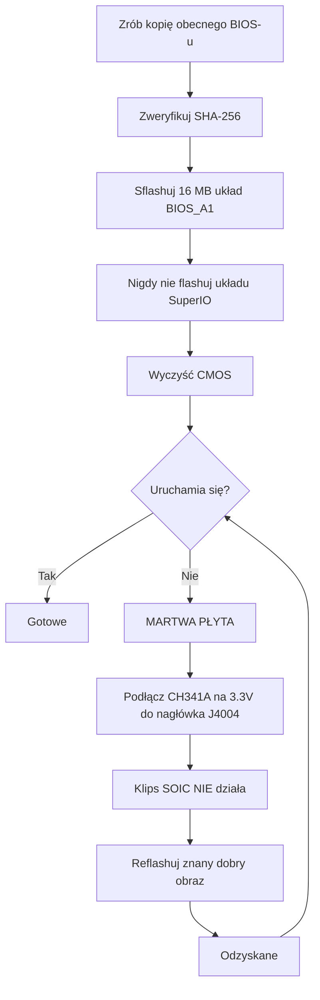

> 🌐 Tłumaczenie społecznościowe. Wersja angielska jest źródłem prawdy i może być nowsza. Znalazłeś błąd? Zgłoś to w [zgłoszeniu (issue)](https://github.com/lildebil0/awesome-bc250/issues). ([oryginał angielski](../en/08-bios.md))

# BIOS i odzyskiwanie z brick-u

> **W skrócie** — Złe ustawienie BIOS-u może **zabić BC-250 na śmierć**, a na tej płycie wyczyszczenie CMOS *nie* zawsze ją odzyskuje ([src](https://t.me/c/2424231195/54971)). Zanim cokolwiek sflashujesz, zrozum to: potrzebujesz **sprzętowego zestawu odzyskiwania** (**programatora SPI klasy CH341A + przewodów DuPont żeńsko-żeńskich**) pod ręką, bo jedynym niezawodnym odbrickowaniem jest ponowne flashowanie układu zewnętrznie przez **nagłówek J4004** płyty. Popularny mod społeczności (BIOS „death", najnowszy oparty na fabrycznym **5.00**) odblokowuje podkręcanie, timingi GDDR6 i przydział pamięci iGPU — przydatne, ale **nie wszystkie ustawienia są bezpieczne, a niektóre zabijają płytę natychmiast** ([src](https://t.me/c/2424231195/78922)). Najpierw zweryfikuj **SHA-256** każdego obrazu i przeczytaj [`assets/firmware/DISCLAIMER.md`](../../assets/firmware/DISCLAIMER.md). **Nie flashuj lekkomyślnie.**

⚠️ **To najniebezpieczniejszy rozdział w podręczniku.** Flashowanie jest destrukcyjne i nieodwracalne bez sprzętu do odzyskiwania. Jeśli nie jesteś gotów lutować/przyklejać się klipsem do układu SPI, by ożywić martwą płytę, **zatrzymaj się tutaj i uruchamiaj fabryczny BIOS.**

---

## Czym jest BIOS na BC-250

BC-250 to płyta koparkowo/serwerowa zbudowana przez AsRock, niosąca okrojone APU PS5 „Oberon". Jej firmware UEFI żyje na **16 MB układzie flash SPI** (Winbond **W25Q128** / Macronix MX25L128 w 8-pinowej obudowie SOIC). Fabryczny firmware jest mocno zablokowany: prawie nic użytecznego nie jest wystawione w Setupie. Znane fabryczne wersje widziane na czacie to **3.00** i **5.00**; zmodowane BIOS-y są przebudowane z tych (numer wersji to twoja kotwica — zawsze odnotuj, na której bazie mod jest zbudowany).

> Stock **4.00** również istnieje. Jedyną różnicą funkcjonalną między stockowym **v4.0** a **v5.0** jest to, że v5.0 domyślnie włącza **network boot**. ([src](https://discord.com/channels/1315924807128449065/1316030225338863636/1326825429595848816))

Dwa powody, dla których ludzie reflashują:

1. **By zainstalować zmodowany BIOS**, który odblokowuje ukryte menu (podkręcanie, undervolting, pamięć, VRAM iGPU).
2. **By odzyskać z brick-u** — przywrócić znany dobry obraz po złym ustawieniu lub nieudanym flashu.

> 💡 **Może w ogóle nie musisz flashować.** Jeśli twoim *jedynym* celem jest zmiana podziału VRAM/UMA, możesz to zrobić z działającego Linuksa na **fabrycznym** BIOS-ie P3.00 / P5.00 za pomocą **[fanoush/bc250_memcfg](https://github.com/fanoush/bc250_memcfg)** — bez flashowania, bez programatora, bez ryzyka brick-u ([elektricM: BIOS flashing](https://elektricm.github.io/amd-bc250-docs/bios/flashing/), [elektricM: VRAM](https://elektricm.github.io/amd-bc250-docs/bios/vram/)). Flashowanie zmodowanego BIOS-u jest potrzebne tylko dla *odblokowanych menu chipsetu* i funkcji wykraczających poza rozmiar VRAM (zobacz [09-overclock-undervolt.md](09-overclock-undervolt.md) dla polecenia `bc250_memcfg`).

---

## Zmodowany BIOS (mod „death") — co zmienia i dlaczego

Referencyjny mod społeczności jest utrzymywany przez **death** na czacie. To *nie* firmware od zera — ponownie włącza (odkrywa) opcje Setupu AMD/AMI, które fabryczny BIOS dostarcza ukryte. Śledź wersje, bo porady zmieniały się w czasie:

| Wersja moda | Baza | Wydane | Co odsłoniło / zmieniło | Status |
|---|---|---|---|---|
| **1.0** (pierwsze wydanie) | fabryczny **3.00** | 2025-06-28 | Częstotliwość GDDR6, timingi GDDR6, rozmiar pamięci UMA iGPU, częstotliwość rdzeni, napięcia | ⚠️ Złe wartości zabijają płytę, **czyszczenie CMOS nie pomogło** ([src](https://t.me/c/2424231195/54971)) |
| warianty 3.0 | 3.00 | 2025-07 → 10 | Te same odblokowania; jeden build dodał **niestandardowe logo startowe Steam** | Kosmetyczny build z logo zmirrorowany jako `bc250-Steam.rom` ([src](https://t.me/c/2424231195/86420)) |
| **mod 5.00** (obecny) | fabryczny **5.00** | 2025-10-05 | Zakładki przegrupowane; **otwarto więcej ustawień**; **ustawienia timingów RAM/GDDR6 teraz faktycznie się stosują** na tej płycie | Najnowszy; „nie wszystkie ustawienia są użyteczne, ale lepsze to niż nic" ([src](https://t.me/c/2424231195/78922)) |

Co faktycznie możesz tym nastroić (z notatek pierwszego wydania, [src](https://t.me/c/2424231195/54971)):

- **Częstotliwość GDDR6** — raportowana jako działająca przy **1800** dla jednego użytkownika (`@Haswellb`), ale *ten sam rodzaj zmiany zabił inną płytę* — wartości są specyficzne dla płyty, nie uniwersalne.
- **Timingi GDDR6** — stosują się, ale **zbyt niskie/ciasne timingi zabijają** płytę.
- **Rozmiar pamięci iGPU (UMA)** — działa i daje realny przyrost. Jeśli twoja zmiana nie zaskakuje, ustaw **IGC: Forces** i **UMA Mode: UMA_SPECIFIED** ([src](https://t.me/c/2424231195/54971); ta sama kombinacja potwierdzona przez dokumentację społeczności).
- **Częstotliwość rdzeni / napięcia** — wystawione, ale **„nietestowane"** przez autora.

> ❗ **Dwa ostrzeżenia autora, wciąż aktualne:** (1) **Nie wyłączaj Integrated Graphics** — to jedyne wyjście wyświetlania. (2) Na którymkolwiek z tych modów **złe ustawienie może zabić płytę, a reset CMOS może jej nie odzyskać** — to dokładnie dlatego potrzebujesz programatora. (Zobacz drabinkę „która wersja?" poniżej, by wybrać bazę.)

> ### Która wersja? (drabinka decyzyjna)
>
> 1. **Zmodowany P3.00 (ROM z menu chipsetu) — bezpieczny domyślny wybór.** To ustanowiony **„standard społeczności… najstabilniejszy i najlepiej przetestowany"**, zweryfikowany-publicznie ze znanym SHA-256, i już obejmuje **odblokowanie VRAM + ustawienia chipsetu**. Zacznij tutaj, chyba że masz konkretny powód, by tego nie robić ([elektricM: BIOS flashing](https://elektricm.github.io/amd-bc250-docs/bios/flashing/)).
> 2. **Zmodowany 5.00 — obecny; wybierz go, jeśli chcesz strojenia pamięci.** To najnowsza baza i ta, gdzie **ustawienia timingów RAM/GDDR6 faktycznie się stosują** na tej płycie ([src](https://t.me/c/2424231195/78922)). Wybierz go zamiast P3.00 konkretnie, gdy chcesz stroić timingi pamięci.
> 3. **`P5.00_clv` — tylko dla ekspertów.** „Odblokowuje **Wszystko**" (każde ukryte menu, w tym eksperymentalne **ReBAR / Resizable BAR** oraz ustawienia debug/chipsetu), co czyni go *„bardzo łatwym do zbrickowania płyty, jeśli zmienisz coś złego… Trzymaj się P3.00, chyba że jesteś zaawansowanym użytkownikiem."* Co gorsza, **`P5.00_clv` nie ma w żadnym publicznym repozytorium**, które przewodnik mógł znaleźć — krąży tylko jako załącznik Discord, więc **nie ma kanonicznego hasha**; jeśli musisz go użyć, zdobądź kopie od **dwóch** osób uruchamiających go niezależnie i potwierdź, że obie mają **ten sam SHA-256** przed flashowaniem ([elektricM: BIOS flashing](https://elektricm.github.io/amd-bc250-docs/bios/flashing/)).

> **Osobliwości zmodyfikowanej wersji 5.00, o których warto wiedzieć.** Jego Setup pokazuje **domyślną częstotliwość procesora 3600** — kosmetyczną wartość interfejsu, a nie faktycznie zastosowane taktowanie ([src](https://discord.com/channels/1315924807128449065/1452152658168381593/1452406964780007515)). Udostępnia on również opcję **bifurkacji PCIe `x1x1x1x1`** w ustawieniach chipsetu ([src](https://discord.com/channels/1315924807128449065/1452152658168381593/1474231812598534351)). Bądź wyjątkowo ostrożny z timingami pamięci na tej bazie: **ekstremalne wartości timingów mogą zablokować płytę do momentu zewnętrznego wgrania oprogramowania, co na P5.00 jest jeszcze bardziej dotkliwe** ([src](https://discord.com/channels/1315924807128449065/1371527281947971604/1468745940994101372)). I tak jak przy każdym wgraniu oprogramowania układowego, przejście na zmodyfikowaną wersję 5.00 może skutkować **brakiem obrazu do momentu wyczyszczenia CMOS** ([src](https://discord.com/channels/1315924807128449065/1315933088668454942/1508568321346502892)).

Istnieje też osobny **mod z menu chipsetu** (`BC250_3.00_CHIPSETMENU.ROM`) z najczęściej przywoływanego repozytorium BIOS, **[TuxThePenguin0/bc250-bios](https://gitlab.com/TuxThePenguin0/bc250-bios/)**, który wystawia **menu chipsetu / NBIO Common Options** na wierzchu fabrycznego 3.00. README tego repozytorium mówi wprost: *„Nic w tym repozytorium nie jest wspierane ani nie ma żadnej gwarancji — RÓB KOPIE ZAPASOWE."*

> 🚫 **Unikaj `Smokeless_UMAF`.** Przewodnik społeczności po podkręcaniu flaguje to narzędzie do edycji UEFI jako rzecz, której **nie należy uruchamiać na BC-250 — może spowodować trwałe uszkodzenie płyty** ([elektricM: BIOS overclocking](https://elektricm.github.io/amd-bc250-docs/bios/overclocking/)). Trzymaj się znanych dobrych ROM-ów powyżej.

---

## Zanim sflashujesz — lista kontrolna bezpieczeństwa

1. **Najpierw zrób kopię zapasową obecnego BIOS-u** (odczytaj go tym samym narzędziem, którym będziesz flashować — zobacz Ścieżkę B/odzyskiwanie). Kopia zapasowa to twoje darmowe cofnięcie.
2. **Zweryfikuj SHA-256** obrazu względem `assets/PROVENANCE.md` / posta źródłowego. Przewodnik społeczności po flashowaniu publikuje hash dla ROM-u z menu chipsetu jako
   `48fbe5d366e6a56e2fdffdca848426216ba1f083610dab63db89d2f4e6c940b5` ([dokumentacja elektricm](https://elektricm.github.io/amd-bc250-docs/bios/flashing/)).
3. **Potwierdź rozmiar układu**, nie tylko oznaczenie. 16 MB układ BIOS jest celem; **nie** flashuj małego układu SuperIO (zobacz sekcję odzyskiwania). Różne rewizje płyty mogą nieść nieco różne numery części układów — liczy się **pojemność (16 MB)**, ostatnie litery oznaczenia mogą się różnić ([src](https://t.me/c/2424231195/67880)).
4. **Miej sprzęt do odzyskiwania gotowy** *przed* pierwszym flashem, a nie po tym, jak zbrickujesz.
5. Po flashowaniu **wyczyść CMOS**, żeby nowe ustawienia (zwłaszcza przydział VRAM) zadziałały (zobacz „Po każdym flashu").



### Zweryfikuj sumę kontrolną przed flashowaniem

Krok 2 powyżej mówi, by zweryfikować SHA-256 — oto jak. Oblicz hash pliku, który masz zamiar sflashować, i porównaj go, znak po znaku, z wartością wymienioną dla tego pliku w [`assets/PROVENANCE.md`](../../assets/PROVENANCE.md).

```bash
# Linux:
sha256sum BC250_3.00_CHIPSETMENU.ROM
```

```powershell
# Windows (PowerShell):
Get-FileHash BC250_3.00_CHIPSETMENU.ROM -Algorithm SHA256
```

`PROVENANCE.md` może wymieniać tylko **pierwsze 16 znaków hex** jako krótki odcisk. Jeśli tak, sprawdź, czy twój obliczony hash **zaczyna się od** tych 16 znaków — pełne dopasowanie tego prefiksu jest już mocnym sprawdzeniem (maintainer może opublikować pełne hashe na żądanie).

**Zweryfikowane pełne hashe SHA-256** dla publicznie hostowanych obrazów (sprawdzone krzyżowo w wielu repozytoriach społeczności — każdy znany dobry plik BIOS BC-250 ma **dokładnie 16 MB / 16777216 bajtów**; inny rozmiar oznacza, że jest uszkodzony, to narzędzie/patch, albo niezwiązany plik) ([elektricM: BIOS flashing](https://elektricm.github.io/amd-bc250-docs/bios/flashing/)):

| Plik | Typ | SHA-256 |
|---|---|---|
| `BC250_3.00_CHIPSETMENU.ROM` (a.k.a. `Robin3.00`, `BC250CHIPSETMENU.ROM`) | **Zmodowany P3.00** — odblokowanie VRAM + chipset, *zalecany* | `48fbe5d366e6a56e2fdffdca848426216ba1f083610dab63db89d2f4e6c940b5` |
| `Robin5.00` | **Fabryczny** P5.00 (nie zmodowany `P5.00_clv`) | `0d6f136cb120cf3b2de26d5c4d7f255604fdbf4b9442af5ba55419b95b89aa82` |
| `BC250_3.00.ROM` | Fabryczny P3.00 | `07595ca3aecf8a4caa28a397b5298f3946a1b769f87b16f67adc369c3f69045c` |
| `BC250_2.00.bin` | Fabryczny P2.00 | `ee6150dfed33bd05ea46063a352549416fdf3f45fa0e5edac2a68ef78d71083c` |
| `P5.00_clv` | Zmodowany P5.00 (odblokuj-wszystko) | **nie istnieje publiczny hash** — tylko Discord, zweryfikuj dwie niezależne kopie jako zgodne |

> Zmodowany P3.00 pojawia się pod kilkoma nazwami plików w różnych repozytoriach (`BC250_3.00_CHIPSETMENU.ROM`, `BC250CHIPSETMENU.ROM`, `Robin3.00`) — wszystkie haszują do wartości powyżej, więc nazwa nie ma znaczenia. `Robin5.00` to **fabryczny** P5.00, *inny plik* niż zmodowany `P5.00_clv`. Publiczne źródła dla każdego (TuxThePenguin0 GitLab, forgenam, tipitochen, csabakecskemeti, scrakcho, dannybastos, kenavru, MrrZed0) są wymienione w [przewodniku flashowania elektricM](https://elektricm.github.io/amd-bc250-docs/bios/flashing/).

> 🔴 **Jeśli suma kontrolna się nie zgadza, NIE flashuj.** Niezgodność oznacza uszkodzony lub zły plik — sflashowanie go to dokładnie sposób, w jaki brickuje się płytę. Pobierz obraz ponownie i zweryfikuj jeszcze raz.

---

## Ścieżka A — Flash programowy (z płyty, bez programatora)

To normalny sposób instalacji/aktualizacji BIOS-u, gdy płyta jeszcze się uruchamia. Użyj **pendrive'a FAT32** i narzędzia aktualizacji firmware AMI.

**Metoda EFI / AFU** ([src](https://t.me/c/2424231195/54979)):

1. Sformatuj pendrive do **FAT32**.
2. Skopiuj na niego zawartość archiwum AFU (np. `AfuEfi64_5.16.zip`) **i plik BIOS**.
3. Zrestartuj BC-250 i **uruchom z pendrive'a** do powłoki EFI.
4. Uruchom:
   ```
   afuefix64.efi <filename>.<ext> /P /N
   ```
   - `/P` = programuj główny BIOS.
   - `/N` = programuj też **NVRAM**. To unika błędów przy przechodzeniu *między* wersjami (np. na 3.00 z innej wersji) — **ale wymazuje twoje zapisane ustawienia.** Możesz opuścić `/N`, ale wtedy spodziewaj się możliwych błędów. ([src](https://t.me/c/2424231195/54979))
5. Jeśli narzędzie nie widzi pliku, spróbuj `fs0:`, `fs1:`, …, by znaleźć, który to pendrive ([src](https://t.me/c/2424231195/54979)).

Niektóre buildy społeczności dostarczają gotowy skrypt `Flash.nsh` i przemianowany ROM (np. przemianuj zmodowany ROM, by pasował do skryptu), więc tylko uruchamiasz do powłoki EFI i odpalasz skrypt ([dokumentacja elektricm](https://elektricm.github.io/amd-bc250-docs/bios/flashing/)). Na Linuksie jest też build **`afulnx`** (`afulnx-5.05.04Z.tar.gz`) do flashowania z działającego systemu ([src](https://t.me/c/2424231195/54507)).

#### Kanoniczny przepis powłoki EFI (metoda `Flash.nsh` / `Robin5.00`)

Przewodnik społeczności po flashowaniu standaryzuje się na samowystarczalnym zestawie i stałej nazwie pliku — to najczęściej odtwarzana ścieżka USB ([elektricM: BIOS flashing](https://elektricm.github.io/amd-bc250-docs/bios/flashing/)):

1. **Zdobądź zestaw EFI:** `4U12G BIOS Update.zip` (z repozytorium [kenavru/BC-250](https://github.com/kenavru/BC-250)) — zawiera `AfuEfix64.efi`, `Flash.nsh` i `amdvbflash.efi`. *Dołącza też fabryczny BIOS P5.00 o nazwie `Robin5.00` — odsuń go, żebyś go nie sflashował przez przypadek.*
2. **Przygotuj pendrive FAT32 (zalecane ≤ 32 GB).** Skopiuj zawartość folderu `BIOS EFI` zestawu do **głównego katalogu**.
3. **Przemianuj swój zmodowany ROM na `Robin5.00`** (usuń rozszerzenie `.ROM`) — to dokładna nazwa, której `Flash.nsh` szuka. *(Albo edytuj `Flash.nsh`, by pasował do twojej nazwy pliku.)* Główny katalog powinien wtedy zawierać: `AfuEfix64.efi`, `Flash.nsh`, `amdvbflash.efi`, `Robin5.00` (twój przemianowany mod) i folder `EFI`.
4. **Użyj bezpośredniego monitora DisplayPort.** Aktywne/pasywne **adaptery HDMI mogą wyczernić menu BIOS-u** — znana pułapka wyświetlania na tej płycie.
5. **Odłącz wszystkie SSD/dyski**, żeby płyta automatycznie przeszła do powłoki EFI, włóż pendrive, włącz zasilanie. Wylądujesz na żółtym prompcie `Shell>`.
6. Na prompcie wpisz **`blk0:`**, potem Enter — **zwróć uwagę na spację po dwukropku** (to wybiera wolumin USB; `blk0:` to selektor udokumentowany przez elektricM, odrębny od sondowania `fs0:`/`fs1:` powyżej). Potem wpisz **`Flash.nsh`** i Enter.
7. **CZEKAJ. Nie dotykaj klawiatury, nie wyłączaj zasilania.** Jeśli *wydaje się*, że zawiesił się podczas zapisu, **czekaj co najmniej 15 minut** — wyłączenie w trakcie zapisu brickuje płytę. Restartuje się (albo poprosi cię o to), gdy skończy.
8. **Natychmiast wyłącz zasilanie i wyjmij pendrive**, żeby nie wrócił w pętli do flashera.

> 🔴 **Przed włączeniem zasilania do flashu: sprawdź okablowanie 8-pinowego zasilania PCIe** względem diagramu 12 V/GND twojego PSU. **Odwrócona polaryzacja może trwale uszkodzić płytę** ([elektricM: BIOS flashing](https://elektricm.github.io/amd-bc250-docs/bios/flashing/)).

#### Wymagane ustawienia BIOS-u po flashu (zrób to zaraz po wyczyszczeniu CMOS)

Po sflashowaniu **i** wyczyszczeniu CMOS (następna sekcja) wejdź do Setupu (waląc **Del**) i ustaw te — podział VRAM nie będzie się zachowywał poprawnie, dopóki nie będą właściwe ([elektricM: BIOS flashing](https://elektricm.github.io/amd-bc250-docs/bios/flashing/), [elektricM: BIOS VRAM](https://elektricm.github.io/amd-bc250-docs/bios/vram/)):

| Ustawienie | Ścieżka | Wartość |
|---|---|---|
| Integrated Graphics Controller | Chipset → GFX Configuration | **Forces** |
| UMA Mode | Chipset → GFX Configuration | **UMA_SPECIFIED** |
| UMA Frame Buffer Size | Chipset → GFX Configuration | **512MB** (zalecane) lub stały rozmiar |
| IOMMU | Advanced → CPU Configuration | **Disabled** |
| Boot Mode | Boot → Boot Mode | **UEFI** |

Najpierw zweryfikuj, że wyczyszczenie CMOS faktycznie zaskoczyło — **zegar powinien pokazywać zły czas**; jeśli wciąż jest poprawny, powtórz czyszczenie. Potem F10, by zapisać. Wybór `512MB` to *dynamiczna* alokacja, a nie limit 512 MB (zobacz [09-overclock-undervolt.md](09-overclock-undervolt.md)).

> ★ **Dlaczego 512 MB UMA *zwiększa* FPS (mechanizm).** Ustawienie bufora UMA na **512 MB** nie głodzi GPU — pozwala systemowi **dynamicznie balansować RAM vs VRAM** zamiast zamykać duży stały kawałek, a samemu temu rebalansowaniu przypisano realny skok FPS: Cyberpunk 2077 poszedł z **60 → 66 fps (przy OC 2 GHz) → 76 fps** pod FSR 3.0 *balanced*, 1080p, preset Steam-Deck ([Old Lamer — Part I](https://youtu.be/ohpEY2XQ_lo) ~11:21; ⚠ przybliżone — liczby przepisane z wideo, traktuj jako wynik jednego buildu). Więc „512 MB jest najlepsze" to nie tylko bezpieczne dobranie rozmiaru — mały dynamiczny bufor jest *częścią* historii wydajności, a nie kompromisem.

**Fallback flashrom** (jeśli AFU zwróci błąd) ([src](https://t.me/c/2424231195/54979), zasugerowane i przetestowane przez `@mrartemsid`):

```bash
# Read (back up):
sudo flashrom -p internal:boardmismatch=force -r <name>.bin
# Write:
sudo flashrom -p internal:boardmismatch=force -w <name>.bin
```

> ⚠️ Flashowanie programowe pomaga tylko, **dopóki płyta jeszcze przechodzi POST**. W chwili, gdy złe ustawienie ją zbrickuje, Ścieżka A znika i jesteś na ścieżce sprzętowej poniżej.

---

## Ścieżka B — Flash sprzętowy / odbrickowanie (programator SPI CH341A)

To ścieżka **odzyskiwania** i przypięty „najwygodniejszy sposób flashowania martwej płyty" ([src](https://t.me/c/2424231195/67880)). Przepisujesz bezpośrednio 16 MB układ SPI z innego PC, używając programatora SPI po USB. Używane oprogramowanie: **NeoProgrammer** (Windows) albo **flashrom** (Linux).

> 🔴 **Klips SOIC-8 NIE działa na tej płycie.** death mówi o tym wprost: *„klips na naszej płycie działa… w zasadzie wcale."* ([src](https://t.me/c/2424231195/67880)). Uwaga: `assets/firmware/DISCLAIMER.md` wspomina generycznie o „klipsie SOIC" — w praktyce musisz **podłączyć się do nagłówka J4004 na płycie zamiast tego.** To najważniejszy fakt o odzyskiwaniu w tym rozdziale.

### Pinout nagłówka J4004 (podłącz tutaj)

Płyta wystawia **nagłówek J4004 o rozstawie 2.54 mm** specjalnie do reflashowania układu SPI/BIOS. Pinout (z przypiętego zrzutu okablowania, [src](https://t.me/c/2424231195/67880)):

```
J4004
[ GND  SCLK  MOSI  UNK ]
[ VCC  CS    MISO      ]
   ^  (pin-1 marker)
```

| Pin J4004 | Sygnał | Pad CH341A |
|---|---|---|
| VCC | zasilanie 3.3 V | VDD / 3.3V |
| GND | masa | GND |
| CS | chip select | CS / SS |
| SCLK | zegar | CLK / SCK |
| MOSI | dane do układu | MOSI |
| MISO | dane z układu | MISO |

Odpowiednia **mapa kolorów W25Q128 SOIC-8 / CH341A** jest w tym samym przypiętym zrzucie — dopasuj `/CS, DO(MISO), CLK, DI(MOSI), VCC, GND` do padów CH341A `CS, MISO, CLK, MOSI, VDD, GND`. **Potrójnie sprawdź VCC i GND** przed włączeniem zasilania; ich odwrócenie zabija układ ([src](https://t.me/c/2424231195/67880)).

> **Numeracja pinów J4004 i dwa nieznane piny.** Przewodnik elektricM numeruje nagłówek VCC=1, GND=2, CS=3, SCLK=4, MISO=5, MOSI=6, z **pinami 7 i 8 nieużywanymi do flashowania — są uziemione przez rezystory 10 kΩ.** Pin 1 (VCC) jest oznaczony **strzałką `>` lub kwadratowym padem** na PCB ([elektricM: BIOS flashing](https://elektricm.github.io/amd-bc250-docs/bios/flashing/)).

> **Dokładny układ docelowy i literówka gęstości.** 16 MB część to Winbond **W25Q128JVSQ** (128 Mbit / 16 MB) albo, w niektórych partiach, Macronix **MX25L12835F**. Niektóre dokumentacje społeczności literują to z błędem jako **„25Q168" — to źle**; poprawny kod gęstości 16 MB to **128** ([elektricM: BIOS flashing](https://elektricm.github.io/amd-bc250-docs/bios/flashing/)). Jeśli flashujesz przez goły **klips SOIC-8** zamiast J4004, własna kolejność pinów układu to standardowy układ SPI: `1 CS · 2 DO · 3 WP · 4 GND · 5 DI · 6 CLK · 7 HOLD · 8 VCC` ([elektricM: BIOS recovery](https://elektricm.github.io/amd-bc250-docs/bios/recovery/)) — ale pamiętaj o ustaleniu death, że **klips ledwo działa na tej płycie**, więc preferuj J4004.

> 🙏 Zasługi: pinout J4004, reverse engineering i repozytorium obrazów zmodowanego firmware to w dużej mierze praca **Segfault** (ROM P3.00 z menu chipsetu to „mod Segfault") ([elektricM: BIOS flashing](https://elektricm.github.io/amd-bc250-docs/bios/flashing/)).

### Procedura NeoProgrammer (przypięta) ([src](https://t.me/c/2424231195/67880))

1. Podłącz programator do **J4004** przewodami żeńsko-żeńskimi wedle pinoutu. **Sprawdź okablowanie ~10×, zwłaszcza VCC i GND.** (PSU odłączony.)
2. Otwórz **NeoProgrammer**.
3. Uruchom **auto-detekcję** układu i odczytaj też oznaczenie na samym układzie.
4. **Porównaj oznaczenia.** Jeśli ostatnie litery różnią się od listy, ale **pojemność się zgadza (16 MB)**, to w porządku.
5. **Wymaż** układ.
6. **Otwórz plik BIOS** w oprogramowaniu (przeciągnij i upuść działa).
7. **Zapisz** układ.
8. **Odłącz przewody od J4004.**
9. Włącz zasilanie płyty.

### Odpowiednik flashrom (Linux), sprawdzony krzyżowo z dokumentacją społeczności

Przewodnik społeczności po flashowaniu używa programatora **CH347** i ostrzega przed tanimi płytkami CH341A z czarnym PCB (następna sekcja). Zidentyfikuj właściwy układ — celuj w **16 MB układ BIOS** (`BIOS_A1`), **nigdy** w 512 KB SuperIO (`SIO1_R`), który brickuje SuperIO, jeśli go sflashujesz ([dokumentacja elektricm](https://elektricm.github.io/amd-bc250-docs/bios/flashing/)):

```bash
# Detect / identify the chip:
sudo flashrom -p ch347_spi

# Back up the stock BIOS (twice, then diff to be sure the read is stable):
sudo flashrom -p ch347_spi -r backup_stock.bin
sudo flashrom -p ch347_spi -r backup_verify.bin

# Write the new image, then verify it read back identical:
sudo flashrom -p ch347_spi -w BC250_3.00_CHIPSETMENU.ROM
sudo flashrom -p ch347_spi -v BC250_3.00_CHIPSETMENU.ROM
```

(Użyj `-p ch341a_spi` dla CH341A albo `serprog` dla Raspberry Pi Pico, w miejsce `ch347_spi`.) ⚠ Mapowanie `ch347_spi` / `serprog` na dokładne okablowanie *tej* płyty pochodzi z przewodnika społeczności — `⚠ verify` względem swojego własnego modelu programatora.

> **Detekcja mówi ci, na którym układzie jesteś.** Jeśli `flashrom -p …` raportuje **`Winbond W25Q128…`** lub **`Macronix MX25L128…`**, jesteś na właściwym 16 MB układzie BIOS. Jeśli raportuje **`Macronix MX25L4005…` (512 KB)**, **STOP — jesteś podłączony do układu SuperIO** (`SIO1_R`); sflashowanie go brickuje sterowanie wentylatorem/czujniki. Przejdź na drugi układ ([elektricM: BIOS flashing](https://elektricm.github.io/amd-bc250-docs/bios/flashing/)). Flashuj z **PSU odłączonym od gniazdka** i rozładowanymi kondensatorami (stuknij przycisk zasilania kilka razy) — zasilanie płyty podczas flashu przez klips *nie* jest zalecane ([elektricM: BIOS recovery](https://elektricm.github.io/amd-bc250-docs/bios/recovery/)).

### Pułapka 3.3 V w CH341A (przeczytaj to albo usmażysz układ)

Wiele tanich programatorów **CH341A z czarnym PCB** napędza swoje **linie danych na 5 V, mimo że VCC to 3.3 V** — układ BIOS BC-250 to część **3.3 V**, więc 5 V na liniach danych może go uszkodzić. To znana, zmierzona usterka na niektórych płytkach (płytka Fabiana i identyczna na czacie zostały potwierdzone pomiarem napięcia) ([src](https://t.me/c/2424231195/100285)). Poprawki:

- Preferuj programator, który jest naprawdę 3.3 V na swoich liniach danych (np. **CH347**), **albo**
- Zastosuj **bezlutowniczą poprawkę CH341A 5V→3.3V linii danych**: przetnij linię zasilania USB 5 V do układu i podaj mu zamiast tego 3.3 V — zobacz [opis na sawyershepherd.org](https://sawyershepherd.org/post/solderless-ch341ab-fix-5v-to-33v-data-lines/) i [poprawkę CH341A na wej.k.vu](https://wej.k.vu/electronics/ch341a-mini-programmer-fix/) ([src](https://t.me/c/2424231195/100285)).

---

### Niskopoziomowe nagłówki, debug i krzem na płycie

Poza nagłówkiem flash J4004 powyżej płyta niesie kilka innych nagłówków i znany zestaw układów na płycie. Są one zreverse-engineerowane w dokumentacji sprzętowej elektricM i są przydatne do czyszczenia CMOS, sondowania debug, okablowania wentylatorów i potwierdzenia, który układ jest który, zanim sflashujesz. Wartości pinów przepisane dosłownie z ([elektricM: pinouts](https://elektricm.github.io/amd-bc250-docs/hardware/pinouts/)).

**CLRCMOS1 — zworka czyszczenia CMOS (3-pin).** To zworka przywoływana wszędzie w tym rozdziale jako „zewrzyj zworkę CMOS" — oto jej mapa:

| Pozycja | Zachowanie |
|---|---|
| Piny 1–2 | CR2032 zasila CMOS (domyślnie) |
| Piny 2–3 | Czyszczenie CMOS |

> 💡 Gdy [lista kontrolna po flashu](#zanim-sflashujesz--lista-kontrolna-bezpieczeństwa) i [„Po każdym flashu"](#po-każdym-flashu--wyczyść-cmos-nie-pomijaj-tego) mówią ci, by „zewrzeć zworkę CMOS na ~20 sekund", **CLRCMOS1** to ta zworka: przesuń ją z pinów 1–2 na piny 2–3, poczekaj, potem przesuń z powrotem. (Wyjęcie CR2032 na 60+ s to alternatywa.)

**TPMS1 — nagłówek debug LPC (18-pin, rozstaw 2.0 mm):**

| Pin | Sygnał | Pin | Sygnał |
|---|---|---|---|
| 1 | PCICLK | 2 | GND |
| 3 | FRAME | 4 | SMB_CLK_MAIN |
| 5 | PCIRST# | 6 | SMB_DATA_MAIN |
| 7 | LAD3 | 8 | LAD2 |
| 9 | 3V | 10 | LAD1 |
| 11 | LAD0 | 12 | GND |
| 13 | (puste) | 14 | S_PWRDWN# |
| 15 | 3VSB | 16 | SERIRQ# |
| 17 | GND | 18 | GND |

> 💡 **Pin 9 (3V) jest pod napięciem tylko, gdy płyta jest włączona** — więc działa jako sygnał detekcji „system włączony". To czyni go alternatywnym punktem czujnikowym do auto-włączania zasilania / buildów adaptera prawdziwego ATX (odsyłacz do [zworki `AUTO_PWRON` w 03-power-supply.md](03-power-supply.md)).

**J2 — nagłówek debug JTAG/HDT (20-pin, rozstaw 1.27 mm, nieobsadzony, na spodzie płyty):**

| Pin | Sygnał | Pin | Sygnał |
|---|---|---|---|
| 1 | VDDIO | 2 | TCK |
| 3 | GND | 4 | TMS |
| 5 | GND | 6 | TDI |
| 7 | GND | 8 | TDO |
| 9 | TRST_L | 10 | PWROK_BUF |
| 11 | DBRDY3 | 12 | RESET_L |
| 13 | DBRDY2 | 14 | DBRDY0 |
| 15 | DBRDY1 | 16 | DBREQ_L |
| 17 | GND | 18 | TEST19 |
| 19 | VDDIO | 20 | TEST18 |

> TEST18, TEST19 i DBRDY0 są pozostawione pływające. To **jedyny** sprzętowy interfejs reset/debug na płycie.

**I2C_HEADER1 (3-pin):** `SCL · SDA · GND`. SCL to pin **bliżej złączy zasilania**. Ta magistrala niesie **PMBUS do PMIC-ów Intersil** — punkt dostępu do telemetrii zasilania.

**CPU_FAN1 (4-pin):** `PWM · Tach · 12V · GND`.

**J4003 — nagłówek wielu wentylatorów (16-pin, 2×8, 2.54 mm):**

| Rząd 1 | 1 GND | 2 F1T | 3 F2T | 4 F3T | 5 F4T | 6 F5T | 7 DET | 8 (puste) |
|---|---|---|---|---|---|---|---|---|
| **Rząd 2** | 1 GND | 2 F1P | 3 F2P | 4 F3P | 5 F4P | 6 F5P | 7 GND | 8 GND |

Tutaj `T` = tach, a `P` = PWM, na wentylator 1–5.

> 💡 **DET (rząd 1, pin 7) jest uziemiony, gdy płyta siedzi na płycie wentylatorów / dystrybucji zasilania** — tzn. wykrywa nośnik. (Numeracja wentylatorów BIOS↔Linux jest omówiona w [06-linux.md → Czujniki i sterowanie wentylatorem](06-linux.md#czujniki-i-sterowanie-wentylatorem); nie jest tu duplikowana.)

**Krzem na płycie (BOM).** Repozytorium już nazywa `SIO1_R` i `BIOS_A1` w sekcjach flashowania, ale nigdy nie podało numerów części ani rozmiarów; ta tabela pozwala flashującemu potwierdzić, który układ jest który (16 MiB Winbond to BIOS, 512 KiB Macronix to SuperIO — zostaw go w spokoju):

| Oznaczenie | Część | Rola |
|---|---|---|
| PUA1 | Intersil ISL69247 | Główny PMIC |
| PUIO1 | Intersil ISL95712 | PMIC zasilania rdzeni |
| PUA11… | Intersil ISL99360 | Inteligentne stopnie mocy (fazy) |
| M2U2 | NXP CBTL04083B | mux PCIe x4 2:1 |
| U30 | Realtek RTL8111H | Ethernet NIC (PCIe x1) |
| SU1 | AMD 218-0844029 | chipset FCH A68H „Bolton-D2H" |
| UIO1 | Nuvoton NCT6686D | SuperIO (układ czujnika hwmon) |
| BIOS_A1 | Winbond 25Q128JVSQ | 16 MiB flash SPI = **BIOS** (flashuj TEN) |
| SIO1_R | Macronix MX25L4006E | 512 KiB flash SPI = program SuperIO (**NIE flashuj — brickuje SuperIO**) |

> Nazwany tu układ czujnika SuperIO (Nuvoton **NCT6686D**) to ten, do którego wiąże się sterownik Linuksa `nct6687`/`nct6683` — zobacz [06-linux.md](06-linux.md) dla konfiguracji czujnika/wentylatora.

**Narzędzia do oprogramowania układowego (zaawansowane).** Dwa narzędzia pojawiają się regularnie w kontekście badania obrazu:

- **`psptool`** analizuje i wyodrębnia binaria (blobs) oprogramowania układowego AMD wewnątrz zrzutu BIOS. `psptool -E bios.bin` wyświetla listę wpisów; `psptool -X -d 0 -e 1 -o firmware.bin bios.bin` wyciąga oprogramowanie układowe SMU do analizy. ([bc250-collective/amd_smu_reverse_engineering](https://github.com/bc250-collective/amd_smu_reverse_engineering))
- **`Zentool`** patchuje mikrokod procesora — na przykład w celu zastąpienia instrukcji `RDRAND`. ([AMD-BC-250/documentation #1](https://github.com/AMD-BC-250/documentation/issues/1))

---

## Secure Boot i CSM (warunki wstępne bootowania)

Dodaj te dwa do listy warunków wstępnych setupu BIOS-u — wymagane, inaczej **niestandardowe/spatchowane jądra się nie uruchomią** (patch 40-CU, patch częstotliwości itd.):

| Ustawienie | Wartość |
|---|---|
| Secure Boot | **Disabled** |
| CSM (Compatibility Support Module) | **Disabled** |

Źródło: [elektricM: boot troubleshooting](https://elektricm.github.io/amd-bc250-docs/troubleshooting/boot/).

---

## Pomysł na auto-reset „srep" (eksperymentalny — nie gotowa funkcja)

Ponieważ złe ustawienie może zbrickować płytę, a **czyszczenie CMOS tego nie naprawia**, death eksperymentował z wbudowaniem rutyny **`srep`** w BIOS, by **auto-resetować ustawienia przy bricku** — pomysł pierwotnie od `@Jacky_Fish` ([src](https://t.me/c/2424231195/60552)). Koncepcja: sprawić, by BIOS łatał swoje zmienne NVRAM/`amdsetup` z powrotem do domyślnych, opcjonalnie tylko gdy pliki wyzwalające są obecne na pendrive (żeby nie wymazywał twoich ustawień przy każdym starcie). Na stan czatu **to jeszcze nie działało** — *„płyta uparcie udaje kompletną martwą płytę i nic się nie resetuje"* ([src](https://t.me/c/2424231195/60883)). Traktuj każde twierdzenie o „samonaprawiającym się BIOS-ie" jako **nieudowodnione**; twoją prawdziwą siatką bezpieczeństwa pozostaje zewnętrzny programator. `⚠ verify` przed poleganiem na jakimkolwiek buildzie srep.

---

## Po każdym flashu — wyczyść CMOS (nie pomijaj tego)

Flashowanie BIOS-u **nie** resetuje przechowywanych ustawień, a kilka ustawień (zwłaszcza **przydział VRAM/UMA**) nie zadziała, dopóki nie wyczyścisz CMOS. Jeden użytkownik trafił dokładnie na to: BIOS pokazał nowy rozmiar VRAM i „zapisał" go, ale OS (Bazzite) wciąż raportował stary podział 4 GB RAM / 12 GB VRAM, dopóki CMOS nie został wyczyszczony ([src](https://t.me/c/2424231195/97290)). Jak wyczyścić:

- **Wyjmij baterię pastylkową CR2032 na 60+ sekund** (zalecane), **albo**
- **Zewrzyj zworkę CMOS na ~20 sekund.** ([dokumentacja elektricm](https://elektricm.github.io/amd-bc250-docs/bios/flashing/))

> Zwróć uwagę na ograniczenie: czyszczenie CMOS naprawia „ustawienia się nie zastosowały" i *łagodne* złe konfiguracje — ale na generacji modów 1.0/3.00 raportowano, że **nie** odzyskuje prawdziwej martwej płyty ([src](https://t.me/c/2424231195/54971)). Do tego zobacz Ścieżkę B.

---

## Zmirrorowane firmware

Obrazy BIOS omawiane na czacie są zmirrorowane pod `assets/firmware/` do **odzyskiwania/zachowania** (zobacz [`DISCLAIMER.md`](../../assets/firmware/DISCLAIMER.md) i zweryfikuj SHA-256 każdego pliku w `PROVENANCE.md` przed flashowaniem):

| Plik | Rozmiar | Co to jest | Źródło |
|---|---|---|---|
| `BC250_3.00.ROM` | 16 MB | Zrzut fabrycznego 3.00 | ([src](https://t.me/c/2424231195/5215)) |
| `BC250_3.00_CHIPSETMENU.ROM` | 16 MB | Mod z menu chipsetu (TuxThePenguin0) | ([src](https://t.me/c/2424231195/86395)) |
| `dump_5.00.bin` | 16 MB | Zrzut fabrycznego 5.00 | ([src](https://t.me/c/2424231195/24661)) |
| `BC250_5.00_clv.zip` | 16 MB | **Mod 5.00 death (obecny)** | ([src](https://t.me/c/2424231195/78922)) |
| `bc250_3.00_clv1.zip` | 16 MB | Pierwszy mod 3.00 death (1.0) | ([src](https://t.me/c/2424231195/54971)) |
| `bc250-Steam.rom` | 16 MB | Mod 3.0 z logo startowym Steam | ([src](https://t.me/c/2424231195/86420)) |
| `bc250 modded bios.ROM` | 16 MB | Wczesny zmodowany obraz | ([src](https://t.me/c/2424231195/30100)) |
| `my_4.0_MODED.bin` | 16 MB | Pośredni mod 4.0 | ([src](https://t.me/c/2424231195/45580)) |
| `W25Q128BV@WSON8_…BIN` | 16 MB | Surowy odczyt układu (W25Q128) | ([src](https://t.me/c/2424231195/5217)) |
| `AfuEfi64_5.16.zip` | — | Flasher AMI AFU EFI | ([src](https://t.me/c/2424231195/54979)) |
| `afulnx-5.05.04Z.tar.gz` | — | Flasher AMI AFU Linux | ([src](https://t.me/c/2424231195/54507)) |

> Nie flashuj BIOS-u PS5 (`PS5 Disk Edition … BIOS.bin`, 2 MB) ani układów 512 KB na 16 MB układ BIOS BC-250 — zły cel, zobacz ostrzeżenia o odzyskiwaniu.

---

## Źródła

- mod death — pierwsze wydanie (3.00) — https://t.me/c/2424231195/54971 · obecny (5.00) — https://t.me/c/2424231195/78922 · build z logo Steam — https://t.me/c/2424231195/86420
- Flash programowy (AFU `/P /N`, flashrom) — https://t.me/c/2424231195/54979 · afulnx — https://t.me/c/2424231195/54507
- Odbrickowanie sprzętowe (przypięte, zrzuty NeoProgrammer + okablowanie J4004) — https://t.me/c/2424231195/67880
- Pomysł na auto-reset srep — https://t.me/c/2424231195/60552 · rezultat (nie zadziałał) — https://t.me/c/2424231195/60883
- Potrzeba czyszczenia CMOS po flashu — https://t.me/c/2424231195/97290
- Pułapka linii danych CH341A 5V→3.3V — https://t.me/c/2424231195/100285 · opis poprawki — https://sawyershepherd.org/post/solderless-ch341ab-fix-5v-to-33v-data-lines/
- Najczęściej przywoływane repozytorium BIOS — [TuxThePenguin0/bc250-bios](https://gitlab.com/TuxThePenguin0/bc250-bios/) (`BC250_3.00_CHIPSETMENU.ROM`, `CHIPSETMENU.md`)
- Przewodnik społeczności po flashowaniu/odzyskiwaniu (zweryfikowana tabela SHA-256, przepis `Flash.nsh`/`Robin5.00`, selektor `blk0:`, pułapka DisplayPort/HDMI, reguła 15-min zawieszenia, pinout J4004 + piny 7/8, literówka W25Q128JVSQ/„25Q168", CH347, wartości Setupu po flashu, zasługi Segfault) — [elektricM: BIOS flashing](https://elektricm.github.io/amd-bc250-docs/bios/flashing/)
- Przewodnik po odzyskiwaniu (pinout SPI 8-pin, detekcja MX25L4005 = SuperIO, flash z PSU odłączonym, przejścia scenariuszy) — [elektricM: BIOS recovery](https://elektricm.github.io/amd-bc250-docs/bios/recovery/)
- Pinouty płyty i krzem na płycie (CLRCMOS1, TPMS1 LPC, J2 JTAG/HDT, I2C_HEADER1, CPU_FAN1, J4003 wielu wentylatorów, BOM Intersil/NXP/Realtek/Nuvoton/Winbond/Macronix) — [elektricM: pinouts](https://elektricm.github.io/amd-bc250-docs/hardware/pinouts/)
- Przewodnik VRAM (`bc250_memcfg` dobieranie rozmiaru bez flashu, wartości UMA Frame Buffer, VRAM przez parametr jądra, raportowanie Vulkan-vs-OpenGL) — [elektricM: BIOS VRAM](https://elektricm.github.io/amd-bc250-docs/bios/vram/)
- ★ 512 MB UMA → dynamiczny balans RAM/VRAM → mechanizm przyrostu FPS (Cyberpunk 60 → 66 @ OC 2 GHz → 76 fps, FSR 3.0 balanced, 1080p, preset Steam-Deck) — [Old Lamer — Part I](https://youtu.be/ohpEY2XQ_lo) ~11:21 (⚠ przybliżone, przepisane z wideo)
- Notatka o niebezpieczeństwie `Smokeless_UMAF` — [elektricM: BIOS overclocking](https://elektricm.github.io/amd-bc250-docs/bios/overclocking/)
- Narzędzie VRAM bez flashu — [fanoush/bc250_memcfg](https://github.com/fanoush/bc250_memcfg)
- Narzędzie do timingów pamięci — `Mem_Timing_Utility.zip` https://t.me/c/2424231195/55351
- Polityka mirrorowania firmware — [`assets/firmware/DISCLAIMER.md`](../../assets/firmware/DISCLAIMER.md)

> Podkręcanie/undervolting *przy użyciu* tych odblokowanych ustawień jest omówione w [09-overclock-undervolt.md](09-overclock-undervolt.md). Zmirrorowane obrazy BIOS żyją pod `assets/firmware/` z SHA-256 per-plik w `PROVENANCE.md`.
