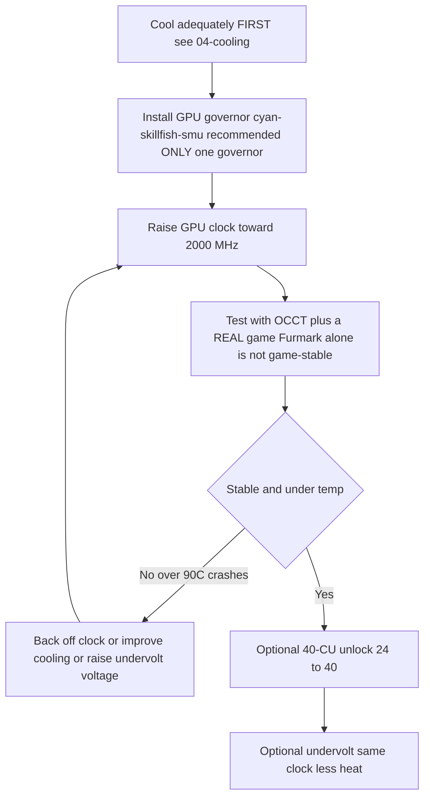

> 🌐 Tłumaczenie społecznościowe. Wersja angielska jest źródłem prawdy i może być nowsza. Znalazłeś błąd? Zgłoś to w [zgłoszeniu (issue)](https://github.com/lildebil0/awesome-bc250/issues). ([oryginał angielski](../en/09-overclock-undervolt.md))

# Podkręcanie i undervolting

> **W skrócie** — Prosto z pudełka GPU w BC-250 działa wolno (często zablokowane na **1500 MHz**, ~słabo). Poprawka społeczności to **„governor"**, który nadpisuje taktowania/napięcie: dziś rekomendowany jest **[cyan-skillfish-governor-smu](https://github.com/filippor/cyan-skillfish-governor)** (nie wymaga łatki jądra, spakowany na Arch/CachyOS/Bazzite/Fedora); **[oberon-governor](https://gitlab.com/mothenjoyer69/oberon-governor)** to oryginał i wciąż działa. Którykolwiek wybierzesz, edytujesz go, by wypchnąć GPU do **2000 MHz (~+30 % FPS)**. Nowszy zestaw narzędzi **[bc250_smu_oc](https://github.com/bc250-collective/bc250_smu_oc)** podkręca też **CPU** (rekomendowane **4 GHz @ 1275 mV**). Osobno, **[odblokowanie 40-CU](https://github.com/duggasco/bc250-40cu-unlock)** włącza ponownie **24 → 40 jednostek obliczeniowych**, które AMD wyłączyło w firmware — większy zysk dla GPU niż same taktowania (jeden przebieg Superposition skoczył **4647 → 6863** punktów, ([src](https://t.me/c/2424231195/137035))). **Wszystko to jest ciepłem. Najpierw schłodź płytę** — patrz [04-cooling.md](04-cooling.md) — bo OC bez odpowiedniego chłodzenia powoduje crash i reset płyty powyżej ~90 °C.

To jest **ostatni** krok złotej ścieżki, nie pierwszy. Najpierw zbuduj stabilną, chłodną płytę ([06-linux.md](06-linux.md), [04-cooling.md](04-cooling.md)), zanim cokolwiek z tego ruszysz. Wszystko tutaj jest „na własne ryzyko" — społeczność powtarza to nieustannie ([src](https://t.me/c/2424231195/106844)).

---

## Cztery dźwignie (i ile każda jest warta)

BC-250 ma **cztery** niezależne rzeczy, które możesz stroić. Sumują się:

| Dźwignia | Narzędzie | Typowy zysk | Koszt ciepła |
|-------|------|--------------|-----------|
| **Taktowanie GPU** 1500 → 2000 MHz | „governor" (cyan-skillfish-smu / oberon) | **~+30 % FPS** przy ograniczeniu GPU | wysoki |
| **Undervolting GPU** przy stałym taktowaniu | ten sam „governor" | te same FPS, **dużo chłodniej** | *ujemny* (mniej ciepła) |
| **Taktowanie CPU** 3.5 → 4.0 GHz | `bc250_smu_oc` | pomaga w grach ograniczonych przez CPU | wysoki |
| **Odblokowanie 40-CU** 24 → 40 CU | `bc250-40cu-unlock` | **do ~+48 %** pracy GPU | wysoki |

Dwa szczere zastrzeżenia z czatu, zanim zaczniesz:

- **Większość gier na BC-250 jest ograniczona przez CPU, nie przez GPU.** Wypchnięcie GPU z 2000 → 2229 MHz dało jednemu testerowi *1 fps* w Shadow of the Tomb Raider (90 → 91), podczas gdy pobór mocy i temperatury skoczyły mocno — więc nagłówkowe „+30 %" trafia tylko w garstkę tytułów, gdzie GPU jest wąskim gardłem ([src](https://t.me/c/2424231195/67029)).
- **Ciepło skaluje się gorzej niż wydajność.** Ten sam tester: 2000 MHz @ 960 mV = **75 °C** w teście obciążeniowym; 2229 MHz @ 1030 mV = **93 °C** — i wycofał się, bo jego zasilacz i chłodzenie nie dawały rady tego utrzymać ([src](https://t.me/c/2424231195/66972), [src](https://t.me/c/2424231195/67029)).

> ⚠️ **Próg bezpieczeństwa.** Throttling zaczyna się ok. **85 °C**, a płyta twardo się zawiesza / resetuje ok. **90 °C** (patrz [04-cooling.md](04-cooling.md)). Jeśli przekroczysz ~85 °C pod obciążeniem, jesteś *poza* swoim budżetem chłodzenia — obniż taktowanie albo zastosuj undervolting, nie pchaj wyżej.



---

## Krok 1 — taktowanie i undervolting GPU: „governor"

Sterownik amdgpu w BC-250 nie udostępnia normalnego podkręcania przez sysfs. Rozwiązaniem społeczności jest **„governor"** — mały demon, który zapisuje stany taktowania/napięcia bezpośrednio. Dla nowej instalacji dziś rekomendowany jest **cyan-skillfish-governor-smu**; **oberon-governor** to oryginał i wciąż działa (zachowany niżej jako ugruntowana alternatywa).

<p align="center"></p>
<sub>📈 Edytowalne źródło: <a href="../../assets/diagrams/gpu-clock-tradeoff.drawio">gpu-clock-tradeoff.drawio</a> (otwórz w <a href="https://draw.io">draw.io</a>). Zielony = zysk, czerwony = koszt.</sub>

### cyan-skillfish-governor-smu (rekomendowany)

[filippor/cyan-skillfish-governor](https://github.com/filippor/cyan-skillfish-governor), gałąź SMU — steruje taktowaniem/napięciem przez **wywołania firmware SMU**, więc **nie wymaga łatki częstotliwości jądra na żadnej dystrybucji**, jest aktywnie utrzymywany i spakowany na każdej dużej dystrybucji. Dodaje też kontrolę **profilu mocy kontrolera pamięci**, co obniża bezczynne TDP do **~30–35 W** (chłodniej i ciszej w bezczynności) ([src](https://t.me/c/2424231195/125821)).

**Instalacja (spakowany na każdej dużej dystrybucji)** — COPR `filippor/bazzite` (Fedora/Bazzite) albo AUR `cyan-skillfish-governor-smu` (Arch/CachyOS); Debian/Ubuntu używa tarballa z wydania + `sudo ./scripts/install.sh`:

```bash
# Fedora / Bazzite (COPR):
sudo dnf copr enable filippor/bazzite
sudo dnf install cyan-skillfish-governor-smu        # rpm-ostree install … on Bazzite
sudo systemctl enable --now cyan-skillfish-governor-smu.service

# Arch / CachyOS (AUR):
paru -S cyan-skillfish-governor-smu                  # or: yay -S …
sudo systemctl enable --now cyan-skillfish-governor-smu.service
```

Gałąź SMU można też zbudować ze źródeł przez `cargo build --release`. **Ustaw swoje taktowanie i napięcie** w `/etc/cyan-skillfish-governor-smu/config.toml` (schemat niżej) — by przejść ze słabego domyślnego do złotego środka społeczności, podnieś górny bezpieczny punkt w kierunku **2000 MHz** i kręć napięciem w dół, aż będzie stabilnie (patrz undervolting niżej); zrestartuj usługę po każdej edycji.

> **Sprawdź, że zadziałało.** Obserwuj na żywo taktowania/temperatury przez `amdgpu_top`, MangoHud albo LACT, gdy obciążasz GPU. Jeśli taktowania zostają na ~1500 MHz, usługa nie działa albo twoja konfiguracja się nie sparsowała — `sudo systemctl status cyan-skillfish-governor-smu`.

> Uruchamiaj **jeden** „governor" naraz — jeśli wcześniej uruchamiałeś oberon, wyłącz go przed włączeniem cyan-skillfish, bo będą walczyć o te same rejestry.

> 🔇 **Strojenie pod cichą salonową konsolę.** Wyciągnięcie maksimum (2000 MHz GPU / 4000 MHz CPU) niewiele daje w grach ograniczonych przez CPU, a kosztuje dużo ciepła, hałasu wentylatora i watów. Raport społeczności z r/BC250Gaming (Reddit) wykazał, że zrównoważone **~1600 MHz GPU / ~3500 MHz CPU** daje dużo lepszą wydajność-na-hałas-na-wat dla codziennego grania — niemal bezgłośnie i chłodno, z FPS, który się trzyma, bo i tak większość tytułów nie jest ograniczona przez GPU (patrz zastrzeżenie o ograniczeniu przez CPU wyżej). Jeśli zależy ci bardziej na cichym, chłodnym pudełku niż na rekordach w benchmarkach, ustaw to jako sufity „governora" zamiast maksimum.

### oberon-governor (oryginał — wciąż działa)

[mothenjoyer69/oberon-governor](https://gitlab.com/mothenjoyer69/oberon-governor) — demon w C++, pierwszy „governor" dla BC-250 i najlepiej przetestowany; wciąż działa, ale w przeciwieństwie do „governora" SMU polega na łatce jądra rozszerzającej częstotliwość (albo na dystrybucji, która ją dostarcza), by osiągnąć górne taktowania. Według jego README zależy od **CMake, zestawu narzędzi C++ i libdrm** oraz jest **testowany tylko na ASRock BC-250**. Wiele dystrybucji dostarcza go prekompilowanego (Arch AUR, Fedora COPR, obrazy Bazzite), więc budowanie ze źródeł jest potrzebne tylko, gdy twoja dystrybucja nie ma paczki.

**Budowanie ze źródeł** (zgodne z odtworzoną sekwencją z czatu, ([src](https://t.me/c/2424231195/54666)) i standardowym przepływem CMake z repo):

```bash
# Dependencies (Arch example — adjust per distro)
sudo pacman -S --needed base-devel cmake pkgconf make libdrm glibc linux-api-headers

git clone https://gitlab.com/mothenjoyer69/oberon-governor.git && cd oberon-governor
sudo cmake . && sudo make && sudo make install
sudo systemctl enable --now oberon-governor.service
```

> Jeśli `cmake` zgłasza błąd, poprawka z czatu polegała po prostu na zainstalowaniu brakujących zależności budowania i ponownym uruchomieniu: `sudo pacman -S pkgconf cmake`, a potem przebudowanie ([src](https://t.me/c/2424231195/54666)).

**Ustaw swoje taktowanie i napięcie.** oberon czyta konfigurację YAML:

```bash
sudo nano /etc/oberon-config.yaml      # adjust min/max frequency and voltage
sudo systemctl restart oberon-governor # apply
```

Plik pozwala ustawić **maksymalne i minimalne napięcie oraz częstotliwość** dla stanów GPU (zgodnie z README repo). Podnieś maksymalną częstotliwość w kierunku **2000 MHz** i kręć napięciem w dół, aż będzie stabilnie. Restartuj usługę po każdej edycji. Aby później przejść na „governora" SMU: zatrzymaj+wyłącz+usuń `oberon-governor`, `rm /etc/oberon-config.yaml`, potem zainstaluj i włącz usługę SMU.

#### TT vs SMU — dwa warianty cyan-skillfish

> Rekomendowany build SMU powyżej to jeden z **dwóch** wariantów cyan-skillfish. SMU jest domyślny; wariant TT to alternatywa dla każdego, kto konkretnie chce drogi z łatką jądra / sysfs ([elektricM: governor](https://elektricm.github.io/amd-bc250-docs/system/governor/)):

> **`perf_profile` — poziom kontrolera pamięci / Infinity Fabric (niezależny od krzywej GPU).** SMU udostępnia indeks profilu wydajności `0–3`: **3** to najwyższa wydajność kontrolera pamięci / Infinity Fabric, podczas gdy **1** to zalecany profil niskiego poboru mocy dla najniższego punktu bezczynności. Governor automatycznie wymusza wartość **3** zawsze, gdy obciążenie procesora przekroczy `cpu-load-target.upper`. ([bc250-collective/cyan-skillfish-governor](https://github.com/bc250-collective/cyan-skillfish-governor))

| Wariant | Usługa | Jak ustawia taktowania | Łatka jądra? | Wydany / uwagi |
|---|---|---|---|---|
| **SMU** *(rekomendowany)* | `cyan-skillfish-governor-smu` | **wywołania firmware** SMU | **Nie — działa na każdej dystrybucji bez łatki** | 2026-01-18; osiąga 2300+ MHz; CPU ~0.9–1.3 % |
| **TT** (alternatywa) | `cyan-skillfish-governor-tt` | sysfs | **Tak** (wbudowany w Bazzite) | świadomy throttlingu termicznego; osiąga 2175+ MHz |

> **Zmiana nazwy usługi (2025-12-13):** filippor przemianował `cyan-skillfish-governor` → `cyan-skillfish-governor-tt`, a katalog konfiguracji przeniósł się `/etc/cyan-skillfish-governor/` → `/etc/cyan-skillfish-governor-tt/`. Jeśli aktualizujesz, skopiuj swój stary `config.toml` ([elektricM: governor](https://elektricm.github.io/amd-bc250-docs/system/governor/)). Wariant TT jest spakowany w tym samym COPR/AUR (`cyan-skillfish-governor-tt`) i wbudowany w Bazzite.

> 🔴 **700 mV to twardy próg.** Ustawienie *minimalnego* napięcia GPU „governora" poniżej **700 mV blokuje GPU z powrotem na 1500 MHz** — niweczy to cały sens. Trzymaj minimalne napięcie ≥ 700 mV w każdym „governorze" ([elektricM: governor](https://elektricm.github.io/amd-bc250-docs/system/governor/), [elektricM: BIOS overclocking](https://elektricm.github.io/amd-bc250-docs/bios/overclocking/)).

> 🔴 **~1100–1129 mV to sufit — odpowiednik progu 700 mV.** Nie pchaj *maksymalnego* napięcia GPU „governora" ponad fabryczny szczyt `OD_RANGE` wynoszący **1129 mV**; powyżej to **ryzyko degradacji krzemu bez zysku stabilności**. Konserwatywny sufit dla chłodzenia powietrzem leży ok. **1100 mV (powyżej wysokie ryzyko)**, a tylko chłodzenie cieczą uzasadnia najwyższy poziom **1125 mV** (tabela niżej). Jeśli krzywa potrzebuje więcej niż ~1129 mV, by być stabilna, prawdziwą poprawką jest *chłodzenie lub niższe taktowanie*, nie więcej woltów ([elektricM: BIOS overclocking](https://elektricm.github.io/amd-bc250-docs/bios/overclocking/)).

> **Sprawdź, że celujesz we właściwy GPU.** „Governor" może sterować `card0` lub `card1` w zależności od twojego systemu — `ls /sys/class/drm/ | grep card`. Jeśli ustawienia się nie aplikują, być może musisz wskazać konfiguracji właściwą kartę. Na Arch/CachyOS „governor" czasem nie aktywuje się, dopóki GPU nie zostanie pierwszy raz użyte — uruchom raz grę/benchmark po starcie ([elektricM: governor](https://elektricm.github.io/amd-bc250-docs/system/governor/)).

#### Schemat konfiguracji cyan-skillfish-smu (TOML oparty na sekcjach)

Gałąź `smu` używa schematu **opartego na sekcjach**, a **nie** starszej tablicy `safe-points = [...]` — każdy punkt krzywej to własna tabela `[[safe-points]]`. Kluczowe pola ([elektricM: governor](https://elektricm.github.io/amd-bc250-docs/system/governor/)):

```toml
# /etc/cyan-skillfish-governor-smu/config.toml
[timing.intervals]
sample = 500          # µs; raise (e.g. 1000) to cut CPU overhead, keep adjust = sample*400
adjust = 200_000
[gpu-usage]
fix-metrics = true    # fixes the MangoHud "655 %" GPU-usage bug on BC-250
method  = "busy-flag"
[gpu]
set-method = "smu"    # "smu" or "kernel"
[load-target]
upper = 0.80          # fractions, not percents
lower = 0.65
[temperature]
throttling = 85       # °C
throttling_recovery = 75

[[safe-points]]
frequency = 1000
voltage   = 800
[[safe-points]]
frequency = 2000
voltage   = 1000      # gaming
[[safe-points]]
frequency = 2200
voltage   = 1000      # many boards hold a flat 1000 mV here; bump per-board only if it crashes
```

> **Kolejność strojenia przy niestabilności: chłodzenie → częstotliwość → *potem* napięcie.** Na fabrycznym chłodzeniu prawdziwą przyczyną prawie zawsze jest ciepło (95 °C+). Obniż górne bloki `[[safe-points]]`, by ograniczyć częstotliwość, zanim dodasz napięcie; tylko jeśli temperatury są w porządku, a wciąż się zawiesza przy 2150–2200 MHz, podbij **tylko górny punkt** o +15–25 mV. Powyżej ~1075 mV przy 2200 MHz dodajesz już tylko ciepło — zamiast tego obniż częstotliwość ([elektricM: governor](https://elektricm.github.io/amd-bc250-docs/system/governor/)).

> **Czarny ekran przy resecie GPU, specyficzny dla „governora".** Jeśli GPU się zawiesi *podczas gdy „governor" aktywnie zapisuje sysfs*, reset nie może się dokończyć i dostajesz trwały czarny ekran (system wciąż żywy po SSH), wymagający twardego restartu. Obejście: `systemctl stop` „governora" przed znanymi z crashy grami; prawdziwa poprawka to stabilna krzywa ([elektricM: governor](https://elektricm.github.io/amd-bc250-docs/system/governor/)).

##### Jak „governor" SMU przebija 2230 MHz — i czemu dostarczany jest wyłączony

Ponieważ gałąź SMU rozmawia z firmware SMU bezpośrednio, a nie przez amdgpu `OD_RANGE`, może **przekroczyć twardy limit Oberona 2230 MHz** — jeden przewodnik podkręcił go do **≈2700 MHz** na pojedynczej płycie ([Old Lamer — Part XII](https://youtu.be/Chzxaryjncs)). Dokładnie ten zapas jest powodem, dla którego filippor dostarcza go ostrożnie:

> 🔴 **Domyślna konfiguracja „governora" SMU może dać czarny ekran przy starcie — więc jest dostarczany BEZ auto-startu.** filippor celowo zostawia usługę wyłączoną po instalacji, by zła domyślna krzywa nie zablokowała cię przy starcie; dostajesz szansę, by **wpierw nastroić i przetestować krzywą, potem `systemctl enable`** ją, gdy jest stabilna na twojej płycie. Włącz ją *zanim* zwalidujesz krzywą, a czarny ekran przy następnym starcie jest na twoje konto ([Old Lamer — Part XII](https://youtu.be/Chzxaryjncs)). *(⚠ wartości auto-podpisane — traktuj dokładne MHz jako przybliżone.)*

W przeciwieństwie do twardego spadku częstotliwości Oberona przy przegrzaniu, „governor" SMU **stopniowo rampuje w kierunku celu temperaturowego**. Przewodnik ujawnia też dodatkowe pola `config.toml` poza schematem powyżej ([Old Lamer — Part XII](https://youtu.be/Chzxaryjncs)):

```toml
# extra tuning knobs shown in the Part XII walkthrough
[ramp-rates]
normal = 1
burst  = 50
[gpu-usage]
burst-samples = 60
down-events   = 5
[frequency-thresholds]
adjust = 10
[temperature]
throttling_recovery = 80
```

> ⚠️ **Eksperymentalna 16-punktowa krzywa autora dla powietrza — NIE rekomendowana, przekracza sufit powietrzny tego przewodnika.** Autor Części XII uruchomił tę krzywą na powietrzu, ale jej górne punkty (2333–2400 MHz przy 1120–1150 mV) leżą **powyżej konserwatywnych limitów dla chłodzenia powietrzem udokumentowanych w Kroku 3** (≈2230 MHz / 1060 mV na powietrzu; 1125 mV to poziom *tylko dla cieczy*). Pokazana dla odniesienia, nie jako cel — na powietrzu zatrzymaj się tam, gdzie mówi tabela klas chłodzenia z Kroku 3:
>
> ```toml
> # ⚠ author-experimental, air-cooled — DO NOT copy blindly (exceeds the air ceiling)
> # frequency (MHz) @ voltage (mV)
> 1000@800,  1175@850,  1500@900,  1700@920,
> 2000@960,  2100@1000, 2150@1035, 2200@1050,
> 2250@1070, 2300@1090, 2333@1120, 2400@1150
> ```
>
> Na szczycie tej krzywej **2.4 GHz pobierało ~30 A ≈ 360 W** — na tyle, że potrzebuje **podwójnego Molex / drugiego zasilania płyty** ([03-power-supply.md](03-power-supply.md)), nie pojedynczego złącza. Superposition skalował **≈4200 przy 2.2 GHz → ≈4500 przy 2.4 GHz** ([Old Lamer — Part XII](https://youtu.be/Chzxaryjncs)). *(⚠ wszystkie wartości auto-podpisane — przybliżone.)*

#### Łatka jądra dla zakresu częstotliwości GPU (tylko dla TT / ręcznego sysfs)

Fabryczny zakres GPU sterownika amdgpu to **1000–2000 MHz**; jednolinijkowa łatka sterownika (autorstwa **ViRazY**, `linux-6.12-bc250-freq.mypatch`, ~**639 bajtów**, testowana na jądrach **6.12 / 6.15 / 6.16.x**) poszerza go do **350–2230 MHz** (350 MHz głębokiej bezczynności oszczędza moc; górny koniec umożliwia podkręcenia 2230+). **Bazzite, PikaOS i jądra Arch AUR dostarczają go już z łatką**, a **„governor" SMU całkowicie omija jej potrzebę** dzięki wywołaniom firmware — więc łatasz ręcznie tylko, jeśli chcesz „governora" TT albo surowego OC przez sysfs z rozszerzonym zakresem na dystrybucji bez łatki. Zweryfikuj przez `cat …/pp_od_clk_voltage` (powinno pokazać 350–2230). **Nie** używaj łatki rozszerzającej napięcie (600–1300 mV) — zbędna i ryzykowna ([elektricM: BIOS overclocking](https://elektricm.github.io/amd-bc250-docs/bios/overclocking/)).

> 🔧 **Surowy undervolting przez sysfs (jednorazowe sondowanie).** Dla szybkiego sprawdzenia stabilności punktu bez „governora", zapisz punkt krzywej napięcia wprost do sysfs (format `vc <level> <MHz> <mV>`) i zatwierdź go ([elektricM: BIOS overclocking](https://elektricm.github.io/amd-bc250-docs/bios/overclocking/)):
> ```bash
> echo "vc 0 2100 1025" | sudo tee /sys/class/drm/card0/device/pp_od_clk_voltage   # set point: 2100 MHz @ 1025 mV
> echo "c" | sudo tee /sys/class/drm/card0/device/pp_od_clk_voltage                # commit
> ```
> To tylko do szybkiego sondowania — nie przeżywa restartu. `config.toml` „governora" to rekomendowana **trwała** droga; użyj surowego sysfs, by znaleźć stabilne napięcie dla punktu, a potem wpiecz je w krzywą „governora".

#### PS5GPU-BC250 — kontroler GUI (bez plików konfiguracyjnych)

Wolisz GUI? **[ZEROAESQUERDA/PS5GPU-BC250](https://github.com/ZEROAESQUERDA/PS5GPU-BC250)** to aplikacja Qt (KDE/GNOME), która reguluje min/max częstotliwość i napięcie GPU, ustawia limit temperatury i oferuje automatyczny 4-stopniowy boost lub sterowanie ręczne — w stylu MSI Afterburner, bez łatek jądra czy edycji TOML. **Najpierw wyłącz każdego działającego „governora"** (cyan-skillfish-smu/tt albo oberon) albo będą w konflikcie ([elektricM: governor](https://elektricm.github.io/amd-bc250-docs/system/governor/)).

---

## Krok 2 — podkręcanie CPU i właściwy undervolting: `bc250_smu_oc`

Wydany **2025-12-30** przez bc250-collective (przez reverse-engineering SMU), [bc250_smu_oc](https://github.com/bc250-collective/bc250_smu_oc) to narzędzie, które wreszcie pozwala dotknąć taktowania i napięcia **CPU** (rdzenie Zen 2), nie tylko GPU. Autorzy rekomendują **4 GHz @ 1275 mV** jako optimum stabilności/ciepła i dostarczają to jako przykład w repo ([src](https://t.me/c/2424231195/106844)).

**Instalacja i użycie** (dosłownie z README repo):

```bash
# Prerequisite: install the `stress` CPU load tool from your package manager
git clone https://github.com/bc250-collective/bc250_smu_oc.git
cd bc250_smu_oc
pip install .        # or: pipx install .

# Detect / test a target (CPU 4 GHz at 1275 mV), keep it applied:
bc250-detect --frequency 4000 --vid 1275 --keep

# Once you've found a stable config, install it and enable at boot:
bc250-apply --install overclock.conf
sudo systemctl enable --now bc250-smu-oc
```

> 🔴 **Twardy limit napięcia.** Według repo: nigdy nie pozwól, by napięcie rdzenia CPU (**Vid**) przekroczyło **1.325 V** w żadnych okolicznościach — degradacja krzemu zaczyna się powyżej ~1.35 V ([src](https://t.me/c/2424231195/115726)). Oraz: **podnoszenie częstotliwości CPU bez undervoltingu pozwala Vid skalować się bez ograniczenia i może zniszczyć sprzęt** — zawsze paruj podbicie taktowania z celem napięcia.

Dlaczego 4 GHz to sufit: AMD uważa do ~4 GHz za bezpieczne dla tego krzemu; BIOS zestawu desktopowego 4700S nawet bootuje turbo na 4000 MHz / 1.35 V prosto z pudełka. Zen 2 *zazwyczaj* sięga ~4200, ale te układy to **krzem odrzutowy z koparek**, więc 4200 tylko „jeśli będziesz mieć dużo szczęścia" ([src](https://t.me/c/2424231195/115726)).

> ❓ **Czy mogę odblokować CPU do 8 rdzeni?** Krótka odpowiedź: **nie — obecnie nie, i tak by nie pomogło.** BC-250 dostarczany jest z 6 z 8 aktywnych rdzeni Zen 2; raporty społeczności z r/BC250Gaming opisują pozostałe dwa jako **zablokowane programowo przez eFuse'y odczytywane przez SMU** (binning jest w dużej mierze sztuczny — decyzja z ery koparek), *nie* fizycznie odcięte. Ale ich odblokowanie oznaczałoby **obejście weryfikacji podpisu PSP i modyfikację mikrokodu SMU**, a próby społeczności (na Discordzie) **się nie powiodły**. Nawet gdyby ktoś to zrobił, zysk dla grania byłby **marginalny**: BC-250 jest ograniczony przez **słabą wydajność jednowątkową, małą fragmentowaną pamięć podręczną L3 2×4 MB i FPU tylko AVX2 / okrojone** — dodanie rdzeni nie podnosi ani FPS, ani rzeczy, na które ten układ jest faktycznie zagłodzony. Nie goń za tym ([raporty społeczności r/BC250Gaming](https://www.reddit.com/r/BC250Gaming/)).

> Przypięty post `bc250_smu_oc` może też **zastąpić** twojego „governora" GPU (ma własną usługę `bc250-smu-oc`). Nie uruchamiaj dwóch „governorów" naraz.

**Zweryfikowane skalowanie OC CPU** (Fedora 43, jądro 6.19.8; auto-strojone napięcie; 7-zip MIPS; z krzywą wentylatora opartą na temperaturze) ([elektricM: governor](https://elektricm.github.io/amd-bc250-docs/system/governor/)):

| Częst. | Auto Vid | 7-zip MIPS | Temp. (pełne obciążenie) | vs fabryka |
|---|---|---|---|---|
| 3500 (fabryka) | auto | 26,062 | 60 °C | bazowa |
| 3600 MHz | 1150 mV | 26,518 | 65 °C | +1.7 % |
| 3700 MHz | 1199 mV | 27,212 | 68 °C | +4.4 % |
| 3800 MHz | 1250 mV | 27,919 | 72 °C | +7.1 % |
| 3900 MHz | 1275 mV | 28,410 | 75 °C | +9.0 % |
| 4000 MHz | — | dławi przy PWM 80 | 77 °C | ❌ (potrzeba więcej chłodzenia/wentylatora) |

Flagi narzędzia: `bc250-detect -f <MHz> -v <mV>`, by testować, dodaj **`-k`**, by zachować OC po wyjściu narzędzia, **`-c <path>`**, by zapisać konfigurację. Uczyń to trwałym przez `bc250-apply -a -i /etc/bc250-overclock.conf`, potem `systemctl enable bc250-smu-oc`. Autorzy: **mrfrakes & dantistnfs** (reverse-engineering SMU) ([elektricM: governor](https://elektricm.github.io/amd-bc250-docs/system/governor/), [elektricM: BIOS overclocking](https://elektricm.github.io/amd-bc250-docs/bios/overclocking/)). Zauważ, że **4000 MHz dławiło przy fabrycznym PWM 80 wentylatora** — sufit jest ograniczony chłodzeniem, zgodnie z uwagą powietrze-vs-woda powyżej.

#### Jak `bc250-detect` faktycznie szuka (i sufit napięcia, który egzekwuje)

Wideo-przewodnik po tym samym narzędziu pokazuje mechanikę auto-wyszukiwania: **rampuje w górę od 3.5 GHz krokami 100 MHz / 25 mV**, uruchamiając **~300 s test obciążeniowy** na każdym kroku i awansuje tylko, jeśli przejdzie — np. `bc250-detect -f 3850 -v 1150 -k`, by przetestować 3.85 GHz @ 1150 mV i zachować. Na Bazzite instalacja to `sudo rpm-ostree install stress pipx`, potem `pipx install .` ([Old Lamer — Part VIII](https://youtu.be/ciDpPhoioKM)).

> ⚠️ **Dwa sufity napięcia — zwróć uwagę na oba, są niezgodne.** Wideo Części VIII podaje **twardy sufit 1300 mV** dla Vid CPU, co jest **bardziej konserwatywne** niż udokumentowany w repo limit **1.325 V** użyty powyżej. Nie zaprzeczają komunikatowi bezpieczeństwa (trzymaj się daleko poniżej ~1.35 V), ale *dokładna* liczba różni się zależnie od źródła — w razie wątpliwości weź niższą (1300 mV) jako swój roboczy cap i nigdy nie przekraczaj 1.325 V ([Old Lamer — Part VIII](https://youtu.be/ciDpPhoioKM)). *(⚠ wartość 1300 mV jest auto-podpisana.)*

W tym przebiegu **4 GHz @ 1225 mV przeszło krótki szybki test, ale crashowało w grze**, więc autor cofnął się do stabilnych **3.85 GHz @ 1150 mV** — ten sam wzorzec „4 GHz szybko przechodzi, zawodzi przy podtrzymaniu", który pokazuje tabela elektricM ([Old Lamer — Part VIII](https://youtu.be/ciDpPhoioKM)). *(⚠ ASR — wartości przybliżone.)*

**Pełne skalowanie CPU+GPU (Horizon Zero Dawn, 1080p Ultra, natywnie, 1× Arctic P12 Pro ~2200 obr./min).** Jedno wideo nakłada każdą dźwignię i mierzy wynik w grze, co jest najjaśniejszą demonstracją, czemu ta płyta jest **ograniczona przez CPU**: GPU chętnie renderuje ~88–90 fps długo, zanim CPU jest w stanie je nakarmić ([Old Lamer — Part X](https://youtu.be/1hgSQxf6RXE)). *(⚠ wszystkie fps/°C auto-podpisane — traktuj jako ≈.)*

| Krok (skumulowany) | Takt. GPU @ mV | Takt. CPU @ mV | fps w grze | fps możliwe na GPU | Temp. CPU / GPU |
|---|---|---|---|---|---|
| Fabryczny undervolt | 1500 @ 850 | 3.5 G @ 1020 | **≈62** | — | 53 / 51 °C |
| + OC GPU | 2000 @ 960 | 3.5 G @ 1020 | **≈69** | 81 | 64 / 63 °C |
| + OC CPU | 2000 @ 960 | 3.85 G @ 1155 | **≈72** | — | 65 / 64 °C |
| + OC GPU | 2200 @ 1030 | 3.85 G @ 1155 | **≈74** | 88 | ~70 °C |
| + OC CPU | 2200 @ 1030 | 4.0 G @ 1270 | **≈76–77** | 88 | 72 / 68 °C |
| + mitygacje wył. | 2200 @ 1030 | 4.0 G @ 1270 | **≈80** | 90 | — |

**Razem: ≈62 → ≈80 fps (~+29 %), i jest twardo ograniczone przez CPU** — GPU renderuje wewnętrznie 88–90 fps, podczas gdy CPU ogranicza grywalną liczbę do ok. 80. Uwagi z tego samego przebiegu ([Old Lamer — Part X](https://youtu.be/1hgSQxf6RXE)):

- **4 GHz potrzebuje tu ~1270 mV**, inaczej płyta daje zielony ekran — sparowanie taktowania z wystarczającym Vid jest obowiązkowe (echo reguły „nigdy nie podnoś częstotliwości bez undervoltingu" powyżej).
- **`bc250_smu_oc` ma wbudowany auto-throttle ~90 °C**, więc samo narzędzie cofa się przed temperaturą twardego crasha płyty.
- **mitigations=off dało tylko ≈+3 fps** (kernelowe mitygacje podatności CPU); małe, opcjonalne ostatnie wyciśnięcie.
- **Niestandardowe timingi pamięci nie dały tu zysku i niosą ryzyko zabicia** — pomiń je (patrz sekcja GDDR6 niżej).
- **3.85 GHz @ 1155 mV nazywane jest złotym środkiem CPU** — zgodnie z tabelą 7-zip elektricM, gdzie 4 GHz dławi na fabrycznym chłodzeniu.
- Przy końcowym OC płyta działała w **1440p Ultra natywnie @ 60** oraz **4K + FSR blisko 60** ([Old Lamer — Part X](https://youtu.be/1hgSQxf6RXE)).

> 📊 **Bazowe liczby FurMark dla fabryki dla zdrowego rozsądku (inny przebieg).** Osobny przewodnik zalogował FurMark przy **fabrycznym FHD ≈4085 punktów / 67 fps**; podniesienie GPU **1500 → 2000 MHz dało ~+30 % (≈5340 punktów / 87 fps)**, podczas gdy **2229 MHz nie dało prawie nic i działało >90 °C** (throttle). Reguła kciuka z tego wideo: **„<80 °C w FurMark + stress CPU ⇒ <70 °C w grach"**, oraz **FurMark Vulkan grzeje układ bardziej niż ścieżka GL** ([Old Lamer — Part IV](https://youtu.be/YuBmGF536II)). *(⚠ ASR — przybliżone.)*

#### Skalowanie częstotliwości CPU wymaga poprawki ACPI (inaczej nie ma cpufreq w ogóle)

> ❗ **Prosto z pudełka BC-250 nie udostępnia żadnego skalowania częstotliwości CPU** — *nie ma* interfejsu cpufreq, więc `cpupower`/`schedutil` nic nie robią, a CPU siedzi na stałym taktowaniu. **[bc250-collective/bc250-acpi-fix](https://github.com/bc250-collective/bc250-acpi-fix)** dostarcza dwie tabele SSDT (ładowane przez nadpisanie initrd), które to naprawiają ([elektricM: governor](https://elektricm.github.io/amd-bc250-docs/system/governor/)):
> - **SSDT-PST** → włącza standardowy linuksowy cpufreq z **8 stanami P, 800 MHz → 3200 MHz** („governory": `schedutil`, `powersave`, `performance`, …).
> - **SSDT-CST** → włącza **stany bezczynności C1/C2/C3**, by rdzenie faktycznie spały w bezczynności (niższy pobór w bezczynności).
>
> Oba potwierdzone jako działające na jądrze 6.19.8. Instalacja buduje cpio z `SSDT-CST.aml`+`SSDT-PST.aml` do `/boot`, doczepiane przed linią initrd (Fedora BLS) albo przez `GRUB_EARLY_INITRD_LINUX_CUSTOM` (GRUB). Potem `echo schedutil | sudo tee /sys/devices/system/cpu/cpu*/cpufreq/scaling_governor`. **Zastrzeżenie:** aktualizacja jądra nie przeniesie nadpisania do nowego wpisu rozruchowego — dodaj je ponownie albo użyj haka kernel-install. W połączeniu z `bc250_smu_oc` CPU skaluje się wtedy **800 MHz w bezczynności → 3900 MHz pod obciążeniem** zamiast działać przypięte ([elektricM: governor](https://elektricm.github.io/amd-bc250-docs/system/governor/), [elektricM: power](https://elektricm.github.io/amd-bc250-docs/system/power/)).

#### Pobór w bezczynności — czemu jest wysoki i jak daleko zaprowadzi strojenie

BC-250 domyślnie bezczynnie grzeje się i pożera prąd; strojenie obniża to w wyraźnych poziomach ([elektricM: power](https://elektricm.github.io/amd-bc250-docs/system/power/)):

- **Drabina bezczynności: ~105 W (bez „governora") → ~85 W („governor") → ~55 W (zoptymalizowane: Debian + „governor" + undervolt).** Sam „governor" oszczędza ~20 W; **~55 W to najlepszy możliwy próg bezczynności**, i osiągasz go tylko przez nałożenie dystrybucji + „governora" + undervoltingu.
- **Czemu bezczynność jest wysoka — rozbicie niezoptymalizowane (~93 W):** **CPU+GPU ~31 W**, **RAM + kontroler pamięci ~35 W**, **reszta płyty ~27 W**. Podsystem pamięci to pojedynczo największy pobór w bezczynności, a większość liczby płyty to ustalony krzem — tzn. strojenie może obciąć CPU/GPU i (przez profil kontrolera pamięci „governora") część poboru RAM, ale duży kawałek jest nietykalny.

Trzy nazwane profile strojenia obejmują realistyczne koperty (pobór w bezczynności / podtrzymywana temperatura) ([elektricM: power](https://elektricm.github.io/amd-bc250-docs/system/power/)):

| Profil | Moc | Temp. |
|---|---|---|
| Efektywność | 55–65 W | 60–70 °C |
| Granie | 70–85 W | 65–75 °C |
| Wydajność | 85–95 W | 75–85 °C |

---

## Krok 3 — undervolting (rób to dla ciepła, każdy układ jest inny)

Undervolting to ruch o najwyższej wartości na tej płycie: **to samo taktowanie, dużo mniej ciepła**, i jest *wymagany*, jeśli podnosisz taktowanie CPU. Ale **każdy układ jest inny** — loteria krzemowa jest tu realna. Jeden właściciel uruchomił trzy niemal kolejne płyty i tylko jedna utrzymała 900 mV pod obciążeniem; identyczne chłodzenie, identyczne temperatury, inna stabilność ([src](https://t.me/c/2424231195/50568)).

<p align="center"></p>
<sub>📈 Edytowalne źródło: <a href="../../assets/diagrams/undervolt-tradeoff.drawio">undervolt-tradeoff.drawio</a> (otwórz w <a href="https://draw.io">draw.io</a>). Zielony = zysk, czerwony = koszt.</sub>

**Docelowe taktowanie → napięcie, prawdziwe liczby społeczności (twój układ będzie się różnił):**

| Takt. GPU | Napięcie, które właściciele uznali za *stabilne w grach* | Uwagi |
|-----------|------------------------------------------|-------|
| 1500 MHz | ~710 mV | „najstabilniejsza" płyta jednego testera ([src](https://t.me/c/2424231195/23545)) |
| 2000 MHz | **~955 mV** | stabilne w Furmarku przy 905 mV, ale artefakty w grach do 955 mV ([src](https://t.me/c/2424231195/68126), [src](https://t.me/c/2424231195/136773)) |
| 2000 MHz | ~960 mV → **75 °C** obciążenie | popularny codzienny punkt pracy ([src](https://t.me/c/2424231195/66972)) |
| 2229 MHz | ~1030–1050 mV → **93 °C** obciążenie | „wyłączyłem to, boję się" — malejące zyski ([src](https://t.me/c/2424231195/66972)) |

**Co faktycznie utrzyma każda klasa chłodzenia** — tabela powyżej zatrzymuje się na „2229 MHz @ ~1030–1050 mV → strasznie" na fabrycznym chłodzeniu. By pójść wyżej, potrzebujesz odpowiedniego chłodzenia; oto sufity per klasa chłodzenia od elektricM ([elektricM: BIOS overclocking](https://elektricm.github.io/amd-bc250-docs/bios/overclocking/)):

| Chłodzenie | Takt. GPU | Napięcie |
|---|---|---|
| Konserwatywne powietrze (max) | 2230 MHz | 1060 mV |
| Powietrze o wysokim ciśnieniu statycznym (Arctic P12 Max) | 2300 MHz | 1075 mV |
| Ciecz (wg NexGen3D) | 2400 MHz | 1125 mV |

> 🧪 **Punkty pracy undervoltingu od społeczności (4pda).** Dwie kolejne prawdziwe krzywe z rosyjskiego forum, przydatne punkty startowe (wciąż zależne od układu): na płycie **24-CU (Oberon)** dwupunktowa krzywa `1000 MHz @ 0.8 V + 1700 MHz @ 0.85 V` ([4pda — dreamerok](https://4pda.to/forum/index.php?showtopic=1104980)); na płycie **40-CU** `1500 MHz @ 900 mV`. Dla układu o wysokim upływie zacznij nisko — `500 MHz / 900 mV` — i **dodawaj częstotliwość od tego** zamiast gonić napięcie w dół ([4pda — Lakan](https://4pda.to/forum/index.php?showtopic=1104980)).

> ⚡ **Ujęcie wydajności-na-wat.** Testy społeczności zauważają, że **40-CU z undervoltingiem + underclockingiem pobiera ~100 W mniej niż 24-CU przy tym samym wyniku FurMark** — tzn. dla równego wyniku szersza-ale-wolniejsza część jest efektywniejszym punktem pracy, co jest całym argumentem za odblokowaniem, a potem *pod*-taktowaniem zamiast mocnego pchania 24 CU.

> **Sam Furmark nie jest testem stabilności.** Jego stałe obciążenie ukrywa niestabilność, która ujawnia się dopiero, gdy zmienia się *kontekst* — alt-tab, ładowanie tekstur, menu. Płyta „stabilna" w Furmarku przy 905 mV rzucała artefakty tekstur w prawdziwych grach po 1–2 godzinach, dopóki napięcie nie poszło do 955 mV. Waliduj w **prawdziwych grach + przemiataniem alt-tab/menu** i używaj zróżnicowanego narzędzia obciążeniowego jak **OCCT** (obciąża VRM, nie tylko shadery), nie tylko Furmarka ([src](https://t.me/c/2424231195/68126), [src](https://t.me/c/2424231195/136773), [src](https://t.me/c/2424231195/23545)).

> **Przydatna wskazówka sprzętowa:** BC-250 ma **diodę obciążenia** — **czerwona = GPU w bezczynności, zielona = GPU obciążone**. Niektóre „bezczynne" sceny (np. Novigrad w Wiedźminie 3) faktycznie młócą GPU i ujawniają artefakty undervoltingu, które Furmark/Cyberpunk przegapiają ([src](https://t.me/c/2424231195/12285)).

Zbyt agresywny undervolting **nie jest niebezpieczny** — w najgorszym razie płyta wypada albo wyłącza slot M.2, co czyści się w pięć sekund, bo OC nie jest zapisany w BIOS ([src](https://t.me/c/2424231195/105998)).

> 💡 **Artefakty niezwiązane z undervoltingiem?** Czarne tekstury / migotanie mogą być też problemem HiZ sterownika — spróbuj ustawić **`RADV_DEBUG=nohiz`** w środowisku gry, zanim zaczniesz gonić napięcie. I zauważ, że okno napięcia **`OD_RANGE`** fabrycznego jądra to 700–1129 mV; konserwatywne maksimum dla chłodzenia powietrzem to ~1085 mV, absolutne maksimum ~1100 mV — powyżej to ryzyko degradacji bez realnego zysku stabilności ([elektricM: BIOS overclocking](https://elektricm.github.io/amd-bc250-docs/bios/overclocking/)).

---

## Krok 4 — odblokowanie 40-CU (24 → 40 jednostek obliczeniowych)

Największy pojedynczy zysk dla GPU i najnowszy. Matryca Cyan Skillfish w BC-250 fizycznie ma **40 CU**, ale fabryczny firmware zostawia aktywne tylko **24** (16 „zebranych" w binningu). Parametr jądra **`amdgpu.bc250_cc_write_mode=3`** plus załatany sterownik amdgpu włącza ponownie wszystkie 40. Zmierzony wynik — przebieg 4K Superposition skoczył **4647 → 6863** punktów (aktywne 24/40 → 40/40 CU), z narzędziem `cu_map.sh` pokazującym, jak mapa binningu się zapełnia ([src](https://t.me/c/2424231195/137035)):


Ludzie uruchamiają **40 CU @ 1850 MHz** (RE4 Remake natywnie 1440p high, 60 fps), a nawet raportują bardzo niskie napięcia przy 40 CU (np. 1400 MHz @ 750 mV na szczęśliwym układzie) ([src](https://t.me/c/2424231195/137260), [src](https://t.me/c/2424231195/137157)).

> ⚠️ **To wymaga załatania i przebudowy modułu jądra amdgpu** — to najbardziej zaawansowane zadanie w tym przewodniku i jest **tylko dla BC-250** (łatka jest strzeżona przez ID urządzenia PCI płyty **`0x13FE`**). Łatka nie jest trwała: bez konfiguracji modprobe restart wraca do 24 CU.

**Jak to faktycznie działa (dwa rejestry, oba wymagane).** Odblokowanie zapisuje **dwa** rejestry sprzętowe podczas inicjalizacji sterownika — żaden sam nie skaluje compute ([elektricM: 40-CU unlock](https://elektricm.github.io/amd-bc250-docs/system/40cu-unlock/)):

| Rejestr | Rola | Fabryka → odblokowane |
|---|---|---|
| `CC_GC_SHADER_ARRAY_CONFIG` | mówi sterownikowi, ile CU istnieje | `0xfff80000` → `0xffe00000` |
| `SPI_PG_ENABLE_STATIC_WGP_MASK` | mówi SPI, gdzie dyspozycjonować fale | `0x07` (WGP 0–2) → `0x1F` (WGP 0–4) |

(Narzędzie runtime niżej zapisuje też **trzeci**, `RLC`, rejestr.) To odblokowanie **compute**, nie growe: kontrolowane A/B duggasco pokazuje skok Vulkan `llama-bench pp512` o **1.61×** (230 → 372 tok/s przy 1500 MHz), podczas gdy `glmark2` zyskuje tylko **+4.4 %**, bo 3D jest ograniczone przepustowością wypełniania, nie przez CU ([elektricM: 40-CU unlock](https://elektricm.github.io/amd-bc250-docs/system/40cu-unlock/)). Specyfika AI/LLM patrz też [akandr/bc250](https://github.com/akandr/bc250).

> 🎯 **Rekomendowany punkt pracy to 1500 MHz, nie 2 GHz.** A/B duggasco stawia **1500 MHz / ~900 mV** jako złoty środek — wyłapuje większość ~1.67× teoretycznego skalowania bez kłopotów termicznych (1500 MHz/874 mV: 372 tok/s, 125 W, 83 °C). Przy 2 GHz ten sam test wyskakuje do 466 tok/s, ale moc/temperatury pną się mocno, a pakiet dławi się termicznie po kilku minutach ([elektricM: 40-CU unlock](https://elektricm.github.io/amd-bc250-docs/system/40cu-unlock/)).

> ⚠️ **Nie każda płyta odblokowuje się czysto — najpierw sprawdź swój wzorzec binningu.** 16 wyłączonych bezpiecznikami CU nie jest gwarantowanie krzemowo zdrowych. Płyty z **ciągłym** wzorcem binningu (np. CU 0–5 aktywne, 6–9 wyłączone bezpiecznikami, tak samo na wszystkich 4 tablicach shaderów) zwykle przechodzą; płyty z **rozproszonym** wzorcem mogą mieć faktycznie wadliwe CU, które się enumerują, ale zawodzą pod obciążeniem. Uruchom **`./scripts/cu_map.sh`** z repo *przed* zatwierdzeniem konfiguracji modprobe. Jeśli rozproszony, spodziewaj się uruchomienia testu zdrowia per-WGP i wylądowania gdzieś **między 24 a 40 stabilnych CU** ([elektricM: 40-CU unlock](https://elektricm.github.io/amd-bc250-docs/system/40cu-unlock/)). Także: **Secure Boot musi być wyłączony** (albo sam podpisz przebudowany moduł).

> 🎰 **40 CU to loteria, nie gwarancja — wiele płyt zatrzymuje się na 38.** Raporty społeczności z r/BC250Gaming zbiegają się na tym: choć matryca ma 40, mnóstwo układów jest stabilnych tylko przy **38 CU**, a ostatni jeden czy dwa zwykle powodują **artefakty graficzne (charakterystyczna „linia" w poprzek klatki) albo twarde crashe**. Raportowane stabilne liczby różnią się zależnie od układu — **36, 38 albo 40**. Co gorsza, „stabilne na 40" może być *zwodnicze*: płyta może crashować przy pierwszym uruchomieniu gry, a potem działać dobrze przy późniejszej próbie, więc pojedynczy czysty benchmark niczego nie dowodzi. **Rekomendowana metoda — odblokowuj CU po jednym i testuj po każdym.** Użyj **[WinnieLV/bc250-cu-live-manager](https://github.com/WinnieLV/bc250-cu-live-manager)**, by włączać po jednym CU naraz i walidować przed dodaniem następnego (np. FurMark 20+ min plus parę benchmarków gier na krok). Złe CU **natychmiast blokuje system**, więc każdy test mówi dokładnie, które CU zostawić zamaskowane — dużo bezpieczniej niż przełączenie wszystkich 16 naraz i liczenie na szczęście. Traktuj „24 → 40" jako najlepszy przypadek; planuj **38** ([raporty społeczności r/BC250Gaming](https://www.reddit.com/r/BC250Gaming/)).

Wykres niżej podsumowuje, czemu ta dźwignia jest warta zachodu, ale trudna: **compute skaluje się mocno z CU** (skoki Superposition / llama-bench powyżej), podczas gdy **FPS w grach ledwo drgają, bo większość tytułów jest ograniczona przez CPU**, a pobór mocy i niestabilność pną się tym wyżej, im dalej idziesz — 38 CU to typowa stabilna liczba, 40 to loteria.

<p align="center"></p>
<sub>📈 Edytowalne źródło: <a href="../../assets/diagrams/cu40-tradeoff.drawio">cu40-tradeoff.drawio</a> (otwórz w <a href="https://draw.io">draw.io</a>). Zielony = compute, bursztynowy = FPS w grach, czerwony = moc/niestabilność.</sub>

#### Ile warte są dodatkowe CU (FurMark)

Seria wideo o 40-CU kwantyfikuje skok compute w FurMark — niemal czyste obciążenie GPU, więc pokazuje *górną granicę* tego, co daje odblokowanie (gry zyskują dużo mniej, będąc ograniczone przez CPU). Na jednej płycie ([Old Lamer — Part I](https://youtu.be/Zvo4UsNocDQ)): *(⚠ wszystkie wartości auto-podpisane — ≈.)*

| Konfiguracja | FurMark fps | vs fabryczne 24-CU |
|---|---|---|
| 24 CU @ 2000 MHz | ≈91 | bazowa |
| 40 CU @ 1500 MHz (baza) | ≈110 | **~+25 %** |
| 40 CU @ 2000 MHz | — | **≈+60 %** |

**24-CU z OC pobiera mniej więcej tyle samo mocy/temperatury co fabryczne 40-CU**, podczas gdy **40-CU z OC pobiera ~+40 W** ponad fabrykę. Black Myth: Wukong zyskało **~+30 % przy równej częstotliwości przechodząc z 24 → 40 CU**. Pchając to, **płyta crashowała przy 2.4 GHz z 40 CU** — to połączona koperta taktowania+CU jest limitem, nie żadne z osobna ([Old Lamer — Part I](https://youtu.be/Zvo4UsNocDQ)).

> 🟢 **Skalowanie FurMark na żywo przez `bc250-cu-live-manager` (bez przebudowy jądra).** Przełączanie CU na żywo przy stałym **1500 MHz** w Vulkan FurMark czysto wspięło wynik: **24 CU ≈70 → 32 CU ≈100 → 40 CU ≈127–128 fps** ([Old Lamer — 40CU Part III](https://youtu.be/lAxY2RZcvg0)). Skróty klawiszowe TUI to **E** = edytuj tabelę WGP, **F** = pełna dyspozycja, **W** = zapisz tabelę, **I** = zainstaluj usługę systemd, **Q** = wyjdź; domyślne hasło sudo na obrazie to `bazzite`. Nie wymaga **żadnego niestandardowego jądra** i **przeżywa aktualizacje Bazzite**, bo zapisuje rejestry w runtime przez `umr`, a nie łata amdgpu — zapisz tabelę raz, zainstaluj usługę raz, zrestartuj. *(⚠ fps auto-podpisane — ≈.)*

### Najłatwiejsza droga — skrypt budujący projektu

[duggasco/bc250-40cu-unlock](https://github.com/duggasco/bc250-40cu-unlock) dostarcza skrypt, który robi za ciebie budowanie/włączanie (wymaga `gcc`, `make`, `zstd` i nagłówków jądra):

```bash
git clone https://github.com/duggasco/bc250-40cu-unlock.git
cd bc250-40cu-unlock
sudo ./scripts/bc250-enable-40cu.sh build
sudo ./scripts/bc250-enable-40cu.sh enable    # writes the modprobe config and reboots
# Roll back if anything misbehaves:
sudo ./scripts/bc250-enable-40cu.sh disable   # turn the unlock off
sudo ./scripts/bc250-enable-40cu.sh restore   # restore the original amdgpu module
```

Skrypt tworzy kopię zapasową fabrycznego modułu przed załataniem, jako `…/amdgpu/amdgpu.ko.*.bc250-backup-*`, więc `restore` zawsze ma oryginał, do którego można wrócić. **Zależności budowania per dystrybucja** ([elektricM: 40-CU unlock](https://elektricm.github.io/amd-bc250-docs/system/40cu-unlock/)):

| Dystrybucja | Pakiety |
|---|---|
| Debian / Ubuntu | `linux-headers-$(uname -r) build-essential zstd` |
| Fedora | `kernel-devel gcc make zstd curl` |
| Arch / CachyOS | `linux-headers` |

### Droga ręczna (sam załataj moduł)

Na wypadek, gdybyś wolał to prowadzić (np. CachyOS/Arch, najczęściej używana dystrybucja czatu do tego). Odtworzone z przypiętej instrukcji społeczności ([src](https://t.me/c/2424231195/137241)) — porównaj łatkę i poziom strip `-p` z [repo](https://github.com/duggasco/bc250-40cu-unlock), które używa `patch -p5`:

```bash
# 1. Get matching kernel headers (CachyOS example)
sudo pacman -Suy
sudo pacman -S linux-cachyos-headers
sudo reboot

# 2. Patch the amdgpu source, rebuild & install the module
cd /usr/lib/modules/$(uname -r)/build/drivers/gpu/drm/amd/amdgpu
# apply bc250-40cu-amdgpu.patch to gfx_v10_0.c  (patch -p5 < .../patch/bc250-40cu-amdgpu.patch)
sudo make -C /usr/lib/modules/$(uname -r)/build M=$(pwd) modules
sudo make -C /usr/lib/modules/$(uname -r)/build M=$(pwd) modules_install
sudo reboot

# 3. Turn the feature on via kernel param, rebuild initramfs, reboot
echo 'options amdgpu bc250_cc_write_mode=3' | sudo tee /etc/modprobe.d/bc250-40cu.conf
sudo mkinitcpio -P     # Fedora/atomic: dracut --force  (or rpm-ostree kargs, below)
sudo reboot
```

**Na Fedora atomic / Bazzite** (rpm-ostree), parametr wchodzi jako argument jądra zamiast tego ([src](https://t.me/c/2424231195/137916)):

```bash
sudo rpm-ostree kargs --append-if-missing='amdgpu.bc250_cc_write_mode=3'
sudo systemctl reboot
```

> 📦 **Prekompilowane jądro z odblokowaniem 40-CU na Bazzite i bezpieczna kolejność.** Istnieje spakowane jądro z odblokowaniem `6.17.7-ba29.fc43.bc250cu.x86_64` dla Bazzite. Sekwencja z przewodnika to: `rpm-ostree update` → **przypnij bieżące wdrożenie** (żebyś mógł wrócić) → **wyłącz + zatrzymaj „governora" GPU *przed* odblokowaniem** („governor" zapisujący taktowania podczas zmiany CU może zawiesić GPU) → wstaw jądro z odblokowaniem → restart → ponownie sprawdź mapę CU. Zrób zatrzymanie „governora" najpierw; ta kolejność to część, którą ludzie przegapiają ([Old Lamer — 40CU Part I](https://youtu.be/Zvo4UsNocDQ)). *(⚠ ciąg jądra wg wideo — zweryfikuj z repo.)*

> 🥾 **Na CachyOS odblokowanie używa Limine, nie GRUB.** Jeśli twoja instalacja CachyOS bootuje przez bootloader **Limine**, argument jądra `amdgpu.bc250_cc_write_mode=3` wchodzi do **`/etc/default/limine`**, a nie do konfiguracji GRUB — krok po kroku jest w [przewodniku psenyukov.ru](https://psenyukov.ru/topics/5564) (linkowanym z [rosyjskiego wideo o odblokowaniu CU](https://youtu.be/M7PsojWr4KA)). Ten sam parametr, inny plik bootloadera.

### Zweryfikuj, że odblokowanie zadziałało

```bash
sudo dmesg | grep active_cu_number     # success = ...active_cu_number 40
sudo dmesg | grep bc250-40cu           # shows the mode=3 register writes

# Non-root check (no sudo needed) — ask the Vulkan driver directly:
RADV_DEBUG=info vulkaninfo --summary 2>&1 | grep num_cu   # expect: num_cu = 40 and num_cu_per_sh = 10
```

Jeśli liczba kończy się na **40**, wszystkie CU są żywe ([src](https://t.me/c/2424231195/137241)). Powinieneś też zobaczyć linie logu jak `bc250-40cu-enable: mode=3 ... CC=0xfff80000->0xffe00000 SPI=0x00000007->0x0000001f` ([src](https://t.me/c/2424231195/137889)). Jeśli `vulkaninfo` pokazuje `num_cu = 24` (albo `active_cu_number` to 24), załatany moduł się nie załadował ([elektricM: 40-CU unlock](https://elektricm.github.io/amd-bc250-docs/system/40cu-unlock/)).

> **Nie chcesz rekompilować jądra?** Społeczność buduje skrypty pomocnicze i prekompilowane zestawy modułów. Patrz [WinnieLV/bc250-cu-live-manager](https://github.com/WinnieLV/bc250-cu-live-manager) (przełączaj CU na żywo) i [gennro/bc250-toolkit](https://github.com/gennro/bc250-toolkit) (`bc250-toolkit.sh` / `bc250-unlock.sh`). To szybko się zmienia — sprawdź repozytoria pod kątem bieżącego statusu.

> **Runtime UMR vs łatka jądra — ten sam stan końcowy, inny kompromis.** `bc250-cu-live-manager` zapisuje te same rejestry (**CC + SPI + RLC**) z przestrzeni użytkownika przez `umr` *po* starcie sterownika, z TUI i jednostką systemd dla trwałości — instaluje `umr` sam (pacman/dnf/rpm-ostree). **Wybierz runtime UMR**, jeśli nie chcesz przebudowywać amdgpu przy każdej aktualizacji jądra albo chcesz testować układy WGP na żywo metodą A/B (świetne dla płyt z rozproszonym binningiem — odmawia wyłączenia WGP aktywnych w sterowniku, więc eksperymenty per-płyta są bezpieczniejsze niż ręczne uruchamianie `umr -w`). **Wybierz łatkę jądra**, jeśli chcesz `active_cu_number 40` w topologii sterownika od startu 0 albo wpiekasz to w obraz dystrybucji ([elektricM: 40-CU unlock](https://elektricm.github.io/amd-bc250-docs/system/40cu-unlock/)).

#### Selektywne maskowanie CU (dla płyt z rozproszonym binningiem)

Jeśli `cu_map.sh` pokazuje rozproszony wzorzec, duggasco dostarcza test zdrowia per-WGP, który restartuje do każdej konfiguracji WGP w izolacji i uruchamia kontrole poprawności, a potem maskuje złe ([elektricM: 40-CU unlock](https://elektricm.github.io/amd-bc250-docs/system/40cu-unlock/)):

```bash
sudo ./scripts/bc250-cu-health-test.sh start
./scripts/bc250-cu-mask.sh --results /var/lib/bc250-cu-health-test/results.tsv --install
```

Maskowanie używa fabrycznego parametru **`amdgpu.disable_cu`** o granularności **WGP** (wyłączenie CU 6 wyłącza też CU 7 — ten sam WGP).

> 🧩 **Ręczne maskowanie po pair-id (droga zrobiona własnoręcznie).** Osobny przewodnik robi to ręcznie: najpierw **przebazuj obraz** (`brh → bazzite-deck → stable → tag 20260406`), potem maskuj CU notacją **pair-id** `row.col`, gdzie wiersz to jedno z `00 / 01 / 10 / 11` (cztery tablice shaderów), a kolumna to `0–4` (WGP) — np. `011`, `013`. **Doczepiasz te id do `rpm-ostree kargs amdgpu.disable_cu`**. Ponieważ CU wyłączają się **w parach**, maskowanie dwóch par ląduje cię na **36 CU**, a maskowanie pojedynczego id na **38 CU**; autor trzyma **~210-kombinacyjny tabelaryczny wykaz**, by wybrać, które id porzucić. (AMD podobno zbudowało matrycę do **specyfikacji 24-CU umownie uzgodnionej z ASRock**, dlatego binning w ogóle istnieje.) ([Old Lamer — 40CU Part II](https://youtu.be/iUVLXmoMyqM)) *(⚠ tag/id wg wideo — zweryfikuj przed zastosowaniem.)*

#### Sprawdzenie rzeczywistości termicznej — 40 CU przy 2 GHz będzie dławić na fabrycznym chłodzeniu

Zweryfikowany 10-minutowy podtrzymywany `llama-bench` (Llama-3.2-1B Q4_K_M, 40 CU @ 2 GHz, fabryczny radiator + dwa Arctic P12 Max push-pull) ([elektricM: 40-CU unlock](https://elektricm.github.io/amd-bc250-docs/system/40cu-unlock/)):

| Metryka | Średnia | Szczyt |
|---|---|---|
| Krawędź GPU | 89.6 °C | **107 °C** |
| Moc pakietu (PPT) | 136 W | **223 W** |
| Temp. CPU | 96.7 °C | **100 °C (TJmax)** |
| MOSFET VRM | 57 °C | 58.5 °C |
| Wentylator | ~2950 RPM | 2977 RPM (sufit) |

Podtrzymywana przepustowość **spada ~10 %** w ciągu 10 min, gdy pakiet dławi; wąskim gardłem jest **radiator + termika CPU, nie VRM**. Samo odblokowanie *jest* solidne — 25 min zapętlonego testu poprawności Vulkan dało zero błędów fp/int, żadnych zawieszeń, żadnych resetów. **Wniosek: ogranicz „governora" do 1500 MHz dla podtrzymywanej pracy 40-CU**, chyba że masz poważne chłodzenie — ograniczeniem jest koperta termiczna, nie krzem ([elektricM: 40-CU unlock](https://elektricm.github.io/amd-bc250-docs/system/40cu-unlock/)).

> ⚡ **Uruchomienie wszystkich 40 niezawodnie wymaga więcej chłodzenia *i* więcej mocy.** Raporty społeczności z r/BC250Gaming są spójne: pełne 40 CU przy użytecznym taktowaniu chce **AIO albo dużego chłodzenia powietrzem**, nie fabrycznego radiatora — jeden właściciel utrzymał 40 CU stabilnie tylko z **AIO trzymającym temperatury poniżej 70 °C**. Chce też **więcej prądu, niż pojedynczy 8-pin (J1000) komfortowo dostarcza**: zasil złącza **J2000 / J2001** płyty jako drugie zasilanie (metoda dwóch zasilań „Beyond 300 W" w [03-power-supply.md](03-power-supply.md)). Jeśli zostawiłeś to na fabrycznym chłodzeniu i jednym 8-pinie, spodziewaj się, że 40 CU będzie dławić albo wywali płytę — najpierw ogarnij chłodzenie ([04-cooling.md](04-cooling.md)) i moc ([r/BC250Gaming community reports](https://www.reddit.com/r/BC250Gaming/)).

---

## Pamięć GDDR6: alokacja VRAM, podkręcanie i timingi

> 🔴 **Przeczytaj to przed czymkolwiek innym w tej sekcji. Strojenie pamięci to jedyne miejsce na BC-250, które może trwale zabić płytę.** W przeciwieństwie do taktowania/undervoltingu powyżej — które żyją w „governorze" i czyszczą się przy restarcie — **taktowanie i timingi GDDR6 zapisywane są do BIOS/CMOS**, a zła wartość może zostawić płytę niezdolną do POST. Społeczność zabiła płyty dokładnie w ten sposób: członek ustawił taktowanie VRAM na **1950 MHz** i zabił płytę ([src](https://t.me/c/2424231195/55317)); własna nota wydania autora zmodowanego BIOS-u zapisuje częstotliwość GDDR6, która **bootowała na jednej płycie (1800 MHz), ale zabiła inną** ([src](https://t.me/c/2424231195/54971)), oraz „zbyt niskie timingi zabijają płytę, reset CMOS nie pomaga" ([src](https://t.me/c/2424231195/54971), [src](https://t.me/c/2424231195/54851)). Odzyskiwanie to rozdział o BIOS — czasem programator to jedyna droga powrotu. **Nie ruszaj taktowania/timingów, dopóki nie przeczytasz [08-bios.md](08-bios.md) i nie zaakceptujesz ryzyka zabicia.**

16 GB GDDR6 na BC-250 to **pamięć zunifikowana (UMA)** — jedna pula współdzielona między GPU i CPU. Są dwie bardzo różne rzeczy, które możesz z nią zrobić, na dwóch bardzo różnych poziomach ryzyka:

| Co | Gdzie | Ryzyko | Kto powinien |
|------|-------|------|------------|
| **Alokacja VRAM / UMA** (podział GPU↔CPU) | normalne menu BIOS | **bezpieczne** — tylko rozmiar bufora | każdy, to rutyna |
| **Taktowanie i timingi GDDR6** | tylko **zmodowany** BIOS | **poziom zabicia** — patrz ostrzeżenie wyżej | tylko eksperci |

### Alokacja VRAM / UMA — bezpieczne, zrób to w BIOS

Ile z 16 GB jest oddane GPU vs zostawione dla CPU to zwykłe ustawienie BIOS (bez moda; nawet okrojony zmodowany BIOS udostępnia „nic poza ustawieniem rozmiaru bufora" ([src](https://t.me/c/2424231195/94419))). Odpowiednie opcje zachowują się tak ([src](https://t.me/c/2424231195/81203)):

| Opcja BIOS | Obserwowany rezultat |
|-------------|-----------------|
| **Auto** | alokuje **8 GB** dla GPU |
| **UMA_SPECIFIED** → Auto | to samo co Auto (8 GB) |
| **UMA_AUTO** (automatyczne) | alokuje tylko **256 MB** — **niepewne, unikaj** |
| **UMA_SPECIFIED** | wybierasz stały rozmiar (512 MB / 1 / 4 / 6 / 8 GB) |

> 🔴 **Nie używaj automatycznego (`UMA_AUTO`).** Oddaje GPU tylko ~256 MB, co nie wystarcza — przy tym rozmiarze tylko ~2 GB jest użytecznych i GPU może spaść do **llvmpipe (renderowanie programowe — bez akceleracji GPU, wszystko działa na CPU)** ([src](https://t.me/c/2424231195/81203)). Ustaw zamiast tego **stały** bufor.

**Co wybrać — ustaw mały STAŁY bufor 512 MB.** Konsensus społeczności jest dosadny: APU działają najlepiej z buforem wideo na **minimum (512 MB)**, bo sterownik wtedy **dynamicznie współdzieli pełną pulę 16 GB GDDR6** i pobiera dokładnie tyle, ile GPU potrzebuje na żądanie ([src](https://t.me/c/2424231195/38599), [src](https://t.me/c/2424231195/17948)). Większy stały podział *nie* jest automatycznie szybszy — w benchmarkach gier jednego członka rozmiar VRAM ledwo ruszył średnie FPS; wpływał głównie na **minimalne / 1%-low** klatki i na to, czy tytuł w ogóle się uruchomi (kilka zawiesiło się przy 256 MB / 512 MB / 1 GB i działało dopiero od 4 GB w górę) ([src](https://t.me/c/2424231195/81203)). Prawdziwy zysk 512 MB to *podział, który produkuje*: przy 512 MB zdrowy przebieg ląduje ~**5.8 GB na wideo / 11.5 GB na RAM / ~1.6 GB swap**, w przeciwieństwie do utkniętego na 8 GB podziału, który głodzi OS ([src](https://t.me/c/2424231195/138294)).

> **To zależy od obciążenia.** Niektóre gry zachowują się inaczej, a kilka **zawiesza się wprost, jeśli źle skonfigurowane** ([src](https://t.me/c/2424231195/131105), [src](https://t.me/c/2424231195/94993), [src](https://t.me/c/2424231195/139016)). Najjaśniejszy przykład: Cyberpunk 2077, jeśli dasz mu stałe **4 GB**, przestaje traktować pamięć powyżej 8 GB jako dostępny RAM i **agresywnie swapuje**, nawet mając zapas; przy **512 MB** wciąż chwyta ~4–5 GB dla GPU, ale poprawnie zostawia 12 GB+ dla OS i swapuje dopiero, gdy to się wyczerpie — więc stała rada jednego członka to *„512 i niech samo się ułoży"* ([src](https://t.me/c/2424231195/94993), [src](https://t.me/c/2424231195/131105)). Dla większości ludzi: **512 MB stałe, unikaj auto.** Podnieś do **4 GB** tylko dla konkretnego tytułu udokumentowanego jako preferujący to (garstka takich jest) albo dla pamięciożernych obciążeń GPU (patrz AI/LLM niżej). Jedno zastrzeżenie: stała alokacja VRAM większa niż 512 MB może sprawić, że **alokacje dużych buforów Vulkan** będą działać źle (np. `llama.cpp`), co adresuje łatka jądra społeczności, by dynamiczna alokacja wciąż działała powyżej 512 MB ([src](https://t.me/c/2424231195/20001), [src](https://t.me/c/2424231195/20002)).

> 📋 **Konkretne zachowanie tytułów z przewodnika VRAM społeczności** ([elektricM: BIOS VRAM](https://elektricm.github.io/amd-bc250-docs/bios/vram/)): przy 512 MB dynamicznych **RDR2** i **Company of Heroes 3** mogą crashować/artefaktować, gdy w grze jest ZRAM (patrz niżej), a **Expedition 33** i **Mafia** mogą crashować, chyba że statycznie zaalokowane jest **4–8 GB**. Fabryczne stałe presety mapują się na UMA Frame Buffer Size: **6144 MB = 10 GB/6 GB** (dobre dla AAA), **8192 MB = 8 GB/8 GB** (zrównoważone, dobre dla AI/compute), **4096 MB = 12 GB/4 GB** (lekkie granie, maks. RAM systemowy, najniższy pobór w bezczynności).

> 🔧 **Zmiana VRAM bez flashowania — `bc250_memcfg`.** Na *fabrycznym* BIOS P3.00/P5.00 możesz ustawić podział z działającego Linuksa ([elektricM: BIOS VRAM](https://elektricm.github.io/amd-bc250-docs/bios/vram/)):
> ```bash
> git clone https://github.com/fanoush/bc250_memcfg && cd bc250_memcfg && make
> sudo ./bc250memcfg UMA_SIZE 512   # values: 512, 4096, 6144, 8192 — then reboot
> ```
> Zweryfikuj po restarcie: `cat /sys/class/drm/card0/device/mem_info_vram_total` i `free -h`.

> ⚠ **Raportowanie VRAM Vulkan vs OpenGL.** Vulkan widzi pełną dynamiczną pulę (~10–12 GB), ale **OpenGL widzi tylko ilość zaalokowaną w BIOS** (512 MB) — więc gra OpenGL może odmówić uruchomienia na „512 MB", podczas gdy tytuły Vulkan/Proton działają. Jeśli konkretna gra OpenGL narzeka, przełącz się na stałą alokację pasującą do jej wymagania ([elektricM: BIOS VRAM](https://elektricm.github.io/amd-bc250-docs/bios/vram/)).

> ⚙️ **ZRAM koliduje z 512 MB dynamicznymi — użyj zamiast tego zswap.** Skompresowany swap ZRAM może zmylić dynamiczny alokator i wywołać crashe OOM w pamięciożernych grach (RDR2, CoH3), nawet przy wolnym RAM. Poprawka społeczności to **wyłączyć ZRAM, włączyć zswap (lz4), dodać plik swap 16–32 GB i ustawić `vm.swappiness=180`** ([elektricM: power](https://elektricm.github.io/amd-bc250-docs/system/power/), [elektricM: BIOS VRAM](https://elektricm.github.io/amd-bc250-docs/bios/vram/)):
> ```bash
> # Fedora example
> sudo systemctl disable --now zram-swap
> sudo dd if=/dev/zero of=/swapfile bs=1G count=16 && sudo chmod 600 /swapfile
> sudo mkswap /swapfile && sudo swapon /swapfile
> echo '/swapfile none swap defaults 0 0' | sudo tee -a /etc/fstab
> echo 'zswap.enabled=1 zswap.max_pool_percent=25 zswap.compressor=lz4' >> /etc/default/grub
> sudo grub2-mkconfig -o /boot/grub2/grub.cfg
> echo 'vm.swappiness=180' | sudo tee /etc/sysctl.d/99-swap.conf && sudo sysctl -p /etc/sysctl.d/99-swap.conf
> ```
> (Bazzite/rpm-ostree używa `btrfs filesystem mkswapfile` + `rpm-ostree kargs`; przepis na stronie elektricM o mocy.) Z zswap swappiness 180 trzyma dane aplikacji rezydentne i swapuje zimne strony zamiast porzucać cache plików — właściwe nastawienie dla pudełka z małą ilością RAM.

### Taktowanie i timingi GDDR6 — zmodowany BIOS, tylko dla ekspertów

<p align="center"></p>
<sub>📈 Edytowalne źródło: <a href="../../assets/diagrams/memory-tradeoff.drawio">memory-tradeoff.drawio</a> (otwórz w <a href="https://draw.io">draw.io</a>). Zielony = zysk, czerwony = koszt.</sub>

Domyślne timingi GDDR6 są konserwatywne; jest realna przepustowość do zyskania, ale **to jest terytorium BIOS/narzędzia-modu, nie „governora"** — wiąże się bezpośrednio ze zmodowanym BIOS w [08-bios.md](08-bios.md). Odniesieniem społeczności jest przypięty opis **„#BC-250 GDDR6 Memory Explained"** ([src](https://t.me/c/2424231195/126436)); równoległa angielska notka ujmuje to dosadnie: *„jeśli to zepsujesz, zawiesisz układ. Powiedziawszy to, domyślne są beznadziejne, jest dużo wydajności do zdobycia"* ([src](https://t.me/c/2424231195/55353)).

> ❓ **„Co właściwie daje mi strojenie pamięci?" — szczerze, bardzo niewiele.** Fabryczne taktowanie GDDR6 to **1750 MHz**, a najwięcej, przy czym płyta zwykle wykona POST, to **~1875 MHz** ([src](https://t.me/c/2424231195/126436)); członkowie, którzy to stroją, zwykle osiadają ok. **1800 MHz @ 860 mV**, trzymane poniżej ~70 °C w grach ([src](https://t.me/c/2424231195/140223), [src](https://t.me/c/2424231195/139654)). **Zysk jest mały.** Taktowanie/timingi pamięci dodają głównie trochę przepustowości, która pomaga tylko w momentach ograniczonych przepustowością GPU; prawdziwa wydajność BC-250 pochodzi z **taktowania rdzenia GPU + odblokowania 40-CU + chłodzenia**, nie z pamięci. Strojenie pamięci to „ostatnie kilka %" dla entuzjastów — i niesie **najwyższe ryzyko na całej płycie**: złe taktowanie/timing zapisuje się do CMOS i może trwale zabić (1950 MHz zabiło płyty; 1800 MHz bootowało jedną płytę i zabiło inną). Więc **najpierw nastrój rdzeń GPU + chłodzenie**, a pamięć ruszaj tylko, jeśli przeczytałeś [08-bios.md](08-bios.md) i akceptujesz ryzyko zabicia. Wykres powyżej wizualizuje dokładnie to — drobna zielona linia zysku przeciw stromemu czerwonemu urwisku ryzyka zabicia.

Co opis mówi, że jest strojalne (wartości to wyniki **jednego testera**, nie uniwersalne — ⚠ zweryfikuj z własną płytą) ([src](https://t.me/c/2424231195/126436)):

- **`ClockSpeed`** — fabrycznie **1750**. **~1875 MHz wydaje się być maksimum, które wciąż wykona POST**; powyżej tego płyta nie bootuje. Każda zmiana tutaj wchodzi w interakcję z `tCL`.
- **`tCL`** (CAS latency) — **24** przy 1750 MHz i niżej; **26** jest wymagane przy 1755 MHz i wyżej.
- **`tRAS`** — musi równać się `tCL + tRCD + 1`; opis używa wartości write-RCD, by ją obniżyć dla lekkiego zysku.
- **`tRCDRD` / `tRCDWR`** — najlepiej zostawić na fabrycznym 27 / 19; tester stwierdził, że ich obniżenie *szkodzi* wydajności.
- **`tRCAb`** — nie wykona POST poniżej ~70; najlepiej przy 71–72.
- **`tRFC` / `tREF`** (refresh) — wyższe redukuje moc i ciepło; **12000 jest fabryczne, ~13000 nie wykona POST**.
- Kilka pól (`tRPAb`, `tRRDS`, `tRRDL`, `tRTP`, `tFAW`) uznano za specyficzne dla producenta i **zostawiono nietknięte** — tester nie miał na ich temat danych.

> 🔴 **Czemu to zabija, a inne nie.** Te wartości zapisywane są do **CMOS**, a zestaw, który zatrzymuje płytę *zanim* dotrze do rutyny resetu ustawień BIOS, produkuje twarde zabicie, którego **wyczyszczenie CMOS / wyjęcie baterii nie naprawi** ([src](https://t.me/c/2424231195/54971), [src](https://t.me/c/2424231195/94419)). Jeden członek uchwycił klimat całej sekcji w (dosłownej) piosence — *„перепутал тайминг, не могу загрузиться"* / „pomyliłem timing, nie mogę się załadować" — i obawiał się zabicia ([src](https://t.me/c/2424231195/66381)). Niektórzy właściciele unikają zmian pamięci trwałych w BIOS w ogóle, bo **cykle zapisu GDDR6/CMOS są skończone**, i wolą podejście tylko runtime ([src](https://t.me/c/2424231195/126437)). ⚠ zweryfikuj: solidne narzędzie OC pamięci w runtime nie jest jeszcze ugruntowane — traktuj edycje taktowania/timingu jako operacje flashowania BIOS i **najpierw miej plan odzyskiwania** ([08-bios.md](08-bios.md)).

### Czemu pamięć ma znaczenie dla AI / LLM — i że musi być chłodzona

Nagłówkowym powodem, by się tu przejmować GDDR6, jest **przepustowość i pojemność dla pracy AI/LLM**: członkowie uruchamiają lokalne LLM-y na BC-250, dobierając **alokację UMA jako bufor modelu** ([src](https://t.me/c/2424231195/57659)) — jeden raportuje model 14B przy **~24 tok/s** i działające modele multimodalne, po załataniu jądra, by `llama.cpp` widziało więcej współdzielonej pamięci ([src](https://t.me/c/2424231195/57767)). Dla tych obciążeń **większy podział VRAM** (powyżej) to dźwignia, która liczy się dużo bardziej niż ryzykowne edycje timingu.

> 🧠 **Osiągnij ~14.75 GB do inferencji przez parametry jądra (zamiast dużego stałego podziału).** Zamiast statycznie rezerwować VRAM, zaawansowani użytkownicy AI trzymają **512 MB dynamiczne** i podnoszą limity GTT/TTM, by GPU mogło pożyczyć niemal całą pulę ([elektricM: BIOS VRAM](https://elektricm.github.io/amd-bc250-docs/bios/vram/)):
> ```bash
> # GRUB_CMDLINE_LINUX_DEFAULT:
> amdgpu.gttsize=14750 ttm.pages_limit=3959290 ttm.page_pool_size=3959290
> ```
> Potem ogranicz alokację modelu tuż poniżej limitu (np. `llama.cpp --mem 14500`), by uniknąć OOM. To do compute/inferencji, nie do grania. Przewodnik akandr/bc250 ([referowany przez elektricM](https://elektricm.github.io/amd-bc250-docs/system/40cu-unlock/)) wchodzi głębiej w dobór modelu, kwantyzację, rozmiarowanie KV-cache i ROCm-vs-Vulkan.

> 🌡️ **Chłodź pamięć, nie tylko matrycę.** Układy GDDR6 siedzą z **tyłu** płyty i potrzebują własnej ścieżki termicznej — mody backplate/podkładek-radiatora społeczności istnieją konkretnie po to, by chłodzić pamięć. Pchanie taktowania GDDR6 (albo po prostu uruchamianie ciężkich obciążeń AI) bez chłodzenia układów to proszenie się o niestabilność — patrz [04-cooling.md](04-cooling.md) po podkładki backplate.

---

## Rekomendowana progresja

| Poziom | Zrób to | Spodziewaj się |
|------|---------|--------|
| **Start** | cyan-skillfish-governor-smu → GPU **2000 MHz**, undervolt do **~955 mV** stabilnego w grach | ~+30 % FPS przy ograniczeniu GPU, ~75 °C, ~30–35 W w bezczynności |
| **+ CPU** | `bc250_smu_oc` → **4 GHz @ 1275 mV** (Vid nigdy > 1.325 V) | pomaga tytułom ograniczonym przez CPU |
| **Max GPU** | odblokowanie 40-CU + strojenie taktowania/napięcia przy 40 CU | do ~+48 % pracy GPU |

Po **każdej** zmianie: obciąż GPU **i** CPU razem (dzielą jedną matrycę i jeden radiator), obserwuj temperatury i trzymaj obciążenie poniżej ~85 °C. Jeśli nie potrafisz, odpowiedzią jest **więcej chłodzenia, nie mniej gonienia taktowań** — wróć do [04-cooling.md](04-cooling.md). Chłodzenie cieczą to to, co odblokowuje górny koniec (np. 4.0 GHz CPU na wodzie vs 3.85 GHz na powietrzu) ([src](https://t.me/c/2424231195/135417)).

---

## ⏳ Datowane / ewoluujące — przeczytaj przed zaufaniem staremu czatowi

To oprzyrządowanie szybko się zmieniało w 2025–2026. Pilnuj dat:

- **Przed ~grudniem 2025:** jedynym „governorem" był **oberon-governor** (tylko taktowanie/napięcie GPU). Starsze posty mówiące „nie da się podkręcić CPU" są sprzed `bc250_smu_oc` (wydany **2025-12-30**) ([src](https://t.me/c/2424231195/106844)).
- **Odblokowanie 40-CU jest nowe (~maj 2026)** i wciąż dojrzewa. Wczesne wiadomości nazywają to „informacją z wewnątrz / obiecującą, ale niepewną" ([src](https://t.me/c/2424231195/137022)); do połowy maja było działającą przypiętą procedurą ([src](https://t.me/c/2424231195/137241)). Metody, łatki i prekompilowane zestawy wciąż się przesuwają — preferuj [repo](https://github.com/duggasco/bc250-40cu-unlock) nad jakąkolwiek pojedynczą wiadomością z czatu. ⚠ zweryfikuj poziom strip łatki (`-p5`) i wersję jądra z repo przed budowaniem.
- **„Governory" ewoluowały przez grudzień 2025 – styczeń 2026.** Do oryginalnego **oberon-governor** (tylko taktowanie/napięcie GPU) dołączył **cyan-skillfish-governor** **~marzec 2026** ([src](https://t.me/c/2424231195/125821)); **usługę przemianowano** `cyan-skillfish-governor` → `-tt` **2025-12-13**, a **gałąź SMU wyszła 2026-01-18**. Dla nowej instalacji dziś **cyan-skillfish-governor-smu** jest rekomendowanym „governorem" — nie wymaga **żadnej łatki jądra** i jest spakowany na Arch/CachyOS/Bazzite/Fedora — podczas gdy **oberon-governor** pozostaje oryginałem i wciąż działa ([elektricM: governor](https://elektricm.github.io/amd-bc250-docs/system/governor/)).
- **Skalowanie częstotliwości CPU jest uwarunkowane `bc250-acpi-fix`.** Bez jego tabeli SSDT-PST BC-250 nie ma *żadnego* interfejsu cpufreq — starsze rady zakładające, że `schedutil` „po prostu działa", są sprzed tego odkrycia ([elektricM: governor](https://elektricm.github.io/amd-bc250-docs/system/governor/)).
- Istnieje też opis strojenia **timingów pamięci** na żywo dla naprawdę odważnych (GDDR6 tCL/tRAS itd.), ale to terytorium BIOS/narzędzia-modu, nie „governora" — patrz [08-bios.md](08-bios.md) i post o timingach ([src](https://t.me/c/2424231195/126436)).

---

## 🔎 Kop głębiej na Reddicie

Czat Telegram i **Discord BC-250** to miejsca, gdzie dzieje się praca na samym froncie, ale Reddit ma najlepsze przeszukiwalne, długie opisy podróży przez podkręcanie / odblokowanie CU. Dwa subreddity:

- **[r/BC250Gaming](https://www.reddit.com/r/BC250Gaming/)** — główny hub BC-250 (OC, odblokowanie CU, chłodzenie, wybór dystrybucji).
- **[r/linux_gaming](https://www.reddit.com/r/linux_gaming/)** — szerszy kontekst grania na Linuksie i szczere wątki „czy w ogóle powinienem to kupić".

**Przydatne frazy wyszukiwania:** `BC-250 40CU unlock` · `BC-250 overclock` · `BC-250 undervolt governor` · `BC-250 GDDR6 memory timings` · `BC-250 idle power` · `BC-250 2575mhz limit` · `BC-250 cooling fins` · `BC-250 SteamOS Batocera`.

**Godne uwagi wątki warte przeczytania:**
- „GPU CU cores unlock" — oryginalny wątek odkrycia 40-CU.
- „BC-250 8-Core Unlock possible?" — czemu dwa zablokowane rdzenie CPU zostają zablokowane (i czemu by nie pomogło).
- „The 40 CU unlock and BC250 original purpose" — kontekst binningu z ery koparek.
- „i think i found the limit of my bc250 (2575mhz)" — rzeczywisty sufit taktowania GPU.
- „My BC250 Journey: From Bazzite to CachyOS" — pełny przewodnik konfiguracji/strojenia.
- „What are the main downsides of the BC-250 board?" (na r/linux_gaming) — szczere minusy, zanim się zdecydujesz.

> 💬 Większość **aktywnego rozwoju OC / odblokowania CU / stanów mocy** dzieje się na **Discordzie BC-250**, do którego te wątki linkują — Reddit to najlepsze miejsce, by znaleźć to zaproszenie i historię stojącą za każdą techniką.

---

## Źródła

- cyan-skillfish-governor-smu (rekomendowany „governor" GPU — bez łatki jądra, pobór w bezczynności) — https://github.com/filippor/cyan-skillfish-governor · bezczynne TDP — https://t.me/c/2424231195/125821 · przepis na swap — https://t.me/c/2424231195/118249
- oberon-governor (oryginalny „governor" GPU, wciąż działa) — https://gitlab.com/mothenjoyer69/oberon-governor · sekwencja budowania i poprawka cmake — https://t.me/c/2424231195/54666
- bc250_smu_oc (OC CPU, 4 GHz @ 1275 mV) — https://github.com/bc250-collective/bc250_smu_oc · wydanie/ogłoszenie — https://t.me/c/2424231195/106844
- odblokowanie 40-CU — https://github.com/duggasco/bc250-40cu-unlock · przypięty ręczny przewodnik — https://t.me/c/2424231195/137241 · Fedora atomic — https://t.me/c/2424231195/137916 · potwierdzenie dmesg — https://t.me/c/2424231195/137889
- Live CU manager / toolkit — https://github.com/WinnieLV/bc250-cu-live-manager · https://github.com/gennro/bc250-toolkit
- Dane taktowanie/napięcie/ciepło — https://t.me/c/2424231195/66972 · https://t.me/c/2424231195/67029 · stabilność undervoltingu — https://t.me/c/2424231195/68126 · https://t.me/c/2424231195/136773 · https://t.me/c/2424231195/23545
- Loteria krzemowa i bezpieczne limity — https://t.me/c/2424231195/50568 · https://t.me/c/2424231195/115726
- Cichy/efektywny złoty środek (~1600 MHz GPU / ~3500 MHz CPU dla najlepszej wydajności-na-hałas-na-wat) — raport społeczności r/BC250Gaming (Reddit)
- Wynik Superposition 24-vs-40-CU — https://t.me/c/2424231195/137035
- **Seria YouTube Old Lamer (⚠ auto-podpisane / ASR — dokładne wartości przybliżone)** — pełne skalowanie CPU+GPU, Horizon Zero Dawn, złoty środek 3.85 GHz @1155, 4 GHz potrzebuje ~1270 mV, mitygacje≈+3 fps, 1440p@60 / 4K+FSR — [Part X](https://youtu.be/1hgSQxf6RXE) · `bc250-detect` kroki 100 MHz/25 mV, test obciążeniowy 300 s, sufit 1300 mV (vs repo 1.325 V), 4 GHz@1225 crashowało → 3.85 GHz@1150 — [Part VIII](https://youtu.be/ciDpPhoioKM) · FurMark fabrycznie 4085 pkt/67 fps, 1500→2000 = +30 %, 2229 minimalnie >90 °C, Vulkan gorętszy niż GL — [Part IV](https://youtu.be/YuBmGF536II) · „governor" SMU przekracza limit Oberona 2230 (≈2700), dostarczany bez auto-startu, pola rampy, eksperymentalna 16-punktowa krzywa powietrzna (NIE rekomendowana), 2.4 GHz ≈30 A/360 W, Superposition 2.2 GHz≈4200 / 2.4≈4500 — [Part XII](https://youtu.be/Chzxaryjncs) · skalowanie FurMark 24/40-CU (91→110→+60 %), Wukong +30 %, crash przy 2.4 GHz+40CU, prekompilowane jądro z odblokowaniem `6.17.7-ba29.fc43.bc250cu`, wyłącz „governora" przed odblokowaniem — [40CU Part I](https://youtu.be/Zvo4UsNocDQ) · selektywne maskowanie po pair-id, rebase tag 20260406, pary→36/38, ~210-kombinacyjny wykres, specyfikacja 24-CU ASRock — [40CU Part II](https://youtu.be/iUVLXmoMyqM) · live FurMark przez bc250-cu-live-manager @1500 MHz (70→100→127–128), skróty TUI E/F/W/I/Q, domyślne hasło `bazzite`, bez niestandardowego jądra — [40CU Part III](https://youtu.be/lAxY2RZcvg0) · ścieżka bootloadera Limine dla odblokowania CachyOS — [rosyjskie wideo o odblokowaniu CU](https://youtu.be/M7PsojWr4KA) + [przewodnik psenyukov.ru](https://psenyukov.ru/topics/5564)
- Punkty pracy undervoltingu społeczności (4pda) — 24-CU Oberon `1000@0.8V + 1700@0.85V` / 40-CU `1500@900mV` / start `500 MHz/900 mV` dla układów o wysokim upływie — [4pda — dreamerok / Lakan](https://4pda.to/forum/index.php?showtopic=1104980); wydajność-na-wat: 40-CU z undervoltingiem ~100 W mniej niż 24-CU przy równym wyniku FurMark (ujęcie społeczności)
- **[raporty społeczności r/BC250Gaming (Reddit)](https://www.reddit.com/r/BC250Gaming/)** — odblokowanie 40-CU to loteria (wiele płyt stabilnych tylko przy 38, artefakt „linii" / crashe na ostatnich CU, testuj przyrostowo z `bc250-cu-live-manager`); pełne 40 CU wymaga AIO/dużego chłodzenia powietrzem + dodatkowej mocy na J2000/J2001; odblokowanie CPU do 8 rdzeni obecnie niemożliwe (zablokowane eFuse/SMU) i tak czy siak marginalne dla grania
- **Kop głębiej na Reddicie** — [r/BC250Gaming](https://www.reddit.com/r/BC250Gaming/) (główny hub) · [r/linux_gaming](https://www.reddit.com/r/linux_gaming/) (minusy / kontekst); szukaj `BC-250 40CU unlock`, `BC-250 overclock`, `BC-250 undervolt governor`, `BC-250 GDDR6 memory timings`, `BC-250 2575mhz limit`; wątki „GPU CU cores unlock", „BC-250 8-Core Unlock possible?", „My BC250 Journey: From Bazzite to CachyOS", „What are the main downsides of the BC-250 board?" — najbardziej aktywny rozwój OC/CU dzieje się na **Discordzie BC-250** linkowanym z tych
- Pamięć GDDR6 — alokacja VRAM/UMA: zachowanie i fallback llvmpipe — https://t.me/c/2424231195/81203 · ustaw 512 MB stałe (sterownik współdzieli pełne 16 GB) — https://t.me/c/2424231195/38599 · https://t.me/c/2424231195/17948 · poprawny podział 5.8/11.5/1.6 przy 512 MB — https://t.me/c/2424231195/138294 · zależne od obciążenia / swap i zawieszenia Cyberpunk — https://t.me/c/2424231195/131105 · https://t.me/c/2424231195/94993 · https://t.me/c/2424231195/139016 · „GDDR6 Memory Explained" timingi i fabryczne 1750 / ~1875 max POST — https://t.me/c/2424231195/126436 · angielska notka o timingach — https://t.me/c/2424231195/55353 · zastrzeżenie o cyklach zapisu CMOS — https://t.me/c/2424231195/126437 · nastrojony punkt pracy 1800 MHz @ 860 mV — https://t.me/c/2424231195/140223 · https://t.me/c/2424231195/139654
- Ryzyko zabicia GDDR6 — zabicie 1950 MHz — https://t.me/c/2424231195/55317 · częstotliwość bootowała na jednej płycie, zabiła inną / reset CMOS nie pomaga — https://t.me/c/2424231195/54971 · zabicie timingami — https://t.me/c/2424231195/54851 · odzyskiwanie tylko programatorem — https://t.me/c/2424231195/94419 · „перепутал тайминг" — https://t.me/c/2424231195/66381
- Pamięć dla AI/LLM — UMA jako bufor modelu — https://t.me/c/2424231195/57659 · 14B @ ~24 tok/s + łatka jądra — https://t.me/c/2424231195/57767 · duży VRAM Vulkan / łatka dynamicznej-alokacji-powyżej-512 — https://t.me/c/2424231195/20001 · https://t.me/c/2424231195/20002
- Narzędzia monitorowania — [LACT](https://github.com/ilya-zlobintsev/LACT) · [MangoHud](https://github.com/flightlessmango/MangoHud) · [amdgpu_top](https://github.com/Umio-Yasuno/amdgpu_top)
- Przewodnik elektricM o „governorze" (warianty TT vs SMU, zmiana nazwy usługi, schemat TOML, próg 700 mV, czarny ekran przy resecie GPU, tabela OC CPU, poprawka ACPI, PS5GPU-BC250) — [elektricM: governor](https://elektricm.github.io/amd-bc250-docs/system/governor/)
- Podkręcanie przez BIOS elektricM (łatka jądra częstotliwości GPU / ViRazY, OD_RANGE 700–1129 mV, RADV_DEBUG=nohiz, ostrzeżenie Smokeless_UMAF, limity powietrze/ciecz) — [elektricM: BIOS overclocking](https://elektricm.github.io/amd-bc250-docs/bios/overclocking/)
- Odblokowanie 40-CU elektricM (mapa podwójnego/potrójnego rejestru, PCI ID 0x13FE, binning ciągły-vs-rozproszony, cu_map.sh, selektywne maskowanie CU, runtime UMR, rzeczywistość termiczna 107 °C) — [elektricM: 40-CU unlock](https://elektricm.github.io/amd-bc250-docs/system/40cu-unlock/)
- VRAM elektricM (`bc250_memcfg` bez flashowania, presety UMA Frame Buffer, ~14.75 GB przez parametr jądra, raportowanie Vulkan-vs-OpenGL, ZRAM→zswap) — [elektricM: BIOS VRAM](https://elektricm.github.io/amd-bc250-docs/bios/vram/)
- Moc elektricM (poziomy poboru w bezczynności, przepis zswap/swappiness 180, zasilacz/szyna 12 V, notka o braku dynamicznego taktowania pamięci) — [elektricM: power](https://elektricm.github.io/amd-bc250-docs/system/power/)
- bc250-acpi-fix (stany C CPU + stany P 800–3200 MHz) — https://github.com/bc250-collective/bc250-acpi-fix · narzędzie VRAM bez flashowania — [fanoush/bc250_memcfg](https://github.com/fanoush/bc250_memcfg) · kontroler GUI — [PS5GPU-BC250](https://github.com/ZEROAESQUERDA/PS5GPU-BC250)

> **Najpierw chłodzenie.** Żadne z tych taktowań nie jest bezpieczne bez pracy nad żebrami/wentylatorem w [04-cooling.md](04-cooling.md). Powyżej ~90 °C płyta resetuje się.
