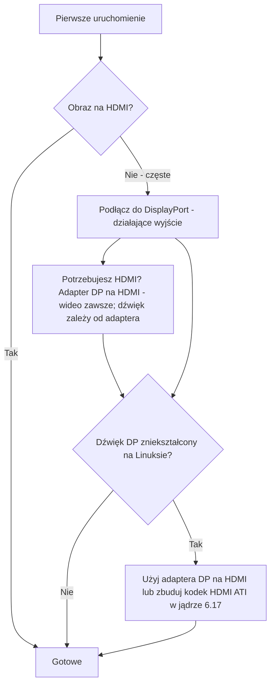

> 🌐 Tłumaczenie społecznościowe. Wersja angielska jest źródłem prawdy i może być nowsza. Znalazłeś błąd? Zgłoś to w [zgłoszeniu (issue)](https://github.com/lildebil0/awesome-bc250/issues). ([oryginał angielski](../en/14-display.md))

# Wyświetlanie i wyjście

> **W skrócie** — BC-250 steruje twoim monitorem przez **DisplayPort**. To złącze, które należy podłączyć. Jeśli twoja płyta ma też port HDMI, to **często nic nie pokazuje** — więc czarny ekran tam to *nie* martwa płyta, jesteś po prostu na złym wyjściu. Potrzebujesz HDMI? Użyj **adaptera DP→HDMI** — **obraz zawsze przechodzi, bez opóźnienia**; niektóre adaptery niosą też **dźwięk** (testowany niósł, [src](https://t.me/c/2424231195/9148)), ale dźwięk zależy od konkretnego adaptera, więc na to nie licz (zobacz sekcję o dźwięku). Jeden prawdziwy dziwoląg: **dźwięk z DisplayPort wychodzi zniekształcony/spowolniony na Linuksie**; ten sam adapter DP→HDMI to omija, a właściwa poprawka po stronie jądra ląduje około **jądra 6.17** ([src](https://t.me/c/2424231195/17953), [src](https://t.me/c/2424231195/68051)).

„Brak obrazu przy pierwszym uruchomieniu" to **panika nowicjusza numer jeden**. Przeczytaj ramkę poniżej, zanim zdecydujesz, że cokolwiek jest zepsute.

---

## Brak obrazu? Zrób to

1. **Podłącz do DisplayPort, nie HDMI.** Działającym wyjściem wideo BC-250 jest DisplayPort ([src](https://t.me/c/2424231195/104784)). Port HDMI (tam, gdzie jest) to ten, który zwykle jest pusty — nie oceniaj po nim płyty.
2. **Przełóż kartę i spróbuj ponownie.** Płyty rutynowo nie inicjalizują się za pierwszym razem — wykonaj power-cycle (pełne wyłącz/włącz) i fizycznie przełóż. Jeden właściciel: *„kiedy moja przyszła, też nie uruchomiła się za pierwszym razem … czasami nie inicjalizuje się w pełni przy restarcie przyciskiem — wyłącz/włącz to naprawia"* ([src](https://t.me/c/2424231195/15701)).
3. **Podejrzewaj kabel/adapter przed płytą.** Z pojedynczą kartą zły kabel lub adapter to główny podejrzany ([src](https://t.me/c/2424231195/15699)). Niektóre adaptery działają w firmware, ale gasną, gdy załaduje się system operacyjny — *„obraz był w porządku przed GRUB-em, czarny ekran w systemie"* ([src](https://t.me/c/2424231195/38184)).
4. **Zresetuj BIOS / przeflashuj znany-dobry obraz**, jeśli kilka kart z partii nie daje obrazu — to wskazuje na firmware, a nie twój monitor ([src](https://t.me/c/2424231195/15697), [src](https://t.me/c/2424231195/15705)).

Jeśli odhaczysz wszystkie cztery i nadal nic nie masz, przejdź do [troubleshooting.md](troubleshooting.md).



---

## Wyjścia w skrócie

| Wyjście | Działa? | Uwagi |
|--------|--------|-------|
| **DisplayPort** | **Tak — to jest to wyjście** | Główne/jedyne złącze wyświetlania; niesie dźwięk. Specyfikacja I/O repozytorium wymienia `1x DisplayPort` ([repo](https://github.com/mothenjoyer69/bc250-documentation)). To **DisplayPort 1.4**, sufit **4K@120 Hz**, z HDR10 ([elektricM](https://github.com/elektricM/amd-bc250-docs/blob/main/docs/hardware/display.md)). |
| **Port HDMI** (jeśli zamontowany) | **Często pusty** | Nowicjusze myślą, że płyta jest martwa; zwykle nie jest — przełącz się na DP. ([src](https://t.me/c/2424231195/104784)) |
| **DP → HDMI przez adapter** | **Wideo: tak. Dźwięk: zależy od adaptera** | Wideo przechodzi bez opóźnienia ([src](https://t.me/c/2424231195/9148)); dźwięk zależy od chipsetu — przetestuj go (zobacz sekcję o dźwięku). To także standardowa poprawka na zniekształcenie dźwięku DP (poniżej). |
| **Drugie wyjście wideo** | **Nie od ręki** | Elektrycznie obecne, ale **niezamontowane**; wymuszenie 2. monitora wymaga hacków, a inni mówią, że układ nie ma prawdziwej 2. głowicy — traktuj pojedyncze wyjście jako bezpieczne założenie. ([src](https://t.me/c/2424231195/92978), [src](https://t.me/c/2424231195/104682)) |
| **Drugi ekran przez sieć** | **Tak** | Strumieniuj wyjście BC-250 do innej maszyny przez LAN (Steam/Sunshine). ([src](https://t.me/c/2424231195/23660)) |

---

## Rozdzielczości, odświeżanie i kabel

Odniesienie elektricM precyzuje, co faktycznie robi pojedyncze łącze DP — przydatne przy wyborze monitora lub adaptera ([elektricM](https://github.com/elektricM/amd-bc250-docs/blob/main/docs/hardware/display.md)):

| Rozdzielczość | Odświeżanie | Ścieżka |
|------------|---------|------|
| 1920×1080 (1080p) | 144 Hz+ | Natywny DP lub dowolny adapter |
| 2560×1440 (1440p) | 144 Hz+ | Natywny DP (pasywne adaptery często ograniczają do 1440p@60 / DP 1.2) |
| 3840×2160 (4K) | 60 Hz | Natywny DP lub **aktywny** adapter DP→HDMI 2.0 |
| 3840×2160 (4K) | 120 Hz | **Tylko natywny DP** — aktywny adapter DP 1.4→HDMI 2.1 jest potrzebny do 4K@120 przez HDMI i jest zawodny |

- **Kabel:** użyj kabla **DisplayPort 1.4 z certyfikatem VESA**, **1–2 m**; dłuższe kable powodują problemy z synchronizacją/zanikaniem ([elektricM](https://github.com/elektricM/amd-bc250-docs/blob/main/docs/hardware/display.md)).
- **Utknięcie na niskiej rozdzielczości** (np. 1024×768/1080p, tylko 60 Hz) zwykle oznacza, że sterownik GPU nie jest załadowany — sprawdź `glxinfo | grep "OpenGL renderer"`; `llvmpipe` = renderowanie programowe, zainstaluj Mesa 25.1+ i usuń `nomodeset` ([elektricM](https://github.com/elektricM/amd-bc250-docs/blob/main/docs/troubleshooting/display.md)). Zobacz [06-linux.md](06-linux.md).
- **HDR (HDR10) i VRR** działają, ale są eksperymentalne na Linuksie — **KDE Plasma 6+** ma najlepsze wsparcie i zazwyczaj potrzebuje sesji Wayland ([elektricM](https://github.com/elektricM/amd-bc250-docs/blob/main/docs/hardware/display.md)). **Dystrybucja ma tu znaczenie:** raport społeczności r/BC250Gaming (Reddit) uzyskał **HDR + VRR działające poprawnie tylko na CachyOS** (Plasma 6 + Wayland), podczas gdy na **Bazzite HDR powodowało glitche graficzne, a VRR nigdy w ogóle nie działało**. Ich przykład: *Forza Horizon 6* w **1440p High, HDR + VRR włączone, 60–80 FPS** przez adapter **UGREEN DP→HDMI 2.1**. Jeśli HDR/VRR jest priorytetem, zobacz notatkę o CachyOS w [06-linux.md](06-linux.md).
  - **Jeśli jesteś na Bazzite KDE i chcesz VRR/FreeSync przez HDMI**, jest remiks społeczności, który podmienia pracę jądra AMD nad HDMI 2.1 / FRL: **[`dyllan500/bazzite-amd-hdmi-kde`](https://github.com/dyllan500/bazzite-amd-hdmi-kde)** — obraz Bazzite KDE przebudowany na jądrze niosącym oficjalne łatki AMD HDMI-2.1 VRR (z `amd-staging-drm-next`). ⚠ **mocno asekuruj:** to obraz strony trzeciej, autor testował VRR tylko na **Radeon 9070 XT** (nie na BC-250), i ma stać się przestarzały, gdy łatki trafią do fabrycznego jądra Bazzite. To *nie* jest potwierdzona poprawka dla BC-250 — traktuj to jako eksperymentalną drogę do wypróbowania, a nie gwarancję.

> **Czarny ekran *po zalogowaniu* (GRUB i ekran logowania były w porządku)** to problem sesji pulpitu, zwykle **Wayland** — wybierz „GNOME on Xorg"/„Plasma (X11)" w trybiku logowania lub ustaw `WaylandEnable=false` w `/etc/gdm/custom.conf` ([elektricM](https://github.com/elektricM/amd-bc250-docs/blob/main/docs/hardware/display.md)). Czarny ekran *przed* logowaniem to problem sterownika/`nomodeset` powyżej, nie ten.

---

## Dźwięk DisplayPort jest zniekształcony — poprawka z adapterem

Na Linuksie dźwięk wysyłany **bezpośrednio z DisplayPort** wychodzi źle na BC-250 — opisywany jako zniekształcony, *„rozciągnięty, jakby spowolniony do połowy prędkości"*, z trzaskami ([src](https://t.me/c/2424231195/9895)). To **problem Linuksa/protokołu DP, a nie wada płyty** — był widziany także na sprzęcie innym niż BC-250 ([src](https://t.me/c/2424231195/15983)).

Bezpośrednie, niezawodne obejście, na którym czat się ustalił: **przepuść sygnał przez adapter DP→HDMI.** Po konwersji na HDMI artefakty dźwiękowe znikają ([src](https://t.me/c/2424231195/17953), [src](https://t.me/c/2424231195/51763)). Użytkownik zweryfikował to bezpośrednio: *„Testowałem wyjście dźwięku przez adapter DisplayPort→HDMI. Wszystko w porządku, bez opóźnienia"* ([src](https://t.me/c/2424231195/9148)).

**Najczystsza ścieżka ze wszystkich to prosty *kabel* DP→HDMI — wtyczka DP z jednej strony, wtyczka HDMI z drugiej, bez dongla-adaptera ani pudełka po żadnej stronie.** Wielu użytkowników w wątku społeczności r/linux_gaming niezależnie zgłasza, że to daje najbardziej niezawodny dźwięk: zwykły kabel (np. kabel DP-to-HDMI Amazon Basics, ~$10) „po prostu działa" tam, gdzie adaptery typu dongle są trafione lub nie. Sporadyczne krótkie wyciszenia dźwięku nadal mogą się zdarzać, ale jednoczęściowy kabel usuwa dodatkowy chipset adaptera, który czyni drogę przez dongla hazardem ([r/linux_gaming](https://www.reddit.com/r/linux_gaming/comments/1nvsgji/)). Jeśli i tak kupujesz, **wybieraj kabel zamiast dongla.**

**Jeśli nie masz adaptera pod ręką,** zamiast tego poprowadź dźwięk przez **Bluetooth** — większość głośników/zestawów słuchawkowych go obsługuje i całkowicie omija ścieżkę DP ([src](https://t.me/c/2424231195/89769)). Zobacz [10-wifi-bt.md](10-wifi-bt.md) po dongla BT.

### Uwagi o adapterach (społeczność)
- **Do 4K@60+ potrzebujesz adaptera/kabla *aktywnego*** (pasywne ograniczają do ~1440p@60). Działający, przetestowany przykład: **UGREEN DP125 (kabel DP→HDMI 4K)** — oznaczony jako 4K@30, ale wynegocjował 4K@60 na telewizorze ([src](https://t.me/c/2424231195/52398)). Aktywny vs pasywny ustala sufit rozdzielczości — **nie** decyduje, czy dźwięk przechodzi (zobacz poniżej).
- **Nie wszystkie adaptery niosą dźwięk.** Adapter Belsis jednego właściciela przepuścił 4K@60 *z* dźwiękiem, podczas gdy kilka droższych jednostek Ugreen pokazywało „HDMI digital audio" na liście urządzeń, ale nie wydawało dźwięku — a jedna przesunęła głosy o oktawę w dół ([src](https://t.me/c/2424231195/106617)). Jeśli dostajesz wideo, ale bez dźwięku, adapter jest zmienną — spróbuj innego.
- **Do *dźwięku* HDMI sięgnij najpierw po adapter *pasywny*.** Wzorzec społeczności z wątku r/linux_gaming: **pasywne** adaptery DP→HDMI mają tendencję do czystego przepuszczania dźwięku, podczas gdy **aktywne** adaptery często **całkowicie gubią dźwięk lub przesuwają wysokość** (zgłoszono głosy zsuwające się ~20% w dół / mniej więcej o kwintę). Haczyk: aktywnego adaptera *potrzebujesz* tylko do prawdziwego **HDR** (i do 4K@60+), więc to prawdziwy kompromis — pasywny dla niezawodnego dźwięku, aktywny dla HDR. Potwierdzone przez społeczność jako działające opcje *pasywne*: **Silver Monkey**, **BENFEI (ASIN B017Q8ZVWK)** oraz **_kabel_ DP-to-HDMI AmazonBasics** (jednoczęściowy kabel — *nie* ich adapter typu dongle) ([r/linux_gaming](https://www.reddit.com/r/linux_gaming/comments/1nvsgji/)). ⚠ konkretne SKU są zgłaszane przez społeczność, nie zweryfikowane laboratoryjnie tutaj — a adapter pasywny i tak ogranicza do ~**1440p@60**.
- Tanie adaptery **4K@60 DP→HDMI**, które przepuszczają zarówno wideo, jak i dźwięk, istnieją i są zgłaszane jako działające ([src](https://t.me/c/2424231195/133977)).
- Niektóre adaptery źle się zachowują specyficznie na **monitorach 4K** ([src](https://t.me/c/2424231195/1988)).
- **Dźwięk przez adapter DP→HDMI jest niespójny i zależy od chipsetu adaptera — a nie po prostu od aktywny vs pasywny.** Wideo zawsze przechodzi; **dźwięk jest zmienną.** Nasze raporty społeczności są adapter-po-adapterze (jednostki UGREEN/Belsis zgłaszane jako niosące dźwięk, niektóre inne jednostki ciche), a przewodnik elektricM zgłasza *odwrotny* podział (pasywne niosące dźwięk, niektóre jednostki aktywne ciche — np. Cable Matters/StarTech) — co dokładnie dlatego etykieta aktywny/pasywny tego nie przewiduje ([elektricM](https://github.com/elektricM/amd-bc250-docs/blob/main/docs/troubleshooting/display.md)). Dla **niezawodnego** dźwięku nie stawiaj na adapter: wybieraj **natywny dla DisplayPort wyświetlacz/amplituner AV** lub wyprowadź dźwięk przez **USB (urządzenie USB DAC/dźwiękowe)**. Jeśli jednak używasz adaptera, **przetestuj dźwięk, zanim na nim polegniesz** — i pamiętaj, że adapter **pasywny** ogranicza do ~**1440p@60**.

### Poprawka jądra 6.17 (dźwięk bezpośrednio z DP, bez adaptera)

Jeśli chcesz czystego dźwięku **bezpośrednio przez DisplayPort** bez adaptera, przyczyna i poprawka zostały wyśledzone na czacie. Fabryczna konfiguracja jądra Fedory budowała `snd-hda-codec-hdmi.ko` + `snd-hdmi-lpe-audio.ko`; **jądro 6.17 zmieniło ścieżkę dźwięku HDMI** i zepsuło dźwięk na tej domyślnej konfiguracji. Poprawka polega na zbudowaniu także **kodeka HDMI ATI** — przełącz konfigurację jądra z `# CONFIG_SND_HDA_CODEC_HDMI_ATI is not set` na `CONFIG_SND_HDA_CODEC_HDMI_ATI=m`, co pakuje `snd-hda-codec-atihdmi.ko`; dźwięk wtedy działa **bez łatek** ([src](https://t.me/c/2424231195/68051), [src](https://t.me/c/2424231195/68061)).

```text
# Fedora kernel config change for DP/HDMI audio on kernel 6.17+
# from:
# CONFIG_SND_HDA_CODEC_HDMI_ATI is not set
# to:
CONFIG_SND_HDA_CODEC_HDMI_ATI=m
```

Z tym trzecim kodekiem (`snd-hda-codec-atihdmi.ko`) obecnym, ALSA udostępnia wyjścia dźwiękowe płyty (np. `pcm=3` i `pcm=7` jako dwa urządzenia HDMI) ([src](https://t.me/c/2424231195/68062), [src](https://t.me/c/2424231195/67569)). ⚠ zweryfikuj — to wymaga zbudowania własnego jądra; traktuj adapter DP→HDMI jako ścieżkę bez budowania dla większości użytkowników. Zobacz [06-linux.md](06-linux.md) po konfigurację jądra/sterownika.

### Dźwięk przestrzenny (5.1) — użyj karty dźwiękowej USB, a nie HDMI

**Dźwięk przestrzenny 5.1 przez HDMI *nie* działa na BC-250.** Firmware HDMI AMD na Linuksie dla tego bezgłowego/górniczego układu nie udostępnia wielokanałowego LPCM, więc wyjście HDMI cofa się do zwykłego stereo niezależnie od tego, co obsługuje amplituner ([r/linux_gaming](https://www.reddit.com/r/linux_gaming/comments/1nvsgji/)). Dla prawdziwego wielokanałowego, zamiast tego wyprowadź dźwięk przez **kartę dźwiękową USB / USB DAC** — ustaw ją jako domyślne ujście w `pavucontrol`, a następnie potwierdź wszystkie sześć kanałów za pomocą:

```bash
speaker-test -D pipewire -c 6 -t wav
```

Ta sama droga przez USB-DAC jest też niezawodną poprawką dla dźwięku stereo, gdy adaptery źle się zachowują (powyżej).

---

## Drugie wyjście (początkowo nieaktywne)

Na płycie jest **drugie wyjście wideo, które nie jest aktywne od ręki.** Odczyt społeczności jest podzielony i warto znać obie połowy:

- Jest **elektrycznie obecne, ale niezamontowane/niedolutowane**, i *„za pomocą hacków można sprawić, że 2. monitor zadziała"* ([src](https://t.me/c/2424231195/92978)).
- Inni zgłaszają, że układ po prostu **nie ma użytecznej drugiej głowicy** — *„problem jest w układzie, drugiego wyjścia fizycznie nie ma"* ([src](https://t.me/c/2424231195/104682)).

Praktycznie: **załóż jedno wyjście DisplayPort.** O **splitter DP MST do dwóch niezależnych ekranów pytano, ale nie potwierdzono jego działania** na naszym czacie ([src](https://t.me/c/2424231195/92109)).

**Aktualizacja od elektricM — MST może obsłużyć dwa ekrany z właściwym hubem.** Testy elektricM zgłaszają do **2 wyświetlaczy przez hub DP MST** (przepustowość współdzielona, rozdzielczość na wyświetlacz ograniczona), z wynikami hub-po-hubie ([elektricM](https://github.com/elektricM/amd-bc250-docs/blob/main/docs/hardware/display.md)):

| Hub MST | Wyjście | Wer. DP | Niezależne wyświetlacze? | Dźwięk | Uwagi |
|---------|-----|--------|-----------------------|-------|-------|
| StarTech MST14DP122DP | 2× DP | 1.4 | **Tak** | Tak | Działał konsekwentnie na różnych monitorach/kablach |
| Monoprice 21972 | 2× DP | 1.2 | **Tylko lustro** | Tak | Mógł tylko lustrzanie |
| ENBUER | 2× DP | 1.2 | **Tylko lustro** | Tak | Mógł tylko lustrzanie |
| Generyczny HDMI MST | 2× HDMI | — | **Nie** | Nie | Brak wideo ani dźwięku |

Więc natywny podwójny monitor **jest** możliwy przez MST z hubem DP 1.4 (StarTech potwierdzony); tańsze huby DP 1.2 mogą tylko lustrzanie, a huby HDMI MST zawiodły. ⚠ zweryfikuj — pojedynczy potwierdzony model huba; wyniki różnią się w zależności od huba.

**Inna droga wielowyświetlaczowa — adapter USB DisplayLink.** Dodaj adapter USB→HDMI/DP DisplayLink dla dodatkowego ekranu **pulpitowego** (podłącz *po* uruchomieniu dla najlepszych wyników). **Nie do grania** — kompresuje na CPU, który jest wąskim gardłem BC-250, więc opóźnienie jest wysokie; nie działa też w **trybie gry** Steam Deck ([elektricM](https://github.com/elektricM/amd-bc250-docs/blob/main/docs/hardware/display.md)).

---

## Drugi ekran przez sieć (łatwy „2. wyświetlacz")

Jeśli faktycznie chcesz obraz BC-250 na drugim urządzeniu, sprawdzoną drogą nie jest drugi kabel — to **strumieniowanie przez LAN.** Jeden użytkownik: *„Uruchomiłem grę Steam na BC-250 (Fedora) i strumieniowałem ją przez sieć na mój służbowy laptop, sterowałem nią z laptopa. Wszystko działało"* ([src](https://t.me/c/2424231195/23660)).

- **Sunshine** (enkoder hosta) działa tutaj, ponieważ nie jest tylko-NVIDIA — to on robi kodowanie, klient tylko dekoduje ([src](https://t.me/c/2424231195/25091)). Przez gigabitowy LAN zgłaszany jako niemal bezbłędny ([src](https://t.me/c/2424231195/25563)).
- **Moonlight jako host** *nie* pasuje — oczekuje enkodera NVIDIA i się zacina/narzeka na brakujący dekoder sprzętowy ([src](https://t.me/c/2424231195/25050)). Używaj Sunshine jako hosta, Moonlight tylko jako klienta.

To także praktyczny sposób na uzyskanie odczucia „podwójnego wyświetlacza" bez niezamontowanego drugiego wyjścia powyżej.

---

## Źródła

- Adapter DP→HDMI przepuszcza wideo+dźwięk, bez opóźnienia — https://t.me/c/2424231195/9148
- Zniekształcenie dźwięku DP to problem Linuksa; adapter to naprawia — https://t.me/c/2424231195/17953 · https://t.me/c/2424231195/9895 · https://t.me/c/2424231195/51763 · https://t.me/c/2424231195/15983
- Poprawka dźwięku w jądrze 6.17 (`CONFIG_SND_HDA_CODEC_HDMI_ATI=m`) — https://t.me/c/2424231195/68051 · https://t.me/c/2424231195/68061 · https://t.me/c/2424231195/68062 · https://t.me/c/2424231195/67569
- Działające adaptery — UGREEN DP125 https://t.me/c/2424231195/52398 · Belsis vs inne (dźwięk się różni) https://t.me/c/2424231195/106617 · tanie 4K@60 https://t.me/c/2424231195/133977
- DP to działające wyjście; wydaj na dobry adapter DP→HDMI — https://t.me/c/2424231195/104784
- Brak obrazu przy pierwszym uruchomieniu / przełożenie / reflash — https://t.me/c/2424231195/15697 · https://t.me/c/2424231195/15699 · https://t.me/c/2424231195/15701 · https://t.me/c/2424231195/38184
- Drugie wyjście obecne, ale niezamontowane / dyskutowane — https://t.me/c/2424231195/92978 · https://t.me/c/2424231195/104682 · pytanie o MST https://t.me/c/2424231195/92109
- Sieciowy drugi ekran (Sunshine/Steam przez LAN) — https://t.me/c/2424231195/23660 · https://t.me/c/2424231195/25091 · https://t.me/c/2424231195/25050 · https://t.me/c/2424231195/25563
- Dźwięk Bluetooth jako alternatywa — https://t.me/c/2424231195/89769
- Prosty **kabel** DP→HDMI (bez adapterów) to najbardziej niezawodny dźwięk; 5.1 przez HDMI nie działa (brak wielokanałowego LPCM), użyj karty dźwiękowej USB / DAC — wątek społeczności r/linux_gaming https://www.reddit.com/r/linux_gaming/comments/1nvsgji/
- Odniesienie sprzętowe I/O (`1x DisplayPort`) — [mothenjoyer69/bc250-documentation](https://github.com/mothenjoyer69/bc250-documentation) · [`hardware.md`](https://github.com/mothenjoyer69/bc250-documentation/blob/main/hardware.md)
- DP 1.4 / 4K@120 / HDR10, limity rozdzielczości+kabla, huby MST (maks. 2), DisplayLink, czarny ekran przy logowaniu Wayland — elektricM [`hardware/display.md`](https://github.com/elektricM/amd-bc250-docs/blob/main/docs/hardware/display.md)
- HDR + VRR działające na CachyOS (Plasma 6 + Wayland) vs zepsute na Bazzite; Forza Horizon 6 1440p High HDR+VRR przez UGREEN DP→HDMI 2.1 — raport społeczności r/BC250Gaming (Reddit) (zobacz [06-linux.md](06-linux.md))
- Pasywny DP→HDMI niesie dźwięk / aktywny gubi lub przesuwa wysokość; pasywny, ale potrzebny do HDR; potwierdzone pasywne Silver Monkey / BENFEI B017Q8ZVWK / kabel AmazonBasics DP-to-HDMI — [wątek społeczności r/linux_gaming](https://www.reddit.com/r/linux_gaming/comments/1nvsgji/)
- Remiks Bazzite KDE VRR/FreeSync przez HDMI (jądro AMD HDMI 2.1; testowany na 9070 XT, nie BC-250) — [`dyllan500/bazzite-amd-hdmi-kde`](https://github.com/dyllan500/bazzite-amd-hdmi-kde)
- Dźwięk adaptera zależy od chipsetu (elektricM widział, że pasywny go niesie / niektóre aktywne ciche; społeczność widziała odwrotność — więc wybieraj natywny DP lub USB DAC), kontrola llvmpipe przy niskiej rozdzielczości — elektricM [`troubleshooting/display.md`](https://github.com/elektricM/amd-bc250-docs/blob/main/docs/troubleshooting/display.md)

> Konfiguracja sterownika/jądra jest w [06-linux.md](06-linux.md); pułapki dźwięku/wyjścia są też zindeksowane w [troubleshooting.md](troubleshooting.md) i [faq.md](faq.md).
