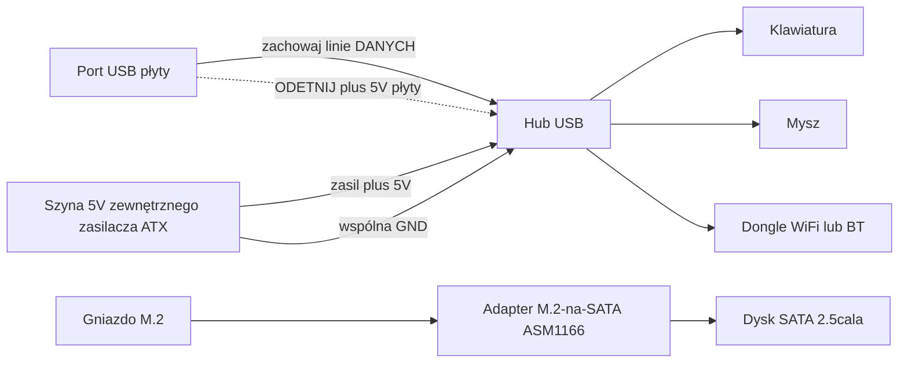

> 🌐 Tłumaczenie społecznościowe. Wersja angielska jest źródłem prawdy i może być nowsza. Znalazłeś błąd? Zgłoś to w [zgłoszeniu (issue)](https://github.com/lildebil0/awesome-bc250/issues). ([oryginał angielski](../en/16-usb-peripherals.md))

# USB, huby i peryferia

> **W skrócie** — Płyta daje ci **4 tylne porty USB (2× USB 2.0 + 2× USB 3.0)** i to wszystko — żadnych wewnętrznych złączy podłączonych domyślnie. Dongle WiFi/BT, SSD-przez-USB, klawiatura, mysz i kontroler zjadają je szybko, więc prawie każdy dodaje **hub USB**. Haczyk: **szyna 5 V USB płyty jest słaba** i zapada się pod obciążeniem, więc tanie huby zasilane z magistrali (a nawet bezpośrednio podłączone pendrive'y) odpadają. Niezawodne poprawki, w kolejności: **hub aktywny (zasilany)** lub społecznościowy **mod wstrzykiwania 5 V** — odetnij 5 V, które hub bierze z płyty, i zasil go 5 V z twojego zasilacza ATX zamiast tego. ([src](https://t.me/c/2424231195/119741))

To strona o **akcesoriach**. Dobierz hub poprawnie, a reszta (dźwięk, Ethernet-przez-USB, doki) po prostu działa.

---

## Ile portów USB faktycznie dostajesz

Zgodnie z odniesieniem sprzętowym, tylne I/O to **1× DisplayPort, 1× GbE Ethernet, 2× USB 2.0, 2× USB 3.0**. Więc cztery fizyczne porty USB. ([hardware.md](https://github.com/mothenjoyer69/bc250-documentation/blob/main/README.md))

W praktyce dwa porty **USB 3.0** to te, o które ludzie walczą (szybsze, używane do SSD/doków), i są okablowane **wąsko** elektrycznie — jeden właściciel opisuje złącze jako faktycznie „x2" i ostrzega przed wieszaniem na nim splittera. ⚠ zweryfikuj dokładną szerokość linii. ([src](https://t.me/c/2424231195/75561))

Ścisk jest realny, gdy wyliczysz, co chce portu: **podłącz SSD — jeden port zniknął; dodaj dongla USB WiFi, joystick, dysk zewnętrzny — potrzebujesz huba, inaczej ryzykujesz spalenie portu.** ([src](https://t.me/c/2424231195/75558)) Ludzie rutynowo zgłaszają „wszystkie USB 3.0 zajęte, klawiatura i mysz idą przez hub". ([src](https://t.me/c/2424231195/110875))

**Nie ma zamontowanych złączy USB na panelu przednim** od ręki — ale obudowa/płyta ma miejsce wyraźnie przeznaczone do poprowadzenia kabla huba na przód, którego kilka obudowanych konstrukcji używa. ([src](https://t.me/c/2424231195/91322)) · ([src](https://t.me/c/2424231195/100249))

---

## Prawdziwy problem: szyna 5 V USB jest słaba

BC-250 generuje **5 V dla USB na samej płycie** ([src](https://t.me/c/2424231195/57920)), a ta szyna nie może dostarczyć wiele. Najwyraźniejszy pomiar z czatu, na płycie, która nie wyliczała urządzeń:

> „Mój BC-250 [nie] daje właściwych 5 V na USB… tylko klawiatura działa; jeśli podłączę mysz, klawiatura się wyłącza. ~**4.3 V** z samą klawiaturą, **2.3 V–3.2 V** z klawiaturą + myszą, **5.1 V** z obiema odłączonymi." ([src](https://t.me/c/2424231195/119071))

To zapadanie się napięcia jest powodem, dla którego objawy skupiają się wokół **obciążenia**: pendrive'y i mikrofony, które **odpadają, gdy podłączone bezpośrednio, ale działają dobrze przez hub**, klawiatury, które tracą diody LED, urządzenia, które odpadają w momencie, gdy dwie rzeczy pobierają naraz. ([src](https://t.me/c/2424231195/53939)) To ta sama wrażliwość na zasilanie, która czyni dongle WiFi zawodnymi — zobacz **[10-wifi-bt.md](10-wifi-bt.md)**, gdzie sticki działają na biegu jałowym, a potem odpadają przy skoku pobierania.

> ⚠ Nie każda płyta jest tak zła. Jeden właściciel zasila **dongla WiFi + klawiaturę przewodową + mysz przez hub bez zasilania + wyświetlacz 14″ + pomocniczy ekran 3.5″** z USB płyty i zgłasza, że jest w porządku. ([src](https://t.me/c/2424231195/119231)) Traktuj własną płytę jako niewiadomą, dopóki jej nie obciążysz.

---

## Wybór huba: zasilany vs niezasilany

| Typ huba | Kiedy działa | Werdykt |
|----------|---------------|---------|
| **Niezasilany (zasilany z magistrali)** | Lekkie obciążenia — klawiatura, mysz, dongle. Niektóre płyty obsługują zaskakująco dużo w ten sposób. ([src](https://t.me/c/2424231195/119231)) | OK na pierwszą próbę; **spodziewaj się odpadania** w momencie, gdy dodasz dysk lub skoczy obciążenie. |
| **Zasilany / aktywny (zewnętrzna kostka 5 V)** | Cokolwiek z dyskami, wieloma donglami lub pod obciążeniem. Stała rekomendacja społeczności dla BC-250. ([src](https://t.me/c/2424231195/75558)) · ([src](https://t.me/c/2424231195/119229)) | **Kup to.** Rozwiązuje zapadanie bez dotykania płyty. ([src](https://t.me/c/2424231195/140091)) |
| **Mod wstrzykiwania 5 V** (zobacz poniżej) | Gdy chcesz czystą, obudowaną konstrukcję zasilaną całkowicie z zasilacza ATX i nie chcesz drugiej ładowarki sieciowej. | Najlepsza integracja, wymaga lutowania. ([src](https://t.me/c/2424231195/119741)) |

Powtarzana rada, gdy czyjeś urządzenia USB źle się zachowują, jest prosta: **kup aktywny hub USB z wejściem na zasilacz.** ([src](https://t.me/c/2424231195/119229)) Wielu właścicieli skończyło tam po walce z odpadaniem — „rozwiązało się to hubem zasilanym zewnętrznie". ([src](https://t.me/c/2424231195/123789))

> Jedna przestroga podniesiona na czacie: poleganie na hubie zasilanym zewnętrznie może być **trwałe** — gdy raz przeniesiesz zasilanie USB na zewnątrz, nie zdziw się, jeśli utkniesz z tym hubem na dobre. ([src](https://t.me/c/2424231195/123924)) To dobry kompromis dla konstrukcji biurkowej.

---

## Mod wstrzykiwania 5 V (spraw, by zwykły hub się zachowywał)

To eleganckie rozwiązanie dla **obudowanej konstrukcji już działającej z zasilacza ATX/SFX**: zamiast kupować hub aktywnie zasilany z własnym zasilaczem sieciowym, bierzesz zwykły hub i **zamieniasz, skąd pochodzą jego 5 V**.

Co zrobił jeden użytkownik, i zadziałało ([src](https://t.me/c/2424231195/119741)):

> „Zmodyfikowałem zwykły hub USB i zadziałał. **Odciąłem 5 V przychodzące z płyty głównej i dałem 5 V z zasilacza.** Nie musiałem podłączać masy, bo używam tego samego zasilacza ATX do zasilania mojego BC-250."

Jak to działa:

1. Otwórz hub; znajdź ścieżkę/przewód **5 V (VBUS)** po stronie **upstream** (kabel, który wpina się do płyty).
2. **Odetnij te 5 V**, aby hub już nie pobierał zasilania ze słabej szyny płyty.
3. Zasil hub **+5 V z twojego zasilacza ATX** (zapasowa linia 5 V SATA/Molex).
4. **Masa jest współdzielona** automatycznie, ponieważ ten sam zasilacz już zasila płytę — nie jest potrzebny dodatkowy przewód masy. (Jeśli kiedykolwiek zasilisz hub z *osobnego* zasilacza, **musisz** połączyć masy.)

Linie danych pozostają nietknięte — zmieniasz tylko źródło zasilania. Płyta widzi hub, który już nie obciąża jej szyny 5 V, a urządzenia dostają czyste, obfite zasilanie z zasilacza.



> ⚠ Odcięcie złej ścieżki zabija hub (tani) — ale upewnij się, że odcinasz **VBUS, a nie linię danych**. Sprawdź dwukrotnie multimetrem przed lutowaniem.

---

## Śmieci, których należy unikać

- **Huby Hoco** — wskazane jako zawodne; jeden właściciel **musiał przelutować ten sam hub Hoco dwa razy**. ([src](https://t.me/c/2424231195/74531))
- **„Huby USB 3.0", które nimi nie są** — „hub/dok USB 3.0" z AliExpress za 160 ₽ został oznaczony jako **zdecydowanie nieprawdziwe 3.0** w tej cenie. ([src](https://t.me/c/2424231195/8761)) · ([src](https://t.me/c/2424231195/8764))
- **Łączenie hubów w łańcuch (daisy-chain)**, aby pomnożyć porty — podniesione jako pomysł ([src](https://t.me/c/2424231195/104653)), ale to spiętrza problem zasilania; jedna słaba szyna zasila teraz dwa huby. Zamiast tego użyj pojedynczego dobrego huba zasilanego.
- **„Huby" splittery-SATA** z gniazda M.2 — powracające nieporozumienie. Z tylko **2 liniami PCIe** na M.2 nie możesz rozsądnie powiesić kontrolera SATA i oczekiwać, że rozłoży się na wiele; „te huby jeden-SATA-w, wiele-wyjść to śmieci". ([src](https://t.me/c/2424231195/22539)) To nie temat USB — po prostu nie myl tego z rozszerzeniem USB.
- ★ **Kontroler M.2→SATA PH516 (6-portowy) — potwierdzony jako NIE działający.** Port się wylicza, ale dysk się nie podłącza, a **druga osoba odtworzyła** tę samą awarię ([4pda — Strange999](https://4pda.to/forum/index.php?showtopic=1104980)). Zamiast tego kup rekomendowany przez społeczność **ASM1166** (zobacz sekcję o pamięci masowej) — PH516 to znany ślepy zaułek na tej płycie.

Hub z **wbudowanym kodekiem dźwiękowym** to zgrabny oszczędzacz miejsca dla obudowanych konstrukcji (jedno urządzenie daje ci dodatkowe porty *oraz* gniazdo 3.5 mm), i ludzie ich używają. ([src](https://t.me/c/2424231195/8751)) Jakość dźwięku się różni — to tani kodek. ([src](https://t.me/c/2424231195/39708))

---

## Wewnętrzne złącze USB 3.0 (Type-E)

Jeśli twoja obudowa ma **przednią wtyczkę USB 3.0** (20-pinowe złącze „Key-A/Type-E"), zechcesz zasilić je z USB 3.0 płyty. Nie ma **natywnego 20-pinowego złącza**, więc ludzie adaptują:

- **Kabel USB 3.1 Type-E → USB 3.0 (Type-A)** z AliExpress to czysta ścieżka. AXONUS 50 cm był udostępniony na czacie. ([src](https://t.me/c/2424231195/133182)) Wariant Xiwai Type-E → 20-pin również był opublikowany. ([src](https://t.me/c/2424231195/125127))
- Albo **spleć** fabryczny kabel obudowy ze zwykłą wtyczką USB 3.1 — metoda „połącz węża z jeżem", gdy żaden adapter nie pasuje. ([src](https://t.me/c/2424231195/135957))

**Status:** **USB 2.0 jest potwierdzone jako działające; USB 3.0 nadal pozostawało do pełnego przetestowania** przez właściciela, który to zgłosił (test oczekujący po obudowanej konstrukcji). Traktuj 3.0-przez-adapter jako ⚠ zweryfikuj na swoim sprzęcie. ([src](https://t.me/c/2424231195/136215))

---

## Pamięć masowa (gniazdo M.2 i dyski SATA)

Jedynym wewnętrznym złączem pamięci masowej płyty jest **pojedyncze gniazdo M.2**, i jest okablowane **PCIe 2.0 ×2** — więc praktyczny sufit to **~1 GB/s** ([src](https://t.me/c/2424231195/66275)) · ([src](https://t.me/c/2424231195/135506)). Szybki NVMe Gen3/Gen4 *zadziała*, ale nie może osiągnąć swojej oznaczonej prędkości tutaj, więc nie ma sensu płacić za dysk z najwyższej półki. **Zwykły SSD NVMe M.2 to najprostszy dysk rozruchowy** — wrzuć go do gniazda i zainstaluj na nim Linuksa (zobacz **[06-linux.md](06-linux.md)** po instalację).

### Podłączanie dysków SATA HDD/SSD 2.5″

Na płycie nie ma portu SATA, więc aby powiesić **dysk SATA 2.5″** (lub kilka), wkładasz **kartę adaptera M.2 → SATA** do gniazda M.2. Potwierdzonym wyborem społeczności jest karta rozszerzeń **ASM1166 (M.2 PCIe → SATA)** ([src](https://t.me/c/2424231195/135180)). Inna droga, którą ludzie obierają, to zwykły **SSD M.2 SATA bezpośrednio w płycie** — bez adaptera, tylko stick M.2 z protokołem SATA. ([src](https://t.me/c/2424231195/87411))

To jedno z **najczęstszych pytań nowicjuszy** — *„czy to ten adapter, którego potrzebuję, aby podłączyć dysk twardy do płyty?"* i *„jakie inne sposoby są na podłączenie dysku?"* ([src](https://t.me/c/2424231195/135164)) · ([src](https://t.me/c/2424231195/135165)) — więc jeśli o to pytasz, jesteś w dobrym towarzystwie.

> ⚠ zweryfikuj — karta ASM1166 to rekomendacja społeczności, a nie wynik testowany-przez-wielu specyficznie na BC-250. Potwierdź, że twój wybrany adapter się wylicza i uruchamia, zanim na nim polegniesz. Zauważ także, że **2 linie PCIe** M.2 nie mogą rozsądnie zasilić *splittera* jeden-SATA-w / wiele-wyjść — zobacz **Śmieci, których należy unikać** powyżej. ([src](https://t.me/c/2424231195/22539))

#### ★ Zasilanie dysku SATA 2.5″ (płyta jest tylko-12 V)

Karta adaptera powyżej obsługuje **dane**, ale dysk SATA 2.5″ potrzebuje też **zasilania 5 V** na swoim złączu SATA-power — a płyta BC-250 dostarcza tylko **12 V**, bez złącza SATA-power do podpięcia. Praktyczna poprawka z jednej konstrukcji: **adapter USB→SATA-power zasilający 5 V** do dysku, z **przetwornicą obniżającą (buck) 12 V→5 V** produkującą te 5 V z 12 V płyty ([konstrukcja TMG HD](https://youtu.be/OEO0r01zcfU); ⚠ przybliżone — sparafrazowane z przewodnika wideo). Innymi słowy: ASM1166 (lub stick M.2 SATA) niesie *dane* SATA; przetwornica buck + adapter USB→SATA-power niesie *zasilanie* SATA. Samozasilająca się obudowa 2.5″ lub zasilany dok omija cały problem, wnosząc własną szynę 5 V.

#### ★ SteamOS „no nvme drive detected" ze stickiem M.2 SATA

Jeśli uruchamiasz SteamOS z **SSD M.2 SATA** (np. **Kingston SNS41**) zamiast NVMe, przepływ instalatora/naprawy może zawieść z **„no nvme drive detected"** — SteamOS zakłada, że dysk to urządzenie NVMe (`nvme…`), ale stick SATA wylicza się jako `sda`. Poprawka polega na edycji skryptu naprawczego i wskazaniu mu właściwej nazwy urządzenia ([4pda — pornocrat](https://4pda.to/forum/index.php?showtopic=1104980)):

```bash
# Edit the SteamOS repair script and replace the device name nvme -> sda
nano ~/tools/repair_device.sh
# change every "nvme" reference to "sda", save, then re-run the install/repair
```

To czysto niezgodność nazewnictwa urządzenia — stick SATA działa dobrze, gdy SteamOS zostanie poinstruowany, by patrzeć na `sda`, a nie na węzeł `nvme`.

### Starsze dyski SATA są w porządku

Ponieważ łącze M.2 i tak ogranicza wszystko do ~1 GB/s, stary **HDD/SSD SATA 2.5″** jest idealnie wystarczający do **biblioteki gier lub starszych gier** — prędkość, którą byś stracił, to prędkość, której płyta nie może dostarczyć. ([src](https://t.me/c/2424231195/132739)) **Obudowa USB-NVMe** to inna opcja, jeśli wolisz zostawić gniazdo M.2 wolne, ale obudowy, które faktycznie robią NVMe (nie SATA), zaczynają się drożej — dla małego sticka rozruchowego nie jest to warte. ([src](https://t.me/c/2424231195/111022))

### Intel Optane 16 GB jako cache/swap — pomysł społeczności, letni werdykt

Użycie małego modułu **Intel Optane 16 GB NVMe** jako urządzenia cache lub swap pojawiło się jako pomysł, z trzeźwym werdyktem ([4pda](https://4pda.to/forum/index.php?showtopic=1104980)): moduły **„Optane" 16 GB sprzedawane na Ozon okazały się nie być prawdziwym Optane** według własnych testów członków, gniazdo **M.2 płyty jest wolne** (PCIe 2.0 ×2, ~1 GB/s), więc przewaga opóźnienia jest stępiona, i choć **plik swap jest możliwy w teorii**, nie jest tutaj wyraźną wygraną. Traktuj to jako ciekawostkę, a nie rekomendowany upgrade.

---

## Doki i stacje dokujące

**Dok** w stylu USB-C / Thunderbolt może działać jako jeden gruby hub (USB + Ethernet + czasami wideo), i właściciele ich używali:

- **Dok USB-C dual-4K Wavlink WL-UG69DK1** jest w użyciu przez jednego członka. ([src](https://t.me/c/2424231195/68141))
- **Dok DisplayLink** działa jako **hub USB + karta dźwiękowa USB**; członek **nie** mógł uzyskać z niego wideo (trafił na ścianę TPM/BIOS), więc traktuj *wideo* z doku jako zawodne. ([src](https://t.me/c/2424231195/104776))
- Dla dodatkowych **monitorów specyficznie**, dok nie ominie własnego limitu wyjścia GPU — zobacz **[14-display.md](14-display.md)**, zanim na nim polegniesz.

Wniosek końcowy: doki są w porządku jako **huby zasilane** (wnoszą własny zasilacz, co zgrabnie omija problem 5 V). Nie kupuj go, oczekując, że jego wyjście **wideo** zadziała.

---

## Kontrolery i wejście

Gamepady jeżdżą na tej samej słabej szynie USB i tej samej historii zawodnego Bluetootha co wszystko inne (zobacz **[10-wifi-bt.md](10-wifi-bt.md)** po dongle BT). Kilka konkretnych ustaleń:

- **DualSense na Linuksie przez DS5Dongle (Raspberry Pi Pico 2W).** Ten otwarty dongle daje DualSense'owi jego **haptykę HD + głośnik** na Linuksie oraz **interfejs webowy** do częstotliwości pollingu / głośności — ale jest haczyk dla dźwięku gry: tytuły Wine/Proton dostają dźwięk kontrolera tylko w **trybie Direct** (kontroler pojawia się jako pojedyncza **4-kanałowa karta dźwiękowa**), i **nie każda dystrybucja udostępnia ten tryb** ([4pda — korotyshev](https://4pda.to/forum/index.php?showtopic=1104980)). Osobno, sterownik jądra **`hid-playstation`** (natywne wsparcie DualSense) potrzebuje **Bluetooth ≥ 5.0** na adapterze ([4pda — xDarkman](https://4pda.to/forum/index.php?showtopic=1104980)).
- **GameSir T4 Kaleid + jego dongle 2.4 GHz** to działająca ścieżka kontrolera/wejścia, która całkowicie omija Bluetooth — wejście o przewodowym odczuciu przez odbiornik USB 2.4 GHz zamiast walki z parowaniem BT ([TiredDadTech](https://youtu.be/zi7sldeRd2w); ⚠ przybliżone — sparafrazowane z wideo).
- **Port dongla BT ma znaczenie: dongle Bluetooth UGREEN działa tylko w porcie USB 2.0, nie USB 3.0.** Szum RF / okablowanie elektryczne portów 3.0 go psuje; przenieś go do jednego z dwóch portów **USB 2.0** i działa ([4pda — InfernalWolf666](https://4pda.to/forum/index.php?showtopic=1104980)). (Ten sam efekt szumu USB-3.0, który nęka sticki WiFi/BT — zobacz [10-wifi-bt.md](10-wifi-bt.md).)

---

## Zalecana konfiguracja startowa

| Poziom | Zrób to | Dlaczego |
|------|---------|-----|
| Minimum | Hub zasilany z magistrali do klawiatury/myszy/dongla | Za darmo, jeśli go masz; w porządku dla lekkich obciążeń ([src](https://t.me/c/2424231195/119231)) |
| **Zalecane** | **Zasilany (aktywny) hub USB** z własną kostką 5 V | Naprawia zapadanie, bez lutowania, dyski + dongle pozostają aktywne ([src](https://t.me/c/2424231195/75558)) |
| Obudowana konstrukcja | Zwykły hub + **mod wstrzykiwania 5 V** z zasilacza ATX/SFX | Najczystsza integracja, o jedną ładowarkę sieciową mniej ([src](https://t.me/c/2424231195/119741)) |

Popularna obudowana konstrukcja referencyjna to dokładnie to: **Cooler Master MasterBox NR200P + hub USB + zasilacz SFX** — hub jest traktowany jako domyślna część konstrukcji, a nie dodatek po fakcie. ([src](https://t.me/c/2424231195/81149)) Zobacz **[05-case.md](05-case.md)** po stronę obudowy; gotowa obudowa do druku nawet dołącza układ HDD + huba USB. ([printables](https://www.printables.com/model/1580750-bc250-amd-case-v3-hp-server-psu-hdd-usb-hub))

---

## Źródła

- Mod wstrzykiwania 5 V (odetnij 5 V płyty, zasil z zasilacza) — https://t.me/c/2424231195/119741 · pytanie jak-to-zrobić — https://t.me/c/2424231195/119795
- Zmierzone zapadanie napięcia USB (4.3 V → 2.3 V) — https://t.me/c/2424231195/119071 · płyta robi 5 V na płycie — https://t.me/c/2424231195/57920
- Budżet portów / „potrzebujesz zasilanego huba albo ryzykujesz spalenie portu" — https://t.me/c/2424231195/75558 · USB jest x2 — https://t.me/c/2424231195/75561 · wszystkie 3.0 zajęte — https://t.me/c/2424231195/110875
- Aktywny hub to poprawka — https://t.me/c/2424231195/119229 · https://t.me/c/2424231195/123789 · https://t.me/c/2424231195/140091 · może być trwała — https://t.me/c/2424231195/123924
- Hub bez zasilania działa na niektórych płytach — https://t.me/c/2424231195/119231 · bezpośrednie podłączenie odpada, hub to naprawia — https://t.me/c/2424231195/53939
- Hub Hoco zawodny / przelutowany dwa razy — https://t.me/c/2424231195/74531 · fałszywy tani hub „3.0" — https://t.me/c/2424231195/8761 · https://t.me/c/2424231195/8764
- Nieporozumienie ze splitterem SATA — https://t.me/c/2424231195/22539 · łączenie hubów w łańcuch — https://t.me/c/2424231195/104653
- Pamięć masowa: M.2 to PCIe 2.0 ×2 / ~1 GB/s — https://t.me/c/2424231195/66275 · włóż zamiast tego SSD M.2 SATA — https://t.me/c/2424231195/135506 · karta M.2→SATA ASM1166 — https://t.me/c/2424231195/135180 · M.2 SATA bezpośrednio w płycie — https://t.me/c/2424231195/87411 · „jaki adapter, by podłączyć dysk?" — https://t.me/c/2424231195/135164 · https://t.me/c/2424231195/135165 · stary SATA 2.5″ w porządku do biblioteki gier — https://t.me/c/2424231195/132739 · obudowy USB-NVMe kosztują więcej — https://t.me/c/2424231195/111022
- ★ Zasilanie dysku SATA 2.5″ (USB→SATA-power + buck 12 V→5 V) na płycie tylko-12 V — [konstrukcja TMG HD](https://youtu.be/OEO0r01zcfU) (⚠ przybliżone, sparafrazowane)
- ★ M.2→SATA PH516 (6-portowy) potwierdzony jako NIE działający, odtworzony przez drugą osobę — [4pda — Strange999](https://4pda.to/forum/index.php?showtopic=1104980)
- ★ SteamOS „no nvme drive detected" ze stickiem M.2 SATA (Kingston SNS41), poprawka = edytuj `~/tools/repair_device.sh`, zmień `nvme`→`sda` — [4pda — pornocrat](https://4pda.to/forum/index.php?showtopic=1104980)
- Intel Optane 16 GB jako cache/swap (te z Ozon nie prawdziwy Optane, wolny M.2, plik swap w teorii) — [4pda](https://4pda.to/forum/index.php?showtopic=1104980)
- DS5Dongle (RPi Pico 2W) dla DualSense na Linuksie — haptyka HD/głośnik/interfejs-web, dźwięk Wine/Proton tylko w trybie Direct (pojedyncza karta 4-kanałowa) — [4pda — korotyshev](https://4pda.to/forum/index.php?showtopic=1104980) · `hid-playstation` potrzebuje BT ≥5.0 — [4pda — xDarkman](https://4pda.to/forum/index.php?showtopic=1104980)
- GameSir T4 Kaleid + dongle 2.4 GHz jako poprawka kontrolera/wejścia ponad Bluetooth — [TiredDadTech](https://youtu.be/zi7sldeRd2w) (⚠ przybliżone, sparafrazowane)
- Dongle BT UGREEN działa tylko w porcie USB 2.0, nie 3.0 — [4pda — InfernalWolf666](https://4pda.to/forum/index.php?showtopic=1104980)
- Hub z wbudowanym dźwiękiem — https://t.me/c/2424231195/8751 · https://t.me/c/2424231195/39708
- Kabel USB 3.1 Type-E → USB 3.0 (AXONUS) — https://t.me/c/2424231195/133182 · Xiwai Type-E 20-pin — https://t.me/c/2424231195/125127 · spleć fabryczny kabel — https://t.me/c/2424231195/135957
- USB 2.0 potwierdzone, 3.0 do przetestowania — https://t.me/c/2424231195/136215
- Otwór panelu przedniego na hub — https://t.me/c/2424231195/91322 · https://t.me/c/2424231195/100249
- Doki: dok Wavlink — https://t.me/c/2424231195/68141 · dok DisplayLink jako hub+dźwięk, bez wideo — https://t.me/c/2424231195/104776
- Obudowana konstrukcja NR200P + hub USB + SFX — https://t.me/c/2424231195/81149 · obudowa do druku z hubem USB — https://www.printables.com/model/1580750-bc250-amd-case-v3-hp-server-psu-hdd-usb-hub
- Odniesienie sprzętowe (lista tylnego I/O) — [mothenjoyer69/bc250-documentation `README.md`](https://github.com/mothenjoyer69/bc250-documentation/blob/main/README.md)

> Powiązane: wrażliwość dongli WiFi/BT na zasilanie → [10-wifi-bt.md](10-wifi-bt.md) · obudowy i prowadzenie panelu przedniego → [05-case.md](05-case.md) · limity liczby monitorów → [14-display.md](14-display.md)
