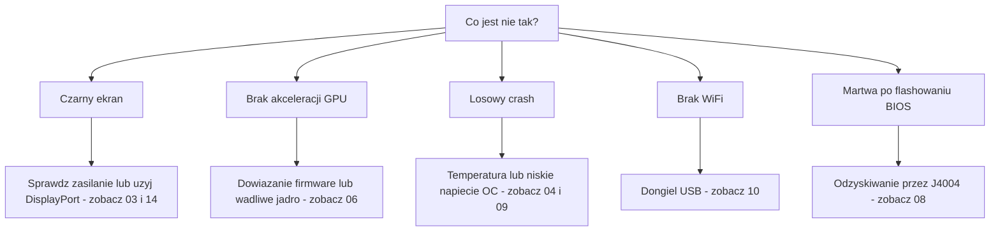

> 🌐 Tłumaczenie społecznościowe. Wersja angielska jest źródłem prawdy i może być nowsza. Znalazłeś błąd? Zgłoś to w [zgłoszeniu (issue)](https://github.com/lildebil0/awesome-bc250/issues). ([oryginał angielski](../en/troubleshooting.md))

# Rozwiązywanie problemów

> **W skrócie** — Tryby awarii BC-250 są dobrze znane: większość to **zasilanie**, **temperatura**, **jądro/firmware** albo **nieudane flashowanie**. Znajdź swój objaw poniżej, zastosuj rozwiązanie i podążaj za odnośnikiem do pełnego rozdziału. W razie wątpliwości przyczyną jest zwykle *wadliwe jądro*, *brak dowiązania symbolicznego firmware amdgpu* albo *zbyt słabe chłodzenie*.

Ta strona to indeks objaw → przyczyna → rozwiązanie, zdestylowany z powtarzających się problemów społeczności. Nie zastępuje rozdziałów — szybko kieruje cię do właściwego.

---

## Rozruch / obraz

| Objaw | Prawdopodobna przyczyna | Rozwiązanie |
|---------|--------------|-----|
| Czarny ekran / brak POST | Złe okablowanie zasilania lub pinout | Sprawdź ponownie okablowanie i pinout 8-pin; użyj prawdziwie miedzianego przewodu o odpowiednim przekroju → [03 — Zasilanie](../en/03-power-supply.md) |
| Czarny ekran / crashe po tym, jak działało | **IOMMU wciąż włączone** (zepsute na tej płycie) | Wyłącz IOMMU w BIOS-ie (elektricM); parametr jądra `iommu=off`/`amd_iommu=off` jest ⚠ do zweryfikowania → [06 — Linux](../en/06-linux.md) |
| Czarny ekran przy rozruchu **instalatora** / live USB | Instalator nie ma sterownika GPU BC-250; KMS zawodzi | Dodaj `nomodeset` w GRUB (Fedora: Troubleshooting → Basic Graphics Mode); **usuń go po zainstalowaniu Mesy** ([elektricM](https://github.com/elektricM/amd-bc250-docs/blob/main/docs/troubleshooting/boot.md)) → [06 — Linux](../en/06-linux.md) |
| Czarny ekran **po zalogowaniu** (GRUB + ekran logowania były OK) | Sesja pulpitu, zwykle **Wayland** | Wybierz X11 („GNOME on Xorg”/„Plasma X11”) przy logowaniu, albo `WaylandEnable=false` ([elektricM](https://github.com/elektricM/amd-bc250-docs/blob/main/docs/troubleshooting/display.md)) → [14 — Obraz](../en/14-display.md) |
| Uruchamia się, ale brak akceleracji GPU (wszystko na CPU) | Brak dowiązania symbolicznego firmware amdgpu albo wadliwe jądro | Zastosuj dowiązanie `navi10_gpu_info.bin` + parametry jądra; unikaj znanych wadliwych jąder (poniżej) → [06 — Linux](../en/06-linux.md) |
| `glxinfo` pokazuje **llvmpipe**, gry 5–10 FPS | Mesa za stara albo amdgpu nie załadowane | Zainstaluj **Mesa 25.1.3+**, usuń `nomodeset`, potwierdź `Kernel driver in use: amdgpu` ([elektricM](https://github.com/elektricM/amd-bc250-docs/blob/main/docs/troubleshooting/performance.md)) → [06 — Linux](../en/06-linux.md) |
| Działało, potem zepsuło się po aktualizacji jądra | Regresja w tym jądrze | Cofnij się do jądra LTS; **6.14.7**, **6.15.0–6.15.6** oraz **6.17.8–6.17.10** są zgłaszane jako psujące amdgpu (awaryjne CPU / crashe GPU); elektricM zaleca **6.18.x LTS lub 6.17.11+** ⚠ zweryfikuj dokładne zakresy → [06 — Linux](../en/06-linux.md) |
| Brak dźwięku przez HDMI | Regresja w jądrze 6.17+ | Użyj jądra LTS, albo wyprowadź dźwięk przez USB/DisplayPort → [06 — Linux](../en/06-linux.md) |
| Działa tylko jedno wyjście obrazu | Ograniczenie sterownika na tej płycie | Znane ograniczenie dla natywnego dual; **hub MST daje do 2 ekranów** (hub DP 1.4) ([elektricM](https://github.com/elektricM/amd-bc250-docs/blob/main/docs/hardware/display.md)) → [14 — Obraz](../en/14-display.md) |
| Brak obrazu, brak POST, **tylko z zainstalowanym NVMe** | SSD wciąż ma partycje EFI/recovery **Windows** | Wyjmij SSD, wymaż wszystkie partycje na innym komputerze (`wipefs -a`), zainstaluj ponownie ([elektricM](https://github.com/elektricM/amd-bc250-docs/blob/main/docs/troubleshooting/boot.md)) → [06 — Linux](../en/06-linux.md) |
| W ogóle nie przechodzi POST (brak BIOS) | Niektóre płyty nie przechodzą POST **bez baterii CMOS** | Zainstaluj świeżą CR2032 i spróbuj ponownie ([elektricM](https://github.com/elektricM/amd-bc250-docs/blob/main/docs/troubleshooting/boot.md)) → [08 — BIOS](../en/08-bios.md) |
| Rozruch **zawiesza się na ~90 s**, potem kontynuuje | Nieudana usługa systemd / timeout sieci | `systemctl --failed`; wyłącz zacinającą się jednostkę ([elektricM](https://github.com/elektricM/amd-bc250-docs/blob/main/docs/troubleshooting/boot.md)) → [06 — Linux](../en/06-linux.md) |
| Kernel panic „**unable to mount root**” / „No init found” | Złe jądro **albo** uszkodzony initramfs | Uruchom starsze/LTS jądro; jeśli wciąż zawodzi, wejdź przez chroot i zregeneruj initramfs (`dracut -f` / `update-initramfs -u -k all` / `mkinitcpio -P`) ([elektricM](https://github.com/elektricM/amd-bc250-docs/blob/main/docs/troubleshooting/boot.md)) → [06 — Linux](../en/06-linux.md) |
| Wpada w `grub>` / `grub rescue>` | GRUB nie może znaleźć swojej konfiguracji/plików rozruchowych | Ustaw `root`/`prefix`, `insmod normal`, uruchom; następnie przeinstaluj GRUB ([elektricM](https://github.com/elektricM/amd-bc250-docs/blob/main/docs/troubleshooting/boot.md)) → [06 — Linux](../en/06-linux.md) |
| Nie da się wejść do BIOS-u (Del/F2 ignorowane) | Adapter wolno się inicjalizuje albo klawiatura na USB 3.0 | Naciskaj Del od razu; spróbuj portu **USB 2.0** i natywnego kabla DP ([elektricM](https://github.com/elektricM/amd-bc250-docs/blob/main/docs/troubleshooting/display.md)) → [08 — BIOS](../en/08-bios.md) |

## Temperatura / stabilność

| Objaw | Prawdopodobna przyczyna | Rozwiązanie |
|---------|--------------|-----|
| Dławi się / FPS spada pod obciążeniem | Fabryczny radiator nie chłodzi na biurku | Zeszlifuj żebra + wentylator/osłona 120 mm o wysokim ciśnieniu statycznym; utrzymuj <80 °C → [04 — Chłodzenie](../en/04-cooling.md) |
| Losowy crash / restart pod obciążeniem | Przegrzanie (>90 °C) **albo** zbyt niskie napięcie podkręcenia | Najpierw popraw chłodzenie; następnie podnieś napięcie undervoltingu — stabilność w Furmarku ≠ stabilność w grach (gry potrzebują wyższego) → [04](../en/04-cooling.md) · [09](../en/09-overclock-undervolt.md) |
| Stabilne w Furmarku, crashe w grach | Napięcie ustawione na podstawie Furmarka, który zbyt słabo obciąża | Testuj z OCCT + prawdziwymi grami; podbij napięcie o ~50 mV → [09 — Podkręcanie](../en/09-overclock-undervolt.md) |
| Dwa governory walczące ze sobą | Uruchomione oberon-governor *oraz* smu_oc/cyan-skillfish razem | Uruchom tylko jeden governor; wyłącz pozostałe → [09 — Podkręcanie](../en/09-overclock-undervolt.md) |
| **Cały system** pada, gdy GPU się crashuje (nie tylko aplikacja) | APU: CPU+GPU dzielą krzem, więc reset GPU nie może się odzyskać — pociąga system za sobą | Spodziewane na tej architekturze; zapobiegaj crashom GPU (stabilne napięcie + dobre chłodzenie + dobre jądro), zamiast oczekiwać odzyskania ([elektricM](https://github.com/elektricM/amd-bc250-docs/blob/main/docs/troubleshooting/stability.md)) → [09 — Podkręcanie](../en/09-overclock-undervolt.md) |
| GPU się crashuje → **czarny ekran, nigdy nie wraca**, gdy działa governor | Governor wciąż zapisuje sysfs podczas resetu → zakleszczona pętla resetu | Przed grami podatnymi na crash: `systemctl stop cyan-skillfish-governor-smu`; włącz ponownie po ([elektricM](https://github.com/elektricM/amd-bc250-docs/blob/main/docs/troubleshooting/stability.md)) → [09 — Podkręcanie](../en/09-overclock-undervolt.md) |
| Zawiesza się / biały ekran już przy **60–65 °C** | Niektóre płyty są nietypowo wrażliwe na temperaturę | Popraw chłodzenie, ponownie osadź radiator, wymień pastę (PTM7950); krzem bywa różny ([elektricM](https://github.com/elektricM/amd-bc250-docs/blob/main/docs/troubleshooting/stability.md)) → [04 — Chłodzenie](../en/04-cooling.md) |
| GPU **utknięte na 1500 MHz**, nie da się zejść niżej z undervoltingiem | min. napięcie ustawione **poniżej 700 mV** — to twardy próg, który ponownie blokuje GPU | Utrzymuj min. napięcie **≥ 700 mV** ([elektricM](https://github.com/elektricM/amd-bc250-docs/blob/main/docs/troubleshooting/stability.md)) → [09 — Podkręcanie](../en/09-overclock-undervolt.md) |
| Artefakty / crashe, których więcej napięcia nie naprawia | **Spadek napięcia (droop)** pod obciążeniem (efektywne V spada poniżej ustawionego V) | Ustaw bazowe ~25 mV wyżej, by pokryć droop, albo użyj BIOS-u z modyfikacją loadline/droop ([elektricM](https://github.com/elektricM/amd-bc250-docs/blob/main/docs/troubleshooting/stability.md)) → [09 — Podkręcanie](../en/09-overclock-undervolt.md) |
| Uruchamia się, potem crashuje z **błędami ACPI** (czarny/zielony ekran) | Dziwactwo lub uszkodzenie BIOS/ACPI | Wyczyść CMOS / przywróć ustawienia domyślne BIOS-u; spróbuj `acpi=off noapic`; przeflashuj, jeśli się utrzymuje ([elektricM](https://github.com/elektricM/amd-bc250-docs/blob/main/docs/troubleshooting/stability.md)) → [08 — BIOS](../en/08-bios.md) |
| Uśpienie/wstrzymanie = **pseudo-zawieszenie** (czarny ekran, wygląda na zawieszony) | Płyta nie ma właściwych stanów uśpienia GPU; SMU nie obsługuje wstrzymania w Linuksie | Naciśnij przycisk zasilania, by wybudzić (nie przytrzymuj); lepiej **wyłącz wstrzymanie** i używaj wygaszania ekranu. Bezczynność i tak zostaje na ~65–85 W ([elektricM](https://github.com/elektricM/amd-bc250-docs/blob/main/docs/troubleshooting/stability.md)) → [09 — Podkręcanie](../en/09-overclock-undervolt.md) |

## Wydajność

| Objaw | Prawdopodobna przyczyna | Rozwiązanie |
|---------|--------------|-----|
| FPS niższy niż oczekiwano, GPU niewykorzystane do maksimum | **Ograniczenie przez CPU** (Zen 2 jest limitem w wielu grach) | Normalne; zmniejsz ustawienia obciążające CPU, pogódź się z tym — podkręcanie GPU tu nie pomoże → [11 — Gry](../en/11-gaming.md) |
| Aktywne tylko 24 CU, oczekiwano 40 | Fabrycznie udostępnia mniej CU | Zastosuj odblokowanie 40 CU (`amdgpu.bc250_cc_write_mode=3` + skrypt) → [09 — Podkręcanie](../en/09-overclock-undervolt.md) |
| Steam / FSR / vsync zepsute | Ingerencja „graczowego” forka dystrybucji | Niektóre dostrojone forki to psują; zwykła Fedora/Bazzite-bc250 jest bezpieczniejsza → [06 — Linux](../en/06-linux.md) |
| GPU **zablokowane na 1500 MHz** niezależnie od obciążenia | Brak governora w przestrzeni użytkownika (domyślnie zablokowane przez BIOS) | Zainstaluj governor GPU (cyan-skillfish-governor-smu), by skalować częstotliwość ([elektricM](https://github.com/elektricM/amd-bc250-docs/blob/main/docs/troubleshooting/performance.md)) → [09 — Podkręcanie](../en/09-overclock-undervolt.md) |
| Governor działa, ale GPU **nie przekracza 2000 MHz** | Jądru brakuje łatki zakresu częstotliwości (domyślny limit 1000–2000) | Użyj załatanego jądra (Bazzite/CachyOS są wstępnie załatane) albo zastosuj `amdgpu-frequency-range.patch` ([elektricM](https://github.com/elektricM/amd-bc250-docs/blob/main/docs/troubleshooting/performance.md)) → [09 — Podkręcanie](../en/09-overclock-undervolt.md) |
| MangoHud pokazuje **655%** użycia GPU | amdgpu pozostawia metrykę aktywności na `0xFFFF`; MangoHud odczytuje 65535/100 | Uruchom cyan-skillfish-governor-smu (gałąź smu) — łata `gpu_metrics`; nie trzeba zmieniać MangoHud. Albo zastosuj samodzielny skrypt **`install_gpu_usage_fix.sh`** ([Old Lamer — Część XV](https://youtu.be/lSipaWjU6D4)) ([elektricM](https://github.com/elektricM/amd-bc250-docs/blob/main/docs/troubleshooting/performance.md)) → [09 — Podkręcanie](../en/09-overclock-undervolt.md) |
| W teście obciążenia **bez monitora** „GPU nic nie robi” | `glmark2 --off-screen` po cichu przełącza się na **llvmpipe** (CPU) bez podłączonego ekranu | Testuj przez `clpeak` / `vkmark` / `llama-bench -ngl 99`; potwierdź, że SCLK i pobór mocy rosną ([elektricM](https://github.com/elektricM/amd-bc250-docs/blob/main/docs/troubleshooting/performance.md)) → [06 — Linux](../en/06-linux.md) |
| 60+ FPS, ale **przycina** / nierówne czasy klatek | Tempo klatek (kompozytor X11 albo tempo powiązane z dźwiękiem) | Uruchom przez **gamescope** (`-W 1920 -H 1080 -f`), albo wyłącz kompozytor / spróbuj Waylanda ([elektricM](https://github.com/elektricM/amd-bc250-docs/blob/main/docs/troubleshooting/performance.md)) → [11 — Gry](../en/11-gaming.md) |
| Gra **crashuje przez OOM / artefakty, potem pada** (RDR2, CoH3) | Konflikt **512 MB dynamicznego VRAM + ZRAM** albo po prostu **brak RAM** | Przełącz BIOS na **stały VRAM** (np. 10 GB RAM / 6 GB VRAM); **albo** wyłącz systemowy ZRAM i użyj **zswap + pliku wymiany 32 GB na Btrfs** ([Old Lamer — Część XIV](https://youtu.be/A6juAoY70aU), przepis w [06](../en/06-linux.md)/[09](../en/09-overclock-undervolt.md)) ([elektricM](https://github.com/elektricM/amd-bc250-docs/blob/main/docs/troubleshooting/stability.md)) → [08 — BIOS](../en/08-bios.md) |
| Konkretna gra (np. **RDR2**) renderuje na CPU/llvmpipe | Gra domyślnie wybiera niewłaściwy adapter graficzny | Ustaw w grze adapter na GPU AMD; RDR2: uruchom z `-useMaximumSettings` ([elektricM](https://github.com/elektricM/amd-bc250-docs/blob/main/docs/troubleshooting/performance.md)) → [11 — Gry](../en/11-gaming.md) |

## Sieć

| Objaw | Prawdopodobna przyczyna | Rozwiązanie |
|---------|--------------|-----|
| Brak WiFi w ogóle | Brak WiFi na płycie; dongiel potrzebuje sterownika | Użyj sprawdzonego dongla (aic8800d80) + zbuduj jego sterownik → [10 — WiFi/BT](../en/10-wifi-bt.md) |
| WiFi odpada co kilka minut | Chipset Realtek + zasilanie USB pod obciążeniem | Znane przy niektórych donglach RTL882x; przesiądź się na aic8800d80 albo potwierdzony model → [10 — WiFi/BT](../en/10-wifi-bt.md) |
| Sterownik znika po restarcie | Zbudowany surowym `make`, nie zapakowany | Użyj ścieżki RPM/DKMS z repozytorium, by przetrwał aktualizacje jądra → [10 — WiFi/BT](../en/10-wifi-bt.md) |
| Dostawca internetu **dławi Steam** do pełzania | DPI/dławienie ruchu CDN Steam | Narzędzia antydławiące (typu `zapret`) pomagają — ale **tylko-do-odczytu system plików Bazzite je blokuje**; użyj zmiennej dystrybucji (Fedora/Arch). Szczegóły dla rosyjskich operatorów (Yota, zapret+warp) w [wersji rosyjskiej](../ru/06-linux.md) → [06 — Linux](../en/06-linux.md) |

## Windows

| Objaw | Prawdopodobna przyczyna | Rozwiązanie |
|---------|--------------|-----|
| GPU = kod 43 / brak akceleracji | Brak działającego sterownika GPU dla Windows (według stanu na początek 2026) | Spodziewane. Użyj Linuksa. Sterowniki Windows są eksperymentalne i w toku → [07 — Windows](../en/07-windows.md) |

## BIOS / cegła

> ⚠ **Przeczytaj [08 — BIOS](../en/08-bios.md) w całości przed jakimkolwiek flashowaniem.** Złe flashowanie zamienia płytę w cegłę, a czyszczenie CMOS **nie** odzyskuje moda 1.0/3.00.

| Objaw | Prawdopodobna przyczyna | Rozwiązanie |
|---------|--------------|-----|
| Martwa/czarny ekran po flashowaniu BIOS | Zły obraz albo złe ustawienia | Odzyskiwanie zewnętrzne: podłącz CH341A do złącza **J4004** (klips SOIC-8 **nie** działa na tej płycie) i przeflashuj sprawdzony obraz → [08 — BIOS](../en/08-bios.md) |
| Programator nie może odczytać układu | Linie danych 5 V / celowanie w zły układ | Użyj 3,3 V; flashuj układ 16 MB `BIOS_A1`, nigdy 512 KB SuperIO → [08 — BIOS](../en/08-bios.md) |
| Ustawienia się nie zapisują | Stara wersja moda | Użyj moda 5.00, gdzie timingi RAM/GDDR6 faktycznie się stosują → [08 — BIOS](../en/08-bios.md) |
| Nie uruchamia się po zmianie **timingów/częstotliwości RAM** | Niestabilne ustawienia pamięci **uszkodziły BIOS** (watchdog P3.00; rosyjski czat BC-250 to zgłaszał) | Czyszczenie CMOS może nie wystarczyć — **sprzętowe przeflashowanie** (CH341A / Pi Pico) sprawdzonym obrazem. Zrób kopię działającego BIOS-u *przed* strojeniem RAM; stroj jeden timing naraz (tREF daje najwięcej) ([elektricM](https://github.com/elektricM/amd-bc250-docs/blob/main/docs/troubleshooting/stability.md)) → [08 — BIOS](../en/08-bios.md) |
| Ustawienia BIOS-u się nie zapisują → czarny ekran / mało RAM | CMOS nie wyczyszczony po flashowaniu z USB (może wymagać 2–3 czyszczeń) | Wyczyść CMOS, skonfiguruj ponownie, zrestartuj **do BIOS-u**, by potwierdzić, że 512 MB wciąż ustawione; sprawdź, że `free -h` pokazuje ~15,5 GB ([elektricM](https://github.com/elektricM/amd-bc250-docs/blob/main/docs/troubleshooting/stability.md)) → [08 — BIOS](../en/08-bios.md) |

---

## Wciąż utknąłeś?
- Sprawdź **[FAQ](faq.md)**.
- Przeszukaj czat społeczności po temacie (odnośniki **Źródła** każdego rozdziału prowadzą do realnych dyskusji).
- Prosząc o pomoc, podaj swoją **dystrybucję + wersję jądra**, **zegary/governor** oraz **chłodzenie** — te trzy rzeczy wyjaśniają większość problemów.

### Źródła do powyższych wierszy
- Przewodniki rozwiązywania problemów elektricM — [`boot.md`](https://github.com/elektricM/amd-bc250-docs/blob/main/docs/troubleshooting/boot.md) · [`display.md`](https://github.com/elektricM/amd-bc250-docs/blob/main/docs/troubleshooting/display.md) · [`performance.md`](https://github.com/elektricM/amd-bc250-docs/blob/main/docs/troubleshooting/performance.md) · [`stability.md`](https://github.com/elektricM/amd-bc250-docs/blob/main/docs/troubleshooting/stability.md) · [`hardware/display.md`](https://github.com/elektricM/amd-bc250-docs/blob/main/docs/hardware/display.md)
- Old Lamer (YouTube): [Część XIV — zswap + 32 GB wymiany na Btrfs](https://youtu.be/A6juAoY70aU) · [Część XV — `install_gpu_usage_fix.sh`](https://youtu.be/lSipaWjU6D4)
- [Wątek BC-250 na 4pda](https://4pda.to/forum/index.php?showtopic=1104980) — dławienie Steam przez rosyjskich dostawców (Yota, zapret+warp).
- Cytaty z czatu społeczności dla poszczególnych rozdziałów znajdują się w sekcji **Źródła** każdego podlinkowanego rozdziału.
