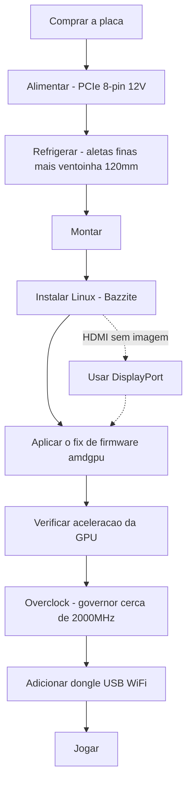

> 🌐 Tradução da comunidade. A versão em inglês é a fonte da verdade e pode estar mais atualizada. Achou um erro? Abra uma issue: [../en/00-start-here.md](../en/00-start-here.md) · https://github.com/lildebil0/awesome-bc250/issues

# Comece por aqui — Do zero ao jogo

> **TL;DR** — Você comprou (ou está prestes a comprar) uma AMD BC-250. É uma placa APU derivada do PlayStation 5 com 16 GB de GDDR6 que vira uma máquina barata de Linux para jogos/IA — **se** você resolver três coisas na ordem: **alimentação**, **refrigeração** e **drivers do Linux**. Esta página é a linha reta entre uma placa na caixa e um jogo rodando. Siga os passos; cada um leva a um capítulo completo.

Esta placa é um projeto, não um PC plug-and-play. Reserve um fim de semana. As duas formas mais comuns de matar uma placa cedo são **cabeamento de alimentação errado** e **deixá-la rodar quente** — por isso começamos por aí.

---

## Antes de começar — peças e ferramentas

Tenha tudo isto à mão *antes* de começar, para não descobrir cada item no meio da montagem:

- **PSU** com uma saída PCIe de 8 pinos a 12 V → **[03 — Fonte de alimentação](../en/03-power-supply.md)**
- **Ventoinha de 120 mm de alta pressão estática** + duto impresso → **[04 — Refrigeração](../en/04-cooling.md)** / **[05 — Gabinetes e impressão 3D](../en/05-case.md)**
- Um **gabinete ou suporte impresso** → **[05 — Gabinetes e impressão 3D](../en/05-case.md)**
- **Pendrive ≥ 16 GB** para o instalador do Linux
- Um **cabo DisplayPort** (ou adaptador DP→HDMI — o HDMI da placa muitas vezes não mostra nada, DisplayPort é o mais seguro)
- Uma **chave de fenda**
- Um **multímetro** — para testar o cabeamento da PSU com ímã/continuidade → **[03 — Fonte de alimentação](../en/03-power-supply.md)**

---

## O caminho



### 0. Saiba o que você tem
Uma BC-250 é um blade de servidor/mineração: uma APU (CPU Zen 2 + GPU classe RDNA2, "Cyan Skillfish/Oberon"), 16 GB de GDDR6, **dissipador passivo**, alimentada por um único **PCIe de 8 pinos a 12 V**. Sem WiFi integrado, sem driver de GPU funcional no Windows, sem codificação de vídeo por hardware. → **[01 — O que é a BC-250](../en/01-what-is-bc250.md)**

### 1. Compre a coisa certa
Saiba qual é um preço justo, o que vem na caixa (só a placa? dissipador? PSU?) e quais vendedores/golpes evitar. → **[02 — Guia de compra](../en/02-buying.md)**

### 2. Resolva a alimentação *antes do primeiro boot*
A placa pede ~235 W (mais com overclock) em 12 V por um PCIe de 8 pinos. Use uma PSU de verdade (server Flex / brick Mean Well / ATX), faça a fiação do 8 pinos corretamente com **fio de cobre genuíno de bitola adequada**, e não chute o pinout — um erro aqui é uma placa morta. → **[03 — Fonte de alimentação](../en/03-power-supply.md)**

### 3. Acerte a refrigeração *antes de exigir dela*
O dissipador de fábrica foi feito para um túnel de vento de rack e **faz throttling em cima da mesa**. Afine as aletas e parafuse uma ventoinha de 120 mm de alta pressão estática através de um duto impresso (ou use um AIO). Meta: ficar abaixo de ~80 °C no Furmark. → **[04 — Refrigeração](../en/04-cooling.md)**

### 4. Coloque num gabinete (opcional, mas legal)
Imprima um gabinete estilo console que acomode a placa, a ventoinha e a PSU com fluxo de ar de verdade. Catálogo de STLs da comunidade. → **[05 — Gabinetes e impressão 3D](../en/05-case.md)**

### 5. Monte tudo
Ordem física das operações para um build mínimo: monte a ventoinha no duto impresso → encaixe/parafuse o duto sobre as aletas (já afinadas) do dissipador → assente a placa no gabinete/suporte → conecte o 8 pinos da PSU à placa (pinout correto, **[03 — Fonte de alimentação](../en/03-power-supply.md)**) → conecte um cabo DisplayPort ao monitor → ligue e confirme que ela **faz POST** (POST = autoteste de inicialização; ela liga e gera vídeo — você vê uma imagem / a ventoinha gira). Faça qualquer lixamento de aletas *antes* da montagem (veja **[04 — Refrigeração](../en/04-cooling.md)**) e mantenha o pó metálico longe da placa.

> Uma foto/diagrama etiquetado desta montagem é uma contribuição bem-vinda — o repositório ainda não tem uma.

### 6. Instale o Linux + drivers de GPU
Este é o passo decisivo. O mais fácil para iniciantes: uma **imagem baseada no Bazzite** feita para a BC-250 (ou **Fedora 43** — a outra escolha "simplesmente funciona" do elektricM; o Fedora 42 chegou ao fim de vida). Depois aplique o **fix de firmware do amdgpu** (o symlink `navi10_gpu_info.bin`) e os parâmetros de kernel, regenere o initramfs/grub e verifique se a GPU está acelerada (`vainfo`, `dmesg`). → **[06 — Drivers e configuração do Linux](../en/06-linux.md)**

> **Duas configurações que causam horas de dor se você pular** (elektricM): na BIOS modificada, defina **VRAM = 512 MB dinâmica** e **desative o IOMMU** (um IOMMU quebrado causa falhas de vídeo e travamentos), depois **limpe o CMOS** após o flash. Instale com o parâmetro de boot `nomodeset` e **remova-o assim que os drivers estiverem prontos**. O Mesa **25.1+** é o piso (25.3.x recomendado). E **evite os kernels 6.15.0–6.15.6 e 6.17.8–6.17.10** — eles quebram o driver da GPU; use um 6.18 LTS / 6.17.11+ / 6.12–6.14 LTS no lugar. ([guia rápido do elektricM](https://elektricm.github.io/amd-bc250-docs/getting-started/quick-start/), [referência rápida](https://elektricm.github.io/amd-bc250-docs/reference/quick-reference/))

> Pensando em Windows? No início de 2026 **não há driver de GPU funcional para Windows** — é experimental. Use Linux. → **[07 — Windows](../en/07-windows.md)**

### 7. Verifique se funciona no padrão, depois faça overclock
Quando o desktop estiver acelerado, instale o **oberon-governor** e suba os clocks (1500 MHz de fábrica é fraco; **2000 MHz ≈ +30 % de FPS**). Opcionalmente, desbloqueie todas as **40 CUs** e faça undervolt. Re-teste as temperaturas nos novos clocks. → **[09 — Overclocking e undervolting](../en/09-overclock-undervolt.md)**

### 8. Conecte-se à internet
Sem WiFi integrado — adicione um **dongle USB comprovadamente bom** (o aic8800d80 é o favorito da comunidade) e seu driver. → **[10 — WiFi e Bluetooth](../en/10-wifi-bt.md)**

### 9. Jogue
Tenha expectativas realistas (a CPU Zen 2 costuma ser o limite, não a GPU), ligue o FSR e use as configurações por jogo da comunidade. → **[11 — Resultados em jogos e configurações](../en/11-gaming.md)**

### Bônus — rode LLMs locais
16 GB de VRAM é muita coisa pelo preço. Rode o llama.cpp no backend **Vulkan** (o ROCm é um beco sem saída nesta GPU). → **[12 — IA / LLM](../en/12-ai-llm.md)**

### Bônus — emulação
Switch, PS3, PS4, retrô, arcade — o que de fato roda e como → **[15 — Emulação](../en/15-emulation.md)**

> Sem imagem no primeiro boot? A placa gera saída por **DisplayPort** (o HDMI costuma ficar sem imagem) → **[14 — Vídeo e saída de imagem](../en/14-display.md)**. Sem portas USB ou adicionando um drive? → **[16 — USB, hubs e armazenamento](../en/16-usb-peripherals.md)**

---

## Se algo quebrar
Tela preta, sem aceleração, resets aleatórios, queda de dongle, um brick após o flash da BIOS — veja a **[Solução de problemas](troubleshooting.md)** e o **[FAQ](faq.md)**.

> Fazer flash de uma BIOS modificada **não** é um passo inicial. Pode brickar a placa e exige hardware de recuperação. Só vá por aí de forma deliberada. → **[08 — BIOS e recuperação de brick](../en/08-bios.md)**

---

## O checklist de 60 segundos

| Passo | Pronto quando |
|------|-----------|
| Alimentação | PSU ligada ao 8 pinos, pinout correto, fio de cobre genuíno, placa faz POST |
| Refrigeração | Aletas afinadas + ventoinha/duto de 120 mm; <80 °C no Furmark |
| SO | Bazzite-bc250 instalado, dá boot até o desktop |
| GPU | `vainfo`/`dmesg` mostram o amdgpu ativo, não fallback de CPU |
| Overclock | oberon-governor rodando, ~2000 MHz, estável num jogo de verdade |
| Rede | Dongle USB conecta e se mantém |
| Jogo | Roda no FPS esperado para seus clocks |

Quando toda linha estiver marcada, está pronto. Bem-vindo ao clube da BC-250.

---

## Referência rápida (cola)

Comandos e configurações que você mais vai precisar, condensados da [referência rápida](https://elektricm.github.io/amd-bc250-docs/reference/quick-reference/) do elektricM. O detalhe completo está em **[06 — Linux](../en/06-linux.md)** e **[09 — Overclocking](../en/09-overclock-undervolt.md)**.

**BIOS:** VRAM `512MB` dinâmica · IOMMU **Desativado** · boot UEFI · limpe o CMOS após cada flash por USB.

**Verifique se a GPU está acelerada (não llvmpipe/CPU):**
```bash
glxinfo | grep "OpenGL version"          # Mesa 25.1+ expected
vulkaninfo | grep deviceName             # → AMD Radeon Graphics (RADV GFX1013)
cat /sys/class/drm/card0/device/pp_dpm_sclk   # multiple freqs, current marked *
```

**Governor** (sem ele os clocks travam em 1500 MHz). O nosso usa o `oberon-governor` por padrão; o elektricM entrega o fork SMU mais novo via COPR — qualquer um funciona:
```bash
sudo dnf copr enable filippor/bazzite
sudo dnf install cyan-skillfish-governor-smu          # rpm-ostree install … on Bazzite
sudo systemctl enable --now cyan-skillfish-governor-smu.service
systemctl status cyan-skillfish-governor-smu          # → active (running)
```
> Piso de voltagem **700 mV** — abaixo disso a GPU trava em 1500 MHz. O governor pode mirar na placa errada (card0 vs card1) — verifique se o scaling não entrar.

**Remova o `nomodeset` depois que os drivers estiverem prontos:**
```bash
# GRUB distros: drop "nomodeset" from /etc/default/grub, then
sudo grub2-mkconfig -o /boot/grub2/grub.cfg && sudo reboot
# Bazzite / Fedora Atomic:
rpm-ostree kargs --delete-if-present="nomodeset" && systemctl reboot
```

**Opção de inicialização do Steam** que corrige glitches gráficos em alguns jogos: `RADV_DEBUG=nohiz %command%`.

**Travando em RDR2 / Company of Heroes 3?** Troque a VRAM de `512MB` dinâmica para **10GB/6GB fixos** (conflito com o ZRAM). ([referência rápida do elektricM](https://elektricm.github.io/amd-bc250-docs/reference/quick-reference/))
