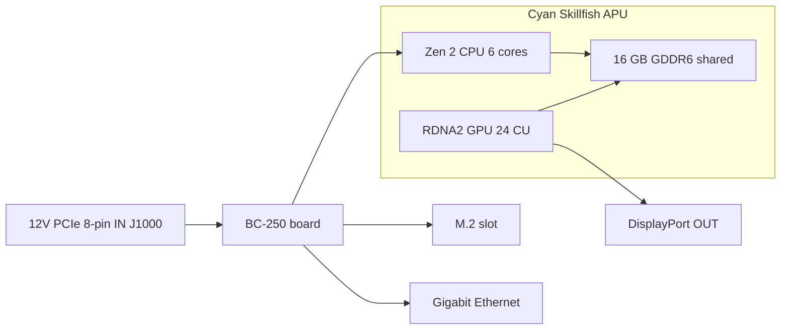

> 🌐 Tradução da comunidade. A versão em inglês é a fonte da verdade e pode estar mais atualizada. Achou um erro? Abra uma issue: [../en/01-what-is-bc250.md](../en/01-what-is-bc250.md) · https://github.com/lildebil0/awesome-bc250/issues

# O Que É a BC-250

> **TL;DR** — A BC-250 é uma **APU de classe PlayStation 5 sobre uma placa de servidor/mineração**. Um único chip (codinome AMD **Cyan Skillfish**, uma versão reduzida do silício **Oberon/Ariel** do PS5) carrega uma **CPU Zen 2 de 6 núcleos / 12 threads** e uma **GPU RDNA 2 de 24 unidades de computação**, alimentada por **16 GB de GDDR6 soldada**. Ela **não é uma placa de vídeo nem um PC normal** — não tem **a BIOS x86 que você conhece, nem slot PCIe, nem plugue ATX de 24 pinos**: ela recebe **12 V direto em um conector de alimentação PCIe de 8 pinos** e dá boot no próprio firmware. As pessoas a compram porque é uma **máquina baratíssima de Linux para jogos / IA local**. As pessoas se irritam com ela porque os **drivers, a refrigeração e a falta de codificação de vídeo por hardware** fazem dela um projeto, não uma máquina plug-and-play. Se você quer zero dor de cabeça, esta placa é a compra errada — devolva agora. Se você gosta de mexer, continue lendo.

Esta página é a referência do "o que foi que eu comprei". Alimentação, refrigeração, instalação do SO e drivers cada um tem sua própria seção ([03](03-power-supply.md) / [04](04-cooling.md) / [06](06-linux.md)).

---

## O que ela realmente é

A AMD construiu a BC-250 como um **acelerador de mineração de criptomoedas** (o "BC" vem de blockchain). Para deixá-la barata, a AMD reaproveitou **silício de processador do PlayStation 5 que sobrou** — a mesma família de chip que a Sony coloca no console. Uma placa é uma APU mais sua memória e circuitos de alimentação; é esse o produto inteiro.

Jargão, definido de uma vez:

- **APU** (Accelerated Processing Unit) — o nome da AMD para um único chip que contém **tanto a CPU quanto a GPU**. Não há placa de vídeo separada; a GPU está dentro do mesmo encapsulamento, compartilhando a mesma memória.
- **Cyan Skillfish** — o **codinome** de engenharia da AMD para esta APU. Você vai vê-lo em todo lugar no Linux: o arquivo de firmware da GPU é literalmente `cyan_skillfish_gpu_info.bin` ([src](https://t.me/c/2424231195/57962) — veja a correção do symlink em [src](https://t.me/c/2424231195/41252)). Ferramentas também podem reportá-la sob os nomes de die do PS5 **Oberon** / **Ariel**.
- **GDDR6** — a memória gráfica rápida normalmente encontrada em uma placa de vídeo. Na BC-250 ela é a **RAM do sistema e a RAM de vídeo ao mesmo tempo** (a CPU e a GPU compartilham um único pool). Não há slots DIMM; os 16 GB são soldados e não atualizáveis.
- **RDNA 2** — a geração de arquitetura da GPU (mesma família do PS5, do Xbox Series e das placas Radeon RX 6000).

O chip é uma peça de PS5 **reduzida**, não a completa. A comunidade fixou esta comparação ([src](https://t.me/c/2424231195/11282), citando a [entrada da Oberon no TechPowerUp](https://www.techpowerup.com/gpu-specs/amd-oberon.g936)):

| | BC-250 | PS5 completo (Oberon) |
|---|---|---|
| Núcleos / threads da CPU | **6 / 12** | 8 / 16 |
| Unidades de computação da GPU (CU) | **24** | 36 |

Uma "unidade de computação" é um bloco de núcleo da GPU; 24 delas é mais ou menos território de GPU de notebook de gama média, que é exatamente a faixa de desempenho que o chat reporta em jogos.

A BC-250 não é o único "silício de console que sobrou sobre uma placa de desktop" da AMD. Ela tem dois primos próximos construídos a partir da mesma ideia: o **AMD 4700S Desktop Kit** (um kit de CPU derivado do **PlayStation 5**) — que o chat avisa ser confundido com a BC-250 em anúncios de marketplaces ([02-buying.md](02-buying.md)) — e o **AMD 4800S Desktop Kit**, a versão derivada do **Xbox Series X** (8 núcleos Zen 2 ligados a GDDR6, com a GPU RDNA 2 do console desativada). Ambos são produtos AMD reais que, como a BC-250, combinam uma CPU de console aproveitada com GDDR6 soldada ([VideoCardz](https://videocardz.com/newz/amd-4800s-desktop-kit-a-pc-repurposed-apu-from-xbox-series-x-has-been-tested)). Eles são contexto útil para distinguir a BC-250 de seus irmãos na hora de comprar.

As pessoas rodaram **Linux desktop na BC-250 do mesmo jeito que o próprio PS5 foi desbloqueado** — vídeo + áudio 4K HDMI completos, todas as portas USB funcionando, a APU subindo até ~3,2 GHz na CPU e ~2,0 GHz na GPU ([src](https://t.me/c/2424231195/122260)).

---

## No que ela é boa

- **O jeito mais barato de entrar em jogos no Linux nesta faixa de desempenho.** Através do Steam/Proton (uma camada de compatibilidade que roda jogos de Windows no Linux) as pessoas jogam Star Citizen ([src](https://t.me/c/2424231195/38702)), e até títulos modernos como *Doom: The Dark Ages* via um wrapper Vulkan da comunidade a ~60 FPS no low/FSR ([src](https://t.me/c/2424231195/127696)). Resultados por jogo estão em [11-gaming.md](11-gaming.md).
- **Uma máquina capaz de IA local.** Com 16 GB de GDDR6 ela consegue segurar modelos de linguagem de tamanho médio. Os membros rodam LLMs localmente através do `llama.cpp`/`jan` no backend **Vulkan**; você configura a BIOS para alocar 12 GB à GPU primeiro ([src](https://t.me/c/2424231195/92421)). Veja [12-ai-llm.md](12-ai-llm.md).
- **Pequena e autocontida.** É uma única placa comprida com o dissipador estilo GPU embutido — ela cabe em gabinetes pequenos DIY/impressos em 3D e funciona com uma única fonte de alimentação pequena ([build src](https://t.me/c/2424231195/137825)).

O consenso da comunidade sobre *por que* ela funciona afinal: porque o chip é tão próximo do hardware do Steam Deck / PS5, a Valve e o stack gráfico open-source Mesa continuam melhorando exatamente os mesmos drivers, então a BC-250 pega carona de graça ([src](https://t.me/c/2424231195/93006)).

---

## O que é doloroso (ajuste as expectativas)

Esta é a metade que os novatos subestimam. Nada disso é um impeditivo, mas tudo isso é trabalho de verdade.

- **Os drivers são uma tarefa do tipo faça-você-mesmo.** A AMD **não fornece driver oficial nem documentação pública** para esta placa ([src](https://t.me/c/2424231195/37764)). Tudo — o stack gráfico do Linux, o "governor" de clock/tensão, a BIOS — é construído pela comunidade. Espere seguir scripts de setup e ocasionalmente consertar coisas na mão. Comece em [06-linux.md](06-linux.md).
- **A refrigeração é a coisa #1 que as pessoas erram.** O dissipador de fábrica foi projetado para o túnel de ar forçado de um rack de mineração, então em uma mesa ele superaquece e entra em throttling de fábrica. Você vai precisar modificar a refrigeração. Isso tem sua própria seção — leia [04-cooling.md](04-cooling.md) **antes** de perseguir desempenho.
- **Sem codificador de vídeo por hardware.** O bloco de codificação de vídeo da GPU (o que a AMD chama de **VCN** — o circuito dedicado que comprime vídeo para streaming/gravação) **não está disponível**. Gravação de tela e streaming de jogo recorrem a um **codificador por software**, que custa CPU. Funciona (as pessoas fazem streaming via Sunshine/Moonlight) mas é mais lento e de qualidade inferior a uma GPU normal ([src](https://t.me/c/2424231195/88026)). Da mesma forma, o driver Mesa inicial era famosamente **renderização por software** até a comunidade fazer a aceleração por hardware funcionar ([src](https://t.me/c/2424231195/11243)).
- **Alimentação estranha e sem vídeo por padrão.** Ela não aceita um conector ATX padrão de 24 pinos — veja a próxima seção. Muitas placas também chegam precisando de um **reset de BIOS** antes mesmo de dar POST ([src](https://t.me/c/2424231195/57930)), e você normalmente envia imagem por **DisplayPort** (o HDMI precisa de um adaptador DP→HDMI, que também carrega áudio sem problemas — [src](https://t.me/c/2424231195/9148)).
- **É uma placa de quem gosta de mexer, ponto.** Como um membro de longa data colocou: apesar de ser barata, a BC-250 "exige certas habilidades, esforço e cabeça" ([src](https://t.me/c/2424231195/73002)). Reserve tempo, não só dinheiro.
- ⚠ **Uma eGPU não vai salvá-la — reportado pela comunidade (r/BC250Gaming).** O único slot M.2 é apenas **PCIe 2.0 ×2** (veja o cartão de hardware abaixo), e nessa largura de banda uma GPU externa pendurada no M.2 é **reportada como tendo desempenho *pior* que a GPU RDNA 2 onboard** — o link lento a estrangula. Se você quer mais poder gráfico, o consenso é que esta não é a placa para isso. *(Reportado pela comunidade; trate como um aviso, não como um benchmark.)*

> ⚠ **O que o LED bicolor significa — reportado pela comunidade (r/BC250Gaming).** O LED de duas cores ao lado da NIC é um **indicador de utilização da era da mineração, não uma luz de erro**: por relatos da comunidade **vermelho = a GPU/RAM *não* está em 100 % de utilização, verde = utilização total**. Então uma luz vermelha em uma placa de desktop ociosa é normal, não um defeito. *(Reportado pela comunidade; a AMD não fornece documentação para esta placa, então trate o mapeamento exato de cores como não confirmado.)*

> ⚠ **Aviso de manuseio, aprendido do jeito difícil.** **Não** deixe nada metálico tocar a placa energizada, e só troque a pasta térmica com cuidado — um membro matou permanentemente sua BC-250 ao causar um curto nela ([src](https://t.me/c/2424231195/95998)). As placas também chegam levemente **tortas** por causa da montagem do dissipador; um membro consertou um caso de não-boot calçando a placa reta contra o dissipador com papel ([src](https://t.me/c/2424231195/117347)).

---

## Cartão de Referência de Hardware

As especificações são conferidas contra a engenharia reversa de hardware da comunidade (a AMD não publica datasheet). Os números de barramento de memória e dimensões físicas, antes não confirmados, agora vêm da [especificação de hardware do elektricM](https://github.com/elektricm/elektricm) (que credita mothenjoyer69 / Segfault / neggles / yeyus pela engenharia reversa). O pinout e os números de alimentação abaixo vêm do documento de hardware canônico da comunidade.

A placa em um relance — alimentação entrando à esquerda, a APU e sua memória compartilhada no meio, I/O à direita:



### Especificações principais

| Especificação | Valor | Fonte |
|------|-------|--------|
| Classe | APU derivada do PlayStation 5 sobre uma placa de mineração/servidor | [hardware.md](https://github.com/mothenjoyer69/bc250-documentation/blob/main/hardware.md) |
| Codinome da APU | **Cyan Skillfish** (die do PS5: Oberon / Ariel) | chat ([src](https://t.me/c/2424231195/57962)) |
| CPU | **6 núcleos / 12 threads, Zen 2** (6 núcleos confirmados) | [hardware.md](https://github.com/mothenjoyer69/bc250-documentation) · chat ([src](https://t.me/c/2424231195/11282)) |
| Clock da CPU | até **~3,49 GHz** ("mais ou menos") | [hardware.md](https://github.com/mothenjoyer69/bc250-documentation) · chat ([src](https://t.me/c/2424231195/122260)) |
| GPU | **24 unidades de computação, RDNA 2** (`gfx1013`; o SoC do PS5 tem 36); rasterização ≈ **entre RX 6600 e RX 6600 XT** / classe GTX 1660 Ti; **Vulkan 1.4** | [hardware.md](https://github.com/mothenjoyer69/bc250-documentation) · chat ([src](https://t.me/c/2424231195/11282)) · [elektricM](https://github.com/elektricm/elektricm) |
| Clock da GPU | ~1500 MHz de fábrica, ~2000 MHz em overclock (≈2,23 GHz máx) | ([src](https://t.me/c/2424231195/122260)) · [09](09-overclock-undervolt.md) |
| Memória | **16 GB GDDR6**, compartilhada entre CPU e GPU, soldada (não atualizável) | [hardware.md](https://github.com/mothenjoyer69/bc250-documentation) · [README](../../README.md) |
| Alocação de VRAM da GPU | definida na BIOS; **12 GB** selecionáveis na BIOS 3.00+ | ([src](https://t.me/c/2424231195/92421)) |
| Barramento / largura de banda de memória | GDDR6 de **256 bits** @ **14 Gbps**, **~448 GB/s** | [especificação de hardware do elektricM](https://github.com/elektricm/elektricm) |
| TDP | **220 W** (potência de projeto térmico da placa) | [hardware.md](https://github.com/mothenjoyer69/bc250-documentation) |
| Consumo de energia | ~67–85 W típico sob carga de classe mineração | [hashrate.no](https://www.hashrate.no/gpus/bc250) |
| Codificação de vídeo por hardware (VCN) | **Nenhuma** — apenas codificação por software | ([src](https://t.me/c/2424231195/88026)) |
| Saída de vídeo | **DisplayPort 1.4** (até **4K@120 / 8K@60**); use adaptador DP→HDMI para HDMI; carrega áudio | ([src](https://t.me/c/2424231195/9148)) · [elektricM](https://github.com/elektricm/elektricm) |
| Armazenamento (M.2) | 1x M.2 2280 — **PCIe 2.0 x2 ou SATA III** | [elektricM](https://github.com/elektricm/elektricm) |
| 2º DisplayPort | presente mas **não populado**; pode ser ativado por software | ([src](https://t.me/c/2424231195/88026)) |
| Tamanho físico | **340 mm / 310 mm** de comprimento (conforme o método de medição), **~115 mm** de largura, **~400 g** com dissipador; fator de forma de mineração customizado e fora do padrão | [especificação de hardware do elektricM](https://github.com/elektricm/elektricm) |

> ⚠ **Overclock de GDDR6 = largura de banda, não FPS — reportado pela comunidade (r/BC250Gaming).** Por relatos da comunidade, fazer overclock da GDDR6 eleva a largura de banda de memória de cerca de **~256 GB/s para ~445 GB/s**, mas não entrega **nenhum ganho em jogos** — as 24 CUs da GPU, e não a largura de banda de memória, são o gargalo, então a largura de banda extra fica sem uso nos jogos. (Note que o número *de fábrica* verificado do repositório acima já é **~448 GB/s** a 256 bits / 14 Gbps, então a "linha de base de ~256 GB/s" da comunidade não bate com a ficha técnica — trate os números exatos de GB/s como não confirmados; a conclusão de que você não ganha FPS é a parte durável.) Para overclock de GPU/memória em geral veja [09-overclock-undervolt.md](09-overclock-undervolt.md).

> **Sobre as dimensões da placa:** a [especificação de hardware do elektricM](https://github.com/elektricm/elektricm) dá **340 mm / 310 mm** de comprimento (os dois números refletem métodos de medição diferentes), **~115 mm** de largura e **~400 g** com o dissipador, em um fator de forma de mineração customizado e fora do padrão. O próprio `hardware.md` canônico não lista dimensões; o post de hardware com mais reações do chat é literalmente intitulado *"Размеры amd bc-250"* ("dimensões da AMD BC-250", ❤20 — [src](https://t.me/c/2424231195/379)), confirmando que as pessoas se importam com isso para a construção de gabinetes. Para encaixe exato de gabinete, trabalhe a partir de um modelo 3D medido — os STLs da placa catalogados pela comunidade (por ex. `BC250 Board.stl`, [Printables 1103626](https://www.printables.com/model/1103626-amd-bc250-board) e o modelo preciso em [Printables 1341336](https://www.printables.com/model/1341336-accurate-3d-model-of-the-amd-bc-250-board)) são dimensionalmente corretos. Veja [05-case.md](05-case.md).

<p align="center">
  <br>
  <sub>Foto: comunidade AMD BC-250 · <a href="https://t.me/c/2424231195/379">fonte</a></sub>
</p>

### Pinout do conector de alimentação (leia isto antes de plugar qualquer coisa)

A BC-250 **não tem header ATX de 24 pinos**. Ela é alimentada **apenas por 12 V**, entregues através de um **conector de alimentação PCIe de 8 pinos (J1000)** — o mesmo plugue físico de uma placa de vídeo, mas a placa espera todos os três contatos de alimentação alimentados a 12 V. Fiação completa e escolha de PSU estão em [03-power-supply.md](03-power-supply.md); o pinout canônico de [hardware.md](https://github.com/mothenjoyer69/bc250-documentation/blob/main/hardware.md):

**J1000 — alimentação PCIe principal de 8 pinos (este é o que você conecta):**

```
[ GND  GND  GND  GND ]
[ GND  12V  12V  12V ]
```

- Três contatos de 12 V; o documento classifica os contatos Mini-Fit Jr em **até 9 A cada**, então este conector "pode fornecer até **324 W** com segurança", e recomenda fio **16 AWG** para uso autônomo ([hardware.md](https://github.com/mothenjoyer69/bc250-documentation)).
- **GND = terra (0 V), 12V = +12 volts.** Acerte a polaridade — esta placa não perdoa tensão reversa.

**J2000 / J2001 — conectores de alimentação de rack (normalmente NÃO usados em uma mesa):**

```
        J2000                  J2001
 [ LED1  12V  12V  12V ]   [ 12V  12V  12V  PGD ]
 [ LED2  GND  GND  GND ]   [ GND  GND  GND  GND ]
```

- Estes são conectores **Molex Micro-Fit BMI** ([part 444280801](https://www.molex.com/en-us/products/part-detail/444280801)), *não* plugues PCIe/EPS — eles alimentavam a placa dentro de seu chassi original de mineração. **J2000 e J2001 não são idênticos:** como o pinout acima mostra, o J2000 carrega os pinos **LED1/LED2** enquanto o J2001 carrega o pino **PGD**, então os dois conectores diferem ([docs de hardware elektricM / mothenjoyer69](https://github.com/mothenjoyer69/bc250-documentation)).
- **PGD** (no J2001) é um pino de power-good/sense: ele vê **5 V quando a placa está encaixada na PSU2 do rack**. Em uma build autônoma você normalmente alimenta via J1000 em vez disso e pode ignorar J2000/J2001 — mas confirme contra [03-power-supply.md](03-power-supply.md) para o seu adaptador de PSU específico.

---

## Para onde ir em seguida

1. **[02-buying.md](02-buying.md)** — se você ainda não comprou, ou quer saber qual é um preço justo e os riscos reais.
2. **[03-power-supply.md](03-power-supply.md)** — como de fato alimentá-la (12 V no 8 pinos).
3. **[04-cooling.md](04-cooling.md)** — faça isto **antes** de qualquer outra coisa assim que a placa estiver em mãos.
4. **[06-linux.md](06-linux.md)** — coloque um SO e os drivers da comunidade nele.

---

## Fontes

- Documento de hardware canônico & pinout — [mothenjoyer69/bc250-documentation `hardware.md`](https://github.com/mothenjoyer69/bc250-documentation/blob/main/hardware.md)
- Barramento/largura de banda de memória, dimensões físicas, posicionamento da GPU, DP 1.4, M.2 — [especificação de hardware do elektricM](https://github.com/elektricm/elektricm) (credita mothenjoyer69 / Segfault / neggles / yeyus pela engenharia reversa)
- Silício reduzido vs PS5 completo (6/12 + 24 CU vs 8/16 + 36 CU) — https://t.me/c/2424231195/11282 · [TechPowerUp Oberon](https://www.techpowerup.com/gpu-specs/amd-oberon.g936)
- Linux no hardware do PS5, 4K HDMI, clocks — https://t.me/c/2424231195/122260
- Sem driver oficial / sem docs — https://t.me/c/2424231195/37764
- Renderização por software / sem codificação por hardware — https://t.me/c/2424231195/11243 · https://t.me/c/2424231195/88026
- DisplayPort + áudio DP→HDMI — https://t.me/c/2424231195/9148
- Nome do firmware Cyan Skillfish — https://t.me/c/2424231195/57962 · https://t.me/c/2424231195/41252
- LLM local + 12 GB de VRAM via BIOS 3.00 — https://t.me/c/2424231195/92421
- "Exige habilidades, esforço e cabeça" — https://t.me/c/2424231195/73002
- Aviso de manuseio/curto-circuito — https://t.me/c/2424231195/95998 · correção de placa torta — https://t.me/c/2424231195/117347
- "Dimensões da BC-250" (post de hardware com mais reações) — https://t.me/c/2424231195/379
- TDP de 220 W, CPU de 6 núcleos/3,49 GHz, GPU de 24 CU, 16 GB GDDR6 (confirmação do repositório) — [mothenjoyer69/bc250-documentation README](https://github.com/mothenjoyer69/bc250-documentation)
- Números de consumo de energia de classe mineração — https://www.hashrate.no/gpus/bc250
- Por que ela continua funcionando (esforço de driver compartilhado Steam Deck/PS5) — https://t.me/c/2424231195/93006
- Kits irmãos — AMD 4700S (kit de CPU do PS5, confundido com a BC-250, [02-buying.md](02-buying.md)) e AMD 4800S (CPU do Xbox Series X + GDDR6, GPU desativada) — [VideoCardz: 4800S Desktop Kit](https://videocardz.com/newz/amd-4800s-desktop-kit-a-pc-repurposed-apu-from-xbox-series-x-has-been-tested)
- eGPU-sobre-M.2 mais lenta que a GPU onboard (o M.2 é PCIe 2.0 ×2), LED bicolor da NIC = sinal de utilização (vermelho = não 100 % util, verde = util total), overclock de GDDR6 eleva a largura de banda (~256→~445 GB/s) sem ganho em jogos — reportado pela comunidade (r/BC250Gaming)

> A AMD não publica datasheet primário para esta placa; os números acima são a melhor engenharia reversa da comunidade (o `hardware.md` canônico mais a especificação de hardware do elektricM). Correções são bem-vindas via PR (veja [CONTRIBUTING.md](../../CONTRIBUTING.md)).
