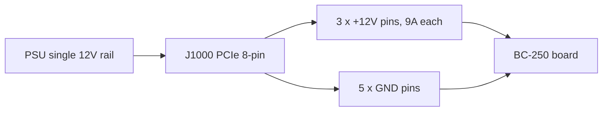

> 🌐 Tradução da comunidade. A versão em inglês é a fonte da verdade e pode estar mais atualizada. Achou um erro? Abra uma issue: [../en/03-power-supply.md](../en/03-power-supply.md) · https://github.com/lildebil0/awesome-bc250/issues

# Fonte de Alimentação

> **TL;DR** — A BC-250 **não tem botão de liga/desliga nem plugue de energia padrão de PC**. Ela consome **12 V** através de um único conector **PCIe 8-pin (6+2)** — o mesmo plugue que uma placa de vídeo de desktop usa — e tem pico em torno de **~235 W** (mais se você fizer overclock). Você precisa de uma fonte de 12 V capaz de entregar **~250–300 W em um único rail**. Três caminhos que a comunidade segue: uma **PSU "Flex" de servidor** barata (HP 500 W, ~US$ 12 no eBay), um **brick industrial** (Mean Well LOP-300/LOP-500) ou uma **PSU ATX normal** (basta plugar o cabo PCIe dela). Os dois assassinos a evitar: uma **PSU antiga que divide os 12 V em rails fracos** e **fios falsos de aço revestido de cobre** que superaquecem e pegam fogo. Use cobre genuíno, **16 AWG ou mais grosso**.

Alimentar a placa é a **segunda coisa que um novato precisa acertar** (depois do [resfriamento](04-cooling.md)) — e a que tem mais probabilidade de começar um incêndio se você economizar na fiação.

---

## O que a placa realmente precisa

A BC-250 é um die de PlayStation 5 reduzido sobre uma placa de mineração de cripto/servidor. Ela foi feita para ficar em um rack e ser alimentada com 12 V — então ela **não tem nenhuma das conveniências de um PC normal**:

- **Sem conector** de placa-mãe **ATX 24-pin**.
- **Sem botão de liga/desliga** — ela liga no instante em que os 12 V chegam (o próprio interruptor da PSU é o seu botão de energia).
- **Uma única tarefa para a PSU: entregar 12 V com corrente suficiente.**

**Números de potência (confirmados):**

| Especificação | Valor | Fonte |
|------|-------|--------|
| Tensão de entrada | 12 V DC | [hardware.md](https://github.com/mothenjoyer69/bc250-documentation/blob/main/hardware.md) |
| Consumo de pico típico | ~220–235 W | observado pela comunidade ([src](https://t.me/c/2424231195/31076)) |
| Conector | PCIe 8-pin (6+2) | [hardware.md](https://github.com/mothenjoyer69/bc250-documentation/blob/main/hardware.md) · ([src](https://t.me/c/2424231195/14450)) |
| Corrente de pico em 12 V | ~18–20 A típico, margem de projeto até ~40 A | ([src](https://t.me/c/2424231195/31076)) |

> **"PCIe 8-pin (6+2)"** significa um plugue de energia de placa de vídeo: seis pinos em um bloco, mais um clipe destacável de 2 pinos, então o mesmo cabo funciona como 6-pin ou 8-pin. **6+2** = 6 fixos + 2 removíveis. Isto *não* é o CPU/EPS 8-pin da sua placa-mãe — veja o aviso abaixo.

Um PCIe 8-pin é classificado para **150 W** pelo padrão PCIe, e os três contatos de 12 V da placa (Molex Mini-Fit Jr, 9 A cada) podem passar com segurança **até ~324 W** ([hardware.md](https://github.com/mothenjoyer69/bc250-documentation/blob/main/hardware.md)). Então um único 8-pin é folgadamente suficiente em stock; a margem só importa quando você força um overclock agressivo.

**Quanta potência de PSU comprar:** mire em **300 W ou mais no rail de 12 V**. Uma unidade de 300 W dá uma margem saudável sobre o pico de ~235 W e mantém a ventoinha da PSU tranquila; as pessoas relatam que uma PSU Flex de servidor de 500 W roda quase silenciosa nessa carga ([src](https://t.me/c/2424231195/31076)). Não compre abaixo de ~250 W "para economizar dinheiro" — você vai rodar no limite e ela vai ficar barulhenta ou desligar.

> **Curva de potência com alicate amperímetro (amperagem de primeira mão).** Uma desmontagem prendeu um amperímetro DC no feed de 12 V e leu a corrente real da placa: **jogos puxam ≈17 A / ~190 W**, enquanto uma **carga sintética de estresse total atinge ≈21 A / ~240–250 W** a **2000 MHz / 960 mV**; empurrar a tensão mais alto leva a **22–23 A e além** ([Old Lamer — Part VII](https://youtu.be/pxahl9-YgkY) ~9:01). Esses números afiam os valores de consumo na tomada da comunidade acima com amperagem medida no rail — e confirmam por que a meta de 300 W deixa a margem certa. *(Números lidos de legendas automáticas — trate os valores exatos como aproximados.)*

> ⚠️ **PSUs nomeadas a evitar:** as baratas **Dell D220P-01** (220 W) e **Dell D250AD-00** (250 W) são apontadas como **insuficientes e perigosas** para esta placa — a 220 W / 250 W elas ficam abaixo do pico da placa e há relatos de que cortam ou até quebram sob carga de jogos. Não compre uma unidade só porque é barata e "parece suficiente". ([elektricM: power](https://elektricm.github.io/amd-bc250-docs/hardware/power/))

---

## A física: volts, ampères, watts — e por que fio fino queima

Toda regra deste capítulo decorre de três equações. Aprenda-as e as tabelas de bitola e os avisos "nunca use SATA" deixam de ser arbitrários.

**Potência = volts × ampères (`P = U·I`).** A placa precisa de **~235 W** a **12 V**, então puxa `235 ÷ 12 ≈ 19.6 A`. É exatamente por isso que um alicate amperímetro lê **~17 A em jogos / ~21 A em estresse** ([acima](#o-que-a-placa-realmente-precisa)): a potência é fixada pelo silício, então os *ampères* são o que os 12 V forçarem. Aumente clocks/tensão e os ampères sobem junto com os watts.

**Por que 12 V — e por que 24 V a mata.** 12 V é o padrão de rack de datacenter para o qual a placa foi construída; seus VRMs onboard rebaixam isso para o ~1 V em que o núcleo da APU opera. A placa é **fixa em hardware para 12 V sem proteção de sobretensão**, então alimentá-la com 24 V (por ex. uma [LOP-300-**24**](#opção-b--brick-industrial-mean-well)) coloca o dobro em cada componente de 12 V e a destrói instantaneamente. Diferente da amperagem, a tensão não é negociável.

**Ampacidade — por que um fio tem um limite de ampères.** Um fio é um resistor, e corrente através de resistência gera calor: `P_loss = I²·R`. Cobre mais grosso = mais seção transversal = **menor R** = menos calor na mesma corrente. Esse é o sentido inteiro da tabela AWG acima — **menor número AWG = fio mais grosso = seguro com mais ampères**. A ~20 A, **cobre 16 AWG** permanece frio; mais fino, e `I²·R` derrete o isolamento. Note o **quadrado**: dobrar a corrente *quadruplica* o calor, e é por isso que um overclock pesado precisa de um segundo feed, não só "um pouco mais de fio".

**Queda de tensão — a outra metade.** Calor perdido no fio é tensão que a placa nunca vê: `V_drop = I·R`. Um cabo longo e fino tanto **superaquece** quanto **deixa a placa faminta**, então ela pode dar brownout sob carga mesmo quando nada visivelmente derrete. Cobre curto e grosso resolve os dois de uma vez.

**Por que "cobre" falso é letal.** Aço revestido de cobre tem **~6× a resistência** do cobre genuíno — mesma corrente, mesmo `I²·R`, então **6× o calor** no mesmo fio. O teste do ímã abaixo não é uma preferência de qualidade; ele pega um **multiplicador de 6× num termo que já está elevado ao quadrado pela corrente**.

**Por que nunca SATA ou Molex.** É o *conector*, não o fio. Um contato de energia SATA é classificado para **~54 W** → `54 ÷ 12 ≈ 4.5 A` antes que o pequeno contato cozinhe a si mesmo; a placa quer ~20 A, **4× além** desse limite. Um PCIe 8-pin, em vez disso, carrega três contatos grossos de 12 V (**9 A cada = 27 A / 324 W**) — o que é *o motivo* de ser o plugue correto e de SATA/Molex nunca poderem ser (veja [o pinout](#o-pinout-do-8-pinos-j1000)).

---

## ⚠️ Os dois erros que destroem placas

Leia esta seção antes de comprar qualquer coisa.

### 1. Não confunda o PCIe 8-pin com o CPU/EPS 8-pin

Sua PSU ATX tem **dois plugues de 8 pinos diferentes**: um para placas de vídeo (**PCIe**) e um para o CPU (**EPS/CPU**, às vezes rotulado "CPU" ou "4+4"). **Eles parecem quase idênticos, mas o formato dos pinos e a polaridade são invertidos.** Forçar um plugue de CPU na BC-250 coloca **+12 V onde deveria estar o terra** — você pode queimar a placa inteira.

> *"Isso já foi discutido um bilhão de vezes — temos uma entrada de energia PCIe. Se o formato do pino da ponta for diferente, você está com um plugue de CPU… ele literalmente tem a polaridade oposta, mais onde deveria ser menos. Você pode queimar tudo até o inferno."* ([src](https://t.me/c/2424231195/14450))

A placa **não tem verificação de pino sense**, então nada impede você de plugar a coisa errada. O hábito seguro: **olhe o formato do clipe do conector e, se estiver em dúvida, verifique + e − com um multímetro antes de ligar.**

### 2. Não use fio de "cobre" falso — é um risco de incêndio

Este é o aviso de segurança mais repetido no chat. Cabos adaptadores pré-montados baratos e cabos "PCIe" de pechincha são frequentemente **aço revestido de cobre (CCS)** ou **alumínio revestido de cobre (CCA)** — uma fina casca de cobre sobre um núcleo de aço/alumínio. Aço tem **~6× a resistência do cobre**, então o fio superaquece sob carga e pode derreter ou incendiar.

> *"O fio do adaptador superaqueceu feio sob carga. Acabou que não era cobre, mas ferro (aço) com uma fina camada de cobre… alta resistência, esquenta muito, pode causar um incêndio. Para operação confiável e segura você DEVE usar fios de cobre genuíno de pelo menos 2.5 mm²."* ([src](https://t.me/c/2424231195/108733))

> *"Testei com um ímã 🤣 — fios de aço. A resistência desses 'fios' de aço é 6× maior que a do cobre. Que 450 W eles estão falando, afinal?"* ([src](https://t.me/c/2424231195/133546))

**Teste antes de confiar:** um ímã gruda no aço, não no cobre. Se um conector ou fio for magnético, jogue o cabo fora.

Isto não é só cabo sem marca. **PSUs Apevia Flex/ITX já foram vistas com fios de aço** — faça o teste do ímã nelas, porque o aço fica muito quente sob carga e é um risco de incêndio. A **Apevia ITX-PFC400W** Mini-ITX usa um **conector de 14 pinos** (ela funciona com o [adaptador LITE](#ps_on-automático--adaptador-da-comunidade) abaixo, mas é desaconselhada). (r/BC250Gaming)

> 🔴 **Nunca alimente a BC-250 através de um adaptador SATA ou Molex.** A placa puxa **220–280 W**, e esses conectores fisicamente não conseguem entregar isso com segurança:
> - Um **adaptador SATA→PCIe/8-pin é um risco de incêndio** — um conector de energia SATA é classificado para apenas **~54 W** ([elektricM: power](https://elektricm.github.io/amd-bc250-docs/hardware/power/)).
> - Um **feed Molex puro chega no máximo a ~156 W** combinados (dois conectores Molex) — ainda não suficiente ([elektricM: power](https://elektricm.github.io/amd-bc250-docs/hardware/power/)).
>
> Alimente a placa apenas a partir de uma **fonte de 12 V PCIe 8-pin / classe EPS genuína**. Isto é separado do aviso de cobre-vs-aço acima: mesmo um adaptador SATA ou Molex de *cobre genuíno* é inseguro aqui, porque o próprio conector é subdimensionado para uma carga de 220–280 W.

---

## Bitola do fio e orientação de conectores

A documentação da placa e o chat concordam na mesma linha de base segura:

| Caso de uso | Fio | Fonte |
|----------|------|--------|
| 8-pin único, stock / OC leve | cobre **16 AWG** (~1.3 mm²) | [hardware.md](https://github.com/mothenjoyer69/bc250-documentation/blob/main/hardware.md) |
| Cabo feito à mão, querendo margem | **2.5 mm²** (~13 AWG) cobre genuíno | ([src](https://t.me/c/2424231195/108733)) |
| Overclock pesado | mais grosso / **feed duplo** (veja J2000/J2001) | [hardware.md](https://github.com/mothenjoyer69/bc250-documentation/blob/main/hardware.md) |

Os números não conflitam — **16 AWG é o mínimo documentado**; o valor de 2.5 mm² é um construtor escolhendo margem extra após um susto com fio CCS. **A parte não-negociável é "cobre genuíno", não a bitola exata.** Menor número AWG = fio mais grosso = mais seguro.

Para contatos de conector que carregam a corrente total, mire em ones classificados para o pico: construtores buscam contatos/fio bons para **~40 A** em uma build pesada, e os parafusam ou crimpam adequadamente em vez de confiar em um encaixe de pressão frouxo ([src](https://t.me/c/2424231195/31076)).

---

## O pinout do 8 pinos (J1000)

Olhando para o conector de energia principal da placa — a **fileira de cima é toda terra, a fileira de baixo é 12 V exceto um terra**. De [hardware.md](https://github.com/mothenjoyer69/bc250-documentation/blob/main/hardware.md):

```
J1000 (PCIe 8-pin), contacts facing you:

  [ GND  GND  GND  GND ]   ← top row: all ground (−)
  [ GND  12V  12V  12V ]   ← bottom row: one ground + three 12 V (+)
```

O chat afirma a mesma polaridade em palavras simples — conte os pinos **1 a 3 = +12 V, pinos 4 a 8 = terra**:

> *"Os pinos um a três devem ser +, o resto, de quatro a oito, são menos… A placa não tem verificação sense. Pegue um testador e veja onde estão + e −."* ([src](https://t.me/c/2424231195/14450))

Como o rail único de 12 V se divide pelos oito contatos — três carregam +12 V, cinco são terra:



Isto corresponde exatamente a um PCIe 8-pin padrão, o que é *o motivo* de o cabo PCIe de uma PSU ATX normal simplesmente funcionar. **Se você construir seu próprio cabo, verifique cada pino com um multímetro antes da primeira energização** — erros de polaridade são implacáveis aqui.

A placa também tem dois conectores de energia alternativos menores, **J2000** e **J2001** — úteis apenas para um overclock pesado e cobertos por completo abaixo.

---

## Além de 300 W — o segundo conector de energia J2000 / J2001

> ⚠️ **Leia isto primeiro.** Tudo nesta seção é **fiação de 12 V extra feita à mão**. A placa **não tem verificação de polaridade ou sense** nesses pinos (igual ao J1000) — troque +12 V e terra e você queima a placa no instante em que ela liga. Um segundo feed só adiciona margem se **ambos os feeds compartilharem a mesma PSU / o mesmo rail de 12 V no mesmo potencial**; ligar duas fontes diferentes juntas pode empurrar corrente para trás através de uma delas. Se você não se sente confortável crimpando e medindo seus próprios conectores, pare aqui e fique com um único [J1000 8-pin](#o-pinout-do-8-pinos-j1000).

Um único PCIe 8-pin no [J1000](#o-pinout-do-8-pinos-j1000) é folgado em stock e OC leve — seus três contatos de 12 V são bons para **~324 W** (9 A × 3 × 12 V, ou até ~468 W com contatos de grau industrial) ([hardware.md](https://github.com/mothenjoyer69/bc250-documentation/blob/main/hardware.md)). O motivo de esta seção existir: uma **placa de 40 CU em overclock agressivo pode puxar mais de 300 W** ([src](https://t.me/c/2424231195/143787)), o que está bem no limite da zona de conforto de um 8-pin. A placa foi projetada para um rack onde uma **segunda PSU** alimenta dois conectores extras — **J2000** e **J2001** — então a forma limpa de obter margem de overclock de desktop é **complementar o J1000 com J2000/J2001** (ou soldar direto na placa) em vez de sobrecarregar um único plugue ([hardware.md](https://github.com/mothenjoyer69/bc250-documentation/blob/main/hardware.md)). Este é também o diagrama mais pedido no chat ([src](https://t.me/c/2424231195/135741)).

### Pinout (da documentação da placa)

J2000 e J2001 **não são idênticos**. Eles são compatíveis com **Molex Micro-Fit BMI** ([part 444280801](https://www.molex.com/en-us/products/part-detail/444280801)). O pino 1 é o triângulo branco da serigrafia (`v` abaixo):

```
        J2000                    J2001
   v                        v
[ LED1  12V  12V  12V ]   [ 12V  12V  12V  PGD ]
[ LED2  GND  GND  GND ]   [ GND  GND  GND  GND ]
```

| Pino | Significado |
|-----|---------|
| `12V` | Entrada de energia +12 V (três por conector) |
| `GND` | Terra |
| `PGD` | **PGOOD** — lê 5 V quando uma segunda PSU está presente em um backplane de rack; um pino de sinal, **não** uma saída de energia |
| `LED1` / `LED2` | Saídas de LED ativo-baixo que espelham os LEDs verde / vermelho do backplane |

**Para redundância, a documentação diz para usar tanto J2000 quanto J2001** ([hardware.md](https://github.com/mothenjoyer69/bc250-documentation/blob/main/hardware.md#j2000-and-j2001)). Note que o **layout das colunas difere** entre os dois — no J2000 os pinos de LED ficam na primeira coluna e os três pinos de 12 V estão na fileira de cima; no J2001 o pino PGD fica no canto superior direito e a fileira de baixo é toda terra. **Meça cada pino antes de conectar** — não presuma que um invólucro Micro-Fit se encaixa da mesma forma em ambos. ⚠ verifique a orientação exata do pino 1 contra sua própria placa com um multímetro; os pinos LED/PGD **nunca** podem receber 12 V.

### O método prático que a comunidade usa

Você não precisa do backplane do rack. A receita repetida no chat é simplesmente: **passe um PCIe 8-pin para o J1000, depois crimpe um plugue Molex Micro-Fit 3.0 e alimente os mesmos 12 V no J2000 adjacente** ([src](https://t.me/c/2424231195/142662), [src](https://t.me/c/2424231195/138371)). Um construtor descreve o cabo exato como *"um conector PCIe e dois conectores Micro-Fit 3p"* de uma única fonte ([src](https://t.me/c/2424231195/143938)) — ou seja, divida os 12 V/GND de um cabo PCIe para tanto o 8-pin quanto o feed Micro-Fit.

**Conector a comprar** (auto-montado, Molex Micro-Fit 3.0):

| Peça | Número Molex | Nota |
|------|--------------|------|
| Invólucro | **43025-0800** (8 circuitos) | o corpo do plugue ([src](https://t.me/c/2424231195/142659), [src](https://t.me/c/2424231195/14797)) |
| Terminais crimpados | série **43030** | um por fio ([src](https://t.me/c/2424231195/142659)) |

Popule apenas as posições de **12 V e GND** (combine com a tabela de pinout acima); deixe `PGD` / `LED1` / `LED2` vazios. Use o mesmo fio de **cobre genuíno, ≥16 AWG** e a mesma disciplina de crimpagem que o [8-pin principal — veja a orientação de bitola do fio](#bitola-do-fio-e-orientação-de-conectores); um feed de 12 V crimpado à mão que superaquece é exatamente o risco de incêndio descrito anteriormente neste capítulo.

> 🛠 **Pegadinhas da montagem Micro-Fit (de um how-to da Molex).** Notas práticas para crimpar esses plugues ([Molex Micro-Fit video](https://youtu.be/aaDUkPn9ASE)):
> - **Bitola do fio:** **18 AWG recomendado, 20 AWG aceitável** — a carga se divide em três pelos três pinos de 12 V, então cada fio carrega um terço.
> - **Raspe a trava de plástico** do plugue para que ele assente nivelado contra a placa.
> - **Os dois conectores NÃO são intercambiáveis** — uma vez fiados, **marque-os** para nunca trocar os plugues do J2000 e do J2001.
> - **Sem alicate de crimpar? Solda é uma alternativa válida** — solde o fio no terminal em vez de crimpar.
> - Feito direito, as **nove linhas de 12 V nos dois conectores carregam >400 W com segurança.**


### Alimentando uma placa de 40 CU — o mod de cabo de tripla saída

Depois de um **desbloqueio de 40 CU** a placa pode puxar **~280 W na tomada** no FurMark (medido no CPU-X), e um **único PCIe 8-pin tem pico de ~220 W** no FurMark — então uma placa fortemente desbloqueada quer mais de um feed. A **[Metalfish 500W](#modelos-populares-de-psu-que-a-comunidade-usa)** tem **3 saídas PCIe/CPU compartilhadas**; para uma build de 40 CU, ligue **todas as três** à placa (um *"mod de cabo de tripla saída"*):

- Use **18 AWG** — os cabos ficam frios sob FurMark; antes de dividir a carga em 3 feeds eles esquentavam perigosamente.
- **Lado da placa** = soquetes Micro-Fit 3.0; **lado da PSU** = soquetes Mini-Fit PCIe de 4.2 mm. **Mapeie cada fio com um multímetro primeiro.**
- Conta de bitola aproximada da thread: 18 AWG ≈ **5 A @ 12 V ≈ 60 W por fio** × 3 em um conector ≈ 180 W, × 2 conectores ≈ 360 W — **mas condutores em paralelo não compartilham corrente igualmente, então não os leve ao limite.**

(Crédito: **Korayosulu**, r/BC250Gaming, inspirado em um vídeo do YouTube do Oldlamer.)

> **Atribuição:** o pinout J2000/J2001 acima é da **documentação de hardware da elektricM**, cuja engenharia reversa é construída sobre a **[bc250-documentation do mothenjoyer69](https://github.com/mothenjoyer69/bc250-documentation)** (crédito também a Segfault, neggles, yeyus). O método prático de crimpagem e os números de peça vêm do chat da comunidade, citados inline.

---

## Opções de PSU que a comunidade usa

Há três caminhos práticos. Todos entregam 12 V; diferem em preço, tamanho, ruído e quanto trabalho de fiação você faz.

> 💡 **Alimentando várias placas de uma única PSU?** Tudo neste capítulo é escrito para uma única placa. Para um rig multi-placa alimentado por uma grande PSU de servidor, use a **[Needleroozer/bc250-power-board](https://github.com/Needleroozer/bc250-power-board)** da comunidade — uma PCB de distribuição de energia que divide uma PSU em feeds limpos de 12 V para cada BC-250 ([elektricM: power](https://elektricm.github.io/amd-bc250-docs/hardware/power/)).

| Opção | O que é | Preço | Prós | Contras |
|--------|-----------|-------|------|------|
| **PSU "Flex Slot" de servidor** | Brick 1U de datacenter HP/Dell/etc. (por ex. HP 500 W Platinum) | ~US$ 12–25 usado | Barata, quase indestrutível, rail único de 12 V enorme, muito compacta | Precisa de jumper/resistor para iniciar; ventoinha minúscula de 15.000 RPM é barulhenta como um jato a menos que trocada; você fia o 8-pin você mesmo |
| **Brick industrial (Mean Well)** | Fonte AC→DC fechada, 12 V único (LOP-300 = 300 W/25 A, LRS-350, LOP-500) | ~US$ 25–45 nova | Nova, rail único limpo, silenciosa, especificada por datasheet | Você fia o 8-pin você mesmo; terminais expostos precisam de um invólucro |
| **PSU de PC ATX / Flex-ATX / SFX normal** | Qualquer fonte de PC moderna decente | varia | **Zero modding** — o cabo PCIe 8-pin dela pluga direto; mais seguro para novatos | Volumosa para uma build mini; potência exagerada; atenção à regra de single-rail abaixo |

### Opção A — PSU Flex de servidor (rota barata mais popular)

A favorita da comunidade é uma fonte de servidor **HP Flex Slot 500 W** usada — *"comprada por ridículos US$ 12 no eBay… essas rodam quase para sempre, muito mais margem do que a frequência com que os datacenters as trocam, mais a eficiência Platinum"* ([src](https://t.me/c/2424231195/31076)). Essas não têm plugue PCIe, então você adapta um:

1. **Inicie a PSU:** ponteie os dois pinos curtos de start (pinos 1–2) com um jumper ou interruptor com trava.
2. **Habilite o rail de 12 V:** coloque um **resistor de ~500 Ω entre o pino 3 e o GND** (o pino largo da esquerda).
3. **Capte os 12 V:** ou solde um PCIe 8-pin direto nos pinos de 12 V, ou encaixe um conector no invólucro — *"mas os fios e o conector devem aguentar o pico de 40 A"* ([src](https://t.me/c/2424231195/31076)).

Outros bricks de servidor/console comprovados que as pessoas usam: **PSU de PlayStation 3 FAT** (32 A / 12 V — *"mais do que suficiente e muito estável, recomendo para a BC-250"* ([src](https://t.me/c/2424231195/62332)), [src](https://t.me/c/2424231195/102734)), Dell D550E, Juniper JPSU-350 e várias fontes de mineradoras ASIC.

> **Ligue a placa inteira a partir de um controle de Xbox — [ESP32-BC250-LOP_PSU-PowerON-Xbox](https://github.com/dexikdex/ESP32-BC250-LOP_PSU-PowerON-Xbox)** ([src](https://t.me/c/2424231195/142498)). Esta placa da comunidade (um **ESP32_Relay X2**, modelo **303E32DC210**, relé duplo) faz **varredura BLE passiva**: quando seu gamepad de Xbox pareado liga, o ESP32 vê seu anúncio Bluetooth e aciona um relé no **GPIO17** ligado aos pinos **PWR_SW** da placa para alternar a energia para ligado. Um segundo relé (**GPIO16**) simultaneamente chaveia 12 V para periféricos (por ex. um controlador de ventoinha). Outros pinos: **GPIO23** = entrada de botão físico do gabinete, **GPIO19** = saída de LED do botão, **GPIO4** = monitor de estado do PC. O gamepad continua pareado ao PC normalmente — a varredura não rouba seu pareamento do SO. Licença GPL-3.0, autor dexikdex.

> **Atenção quanto à ventoinha:** a ventoinha de 40 mm de fábrica nesses bricks pode girar a ~15.000 RPM e *"soar como um jato decolando."* Na prática, na carga modesta da BC-250 ela fica tranquila, e vários usuários confirmam que ela *"não é nada barulhenta com nossa plaquinha"* ([src](https://t.me/c/2424231195/33455)). Se isso te incomodar, troque por uma ventoinha de 40 mm mais silenciosa com fluxo de ar adequado.

> 💡 **Melhor escolha econômica = uma PSU de servidor usada.** Uma fonte de servidor de segunda mão de ~500 W a **US$ 10–30** é a rota mais barata para um grande rail único de 12 V e é difícil de superar no preço-por-watt ([Old Lamer — Part VII](https://youtu.be/pxahl9-YgkY) ~10:12). **Um brick de energia de fita de LED de 12 V / CFTV também roda a placa**, mas tenha cuidado: esses frequentemente **não têm os circuitos de proteção que uma PSU de PC tem** (sobrecorrente, sobretemperatura, corte por curto-circuito), então uma falha não tem nada para acioná-la. Prefira uma PSU de PC/servidor genuína; use uma fonte de fita de LED só como último recurso e mantenha-a bem dentro de sua classificação. *(Originado de legendas — números aproximados.)*

### Opção B — Brick industrial Mean Well

Um **Mean Well LOP-300-12** novo (300 W, 12 V, 25 A) ou **LRS-350** é a escolha arrumada e confiável: um rail único de 12 V direto do datasheet, sem jogos de divisão de rail, e silencioso. Há o maior **LOP-500** se você quiser margem máxima de overclock. Você ainda fia o PCIe 8-pin nos terminais parafusados você mesmo, e como os terminais ficam expostos você deveria encaixá-lo numa caixa. Páginas de produto que circularam no chat: [LOP-300-12 na ChipDip](https://www.chipdip.ru/product/lop-300-12-blok-pitaniya-12v-25a-300vt-mean-well-9001511866) · [LRS-350-12](https://www.chipdip.ru/product/lrs-350-12-blok-pitaniya-12v-29a-348vt-mean-well-9000334417).

> 🔴 **Compre a `-12`, NÃO a `-24` — o sufixo é a tensão de saída.** A Mean Well vende a LOP-300 em múltiplas tensões, e a **[LOP-300-24](https://www.meanwell.com/webapp/product/search.aspx?prod=LOP-300) entrega 24 V** — **o dobro** do que esta placa pode aceitar. A BC-250 é **apenas 12 V** (veja [o que a placa precisa](#o-que-a-placa-realmente-precisa)); alimentá-la com 24 V vai **destruí-la instantaneamente**. Você **deve** usar a variante **LOP-300-_12_** (12 V / 25 A). A mesma regra vale para todo modelo dessa família — **sempre confirme que o número final é `-12`** (LOP-300-12, LRS-350-12, LOP-500-12 …) antes de fiá-la. Esta placa não tem proteção de sobretensão.

**BOM DIY de 8-pin para a LOP-300 (build RU).** Um construtor documentou as peças JST exatas para crimpar um conector do lado da placa, todas da ChipDip ([4pda — sftk](https://4pda.to/forum/index.php?showtopic=1104980)):

| Peça | Número JST | Função |
|------|-----------|------|
| Invólucro de 6 pinos | **VHR-6N** | o corpo do plugue +12 V / GND |
| Terminal crimpado | **SVH-21T-P1.1** | um por fio |
| Invólucro de 3 pinos | **VHR-3N** (a.k.a. **PHU2-03**) | feed secundário |

Pinout no 6 pinos: posições **1-2-3 = +12 V (fios amarelos)**, posições **4-5-6 = GND (fios pretos)**. Fie em cobre **16 AWG** (o **mínimo de 18 AWG** ainda passa; **22 AWG não é uma opção** — fino demais para a corrente). Mesma regra de cobre genuíno que a [orientação de bitola do fio](#bitola-do-fio-e-orientação-de-conectores) acima.

### Opção C — Uma PSU de PC normal (mais fácil, mais segura para um novato)

Se você já tem uma fonte **ATX, Flex-ATX, SFX ou TFX** decente, está pronto: **plugue o cabo PCIe 8-pin dela na placa.** Sem jumpers, sem solda, sem resistor. Esta é a opção de menor risco para alguém que desembalou a placa ontem. Para ligá-la sem uma placa-mãe, ponteie o **fio verde PS_ON a qualquer terra preto** no 24-pin (o truque do clipe padrão). Unidades **Flex-ATX 400 W** compactas são populares para gabinetes pequenos.

---

## Ligando e desligando a PSU (não há botão de energia na placa)

A placa **não tem controle de energia ATX nativo** — ela dá boot no instante em que os 12 V aparecem (veja a [lista de não-conveniências](#o-que-a-placa-realmente-precisa) acima), então seu interruptor de liga/desliga tem que ficar do **lado da PSU**. A thread da comunidade r/linux_gaming documenta os métodos práticos confirmados:

- **Adicione um interruptor de energia de verdade ao PS_ON.** Ponteie o **PS_ON → GND** da PSU através de um **interruptor basculante / com trava** em vez de um clipe fixo — acioná-lo liga e desliga a coisa toda. Em um conector de 24 pinos o PS_ON é tipicamente o **fio verde / pino 16**, e qualquer fio preto é terra. Combine isto com o próximo ponto para que a placa realmente dê boot quando o rail subir.
- **Configure o jumper `AUTO_PWRON` da placa para auto-ligar-quando-energizada.** Com esse jumper na posição auto-on, a BC-250 dá boot assim que a PSU entrega 12 V — então o interruptor PS_ON da PSU vira um verdadeiro botão de energia único para o sistema.
- **Encontre o PS_ON antes de ponteá-lo numa PSU modular — a localização do pino varia por modelo.** Na fiação 24-pin padrão é o fio verde, mas unidades modulares diferem: uma **TFSkywind 350 W** usa os **dois pinos centrais de cada fileira (4 + 11)**, enquanto uma **Apevia 400/500 W** usa **dois pinos na mesma fileira (8 + 13)**. Verifique a sua (multímetro / o próprio pinout da PSU) em vez de presumir verde/pino-16.
- **Reduza uma PSU barata a um chicote limpo.** Você só precisa de **1 verde (PS_ON) + 3 amarelos (12 V) + 6 pretos (GND)** para a placa; o resto do feixe pode ser cortado para uma build arrumada.
- **Pare a ventoinha da PSU durante o sleep (gambiarras da comunidade).** Como a PSU continua rodando enquanto a placa dorme, alguns donos **encadeiam a ventoinha da PSU no header de ventoinha da BC-250** para que ela desacelere junto com a placa. As correções mais limpas e devidamente engenheiradas para isto são o **[adaptador da comunidade](#ps_on-automático--adaptador-da-comunidade)** e o **[mod de hardware ATX real](#mod-de-hardware-atx-real-iamdarkyoshi)** abaixo — ambos fazem a PSU desligar completamente quando a placa está desligada, em vez de deixá-la ociosa.
- **Faça o seu próprio com um MCU minúsculo.** Se você preferir construir a lógica de auto-PS_ON você mesmo em vez de comprar o [adaptador da comunidade](#ps_on-automático--adaptador-da-comunidade), qualquer microcontrolador pequeno pode segurar o PS_ON e observar o sinal `system_on`/header de ventoinha da placa. Duas opções baratas e reais que as pessoas usam: um **ESP32** (usado pela [placa de power-on por controle de Xbox](#opção-a--psu-flex-de-servidor-rota-barata-mais-popular) acima) ou, para uma lista de materiais mínima, o **[WCH CH32V003](https://www.wch-ic.com/products/CH32V003.html)** — um MCU RISC-V de menos de US$ 0,15 com **I/O de 3,3 V/5 V** bem adequado para controlar uma linha PS_ON. É uma rota DIY (você escreve o firmware e o fia com segurança); o [adaptador mosfet.party](#ps_on-automático--adaptador-da-comunidade) pronto e o [mod de hardware iamdarkyoshi](#mod-de-hardware-atx-real-iamdarkyoshi) abaixo são as alternativas sem código.

### PS_ON automático — adaptador da comunidade

Os métodos acima deixam o PS_ON ou permanentemente ponteado (PSU nunca totalmente desligada) ou em um interruptor que você aciona à mão. **u/pilim_** (r/BC250Gaming) vende um **"BC250 ATX PSU Control Adapter"** que segura o PS_ON **automaticamente**, para que você possa usar uma PSU de PC normal **sem** curto-circuitar o fio verde PS_ON nem fiar um botão com trava. Loja: https://mosfet.party/products/adapter-1

Como ele se aciona automaticamente:

1. Você aperta um botão → o adaptador afirma o **PS_ON**.
2. A BC-250 (configurada para **auto-power-on na BIOS**) dá boot e levanta um sinal **`system_on`**.
3. O adaptador **segura o PS_ON** por todo o tempo em que esse sinal estiver presente.
4. No desligamento do SO o sinal cai → o adaptador mantém o PS_ON por **~3 segundos a mais** para que os periféricos desliguem de forma limpa → então a **PSU desliga completamente**.

O sinal `system_on` é lido do **header de ventoinha da placa**, então **nenhuma solda é necessária** para instalá-lo (e ele deixa uma porta livre para uma segunda ventoinha). Como o **5VSB consome ~nenhuma corrente em idle**, a PSU desliga completamente — isto resolve o problema comum *"a ventoinha da PSU continua girando enquanto a placa está desligada"* listado acima como uma gambiarra não resolvida.

**Três versões:**

| Versão | O que é | Preço aproximado |
|---------|-----------|-------------|
| **FSP500 plug-and-play** | Sem solda; usa o cabo de 10 pinos da FSP500-30AS | ~US$ 35–45 |
| **"LITE" universal** | PCB nua com pads de solda | ~US$ 25 |
| **24-pin plug-and-play** | Para PSUs 24-pin padrão | — |

**Compatibilidade:**

- A versão **FSP500 plug-and-play** funciona com a **FSP500-30AS** (e algumas outras PSUs de 10 pinos) mas **não** com uma 24-pin padrão (por ex. Corsair CV750) — para essas use a versão **LITE** ou **24-pin**.
- As versões **LITE / 24-pin** funcionam com a **Metalfish 500W**.
- Ela **não** vai acionar uma **Mean Well LOP** — a LOP não tem pino de enable, então precisaria de um relé externo.

**I/O de botão / LED:** aceita qualquer botão **normalmente-aberto** (até dois fios pelados encostados juntos); tem um botão onboard mais footprints para um botão **6×6 mm** e um switch de **teclado mecânico**. Um **`BTN_OUT`** opcional pode soldar no botão de energia interno da BC-250 (1 fio) para desligar pelo botão.

**Código aberto:** o fabricante publicou os diagramas de fiação e modelos 3D no seu **GitHub / GitLab**, linkados a partir do [mosfet.party](https://mosfet.party/products/adapter-1). Existe também um slot de gabinete pronto — o **gabinete NexGen3D "Redux" (v4.1)** tem um encaixe para a PCB LITE: https://www.printables.com/model/1614131

### Mod de hardware ATX real (iamdarkyoshi)

> ⚠️ **Mod de hardware avançado, por sua conta e risco.** Isto refaz a fiação do circuito de energia da placa — um escorregão queima a placa. O [adaptador acima](#ps_on-automático--adaptador-da-comunidade) te dá a mesma conveniência sem solda.

**iamdarkyoshi** (r/BC250Gaming) fez engenharia reversa do circuito de energia da BC-250 e o modificou para **comportamento ATX real**: liga a BC-250 → a PSU acorda; desliga ela → a PSU desliga; recursos de standby (por ex. energia de porta USB) ainda funcionam.

Fiação ATX padrão usada:

| Cor do fio | Sinal |
|-------------|--------|
| **Verde** | PS_ON (Power On) |
| **Roxo** | +5VSB |
| **Cinza** | PG (Power Good) |

Confirmado funcionando em uma **Corsair SFX450** / unidades classe SFX450. O mod **remove um indutor**; note que o **`PLD5`** é o indutor logo acima do que é removido para o mod, e o **lado esquerdo dele carrega 5 V** — útil para captar os 5 V de standby.

Write-up: YouTube https://youtube.com/watch?v=jIhgyB8x3fQ · BC-250 Discord https://discord.gg/8eZfFWhczz

---

## Modelos populares de PSU que a comunidade usa

Estas são as unidades exatas com que as pessoas no chat de fato construíram — **escolhas compartilhadas pela comunidade, não recomendações oficiais.** Qualquer que seja o fator de forma, lembre-se de que a placa precisa de **um único rail de 12 V fiado a um PCIe 8-pin (6+2)** — veja o [pinout (J1000)](#o-pinout-do-8-pinos-j1000) e a [orientação de bitola do fio](#bitola-do-fio-e-orientação-de-conectores) acima. Qualquer coisa não fechada (Mean Well, bricks de servidor, PSUs de console aproveitadas) você fia o 8-pin você mesmo.

> **Escolha geográfica (r/BC250Gaming):** **fora dos EUA**, a **Metalfish 500W Flex ATX** é a escolha da comunidade; **dentro dos EUA**, a **FSP500-30AS**. A variante **Metalfish 600W** é reportada como **não** confiável — por relatos da comunidade ela **nem inicia** com a BC-250, porque seu **requisito de carga mínima de ~5 V não é atendido** (a placa quase não consome nada em 5 V, então a PSU nunca vê carga suficiente para subir). Fique com a 500W, que a NexGen3D testou mesmo sob OC extremo e que é um modelo recomendado na [documentação da bc250](https://github.com/mothenjoyer69/bc250-documentation). Sua única desvantagem é o ruído da ventoinha — troque por uma Noctua.

| Modelo | Fator de forma | Potência aproximada | Nota |
|-------|-------------|---------------|------|
| **Mean Well LOP-300(-12)** | Brick industrial aberto/fechado | 300 W / 25 A em 12 V | A escolha compacta mais popular; cabe nos menores gabinetes. Usada em várias builds arrumadas ([src](https://t.me/c/2424231195/80841), [src](https://t.me/c/2424231195/78870), [src](https://t.me/c/2424231195/134585)) e revendida como nova ([src](https://t.me/c/2424231195/74703)). 🔴 **Compre a `-12` (12 V); a `-24` entrega 24 V e vai matar a placa** — veja [Opção B](#opção-b--brick-industrial-mean-well). |
| **Mean Well LRS-350-12** | Industrial open-frame | 350 W / 29 A em 12 V | Opção open-frame de 350 W 12 V da mesma família ([src](https://t.me/c/2424231195/41013)). |
| **Mean Well LOP-500 / LOP-600** | Brick industrial | 500–600 W | Irmãs maiores para margem máxima de overclock; um usuário pediu a LOP-500-12 ([src](https://t.me/c/2424231195/111161)). ⚠ verifique as especificações exatas no datasheet. |
| ★ **Mean Well GST280A12-C6P** | Adaptador desktop fechado | 280 W (~252 W usáveis) em 12 V | **A escolha sem solda.** Vem com uma **saída PCIe 6-pin de fábrica** — conecte-a através de um **adaptador 8-pin-180°** e está pronto, sem re-pinagem. Comprada na Ozon ([4pda — sairius](https://4pda.to/forum/index.php?showtopic=1104980)). |
| **Flex ATX** (por ex. Seasonic flex, SSP-250SUB) | Brick de servidor Flex-ATX | ~250–400 W | Fator de forma de servidor compacto comum. Uma Seasonic flex alimentou um all-in-one modificado ([src](https://t.me/c/2424231195/30914)); outra build usou uma flex-ATX genérica ([src](https://t.me/c/2424231195/84001)). |
| **TFX** (por ex. Vinga 400W / TFX-400) | TFX | ~400 W | Usada em várias builds — por ex. uma Vinga 400 W (TFX-400) rodando um OC 3750/2000 ([src](https://t.me/c/2424231195/118771)). |
| **SFX** | SFX | varia (~250–600 W) | Fator de forma de PC compacto, encaixa direto — por ex. uma unidade SFX numa build MasterBox NR200P ([src](https://t.me/c/2424231195/81149)). |
| **PS3 FAT ("phat") PSU** | Brick de console aproveitado | ~32 A em 12 V (classe ~380 W) | Opção de aproveitamento barata, *"mais do que suficiente e muito estável"* ([src](https://t.me/c/2424231195/62332)); confirmada em uso de longo prazo ([src](https://t.me/c/2424231195/78829), [src](https://t.me/c/2424231195/78821)). Captação da fiação: solde nos pads de 12 V / 12 V-RTN, ponteie STBY+5V para iniciar ([src](https://t.me/c/2424231195/102734)). **Unidades de primeira revisão entregam mais potência** (FATs iniciais vinham com uma PSU de ~400 W ([src](https://t.me/c/2424231195/9254))) — ⚠ verifique qual revisão você tem, as posteriores são derated. |
| **Huntkey 360W** (PSU ASIC) | Brick de mineradora ASIC | 360 W, cada cabo 180 W | Uma fonte ASIC aproveitada, *"cada cabo 180 W"* ([src](https://t.me/c/2424231195/37009)). |
| Estilo **Pico-PSU** | Pico (DC-DC 12 V) | baixa — alimenta os rails, não a APU | Mencionada para ultra-compacto / menor consumo em idle ([src](https://t.me/c/2424231195/66387), [src](https://t.me/c/2424231195/123545)). ⚠ verifique — no chat uma Pico-PSU é um conversor 12 V→5/3.3 V para uma placa-mãe, pareada com um brick externo de 12 V que faz o trabalho de verdade ([src](https://t.me/c/2424231195/66064)); ela **não** é uma fonte de 12 V autônoma para o 8-pin. |
| **Metalfish 500W** Flex ATX | Flex ATX | 500 W | **A escolha da comunidade fora dos EUA** (veja a nota geográfica acima). A NexGen3D a testou mesmo sob OC extremo; a única desvantagem é o ruído da ventoinha (troque por uma Noctua). Tem **3 saídas PCIe/CPU compartilhadas** — veja o [feed de tripla saída de 40 CU](#alimentando-uma-placa-de-40-cu--o-mod-de-cabo-de-tripla-saída) abaixo. (r/BC250Gaming) |
| **FSP500-30AS** | Flex ATX (10 pinos) | 500 W | **A escolha da comunidade nos EUA** (veja a nota geográfica acima). Originalmente feita para sistemas NUC, então **curto-circuite o lead principal para forçá-la a ligar**, como uma ATX 24-pin. ~US$ 10–30 no eBay. Funciona com o [adaptador FSP500 plug-and-play](#ps_on-automático--adaptador-da-comunidade). Dica de re-pinagem abaixo. |

> **Truque de re-pinagem sem crimpagem da FSP500-30AS (r/BC250Gaming).** A RTX série 30 Founders Edition vinha com um **rabicho dupla-fêmea-PCIe → Micro-Fit de 12 pinos**; compre um no aftermarket (~US$ 12–18 na Amazon), mais invólucros Micro-Fit em branco e uma **ferramenta ejetora de pinos Micro-Fit de ~US$ 6**, depois **extraia os pinos crimpados de fábrica e os reencaixe** em novos invólucros que combinem com o pinout da BC-250 — **sem cortar, crimpar ou soldar**.

> ★ **A única PSU que pula a fiação por completo — Mean Well GST280A12-C6P.** Toda outra escolha aqui (LOP / LRS / Metalfish / FSP) te faz **soldar ou re-pinar um 8-pin** você mesmo. A **GST280A12-C6P** é a exceção: ela sai de fábrica com um **plugue PCIe 6-pin já anexado**, então você só a alimenta através de um **adaptador 8-pin-180°** — **sem solda, sem re-pinagem**. Deixe os dois pinos internos do 8-pin da placa livres (o 6-pin só popula as posições externas, combinando com o [pinout J1000](#o-pinout-do-8-pinos-j1000)). 280 W classificados ≈ **252 W usáveis** em 12 V — suficiente para stock e OC leve. Adquirida na Ozon ([4pda — sairius](https://4pda.to/forum/index.php?showtopic=1104980)).

---

## ⚠️ A única especificação de PSU que pega todo mundo: single vs. multi-rail 12 V

Uma PSU de marca antiga pode ter uma potência total alta e **ainda assim falhar**, porque ela **divide os 12 V em vários rails fracos** que cada um capa abaixo do que a placa precisa:

> *"Nota importante para todos tentados a comprar uma FSP de marca antiga e afins. O que importa aqui é a entrega de corrente em 12 V. Em PSUs antigas os 12 V são divididos em dois rails, e cada um sozinho não consegue fornecer potência suficiente. Ou compre com uma grande margem, ou pegue uma PSU DC-DC moderna onde os 12 V são um rail único que entrega a potência total."* ([src](https://t.me/c/2424231195/7561))

**Regra:** prefira uma PSU de **single-rail 12 V** (qualquer design DC-DC moderno, Flex de servidor ou Mean Well se qualifica). Se você tiver que usar uma unidade multi-rail antiga, certifique-se de que **um rail** sozinho cobre ~250 W, ou compre com grande margem.

---

## Como é uma build de verdade

- **Plug-and-play em um gabinete:** uma placa montada em um pequeno gabinete de alumínio alimentada por um **cabo PCIe 8-pin ATX** comum (capa marcada *PCI-E 16AWG*) — exatamente a rota sem mod ([src](https://t.me/c/2424231195/41666)).
- **A área dos conectores:** close-up da placa mostrando o **header de ventoinha** branco e os **conectores de energia** pretos (região J2000/J2001) que você vai fiar ([src](https://t.me/c/2424231195/39395)).
- **Uma unidade de mesa funcionando:** placa apoiada no seu suporte de I/O, LEDs acesos, rodando de um brick externo de 12 V ([src](https://t.me/c/2424231195/27556)).
- **Apenas para experts:** um **conector Molex Micro-Fit soldado diretamente nos pads de 12 V da placa** com cobre grosso e solda pesada — o mod de overclock "burlar o plugue de fábrica". Eficaz mas implacável; só tente se você dominar solda de nível ГОСТ ([src](https://t.me/c/2424231195/135782), e [notas de desmontagem do Jack Fisher](https://t.me/c/2424231195/92185)).
- **Uma PSU que não aguentou:** um dono rodou uma **Corsair VS450** e viu seus **fios esquentarem a 40–60 °C** antes da unidade **desligar sob carga**; trocar para uma **Aerocool W550** resolveu sem mais problemas ([4pda — IlopGG](https://4pda.to/forum/index.php?showtopic=1104980)). Um caso de manual da [regra de single-vs-multi-rail / margem](#a-única-especificação-de-psu-que-pega-todo-mundo-single-vs-multi-rail-12-v) abaixo — pouca margem de 12 V aparece como fios quentes e desligamentos.

<p align="center">
  <br>
  <sub>Foto: Maxim · <a href="https://t.me/c/2424231195/39231">source</a></sub>
</p>

---

## Setup inicial recomendado

| Nível | Faça isto | Por quê |
|------|---------|-----|
| **Mais fácil / mais seguro** | Qualquer **PSU ATX/SFX single-rail** moderna, plugue o PCIe 8-pin dela, clipe no PS_ON | Zero modding, polaridade correta garantida |
| **Mais barato / compacto** | **HP Flex 500 W** usada, jumper nos pinos 1–2, 500 Ω no pino 3→GND, 8-pin de cobre genuíno 16 AWG | ~US$ 12, minúscula, rail de 12 V enorme |
| **Build nova mais limpa** | **Mean Well LOP-300-12** em um invólucro, 8-pin crimpado 16 AWG | Nova, silenciosa, rail único, especificada por datasheet |

Qualquer que seja sua escolha: **rail único de 12 V, ≥300 W, fio de cobre genuíno ≥16 AWG, polaridade PCIe (não CPU), teste do ímã nos seus cabos.**

---

## Fontes

- Referência de hardware (conector, pinout, AWG, J2000/J2001) — [mothenjoyer69/bc250-documentation `hardware.md`](https://github.com/mothenjoyer69/bc250-documentation/blob/main/hardware.md) · [seção J2000/J2001](https://github.com/mothenjoyer69/bc250-documentation/blob/main/hardware.md#j2000-and-j2001)
- Aviso de polaridade PCIe-vs-CPU & pinout — https://t.me/c/2424231195/14450
- Single-rail vs multi-rail 12 V — https://t.me/c/2424231195/7561
- Risco de incêndio de fio falso de aço revestido de cobre — https://t.me/c/2424231195/108733 · https://t.me/c/2424231195/133546 · Aviso de fio de aço Apevia / ITX-PFC400W 14-pin — r/BC250Gaming
- Adaptadores SATA/Molex inseguros (SATA ~54 W, dois Molex ~156 W combinados), Dell D220P-01 / D250AD-00 nomeadas como perigosas, PCB de distribuição de energia multi-placa ([Needleroozer/bc250-power-board](https://github.com/Needleroozer/bc250-power-board)) — [elektricM: power](https://elektricm.github.io/amd-bc250-docs/hardware/power/)
- Adaptador automático de PS_ON (u/pilim_, "BC250 ATX PSU Control Adapter") — loja https://mosfet.party/products/adapter-1 · encaixe LITE do NexGen3D "Redux" v4.1 https://www.printables.com/model/1614131 · r/BC250Gaming
- Mod de hardware ATX real (iamdarkyoshi) — YouTube https://youtube.com/watch?v=jIhgyB8x3fQ · BC-250 Discord https://discord.gg/8eZfFWhczz · r/BC250Gaming
- Metalfish 500W (escolha fora dos EUA) / FSP500-30AS (escolha nos EUA), 600W não confiável, mod de cabo de tripla saída de 40 CU (Korayosulu, depois de um vídeo do YouTube do Oldlamer), truque de re-pinagem sem crimpagem da FSP500-30AS — r/BC250Gaming
- Guia completo da HP Flex 500 W (procedimento de start, ventoinha, fiação de 40 A) — https://t.me/c/2424231195/31076 · acompanhamento sobre ruído da ventoinha — https://t.me/c/2424231195/33455
- PSU de PS3 FAT como fonte de 12 V — https://t.me/c/2424231195/62332 · método de captação/start https://t.me/c/2424231195/102734 · uso de longo prazo https://t.me/c/2424231195/78829 · https://t.me/c/2424231195/78821 · PSU de ~400 W de primeira revisão https://t.me/c/2424231195/9254
- Modelos populares de PSU da comunidade — builds Mean Well LOP-300 https://t.me/c/2424231195/80841 · https://t.me/c/2424231195/78870 · https://t.me/c/2424231195/134585 · https://t.me/c/2424231195/74703 · LRS-350-12 https://t.me/c/2424231195/41013 · LOP-500-12 https://t.me/c/2424231195/111161 · Seasonic/flex-ATX https://t.me/c/2424231195/30914 · https://t.me/c/2424231195/84001 · TFX Vinga 400W https://t.me/c/2424231195/118771 · SFX em NR200P https://t.me/c/2424231195/81149 · Huntkey 360W ASIC https://t.me/c/2424231195/37009 · Pico-PSU https://t.me/c/2424231195/66387 · https://t.me/c/2424231195/66064 · https://t.me/c/2424231195/123545
- Cortando/soldando seu próprio 8-pin — https://t.me/c/2424231195/41646 · desmontagem de conector soldado direto — https://t.me/c/2424231195/92185
- Além de 300 W via J2000/J2001 (segundo conector) — método prático PCIe-no-J1000 + Micro-Fit-no-J2000 https://t.me/c/2424231195/142662 · https://t.me/c/2424231195/138371 · cabo um-PCIe-dois-Micro-Fit https://t.me/c/2424231195/143938 · peças Micro-Fit 3.0 (invólucro 43025-0800 + terminais 43030) https://t.me/c/2424231195/142659 · https://t.me/c/2424231195/14797 · OC de 40 CU puxa >300 W https://t.me/c/2424231195/143787 · pedido pelo diagrama do segundo conector https://t.me/c/2424231195/135741
- Fotos de build — 8-pin no gabinete https://t.me/c/2424231195/41666 · área dos conectores https://t.me/c/2424231195/39395 · unidade funcionando https://t.me/c/2424231195/27556 · Micro-Fit soldado https://t.me/c/2424231195/135782
- ESP32 auto power-on para PSU Flex/LOP — [dexikdex/ESP32-BC250-LOP_PSU-PowerON-Xbox](https://github.com/dexikdex/ESP32-BC250-LOP_PSU-PowerON-Xbox) ([src](https://t.me/c/2424231195/142498))
- Controle de ligar/desligar da PSU (interruptor basculante PS_ON → GND + jumper AUTO_PWRON; localizações do pino PS_ON modular — TFSkywind 4+11, Apevia 8+13; chicote 1 verde + 3 amarelos + 6 pretos; gambiarra ventoinha-da-PSU-no-header-da-placa) — thread da comunidade r/linux_gaming https://www.reddit.com/r/linux_gaming/comments/1nvsgji/
- Páginas de produto Mean Well — [LOP-300-12](https://www.chipdip.ru/product/lop-300-12-blok-pitaniya-12v-25a-300vt-mean-well-9001511866) · [LRS-350-12](https://www.chipdip.ru/product/lrs-350-12-blok-pitaniya-12v-29a-348vt-mean-well-9000334417)
- 🔴 LOP-300-**24** entrega 24 V (mata a placa que é apenas 12 V) — use LOP-300-**12** — [Mean Well LOP-300 series](https://www.meanwell.com/webapp/product/search.aspx?prod=LOP-300) · [listagem do datasheet LOP-300-24 (24 V/12.5 A), DigiKey](https://www.digikey.com/en/products/detail/mean-well-usa-inc/LOP-300-24/22040910)
- CH32V003 (MCU RISC-V da WCH, I/O 3.3/5 V, ~US$ 0,10) como alternativa DIY de controlador PS_ON ao ESP32 / adaptador mosfet.party / mod iamdarkyoshi — [WCH CH32V003](https://www.wch-ic.com/products/CH32V003.html)
- Metalfish 600 W não inicia (carga mínima de 5 V não atendida) — reportado pela comunidade (r/BC250Gaming)
- Curva de potência com alicate amperímetro (jogos ≈17 A/190 W, estresse ≈21 A/240–250 W @2000 MHz/960 mV), cautela com PSU de fita de LED de 12 V, PSU de servidor usada como melhor escolha econômica — [Old Lamer — Part VII](https://youtu.be/pxahl9-YgkY) (legenda automática / ASR — números exatos aproximados)
- Mean Well GST280A12-C6P (6-pin de fábrica, sem solda, via adaptador 8-pin-180°, Ozon), BOM DIY RU da LOP-300 (JST VHR-6N / SVH-21T-P1.1 / VHR-3N a.k.a. PHU2-03 da ChipDip; 1-2-3=+12 V amarelo, 4-5-6=GND preto; 16 AWG, 18 AWG min, 22 AWG não é uma opção), Corsair VS450 superaqueceu/desligou → Aerocool W550 — [4pda thread](https://4pda.to/forum/index.php?showtopic=1104980) (sairius, sftk, IlopGG)
- Montagem Molex Micro-Fit (18 AWG rec / 20 AWG ok, raspe a trava, marque os dois conectores não-intercambiáveis, solda como alternativa sem crimpagem, 9× linhas de 12 V >400 W) — [Molex Micro-Fit video](https://youtu.be/aaDUkPn9ASE)

> O resfriamento do fluxo de ar da PSU para o dissipador da placa é coberto em [04-cooling.md](04-cooling.md). Builds de gabinete que integram a PSU estão em [05-case.md](05-case.md).
