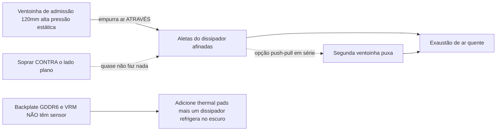

> 🌐 Tradução da comunidade. A versão em inglês é a fonte da verdade e pode estar mais atualizada. Achou um erro? Abra uma issue: [../en/04-cooling.md](../en/04-cooling.md) · https://github.com/lildebil0/awesome-bc250/issues

# Refrigeração

> **TL;DR** — O dissipador de fábrica do BC-250 foi feito para o túnel de ar forçado de um rack de servidor, não para uma mesa. Como vem de fábrica, ele faz throttling. A correção da comunidade: **afinar as aletas densas de fábrica** (limá-las/lixá-las) e parafusar uma **ventoinha de alta pressão estática de 120 mm** (a **Arctic P12 Max/Pro** é a referência; a Noctua NF-P12 redux é a alternativa premium silenciosa) soprando *através* delas. Só isso leva uma placa modificada a **~73 °C no Furmark, 63–65 °C em jogos**. AIO líquido e gabinetes custom completos são os patamares seguintes.

A refrigeração é a **coisa nº 1 que um iniciante erra**, então faça isso antes de perseguir overclocks.

---

## Por que o cooler de fábrica não basta

O BC-250 é uma placa de mineração/servidor. Seu dissipador é **passivo** e projetado para ficar num chassi onde ventoinhas barulhentas forçam o ar de frente para trás através dele. Numa mesa sem fluxo de ar, ele acumula calor e a GPU faz throttling. Soprar uma ventoinha *contra* o lado plano quase não faz nada — o ar tem que viajar **através dos canais das aletas**, além de passar sobre o backplate (a GDDR6 na parte de trás **não tem sensor de temperatura**, então você a refrigera no escuro).

Limites observados pela comunidade: o throttling começa por volta de **85 °C**, travamento/reset duro por volta de **90 °C**. Mantenha as temperaturas em carga abaixo de ~80 °C com margem.

> **Existem três variantes do dissipador** (aletas de 8 fileiras e de 9 fileiras). Identificação rápida: um **QR code ao lado do conector PCIe de 8 pinos** marca a variante de 9 fileiras. A variante com **menos aletas, de espessura maior** pode refrigerar ligeiramente melhor de fábrica. ([elektricM Cooling](https://elektricm.github.io/amd-bc250-docs/hardware/cooling/))

**Metas de temperatura por componente** (números testados pela elektricM, mais granulares que os limites de throttle/crash acima):

| Componente | Ocioso | Carga leve | Jogos | Máx |
|-----------|------|-----------|--------|-----|
| Borda da GPU/APU | 40–50 °C | 50–60 °C | 65–80 °C | 90 °C |
| CPU (Tctl) | 45–55 °C | 55–65 °C | 70–85 °C | 95 °C |
| Memória (parte de baixo) | 40–55 °C | 50–65 °C | 55–70 °C | 80 °C |
| NVMe/SSD | 40–55 °C | 50–65 °C | 60–75 °C | 80 °C (crítico 81.8 °C) |

Mire em **70–80 °C de GPU em jogos**. O teto do NVMe importa aqui porque **a GDDR6 e o SSD M.2 compartilham o lado de trás quente da placa** — o SSD fica no pior ponto térmico e pode cozinhar, então fique de olho nele (`80 °C` máx, `81.8 °C` crítico conforme a spec do drive). ([elektricM: sensors](https://elektricm.github.io/amd-bc250-docs/system/sensors/))

> **Escada de CPU Tctl.** A elektricM sinaliza **90 °C de Tctl** como o ponto de recuo recomendado; os **95 °C** da tabela são a borda superior que você ainda vai ver sob jogos pesados; **TJmax = 100 °C** é o limite absoluto do silício (a tabela de potência do pacote abaixo crava a CPU exatamente nisso sob uma rodada de stress sustentado). Então: **90 °C = "recue agora", 95 °C = "no vermelho", 100 °C = "no muro".** ([elektricM: sensors](https://elektricm.github.io/amd-bc250-docs/system/sensors/))

> **Potência do pacote por estado térmico** (a elektricM associa cada estado a um consumo de potência da placa): Ocioso **50–70 W**, Leve **100–150 W**, Pesado **150–200 W**, Stress **200–235 W**. Útil para dimensionar a PSU e ler o quanto a placa está realmente trabalhando pela tomada. ([elektricM: sensors](https://elektricm.github.io/amd-bc250-docs/system/sensors/))

> **Artefatos de pixel durante o jogo = VRAM superaquecendo.** Como a GDDR6 do lado de trás não tem sensor, esse glitch visual é seu sinal de alerta — adicione fluxo de ar/pads no backplate (abaixo). ([elektricM Cooling](https://elektricm.github.io/amd-bc250-docs/hardware/cooling/))

> **Loteria do silício — orce margem térmica por chip.** Duas placas fisicamente idênticas, chassi idêntico e config de OC idêntica podem rodar com **5–10 °C de diferença**, e a mais quente permaneceu mais quente mesmo depois de re-pastear/re-padear. Não presuma que as temperaturas de outra pessoa vão bater com as suas. ([r/BC250Gaming](https://www.reddit.com/r/BC250Gaming/))



---

## Computação sustentada é um regime diferente (não só rajadas de jogo)

As metas acima assumem **jogos**, onde a carga vem em rajadas. Computação **sustentada** — um `llama-bench` em loop, rodadas longas de Stable-Diffusion, qualquer coisa cravando a GPU por dezenas de minutos, **especialmente com o [unlock de 40 CU](09-overclock-undervolt.md)** — é uma carga muito mais dura e pode exceder o que um cooler de nível gaming segura.

A elektricM mediu um dissipador de fábrica + **dois Arctic P12 Max em push–pull**, `llama-bench` sustentado por 10 min a **40 CU / 2 GHz**:

| Métrica | Média | Pico |
|--------|---------|------|
| Borda da GPU | 89.6 °C | 107 °C |
| Potência do pacote | 136 W | 223 W |
| CPU | 96.7 °C | 100 °C (TJmax) |
| MOSFETs do VRM | 57 °C | 58.5 °C |
| Velocidade da ventoinha | ~2950 RPM | 2977 RPM (teto) |

O throughput caiu **~10 %** ao longo da rodada conforme o pacote fez throttling. Conclusão: **dissipador de fábrica + dois P12 Max não é margem suficiente para 40 CU @ 2 GHz sustentado** — e note que os **VRMs estão longe do limite** (57 °C), então o gargalo é o *dissipador dissipando calor*, não as ventoinhas ou o estágio de potência. Duas correções: **limitar o governor da GPU em 1500 MHz** (40 CU ainda escala ~1.5× de computação, temperaturas seguram ~83 °C — sustentável indefinidamente em dois P12 Max), ou **fazer upgrade do dissipador** (mais área de aletas). Para **jogos de fábrica em 24 CU**, dois P12 Max são confortáveis; o muro só aparece sob computação sustentada com CU completo. ([elektricM Cooling](https://elektricm.github.io/amd-bc250-docs/hardware/cooling/))

---

## Caminho A — Mod a ar (mais popular, mais barato)

É o que a maior parte do chat roda.

### 1. Afine/limpe as aletas de fábrica
As aletas de fábrica são densas demais e muitas vezes irregulares. As pessoas abrem os canais para o ar poder passar:

- **Lixadeira orbital (excêntrica)** — mais rápido, feito em minutos, melhor resultado. ([src](https://t.me/c/2424231195/31571))
- **Lixa à mão** — grão 60 depois grão 240, ~3–4 h + 2 h ao longo de dois dias. Funciona mas é lento. ([src](https://t.me/c/2424231195/50330))
- **Tesoura / alicate de corte** — método cru de "чекрыжить", último recurso; os resultados são os piores. ([src](https://t.me/c/2424231195/41252))
- **Tesoura + guia de régua (variante limpa)** — deslize uma tesoura de artesanato/cabeleireiro na fresta da aleta com uma **régua angulada contra a lâmina como guia**; um "abridor de latas" de canivete funciona igualmente bem. Ressalva: algumas variantes da placa **não têm fresta para iniciar a lâmina** — abra uma com chave de fenda/pinça, ou corte um slot de entrada com um **pequeno disco de corte Dremel**. Lâminas mais largas que os slots das aletas podem danificar o dissipador. ([r/BC250Gaming](https://www.reddit.com/r/BC250Gaming/))
- Endireite aletas tortas com uma **pinça reta + alicate**. ([src](https://t.me/c/2424231195/30670))
- **Arranque as aletas com a mão** — a elektricM nota que as aletas macias de alumínio podem ser **limpa e literalmente rasgadas/arrancadas com a mão** (dissipador fora da placa), evitando a limalha metálica que ferramentas de corte criam. Mais lento mas sem detritos. ([elektricM Cooling](https://elektricm.github.io/amd-bc250-docs/hardware/cooling/))
- **"Scooper by Justin"** — uma **ferramenta imprimível em 3D feita especificamente para pressionar/abrir as aletas do dissipador do BC-250** ([Printables 1282906](https://www.printables.com/model/1282906-bc-250-scooper)). Mais segura que uma chave de fenda nua: ela impede você de empurrar demais e gougear a **base** do dissipador entre as aletas. ([r/linux_gaming community thread](https://www.reddit.com/r/linux_gaming/comments/1nvsgji/)) Ajuste as expectativas: um dono relatou que a ferramenta "pente/scooper" impressa **quebrou no 2º uso** e deu cãibra nas mãos. ([r/BC250Gaming](https://www.reddit.com/r/BC250Gaming/))
- **Alicate de hobby — método "descascar"** — segure o **topo** das aletas com um pequeno alicate de hobby e descasque-as, **usando a própria memória do metal como ponto de quebra** para que elas estalem limpas na dobra em vez de rasgar a base. Uma alternativa de baixos detritos ao corte. ([r/linux_gaming community thread](https://www.reddit.com/r/linux_gaming/comments/1nvsgji/))

Retorno aproximado de temperatura (elektricM): **endireitar aletas tortas ~5–10 °C**, **remover aletas centrais ~10–15 °C** (irreversível — um bom duto de ventoinha obtém ganhos semelhantes sem cortar), **pasta fresca ~5–10 °C** se a pasta velha tiver secado. ([elektricM Cooling](https://elektricm.github.io/amd-bc250-docs/hardware/cooling/))

> ⚠ **Tire o dissipador da placa primeiro** (ou mascare/proteja totalmente a placa e o die) antes de lixar/limar, e **limpe cada pedacinho de pó metálico antes de remontar**. A limalha metálica condutiva que se assenta na placa pode dar curto e **matar a placa** — isso já aconteceu no chat.

<p align="center">
  <br>
  <sub>Foto: comunidade AMD BC-250 · <a href="https://t.me/c/2424231195/31571">source</a></sub>
</p>

### 2. Parafuse uma ventoinha de verdade
Monte uma **ventoinha de 120 mm de alta pressão estática** empurrando ar através das aletas. A escolha de referência é a **Arctic P12 Max (ou P12 Pro)** — a maior pressão estática (~6.9 mm H₂O), a escolha da comunidade + elektricM para esse dissipador denso. A **Noctua NF-P12 redux** é a alternativa premium silenciosa, e registrou um resultado de referência de **máx 73 °C no Furmark, 63–65 °C em jogos** ([src](https://t.me/c/2424231195/42843)).

**Escolhas concretas de ventoinha com specs** (elektricM — escolha pela *pressão estática*, não pelo fluxo de ar):

| Ventoinha | Tamanho | RPM máx | Pressão estática | Fluxo de ar | Ruído | Temperaturas em jogos |
|-----|------|---------|----------------|---------|-------|--------------|
| **Arctic P12 Max** | 120 mm | 3300 | **6.9 mm H₂O** | 73.3 CFM | 52.5 dB(A) | 65–75 °C |
| **Arctic P12 Pro** | 120 mm | 2100 | **6.9 mm H₂O** | 68.9 CFM | 37.8 dB(A) | 65–75 °C |
| Arctic P14 PWM | 140 mm | 1700 | 2.40 mm H₂O | 72.8 CFM | 38 dB(A) | 70–80 °C |
| Noctua NF-A12x25 | 120 mm | 2000 | 2.34 mm H₂O | 60.1 CFM | 22.6 dB(A) | 70–85 °C |

A escolha **mais recomendada pela elektricM é a Arctic P12 Max / P12 Pro** — sua pressão estática de ~6.9 mm H₂O esmaga os 2.34 mm da Noctua e é muito mais barata; a P12 Pro é a versão mais silenciosa e mais amplamente disponível. A Noctua premium é ainda mais silenciosa mas só iguala a Arctic em temperaturas em RPM mais alto. ([elektricM Cooling](https://elektricm.github.io/amd-bc250-docs/hardware/cooling/))

**Outras ventoinhas nomeadas em builds da comunidade** (modelos específicos que as pessoas instalaram, além da referência Arctic/Noctua-P12):

- **Noctua NF-A12x25 G2** (PWM) como o **cooler do die de 120 mm** — a revisão G2 mais nova da A12x25, usada como ventoinha principal ([TiredDadTech](https://youtu.be/zi7sldeRd2w)). (A tabela de ventoinhas acima lista apenas a NF-A12x25 *original*.)
- **Noctua NF-A6x15 PWM** (≈3500 rpm) como **troca de ventoinha de PSU de 60 mm** — a substituição silenciosa para uma ventoinha de brick de servidor gritante ([TiredDadTech](https://youtu.be/zi7sldeRd2w)).
- **Thermalright 120 mm 1550 rpm ARGB** como ventoinha de die econômica, e **thermal pads de 6.0 W/mK** para o backplate — ambos de uma **BOM de build TMG HD** ([build overview](https://youtu.be/OEO0r01zcfU)).

> **Referência vs alternativa silenciosa.** A **Arctic P12 Max/Pro** é a ventoinha de referência aqui — a maior pressão estática (~6.9 mm H₂O), a mais barata, a escolha da comunidade + elektricM para esse dissipador denso. A **Noctua NF-P12 redux** é a alternativa premium silenciosa (o resultado de 73 °C no Furmark do chat), igualando a Arctic em temperaturas só em RPM mais alto. Escolha Arctic para o melhor custo/desempenho, Noctua se o silêncio importa mais.

Use um **duto/adaptador de ventoinha impresso** para que a ventoinha vede contra o dissipador em vez de vazar ar ao redor dela. STLs da comunidade:
- `Fan_Shroud_Single_120mm.stl`, `Fan_Shroud_Dual_120mm.stl`, `Fan_Shroud_Single_140mm.stl`, `Twin_120mm_Fan_Shroud.stl`
- `BC250_FanAdapter_120mm.step`, `bc250 cooler mount.stl`, `cooler adapter v3.0.stl`

> **Por que pressão estática, e não o índice de fluxo de ar?** Aletas densas são uma carga de alta resistência. Uma "case fan" de alto fluxo de ar trava contra elas; uma ventoinha de alta pressão estática (≥3 mm H₂O; Noctua P12, Arctic P12) de fato empurra o ar *através*. Para aletas muito densas, duas ventoinhas em **push–pull (série)** dobram a pressão estática — esse é o movimento certo aqui, não duas ventoinhas lado a lado.

**Montagem:** um duto impresso é o melhor, mas **prender com abraçadeira/zip tie** a ventoinha no dissipador funciona, e um **duto de papelão/foam-board** colado entre a ventoinha e as aletas é um fallback grátis válido (feio, não durável, mas veda o caminho do ar). ([elektricM Cooling](https://elektricm.github.io/amd-bc250-docs/hardware/cooling/))

> ⚠ **Não fure/parafuse ventoinhas diretamente nas aletas.** O alumínio é macio e as aletas são finas — parafusar nelas danifica o conjunto de aletas e prejudica a refrigeração. Use abraçadeiras/zip ties ou um duto impresso. ([elektricM Cooling](https://elektricm.github.io/amd-bc250-docs/hardware/cooling/))

> ### 🛠 Engenharia de fluxo de ar — o que realmente move o ponteiro
>
> Achados da comunidade sobre *como* o ar é movido, não só qual ventoinha:
>
> - **Pressão estática vence CFM bruto** através do conjunto de aletas denso — é por isso que a **Arctic P12 Max (6.9 mm H₂O)** de alta pressão estática supera ventoinhas de alto fluxo de ar/baixa pressão mais silenciosas nesse dissipador.
> - **Uma ventoinha centralizada pode vencer duas lado a lado** num plano de aletas totalmente cortado: uma única ventoinha central carrega os **4 heat pipes centrais** diretamente, enquanto duas ventoinhas deixam uma "costura" morta de plástico sobre o centro. O builder que primeiro cortou as aletas no plano completo mediu uns poucos °C **a menos** com uma ventoinha central do que com duas ([src](https://t.me/c/2424231195/46175)). Um teardown chega à mesma conclusão pelo lado do fluxo de ar: **duas ventoinhas parafusadas lado a lado não são melhores que uma** porque uma **zona morta se forma bem sobre o centro quente do die** onde as duas admissões se encontram — **deixe um espaço entre elas, ou vá de push-pull** ([Old Lamer — Part VII](https://youtu.be/pxahl9-YgkY) ~19:55). *(Vindo de legendas — trate como qualitativo, não exato.)*
> - **Piso de velocidade de ventoinha de 120 mm ≈1800 RPM** para de fato mover ar através desse conjunto denso; a **Arctic P12 Pro** ($8–10, faixa de **600–3000 rpm**) é uma escolha fácil que fica silenciosa em ocioso e ainda tem a margem ([Old Lamer — Part VII](https://youtu.be/pxahl9-YgkY)). *(Números de ASR — aproximados.)*
> - **Adicionar uma ventoinha de exaustão = −3 a −5 °C.** Só admissão **73 °C** → com exaustão **67–68 °C** ([src](https://t.me/c/2424231195/68183), [src](https://t.me/c/2424231195/31553)). Então o setup simples ótimo é **1 admissão central + 1 exaustão traseira**, não duas admissões lado a lado.
> - **O backplate é cego e quente.** Os MOSFETs do VRM alcançam **~100 °C sem refrigeração** ([src](https://t.me/c/2424231195/110955)) — ele **precisa** receber pads + dissipadores + fluxo de ar dedicado; com dissipadores traseiros ele roda *"frio sob carga"* ([src](https://t.me/c/2424231195/93056)).
> - **Física grátis.** O ar quente sobe, então até uma orientação de **inclinação/chaminé** ajuda — um backplate mal ventilado mediu **47 °C só por convecção** ([src](https://t.me/c/2424231195/76962)). E um **radiador anodizado preto irradia ~1.8×** um polido, permitindo encolher a área de aletas em **~45 %** em builds compactos passivos/semi-passivos ([src](https://t.me/c/2424231195/86878)).
> - **Rode admissão > exaustão** (leve **pressão positiva**) para que o VRM/VRAM sem sensor fiquem banhados em ar fresco.

### Alternativa: manter as aletas de fábrica (caso push-pull sem corte)
Cortar as aletas não é obrigatório. **penzoiders** projetou um gabinete ([MakerWorld, FreeCAD source](https://makerworld.com/models/2505974)) que **não** corta o dissipador: ele usa **ventoinhas push-pull de alta pressão estática** para forçar ar através das **aletas de fábrica, sem modificação**, mais um **diferencial de pressão de duas câmaras** que também refrigera o backplate (dissipadores de 5 mm + thermal pads; dissipadores de NVMe reaproveitados funcionam). Uma sintonia que fica fria: **CPU 3800 MHz / 1050 mV, GPU 2100 MHz / 950 mV** → Furmark + `stress-ng` em paralelo fica **abaixo de 85 °C**; jogos **~75 °C em cerca de 50 % de duty da ventoinha** (curva do CoolerControl), "mal audível". ([r/BC250Gaming](https://www.reddit.com/r/BC250Gaming/))

## Caminho B — Water cooler AIO

Um AIO de 120 mm montado no die via um bracket adaptador. Silencioso e frio, mas mais peças e custo. Builds populares usam AIOs baratos (ex.: aigo). ([example src](https://t.me/c/2424231195/19336))

<p align="center">
  <br>
  <sub>Foto: comunidade AMD BC-250 · <a href="https://t.me/c/2424231195/19336">source</a></sub>
</p>

**Bracket de AIO nomeado e baixável — NexGen3D** ([Printables 1554003](https://www.printables.com/model/1554003), imprima em ABS-GF ou PETG). Verificado com um **AIO Thermalright de 240 mm**: GPU **~50 °C @ 2000 MHz**, CPU **máx 60 °C**. ([r/BC250Gaming](https://www.reddit.com/r/BC250Gaming/))

### Perfis de overclock com refrigeração líquida
Com um AIO você pode forçar muito mais. **NexGen3D** mediu pela tomada (Furmark Vulkan + `stress-ng --matrix 0 -t 60m` como o combo de burn):

| Perfil | CPU | GPU | Temp máx de burn | Potência da tomada | Nota |
|---------|-----|-----|---------------|------------|------|
| 1 | 4000 MHz | 2400 MHz | ~65 °C | >350 W | "silêncio total" |
| 2 | 4100 MHz | 2450 MHz | ~75 °C | <400 W | mais quente, mais barulhento |

Jogos normais em 1080p rodam **10–15 °C abaixo** dessas temperaturas de burn e **abaixo de 250 W** no Perfil 1. **Esquema de fluxo de ar que vale copiar:** as ventoinhas de 120 mm **fazem exaustão para fora através do radiador**, o que puxa ar externo fresco através dos **VRMs / PSU / backplate da VRAM**; uma **ventoinha de 80 mm separada (Arctic P8 Max)** refrigera os VRMs da GPU — isso responde o aviso "VRM/VRAM sem sensor ainda precisam de fluxo de ar" acima. ([r/BC250Gaming](https://www.reddit.com/r/BC250Gaming/))

## Loop custom de água (avançado)

Além de um AIO fechado, algumas pessoas rodam um **loop custom completo**. É uma cena real mas **DIY/de especialista**: builders **usinam em CNC ou soldam um waterblock custom** que cobre o **die *e* o VRM** em um único bloco ([src](https://t.me/c/2424231195/131065), [src](https://t.me/c/2424231195/131844), [src](https://t.me/c/2424231195/118582)). As conexões não são críticas — *"você pode comprar, tornear ou colar quase qualquer uma"* ([src](https://t.me/c/2424231195/132007)).

**O que isso te dá:** um loop custom tosco alcança **~50 °C sob carga com as ventoinhas a só 30 %, a bomba externa quase silenciosa** ([src](https://t.me/c/2424231195/133040)). (Um builder então notou coil-whine das chokes do VRM sob carga na config padrão do governor cyan-skillfish — um problema *separado*, não térmico.) Você também **não precisa de um Corsair Commander**: o próprio [controle de ventoinha](#controlando-a-velocidade-da-ventoinha-software) do BC-250 pode acionar a bomba mais **~5 ventoinhas** ([src](https://t.me/c/2424231195/140123)).

> ⚠ **Por que isso é "avançado": o BC-250 não sobrevive a uma inundação de líquido refrigerante.** Falhas reais da comunidade: uma mangueira **dobrou a 90°, estourou e inundou a GPU e a PSU** ([src](https://t.me/c/2424231195/81158)); uma **bomba Corsair AIO travada cozinhou a CPU** ([src](https://t.me/c/2424231195/133147), [src](https://t.me/c/2424231195/126053)). Cuidado também com **cavitação/ruído da bomba acima de ~50 % da velocidade da bomba** ([src](https://t.me/c/2424231195/7034)). **Faça teste de vazamento do loop inteiro FORA da placa por 24 h antes do primeiro power-on molhado.**

**Veredito:** as temperaturas mais baixas e o mais silencioso de qualquer opção, e habilita 40 CU sustentado — mas o maior risco e esforço. **Não é um primeiro build.**

## Caminho C — Blower ("улитка") — não recomendado

Ventoinhas blower resgatadas de GPU foram um experimento inicial. Barulhentas para o resultado; as pessoas migraram para o Caminho A. ([src](https://t.me/c/2424231195/100086))

## Caminho D — Conversão para cooler tower (avançado)

Alguns usuários parafusam um **cooler tower AM4** (ex.: **Thermalright Peerless Assassin**, ou outros towers AM4/AM5) no die para uma refrigeração excelente e silenciosa usando hardware de prateleira. O porém: você precisa **montá-lo via um bracket**, e um tower alto pode **bloquear o slot M.2 ou outros componentes**. Não é um mod de iniciante. Você não precisa mais fabricar um do zero — existem dois brackets impressos em 3D publicados:

- **Adaptador de cooler desktop AM4/AM5** ([MakerWorld 2596083](https://makerworld.com/en/models/2596083), FreeCAD source incluído). Monta um cooler desktop AM4/AM5 padrão no BC-250. Fixação: **parafusos M5 + porcas, sem standoffs** (o OP nota que M4 seria ideal mas M5 deu um encaixe justo). Imprima em **ABS, PETG ou ASA**. Verificado a **CPU 3.95 GHz / 1.150 V, GPU 2200 MHz / 1000 mV, temperaturas não excedendo 80 °C**. Coolers usados: um **classe AXP90** low-profile (um comentarista usou um **AXP120**), e até um **AMD Wraith Spire** superou o dissipador de fábrica. ([r/BC250Gaming](https://www.reddit.com/r/BC250Gaming/))
- **Mount do Thermalright AXP90-X53** ([Printables 1694793](https://www.printables.com/model/1694793)). Insertos roscados são **soldados na parte de baixo** do bracket impresso para que você **reaproveite os parafusos de mola originais do dissipador de fábrica**; parafusos button-head sobem por baixo e são escareados, e o bracket tem uma **folga de 0.5 mm sob o suporte** para liberar componentes da placa. Projetado no Fusion 360, **imprima em PETG** (PLA amolece nessas temperaturas). Resultado: **65–67 °C sob carga total @ 2150 MHz, 1080p**, muito silencioso (cooler de cobre, pareado com uma Arctic P12 Pro de 120 mm). Altura de stack medida **54 mm do PCB ao topo da ventoinha de 15 mm** — útil para o encaixe no gabinete. Também existem um **conjunto de variantes de 3 espessuras** e uma versão **AXP120-X67**. ([r/BC250Gaming](https://www.reddit.com/r/BC250Gaming/))

---

## Controlando a velocidade da ventoinha (software)

Uma vez que uma ventoinha esteja parafusada, você controla o PWM dela através do chip Super I/O **Nuvoton NCT6686D** da placa — mas **qual driver você carrega importa** ([elektricM hardware spec](https://elektricm.github.io/amd-bc250-docs/)):

- **Sensores somente leitura** (RPM da ventoinha, temperaturas): o módulo in-kernel **`nct6683`**, carregado com `force=true`. Ele reporta leituras mas **não consegue escrever PWM**, então a ventoinha fica em qualquer velocidade que a BIOS/firmware definir.
- **Leitura + escrita de PWM** (de fato definir a velocidade da ventoinha): use o módulo out-of-tree **`nct6687`** do **[Fred78290/nct6687d](https://github.com/Fred78290/nct6687d)**, também com `force=true`. Esse é o que você deve compilar se quiser curvas de ventoinha / controle manual de velocidade em vez de só monitoramento.

```bash
# monitoring only (in-kernel):
echo 'options nct6683 force=true' | sudo tee /etc/modprobe.d/nct6683.conf
# PWM control (DKMS from Fred78290/nct6687d):
echo 'options nct6687 force=true' | sudo tee /etc/modprobe.d/nct6687.conf
```

> Não carregue os dois — escolha `nct6683` para sensores somente leitura ou `nct6687` para leitura+escrita. A fiação dos sensores (`CPU_FAN1` / `J4003`) e a numeração de ventoinha BIOS↔Linux estão no passo de verificação de [06-linux.md](06-linux.md).

**Qual header é a ventoinha principal?** A elektricM reporta que a ventoinha de refrigeração geralmente fica no header **Pump Fan** = **`fan2` / `pwm2`** no sysfs; o `CPU Fan` (`fan1`) e os headers `System Fan` (`fan3`+) são tipicamente não usados. Habilite o modo manual antes de escrever PWM (`echo 1 > .../pwm2_enable`, depois um valor de 0–255 para `.../pwm2`). A numeração do hwmon pode mudar entre reboots — confirme com `cat /sys/class/hwmon/hwmon*/name`. ([elektricM Cooling](https://elektricm.github.io/amd-bc250-docs/hardware/cooling/))

**Curvas de ventoinha com uma GUI — CoolerControl.** Uma vez que o `nct6687` esteja carregado, o **CoolerControl** dá curvas de ventoinha gráficas: selecione o dispositivo **nct6686**, construa uma curva no **pwm2** usando **k10temp Tctl** como fonte. Instale: `ujust install-coolercontrol` (Bazzite), o copr `codifryed/CoolerControl` (Fedora), ou `coolercontrol` do AUR (Arch); UI web em `https://localhost:11987`. ([elektricM Cooling](https://elektricm.github.io/amd-bc250-docs/hardware/cooling/))

**Modos de ventoinha da BIOS** (se você não rodar controle pelo lado do OS): **Default** segura as ventoinhas em um **mínimo de 40 %** (baixo demais — não recomendado), **Full Speed** crava-as em 100 % (barulhento mas seguro), **Customize** define velocidades por limiar. ([elektricM Cooling](https://elektricm.github.io/amd-bc250-docs/hardware/cooling/))

> ⚠ **Não rode o modo Customize da BIOS e o CoolerControl ao mesmo tempo** — eles brigam pelo controle do PWM. Escolha um. ([elektricM Cooling](https://elektricm.github.io/amd-bc250-docs/hardware/cooling/))

---

## Interface térmica (pasta, pads, mudança de fase, metal líquido)

Qualquer que seja a ventoinha/dissipador que você rode, o **material de interface térmica (TIM)** entre o die e o dissipador — e entre a parte de trás da placa e qualquer radiador de backplate — vale a pena acertar. O die do BC-250 tem uma **alta densidade de calor**, então um bom TIM são alguns graus de graça.

> **Só trocar a pasta de fábrica ajuda.** Um dono trocou a pasta de fábrica depois de um ano e as temperaturas em carga caíram **~4–5 °C**, com tudo o mais inalterado. ([src](https://t.me/c/2424231195/88565))

### Pastas que funcionam
- **Arctic MX-6** — uma pasta high-end comum. Em um build com gabinete segurou **87–88 °C no Furmark**; o mesmo dono notou que PTM7950 tiraria mais ~4 °C disso. ([src](https://t.me/c/2424231195/30211))
- **Pasta de fábrica + pads de fábrica** são a baseline documentada: ~**76 °C** depois de 10 min de carga, ~**55 °C** ocioso (antes do mod de aletas/ventoinha). ([src](https://t.me/c/2424231195/22992))
- Outras pastas que a elektricM lista como adequadas aqui: **Arctic MX-4** (custo-benefício), **Thermal Grizzly Kryonaut** (premium), **Noctua NT-H1** (confiável), **Thermalright TFX** (econômica). A pasta de uma placa usada está **muitas vezes ressecada** — só re-pastear vale **~5–10 °C**. Aplique um ponto do tamanho de uma ervilha no die, monte uniformemente, aperte os parafusos em **padrão X**. ([elektricM Cooling](https://elektricm.github.io/amd-bc250-docs/hardware/cooling/))

### PTM7950 — a favorita da comunidade (recomendada)
**PTM7950** é um **pad de mudança de fase** (filme de grafite/mudança de fase Honeywell). Em temperatura ambiente é uma fina folha sólida; em carga (~45–55 °C) ele amolece e flui para uma camada de espessura micrométrica, depois fica parado. Ele **não faz pump out** nem seca como graxa, que é exatamente o que você quer sob um die quente em ciclo térmico — então você aplica uma vez e esquece. O resumo direto do chat: *"PTM7950 e não pense demais"* ([src](https://t.me/c/2424231195/101582)); mudança de fase é a recomendação geral ([src](https://t.me/c/2424231195/61511)).

**Como aplicar:**
1. Limpe o die e a base do dissipador (álcool isopropílico), deixe secar.
2. Corte um quadrado de PTM7950 no tamanho do die — um pedaço de **~26×30 mm** cobre o die do BC-250 ([src](https://t.me/c/2424231195/125748)).
3. Descole um filme protetor, assente o pad no die, descole o segundo filme.
4. Monte o dissipador e aperte uniformemente. **Sem espalhar** — o primeiro ciclo de calor faz o trabalho. Espere as melhores temperaturas depois de alguns ciclos de carga/ocioso ("burn-in").

Um build de referência com gabinete em PTM7950 (Honeywell, 26×30) mais um radiador de backplate atinge pico de **~84 °C ao longo de uma hora, 66–71 °C em jogos** a CPU 3850 MHz / GPU 2100 MHz. ([src](https://t.me/c/2424231195/125748))

> **Pareamento nomeado: massa Upsiren sob o dissipador + PTM7950 no die.** Um vídeo de build pareia **massa térmica Upsiren UTP-6 / UTP-8** (a grade **UTP-8** é avaliada em ≈**14.8 W/mK**) para os pontos de preenchimento de gaps com uma **folha de PTM7950 cortada em 40×80×0.25 mm** assentada no die ([PTM7950 + Upsiren video](https://youtu.be/FJapqZSdt6I)). A massa é para preencher gaps irregulares até um dissipador/placa; o filme de mudança de fase vai no próprio die.
>
> - **PTM7950 barata do AliExpress funciona.** Uma folha do AliExpress de ~**$13** foi verificada como performática — você não precisa do corte de marca Honeywell ([PTM7950 + Upsiren video](https://youtu.be/FJapqZSdt6I)).
> - **PTM7950 precisa de break-in.** Ela alcança suas melhores temperaturas só depois de **vários ciclos de aquecer/esfriar** — não a julgue na primeira rodada ([laptop TIM demo](https://youtu.be/U4Zm8msXJHM)).
>
> *(Ambas as fontes têm legenda automática — trate o W/mK e as dimensões exatas como aproximados.)*

### Pads de backplate & GDDR6 (refrigere a parte de trás, no escuro)
A **GDDR6 e o VRM na parte de trás da placa não têm sensor de temperatura** — você os refrigera no escuro. Adicione um **dissipador/radiador no backplate** acoplado com **thermal pads** para que o calor do lado de trás tenha para onde ir. ([src](https://t.me/c/2424231195/125748)) Um builder RU simplesmente pegou um **dissipador do Yandex.Market**, colou no backplate, e ele **refrigerou bem a placa de baixo** — qualquer dissipador de alumínio de tamanho razoável dá conta aqui ([4pda — mananoid1](https://4pda.to/forum/index.php?showtopic=1104980)).

Espessuras de pad relatadas (compartilhadas pela comunidade, reação "salvei isto"):
- **VRM: 1 mm**
- **GDDR6: 2 mm** ([src](https://t.me/c/2424231195/121181))

> ⚠ **verifique** — essas espessuras dependem do gap até o *seu* backplate/radiador específico. Confirme com uma medição de gap (ou um teste de massa/argila) antes de comprar uma pilha de pads.

A elektricM dá um **esquema de pad ligeiramente diferente** para refrigerar a própria memória: **pads de 1.5 mm na *frente* da placa, 2.0 mm na *parte de trás***, depois uma placa/dissipador de alumínio na parte de baixo. Use **apenas pads não condutivos** perto da placa (nunca pasta/pads condutivos que poderiam dar curto em componentes). Marcas de pad que ela lista: **Thermalright Odyssey** (alto desempenho), **Arctic Thermal Pad** (custo-benefício), **Gelid GP-Ultimate** (premium). ([elektricM Cooling](https://elektricm.github.io/amd-bc250-docs/hardware/cooling/))

> ⚠ **verifique (as espessuras de pad diferem entre fontes)** — nossos números vindos do chat são **VRM 1 mm / GDDR6 2 mm (parte de trás)**; a elektricM especifica **1.5 mm frente / 2.0 mm trás** para os chips de memória. Builds diferentes, gaps diferentes — **meça sua própria folga** em vez de confiar em qualquer um dos números no escuro.

> **Travamentos/instabilidade após 30–60 min de jogo** (muitas vezes com artefatos de pixel) é a assinatura clássica de **superaquecimento de memória**. Correções: adicione pads + uma placa na parte de baixo, adicione uma ventoinha de backplate, melhore o fluxo de ar do gabinete, ou temporariamente **reduza o split da VRAM** (ex.: 4 GB → 512 MB) para cortar o calor da memória. ([elektricM Cooling](https://elektricm.github.io/amd-bc250-docs/hardware/cooling/))

### Metal líquido — geralmente NÃO recomendado aqui
Metal líquido (LM) vem à tona porque o PS5 (APU da mesma família) o usa ([src](https://t.me/c/2424231195/18105)), e em desempenho bruto ele supera por pouco pasta/PTM ([src](https://t.me/c/2424231195/124112)). As pessoas já perguntaram sobre e tentaram no BC-250 ([src](https://t.me/c/2424231195/18098), [src](https://t.me/c/2424231195/77180)).

**Mas é a escolha errada nesta placa:**
- LM é **eletricamente condutivo**. O die do BC-250 fica bem ao lado de **GDDR6 e VRM densos**; uma gota que escape do die dá curto na placa (o mesmo risco de "coisa condutiva perto da memória mata" do aviso de limalha metálica acima).
- Ele **faz pump out / precisa ser refeito mais ou menos anualmente**, e ataca alumínio nu — até o defensor do PTM7950 abandonou o LM no próprio hardware exatamente por esse incômodo, mudando para PTM7950 / KryoSheet. ([src](https://t.me/c/2424231195/69688))
- "Nem todo mundo vai sequer aceitar o trabalho de lidar com metal líquido." ([src](https://t.me/c/2424231195/106787))

**Resumindo:** **PTM7950 é a escolha de alto desempenho mais segura** — ~99 % do benefício, nenhum do risco de curto-circuito/manutenção. Reserve LM para quem já sabe exatamente o que está fazendo.

---

## Como testar sua refrigeração (método da comunidade, fixado)

A partir do procedimento fixado ([src](https://t.me/c/2424231195/108407)):

1. **Stress da GPU:** Furmark (Vulkan / "Furmark VK").
2. **CPU ao mesmo tempo:** adicione um bench de CPU (cpu-x) ou carga baseada em `stress`/`pipx` — a APU compartilha um dissipador, então teste os dois juntos.
   - Essas ferramentas (Furmark, OCCT, cpu-x, `stress`) **não vêm pré-instaladas** numa máquina Linux nova — instale-as via seu gerenciador de pacotes ou Flatpak primeiro.
3. **Teste sob o seu overclock**, não de fábrica — 1500 MHz é fraco; **2000 MHz é ~+30 % de FPS** e o que você vai de fato rodar, então refrigere para isso.
4. Acompanhe as temperaturas; se você passar de ~85 °C está fazendo throttling — adicione trabalho de ventoinha/duto/aletas.

> ℹ️ **Não confunda dois "+30 %" diferentes.** O **+30 % de clock da GPU** aqui (1500 → 2000 MHz elevando o FPS em cerca de um terço) é um ganho de *desempenho* do overclock. **Não** é o mesmo que a **~+30 % de melhoria térmica** citada para um **re-paste** numa demonstração separada de TIM de laptop ([laptop TIM demo](https://youtu.be/U4Zm8msXJHM)) — esse é um resultado de *temperatura* em hardware diferente. Mesmo número, coisas não relacionadas.

Há também um curto walkthrough em vídeo do método mais simples fixado no tópico. ([src](https://t.me/c/2424231195/100024))

---

## Setup inicial recomendado

| Patamar | Faça isto | Espere |
|------|---------|--------|
| Mínimo | Lixe as aletas (lixadeira orbital) + 1× Arctic P12 Max/Pro (ou Noctua NF-P12) + duto impresso | ~73 °C Furmark |
| Melhor | Push–pull (2× P12) através do duto | menor, mais silencioso na mesma temperatura |
| Máx | AIO de 120 mm em adaptador | o mais frio, mais esforço de build |

---

## Fontes

- Método de teste fixado — https://t.me/c/2424231195/108407 · vídeo — https://t.me/c/2424231195/100024
- Ferramental de aletas — https://t.me/c/2424231195/31571 · https://t.me/c/2424231195/30670 · https://t.me/c/2424231195/50330 · ferramenta de aletas "Scooper by Justin" ([Printables 1282906](https://www.printables.com/model/1282906-bc-250-scooper)) + método de descascar com alicate de hobby — [r/linux_gaming thread](https://www.reddit.com/r/linux_gaming/comments/1nvsgji/)
- Resultado Noctua P12 — https://t.me/c/2424231195/42843
- Exemplo de AIO — https://t.me/c/2424231195/19336
- Interface térmica — repaste −4–5 °C https://t.me/c/2424231195/88565 · MX-6 https://t.me/c/2424231195/30211 · baseline de fábrica https://t.me/c/2424231195/22992 · PTM7950 https://t.me/c/2424231195/101582 · https://t.me/c/2424231195/61511 · build PTM7950 + backplate https://t.me/c/2424231195/125748 · espessura de pad https://t.me/c/2424231195/121181 · metal líquido https://t.me/c/2424231195/18098 · https://t.me/c/2424231195/69688
- Guia de refrigeração da elektricM (variantes do dissipador, tabela de temperatura por componente, dados de carga sustentada, specs de ventoinha, modos de ventoinha CoolerControl/BIOS, cooler tower, esquema de pad) — https://elektricm.github.io/amd-bc250-docs/hardware/cooling/
- [elektricM: sensors](https://elektricm.github.io/amd-bc250-docs/system/sensors/) (limiares térmicos: CPU Tctl 90 °C máx / TJmax 100 °C, NVMe/SSD 80 °C máx / 81.8 °C crítico, potência do pacote por estado térmico)
- r/BC250Gaming (relatos da comunidade: variância da loteria do silício, método de aletas tesoura+régua, quebra da ferramenta pente, gabinete push-pull sem corte, bracket de AIO + resultado de 240 mm, perfis de OC líquido, brackets AM4/AM5 + AXP90-X53) — https://www.reddit.com/r/BC250Gaming/ · adaptador de cooler AM4/AM5 [MakerWorld 2596083](https://makerworld.com/en/models/2596083) · mount AXP90-X53 [Printables 1694793](https://www.printables.com/model/1694793) · bracket de AIO NexGen3D [Printables 1554003](https://www.printables.com/model/1554003) · gabinete push-pull sem corte [MakerWorld 2505974](https://makerworld.com/models/2505974)
- Referência de hardware — [mothenjoyer69/bc250-documentation `hardware.md`](https://github.com/mothenjoyer69/bc250-documentation/blob/main/hardware.md)
- Gabinetes/adaptadores com refrigeração — [onemorecap/bc-250-sleeve-adapter](https://github.com/onemorecap/bc-250-sleeve-adapter)
- Zona morta de duas ventoinhas lado a lado sobre o die / deixe um espaço ou push-pull, piso de 120 mm ≈1800 RPM, Arctic P12 Pro ($8–10, 600–3000 rpm) — [Old Lamer — Part VII](https://youtu.be/pxahl9-YgkY) (legenda automática / ASR — números aproximados)
- Massa Upsiren UTP-6 / UTP-8 (UTP-8 ≈14.8 W/mK) + PTM7950 cortada 40×80×0.25 mm no die, PTM7950 barata do AliExpress (~$13) verificada — [PTM7950 + Upsiren video](https://youtu.be/FJapqZSdt6I) · PTM7950 precisa de vários ciclos de break-in de aquecer/esfriar + o "+30 %" separado de repaste (laptop, não o +30 % de clock da GPU) — [laptop TIM demo](https://youtu.be/U4Zm8msXJHM)
- Radiador de backplate RU (dissipador do Yandex.Market refrigerou a placa de baixo) — [4pda — mananoid1](https://4pda.to/forum/index.php?showtopic=1104980)

> STLs de duto de ventoinha e adaptador estão catalogados em [05-case.md](05-case.md) e espelhados sob `assets/stl/`.
