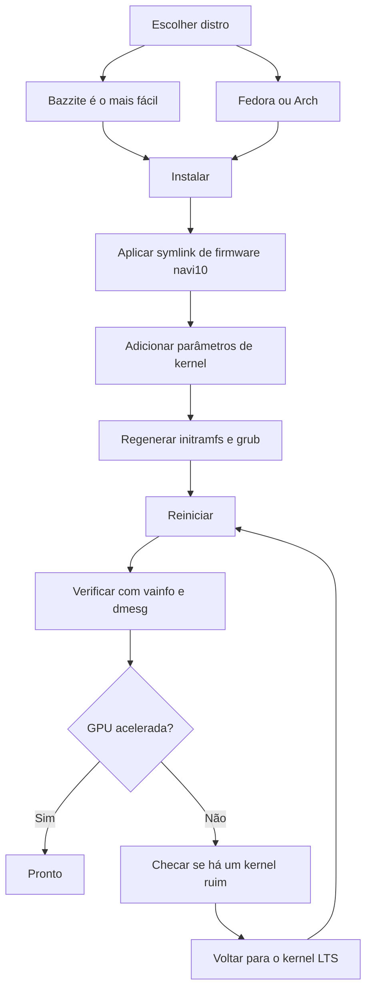

> 🌐 Tradução da comunidade. A versão em inglês é a fonte da verdade e pode estar mais atualizada. Achou um erro? Abra uma issue: [../en/06-linux.md](../en/06-linux.md) · https://github.com/lildebil0/awesome-bc250/issues

# Drivers & Configuração no Linux

> **TL;DR** — A maioria das pessoas roda a BC-250 no Linux, e funciona bem *uma vez que a GPU está consertada*. De fábrica o `amdgpu` não reconhece o chip e você fica com renderização por software pela CPU, com FPS de um dígito. Duas coisas tornam isso real: um **kernel moderno + Mesa novo (25.1+)**, e o **fix do `amdgpu`** — um symlink de firmware para que o driver consiga carregar (`navi10_gpu_info.bin` → `cyan_skillfish_gpu_info.bin`) mais parâmetros de kernel (`amdgpu.sg_display=0`, `mitigations=off`, e em kernels novos `amdgpu.bc250_cc_write_mode=3`). Caminho mais fácil para um iniciante: gravar o **[Bazzite](https://bazzite.gg/)** e fazer rebase para a imagem dedicada **`bazzite-bc250`** — os fixes já vêm embutidos. Quer aprender a máquina: **Fedora** ou **CachyOS/EndeavourOS (Arch)** com um script de configuração único.

Esta é a seção que transforma "uma placa numa caixa" em um desktop funcional. Faça [refrigeração](04-cooling.md) e [alimentação](03-power-supply.md) primeiro — depois isto.

> **Nunca usou Linux? Um kit de sobrevivência de 60 segundos.**
> - **Abra um terminal:** procure por um app chamado *Terminal* / *Konsole* (KDE) / *Console* no seu menu, ou pressione `Ctrl-Alt-T`.
> - **`sudo`** na frente de um comando o executa como administrador. Ele vai pedir sua senha — e **enquanto você digita, nada aparece na tela** (sem pontos, sem asteriscos). Isso é normal; digite-a e pressione Enter.
> - **`nano /etc/...`** abre um editor de texto simples no terminal. Para salvar e sair: **Ctrl-O**, depois **Enter**, depois **Ctrl-X**.
> - **Copiar-colar** num terminal geralmente é **Ctrl-Shift-V** (não Ctrl-V).
> - Muitos passos só têm efeito depois de **reiniciar** (`systemctl reboot`). Quando um passo diz "reinicie", reinicie de verdade antes de julgar se funcionou.

---

## A única coisa que você precisa entender

A GPU da BC-250 é a **Cyan Skillfish / Oberon** (uma peça RDNA2 derivada do PlayStation 5). O `amdgpu` mainline historicamente **não tinha blob de firmware com o nome dela**, então numa instalação de fábrica o kernel não consegue inicializar a GPU e o desktop recai para renderização por software (LLVMpipe) — tudo fica lento e o `vulkaninfo` não mostra dispositivo real. Um usuário passou dias com "drivers quebrados" antes de perceber que sua distro simplesmente tinha dado boot num kernel que não conseguia carregar o firmware da GPU ([src](https://t.me/c/2424231195/98466)).

Então todo setup funcional faz as mesmas três coisas, de alguma forma:

1. **Rode um kernel + Mesa novos o suficiente.** O Mesa upstream ganhou suporte à BC-250 na **25.1** (nenhum patch necessário desde então; a **25.3.x** é a estável recomendada atual) — ([Mesa MR !33116](https://gitlab.freedesktop.org/mesa/mesa/-/merge_requests/33116), [src](https://t.me/c/2424231195/20891)). Os sensores de temperatura chegaram no **kernel 6.15** ([src](https://t.me/c/2424231195/23542)); o kernel **6.18.18 LTS** é o ponto ideal atual.
2. **Dê ao `amdgpu` o firmware que ele quer** — em setups atuais um **`linux-firmware`** atualizado já traz o `cyan_skillfish_gpu_info.bin`; sistemas mais antigos ainda precisam do **symlink navi10** (ou de um pacote mesa/kernel com patch). Veja o Caminho C.
3. **Passe os parâmetros de kernel corretos** e regenere o initramfs + bootloader. (E instale o **governor da GPU** para que os clocks não fiquem travados em 1500 MHz.)

Tudo abaixo é apenas *como* cada distro faz essas três coisas.



---

## Qual distro? (favoritas da enquete da comunidade)

O chat sempre volta às mesmas quatro. Não há uma única resposta "certa" — é uma troca entre *zero esforço* e *entender sua máquina*. A documentação do elektricM testa um campo mais amplo; aqui estão todas elas de relance ([elektricM: distributions](https://elektricm.github.io/amd-bc250-docs/linux/distributions/)):

| Distro | Base | Esforço | Fix da GPU | Melhor para |
|--------|------|--------|---------|----------|
| **Bazzite** (imagem `bazzite-bc250`) | Fedora atômico | **Menor** — fixes embutidos | Pré-aplicado na imagem | Iniciantes, "só jogar" |
| **Fedora 43** (Workstation / KDE) | Fedora | Baixo | Mesa 25.x nos repositórios mainline + governor COPR | Aprender Linux, ficar perto do upstream |
| **CachyOS** | Arch | Médio | Mesa 25.1+ nos repositórios + governor (AUR) | Máxima suavidade (escalonador BORE), HDR+VRR |
| **EndeavourOS / Arch** | Arch | Médio | Mesa 25.1+ nos repositórios + governor | Arch sem a dor da instalação |
| **Debian (Testing/Sid) / PikaOS** | Debian | Médio–Alto | Mesa do `experimental` (Debian) / OOTB (PikaOS) | Estabilidade, **menor consumo em repouso (~50–60 W)** |
| **Manjaro** | Arch | Médio | Mesa 25.1+ nos repositórios; dá boot OOTB após flash da BIOS | Arch fácil; GNOME mais estável |
| **Alpine** | Alpine (OpenRC) | Alto | mesa + firmware + governor manuais | Mínimo/headless, ~150 MB RAM / ~35 W |
| **Fedora CoreOS** | Fedora atômico | Alto | host de containers; customizações pós-instalação | Servidores headless de containers/LLM |
| **SteamOS** (Valve) | Arch (imutável) | Médio | Mesa da imagem **main-branch** (não a stable) + governor | Sensação de Steam Machine de verdade; sofá/Gaming Mode |
| **Batocera** | Linux (distro de emulação) | Baixo–Médio | Mesa empacotado + configuração | Uma caixa de **emulação** estilo console ([15-emulation.md](15-emulation.md)) |

Notas do chat e do [elektricM](https://elektricm.github.io/amd-bc250-docs/linux/distributions/):
- **Bazzite é o mais fácil** e tem uma **imagem dedicada para a BC-250** com o fix de firmware, parâmetros de kernel, governor da GPU e o patch de 40-CU/frequência já aplicados. Encontre-a no artifacthub: [`bazzite-bc250`](https://artifacthub.io/packages/container/bazzite-bc250/bazzite_bc250). Vários usuários migraram para ela justamente para parar de aplicar patches na mão ([src](https://t.me/c/2424231195/121246)).
- **A partir do Fedora 43, o Mesa 25.x está nos repositórios mainline** — o COPR `mixaill/amd-bc-250` não é mais necessário só para o Mesa. O Fedora 42 está em **fim de vida**; atualize para o 43. Durante a instalação, se você tiver uma tela preta, use *Troubleshooting → Install in Basic Graphics Mode* ([elektricM: Fedora](https://elektricm.github.io/amd-bc250-docs/linux/fedora/)).
- **Não pegue cegamente as distros "gamer".** Uma análise detalhada argumenta que um **Fedora simples (Workstation/KDE)** ou **Arch puro com kernel LTS + Mesa novo** é o meio-termo indolor, e que forks pesados e tunados às vezes podem *quebrar* Steam/FSR/vsync em vez de ajudar ([src](https://t.me/c/2424231195/102834)). Trate isto como conselho "de fim de 2025" — a imagem do Bazzite amadureceu desde então.
- **CachyOS em vez de Bazzite, se você busca máxima suavidade.** Um relato detalhado da comunidade r/BC250Gaming (Reddit) trocou de Bazzite para **CachyOS** e achou os jogos visivelmente mais suaves independentemente da fonte, com menos stutters/micro-travamentos (ex.: *Mortal Kombat 1*), menos crashes aleatórios e reinícios do modo Steam, e uma sensação muito responsiva no layout **Btrfs padrão**. Também conseguiu fazer **HDR + VRR funcionarem direito** onde o Bazzite não conseguia (HDR com glitch, VRR nunca funcionou) — veja [14-display.md](14-display.md). Trate-o como uma experiência bem documentada, não um veredito universal, mas é uma opção forte se o Bazzite te deixar com stutter ou instabilidade. A configuração é automatizada pelo script **[`redbeard1083/bc250-toolkit`](https://github.com/redbeard1083/bc250-toolkit)** (BC-250 no CachyOS). ⚠ Um dado separado da comunidade adiciona um ângulo térmico/de FPS: num overclock *idêntico*, o CachyOS supostamente roda **~10 °C mais frio que o Bazzite** e dá FPS mais alto em títulos CPU-bound (ex.: *Elden Ring* ~60–75 no CachyOS vs ~45–60 no Bazzite) ([+14], r/BC250Gaming — reportado pela comunidade, varia; não confirmado de forma independente).
- **A versão do kernel importa mais que a distro.** Evite kernels sabidamente ruins (veja a caixa de aviso abaixo). Na dúvida, um **kernel LTS** (6.18.18 LTS recomendado) é a escolha segura — vários usuários bateram numa parede com um kernel novo demais e foram salvos trocando para LTS ([src](https://t.me/c/2424231195/56529), [src](https://t.me/c/2424231195/59839)).
- **Ambiente de desktop:** o **GNOME tem o melhor histórico** na BC-250. O KDE Plasma tinha crashes de Qt RDRAND/RDSEED — corrigidos no Qt recente (meados de 2025), mas o GNOME ainda é o padrão seguro; o Cinnamon (X11) é uma opção leve e estável ([elektricM: distributions](https://elektricm.github.io/amd-bc250-docs/linux/distributions/)).
- **Mais duas distros foram confirmadas dando boot pela comunidade** ([thread da comunidade r/linux_gaming](https://www.reddit.com/r/linux_gaming/comments/1nvsgji/)): o **SteamOS** roda na BC-250 — mas use a imagem SteamOS **main-branch**, **não** o canal stable (o stable traz um Mesa mais antigo sem suporte à BC-250). E o **Batocera**, a distro de emulação dedicada, também dá boot e roda — uma forma conveniente de transformar a placa numa caixa de emulação estilo console (veja [15-emulation.md](15-emulation.md)). Ambos seguem as mesmas três regras de tudo acima (Mesa recente + o fix de firmware do `amdgpu` + parâmetros de kernel/governor).

> Um veterano resumiu a experiência após três meses de uso diário da BC-250 no Linux: os jogos abrem com um clique, RTX funciona, VR funciona, "absolutamente sem emendas" — e ele migrou seu desktop principal para Linux por causa disso ([src](https://t.me/c/2424231195/61870)).

---

## Caminho A — Bazzite (recomendado para iniciantes)

O Bazzite é um SO de jogos imutável baseado em Fedora (estilo SteamOS). A comunidade mantém uma **imagem específica para a BC-250** para que você não mexa em firmware nem parâmetros de kernel você mesmo.

### A1. Instale o Bazzite normal primeiro
1. Baixe de **[bazzite.gg](https://bazzite.gg/#image-picker)** (escolha a variante desktop ou "Deck"/Gaming-Mode).
2. Grave num USB (Ventoy, Rufus ou balenaEtcher) e instale normalmente. **Crie um usuário não-root** — o Steam se recusa a iniciar como root ([src](https://t.me/c/2424231195/121246)).

> **Escolhendo a imagem certa do Bazzite (passo a passo).** Em [bazzite.gg](https://bazzite.gg/) percorra o seletor **Desktop PC → AMD (modern) → KDE → imagem Gaming-Mode** — pegue a build **Gaming-Mode**, não a live ISO simples: a live ISO instala bem, mas **não consegue de fato rodar jogos**. Grave-a com o **Balena Etcher** num pendrive USB de **≥16 GB**. O **destino** da instalação pode ser um M.2 NVMe, um SSD SATA num adaptador M.2-para-SATA, ou até um drive **USB externo**. Uma imagem de meados de novembro de 2025 trouxe o **Mesa 25.2.4** de fábrica ([Old Lamer — Part IV](https://youtu.be/YuBmGF536II)).

> **Pendrive pequeno demais?** A ISO do Bazzite tem >9 GB. Você pode instalar o **Fedora** simples (ISO de ≈3 GB, ex.: Kinoite/KDE) num pendrive pequeno, e então fazer *rebase* para o Bazzite pelo terminal ([src](https://t.me/c/2424231195/121246)):
> ```bash
> # Desktop KDE:
> rpm-ostree rebase ostree-image-signed:docker://ghcr.io/ublue-os/bazzite:stable
> # ou com Gaming Mode (estilo SteamOS):
> rpm-ostree rebase ostree-image-signed:docker://ghcr.io/ublue-os/bazzite-deck:stable
> ```
> Reinicie e você está no Bazzite.

### A2. Instale o governor da GPU (caminho atual mais simples)
A partir do começo de 2026 o **kernel padrão do Bazzite já inclui o patch da faixa de frequência da GPU** — então você normalmente **não precisa de uma imagem customizada**. Basta instalar o governor por cima do Bazzite normal ([elektricM: Bazzite](https://elektricm.github.io/amd-bc250-docs/linux/bazzite/)):
```bash
sudo dnf copr enable filippor/bazzite
rpm-ostree install cyan-skillfish-governor-smu   # variante SMU — nenhum patch de kernel necessário
systemctl reboot
sudo systemctl enable --now cyan-skillfish-governor-smu.service
# Fixe o deployment sabidamente bom para que uma atualização não te quebre silenciosamente:
rpm-ostree pin 0
```
O **`cyan-skillfish-governor-smu`** controla os clocks por meio de chamadas de firmware SMU e substitui o antigo `oberon-governor` (veja *[Governor de energia](#b3-governor-de-energia-cyan-skillfish-governor)*). Uma variante `cyan-skillfish-governor-tt` também existe, mas precisa do patch de frequência do kernel (já presente no Bazzite). ⚠ O governor pode mirar a placa errada (card0 vs card1) — verifique se o escalonamento não entrar em ação.

### A2-alt. (Opcional) Rebase para a imagem da BC-250
Apenas se você quiser as otimizações extras pré-embutidas: troque para uma imagem da BC-250 mantida — as builds **`vietsman` "Bazzite on Steroids"** (fix de firmware, parâmetros de kernel, governor, patch de frequência estendido 350–2230 MHz embutidos). Escolha o desktop que você instalou — **GNOME é o padrão recomendado** — e rode:
```bash
# GNOME (recomendado):
rpm-ostree rebase ostree-image-signed:docker://ghcr.io/vietsman/bazzite-gnome-patched:latest
# KDE:
rpm-ostree rebase ostree-image-signed:docker://ghcr.io/vietsman/bazzite-kde-patched:latest
# Deck / Gaming-Mode (estilo SteamOS):
rpm-ostree rebase ostree-image-signed:docker://ghcr.io/vietsman/bazzite-deck-patched:latest
systemctl reboot
```
⚠ verifique a imagem/tag atual antes de rodar — os caminhos das imagens mudam. Os comandos atualizados ficam na [página Bazzite da documentação da BC-250](https://elektricm.github.io/amd-bc250-docs/linux/bazzite/) (também listada no artifacthub como [`bazzite-bc250`](https://artifacthub.io/packages/container/bazzite-bc250/bazzite_bc250)).

> ⚠ **Fazer rebase para uma imagem com patch pode matar seu WiFi USB (elektricM Issue #10).** O kernel customizado pode não incluir o driver do seu dongle USB de WiFi/Bluetooth (a BC-250 não tem rede sem fio embutida). Tenha Ethernet à mão, cheque `lsmod | grep <your_driver>` após o rebase, `rpm-ostree install <driver-package>` se faltar, ou `rpm-ostree rollback && systemctl reboot`.

> **Se o desbloqueio de 40-CU quebrar o controle de ventoinha ou seu gamepad Xbox, troque por uma imagem de kernel customizada.** O desbloqueio de 40-CU embutido do Bazzite (o método "Old-Lamer") é reportado pela comunidade como capaz de quebrar **o controle de ventoinha e o suporte a controles Xbox** em alguns setups ([+ r/BC250Gaming — reportado pela comunidade, varia]). A imagem **[`hafriedlander/kernel-bazzite`](https://github.com/hafriedlander/kernel-bazzite)** é um kernel customizado que corrige isso — verificada como sendo *"o kernel (legado) do Bazzite com o patch de desbloqueio de 40CU para placas BC250,"* construída direto do kernel-ark do Fedora com o conjunto usual de patches handheld/de performance (também empacotada na AUR como `linux-bazzite-bin`). ⚠ Se ela resolve a sua regressão específica de ventoinha/gamepad é um dado da comunidade, não uma garantia — mantenha um deployment sabidamente bom fixado para que você possa `rpm-ostree rollback`.

Após reiniciar, atualize daqui para frente com o auxiliar do Bazzite:
```bash
ujust update          # atualiza tudo (ou: rpm-ostree upgrade && flatpak update)
rpm-ostree rollback   # se uma atualização quebrar algo, faça rollback e reinicie
```

> **Duas pegadinhas do Bazzite que vale conhecer** ([elektricM: Bazzite](https://elektricm.github.io/amd-bc250-docs/linux/bazzite/)): **micro-stutter** constante mesmo em jogos 2D leves geralmente é o Handheld Daemon falhando em loop — desabilite-o com `sudo systemctl mask --now hhd`. E **travamentos ao carregar fases** após um flash da BIOS geralmente significam que a **CMOS não foi limpa** — limpe a CMOS, reaplique a configuração de VRAM.

> ⚠ **A imutabilidade do Bazzite bloqueia ferramentas de rede de baixo nível.** O `/usr` somente-leitura significa que ferramentas de traffic-shaping / anti-throttling que instalam serviços de sistema ou peças de kernel (ex.: ferramentas estilo `zapret`) não instalam de forma limpa. Se você depende de uma — comum para alguns provedores que aplicam throttling no Steam — uma distro mutável (Fedora/Arch) é o host mais fácil (detalhes específicos da RU na edição russa).

### A3. Pronto — verifique
Pule para **[Verificando a aceleração da GPU](#verificando-a-aceleração-da-gpu)** abaixo. Na imagem da BC-250 (ou após o A2) o symlink de firmware, os parâmetros de kernel e o governor já estão no lugar.

---

## Caminho B — Fedora (Workstation / KDE)

O Fedora é o caminho não-atômico mais documentado e fica perto do upstream. **No Fedora 43 a pilha gráfica não precisa de repositório extra — o Mesa 25.x já está nos repositórios mainline** ([elektricM: Fedora](https://elektricm.github.io/amd-bc250-docs/linux/fedora/)). O COPR mais antigo `mixaill/amd-bc-250` (abaixo) só é necessário em releases anteriores ao 43.

### B1. Instale o Fedora
Baixe o **Fedora 43 Workstation ou KDE** ([fedoraproject.org](https://fedoraproject.org/workstation/download)) e instale normalmente — **o Fedora 42 está em fim de vida**, atualize para o 43. Se o instalador mostrar uma tela preta, escolha *Troubleshooting → Install Fedora in basic graphics mode* (isso define `nomodeset`; remova-o depois que os drivers estiverem instalados). Baseline reportada como boa pelo chat: kernel 6.14, GNOME 48, Mesa 25.0.2+ — "voa" ([src](https://t.me/c/2424231195/29150)). O Fedora 41 com Cinnamon foi chamado de "estável pra caramba" rodando Cyberpunk, Witcher 3, etc. ([src](https://t.me/c/2424231195/12756)). No 43 prefira o kernel **6.18.18 LTS** ou **6.17.11+** e evite as faixas quebradas (caixa de aviso abaixo).

### B2. O script de configuração (faz o trabalho por você)
A configuração canônica do Fedora é automatizada pelo **`fedora-setup.sh`** do `mothenjoyer69/bc250-documentation`. Ele habilita o COPR, instala o mesa com patch, configura o `amdgpu`, compila o governor e conserta o bootloader. Os passos exatos que ele roda (conferidos contra o script):

```bash
# 1. Mesa com patch do COPR
sudo dnf copr enable mixaill/amd-bc-250 -y
sudo dnf upgrade --refresh -y

# 2. Opção do módulo amdgpu + módulo de sensores
echo 'options amdgpu sg_display=0'    | sudo tee /etc/modprobe.d/options-amdgpu.conf
echo 'nct6683'                        | sudo tee /etc/modules-load.d/99-sensors.conf
echo 'options nct6683 force=true'     | sudo tee /etc/modprobe.d/options-sensors.conf

# 3. Regenerar initramfs (Fedora usa dracut)
sudo dracut --regenerate-all --force

# 4. Bootloader: remover nomodeset, adicionar parâmetros de kernel
sudo sed -i 's/nomodeset//g' /etc/default/grub
sudo grub2-mkconfig -o /etc/grub2.cfg
sudo grubby --update-kernel=ALL --args="amdgpu.sg_display=0"
sudo grubby --update-kernel=ALL --args="mitigations=off"

# 5. OpenCL (opcional, para compute/IA)
sudo dnf install mesa-libOpenCL --allowerasing
```
*(Fonte: `fedora-setup.sh` em [mothenjoyer69/bc250-documentation](https://github.com/mothenjoyer69/bc250-documentation), confirmado verbatim.)*

Para apenas rodar o script em vez de digitar os passos, veja a seção **"Simple setup script"** do README desse repositório (ela aponta para o [`fedora-setup.sh`](https://raw.githubusercontent.com/mothenjoyer69/bc250-documentation/refs/heads/main/fedora-setup.sh)). ⚠ Leia um script de configuração antes de canalizá-lo para um shell.

### B3. Governor de energia (cyan-skillfish-governor)
A placa roda um fixo 1500 MHz / 1000 mV de fábrica; um **governor** escala os clocks (idle ↔ ~2000 MHz) e permite undervolt. O recomendado atual é o **`cyan-skillfish-governor-smu`**, do COPR `filippor/bazzite` ([elektricM: Fedora](https://elektricm.github.io/amd-bc250-docs/linux/fedora/), confirmado em mar 2026):
```bash
sudo dnf copr enable filippor/bazzite
sudo dnf install cyan-skillfish-governor-smu
sudo systemctl enable --now cyan-skillfish-governor-smu
systemctl status cyan-skillfish-governor-smu        # confirme que está rodando
```
A configuração fica em `/etc/cyan-skillfish-governor-smu/config.toml`. A sintonização completa é coberta em **[09-overclock-undervolt.md](09-overclock-undervolt.md)**.

> **SMU vs o antigo oberon-governor.** O `cyan-skillfish-governor-smu` controla os clocks por meio de chamadas de firmware SMU e **não precisa de patch de frequência no kernel em nenhuma distro** — ele efetivamente substituiu o antigo `oberon-governor` em toda a documentação do elektricM ([elektricM: kernel](https://elektricm.github.io/amd-bc250-docs/linux/kernel/)). O mesmo COPR também traz uma variante `cyan-skillfish-governor-tt`, que *sim* precisa do patch de kernel. Se você já roda o `oberon-governor`, pare/desabilite/remova-o (`sudo systemctl disable --now oberon-governor`, remova `/etc/oberon-config.yaml`) antes de instalar o SMU.

### B4. Reinicie e verifique
Reinicie, depois pule para **[Verificando a aceleração da GPU](#verificando-a-aceleração-da-gpu)**.

---

## Caminho C — Família Arch (CachyOS / EndeavourOS)

Instalações baseadas em Arch historicamente precisavam do **symlink de firmware feito na mão** mais um Mesa novo. Este é o caminho mais "manual", mas as mesmas três ideias se aplicam.

> **Atenção — o symlink já pode estar obsoleto para você.** Os guias por distro do elektricM para [Arch](https://elektricm.github.io/amd-bc250-docs/linux/arch/), [CachyOS](https://elektricm.github.io/amd-bc250-docs/linux/cachyos/) e outros **não criam mais o symlink navi10** — num kernel atual com um pacote `linux-firmware` (Arch) / `linux-firmware-amdgpu` (Alpine) atualizado o blob `cyan_skillfish_gpu_info.bin` agora vem incluído, e o Mesa 25.1+ faz o resto. Tente **sem** o symlink primeiro; só recaia no C1 se o `dmesg` mostrar `amdgpu: Failed to get gpu_info firmware` (ou seja, seu pacote de firmware é antigo demais para incluí-lo).

### C1. O fix de firmware do amdgpu (o symlink crítico) — só se o firmware estiver faltando
O `amdgpu` procura por `cyan_skillfish_gpu_info.bin`; o blob **navi10** funciona no lugar dele. Este foi o comando mais repetido no chat (5×) ([src](https://t.me/c/2424231195/45453)) e ainda é o fix se o `linux-firmware` da sua distro for anterior ao blob:

```bash
sudo ln -s /lib/firmware/amdgpu/navi10_gpu_info.bin.zst \
           /lib/firmware/amdgpu/cyan_skillfish_gpu_info.bin.zst
```

> ⚠ **verifique o caminho no seu sistema.** Em distros que trazem firmware **descompactado**, remova o `.zst` em ambos os nomes:
> ```bash
> sudo ln -s /lib/firmware/amdgpu/navi10_gpu_info.bin \
>            /lib/firmware/amdgpu/cyan_skillfish_gpu_info.bin
> ```
> **Qual é o seu?** Rode `ls /lib/firmware/amdgpu/ | grep -i navi10` e olhe o nome do arquivo de origem: se ele termina em `.zst` use o primeiro comando (`.zst`), caso contrário use o segundo — o nome do link deve corresponder ao arquivo que realmente existe. Após criar o link você **precisa** regenerar o initramfs (próximo passo) para que o firmware seja captado no boot.

### C2. Mesa novo
No EndeavourOS/CachyOS a rota da comunidade é **chaotic-aur** + `mesa-tkg-git`. Condensado de um mini-guia fixado do EndeavourOS ([src](https://t.me/c/2424231195/50399)) e de um guia do SteamOS ([src](https://t.me/c/2424231195/52411)):

```bash
# Adicione a chave + mirrorlist do chaotic-aur (veja https://aur.chaotic.cx/docs para as chaves atuais)
sudo pacman-key --recv-key 3056513887B78AEB --keyserver keyserver.ubuntu.com
sudo pacman-key --lsign-key 3056513887B78AEB
sudo pacman -U 'https://cdn-mirror.chaotic.cx/chaotic-aur/chaotic-keyring.pkg.tar.zst'
sudo pacman -U 'https://cdn-mirror.chaotic.cx/chaotic-aur/chaotic-mirrorlist.pkg.tar.zst'

# Acrescente em /etc/pacman.conf:
#   [chaotic-aur]
#   Include = /etc/pacman.d/chaotic-mirrorlist
sudo nano /etc/pacman.conf

sudo pacman -Syu
sudo pacman -Sy mesa-tkg-git lib32-mesa-tkg-git   # (ou: yay -S mesa-tkg-git lib32-mesa-tkg-git)
sudo pacman -S vulkan-tools                        # para o vulkaninfo
```
Há também pacotes AUR pré-compilados: [`amdonly-gaming-mesa-git`](https://aur.archlinux.org/packages/amdonly-gaming-mesa-git) e [`mesa-amd-bc250`](https://aur.archlinux.org/packages/mesa-amd-bc250). ⚠ A chave de assinatura do chaotic-aur pode rotacionar — sempre copie as chaves atuais de [aur.chaotic.cx/docs](https://aur.chaotic.cx/docs).

> **Caminho mais simples no Arch/CachyOS atual:** o Mesa **25.1+ está nos repositórios oficiais `extra`** agora — `sudo pacman -S mesa vulkan-radeon lib32-vulkan-radeon` é suficiente, sem chaotic-aur ou `mesa-tkg-git`. As builds `-tkg`/AUR só importam em distros mais antigas ([elektricM: Arch](https://elektricm.github.io/amd-bc250-docs/linux/arch/), [src](https://t.me/c/2424231195/20891)). O Mesa **26** (git) já está confirmado funcionando no Debian sid / Ubuntu 26.04 daily.
>
> Para pular os passos manuais por completo, o guia Arch do elektricM aponta para o script de configuração **`eabarriosTGC/BC250--ARCH`** (`Arch-setup.sh`, ou `bc520-manjaro.sh` para Manjaro), que instala o governor, configura os sensores, escreve `/etc/environment.d/99-radv-bc250.conf` com `RADV_DEBUG=nohiz`, e regenera o initramfs ([elektricM: Arch](https://elektricm.github.io/amd-bc250-docs/linux/arch/)). No **CachyOS** especificamente, o relato da comunidade r/BC250Gaming (Reddit) usa o **[`redbeard1083/bc250-toolkit`](https://github.com/redbeard1083/bc250-toolkit)**, um script de configuração feito sob medida para BC-250 no CachyOS. ⚠ Leia qualquer script de configuração antes de rodá-lo.

### C3. Parâmetros de kernel + regenerar
Adicione os parâmetros de kernel da BC-250, depois reconstrua o initramfs e o grub. Edite `/etc/default/grub` e coloque estes em `GRUB_CMDLINE_LINUX_DEFAULT` (conjunto canônico conforme a [documentação BC-250 do elektricm](https://elektricm.github.io/amd-bc250-docs/linux/kernel/)):

```
amdgpu.sg_display=0 mitigations=off amdgpu.bc250_cc_write_mode=3 ttm.pages_limit=3959290 ttm.page_pool_size=3959290
```

Depois regenere (o Arch usa **mkinitcpio**, depois grub):
```bash
sudo mkinitcpio -P
sudo grub-mkconfig -o /boot/grub/grub.cfg
```
Em distros que usam `update-grub` (Debian/Ubuntu/SteamOS), esse wrapper substitui a linha do `grub-mkconfig` ([src](https://t.me/c/2424231195/52411)).

### C4. Governor + reinicialização
Instale o **`cyan-skillfish-governor-smu`** da AUR (o substituto moderno do `oberon-governor` — nenhum patch de kernel necessário), habilite o serviço, reinicie e verifique ([elektricM: CachyOS](https://elektricm.github.io/amd-bc250-docs/linux/cachyos/)):
```bash
yay -S cyan-skillfish-governor-smu
sudo systemctl enable --now cyan-skillfish-governor-smu.service
cat /sys/class/drm/card0/device/pp_dpm_sclk   # o * deve se mover entre os clocks sob carga
```
Uma variante `cyan-skillfish-governor-tt` existe para quem prefere a rota do patch de kernel. O antigo `oberon-governor` ([gitlab.com/mothenjoyer69/oberon-governor](https://gitlab.com/mothenjoyer69/oberon-governor), `cmake . && make && sudo make install`) ainda funciona, mas está sendo descontinuado.

> ⚠ **Peculiaridade conhecida de Arch/Manjaro/CachyOS:** o governor frequentemente **não começa a escalonar no boot** — a GPU fica em 1500 MHz até você abrir qualquer jogo/benchmark uma vez, após o que ela se comporta. Fedora/Bazzite não são afetados. Contorno: `sudo systemctl restart cyan-skillfish-governor-smu` após o boot ([elektricM: Arch](https://elektricm.github.io/amd-bc250-docs/linux/arch/)).

---

## Deltas de distros de nicho (Alpine / CoreOS / Debian / CachyOS)

Os quatro caminhos acima cobrem a maioria das pessoas. As distros abaixo precisam das *mesmas três coisas*, mas com nomes de pacotes e mecanismos específicos de cada distro — estes são os deltas da BC-250, não guias de instalação completos.

### CachyOS — escolha o nível de microarquitetura certo
O CachyOS pede que você escolha um **nível de microarquitetura** x86-64 na instalação. **Escolha `x86-64-v3`** — é a escolha de melhor compatibilidade para **Zen 2** ([elektricM: CachyOS](https://elektricm.github.io/amd-bc250-docs/linux/cachyos/)). ⚠ **Não** escolha `x86-64-v4`: esse nível exige AVX-512, que os núcleos Zen 2 da BC-250 não têm, então uma instalação v4 não vai rodar. Use o kernel LTS — `sudo pacman -S linux-cachyos-lts linux-cachyos-lts-headers`. Para migrar uma instalação **Arch existente** para os repositórios do CachyOS em vez de reinstalar:
```bash
wget https://mirror.cachyos.org/cachyos-repo.tar.xz
tar xvf cachyos-repo.tar.xz
cd cachyos-repo
sudo ./cachyos-repo.sh   # escolha x86-64-v3 quando solicitado
```
Todo o resto (firmware, Mesa 25.1+, governor, parâmetros de kernel) segue o **Caminho C** acima.

### Debian — fixe o Mesa no `experimental`
O Mesa do Stable/Testing é antigo demais; você quer o Mesa **apenas** do `experimental` sem arrastar o resto do sistema para lá ([elektricM: Debian](https://elektricm.github.io/amd-bc250-docs/linux/debian/)). Adicione o repositório:
```
deb http://deb.debian.org/debian experimental main contrib non-free non-free-firmware
```
Depois faça **APT-pin** para que só os pacotes do Mesa acompanhem o experimental — `/etc/apt/preferences.d/experimental`:
```
Package: mesa-vulkan-drivers libgl1-mesa-dri
Pin: release a=experimental
Pin-Priority: 500
```
Instale o Mesa e um kernel mais novo:
```bash
sudo apt install -t experimental mesa-vulkan-drivers libgl1-mesa-dri
sudo apt install linux-xanmod-lts-x64v3       # Xanmod LTS, build v3
```
O governor **não tem COPR/AUR no Debian** — instale-o a partir do tarball de release upstream:
```bash
tar -xf cyan-skillfish-governor-smu-*-x86_64-linux.tar.gz
cd cyan-skillfish-governor-smu-*/
sudo ./scripts/install.sh
sudo systemctl enable --now cyan-skillfish-governor-smu.service
```

### Alpine — a única receita de governor sem systemd
O Alpine usa **OpenRC**, não systemd, então o governor precisa ser conectado à mão ([elektricM: Alpine](https://elektricm.github.io/amd-bc250-docs/linux/alpine/)). O pacote de firmware é **`linux-firmware-amdgpu`** (ele traz o `cyan_skillfish_gpu_info.bin`) — o nome genérico `linux-firmware` usado em outros pontos deste doc **não se aplica no Alpine**. Instale a pilha (sem `sudo` por padrão — use **`doas`**, ou `apk add sudo`):
```sh
doas apk add linux-lts linux-firmware-amdgpu \
  mesa-vulkan-ati vulkan-loader vulkan-tools mesa-dri-gallium
```
Os parâmetros de kernel vão em **`/etc/update-extlinux.conf`** (o Alpine usa extlinux, **não** grub/dracut); após editar, reconstrua:
```sh
doas mkinitfs
doas update-extlinux
```
O governor é compilado a partir do branch **`smu`** com `cargo build --release`, e como ele se comunica por D-Bus precisa de **ambos** um arquivo de política D-Bus e um serviço OpenRC:
- **Política D-Bus** `/etc/dbus-1/system.d/com.cyan.skillfishgovernor.conf` (permite que ele possua o nome de barramento `com.cyan.SkillFishGovernor`);
- **Serviço OpenRC** `/etc/init.d/cyan-skillfish-governor-smu`, que declara `need dbus`.

Habilite o D-Bus e reinicie:
```sh
doas rc-update add dbus default
doas rc-service dbus start
```

### Fedora CoreOS — desbloqueio de 40-CU em host imutável & fix de ACPI
No host CoreOS imutável você não pode simplesmente passar `amdgpu.bc250_cc_write_mode=3` da forma fácil, então o desbloqueio de 40-CU é feito como um **serviço de boot via `umr`** que escreve os registradores da GPU uma vez por boot ([elektricM: CoreOS](https://elektricm.github.io/amd-bc250-docs/linux/fedora-coreos/)):
```bash
rpm-ostree install umr
# depois um oneshot /etc/systemd/system/gpu-unlock.service que roda as
# escritas de registrador do umr (mmRLC_PG_ALWAYS_ON_WGP_MASK / mmCC_GC_SHADER_ARRAY_CONFIG /
# mmSPI_PG_ENABLE_STATIC_WGP_MASK em *.gfx1013) após um pequeno atraso de boot,
# depois: systemctl enable gpu-unlock.service
```
O **fix de cpufreq ACPI** (as tabelas SSDT do `bc250-acpi-fix`) é aplicado do jeito rpm-ostree — coloque os arquivos `.aml` em `/etc/dracut.conf.d/acpi/`, adicione `/etc/dracut.conf.d/99-acpi-override.conf`:
```
acpi_override="yes"
acpi_table_dir="/etc/dracut.conf.d/acpi"
```
depois embuta-os no initramfs com `rpm-ostree initramfs --enable` e reinicie. (Veja *Kernels sabidamente ruins & pegadinhas* abaixo para a rota dracut não-atômica.)

---

## O que cada parâmetro de kernel faz

Conferido contra a [documentação BC-250 do elektricm](https://elektricm.github.io/amd-bc250-docs/linux/kernel/) e os scripts de configuração do AMD-BC-250 / mothenjoyer69:

| Parâmetro | O que ele faz |
|-----------|--------------|
| `amdgpu.sg_display=0` | Desabilita o scatter-gather display. Necessário em **kernels < 6.10** para evitar uma tela preta; inofensivo manter. O fix de boot mais citado no chat ([src](https://t.me/c/2424231195/52411)). |
| `mitigations=off` | Desliga as mitigações de vulnerabilidade da CPU. O elektricM mede **+18 FPS em Cyberpunk 2077** (60 → 78 em 1080p high), ~5–10% de ganho geral de CPU — ao custo de segurança. Opcional; sistemas apenas para jogos. |
| `amdgpu.bc250_cc_write_mode=3` | **Desbloqueio de 40-CU** opt-in para kernels novos: escreve dois registradores de HW para reativar todas as 40 unidades de compute (desligado por padrão). Protegido pelo PCI ID `0x13FE`, sem mudança permanente de HW. O consumo dispara forte (ex.: 56 W → 181 W no llama-bench) — vale a pena só para compute. Veja [09-overclock-undervolt.md](09-overclock-undervolt.md). |
| `amdgpu.gttsize=14750` **+** `ttm.pages_limit=3959290` `ttm.page_pool_size=3959290` | Deixa a GPU mapear mais RAM do sistema (≈14.5–14.75 GB). O elektricM usa **os três juntos**, não como alternativas — `gttsize` define o tamanho do GTT e os dois valores `ttm` elevam os limites de páginas. Combina com um split de VRAM da BIOS de 512 MB dinâmico ([elektricM: kernel](https://elektricm.github.io/amd-bc250-docs/linux/kernel/)). |

> ⚠ **NÃO passe `amd_iommu=on`** para fazer os parâmetros de memória funcionarem — eles funcionam *sem* IOMMU, que deve ficar desligado (próxima seção). Os valores acima também podem ir em `/etc/modprobe.d/` em vez da cmdline do kernel: `options ttm pages_limit=3959290 page_pool_size=3959290` / `options amdgpu gttsize=14750`, depois reconstrua o initramfs.

> **Uma nota sobre o tamanho de VRAM/buffer:** a APU tem o melhor desempenho com o **menor** recorte de framebuffer da GPU (ex.: 512 MB) para que ela possa compartilhar o pool de 16 GB dinamicamente — mas mudar isso precisa de uma **BIOS modificada**, coberta em [08-bios.md](08-bios.md) ([src](https://t.me/c/2424231195/38599)).

> 📋 **A configuração canônica de uso diário de um veterano (referência rápida):** **CPU 4 GHz / GPU 2 GHz 40 CU / VRAM BIOS 512 MB / `mitigations=off` / zswap + 32 GB de swap.** Esse é todo o setup tunado em uma linha — clock da GPU + o desbloqueio de 40-CU + um split de BIOS minúsculo de 512 MB + mitigations off + o fix de swap com zswap abaixo ([Old Lamer](https://youtu.be/bXlKcFPeSoU)). Cada peça é detalhada em [09-overclock-undervolt.md](09-overclock-undervolt.md) e nas caixas por aqui.

> 💥 **Jogos travando por falta de RAM (RDR2, Company of Heroes 3)? Use zswap + um swapfile Btrfs grande.** Com apenas 16 GB compartilhados entre CPU e GPU, títulos famintos por memória estouram e travam — e o swap **ZRAM** do systemd piora a situação no split dinâmico de 512 MB (ele confunde o alocador, causando OOM com RAM ainda livre). O fix que se mantém: **desabilitar o ZRAM do systemd, habilitar o zswap, e adicionar um swapfile Btrfs de 32 GB** (no Btrfs use `btrfs filesystem mkswapfile`). Ele não adiciona memória real, mas para os crashes por falta de RAM ([Old Lamer — Part XIV](https://youtu.be/A6juAoY70aU)). O passo a passo completo (zswap `lz4`, swapfile, `vm.swappiness=180`, a variante Bazzite/`rpm-ostree`) está em [09-overclock-undervolt.md](09-overclock-undervolt.md).

---

## ⚠ Desabilite o IOMMU na BIOS (faça isto uma vez)

**O IOMMU está quebrado na BC-250 e precisa ser desabilitado.** Deixado habilitado, ele causa **falhas de display, telas pretas e crashes aleatórios**, e o passthrough de GPU para uma VM não é possível de qualquer jeito. Isto é uma configuração da BIOS, não uma escolha de distro — faça-o no primeiro boot independentemente de qual caminho acima você seguiu. Encontre a opção **IOMMU** no setup da BIOS (geralmente em *Advanced → AMD CBS / NBIO* ou *North Bridge*) e defina-a como **Disabled**, depois salve e reinicie ([documentação de hardware do elektricM](https://elektricm.github.io/amd-bc250-docs/), engenharia reversa por mothenjoyer69 / Segfault / neggles / yeyus).

> ⚠ verifique — a fonte do elektricM documenta apenas a desativação pela **BIOS**. Alguns kernels também aceitam `iommu=off` / `amd_iommu=off` como parâmetro de kernel, mas isso **não** foi confirmado na BC-250; trate como não verificado e prefira a configuração da BIOS.

---

## Verificando a aceleração da GPU

Após o primeiro boot, confirme que a GPU está de fato sendo usada (não renderização por software).

**1. O dispositivo é visível para o Vulkan?** Você deveria ver o dispositivo BC-250 / AMD, não apenas o LLVMpipe:
```bash
vulkaninfo | grep deviceName
```
Um setup correto mostra **dois dispositivos** (a iGPU aparece duas vezes nesta placa) ([src](https://t.me/c/2424231195/50399)).

**2. O driver Vulkan é o RADV** (não AMDVLK ou llvmpipe):
```bash
vulkaninfo | grep driverName     # esperado: driverName = radv
```
O nome do dispositivo deveria ler **`AMD Radeon Graphics (RADV GFX1013)`**.

> ⚠ **Não espere que o `vainfo` funcione — decodificação/codificação de vídeo por hardware está morta na BC-250.** O firmware do bloco VCN está **bloqueado pela Sony**, então o `vainfo` falha (`vaInitialize failed ... -1`) e não há aceleração de H.264/H.265 pela GPU. Isto não é um bug do seu setup — use **decodificação por software** (mpv/VLC recaem automaticamente) e **x264** para o OBS. Improvável que mude algum dia ([elektricM: RADV](https://elektricm.github.io/amd-bc250-docs/drivers/radv/)).

**3. String do renderizador OpenGL** (deveria nomear AMD/`gfx1013`, não `llvmpipe`):
```bash
glxinfo | grep -i "OpenGL renderer"
# ex. AMD Radeon Graphics (radv gfx1013 ...) — llvmpipe aqui significa que a GPU NÃO está funcionando
```

**4. Unidades de compute ativas** — confirme que o `amdgpu` inicializou a GPU e quantas CUs estão ativas:
```bash
sudo dmesg | grep -i active_cu_number
```
Esta é a checagem mais rápida de que o firmware carregou e (se você definiu `bc250_cc_write_mode=3`) de que todas as 40 CUs subiram. ⚠ verifique — o nome exato do campo do `dmesg` pode variar por kernel; se estiver vazio, tente também `dmesg | grep -i amdgpu` e procure por carregamentos de firmware bem-sucedidos em vez de erros `cyan_skillfish_gpu_info` *failed to load*.

> **A checagem de `dmesg`/CU não mostra nada como usuário comum?** Muitas distros restringem o acesso ao log do kernel, então a leitura de CU e scripts auxiliares como o **`cu_map.sh`** imprimem vazio. Levante a restrição para a sessão para que as checagens apareçam corretamente ([4pda — das504](https://4pda.to/forum/index.php?showtopic=1104980)):
> ```bash
> sudo sysctl kernel.dmesg_restrict=0
> ```

**5. Confira temps/clocks por sanidade** ([src](https://t.me/c/2424231195/23542); o elektricM observa que o módulo precisa do kernel **6.11+**):
```bash
sudo modprobe nct6683 force=true   # force=true é SEMPRE necessário — o chip não é auto-detectado
sensors                            # reporta como nct6686-isa-0a20
```
Um repouso saudável lê ~1500 MHz SCLK / ~47 °C; sob o Furmark ~1900 MHz / ~78 °C ([src](https://t.me/c/2424231195/89232)). Para **controle de ventoinha** por PWM (não apenas monitoramento) você precisa do driver out-of-tree `nct6687` no lugar — veja **[Sensores e controle de ventoinha](#sensores-e-controle-de-ventoinha)** abaixo.

Se o `vulkaninfo` mostra apenas `llvmpipe` e o `dmesg` mostra erros de carregamento de firmware do amdgpu, você quase certamente **deu boot num kernel ruim** ou o passo do **symlink de firmware/initramfs** não pegou — veja abaixo.

---

## Variáveis de ambiente do RADV (consertando glitches & jogos)

O driver Vulkan da BC-250 é o **RADV** (é o *único* driver funcional — AMDVLK e AMDGPU-PRO não suportam GFX1013). Algumas variáveis de ambiente consertam os artefatos que as pessoas mais encontram. Lista completa em [elektricM: environment](https://elektricm.github.io/amd-bc250-docs/drivers/environment/) e [elektricM: RADV](https://elektricm.github.io/amd-bc250-docs/drivers/radv/).

> ⚠ **`RADV_DEBUG` é uma variável de ambiente, NÃO um parâmetro de kernel.** Nunca o coloque em `/etc/default/grub`. Defina-o por jogo no Steam, no seu shell, ou de forma global em `/etc/environment`.

| Variável | O que ela conserta | Onde |
|----------|---------------|-------|
| `RADV_DEBUG=nohiz` | Artefatos visuais / quadrados pretos — desabilita o Z hierárquico. O **padrão recomendado** no Mesa 25.1+. | Steam: `RADV_DEBUG=nohiz %command%` |
| `RADV_DEBUG=nocompute` | A fila de compute quebrada. **Descontinuado no Mesa 25.1+** — é desabilitado automaticamente agora; só necessário no Mesa ≤ 25.0. | `/etc/environment` |
| `RADV_DEBUG=aco AMD_DEBUG=aco` | **Quadrados pretos** persistentes **em kernels customizados/com patch** quando o `nohiz` sozinho não ajuda — força o backend de shaders ACO. | por jogo |
| `AMD_VULKAN_ICD=RADV` | Força o RADV caso o AMDVLK carregue no lugar. | `/etc/environment` |
| `MESA_LOADER_DRIVER_OVERRIDE=zink` | Roteia **OpenGL sobre Vulkan** (Zink) — pode ajudar alguns títulos GL. | por jogo |
| `VK_ICD_FILENAMES=…/radeon_icd.x86_64.json` | Steam Big Picture / apps que não encontram o driver Vulkan. | por jogo/sessão |

Uma boa linha de lançamento padrão no Steam: `RADV_DEBUG=nohiz mangohud %command%`. Para **erros de memória** em jogos, adicione `radv_enable_unified_heap_on_apu` ao `/etc/drirc`:
```xml
<driconf><device><application name="Default">
  <option name="radv_enable_unified_heap_on_apu" value="true" />
</application></device></driconf>
```

> **Nota sobre compute / LLM:** o ROCm no GFX1013 é mal funcional (o rocBLAS não traz kernels `gfx1013`) — use o backend **Vulkan** no lugar. O `llama.cpp` Vulkan roda um modelo 8B de 4 bits a ~60 tok/s; defina `GGML_VK_FORCE_MAX_ALLOCATION_SIZE=2000000000` para evitar OOM. O Vulkan vê apenas ~10 GB de um split de 12 GB. Para expor a GPU a containers sob o Podman: `--device /dev/dri --device /dev/kfd` ([elektricM: RADV](https://elektricm.github.io/amd-bc250-docs/drivers/radv/), [elektricM: CoreOS](https://elektricm.github.io/amd-bc250-docs/linux/fedora-coreos/)).

> ⚠ **Após uma atualização do Mesa, um cache de shaders obsoleto pode causar novos crashes/artefatos.** Faça a bisseção lançando com `MESA_SHADER_CACHE_DISABLE=1` — se o problema sumir, limpe o cache e deixe-o reconstruir ([elektricM: RADV](https://elektricm.github.io/amd-bc250-docs/drivers/radv/)):
> ```bash
> rm -rf ~/.cache/mesa_shader_cache
> rm -rf ~/.local/share/Steam/steamapps/shadercache   # o Steam mantém o seu próprio
> ```

> **A checagem definitiva de "a GPU está de fato carregada?"** é o `amdgpu_pm_info` do debugfs — ele imprime SCLK/MCLK e consumo de energia ao vivo, então um clock se movendo sob carga prova que a GPU (não o LLVMpipe) está fazendo o trabalho; ele complementa o `pp_dpm_sclk` das checagens de governor acima:
> ```bash
> sudo cat /sys/kernel/debug/dri/0/amdgpu_pm_info
> ```
> ⚠ verifique — o caminho é o nó **debugfs** padrão do amdgpu (o índice DRI pode ser `0` ou `1`; tente ambos). A própria página RADV do elektricM documenta `pp_dpm_sclk` + `nvtop` para isso; trate o `amdgpu_pm_info` como o complemento de nível de kernel.

---

## Sensores e controle de ventoinha

O chip Super-I/O da BC-250 é um **Nuvoton NCT6686D**. Dois drivers existem — escolha pelo que você precisa ([elektricM: sensors](https://elektricm.github.io/amd-bc250-docs/system/sensors/)):

- **`nct6683`** (in-kernel) — monitoramento **somente-leitura** (temps, voltagens, RPM de ventoinha). Sem controle de ventoinha.
- **`nct6687`** (out-of-tree, [Fred78290/nct6687d](https://github.com/Fred78290/nct6687d)) — **leitura + escrita, incluindo controle de ventoinha por PWM.** Necessário para CoolerControl/curvas manuais.

Ambos precisam de **`force=true`** (o chip não é auto-detectado) e ambos reportam como `nct6686-isa-0a20`. **Não carregue os dois** — eles conflitam.

> **Instale o `lm-sensors` primeiro — o nome do pacote é dividido.** É **`lm_sensors`** (underscore) no **Fedora/Bazzite** (`sudo dnf install lm_sensors`) e no **Arch** (`sudo pacman -S lm_sensors`), mas **`lm-sensors`** (hífen) no **Debian/Ubuntu** (`sudo apt install lm-sensors`). Depois rode `sudo sensors-detect` (responda **YES** a todos os prompts) ([elektricM: sensors](https://elektricm.github.io/amd-bc250-docs/system/sensors/)).

> **Os dois drivers também rotulam os campos de forma diferente** ([elektricM: sensors](https://elektricm.github.io/amd-bc250-docs/system/sensors/)). O `nct6683` (somente-leitura) mostra rótulos **genéricos** — `VIN0`–`VIN16`, `fan1`–`fan5`, e temps como `AMD TSI Addr 98h` / `Thermistor 14/15`. O `nct6687` (PWM gravável) mostra rótulos **amigáveis** — `+12V`, `+5V`, `+3.3V`, `CPU Soc`, `CPU Vcore`, `VRM MOS`, `CPU Fan`, `Pump Fan`, `System Fan #1`–`#6`. Ao lado do chip Nuvoton, a própria temperatura da CPU vem do **`k10temp`** (adaptador `k10temp-pci-00c3`, campo `Tctl`) — esse é o sensor do die Zen 2, separado do `nct6686`.

**Somente-leitura (nct6683):**
```bash
echo 'options nct6683 force=true' | sudo tee /etc/modprobe.d/sensors.conf
echo 'nct6683'                    | sudo tee /etc/modules-load.d/99-sensors.conf
# depois regenere o initramfs: dracut --force (Fedora) / mkinitcpio -P (Arch) / update-initramfs -u (Debian), reinicie
```

**Controle de ventoinha por PWM (nct6687 — compilar do código-fonte, fazer blacklist do nct6683):**
```bash
git clone https://github.com/Fred78290/nct6687d.git && cd nct6687d && make && sudo make install
echo 'blacklist nct6683'          | sudo tee    /etc/modprobe.d/sensors.conf
echo 'options nct6687 force=true' | sudo tee -a /etc/modprobe.d/sensors.conf
echo 'nct6687'                    | sudo tee    /etc/modules-load.d/99-sensors.conf
# regenere o initramfs + reinicie (como acima)
```

> ⚠ **Os valores de PWM não persistem entre reinicializações** com o `nct6687` — use o **CoolerControl** (`ujust install-coolercontrol` no Bazzite; `dnf install coolercontrol` do COPR Terra no Fedora; `yay -S coolercontrol` no Arch) ou uma regra systemd/udev para defini-los no boot.

A placa tem dois conectores de ventoinha (**J1** primário, **J4003** secundário); a ventoinha principal geralmente aparece como **Pump Fan** / `fan2`. Leituras diretas úteis — os arquivos sysfs crus vêm em unidades de mili-/micro-, então passe por um `awk` para obter valores humanos ([elektricM: sensors](https://elektricm.github.io/amd-bc250-docs/system/sensors/)):
```bash
# Temp da GPU: temp1_input está em mili-°C → °C
cat /sys/class/drm/card0/device/hwmon/hwmon*/temp1_input    | awk '{print $1/1000 "°C"}'
# Consumo da GPU: power1_average está em µW → W
cat /sys/class/drm/card0/device/hwmon/hwmon*/power1_average | awk '{print $1/1000000 "W"}'
```
Monitores de terminal: `nvtop`, `radeontop`, `MangoHud` no jogo. A BIOS também tem os modos de ventoinha **Default / Full Speed / Customize** — use **Full Speed** enquanto valida a refrigeração ([elektricM: sensors](https://elektricm.github.io/amd-bc250-docs/system/sensors/)).

### Overlay no jogo — uma config MangoHud pronta
O `MangoHud` mostra temps de GPU/CPU, consumo, VRAM/RAM e o tempo de frame bem em cima do jogo (linha de lançamento do Steam `mangohud %command%`, ou `mangohud <app>`). Coloque isto em `~/.config/MangoHud/MangoHud.conf` para uma leitura apropriada à BC-250 ([elektricM: sensors](https://elektricm.github.io/amd-bc250-docs/system/sensors/)):
```ini
gpu_temp
cpu_temp
gpu_power
cpu_power
vram
ram
fps_limit=60
frame_timing=1
position=top-left
font_size=24
```
`gpu_power`/`cpu_power` leem os mesmos sensores hwmon de acima; `fps_limit=60` limita a taxa de quadros (a BC-250 fica mais feliz alimentada com um alvo fixo em vez de correr), e `frame_timing=1` desenha o gráfico de frametime que expõe o stutter.

> **Não quer editar a config na mão?** Instale o **`goverlay`** (`dnf install goverlay` no Fedora, também empacotado para Arch/Bazzite) — um front-end gráfico que escreve o `MangoHud.conf` para você. Para um monitor de **desktop** simples e sempre ativo fora dos jogos, o **GKrellM** é um widget leve de temp/clock ([4pda](https://4pda.to/forum/index.php?showtopic=1104980)).

---

## ⚠ Kernels sabidamente ruins & pegadinhas

A história dos drivers mudou muito ao longo dos 17 meses do chat. A matriz de kernel do elektricM é a lista autoritativa versão por versão ([elektricM: kernel](https://elektricm.github.io/amd-bc250-docs/linux/kernel/)) — destilada (até março de 2026):

| Kernel | Status | Nota |
|--------|--------|------|
| 6.12 / 6.14 LTS | ✅ Bom | Fallback estável e confiável |
| **6.15.0 – 6.15.6** | ❌ **Quebrado** | A init da GPU falha, kernel panics |
| 6.15.7 – 6.17.7 | ✅ Bom | Suporte completo |
| **6.17.8 – 6.17.10** | ❌ **Quebrado** | Driver da GPU quebrado — **corrigido no 6.17.11** |
| 6.17.11+ | ✅ Bom | Fix aplicado (Fedora, dez 2025+) |
| **6.18.18 LTS** | ✅ **Melhor / recomendado** | LTS atual, ~5–10% mais rápido que o 6.17 |
| 6.19.x | ✅ Bom | Estável atual (6.19.8 confirmado) |
| 7.0-rc | 🔬 Mainline | Não testado na BC-250, não para uso diário |

- **Duas janelas quebradas, não uma.** O chat anterior sinalizou o `6.14.7` ([thread de aviso do Fedora](https://www.reddit.com/r/Fedora/comments/1kqyhyf/warning_for_amdgpu_users_dont_update_to_6147_or/)); as faixas duradouras a evitar são **6.15.0–6.15.6** e **6.17.8–6.17.10**. O Fedora de um usuário deu boot silenciosamente num 6.17 ruim, o amdgpu não conseguiu carregar o firmware (`amdgpu: Failed to get gpu_info firmware` / `Fatal error during GPU init`), tudo recaiu para a CPU. Fix: dê boot num kernel funcional, depois **remova e trave a versão** do ruim ([src](https://t.me/c/2424231195/98466)) — `dnf versionlock add kernel` (Fedora), `IgnorePkg = linux` em `/etc/pacman.conf` (Arch), `apt-mark hold` (Debian).
  - **Arch — receita concreta de downgrade.** Para voltar a um kernel sabidamente bom e então travá-lo ([4pda — InfernalWolf666](https://4pda.to/forum/index.php?showtopic=1104980)):
    ```bash
    yay -S downgrade
    sudo downgrade linux          # na lista, escolha ex. 6.17.7 arch 1-2
    sudo grub-mkconfig -o /boot/grub/grub.cfg
    # depois pule-o em atualizações futuras:
    sudo pacman -Syu --ignore linux,linux-headers,linux-zen
    ```
- **Quando travado, use LTS.** Vários iniciantes bateram numa parede compilando libs de dev / drivers num kernel bleeding-edge e foram desbloqueados trocando para um **kernel LTS** ([src](https://t.me/c/2424231195/56529)).
- **No Arch, faça snapshot antes de toda atualização.** Como uma atualização de kernel/Mesa pode quebrar a GPU, ponha a raiz em **Btrfs** e tire um snapshot **snapper** ou **timeshift** antes de `pacman -Syu` — assim uma atualização ruim é um rollback de um comando em vez de uma reinstalação ([4pda](https://4pda.to/forum/index.php?showtopic=1104980)). (Distros atômicas como o Bazzite ganham isso de graça via `rpm-ostree rollback`.)
- **Kernels sem patch limitam os clocks da GPU em 1000–2000 MHz.** A faixa estendida de **350–2230 MHz** precisa ou do patch de frequência do kernel (pré-aplicado em Bazzite/PikaOS) **ou** do governor SMU, que a desbloqueia sem patch ([elektricM: kernel](https://elektricm.github.io/amd-bc250-docs/linux/kernel/)).
- **Áudio HDMI no kernel 6.17+** precisava de um contorno (recompilar com `CONFIG_SND_HDA_CODEC_HDMI_ATI=m` / `snd-hda-codec-atihdmi.ko`) — o DisplayPort é a saída mais segura ([src](https://t.me/c/2424231195/68051)). O áudio DisplayPort na BC-250 também pode sair **com tom rebaixado/desacelerado** — um adaptador passivo DP→HDMI ou áudio USB é o fix ([elektricM: Arch](https://elektricm.github.io/amd-bc250-docs/linux/arch/)).
- **O escalonamento de frequência da CPU precisa do fix de ACPI.** De fábrica a BC-250 **não tem `cpufreq` funcional** — a CPU fica travada. Instalar as tabelas SSDT-PST/CST do [`bc250-acpi-fix`](https://github.com/bc250-collective/bc250-acpi-fix) (coloque os arquivos `.aml` via dracut/initramfs) habilita 8 P-states (800–3200 MHz); então o `schedutil` é o governor recomendado ([elektricM: Fedora](https://elektricm.github.io/amd-bc250-docs/linux/fedora/), [elektricM: CoreOS](https://elektricm.github.io/amd-bc250-docs/linux/fedora-coreos/)).
- **`amdgpu.sg_display=0` é para kernels antigos (< 6.10).** Ele ainda está na maioria dos guias porque é inofensivo, mas não está fazendo nada num kernel atual.
- **Marcos do Mesa:** o 25.0.1 corrigiu um travamento no Avowed ([src](https://t.me/c/2424231195/22019)); o 25.1 trouxe suporte upstream à BC-250 com ACO + Rusticl por padrão ([src](https://t.me/c/2424231195/48588)); **o 25.3.x é a estável recomendada atual** (ex.: 25.3.6 no Fedora 43) e o **Mesa 26** já saiu no Debian sid / Ubuntu 26.04. Se você está num Mesa anterior ao 25.1, atualize antes de depurar qualquer outra coisa.

- **A decodificação de vídeo por hardware (VA-API) foi reportada como quebrada.** `ffmpeg -hwaccel vaapi` falha com `libva error: …/radeonsi_drv_video.so init failed`, então navegadores e players recorrem à decodificação por CPU. Teste sua configuração com `ffmpeg -v verbose -hwaccel vaapi -hwaccel_output_format vaapi -i clip.h264.mp4 -vf hwdownload,format=nv12 -f null -`. ([bc250-documentation #21](https://github.com/mothenjoyer69/bc250-documentation/issues/21))
- **KDE/GNOME: os aplicativos não iniciam uma segunda vez.** No Fedora 41 KDE e Arch + KDE, iniciar um aplicativo mais de uma vez a partir da barra de tarefas ou menu falha com `kf.kio.gui: Failed to launch process as service` — isso também acontece no GNOME, e até mesmo a partir de uma Live ISO sem instalar. ([bc250-documentation #13](https://github.com/mothenjoyer69/bc250-documentation/issues/13)) Um membro descobriu que mudar para o GNOME no Fedora 42 beta contornou o problema ([src](https://t.me/c/2424231195/29693)).

---

## Caixa BC-250 construída pela comunidade

Um resultado finalizado típico — uma BC-250 num gabinete customizado com um pequeno LCD de status (clocks de GPU/CPU, temps, RAM) e um selo "From E-Waste to Steam Machine", rodando Steam no Linux ([src](https://t.me/c/2424231195/58037)):

> leitura em repouso dessa build: `GPU: 1000 MHz 41 °C` · `CPU: 2036 MHz 41 °C` · `RAM: 2.8 GB` — silenciosa, fria, e jogando.

---

## Fontes

- **Documentação principal:** [mothenjoyer69/bc250-documentation](https://github.com/mothenjoyer69/bc250-documentation) · [`fedora-setup.sh`](https://raw.githubusercontent.com/mothenjoyer69/bc250-documentation/refs/heads/main/fedora-setup.sh)
- **Documentação BC-250 do elektricM:** [distributions](https://elektricm.github.io/amd-bc250-docs/linux/distributions/) · [Arch](https://elektricm.github.io/amd-bc250-docs/linux/arch/) · [Fedora](https://elektricm.github.io/amd-bc250-docs/linux/fedora/) · [Bazzite](https://elektricm.github.io/amd-bc250-docs/linux/bazzite/) · [CachyOS](https://elektricm.github.io/amd-bc250-docs/linux/cachyos/) · [Debian/PikaOS](https://elektricm.github.io/amd-bc250-docs/linux/debian/) · [Alpine](https://elektricm.github.io/amd-bc250-docs/linux/alpine/) · [Fedora CoreOS](https://elektricm.github.io/amd-bc250-docs/linux/fedora-coreos/) · [kernel](https://elektricm.github.io/amd-bc250-docs/linux/kernel/) · [Mesa](https://elektricm.github.io/amd-bc250-docs/linux/mesa/) · [RADV](https://elektricm.github.io/amd-bc250-docs/drivers/radv/) · [environment](https://elektricm.github.io/amd-bc250-docs/drivers/environment/) · [sensors](https://elektricm.github.io/amd-bc250-docs/system/sensors/)
- **Organização AMD-BC-250:** [installation_fedora.md](https://github.com/AMD-BC-250/documentation/blob/main/installation_fedora.md) · [installation_opensuse_tumbleweed.md](https://github.com/AMD-BC-250/documentation/blob/main/installation_opensuse_tumbleweed.md) · [issues.md](https://github.com/AMD-BC-250/documentation/blob/main/issues.md)
- **Bazzite:** [bazzite.gg](https://bazzite.gg/) · [imagem `bazzite-bc250`](https://artifacthub.io/packages/container/bazzite-bc250/bazzite_bc250) · [vietsman/bazzite-patched](https://github.com/vietsman/bazzite-patched) · [buoyantbeaver bazzite-setup.sh](https://github.com/buoyantbeaver/bc250-documentation/blob/main/bazzite-setup.sh) · [hafriedlander/kernel-bazzite](https://github.com/hafriedlander/kernel-bazzite) (kernel Bazzite legado + patch de desbloqueio de 40-CU; o fix de ventoinha/gamepad é reportado pela comunidade)
- **Arch:** [eabarriosTGC/BC250--ARCH](https://github.com/eabarriosTGC/BC250--ARCH) · [pnbarbeito/bc250-arch](https://github.com/pnbarbeito/bc250-arch) · [aur.chaotic.cx/docs](https://aur.chaotic.cx/docs) · AUR [`amdonly-gaming-mesa-git`](https://aur.archlinux.org/packages/amdonly-gaming-mesa-git)
- **CachyOS:** [redbeard1083/bc250-toolkit](https://github.com/redbeard1083/bc250-toolkit) (script de configuração do CachyOS) · suavidade do CachyOS + HDR/VRR acima do Bazzite, e o dado de ~10 °C mais frio / FPS mais alto em CPU-bound — relatos da comunidade r/BC250Gaming (Reddit) (reportado pela comunidade, varia)
- **COPR do Fedora (mesa com patch, só anterior ao 43):** [mixaill/amd-bc-250](https://copr.fedorainfracloud.org/coprs/mixaill/amd-bc-250/package/mesa/)
- **Governor:** [filippor/cyan-skillfish-governor](https://github.com/filippor/cyan-skillfish-governor) (branch SMU, COPR `filippor/bazzite`) · [mothenjoyer69/oberon-governor](https://gitlab.com/mothenjoyer69/oberon-governor) (legado)
- **Sensores / PWM de ventoinha:** [Fred78290/nct6687d](https://github.com/Fred78290/nct6687d) · **cpufreq da CPU:** [bc250-collective/bc250-acpi-fix](https://github.com/bc250-collective/bc250-acpi-fix) · **Desbloqueio de 40-CU:** [duggasco/bc250-40cu-unlock](https://github.com/duggasco/bc250-40cu-unlock)
- **Mesa upstream:** [MR !33116](https://gitlab.freedesktop.org/mesa/mesa/-/merge_requests/33116) · [MR !33962](https://gitlab.freedesktop.org/mesa/mesa/-/merge_requests/33962)
- **Relatos da comunidade:** SteamOS (imagem main-branch) + Batocera confirmados dando boot na BC-250 — [thread r/linux_gaming](https://www.reddit.com/r/linux_gaming/comments/1nvsgji/)
- **Série BC-250 do Old Lamer (YouTube):** [Part IV — instalação do Bazzite](https://youtu.be/YuBmGF536II) · [Part XIV — zswap + 32 GB de swap Btrfs](https://youtu.be/A6juAoY70aU) · [Part XV — `install_gpu_usage_fix.sh` (655 % no MangoHud)](https://youtu.be/lSipaWjU6D4) · [config de uso diário](https://youtu.be/bXlKcFPeSoU)
- **Thread BC-250 do 4pda** ([tópico 1104980 do fórum](https://4pda.to/forum/index.php?showtopic=1104980)): downgrade de kernel no Arch (InfernalWolf666) · `kernel.dmesg_restrict=0` para checagens de CU (das504) · dicas de goverlay/GKrellM/snapper-timeshift
- **Destaques do chat:** symlink de firmware — https://t.me/c/2424231195/45453 · guia EndeavourOS — https://t.me/c/2424231195/50399 · guia SteamOS — https://t.me/c/2424231195/52411 · rebase Fedora→Bazzite — https://t.me/c/2424231195/121246 · resgate de kernel ruim — https://t.me/c/2424231195/98466 · Mesa 25.1 upstream — https://t.me/c/2424231195/20891

> Overclocking/undervolting e o desbloqueio de 40-CU estão em [09-overclock-undervolt.md](09-overclock-undervolt.md). Drivers de dongle WiFi/BT estão em [10-wifi-bt.md](10-wifi-bt.md).
