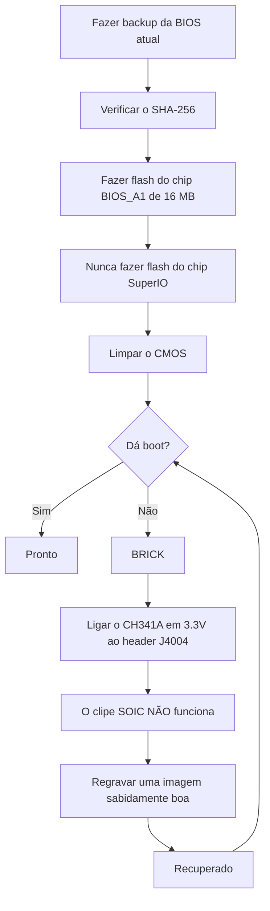

> 🌐 Tradução da comunidade. A versão em inglês é a fonte da verdade e pode estar mais atualizada. Achou um erro? Abra uma issue: [../en/08-bios.md](../en/08-bios.md) · https://github.com/lildebil0/awesome-bc250/issues

# BIOS e Recuperação de Brick

> **TL;DR** — Uma configuração errada de BIOS pode **brickar a BC-250 por completo**, e nesta placa limpar o CMOS *nem sempre* a recupera ([src](https://t.me/c/2424231195/54971)). Antes de fazer flash de *qualquer coisa*, entenda isto: você precisa de um **kit de recuperação por hardware** (um **programador SPI da classe CH341A + fios DuPont fêmea-fêmea**) à mão, porque a única forma confiável de desbrickar é regravar o chip externamente pelo **header J4004** da placa. O mod popular da comunidade (a BIOS do "death", a mais recente baseada na **5.00** de fábrica) desbloqueia overclock, timings de GDDR6 e alocação de memória da iGPU — útil, mas **nem todas as configurações são seguras, e algumas brickam a placa instantaneamente** ([src](https://t.me/c/2424231195/78922)). Verifique o **SHA-256** de toda imagem primeiro, e leia [`assets/firmware/DISCLAIMER.md`](../../assets/firmware/DISCLAIMER.md). **Não faça flash de forma displicente.**

⚠️ **Este é o capítulo mais perigoso do manual.** Fazer flash é destrutivo e irreversível sem hardware de recuperação. Se você não está preparado para soldar/clipar num chip SPI para reviver um brick, **pare aqui e rode a BIOS de fábrica.**

---

## O que é a BIOS na BC-250

A BC-250 é uma placa de mineração/servidor fabricada pela AsRock carregando um APU PS5 "Oberon" reduzido. Sua firmware UEFI vive em um **chip de flash SPI de 16 MB** (um Winbond **W25Q128** / Macronix MX25L128 em um encapsulamento SOIC de 8 pinos). A firmware de fábrica é fortemente travada: quase nada de útil é exposto no Setup. As versões de fábrica conhecidas vistas no chat são **3.00** e **5.00**; as BIOS modificadas são reconstruídas a partir dessas (o número da versão é sua âncora — sempre anote sobre qual base um mod foi construído).

> A versão stock **4.00** também existe. A única diferença funcional entre a stock **v4.0** e a **v5.0** é que a v5.0 habilita o **network boot** por padrão. ([fonte](https://discord.com/channels/1315924807128449065/1316030225338863636/1326825429595848816))

Duas razões pelas quais as pessoas regravam:

1. **Para instalar uma BIOS modificada** que desbloqueia menus ocultos (overclock, undervolt, memória, VRAM da iGPU).
2. **Para recuperar um brick** — restaurar uma imagem sabidamente boa após uma configuração ruim ou um flash falho.

> 💡 **Talvez você não precise fazer flash de jeito nenhum.** Se seu *único* objetivo é mudar a divisão VRAM/UMA, você pode fazer isso a partir de um Linux em execução na BIOS **de fábrica** P3.00 / P5.00 com o **[fanoush/bc250_memcfg](https://github.com/fanoush/bc250_memcfg)** — sem flash, sem programador, sem risco de brick ([elektricM: BIOS flashing](https://elektricm.github.io/amd-bc250-docs/bios/flashing/), [elektricM: VRAM](https://elektricm.github.io/amd-bc250-docs/bios/vram/)). Fazer flash de uma BIOS modificada só é necessário para os *menus de chipset desbloqueados* e recursos além do dimensionamento de VRAM (veja [09-overclock-undervolt.md](09-overclock-undervolt.md) para o comando do `bc250_memcfg`).

---

## A BIOS modificada (o mod do "death") — o que ela muda e por quê

O mod de referência da comunidade é mantido pelo **death** no chat. Ele *não* é uma firmware feita do zero — ele reativa (desoculta) opções de Setup da AMD/AMI que a BIOS de fábrica entrega ocultas. Acompanhe as versões, porque o conselho mudou ao longo do tempo:

| Versão do mod | Base | Lançado | O que expôs / mudou | Status |
|---|---|---|---|---|
| **1.0** (primeiro lançamento) | de fábrica **3.00** | 2025-06-28 | Frequência de GDDR6, timings de GDDR6, tamanho de memória UMA da iGPU, frequência de núcleo, voltagens | ⚠️ Valores ruins brickam a placa, **limpar o CMOS não ajudou** ([src](https://t.me/c/2424231195/54971)) |
| Variantes 3.0 | 3.00 | 2025-07 → 10 | Mesmos desbloqueios; uma build adicionou um **logo de boot Steam personalizado** | Build cosmética de logo espelhada como `bc250-Steam.rom` ([src](https://t.me/c/2424231195/86420)) |
| **mod 5.00** (atual) | de fábrica **5.00** | 2025-10-05 | Abas reagrupadas; **mais configurações abertas**; **configurações de timing de RAM/GDDR6 agora realmente aplicam** nesta placa | A mais nova; "nem todas as configurações são úteis, mas melhor do que nada" ([src](https://t.me/c/2424231195/78922)) |

O que você consegue de fato ajustar com ele (a partir das notas do primeiro lançamento, [src](https://t.me/c/2424231195/54971)):

- **Frequência de GDDR6** — reportada funcionando a **1800** para um usuário (`@Haswellb`), mas *o mesmo tipo de mudança brickou outra placa* — os valores são específicos da placa, não universais.
- **Timings de GDDR6** — eles aplicam, mas **timings baixos/apertados demais brickam** a placa.
- **Tamanho da memória (UMA) da iGPU** — funciona e dá um ganho real. Se sua mudança não fizer efeito, defina **IGC: Forces** e **UMA Mode: UMA_SPECIFIED** ([src](https://t.me/c/2424231195/54971); o mesmo combo é confirmado pela documentação da comunidade).
- **Frequência de núcleo / voltagens** — expostas mas **"não testadas"** pelo autor.

> ❗ **Dois avisos do autor, ainda válidos:** (1) **Não desabilite a Integrated Graphics** — ela é a única saída de vídeo. (2) Em qualquer um destes mods, **uma configuração errada pode brickar a placa e um reset de CMOS pode não recuperá-la** — é exatamente por isso que você precisa de um programador. (Veja a escada de "qual versão?" abaixo para escolher uma base.)

> ### Qual versão? (escada de decisão)
>
> 1. **P3.00 modificada (ROM com menu de chipset) — o padrão seguro.** Este é o **"padrão da comunidade… o mais estável e testado"** estabelecido, verificado-público com um SHA-256 conhecido, e já cobre **unlock de VRAM + configurações de chipset**. Comece por aqui a menos que tenha uma razão específica para não ([elektricM: BIOS flashing](https://elektricm.github.io/amd-bc250-docs/bios/flashing/)).
> 2. **5.00 modificada — atual; escolha-a se quiser ajuste de memória.** É a base mais nova e é aquela onde **configurações de timing de RAM/GDDR6 realmente aplicam** nesta placa ([src](https://t.me/c/2424231195/78922)). Prefira-a à P3.00 especificamente quando quiser ajustar timings de memória.
> 3. **`P5.00_clv` — só para experts.** Ela "desbloqueia **Tudo**" (todo menu oculto, incluindo o experimental **ReBAR / Resizable BAR** e configurações de debug/chipset), o que torna *"muito fácil brickar a placa se você mudar a coisa errada… Fique na P3.00 a menos que seja um usuário avançado."* Pior, **a `P5.00_clv` não está em nenhum repositório público** que o guia pôde encontrar — ela circula apenas como anexo no Discord, então **não há hash canônico**; se você precisar usá-la, obtenha cópias de **duas** pessoas que a rodam independentemente e confirme que ambas têm o **mesmo SHA-256** antes de fazer flash ([elektricM: BIOS flashing](https://elektricm.github.io/amd-bc250-docs/bios/flashing/)).

> **Peculiaridades do 5.00 modificado que vale a pena conhecer.** O Setup dele mostra uma **frequência padrão de CPU de 3600** — um valor cosmético de interface do usuário, não um clock aplicado ([src](https://discord.com/channels/1315924807128449065/1452152658168381593/1452406964780007515)). Ele também expõe uma opção de **bifurcação PCIe `x1x1x1x1`** nas configurações do chipset ([src](https://discord.com/channels/1315924807128449065/1452152658168381593/1474231812598534351)). Tenha cuidado extra com os timings de memória nesta base: **valores de timing extremos podem inutilizar a placa até uma regravação externa, e isso é ainda mais grave na P5.00** ([src](https://discord.com/channels/1315924807128449065/1371527281947971604/1468745940994101372)). E, como em qualquer flash, a mudança para o 5.00 modificado pode deixar o sistema **sem vídeo até que você limpe o CMOS** ([src](https://discord.com/channels/1315924807128449065/1315933088668454942/1508568321346502892)).

Há também um **mod separado de menu de chipset** (`BC250_3.00_CHIPSETMENU.ROM`) do repositório de BIOS mais referenciado, o **[TuxThePenguin0/bc250-bios](https://gitlab.com/TuxThePenguin0/bc250-bios/)**, que expõe o **menu de chipset / NBIO Common Options** por cima da 3.00 de fábrica. O próprio README desse repositório diz claramente: *"Nada neste repositório é suportado ou tem qualquer tipo de garantia — FAÇA BACKUPS."*

> 🚫 **Evite o `Smokeless_UMAF`.** O guia de overclock da comunidade marca esta ferramenta de edição de UEFI como algo a **não rodar na BC-250 — pode causar dano permanente à placa** ([elektricM: BIOS overclocking](https://elektricm.github.io/amd-bc250-docs/bios/overclocking/)). Fique nas ROMs sabidamente boas acima.

---

## Antes de fazer flash — o checklist de segurança

1. **Faça backup da sua BIOS atual primeiro** (leia-a com a mesma ferramenta com que você vai fazer flash — veja Caminho B/recuperação). Um backup é seu desfazer grátis.
2. **Verifique o SHA-256** da imagem contra o `assets/PROVENANCE.md` / o post de origem. O guia de flashing da comunidade publica o hash da ROM com menu de chipset como
   `48fbe5d366e6a56e2fdffdca848426216ba1f083610dab63db89d2f4e6c940b5` ([elektricm docs](https://elektricm.github.io/amd-bc250-docs/bios/flashing/)).
3. **Confirme o tamanho do chip**, não apenas a marcação. O chip de BIOS de 16 MB é o alvo; **não** faça flash do pequeno chip SuperIO (veja a seção de recuperação). Revisões diferentes da placa podem carregar números de peça de chip ligeiramente diferentes — a **capacidade (16 MB)** é o que importa, as últimas letras da marcação podem diferir ([src](https://t.me/c/2424231195/67880)).
4. **Tenha o hardware de recuperação pronto** *antes* do primeiro flash, não depois de brickar.
5. Após fazer flash, **limpe o CMOS** para que as novas configurações (especialmente a alocação de VRAM) façam efeito (veja "Depois de cada flash").



### Verifique o checksum antes de fazer flash

O passo 2 acima diz para verificar o SHA-256 — eis como. Calcule o hash do arquivo que você está prestes a gravar e compare-o, caractere por caractere, com o valor listado para aquele arquivo em [`assets/PROVENANCE.md`](../../assets/PROVENANCE.md).

```bash
# Linux:
sha256sum BC250_3.00_CHIPSETMENU.ROM
```

```powershell
# Windows (PowerShell):
Get-FileHash BC250_3.00_CHIPSETMENU.ROM -Algorithm SHA256
```

O `PROVENANCE.md` pode listar apenas os **primeiros 16 caracteres hex** como uma impressão digital curta. Se for o caso, verifique se o seu hash calculado **começa com** esses 16 caracteres — um match completo desse prefixo já é uma verificação forte (o mantenedor pode publicar hashes completos sob solicitação).

**Hashes SHA-256 completos verificados** para as imagens hospedadas publicamente (cruzados entre múltiplos repositórios da comunidade — todo arquivo de BIOS BC-250 sabidamente bom tem **exatamente 16 MB / 16777216 bytes**; um tamanho diferente significa que está corrompido, é uma ferramenta/patch, ou não relacionado) ([elektricM: BIOS flashing](https://elektricm.github.io/amd-bc250-docs/bios/flashing/)):

| Arquivo | Tipo | SHA-256 |
|---|---|---|
| `BC250_3.00_CHIPSETMENU.ROM` (também `Robin3.00`, `BC250CHIPSETMENU.ROM`) | **P3.00 modificada** — unlock de VRAM + chipset, *recomendada* | `48fbe5d366e6a56e2fdffdca848426216ba1f083610dab63db89d2f4e6c940b5` |
| `Robin5.00` | P5.00 **de fábrica** (não a `P5.00_clv` modificada) | `0d6f136cb120cf3b2de26d5c4d7f255604fdbf4b9442af5ba55419b95b89aa82` |
| `BC250_3.00.ROM` | P3.00 de fábrica | `07595ca3aecf8a4caa28a397b5298f3946a1b769f87b16f67adc369c3f69045c` |
| `BC250_2.00.bin` | P2.00 de fábrica | `ee6150dfed33bd05ea46063a352549416fdf3f45fa0e5edac2a68ef78d71083c` |
| `P5.00_clv` | P5.00 modificada (desbloqueia-tudo) | **nenhum hash público existe** — só no Discord, verifique se duas cópias independentes batem |

> A P3.00 modificada aparece sob vários nomes de arquivo entre os repositórios (`BC250_3.00_CHIPSETMENU.ROM`, `BC250CHIPSETMENU.ROM`, `Robin3.00`) — todos resultam no mesmo hash acima, então o nome não importa. A `Robin5.00` é a P5.00 **de fábrica**, um *arquivo diferente* da `P5.00_clv` modificada. As fontes públicas de cada um (TuxThePenguin0 GitLab, forgenam, tipitochen, csabakecskemeti, scrakcho, dannybastos, kenavru, MrrZed0) estão listadas no [guia de flashing da elektricM](https://elektricm.github.io/amd-bc250-docs/bios/flashing/).

> 🔴 **Se o checksum não bater, NÃO faça flash.** Um descompasso significa um arquivo corrompido ou errado — fazer flash dele é exatamente como você brica a placa. Baixe a imagem de novo e verifique novamente.

---

## Caminho A — Flash por software (a partir da placa, sem programador)

Esta é a forma normal de instalar/atualizar uma BIOS enquanto a placa ainda dá boot. Use um **pendrive FAT32** e o utilitário de atualização de firmware da AMI.

**Método EFI / AFU** ([src](https://t.me/c/2424231195/54979)):

1. Formate um pendrive para **FAT32**.
2. Copie o conteúdo do arquivo do AFU (ex.: `AfuEfi64_5.16.zip`) **e o arquivo da BIOS** para ele.
3. Reinicie a BC-250 e **dê boot pelo pendrive** no EFI shell.
4. Execute:
   ```
   afuefix64.efi <filename>.<ext> /P /N
   ```
   - `/P` = programa a BIOS principal.
   - `/N` = também programa a **NVRAM**. Isso evita erros ao mudar *entre* versões (ex.: para a 3.00 a partir de outra versão) — **mas apaga suas configurações salvas.** Você pode omitir o `/N`, mas então espere possíveis erros. ([src](https://t.me/c/2424231195/54979))
5. Se a ferramenta não conseguir ver o arquivo, tente `fs0:`, `fs1:`, … para descobrir qual é o pendrive ([src](https://t.me/c/2424231195/54979)).

Algumas builds da comunidade já vêm com um script `Flash.nsh` pronto e uma ROM renomeada (ex.: renomeie a ROM modificada para casar com o script) para que você só dê boot no EFI shell e rode o script ([elektricm docs](https://elektricm.github.io/amd-bc250-docs/bios/flashing/)). No Linux também há uma build **`afulnx`** (`afulnx-5.05.04Z.tar.gz`) para fazer flash a partir de um sistema em execução ([src](https://t.me/c/2424231195/54507)).

#### Receita canônica de EFI shell (o método `Flash.nsh` / `Robin5.00`)

O guia de flashing da comunidade padroniza num kit autocontido e num nome de arquivo fixo — este é o caminho de USB mais reproduzido ([elektricM: BIOS flashing](https://elektricm.github.io/amd-bc250-docs/bios/flashing/)):

1. **Obtenha o kit EFI:** `4U12G BIOS Update.zip` (do repositório [kenavru/BC-250](https://github.com/kenavru/BC-250)) — ele contém `AfuEfix64.efi`, `Flash.nsh` e `amdvbflash.efi`. *Ele também inclui uma BIOS P5.00 de fábrica chamada `Robin5.00` — tire-a do caminho para não fazer flash dela por acidente.*
2. **Prepare um pendrive FAT32 (≤ 32 GB recomendado).** Copie o conteúdo da pasta `BIOS EFI` do kit para a **raiz**.
3. **Renomeie sua ROM modificada para `Robin5.00`** (remova a extensão `.ROM`) — esse é o nome exato que o `Flash.nsh` procura. *(Ou edite o `Flash.nsh` para casar com o seu nome de arquivo.)* A raiz deve então conter: `AfuEfix64.efi`, `Flash.nsh`, `amdvbflash.efi`, `Robin5.00` (seu mod renomeado) e a pasta `EFI`.
4. **Use um monitor DisplayPort direto.** Adaptadores **HDMI ativos/passivos podem deixar o menu da BIOS em tela preta** — um problema de exibição conhecido nesta placa.
5. **Desconecte todos os SSDs/drives** para que a placa caia automaticamente no EFI shell, insira o pendrive, ligue. Você chega num prompt amarelo `Shell>`.
6. No prompt digite **`blk0:`** e Enter — **note o espaço depois dos dois-pontos** (isto seleciona o volume USB; `blk0:` é o seletor documentado pela elektricM, distinto da sondagem `fs0:`/`fs1:` acima). Depois digite **`Flash.nsh`** e Enter.
7. **ESPERE. Não toque no teclado, não desligue.** Se *parecer* travar durante a gravação, **espere pelo menos 15 minutos** — desligar no meio da gravação brica a placa. Ela reinicia (ou pede para você reiniciar) quando termina.
8. **Desligue imediatamente e remova o pendrive** para que não volte em loop para o flasher.

> 🔴 **Antes de ligar para fazer flash: confira a fiação de alimentação PCIe de 8 pinos** contra o diagrama de 12 V/GND da sua PSU. **Polaridade invertida pode danificar a placa permanentemente** ([elektricM: BIOS flashing](https://elektricm.github.io/amd-bc250-docs/bios/flashing/)).

#### Configurações de BIOS obrigatórias pós-flash (faça isto logo após limpar o CMOS)

Após fazer flash **e** limpar o CMOS (próxima seção), entre no Setup (martele **Del**) e defina estas — a divisão de VRAM não vai se comportar até elas estarem corretas ([elektricM: BIOS flashing](https://elektricm.github.io/amd-bc250-docs/bios/flashing/), [elektricM: BIOS VRAM](https://elektricm.github.io/amd-bc250-docs/bios/vram/)):

| Configuração | Caminho | Valor |
|---|---|---|
| Integrated Graphics Controller | Chipset → GFX Configuration | **Forces** |
| UMA Mode | Chipset → GFX Configuration | **UMA_SPECIFIED** |
| UMA Frame Buffer Size | Chipset → GFX Configuration | **512MB** (recomendado) ou um tamanho fixo |
| IOMMU | Advanced → CPU Configuration | **Disabled** |
| Boot Mode | Boot → Boot Mode | **UEFI** |

Primeiro verifique se a limpeza do CMOS realmente pegou — o **relógio deve mostrar a hora errada**; se ainda estiver certo, repita a limpeza. Depois F10 para salvar. A escolha `512MB` é alocação *dinâmica*, não um teto de 512 MB (veja [09-overclock-undervolt.md](09-overclock-undervolt.md)).

> ★ **Por que 512 MB de UMA *ganha* FPS (o mecanismo).** Definir o buffer UMA em **512 MB** não deixa a GPU sem recursos — ele permite que o sistema **balanceie dinamicamente RAM vs VRAM** em vez de travar uma fatia fixa grande, e só esse rebalanceamento foi creditado com um salto real de FPS: Cyberpunk 2077 foi de **60 → 66 fps (a 2 GHz OC) → 76 fps** sob FSR 3.0 *balanced*, 1080p, preset Steam-Deck ([Old Lamer — Part I](https://youtu.be/ohpEY2XQ_lo) ~11:21; ⚠ aprox — números transcritos do vídeo, trate como resultado de uma build). Então "512 MB é o melhor" não é só dimensionamento seguro — o pequeno buffer dinâmico é *parte da* história de desempenho, não um compromisso.

**fallback flashrom** (se o AFU der erro) ([src](https://t.me/c/2424231195/54979), sugerido e testado por `@mrartemsid`):

```bash
# Ler (fazer backup):
sudo flashrom -p internal:boardmismatch=force -r <name>.bin
# Escrever:
sudo flashrom -p internal:boardmismatch=force -w <name>.bin
```

> ⚠️ Fazer flash por software só ajuda **enquanto a placa ainda dá POST**. No momento em que uma configuração ruim a brica, o Caminho A acaba e você está no caminho de hardware abaixo.

---

## Caminho B — Flash por hardware / desbrickar (programador SPI CH341A)

Este é o caminho de **recuperação**, e a "forma mais conveniente de fazer flash de um brick" fixada ([src](https://t.me/c/2424231195/67880)). Você regrava o chip SPI de 16 MB diretamente, de outro PC, usando um programador SPI USB. Software usado: **NeoProgrammer** (Windows) ou **flashrom** (Linux).

> 🔴 **O clipe SOIC-8 NÃO funciona nesta placa.** O death é direto sobre isso: *"o clipe na nossa placa funciona… basicamente nada."* ([src](https://t.me/c/2424231195/67880)). Nota: o `assets/firmware/DISCLAIMER.md` menciona um "SOIC clip" genericamente — na prática você precisa **ligar os fios ao header J4004 da placa.** Este é o fato de recuperação mais importante deste capítulo.

### Pinout do header J4004 (ligue os fios aqui)

A placa expõe um **header J4004 de passo 2,54 mm** especificamente para regravar o chip SPI/BIOS. Pinout (do screenshot de fiação fixado, [src](https://t.me/c/2424231195/67880)):

```
J4004
[ GND  SCLK  MOSI  UNK ]
[ VCC  CS    MISO      ]
   ^  (pin-1 marker)
```

| Pino J4004 | Sinal | Pad CH341A |
|---|---|---|
| VCC | alimentação 3,3 V | VDD / 3.3V |
| GND | terra | GND |
| CS | chip select | CS / SS |
| SCLK | clock | CLK / SCK |
| MOSI | dados de entrada (para o chip) | MOSI |
| MISO | dados de saída (do chip) | MISO |

O **mapa de cores W25Q128 SOIC-8 / CH341A** correspondente está no mesmo screenshot fixado — case `/CS, DO(MISO), CLK, DI(MOSI), VCC, GND` com os pads `CS, MISO, CLK, MOSI, VDD, GND` do CH341A. **Confira VCC e GND três vezes** antes de ligar; invertê-los mata o chip ([src](https://t.me/c/2424231195/67880)).

> **Numeração de pinos do J4004 e os dois pinos desconhecidos.** O guia da elektricM numera o header como VCC=1, GND=2, CS=3, SCLK=4, MISO=5, MOSI=6, com os **pinos 7 e 8 não usados no flash — eles são aterrados através de resistores de 10 kΩ.** O pino 1 (VCC) é marcado por uma **seta `>` ou um pad quadrado** na PCB ([elektricM: BIOS flashing](https://elektricm.github.io/amd-bc250-docs/bios/flashing/)).

> **Chip-alvo exato e o erro de digitação na densidade.** A peça de 16 MB é um Winbond **W25Q128JVSQ** (128 Mbit / 16 MB) ou, em alguns lotes, um Macronix **MX25L12835F**. Alguma documentação da comunidade digita isso errado como **"25Q168" — isso está errado**; o código de densidade correto de 16 MB é **128** ([elektricM: BIOS flashing](https://elektricm.github.io/amd-bc250-docs/bios/flashing/)). Se você fizer flash via um **clipe SOIC-8** em vez do J4004, a ordem de pinos do próprio chip é o layout SPI padrão: `1 CS · 2 DO · 3 WP · 4 GND · 5 DI · 6 CLK · 7 HOLD · 8 VCC` ([elektricM: BIOS recovery](https://elektricm.github.io/amd-bc250-docs/bios/recovery/)) — mas lembre-se da constatação do death de que **o clipe mal funciona nesta placa**, então prefira o J4004.

> 🙏 Créditos: o pinout do J4004, a engenharia reversa e o repositório de imagens da firmware modificada são em grande parte trabalho do **Segfault** (a ROM P3.00 com menu de chipset é o "Segfault mod") ([elektricM: BIOS flashing](https://elektricm.github.io/amd-bc250-docs/bios/flashing/)).

### Procedimento do NeoProgrammer (fixado) ([src](https://t.me/c/2424231195/67880))

1. Conecte o programador ao **J4004** com fios fêmea-fêmea conforme o pinout. **Confira a fiação ~10×, especialmente VCC e GND.** (PSU desconectada.)
2. Abra o **NeoProgrammer**.
3. Rode o **auto-detect** do chip, e também leia a marcação no próprio chip.
4. **Compare as marcações.** Se as últimas letras diferirem da lista mas a **capacidade bater (16 MB)**, está tudo bem.
5. **Apague** o chip.
6. **Abra o arquivo da BIOS** no software (arrastar-e-soltar funciona).
7. **Grave** o chip.
8. **Desconecte os fios do J4004.**
9. Ligue a placa.

### Equivalente flashrom (Linux), cruzado com a documentação da comunidade

O guia de flashing da comunidade usa um programador **CH347** e alerta contra placas CH341A baratas de PCB preta (próxima seção). Identifique o chip certo — mire no **chip de BIOS de 16 MB** (`BIOS_A1`), **nunca** no SuperIO de 512 KB (`SIO1_R`), que brica o SuperIO se for gravado ([elektricm docs](https://elektricm.github.io/amd-bc250-docs/bios/flashing/)):

```bash
# Detectar / identificar o chip:
sudo flashrom -p ch347_spi

# Fazer backup da BIOS de fábrica (duas vezes, depois diff para garantir que a leitura está estável):
sudo flashrom -p ch347_spi -r backup_stock.bin
sudo flashrom -p ch347_spi -r backup_verify.bin

# Escrever a nova imagem, depois verificar se ela leu de volta idêntica:
sudo flashrom -p ch347_spi -w BC250_3.00_CHIPSETMENU.ROM
sudo flashrom -p ch347_spi -v BC250_3.00_CHIPSETMENU.ROM
```

(Use `-p ch341a_spi` para um CH341A, ou `serprog` para um Raspberry Pi Pico, no lugar de `ch347_spi`.) ⚠ o mapeamento `ch347_spi` / `serprog` para a fiação exata *desta* placa vem do guia da comunidade — `⚠ verifique` contra o seu próprio modelo de programador.

> **A detecção te diz em qual chip você está.** Se o `flashrom -p …` reportar **`Winbond W25Q128…`** ou **`Macronix MX25L128…`**, você está no chip de BIOS de 16 MB correto. Se reportar **`Macronix MX25L4005…` (512 KB)**, **PARE — você está conectado ao chip SuperIO** (`SIO1_R`); fazer flash dele brica o controle de fan/sensores. Vá para o outro chip ([elektricM: BIOS flashing](https://elektricm.github.io/amd-bc250-docs/bios/flashing/)). Faça flash com a **PSU desconectada da tomada** e os capacitores descarregados (toque no botão de power algumas vezes) — alimentar a placa durante um flash por clipe *não* é recomendado ([elektricM: BIOS recovery](https://elektricm.github.io/amd-bc250-docs/bios/recovery/)).

### A armadilha de 3,3 V do CH341A (leia isto ou você vai cozinhar o chip)

Muitos programadores **CH341A de PCB preta** baratos acionam suas **linhas de dados a 5 V mesmo que o VCC seja 3,3 V** — o chip de BIOS da BC-250 é uma peça de **3,3 V**, então 5 V nas linhas de dados pode danificá-lo. Esta é uma falha conhecida e medida em algumas placas (a placa do Fabian, e uma idêntica no chat, foram confirmadas por medição de voltagem) ([src](https://t.me/c/2424231195/100285)). Correções:

- Prefira um programador que seja genuinamente 3,3 V nas suas linhas de dados (ex.: **CH347**), **ou**
- Aplique a **correção sem solda 5V→3,3V das linhas de dados do CH341A**: corte a linha de 5 V do USB para o chip e alimente-a com 3,3 V no lugar — veja o [artigo em sawyershepherd.org](https://sawyershepherd.org/post/solderless-ch341ab-fix-5v-to-33v-data-lines/) e a [correção do CH341A em wej.k.vu](https://wej.k.vu/electronics/ch341a-mini-programmer-fix/) ([src](https://t.me/c/2424231195/100285)).

---

### Headers de baixo nível, debug e silício embarcado

Além do header de flash J4004 acima, a placa carrega vários outros headers e um conjunto conhecido de chips embarcados. Estes são objeto de engenharia reversa na documentação de hardware da elektricM e são úteis para limpar o CMOS, fazer probing de debug, fiar fans, e confirmar qual chip é qual antes de fazer flash. Valores de pino transcritos literalmente de ([elektricM: pinouts](https://elektricm.github.io/amd-bc250-docs/hardware/pinouts/)).

**CLRCMOS1 — jumper de clear-CMOS (3 pinos).** Este é o jumper referenciado em todo este capítulo como "curte o jumper do CMOS" — eis o seu mapa:

| Posição | Comportamento |
|---|---|
| Pinos 1–2 | CR2032 alimenta o CMOS (padrão) |
| Pinos 2–3 | Limpa o CMOS |

> 💡 Quando o [checklist pós-flash](#antes-de-fazer-flash--o-checklist-de-segurança) e a seção ["Depois de cada flash"](#depois-de-cada-flash--limpe-o-cmos-não-pule-isto) mandarem você "curtar o jumper do CMOS por ~20 segundos", o **CLRCMOS1** é esse jumper: mova-o dos pinos 1–2 para os pinos 2–3, espere, e mova-o de volta. (Remover a CR2032 por 60+ s é a alternativa.)

**TPMS1 — header de debug LPC (18 pinos, passo 2,0 mm):**

| Pino | Sinal | Pino | Sinal |
|---|---|---|---|
| 1 | PCICLK | 2 | GND |
| 3 | FRAME | 4 | SMB_CLK_MAIN |
| 5 | PCIRST# | 6 | SMB_DATA_MAIN |
| 7 | LAD3 | 8 | LAD2 |
| 9 | 3V | 10 | LAD1 |
| 11 | LAD0 | 12 | GND |
| 13 | (vazio) | 14 | S_PWRDWN# |
| 15 | 3VSB | 16 | SERIRQ# |
| 17 | GND | 18 | GND |

> 💡 **O pino 9 (3V) só fica vivo quando a placa está ligada** — então ele funciona como um sinal de detecção de "sistema ligado". Isso o torna um ponto de sensoriamento alternativo para auto-power-on / builds de adaptador ATX verdadeiro (cross-ref ao [jumper `AUTO_PWRON` em 03-power-supply.md](03-power-supply.md)).

**J2 — header de debug JTAG/HDT (20 pinos, passo 1,27 mm, não populado, na parte de baixo da placa):**

| Pino | Sinal | Pino | Sinal |
|---|---|---|---|
| 1 | VDDIO | 2 | TCK |
| 3 | GND | 4 | TMS |
| 5 | GND | 6 | TDI |
| 7 | GND | 8 | TDO |
| 9 | TRST_L | 10 | PWROK_BUF |
| 11 | DBRDY3 | 12 | RESET_L |
| 13 | DBRDY2 | 14 | DBRDY0 |
| 15 | DBRDY1 | 16 | DBREQ_L |
| 17 | GND | 18 | TEST19 |
| 19 | VDDIO | 20 | TEST18 |

> TEST18, TEST19 e DBRDY0 são deixados flutuando. Esta é a **única** interface de reset/debug de hardware na placa.

**I2C_HEADER1 (3 pinos):** `SCL · SDA · GND`. SCL é o pino **mais próximo dos conectores de alimentação**. Este barramento carrega **PMBUS para os PMICs Intersil** — um ponto de acesso à telemetria de energia.

**CPU_FAN1 (4 pinos):** `PWM · Tach · 12V · GND`.

**J4003 — header multi-fan (16 pinos, 2×8, 2,54 mm):**

| Row 1 | 1 GND | 2 F1T | 3 F2T | 4 F3T | 5 F4T | 6 F5T | 7 DET | 8 (vazio) |
|---|---|---|---|---|---|---|---|---|
| **Row 2** | 1 GND | 2 F1P | 3 F2P | 4 F3P | 5 F4P | 6 F5P | 7 GND | 8 GND |

Aqui `T` = tach e `P` = PWM, por fan 1–5.

> 💡 **DET (row 1, pino 7) é aterrado quando a placa está apoiada sobre uma placa de fan / distribuição de energia** — ou seja, ele detecta a carrier. (A numeração de fan BIOS↔Linux é coberta em [06-linux.md → Sensors & fan control](06-linux.md#sensors--fan-control); ela não é duplicada aqui.)

**Silício embarcado (BOM).** O repositório já nomeia `SIO1_R` e `BIOS_A1` nas seções de flashing mas nunca deu números de peça ou tamanhos; esta tabela permite que quem vai fazer flash confirme qual chip é qual (o Winbond de 16 MiB é a BIOS, o Macronix de 512 KiB é o SuperIO — deixe-o em paz):

| Designador | Peça | Função |
|---|---|---|
| PUA1 | Intersil ISL69247 | PMIC principal |
| PUIO1 | Intersil ISL95712 | PMIC de alimentação de núcleo |
| PUA11… | Intersil ISL99360 | Smart power stages (fases) |
| M2U2 | NXP CBTL04083B | Mux PCIe x4 2:1 |
| U30 | Realtek RTL8111H | NIC Ethernet (PCIe x1) |
| SU1 | AMD 218-0844029 | Chipset FCH A68H "Bolton-D2H" |
| UIO1 | Nuvoton NCT6686D | SuperIO (o chip sensor do hwmon) |
| BIOS_A1 | Winbond 25Q128JVSQ | Flash SPI de 16 MiB = a **BIOS** (faça flash DESTE) |
| SIO1_R | Macronix MX25L4006E | Flash SPI de 512 KiB = programa do SuperIO (**NÃO faça flash — brica o SuperIO**) |

> O chip sensor SuperIO nomeado aqui (Nuvoton **NCT6686D**) é aquele ao qual o driver `nct6687`/`nct6683` do Linux se vincula — veja [06-linux.md](06-linux.md) para a configuração de sensor/fan.

**Ferramentas de firmware (avançadas).** Dois utilitários aparecem repetidamente para investigar a imagem:

- **`psptool`** inspeciona e extrai os blobs de firmware AMD dentro de um dump de BIOS. `psptool -E bios.bin` lista as entradas; `psptool -X -d 0 -e 1 -o firmware.bin bios.bin` extrai o firmware SMU para análise. ([bc250-collective/amd_smu_reverse_engineering](https://github.com/bc250-collective/amd_smu_reverse_engineering))
- **`Zentool`** aplica patches no microcódigo da CPU — por exemplo, para substituir a instrução `RDRAND`. ([AMD-BC-250/documentation #1](https://github.com/AMD-BC-250/documentation/issues/1))

---

## Secure Boot e CSM (pré-requisitos de boot)

Adicione estes dois à lista de pré-requisitos do setup da BIOS — necessários ou **kernels personalizados/patcheados não vão dar boot** (o patch dos 40 CUs, o patch de frequência, etc.):

| Configuração | Valor |
|---|---|
| Secure Boot | **Disabled** |
| CSM (Compatibility Support Module) | **Disabled** |

Fonte: [elektricM: boot troubleshooting](https://elektricm.github.io/amd-bc250-docs/troubleshooting/boot/).

---

## A ideia de auto-reset "srep" (experimental — não é um recurso finalizado)

Como uma configuração ruim pode brickar a placa e **limpar o CMOS não conserta**, o death experimentou embutir uma rotina **`srep`** na BIOS para **auto-resetar as configurações num brick** — ideia originalmente do `@Jacky_Fish` ([src](https://t.me/c/2424231195/60552)). O conceito: fazer a BIOS reescrever suas variáveis de NVRAM/`amdsetup` de volta para os padrões, opcionalmente só quando arquivos de gatilho estão presentes num pendrive (para não apagar suas configurações a cada boot). À época do chat, **isso ainda não funcionava** — *"a placa teimosamente finge ser um brick completo e nada se reseta"* ([src](https://t.me/c/2424231195/60883)). Trate qualquer alegação de "BIOS auto-curativa" como **não comprovada**; sua rede de segurança real continua sendo o programador externo. `⚠ verifique` antes de confiar em qualquer build de srep.

---

## Depois de cada flash — limpe o CMOS (não pule isto)

Fazer flash da BIOS **não** reseta as configurações armazenadas, e várias configurações (notavelmente a **alocação de VRAM/UMA**) não vão realmente aplicar até você limpar o CMOS. Um usuário bateu exatamente nisso: a BIOS mostrou o novo tamanho de VRAM e "salvou", mas o SO (Bazzite) ainda reportava a velha divisão de 4 GB RAM / 12 GB VRAM até o CMOS ser limpo ([src](https://t.me/c/2424231195/97290)). Como limpar:

- **Remova a bateria de moeda CR2032 por 60+ segundos** (recomendado), **ou**
- **Curte o jumper do CMOS por ~20 segundos.** ([elektricm docs](https://elektricm.github.io/amd-bc250-docs/bios/flashing/))

> Note o limite: limpar o CMOS conserta "as configurações não aplicaram" e configs ruins *leves* — mas na geração do mod 1.0/3.00 foi reportado que **não** recupera um brick verdadeiro ([src](https://t.me/c/2424231195/54971)). Para isso, veja o Caminho B.

---

## Firmware espelhada

As imagens de BIOS discutidas no chat são espelhadas em `assets/firmware/` para **recuperação/preservação** (veja [`DISCLAIMER.md`](../../assets/firmware/DISCLAIMER.md) e verifique o SHA-256 de cada arquivo em `PROVENANCE.md` antes de fazer flash):

| Arquivo | Tamanho | O que é | Fonte |
|---|---|---|---|
| `BC250_3.00.ROM` | 16 MB | Dump da 3.00 de fábrica | ([src](https://t.me/c/2424231195/5215)) |
| `BC250_3.00_CHIPSETMENU.ROM` | 16 MB | Mod de menu de chipset (TuxThePenguin0) | ([src](https://t.me/c/2424231195/86395)) |
| `dump_5.00.bin` | 16 MB | Dump da 5.00 de fábrica | ([src](https://t.me/c/2424231195/24661)) |
| `BC250_5.00_clv.zip` | 16 MB | **mod 5.00 do death (atual)** | ([src](https://t.me/c/2424231195/78922)) |
| `bc250_3.00_clv1.zip` | 16 MB | Primeiro mod 3.00 do death (1.0) | ([src](https://t.me/c/2424231195/54971)) |
| `bc250-Steam.rom` | 16 MB | mod 3.0 c/ logo de boot Steam | ([src](https://t.me/c/2424231195/86420)) |
| `bc250 modded bios.ROM` | 16 MB | Imagem modificada inicial | ([src](https://t.me/c/2424231195/30100)) |
| `my_4.0_MODED.bin` | 16 MB | Mod 4.0 intermediário | ([src](https://t.me/c/2424231195/45580)) |
| `W25Q128BV@WSON8_…BIN` | 16 MB | Leitura crua do chip (W25Q128) | ([src](https://t.me/c/2424231195/5217)) |
| `AfuEfi64_5.16.zip` | — | Flasher AMI AFU EFI | ([src](https://t.me/c/2424231195/54979)) |
| `afulnx-5.05.04Z.tar.gz` | — | Flasher AMI AFU Linux | ([src](https://t.me/c/2424231195/54507)) |

> Não faça flash de uma BIOS de PS5 (`PS5 Disk Edition … BIOS.bin`, 2 MB) ou dos chips de 512 KB no chip de BIOS de 16 MB da BC-250 — alvo errado, veja os avisos de recuperação.

---

## Fontes

- Mod do death — primeiro lançamento (3.00) — https://t.me/c/2424231195/54971 · atual (5.00) — https://t.me/c/2424231195/78922 · build com logo Steam — https://t.me/c/2424231195/86420
- Flash por software (AFU `/P /N`, flashrom) — https://t.me/c/2424231195/54979 · afulnx — https://t.me/c/2424231195/54507
- Desbrickar por hardware (fixado, NeoProgrammer + screenshots de fiação do J4004) — https://t.me/c/2424231195/67880
- Ideia de auto-reset srep — https://t.me/c/2424231195/60552 · resultado (não funcionou) — https://t.me/c/2424231195/60883
- Necessidade de limpar o CMOS após o flash — https://t.me/c/2424231195/97290
- Armadilha de 5V→3,3V das linhas de dados do CH341A — https://t.me/c/2424231195/100285 · artigo da correção — https://sawyershepherd.org/post/solderless-ch341ab-fix-5v-to-33v-data-lines/
- Repositório de BIOS mais referenciado — [TuxThePenguin0/bc250-bios](https://gitlab.com/TuxThePenguin0/bc250-bios/) (`BC250_3.00_CHIPSETMENU.ROM`, `CHIPSETMENU.md`)
- Guia de flashing/recuperação da comunidade (tabela SHA-256 verificada, receita `Flash.nsh`/`Robin5.00`, seletor `blk0:`, problema de DisplayPort/HDMI, regra dos 15 min de travamento, pinout do J4004 + pinos 7/8, erro de digitação W25Q128JVSQ/"25Q168", CH347, valores de Setup pós-flash, créditos ao Segfault) — [elektricM: BIOS flashing](https://elektricm.github.io/amd-bc250-docs/bios/flashing/)
- Guia de recuperação (pinout SPI de 8 pinos, detecção MX25L4005 = SuperIO, flash com PSU desconectada, walkthroughs de cenários) — [elektricM: BIOS recovery](https://elektricm.github.io/amd-bc250-docs/bios/recovery/)
- Pinouts da placa e silício embarcado (CLRCMOS1, TPMS1 LPC, J2 JTAG/HDT, I2C_HEADER1, CPU_FAN1, J4003 multi-fan, BOM Intersil/NXP/Realtek/Nuvoton/Winbond/Macronix) — [elektricM: pinouts](https://elektricm.github.io/amd-bc250-docs/hardware/pinouts/)
- Guia de VRAM (dimensionamento sem flash com `bc250_memcfg`, valores de UMA Frame Buffer, VRAM via parâmetro de kernel, reporte Vulkan-vs-OpenGL) — [elektricM: BIOS VRAM](https://elektricm.github.io/amd-bc250-docs/bios/vram/)
- ★ 512 MB de UMA → balanço dinâmico RAM/VRAM → mecanismo de ganho de FPS (Cyberpunk 60 → 66 @ 2 GHz OC → 76 fps, FSR 3.0 balanced, 1080p, preset Steam-Deck) — [Old Lamer — Part I](https://youtu.be/ohpEY2XQ_lo) ~11:21 (⚠ aprox, transcrito do vídeo)
- Nota de perigo do `Smokeless_UMAF` — [elektricM: BIOS overclocking](https://elektricm.github.io/amd-bc250-docs/bios/overclocking/)
- Ferramenta de VRAM sem flash — [fanoush/bc250_memcfg](https://github.com/fanoush/bc250_memcfg)
- Utilitário de timing de memória — `Mem_Timing_Utility.zip` https://t.me/c/2424231195/55351
- Política de espelhamento de firmware — [`assets/firmware/DISCLAIMER.md`](../../assets/firmware/DISCLAIMER.md)

> Overclock/undervolt *usando* estas configurações desbloqueadas é coberto em [09-overclock-undervolt.md](09-overclock-undervolt.md). As imagens de BIOS espelhadas vivem em `assets/firmware/` com SHA-256 por arquivo em `PROVENANCE.md`.
