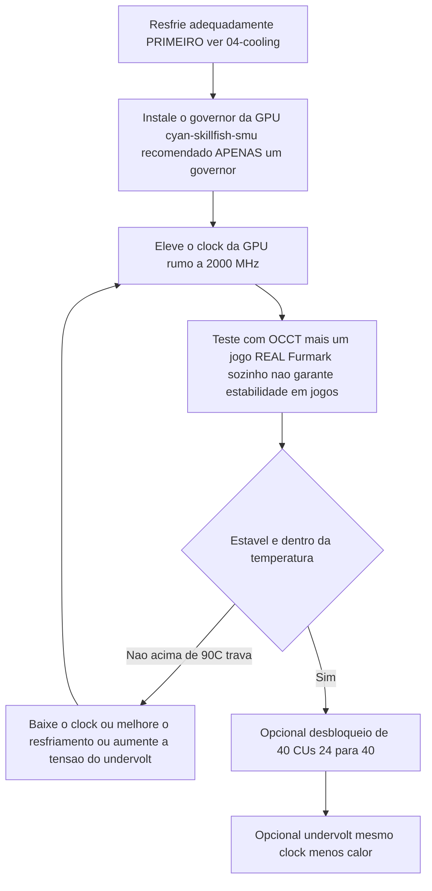

> 🌐 Tradução da comunidade. A versão em inglês é a fonte da verdade e pode estar mais atualizada. Achou um erro? Abra uma issue: [../en/09-overclock-undervolt.md](../en/09-overclock-undervolt.md) · https://github.com/lildebil0/awesome-bc250/issues

# Overclocking e Undervolting

> **TL;DR** — De fábrica, a GPU da BC-250 roda devagar (muitas vezes travada em **1500 MHz**, ~fraca). A correção da comunidade é um **governor** que sobrescreve clocks/tensão: o recomendado hoje é o **[cyan-skillfish-governor-smu](https://github.com/filippor/cyan-skillfish-governor)** (não precisa de patch de kernel, empacotado em Arch/CachyOS/Bazzite/Fedora); o **[oberon-governor](https://gitlab.com/mothenjoyer69/oberon-governor)** é o original e ainda funciona. Qualquer um deles você edita para empurrar a GPU a **2000 MHz (~+30 % de FPS)**. O kit mais novo **[bc250_smu_oc](https://github.com/bc250-collective/bc250_smu_oc)** também faz overclock da **CPU** (recomendado **4 GHz @ 1275 mV**). Separadamente, o **[desbloqueio de 40 CUs](https://github.com/duggasco/bc250-40cu-unlock)** reativa as **24 → 40 unidades de computação** que a AMD desabilitou na firmware — um ganho de GPU maior do que só clocks (uma rodada do Superposition foi de **4647 → 6863** pontos, ([src](https://t.me/c/2424231195/137035))). **Tudo isso é calor. Resfrie a placa primeiro** — veja [04-cooling.md](04-cooling.md) — porque OC sem resfriamento adequado trava e reseta a placa acima de ~90 °C.

Este é o **último** passo do caminho dourado, não o primeiro. Tenha uma placa estável e fria rodando ([06-linux.md](06-linux.md), [04-cooling.md](04-cooling.md)) antes de tocar em qualquer coisa aqui. Tudo aqui é "faça por sua conta e risco" — a comunidade diz isso repetidamente ([src](https://t.me/c/2424231195/106844)).

---

## As quatro alavancas (e quanto cada uma vale)

A BC-250 tem **quatro** coisas independentes que você pode ajustar. Elas se somam:

| Alavanca | Ferramenta | Ganho típico | Custo em calor |
|-------|------|--------------|-----------|
| **Clock da GPU** 1500 → 2000 MHz | governor (cyan-skillfish-smu / oberon) | **~+30 % de FPS** quando limitado pela GPU | alto |
| **Undervolt da GPU** em clock fixo | mesmo governor | mesmo FPS, **muito mais frio** | *negativo* (menos calor) |
| **Clock da CPU** 3,5 → 4,0 GHz | `bc250_smu_oc` | ajuda jogos limitados pela CPU | alto |
| **Desbloqueio de 40 CUs** 24 → 40 CUs | `bc250-40cu-unlock` | **até ~+48 %** de trabalho de GPU | alto |

Duas ressalvas honestas do chat antes de você começar:

- **A maioria dos jogos na BC-250 é limitada pela CPU, não pela GPU.** Empurrar a GPU de 2000 → 2229 MHz rendeu a um testador *1 fps* em Shadow of the Tomb Raider (90 → 91), enquanto consumo e temperatura dispararam — então o "+30 %" da manchete só se concretiza no punhado de títulos em que a GPU é o gargalo ([src](https://t.me/c/2424231195/67029)).
- **O calor escala pior que o desempenho.** Mesmo testador: 2000 MHz @ 960 mV = **75 °C** em um teste de estresse; 2229 MHz @ 1030 mV = **93 °C** — e ele recuou porque sua PSU e cooler não aguentavam ([src](https://t.me/c/2424231195/66972), [src](https://t.me/c/2424231195/67029)).

> ⚠️ **Piso de segurança.** O throttling começa por volta de **85 °C** e a placa trava/reseta de forma dura por volta de **90 °C** (veja [04-cooling.md](04-cooling.md)). Se você cruzar ~85 °C sob carga, está *acima* do seu orçamento de resfriamento — baixe o clock ou faça undervolt, não empurre mais alto.



---

## Passo 1 — Clock e undervolt da GPU: o governor

O driver amdgpu da BC-250 não expõe overclocking normal via sysfs. A solução da comunidade é um **governor** — um pequeno daemon que escreve estados de clock/tensão diretamente. Para uma instalação nova hoje, o recomendado é o **cyan-skillfish-governor-smu**; o **oberon-governor** é o original e ainda funciona (mantido abaixo como a alternativa consolidada).

<p align="center"></p>
<sub>📈 Fonte editável: <a href="../../assets/diagrams/gpu-clock-tradeoff.drawio">gpu-clock-tradeoff.drawio</a> (abra no <a href="https://draw.io">draw.io</a>). Verde = ganho, vermelho = custo.</sub>

### cyan-skillfish-governor-smu (recomendado)

[filippor/cyan-skillfish-governor](https://github.com/filippor/cyan-skillfish-governor), branch SMU — controla clock/tensão por meio de **chamadas à firmware SMU**, então não precisa de **nenhum patch de frequência no kernel, em nenhuma distro**, é mantido ativamente e está empacotado em todas as principais distros. Ele também adiciona controle do **perfil de energia do controlador de memória**, que reduz o TDP em repouso para **~30–35 W** (mais frio e silencioso em repouso) ([src](https://t.me/c/2424231195/125821)).

**Instalação (empacotado em todas as principais distros)** — COPR `filippor/bazzite` (Fedora/Bazzite) ou AUR `cyan-skillfish-governor-smu` (Arch/CachyOS); Debian/Ubuntu usam o tarball de release + `sudo ./scripts/install.sh`:

```bash
# Fedora / Bazzite (COPR):
sudo dnf copr enable filippor/bazzite
sudo dnf install cyan-skillfish-governor-smu        # rpm-ostree install … no Bazzite
sudo systemctl enable --now cyan-skillfish-governor-smu.service

# Arch / CachyOS (AUR):
paru -S cyan-skillfish-governor-smu                  # ou: yay -S …
sudo systemctl enable --now cyan-skillfish-governor-smu.service
```

O branch SMU também pode ser compilado da fonte com `cargo build --release`. **Defina seu clock e tensão** em `/etc/cyan-skillfish-governor-smu/config.toml` (esquema abaixo) — para sair do padrão fraco até o ponto ideal da comunidade, eleve o safe-point do topo rumo a **2000 MHz** e vá reduzindo a tensão até ficar estável (veja undervolting abaixo); reinicie o serviço após cada edição.

> **Confira se pegou.** Acompanhe clocks/temperaturas ao vivo com `amdgpu_top`, MangoHud ou LACT enquanto carrega a GPU. Se os clocks ficarem em ~1500 MHz, o serviço não está rodando ou seu config não foi interpretado — `sudo systemctl status cyan-skillfish-governor-smu`.

> Rode **um** governor por vez — se você rodava o oberon antes, desabilite-o antes de habilitar o cyan-skillfish, ou eles brigam pelos mesmos registradores.

> 🔇 **Ajuste para um console de sala silencioso.** Estourar tudo (2000 MHz na GPU / 4000 MHz na CPU) rende pouco em jogos limitados pela CPU, mas custa muito calor, ruído de ventoinha e watts. Um relato da comunidade r/BC250Gaming (Reddit) encontrou um equilíbrio em **~1600 MHz GPU / ~3500 MHz CPU** que dá um desempenho-por-ruído-por-watt bem melhor para o dia a dia — quase silencioso e frio, com FPS que se sustenta porque a maioria dos títulos não é limitada pela GPU mesmo (veja a ressalva de limitação por CPU acima). Se você se importa mais com uma caixa silenciosa e fria do que com benchmarks recordistas, use esses valores como os tetos do seu governor em vez do máximo.

### oberon-governor (o original — ainda funciona)

[mothenjoyer69/oberon-governor](https://gitlab.com/mothenjoyer69/oberon-governor) — um daemon em C++, o primeiro governor da BC-250 e o mais testado; ainda funciona, mas, ao contrário do governor SMU, depende do patch de frequência estendida no kernel (ou de uma distro que o inclua) para atingir os clocks mais altos. Conforme o README, ele depende de **CMake, uma toolchain C++ e libdrm**, e é **testado apenas na ASRock BC-250**. Muitas distros o trazem pré-compilado (Arch AUR, um COPR do Fedora, as imagens do Bazzite), então compilar da fonte só é necessário se sua distro não tiver pacote.

**Compilar da fonte** (corresponde à sequência reproduzida no chat, ([src](https://t.me/c/2424231195/54666)) e ao fluxo CMake padrão do repositório):

```bash
# Dependências (exemplo Arch — ajuste por distro)
sudo pacman -S --needed base-devel cmake pkgconf make libdrm glibc linux-api-headers

git clone https://gitlab.com/mothenjoyer69/oberon-governor.git && cd oberon-governor
sudo cmake . && sudo make && sudo make install
sudo systemctl enable --now oberon-governor.service
```

> Se o `cmake` der erro, a correção do chat foi simplesmente instalar as dependências de build faltantes e rodar de novo: `sudo pacman -S pkgconf cmake` e então recompilar ([src](https://t.me/c/2424231195/54666)).

**Defina seu clock e tensão.** O oberon lê um config YAML:

```bash
sudo nano /etc/oberon-config.yaml      # ajuste frequência mín/máx e tensão
sudo systemctl restart oberon-governor # aplica
```

O arquivo permite definir a **tensão e a frequência máxima e mínima** para os estados da GPU (conforme o README do repositório). Eleve a frequência máxima rumo a **2000 MHz** e vá reduzindo a tensão até ficar estável. Reinicie o serviço após cada edição. Para migrar para o governor SMU depois: pare+desabilite+remova o `oberon-governor`, `rm /etc/oberon-config.yaml` e então instale e habilite o serviço SMU.

#### TT vs SMU — as duas variantes do cyan-skillfish

> A build SMU recomendada acima é uma de **duas** variantes do cyan-skillfish. SMU é o padrão; a variante TT é a alternativa para quem especificamente quer o caminho de patch de kernel/sysfs ([elektricM: governor](https://elektricm.github.io/amd-bc250-docs/system/governor/)):

> **`perf_profile` — o nível do controlador de memória / Infinity Fabric (separado da curva da GPU).** O SMU expõe um índice de perfil de desempenho `0–3`: **3** é o desempenho mais alto do controlador de memória / Infinity-Fabric, enquanto **1** é o perfil de baixo consumo recomendado para o ponto de ociosidade mais baixo. O governador o força para **3** automaticamente sempre que a carga da CPU ultrapassa `cpu-load-target.upper`. ([bc250-collective/cyan-skillfish-governor](https://github.com/bc250-collective/cyan-skillfish-governor))

| Variante | Serviço | Como define os clocks | Patch de kernel? | Lançamento / notas |
|---|---|---|---|---|
| **SMU** *(recomendado)* | `cyan-skillfish-governor-smu` | **chamadas de firmware** SMU | **Não — funciona em qualquer distro sem patch** | 18/01/2026; atinge 2300+ MHz; CPU ~0,9–1,3 % |
| **TT** (alternativa) | `cyan-skillfish-governor-tt` | sysfs | **Sim** (já incluído no Bazzite) | ciente de throttling térmico; atinge 2175+ MHz |

> **Renomeação do serviço (13/12/2025):** o filippor renomeou `cyan-skillfish-governor` → `cyan-skillfish-governor-tt`, e o diretório de config mudou `/etc/cyan-skillfish-governor/` → `/etc/cyan-skillfish-governor-tt/`. Se for atualizar, copie seu `config.toml` antigo ([elektricM: governor](https://elektricm.github.io/amd-bc250-docs/system/governor/)). A variante TT é empacotada no mesmo COPR/AUR (`cyan-skillfish-governor-tt`) e já vem incluída no Bazzite.

> 🔴 **700 mV é um piso rígido.** Definir a tensão *mínima* da GPU no governor abaixo de **700 mV trava a GPU de volta em 1500 MHz** — anula todo o propósito. Mantenha a tensão mínima ≥ 700 mV em qualquer governor ([elektricM: governor](https://elektricm.github.io/amd-bc250-docs/system/governor/), [elektricM: BIOS overclocking](https://elektricm.github.io/amd-bc250-docs/bios/overclocking/)).

> 🔴 **~1100–1129 mV é o teto — a contraparte do piso de 700 mV.** Não empurre a tensão *máxima* da GPU no governor além do topo de fábrica do `OD_RANGE`, de **1129 mV**; acima disso há **risco de degradação do silício sem ganho de estabilidade**. O teto conservador para refrigeração a ar fica em torno de **1100 mV (alto risco acima)**, e só refrigeração líquida justifica o patamar de **1125 mV** (tabela abaixo). Se uma curva precisa de mais de ~1129 mV para ser estável, a correção real é *resfriamento ou um clock mais baixo*, não mais tensão ([elektricM: BIOS overclocking](https://elektricm.github.io/amd-bc250-docs/bios/overclocking/)).

> **Verifique se a GPU certa está sendo alvo.** O governor pode controlar `card0` ou `card1` dependendo do seu sistema — `ls /sys/class/drm/ | grep card`. Se as configurações não se aplicarem, talvez você precise apontar o config para a placa correta. No Arch/CachyOS o governor às vezes não ativa até a GPU ser usada pela primeira vez — rode um jogo/benchmark uma vez depois de iniciar ([elektricM: governor](https://elektricm.github.io/amd-bc250-docs/system/governor/)).

#### O esquema de config do cyan-skillfish-smu (TOML baseado em seções)

O branch `smu` usa um esquema **baseado em seções**, **não** o array `safe-points = [...]` mais antigo — cada ponto da curva é sua própria tabela `[[safe-points]]`. Campos-chave ([elektricM: governor](https://elektricm.github.io/amd-bc250-docs/system/governor/)):

```toml
# /etc/cyan-skillfish-governor-smu/config.toml
[timing.intervals]
sample = 500          # µs; aumente (ex. 1000) para reduzir overhead de CPU, mantendo adjust = sample*400
adjust = 200_000
[gpu-usage]
fix-metrics = true    # corrige o bug de "655 %" de uso de GPU do MangoHud na BC-250
method  = "busy-flag"
[gpu]
set-method = "smu"    # "smu" ou "kernel"
[load-target]
upper = 0.80          # frações, não porcentagens
lower = 0.65
[temperature]
throttling = 85       # °C
throttling_recovery = 75

[[safe-points]]
frequency = 1000
voltage   = 800
[[safe-points]]
frequency = 2000
voltage   = 1000      # jogos
[[safe-points]]
frequency = 2200
voltage   = 1000      # muitas placas seguram 1000 mV constante aqui; suba por placa só se travar
```

> **Ordem de ajuste quando instável: resfriamento → frequência → *depois* tensão.** Na refrigeração de fábrica a causa real quase sempre é calor (95 °C+). Reduza os blocos `[[safe-points]]` do topo para limitar a frequência antes de adicionar tensão; só se as temperaturas estiverem boas e ainda travar a 2150–2200 MHz, aumente **apenas o ponto do topo** em +15–25 mV. Acima de ~1075 mV a 2200 MHz você só está adicionando calor — reduza a frequência em vez disso ([elektricM: governor](https://elektricm.github.io/amd-bc250-docs/system/governor/)).

> **Tela preta por reset de GPU, específica do governor.** Se a GPU travar *enquanto o governor está escrevendo ativamente no sysfs*, o reset não consegue completar e você fica com uma tela preta permanente (sistema ainda vivo via SSH), exigindo um reboot forçado. Contorno: dar `systemctl stop` no governor antes de jogos sabidamente propensos a travar; a correção real é uma curva estável ([elektricM: governor](https://elektricm.github.io/amd-bc250-docs/system/governor/)).

##### Como o governor SMU passa de 2230 MHz — e por que vem desabilitado

Como o branch SMU fala com a firmware SMU diretamente em vez de passar pelo `OD_RANGE` do amdgpu, ele pode **exceder o teto rígido de 2230 MHz do Oberon** — um passo a passo o levou a **≈2700 MHz** em uma placa ([Old Lamer — Parte XII](https://youtu.be/Chzxaryjncs)). Essa margem é exatamente por que o filippor o distribui com cuidado:

> 🔴 **O config padrão do governor SMU pode dar tela preta no boot — por isso ele é distribuído SEM iniciar automaticamente.** O filippor deliberadamente deixa o serviço desabilitado após a instalação para que uma curva padrão ruim não te tranque no boot; você tem a chance de **ajustar e testar a curva primeiro, e depois dar `systemctl enable`** quando estiver estável na sua placa. Habilite-o *antes* de validar uma curva e uma tela preta no próximo boot é por sua conta ([Old Lamer — Parte XII](https://youtu.be/Chzxaryjncs)). *(⚠ valores auto-legendados — trate os MHz exatos como aproximados.)*

Ao contrário da queda de frequência brusca do Oberon em superaquecimento, o governor SMU **sobe gradualmente rumo a um alvo de temperatura**. O passo a passo também expõe campos extras no `config.toml` além do esquema acima ([Old Lamer — Parte XII](https://youtu.be/Chzxaryjncs)):

```toml
# botões de ajuste extras mostrados no passo a passo da Parte XII
[ramp-rates]
normal = 1
burst  = 50
[gpu-usage]
burst-samples = 60
down-events   = 5
[frequency-thresholds]
adjust = 10
[temperature]
throttling_recovery = 80
```

> ⚠️ **Curva a ar experimental do autor com 16 pontos — NÃO recomendada, excede o teto a ar deste guia.** O autor da Parte XII rodou esta curva a ar, mas seus pontos do topo (2333–2400 MHz a 1120–1150 mV) ficam **acima dos limites conservadores para refrigeração a ar documentados no Passo 3** (≈2230 MHz / 1060 mV a ar; 1125 mV é um patamar *exclusivo de líquido*). É mostrada como referência, não como alvo — a ar, pare onde a tabela de classes de resfriamento do Passo 3 manda:
>
> ```toml
> # ⚠ experimental do autor, a ar — NÃO copie às cegas (excede o teto a ar)
> # frequência (MHz) @ tensão (mV)
> 1000@800,  1175@850,  1500@900,  1700@920,
> 2000@960,  2100@1000, 2150@1035, 2200@1050,
> 2250@1070, 2300@1090, 2333@1120, 2400@1150
> ```
>
> No topo dessa curva, **2,4 GHz puxou ~30 A ≈ 360 W** — o suficiente para precisar de **dois Molex / uma segunda alimentação da placa** ([03-power-supply.md](03-power-supply.md)), não um conector único. O Superposition escalou **≈4200 a 2,2 GHz → ≈4500 a 2,4 GHz** ([Old Lamer — Parte XII](https://youtu.be/Chzxaryjncs)). *(⚠ todos os valores auto-legendados — aproximados.)*

#### Patch de kernel para a faixa de frequência da GPU (só para TT / sysfs manual)

A faixa de GPU de fábrica do driver amdgpu é **1000–2000 MHz**; um patch de driver de uma linha (por **ViRazY**, `linux-6.12-bc250-freq.mypatch`, ~**639 bytes**, testado nos kernels **6.12 / 6.15 / 6.16.x**) a amplia para **350–2230 MHz** (350 MHz de deep-idle economiza energia; o topo habilita overclocks de 2230+). **Bazzite, PikaOS e os kernels do Arch AUR já vêm com o patch**, e o **governor SMU dispensa totalmente a necessidade dele** via chamadas de firmware — então você só aplica o patch manualmente se quiser o governor TT ou OC via sysfs cru com a faixa estendida em uma distro sem patch. Verifique com `cat …/pp_od_clk_voltage` (deve mostrar 350–2230). **Não** use o patch de tensão estendida (600–1300 mV) — desnecessário e arriscado ([elektricM: BIOS overclocking](https://elektricm.github.io/amd-bc250-docs/bios/overclocking/)).

> 🔧 **Undervolt via sysfs cru (sondagem pontual).** Para uma sondagem rápida de estabilidade por ponto sem o governor, escreva um ponto da curva de tensão direto no sysfs (formato `vc <nível> <MHz> <mV>`) e faça commit ([elektricM: BIOS overclocking](https://elektricm.github.io/amd-bc250-docs/bios/overclocking/)):
> ```bash
> echo "vc 0 2100 1025" | sudo tee /sys/class/drm/card0/device/pp_od_clk_voltage   # define ponto: 2100 MHz @ 1025 mV
> echo "c" | sudo tee /sys/class/drm/card0/device/pp_od_clk_voltage                # commit
> ```
> Isso é só para sondagem rápida — não sobrevive a um reboot. O `config.toml` do governor é o caminho **persistente** recomendado; use o sysfs cru para achar uma tensão estável por ponto e depois assar isso na curva do governor.

#### PS5GPU-BC250 — um controlador com GUI (sem arquivos de config)

Prefere uma GUI? **[ZEROAESQUERDA/PS5GPU-BC250](https://github.com/ZEROAESQUERDA/PS5GPU-BC250)** é um app Qt (KDE/GNOME) que ajusta frequência e tensão mín/máx da GPU, define um limite de temperatura e oferece boost automático de 4 estágios ou controle manual — estilo MSI Afterburner, sem patches de kernel ou edição de TOML. **Desabilite qualquer governor em execução primeiro** (cyan-skillfish-smu/tt ou oberon) ou eles conflitam ([elektricM: governor](https://elektricm.github.io/amd-bc250-docs/system/governor/)).

---

## Passo 2 — Overclock da CPU e undervolt apropriado: `bc250_smu_oc`

Lançado em **30/12/2025** pelo bc250-collective (fazendo engenharia reversa do SMU), o [bc250_smu_oc](https://github.com/bc250-collective/bc250_smu_oc) é a ferramenta que finalmente deixa você mexer no clock e na tensão da **CPU** (núcleos Zen 2), não só da GPU. Os autores recomendam **4 GHz @ 1275 mV** como o ótimo de estabilidade/calor e o distribuem como o exemplo no repositório ([src](https://t.me/c/2424231195/106844)).

**Instalação e uso** (literal do README do repositório):

```bash
# Pré-requisito: instale a ferramenta de carga de CPU `stress` pelo seu gerenciador de pacotes
git clone https://github.com/bc250-collective/bc250_smu_oc.git
cd bc250_smu_oc
pip install .        # ou: pipx install .

# Detecte / teste um alvo (CPU 4 GHz a 1275 mV), mantenha aplicado:
bc250-detect --frequency 4000 --vid 1275 --keep

# Quando achar um config estável, instale-o e habilite no boot:
bc250-apply --install overclock.conf
sudo systemctl enable --now bc250-smu-oc
```

> 🔴 **Limite rígido de tensão.** Conforme o repositório: nunca deixe a tensão dos núcleos da CPU (**Vid**) exceder **1,325 V** sob nenhuma circunstância — a degradação do silício começa acima de ~1,35 V ([src](https://t.me/c/2424231195/115726)). E: **elevar a frequência da CPU sem fazer undervolt deixa a Vid escalar sem limite e pode destruir o hardware** — sempre acompanhe um aumento de clock com um alvo de tensão.

Por que 4 GHz é o teto: a AMD considera até ~4 GHz seguro para este silício; a BIOS do desktop-kit 4700S inclusive dá boot em turbo a 4000 MHz / 1,35 V de fábrica. O Zen 2 *normalmente* chega a ~4200, mas estes chips são **silício rejeitado de mineração**, então 4200 só "se você tiver muita sorte" ([src](https://t.me/c/2424231195/115726)).

> ❓ **Posso desbloquear a CPU para 8 núcleos?** Resposta curta: **não — não atualmente, e não ajudaria mesmo.** A BC-250 vem com 6 dos seus 8 núcleos Zen 2 ativos; relatos da comunidade r/BC250Gaming descrevem os outros dois como **travados por software via eFuses lidos pelo SMU** (o binning é em grande parte artificial — uma decisão da era da mineração), *não* fisicamente cortados. Mas desbloqueá-los significaria **burlar a verificação de assinatura do PSP e modificar o microcódigo do SMU**, e as tentativas da comunidade (no Discord) **não tiveram sucesso**. Mesmo se alguém conseguisse, o ganho para jogos seria **marginal**: a BC-250 é gargalada por **desempenho fraco de thread único, um cache L3 de 2×4 MB pequeno e fragmentado, e uma FPU só com AVX2 / capada** — adicionar núcleos não eleva nem o FPS nem as coisas em que esse chip de fato passa fome. Não persiga isso ([relatos da comunidade r/BC250Gaming](https://www.reddit.com/r/BC250Gaming/)).

> O post fixado do `bc250_smu_oc` também pode **substituir** seu governor de GPU (ele tem seu próprio serviço `bc250-smu-oc`). Não rode dois governors ao mesmo tempo.

**Escala de OC de CPU verificada** (Fedora 43, kernel 6.19.8; tensão auto-ajustada; MIPS do 7-zip; com uma curva de ventoinha baseada em temperatura) ([elektricM: governor](https://elektricm.github.io/amd-bc250-docs/system/governor/)):

| Freq | Vid auto | MIPS 7-zip | Temp (carga total) | vs padrão |
|---|---|---|---|---|
| 3500 (padrão) | auto | 26.062 | 60 °C | base |
| 3600 MHz | 1150 mV | 26.518 | 65 °C | +1,7 % |
| 3700 MHz | 1199 mV | 27.212 | 68 °C | +4,4 % |
| 3800 MHz | 1250 mV | 27.919 | 72 °C | +7,1 % |
| 3900 MHz | 1275 mV | 28.410 | 75 °C | +9,0 % |
| 4000 MHz | — | dá throttle no PWM 80 | 77 °C | ❌ (precisa de mais resfriamento/ventoinha) |

As flags da ferramenta: `bc250-detect -f <MHz> -v <mV>` para testar, adicione **`-k`** para manter o OC depois que a ferramenta sair, **`-c <caminho>`** para escrever um config. Torne permanente com `bc250-apply -a -i /etc/bc250-overclock.conf` e então `systemctl enable bc250-smu-oc`. Autores: **mrfrakes & dantistnfs** (engenharia reversa do SMU) ([elektricM: governor](https://elektricm.github.io/amd-bc250-docs/system/governor/), [elektricM: BIOS overclocking](https://elektricm.github.io/amd-bc250-docs/bios/overclocking/)). Note que **4000 MHz deu throttle na ventoinha no PWM 80 quase-de-fábrica** — o teto é limitado por resfriamento, consistente com a nota ar-vs-água acima.

#### Como o `bc250-detect` de fato busca (e o teto de tensão que ele impõe)

Um passo a passo em vídeo da mesma ferramenta mostra a mecânica da auto-busca: ela **sobe a partir de 3,5 GHz em passos de 100 MHz / 25 mV**, rodando um **teste de estresse de ~300 s** a cada passo e só avançando se passar — ex. `bc250-detect -f 3850 -v 1150 -k` para testar 3,85 GHz @ 1150 mV e mantê-lo. No Bazzite a instalação é `sudo rpm-ostree install stress pipx` e depois `pipx install .` ([Old Lamer — Parte VIII](https://youtu.be/ciDpPhoioKM)).

> ⚠️ **Dois tetos de tensão — anote ambos, eles divergem.** O vídeo da Parte VIII afirma um teto rígido de **1300 mV** de Vid de CPU, que é **mais conservador** que o limite documentado de **1,325 V** do repositório usado acima. Eles não contradizem a mensagem de segurança (fique bem abaixo de ~1,35 V), mas o número *exato* difere por fonte — na dúvida, tome o menor (1300 mV) como seu teto de trabalho e nunca exceda 1,325 V ([Old Lamer — Parte VIII](https://youtu.be/ciDpPhoioKM)). *(⚠ o valor de 1300 mV é auto-legendado.)*

Naquela rodada, **4 GHz @ 1225 mV passou no teste rápido curto, mas travou no jogo**, então o autor recuou para um estável **3,85 GHz @ 1150 mV** — o mesmo padrão "4 GHz passa no rápido, falha no sustentado" que a tabela da elektricM mostra ([Old Lamer — Parte VIII](https://youtu.be/ciDpPhoioKM)). *(⚠ ASR — valores aproximados.)*

**Escala ponta a ponta CPU+GPU (Horizon Zero Dawn, 1080p Ultra, nativo, 1× Arctic P12 Pro ~2200 rpm).** Um único vídeo empilha cada alavanca e mede o resultado no jogo, que é a demonstração mais clara de por que esta placa é **limitada pela CPU**: a GPU está feliz renderizando ~88–90 fps muito antes de a CPU conseguir alimentá-la ([Old Lamer — Parte X](https://youtu.be/1hgSQxf6RXE)). *(⚠ todos os fps/°C auto-legendados — trate como ≈.)*

| Passo (cumulativo) | Clock GPU @ mV | Clock CPU @ mV | fps no jogo | fps que a GPU aguenta | Temp CPU / GPU |
|---|---|---|---|---|---|
| Undervolt de fábrica | 1500 @ 850 | 3,5 G @ 1020 | **≈62** | — | 53 / 51 °C |
| + OC de GPU | 2000 @ 960 | 3,5 G @ 1020 | **≈69** | 81 | 64 / 63 °C |
| + OC de CPU | 2000 @ 960 | 3,85 G @ 1155 | **≈72** | — | 65 / 64 °C |
| + OC de GPU | 2200 @ 1030 | 3,85 G @ 1155 | **≈74** | 88 | ~70 °C |
| + OC de CPU | 2200 @ 1030 | 4,0 G @ 1270 | **≈76–77** | 88 | 72 / 68 °C |
| + mitigações off | 2200 @ 1030 | 4,0 G @ 1270 | **≈80** | 90 | — |

**Resultado: ≈62 → ≈80 fps (~+29 %), e é fortemente limitado pela CPU** — a GPU renderiza 88–90 fps internamente enquanto a CPU limita a taxa jogável em torno de 80. Notas da mesma rodada ([Old Lamer — Parte X](https://youtu.be/1hgSQxf6RXE)):

- **4 GHz precisa de ~1270 mV** aqui, ou a placa dá tela verde — acompanhar o clock com Vid suficiente é obrigatório (ecoa a regra "nunca eleve a frequência sem undervolt" acima).
- **O `bc250_smu_oc` tem um auto-throttle embutido de ~90 °C**, então a própria ferramenta recua antes da temperatura de travamento duro da placa.
- **mitigations=off rendeu só ≈+3 fps** (as mitigações de kernel para vulnerabilidades de CPU); um pequeno aperto final opcional.
- **Timings de memória personalizados não deram ganho aqui e carregam risco de brick** — pule-os (veja a seção de GDDR6 abaixo).
- **3,85 GHz @ 1155 mV é chamado de ponto ideal da CPU** — batendo com a tabela 7-zip da elektricM, onde 4 GHz dá throttle na refrigeração quase-de-fábrica.
- No OC final a placa rodou **1440p Ultra nativo @ 60**, e **4K + FSR perto de 60** ([Old Lamer — Parte X](https://youtu.be/1hgSQxf6RXE)).

> 📊 **Números de sanidade do FurMark na base de fábrica (rodada diferente).** Um passo a passo separado registrou o FurMark em **FHD de fábrica ≈4085 pontos / 67 fps**; elevar a GPU de **1500 → 2000 MHz rendeu ~+30 % (≈5340 pontos / 87 fps)**, enquanto **2229 MHz não acrescentou quase nada e rodou >90 °C** (throttle). Regra de bolso desse vídeo: **"<80 °C no FurMark + estresse de CPU ⇒ <70 °C em jogos,"** e **o FurMark Vulkan aquece o chip mais que o caminho GL** ([Old Lamer — Parte IV](https://youtu.be/YuBmGF536II)). *(⚠ ASR — aproximado.)*

#### A escala de frequência da CPU precisa do fix de ACPI (senão não há cpufreq nenhum)

> ❗ **De fábrica a BC-250 não expõe nenhuma escala de frequência de CPU** — *não* há interface cpufreq, então `cpupower`/`schedutil` não fazem nada e a CPU fica num clock fixo. O **[bc250-collective/bc250-acpi-fix](https://github.com/bc250-collective/bc250-acpi-fix)** entrega duas tabelas SSDT (carregadas via um override de initrd) que corrigem isso ([elektricM: governor](https://elektricm.github.io/amd-bc250-docs/system/governor/)):
> - **SSDT-PST** → habilita o cpufreq padrão do Linux com **8 P-states, 800 MHz → 3200 MHz** (governors: `schedutil`, `powersave`, `performance`, …).
> - **SSDT-CST** → habilita os **estados de repouso C1/C2/C3** para que os núcleos realmente durmam em repouso (menor consumo em repouso).
>
> Ambos confirmados funcionando no kernel 6.19.8. A instalação monta um cpio a partir de `SSDT-CST.aml`+`SSDT-PST.aml` em `/boot`, prependado à linha de initrd (Fedora BLS) ou via `GRUB_EARLY_INITRD_LINUX_CUSTOM` (GRUB). Depois `echo schedutil | sudo tee /sys/devices/system/cpu/cpu*/cpufreq/scaling_governor`. **Ressalva:** uma atualização de kernel não vai carregar o override para a nova entrada de boot — readicione-o ou use um hook de kernel-install. Combinado com o `bc250_smu_oc`, a CPU então escala de **800 MHz em repouso → 3900 MHz sob carga** em vez de rodar travada ([elektricM: governor](https://elektricm.github.io/amd-bc250-docs/system/governor/), [elektricM: power](https://elektricm.github.io/amd-bc250-docs/system/power/)).

#### Consumo em repouso — por que é alto, e até onde o ajuste te leva

A BC-250 fica quente e gulosa em repouso por padrão; o ajuste reduz isso em patamares claros ([elektricM: power](https://elektricm.github.io/amd-bc250-docs/system/power/)):

- **Escada de repouso: ~105 W (sem governor) → ~85 W (governor) → ~55 W (otimizado: Debian + governor + undervolt).** O governor sozinho economiza ~20 W; **~55 W é o melhor piso de repouso possível**, e você só chega lá empilhando distro + governor + undervolt.
- **Por que o repouso é alto — detalhamento não otimizado (~93 W):** **CPU+GPU ~31 W**, **RAM + controlador de memória ~35 W**, **resto da placa ~27 W**. O subsistema de memória é o maior consumo isolado em repouso, e a maior parte do número da placa é silício fixo — ou seja, o ajuste pode raspar a CPU/GPU e (via o perfil de controlador de memória do governor) parte do consumo da RAM, mas um grande pedaço é intocável.

Três perfis de ajuste nomeados delimitam os envelopes realistas (consumo em repouso / temperatura sustentada) ([elektricM: power](https://elektricm.github.io/amd-bc250-docs/system/power/)):

| Perfil | Consumo | Temp |
|---|---|---|
| Eficiência | 55–65 W | 60–70 °C |
| Jogos | 70–85 W | 65–75 °C |
| Desempenho | 85–95 W | 75–85 °C |

---

## Passo 3 — Undervolting (faça isto pelo calor, cada chip é diferente)

Undervolting é o movimento de maior valor nesta placa: **mesmo clock, muito menos calor**, e é *obrigatório* se você elevar o clock da CPU. Mas **cada chip é diferente** — a loteria do silício é real aqui. Um dono rodou três placas quase sequenciais e só uma segurou 900 mV sob estresse; mesma refrigeração, mesmas temperaturas, estabilidade diferente ([src](https://t.me/c/2424231195/50568)).

<p align="center"></p>
<sub>📈 Fonte editável: <a href="../../assets/diagrams/undervolt-tradeoff.drawio">undervolt-tradeoff.drawio</a> (abra no <a href="https://draw.io">draw.io</a>). Verde = ganho, vermelho = custo.</sub>

**Clock-alvo → tensão, números reais da comunidade (seu chip vai variar):**

| Clock GPU | Tensão que donos acharam *estável em jogos* | Notas |
|-----------|------------------------------------------|-------|
| 1500 MHz | ~710 mV | a placa "mais estável" de um testador ([src](https://t.me/c/2424231195/23545)) |
| 2000 MHz | **~955 mV** | estável no Furmark a 905 mV, mas com artefatos em jogos até 955 mV ([src](https://t.me/c/2424231195/68126), [src](https://t.me/c/2424231195/136773)) |
| 2000 MHz | ~960 mV → **75 °C** em estresse | o setpoint popular de uso diário ([src](https://t.me/c/2424231195/66972)) |
| 2229 MHz | ~1030–1050 mV → **93 °C** em estresse | "desliguei, estou com medo" — retornos decrescentes ([src](https://t.me/c/2424231195/66972)) |

**O que cada classe de resfriamento de fato aguenta** — a tabela acima para em "2229 MHz @ ~1030–1050 mV → assustador" na refrigeração quase-de-fábrica. Para ir mais alto você precisa do resfriamento correspondente; estes são os tetos da elektricM por classe de resfriamento ([elektricM: BIOS overclocking](https://elektricm.github.io/amd-bc250-docs/bios/overclocking/)):

| Resfriamento | Clock GPU | Tensão |
|---|---|---|
| Ar conservador (máx) | 2230 MHz | 1060 mV |
| Ar de alta pressão estática (Arctic P12 Max) | 2300 MHz | 1075 mV |
| Líquido (por NexGen3D) | 2400 MHz | 1125 mV |

> 🧪 **Setpoints de undervolt da comunidade (4pda).** Mais duas curvas reais do fórum russo, bons pontos de partida (ainda dependentes do chip): numa placa de **24 CUs (Oberon)**, uma curva de dois pontos `1000 MHz @ 0,8 V + 1700 MHz @ 0,85 V` ([4pda — dreamerok](https://4pda.to/forum/index.php?showtopic=1104980)); numa placa de **40 CUs**, `1500 MHz @ 900 mV`. Para um chip de alta fuga, comece baixo — `500 MHz / 900 mV` — e **adicione frequência a partir daí** em vez de perseguir tensão para baixo ([4pda — Lakan](https://4pda.to/forum/index.php?showtopic=1104980)).

> ⚡ **Enquadramento de desempenho-por-watt.** Testes da comunidade observam que uma **placa de 40 CUs com undervolt + underclock puxa ~100 W menos que uma de 24 CUs com a mesma pontuação no FurMark** — ou seja, para a mesma saída, a peça mais larga-porém-mais-lenta é o ponto de operação mais eficiente, que é todo o argumento para desbloquear e então *reduzir* o clock em vez de forçar 24 CUs.

> **Furmark sozinho não é um teste de estabilidade.** Sua carga fixa esconde instabilidade que só aparece quando o *contexto* muda — alt-tab, carregar texturas, menus. Uma placa "estável" no Furmark a 905 mV soltou artefatos de textura em jogos reais depois de 1–2 horas, até a tensão ir para 955 mV. Valide em **jogos reais + uma varredura de alt-tab/menu**, e use uma ferramenta de estresse variada como o **OCCT** (ele carrega o VRM, não só os shaders), não só o Furmark ([src](https://t.me/c/2424231195/68126), [src](https://t.me/c/2424231195/136773), [src](https://t.me/c/2424231195/23545)).

> **Pista útil de hardware:** a BC-250 tem um **LED de carga** — **vermelho = GPU ociosa, verde = GPU carregada**. Algumas cenas "ociosas" (ex. Novigrad em Witcher 3) na verdade martelam a GPU e revelam artefatos de undervolt que o Furmark/Cyberpunk não pegam ([src](https://t.me/c/2424231195/12285)).

Um undervolt agressivo demais **não é perigoso** — no pior caso a placa cai ou desabilita o slot M.2, o que se resolve em cinco segundos porque o OC não fica armazenado na BIOS ([src](https://t.me/c/2424231195/105998)).

> 💡 **Artefatos que não são do undervolt?** Texturas pretas / tremulação também podem ser um problema de HiZ no driver — tente definir **`RADV_DEBUG=nohiz`** no ambiente do jogo antes de perseguir tensão. E note que a janela de tensão do `OD_RANGE` do kernel de fábrica é **700–1129 mV**; o máximo conservador a ar é ~1085 mV, máximo absoluto ~1100 mV — além disso é risco de degradação sem ganho real de estabilidade ([elektricM: BIOS overclocking](https://elektricm.github.io/amd-bc250-docs/bios/overclocking/)).

---

## Passo 4 — O desbloqueio de 40 CUs (24 → 40 unidades de computação)

O maior ganho isolado de GPU, e o mais novo. O die Cyan Skillfish da BC-250 tem fisicamente **40 CUs**, mas a firmware de fábrica deixa só **24 ativas** (16 "harvested"). O parâmetro de kernel **`amdgpu.bc250_cc_write_mode=3`** mais um driver amdgpu com patch reativa todas as 40. Resultado medido — uma rodada do Superposition em 4K saltou de **4647 → 6863** pontos (24/40 → 40/40 CUs ativas), com a ferramenta `cu_map.sh` mostrando o mapa de colheita preencher ([src](https://t.me/c/2424231195/137035)):


As pessoas estão rodando **40 CUs @ 1850 MHz** (RE4 Remake nativo 1440p high, 60 fps) e até reportando tensões muito baixas a 40 CUs (ex. 1400 MHz @ 750 mV num chip sortudo) ([src](https://t.me/c/2424231195/137260), [src](https://t.me/c/2424231195/137157)).

> ⚠️ **Isto requer aplicar patch e recompilar o módulo de kernel amdgpu** — é a tarefa mais elaborada deste guia e é **exclusiva da BC-250** (o patch é protegido pelo PCI device ID da placa, **`0x13FE`**). O patch é não persistente: sem a config do modprobe, um reboot reverte para 24 CUs.

**Como funciona de verdade (dois registradores, ambos necessários).** O desbloqueio escreve **dois** registradores de hardware durante a inicialização do driver — nenhum sozinho escala a computação ([elektricM: desbloqueio de 40 CUs](https://elektricm.github.io/amd-bc250-docs/system/40cu-unlock/)):

| Registrador | Papel | Fábrica → desbloqueado |
|---|---|---|
| `CC_GC_SHADER_ARRAY_CONFIG` | diz ao driver quantas CUs existem | `0xfff80000` → `0xffe00000` |
| `SPI_PG_ENABLE_STATIC_WGP_MASK` | diz ao SPI onde despachar as waves | `0x07` (WGP 0–2) → `0x1F` (WGP 0–4) |

(A ferramenta de runtime abaixo escreve um **terceiro** registrador, `RLC`, também.) Este é um desbloqueio de **computação**, não de jogos: o A/B controlado do duggasco mostra o `llama-bench pp512` em Vulkan saltar **1,61×** (230 → 372 tok/s a 1500 MHz), enquanto o `glmark2` ganha só **+4,4 %** porque o 3D é limitado por fill-rate, não por CUs ([elektricM: desbloqueio de 40 CUs](https://elektricm.github.io/amd-bc250-docs/system/40cu-unlock/)). Para detalhes de IA/LLM veja também [akandr/bc250](https://github.com/akandr/bc250).

> 🎯 **O ponto de operação recomendado é 1500 MHz, não 2 GHz.** O A/B do duggasco coloca **1500 MHz / ~900 mV** como o ponto ideal — ele captura a maior parte da escala teórica de ~1,67× sem problema térmico (1500 MHz/874 mV: 372 tok/s, 125 W, 83 °C). A 2 GHz o mesmo teste estoura para 466 tok/s, mas consumo/temperaturas sobem forte e o pacote dá throttle térmico após alguns minutos ([elektricM: desbloqueio de 40 CUs](https://elektricm.github.io/amd-bc250-docs/system/40cu-unlock/)).

> ⚠️ **Nem toda placa desbloqueia limpo — cheque seu padrão de colheita primeiro.** As 16 CUs fundidas não têm garantia de silício saudável. Placas com um padrão de colheita **contíguo** (ex. CU 0–5 ativas, 6–9 fundidas, igual em todos os 4 shader arrays) tendem a passar; placas com um padrão **espalhado** podem ter CUs genuinamente defeituosas que enumeram mas falham sob carga. Rode **`./scripts/cu_map.sh`** do repositório *antes* de fixar uma config de modprobe. Se for espalhado, espere rodar o teste de saúde por WGP e parar em algum lugar **entre 24 e 40 CUs estáveis** ([elektricM: desbloqueio de 40 CUs](https://elektricm.github.io/amd-bc250-docs/system/40cu-unlock/)). Além disso: o **Secure Boot precisa estar desligado** (ou assine o módulo recompilado você mesmo).

> 🎰 **40 CUs é uma loteria, não uma garantia — muitas placas param em 38.** Relatos da comunidade r/BC250Gaming convergem nisso: embora o die tenha 40, muitos chips são estáveis só em **38 CUs**, e a última uma ou duas comumente causam **artefatos gráficos (uma "linha" reveladora atravessando o quadro) ou travamentos duros**. As contagens estáveis reportadas variam por chip — **36, 38 ou 40**. Pior, "estável em 40" pode ser *enganoso*: uma placa pode travar no primeiro lançamento de jogo e rodar bem numa tentativa posterior, então um único benchmark limpo não prova nada. **Método recomendado — desbloqueie as CUs uma de cada vez e teste após cada uma.** Use o **[WinnieLV/bc250-cu-live-manager](https://github.com/WinnieLV/bc250-cu-live-manager)** para habilitar uma CU por vez e validar antes de adicionar a próxima (ex. FurMark 20+ min mais um par de benchmarks de jogo por passo). Uma CU ruim **trava o sistema instantaneamente**, então cada teste te diz exatamente qual CU deixar mascarada — muito mais seguro que ligar todas as 16 de uma vez e torcer. Trate "24 → 40" como o melhor caso; planeje para **38** ([relatos da comunidade r/BC250Gaming](https://www.reddit.com/r/BC250Gaming/)).

O gráfico abaixo resume por que esta alavanca vale a pena, mas é traiçoeira: **a computação escala forte com as CUs** (os saltos de Superposition / llama-bench acima), enquanto **o FPS em jogos mal se move porque a maioria dos títulos é limitada pela CPU**, e o consumo e a instabilidade sobem quanto mais alto você vai — 38 CUs é a contagem estável típica, 40 é uma loteria.

<p align="center"></p>
<sub>📈 Fonte editável: <a href="../../assets/diagrams/cu40-tradeoff.drawio">cu40-tradeoff.drawio</a> (abra no <a href="https://draw.io">draw.io</a>). Verde = computação, âmbar = FPS em jogos, vermelho = consumo/instabilidade.</sub>

#### Quanto as CUs extras valem (FurMark)

A série de vídeos sobre 40 CUs quantifica o salto de computação no FurMark — uma carga quase pura de GPU, então mostra o *limite superior* do que o desbloqueio rende (jogos ganham bem menos, sendo limitados pela CPU). Numa placa ([Old Lamer — Parte I](https://youtu.be/Zvo4UsNocDQ)): *(⚠ todos os valores auto-legendados — ≈.)*

| Config | fps no FurMark | vs 24 CUs de fábrica |
|---|---|---|
| 24 CUs @ 2000 MHz | ≈91 | base |
| 40 CUs @ 1500 MHz (base) | ≈110 | **~+25 %** |
| 40 CUs @ 2000 MHz | — | **≈+60 %** |

Uma **placa de 24 CUs com OC puxa quase o mesmo consumo/temperatura que uma de 40 CUs de fábrica**, enquanto uma de **40 CUs com OC puxa ~+40 W** sobre o padrão. Black Myth: Wukong ganhou **~+30 % na mesma frequência indo de 24 → 40 CUs**. Forçando, a **placa travou a 2,4 GHz com 40 CUs** — o envelope combinado clock+CU é o limite, não cada um sozinho ([Old Lamer — Parte I](https://youtu.be/Zvo4UsNocDQ)).

> 🟢 **Escala ao vivo do FurMark via `bc250-cu-live-manager` (sem recompilar kernel).** Alternar CUs ao vivo num **1500 MHz** fixo no FurMark Vulkan subiu a pontuação de forma limpa: **24 CUs ≈70 → 32 CUs ≈100 → 40 CUs ≈127–128 fps** ([Old Lamer — 40CU Parte III](https://youtu.be/lAxY2RZcvg0)). Os atalhos da TUI são **E** = editar a tabela WGP, **F** = full-dispatch, **W** = escrever a tabela, **I** = instalar o serviço systemd, **Q** = sair; a senha sudo padrão na imagem é `bazzite`. Não precisa de **kernel customizado** e **sobrevive a atualizações do Bazzite**, porque escreve os registradores em runtime via `umr` em vez de aplicar patch no amdgpu — escreva a tabela uma vez, instale o serviço uma vez, reinicie. *(⚠ fps auto-legendados — ≈.)*

### Caminho mais fácil — o script de build do projeto

O [duggasco/bc250-40cu-unlock](https://github.com/duggasco/bc250-40cu-unlock) traz um script que faz o build/habilitação para você (precisa de `gcc`, `make`, `zstd` e headers do kernel):

```bash
git clone https://github.com/duggasco/bc250-40cu-unlock.git
cd bc250-40cu-unlock
sudo ./scripts/bc250-enable-40cu.sh build
sudo ./scripts/bc250-enable-40cu.sh enable    # escreve a config do modprobe e reinicia
# Reverta se algo se comportar mal:
sudo ./scripts/bc250-enable-40cu.sh disable   # desliga o desbloqueio
sudo ./scripts/bc250-enable-40cu.sh restore   # restaura o módulo amdgpu original
```

O script faz backup do módulo de fábrica antes de aplicar o patch, como `…/amdgpu/amdgpu.ko.*.bc250-backup-*`, então o `restore` sempre tem um original para voltar. **Dependências de build por distro** ([elektricM: desbloqueio de 40 CUs](https://elektricm.github.io/amd-bc250-docs/system/40cu-unlock/)):

| Distro | Pacotes |
|---|---|
| Debian / Ubuntu | `linux-headers-$(uname -r) build-essential zstd` |
| Fedora | `kernel-devel gcc make zstd curl` |
| Arch / CachyOS | `linux-headers` |

### Caminho manual (aplique o patch no módulo você mesmo)

Para quando você prefere conduzir (ex. CachyOS/Arch, a distro mais usada no chat para isso). Reproduzido da instrução fixada da comunidade ([src](https://t.me/c/2424231195/137241)) — confira o patch e o nível de strip `-p` contra o [repositório](https://github.com/duggasco/bc250-40cu-unlock), que usa `patch -p5`:

```bash
# 1. Obtenha headers de kernel correspondentes (exemplo CachyOS)
sudo pacman -Suy
sudo pacman -S linux-cachyos-headers
sudo reboot

# 2. Aplique o patch na fonte do amdgpu, recompile e instale o módulo
cd /usr/lib/modules/$(uname -r)/build/drivers/gpu/drm/amd/amdgpu
# aplique bc250-40cu-amdgpu.patch em gfx_v10_0.c  (patch -p5 < .../patch/bc250-40cu-amdgpu.patch)
sudo make -C /usr/lib/modules/$(uname -r)/build M=$(pwd) modules
sudo make -C /usr/lib/modules/$(uname -r)/build M=$(pwd) modules_install
sudo reboot

# 3. Ligue o recurso via parâmetro de kernel, recompile o initramfs, reinicie
echo 'options amdgpu bc250_cc_write_mode=3' | sudo tee /etc/modprobe.d/bc250-40cu.conf
sudo mkinitcpio -P     # Fedora/atomic: dracut --force  (ou rpm-ostree kargs, abaixo)
sudo reboot
```

**No Fedora atomic / Bazzite** (rpm-ostree), o parâmetro entra como um kernel arg ([src](https://t.me/c/2424231195/137916)):

```bash
sudo rpm-ostree kargs --append-if-missing='amdgpu.bc250_cc_write_mode=3'
sudo systemctl reboot
```

> 📦 **Kernel pré-compilado com desbloqueio de 40 CUs no Bazzite, e a ordenação segura.** Existe um kernel empacotado com desbloqueio `6.17.7-ba29.fc43.bc250cu.x86_64` para o Bazzite. A sequência do passo a passo é: `rpm-ostree update` → **fixar (pin) o deployment atual** (para poder reverter) → **desabilitar + parar o governor da GPU *antes* do desbloqueio** (um governor escrevendo clocks durante a mudança de CU pode travar a GPU) → trocar pelo kernel com desbloqueio → reiniciar → reverificar o mapa de CUs. Faça o stop do governor primeiro; essa ordenação é a parte que as pessoas esquecem ([Old Lamer — 40CU Parte I](https://youtu.be/Zvo4UsNocDQ)). *(⚠ string do kernel conforme o vídeo — verifique contra o repositório.)*

> 🥾 **No CachyOS o desbloqueio usa o Limine, não o GRUB.** Se sua instalação CachyOS dá boot pelo bootloader **Limine**, o argumento de kernel `amdgpu.bc250_cc_write_mode=3` entra em **`/etc/default/limine`**, não em uma config do GRUB — há um passo a passo no [guia psenyukov.ru](https://psenyukov.ru/topics/5564) (linkado do [vídeo RU de desbloqueio de CUs](https://youtu.be/M7PsojWr4KA)). Mesmo parâmetro, arquivo de bootloader diferente.

### Verifique se o desbloqueio funcionou

```bash
sudo dmesg | grep active_cu_number     # sucesso = ...active_cu_number 40
sudo dmesg | grep bc250-40cu           # mostra as escritas de registrador do mode=3

# Verificação sem root (não precisa de sudo) — pergunte direto ao driver Vulkan:
RADV_DEBUG=info vulkaninfo --summary 2>&1 | grep num_cu   # esperado: num_cu = 40 e num_cu_per_sh = 10
```

Se a contagem terminar em **40**, todas as CUs estão ativas ([src](https://t.me/c/2424231195/137241)). Você também deve ver linhas de log como `bc250-40cu-enable: mode=3 ... CC=0xfff80000->0xffe00000 SPI=0x00000007->0x0000001f` ([src](https://t.me/c/2424231195/137889)). Se o `vulkaninfo` mostrar `num_cu = 24` (ou `active_cu_number` for 24), o módulo com patch não carregou ([elektricM: desbloqueio de 40 CUs](https://elektricm.github.io/amd-bc250-docs/system/40cu-unlock/)).

> **Não quer recompilar um kernel?** A comunidade está construindo scripts auxiliares e bundles de módulo pré-compilados. Veja [WinnieLV/bc250-cu-live-manager](https://github.com/WinnieLV/bc250-cu-live-manager) (alternar CUs ao vivo) e [gennro/bc250-toolkit](https://github.com/gennro/bc250-toolkit) (`bc250-toolkit.sh` / `bc250-unlock.sh`). Esses se movem rápido — cheque os repositórios para o status atual.

> **UMR em runtime vs o patch de kernel — mesmo estado final, trade-off diferente.** O `bc250-cu-live-manager` escreve os mesmos registradores (**CC + SPI + RLC**) a partir do userspace via `umr` *depois* que o driver dá boot, com uma TUI e uma unidade systemd para persistência — ele instala o `umr` sozinho (pacman/dnf/rpm-ostree). **Escolha o UMR em runtime** se você não quer recompilar o amdgpu a cada atualização de kernel, ou quer fazer A/B de layouts de WGP ao vivo (ótimo para placas de colheita espalhada — ele se recusa a desabilitar WGPs ativos no driver, então experimentos por placa são mais seguros que rodar `umr -w` à mão). **Escolha o patch de kernel** se você quer `active_cu_number 40` na topologia do driver desde o boot 0, ou está assando isso numa imagem de distro ([elektricM: desbloqueio de 40 CUs](https://elektricm.github.io/amd-bc250-docs/system/40cu-unlock/)).

#### Mascaramento seletivo de CUs (para placas de colheita espalhada)

Se o `cu_map.sh` mostrar um padrão espalhado, o duggasco traz um teste de saúde por WGP que reinicia em cada config de WGP isoladamente e roda checagens de correção, e então mascara as ruins ([elektricM: desbloqueio de 40 CUs](https://elektricm.github.io/amd-bc250-docs/system/40cu-unlock/)):

```bash
sudo ./scripts/bc250-cu-health-test.sh start
./scripts/bc250-cu-mask.sh --results /var/lib/bc250-cu-health-test/results.tsv --install
```

O mascaramento usa o parâmetro de fábrica **`amdgpu.disable_cu`** na **granularidade de WGP** (desabilitar a CU 6 também desabilita a CU 7 — mesmo WGP).

> 🧩 **Mascaramento manual por pair-id (a rota artesanal).** Um passo a passo separado faz isso à mão: primeiro **faça rebase da imagem** (`brh → bazzite-deck → stable → tag 20260406`), depois mascare as CUs por uma **notação de pair-id** `linha.coluna`, onde a linha é uma de `00 / 01 / 10 / 11` (os quatro shader arrays) e a coluna é `0–4` (o WGP) — ex. `011`, `013`. Você **anexa esses ids ao `rpm-ostree kargs amdgpu.disable_cu`**. Como as CUs desabilitam **em pares**, mascarar dois pares te leva a **36 CUs** e mascarar um único id a **38 CUs**; o autor mantém uma **tabela de consulta de ~210 combinações** para escolher quais ids derrubar. (A AMD teria construído o die com uma **especificação de 24 CUs acordada contratualmente com a ASRock**, que é o motivo de a colheita existir.) ([Old Lamer — 40CU Parte II](https://youtu.be/iUVLXmoMyqM)) *(⚠ tag/ids conforme o vídeo — verifique antes de aplicar.)*

#### Checagem de realidade térmica — 40 CUs a 2 GHz vão dar throttle na refrigeração de fábrica

`llama-bench` sustentado por 10 minutos verificado (Llama-3.2-1B Q4_K_M, 40 CUs @ 2 GHz, dissipador de fábrica + dois Arctic P12 Max em push-pull) ([elektricM: desbloqueio de 40 CUs](https://elektricm.github.io/amd-bc250-docs/system/40cu-unlock/)):

| Métrica | Média | Pico |
|---|---|---|
| Borda da GPU | 89,6 °C | **107 °C** |
| Consumo do pacote (PPT) | 136 W | **223 W** |
| Temp da CPU | 96,7 °C | **100 °C (TJmax)** |
| MOSFET do VRM | 57 °C | 58,5 °C |
| Ventoinha | ~2950 RPM | 2977 RPM (teto) |

A vazão sustentada **cai ~10 %** ao longo de 10 min conforme o pacote dá throttle; o gargalo é **dissipador + temperatura da CPU, não o VRM**. O desbloqueio *em si* é sólido — 25 min de teste de correção Vulkan em loop deram zero erros de fp/int, sem travas, sem resets. **Resumo: limite o governor em 1500 MHz para trabalho sustentado de 40 CUs** a menos que você tenha resfriamento sério — a restrição é o envelope térmico, não o silício ([elektricM: desbloqueio de 40 CUs](https://elektricm.github.io/amd-bc250-docs/system/40cu-unlock/)).

> ⚡ **Rodar todas as 40 de forma confiável precisa de mais resfriamento *e* mais energia.** Relatos da comunidade r/BC250Gaming são consistentes: 40 CUs cheias num clock útil pedem um **AIO ou um cooler de ar grande**, não o dissipador de fábrica — um dono só segurou 40 CUs estáveis com um **AIO mantendo as temperaturas abaixo de 70 °C**. Também pede **mais corrente do que o único 8-pin (J1000) entrega confortavelmente**: alimente os conectores **J2000 / J2001** da placa como uma segunda fonte (o método de alimentação dupla "Além de 300 W" em [03-power-supply.md](03-power-supply.md)). Se você deixou no cooler de fábrica e um 8-pin, espere que 40 CUs deem throttle ou desarmem a placa — resolva resfriamento ([04-cooling.md](04-cooling.md)) e energia primeiro ([relatos da comunidade r/BC250Gaming](https://www.reddit.com/r/BC250Gaming/)).

---

## Memória GDDR6: alocação de VRAM, overclock e timings

> 🔴 **Leia isto antes de qualquer outra coisa nesta seção. Tuning de memória é o único lugar na BC-250 que pode brickar a placa permanentemente.** Ao contrário do clock/undervolt acima — que vive num governor e some no reboot — o **clock e os timings da GDDR6 são escritos na BIOS/CMOS**, e um valor ruim pode deixar a placa incapaz de dar POST. A comunidade brickou placas exatamente assim: um membro setou o clock da VRAM em **1950 MHz** e matou a placa ([src](https://t.me/c/2424231195/55317)); a própria nota de versão do autor da BIOS modificada registra uma frequência de GDDR6 que **deu boot numa placa (1800 MHz) mas brickou outra** ([src](https://t.me/c/2424231195/54971)), e "timings baixos demais brickam a placa, um reset de CMOS não ajuda" ([src](https://t.me/c/2424231195/54971), [src](https://t.me/c/2424231195/54851)). A recuperação é o capítulo da BIOS — às vezes um programador é a única volta. **Não toque em clock/timings a menos que tenha lido [08-bios.md](08-bios.md) e aceite o risco de brick.**

Os 16 GB de GDDR6 na BC-250 são **memória unificada (UMA)** — um pool compartilhado entre a GPU e a CPU. Há duas coisas muito diferentes que você pode fazer com ela, em dois níveis de risco muito diferentes:

| O quê | Onde | Risco | Quem deveria |
|------|-------|------|------------|
| **Alocação de VRAM / UMA** (divisão GPU↔CPU) | um menu normal da BIOS | **seguro** — só um tamanho de buffer | todo mundo, isto é rotina |
| **Clock e timings da GDDR6** | só BIOS **modificada** | **nível-brick** — veja o aviso acima | só especialistas |

### Alocação de VRAM / UMA — segura, faça isto na BIOS

Quanto dos 16 GB é entregue à GPU vs deixado para a CPU é uma configuração comum da BIOS (não precisa de mod; até a BIOS modificada reduzida expõe "nada além da configuração de tamanho de buffer" ([src](https://t.me/c/2424231195/94419))). As opções relevantes se comportam assim ([src](https://t.me/c/2424231195/81203)):

| Opção da BIOS | Resultado observado |
|-------------|-----------------|
| **Auto** | aloca **8 GB** à GPU |
| **UMA_SPECIFIED** → Auto | igual ao Auto (8 GB) |
| **UMA_AUTO** (automático) | aloca só **256 MB** — **não confiável, evite** |
| **UMA_SPECIFIED** | você escolhe um tamanho fixo (512 MB / 1 / 4 / 6 / 8 GB) |

> 🔴 **Não use o automático (`UMA_AUTO`).** Ele entrega à GPU só ~256 MB, o que não é suficiente — nesse tamanho só ~2 GB acabam utilizáveis e a GPU pode cair para **llvmpipe (renderização por software — sem aceleração de GPU, tudo roda na CPU)** ([src](https://t.me/c/2424231195/81203)). Defina um buffer **fixo** em vez disso.

**O que escolher — defina um buffer FIXO pequeno de 512 MB.** O consenso da comunidade é direto: APUs têm melhor desempenho com o videobuffer no **mínimo (512 MB)**, porque o driver então **compartilha dinamicamente todo o pool de 16 GB de GDDR6** e puxa exatamente o que a GPU precisa sob demanda ([src](https://t.me/c/2424231195/38599), [src](https://t.me/c/2424231195/17948)). Uma divisão fixa maior *não* é automaticamente mais rápida — nos benchmarks de jogo de um membro o tamanho da VRAM mal moveu o FPS médio; afetou principalmente os frames **mínimos / 1%-low** e se um título sequer iniciaria (alguns travaram em 256 MB / 512 MB / 1 GB e só rodaram de 4 GB para cima) ([src](https://t.me/c/2424231195/81203)). O ganho real dos 512 MB é a *divisão que produz*: a 512 MB uma rodada saudável fica em ~**5,8 GB para vídeo / 11,5 GB para RAM / ~1,6 GB de swap**, versus uma divisão travada em 8 GB que mata de fome o SO ([src](https://t.me/c/2424231195/138294)).

> **Depende do workload.** Alguns jogos se comportam diferente e uns poucos **travam de vez se mal configurados** ([src](https://t.me/c/2424231195/131105), [src](https://t.me/c/2424231195/94993), [src](https://t.me/c/2424231195/139016)). O exemplo mais claro: Cyberpunk 2077, se você der a ele **4 GB** fixos, para de tratar a memória acima de 8 GB como RAM disponível e **faz swap agressivamente** mesmo com folga de sobra; a **512 MB** ele ainda agarra ~4–5 GB para a GPU, mas corretamente deixa 12 GB+ para o SO e só faz swap quando isso se esgota — então o conselho permanente de um membro é *"512 e deixa se resolver"* ([src](https://t.me/c/2424231195/94993), [src](https://t.me/c/2424231195/131105)). Para a maioria: **512 MB fixos, evite o auto.** Suba para **4 GB** só para um título específico documentado como preferindo isso (uns poucos preferem), ou para workloads de GPU famintos por memória (veja IA/LLM abaixo). Uma ressalva: uma alocação fixa de VRAM maior que 512 MB pode fazer as **alocações de buffer grande do Vulkan** se comportarem mal (ex. `llama.cpp`), o que um patch de kernel da comunidade resolve para que a alocação dinâmica ainda funcione acima de 512 MB ([src](https://t.me/c/2424231195/20001), [src](https://t.me/c/2424231195/20002)).

> 📋 **Comportamento concreto por título do guia de VRAM da comunidade** ([elektricM: BIOS VRAM](https://elektricm.github.io/amd-bc250-docs/bios/vram/)): com 512 MB dinâmico, **RDR2** e **Company of Heroes 3** podem travar/dar artefato quando o ZRAM está em jogo (veja abaixo), e **Expedition 33** e **Mafia** podem travar a menos que **4–8 GB sejam alocados estaticamente**. Os presets fixos de fábrica mapeiam para o UMA Frame Buffer Size: **6144 MB = 10 GB/6 GB** (bom para AAA), **8192 MB = 8 GB/8 GB** (equilibrado, bom para IA/computação), **4096 MB = 12 GB/4 GB** (jogos leves, máximo de RAM do sistema, menor consumo em repouso).

> 🔧 **Mude a VRAM sem flash — `bc250_memcfg`.** Na BIOS *de fábrica* P3.00/P5.00 você pode definir a divisão a partir de um Linux em execução ([elektricM: BIOS VRAM](https://elektricm.github.io/amd-bc250-docs/bios/vram/)):
> ```bash
> git clone https://github.com/fanoush/bc250_memcfg && cd bc250_memcfg && make
> sudo ./bc250memcfg UMA_SIZE 512   # valores: 512, 4096, 6144, 8192 — depois reinicie
> ```
> Verifique após reiniciar: `cat /sys/class/drm/card0/device/mem_info_vram_total` e `free -h`.

> ⚠ **Reporte de VRAM no Vulkan vs OpenGL.** O Vulkan vê o pool dinâmico completo (~10–12 GB), mas o **OpenGL só vê o valor alocado pela BIOS** (512 MB) — então um jogo OpenGL pode se recusar a iniciar em "512 MB" enquanto títulos Vulkan/Proton vão bem. Se um jogo OpenGL específico reclamar, mude para uma alocação fixa que atenda ao requisito dele ([elektricM: BIOS VRAM](https://elektricm.github.io/amd-bc250-docs/bios/vram/)).

> ⚙️ **ZRAM conflita com 512 MB dinâmico — use zswap em vez disso.** O swap comprimido ZRAM pode confundir o alocador dinâmico e disparar travas de OOM em jogos famintos por memória (RDR2, CoH3) mesmo com RAM livre. A correção da comunidade é **desabilitar o ZRAM, habilitar o zswap (lz4), adicionar um arquivo de swap de 16–32 GB e definir `vm.swappiness=180`** ([elektricM: power](https://elektricm.github.io/amd-bc250-docs/system/power/), [elektricM: BIOS VRAM](https://elektricm.github.io/amd-bc250-docs/bios/vram/)):
> ```bash
> # Exemplo Fedora
> sudo systemctl disable --now zram-swap
> sudo dd if=/dev/zero of=/swapfile bs=1G count=16 && sudo chmod 600 /swapfile
> sudo mkswap /swapfile && sudo swapon /swapfile
> echo '/swapfile none swap defaults 0 0' | sudo tee -a /etc/fstab
> echo 'zswap.enabled=1 zswap.max_pool_percent=25 zswap.compressor=lz4' >> /etc/default/grub
> sudo grub2-mkconfig -o /boot/grub2/grub.cfg
> echo 'vm.swappiness=180' | sudo tee /etc/sysctl.d/99-swap.conf && sudo sysctl -p /etc/sysctl.d/99-swap.conf
> ```
> (Bazzite/rpm-ostree usa `btrfs filesystem mkswapfile` + `rpm-ostree kargs`; receita na página de power da elektricM.) Com o zswap, swappiness 180 mantém os dados dos apps residentes e faz swap de páginas frias em vez de descartar o cache de arquivos — o viés certo para uma caixa de pouca RAM.

### Clock e timings da GDDR6 — BIOS modificada, só para especialistas

<p align="center"></p>
<sub>📈 Fonte editável: <a href="../../assets/diagrams/memory-tradeoff.drawio">memory-tradeoff.drawio</a> (abra no <a href="https://draw.io">draw.io</a>). Verde = ganho, vermelho = custo.</sub>

Os timings padrão da GDDR6 são conservadores; há banda real a ganhar, mas **isto é território de BIOS/ferramenta de mod, não do governor** — amarra diretamente à BIOS modificada em [08-bios.md](08-bios.md). A referência da comunidade é o texto fixado **"#BC-250 GDDR6 Memory Explained"** ([src](https://t.me/c/2424231195/126436)); uma nota paralela em inglês coloca de forma franca: *"se você estragar isso, vai travar o chip. Dito isso, os padrões são ruins, há muito desempenho a ganhar"* ([src](https://t.me/c/2424231195/55353)).

> ❓ **"O que o tuning de memória de fato me dá?" — honestamente, muito pouco.** O clock de GDDR6 de fábrica é **1750 MHz**, e o máximo que uma placa geralmente dá POST é **~1875 MHz** ([src](https://t.me/c/2424231195/126436)); membros que ajustam costumam estabilizar em torno de **1800 MHz @ 860 mV**, mantido abaixo de ~70 °C em jogos ([src](https://t.me/c/2424231195/140223), [src](https://t.me/c/2424231195/139654)). **O ganho é pequeno.** Clock/timings de memória adicionam principalmente um pouco de banda, que só ajuda nos momentos limitados por banda de GPU; o desempenho real da BC-250 vem do **clock do núcleo da GPU + o desbloqueio de 40 CUs + resfriamento**, não da memória. Tuning de memória é o "último 2 %" para entusiastas — e carrega o **maior risco da placa inteira**: um clock/timing ruim é escrito no CMOS e pode brickar permanentemente (1950 MHz brickou placas; 1800 MHz deu boot numa placa e brickou outra). Então **ajuste o núcleo da GPU + resfriamento primeiro**, e só toque na memória se tiver lido [08-bios.md](08-bios.md) e aceite o risco de brick. O gráfico acima visualiza exatamente isso — uma linha de ganho verde minúscula contra um penhasco íngreme vermelho de risco de brick.

O que o texto diz que é ajustável (valores são resultados de **um testador**, não universais — ⚠ verifique contra sua própria placa) ([src](https://t.me/c/2424231195/126436)):

- **`ClockSpeed`** — fábrica **1750**. **~1875 MHz parece ser o máximo que ainda dá POST**; acima disso a placa não dá boot. Qualquer mudança aqui interage com o `tCL`.
- **`tCL`** (CAS latency) — **24** em 1750 MHz e abaixo; **26** é necessário em 1755 MHz e acima.
- **`tRAS`** — deve ser igual a `tCL + tRCD + 1`; o texto usa o valor de write-RCD para reduzi-lo, com um leve ganho.
- **`tRCDRD` / `tRCDWR`** — melhor deixar nos 27 / 19 de fábrica; o testador achou que baixá-los *prejudicou* o desempenho.
- **`tRCAb`** — não dá POST abaixo de ~70; melhor em 71–72.
- **`tRFC` / `tREF`** (refresh) — mais alto reduz consumo e calor; **12000 é de fábrica, ~13000 não dá POST**.
- Vários campos (`tRPAb`, `tRRDS`, `tRRDL`, `tRTP`, `tFAW`) são tidos como específicos do fabricante e foram **deixados intocados** — o testador não tinha dados sobre eles.

> 🔴 **Por que isto brica e os outros não.** Esses valores são escritos no **CMOS**, e um conjunto que para a placa *antes* de ela chegar à rotina de reset de configurações da BIOS produz um brick duro que **um clear de CMOS / remoção da bateria não consegue corrigir** ([src](https://t.me/c/2424231195/54971), [src](https://t.me/c/2424231195/94419)). Um membro capturou o clima da seção inteira numa (literal) música — *"перепутал тайминг, не могу загрузиться"* / "misturei um timing, não consigo dar boot" — e temeu brickar ([src](https://t.me/c/2424231195/66381)). Alguns donos evitam mudanças de memória persistentes na BIOS por completo porque **os ciclos de escrita de GDDR6/CMOS são finitos** e preferem uma abordagem só de runtime ([src](https://t.me/c/2424231195/126437)). ⚠ verifique: uma ferramenta robusta de OC de memória em runtime ainda não está estabelecida — trate edições de clock/timing como operações de flash de BIOS e **tenha um plano de recuperação primeiro** ([08-bios.md](08-bios.md)).

### Por que a memória importa para IA / LLM — e que ela precisa ser resfriada

A razão principal para se importar com a GDDR6 aqui é **banda e capacidade para trabalho de IA/LLM**: membros rodam LLMs locais na BC-250, dimensionando a **alocação de UMA como o buffer do modelo** ([src](https://t.me/c/2424231195/57659)) — um reporta um modelo de 14B a **~24 tok/s** e modelos multimodais funcionando, após aplicar patch no kernel para que o `llama.cpp` enxergue mais da memória compartilhada ([src](https://t.me/c/2424231195/57767)). Para esses workloads uma **divisão de VRAM maior** (acima) é a alavanca que importa muito mais que edições arriscadas de timing.

> 🧠 **Alcance ~14,75 GB para inferência via parâmetros de kernel (em vez de uma divisão fixa grande).** Em vez de reservar VRAM estaticamente, usuários avançados de IA mantêm **512 MB dinâmico** e elevam os limites de GTT/TTM para que a GPU possa emprestar quase todo o pool ([elektricM: BIOS VRAM](https://elektricm.github.io/amd-bc250-docs/bios/vram/)):
> ```bash
> # GRUB_CMDLINE_LINUX_DEFAULT:
> amdgpu.gttsize=14750 ttm.pages_limit=3959290 ttm.page_pool_size=3959290
> ```
> Depois limite a alocação do modelo logo abaixo do limite (ex. `llama.cpp --mem 14500`) para evitar OOM. Isto é para computação/inferência, não jogos. O guia akandr/bc250 ([referenciado pela elektricM](https://elektricm.github.io/amd-bc250-docs/system/40cu-unlock/)) vai mais fundo em seleção de modelo, quantização, dimensionamento de KV-cache e ROCm-vs-Vulkan.

> 🌡️ **Resfrie a memória, não só o die.** Os chips de GDDR6 ficam na **parte de trás** da placa e precisam do próprio caminho térmico — os mods de backplate/pad-dissipador da comunidade existem especificamente para resfriar a memória. Empurrar o clock da GDDR6 (ou só rodar workloads pesados de IA) sem resfriar os chips é pedir instabilidade — veja [04-cooling.md](04-cooling.md) para os pads de backplate.

---

## Progressão recomendada

| Nível | Faça isto | Espere |
|------|---------|--------|
| **Início** | cyan-skillfish-governor-smu → GPU **2000 MHz**, undervolt para **~955 mV** estável em jogos | ~+30 % de FPS onde limitado pela GPU, ~75 °C, ~30–35 W em repouso |
| **+ CPU** | `bc250_smu_oc` → **4 GHz @ 1275 mV** (Vid nunca > 1,325 V) | ajuda títulos limitados pela CPU |
| **GPU máx** | desbloqueio de 40 CUs + ajuste clock/tensão a 40 CUs | até ~+48 % de trabalho de GPU |

Após **qualquer** mudança: carregue a GPU **e** a CPU juntas (elas compartilham um die e um dissipador), observe as temperaturas e mantenha a carga abaixo de ~85 °C. Se você não conseguir, a resposta é **mais resfriamento, não mais perseguição de clock** — volte para [04-cooling.md](04-cooling.md). A refrigeração a água é o que desbloqueia o topo (ex. CPU a 4,0 GHz na água vs 3,85 GHz no ar) ([src](https://t.me/c/2424231195/135417)).

---

## ⏳ Datado / em evolução — leia antes de confiar em chat antigo

Esse ferramental mudou rápido em 2025–2026. Fique de olho nas datas:

- **Antes de ~dez/2025:** o único governor era o **oberon-governor** (só clock/tensão da GPU). Posts antigos que dizem "você não pode fazer overclock da CPU" são anteriores ao `bc250_smu_oc` (lançado em **30/12/2025**) ([src](https://t.me/c/2424231195/106844)).
- **O desbloqueio de 40 CUs é novo (~maio/2026)** e ainda amadurecendo. Mensagens iniciais o chamam de "info de insider / promissor mas não confiável" ([src](https://t.me/c/2424231195/137022)); em meados de maio já era um procedimento fixado funcional ([src](https://t.me/c/2424231195/137241)). Métodos, patches e bundles pré-compilados ainda estão mudando — prefira o [repositório](https://github.com/duggasco/bc250-40cu-unlock) a qualquer mensagem isolada de chat. ⚠ verifique o nível de strip do patch (`-p5`) e a versão de kernel contra o repositório antes de compilar.
- **Os governors evoluíram em dez/2025 – jan/2026.** O **oberon-governor** original (só clock/tensão da GPU) foi acompanhado pelo **cyan-skillfish-governor** **~mar/2026** ([src](https://t.me/c/2424231195/125821)); o **serviço foi renomeado** `cyan-skillfish-governor` → `-tt` em **13/12/2025**, e o **branch SMU saiu em 18/01/2026**. Para uma instalação nova hoje, o **cyan-skillfish-governor-smu** é o governor recomendado — ele não precisa de **nenhum patch de kernel** e está empacotado em Arch/CachyOS/Bazzite/Fedora — enquanto o **oberon-governor** segue sendo o original e ainda funciona ([elektricM: governor](https://elektricm.github.io/amd-bc250-docs/system/governor/)).
- **A escala de frequência da CPU depende do `bc250-acpi-fix`.** Sem sua tabela SSDT-PST a BC-250 *não* tem interface cpufreq nenhuma — conselhos antigos assumindo que `schedutil` "simplesmente funciona" são anteriores a essa descoberta ([elektricM: governor](https://elektricm.github.io/amd-bc250-docs/system/governor/)).
- Um texto de **timing de memória** ao vivo também existe para os realmente corajosos (tCL/tRAS etc. da GDDR6), mas é território de BIOS/ferramenta de mod, não do governor — veja [08-bios.md](08-bios.md) e o post de timings ([src](https://t.me/c/2424231195/126436)).

---

## 🔎 Cave mais fundo no Reddit

O chat do Telegram e o **Discord da BC-250** são onde o trabalho de ponta acontece, mas o Reddit tem os melhores write-ups pesquisáveis e de fôlego longo da jornada de overclock / desbloqueio de CUs. Dois subreddits:

- **[r/BC250Gaming](https://www.reddit.com/r/BC250Gaming/)** — o hub principal da BC-250 (OC, desbloqueio de CUs, resfriamento, escolhas de distro).
- **[r/linux_gaming](https://www.reddit.com/r/linux_gaming/)** — contexto mais amplo de jogos no Linux e as threads honestas de "será que eu devo comprar uma".

**Termos de busca úteis:** `BC-250 40CU unlock` · `BC-250 overclock` · `BC-250 undervolt governor` · `BC-250 GDDR6 memory timings` · `BC-250 idle power` · `BC-250 2575mhz limit` · `BC-250 cooling fins` · `BC-250 SteamOS Batocera`.

**Threads notáveis que valem a leitura:**
- "GPU CU cores unlock" — a thread original da descoberta do desbloqueio de 40 CUs.
- "BC-250 8-Core Unlock possible?" — por que os dois núcleos de CPU travados continuam travados (e por que não ajudaria).
- "The 40 CU unlock and BC250 original purpose" — contexto sobre o binning da era da mineração.
- "i think i found the limit of my bc250 (2575mhz)" — o teto real de clock de GPU no mundo real.
- "My BC250 Journey: From Bazzite to CachyOS" — um passo a passo completo de setup/tuning.
- "What are the main downsides of the BC-250 board?" (no r/linux_gaming) — os contras honestos antes de você se comprometer.

> 💬 A maior parte do **desenvolvimento ativo de OC / desbloqueio de CUs / estados de energia** acontece no **Discord da BC-250**, que essas threads linkam — o Reddit é o melhor lugar para achar esse convite e a história por trás de cada técnica.

---

## Fontes

- cyan-skillfish-governor-smu (governor de GPU recomendado — sem patch de kernel, consumo em repouso) — https://github.com/filippor/cyan-skillfish-governor · TDP em repouso — https://t.me/c/2424231195/125821 · receita de swap — https://t.me/c/2424231195/118249
- oberon-governor (o governor de GPU original, ainda funciona) — https://gitlab.com/mothenjoyer69/oberon-governor · sequência de build e fix do cmake — https://t.me/c/2424231195/54666
- bc250_smu_oc (OC de CPU, 4 GHz @ 1275 mV) — https://github.com/bc250-collective/bc250_smu_oc · release/anúncio — https://t.me/c/2424231195/106844
- desbloqueio de 40 CUs — https://github.com/duggasco/bc250-40cu-unlock · guia manual fixado — https://t.me/c/2424231195/137241 · Fedora atomic — https://t.me/c/2424231195/137916 · confirmação no dmesg — https://t.me/c/2424231195/137889
- Gerenciador de CUs ao vivo / toolkit — https://github.com/WinnieLV/bc250-cu-live-manager · https://github.com/gennro/bc250-toolkit
- Dados de clock/tensão/calor — https://t.me/c/2424231195/66972 · https://t.me/c/2424231195/67029 · estabilidade de undervolt — https://t.me/c/2424231195/68126 · https://t.me/c/2424231195/136773 · https://t.me/c/2424231195/23545
- Loteria do silício e limites seguros — https://t.me/c/2424231195/50568 · https://t.me/c/2424231195/115726
- Ponto ideal silencioso/eficiente (~1600 MHz GPU / ~3500 MHz CPU para melhor desempenho-por-ruído-por-watt) — relato da comunidade r/BC250Gaming (Reddit)
- Resultado Superposition 24-vs-40-CU — https://t.me/c/2424231195/137035
- **Série Old Lamer no YouTube (⚠ auto-legendado / ASR — valores exatos aproximados)** — escala ponta a ponta CPU+GPU, Horizon Zero Dawn, ponto ideal 3,85 GHz @1155, 4 GHz precisa de ~1270 mV, mitigações≈+3 fps, 1440p@60 / 4K+FSR — [Parte X](https://youtu.be/1hgSQxf6RXE) · `bc250-detect` passos de 100 MHz/25 mV, teste de estresse de 300 s, teto de 1300 mV (vs repo 1,325 V), 4 GHz@1225 travou → 3,85 GHz@1150 — [Parte VIII](https://youtu.be/ciDpPhoioKM) · FurMark de fábrica 4085 pts/67 fps, 1500→2000 = +30 %, 2229 mínimo >90 °C, Vulkan mais quente que GL — [Parte IV](https://youtu.be/YuBmGF536II) · governor SMU excede o teto Oberon de 2230 (≈2700), vem sem auto-iniciar, campos de ramp, curva a ar experimental de 16 pts (NÃO recomendada), 2,4 GHz ≈30 A/360 W, Superposition 2,2 GHz≈4200 / 2,4≈4500 — [Parte XII](https://youtu.be/Chzxaryjncs) · escala FurMark 24/40-CU (91→110→+60 %), Wukong +30 %, trava a 2,4 GHz+40CU, kernel pré-compilado de desbloqueio `6.17.7-ba29.fc43.bc250cu`, desabilitar governor antes do desbloqueio — [40CU Parte I](https://youtu.be/Zvo4UsNocDQ) · mascaramento seletivo por pair-id, rebase tag 20260406, pares→36/38, tabela de ~210 combinações, especificação de 24 CUs da ASRock — [40CU Parte II](https://youtu.be/iUVLXmoMyqM) · FurMark ao vivo via bc250-cu-live-manager @1500 MHz (70→100→127–128), atalhos da TUI E/F/W/I/Q, senha padrão `bazzite`, sem kernel customizado — [40CU Parte III](https://youtu.be/lAxY2RZcvg0) · caminho do bootloader Limine para desbloqueio no CachyOS — [vídeo RU de desbloqueio de CUs](https://youtu.be/M7PsojWr4KA) + [guia psenyukov.ru](https://psenyukov.ru/topics/5564)
- Setpoints de undervolt da comunidade (4pda) — 24-CU Oberon `1000@0.8V + 1700@0.85V` / 40-CU `1500@900mV` / início `500 MHz/900 mV` para chips de alta fuga — [4pda — dreamerok / Lakan](https://4pda.to/forum/index.php?showtopic=1104980); desempenho-por-watt: 40-CU com undervolt ~100 W menos que 24-CU na mesma pontuação do FurMark (enquadramento da comunidade)
- **[relatos da comunidade r/BC250Gaming (Reddit)](https://www.reddit.com/r/BC250Gaming/)** — o desbloqueio de 40 CUs é uma loteria (muitas placas estáveis só em 38, artefato "linha" / travas nas últimas CUs, teste incrementalmente com `bc250-cu-live-manager`); 40 CUs cheias precisam de AIO/cooler de ar grande + energia extra em J2000/J2001; desbloqueio de CPU de 8 núcleos não é possível atualmente (travado por eFuse/SMU) e marginal para jogos mesmo
- **Cave mais fundo no Reddit** — [r/BC250Gaming](https://www.reddit.com/r/BC250Gaming/) (hub principal) · [r/linux_gaming](https://www.reddit.com/r/linux_gaming/) (contras / contexto); busque `BC-250 40CU unlock`, `BC-250 overclock`, `BC-250 undervolt governor`, `BC-250 GDDR6 memory timings`, `BC-250 2575mhz limit`; threads "GPU CU cores unlock", "BC-250 8-Core Unlock possible?", "My BC250 Journey: From Bazzite to CachyOS", "What are the main downsides of the BC-250 board?" — o desenvolvimento mais ativo de OC/CU acontece no **Discord da BC-250** linkado dessas
- Memória GDDR6 — alocação de VRAM/UMA: comportamento e fallback para llvmpipe — https://t.me/c/2424231195/81203 · definir 512 MB fixo (driver compartilha os 16 GB completos) — https://t.me/c/2424231195/38599 · https://t.me/c/2424231195/17948 · divisão correta 5,8/11,5/1,6 a 512 MB — https://t.me/c/2424231195/138294 · depende do workload / swap e travas do Cyberpunk — https://t.me/c/2424231195/131105 · https://t.me/c/2424231195/94993 · https://t.me/c/2424231195/139016 · "GDDR6 Memory Explained" timings e fábrica 1750 / POST máx ~1875 — https://t.me/c/2424231195/126436 · nota de timing em inglês — https://t.me/c/2424231195/55353 · ressalva de ciclos de escrita do CMOS — https://t.me/c/2424231195/126437 · setpoint ajustado 1800 MHz @ 860 mV — https://t.me/c/2424231195/140223 · https://t.me/c/2424231195/139654
- Risco de brick da GDDR6 — brick a 1950 MHz — https://t.me/c/2424231195/55317 · freq deu boot numa placa, brickou outra / reset de CMOS não ajuda — https://t.me/c/2424231195/54971 · brick por timings — https://t.me/c/2424231195/54851 · recuperação só com programador — https://t.me/c/2424231195/94419 · "перепутал тайминг" — https://t.me/c/2424231195/66381
- Memória para IA/LLM — UMA como buffer do modelo — https://t.me/c/2424231195/57659 · 14B @ ~24 tok/s + patch de kernel — https://t.me/c/2424231195/57767 · Vulkan de VRAM grande / patch de alocação dinâmica acima de 512 — https://t.me/c/2424231195/20001 · https://t.me/c/2424231195/20002
- Ferramentas de monitoramento — [LACT](https://github.com/ilya-zlobintsev/LACT) · [MangoHud](https://github.com/flightlessmango/MangoHud) · [amdgpu_top](https://github.com/Umio-Yasuno/amdgpu_top)
- Guia de governor da elektricM (variantes TT vs SMU, renomeação de serviço, esquema TOML, piso de 700 mV, tela preta por reset de GPU, tabela de OC de CPU, fix de ACPI, PS5GPU-BC250) — [elektricM: governor](https://elektricm.github.io/amd-bc250-docs/system/governor/)
- Overclocking de BIOS da elektricM (patch de kernel de freq de GPU / ViRazY, OD_RANGE 700–1129 mV, RADV_DEBUG=nohiz, aviso do Smokeless_UMAF, limites ar/líquido) — [elektricM: BIOS overclocking](https://elektricm.github.io/amd-bc250-docs/bios/overclocking/)
- Desbloqueio de 40 CUs da elektricM (mapa de registradores duplo/triplo, PCI ID 0x13FE, colheita contígua-vs-espalhada, cu_map.sh, mascaramento seletivo de CUs, UMR em runtime, realidade térmica 107 °C) — [elektricM: desbloqueio de 40 CUs](https://elektricm.github.io/amd-bc250-docs/system/40cu-unlock/)
- VRAM da elektricM (`bc250_memcfg` sem flash, presets de UMA Frame Buffer, parâmetro de kernel ~14,75 GB, reporte Vulkan-vs-OpenGL, ZRAM→zswap) — [elektricM: BIOS VRAM](https://elektricm.github.io/amd-bc250-docs/bios/vram/)
- Power da elektricM (patamares de consumo em repouso, receita zswap/swappiness 180, trilho PSU/12 V, nota de sem-clock-dinâmico-de-memória) — [elektricM: power](https://elektricm.github.io/amd-bc250-docs/system/power/)
- bc250-acpi-fix (C-states + P-states 800–3200 MHz da CPU) — https://github.com/bc250-collective/bc250-acpi-fix · ferramenta de VRAM sem flash — [fanoush/bc250_memcfg](https://github.com/fanoush/bc250_memcfg) · controlador com GUI — [PS5GPU-BC250](https://github.com/ZEROAESQUERDA/PS5GPU-BC250)

> **Resfrie primeiro.** Nenhum desses clocks é seguro sem o trabalho de aletas/ventoinha em [04-cooling.md](04-cooling.md). Acima de ~90 °C a placa reseta.
