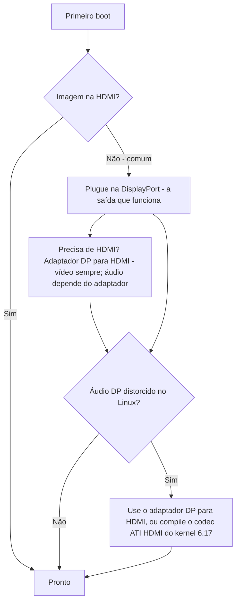

> 🌐 Tradução da comunidade. A versão em inglês é a fonte da verdade e pode estar mais atualizada. Achou um erro? Abra uma issue: [../en/14-display.md](../en/14-display.md) · https://github.com/lildebil0/awesome-bc250/issues

# Display e Saída

> **TL;DR** — A BC-250 envia vídeo para o seu monitor pela **DisplayPort**. É esse o conector onde você deve plugar. Se a sua placa também tiver uma porta HDMI, ela **frequentemente não mostra nada** — então uma tela preta ali *não* é uma placa morta, você só está na saída errada. Precisa de HDMI? Use um **adaptador DP→HDMI** — **o vídeo sempre passa, sem lag**; alguns adaptadores também levam **áudio** (um testado levava, [src](https://t.me/c/2424231195/9148)), mas o áudio depende do adaptador específico, então não conte com isso (veja a seção de áudio). Uma esquisitice real: **o áudio da DisplayPort sai distorcido/lento no Linux**; o mesmo adaptador DP→HDMI contorna isso, e uma correção adequada no lado do kernel chega por volta do **kernel 6.17** ([src](https://t.me/c/2424231195/17953), [src](https://t.me/c/2424231195/68051)).

"Sem imagem no primeiro boot" é o **pânico nº 1 dos novatos**. Leia a caixa abaixo antes de decidir que algo está quebrado.

---

## Sem imagem? Faça isto

1. **Plugue na DisplayPort, não na HDMI.** A saída de vídeo que funciona na BC-250 é a DisplayPort ([src](https://t.me/c/2424231195/104784)). A porta HDMI (onde existe) é a que normalmente fica em branco — não julgue a placa por ela.
2. **Recoloque a placa e tente de novo.** As placas rotineiramente não inicializam na primeira tentativa — faça um ciclo de energia (desligar/ligar completo) e recoloque fisicamente. Um dono: *"quando a minha chegou também não ligou na primeira tentativa … às vezes ela não inicializa totalmente num reboot por botão — desligar/ligar resolve"* ([src](https://t.me/c/2424231195/15701)).
3. **Suspeite do cabo/adaptador antes da placa.** Com uma única placa, um cabo ou adaptador ruim é o suspeito principal ([src](https://t.me/c/2424231195/15699)). Alguns adaptadores funcionam no firmware mas ficam pretos quando o SO carrega — *"a imagem estava ok antes do GRUB, tela preta no sistema"* ([src](https://t.me/c/2424231195/38184)).
4. **Resete a BIOS / regrave uma imagem comprovadamente boa** se várias placas de um lote não derem imagem — isso aponta para o firmware, não para o seu monitor ([src](https://t.me/c/2424231195/15697), [src](https://t.me/c/2424231195/15705)).

Se você riscar todos os quatro e ainda não tiver nada, vá para [troubleshooting.md](troubleshooting.md).



---

## Saídas num relance

| Saída | Funciona? | Notas |
|--------|--------|-------|
| **DisplayPort** | **Sim — é esta a saída** | Conector de display principal/único; leva áudio. A especificação de I/O do repo lista `1x DisplayPort` ([repo](https://github.com/mothenjoyer69/bc250-documentation)). É **DisplayPort 1.4**, teto de **4K@120 Hz**, com HDR10 ([elektricM](https://github.com/elektricM/amd-bc250-docs/blob/main/docs/hardware/display.md)). |
| **Porta HDMI** (se houver) | **Frequentemente em branco** | Novatos acham que a placa está morta; geralmente não está — mude para a DP. ([src](https://t.me/c/2424231195/104784)) |
| **DP → HDMI via adaptador** | **Vídeo: sim. Áudio: depende do adaptador** | O vídeo passa sem lag ([src](https://t.me/c/2424231195/9148)); o áudio depende do chipset — teste (veja a seção de áudio). É também a correção padrão para a distorção de áudio da DP (abaixo). |
| **Segunda saída de vídeo** | **Não de fábrica** | Eletricamente presente mas **não populada**; forçar um 2º monitor exige gambiarras, e outros dizem que o chip não tem um 2º head real — trate a saída única como a suposição segura. ([src](https://t.me/c/2424231195/92978), [src](https://t.me/c/2424231195/104682)) |
| **Segunda tela pela rede** | **Sim** | Transmita a saída da BC-250 para outra máquina pela LAN (Steam/Sunshine). ([src](https://t.me/c/2424231195/23660)) |

---

## Resoluções, atualização e cabo

A referência do elektricM determina o que o único link DP realmente faz — útil ao escolher um monitor ou adaptador ([elektricM](https://github.com/elektricM/amd-bc250-docs/blob/main/docs/hardware/display.md)):

| Resolução | Atualização | Caminho |
|------------|---------|------|
| 1920×1080 (1080p) | 144 Hz+ | DP nativa, ou qualquer adaptador |
| 2560×1440 (1440p) | 144 Hz+ | DP nativa (adaptadores passivos frequentemente limitam em 1440p@60 / DP 1.2) |
| 3840×2160 (4K) | 60 Hz | DP nativa, ou adaptador **ativo** DP→HDMI 2.0 |
| 3840×2160 (4K) | 120 Hz | **Apenas DP nativa** — um adaptador ativo DP 1.4→HDMI 2.1 é necessário para 4K@120 por HDMI, e é instável |

- **Cabo:** use um cabo **DisplayPort 1.4 certificado pela VESA**, de **1–2 m**; cabos mais longos causam problemas de sincronização/queda ([elektricM](https://github.com/elektricM/amd-bc250-docs/blob/main/docs/hardware/display.md)).
- **Travado em baixa resolução** (ex.: 1024×768/1080p, só 60 Hz) geralmente significa que o driver da GPU não está carregado — verifique `glxinfo | grep "OpenGL renderer"`; `llvmpipe` = renderização por software, instale o Mesa 25.1+ e remova `nomodeset` ([elektricM](https://github.com/elektricM/amd-bc250-docs/blob/main/docs/troubleshooting/display.md)). Veja [06-linux.md](06-linux.md).
- **HDR (HDR10) e VRR** funcionam mas são experimentais no Linux — o **KDE Plasma 6+** tem o melhor suporte e geralmente precisa de uma sessão Wayland ([elektricM](https://github.com/elektricM/amd-bc250-docs/blob/main/docs/hardware/display.md)). **A distro importa aqui:** um relato da comunidade r/BC250Gaming (Reddit) conseguiu **HDR + VRR funcionando corretamente só no CachyOS** (Plasma 6 + Wayland), enquanto no **Bazzite o HDR causou glitches gráficos e o VRR nunca funcionou de jeito nenhum**. O exemplo deles: *Forza Horizon 6* em **1440p High, HDR + VRR ligados, 60–80 FPS** através de um adaptador **UGREEN DP→HDMI 2.1**. Se HDR/VRR for prioridade, veja a nota sobre CachyOS em [06-linux.md](06-linux.md).
  - **Se você estiver no Bazzite KDE e quiser VRR/FreeSync por HDMI**, existe um remix da comunidade que troca pelo trabalho de kernel da AMD para HDMI 2.1 / FRL: **[`dyllan500/bazzite-amd-hdmi-kde`](https://github.com/dyllan500/bazzite-amd-hdmi-kde)** — uma imagem Bazzite KDE recompilada sobre um kernel que carrega os patches oficiais de VRR HDMI-2.1 da AMD (do `amd-staging-drm-next`). ⚠ **ressalve bastante:** é uma imagem de terceiros, o autor testou VRR apenas em uma **Radeon 9070 XT** (não na BC-250), e ela deve se tornar obsoleta assim que os patches chegarem a um kernel Bazzite padrão. *Não* é uma correção confirmada para a BC-250 — trate como uma via experimental para tentar, não como garantia.

> **Tela preta *depois do login* (o GRUB e a tela de login estavam ok)** é um problema da sessão de desktop, geralmente **Wayland** — escolha "GNOME on Xorg"/"Plasma (X11)" na engrenagem do login, ou defina `WaylandEnable=false` em `/etc/gdm/custom.conf` ([elektricM](https://github.com/elektricM/amd-bc250-docs/blob/main/docs/hardware/display.md)). Uma tela preta *antes* do login é o problema de driver/`nomodeset` acima, não este.

---

## O áudio da DisplayPort está distorcido — a correção pelo adaptador

No Linux, o áudio enviado **diretamente pela DisplayPort** sai errado na BC-250 — descrito como distorcido, *"esticado, como se estivesse a meia velocidade"*, com chiado ([src](https://t.me/c/2424231195/9895)). Isso é um **problema do Linux/protocolo DP, não um defeito da placa** — também foi visto em hardware que não é BC-250 ([src](https://t.me/c/2424231195/15983)).

A solução de contorno direta e confiável que o chat estabeleceu: **passe o sinal por um adaptador DP→HDMI.** Convertidos para HDMI, os artefatos de áudio desaparecem ([src](https://t.me/c/2424231195/17953), [src](https://t.me/c/2424231195/51763)). Um usuário verificou diretamente: *"Testei a saída de áudio por um adaptador DisplayPort→HDMI. Tudo certo, sem lag"* ([src](https://t.me/c/2424231195/9148)).

**O caminho mais limpo de todos é um *cabo* DP→HDMI direto — plugue DP de um lado, plugue HDMI do outro, sem dongle adaptador ou caixa em nenhuma das pontas.** Vários usuários na thread da comunidade r/linux_gaming relatam de forma independente que isso dá o áudio mais confiável: um cabo simples (ex.: um cabo DP-para-HDMI da Amazon Basics, ~US$ 10) "simplesmente funciona" onde os adaptadores estilo dongle são aleatórios. Mutes breves ocasionais de áudio ainda podem acontecer, mas um cabo de peça única remove o chipset adaptador extra que torna a rota do dongle uma aposta ([r/linux_gaming](https://www.reddit.com/r/linux_gaming/comments/1nvsgji/)). Se você vai comprar de qualquer jeito, **prefira o cabo ao dongle.**

**Se você não tiver um adaptador à mão,** roteie o áudio por **Bluetooth** — a maioria das caixas/headsets suporta e isso evita totalmente o caminho da DP ([src](https://t.me/c/2424231195/89769)). Veja [10-wifi-bt.md](10-wifi-bt.md) para o dongle BT.

### Notas sobre adaptadores (comunidade)
- **Para 4K@60+ você precisa de um adaptador/cabo *ativo*** (passivo limita em ~1440p@60). Um exemplo testado e funcional: **UGREEN DP125 (cabo DP→HDMI 4K)** — classificado como 4K@30 mas negociou 4K@60 em uma TV ([src](https://t.me/c/2424231195/52398)). Ativo vs passivo define o teto de resolução — **não** decide se o áudio passa (veja abaixo).
- **Nem todos os adaptadores levam áudio.** O adaptador Belsis de um dono passou 4K@60 *com* som, enquanto várias unidades Ugreen mais caras mostraram "HDMI digital audio" na lista de dispositivos mas não emitiam som — e uma abaixou as vozes uma oitava ([src](https://t.me/c/2424231195/106617)). Se você tiver vídeo mas não áudio, o adaptador é a variável — experimente outro.
- **Para *áudio* por HDMI, recorra primeiro a um adaptador *passivo*.** Um padrão da comunidade na thread r/linux_gaming: adaptadores **passivos** DP→HDMI tendem a passar áudio de forma limpa, enquanto adaptadores **ativos** frequentemente **derrubam o áudio totalmente ou mudam o tom** (vozes relatadas descendo ~20% / cerca de uma quinta). O detalhe: você só *precisa* de um adaptador ativo para **HDR** de verdade (e para 4K@60+), então é um trade-off genuíno — passivo para som confiável, ativo para HDR. Opções *passivas* confirmadas como funcionais pela comunidade: **Silver Monkey**, **BENFEI (ASIN B017Q8ZVWK)** e o **_cabo_ DP-para-HDMI da AmazonBasics** (o cabo de peça única — *não* o adaptador estilo dongle deles) ([r/linux_gaming](https://www.reddit.com/r/linux_gaming/comments/1nvsgji/)). ⚠ SKUs específicos são relatados pela comunidade, não verificados em laboratório aqui — e um adaptador passivo ainda limita em ~**1440p@60**.
- Adaptadores **DP→HDMI 4K@60** baratos que passam tanto vídeo quanto áudio existem e são relatados como funcionais ([src](https://t.me/c/2424231195/133977)).
- Alguns adaptadores se comportam mal especificamente em **monitores 4K** ([src](https://t.me/c/2424231195/1988)).
- **O áudio por um adaptador DP→HDMI é inconsistente e depende do chipset do adaptador — não simplesmente de ativo vs passivo.** O vídeo sempre passa; **o áudio é a variável.** Nossos relatos da comunidade são adaptador por adaptador (unidades UGREEN/Belsis relatadas levando som, algumas outras unidades mudas), e o guia do elektricM relata a divisão *oposta* (passivo levando áudio, algumas unidades ativas mudas — ex.: Cable Matters/StarTech) — que é exatamente por que o rótulo ativo/passivo não prevê isso ([elektricM](https://github.com/elektricM/amd-bc250-docs/blob/main/docs/troubleshooting/display.md)). Para áudio **confiável**, não aposte em um adaptador: prefira um **display/receiver AV nativo DisplayPort**, ou emita o som por **USB (um DAC/dispositivo de som USB)**. Se você usar um adaptador, **teste o áudio antes de depender dele** — e lembre-se de que um adaptador **passivo** limita em ~**1440p@60**.

### A correção do kernel 6.17 (áudio direto pela DP, sem adaptador)

Se você quiser áudio limpo **direto pela DisplayPort** sem adaptador, a causa e a correção foram rastreadas no chat. A config padrão do kernel do Fedora compilava `snd-hda-codec-hdmi.ko` + `snd-hdmi-lpe-audio.ko`; **o kernel 6.17 mudou o caminho de áudio HDMI** e quebrou o som naquela config padrão. A correção é compilar também o **codec ATI HDMI** — mude a config do kernel de `# CONFIG_SND_HDA_CODEC_HDMI_ATI is not set` para `CONFIG_SND_HDA_CODEC_HDMI_ATI=m`, que empacota `snd-hda-codec-atihdmi.ko`; o som então funciona **sem patches** ([src](https://t.me/c/2424231195/68051), [src](https://t.me/c/2424231195/68061)).

```text
# Fedora kernel config change for DP/HDMI audio on kernel 6.17+
# from:
# CONFIG_SND_HDA_CODEC_HDMI_ATI is not set
# to:
CONFIG_SND_HDA_CODEC_HDMI_ATI=m
```

Com esse terceiro codec (`snd-hda-codec-atihdmi.ko`) presente, o ALSA expõe as saídas de áudio da placa (ex.: `pcm=3` e `pcm=7` como dois dispositivos HDMI) ([src](https://t.me/c/2424231195/68062), [src](https://t.me/c/2424231195/67569)). ⚠ verifique — isso requer compilar um kernel personalizado; trate o adaptador DP→HDMI como o caminho sem compilação para a maioria dos usuários. Veja [06-linux.md](06-linux.md) para a configuração de kernel/driver.

### Som surround (5.1) — use uma placa de som USB, não HDMI

**Surround 5.1 por HDMI *não* funciona na BC-250.** O firmware HDMI da AMD no Linux para este die headless/de mineração não expõe LPCM multicanal, então a saída HDMI cai para estéreo simples não importa o que o receiver suporte ([r/linux_gaming](https://www.reddit.com/r/linux_gaming/comments/1nvsgji/)). Para multicanal de verdade, roteie o áudio por uma **placa de som USB / DAC USB** — defina-a como sink padrão no `pavucontrol`, depois confirme todos os seis canais com:

```bash
speaker-test -D pipewire -c 6 -t wav
```

A mesma rota do DAC USB também é a correção confiável para áudio estéreo quando os adaptadores se comportam mal (acima).

---

## A segunda saída (inicialmente inativa)

Existe uma **segunda saída de vídeo na placa que não está ativa de fábrica.** A leitura da comunidade está dividida e vale conhecer as duas metades:

- Ela está **eletricamente presente mas não populada/soldada**, e *"com gambiarras dá pra fazer um 2º monitor funcionar"* ([src](https://t.me/c/2424231195/92978)).
- Outros relatam que o chip simplesmente **não tem um segundo head utilizável** — *"o problema está no chip, a segunda saída fisicamente não existe"* ([src](https://t.me/c/2424231195/104682)).

Na prática: **assuma uma saída DisplayPort.** Um **splitter MST DP para duas telas independentes foi perguntado mas não confirmado como funcional** no nosso chat ([src](https://t.me/c/2424231195/92109)).

**Atualização do elektricM — o MST pode acionar duas telas com o hub certo.** Os testes do elektricM relatam até **2 displays via um hub DP MST** (banda compartilhada, resolução por display limitada), com resultados hub a hub ([elektricM](https://github.com/elektricM/amd-bc250-docs/blob/main/docs/hardware/display.md)):

| Hub MST | Saída | Versão DP | Displays independentes? | Áudio | Notas |
|---------|-----|--------|-----------------------|-------|-------|
| StarTech MST14DP122DP | 2× DP | 1.4 | **Sim** | Sim | Funcionou de forma consistente entre monitores/cabos |
| Monoprice 21972 | 2× DP | 1.2 | **Só espelho** | Sim | Só conseguia espelhar |
| ENBUER | 2× DP | 1.2 | **Só espelho** | Sim | Só conseguia espelhar |
| HDMI MST genérico | 2× HDMI | — | **Não** | Não | Sem vídeo nem áudio |

Então o dual-monitor nativo **é** possível via MST com um hub DP 1.4 (StarTech confirmado); hubs DP 1.2 mais baratos podem só espelhar, e hubs HDMI MST falharam. ⚠ verifique — modelo de hub único confirmado; os resultados variam por hub.

**Outra rota multi-display — adaptador USB DisplayLink.** Adicione um adaptador USB→HDMI/DP DisplayLink para uma tela de **desktop** extra (plugue *depois* do boot para melhores resultados). **Não para jogar** — ele comprime na CPU, que é o gargalo da BC-250, então a latência é alta; também não funciona no **game mode** do Steam Deck ([elektricM](https://github.com/elektricM/amd-bc250-docs/blob/main/docs/hardware/display.md)).

---

## Segunda tela pela rede (o "2º display" fácil)

Se você realmente quer a imagem da BC-250 em um segundo dispositivo, a rota comprovada não é um segundo cabo — é **transmitir pela LAN.** Um usuário: *"Lancei um jogo da Steam na BC-250 (Fedora) e transmiti pela rede para o meu laptop de trabalho, controlei pelo laptop. Tudo funcionou"* ([src](https://t.me/c/2424231195/23660)).

- **Sunshine** (encoder do host) funciona aqui porque não é exclusivo de NVIDIA — ele faz a codificação, o cliente só decodifica ([src](https://t.me/c/2424231195/25091)). Por LAN gigabit é relatado como quase perfeito ([src](https://t.me/c/2424231195/25563)).
- **Moonlight como host** *não* serve — ele espera um encoder NVIDIA e engasga/reclama de um decodificador de hardware ausente ([src](https://t.me/c/2424231195/25050)). Use o Sunshine como host, o Moonlight só como cliente.

Esta é também a maneira prática de ter uma sensação de "display duplo" sem a segunda saída não populada acima.

---

## Fontes

- Adaptador DP→HDMI passa vídeo+áudio, sem lag — https://t.me/c/2424231195/9148
- A distorção de áudio DP é um problema do Linux; o adaptador corrige — https://t.me/c/2424231195/17953 · https://t.me/c/2424231195/9895 · https://t.me/c/2424231195/51763 · https://t.me/c/2424231195/15983
- Correção de áudio do kernel 6.17 (`CONFIG_SND_HDA_CODEC_HDMI_ATI=m`) — https://t.me/c/2424231195/68051 · https://t.me/c/2424231195/68061 · https://t.me/c/2424231195/68062 · https://t.me/c/2424231195/67569
- Adaptadores funcionais — UGREEN DP125 https://t.me/c/2424231195/52398 · Belsis vs outros (áudio varia) https://t.me/c/2424231195/106617 · 4K@60 baratos https://t.me/c/2424231195/133977
- DP é a saída que funciona; invista em um bom adaptador DP→HDMI — https://t.me/c/2424231195/104784
- Sem imagem no primeiro boot / recolocar / regravar — https://t.me/c/2424231195/15697 · https://t.me/c/2424231195/15699 · https://t.me/c/2424231195/15701 · https://t.me/c/2424231195/38184
- Segunda saída presente mas não populada / debatida — https://t.me/c/2424231195/92978 · https://t.me/c/2424231195/104682 · MST perguntado https://t.me/c/2424231195/92109
- Segunda tela pela rede (Sunshine/Steam por LAN) — https://t.me/c/2424231195/23660 · https://t.me/c/2424231195/25091 · https://t.me/c/2424231195/25050 · https://t.me/c/2424231195/25563
- Áudio Bluetooth como alternativa — https://t.me/c/2424231195/89769
- O *cabo* DP→HDMI direto (sem adaptadores) é o áudio mais confiável; 5.1 por HDMI não funciona (sem LPCM multicanal), use uma placa de som USB / DAC — thread da comunidade r/linux_gaming https://www.reddit.com/r/linux_gaming/comments/1nvsgji/
- Referência de I/O de hardware (`1x DisplayPort`) — [mothenjoyer69/bc250-documentation](https://github.com/mothenjoyer69/bc250-documentation) · [`hardware.md`](https://github.com/mothenjoyer69/bc250-documentation/blob/main/hardware.md)
- DP 1.4 / 4K@120 / HDR10, limites de resolução+cabo, hubs MST (máx 2), DisplayLink, tela preta no login Wayland — elektricM [`hardware/display.md`](https://github.com/elektricM/amd-bc250-docs/blob/main/docs/hardware/display.md)
- HDR + VRR funcionando no CachyOS (Plasma 6 + Wayland) vs quebrado no Bazzite; Forza Horizon 6 1440p High HDR+VRR por UGREEN DP→HDMI 2.1 — relato da comunidade r/BC250Gaming (Reddit) (veja [06-linux.md](06-linux.md))
- DP→HDMI passivo leva áudio / ativo derruba ou muda o tom; passivo mas necessário para HDR; passivos confirmados Silver Monkey / BENFEI B017Q8ZVWK / cabo DP-para-HDMI da AmazonBasics — [thread da comunidade r/linux_gaming](https://www.reddit.com/r/linux_gaming/comments/1nvsgji/)
- Remix Bazzite KDE VRR/FreeSync por HDMI (kernel AMD HDMI 2.1; testado na 9070 XT, não na BC-250) — [`dyllan500/bazzite-amd-hdmi-kde`](https://github.com/dyllan500/bazzite-amd-hdmi-kde)
- O áudio do adaptador depende do chipset (elektricM viu passivo levar / alguns ativos mudos; a comunidade viu o contrário — então prefira DP nativo ou um DAC USB), verificação de baixa resolução llvmpipe — elektricM [`troubleshooting/display.md`](https://github.com/elektricM/amd-bc250-docs/blob/main/docs/troubleshooting/display.md)

> A configuração de driver/kernel está em [06-linux.md](06-linux.md); as pegadinhas de áudio/saída também estão indexadas em [troubleshooting.md](troubleshooting.md) e [faq.md](faq.md).
