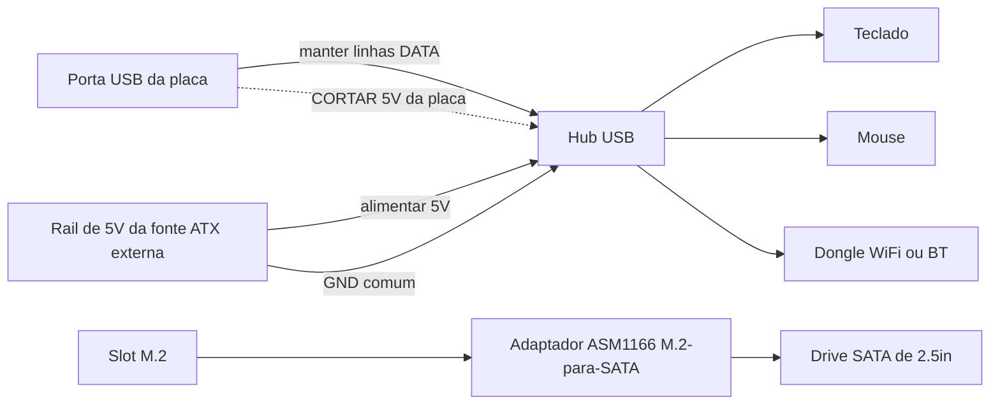

> 🌐 Tradução da comunidade. A versão em inglês é a fonte da verdade e pode estar mais atualizada. Achou um erro? Abra uma issue: [../en/16-usb-peripherals.md](../en/16-usb-peripherals.md) · https://github.com/lildebil0/awesome-bc250/issues

# USB, Hubs e Periféricos

> **TL;DR** — A placa te dá **4 portas USB traseiras (2× USB 2.0 + 2× USB 3.0)** e só — nenhum header interno é ligado por padrão. Um dongle WiFi/BT, SSD-via-USB, teclado, mouse e um controle devoram essas portas rápido, então quase todo mundo adiciona um **hub USB**. O porém: o **rail de 5 V USB da placa é fraco** e cai sob carga, então hubs baratos alimentados pelo barramento (e até pen drives conectados diretamente) caem. As correções confiáveis, em ordem: um **hub com alimentação própria (ativo)**, ou o **mod de injeção de 5 V** da comunidade — corte o 5 V que o hub puxa da placa e alimente-o com 5 V da sua fonte ATX em vez disso. ([src](https://t.me/c/2424231195/119741))

Esta é uma página de **acessórios**. Acerte o hub e o resto (áudio, Ethernet-sobre-USB, docks) simplesmente funciona.

---

## Quantas portas USB você realmente tem

Conforme a referência de hardware, o I/O traseiro é **1× DisplayPort, 1× GbE Ethernet, 2× USB 2.0, 2× USB 3.0**. Ou seja, quatro portas USB físicas. ([hardware.md](https://github.com/mothenjoyer69/bc250-documentation/blob/main/README.md))

Na prática, as duas portas **USB 3.0** são as que as pessoas disputam (mais rápidas, usadas para SSDs/docks), e elas são ligadas **estreitas** eletricamente — um dono descreve o conector como efetivamente "x2", e alerta contra pendurar um splitter nela. ⚠ verifique a largura exata de lanes. ([src](https://t.me/c/2424231195/75561))

O aperto é real assim que você lista o que quer uma porta: **plugue um SSD — uma porta foi; adicione um dongle WiFi USB, um joystick, um drive externo — você precisa de um hub, caso contrário você arrisca fritar a porta.** ([src](https://t.me/c/2424231195/75558)) As pessoas rotineiramente relatam "todas as USB 3.0 ocupadas, teclado e mouse passando por um hub." ([src](https://t.me/c/2424231195/110875))

**Não há headers USB de painel frontal populados** de fábrica — mas o gabinete/placa tem um ponto claramente destinado a rotear o cabo de um hub para a frente, que vários builds em gabinete usam. ([src](https://t.me/c/2424231195/91322)) · ([src](https://t.me/c/2424231195/100249))

---

## O problema real: o rail de 5 V USB é fraco

A BC-250 gera **5 V para USB na própria placa** ([src](https://t.me/c/2424231195/57920)), e esse rail não consegue fornecer muito. A medição mais clara do chat, numa placa que não enumerava dispositivos:

> "Minha BC-250 [está] não dando 5 V adequados no USB… só um teclado funciona; se eu plugo um mouse o teclado desliga. ~**4,3 V** só com o teclado, **2,3 V–3,2 V** com teclado + mouse, **5,1 V** com ambos removidos." ([src](https://t.me/c/2424231195/119071))

Essa queda de tensão é o motivo de os sintomas se concentrarem em torno de **carga**: pen drives e microfones que **caem quando plugados diretamente mas funcionam bem através de um hub**, teclados que perdem seus LEDs, dispositivos que caem no momento em que duas coisas drenam ao mesmo tempo. ([src](https://t.me/c/2424231195/53939)) É a mesma sensibilidade à energia que torna os dongles WiFi instáveis — veja **[10-wifi-bt.md](10-wifi-bt.md)**, onde os dongles ficam ociosos e então caem num pico de download.

> ⚠ Nem toda placa é tão ruim assim. Um dono alimenta um **dongle WiFi + teclado com fio + mouse via um hub sem alimentação + um display de 14″ + uma tela auxiliar de 3,5″** pelo USB da placa e relata que está tudo bem. ([src](https://t.me/c/2424231195/119231)) Trate a sua própria placa como desconhecida até carregá-la.

---

## Escolhendo um hub: com alimentação vs sem alimentação

| Tipo de hub | Quando funciona | Veredito |
|----------|---------------|---------|
| **Sem alimentação (alimentado pelo barramento)** | Cargas leves — teclado, mouse, um dongle. Algumas placas rodam uma quantidade surpreendente assim. ([src](https://t.me/c/2424231195/119231)) | OK para tentar primeiro; **espere quedas** no momento em que você adicionar um drive ou a carga der picos. |
| **Com alimentação / ativo (brick externo de 5 V)** | Qualquer coisa com drives, múltiplos dongles, ou sob carga. A recomendação permanente da comunidade para a BC-250. ([src](https://t.me/c/2424231195/75558)) · ([src](https://t.me/c/2424231195/119229)) | **Compre este.** Resolve a queda sem mexer na placa. ([src](https://t.me/c/2424231195/140091)) |
| **Mod de injeção de 5 V** (veja abaixo) | Quando você quer um build limpo em gabinete alimentado inteiramente pela fonte ATX e não quer uma segunda fonte de parede. | Melhor integração, requer solda. ([src](https://t.me/c/2424231195/119741)) |

O conselho repetido quando os dispositivos USB de alguém se comportam mal é simplesmente: **arrume um hub USB ativo com entrada para adaptador de energia.** ([src](https://t.me/c/2424231195/119229)) Vários donos acabaram aí depois de lutar contra quedas — "foi resolvido com um hub alimentado externamente." ([src](https://t.me/c/2424231195/123789))

> Uma ressalva levantada no chat: depender de um hub alimentado externamente pode ser **permanente** — uma vez que você descarrega a energia USB externamente, não se surpreenda se ficar preso a esse hub para sempre. ([src](https://t.me/c/2424231195/123924)) É uma boa troca para um build de desktop.

---

## O mod de injeção de 5 V (faça um hub normal se comportar)

Esta é a correção elegante para um **build em gabinete já rodando de uma fonte ATX/SFX**: em vez de comprar um hub ativamente alimentado com seu próprio adaptador de parede, você pega um hub comum e **troca de onde vêm seus 5 V**.

O que um usuário fez, e funcionou ([src](https://t.me/c/2424231195/119741)):

> "Modifiquei um hub USB normal e funcionou. Eu **cortei os 5 V vindos da placa-mãe e dei 5 V da fonte**. Não precisei conectar o terra porque estou usando a mesma fonte ATX para alimentar minha BC-250."

Como funciona:

1. Abra o hub; encontre a trilha/fio de **5 V (VBUS)** no lado **upstream** (o cabo que pluga na placa).
2. **Corte esse 5 V** para que o hub não puxe mais energia do rail fraco da placa.
3. Alimente o hub com **+5 V da sua fonte ATX** (uma linha de 5 V SATA/Molex sobrando).
4. **O terra é compartilhado** automaticamente porque a mesma fonte já alimenta a placa — nenhum fio de terra extra necessário. (Se você algum dia alimentar o hub de uma fonte *separada*, você **deve** unir os terras.)

As linhas de dados ficam intocadas — você só está mudando a fonte de energia. A placa vê um hub que não carrega mais seu rail de 5 V, e os dispositivos recebem energia limpa e abundante da fonte.



> ⚠ Cortar a trilha errada inutiliza o hub (barato) — mas certifique-se de cortar o **VBUS, não uma linha de dados**. Confira duas vezes com um multímetro antes de soldar.

---

## Lixo a evitar

- **Hubs Hoco** — apontados como não confiáveis; um dono **teve que ressoldar o mesmo hub Hoco duas vezes**. ([src](https://t.me/c/2424231195/74531))
- **"Hubs USB 3.0" que não são** — um "hub/dock USB 3.0" de 160 ₽ do AliExpress foi sinalizado como **definitivamente não 3.0 de verdade** por esse preço. ([src](https://t.me/c/2424231195/8761)) · ([src](https://t.me/c/2424231195/8764))
- **Encadear hubs** para multiplicar portas — levantado como ideia ([src](https://t.me/c/2424231195/104653)) mas empilha o problema de energia; um rail fraco agora alimenta dois hubs. Use um único bom hub com alimentação em vez disso.
- **"Hubs" splitter SATA** a partir do slot M.2 — uma confusão recorrente. Com apenas **2 lanes PCIe** no M.2 você não consegue sanamente pendurar um controlador SATA e esperar que ele se expanda; "esses hubs de um-SATA-entra, muitos-saem são lixo." ([src](https://t.me/c/2424231195/22539)) Não é um tópico USB — só não confunda com expansão USB.
- ★ **Controlador M.2→SATA PH516 (6 portas) — confirmado NÃO funcionando.** A porta enumera mas o disco não conecta, e uma **segunda pessoa reproduziu** a mesma falha ([4pda — Strange999](https://4pda.to/forum/index.php?showtopic=1104980)). Compre o **ASM1166** recomendado pela comunidade em vez disso (veja a seção de armazenamento) — o PH516 é um beco sem saída conhecido nesta placa.

Um hub com um **codec de áudio embutido** é uma boa economia de espaço para builds em gabinete (um dispositivo te dá portas extras *e* um conector de 3,5 mm), e as pessoas usam mesmo. ([src](https://t.me/c/2424231195/8751)) A qualidade de áudio varia — é um codec barato. ([src](https://t.me/c/2424231195/39708))

---

## Header USB 3.0 interno (Type-E)

Se o seu gabinete tem um **plugue USB 3.0 frontal** (o conector de 20 pinos "Key-A/Type-E") você vai querer alimentá-lo a partir do USB 3.0 da placa. **Não há header nativo de 20 pinos**, então as pessoas adaptam:

- Um **cabo USB 3.1 Type-E → USB 3.0 (Type-A)** do AliExpress é o caminho limpo. O AXONUS de 50 cm foi compartilhado no chat. ([src](https://t.me/c/2424231195/133182)) Uma variante Xiwai Type-E → 20-pinos também foi postada. ([src](https://t.me/c/2424231195/125127))
- Ou **emende** o cabo padrão do gabinete em um plugue USB 3.1 comum — o método "juntar uma cobra com um ouriço" quando nenhum adaptador serve. ([src](https://t.me/c/2424231195/135957))

**Status:** **USB 2.0 está confirmado funcionando; USB 3.0 ainda estava por ser totalmente testado** pelo dono que relatou (teste pendente após o build no gabinete). Trate o 3.0-via-adaptador como ⚠ verifique no seu hardware. ([src](https://t.me/c/2424231195/136215))

---

## Armazenamento (slot M.2 e drives SATA)

O único conector de armazenamento interno da placa é um **único slot M.2**, e ele é ligado em **PCIe 2.0 ×2** — então o teto prático é **~1 GB/s** ([src](https://t.me/c/2424231195/66275)) · ([src](https://t.me/c/2424231195/135506)). Um NVMe Gen3/Gen4 rápido vai *funcionar*, mas não consegue atingir sua velocidade nominal aqui, então não há razão para pagar por um drive topo de linha. **Um SSD NVMe M.2 normal é o drive de boot mais simples** — coloque-o no slot e instale o Linux nele (veja **[06-linux.md](06-linux.md)** para a instalação).

### Conectando HDDs/SSDs SATA de 2.5″

Não há porta SATA na placa, então para pendurar um **drive SATA de 2.5″** (ou vários) você coloca uma **placa adaptadora M.2 → SATA** no slot M.2. A escolha confirmada da comunidade é a placa de expansão **ASM1166 (M.2 PCIe → SATA)** ([src](https://t.me/c/2424231195/135180)). O outro caminho que as pessoas seguem é um **SSD M.2 SATA direto na placa** — sem adaptador, apenas um dongle M.2 de protocolo SATA. ([src](https://t.me/c/2424231195/87411))

Esta é uma das **perguntas mais comuns de novatos** — *"é este o adaptador que eu preciso para conectar um disco rígido à placa?"* e *"que outras formas existem de conectar um drive?"* ([src](https://t.me/c/2424231195/135164)) · ([src](https://t.me/c/2424231195/135165)) — então se você está perguntando isso, está em boa companhia.

> ⚠ verifique — a placa ASM1166 é uma recomendação da comunidade, não um resultado testado-por-muitos especificamente na BC-250. Confirme que o seu adaptador escolhido enumera e dá boot antes de depender dele. Note também que as **2 lanes PCIe** do M.2 não conseguem sanamente alimentar um *splitter* de um-SATA-entra / muitos-saem — veja **Lixo a evitar** acima. ([src](https://t.me/c/2424231195/22539))

#### ★ Alimentando um drive SATA de 2.5″ (a placa é só 12 V)

A placa adaptadora acima cuida dos **dados**, mas um drive SATA de 2.5″ também precisa de **alimentação de 5 V** no seu conector de energia SATA — e a placa BC-250 só entrega **12 V**, sem header de energia SATA para puxar. A correção prática de um build: um **adaptador USB→energia-SATA alimentando 5 V** ao drive, com um **conversor step-down (buck) de 12 V→5 V** produzindo esses 5 V a partir dos 12 V da placa ([TMG HD build](https://youtu.be/OEO0r01zcfU); ⚠ aprox — parafraseado do passo a passo em vídeo). Em outras palavras: o ASM1166 (ou um dongle M.2 SATA) carrega os *dados* SATA; o conversor buck + adaptador USB→energia-SATA carrega a *energia* SATA. Um gabinete de 2.5″ autoalimentado ou um dock com alimentação contorna o problema todo trazendo seu próprio rail de 5 V.

#### ★ SteamOS "no nvme drive detected" com um dongle M.2 SATA

Se você der boot no SteamOS com um **SSD M.2 SATA** (ex. um **Kingston SNS41**) em vez de NVMe, o fluxo de instalação/reparo pode falhar com **"no nvme drive detected"** — o SteamOS assume que o disco é um dispositivo NVMe (`nvme…`), mas um dongle SATA enumera como `sda`. A correção é editar o script de reparo e apontá-lo para o nome de dispositivo correto ([4pda — pornocrat](https://4pda.to/forum/index.php?showtopic=1104980)):

```bash
# Edit the SteamOS repair script and replace the device name nvme -> sda
nano ~/tools/repair_device.sh
# change every "nvme" reference to "sda", save, then re-run the install/repair
```

Isto é puramente uma incompatibilidade de nomenclatura de dispositivo — o dongle SATA funciona bem assim que o SteamOS é instruído a olhar para `sda` em vez de um nó `nvme`.

### Drives SATA antigos estão de boa

Como o link M.2 limita tudo a ~1 GB/s de qualquer forma, um **HDD/SSD SATA de 2.5″** antigo é perfeitamente adequado para uma **biblioteca de jogos ou jogos mais antigos** — a velocidade que você perderia é velocidade que a placa não consegue entregar. ([src](https://t.me/c/2424231195/132739)) Um **gabinete USB-NVMe** é outra opção se você preferir manter o slot M.2 livre, mas os gabinetes que de fato fazem NVMe (não SATA) começam mais caros — para um pequeno dongle de boot não vale a pena. ([src](https://t.me/c/2424231195/111022))

### Intel Optane 16 GB como cache/swap — ideia da comunidade, veredito morno

Usar um pequeno módulo **Intel Optane 16 GB NVMe** como dispositivo de cache ou swap surgiu como ideia, com um veredito sóbrio ([4pda](https://4pda.to/forum/index.php?showtopic=1104980)): os **módulos "Optane" de 16 GB vendidos no Ozon acabaram não sendo Optane de verdade** pelos testes próprios dos membros, o **slot M.2 da placa é lento** (PCIe 2.0 ×2, ~1 GB/s) então a vantagem de latência é amortecida, e embora um **arquivo de swap seja possível na teoria**, não é uma vitória clara aqui. Trate como uma curiosidade, não um upgrade recomendado.

---

## Docks e estações de acoplamento

Um **dock** estilo USB-C / Thunderbolt pode agir como um hub gordo (USB + Ethernet + às vezes vídeo), e os donos os têm usado:

- Um **dock dual-4K USB-C Wavlink WL-UG69DK1** está em uso por um membro. ([src](https://t.me/c/2424231195/68141))
- Um **dock DisplayLink** roda como um **hub USB + placa de som USB**; o membro **não** conseguiu tirar vídeo dele (bateu numa barreira de TPM/BIOS), então trate o *vídeo* de dock como não confiável. ([src](https://t.me/c/2424231195/104776))
- Para **monitores** especificamente, um dock não vai contornar o próprio limite de saída da GPU — veja **[14-display.md](14-display.md)** antes de contar com ele.

Resumo: docks são bons como **hubs com alimentação** (eles trazem sua própria fonte, o que contorna habilmente o problema dos 5 V). Não compre um esperando que sua saída de **vídeo** funcione.

---

## Controles e entrada

Gamepads pegam o mesmo rail USB fraco e a mesma história de Bluetooth instável que tudo o mais (veja **[10-wifi-bt.md](10-wifi-bt.md)** para dongles BT). Algumas descobertas específicas:

- **DualSense no Linux via DS5Dongle (Raspberry Pi Pico 2W).** Este dongle aberto dá ao DualSense seus **HD haptics + alto-falante** no Linux e uma **UI web** para taxa de polling / volume — mas há um porém para o áudio de jogo: títulos Wine/Proton só recebem o áudio do controle em **modo Direct** (o controle aparece como uma única **placa de áudio de 4 canais**), e **nem toda distro expõe esse modo** ([4pda — korotyshev](https://4pda.to/forum/index.php?showtopic=1104980)). Separadamente, o driver de kernel **`hid-playstation`** (suporte nativo ao DualSense) precisa de **Bluetooth ≥ 5.0** no adaptador ([4pda — xDarkman](https://4pda.to/forum/index.php?showtopic=1104980)).
- **GameSir T4 Kaleid + seu dongle de 2.4 GHz** é um caminho de controle/entrada funcional que contorna o Bluetooth inteiramente — entrada com sensação de cabo via um receptor USB de 2.4 GHz em vez de lutar com pareamento BT ([TiredDadTech](https://youtu.be/zi7sldeRd2w); ⚠ aprox — parafraseado do vídeo).
- **A porta do dongle BT importa: o dongle Bluetooth UGREEN funciona só numa porta USB 2.0, não USB 3.0.** O ruído de RF / fiação elétrica das portas 3.0 o quebra; mova-o para uma das duas portas **USB 2.0** e ele funciona ([4pda — InfernalWolf666](https://4pda.to/forum/index.php?showtopic=1104980)). (O mesmo efeito de ruído de USB-3.0 que atormenta os dongles WiFi/BT — veja [10-wifi-bt.md](10-wifi-bt.md).)

---

## Setup inicial recomendado

| Nível | Faça isto | Por quê |
|------|---------|-----|
| Mínimo | Hub alimentado pelo barramento para teclado/mouse/dongle | Grátis se você já tem um; bom para cargas leves ([src](https://t.me/c/2424231195/119231)) |
| **Recomendado** | **Hub USB com alimentação (ativo)** com seu próprio brick de 5 V | Corrige a queda, sem solda, drives + dongles ficam de pé ([src](https://t.me/c/2424231195/75558)) |
| Build em gabinete | Hub comum + **mod de injeção de 5 V** da fonte ATX/SFX | Integração mais limpa, uma fonte de parede a menos ([src](https://t.me/c/2424231195/119741)) |

Um build de referência popular em gabinete é exatamente isto: **Cooler Master MasterBox NR200P + um hub USB + uma fonte SFX** — o hub é tratado como uma parte padrão do build, não um detalhe de última hora. ([src](https://t.me/c/2424231195/81149)) Veja **[05-case.md](05-case.md)** para o lado do gabinete; um gabinete imprimível pronto até inclui um layout de HDD + hub-USB. ([printables](https://www.printables.com/model/1580750-bc250-amd-case-v3-hp-server-psu-hdd-usb-hub))

---

## Fontes

- Mod de injeção de 5 V (cortar 5 V da placa, alimentar da fonte) — https://t.me/c/2424231195/119741 · pergunta de como-fazer — https://t.me/c/2424231195/119795
- Queda de tensão USB medida (4,3 V → 2,3 V) — https://t.me/c/2424231195/119071 · placa faz 5 V on-board — https://t.me/c/2424231195/57920
- Orçamento de portas / "você precisa de um hub com alimentação ou arrisca fritar a porta" — https://t.me/c/2424231195/75558 · USB é x2 — https://t.me/c/2424231195/75561 · todas as 3.0 ocupadas — https://t.me/c/2424231195/110875
- Hub ativo é a correção — https://t.me/c/2424231195/119229 · https://t.me/c/2424231195/123789 · https://t.me/c/2424231195/140091 · pode ser permanente — https://t.me/c/2424231195/123924
- Hub sem alimentação funciona em algumas placas — https://t.me/c/2424231195/119231 · conexão direta cai, hub corrige — https://t.me/c/2424231195/53939
- Hub Hoco não confiável / ressoldado duas vezes — https://t.me/c/2424231195/74531 · hub "3.0" falso barato — https://t.me/c/2424231195/8761 · https://t.me/c/2424231195/8764
- Confusão de splitter SATA — https://t.me/c/2424231195/22539 · encadear hubs — https://t.me/c/2424231195/104653
- Armazenamento: M.2 é PCIe 2.0 ×2 / ~1 GB/s — https://t.me/c/2424231195/66275 · coloque um SSD M.2 SATA em vez disso — https://t.me/c/2424231195/135506 · placa ASM1166 M.2→SATA — https://t.me/c/2424231195/135180 · M.2 SATA direto na placa — https://t.me/c/2424231195/87411 · "qual adaptador para conectar um drive?" — https://t.me/c/2424231195/135164 · https://t.me/c/2424231195/135165 · SATA 2.5″ antigo de boa para biblioteca de jogos — https://t.me/c/2424231195/132739 · gabinetes USB-NVMe custam mais — https://t.me/c/2424231195/111022
- ★ Alimentando um drive SATA de 2.5″ (USB→energia-SATA + buck 12 V→5 V) na placa só-12 V — [TMG HD build](https://youtu.be/OEO0r01zcfU) (⚠ aprox, parafraseado)
- ★ M.2→SATA PH516 (6 portas) confirmado NÃO funcionando, reproduzido por uma segunda pessoa — [4pda — Strange999](https://4pda.to/forum/index.php?showtopic=1104980)
- ★ SteamOS "no nvme drive detected" com dongle M.2 SATA (Kingston SNS41), correção = editar `~/tools/repair_device.sh`, renomear `nvme`→`sda` — [4pda — pornocrat](https://4pda.to/forum/index.php?showtopic=1104980)
- Intel Optane 16 GB como cache/swap (os do Ozon não são Optane de verdade, M.2 lento, arquivo de swap na teoria) — [4pda](https://4pda.to/forum/index.php?showtopic=1104980)
- DS5Dongle (RPi Pico 2W) para DualSense no Linux — HD haptics/alto-falante/UI-web, áudio Wine/Proton só em modo Direct (única placa de 4 canais) — [4pda — korotyshev](https://4pda.to/forum/index.php?showtopic=1104980) · `hid-playstation` precisa de BT ≥5.0 — [4pda — xDarkman](https://4pda.to/forum/index.php?showtopic=1104980)
- GameSir T4 Kaleid + dongle de 2.4 GHz como correção de controle/entrada sobre o Bluetooth — [TiredDadTech](https://youtu.be/zi7sldeRd2w) (⚠ aprox, parafraseado)
- Dongle BT UGREEN funciona só numa porta USB 2.0, não 3.0 — [4pda — InfernalWolf666](https://4pda.to/forum/index.php?showtopic=1104980)
- Hub com áudio embutido — https://t.me/c/2424231195/8751 · https://t.me/c/2424231195/39708
- Cabo USB 3.1 Type-E → USB 3.0 (AXONUS) — https://t.me/c/2424231195/133182 · Xiwai Type-E 20-pinos — https://t.me/c/2424231195/125127 · emendar cabo padrão — https://t.me/c/2424231195/135957
- USB 2.0 confirmado, 3.0 por testar — https://t.me/c/2424231195/136215
- Furo de painel frontal para hub — https://t.me/c/2424231195/91322 · https://t.me/c/2424231195/100249
- Docks: dock Wavlink — https://t.me/c/2424231195/68141 · dock DisplayLink como hub+áudio, sem vídeo — https://t.me/c/2424231195/104776
- Build em gabinete NR200P + hub USB + SFX — https://t.me/c/2424231195/81149 · gabinete imprimível com hub USB — https://www.printables.com/model/1580750-bc250-amd-case-v3-hp-server-psu-hdd-usb-hub
- Referência de hardware (lista de I/O traseiro) — [mothenjoyer69/bc250-documentation `README.md`](https://github.com/mothenjoyer69/bc250-documentation/blob/main/README.md)

> Relacionado: sensibilidade à energia de dongles WiFi/BT → [10-wifi-bt.md](10-wifi-bt.md) · gabinetes & roteamento de painel frontal → [05-case.md](05-case.md) · limites de contagem de monitores → [14-display.md](14-display.md)
