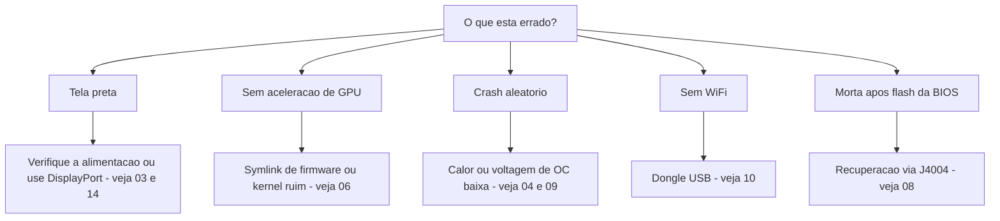

> 🌐 Tradução da comunidade. A versão em inglês é a fonte da verdade e pode estar mais atualizada. Achou um erro? Abra uma issue: [../en/troubleshooting.md](../en/troubleshooting.md) · https://github.com/lildebil0/awesome-bc250/issues

# Solução de problemas

> **TL;DR** — Os modos de falha da BC-250 são bem conhecidos: a maioria é **alimentação**, **calor**, **kernel/firmware** ou **um flash que deu errado**. Encontre seu sintoma abaixo, aplique o conserto e siga o link para o capítulo completo. Na dúvida, a causa costuma ser *um kernel ruim*, *a falta do symlink de firmware do amdgpu* ou *refrigeração insuficiente*.

Esta página é um índice sintoma → causa → conserto, destilado dos problemas recorrentes da comunidade. Ela não substitui os capítulos — leva você rápido ao capítulo certo.

---

## Boot / vídeo

| Sintoma | Causa provável | Conserto |
|---------|--------------|-----|
| Tela preta / sem POST | Fiação ou pinout de alimentação errados | Reconfira a fiação e o pinout do 8 pinos; use fio de cobre genuíno de bitola adequada → [03 — Alimentação](../en/03-power-supply.md) |
| Tela preta / crashes depois de já estar funcionando | **IOMMU ainda ativado** (quebrado nesta placa) | Desative o IOMMU na BIOS (elektricM); o parâmetro de kernel `iommu=off`/`amd_iommu=off` é ⚠ verificar → [06 — Linux](../en/06-linux.md) |
| Tela preta ao iniciar o **instalador** / live USB | O instalador não tem driver de GPU da BC-250; o KMS falha | Adicione `nomodeset` no GRUB (Fedora: Troubleshooting → Basic Graphics Mode); **remova-o depois que o Mesa estiver instalado** ([elektricM](https://github.com/elektricM/amd-bc250-docs/blob/main/docs/troubleshooting/boot.md)) → [06 — Linux](../en/06-linux.md) |
| Tela preta **após o login** (GRUB + tela de login estavam ok) | Sessão de desktop, geralmente **Wayland** | Escolha X11 ("GNOME on Xorg"/"Plasma X11") no login, ou `WaylandEnable=false` ([elektricM](https://github.com/elektricM/amd-bc250-docs/blob/main/docs/troubleshooting/display.md)) → [14 — Vídeo](../en/14-display.md) |
| Dá boot mas sem aceleração de GPU (tudo na CPU) | Falta o symlink de firmware do amdgpu, ou um kernel ruim | Aplique o symlink `navi10_gpu_info.bin` + parâmetros de kernel; evite os kernels reconhecidamente ruins (abaixo) → [06 — Linux](../en/06-linux.md) |
| `glxinfo` mostra **llvmpipe**, jogos a 5–10 FPS | Mesa muito antigo, ou amdgpu não carregado | Instale o **Mesa 25.1.3+**, remova `nomodeset`, confirme `Kernel driver in use: amdgpu` ([elektricM](https://github.com/elektricM/amd-bc250-docs/blob/main/docs/troubleshooting/performance.md)) → [06 — Linux](../en/06-linux.md) |
| Funcionava, depois quebrou após uma atualização de kernel | Regressão naquele kernel | Volte para um kernel LTS; **6.14.7**, **6.15.0–6.15.6** e **6.17.8–6.17.10** são relatados como quebrando o amdgpu (fallback de CPU / crashes de GPU); o elektricM recomenda **6.18.x LTS ou 6.17.11+** ⚠ verificar faixas exatas → [06 — Linux](../en/06-linux.md) |
| Sem áudio HDMI | Regressão no kernel 6.17+ | Use um kernel LTS, ou roteie o áudio por USB/DisplayPort → [06 — Linux](../en/06-linux.md) |
| Só uma saída de vídeo funciona | Limitação do driver nesta placa | Limitação conhecida para tela dupla nativa; **um hub MST dá até 2 telas** (hub DP 1.4) ([elektricM](https://github.com/elektricM/amd-bc250-docs/blob/main/docs/hardware/display.md)) → [14 — Vídeo](../en/14-display.md) |
| Sem vídeo, sem POST, **só com o NVMe instalado** | O SSD ainda tem partições EFI/recuperação do **Windows** | Tire o SSD, apague todas as partições em outro PC (`wipefs -a`), reinstale ([elektricM](https://github.com/elektricM/amd-bc250-docs/blob/main/docs/troubleshooting/boot.md)) → [06 — Linux](../en/06-linux.md) |
| Não faz POST de jeito nenhum (sem BIOS) | Algumas placas não fazem POST **sem bateria de CMOS** | Instale uma CR2032 nova e tente de novo ([elektricM](https://github.com/elektricM/amd-bc250-docs/blob/main/docs/troubleshooting/boot.md)) → [08 — BIOS](../en/08-bios.md) |
| O boot **trava por ~90 s** e depois continua | Serviço systemd falhando / timeout de rede | `systemctl --failed`; desative a unidade travada ([elektricM](https://github.com/elektricM/amd-bc250-docs/blob/main/docs/troubleshooting/boot.md)) → [06 — Linux](../en/06-linux.md) |
| Kernel panic "**unable to mount root**" / "No init found" | Kernel errado **ou** initramfs corrompido | Dê boot num kernel mais antigo/LTS; se ainda falhar, faça chroot e regenere o initramfs (`dracut -f` / `update-initramfs -u -k all` / `mkinitcpio -P`) ([elektricM](https://github.com/elektricM/amd-bc250-docs/blob/main/docs/troubleshooting/boot.md)) → [06 — Linux](../en/06-linux.md) |
| Cai para `grub>` / `grub rescue>` | O GRUB não acha sua config/arquivos de boot | Defina `root`/`prefix`, `insmod normal`, dê boot; depois reinstale o GRUB ([elektricM](https://github.com/elektricM/amd-bc250-docs/blob/main/docs/troubleshooting/boot.md)) → [06 — Linux](../en/06-linux.md) |
| Não consegue entrar na BIOS (Del/F2 ignorados) | Adaptador lento para inicializar, ou teclado em USB 3.0 | Aperte Del imediatamente; tente uma porta **USB 2.0** e um cabo DP nativo ([elektricM](https://github.com/elektricM/amd-bc250-docs/blob/main/docs/troubleshooting/display.md)) → [08 — BIOS](../en/08-bios.md) |

## Calor / estabilidade

| Sintoma | Causa provável | Conserto |
|---------|--------------|-----|
| Faz throttling / o FPS despenca sob carga | O dissipador de fábrica não refrigera numa mesa | Afine as aletas + ventoinha/duto de 120 mm de alta pressão estática; mantenha <80 °C → [04 — Refrigeração](../en/04-cooling.md) |
| Crash / reboot aleatório sob carga | Superaquecimento (>90 °C) **ou** voltagem de overclock baixa demais | Melhore a refrigeração primeiro; depois aumente a voltagem do undervolt — estável no Furmark ≠ estável em jogos (jogos precisam de mais) → [04](../en/04-cooling.md) · [09](../en/09-overclock-undervolt.md) |
| Estável no Furmark, crasha em jogos | Voltagem definida pelo Furmark, que estressa de menos | Teste com OCCT + jogos de verdade; suba a voltagem ~50 mV → [09 — Overclock](../en/09-overclock-undervolt.md) |
| Dois governors brigando | Rodando o oberon-governor *e* o smu_oc/cyan-skillfish juntos | Rode só um governor; desative os outros → [09 — Overclock](../en/09-overclock-undervolt.md) |
| O **sistema inteiro** morre quando a GPU crasha (não só o app) | APU: CPU+GPU compartilham o silício, então um reset de GPU não recupera — derruba o sistema | Esperado nesta arquitetura; previna crashes de GPU (voltagem estável + boa refrigeração + bom kernel) em vez de esperar recuperação ([elektricM](https://github.com/elektricM/amd-bc250-docs/blob/main/docs/troubleshooting/stability.md)) → [09 — Overclock](../en/09-overclock-undervolt.md) |
| GPU crasha → **tela preta, nunca recupera** enquanto um governor roda | O governor continua escrevendo no sysfs durante o reset → loop de reset travado | Antes de jogos propensos a crash, `systemctl stop cyan-skillfish-governor-smu`; reative depois ([elektricM](https://github.com/elektricM/amd-bc250-docs/blob/main/docs/troubleshooting/stability.md)) → [09 — Overclock](../en/09-overclock-undervolt.md) |
| Congela / tela branca com **apenas 60–65 °C** | Algumas placas são incomumente sensíveis à temperatura | Melhore a refrigeração, reassente o dissipador, repasse (PTM7950); o silício varia ([elektricM](https://github.com/elektricM/amd-bc250-docs/blob/main/docs/troubleshooting/stability.md)) → [04 — Refrigeração](../en/04-cooling.md) |
| GPU **travada em 1500 MHz**, não faz undervolt mais baixo | voltagem mínima definida **abaixo de 700 mV** — esse é um piso rígido que re-trava a GPU | Mantenha a voltagem mínima **≥ 700 mV** ([elektricM](https://github.com/elektricM/amd-bc250-docs/blob/main/docs/troubleshooting/stability.md)) → [09 — Overclock](../en/09-overclock-undervolt.md) |
| Artefatos / crashes que mais voltagem não resolve | **Queda de voltagem (droop)** sob carga (a V efetiva cai abaixo da V definida) | Defina a base ~25 mV mais alta para cobrir o droop, ou use uma BIOS com o ajuste de loadline/droop ([elektricM](https://github.com/elektricM/amd-bc250-docs/blob/main/docs/troubleshooting/stability.md)) → [09 — Overclock](../en/09-overclock-undervolt.md) |
| Dá boot e crasha com **erros de ACPI** (tela preta/verde) | Bug/corrupção de BIOS/ACPI | Limpe o CMOS / restaure os padrões da BIOS; tente `acpi=off noapic`; reflashe se persistir ([elektricM](https://github.com/elektricM/amd-bc250-docs/blob/main/docs/troubleshooting/stability.md)) → [08 — BIOS](../en/08-bios.md) |
| Sleep/suspensão = **pseudo-congelamento** (tela preta, parece travada) | A placa não tem estados de sleep de GPU adequados; o SMU não suporta suspensão no Linux | Aperte o botão de ligar para acordar (não segure); melhor ainda, **desative a suspensão** e use o apagamento de tela. O idle fica em ~65–85 W de qualquer forma ([elektricM](https://github.com/elektricM/amd-bc250-docs/blob/main/docs/troubleshooting/stability.md)) → [09 — Overclock](../en/09-overclock-undervolt.md) |

## Desempenho

| Sintoma | Causa provável | Conserto |
|---------|--------------|-----|
| FPS menor que o esperado, GPU não no máximo | **CPU-bound** (a Zen 2 é o limite em muitos jogos) | Normal; reduza as configurações pesadas de CPU, aceite — fazer overclock da GPU não ajuda aqui → [11 — Jogos](../en/11-gaming.md) |
| Só 24 CUs ativos, esperava 40 | O padrão expõe menos CUs | Aplique o desbloqueio de 40 CUs (`amdgpu.bc250_cc_write_mode=3` + script) → [09 — Overclock](../en/09-overclock-undervolt.md) |
| Steam / FSR / vsync quebrados | Fork de distro "gamer" interferindo | Alguns forks tunados quebram isso; Fedora/Bazzite-bc250 simples é mais seguro → [06 — Linux](../en/06-linux.md) |
| GPU **travada em 1500 MHz** independentemente da carga | Sem governor em espaço de usuário (o padrão é travado pela BIOS) | Instale um governor de GPU (cyan-skillfish-governor-smu) para escalar a frequência ([elektricM](https://github.com/elektricM/amd-bc250-docs/blob/main/docs/troubleshooting/performance.md)) → [09 — Overclock](../en/09-overclock-undervolt.md) |
| O governor roda mas a GPU **não passa de 2000 MHz** | O kernel não tem o patch de faixa de frequência (cap padrão 1000–2000) | Use um kernel patcheado (Bazzite/CachyOS já vêm patcheados) ou aplique o `amdgpu-frequency-range.patch` ([elektricM](https://github.com/elektricM/amd-bc250-docs/blob/main/docs/troubleshooting/performance.md)) → [09 — Overclock](../en/09-overclock-undervolt.md) |
| O MangoHud mostra **655 %** de uso de GPU | O amdgpu deixa a métrica de atividade em `0xFFFF`; o MangoHud lê 65535/100 | Rode o cyan-skillfish-governor-smu (branch smu) — ele corrige o `gpu_metrics`; nenhuma mudança no MangoHud é necessária ([elektricM](https://github.com/elektricM/amd-bc250-docs/blob/main/docs/troubleshooting/performance.md)) → [09 — Overclock](../en/09-overclock-undervolt.md) |
| **Headless** "a GPU não faz nada" num teste de carga | `glmark2 --off-screen` cai silenciosamente para **llvmpipe** (CPU) sem um display | Teste com `clpeak` / `vkmark` / `llama-bench -ngl 99`; confirme que o SCLK e a potência sobem ([elektricM](https://github.com/elektricM/amd-bc250-docs/blob/main/docs/troubleshooting/performance.md)) → [06 — Linux](../en/06-linux.md) |
| 60+ FPS mas **engasga** / frame times irregulares | Frame pacing (compositor X11, ou pacing atrelado ao áudio) | Rode via **gamescope** (`-W 1920 -H 1080 -f`), ou desative o compositor / tente Wayland ([elektricM](https://github.com/elektricM/amd-bc250-docs/blob/main/docs/troubleshooting/performance.md)) → [11 — Jogos](../en/11-gaming.md) |
| Jogo **crasha por OOM / faz artefatos e morre** (RDR2, CoH3) | Conflito de **512 MB de VRAM dinâmica + ZRAM** | Mude a BIOS para **VRAM fixa** (ex.: 10 GB de RAM / 6 GB de VRAM) ou desative o ZRAM ([elektricM](https://github.com/elektricM/amd-bc250-docs/blob/main/docs/troubleshooting/stability.md)) → [08 — BIOS](../en/08-bios.md) |
| Jogo específico (ex.: **RDR2**) renderiza na CPU/llvmpipe | O jogo escolhe o adaptador gráfico errado por padrão | Defina o adaptador para a GPU AMD dentro do jogo; RDR2: inicie com `-useMaximumSettings` ([elektricM](https://github.com/elektricM/amd-bc250-docs/blob/main/docs/troubleshooting/performance.md)) → [11 — Jogos](../en/11-gaming.md) |

## Rede

| Sintoma | Causa provável | Conserto |
|---------|--------------|-----|
| Sem WiFi nenhum | Sem WiFi integrado; o dongle precisa de driver | Use um dongle comprovadamente bom (aic8800d80) + compile o driver dele → [10 — WiFi/BT](../en/10-wifi-bt.md) |
| O WiFi cai a cada poucos minutos | Chipset Realtek + alimentação USB sob carga | Conhecido com alguns dongles RTL882x; troque para o aic8800d80 ou um modelo confirmado → [10 — WiFi/BT](../en/10-wifi-bt.md) |
| Driver some após o reboot | Compilado com `make` cru, não empacotado | Use o caminho de RPM/DKMS do repositório para sobreviver às atualizações de kernel → [10 — WiFi/BT](../en/10-wifi-bt.md) |

## Windows

| Sintoma | Causa provável | Conserto |
|---------|--------------|-----|
| GPU = Código 43 / sem aceleração | Sem driver de GPU funcional para Windows (no início de 2026) | Esperado. Use Linux. Os drivers de Windows são WIP experimental → [07 — Windows](../en/07-windows.md) |

## BIOS / brick

> ⚠ **Leia [08 — BIOS](../en/08-bios.md) por completo antes de qualquer flash.** Um flash ruim brica a placa e um clear de CMOS **não** recupera o mod 1.0/3.00.

| Sintoma | Causa provável | Conserto |
|---------|--------------|-----|
| Morta/tela preta após um flash de BIOS | Imagem ruim ou configurações erradas | Recuperação externa: ligue um CH341A ao **header J4004** (o clip SOIC-8 **não** funciona nesta placa) e reflashe uma imagem comprovadamente boa → [08 — BIOS](../en/08-bios.md) |
| O programador não consegue ler o chip | Linhas de dados em 5 V / chip errado mirado | Use 3,3 V; flashe o `BIOS_A1` de 16 MB, nunca o SuperIO de 512 KB → [08 — BIOS](../en/08-bios.md) |
| As configurações não fixam | Versão antiga do mod | Use o mod 5.00, onde os timings de RAM/GDDR6 de fato se aplicam → [08 — BIOS](../en/08-bios.md) |
| Não dá boot após mudar **timings/frequência de RAM** | Configurações de memória instáveis **corromperam a BIOS** (watchdog do P3.00; o chat russo da BC-250 relatou isso) | Um clear de CMOS pode não bastar — **reflash por hardware** (CH341A / Pi Pico) de uma imagem comprovadamente boa. Faça backup da BIOS funcional *antes* de tunar a RAM; tune um timing por vez (o tREF dá o maior ganho) ([elektricM](https://github.com/elektricM/amd-bc250-docs/blob/main/docs/troubleshooting/stability.md)) → [08 — BIOS](../en/08-bios.md) |
| Configurações da BIOS não fixando → tela preta / pouca RAM | CMOS não limpo após o flash por USB (pode precisar de 2–3 clears) | Limpe o CMOS, reconfigure, reinicie **entrando na BIOS** para confirmar que os 512 MB seguem definidos; verifique se `free -h` mostra ~15,5 GB ([elektricM](https://github.com/elektricM/amd-bc250-docs/blob/main/docs/troubleshooting/stability.md)) → [08 — BIOS](../en/08-bios.md) |

---

## Ainda travado?
- Confira o **[FAQ](faq.md)**.
- Pesquise no chat da comunidade por tópico (a seção **Fontes** de cada capítulo aponta para discussões reais).
- Ao pedir ajuda, informe sua **distro + versão de kernel**, **clocks/governor** e **refrigeração** — esses três explicam a maioria dos problemas.

### Fontes para as linhas acima
- Guias de solução de problemas do elektricM — [`boot.md`](https://github.com/elektricM/amd-bc250-docs/blob/main/docs/troubleshooting/boot.md) · [`display.md`](https://github.com/elektricM/amd-bc250-docs/blob/main/docs/troubleshooting/display.md) · [`performance.md`](https://github.com/elektricM/amd-bc250-docs/blob/main/docs/troubleshooting/performance.md) · [`stability.md`](https://github.com/elektricM/amd-bc250-docs/blob/main/docs/troubleshooting/stability.md) · [`hardware/display.md`](https://github.com/elektricM/amd-bc250-docs/blob/main/docs/hardware/display.md)
- As citações do chat da comunidade por capítulo ficam na seção **Fontes** de cada capítulo vinculado.
