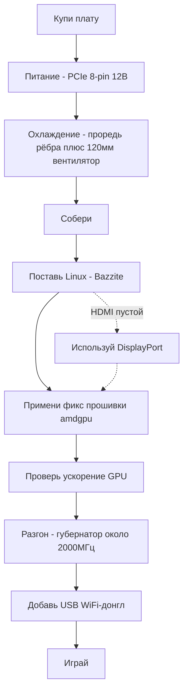

# Начни отсюда — от нуля до игры

> **Коротко** — Ты купил (или вот-вот купишь) AMD BC-250. Это плата на базе APU от PlayStation 5 с 16 ГБ GDDR6 — дешёвый Linux-бокс для игр/AI, **если** решить три вещи по порядку: **питание**, **охлаждение**, **дрова Linux**. Эта страница — прямая линия от платы в коробке до запущенной игры. Иди по шагам, каждый ведёт в свою главу.

Это проект, а не plug-and-play ПК. Заложи выходные. Два способа угробить плату на старте — **неправильная разводка питания** и **перегрев** — поэтому делаем их первыми.

---

## Перед стартом — детали и инструмент

Держи это под рукой *до* начала, чтобы не обнаруживать каждый пункт по ходу сборки:

- **БП** с выходом PCIe 8-pin 12 В → **[03 — Блок питания](03-power-supply.md)**
- **120 мм вентилятор с высоким статическим давлением** + печатный шрауд → **[04 — Охлаждение](04-cooling.md)** / **[05 — Корпуса и 3D-печать](05-case.md)**
- **Печатный корпус или крепление** → **[05 — Корпуса и 3D-печать](05-case.md)**
- **USB-флешка ≥ 16 ГБ** под установщик Linux
- **Кабель DisplayPort** (или переходник DP→HDMI — HDMI платы часто не даёт картинки, DisplayPort надёжнее)
- **Отвёртка**
- **Мультиметр** — прозвонить/проверить магнитом разводку БП → **[03 — Блок питания](03-power-supply.md)**

---

## Путь



### 0. Пойми, что у тебя
BC-250 — серверный/майнинг блейд: один APU (CPU Zen 2 + GPU класса RDNA2, «Cyan Skillfish/Oberon»), 16 ГБ GDDR6, **пассивный радиатор**, питание — одиночный **12 В PCIe 8-pin**. Нет встроенного WiFi, нет рабочего Windows-драйвера GPU, нет аппаратного видео-энкода. → **[01 — Что такое BC-250](01-what-is-bc250.md)**

### 1. Купи правильное
Знай адекватную цену, что в коробке (только плата? радиатор? БП?) и каких продавцов/разводов избегать. → **[02 — Гайд по покупке](02-buying.md)**

### 2. Реши питание *до первого запуска*
Плате нужно ~235 Вт (больше в разгоне) по 12 В через PCIe 8-pin. Используй нормальный БП (серверный Flex / кирпич Mean Well / ATX), разведи 8-pin правильно **настоящим медным проводом достаточного сечения**, не гадай пинаут — ошибка тут = мёртвая плата. → **[03 — Блок питания](03-power-supply.md)**

### 3. Почини охлаждение *до нагрузки*
Стоковый радиатор рассчитан на продув в стойке и **троттлит на столе**. Проредь рёбра и поставь 120 мм вентилятор с высоким статическим давлением через печатный шрауд (или AIO). Цель: держится ниже ~80 °C в Furmark. → **[04 — Охлаждение](04-cooling.md)**

### 4. Поставь в корпус (необязательно, но приятно)
Напечатай консольный корпус с креплением платы, вентилятора и БП и реальным продувом. Каталог STL комьюнити. → **[05 — Корпуса и 3D-печать](05-case.md)**

### 5. Собери
Физический порядок операций для минимальной сборки: прикрути вентилятор к печатному шрауду → надень/прикрути шрауд на (прорежённые) рёбра радиатора → установи плату в корпус/крепление → подключи 8-pin БП к плате (верный пинаут, **[03 — Блок питания](03-power-supply.md)**) → подключи кабель DisplayPort к монитору → включи и убедись, что плата **постит** (POST = power-on self-test, самотест при включении: плата стартует и выдаёт видео — есть картинка / крутится вентилятор). Шлифовку рёбер делай *до* установки (см. **[04 — Охлаждение](04-cooling.md)**) и не давай металлической пыли попасть на плату.

> Подписанное фото/схема этой сборки — желанный вклад: в репозитории его пока нет.

### 6. Поставь Linux + дрова GPU
Решающий шаг. Проще всего новичку — **образ на базе Bazzite** под BC-250 (или **Fedora 43** — второй «просто работает» выбор elektricM; Fedora 42 уже EOL). Затем примени **фикс amdgpu** (симлинк `navi10_gpu_info.bin`) и kernel-параметры, пересобери initramfs/grub, проверь ускорение GPU (`vainfo`, `dmesg`). → **[06 — Дрова Linux](06-linux.md)**

> **Две настройки, на которых теряют часы, если пропустить** (elektricM): на мод-BIOS выстави **VRAM = 512 МБ dynamic** и **отключи IOMMU** (сломанный IOMMU даёт сбои вывода и краши), затем **сбрось CMOS** после прошивки. Ставь с параметром загрузки `nomodeset` и **убери его, как только дрова встанут**. Mesa **25.1+** — минимум (рекомендуется 25.3.x). И **избегай ядер 6.15.0–6.15.6 и 6.17.8–6.17.10** — они ломают драйвер GPU; бери 6.18 LTS / 6.17.11+ / 6.12–6.14 LTS. ([elektricM quick-start](https://elektricm.github.io/amd-bc250-docs/getting-started/quick-start/), [quick-reference](https://elektricm.github.io/amd-bc250-docs/reference/quick-reference/))

> Думаешь про Windows? На начало 2026 **рабочего Windows-драйвера GPU нет** — экспериментально. Используй Linux. → **[07 — Windows](07-windows.md)**

### 7. Проверь на стоке, потом разгон
Когда десктоп ускорен, поставь **GPU-говернор** (сейчас рекомендуется cyan-skillfish-smu; oberon тоже работает) и подними частоты (1500 МГц сток — слабо; **2000 МГц ≈ +30 % FPS**). Опционально разблокируй все **40 CU** и сделай андервольт. Перетестируй температуры на новых частотах. → **[09 — Разгон и андервольт](09-overclock-undervolt.md)**

### 8. Выйди в сеть
Встроенного WiFi нет — добавь **проверенный USB-донгл** (любимец комьюнити — aic8800d80) и его драйвер. → **[10 — WiFi и Bluetooth](10-wifi-bt.md)**

### 9. Играй
Поставь реалистичные ожидания (CPU Zen 2 часто и есть предел, не GPU), включи FSR, используй настройки комьюнити под конкретные игры. → **[11 — Результаты в играх](11-gaming.md)**

### Бонус — локальные LLM
16 ГБ VRAM — много за такие деньги. Запускай llama.cpp на бэкенде **Vulkan** (ROCm на этом GPU — тупик). → **[12 — AI / LLM](12-ai-llm.md)**

### Бонус — эмуляция
Switch, PS3, PS4, ретро, аркады — что реально идёт и как → **[15 — Эмуляция](15-emulation.md)**

> Нет картинки при первом запуске? Плата выводит по **DisplayPort** (HDMI часто пустой) → **[14 — Дисплей и вывод](14-display.md)**. Кончились USB-порты или добавляешь диск? → **[16 — USB, хабы и накопители](16-usb-peripherals.md)**

---

## Если что-то сломалось
Чёрный экран, нет ускорения, случайные ребуты, отвал донгла, кирпич после прошивки — смотри **[Troubleshooting](troubleshooting.md)** и **[FAQ](faq.md)**.

> Прошивка мод-BIOS — **не** стартовый шаг. Может закирпичить плату и требует железа для восстановления. Иди туда только осознанно. → **[08 — BIOS и восстановление](08-bios.md)**

---

## Чек-лист на 60 секунд

| Шаг | Готово когда |
|------|-----------|
| Питание | БП разведён на 8-pin, пинаут верный, провод медь, плата постит |
| Охлаждение | Рёбра прорежены + 120 мм вентилятор/шрауд; <80 °C в Furmark |
| ОС | Bazzite-bc250 установлен, грузится в десктоп |
| GPU | `vainfo`/`dmesg` показывают активный amdgpu, не CPU-фолбэк |
| Разгон | GPU-говернор работает (рекомендуется cyan-skillfish-smu), ~2000 МГц, стабильно в реальной игре |
| Сеть | USB-донгл подключается и держит связь |
| Игра | Идёт с ожидаемым FPS для твоих частот |

Все строки отмечены — готово. Добро пожаловать в клуб BC-250.

---

## Шпаргалка (quick reference)

Команды и настройки, к которым тянешься чаще всего, сжато из [quick-reference](https://elektricm.github.io/amd-bc250-docs/reference/quick-reference/) elektricM. Полные подробности — в **[06 — Linux](06-linux.md)** и **[09 — Разгон](09-overclock-undervolt.md)**.

**BIOS:** VRAM `512MB` dynamic · IOMMU **Disabled** · загрузка UEFI · сбрасывай CMOS после каждой прошивки с USB.

**Проверь, что GPU ускорен (а не llvmpipe/CPU):**
```bash
glxinfo | grep "OpenGL version"          # ожидается Mesa 25.1+
vulkaninfo | grep deviceName             # → AMD Radeon Graphics (RADV GFX1013)
cat /sys/class/drm/card0/device/pp_dpm_sclk   # несколько частот, текущая с *
```

**Говернор** (без него частоты висят на 1500 МГц). Рекомендуется `cyan-skillfish-governor-smu` (без патча ядра); оригинальный `oberon-governor` тоже работает — см. [09](09-overclock-undervolt.md):
```bash
sudo dnf copr enable filippor/bazzite
sudo dnf install cyan-skillfish-governor-smu          # на Bazzite — rpm-ostree install …
sudo systemctl enable --now cyan-skillfish-governor-smu.service
systemctl status cyan-skillfish-governor-smu          # → active (running)
```
> Нижний порог напряжения **700 мВ** — ниже GPU блокируется на 1500 МГц. Говернор может цепляться не к той карте (card0 vs card1) — проверь, если масштабирование не включается.

**Убери `nomodeset`, когда дрова встали:**
```bash
# GRUB-дистрибутивы: убери "nomodeset" из /etc/default/grub, затем
sudo grub2-mkconfig -o /boot/grub2/grub.cfg && sudo reboot
# Bazzite / Fedora Atomic:
rpm-ostree kargs --delete-if-present="nomodeset" && systemctl reboot
```

**Опция запуска в Steam**, чинящая графические глюки в части игр: `RADV_DEBUG=nohiz %command%`.

**Краши в RDR2 / Company of Heroes 3?** Переключи VRAM с `512MB` dynamic на **10GB/6GB fixed** (конфликт ZRAM). ([elektricM quick-reference](https://elektricm.github.io/amd-bc250-docs/reference/quick-reference/))
