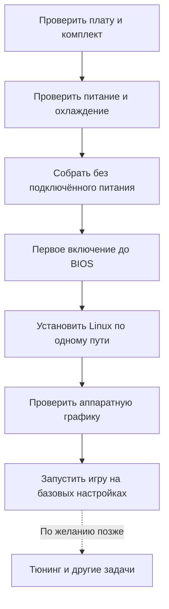

# Начни отсюда — от нуля до игры

> **Цель — первая работающая игра, а не обязательный разгон.** Пройди сборку, первое включение, установку и проверку ниже. Прошивка BIOS, разблокировка ядер/CU и собственные кривые напряжения — отдельные задачи, не условия первого запуска.

[English](../en/00-start-here.md) · [Русский](00-start-here.md) · [Українська](../uk/00-start-here.md) · [Все главы 00–17](../../README.ru.md#быстрый-старт)

## Перед стартом — детали и инструмент

Проверь комплект платы, прежде чем докупать что-либо:

- **Подходящий БП на 12 В и проверенный кабель PCIe 8-pin.** Штекер EPS/CPU не взаимозаменяем; ни мощность БП, ни арифметика токов контактов не подтверждают допустимую нагрузку кабеля. См. [03 — Питание](03-power-supply.md).
- **Активное охлаждение:** вентилятор с креплением/шраудом, направляющим воздух через радиатор и вокруг обратной стороны платы. Вентилятор 120 мм с высоким статическим давлением — распространённый вариант. См. [04 — Охлаждение](04-cooling.md).
- **SSD и подходящее подключение/адаптер**, а не только установочная флешка. См. [16 — Накопители и периферия](16-usb-peripherals.md).
- **Монитор и кабель DisplayPort**, клавиатура и мышь. Переходник DP→HDMI проверяется отдельно. См. [14 — Видео](14-display.md).
- **USB-флешка для установщика**, вмещающая выбранный образ; 16 ГБ — полезный ориентир, но сверь размер загрузки.
- **Отвёртка и надёжное крепление без замыканий.** Печатный корпус необязателен. См. [05 — Корпуса](05-case.md).
- **Мультиметр:** прозвонка при отключённом питании, измерение напряжения — в режиме напряжения. Не прозванивай цепь под питанием; мультиметр не является магнитом и не подтверждает материал провода.
- **Сеть** для загрузок и установки: проводной Ethernet либо поддерживаемый WiFi-донгл с драйвером. Подготовь её до установки, если установщику нужен интернет. См. [10 — Сеть](10-wifi-bt.md).

## Путь


```mermaid
flowchart TD
    A[Проверить плату и комплект] --> B[Проверить питание и охлаждение]
    B --> C[Собрать без подключённого питания]
    C --> D[Первое включение до BIOS]
    D --> E[Установить Linux по одному пути]
    E --> F[Проверить аппаратную графику]
    F --> G[Запустить игру на базовых настройках]
    G -. По желанию позже .-> H[Тюнинг и другие задачи]
```

### 0. Пойми, что у тебя

Определи плату, разъёмы, радиатор и изменения предыдущего владельца. У BC-250 CPU Zen 2, графика класса RDNA2 и общий пул 16 ГБ GDDR6; это не 16 ГБ отдельной RAM плюс ещё 16 ГБ VRAM. Запиши версию BIOS до изменения настроек. См. [01 — Что такое BC-250](01-what-is-bc250.md).

### 1. Докупи только недостающее

Сравни комплект со списком выше. Проверь описание продавца, состояние и включённые детали; если плата уже твоя — покупать другую не нужно. См. [02 — Покупка](02-buying.md).

### 2. Реши питание до первого запуска

Используй проверенный кабель и распиновку из [03 — Питание](03-power-supply.md), а не штекер, который просто подошёл. Для штатной игры глава даёт ориентир 300 Вт и больше по 12 В; длительные вычисления с разблокировкой требуют отдельного расчёта. Не начинай с параллельных БП, самодельных разветвителей или переходников питания SATA. Подключай всё при отключённом от платы и сети БП.

### 3. Организуй охлаждение до нагрузки

Пассивному стоечному радиатору на столе нужен принудительный обдув. Закрепи вентилятор, направь воздух через рёбра и оставь обдув обратной стороны платы. Не превращай шлифовку/резку радиатора в обязательный первый шаг: выбери рабочую схему в [04 — Охлаждение](04-cooling.md). Если всё же дорабатываешь радиатор — сними его с платы и убери проводящий мусор до сборки.

### 4. Закрепи плату

Установи плату и охлаждение в корпус или подходящее открытое крепление без замыканий, свободных металлических деталей и перекрытого потока воздуха. Проверь место под кабели. Модели корпусов и креплений — в [05 — Корпуса](05-case.md).

### 5. Собери и получи экран BIOS

На выключенной плате, с отключённым от платы и сети БП:

1. Закрепи охлаждение/вентилятор и плату.
2. Подключи SSD подходящим способом из [16](16-usb-peripherals.md).
3. Подключи проверенный кабель питания из [03](03-power-supply.md).
4. Подключи монитор через DisplayPort и клавиатуру.
5. Подай питание и войди в BIOS/Setup; проверь, что экран настроек появляется и установочный накопитель доступен.

**Вращающийся вентилятор сам по себе не доказывает POST или рабочую графику.** Нет картинки или запуска? Остановись здесь и открой [диагностику](troubleshooting.md); не стирай SSD и не прошивай BIOS наугад. Подключение монитора и переходников — в [14](14-display.md).

### 6. Установи Linux по одному выбранному пути

Открой [06 — Linux](06-linux.md), выбери **один** путь и выполни его до перезагрузки и проверки:

- **Bazzite:** сначала установи обычный Bazzite. Затем выбери штатный Bazzite с SMU-governor либо обычный стабильный [образ BC250 от 62fixolab](https://github.com/62fixolab/Latest-Bazzite-AMD-BC-250-Patched-Images), соответствующий твоему рабочему столу. `-40cu`, testing и unstable — не путь первой сборки.
- **Fedora или CachyOS/Arch:** следуй разделу своего дистрибутива, а не командам установки пакетов/rebase для Bazzite.

**Не делай симлинк firmware, не пересобирай initramfs и не меняй ядро только потому, что так написано в старом чек-листе.** Свежая firmware или подготовленный образ могут уже содержать нужную настройку; ручной фикс относится только к пути, где он действительно требуется. Не прошивай мод-BIOS и не назначай один размер UMA всем ОС ради этого общего маршрута. Если выбранному пути нужны настройки BIOS — следуй [08 — BIOS](08-bios.md), сохранив исходные значения.

Если для установщика использовал basic graphics mode / `nomodeset`, убери его по инструкции [06](06-linux.md), когда графика настроена, и перезагрузись. Регрессии ядер и версии драйверов описаны там, а не закреплены навечно на стартовой странице. Создай обычную учётную запись; не запускай Steam от root.

### 7. Проверь базовую работу до тюнинга

Открой терминал установленного рабочего стола. Эти команды только показывают сведения о графике:

```bash
glxinfo -B
vulkaninfo --summary
```

- **OpenGL renderer** должен указывать аппаратную AMD-графику, не `llvmpipe`.
- Vulkan должен показывать **аппаратное устройство AMD/BC250**, например `AMD Radeon Graphics (RADV GFX1013)`. Программное устройство тоже может присутствовать в списке; это не отменяет аппаратное. Для игры выбирай AMD.
- «Команда не найдена» означает отсутствие диагностической утилиты, а не поломку GPU; установка для твоей ОС описана в [06](06-linux.md). Одна версия Mesa не подтверждает аппаратный рендеринг.
- `vainfo` проверяет видеокодеки, а не ускорение игр через OpenGL/Vulkan. Ошибки кодеков и compute-кодирование — отдельные темы, см. [17](17-projects-and-tools.md).

Проверь температуры средствами мониторинга своего образа ([04](04-cooling.md), [06](06-linux.md)). Начинай с документированных базовых настроек образа, без своих частот/напряжений и разблокировок CPU/CU. Если governor уже установлен — проверь его конфигурацию, не запускай второй. Выбор, установка и проверка governor — в [09](09-overclock-undervolt.md); достижение 2000 МГц не является условием первой игры.

### 8. Подключи сеть

Если можешь — начни с проводного подключения. Для WiFi/Bluetooth проверяй реальный чипсет донгла и драйвер своей ОС, а не только название на коробке. Убедись, что загрузки не обрываются. Если сеть нужна установщику, сделай это до шага 6. См. [10 — WiFi и Bluetooth](10-wifi-bt.md).

### 9. Запусти игру

Используй Steam из обычной учётной записи, установи игру и начни с настроек из [11 — Игры](11-gaming.md). Проверь аппаратную графику, контролируемые температуры и отсутствие артефактов/сбросов. Если запуск не удался — разбери базовую настройку до добавления FSR, своей Mesa, андервольта или разблокированных блоков.

После успешного запуска **перезагрузись и повтори его**, чтобы результат не зависел от временной настройки одной сессии. Затем добавляй нужные программы из [17 — Control Center, апскейлеры и стриминг](17-projects-and-tools.md), по одному изменению.

## Если что-то сломалось

Открой [диагностику](troubleshooting.md) и [FAQ](faq.md) для конкретного этапа. Запиши образ/deployment ОС, ядро, вывод renderer и последние изменения. В Bazzite сохрани рабочий deployment командой `sudo ostree admin pin booted`; при неудачном обновлении/rebase выбери сохранённый deployment или используй откат из [06](06-linux.md). Стирание накопителя — не стандартный шаг диагностики.

Прошивка и восстановление BIOS — в [08](08-bios.md), а не в обязательном чек-листе первого включения.

## Чек-лист на 60 секунд

| Этап | Готово когда |
|---|---|
| Комплект | БП/кабель, охлаждение, SSD, монитор, устройства ввода и установщик готовы |
| Питание и сборка | Распиновка проверена, плата закреплена, экран BIOS доступен |
| Охлаждение | Активный обдув работает; температуры не растут бесконтрольно и не вызывают сбросов в игре |
| ОС | Выбранный путь Linux выполнен; рабочий стол загружается после перезагрузки |
| GPU | OpenGL/Vulkan показывают аппаратную графику, не только программный рендеринг |
| Сеть | Загрузки завершаются без потери подключения |
| Игра | Работает без артефактов/сбросов на базовых настройках, в том числе после перезагрузки |
| Восстановление | Важные данные скопированы; рабочие настройки/deployment и путь отката записаны |

Ни одна строка не требует прошивки BIOS, заданного разгона, восьми ядер CPU или 40 CU.

## После первой игры

- **Необязательный тюнинг:** [09 — Governor, частоты и напряжение](09-overclock-undervolt.md).
- **Локальные модели и вычисления:** [12 — AI / LLM](12-ai-llm.md).
- **Эмуляция:** [15 — Эмуляция](15-emulation.md).
- **Другие ОС:** [07 — Windows](07-windows.md) · [13 — macOS / MetalCyan](13-macos.md).
- **Программы:** [17 — Control Center, FSR4, HelixSR и стриминг](17-projects-and-tools.md).
- **Другие проекты:** [Тематический каталог](../../catalog/ru/README.md).

[Быстрый старт upstream](https://elektricm.github.io/amd-bc250-docs/getting-started/quick-start/) и [quick reference](https://elektricm.github.io/amd-bc250-docs/reference/quick-reference/) дают контекст; конкретные необходимые действия определяет путь твоей ОС в главе 06. Этот маршрут не является заявлением, что мы испытывали твою плату.
