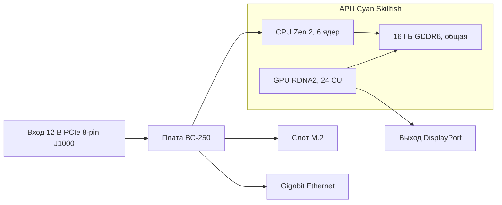

# Что такое BC-250

> **Коротко** — BC-250 — это **APU уровня PlayStation 5 на серверной/майнинговой плате**. Один чип (кодовое имя AMD **Cyan Skillfish**, урезанная версия кремния PS5 **Oberon/Ariel**) несёт **6-ядерный / 12-поточный CPU на Zen 2** и **GPU на 24 вычислительных блока архитектуры RDNA 2**, которые питаются от **16 ГБ распаянной памяти GDDR6**. Это **не видеокарта и не обычный ПК** — здесь **нет привычного BIOS, нет слота PCIe, нет 24-контактного разъёма ATX**: плата принимает **только 12 В прямо в 8-контактный разъём питания PCIe** и грузит собственную прошивку. Её покупают как **очень дешёвую коробку для гейминга на Linux и локального ИИ**. На неё же злятся, потому что **драйверы, охлаждение и отсутствие аппаратного кодирования видео** превращают её в проект, а не в устройство «включил и работает». Если вам нужно без возни — это неправильная покупка, верните её сейчас. Если любите ковыряться — читайте дальше.

Эта страница — справка «что я вообще купил». Питание, охлаждение, установка ОС и драйверы разобраны в отдельных разделах ([03](03-power-supply.md) / [04](04-cooling.md) / [06](06-linux.md)).

---

## Что это на самом деле

AMD сделала BC-250 как **ускоритель для майнинга криптовалют** («BC» — от blockchain). Чтобы удешевить, AMD переиспользовала **оставшийся кремний процессора PlayStation 5** — тот же тип чипа, что Sony ставит в консоль. Плата — это один APU плюс его память и схема питания; это и есть весь продукт.

Жаргон, поясняется один раз:

- **APU** (Accelerated Processing Unit) — название AMD для одного чипа, содержащего **сразу и CPU, и GPU**. Отдельной видеокарты нет; GPU находится внутри того же корпуса и делит ту же память.
- **Cyan Skillfish** — инженерное **кодовое имя** этого APU. В Linux оно встречается повсюду: файл прошивки GPU так и называется — `cyan_skillfish_gpu_info.bin` ([src](https://t.me/c/2424231195/57962) — фикс через симлинк см. [src](https://t.me/c/2424231195/41252)). Утилиты также могут показывать его под именами кристалла PS5 — **Oberon** / **Ariel**.
- **GDDR6** — быстрая графическая память, обычно встречающаяся на видеокарте. На BC-250 она одновременно является **и системной, и видеопамятью** (CPU и GPU делят один пул). Слотов DIMM нет; 16 ГБ распаяны и не расширяются.
- **RDNA 2** — поколение архитектуры GPU (то же семейство, что у PS5, Xbox Series и видеокарт Radeon RX 6000).

Чип — это **урезанная** деталь от PS5, а не полная. Сообщество закрепило это сравнение ([src](https://t.me/c/2424231195/11282), со ссылкой на [запись Oberon на TechPowerUp](https://www.techpowerup.com/gpu-specs/amd-oberon.g936)):

| | BC-250 | Полный PS5 (Oberon) |
|---|---|---|
| Ядра / потоки CPU | **6 / 12** | 8 / 16 |
| Вычислительные блоки GPU (CU) | **24** | 36 |

«Вычислительный блок» (compute unit) — это один блок ядер GPU; 24 штуки — это примерно уровень среднего ноутбучного GPU, и именно в этот диапазон производительности в играх укладываются отчёты из чата.

На BC-250 запускали **десктопный Linux тем же способом, которым взламывали саму PS5** — полноценные 4K-видео и звук по HDMI, рабочие USB-порты, APU разгоняется примерно до ~3,2 ГГц по CPU и ~2,0 ГГц по GPU ([src](https://t.me/c/2424231195/122260)).

---

## В чём она хороша

- **Самый дешёвый вход в гейминг на Linux на этом уровне производительности.** Через Steam/Proton (слой совместимости, запускающий Windows-игры на Linux) люди играют в Star Citizen ([src](https://t.me/c/2424231195/38702)) и даже в современные тайтлы вроде *Doom: The Dark Ages* через сообществ. обёртку Vulkan на ~60 FPS на низких/FSR ([src](https://t.me/c/2424231195/127696)). Результаты по конкретным играм — в [11-gaming.md](11-gaming.md).
- **Способная коробка для локального ИИ.** С 16 ГБ GDDR6 она вмещает языковые модели среднего размера. Участники запускают LLM локально через `llama.cpp`/`jan` на бэкенде **Vulkan**; сначала в BIOS выделяют 12 ГБ под GPU ([src](https://t.me/c/2424231195/92421)). См. [12-ai-llm.md](12-ai-llm.md).
- **Маленькая и самодостаточная.** Это одна длинная плата со встроенным радиатором «как у видеокарты» — она ставится в небольшие самодельные/печатные корпуса и работает от одного маленького блока питания ([сборка src](https://t.me/c/2424231195/137825)).

Консенсус сообщества о том, *почему* она вообще работает: чип настолько близок к железу Steam Deck / PS5, что Valve и открытый графический стек Mesa продолжают улучшать ровно те же драйверы, а BC-250 едет на этом бесплатно ([src](https://t.me/c/2424231195/93006)).

---

## Что мучительно (выставляем ожидания)

Эту половину новички недооценивают. Ничто из перечисленного не приговор, но всё это — реальная работа.

- **Драйверы — это «сделай сам».** AMD **не выпускает ни официального драйвера, ни публичной документации** на эту плату ([src](https://t.me/c/2424231195/37764)). Всё — графический стек Linux, «губернатор» частот/напряжения, BIOS — собрано сообществом. Готовьтесь выполнять скрипты установки и временами чинить что-то руками. Начните с [06-linux.md](06-linux.md).
- **Охлаждение — главная ошибка новичков №1.** Штатный радиатор спроектирован под продувочный туннель майнингового стеллажа, поэтому на столе он перегревается и троттлит из коробки. Охлаждение придётся дорабатывать. Этому посвящён отдельный раздел — прочитайте [04-cooling.md](04-cooling.md) **до** погони за производительностью.
- **Нет аппаратного кодировщика видео.** Блок кодирования видео GPU (AMD называет его **VCN** — выделенная схема, сжимающая видео для стриминга/записи) **недоступен**. Запись экрана и стриминг игр откатываются на **программный кодировщик**, который нагружает CPU. Это работает (люди стримят через Sunshine/Moonlight), но медленнее и хуже по качеству, чем у обычной видеокарты ([src](https://t.me/c/2424231195/88026)). Аналогично ранний драйвер Mesa был знаменит **программным рендерингом**, пока сообщество не завело аппаратное ускорение ([src](https://t.me/c/2424231195/11243)).
- **Странное питание и нет картинки по умолчанию.** Плата не принимает стандартный 24-контактный разъём ATX — см. следующий раздел. Многие платы к тому же приходят так, что им нужен **сброс BIOS**, прежде чем они вообще пройдут POST ([src](https://t.me/c/2424231195/57930)), а картинку обычно выводят по **DisplayPort** (для HDMI нужен переходник DP→HDMI, который, к слову, нормально несёт и звук — [src](https://t.me/c/2424231195/9148)).
- **Это плата для тех, кто любит возиться, и точка.** Как сказал один давний участник: несмотря на дешевизну, BC-250 «требует определённых навыков, усилий и умственных способностей» ([src](https://t.me/c/2424231195/73002)). Закладывайте время, а не только деньги.

> ⚠ **Предупреждение по обращению, выученное на горьком опыте.** **Не** допускайте контакта чего-либо металлического с платой под напряжением и меняйте термопасту только аккуратно — участник навсегда убил свою BC-250, замкнув её ([src](https://t.me/c/2424231195/95998)). Платы также приходят слегка **изогнутыми** из-за крепления радиатора; один участник починил «не стартует», подложив бумагу и выпрямив плату по радиатору ([src](https://t.me/c/2424231195/117347)).

---

## Карточка-справка по железу

Характеристики с пометкой **⚠ verify** не удалось подтвердить по первичному даташиту на момент написания (AMD его не публикует; страницы спецификаций TechPowerUp были недоступны). Распиновка и цифры питания ниже взяты из канонического документа сообщества по железу.

Плата в общих чертах — питание слева, APU и его общая память в центре, ввод-вывод справа:



### Основные характеристики

| Характеристика | Значение | Источник |
|------|-------|----------|
| Класс | APU на базе PlayStation 5 на майнинговой/серверной плате | [hardware.md](https://github.com/mothenjoyer69/bc250-documentation/blob/main/hardware.md) |
| Кодовое имя APU | **Cyan Skillfish** (кристалл PS5: Oberon / Ariel) | чат ([src](https://t.me/c/2424231195/57962)) |
| CPU | **6 ядер / 12 потоков, Zen 2** (6 ядер подтверждено) | [hardware.md](https://github.com/mothenjoyer69/bc250-documentation) · чат ([src](https://t.me/c/2424231195/11282)) |
| Частота CPU | до **~3,49 ГГц** («примерно») | [hardware.md](https://github.com/mothenjoyer69/bc250-documentation) · чат ([src](https://t.me/c/2424231195/122260)) |
| GPU | **24 вычислительных блока, RDNA 2** (у SoC PS5 — 36) | [hardware.md](https://github.com/mothenjoyer69/bc250-documentation) · чат ([src](https://t.me/c/2424231195/11282)) |
| Частота GPU | ~1500 МГц сток, ~2000 МГц в разгоне (≈2,23 ГГц макс.) | ([src](https://t.me/c/2424231195/122260)) · [09](09-overclock-undervolt.md) |
| Память | **16 ГБ GDDR6**, общая для CPU и GPU, распаяна (не расширяется) | [hardware.md](https://github.com/mothenjoyer69/bc250-documentation) · [README](../../README.ru.md) |
| Выделение VRAM под GPU | задаётся в BIOS; **12 ГБ** доступно на BIOS 3.00+ | ([src](https://t.me/c/2424231195/92421)) |
| Шина / пропускная способность памяти | ⚠ verify — в канонических документах не указано (для этого семейства кристалла в других источниках указывают 128-битную GDDR6) | — |
| TDP | **220 Вт** (тепловой пакет платы) | [hardware.md](https://github.com/mothenjoyer69/bc250-documentation) |
| Энергопотребление | ~67–85 Вт типично под нагрузкой майнингового класса | [hashrate.no](https://www.hashrate.no/gpus/bc250) |
| Аппаратное кодирование видео (VCN) | **Нет** — только программное кодирование | ([src](https://t.me/c/2424231195/88026)) |
| Видеовыход | DisplayPort (для HDMI — переходник DP→HDMI; несёт звук) | ([src](https://t.me/c/2424231195/9148)) |
| 2-й DisplayPort | присутствует, но **не распаян**; активируется программно | ([src](https://t.me/c/2424231195/88026)) |
| Физический размер | длинная узкая односекционная плата, ~длиной с видеокарту | ⚠ verify точные мм — см. примечание ниже |

> **О габаритах платы:** канонический документ по железу **не** приводит размеры платы, поэтому точные миллиметры остаются **⚠ verify**. Самый залайканный «железный» пост чата так и называется — *«Размеры amd bc-250»* (❤20 — [src](https://t.me/c/2424231195/379)), что подтверждает: для сборки корпусов это людям важно, но конкретные цифры в той ветке находятся в приложенном изображении, которого нет в экспорте доказательной базы. Для подгонки корпуса работайте по измеренной 3D-модели — каталогизированные сообществом STL платы (например, `BC250 Board.stl`, [Printables 1103626](https://www.printables.com/model/1103626-amd-bc250-board) и точная модель на [Printables 1341336](https://www.printables.com/model/1341336-accurate-3d-model-of-the-amd-bc-250-board)) геометрически верны. См. [05-case.md](05-case.md).

<p align="center">
  <br>
  <sub>Фото: сообщество AMD BC-250 · <a href="https://t.me/c/2424231195/379">источник</a></sub>
</p>

### Распиновка разъёма питания (прочтите до того, как что-либо подключать)

У BC-250 **нет 24-контактного разъёма ATX**. Она питается **только 12 В**, подаваемыми через **8-контактный разъём питания PCIe (J1000)** — физически тот же штекер, что у видеокарты, но плата ждёт, что все три силовых контакта запитаны от 12 В. Полная разводка и выбор БП — в [03-power-supply.md](03-power-supply.md); каноническая распиновка из [hardware.md](https://github.com/mothenjoyer69/bc250-documentation/blob/main/hardware.md):

**J1000 — основной 8-контактный PCIe (именно его вы подключаете):**

```
[ GND  GND  GND  GND ]
[ GND  12V  12V  12V ]
```

- Три контакта 12 В; документ оценивает контакты Mini-Fit Jr в **до 9 А каждый**, поэтому разъём «способен безопасно отдавать до **324 Вт**», и рекомендует провод **16 AWG** при автономном использовании ([hardware.md](https://github.com/mothenjoyer69/bc250-documentation)).
- **GND = земля (0 В), 12V = +12 вольт.** Соблюдайте полярность — у этой платы нет защиты от переполюсовки.

**J2000 / J2001 — стеллажные разъёмы питания (на столе обычно НЕ используются):**

```
        J2000                  J2001
 [ LED1  12V  12V  12V ]   [ 12V  12V  12V  PGD ]
 [ LED2  GND  GND  GND ]   [ GND  GND  GND  GND ]
```

- Это разъёмы **ALLTOP** (взаимозаменяемы с **Molex Micro-Fit**), а *не* штекеры PCIe/EPS — они питали плату внутри её исходного майнингового шасси.
- **PGD** — пин power-good/сигнальный: он видит **5 В, когда плата установлена в PSU2 стеллажа**. В автономной сборке вы обычно питаетесь через J1000, а J2000/J2001 можно игнорировать — но сверьтесь с [03-power-supply.md](03-power-supply.md) под ваш конкретный переходник БП.

---

## Куда дальше

1. **[02-buying.md](02-buying.md)** — если ещё не купили или хотите знать справедливую цену и реальные риски.
2. **[03-power-supply.md](03-power-supply.md)** — как её реально запитать (12 В в 8-контактный).
3. **[04-cooling.md](04-cooling.md)** — это делается **раньше всего** прочего, как только плата на руках.
4. **[06-linux.md](06-linux.md)** — поставить ОС и драйверы сообщества.

---

## Источники

- Канонический документ по железу и распиновка — [mothenjoyer69/bc250-documentation `hardware.md`](https://github.com/mothenjoyer69/bc250-documentation/blob/main/hardware.md)
- Урезанный против полного кремния PS5 (6/12 + 24 CU против 8/16 + 36 CU) — https://t.me/c/2424231195/11282 · [TechPowerUp Oberon](https://www.techpowerup.com/gpu-specs/amd-oberon.g936)
- Linux на железе PS5, 4K HDMI, частоты — https://t.me/c/2424231195/122260
- Нет официального драйвера / нет документации — https://t.me/c/2424231195/37764
- Программный рендеринг / нет аппаратного кодирования — https://t.me/c/2424231195/11243 · https://t.me/c/2424231195/88026
- DisplayPort + звук по DP→HDMI — https://t.me/c/2424231195/9148
- Имя прошивки Cyan Skillfish — https://t.me/c/2424231195/57962 · https://t.me/c/2424231195/41252
- Локальный LLM + 12 ГБ VRAM через BIOS 3.00 — https://t.me/c/2424231195/92421
- «Требует навыков, усилий и мозгов» — https://t.me/c/2424231195/73002
- Предупреждение об обращении/коротком замыкании — https://t.me/c/2424231195/95998 · фикс изогнутой платы — https://t.me/c/2424231195/117347
- «Размеры BC-250» (самый залайканный железный пост) — https://t.me/c/2424231195/379
- TDP 220 Вт, CPU 6 ядер / 3,49 ГГц, GPU 24 CU, 16 ГБ GDDR6 (подтверждение по репозиторию) — [mothenjoyer69/bc250-documentation README](https://github.com/mothenjoyer69/bc250-documentation)
- Цифры энергопотребления майнингового класса — https://www.hashrate.no/gpus/bc250
- Почему она продолжает работать (общие усилия по драйверам Steam Deck/PS5) — https://t.me/c/2424231195/93006

> Характеристики с пометкой **⚠ verify** ждут подтверждения по первичному даташиту; AMD его для этой платы не публикует. Правки приветствуются через PR (см. [CONTRIBUTING.md](../../CONTRIBUTING.md)).
