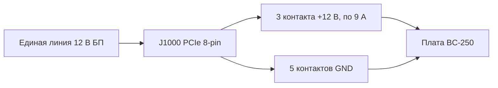

# Блок питания

> **Коротко** — У BC-250 **нет кнопки включения и нет обычного компьютерного разъёма питания**. Плата ест **12 В** через единственный разъём **PCIe 8-pin (6+2)** — тот самый, что идёт на видеокарту, — и потребляет на пике около **~235 Вт** (больше при разгоне). Нужен источник 12 В, способный отдать **~250–300 Вт по одной линии**. Три пути, которыми идёт сообщество: дешёвый **серверный «Flex» БП** (HP 500 Вт, ~$12 на eBay), **промышленный «кирпич»** (Mean Well LOP-300/LOP-500) или **обычный ATX-блок** (просто воткнуть его PCIe-кабель). Два главных убийцы: **старый БП, размазывающий 12 В по слабым линиям**, и **поддельные медно-стальные провода**, которые перегреваются и горят. Используйте настоящую медь, **16 AWG или толще**.

Питание — это **вторая вещь, которую новичок обязан сделать правильно** (после [охлаждения](04-cooling.md)), и та, что с наибольшей вероятностью устроит пожар, если сэкономить на проводах.

---

## Что на самом деле нужно плате

BC-250 — это урезанный кристалл PlayStation 5 на крипто-майнинговой/серверной плате. Она задумана стоять в стойке и получать 12 В, поэтому у неё **нет ни одного удобства обычного ПК**:

- **Нет ATX 24-pin** материнского разъёма.
- **Нет кнопки питания** — плата включается в тот момент, когда приходит 12 В (выключатель самого БП и есть ваша кнопка).
- **Единственная задача БП: дать 12 В при достаточном токе.**

**Цифры по питанию (подтверждённые):**

| Параметр | Значение | Источник |
|----------|----------|----------|
| Входное напряжение | 12 В пост. тока | [hardware.md](https://github.com/mothenjoyer69/bc250-documentation/blob/main/hardware.md) |
| Типичный пик потребления | ~220–235 Вт | по наблюдениям сообщества ([src](https://t.me/c/2424231195/31076)) |
| Разъём | PCIe 8-pin (6+2) | [hardware.md](https://github.com/mothenjoyer69/bc250-documentation/blob/main/hardware.md) · ([src](https://t.me/c/2424231195/14450)) |
| Пиковый ток по 12 В | ~18–20 А типично, запас по конструкции до ~40 А | ([src](https://t.me/c/2424231195/31076)) |

> **«PCIe 8-pin (6+2)»** — это разъём питания видеокарты: шесть контактов в блоке плюс отстёгивающаяся 2-контактная защёлка, так что один кабель работает и как 6-pin, и как 8-pin. **6+2** = 6 фиксированных + 2 съёмных. Это **не** CPU/EPS 8-pin с материнской платы — см. предупреждение ниже.

PCIe 8-pin по стандарту рассчитан на **150 Вт**, а три силовых контакта 12 В на плате (Molex Mini-Fit Jr, по 9 А каждый) безопасно пропускают **до ~324 Вт** ([hardware.md](https://github.com/mothenjoyer69/bc250-documentation/blob/main/hardware.md)). То есть одного 8-pin с запасом хватает на стоке; запас важен только при агрессивном разгоне.

**Сколько мощности БП брать:** цель — **300 Вт и больше по линии 12 В**. 300 Вт дают здоровый запас над пиком ~235 Вт и держат вентилятор БП спокойным; пишут, что серверный Flex на 500 Вт работает почти бесшумно под такой нагрузкой ([src](https://t.me/c/2424231195/31076)). Не берите меньше ~250 Вт «ради экономии» — будете работать на грани, и БП либо зашумит, либо отключится.

> **Кривая мощности по токовым клещам (прямой замер тока).** В одном разборе на линию 12 В повесили амперметр постоянного тока и сняли реальное потребление платы: **в играх ≈17 А / ~190 Вт**, а **полная синтетическая стресс-нагрузка доходит до ≈21 А / ~240–250 Вт** на **2000 МГц / 960 мВ**; чуть поднять напряжение — и уже **22–23 А и выше** ([Old Lamer — Part VII](https://youtu.be/pxahl9-YgkY) ~9:01). Это уточняет цифры потребления из розетки выше измеренным током по линии — и подтверждает, почему цель в 300 Вт оставляет нужный запас. *(Цифры сняты с автосубтитров — считайте их приблизительными.)*

> ⚠️ **Конкретные БП, которых стоит избегать:** дешёвые **Dell D220P-01** (220 Вт) и **Dell D250AD-00** (250 Вт) отмечены как **недостаточные и опасные** для этой платы — на 220 Вт / 250 Вт они сидят ниже пика платы, и по отзывам отключаются или даже выходят из строя под игровой нагрузкой. Не берите блок только потому, что он дешёвый и «вроде хватает». ([elektricM: power](https://elektricm.github.io/amd-bc250-docs/hardware/power/))

---

## ⚠️ Две ошибки, которые убивают платы

Прочитайте этот раздел до того, как что-либо покупать.

### 1. Не путайте PCIe 8-pin с CPU/EPS 8-pin

У вашего ATX-БП есть **два разных 8-pin разъёма**: один для видеокарт (**PCIe**) и один для процессора (**EPS/CPU**, иногда подписан «CPU» или «4+4»). **Они выглядят почти одинаково, но форма контактов и полярность у них зеркальные.** Если впихнуть CPU-разъём в BC-250, **+12 В попадёт туда, где должна быть земля** — можно сжечь всю плату.

> *«Обсуждалось миллиард раз уже, что у нас pcie питальник. Если форма крайнего пина другая, значит у тебя cpu питальник… у него вообще другая полярность, и там натурально плюс, где должен быть минус. Можно сжечь всё к херам.»* ([src](https://t.me/c/2424231195/14450))

У платы **нет проверки по sense-пину**, так что ничто не помешает воткнуть не то. Безопасная привычка: **смотрите на форму защёлки разъёма, а если сомневаетесь — проверьте + и − мультиметром перед включением.**

### 2. Не используйте поддельную «медь» — это пожароопасно

Это самое часто повторяемое предупреждение в чате. Дешёвые готовые переходники и бюджетные «PCIe»-кабели часто сделаны из **меднёной стали (CCS)** или **меднёного алюминия (CCA)** — тонкая медная оболочка поверх стального/алюминиевого сердечника. У стали сопротивление **~в 6 раз выше**, чем у меди, поэтому провод перегревается под нагрузкой и может расплавиться или загореться.

> *«Провод, который был сделан из переходника, под нагрузкой сильно перегрелся. Оказалось, что это не медь, а железо (сталь) с тонким медным покрытием… высокое сопротивление, сильно греется, что может привести к возгоранию. Для надёжной и безопасной работы обязательно используйте провода с полноценными медными жилами сечением не менее 2.5 мм².»* ([src](https://t.me/c/2424231195/108733))

> *«Проверил магнитом 🤣 — стальные нитки. Сопротивление этих стальных «ниток» в 6 раз выше, чем у меди, и о каких 450 ватах может идти речь.»* ([src](https://t.me/c/2424231195/133546))

**Проверяйте до того, как довериться:** магнит липнет к стали, но не к меди. Если разъём или провод магнитится — выбрасывайте кабель.

Это касается не только ноунейм-кабелей. **У БП Apevia Flex/ITX встречались стальные провода** — проверяйте их магнитом, потому что сталь сильно греется под нагрузкой и пожароопасна. **Apevia ITX-PFC400W** (Mini-ITX) использует **14-pin разъём** (он работает с [адаптером LITE](#автоматический-ps_on--адаптер-сообщества) ниже, но его не советуют). (r/BC250Gaming)

> 🔴 **Никогда не питайте BC-250 через переходник с SATA или Molex.** Плата потребляет **220–280 Вт**, а эти разъёмы физически не способны отдать столько безопасно:
> - **Переходник SATA→PCIe/8-pin пожароопасен** — разъём питания SATA рассчитан всего на **~54 Вт** ([elektricM: power](https://elektricm.github.io/amd-bc250-docs/hardware/power/)).
> - **Голое питание по Molex упирается в ~156 Вт** суммарно (два разъёма Molex) — этого тоже не хватает ([elektricM: power](https://elektricm.github.io/amd-bc250-docs/hardware/power/)).
>
> Питайте плату только от **настоящего источника 12 В класса PCIe 8-pin / EPS**. Это отдельно от предупреждения про медь и сталь выше: даже **полностью медный** переходник SATA или Molex здесь небезопасен, потому что сам разъём недорассчитан под нагрузку 220–280 Вт.

---

## Сечение провода и разъёмы

Документация платы и чат сходятся на одной безопасной базе:

| Сценарий | Провод | Источник |
|----------|--------|----------|
| Один 8-pin, сток / лёгкий разгон | **16 AWG** медь (~1.3 мм²) | [hardware.md](https://github.com/mothenjoyer69/bc250-documentation/blob/main/hardware.md) |
| Самодельный кабель, нужен запас | **2.5 мм²** (~13 AWG) полная медь | ([src](https://t.me/c/2424231195/108733)) |
| Сильный разгон | толще / **двойное питание** (см. J2000/J2001) | [hardware.md](https://github.com/mothenjoyer69/bc250-documentation/blob/main/hardware.md) |

Цифры не противоречат друг другу — **16 AWG это документированный минимум**; 2.5 мм² — это запас, который один сборщик выбрал после истории с CCS-проводом. **Принципиальное здесь — «настоящая медь», а не точное сечение.** Меньше число AWG = толще провод = безопаснее.

Для контактов разъёма, несущих полный ток, берите рассчитанные на пик: на тяжёлой сборке ориентируются на контакты/провод под **~40 А** и крепят их на болтах или нормальной обжимкой, а не на хлипком вставном контакте ([src](https://t.me/c/2424231195/31076)).

---

## Распиновка 8-pin (J1000)

Если смотреть на главный разъём питания платы — **верхний ряд весь земля, нижний ряд это 12 В, кроме одной земли**. Из [hardware.md](https://github.com/mothenjoyer69/bc250-documentation/blob/main/hardware.md):

```
J1000 (PCIe 8-pin), контакты к вам:

  [ GND  GND  GND  GND ]   ← верхний ряд: вся земля (−)
  [ GND  12V  12V  12V ]   ← нижний ряд: одна земля + три 12 В (+)
```

Чат описывает ту же полярность словами — считая контакты **с 1 по 3 = +12 В, с 4 по 8 = земля**:

> *«С первого по третий пины должны быть +, остальные с четвёртого по восьмой минус… У самой платы проверки по sense нет. Тестер возьмите и посмотрите, где плюс, где минус.»* ([src](https://t.me/c/2424231195/14450))

Как единая линия 12 В распределяется по восьми контактам — три несут +12 В, пять это земля:



Это в точности совпадает со стандартным PCIe 8-pin — *поэтому* PCIe-кабель обычного ATX-БП просто работает. **Если делаете свой кабель — проверьте каждый контакт мультиметром перед первым включением**: ошибки в полярности здесь не прощаются.

У платы также есть два меньших альтернативных разъёма питания — **J2000** и **J2001**, — нужных только под сильный разгон и подробно разобранных ниже.

---

## Больше 300 Вт — второй разъём питания J2000 / J2001

> ⚠️ **Сначала прочитайте это.** Всё в этом разделе — **дополнительная проводка 12 В, сделанная руками**. У платы **нет проверки полярности или sense** на этих пинах (как и на J1000) — перепутаете +12 В и землю, и плата сгорит в момент включения. Второе питание добавляет запас, только если **оба ввода идут от одного БП / одной линии 12 В при одном потенциале**; соединять два разных источника опасно — ток может пойти обратно через один из них. Если вы не уверены в обжимке и прозвонке своих разъёмов — остановитесь и оставайтесь на одном [8-pin J1000](#распиновка-8-pin-j1000).

Одного PCIe 8-pin в [J1000](#распиновка-8-pin-j1000) с запасом хватает на стоке и лёгком разгоне — его три контакта 12 В тянут **~324 Вт** (9 А × 3 × 12 В, или до ~468 Вт с промышленными контактами) ([hardware.md](https://github.com/mothenjoyer69/bc250-documentation/blob/main/hardware.md)). Зачем этот раздел: **плата на 40 CU при агрессивном разгоне может потреблять больше 300 Вт** ([src](https://t.me/c/2424231195/143787)), а это уже на грани комфортной зоны одного 8-pin. Плата проектировалась под стойку, где **второй БП** питает два дополнительных разъёма — **J2000** и **J2001**, — поэтому чистый способ получить запас под настольный разгон: **дополнить J1000 разъёмами J2000/J2001** (или припаяться прямо к плате), а не перегружать один разъём ([hardware.md](https://github.com/mothenjoyer69/bc250-documentation/blob/main/hardware.md)). Это и есть самая запрашиваемая схема в чате ([src](https://t.me/c/2424231195/135741)).

### Распиновка (из документации платы)

J2000 и J2001 **не одинаковы**. Они совместимы с **Molex Micro-Fit BMI** ([деталь 444280801](https://www.molex.com/en-us/products/part-detail/444280801)). Пин 1 — белый треугольник шелкографии (`v` ниже):

```
        J2000                    J2001
   v                        v
[ LED1  12V  12V  12V ]   [ 12V  12V  12V  PGD ]
[ LED2  GND  GND  GND ]   [ GND  GND  GND  GND ]
```

| Пин | Значение |
|-----|----------|
| `12V` | Вход +12 В (по три на разъём) |
| `GND` | Земля |
| `PGD` | **PGOOD** — 5 В, когда в стоечном бэкплейне присутствует второй БП; это сигнальный пин, **а не** выход питания |
| `LED1` / `LED2` | Выходы LED (активный ноль), повторяют зелёный / красный светодиоды бэкплейна |

**Для резервирования документация советует использовать оба разъёма — J2000 и J2001** ([hardware.md](https://github.com/mothenjoyer69/bc250-documentation/blob/main/hardware.md#j2000-and-j2001)). Обратите внимание: **раскладка по столбцам у них разная** — на J2000 пины LED стоят в первом столбце, а все три пина 12 В в верхнем ряду; на J2001 пин PGD в правом верхнем углу, а нижний ряд весь земля. **Прозвоните каждый пин перед подключением** — не считайте, что корпус Micro-Fit садится одинаково на оба. ⚠ проверьте точную ориентацию пина 1 на своей плате мультиметром; на пины LED/PGD **никогда** не должно попасть 12 В.

### Практический способ, которым пользуется сообщество

Стоечный бэкплейн не нужен. Повторяемый рецепт из чата прост: **один PCIe 8-pin в J1000, затем обжать вилку Molex Micro-Fit 3.0 и подать те же 12 В в соседний J2000** ([src](https://t.me/c/2424231195/142662), [src](https://t.me/c/2424231195/138371)). Один сборщик описывает кабель как *«один разъём PCIe и два разъёма Micro-Fit 3p»* от одного источника ([src](https://t.me/c/2424231195/143938)) — то есть 12 В/GND с одного PCIe-кабеля разводятся и на 8-pin, и на Micro-Fit.

**Что купить** (самосбор, Molex Micro-Fit 3.0):

| Деталь | Номер Molex | Заметка |
|--------|-------------|---------|
| Корпус | **43025-0800** (8 контактов) | корпус вилки ([src](https://t.me/c/2424231195/142659), [src](https://t.me/c/2424231195/14797)) |
| Обжимные контакты | серия **43030** | по одному на провод ([src](https://t.me/c/2424231195/142659)) |

Заполняйте только позиции **12 В и GND** (по таблице распиновки выше); `PGD` / `LED1` / `LED2` оставьте пустыми. Используйте ту же **настоящую медь, ≥16 AWG** и ту же аккуратность обжимки, что и для [основного 8-pin — см. про сечение провода](#сечение-провода-и-разъёмы); самодельный ввод 12 В, который перегревается, — ровно та пожароопасность, что описана выше в этой главе.

> 🛠 **Тонкости сборки Micro-Fit (из инструкции Molex).** Практические заметки по обжимке этих вилок ([видео Molex Micro-Fit](https://youtu.be/aaDUkPn9ASE)):
> - **Сечение провода:** **рекомендуется 18 AWG, допустимо 20 AWG** — нагрузка делится натрое по трём пинам 12 В, так что на каждый провод приходится треть.
> - **Срежьте пластиковую защёлку** с вилки, чтобы она садилась вплотную к плате.
> - **Два разъёма НЕ взаимозаменяемы** — после обжимки **подпишите их**, чтобы не перепутать вилки J2000 и J2001.
> - **Нет обжимки? Пайка — годная альтернатива** — впаяйте провод в контакт вместо обжима.
> - Сделано правильно — **девять линий 12 В на обоих разъёмах безопасно несут >400 Вт.**


### Питание платы 40 CU — мод кабеля на три выхода

После **разблокировки 40 CU** плата может потреблять **~280 Вт от розетки** в FurMark (замерено в CPU-X), а **один 8-pin PCIe выдаёт пик ~220 Вт** в FurMark — так что сильно разблокированной плате нужно больше одного ввода. У **[Metalfish 500W](#популярные-модели-бп-которыми-пользуется-сообщество)** есть **3 общих выхода PCIe/CPU**; для сборки на 40 CU заведите на плату **все три** (*«мод кабеля на три выхода»*):

- Используйте **18 AWG** — кабели остаются холодными в FurMark; до разделения нагрузки на 3 ввода они опасно грелись.
- **Сторона платы** = гнёзда Micro-Fit 3.0; **сторона БП** = гнёзда PCIe Mini-Fit 4.2 мм. **Сначала прозвоните каждый провод мультиметром.**
- Грубый расчёт сечения из треда: 18 AWG ≈ **5 А @ 12 В ≈ 60 Вт на провод** × 3 в одном разъёме ≈ 180 Вт, × 2 разъёма ≈ 360 Вт — **но параллельные жилы не делят ток поровну, так что не гоняйте их на пределе.**

(Авторство: **Korayosulu**, r/BC250Gaming, по мотивам видео Oldlamer на YouTube.)

> **Атрибуция:** распиновка J2000/J2001 выше — из **аппаратной документации elektricM**, чья обратная разработка опирается на **[bc250-documentation от mothenjoyer69](https://github.com/mothenjoyer69/bc250-documentation)** (благодарность также Segfault, neggles, yeyus). Практический способ обжимки и номера деталей — из чата сообщества, ссылки в тексте.

---

## Варианты БП, которыми пользуется сообщество

Практических путей три. Все дают 12 В; различаются ценой, размером, шумом и объёмом проводной работы.

> 💡 **Питаете несколько плат от одного БП?** Вся эта глава написана под одну плату. Для рига из нескольких плат, запитанного от одного большого серверного БП, используйте плату сообщества **[Needleroozer/bc250-power-board](https://github.com/Needleroozer/bc250-power-board)** — плату распределения питания, которая разводит один БП на чистые линии 12 В к каждой BC-250 ([elektricM: power](https://elektricm.github.io/amd-bc250-docs/hardware/power/)).

| Вариант | Что это | Цена | Плюсы | Минусы |
|---------|---------|------|-------|--------|
| **Серверный «Flex Slot» БП** | 1U датацентровый «кирпич» HP/Dell и т.п. (напр. HP 500 Вт Platinum) | ~$12–25 б/у | Дёшево, почти неубиваем, огромная единая линия 12 В, очень компактен | Нужна перемычка/резистор для запуска; крошечный вентилятор на 15 000 об/мин воет как турбина, пока его не заменишь; 8-pin паяете сами |
| **Промышленный «кирпич» (Mean Well)** | Закрытый AC→DC источник, единая линия 12 В (LOP-300 = 300 Вт/25 А, LRS-350, LOP-500) | ~$25–45 новый | Новый, чистая единая линия, тихий, по datasheet | 8-pin паяете сами; голые клеммы требуют корпуса |
| **Обычный ATX / Flex-ATX / SFX ПК-БП** | Любой приличный современный компьютерный БП | по-разному | **Без доработок** — его PCIe 8-pin втыкается напрямую; безопаснее всего для новичка | Громоздкий для мини-сборки; избыточная мощность; помните про правило единой линии ниже |

### Вариант A — Серверный Flex БП (самый популярный дешёвый путь)

Любимец сообщества — б/у **HP Flex Slot 500 Вт** — *«купил за какие-то смешные 12$ с eBay… эти блоки почти вечные, запас прочности сильно выше, чем их меняют в дата-центрах, плюс сертификат платина»* ([src](https://t.me/c/2424231195/31076)). PCIe-разъёма у них нет, поэтому его приделывают:

1. **Запуск БП:** замкнуть два коротких пусковых пина (пины 1–2) перемычкой или фиксируемой кнопкой.
2. **Включение линии 12 В:** поставить **резистор ~500 Ом между пином 3 и GND** (широкий левый пин).
3. **Снятие 12 В:** либо припаять PCIe 8-pin прямо к пинам 12 В, либо встроить разъём в корпус — *«но провода и разъём нужны, что бы держали пиковые 40 А»* ([src](https://t.me/c/2424231195/31076)).

Другие проверенные серверные/консольные «кирпичи»: **БП от PlayStation 3 FAT** (32 А / 12 В — *«более чем достаточно и очень стабилен, рекомендую для BC-250»* ([src](https://t.me/c/2424231195/62332)), [src](https://t.me/c/2424231195/102734)), Dell D550E, Juniper JPSU-350 и разные БП от ASIC-майнеров.

> **Включай всю плату с кнопки геймпада Xbox — [ESP32-BC250-LOP_PSU-PowerON-Xbox](https://github.com/dexikdex/ESP32-BC250-LOP_PSU-PowerON-Xbox)** ([src](https://t.me/c/2424231195/142498)). Эта плата сообщества (**ESP32_Relay X2**, модель **303E32DC210**, двойное реле) делает **пассивное BLE-сканирование**: когда твой спаренный геймпад Xbox включается, ESP32 видит его Bluetooth-объявление и щёлкает реле на **GPIO17**, заведённое на контакты **PWR_SW** платы, — питание включается. Второе реле (**GPIO16**) одновременно подаёт 12 В на периферию (напр. контроллер вентиляторов). Остальные пины: **GPIO23** — вход физической кнопки на корпусе, **GPIO19** — выход на светодиод кнопки, **GPIO4** — мониторинг состояния ПК. Геймпад при этом остаётся спарен с ПК как обычно — сканирование не перехватывает его системную пару. Лицензия GPL-3.0, автор dexikdex.

> **Про вентилятор:** штатный 40-мм вентилятор в этих «кирпичах» может раскручиваться до ~15 000 об/мин и *«устроить звук взлетающего истребителя»*. На практике под скромной нагрузкой BC-250 он остаётся спокойным, и несколько пользователей подтверждают, что он *«вообще не шумный в связке с нашей бцшкой»* ([src](https://t.me/c/2424231195/33455)). Если мешает — поставьте более тихий 40-мм вентилятор с достаточным потоком.

> 💡 **Лучший бюджетный вариант = б/у серверный БП.** Б/у серверник на ~500 Вт за **$10–30** — самый дешёвый путь к большой единой линии 12 В, по цене за ватт его трудно обойти ([Old Lamer — Part VII](https://youtu.be/pxahl9-YgkY) ~10:12). **БП от LED-ленты / видеонаблюдения тоже заведёт плату**, но осторожно: у таких часто **нет защит, как у компьютерного БП** (по току, перегреву, КЗ), так что при аварии нечему сработать. Предпочитайте настоящий ПК/серверный БП; источник от LED-ленты — только на крайний случай и с хорошим запасом по мощности. *(Из субтитров — цифры приблизительны.)*

### Вариант B — Промышленный «кирпич» Mean Well

Новый **Mean Well LOP-300-12** (300 Вт, 12 В, 25 А) или **LRS-350** — аккуратный надёжный выбор: единая линия 12 В прямо из datasheet, без игр с разделением линий, и тихо. Есть и более мощный **LOP-500** для максимального запаса под разгон. PCIe 8-pin к его винтовым клеммам всё равно паяете сами, а так как клеммы открыты — стоит убрать в корпус. Страницы товаров из чата: [LOP-300-12 на ChipDip](https://www.chipdip.ru/product/lop-300-12-blok-pitaniya-12v-25a-300vt-mean-well-9001511866) · [LRS-350-12](https://www.chipdip.ru/product/lrs-350-12-blok-pitaniya-12v-29a-348vt-mean-well-9000334417).

**BOM на 8-pin для LOP-300 (сборка RU).** Один сборщик задокументировал точные детали JST, чтобы обжать разъём со стороны платы, всё с ChipDip ([4pda — sftk](https://4pda.to/forum/index.php?showtopic=1104980)):

| Деталь | Номер JST | Роль |
|--------|-----------|------|
| Корпус 6-pin | **VHR-6N** | корпус вилки +12 В / GND |
| Обжимной контакт | **SVH-21T-P1.1** | по одному на провод |
| Корпус 3-pin | **VHR-3N** (он же **PHU2-03**) | вторичный ввод |

Распиновка на 6-pin: позиции **1-2-3 = +12 В (жёлтые провода)**, позиции **4-5-6 = GND (чёрные провода)**. Провод — **16 AWG** медь (**минимум 18 AWG** ещё проходит; **22 AWG не вариант** — слишком тонко под такой ток). То же правило настоящей меди, что и в [разделе про сечение провода](#сечение-провода-и-разъёмы) выше.

### Вариант C — Обычный ПК-БП (проще и безопаснее всего для новичка)

Если у вас уже есть приличный **ATX, Flex-ATX, SFX или TFX** блок питания — готово: **воткните его PCIe 8-pin в плату.** Никаких перемычек, пайки и резисторов. Это вариант с наименьшим риском для того, кто распаковал плату вчера. Чтобы включить БП без материнки, замкните **зелёный провод PS_ON на любую чёрную землю** на 24-pin (стандартный трюк со «скрепкой»). Компактные **Flex-ATX 400 Вт** популярны для маленьких корпусов.

---

## Включение и выключение БП (кнопки питания на плате нет)

У платы **нет родного ATX-управления питанием** — она стартует в момент появления 12 В (см. [список «нет удобств»](#что-на-самом-деле-нужно-плате) выше), поэтому ваш выключатель должен жить **на стороне БП**. Тред сообщества r/linux_gaming документирует практические, подтверждённые методы:

- **Повесьте на PS_ON настоящий выключатель.** Замкните **PS_ON → GND** у БП через **клавишный/фиксируемый выключатель** вместо постоянной «скрепки» — щёлкнул, и всё включилось или выключилось. На 24-pin разъёме PS_ON — это обычно **зелёный провод / пин 16**, а земля — любой чёрный провод. Сочетайте это со следующим пунктом, чтобы плата реально стартовала при появлении линии.
- **Поставьте джампер платы `AUTO_PWRON` в режим авто-включения при подаче питания.** С джампером в положении авто-старта BC-250 загружается, как только БП отдаёт 12 В, — и тогда выключатель PS_ON у БП становится настоящей единой кнопкой питания системы.
- **На модульном БП сначала найдите PS_ON — расположение пина зависит от модели.** На стандартной разводке 24-pin это зелёный провод, но у модульных блоков иначе: **TFSkywind 350 Вт** использует **два центральных пина каждого ряда (4 + 11)**, а **Apevia 400/500 Вт** — **два пина в одном ряду (8 + 13)**. Проверьте свой (мультиметром / по родной распиновке БП), а не полагайтесь на зелёный/пин-16.
- **Обрежьте дешёвый БП до чистого жгута.** Плате нужны только **1 зелёный (PS_ON) + 3 жёлтых (12 В) + 6 чёрных (GND)**; остальной пучок можно убрать ради аккуратной сборки.
- **Уберите вой вентилятора БП во время сна (обходы от сообщества).** Так как БП продолжает работать, пока плата спит, некоторые **подключают вентилятор БП в разъём вентилятора BC-250** шлейфом, чтобы он сбрасывал обороты вместе с платой. Более чистые, нормально спроектированные решения этой проблемы — **[адаптер сообщества](#автоматический-ps_on--адаптер-сообщества)** и **[аппаратный мод под настоящий ATX](#настоящий-atx--аппаратный-мод-iamdarkyoshi)** ниже: оба полностью выключают БП, когда плата выключена, а не оставляют его работать вхолостую.

### Автоматический PS_ON — адаптер сообщества

Способы выше оставляют PS_ON либо замкнутым навсегда (БП никогда не выключается полностью), либо на выключателе, который вы щёлкаете рукой. **u/pilim_** (r/BC250Gaming) продаёт **«BC250 ATX PSU Control Adapter»**, который держит PS_ON **автоматически**, так что можно использовать обычный ПК-БП **без** замыкания зелёного провода PS_ON и без фиксируемой кнопки. Магазин: https://mosfet.party/products/adapter-1

Как срабатывает автоматика:

1. Вы нажимаете кнопку → адаптер выставляет **PS_ON**.
2. BC-250 (с **авто-включением в BIOS**) загружается и поднимает сигнал **`system_on`**.
3. Адаптер **держит PS_ON**, пока этот сигнал присутствует.
4. При выключении ОС сигнал пропадает → адаптер держит PS_ON ещё **~3 секунды**, чтобы периферия выключилась штатно → затем **БП выключается полностью**.

Сигнал `system_on` считывается с **разъёма вентилятора платы**, поэтому для установки **пайка не нужна** (и остаётся свободный порт под второй вентилятор). Так как **5VSB в простое потребляет ~ноль тока**, БП выключается полностью — это чинит частую проблему *«вентилятор БП крутится, пока плата выключена»*, указанную выше как нерешённый хак.

**Три версии:**

| Версия | Что это | Примерная цена |
|--------|---------|----------------|
| **FSP500 plug-and-play** | Без пайки; использует 10-pin кабель FSP500-30AS | ~$35–45 |
| **Универсальная «LITE»** | Голая плата с площадками под пайку | ~$25 |
| **24-pin plug-and-play** | Под стандартные 24-pin БП | — |

**Совместимость:**

- **FSP500 plug-and-play** работает с **FSP500-30AS** (и некоторыми другими 10-pin БП), но **не** со стандартным 24-pin (напр. Corsair CV750) — для таких берите версию **LITE** или **24-pin**.
- Версии **LITE / 24-pin** работают с **Metalfish 500W**.
- Он **не** заведёт **Mean Well LOP** — у LOP нет пина включения, так что понадобилось бы внешнее реле.

**Ввод/вывод кнопки и LED:** принимает любую **нормально разомкнутую** кнопку (хоть два оголённых провода, соединённых вместе); есть кнопка на плате плюс посадочные места под кнопку **6×6 мм** и под свитч от механической клавиатуры. Опциональный **`BTN_OUT`** можно припаять к внутренней кнопке питания BC-250 (1 провод), чтобы выключать с кнопки.

**Открытый исходник:** автор выложил схемы проводки и 3D-модели на своём **GitHub / GitLab**, ссылки с [mosfet.party](https://mosfet.party/products/adapter-1). Есть и готовое место в корпусе — у корпуса **NexGen3D «Redux» (v4.1)** есть крепление под плату LITE: https://www.printables.com/model/1614131

### Настоящий ATX — аппаратный мод (iamdarkyoshi)

> ⚠️ **Продвинутый мод на ваш страх и риск.** Он перепаивает цепи питания платы — ошибка сжигает плату. [Адаптер выше](#автоматический-ps_on--адаптер-сообщества) даёт то же удобство без пайки.

**iamdarkyoshi** (r/BC250Gaming) реверс-инжинирил цепи питания BC-250 и доработал плату под **настоящее ATX-поведение**: включаешь BC-250 → БП просыпается; выключаешь → БП выключается; при этом дежурные функции (напр. питание USB-портов) продолжают работать.

Использована стандартная ATX-разводка:

| Цвет провода | Сигнал |
|--------------|--------|
| **Зелёный** | PS_ON (Power On) |
| **Фиолетовый** | +5VSB |
| **Серый** | PG (Power Good) |

Подтверждённо работает на **Corsair SFX450** / блоках класса SFX450. Мод **убирает дроссель**; учтите, что **`PLD5`** — это дроссель прямо над тем, что убирается для мода, и **его левая сторона несёт 5 В** — удобно для снятия дежурных 5 В.

Описание: YouTube https://youtube.com/watch?v=jIhgyB8x3fQ · Discord BC-250 https://discord.gg/8eZfFWhczz

---

## Популярные модели БП, которыми пользуется сообщество

Это конкретные блоки, на которых люди в чате реально собирали, — **выбор сообщества, а не рекомендация производителя.** Какой бы ни был форм-фактор, помните: плате нужна **единая линия 12 В на один PCIe 8-pin (6+2)** — см. [распиновку (J1000)](#распиновка-8-pin-j1000) и [про сечение провода](#сечение-провода-и-разъёмы) выше. Всё, что не в корпусе (Mean Well, серверные «кирпичи», консольные БП), 8-pin паяете сами.

> **Выбор по региону (r/BC250Gaming):** **за пределами США** выбор сообщества — **Metalfish 500W Flex ATX**; **в США** — **FSP500-30AS**. Вариант **Metalfish 600W** по отзывам **не** надёжен — держитесь 500W, который NexGen3D тестировал даже при экстремальном разгоне и который рекомендован в [документации bc250](https://github.com/mothenjoyer69/bc250-documentation). Единственный минус — шум вентилятора, замените на Noctua.

| Модель | Форм-фактор | Примерная мощность | Заметка |
|--------|-------------|--------------------|---------|
| **Mean Well LOP-300(-12)** | Промышленный «кирпич» (откр./закр.) | 300 Вт / 25 А по 12 В | Самый популярный компактный выбор; влезает в самые маленькие корпуса. В нескольких аккуратных сборках ([src](https://t.me/c/2424231195/80841), [src](https://t.me/c/2424231195/78870), [src](https://t.me/c/2424231195/134585)) и перепродают новым ([src](https://t.me/c/2424231195/74703)). |
| **Mean Well LRS-350-12** | Промышленный, открытая рама | 350 Вт / 29 А по 12 В | Вариант на 350 Вт 12 В из того же семейства ([src](https://t.me/c/2424231195/41013)). |
| **Mean Well LOP-500 / LOP-600** | Промышленный «кирпич» | 500–600 Вт | Старшие модели для максимального запаса под разгон; один пользователь заказал LOP-500-12 ([src](https://t.me/c/2424231195/111161)). ⚠ проверьте точные характеристики по datasheet. |
| ★ **Mean Well GST280A12-C6P** | Закрытый настольный адаптер | 280 Вт (~252 Вт полезных) по 12 В | **Вариант без пайки.** Идёт с **заводским выходом PCIe 6-pin** — подключаете через **адаптер 8-pin-180°**, и готово, без перестановки пинов. Куплен на Ozon ([4pda — sairius](https://4pda.to/forum/index.php?showtopic=1104980)). |
| **Flex ATX** (напр. Seasonic flex, SSP-250SUB) | Flex-ATX серверный «кирпич» | ~250–400 Вт | Распространённый компактный серверный формат. Seasonic flex питал моженный моноблок ([src](https://t.me/c/2424231195/30914)); другая сборка использовала обычный flex-ATX ([src](https://t.me/c/2424231195/84001)). |
| **TFX** (напр. Vinga 400W / TFX-400) | TFX | ~400 Вт | Используют в нескольких сборках — напр. Vinga 400 Вт (TFX-400) при разгоне 3750/2000 ([src](https://t.me/c/2424231195/118771)). |
| **SFX** | SFX | по-разному (~250–600 Вт) | Компактный ПК-формат, втыкается напрямую — напр. SFX-блок в сборке на MasterBox NR200P ([src](https://t.me/c/2424231195/81149)). |
| **БП от PS3 FAT («толстой»)** | Консольный «кирпич» (б/у) | ~32 А по 12 В (класс ~380 Вт) | Дешёвый вариант с разборки, *«более чем достаточно и очень стабилен»* ([src](https://t.me/c/2424231195/62332)); подтверждено долгой эксплуатацией ([src](https://t.me/c/2424231195/78829), [src](https://t.me/c/2424231195/78821)). Подключение: припаяться к площадкам 12 В / 12 V-RTN, замкнуть STBY+5V для запуска ([src](https://t.me/c/2424231195/102734)). **Блоки первых ревизий отдают больше всего мощности** (ранние «толстухи» шли с БП ~400 Вт ([src](https://t.me/c/2424231195/9254))) — ⚠ проверьте свою ревизию, поздние срезаны по мощности. |
| **Huntkey 360W** (БП от ASIC) | «Кирпич» от ASIC-майнера | 360 Вт, каждый кабель по 180 Вт | Б/у блок от асика, *«каждый кабель по 180W»* ([src](https://t.me/c/2424231195/37009)). |
| **Pico-PSU** | Pico (12 В DC-DC) | мало — питает линии, не APU | Упоминают для ультра-компакта / меньшего потребления в простое ([src](https://t.me/c/2424231195/66387), [src](https://t.me/c/2424231195/123545)). ⚠ проверьте — в чате Pico-PSU это преобразователь 12 В→5/3.3 В для материнки в паре с внешним «кирпичом» 12 В, который и делает основную работу ([src](https://t.me/c/2424231195/66064)); это **не** самостоятельный источник 12 В для 8-pin. |
| **Metalfish 500W** Flex ATX | Flex ATX | 500 Вт | **Выбор сообщества вне США** (см. заметку по региону выше). NexGen3D тестировал его даже при экстремальном разгоне; единственный минус — шум вентилятора (замените на Noctua). Имеет **3 общих выхода PCIe/CPU** — см. [питание платы 40 CU тремя выходами](#питание-платы-40-cu--мод-кабеля-на-три-выхода) ниже. (r/BC250Gaming) |
| **FSP500-30AS** | Flex ATX (10-pin) | 500 Вт | **Выбор сообщества в США** (см. заметку по региону выше). Изначально делался под системы NUC, поэтому **замкните главную линию, чтобы заставить его включиться**, как 24-pin ATX. ~$10–30 на eBay. Работает с [адаптером FSP500 plug-and-play](#автоматический-ps_on--адаптер-сообщества). Трюк с перестановкой пинов ниже. |

> **Трюк перестановки пинов FSP500-30AS без обжимки (r/BC250Gaming).** RTX 30-й серии Founders Edition шёл с **переходником «два мама-PCIe → 12-pin Micro-Fit»**; купите такой на стороне (~$12–18 на Amazon) плюс пустые корпуса Micro-Fit и **съёмник пинов Micro-Fit за ~$6**, затем **извлеките заводские обжатые пины и переставьте их** в новые корпуса под распиновку BC-250 — **без резки, обжимки и пайки**.

> ★ **Единственный БП, который вообще не требует проводных работ — Mean Well GST280A12-C6P.** Любой другой вариант здесь (LOP / LRS / Metalfish / FSP) заставляет вас **паять или переставлять пины 8-pin** самому. **GST280A12-C6P** — исключение: с завода у него **уже стоит вилка PCIe 6-pin**, так что достаточно завести её через **адаптер 8-pin-180°** — **без пайки, без перестановки пинов**. Два внутренних пина 8-pin платы оставьте свободными (6-pin занимает только внешние позиции, по [распиновке J1000](#распиновка-8-pin-j1000)). 280 Вт номинала ≈ **252 Вт полезных** по 12 В — хватает на сток и лёгкий разгон. Куплен на Ozon ([4pda — sairius](https://4pda.to/forum/index.php?showtopic=1104980)).

---

## ⚠️ Один параметр БП, на котором попадаются все: одна линия 12 В против нескольких

У старого брендового БП может быть высокая суммарная мощность — и он **всё равно не потянет**, потому что **делит 12 В на несколько слабых линий**, каждая из которых упирается в потолок ниже того, что нужно плате:

> *«Важное замечание для всех любителей купить старый брендовый FSP и тому подобные. Для устройства важна отдача мощности по 12в линии. В старых БП 12в разделены на 2 линии, и каждая из них по отдельности не может предоставить достаточно мощности. Имейте это в виду и если покупаете старичка, то с большим запасом, или современный БП на dc-dc преобразователе, где линия на 12в одна и отдаёт всю мощность блока по ней.»* ([src](https://t.me/c/2424231195/7561))

**Правило:** предпочитайте БП с **единой линией 12 В** (любой современный DC-DC, серверный Flex или Mean Well подходят). Если приходится брать старый многолинейный — убедитесь, что **одна линия** в одиночку покрывает ~250 Вт, либо берите с большим запасом.

---

## Как выглядит реальная сборка

- **Без доработок в корпусе:** плата в маленьком алюминиевом корпусе, запитанная обычным **ATX PCIe 8-pin кабелем** (на оплётке маркировка *PCI-E 16AWG*) — ровно тот путь без модов ([src](https://t.me/c/2424231195/41666)).
- **Зона разъёмов:** крупный план платы с белым **разъёмом вентилятора** и чёрными **разъёмами питания** (область J2000/J2001), к которым будете подключаться ([src](https://t.me/c/2424231195/39395)).
- **Рабочий настольный экземпляр:** плата стоит на своей I/O-планке, светодиоды горят, питается от внешнего «кирпича» 12 В ([src](https://t.me/c/2424231195/27556)).
- **Только для опытных:** разъём **Molex Micro-Fit, впаянный прямо в площадки 12 В платы** толстой медью и обильным припоем — мод «в обход штатного разъёма» под разгон. Эффективно, но не прощает ошибок; беритесь, только если владеете пайкой по ГОСТу ([src](https://t.me/c/2424231195/135782), и [заметки Jack Fisher о разборке](https://t.me/c/2424231195/92185)).
- **БП, который не потянул:** один владелец поставил **Corsair VS450** и увидел, как его **провода нагрелись до 40–60 °C**, после чего блок **отключился под нагрузкой**; замена на **Aerocool W550** всё починила без дальнейших проблем ([4pda — IlopGG](https://4pda.to/forum/index.php?showtopic=1104980)). Классический случай [правила про одну/несколько линий 12 В и запас](#один-параметр-бп-на-котором-попадаются-все-одна-линия-12-в-против-нескольких) ниже — нехватка запаса по 12 В проявляется как горячие провода и отключения.

<p align="center">
  <br>
  <sub>Фото: Maxim · <a href="https://t.me/c/2424231195/39231">источник</a></sub>
</p>

---

## Рекомендуемая стартовая сборка

| Уровень | Делайте так | Почему |
|---------|-------------|--------|
| **Проще / безопаснее всего** | Любой современный **однолинейный ATX/SFX БП**, воткнуть его PCIe 8-pin, замкнуть PS_ON скрепкой | Без модов, правильная полярность гарантирована |
| **Дешевле / компактнее** | Б/у **HP Flex 500 Вт**, перемычка на пины 1–2, 500 Ом с пина 3 на GND, настоящая медь 16 AWG на 8-pin | ~$12, крошечный, огромная линия 12 В |
| **Самая чистая новая сборка** | **Mean Well LOP-300-12** в корпусе, обжатый 16 AWG 8-pin | Новый, тихий, единая линия, по datasheet |

Что бы вы ни выбрали: **единая линия 12 В, ≥300 Вт, настоящая медь ≥16 AWG, полярность PCIe (не CPU), проверка кабелей магнитом.**

---

## Источники

- Аппаратный референс (разъём, распиновка, AWG, J2000/J2001) — [mothenjoyer69/bc250-documentation `hardware.md`](https://github.com/mothenjoyer69/bc250-documentation/blob/main/hardware.md) · [раздел J2000/J2001](https://github.com/mothenjoyer69/bc250-documentation/blob/main/hardware.md#j2000-and-j2001)
- Предупреждение PCIe-vs-CPU и распиновка — https://t.me/c/2424231195/14450
- Одна линия 12 В против нескольких — https://t.me/c/2424231195/7561
- Поддельный медно-стальной провод как пожароопасность — https://t.me/c/2424231195/108733 · https://t.me/c/2424231195/133546 · предупреждение про стальные провода Apevia / 14-pin ITX-PFC400W — r/BC250Gaming
- Небезопасные переходники SATA/Molex (SATA ~54 Вт, два Molex ~156 Вт суммарно), конкретно опасные Dell D220P-01 / D250AD-00, плата распределения питания на несколько плат ([Needleroozer/bc250-power-board](https://github.com/Needleroozer/bc250-power-board)) — [elektricM: power](https://elektricm.github.io/amd-bc250-docs/hardware/power/)
- Автоматический адаптер PS_ON (u/pilim_, «BC250 ATX PSU Control Adapter») — магазин https://mosfet.party/products/adapter-1 · крепление LITE в NexGen3D «Redux» v4.1 https://www.printables.com/model/1614131 · r/BC250Gaming
- Аппаратный мод под настоящий ATX (iamdarkyoshi) — YouTube https://youtube.com/watch?v=jIhgyB8x3fQ · Discord BC-250 https://discord.gg/8eZfFWhczz · r/BC250Gaming
- Metalfish 500W (выбор вне США) / FSP500-30AS (выбор в США), 600W ненадёжен, мод кабеля на три выхода для 40 CU (Korayosulu, по видео Oldlamer на YouTube), трюк перестановки пинов FSP500-30AS без обжимки — r/BC250Gaming
- Полный гайд по HP Flex 500 Вт (запуск, вентилятор, проводка под 40 А) — https://t.me/c/2424231195/31076 · про шум вентилятора — https://t.me/c/2424231195/33455
- БП от PS3 FAT как источник 12 В — https://t.me/c/2424231195/62332 · подключение/запуск https://t.me/c/2424231195/102734 · долгая эксплуатация https://t.me/c/2424231195/78829 · https://t.me/c/2424231195/78821 · БП ~400 Вт у первых ревизий https://t.me/c/2424231195/9254
- Популярные модели БП сообщества — сборки Mean Well LOP-300 https://t.me/c/2424231195/80841 · https://t.me/c/2424231195/78870 · https://t.me/c/2424231195/134585 · https://t.me/c/2424231195/74703 · LRS-350-12 https://t.me/c/2424231195/41013 · LOP-500-12 https://t.me/c/2424231195/111161 · Seasonic/flex-ATX https://t.me/c/2424231195/30914 · https://t.me/c/2424231195/84001 · TFX Vinga 400W https://t.me/c/2424231195/118771 · SFX в NR200P https://t.me/c/2424231195/81149 · Huntkey 360W ASIC https://t.me/c/2424231195/37009 · Pico-PSU https://t.me/c/2424231195/66387 · https://t.me/c/2424231195/66064 · https://t.me/c/2424231195/123545
- Резка/пайка своего 8-pin — https://t.me/c/2424231195/41646 · разбор пайки разъёма напрямую — https://t.me/c/2424231195/92185
- Больше 300 Вт через J2000/J2001 (второй разъём) — практический способ PCIe-в-J1000 + Micro-Fit-в-J2000 https://t.me/c/2424231195/142662 · https://t.me/c/2424231195/138371 · кабель один-PCIe-два-Micro-Fit https://t.me/c/2424231195/143938 · детали Micro-Fit 3.0 (корпус 43025-0800 + контакты 43030) https://t.me/c/2424231195/142659 · https://t.me/c/2424231195/14797 · разгон 40 CU потребляет >300 Вт https://t.me/c/2424231195/143787 · запрос схемы второго разъёма https://t.me/c/2424231195/135741
- Фото сборок — 8-pin в корпусе https://t.me/c/2424231195/41666 · зона разъёмов https://t.me/c/2424231195/39395 · рабочий экземпляр https://t.me/c/2424231195/27556 · впаянный Micro-Fit https://t.me/c/2424231195/135782
- ESP32 для автозапуска Flex/LOP БП — [dexikdex/ESP32-BC250-LOP_PSU-PowerON-Xbox](https://github.com/dexikdex/ESP32-BC250-LOP_PSU-PowerON-Xbox) ([src](https://t.me/c/2424231195/142498))
- Управление включением/выключением БП (выключатель PS_ON → GND + джампер AUTO_PWRON; расположение PS_ON у модульных — TFSkywind 4+11, Apevia 8+13; жгут 1 зелёный + 3 жёлтых + 6 чёрных; обход «вентилятор БП в разъём платы») — тред сообщества r/linux_gaming https://www.reddit.com/r/linux_gaming/comments/1nvsgji/
- Страницы товаров Mean Well — [LOP-300-12](https://www.chipdip.ru/product/lop-300-12-blok-pitaniya-12v-25a-300vt-mean-well-9001511866) · [LRS-350-12](https://www.chipdip.ru/product/lrs-350-12-blok-pitaniya-12v-29a-348vt-mean-well-9000334417)
- Кривая мощности по токовым клещам (игры ≈17 А/190 Вт, стресс ≈21 А/240–250 Вт @2000 МГц/960 мВ), предостережение про БП от LED-ленты на 12 В, б/у серверный БП как лучший бюджетный вариант — [Old Lamer — Part VII](https://youtu.be/pxahl9-YgkY) (автосубтитры / ASR — точные цифры приблизительны)
- Mean Well GST280A12-C6P (заводской 6-pin, без пайки, через адаптер 8-pin-180°, Ozon), BOM DIY для LOP-300 (JST VHR-6N / SVH-21T-P1.1 / VHR-3N он же PHU2-03 с ChipDip; 1-2-3=+12 В жёлтый, 4-5-6=GND чёрный; 16 AWG, минимум 18 AWG, 22 AWG не вариант), Corsair VS450 перегрелся/отключился → Aerocool W550 — [тред 4pda](https://4pda.to/forum/index.php?showtopic=1104980) (sairius, sftk, IlopGG)
- Сборка Molex Micro-Fit (18 AWG рек. / 20 AWG норм, срезать защёлку, подписать два невзаимозаменяемых разъёма, пайка как альтернатива обжимке, 9× линий 12 В >400 Вт) — [видео Molex Micro-Fit](https://youtu.be/aaDUkPn9ASE)

> Охлаждение потока воздуха от БП в радиатор платы разобрано в [04-cooling.md](04-cooling.md). Сборки в корпусах с интегрированным БП — в [05-case.md](05-case.md).
