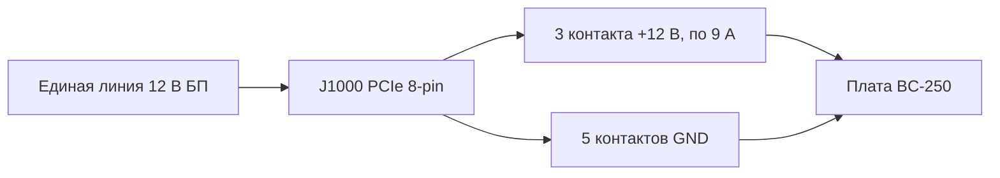

# Блок питания

> **Коротко** — У BC-250 **нет кнопки включения и нет обычного компьютерного разъёма питания**. Плата ест **12 В** через единственный разъём **PCIe 8-pin (6+2)** — тот самый, что идёт на видеокарту, — и потребляет на пике около **~235 Вт** (больше при разгоне). Нужен источник 12 В, способный отдать **~250–300 Вт по одной линии**. Три пути, которыми идёт сообщество: дешёвый **серверный «Flex» БП** (HP 500 Вт, ~$12 на eBay), **промышленный «кирпич»** (Mean Well LOP-300/LOP-500) или **обычный ATX-блок** (просто воткнуть его PCIe-кабель). Два главных убийцы: **старый БП, размазывающий 12 В по слабым линиям**, и **поддельные медно-стальные провода**, которые перегреваются и горят. Используйте настоящую медь, **16 AWG или толще**.

Питание — это **вторая вещь, которую новичок обязан сделать правильно** (после [охлаждения](04-cooling.md)), и та, что с наибольшей вероятностью устроит пожар, если сэкономить на проводах.

---

## Что на самом деле нужно плате

BC-250 — это урезанный кристалл PlayStation 5 на крипто-майнинговой/серверной плате. Она задумана стоять в стойке и получать 12 В, поэтому у неё **нет ни одного удобства обычного ПК**:

- **Нет ATX 24-pin** материнского разъёма.
- **Нет кнопки питания** — плата включается в тот момент, когда приходит 12 В (выключатель самого БП и есть ваша кнопка).
- **Единственная задача БП: дать 12 В при достаточном токе.**

**Цифры по питанию (подтверждённые):**

| Параметр | Значение | Источник |
|----------|----------|----------|
| Входное напряжение | 12 В пост. тока | [hardware.md](https://github.com/mothenjoyer69/bc250-documentation/blob/main/hardware.md) |
| Типичный пик потребления | ~220–235 Вт | по наблюдениям сообщества ([src](https://t.me/c/2424231195/31076)) |
| Разъём | PCIe 8-pin (6+2) | [hardware.md](https://github.com/mothenjoyer69/bc250-documentation/blob/main/hardware.md) · ([src](https://t.me/c/2424231195/14450)) |
| Пиковый ток по 12 В | ~18–20 А типично, запас по конструкции до ~40 А | ([src](https://t.me/c/2424231195/31076)) |

> **«PCIe 8-pin (6+2)»** — это разъём питания видеокарты: шесть контактов в блоке плюс отстёгивающаяся 2-контактная защёлка, так что один кабель работает и как 6-pin, и как 8-pin. **6+2** = 6 фиксированных + 2 съёмных. Это **не** CPU/EPS 8-pin с материнской платы — см. предупреждение ниже.

PCIe 8-pin по стандарту рассчитан на **150 Вт**, а три силовых контакта 12 В на плате (Molex Mini-Fit Jr, по 9 А каждый) безопасно пропускают **до ~324 Вт** ([hardware.md](https://github.com/mothenjoyer69/bc250-documentation/blob/main/hardware.md)). То есть одного 8-pin с запасом хватает на стоке; запас важен только при агрессивном разгоне.

**Сколько мощности БП брать:** цель — **300 Вт и больше по линии 12 В**. 300 Вт дают здоровый запас над пиком ~235 Вт и держат вентилятор БП спокойным; пишут, что серверный Flex на 500 Вт работает почти бесшумно под такой нагрузкой ([src](https://t.me/c/2424231195/31076)). Не берите меньше ~250 Вт «ради экономии» — будете работать на грани, и БП либо зашумит, либо отключится.

---

## ⚠️ Две ошибки, которые убивают платы

Прочитайте этот раздел до того, как что-либо покупать.

### 1. Не путайте PCIe 8-pin с CPU/EPS 8-pin

У вашего ATX-БП есть **два разных 8-pin разъёма**: один для видеокарт (**PCIe**) и один для процессора (**EPS/CPU**, иногда подписан «CPU» или «4+4»). **Они выглядят почти одинаково, но форма контактов и полярность у них зеркальные.** Если впихнуть CPU-разъём в BC-250, **+12 В попадёт туда, где должна быть земля** — можно сжечь всю плату.

> *«Обсуждалось миллиард раз уже, что у нас pcie питальник. Если форма крайнего пина другая, значит у тебя cpu питальник… у него вообще другая полярность, и там натурально плюс, где должен быть минус. Можно сжечь всё к херам.»* ([src](https://t.me/c/2424231195/14450))

У платы **нет проверки по sense-пину**, так что ничто не помешает воткнуть не то. Безопасная привычка: **смотрите на форму защёлки разъёма, а если сомневаетесь — проверьте + и − мультиметром перед включением.**

### 2. Не используйте поддельную «медь» — это пожароопасно

Это самое часто повторяемое предупреждение в чате. Дешёвые готовые переходники и бюджетные «PCIe»-кабели часто сделаны из **меднёной стали (CCS)** или **меднёного алюминия (CCA)** — тонкая медная оболочка поверх стального/алюминиевого сердечника. У стали сопротивление **~в 6 раз выше**, чем у меди, поэтому провод перегревается под нагрузкой и может расплавиться или загореться.

> *«Провод, который был сделан из переходника, под нагрузкой сильно перегрелся. Оказалось, что это не медь, а железо (сталь) с тонким медным покрытием… высокое сопротивление, сильно греется, что может привести к возгоранию. Для надёжной и безопасной работы обязательно используйте провода с полноценными медными жилами сечением не менее 2.5 мм².»* ([src](https://t.me/c/2424231195/108733))

> *«Проверил магнитом 🤣 — стальные нитки. Сопротивление этих стальных «ниток» в 6 раз выше, чем у меди, и о каких 450 ватах может идти речь.»* ([src](https://t.me/c/2424231195/133546))

**Проверяйте до того, как довериться:** магнит липнет к стали, но не к меди. Если разъём или провод магнитится — выбрасывайте кабель.

---

## Сечение провода и разъёмы

Документация платы и чат сходятся на одной безопасной базе:

| Сценарий | Провод | Источник |
|----------|--------|----------|
| Один 8-pin, сток / лёгкий разгон | **16 AWG** медь (~1.3 мм²) | [hardware.md](https://github.com/mothenjoyer69/bc250-documentation/blob/main/hardware.md) |
| Самодельный кабель, нужен запас | **2.5 мм²** (~13 AWG) полная медь | ([src](https://t.me/c/2424231195/108733)) |
| Сильный разгон | толще / **двойное питание** (см. J2000/J2001) | [hardware.md](https://github.com/mothenjoyer69/bc250-documentation/blob/main/hardware.md) |

Цифры не противоречат друг другу — **16 AWG это документированный минимум**; 2.5 мм² — это запас, который один сборщик выбрал после истории с CCS-проводом. **Принципиальное здесь — «настоящая медь», а не точное сечение.** Меньше число AWG = толще провод = безопаснее.

Для контактов разъёма, несущих полный ток, берите рассчитанные на пик: на тяжёлой сборке ориентируются на контакты/провод под **~40 А** и крепят их на болтах или нормальной обжимкой, а не на хлипком вставном контакте ([src](https://t.me/c/2424231195/31076)).

---

## Распиновка 8-pin (J1000)

Если смотреть на главный разъём питания платы — **верхний ряд весь земля, нижний ряд это 12 В, кроме одной земли**. Из [hardware.md](https://github.com/mothenjoyer69/bc250-documentation/blob/main/hardware.md):

```
J1000 (PCIe 8-pin), контакты к вам:

  [ GND  GND  GND  GND ]   ← верхний ряд: вся земля (−)
  [ GND  12V  12V  12V ]   ← нижний ряд: одна земля + три 12 В (+)
```

Чат описывает ту же полярность словами — считая контакты **с 1 по 3 = +12 В, с 4 по 8 = земля**:

> *«С первого по третий пины должны быть +, остальные с четвёртого по восьмой минус… У самой платы проверки по sense нет. Тестер возьмите и посмотрите, где плюс, где минус.»* ([src](https://t.me/c/2424231195/14450))

Как единая линия 12 В распределяется по восьми контактам — три несут +12 В, пять это земля:



Это в точности совпадает со стандартным PCIe 8-pin — *поэтому* PCIe-кабель обычного ATX-БП просто работает. **Если делаете свой кабель — проверьте каждый контакт мультиметром перед первым включением**: ошибки в полярности здесь не прощаются.

### Резервные разъёмы J2000 / J2001 (продвинутое)

Рядом с главным разъёмом стоят два меньших — **J2000** и **J2001**. Это **разъёмы ALLTOP, напрямую взаимозаменяемые с Molex Micro-Fit (444280801) BMI** ([hardware.md](https://github.com/mothenjoyer69/bc250-documentation/blob/main/hardware.md#j2000-and-j2001)). Их распиновка:

```
J2000 / J2001 (одинаковые):
  [ 12V  12V  12V  PGD ]   ← три 12 В + сигнальный пин PGOOD
  [ GND  GND  GND  GND ]
```

В стойке они дают резервное питание от второго БП; пин **PGD (PGOOD)** несёт 5 В, когда подключён второй источник. Для настольной сборки их обычно игнорируют, но при **сильном разгоне** документация советует подавать 12 В через **J2000/J2001 дополнительно к J1000**, чтобы распределить ток ([hardware.md](https://github.com/mothenjoyer69/bc250-documentation/blob/main/hardware.md)). Некоторые идут дальше и **впаивают разъём Micro-Fit/Mini-Fit прямо в площадки 12 В платы** толстой медью, минуя штатный разъём (см. пример с пайкой ниже). Это мод для опытных — легко перегреть площадки, и плата меняется необратимо.

---

## Варианты БП, которыми пользуется сообщество

Практических путей три. Все дают 12 В; различаются ценой, размером, шумом и объёмом проводной работы.

| Вариант | Что это | Цена | Плюсы | Минусы |
|---------|---------|------|-------|--------|
| **Серверный «Flex Slot» БП** | 1U датацентровый «кирпич» HP/Dell и т.п. (напр. HP 500 Вт Platinum) | ~$12–25 б/у | Дёшево, почти неубиваем, огромная единая линия 12 В, очень компактен | Нужна перемычка/резистор для запуска; крошечный вентилятор на 15 000 об/мин воет как турбина, пока его не заменишь; 8-pin паяете сами |
| **Промышленный «кирпич» (Mean Well)** | Закрытый AC→DC источник, единая линия 12 В (LOP-300 = 300 Вт/25 А, LRS-350, LOP-500) | ~$25–45 новый | Новый, чистая единая линия, тихий, по datasheet | 8-pin паяете сами; голые клеммы требуют корпуса |
| **Обычный ATX / Flex-ATX / SFX ПК-БП** | Любой приличный современный компьютерный БП | по-разному | **Без доработок** — его PCIe 8-pin втыкается напрямую; безопаснее всего для новичка | Громоздкий для мини-сборки; избыточная мощность; помните про правило единой линии ниже |

### Вариант A — Серверный Flex БП (самый популярный дешёвый путь)

Любимец сообщества — б/у **HP Flex Slot 500 Вт** — *«купил за какие-то смешные 12$ с eBay… эти блоки почти вечные, запас прочности сильно выше, чем их меняют в дата-центрах, плюс сертификат платина»* ([src](https://t.me/c/2424231195/31076)). PCIe-разъёма у них нет, поэтому его приделывают:

1. **Запуск БП:** замкнуть два коротких пусковых пина (пины 1–2) перемычкой или фиксируемой кнопкой.
2. **Включение линии 12 В:** поставить **резистор ~500 Ом между пином 3 и GND** (широкий левый пин).
3. **Снятие 12 В:** либо припаять PCIe 8-pin прямо к пинам 12 В, либо встроить разъём в корпус — *«но провода и разъём нужны, что бы держали пиковые 40 А»* ([src](https://t.me/c/2424231195/31076)).

Другие проверенные серверные/консольные «кирпичи»: **БП от PlayStation 3 FAT** (32 А / 12 В — *«более чем достаточно и очень стабилен, рекомендую для BC-250»* ([src](https://t.me/c/2424231195/62332)), [src](https://t.me/c/2424231195/102734)), Dell D550E, Juniper JPSU-350 и разные БП от ASIC-майнеров. Есть и плата сообщества для автоматизации включения Flex-БП: [ESP32-BC250-LOP_PSU-PowerON-Xbox](https://github.com/dexikdex/ESP32-BC250-LOP_PSU-PowerON-Xbox) ([src](https://t.me/c/2424231195/142498)).

> **Про вентилятор:** штатный 40-мм вентилятор в этих «кирпичах» может раскручиваться до ~15 000 об/мин и *«устроить звук взлетающего истребителя»*. На практике под скромной нагрузкой BC-250 он остаётся спокойным, и несколько пользователей подтверждают, что он *«вообще не шумный в связке с нашей бцшкой»* ([src](https://t.me/c/2424231195/33455)). Если мешает — поставьте более тихий 40-мм вентилятор с достаточным потоком.

### Вариант B — Промышленный «кирпич» Mean Well

Новый **Mean Well LOP-300-12** (300 Вт, 12 В, 25 А) или **LRS-350** — аккуратный надёжный выбор: единая линия 12 В прямо из datasheet, без игр с разделением линий, и тихо. Есть и более мощный **LOP-500** для максимального запаса под разгон. PCIe 8-pin к его винтовым клеммам всё равно паяете сами, а так как клеммы открыты — стоит убрать в корпус. Страницы товаров из чата: [LOP-300-12 на ChipDip](https://www.chipdip.ru/product/lop-300-12-blok-pitaniya-12v-25a-300vt-mean-well-9001511866) · [LRS-350-12](https://www.chipdip.ru/product/lrs-350-12-blok-pitaniya-12v-29a-348vt-mean-well-9000334417).

### Вариант C — Обычный ПК-БП (проще и безопаснее всего для новичка)

Если у вас уже есть приличный **ATX, Flex-ATX, SFX или TFX** блок питания — готово: **воткните его PCIe 8-pin в плату.** Никаких перемычек, пайки и резисторов. Это вариант с наименьшим риском для того, кто распаковал плату вчера. Чтобы включить БП без материнки, замкните **зелёный провод PS_ON на любую чёрную землю** на 24-pin (стандартный трюк со «скрепкой»). Компактные **Flex-ATX 400 Вт** популярны для маленьких корпусов.

---

## Популярные модели БП, которыми пользуется сообщество

Это конкретные блоки, на которых люди в чате реально собирали, — **выбор сообщества, а не рекомендация производителя.** Какой бы ни был форм-фактор, помните: плате нужна **единая линия 12 В на один PCIe 8-pin (6+2)** — см. [распиновку (J1000)](#распиновка-8-pin-j1000) и [про сечение провода](#сечение-провода-и-разъёмы) выше. Всё, что не в корпусе (Mean Well, серверные «кирпичи», консольные БП), 8-pin паяете сами.

| Модель | Форм-фактор | Примерная мощность | Заметка |
|--------|-------------|--------------------|---------|
| **Mean Well LOP-300(-12)** | Промышленный «кирпич» (откр./закр.) | 300 Вт / 25 А по 12 В | Самый популярный компактный выбор; влезает в самые маленькие корпуса. В нескольких аккуратных сборках ([src](https://t.me/c/2424231195/80841), [src](https://t.me/c/2424231195/78870), [src](https://t.me/c/2424231195/134585)) и перепродают новым ([src](https://t.me/c/2424231195/74703)). |
| **Mean Well LRS-350-12** | Промышленный, открытая рама | 350 Вт / 29 А по 12 В | Вариант на 350 Вт 12 В из того же семейства ([src](https://t.me/c/2424231195/41013)). |
| **Mean Well LOP-500 / LOP-600** | Промышленный «кирпич» | 500–600 Вт | Старшие модели для максимального запаса под разгон; один пользователь заказал LOP-500-12 ([src](https://t.me/c/2424231195/111161)). ⚠ проверьте точные характеристики по datasheet. |
| **Flex ATX** (напр. Seasonic flex, SSP-250SUB) | Flex-ATX серверный «кирпич» | ~250–400 Вт | Распространённый компактный серверный формат. Seasonic flex питал моженный моноблок ([src](https://t.me/c/2424231195/30914)); другая сборка использовала обычный flex-ATX ([src](https://t.me/c/2424231195/84001)). |
| **TFX** (напр. Vinga 400W / TFX-400) | TFX | ~400 Вт | Используют в нескольких сборках — напр. Vinga 400 Вт (TFX-400) при разгоне 3750/2000 ([src](https://t.me/c/2424231195/118771)). |
| **SFX** | SFX | по-разному (~250–600 Вт) | Компактный ПК-формат, втыкается напрямую — напр. SFX-блок в сборке на MasterBox NR200P ([src](https://t.me/c/2424231195/81149)). |
| **БП от PS3 FAT («толстой»)** | Консольный «кирпич» (б/у) | ~32 А по 12 В (класс ~380 Вт) | Дешёвый вариант с разборки, *«более чем достаточно и очень стабилен»* ([src](https://t.me/c/2424231195/62332)); подтверждено долгой эксплуатацией ([src](https://t.me/c/2424231195/78829), [src](https://t.me/c/2424231195/78821)). Подключение: припаяться к площадкам 12 В / 12 V-RTN, замкнуть STBY+5V для запуска ([src](https://t.me/c/2424231195/102734)). **Блоки первых ревизий отдают больше всего мощности** (ранние «толстухи» шли с БП ~400 Вт ([src](https://t.me/c/2424231195/9254))) — ⚠ проверьте свою ревизию, поздние срезаны по мощности. |
| **Huntkey 360W** (БП от ASIC) | «Кирпич» от ASIC-майнера | 360 Вт, каждый кабель по 180 Вт | Б/у блок от асика, *«каждый кабель по 180W»* ([src](https://t.me/c/2424231195/37009)). |
| **Pico-PSU** | Pico (12 В DC-DC) | мало — питает линии, не APU | Упоминают для ультра-компакта / меньшего потребления в простое ([src](https://t.me/c/2424231195/66387), [src](https://t.me/c/2424231195/123545)). ⚠ проверьте — в чате Pico-PSU это преобразователь 12 В→5/3.3 В для материнки в паре с внешним «кирпичом» 12 В, который и делает основную работу ([src](https://t.me/c/2424231195/66064)); это **не** самостоятельный источник 12 В для 8-pin. |

---

## ⚠️ Один параметр БП, на котором попадаются все: одна линия 12 В против нескольких

У старого брендового БП может быть высокая суммарная мощность — и он **всё равно не потянет**, потому что **делит 12 В на несколько слабых линий**, каждая из которых упирается в потолок ниже того, что нужно плате:

> *«Важное замечание для всех любителей купить старый брендовый FSP и тому подобные. Для устройства важна отдача мощности по 12в линии. В старых БП 12в разделены на 2 линии, и каждая из них по отдельности не может предоставить достаточно мощности. Имейте это в виду и если покупаете старичка, то с большим запасом, или современный БП на dc-dc преобразователе, где линия на 12в одна и отдаёт всю мощность блока по ней.»* ([src](https://t.me/c/2424231195/7561))

**Правило:** предпочитайте БП с **единой линией 12 В** (любой современный DC-DC, серверный Flex или Mean Well подходят). Если приходится брать старый многолинейный — убедитесь, что **одна линия** в одиночку покрывает ~250 Вт, либо берите с большим запасом.

---

## Как выглядит реальная сборка

- **Без доработок в корпусе:** плата в маленьком алюминиевом корпусе, запитанная обычным **ATX PCIe 8-pin кабелем** (на оплётке маркировка *PCI-E 16AWG*) — ровно тот путь без модов ([src](https://t.me/c/2424231195/41666)).
- **Зона разъёмов:** крупный план платы с белым **разъёмом вентилятора** и чёрными **разъёмами питания** (область J2000/J2001), к которым будете подключаться ([src](https://t.me/c/2424231195/39395)).
- **Рабочий настольный экземпляр:** плата стоит на своей I/O-планке, светодиоды горят, питается от внешнего «кирпича» 12 В ([src](https://t.me/c/2424231195/27556)).
- **Только для опытных:** разъём **Molex Micro-Fit, впаянный прямо в площадки 12 В платы** толстой медью и обильным припоем — мод «в обход штатного разъёма» под разгон. Эффективно, но не прощает ошибок; беритесь, только если владеете пайкой по ГОСТу ([src](https://t.me/c/2424231195/135782), и [заметки Jack Fisher о разборке](https://t.me/c/2424231195/92185)).

---

## Рекомендуемая стартовая сборка

| Уровень | Делайте так | Почему |
|---------|-------------|--------|
| **Проще / безопаснее всего** | Любой современный **однолинейный ATX/SFX БП**, воткнуть его PCIe 8-pin, замкнуть PS_ON скрепкой | Без модов, правильная полярность гарантирована |
| **Дешевле / компактнее** | Б/у **HP Flex 500 Вт**, перемычка на пины 1–2, 500 Ом с пина 3 на GND, настоящая медь 16 AWG на 8-pin | ~$12, крошечный, огромная линия 12 В |
| **Самая чистая новая сборка** | **Mean Well LOP-300-12** в корпусе, обжатый 16 AWG 8-pin | Новый, тихий, единая линия, по datasheet |

Что бы вы ни выбрали: **единая линия 12 В, ≥300 Вт, настоящая медь ≥16 AWG, полярность PCIe (не CPU), проверка кабелей магнитом.**

---

## Источники

- Аппаратный референс (разъём, распиновка, AWG, J2000/J2001) — [mothenjoyer69/bc250-documentation `hardware.md`](https://github.com/mothenjoyer69/bc250-documentation/blob/main/hardware.md) · [раздел J2000/J2001](https://github.com/mothenjoyer69/bc250-documentation/blob/main/hardware.md#j2000-and-j2001)
- Предупреждение PCIe-vs-CPU и распиновка — https://t.me/c/2424231195/14450
- Одна линия 12 В против нескольких — https://t.me/c/2424231195/7561
- Поддельный медно-стальной провод как пожароопасность — https://t.me/c/2424231195/108733 · https://t.me/c/2424231195/133546
- Полный гайд по HP Flex 500 Вт (запуск, вентилятор, проводка под 40 А) — https://t.me/c/2424231195/31076 · про шум вентилятора — https://t.me/c/2424231195/33455
- БП от PS3 FAT как источник 12 В — https://t.me/c/2424231195/62332 · подключение/запуск https://t.me/c/2424231195/102734 · долгая эксплуатация https://t.me/c/2424231195/78829 · https://t.me/c/2424231195/78821 · БП ~400 Вт у первых ревизий https://t.me/c/2424231195/9254
- Популярные модели БП сообщества — сборки Mean Well LOP-300 https://t.me/c/2424231195/80841 · https://t.me/c/2424231195/78870 · https://t.me/c/2424231195/134585 · https://t.me/c/2424231195/74703 · LRS-350-12 https://t.me/c/2424231195/41013 · LOP-500-12 https://t.me/c/2424231195/111161 · Seasonic/flex-ATX https://t.me/c/2424231195/30914 · https://t.me/c/2424231195/84001 · TFX Vinga 400W https://t.me/c/2424231195/118771 · SFX в NR200P https://t.me/c/2424231195/81149 · Huntkey 360W ASIC https://t.me/c/2424231195/37009 · Pico-PSU https://t.me/c/2424231195/66387 · https://t.me/c/2424231195/66064 · https://t.me/c/2424231195/123545
- Резка/пайка своего 8-pin — https://t.me/c/2424231195/41646 · разбор пайки разъёма напрямую — https://t.me/c/2424231195/92185
- Фото сборок — 8-pin в корпусе https://t.me/c/2424231195/41666 · зона разъёмов https://t.me/c/2424231195/39395 · рабочий экземпляр https://t.me/c/2424231195/27556 · впаянный Micro-Fit https://t.me/c/2424231195/135782
- ESP32 для автозапуска Flex/LOP БП — [dexikdex/ESP32-BC250-LOP_PSU-PowerON-Xbox](https://github.com/dexikdex/ESP32-BC250-LOP_PSU-PowerON-Xbox) ([src](https://t.me/c/2424231195/142498))
- Страницы товаров Mean Well — [LOP-300-12](https://www.chipdip.ru/product/lop-300-12-blok-pitaniya-12v-25a-300vt-mean-well-9001511866) · [LRS-350-12](https://www.chipdip.ru/product/lrs-350-12-blok-pitaniya-12v-29a-348vt-mean-well-9000334417)

> Охлаждение потока воздуха от БП в радиатор платы разобрано в [04-cooling.md](04-cooling.md). Сборки в корпусах с интегрированным БП — в [05-case.md](05-case.md).
