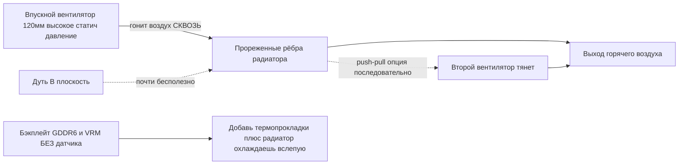

# Охлаждение

> **Коротко** — Стоковый радиатор BC-250 рассчитан на продув в серверной стойке, не на стол. Из коробки уходит в троттлинг. Решение комьюнити: **проредить плотные стоковые рёбра** (спилить/прошлифовать) и поставить **120 мм вентилятор с высоким статическим давлением** (эталон — **Arctic P12 Max/Pro**; Noctua NF-P12 redux — тихая премиум-альтернатива), дующий *сквозь* них. Только это даёт на модифицированной плате **~73 °C в Furmark, 63–65 °C в играх**. Жидкостная AIO и кастом-корпус — следующие уровни.

Охлаждение — **ошибка №1 новичка**, делай это до погони за разгоном.

---

## Почему стокового кулера мало

BC-250 — майнинг/серверная плата. Радиатор **пассивный**, рассчитан на корпус, где громкие вентиляторы гонят воздух насквозь спереди-назад. На столе без продува он прогревается и GPU троттлит. Дуть вентилятором *в плоскость* почти бесполезно — воздух должен идти **сквозь каналы рёбер** и над бэкплейтом (GDDR6 на обороте **без датчика температуры**, охлаждаешь вслепую).

Наблюдения комьюнити: троттлинг ~**85 °C**, краш/ребут ~**90 °C**. Держи под нагрузкой ниже ~80 °C с запасом.

> **Существует три варианта радиатора** (8-рядные и 9-рядные рёбра). Быстро определить: **QR-код рядом с разъёмом PCIe 8-pin** = 9-рядный вариант. Вариант с **меньшим числом более толстых рёбер** может в стоке охлаждать чуть лучше. ([elektricM Cooling](https://elektricm.github.io/amd-bc250-docs/hardware/cooling/))

**Целевые температуры по компонентам** (замеры elektricM, детальнее, чем пороги троттлинга/краша выше):

| Компонент | Простой | Лёгкая нагрузка | Игры | Макс |
|-----------|---------|-----------------|------|------|
| GPU/APU edge | 40–50 °C | 50–60 °C | 65–80 °C | 90 °C |
| CPU (Tctl) | 45–55 °C | 55–65 °C | 70–85 °C | 95 °C |
| Память (обратка) | 40–55 °C | 50–65 °C | 55–70 °C | 80 °C |

Цель — **70–80 °C по GPU в играх**. ([elektricM Cooling](https://elektricm.github.io/amd-bc250-docs/hardware/cooling/))

> **Пиксельные артефакты в играх = перегрев VRAM.** Раз у GDDR6 на обороте нет датчика, этот визуальный глюк и есть твой сигнал тревоги — добавь продув/прокладки на бэкплейт (ниже). ([elektricM Cooling](https://elektricm.github.io/amd-bc250-docs/hardware/cooling/))

> **Кремниевая лотерея — закладывай запас по температуре на каждый чип.** Две физически одинаковые платы, одинаковый корпус и конфиг разгона могут идти с разбросом **5–10 °C**, причём более горячая оставалась горячее даже после замены пасты/прокладок. Не рассчитывай, что чужие температуры совпадут с твоими. ([r/BC250Gaming](https://www.reddit.com/r/BC250Gaming/))



---

## Длительный compute — другой режим (не игровые всплески)

Цели выше рассчитаны на **игры**, где нагрузка идёт всплесками. **Длительный** compute — зацикленный `llama-bench`, долгие прогоны Stable Diffusion, всё, что грузит GPU на десятки минут, **особенно с [разблокировкой 40 CU](09-overclock-undervolt.md)** — куда жёстче и может превысить то, что держит игровой кулер.

elektricM замерил сток-радиатор + **два Arctic P12 Max в push–pull**, 10 мин зацикленного `llama-bench` на **40 CU / 2 ГГц**:

| Метрика | Среднее | Пик |
|---------|---------|-----|
| GPU edge | 89,6 °C | 107 °C |
| Мощность пакета | 136 Вт | 223 Вт |
| CPU | 96,7 °C | 100 °C (TJmax) |
| MOSFET-ы VRM | 57 °C | 58,5 °C |
| Обороты вентилятора | ~2950 об/мин | 2977 об/мин (потолок) |

Производительность просела на **~10 %** за прогон по мере троттлинга пакета. Вывод: **сток-радиатора + двух P12 Max не хватает для длительных 40 CU @ 2 ГГц** — причём **VRM далеко от предела** (57 °C), так что узкое место — *радиатор не успевает отводить тепло*, а не вентиляторы или питание. Два решения: **ограничить GPU-governor на 1500 МГц** (40 CU всё равно даёт ~1,5× по compute, температура держится ~83 °C — можно сколько угодно на двух P12 Max), либо **поменять радиатор** (больше площади рёбер). Для **сток-игр на 24 CU** двух P12 Max хватает с запасом; стена появляется только под длительным compute на всех CU. ([elektricM Cooling](https://elektricm.github.io/amd-bc250-docs/hardware/cooling/))

---

## Путь A — Воздух (самый популярный, дешёвый)

Так живёт большинство чата.

### 1. Проредить/выровнять рёбра
Стоковые рёбра слишком плотные и неровные. Открывают каналы под воздух:

- **Эксцентриковая (орбитальная) шлифмашина** — быстрее всего, за минуты, лучший результат. ([src](https://t.me/c/2424231195/31571))
- **Наждачка вручную** — 60 зерно, затем 240, ~3–4 ч + 2 ч за два дня. Работает, но долго. ([src](https://t.me/c/2424231195/50330))
- **Ножницы** — грубый метод «чекрыжить», на крайняк; результат худший. ([src](https://t.me/c/2424231195/41252))
- **Ножницы + линейка-направляющая (чистый вариант)** — заводи канцелярские/парикмахерские ножницы в зазор между рёбрами, **прислонив линейку к лезвию под углом как направляющую**; перочинный нож «консервным» движением работает не хуже. Оговорка: у некоторых вариантов платы **зазора для старта лезвия нет** — поддень одно ребро отвёрткой/пинцетом или прорежь стартовую щель **маленьким отрезным диском Dremel**. Лезвия шире прорезей между рёбрами могут повредить радиатор. ([r/BC250Gaming](https://www.reddit.com/r/BC250Gaming/))
- Гнутые рёбра выпрямлять **плоским пинцетом + пассатижами**. ([src](https://t.me/c/2424231195/30670))
- **Отрывать рёбра руками** — elektricM отмечает, что мягкие алюминиевые рёбра можно **чисто оторвать/отломить руками** (радиатор снят с платы), не создавая стружку, как режущий инструмент. Дольше, но без мусора. ([elektricM Cooling](https://elektricm.github.io/amd-bc250-docs/hardware/cooling/))
- **«Scooper by Justin»** — **печатный на 3D-принтере инструмент специально под прижим/раскрытие рёбер радиатора BC-250** ([Printables 1282906](https://www.printables.com/model/1282906-bc-250-scooper)). Безопаснее голой отвёртки: не даёт надавить слишком сильно и поцарапать **основание** радиатора между рёбрами. ([тред сообщества r/linux_gaming](https://www.reddit.com/r/linux_gaming/comments/1nvsgji/)) Заранее настройся: один владелец сообщил, что печатный инструмент-«гребёнка/совок» **сломался на 2-м использовании** и натёр руки. ([r/BC250Gaming](https://www.reddit.com/r/BC250Gaming/))
- **Хобби-пассатижи — метод «отслаивания»** — захвати **верх** рёбер маленькими хобби-пассатижами и отслаивай их, **используя память металла как точку слома**, чтобы они чисто переламывались на сгибе, а не отрывали основание. Малопыльная альтернатива резке. ([тред сообщества r/linux_gaming](https://www.reddit.com/r/linux_gaming/comments/1nvsgji/))

Примерный выигрыш по температуре (elektricM): **выпрямление гнутых рёбер ~5–10 °C**, **удаление центральных рёбер ~10–15 °C** (необратимо — хороший шрауд даёт схожее без резки), **свежая паста ~5–10 °C**, если старая засохла. ([elektricM Cooling](https://elektricm.github.io/amd-bc250-docs/hardware/cooling/))

> ⚠ **Сначала сними радиатор с платы** (или полностью закрой/защити плату и кристалл) перед шлифовкой/спиливанием, и **счисти всю металлическую пыль до сборки**. Токопроводящая стружка, осевшая на плату, может закоротить её и **убить плату** — в чате такое уже случалось.

<p align="center">
  <br>
  <sub>Фото: сообщество AMD BC-250 · <a href="https://t.me/c/2424231195/31571">источник</a></sub>
</p>

### 2. Поставить нормальный вентилятор
**120 мм вентилятор высокого статического давления**, гонит сквозь рёбра. Эталонный выбор — **Arctic P12 Max (или P12 Pro)**: самое высокое статическое давление (~6,9 мм H₂O), выбор комьюнити + elektricM под этот плотный радиатор. **Noctua NF-P12 redux** — тихая премиум-альтернатива, и показала эталонный результат **max 73 °C в Furmark, 63–65 °C в играх** ([src](https://t.me/c/2424231195/42843)).

**Конкретные вентиляторы со спеками** (elektricM — выбирай по *статическому давлению*, не по airflow):

| Вентилятор | Размер | Макс об/мин | Статич. давление | Airflow | Шум | Темп. в играх |
|------------|--------|-------------|------------------|---------|-----|---------------|
| **Arctic P12 Max** | 120 мм | 3300 | **6,9 мм H₂O** | 73,3 CFM | 52,5 дБ(А) | 65–75 °C |
| **Arctic P12 Pro** | 120 мм | 2100 | **6,9 мм H₂O** | 68,9 CFM | 37,8 дБ(А) | 65–75 °C |
| Arctic P14 PWM | 140 мм | 1700 | 2,40 мм H₂O | 72,8 CFM | 38 дБ(А) | 70–80 °C |
| Noctua NF-A12x25 | 120 мм | 2000 | 2,34 мм H₂O | 60,1 CFM | 22,6 дБ(А) | 70–85 °C |

Самый рекомендуемый выбор у elektricM — **Arctic P12 Max / P12 Pro**: ~6,9 мм H₂O статического давления против 2,34 у Noctua, и заметно дешевле; P12 Pro тише и доступнее. Премиальная Noctua ещё тише, но по температурам догоняет Arctic только на бóльших оборотах. ([elektricM Cooling](https://elektricm.github.io/amd-bc250-docs/hardware/cooling/))

> **Эталон против тихой альтернативы.** Здесь эталонный вентилятор — **Arctic P12 Max/Pro**: самое высокое статическое давление (~6,9 мм H₂O), самый дешёвый, выбор комьюнити + elektricM под этот плотный радиатор. **Noctua NF-P12 redux** — тихая премиум-альтернатива (результат чата 73 °C в Furmark), которая догоняет Arctic по температурам только на бóльших оборотах. Бери Arctic ради лучшей цены/производительности, Noctua — если важнее тишина.

Используй **печатный шрауд/переходник**, чтобы вентилятор прижимался к радиатору, а не сливал воздух мимо. STL комьюнити:
- `Fan_Shroud_Single_120mm.stl`, `Fan_Shroud_Dual_120mm.stl`, `Fan_Shroud_Single_140mm.stl`, `Twin_120mm_Fan_Shroud.stl`
- `BC250_FanAdapter_120mm.step`, `bc250 cooler mount.stl`, `cooler adapter v3.0.stl`

> **Почему статическое давление, а не airflow?** Плотные рёбра = высокое сопротивление. «Корпусной» вентилятор с высоким airflow глохнет об них; вентилятор с высоким статическим давлением (≥3 мм H₂O; Noctua P12, Arctic P12) реально продавливает воздух *сквозь*. Для очень плотных рёбер два вентилятора в **push–pull (последовательно)** удваивают статическое давление — это правильный ход, а не два рядом.

**Крепёж:** лучше всего печатный шрауд, но **стяжки (zip-ties)** к радиатору тоже работают, а **картонный/пенопластовый короб**, примотанный между вентилятором и рёбрами, — годный бесплатный запасной вариант (некрасиво и недолговечно, но герметизирует воздушный тракт). ([elektricM Cooling](https://elektricm.github.io/amd-bc250-docs/hardware/cooling/))

> ⚠ **Не сверли/не вкручивай вентиляторы прямо в рёбра.** Алюминий мягкий, рёбра тонкие — вкручивание ломает пакет рёбер и ухудшает охлаждение. Используй стяжки или печатный шрауд. ([elektricM Cooling](https://elektricm.github.io/amd-bc250-docs/hardware/cooling/))

### Альтернатива: оставить стоковые рёбра (корпус push-pull без резки)
Резать рёбра необязательно. **penzoiders** спроектировал корпус ([MakerWorld, исходник FreeCAD](https://makerworld.com/models/2505974)), который **не режет** радиатор: он гонит воздух **push-pull-вентиляторами с высоким статическим давлением** сквозь **стоковые, не модифицированные рёбра**, плюс **двухкамерный перепад давления** заодно охлаждает бэкплейт (радиаторы 5 мм + термопрокладки; подходят переиспользованные радиаторы от NVMe). Настройка, которая держится холодной: **CPU 3800 МГц / 1050 мВ, GPU 2100 МГц / 950 мВ** → параллельный Furmark + `stress-ng` держится **ниже 85 °C**; в играх **~75 °C примерно при 50 % оборотов** (кривая CoolerControl), «почти не слышно». ([r/BC250Gaming](https://www.reddit.com/r/BC250Gaming/))

## Путь B — Жидкостная AIO

120 мм AIO на кристалл через переходник-крепление. Тихо и холодно, но больше деталей и денег. Популярны дешёвые AIO (напр. aigo). ([пример src](https://t.me/c/2424231195/19336))

<p align="center">
  <br>
  <sub>Фото: сообщество AMD BC-250 · <a href="https://t.me/c/2424231195/19336">источник</a></sub>
</p>

**Именованное скачиваемое крепление AIO — NexGen3D** ([Printables 1554003](https://www.printables.com/model/1554003), печать в ABS-GF или PETG). Проверено с **240 мм AIO Thermalright**: GPU **~50 °C @ 2000 МГц**, CPU **макс 60 °C**. ([r/BC250Gaming](https://www.reddit.com/r/BC250Gaming/))

### Профили разгона на жидкости
С AIO можно давить заметно сильнее. **NexGen3D**, замер по розетке (burn-комбо Furmark Vulkan + `stress-ng --matrix 0 -t 60m`):

| Профиль | CPU | GPU | Макс темп в burn | Мощность из розетки | Заметка |
|---------|-----|-----|------------------|---------------------|---------|
| 1 | 4000 МГц | 2400 МГц | ~65 °C | >350 Вт | «мёртвая тишина» |
| 2 | 4100 МГц | 2450 МГц | ~75 °C | <400 Вт | горячее, громче |

Обычные игры в 1080p идут на **10–15 °C ниже** этих burn-температур и **под 250 Вт** на профиле 1. **Схему продува стоит скопировать:** 120 мм вентиляторы **выдувают наружу сквозь радиатор**, что подтягивает свежий внешний воздух через **VRM / БП / бэкплейт VRAM**; отдельный **80 мм вентилятор (Arctic P8 Max)** охлаждает VRM видеоядра — это и есть ответ на предупреждение выше «VRM/VRAM без датчиков всё равно нужен продув». ([r/BC250Gaming](https://www.reddit.com/r/BC250Gaming/))

## Путь C — Улитка (blower) — не рекомендуется

Снятые с видях улитки — ранний эксперимент. Громко для такого результата; перешли на Путь A. ([src](https://t.me/c/2424231195/100086))

## Путь D — Башенный кулер (для продвинутых)

Некоторые ставят **башенный кулер под AM4** (напр. **Thermalright Peerless Assassin** или другие башни AM4/AM5) на кристалл — отличное тихое охлаждение на готовом железе. Подвох: нужно **поставить его через крепление**, а высокая башня может **перекрыть слот M.2 или другие компоненты**. Не для новичка. Изготавливать с нуля больше не обязательно — есть два опубликованных печатных крепления:

- **Переходник под десктопный кулер AM4/AM5** ([MakerWorld 2596083](https://makerworld.com/en/models/2596083), исходник FreeCAD в комплекте). Ставит обычный десктопный кулер AM4/AM5 на BC-250. Крепёж: **болты M5 + гайки, без стоек** (автор отмечает, что идеален был бы M4, но M5 сел плотно). Печать в **ABS, PETG или ASA**. Проверено на **CPU 3,95 ГГц / 1,150 В, GPU 2200 МГц / 1000 мВ, температуры не выше 80 °C**. Использованные кулеры: низкопрофильный **класса AXP90** (комментатор взял **AXP120**), и даже **AMD Wraith Spire** обошёл стоковый радиатор. ([r/BC250Gaming](https://www.reddit.com/r/BC250Gaming/))
- **Крепление под Thermalright AXP90-X53** ([Printables 1694793](https://www.printables.com/model/1694793)). Резьбовые втулки **впаяны снизу** печатного крепления, чтобы **переиспользовать родные подпружиненные винты стокового радиатора**; болты с потайной полукруглой головкой идут снизу и зенкуются, а у крепления есть **зазор 0,5 мм под распоркой** для компонентов платы. Спроектировано в Fusion 360, **печать в PETG** (PLA при таких температурах размягчается). Результат: **65–67 °C под полной нагрузкой @ 2150 МГц, 1080p**, очень тихо (медный кулер в паре со 120 мм Arctic P12 Pro). Замеренная высота стека — **54 мм от PCB до верха 15 мм вентилятора** — полезно для подгонки в корпус. Существуют также **набор вариантов на 3 толщины** и версия под **AXP120-X67**. ([r/BC250Gaming](https://www.reddit.com/r/BC250Gaming/))

---

## Управление скоростью вентилятора (софт)

Когда вентилятор прикручен, его PWM управляется через Super I/O чип платы **Nuvoton NCT6686D** — но **важно, какой драйвер загружен** ([спецификация железа elektricM](https://elektricm.github.io/amd-bc250-docs/)):

- **Только чтение датчиков** (обороты вентилятора, температуры): встроенный в ядро модуль **`nct6683`**, загружается с `force=true`. Он отдаёт показания, но **не умеет писать PWM**, так что вентилятор остаётся на том, что выставил BIOS/прошивка.
- **Чтение + запись PWM** (реально задать скорость): используй внеядерный модуль **`nct6687`** из **[Fred78290/nct6687d](https://github.com/Fred78290/nct6687d)**, тоже с `force=true`. Именно его собирай, если нужны кривые вентилятора / ручное управление, а не только мониторинг.

```bash
# только мониторинг (встроенный в ядро):
echo 'options nct6683 force=true' | sudo tee /etc/modprobe.d/nct6683.conf
# управление PWM (DKMS из Fred78290/nct6687d):
echo 'options nct6687 force=true' | sudo tee /etc/modprobe.d/nct6687.conf
```

> Не грузи оба — выбери `nct6683` для чтения датчиков или `nct6687` для чтения+записи. Разводка датчиков (`CPU_FAN1` / `J4003`) и нумерация вентиляторов BIOS↔Linux — в шаге проверки в [06-linux.md](06-linux.md).

**Какой разъём — главный вентилятор?** По elektricM, кулер обычно на разъёме **Pump Fan** = **`fan2` / `pwm2`** в sysfs; `CPU Fan` (`fan1`) и `System Fan` (`fan3`+) обычно не используются. Перед записью PWM включи ручной режим (`echo 1 > .../pwm2_enable`, затем значение 0–255 в `.../pwm2`). Нумерация hwmon может меняться между перезагрузками — проверяй `cat /sys/class/hwmon/hwmon*/name`. ([elektricM Cooling](https://elektricm.github.io/amd-bc250-docs/hardware/cooling/))

**Кривые вентилятора в GUI — CoolerControl.** Когда `nct6687` загружен, **CoolerControl** даёт графические кривые: выбери устройство **nct6686**, построй кривую на **pwm2** с источником **k10temp Tctl**. Установка: `ujust install-coolercontrol` (Bazzite), copr `codifryed/CoolerControl` (Fedora) или `coolercontrol` из AUR (Arch); веб-интерфейс на `https://localhost:11987`. ([elektricM Cooling](https://elektricm.github.io/amd-bc250-docs/hardware/cooling/))

**Режимы вентилятора в BIOS** (если не управляешь из ОС): **Default** держит вентиляторы на **минимуме 40 %** (слишком мало — не рекомендуется), **Full Speed** — 100 % постоянно (громко, но безопасно), **Customize** — скорости по порогам. ([elektricM Cooling](https://elektricm.github.io/amd-bc250-docs/hardware/cooling/))

> ⚠ **Не запускай BIOS Customize и CoolerControl одновременно** — они дерутся за управление PWM. Выбери что-то одно. ([elektricM Cooling](https://elektricm.github.io/amd-bc250-docs/hardware/cooling/))

---

## Термоинтерфейс (паста, прокладки, фазовый переход, жидкий металл)

Какой бы вентилятор/радиатор ты ни ставил, **термоинтерфейс (TIM)** между кристаллом и радиатором — и между обратной стороной платы и любым радиатором на бэкплейте — стоит сделать правильно. У кристалла BC-250 **высокая плотность тепла**, так что хороший TIM — это бесплатные пара-тройка градусов.

> **Уже сама замена стоковой пасты помогает.** Один владелец поменял заводскую пасту через год — температура под нагрузкой упала на **~4–5 °C**, всё остальное без изменений. ([src](https://t.me/c/2424231195/88565))

### Пасты, которые работают
- **Arctic MX-6** — обычная топовая паста. В одном корпусном сборе держала **87–88 °C в Furmark**; тот же владелец отметил, что PTM7950 снял бы ещё ~4 °C. ([src](https://t.me/c/2424231195/30211))
- **Стоковая паста + стоковые прокладки** — задокументированный базовый уровень: ~**76 °C** после 10 мин нагрузки, ~**55 °C** в простое (до работы по рёбрам/вентилятору). ([src](https://t.me/c/2424231195/22992))
- Другие пасты, которые elektricM считает годными: **Arctic MX-4** (бюджет/цена), **Thermal Grizzly Kryonaut** (премиум), **Noctua NT-H1** (надёжная), **Thermalright TFX** (бюджет). На б/у-платах паста **часто засохшая** — одна замена даёт **~5–10 °C**. Наноси каплю с горошину на кристалл, ставь равномерно, тяни винты **крест-накрест**. ([elektricM Cooling](https://elektricm.github.io/amd-bc250-docs/hardware/cooling/))

### PTM7950 — выбор комьюнити (рекомендуется)
**PTM7950** — это **прокладка с фазовым переходом** (графитовая/фазовая плёнка Honeywell). При комнатной температуре — тонкий твёрдый лист; под нагрузкой (~45–55 °C) размягчается и растекается в слой толщиной в микроны, а потом остаётся на месте. Она **не выдавливается** и не сохнет как паста — именно то, что нужно под горячим кристаллом с тепловыми циклами, так что наносишь один раз и забываешь. Прямая формулировка из чата: *«PTM7950 и не ебите муму»* ([src](https://t.me/c/2424231195/101582)); фазовый переход — общая рекомендация ([src](https://t.me/c/2424231195/61511)).

**Как наносить:**
1. Обезжирь кристалл и базу радиатора (изопропил), дай высохнуть.
2. Вырежи квадрат PTM7950 под размер кристалла — кусок **~26×30 мм** покрывает кристалл BC-250 ([src](https://t.me/c/2424231195/125748)).
3. Сними одну защитную плёнку, положи прокладку на кристалл, сними вторую плёнку.
4. Поставь радиатор и затяни равномерно. **Не размазывать** — первый тепловой цикл сделает всё сам. Лучшие температуры — после нескольких циклов нагрузка/простой («прогрев»).

Эталонный корпусный сбор на PTM7950 (Honeywell, 26×30) плюс радиатор на бэкплейте: пик **~84 °C за час, 66–71 °C в играх** при CPU 3850 МГц / GPU 2100 МГц. ([src](https://t.me/c/2424231195/125748))

### Бэкплейт и прокладки GDDR6 (охлаждаешь обратку вслепую)
**GDDR6 и VRM на обороте платы без датчика температуры** — охлаждаешь их вслепую. Поставь **радиатор на бэкплейт** в связке с **термопрокладками**, чтобы теплу с обратной стороны было куда уходить. ([src](https://t.me/c/2424231195/125748))

Заявленные толщины прокладок (поделились в чате, реакция «сохранил»):
- **VRM: 1 мм**
- **GDDR6: 2 мм** ([src](https://t.me/c/2424231195/121181))

> ⚠ **verify** — толщины зависят от зазора до *твоего* конкретного бэкплейта/радиатора. Проверь замером зазора (или тестом пластилином/«жвачкой») перед покупкой пачки прокладок.

elektricM даёт **слегка иную схему прокладок** для охлаждения самой памяти: **1,5 мм на *лицевой* стороне платы, 2,0 мм на *обороте***, затем алюминиевая пластина/радиатор снизу. У платы используй **только непроводящие** прокладки (никакой проводящей пасты/прокладок, способных закоротить компоненты). Бренды прокладок: **Thermalright Odyssey** (высокая производительность), **Arctic Thermal Pad** (цена), **Gelid GP-Ultimate** (премиум). ([elektricM Cooling](https://elektricm.github.io/amd-bc250-docs/hardware/cooling/))

> ⚠ **verify (толщины прокладок различаются у источников)** — наши цифры из чата: **VRM 1 мм / GDDR6 2 мм (оборот)**; elektricM указывает **1,5 мм лицо / 2,0 мм оборот** для чипов памяти. Разные сборки, разные зазоры — **меряй свой зазор**, а не верь вслепую ни одной цифре.

> **Краши/нестабильность через 30–60 мин игры** (часто с пиксельными артефактами) — классический признак **перегрева памяти**. Решения: прокладки + пластина снизу, вентилятор на бэкплейт, лучше продув корпуса или временно **уменьшить разбивку VRAM** (напр. 4 ГБ → 512 МБ), чтобы снизить нагрев памяти. ([elektricM Cooling](https://elektricm.github.io/amd-bc250-docs/hardware/cooling/))

### Жидкий металл — здесь в целом НЕ рекомендуется
Жидкий металл (ЖМ) всплывает, потому что в PS5 (APU того же семейства) его мажут ([src](https://t.me/c/2424231195/18105)), и по чистой производительности он чуть лучше пасты/PTM ([src](https://t.me/c/2424231195/124112)). Про него спрашивали и пробовали на BC-250 ([src](https://t.me/c/2424231195/18098), [src](https://t.me/c/2424231195/77180)).

**Но на этой плате это плохой выбор:**
- ЖМ **электропроводен**. Кристалл BC-250 стоит вплотную к **плотным GDDR6 и VRM**; капля, ушедшая с кристалла, закоротит плату (та же опасность «проводящее рядом с памятью убивает», что и в предупреждении про металлическую стружку выше).
- Он **выдавливается / требует переноса примерно раз в год** и разъедает голый алюминий — даже сторонник PTM7950 бросил ЖМ на своём железе именно из-за этой возни, перейдя на PTM7950 / KryoSheet. ([src](https://t.me/c/2424231195/69688))
- «С жидким металлом не каждый возьмётся работать.» ([src](https://t.me/c/2424231195/106787))

**Итог:** **PTM7950 — безопасный высокопроизводительный выбор** — ~99 % выгоды без риска короткого замыкания и обслуживания. ЖМ оставь тем, кто точно знает, что делает.

---

## Как тестировать охлаждение (метод комьюнити, закреп)

Из закреплённой процедуры ([src](https://t.me/c/2424231195/108407)):

1. **Нагрузка GPU:** Furmark (Vulkan / «Furmark VK»).
2. **Параллельно CPU:** добавь CPU-бенч (cpu-x) или нагрузку `stress`/`pipx` — APU делит один радиатор, тестируй оба вместе.
   - Этих утилит (Furmark, OCCT, cpu-x, `stress`) **нет в свежей системе Linux** — сначала поставь их через пакетный менеджер или Flatpak.
3. **Тестируй под своим разгоном**, не на стоке — 1500 MHz слабо; **2000 MHz ≈ +30 % FPS** и то, на чём реально будешь играть, под это и охлаждай.
4. Следи за температурой; перешёл ~85 °C — троттлинг, добавь вентилятор/шрауд/работу по рёбрам.

В топике также закреплено короткое видео простейшего метода. ([src](https://t.me/c/2424231195/100024))

---

## Рекомендованный старт

| Уровень | Что сделать | Ожидать |
|------|---------|--------|
| Минимум | Прошлифовать рёбра (орбиталка) + 1× Arctic P12 Max/Pro (или Noctua NF-P12) + печатный шрауд | ~73 °C Furmark |
| Лучше | Push–pull (2× P12) через шрауд | ниже, тише при той же темп. |
| Макс | 120 мм AIO на переходнике | холоднее всего, больше сборки |

---

## Источники

- Закреп. метод теста — https://t.me/c/2424231195/108407 · видео — https://t.me/c/2424231195/100024
- Инструмент по рёбрам — https://t.me/c/2424231195/31571 · https://t.me/c/2424231195/30670 · https://t.me/c/2424231195/50330 · инструмент «Scooper by Justin» ([Printables 1282906](https://www.printables.com/model/1282906-bc-250-scooper)) + метод отслаивания хобби-пассатижами — [тред r/linux_gaming](https://www.reddit.com/r/linux_gaming/comments/1nvsgji/)
- Результат Noctua P12 — https://t.me/c/2424231195/42843
- Пример AIO — https://t.me/c/2424231195/19336
- Термоинтерфейс — замена пасты −4–5 °C https://t.me/c/2424231195/88565 · MX-6 https://t.me/c/2424231195/30211 · сток-базлайн https://t.me/c/2424231195/22992 · PTM7950 https://t.me/c/2424231195/101582 · https://t.me/c/2424231195/61511 · сбор на PTM7950 + бэкплейт https://t.me/c/2424231195/125748 · толщина прокладок https://t.me/c/2424231195/121181 · жидкий металл https://t.me/c/2424231195/18098 · https://t.me/c/2424231195/69688
- Гайд по охлаждению elektricM (варианты радиатора, таблица температур по компонентам, данные по длительной нагрузке, спеки вентиляторов, CoolerControl/режимы BIOS, башенный кулер, схема прокладок) — https://elektricm.github.io/amd-bc250-docs/hardware/cooling/
- r/BC250Gaming (отчёты сообщества: разброс кремниевой лотереи, метод рёбер «ножницы+линейка», поломка инструмента-гребёнки, корпус push-pull без резки, крепление AIO + результат 240 мм, профили разгона на жидкости, крепления AM4/AM5 + AXP90-X53) — https://www.reddit.com/r/BC250Gaming/ · переходник под кулер AM4/AM5 [MakerWorld 2596083](https://makerworld.com/en/models/2596083) · крепление AXP90-X53 [Printables 1694793](https://www.printables.com/model/1694793) · крепление AIO NexGen3D [Printables 1554003](https://www.printables.com/model/1554003) · корпус push-pull без резки [MakerWorld 2505974](https://makerworld.com/models/2505974)
- Референс по железу — [mothenjoyer69/bc250-documentation `hardware.md`](https://github.com/mothenjoyer69/bc250-documentation/blob/main/hardware.md)
- Корпуса/переходники с охлаждением — [onemorecap/bc-250-sleeve-adapter](https://github.com/onemorecap/bc-250-sleeve-adapter)

> STL шраудов и переходников — каталог в [05-case.md](05-case.md), зеркала в `assets/stl/`.
