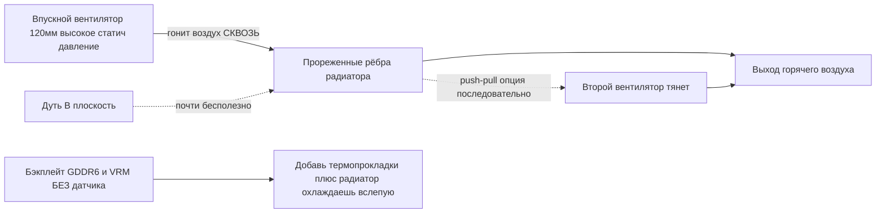

# Охлаждение

> **Коротко** — Стоковый радиатор BC-250 рассчитан на продув в серверной стойке, не на стол. Из коробки уходит в троттлинг. Решение комьюнити: **проредить плотные стоковые рёбра** (спилить/прошлифовать) и поставить **120 мм вентилятор с высоким статическим давлением** (эталон — Noctua NF-P12), дующий *сквозь* них. Только это даёт на модифицированной плате **~73 °C в Furmark, 63–65 °C в играх**. Жидкостная AIO и кастом-корпус — следующие уровни.

Охлаждение — **ошибка №1 новичка**, делай это до погони за разгоном.

---

## Почему стокового кулера мало

BC-250 — майнинг/серверная плата. Радиатор **пассивный**, рассчитан на корпус, где громкие вентиляторы гонят воздух насквозь спереди-назад. На столе без продува он прогревается и GPU троттлит. Дуть вентилятором *в плоскость* почти бесполезно — воздух должен идти **сквозь каналы рёбер** и над бэкплейтом (GDDR6 на обороте **без датчика температуры**, охлаждаешь вслепую).

Наблюдения комьюнити: троттлинг ~**85 °C**, краш/ребут ~**90 °C**. Держи под нагрузкой ниже ~80 °C с запасом.

---

## Путь A — Воздух (самый популярный, дешёвый)

Так живёт большинство чата.

### 1. Проредить/выровнять рёбра
Стоковые рёбра слишком плотные и неровные. Открывают каналы под воздух:

- **Эксцентриковая (орбитальная) шлифмашина** — быстрее всего, за минуты, лучший результат. ([src](https://t.me/c/2424231195/31571))
- **Наждачка вручную** — 60 зерно, затем 240, ~3–4 ч + 2 ч за два дня. Работает, но долго. ([src](https://t.me/c/2424231195/50330))
- **Ножницы** — грубый метод «чекрыжить», на крайняк; результат худший. ([src](https://t.me/c/2424231195/41252))
- Гнутые рёбра выпрямлять **плоским пинцетом + пассатижами**. ([src](https://t.me/c/2424231195/30670))

> ⚠ **Сначала сними радиатор с платы** (или полностью закрой/защити плату и кристалл) перед шлифовкой/спиливанием, и **счисти всю металлическую пыль до сборки**. Токопроводящая стружка, осевшая на плату, может закоротить её и **убить плату** — в чате такое уже случалось.

   
  Фото: сообщество AMD BC-250 · <a href="https://t.me/c/2424231195/31571">источник</a>

### 2. Поставить нормальный вентилятор
**120 мм вентилятор высокого статического давления**, гонит сквозь рёбра. Эталон: **Noctua NF-P12 redux → max 73 °C в Furmark, 63–65 °C в играх.** ([src](https://t.me/c/2424231195/42843))

Используй **печатный шрауд/переходник**, чтобы вентилятор прижимался к радиатору, а не сливал воздух мимо. STL комьюнити:
- `Fan_Shroud_Single_120mm.stl`, `Fan_Shroud_Dual_120mm.stl`, `Fan_Shroud_Single_140mm.stl`, `Twin_120mm_Fan_Shroud.stl`
- `BC250_FanAdapter_120mm.step`, `bc250 cooler mount.stl`, `cooler adapter v3.0.stl`

> **Почему статическое давление, а не airflow?** Плотные рёбра = высокое сопротивление. «Корпусной» вентилятор с высоким airflow глохнет об них; вентилятор с высоким статическим давлением (≥3 мм H₂O; Noctua P12, Arctic P12) реально продавливает воздух *сквозь*. Для очень плотных рёбер два вентилятора в **push–pull (последовательно)** удваивают статическое давление — это правильный ход, а не два рядом.

## Путь B — Жидкостная AIO

120 мм AIO на кристалл через переходник-крепление. Тихо и холодно, но больше деталей и денег. Популярны дешёвые AIO (напр. aigo). ([пример src](https://t.me/c/2424231195/19336))

   
  Фото: сообщество AMD BC-250 · <a href="https://t.me/c/2424231195/19336">источник</a>

## Путь C — Улитка (blower) — не рекомендуется

Снятые с видях улитки — ранний эксперимент. Громко для такого результата; перешли на Путь A. ([src](https://t.me/c/2424231195/100086))

---

## Термоинтерфейс (паста, прокладки, фазовый переход, жидкий металл)

Какой бы вентилятор/радиатор ты ни ставил, **термоинтерфейс (TIM)** между кристаллом и радиатором — и между обратной стороной платы и любым радиатором на бэкплейте — стоит сделать правильно. У кристалла BC-250 **высокая плотность тепла**, так что хороший TIM — это бесплатные пара-тройка градусов.

> **Уже сама замена стоковой пасты помогает.** Один владелец поменял заводскую пасту через год — температура под нагрузкой упала на **~4–5 °C**, всё остальное без изменений. ([src](https://t.me/c/2424231195/88565))

### Пасты, которые работают
- **Arctic MX-6** — обычная топовая паста. В одном корпусном сборе держала **87–88 °C в Furmark**; тот же владелец отметил, что PTM7950 снял бы ещё ~4 °C. ([src](https://t.me/c/2424231195/30211))
- **Стоковая паста + стоковые прокладки** — задокументированный базовый уровень: ~**76 °C** после 10 мин нагрузки, ~**55 °C** в простое (до работы по рёбрам/вентилятору). ([src](https://t.me/c/2424231195/22992))

### PTM7950 — выбор комьюнити (рекомендуется)
**PTM7950** — это **прокладка с фазовым переходом** (графитовая/фазовая плёнка Honeywell). При комнатной температуре — тонкий твёрдый лист; под нагрузкой (~45–55 °C) размягчается и растекается в слой толщиной в микроны, а потом остаётся на месте. Она **не выдавливается** и не сохнет как паста — именно то, что нужно под горячим кристаллом с тепловыми циклами, так что наносишь один раз и забываешь. Прямая формулировка из чата: *«PTM7950 и не ебите муму»* ([src](https://t.me/c/2424231195/101582)); фазовый переход — общая рекомендация ([src](https://t.me/c/2424231195/61511)).

**Как наносить:**
1. Обезжирь кристалл и базу радиатора (изопропил), дай высохнуть.
2. Вырежи квадрат PTM7950 под размер кристалла — кусок **~26×30 мм** покрывает кристалл BC-250 ([src](https://t.me/c/2424231195/125748)).
3. Сними одну защитную плёнку, положи прокладку на кристалл, сними вторую плёнку.
4. Поставь радиатор и затяни равномерно. **Не размазывать** — первый тепловой цикл сделает всё сам. Лучшие температуры — после нескольких циклов нагрузка/простой («прогрев»).

Эталонный корпусный сбор на PTM7950 (Honeywell, 26×30) плюс радиатор на бэкплейте: пик **~84 °C за час, 66–71 °C в играх** при CPU 3850 МГц / GPU 2100 МГц. ([src](https://t.me/c/2424231195/125748))

### Бэкплейт и прокладки GDDR6 (охлаждаешь обратку вслепую)
**GDDR6 и VRM на обороте платы без датчика температуры** — охлаждаешь их вслепую. Поставь **радиатор на бэкплейт** в связке с **термопрокладками**, чтобы теплу с обратной стороны было куда уходить. ([src](https://t.me/c/2424231195/125748))

Заявленные толщины прокладок (поделились в чате, реакция «сохранил»):
- **VRM: 1 мм**
- **GDDR6: 2 мм** ([src](https://t.me/c/2424231195/121181))

> ⚠ **verify** — толщины зависят от зазора до *твоего* конкретного бэкплейта/радиатора. Проверь замером зазора (или тестом пластилином/«жвачкой») перед покупкой пачки прокладок.

### Жидкий металл — здесь в целом НЕ рекомендуется
Жидкий металл (ЖМ) всплывает, потому что в PS5 (APU того же семейства) его мажут ([src](https://t.me/c/2424231195/18105)), и по чистой производительности он чуть лучше пасты/PTM ([src](https://t.me/c/2424231195/124112)). Про него спрашивали и пробовали на BC-250 ([src](https://t.me/c/2424231195/18098), [src](https://t.me/c/2424231195/77180)).

**Но на этой плате это плохой выбор:**
- ЖМ **электропроводен**. Кристалл BC-250 стоит вплотную к **плотным GDDR6 и VRM**; капля, ушедшая с кристалла, закоротит плату (та же опасность «проводящее рядом с памятью убивает», что и в предупреждении про металлическую стружку выше).
- Он **выдавливается / требует переноса примерно раз в год** и разъедает голый алюминий — даже сторонник PTM7950 бросил ЖМ на своём железе именно из-за этой возни, перейдя на PTM7950 / KryoSheet. ([src](https://t.me/c/2424231195/69688))
- «С жидким металлом не каждый возьмётся работать.» ([src](https://t.me/c/2424231195/106787))

**Итог:** **PTM7950 — безопасный высокопроизводительный выбор** — ~99 % выгоды без риска короткого замыкания и обслуживания. ЖМ оставь тем, кто точно знает, что делает.

---

## Как тестировать охлаждение (метод комьюнити, закреп)

Из закреплённой процедуры ([src](https://t.me/c/2424231195/108407)):

1. **Нагрузка GPU:** Furmark (Vulkan / «Furmark VK»).
2. **Параллельно CPU:** добавь CPU-бенч (cpu-x) или нагрузку `stress`/`pipx` — APU делит один радиатор, тестируй оба вместе.
   - Этих утилит (Furmark, OCCT, cpu-x, `stress`) **нет в свежей системе Linux** — сначала поставь их через пакетный менеджер или Flatpak.
3. **Тестируй под своим разгоном**, не на стоке — 1500 MHz слабо; **2000 MHz ≈ +30 % FPS** и то, на чём реально будешь играть, под это и охлаждай.
4. Следи за температурой; перешёл ~85 °C — троттлинг, добавь вентилятор/шрауд/работу по рёбрам.

В топике также закреплено короткое видео простейшего метода. ([src](https://t.me/c/2424231195/100024))

---

## Рекомендованный старт

| Уровень | Что сделать | Ожидать |
|------|---------|--------|
| Минимум | Прошлифовать рёбра (орбиталка) + 1× Noctua/Arctic P12 + печатный шрауд | ~73 °C Furmark |
| Лучше | Push–pull (2× P12) через шрауд | ниже, тише при той же темп. |
| Макс | 120 мм AIO на переходнике | холоднее всего, больше сборки |

---

## Источники

- Закреп. метод теста — https://t.me/c/2424231195/108407 · видео — https://t.me/c/2424231195/100024
- Инструмент по рёбрам — https://t.me/c/2424231195/31571 · https://t.me/c/2424231195/30670 · https://t.me/c/2424231195/50330
- Результат Noctua P12 — https://t.me/c/2424231195/42843
- Пример AIO — https://t.me/c/2424231195/19336
- Термоинтерфейс — замена пасты −4–5 °C https://t.me/c/2424231195/88565 · MX-6 https://t.me/c/2424231195/30211 · сток-базлайн https://t.me/c/2424231195/22992 · PTM7950 https://t.me/c/2424231195/101582 · https://t.me/c/2424231195/61511 · сбор на PTM7950 + бэкплейт https://t.me/c/2424231195/125748 · толщина прокладок https://t.me/c/2424231195/121181 · жидкий металл https://t.me/c/2424231195/18098 · https://t.me/c/2424231195/69688
- Референс по железу — [mothenjoyer69/bc250-documentation `hardware.md`](https://github.com/mothenjoyer69/bc250-documentation/blob/main/hardware.md)
- Корпуса/переходники с охлаждением — [onemorecap/bc-250-sleeve-adapter](https://github.com/onemorecap/bc-250-sleeve-adapter)

> STL шраудов и переходников — каталог в [05-case.md](05-case.md), зеркала в `assets/stl/`.
