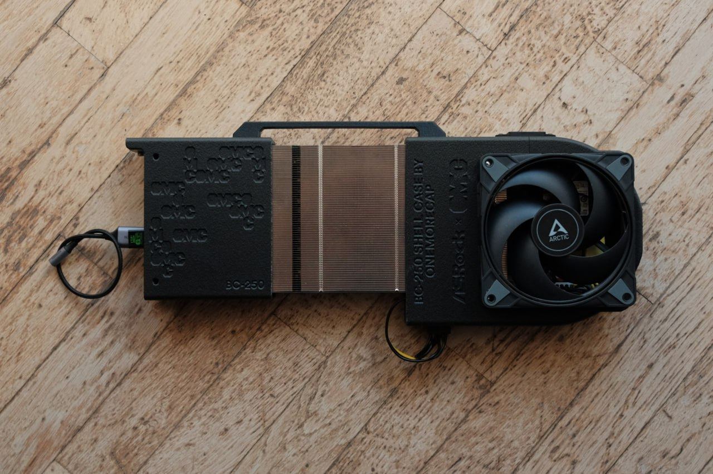
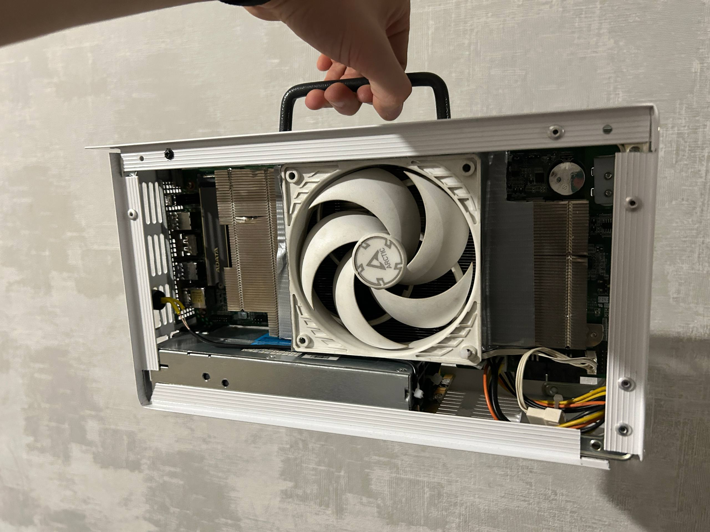
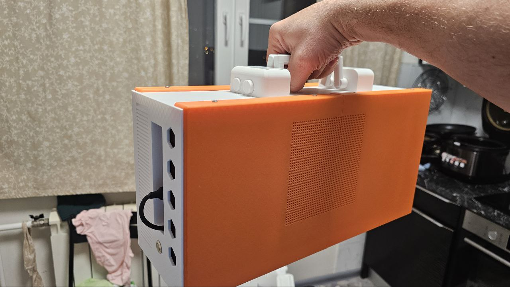
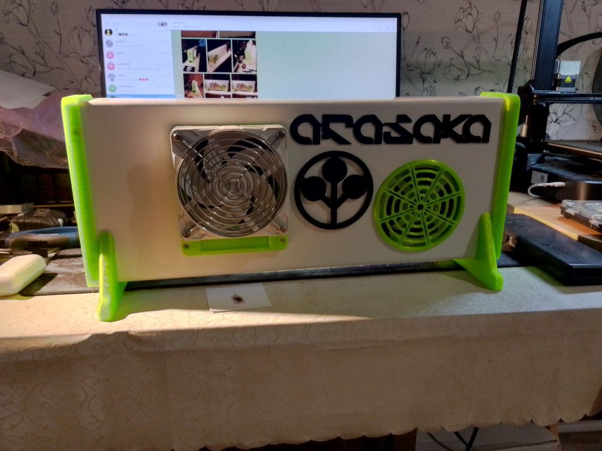

# Корпуса и 3D-печать

> **Коротко** — BC-250 приходит голой платой, поэтому корпус печатает почти каждый. Единственно «правильного» корпуса нет — комьюнити сделало **десятки** вариантов: от минимального **«рукава охлаждения»**, который просто защёлкивается двумя половинками вокруг платы, до полноценных **консольных коробок** с ручкой, экраном спереди и RGB. Что бы ты ни печатал, корпус должен сделать то, чего не может стоковая плата: **прижать 120 мм вентилятор к рёбрам радиатора**, чтобы воздух шёл *сквозь* них (см. [Охлаждение](04-cooling.md)). Эта страница — каталог: имя → STL → вентиляторы → где скачать. **Следи за БП**: большинство корпусов спроектированы под конкретный блок питания (LOP, Flex/SFX ATX или серверный HP) — выбирай корпус под тот [БП](03-power-supply.md), что у тебя есть.

«Корпус» тут — это и печать на 200 г с 20 минутами работы, и многодетальная консоль, на которую у автора ушли недели. Начни с простого; перепечатать всегда успеешь.

> **Новичок и сомневаешься? Печатай [рукав/shell от onemorecap](#уровень-1--минимальный-рукав-охлаждения-начни-отсюда) — минимум, ничего пилить, под один 120 мм вентилятор — и на этом остановись.** Каталог ниже большой; чтобы стартовать, читать его не нужно.

> **Нужен полный список?** elektricM ведёт **поисковый каталог с фильтрами на ~143 дизайна** (фильтр по семейству БП, доступности, платформе) — намного больше кураторского набора ниже, включая множество сборок только-в-Discord и WIP. Смотри здесь: **[elektricM — Cases & Enclosures](https://elektricm.github.io/amd-bc250-docs/community/cases/)**. Подборка ниже — именованные, публично-скачиваемые варианты, с которых стоит начать.

---

## Сборки комьюнити

Что люди реально напечатали — от голой открытой рамы до полностью тематических консолей. Плата одна, результаты — совершенно разные.

   
  Сборка: Дима Ткач · <a href="https://t.me/c/2424231195/22771">источник</a>

   
  Сборка: Сергей · <a href="https://t.me/c/2424231195/87420">источник</a>

   
  Сборка: Alexander Susl · <a href="https://t.me/c/2424231195/122822">источник</a>

   
  Сборка: Maxim Perelygin · <a href="https://t.me/c/2424231195/98072">источник</a>

---

## Как выбрать

Три вопроса определяют, какой корпус тебе подходит:

1. **Какой у тебя БП?** ([Блок питания](03-power-supply.md)) — Meanwell **LOP-300** маленький и живёт *внутри* большинства корпусов. **Flex/SFX ATX** крупнее и требует корпуса с отдельным отсеком. Снятый **HP/серверный** блок требует корпусов «v3/v4 server PSU». Это главный фильтр.
2. **Какие вентиляторы будешь ставить?** Почти любой корпус строится вокруг **одного 120 мм вентилятора** над радиатором. Большие сборки добавляют **второй 120 мм** на бэкплейт (охлаждать память GDDR6, у которой [нет датчика температуры](04-cooling.md)) или на обдув БП. Немногие используют **140 мм** или **slim**-вентиляторы, где не хватает высоты.
3. **Рёбра уже прорежены?** Большинство корпусов предполагают, что ты уже **спилил/прошлифовал стоковые рёбра радиатора** (см. [Охлаждение, Путь A](04-cooling.md)). Корпус сам по себе не чинит стоковый кулер — он лишь держит вентилятор в нужном месте.

> **Жаргон, один раз:** **STL** — стандартный mesh-файл для печати, грузишь в слайсер. **STEP / 3MF** — редактируемые CAD-форматы (бери их, если хочешь переделать модель). **Шрауд / рукав / переходник** — печатная воронка, заставляющая вентилятор прижиматься к рёбрам, а не сливать воздух мимо. **Flex / SFX ATX** — компактные ПК-блоки питания. **LOP** — индустриальный Meanwell LOP-300, любимый в комьюнити.

---

## Уровень 1 — Минимальный «рукав охлаждения» (начни отсюда)

Самое маленькое и быстрое, что можно напечатать. Это **не совсем корпус** — это печатная «куртка», которая садится на плату двумя половинками на плотном натяге, прижимает 120 мм вентилятор к радиатору и направляет поток. **Ничего пилить, винтов в плату не вкручивать.** Дима Ткач (один из самых ранних строителей проекта) описывает два варианта — компактный и «повеселее», оба дают **~70 °C при 150 Вт** нагрузки, ~210 г / ~170 г пластика, БП остаётся холодным на турбулентных потоках ([src](https://t.me/c/2424231195/10743)). Его вывод: *«это, конечно, не корпус, а скорее „рукав охлаждения“, но зато ничего пилить не нужно, всё крепится на очень плотном прилегании, половинки накидываются с разных сторон»*.

- **Файлы:** `BC-250-FanSleeves.3mf` ([src](https://t.me/c/2424231195/10766)), CAD платы `bc-250-body.step` ([src](https://t.me/c/2424231195/18266))
- **Репозиторий:** [onemorecap/bc-250-sleeve-adapter](https://github.com/onemorecap/bc-250-sleeve-adapter) — самый рекомендуемый «проверено, напечатано, работает» минимальный дизайн в чате ([src](https://t.me/c/2424231195/18260))
- **Вентилятор:** 1× 120 мм
- **БП:** любой — есть отверстие/вырез под провод питания, можно использовать LOP *или* внешний блок ([src](https://t.me/c/2424231195/22950))

---

## Уровень 2 — Открытая рама / «shell» (плата напоказ)

Полукорпуса, оборачивающие плату с одной стороны и оставляющие радиатор открытым. Мало пластика, легко собрать, хороший продув.

### onemorecap «Shell Case» — эталонная сборка

Самый зареагированный пост о корпусе в чате (❤33): плоская боковая панель над платой с тиснением **«BC-250»** и узором CU-сетки, **ручка для переноски**, отлитая в верхней части, **прорезанные рёбра радиатора напоказ** в центре и 120 мм **Arctic** в своём шрауде на правом торце. Подпись *«BC-250 SHELL CASE BY ONEMORECAP / ASRock × CMG»* ([src](https://t.me/c/2424231195/22771)). Комплект STL выложен в чат одной пачкой ([src](https://t.me/c/2424231195/81672)), автор подтвердил, что модели бесплатны на Printables и MakerWorld ([src](https://t.me/c/2424231195/24505)).

- **Файлы (пачка из чата):** `Shell_Front.stl`, `Shell_Back_FLEX_ATX.stl`, `Front_Panel.stl`, `USB_Bracket.stl` плюс шрауды ниже ([src](https://t.me/c/2424231195/81680))
- **Источник:** [GitHub onemorecap/bc-250-shell-case](https://github.com/onemorecap/bc-250-shell-case) · [Printables 1228207](https://www.printables.com/model/1228207-asrock-amd-bc-250-shell-case) · [MakerWorld 1206445](https://makerworld.com/en/models/1206445-asrock-amd-bc-250-shell-case)
- **Вентилятор:** 1× или 2× 120 мм (через шрауд) либо 1× 140 мм
- **БП:** задняя панель `Shell_Back_FLEX_ATX` вырезана под **Flex ATX**

### Акриловая открытая рама (Владислав)

Открытая рама **из алюминия и акрила**: две металлические торцевые пластины с прозрачными боковинами, плата вертикально, один **Arctic 120 мм** дует напрямую сквозь прорезанный радиатор в центре, Flex/SFX-блок в нижнем отсеке ([src](https://t.me/c/2424231195/114651)). Этот дизайн позже перепостили на [r/BC250Gaming как «acrylic case»](https://www.reddit.com/r/BC250Gaming/comments/1rryw5f/bc250_acrylic_case_designed/). Воспроизводятся печатные кронштейны; сама рама — лазерная резка / готовый профиль.

- **Вентилятор:** 1× 120 мм (центр) — есть место под вентилятор на бэкплейт
- **БП:** Flex / SFX ATX в нижнем отсеке

---

## Уровень 3 — Консольные коробки (полностью закрытые)

Закрытые корпуса в виде игровой консоли или маленького NAS. Больше пластика и времени печати, но готовое изделие с ручкой, кнопкой питания, вентилируемыми панелями, иногда экраном.

### «Просто лучший корпус» (Jack Fisher × B1zon) — фаворит комьюнити

Выложен под кураторским тегом **#BC250body** как *«просто лучший корпус»* — полностью законченная консоль с опубликованным списком материалов: БП, вентиляторы, разъём, ножки, кнопка питания, винты + резьбовые втулки, PWM-разветвитель вентиляторов, наклейка «киберпанк» и гребёнка для правки радиатора. Часть деталей снята с производства, есть замены ([src](https://t.me/c/2424231195/79990)). Проектирование — B1zon, сборка — Jack Fisher.

- **Файлы:** `BC250 korpus исправленный.rar` ([src](https://t.me/c/2424231195/79989))
- **Вентилятор:** 120 мм (спереди) + PWM-разветвитель под второй
- **БП:** внутренний (класса LOP)

### Тройной «GPU»-фронт (Гослинг)

Консольная коробка, передняя панель которой — **фальшивый кожух видеокарты**: три круглых выреза под вентиляторы в ряд с RGB, машина выглядит как дискретный GPU. Показана с запущенным **Bazzite 42** на BC-250 ([src](https://t.me/c/2424231195/66616)). Три отверстия — косметика поверх одного рабочего вентилятора и забора воздуха.

### Белая консоль с «лабиринтом» (Jhonatan)

Высокая белая коробка с эффектной **вентилируемой боковой панелью в узоре лабиринта/схемы**, подсвеченной (зелёной) металлической кнопкой питания и решёткой забора во всю высоту на фронте — одна из самых аккуратных эстетик в чате ([src](https://t.me/c/2424231195/121274)).

### Мини-башня с сеткой (Joglik)

Серая вертикальная мини-башня с плотной **квадратной сеткой** на боку и сверху, прорезью-ручкой в верхней грани и круглым отверстием под кабель снизу сзади. Чистый индустриальный вид ([src](https://t.me/c/2424231195/126525)).

### Hi-fi-коробка с овальным окном (a m)

Белый прямоугольный корпус в стиле hi-fi/микроволновки: большое **окно-«стадион» с сеткой**, за круглой сеткой виден вентилятор, по бокам — две вертикальные сетчатые прорези ([src](https://t.me/c/2424231195/52955)). Более поздняя итерация автора движется к «нормальному пластику» вместо вспененного ПВХ и добавляет внешнее питание на разъёмах XT-серии и RGB ([src](https://t.me/c/2424231195/128048)).

### Компактная консоль (Volodymyr Spyrydonov, «v15»)

Маленькая серебристо-чёрная консольная коробка с сетчатым боковым забором и тёмным фронтом с эмблемой в стиле киберпанк и RGB-полосой, показана рядом с ТВ как машина для гостиной ([src](https://t.me/c/2424231195/135995)). Часть длинной линейки ревизий (исходные картинки v15/v19/v20 шарили в самом начале).

### BC250 Vented Edition (MaelremremDotXYZ)

Минималистичная **FlexATX**-консоль с **открытыми рёбрами**, держит **~67 °C @ 2145 МГц / 1.1 В**, сзади — выключатель питания БП. [MakerWorld 2899020](https://makerworld.com/en/models/2899020).

### Stellar 250 (isaacalvex)

Полностью автономная консоль с подробным **гайдом по сборке**: внутренний накопитель, **WiFi 6** и **дисплей температур на ESP32**. [GitHub isaacalvex/AMD-BC-250-Project-Guide](https://github.com/isaacalvex/AMD-BC-250-Project-Guide).

---

## Уровень 4 — Большие сборки: ATX-БП, СЖО, экраны

Для тех, кому нужен полноразмерный БП, жидкостное охлаждение или встроенный дисплей.

### Семейство NexGen3D «DIY Steam Machine»

**Самый упоминаемый 3D-проект** в комьюнити (перепостов — 7). Семейство консольных корпусов на Printables, включая **жидкостный «Pro»** и **«Redux»** со **встроенным экраном Pi 1080×480** во фронте ([Reddit-сборка](https://www.reddit.com/r/Bazzite/comments/1skpxe9/bc250_redux_completed_with_internal_1080x480_pi/)). Есть отдельная модель **крепления AIO** для установки 120 мм СЖО на кристалл.

- [Printables 1499974 — DIY Steam Machine (база)](https://www.printables.com/model/1499974-nexgen3d-diy-steam-machine-powered-by-bazzite)
- [Printables 1614131 — Pro Liquid-Cooled](https://www.printables.com/model/1614131-nexgen3d-diy-steam-machine-pro-liquid-cooled-bc-25) · [Printables 1649679 — Redux](https://www.printables.com/model/1649679-nexgen3d-diy-steam-machine-redux-edition) · [Printables 1554003 — крепление AIO](https://www.printables.com/model/1554003-nexgen3d-aio-mount-for-the-bc-250)
- **Охлаждение:** 120 мм воздух **или** 120 мм AIO в зависимости от версии
- **БП:** документированы LOP- и ATX-версии

### Корпуса под ATX-БП (Victor L., V\ad, серверный v3/v4)

Под полноразмерный **ATX**: корпус вокруг целого ATX-блока ([src](https://t.me/c/2424231195/119293), готовится на MakerWorld), ранний первый прототип в Blender ([src](https://t.me/c/2424231195/105570)) и опубликованная линейка под **HP/серверный** БП на Printables/MakerWorld с местом под HDD и USB-хаб.

- [Printables 1580750 — Case v3, HP server PSU + HDD + USB-хаб](https://www.printables.com/model/1580750-bc250-amd-case-v3-hp-server-psu-hdd-usb-hub) · [MakerWorld 2481620 — Case v4, FlexATX и HP-server PSU](https://makerworld.com/en/models/2481620-bc-250-case-v4-for-flexatx-and-hpserver-psu#profileId-2725989) · [Printables 1550729 — ATX-PSU Bazzite Box](https://www.printables.com/model/1550729-bc-250-atx-psu-bazzite-box)

### Сборки на два 120 (память + БП)

Переделанная посадочная пластина под **два 120 мм вентилятора** — один заведён на бэкплейт (память), как задумывал разработчик платы, второй обдувает БП. С Lian Li P28 спереди + Thermalright C12015 автор держит **2200 МГц при 80 °C в играх**, тогда как одного переднего не хватало ([src](https://t.me/c/2424231195/120606)). Под это шарят отдельный **`Twin_120mm_Fan_Shroud.stl`** ([src](https://t.me/c/2424231195/121684)).

### The Lanboy — портативная аркада / «ланчбокс»

Портативная сборка-ланчбокс: гонит **16″ ноутбучную eDP-матрицу (1920×1200 @ 165 Гц)** через **плату-переходник eDisplayPort** ([AliExpress](https://www.aliexpress.com/item/1005006351527252.html)), 2× 2″ динамика на USB-усилителе, всё питается от одного **12 В ATX-брейкаута**. [Printables 1746364](https://www.printables.com/model/1746364). Трюк с eDP-переходником переиспользуется в **любой** сборке с ноутбучной матрицей.

### BC250-HUD (Bloodyly) — внутренний экран статуса

Приложение-**экран статуса на Qt5/C++ для Raspberry Pi Zero 2** (для сборок вроде NexGen3D Redux): **60 FPS через USB gadget mode**, читает FPS/фреймтайм из MangoHud, по напряжению вентилятора гасит экран в спящем режиме и **включает патч ядра vc4**, без которого Pi зависает. Экран: **8.8″ 1920×480 IPS** (Hannstar HSD088IPW1-A). [GitHub Bloodyly/BC250-HUD](https://github.com/Bloodyly/BC250-HUD).

---

## Переходники и крепления (не полноценные корпуса)

Маленькие печатные детали, решающие одну задачу — обычно прикрепить кулер или вентилятор к плате.

- **Шрауды вентиляторов** (прижать вентилятор к рёбрам): `Fan_Shroud_Single_120mm.stl`, `Fan_Shroud_Dual_120mm.stl`, `Fan_Shroud_Single_120mm_Restricted.stl`, `Fan_Shroud_Single_140mm.stl` ([src](https://t.me/c/2424231195/81673)), `Twin_120mm_Fan_Shroud.stl` ([src](https://t.me/c/2424231195/121684)). Также в каталоге [Охлаждение](04-cooling.md).
- **Крепления вентилятора на бэкплейт / память:** `Backplate.stl` + `backplane-top-fixed.stl` ([src](https://t.me/c/2424231195/133049)); `bottom_fan_mount.stl`, `top_fan_mount.stl`, `Front-Mount.stl`, `Back-Mount.stl` ([src](https://t.me/c/2424231195/131189))
- **Переходники под AM4-кулер** (прикрутить штатный CPU-кулер к кристаллу): `bc250 am4 adapter polished.stl`, `bc250 cooler mount.stl` ([src](https://t.me/c/2424231195/9949)). См. также [Printables 1042228 — BC250→AMD CPU-cooler mount](https://www.printables.com/model/1042228-bc250-to-amd-cpu-cooler-mount).
- **Универсальное ITX-крепление** (majzok): печатается в двух частях, защёлкивающихся в рамку — прикручиваешь BC-250 в неё, затем рамку прикручиваешь в **любой корпус со стандартными ITX-отверстиями под материнку** (проверено в DeepCool CH170 PLUS). Решает проблему «универсального ITX-крепления не существует». Каноничной ссылки на Printables нет — ищи на Printables/MakerWorld по запросу **«BC-250 ITX Mount»**.
- **Переходник Thermalright AXP90-X53 / AXP120-X67** (низкопрофильный кулер на кристалл): печатное крепление, нужна резьба M3, варианты толщины под кулер/прижим CPU — [Printables 1694793](https://www.printables.com/model/1694793). Также в разделе [Охлаждение](04-cooling.md).
- **Переходник под 120 мм вентилятор:** `BC250_FanAdapter_120mm.step` ([src](https://t.me/c/2424231195/83135)), `cooler adapter v3.0 (1).stl` ([src](https://t.me/c/2424231195/111091))
- **Точные модели платы** (проектируй свой корпус по ним): [Printables 1341336 — accurate BC-250 board](https://www.printables.com/model/1341336-accurate-3d-model-of-the-amd-bc-250-board) ([src](https://t.me/c/2424231195/55496)), [Printables 1103626 — AMD BC250 board](https://www.printables.com/model/1103626-amd-bc250-board)

---

## Таблица каталога

Файлы с пометкой *(чат)* зеркалируются в `assets/stl/`; остальное качается со связанной страницы Printables / MakerWorld / GitHub.

| Корпус / деталь | Тип | STL / исходники | Вентиляторы | Скачать |
|---|---|---|---|---|
| **onemorecap рукав охлаждения** | минимальный рукав | `BC-250-FanSleeves.3mf` *(чат)* | 1× 120 | [GitHub onemorecap/bc-250-sleeve-adapter](https://github.com/onemorecap/bc-250-sleeve-adapter) |
| **onemorecap Shell Case** ⭐ | открытый shell | `Shell_Front.stl`, `Shell_Back_FLEX_ATX.stl`, `Front_Panel.stl`, `USB_Bracket.stl` *(чат)* | 1–2× 120 / 1× 140 | [Printables 1228207](https://www.printables.com/model/1228207-asrock-amd-bc-250-shell-case) · [GitHub](https://github.com/onemorecap/bc-250-shell-case) · [MakerWorld 1206445](https://makerworld.com/en/models/1206445-asrock-amd-bc-250-shell-case) |
| **Акриловая рама** (Владислав) | открытая рама | печатные кронштейны *(чат #114651)* | 1× 120 | [Reddit-тред](https://www.reddit.com/r/BC250Gaming/comments/1rryw5f/bc250_acrylic_case_designed/) |
| **«Просто лучший корпус»** (Jack Fisher × B1zon) | консоль | `BC250 korpus исправленный.rar` *(чат)* | 120 + PWM-разветвитель | [чат #79989](https://t.me/c/2424231195/79989) |
| **Minimal case под Flex PSU** | малая коробка | `minimal-case-...-model_files.zip` *(чат)* | 1× 120 | [Printables 1423572](https://www.printables.com/model/1423572-minimal-case-for-bc250-and-flex-psu) |
| **forgenam case** | консоль | `forgenam-case-bc250-model_files.zip` *(чат)* | 1× 120 | [Printables 1375929](https://www.printables.com/model/1375929-forgenam-case-bc250) |
| **Minimalist 240** | консоль + ручка | `Minimalist 240 Front/Back/Handle.stl` *(чат)* | 120 | [чат #117404](https://t.me/c/2424231195/117404) |
| **M360** | консоль | `M360 Front.stl`, `M360 Back.stl` *(чат)* | 120 | [чат #126566](https://t.me/c/2424231195/126566) |
| **NexGen3D DIY Steam Machine** ⭐ | консоль | файлы Printables | 1× 120 | [Printables 1499974](https://www.printables.com/model/1499974-nexgen3d-diy-steam-machine-powered-by-bazzite) |
| **NexGen3D Pro (СЖО)** | консоль + AIO | файлы Printables | 120 AIO | [Printables 1614131](https://www.printables.com/model/1614131-nexgen3d-diy-steam-machine-pro-liquid-cooled-bc-25) |
| **NexGen3D Redux (+экран)** | консоль + экран 1080×480 | файлы Printables | 1× 120 | [Printables 1649679](https://www.printables.com/model/1649679-nexgen3d-diy-steam-machine-redux-edition) |
| **NexGen3D AIO mount** | переходник | файлы Printables | 120 AIO | [Printables 1554003](https://www.printables.com/model/1554003-nexgen3d-aio-mount-for-the-bc-250) |
| **Case v3 — HP server PSU** | консоль + HDD/USB | файлы Printables | 120 | [Printables 1580750](https://www.printables.com/model/1580750-bc250-amd-case-v3-hp-server-psu-hdd-usb-hub) |
| **Case v4 — FlexATX / HP PSU** | консоль | файлы MakerWorld | 120 | [MakerWorld 2481620](https://makerworld.com/en/models/2481620-bc-250-case-v4-for-flexatx-and-hpserver-psu#profileId-2725989) |
| **ATX-PSU Bazzite Box** | коробка под full-ATX | файлы Printables | 120 | [Printables 1550729](https://www.printables.com/model/1550729-bc-250-atx-psu-bazzite-box) |
| **ivanov-innokentii case** | консоль | исходники GitHub | 120 | [GitHub ivanov-innokentii/BC250-case](https://github.com/ivanov-innokentii/BC250-case) |
| **rLapchynski enclosure** | корпус | исходники GitHub | 120 | [GitHub rLapchynski/bc250-enclosure](https://github.com/rLapchynski/bc250-enclosure) |
| **BC-250 Scooper** | шрауд/совок | файлы Printables | 120 | [Printables 1282906](https://www.printables.com/model/1282906-bc-250-scooper) |
| **Pitman case** | консоль | файлы Printables | 120 | [Printables 1570248](https://www.printables.com/model/1570248-amd-bc-250-pitman-case) |
| **Industrial-style FlexATX** | консоль | `amd_bc_250_industrial_style_case...zip` *(чат)* | 120 (без стокового кулера) | [чат #144265](https://t.me/c/2424231195/144265) |
| **The Lanboy** | портативная аркада + 16″ eDP-экран | файлы Printables | 12 В ATX-брейкаут | [Printables 1746364](https://www.printables.com/model/1746364) |
| **BC250 Vented Edition** (MaelremremDotXYZ) | FlexATX-консоль, рёбра открыты | файлы MakerWorld | 120 | [MakerWorld 2899020](https://makerworld.com/en/models/2899020) |
| **Stellar 250** (isaacalvex) | консоль + гайд (WiFi6, ESP32) | гайд на GitHub | 120 | [GitHub isaacalvex/...Project-Guide](https://github.com/isaacalvex/AMD-BC-250-Project-Guide) |
| **BC250-HUD** (Bloodyly) | внутренний экран статуса на Pi Zero 2 | исходники GitHub | — | [GitHub Bloodyly/BC250-HUD](https://github.com/Bloodyly/BC250-HUD) |
| **Универсальное ITX-крепление** (majzok) | переходник (любой ITX-корпус) | искать на Printables/MakerWorld | — | «BC-250 ITX Mount» |
| **Крепление Thermalright AXP90/AXP120** | переходник под низкопрофильный кулер | файлы Printables | низкопроф. башня | [Printables 1694793](https://www.printables.com/model/1694793) |
| **Пластина под два 120** | переходник-пластина | `Twin_120mm_Fan_Shroud.stl` *(чат)* | 2× 120 | [чат #121684](https://t.me/c/2424231195/121684) |
| **Шрауды (120/140)** | шрауд | `Fan_Shroud_Single_120mm.stl`, `_Dual_120mm`, `_Single_140mm`, `_120mm_Restricted` *(чат)* | 120 / 140 | [Printables 1339540](https://www.printables.com/model/1339540-yet-another-bc-250-fan-shroud) · см. [Охлаждение](04-cooling.md) |
| **Переходник под AM4-кулер** | крепление | `bc250 am4 adapter polished.stl`, `bc250 cooler mount.stl` *(чат)* | башня/AIO | [Printables 1042228](https://www.printables.com/model/1042228-bc250-to-amd-cpu-cooler-mount) |
| **Точная модель платы** | референс CAD | `bc-250-body.step` *(чат)* | — | [Printables 1341336](https://www.printables.com/model/1341336-accurate-3d-model-of-the-amd-bc-250-board) |

⭐ = самый зареагированный / самый перепощенный в комьюнити.

### Ещё публичные дизайны (из каталога elektricM)

Именованные, скачиваемые дизайны из [каталога elektricM на 143 модели](https://elektricm.github.io/amd-bc250-docs/community/cases/), которых нет выше — сгруппированы по БП, под который они сделаны. За сборками только-в-Discord/WIP и превью — в полный каталог.

**MeanWell LOP (внутренний БП):**

| Корпус / деталь | Особенность | Скачать |
|---|---|---|
| **Steamboat Case** (yannichaboyer) | консоль под LOP-300 | [MakerWorld 2431616](https://makerworld.com/en/models/2431616) |
| **Ultra-Thin Custom Case** (MrRoze) | тонкий LOP-300 | [Printables 1626501](https://www.printables.com/model/1626501) |
| **Internal PSU 2×140 мм** (Kacikor) | LOP-400, два 140 | [Printables 1599644](https://www.printables.com/model/1599644) · [MakerWorld 2400574](https://makerworld.com/en/models/2400574) |
| **Push-Pull Internal 12V PSU** (penzoiders) | push-pull | [MakerWorld 2505974](https://makerworld.com/en/models/2505974) |
| **Shell Case + вентилятор SSD 40 мм** (Munkee915) | ремикс Shell, обдув SSD | [Printables 1568074](https://www.printables.com/model/1568074) |
| **Noctua Push-Pull Mod** (Janjd) | ремикс Shell | [MakerWorld 2354123](https://makerworld.com/en/models/2354123) |

**MeanWell LRS/UHP (другой частый серверный кирпич):**

| Корпус / деталь | Особенность | Скачать |
|---|---|---|
| **LRS-350-12 PSU Case** (TARGZ) | коробка под LRS-350 | [Printables 1543979](https://www.printables.com/model/1543979) |
| **BC250 slim case** (C4kew4lk) | UHP-350-12, тонкий | [Printables 1504664](https://www.printables.com/model/1504664) |

**FlexATX — семейство Arthrimus «Console Style»** (целая линейка ремиксов; slim-консоль — народный стандарт):

| Корпус / деталь | Особенность | Скачать |
|---|---|---|
| **Console Style Case v1** (Arthrimus) | оригинал | [Thingiverse 7165679](https://www.thingiverse.com/thing:7165679) · [MakerWorld 2097988](https://makerworld.com/ko/models/2097988-bc250) |
| **Slim Console Style Case** (Arthrimus) | тонкий вариант | [Thingiverse 7172528](https://www.thingiverse.com/thing:7172528) |
| **Slim Console — double-fan mod** (TKXXTH) | два вентилятора | [Thingiverse 7214884](https://www.thingiverse.com/thing:7214884) |
| **Slim Console — On/Off + Apevia** | кнопка питания | [Thingiverse 7274042](https://www.thingiverse.com/thing:7274042) |

**FlexATX — прочие:**

| Корпус / деталь | Особенность | Скачать |
|---|---|---|
| **Minimal Case (Toolless)** (chriszf) | без винтов | [Printables 1423572](https://www.printables.com/model/1423572) |
| **Minimalist BC-250 Case** (SebastienGau/Gadget) | минимализм | [Printables 1581724](https://www.printables.com/model/1581724) |
| **ADT UT3G eGPU-Inspired** (R0mn) | вид eGPU | [Printables 1539301](https://www.printables.com/model/1539301) |
| **«Steam Machine» от MrLarva** | консоль | [Printables 1618501](https://www.printables.com/model/1618501) · [MakerWorld 2453965](https://makerworld.com/en/models/2453965) · [Thingiverse 7278235](https://www.thingiverse.com/thing:7278235) |
| **Steam Machine** (Pocket Adventures) | консоль | [MakerWorld 2350219](https://makerworld.com/en/models/2350219) |
| **Steam Machine Slim Console** (MTSquar3D) | slim + OC vRAM fan kit | [MakerWorld 2232434](https://makerworld.com/en/models/2232434) · [Thingiverse 7271946](https://www.thingiverse.com/thing:7271946) |
| **ASRock Console Case** (songdawgdesigns) | консоль | [Printables 1617023](https://www.printables.com/model/1617023) · [Cults3D](https://cults3d.com/en/3d-model/gadget/asrock-amd-bc-250-console-case-steamos-bazzite-diy-steam-machine-style-build) |
| **AMD BC250 Case** (vitamins) | консоль | [MakerWorld 2219947](https://makerworld.com/en/models/2219947) |
| **E-waste Steam Machine** (Pesen333) | из хлама | [Thingiverse 7245584](https://www.thingiverse.com/thing:7245584) |

**Full ATX:**

| Корпус / деталь | Особенность | Скачать |
|---|---|---|
| **Case for Standard ATX** (CatSiewDai) | коробка ATX | [Printables 1553599](https://www.printables.com/model/1553599) |
| **ATX + Fan Duct** (ZMASLO) | с воздуховодом | [Printables 1616167](https://www.printables.com/model/1616167) |
| **Dual Fan ATX Case** (Mateo Fdez) | два вентилятора | [Printables 1579658](https://www.printables.com/model/1579658) |
| **Simple Wooden Case** (suvalle55) | дерево + ATX | [Printables 1595794](https://www.printables.com/model/1595794) |
| **Open Frame + IKEA-хак** (GreatApo) | открытая рама | [Thingiverse 7314188](https://www.thingiverse.com/thing:7314188) |
| **Case for ATX PSU** (matmiak) | коробка ATX | [Thingiverse 7303096](https://www.thingiverse.com/thing:7303096) |

**TFX / VESA / готовое:**

| Корпус / деталь | Особенность | Скачать |
|---|---|---|
| **Case Remix for TFX** (PlayNation) | БП TFX-400 | [MakerWorld 2387157](https://makerworld.com/en/models/2387157) |
| **VESA 100/75 Basket** (Oleksii) | крепление за монитор | [MakerWorld 1844470](https://makerworld.com/en/models/1844470) |
| **3.9L MKII FlexATX + вентилятор PS5** (FitFormSolutions) | купить готовый кит | [Etsy](https://www.etsy.com/listing/4405362103/) · [eBay](https://www.ebay.com/itm/127460591552) |
| **Shiny Snake S400** (10.8 л mesh ITX) | проверенный готовый корпус-хост (BC-250→AM4-крепление + H60 AIO в отсек БП + кастомная ATX-заглушка I/O) | [AliExpress](https://a.aliexpress.com/_EyQdoBU) |
| **Минималистичный корпус под SFX-БП** (Methsman) | полный SFX-БП, панели на магнитах, USB-хаб, AXP120 + Noctua 120 — *файлы WIP / ещё не выложены* | — |
| **Линейка Cults3D ATX/server** (KABANCHYK, lumstudio, kapa3D) | платные STL | [Cults3D — bc-250](https://cults3d.com/en/3d-model/gadget/bc-250-atx-case) |

---

## Нет принтера? Что делают люди

- **Заказать печать.** Продавцы есть на [Etsy](https://www.etsy.com/listing/1904632447/), eBay и OLX; в чате тоже предлагали напечатать/продать корпус ([src](https://t.me/c/2424231195/55507)).
- **Печать под заказ:** загрузить STL в сервис. Строители в чате держат фермы (один показывает стену из Flsun/Creality/Bambu, [src](https://t.me/c/2424231195/73481)).
- **Совсем без корпуса / переделка.** Многие гоняют плату на открытом стенде, пока тестируют. Другие потрошат готовое железо: старый моноблок с имплантированной платой и турбиной ([src](https://t.me/c/2424231195/30914)), коробку из вентиляционного короба ([src](https://t.me/c/2424231195/64265)) или алюминиевые корпуса от усилителей (нужны напильник и сверло, [src](https://t.me/c/2424231195/108907)). Один участник даже спрятал плату в старый VHS-плеер ради шутки ([src](https://t.me/c/2424231195/84106)). **Корпус от Xbox One** (JoeyDepDollas): выпотрошить дохлый Xbox One и уместить внутри полную сборку BC-250 — CPU и GPU держатся ниже **60 °C** под нагрузкой; битые доноры идут по **~$15 с доставкой** на eBay и дают переиспользуемые детали.
- **Лазерная резка фанеры** (ContributionRich3242): не 3D-печать — фанера, согнутая пропилами по углам, с большой задней зоной под доп. охлаждение, держит **75 °C на 40 CU** (1800 МГц, CPU 3.9 ГГц) и работает бесшумно. (Лазерные файлы не выкладывались.) Его **техника охлаждения через бэкплейт** переиспользуема на любом корпусе: терможвачка чип→бэкплейт, паста бэкплейт→задние кулеры, а сами задние кулеры зафиксировать тугими R-образными шплинтами в зазоре VRM + каптоновый скотч (~на 20 °C холоднее на 40 CU).

> Голая, но хорошо охлаждённая плата обходит запечатанную красивую коробку с плохим продувом. Сначала сделай [Охлаждение](04-cooling.md), корпус — второй шаг.

---

## Источники

- Кураторская витрина **#BC250body** (по одной хорошей сборке в день) — закреп-идея [src](https://t.me/c/2424231195/79685)
- Минимальный рукав, два варианта — [src](https://t.me/c/2424231195/10743) · модели на [onemorecap/bc-250-sleeve-adapter](https://github.com/onemorecap/bc-250-sleeve-adapter) [src](https://t.me/c/2424231195/18260)
- Shell Case (❤33) — [src](https://t.me/c/2424231195/22771) · бесплатно на Printables/MakerWorld [src](https://t.me/c/2424231195/24505) · пачка STL [src](https://t.me/c/2424231195/81680)
- «Просто лучший корпус» + BOM — [src](https://t.me/c/2424231195/79990) · файлы [src](https://t.me/c/2424231195/79989)
- Акриловая открытая рама — [src](https://t.me/c/2424231195/114651) · [Reddit](https://www.reddit.com/r/BC250Gaming/comments/1rryw5f/bc250_acrylic_case_designed/)
- Пластина под два 120, 2200 МГц @ 80 °C — [src](https://t.me/c/2424231195/120606) · шрауд [src](https://t.me/c/2424231195/121684)
- Консольные дизайны (фото) — Гослинг/Bazzite [src](https://t.me/c/2424231195/66616) · Jhonatan «лабиринт» [src](https://t.me/c/2424231195/121274) · Joglik сетка [src](https://t.me/c/2424231195/126525) · a m овальное окно [src](https://t.me/c/2424231195/52955) · Spyrydonov v15 [src](https://t.me/c/2424231195/135995)
- Семейство NexGen3D Steam Machine — [Printables 1499974](https://www.printables.com/model/1499974-nexgen3d-diy-steam-machine-powered-by-bazzite) · [Redux + Pi-экран (Reddit)](https://www.reddit.com/r/Bazzite/comments/1skpxe9/bc250_redux_completed_with_internal_1080x480_pi/)
- Референс-модель платы — [src](https://t.me/c/2424231195/55496) · [Printables 1341336](https://www.printables.com/model/1341336-accurate-3d-model-of-the-amd-bc-250-board)
- GitHub-репозитории корпусов — [onemorecap/bc-250-shell-case](https://github.com/onemorecap/bc-250-shell-case) · [ivanov-innokentii/BC250-case](https://github.com/ivanov-innokentii/BC250-case) · [rLapchynski/bc250-enclosure](https://github.com/rLapchynski/bc250-enclosure)
- **Полный каталог корпусов elektricM (~143 дизайна, поиск/фильтры)** — [elektricm.github.io/amd-bc250-docs/community/cases](https://elektricm.github.io/amd-bc250-docs/community/cases/)

> STL шраудов общие с разделом [Охлаждение](04-cooling.md). Все размещённые в чате файлы STL/STEP/3MF зеркалируются в `assets/stl/`.
