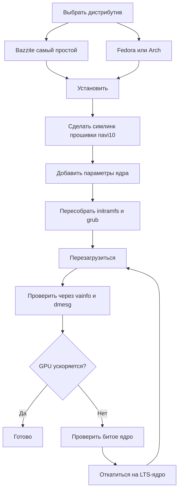

# Драйверы и установка Linux

> **Коротко** — Большинство гоняет BC-250 на Linux, и работает отлично — *после починки GPU*. Из коробки `amdgpu` не распознаёт чип, и ты получаешь рендер на CPU и однозначный FPS. Реальную скорость дают две вещи: **свежее ядро + свежая Mesa (25.1+)** и **фикс `amdgpu`** — симлинк прошивки, чтобы драйвер завёлся (`navi10_gpu_info.bin` → `cyan_skillfish_gpu_info.bin`), плюс параметры ядра (`amdgpu.sg_display=0`, `mitigations=off`, на новых ядрах `amdgpu.bc250_cc_write_mode=3`). Самый простой путь новичку: накатить **[Bazzite](https://bazzite.gg/)** и сделать rebase на специальный образ **`bazzite-bc250`** — фиксы уже внутри. Хочешь разобраться в железе — **Fedora** или **CachyOS/EndeavourOS (Arch)** с одноразовым скриптом настройки.

Это раздел, который превращает «плату в коробке» в рабочий десктоп. Сначала сделай [охлаждение](04-cooling.md) и [питание](03-power-supply.md) — потом это.

> **Никогда не пользовался Linux? Памятка на 60 секунд.**
> - **Открыть терминал:** найди в меню приложение *Terminal* / *Konsole* (KDE) / *Console* или нажми `Ctrl-Alt-T`.
> - **`sudo`** перед командой запускает её с правами администратора. Спросит пароль — и **пока ты его печатаешь, на экране ничего не появляется** (ни точек, ни звёздочек). Это норма: набери и нажми Enter.
> - **`nano /etc/...`** открывает простой текстовый редактор прямо в терминале. Сохранить и выйти: **Ctrl-O**, потом **Enter**, потом **Ctrl-X**.
> - **Вставка** в терминал обычно по **Ctrl-Shift-V** (не Ctrl-V).
> - Многие шаги срабатывают только после **перезагрузки** (`systemctl reboot`). Если шаг говорит «перезагрузись» — реально перезагрузись, прежде чем судить, заработало ли.

---

## Главное, что нужно понять

GPU у BC-250 — это **Cyan Skillfish / Oberon** (RDNA2-чип, производный от PlayStation 5). У mainline `amdgpu` исторически **не было блоба прошивки с таким именем**, поэтому на стоковой установке ядро не может инициализировать GPU, и десктоп откатывается на программный рендер (LLVMpipe) — всё тормозит, а `vulkaninfo` не показывает реального устройства. Один пользователь несколько дней воевал с «битыми драйверами», пока не понял, что система просто грузила ядро, не умеющее загрузить прошивку GPU ([src](https://t.me/c/2424231195/98466)).

Поэтому любая рабочая конфигурация в той или иной форме делает одно и то же:

1. **Ставит достаточно свежие ядро + Mesa.** Upstream-поддержка BC-250 в Mesa появилась в **25.1** (с тех пор патчи не нужны; **25.3.x** — текущая рекомендуемая стабильная) — ([Mesa MR !33116](https://gitlab.freedesktop.org/mesa/mesa/-/merge_requests/33116), [src](https://t.me/c/2424231195/20891)). Датчики температуры приехали в **ядро 6.15** ([src](https://t.me/c/2424231195/23542)); ядро **6.18.18 LTS** — текущий оптимум.
2. **Даёт `amdgpu` нужную прошивку** — на актуальных системах свежий **`linux-firmware`** уже несёт `cyan_skillfish_gpu_info.bin`; старым системам всё ещё нужен **симлинк navi10** (или патченый пакет mesa/ядра). См. Путь C.
3. **Передаёт правильные параметры ядра** и пересобирает initramfs + загрузчик. (И ставит **GPU-governor**, чтобы частоты не были залочены на 1500 МГц.)

Всё ниже — это лишь *как именно* каждый дистрибутив делает эти три вещи.



---

## Какой дистрибутив? (фавориты опроса комьюнити)

Чат снова и снова возвращается к четырём. Единственно «правильного» ответа нет — это размен между *нулевыми усилиями* и *пониманием своего железа*. Документация elektricM тестирует более широкий набор; вот они все разом ([elektricM: distributions](https://elektricm.github.io/amd-bc250-docs/linux/distributions/)):

| Дистрибутив | База | Усилия | Фикс GPU | Кому |
|--------|------|--------|---------|------|
| **Bazzite** (образ `bazzite-bc250`) | Fedora atomic | **Минимум** — фиксы вшиты | Уже в образе | Новичкам, «просто играть» |
| **Fedora 43** (Workstation / KDE) | Fedora | Низкие | Mesa 25.x в основных репах + COPR с governor | Учить Linux, держаться ближе к upstream |
| **CachyOS** | Arch | Средние | Mesa 25.1+ в репах + governor (AUR) | Максимум плавности (планировщик BORE), HDR+VRR |
| **EndeavourOS / Arch** | Arch | Средние | Mesa 25.1+ в репах + governor | Arch без боли при установке |
| **Debian (Testing/Sid) / PikaOS** | Debian | Средние–высокие | Mesa из `experimental` (Debian) / из коробки (PikaOS) | Стабильность, **минимальное потребление в простое (~50–60 Вт)** |
| **Manjaro** | Arch | Средние | Mesa 25.1+ в репах; грузится из коробки после прошивки BIOS | Лёгкий Arch; GNOME стабильнее всего |
| **Alpine** | Alpine (OpenRC) | Высокие | mesa + прошивка + governor вручную | Минимал/headless, ~150 МБ RAM / ~35 Вт |
| **Fedora CoreOS** | Fedora atomic | Высокие | контейнерный хост; настройки после установки | Headless-серверы под контейнеры/LLM |
| **SteamOS** (Valve) | Arch (immutable) | Средние | Mesa из образа **ветки main** (не stable) + governor | Ощущение настоящей Steam Machine; диван/Gaming Mode |
| **Batocera** | Linux (дистрибутив для эмуляции) | Низкие–средние | встроенная Mesa + настройка | Консольный **эмуляционный** бокс ([15-emulation.md](15-emulation.md)) |

Заметки из чата и [elektricM](https://elektricm.github.io/amd-bc250-docs/linux/distributions/):
- **Bazzite — самый простой**, и у него есть **отдельный образ под BC-250** с уже применёнными фиксом прошивки, параметрами ядра, GPU-governor и патчем 40-CU/частот. Ищи на artifacthub: [`bazzite-bc250`](https://artifacthub.io/packages/container/bazzite-bc250/bazzite_bc250). Несколько человек перешли на него именно чтобы перестать патчить руками ([src](https://t.me/c/2424231195/121246)).
- **С Fedora 43 Mesa 25.x уже в основных репах** — COPR `mixaill/amd-bc-250` ради одной только Mesa больше не нужен. Fedora 42 — **end-of-life**, переходи на 43. При установке, если чёрный экран, выбери *Troubleshooting → Install in Basic Graphics Mode* ([elektricM: Fedora](https://elektricm.github.io/amd-bc250-docs/linux/fedora/)).
- **Не хватай вслепую «геймерские» дистрибутивы.** В одном развёрнутом разборе аргументируется, что чистая **Fedora (Workstation/KDE)** или ванильный **Arch с LTS-ядром + свежей Mesa** — это безболезненная золотая середина, а тяжёлые тюненые форки порой *ломают* Steam/FSR/vsync, а не помогают ([src](https://t.me/c/2424231195/102834)). Считай это советом «на конец 2025-го» — образ Bazzite с тех пор повзрослел.
- **CachyOS вместо Bazzite, если гонишься за максимальной плавностью.** Развёрнутый отзыв сообщества r/BC250Gaming (Reddit) перешёл с Bazzite на **CachyOS** и обнаружил, что игры идут заметно плавнее независимо от источника, с меньшим числом статтеров/микрофризов (например, *Mortal Kombat 1*), реже случайные краши и перезапуски Steam-режима, и очень отзывчиво на **дефолтной разметке Btrfs**. Заодно там **HDR + VRR заработали как надо** там, где Bazzite не смог (HDR глитчил, VRR не работал вообще) — см. [14-display.md](14-display.md). Считай это одним хорошо задокументированным опытом, а не универсальным вердиктом, но это сильный вариант, если на Bazzite у тебя статтер или нестабильность. Установку автоматизирует скрипт **[`redbeard1083/bc250-toolkit`](https://github.com/redbeard1083/bc250-toolkit)** (BC-250 на CachyOS).
- **Версия ядра важнее дистрибутива.** Избегай заведомо битых ядер (см. блок-предупреждение ниже). Если сомневаешься — **LTS-ядро** (рекомендуется 6.18.18 LTS) безопасный выбор: несколько человек упёрлись в стену на слишком новом ядре и спаслись переходом на LTS ([src](https://t.me/c/2424231195/56529), [src](https://t.me/c/2424231195/59839)).
- **Окружение рабочего стола:** у **GNOME лучший послужной список** на BC-250. У KDE Plasma были краши из-за бага Qt RDRAND/RDSEED — исправлено в свежих Qt (середина 2025), но GNOME всё равно безопасный дефолт; Cinnamon (X11) — стабильный лёгкий вариант ([elektricM: distributions](https://elektricm.github.io/amd-bc250-docs/linux/distributions/)).
- **Ещё два дистрибутива комьюнити подтвердило как загружающиеся** ([тред сообщества r/linux_gaming](https://www.reddit.com/r/linux_gaming/comments/1nvsgji/)): **SteamOS** работает на BC-250 — но бери образ **ветки main**, а **не** канал stable (в stable идёт более старая Mesa без поддержки BC-250). И **Batocera**, специализированный дистрибутив для эмуляции, тоже грузится и работает — удобный способ превратить плату в консольный эмуляционный бокс (см. [15-emulation.md](15-emulation.md)). Оба следуют тем же трём правилам, что и всё выше (свежая Mesa + фикс прошивки `amdgpu` + параметры ядра/governor).

> Один ветеран подытожил опыт после трёх месяцев ежедневной жизни с BC-250 на Linux: игры запускаются одним кликом, RTX работает, VR работает — «абсолютно незаметно» — и он перевёл основной десктоп на Linux именно из-за этого ([src](https://t.me/c/2424231195/61870)).

---

## Путь A — Bazzite (рекомендуется новичкам)

Bazzite — это immutable геймерская ОС на базе Fedora (как SteamOS). Комьюнити поддерживает **образ специально под BC-250**, чтобы ты не трогал прошивку и параметры ядра сам.

### A1. Сначала ставим обычный Bazzite
1. Скачай с **[bazzite.gg](https://bazzite.gg/#image-picker)** (выбери десктопный вариант или «Deck»/Gaming-Mode).
2. Запиши на флешку (Ventoy, Rufus или balenaEtcher) и установи как обычно. **Создай не-root пользователя** — Steam отказывается запускаться из-под root ([src](https://t.me/c/2424231195/121246)).

> **Флешка маленькая?** ISO Bazzite весит >9 ГБ. Можно поставить обычную **Fedora** (ISO ≈3 ГБ, например Kinoite/KDE) на маленькую флешку, а потом *сделать rebase* на Bazzite из терминала ([src](https://t.me/c/2424231195/121246)):
> ```bash
> # рабочий стол KDE:
> rpm-ostree rebase ostree-image-signed:docker://ghcr.io/ublue-os/bazzite:stable
> # или с Gaming Mode (как SteamOS):
> rpm-ostree rebase ostree-image-signed:docker://ghcr.io/ublue-os/bazzite-deck:stable
> ```
> Перезагрузка — и ты в Bazzite.

### A2. Установка GPU-governor (самый простой актуальный путь)
С начала 2026-го **стоковое ядро Bazzite уже включает патч диапазона частот GPU** — так что отдельный образ обычно **вообще не нужен**. Просто поставь governor поверх обычного Bazzite ([elektricM: Bazzite](https://elektricm.github.io/amd-bc250-docs/linux/bazzite/)):
```bash
sudo dnf copr enable filippor/bazzite
rpm-ostree install cyan-skillfish-governor-smu   # вариант SMU — патч ядра не нужен
systemctl reboot
sudo systemctl enable --now cyan-skillfish-governor-smu.service
# Закрепи заведомо рабочий деплой, чтобы апдейт не сломал молча:
rpm-ostree pin 0
```
**`cyan-skillfish-governor-smu`** управляет частотами через вызовы SMU-прошивки и заменяет старый `oberon-governor` (см. *[Governor питания](#b3-governor-питания-cyan-skillfish-governor)*). Есть и вариант `cyan-skillfish-governor-tt`, но ему нужен патч ядра (в Bazzite уже есть). ⚠ Governor может целиться не в ту карту (card0 vs card1) — проверь, если масштабирование не включается.

### A2-альт. (Опционально) Rebase на образ под BC-250
Только если хочешь дополнительные предзашитые оптимизации: переключись на поддерживаемый образ BC-250 — сборки **`vietsman` «Bazzite on Steroids»** (фикс прошивки, параметры ядра, governor, расширенный патч частот 350–2230 МГц уже внутри). Выбери тот рабочий стол, что поставил — **GNOME рекомендуется по умолчанию** — и запусти:
```bash
# GNOME (рекомендуется):
rpm-ostree rebase ostree-image-signed:docker://ghcr.io/vietsman/bazzite-gnome-patched:latest
# KDE:
rpm-ostree rebase ostree-image-signed:docker://ghcr.io/vietsman/bazzite-kde-patched:latest
# Deck / Gaming-Mode (как SteamOS):
rpm-ostree rebase ostree-image-signed:docker://ghcr.io/vietsman/bazzite-deck-patched:latest
systemctl reboot
```
⚠ verify — сверь актуальный образ/тег перед запуском, пути образов меняются. Свежие команды — на [странице Bazzite в документации BC-250](https://elektricm.github.io/amd-bc250-docs/linux/bazzite/) (также числится на artifacthub как [`bazzite-bc250`](https://artifacthub.io/packages/container/bazzite-bc250/bazzite_bc250)).

> ⚠ **Rebase на патченый образ может убить USB-WiFi (elektricM Issue #10).** Кастомное ядро может не включать драйвер твоего USB-WiFi/Bluetooth-свистка (у BC-250 нет встроенного беспровода). Держи наготове Ethernet, после rebase проверь `lsmod | grep <твой_драйвер>`, поставь недостающее `rpm-ostree install <пакет-драйвера>` или откатись `rpm-ostree rollback && systemctl reboot`.

Дальше обновляйся через хелпер Bazzite:
```bash
ujust update          # обновить всё (или: rpm-ostree upgrade && flatpak update)
rpm-ostree rollback   # если апдейт что-то сломал — откат и перезагрузка
```

> **Две полезные засады Bazzite** ([elektricM: Bazzite](https://elektricm.github.io/amd-bc250-docs/linux/bazzite/)): постоянный **микростаттер** даже в лёгких 2D-играх — обычно это зацикленный сбой Handheld Daemon, отключи его `sudo systemctl mask --now hhd`. А **фризы при загрузке уровней** после прошивки BIOS обычно означают, что **не сбросили CMOS** — сбрось CMOS, переприменми настройку VRAM.

### A3. Готово — проверка
Переходи к разделу **[Проверка ускорения GPU](#проверка-ускорения-gpu)** ниже. На образе BC-250 (или после A2) симлинк прошивки, параметры ядра и governor уже на месте.

---

## Путь B — Fedora (Workstation / KDE)

Fedora — самый задокументированный неатомарный путь, держится ближе к upstream. **На Fedora 43 графическому стеку не нужен лишний реп — Mesa 25.x уже в основных репах** ([elektricM: Fedora](https://elektricm.github.io/amd-bc250-docs/linux/fedora/)). Старый COPR `mixaill/amd-bc-250` (ниже) нужен только на релизах до 43.

### B1. Ставим Fedora
Скачай **Fedora 43 Workstation или KDE** ([fedoraproject.org](https://fedoraproject.org/workstation/download)) и установи как обычно — **Fedora 42 — end-of-life**, переходи на 43. Если установщик показывает чёрный экран, выбери *Troubleshooting → Install Fedora in basic graphics mode* (это задаёт `nomodeset`; убери его после установки драйверов). Подтверждённый рабочий базис из чата: ядро 6.14, GNOME 48, Mesa 25.0.2+ — «полёт хороший» ([src](https://t.me/c/2424231195/29150)). Fedora 41 с Cinnamon назвали «стабильней некуда» на Cyberpunk, Witcher 3 и т.д. ([src](https://t.me/c/2424231195/12756)). На 43 предпочитай ядро **6.18.18 LTS** или **6.17.11+** и избегай битых диапазонов (блок-предупреждение ниже).

### B2. Скрипт настройки (делает работу за тебя)
Каноничная настройка Fedora автоматизирована скриптом **`fedora-setup.sh`** из `mothenjoyer69/bc250-documentation`. Он включает COPR, ставит патченую mesa, настраивает `amdgpu`, собирает governor и чинит загрузчик. Точные шаги, которые он выполняет (сверено со скриптом):

```bash
# 1. Патченая mesa из COPR
sudo dnf copr enable mixaill/amd-bc-250 -y
sudo dnf upgrade --refresh -y

# 2. Опция модуля amdgpu + модуль датчиков
echo 'options amdgpu sg_display=0'    | sudo tee /etc/modprobe.d/options-amdgpu.conf
echo 'nct6683'                        | sudo tee /etc/modules-load.d/99-sensors.conf
echo 'options nct6683 force=true'     | sudo tee /etc/modprobe.d/options-sensors.conf

# 3. Пересобрать initramfs (в Fedora — dracut)
sudo dracut --regenerate-all --force

# 4. Загрузчик: убрать nomodeset, добавить параметры ядра
sudo sed -i 's/nomodeset//g' /etc/default/grub
sudo grub2-mkconfig -o /etc/grub2.cfg
sudo grubby --update-kernel=ALL --args="amdgpu.sg_display=0"
sudo grubby --update-kernel=ALL --args="mitigations=off"

# 5. OpenCL (опционально, для вычислений/AI)
sudo dnf install mesa-libOpenCL --allowerasing
```
*(Источник: `fedora-setup.sh` в [mothenjoyer69/bc250-documentation](https://github.com/mothenjoyer69/bc250-documentation), подтверждено дословно.)*

Чтобы просто запустить скрипт, а не печатать шаги, смотри раздел **«Simple setup script»** в README этого репозитория (он указывает на [`fedora-setup.sh`](https://raw.githubusercontent.com/mothenjoyer69/bc250-documentation/refs/heads/main/fedora-setup.sh)). ⚠ Прочитай скрипт перед тем, как пайпить его в шелл.

### B3. Governor питания (cyan-skillfish-governor)
Из коробки плата держит плоские 1500 МГц / 1000 мВ; **governor** масштабирует частоты (простой ↔ ~2000 МГц) и даёт андервольтить. Актуальный рекомендуемый — **`cyan-skillfish-governor-smu`** из COPR `filippor/bazzite` ([elektricM: Fedora](https://elektricm.github.io/amd-bc250-docs/linux/fedora/), подтверждено в марте 2026):
```bash
sudo dnf copr enable filippor/bazzite
sudo dnf install cyan-skillfish-governor-smu
sudo systemctl enable --now cyan-skillfish-governor-smu
systemctl status cyan-skillfish-governor-smu        # проверь, что работает
```
Конфиг — `/etc/cyan-skillfish-governor-smu/config.toml`. Полная настройка — в **[09-overclock-undervolt.md](09-overclock-undervolt.md)**.

> **SMU против старого oberon-governor.** `cyan-skillfish-governor-smu` управляет частотами через вызовы SMU-прошивки и **не требует патча частот ядра ни на одном дистрибутиве** — в документации elektricM он фактически заменил старый `oberon-governor` везде ([elektricM: kernel](https://elektricm.github.io/amd-bc250-docs/linux/kernel/)). Тот же COPR даёт и вариант `cyan-skillfish-governor-tt`, которому патч ядра *нужен*. Если у тебя уже стоит `oberon-governor`, останови/отключи/удали его (`sudo systemctl disable --now oberon-governor`, убери `/etc/oberon-config.yaml`) перед установкой SMU-варианта.

### B4. Перезагрузка и проверка
Перезагрузись, затем переходи к разделу **[Проверка ускорения GPU](#проверка-ускорения-gpu)**.

---

## Путь C — Семейство Arch (CachyOS / EndeavourOS)

Arch-установки исторически требовали **сделать симлинк прошивки руками** плюс свежую Mesa. Это самый «ручной» путь, но идеи те же три.

> **Важно — симлинк, возможно, уже не нужен.** Гайды elektricM по [Arch](https://elektricm.github.io/amd-bc250-docs/linux/arch/), [CachyOS](https://elektricm.github.io/amd-bc250-docs/linux/cachyos/) и др. **больше вообще не создают симлинк navi10** — на свежем ядре с актуальным пакетом `linux-firmware` (Arch) / `linux-firmware-amdgpu` (Alpine) блоб `cyan_skillfish_gpu_info.bin` теперь поставляется сам, а остальное делает Mesa 25.1+. Сначала пробуй **без** симлинка; откатывайся к C1, только если `dmesg` показывает `amdgpu: Failed to get gpu_info firmware` (т.е. твой пакет прошивок слишком старый).

### C1. Фикс прошивки amdgpu (критичный симлинк) — только если прошивки нет
`amdgpu` ищет `cyan_skillfish_gpu_info.bin`; на его месте работает блоб **navi10**. Это была самая повторяемая команда в чате (5×) ([src](https://t.me/c/2424231195/45453)) и всё ещё фикс, если `linux-firmware` твоего дистрибутива старее блоба:

```bash
sudo ln -s /lib/firmware/amdgpu/navi10_gpu_info.bin.zst \
           /lib/firmware/amdgpu/cyan_skillfish_gpu_info.bin.zst
```

> ⚠ **verify — проверь путь на своей системе.** На дистрибутивах с **несжатой** прошивкой убери `.zst` с обоих имён:
> ```bash
> sudo ln -s /lib/firmware/amdgpu/navi10_gpu_info.bin \
>            /lib/firmware/amdgpu/cyan_skillfish_gpu_info.bin
> ```
> **Какой именно у тебя?** Запусти `ls /lib/firmware/amdgpu/ | grep -i navi10` и посмотри на имя исходного файла: если оно заканчивается на `.zst` — бери первую (`.zst`) команду, иначе вторую; имя ссылки должно соответствовать реально существующему файлу. После создания ссылки **обязательно** пересобери initramfs (следующий шаг), чтобы прошивка подхватилась при загрузке.

### C2. Свежая Mesa
На EndeavourOS/CachyOS путь комьюнити — **chaotic-aur** + `mesa-tkg-git`. Сжато из закреплённого мини-гайда по EndeavourOS ([src](https://t.me/c/2424231195/50399)) и гайда по SteamOS ([src](https://t.me/c/2424231195/52411)):

```bash
# Добавляем ключ + mirrorlist chaotic-aur (актуальные ключи — на https://aur.chaotic.cx/docs)
sudo pacman-key --recv-key 3056513887B78AEB --keyserver keyserver.ubuntu.com
sudo pacman-key --lsign-key 3056513887B78AEB
sudo pacman -U 'https://cdn-mirror.chaotic.cx/chaotic-aur/chaotic-keyring.pkg.tar.zst'
sudo pacman -U 'https://cdn-mirror.chaotic.cx/chaotic-aur/chaotic-mirrorlist.pkg.tar.zst'

# Добавить в /etc/pacman.conf:
#   [chaotic-aur]
#   Include = /etc/pacman.d/chaotic-mirrorlist
sudo nano /etc/pacman.conf

sudo pacman -Syu
sudo pacman -Sy mesa-tkg-git lib32-mesa-tkg-git   # (или: yay -S mesa-tkg-git lib32-mesa-tkg-git)
sudo pacman -S vulkan-tools                        # для vulkaninfo
```
Есть и готовые пакеты в AUR: [`amdonly-gaming-mesa-git`](https://aur.archlinux.org/packages/amdonly-gaming-mesa-git) и [`mesa-amd-bc250`](https://aur.archlinux.org/packages/mesa-amd-bc250). ⚠ Подписной ключ chaotic-aur может меняться — всегда копируй актуальные ключи с [aur.chaotic.cx/docs](https://aur.chaotic.cx/docs).

> **Самый простой путь на актуальном Arch/CachyOS:** Mesa **25.1+ теперь в официальном репе `extra`** — `sudo pacman -S mesa vulkan-radeon lib32-vulkan-radeon` достаточно, ни chaotic-aur, ни `mesa-tkg-git` не нужны. Сборки `-tkg`/AUR важны только на старых дистрибутивах ([elektricM: Arch](https://elektricm.github.io/amd-bc250-docs/linux/arch/), [src](https://t.me/c/2424231195/20891)). Mesa **26** (git) уже подтверждённо работает на Debian sid / Ubuntu 26.04 daily.
>
> Чтобы вообще пропустить ручные шаги, гайд elektricM по Arch указывает на скрипт настройки **`eabarriosTGC/BC250--ARCH`** (`Arch-setup.sh`, или `bc520-manjaro.sh` для Manjaro): он ставит governor, настраивает датчики, пишет `/etc/environment.d/99-radv-bc250.conf` с `RADV_DEBUG=nohiz` и пересобирает initramfs ([elektricM: Arch](https://elektricm.github.io/amd-bc250-docs/linux/arch/)). Конкретно на **CachyOS** отзыв сообщества r/BC250Gaming (Reddit) использует **[`redbeard1083/bc250-toolkit`](https://github.com/redbeard1083/bc250-toolkit)** — скрипт настройки под BC-250 на CachyOS. ⚠ Прочитай любой скрипт перед запуском.

### C3. Параметры ядра + пересборка
Добавь параметры ядра BC-250, затем пересобери initramfs и grub. Редактируй `/etc/default/grub` и впиши это в `GRUB_CMDLINE_LINUX_DEFAULT` (каноничный набор по [документации BC-250 от elektricm](https://elektricm.github.io/amd-bc250-docs/linux/kernel/)):

```
amdgpu.sg_display=0 mitigations=off amdgpu.bc250_cc_write_mode=3 ttm.pages_limit=3959290 ttm.page_pool_size=3959290
```

Затем пересобери (Arch использует **mkinitcpio**, потом grub):
```bash
sudo mkinitcpio -P
sudo grub-mkconfig -o /boot/grub/grub.cfg
```
На дистрибутивах с `update-grub` (Debian/Ubuntu/SteamOS) эта обёртка заменяет строку `grub-mkconfig` ([src](https://t.me/c/2424231195/52411)).

### C4. Governor + перезагрузка
Поставь **`cyan-skillfish-governor-smu`** из AUR (современная замена `oberon-governor` — патч ядра не нужен), включи службу, перезагрузись и проверяй ([elektricM: CachyOS](https://elektricm.github.io/amd-bc250-docs/linux/cachyos/)):
```bash
yay -S cyan-skillfish-governor-smu
sudo systemctl enable --now cyan-skillfish-governor-smu.service
cat /sys/class/drm/card0/device/pp_dpm_sclk   # под нагрузкой * должна двигаться между частотами
```
Есть вариант `cyan-skillfish-governor-tt` для тех, кто предпочитает путь с патчем ядра. Старый `oberon-governor` ([gitlab.com/mothenjoyer69/oberon-governor](https://gitlab.com/mothenjoyer69/oberon-governor), `cmake . && make && sudo make install`) всё ещё работает, но постепенно выводится.

> ⚠ **Известная странность Arch/Manjaro/CachyOS:** governor часто **не начинает масштабировать на загрузке** — GPU сидит на 1500 МГц, пока разок не запустишь любую игру/бенчмарк, после чего ведёт себя нормально. Fedora/Bazzite не затронуты. Обход: `sudo systemctl restart cyan-skillfish-governor-smu` после загрузки ([elektricM: Arch](https://elektricm.github.io/amd-bc250-docs/linux/arch/)).

---

## Что делает каждый параметр ядра

Сверено с [документацией BC-250 от elektricm](https://elektricm.github.io/amd-bc250-docs/linux/kernel/) и скриптами настройки AMD-BC-250 / mothenjoyer69:

| Параметр | Что делает |
|-----------|--------------|
| `amdgpu.sg_display=0` | Отключает scatter-gather display. Нужен на **ядрах < 6.10**, чтобы не было чёрного экрана; держать безвредно. Самый цитируемый фикс загрузки в чате ([src](https://t.me/c/2424231195/52411)). |
| `mitigations=off` | Выключает CPU-митигации. elektricM меряет **+18 FPS в Cyberpunk 2077** (60 → 78 на 1080p high), ~5–10% по CPU в целом — ценой безопасности. Опционально; только игровые системы. |
| `amdgpu.bc250_cc_write_mode=3` | Opt-in **разблок 40 CU** для новых ядер: пишет два HW-регистра, чтобы включить все 40 вычислительных блоков (по умолчанию выкл). Защищён PCI ID `0x13FE`, без необратимых изменений железа. Потребление прыгает сильно (например, 56 Вт → 181 Вт в llama-bench) — оправдано только под вычисления. См. [09-overclock-undervolt.md](09-overclock-undervolt.md). |
| `amdgpu.gttsize=14750` **+** `ttm.pages_limit=3959290` `ttm.page_pool_size=3959290` | Дают GPU мапить больше системного RAM (≈14.5–14.75 ГБ). elektricM использует **все три вместе**, не как альтернативы — `gttsize` задаёт размер GTT, а два `ttm` поднимают лимиты страниц. Сочетается с BIOS-сплитом VRAM 512 МБ Dynamic ([elektricM: kernel](https://elektricm.github.io/amd-bc250-docs/linux/kernel/)). |

> ⚠ **НЕ передавай `amd_iommu=on`**, чтобы заставить параметры памяти работать — они работают *без* IOMMU, который должен оставаться выключенным (следующий раздел). Значения выше можно положить и в `/etc/modprobe.d/` вместо cmdline: `options ttm pages_limit=3959290 page_pool_size=3959290` / `options amdgpu gttsize=14750`, затем пересобрать initramfs.

> **Про размер VRAM/буфера:** APU лучше всего работает при **минимальном** выделении кадрового буфера GPU (например, 512 МБ), чтобы динамически делить общий пул 16 ГБ — но для этого нужен **модифицированный BIOS**, см. [08-bios.md](08-bios.md) ([src](https://t.me/c/2424231195/38599)).

---

## ⚠ Отключи IOMMU в BIOS (один раз)

**IOMMU на BC-250 сломан и должен быть отключён.** Если оставить включённым, он вызывает **сбои изображения, чёрные экраны и случайные краши**, а проброс GPU в виртуалку всё равно невозможен. Это настройка BIOS, а не выбор дистрибутива — сделай это на первой загрузке, каким бы путём выше ты ни шёл. Найди в настройках BIOS пункт **IOMMU** (обычно в *Advanced → AMD CBS / NBIO* или *North Bridge*) и поставь **Disabled**, затем сохрани и перезагрузись ([документация по железу elektricM](https://elektricm.github.io/amd-bc250-docs/), реверс-инжиниринг mothenjoyer69 / Segfault / neggles / yeyus).

> ⚠ verify — источник elektricM документирует отключение **только в BIOS**. Некоторые ядра также принимают `iommu=off` / `amd_iommu=off` как параметр ядра, но на BC-250 это **не** подтверждено; считай это непроверенным и предпочитай настройку в BIOS.

---

## Проверка ускорения GPU

После первой перезагрузки убедись, что GPU реально используется (а не программный рендер).

**1. Виден ли девайс для Vulkan?** Должен показаться BC-250 / AMD-устройство, а не только LLVMpipe:
```bash
vulkaninfo | grep deviceName
```
Правильная настройка показывает **два устройства** (iGPU на этой плате всплывает дважды) ([src](https://t.me/c/2424231195/50399)).

**2. Драйвер Vulkan — это RADV** (не AMDVLK и не llvmpipe):
```bash
vulkaninfo | grep driverName     # ожидаем: driverName = radv
```
Имя устройства должно читаться как **`AMD Radeon Graphics (RADV GFX1013)`**.

> ⚠ **Не жди, что `vainfo` заработает — аппаратного декодирования/кодирования видео на BC-250 нет.** Прошивка блока VCN **заблокирована Sony**, поэтому `vainfo` падает (`vaInitialize failed ... -1`), GPU-ускорения H.264/H.265 нет. Это не баг твоей настройки — используй **программный декод** (mpv/VLC откатываются сами) и **x264** для OBS. Вряд ли когда-нибудь изменится ([elektricM: RADV](https://elektricm.github.io/amd-bc250-docs/drivers/radv/)).

**3. Строка рендерера OpenGL** (должна называть AMD/`gfx1013`, а не `llvmpipe`):
```bash
glxinfo | grep -i "OpenGL renderer"
# напр. AMD Radeon Graphics (radv gfx1013 ...) — llvmpipe здесь означает, что GPU НЕ работает
```

**4. Активные вычислительные блоки** — подтверждает, что `amdgpu` инициализировал GPU, и сколько CU живо:
```bash
sudo dmesg | grep -i active_cu_number
```
Это самый быстрый чек, что прошивка загрузилась и (если выставил `bc250_cc_write_mode=3`) что поднялись все 40 CU. ⚠ verify — точное имя поля в `dmesg` может отличаться по ядру; если пусто, попробуй `dmesg | grep -i amdgpu` и ищи успешную загрузку прошивок, а не ошибки `cyan_skillfish_gpu_info` *failed to load*.

**5. Проверка температур/частот** ([src](https://t.me/c/2424231195/23542); elektricM отмечает, что модулю нужно ядро **6.11+**):
```bash
sudo modprobe nct6683 force=true   # force=true нужен ВСЕГДА — чип не детектится автоматически
sensors                            # отображается как nct6686-isa-0a20
```
Здоровый простой — ~1500 МГц SCLK / ~47 °C; под Furmark ~1900 МГц / ~78 °C ([src](https://t.me/c/2424231195/89232)). Для **управления вентиляторами** (PWM, а не только мониторинга) нужен out-of-tree драйвер `nct6687` — см. **[Датчики и управление вентиляторами](#датчики-и-управление-вентиляторами)** ниже.

Если `vulkaninfo` показывает только `llvmpipe`, а `dmesg` — ошибки загрузки прошивки amdgpu, ты почти наверняка **загрузил битое ядро** или **симлинк прошивки/initramfs** не подхватился — см. ниже.

---

## Переменные окружения RADV (лечим глитчи и игры)

Драйвер Vulkan у BC-250 — это **RADV** (он *единственный* рабочий — AMDVLK и AMDGPU-PRO не поддерживают GFX1013). Несколько переменных окружения лечат самые частые артефакты. Полный список — [elektricM: environment](https://elektricm.github.io/amd-bc250-docs/drivers/environment/) и [elektricM: RADV](https://elektricm.github.io/amd-bc250-docs/drivers/radv/).

> ⚠ **`RADV_DEBUG` — это переменная окружения, НЕ параметр ядра.** Никогда не клади её в `/etc/default/grub`. Задавай per-game в Steam, в шелле или системно в `/etc/environment`.

| Переменная | Что лечит | Где |
|----------|---------------|-------|
| `RADV_DEBUG=nohiz` | Визуальные артефакты / чёрные квадраты — отключает hierarchical-Z. **Рекомендуемый дефолт** на Mesa 25.1+. | Steam: `RADV_DEBUG=nohiz %command%` |
| `RADV_DEBUG=nocompute` | Сломанную compute-only очередь. **Устарело на Mesa 25.1+** — она отключается автоматически; нужно только на Mesa ≤ 25.0. | `/etc/environment` |
| `RADV_DEBUG=aco AMD_DEBUG=aco` | Стойкие **чёрные квадраты на кастомных/патченых ядрах**, когда один `nohiz` не помогает — форсит ACO-бэкенд шейдеров. | per-game |
| `AMD_VULKAN_ICD=RADV` | Форсит RADV, если вдруг грузится AMDVLK. | `/etc/environment` |
| `MESA_LOADER_DRIVER_OVERRIDE=zink` | Гонит **OpenGL через Vulkan** (Zink) — помогает некоторым GL-играм. | per-game |
| `VK_ICD_FILENAMES=…/radeon_icd.x86_64.json` | Steam Big Picture / приложения, не находящие драйвер Vulkan. | per-game/сессия |

Хорошая дефолтная строка запуска Steam: `RADV_DEBUG=nohiz mangohud %command%`. При **ошибках памяти** в играх добавь `radv_enable_unified_heap_on_apu` в `/etc/drirc`:
```xml
<driconf><device><application name="Default">
  <option name="radv_enable_unified_heap_on_apu" value="true" />
</application></device></driconf>
```

> **Про вычисления / LLM:** ROCm на GFX1013 едва жив (rocBLAS не несёт ядер `gfx1013`) — используй **Vulkan**-бэкенд. `llama.cpp` на Vulkan гонит 4-битную 8B-модель на ~60 ток/с; задай `GGML_VK_FORCE_MAX_ALLOCATION_SIZE=2000000000`, чтобы избежать OOM. Vulkan видит лишь ~10 ГБ из сплита 12 ГБ. Прокинуть GPU в контейнеры Podman: `--device /dev/dri --device /dev/kfd` ([elektricM: RADV](https://elektricm.github.io/amd-bc250-docs/drivers/radv/), [elektricM: CoreOS](https://elektricm.github.io/amd-bc250-docs/linux/fedora-coreos/)).

---

## Датчики и управление вентиляторами

Чип Super-I/O у BC-250 — **Nuvoton NCT6686D**. Есть два драйвера — выбирай по задаче ([elektricM: sensors](https://elektricm.github.io/amd-bc250-docs/system/sensors/)):

- **`nct6683`** (в ядре) — **только чтение**: мониторинг температур, напряжений, оборотов. Управления вентиляторами нет.
- **`nct6687`** (out-of-tree, [Fred78290/nct6687d](https://github.com/Fred78290/nct6687d)) — **чтение + запись, включая PWM-управление вентиляторами.** Нужен для CoolerControl/ручных кривых.

Обоим нужен **`force=true`** (чип не детектится автоматически), и оба отображаются как `nct6686-isa-0a20`. **Не грузи оба** — они конфликтуют.

**Только чтение (nct6683):**
```bash
echo 'options nct6683 force=true' | sudo tee /etc/modprobe.d/sensors.conf
echo 'nct6683'                    | sudo tee /etc/modules-load.d/99-sensors.conf
# затем пересобрать initramfs: dracut --force (Fedora) / mkinitcpio -P (Arch) / update-initramfs -u (Debian), перезагрузка
```

**PWM-управление (nct6687 — сборка из исходников, blacklist nct6683):**
```bash
git clone https://github.com/Fred78290/nct6687d.git && cd nct6687d && make && sudo make install
echo 'blacklist nct6683'          | sudo tee    /etc/modprobe.d/sensors.conf
echo 'options nct6687 force=true' | sudo tee -a /etc/modprobe.d/sensors.conf
echo 'nct6687'                    | sudo tee    /etc/modules-load.d/99-sensors.conf
# пересобрать initramfs + перезагрузка (как выше)
```

> ⚠ **PWM-значения не переживают перезагрузку** с `nct6687` — используй **CoolerControl** (`ujust install-coolercontrol` на Bazzite; `dnf install coolercontrol` из Terra COPR на Fedora; `yay -S coolercontrol` на Arch) или systemd/udev-правило, чтобы задавать их на загрузке.

У платы два разъёма вентиляторов (**J1** основной, **J4003** вторичный); основной вентилятор обычно виден как **Pump Fan** / `fan2`. Полезные прямые чтения: температура GPU `cat /sys/class/drm/card0/device/hwmon/hwmon*/temp1_input` (миллиградусы), мощность GPU `…/power1_average` (микроватты). Терминальные мониторы: `nvtop`, `radeontop`, `MangoHud` в игре. В BIOS также есть режимы вентиляторов **Default / Full Speed / Customize** — используй **Full Speed**, пока проверяешь охлаждение ([elektricM: sensors](https://elektricm.github.io/amd-bc250-docs/system/sensors/)).

---

## ⚠ Заведомо битые ядра и подводные камни

История с драйверами сильно менялась за 17 месяцев чата. Матрица ядер elektricM — авторитетный список версий ([elektricM: kernel](https://elektricm.github.io/amd-bc250-docs/linux/kernel/)) — кратко (на март 2026):

| Ядро | Статус | Заметка |
|------|--------|---------|
| 6.12 / 6.14 LTS | ✅ Хорошо | Надёжный стабильный запас |
| **6.15.0 – 6.15.6** | ❌ **Битое** | Сбой инициализации GPU, kernel panic |
| 6.15.7 – 6.17.7 | ✅ Хорошо | Полная поддержка |
| **6.17.8 – 6.17.10** | ❌ **Битое** | Сломан драйвер GPU — **исправлено в 6.17.11** |
| 6.17.11+ | ✅ Хорошо | Фикс применён (Fedora, дек 2025+) |
| **6.18.18 LTS** | ✅ **Лучшее / рекомендуется** | Текущий LTS, ~5–10% быстрее 6.17 |
| 6.19.x | ✅ Хорошо | Текущий stable (6.19.8 подтверждён) |
| 7.0-rc | 🔬 Mainline | Не тестировано на BC-250, не для повседневки |

- **Два битых окна, а не одно.** Ранний чат отмечал `6.14.7` ([предупреждение в r/Fedora](https://www.reddit.com/r/Fedora/comments/1kqyhyf/warning_for_amdgpu_users_dont_update_to_6147_or/)); устойчивые диапазоны, которых надо избегать, — **6.15.0–6.15.6** и **6.17.8–6.17.10**. У одного человека Fedora молча загрузилась на битом 6.17, amdgpu не смог загрузить прошивку (`amdgpu: Failed to get gpu_info firmware` / `Fatal error during GPU init`), всё ушло на CPU. Фикс: загрузить рабочее ядро, затем **удалить и зафиксировать версию** битого ([src](https://t.me/c/2424231195/98466)) — `dnf versionlock add kernel` (Fedora), `IgnorePkg = linux` в `/etc/pacman.conf` (Arch), `apt-mark hold` (Debian).
- **Застрял — ставь LTS.** Несколько новичков упёрлись в сборку dev-либ/драйверов на bleeding-edge ядре и разблокировались переходом на **LTS-ядро** ([src](https://t.me/c/2424231195/56529)).
- **Непатченые ядра ограничивают частоты GPU 1000–2000 МГц.** Расширенный диапазон **350–2230 МГц** требует либо патча частот ядра (предзашит в Bazzite/PikaOS), **либо** SMU-governor, который разблокирует его без патча ([elektricM: kernel](https://elektricm.github.io/amd-bc250-docs/linux/kernel/)).
- **Звук по HDMI на ядре 6.17+** потребовал костыля (пересборка с `CONFIG_SND_HDA_CODEC_HDMI_ATI=m` / `snd-hda-codec-atihdmi.ko`) — DisplayPort безопаснее как выход ([src](https://t.me/c/2424231195/68051)). Звук по DisplayPort на BC-250 может ещё выходить **пониженным/замедленным** — лечится пассивным переходником DP→HDMI или USB-звуковухой ([elektricM: Arch](https://elektricm.github.io/amd-bc250-docs/linux/arch/)).
- **CPU частотное масштабирование требует ACPI-фикса.** Из коробки у BC-250 **не работает `cpufreq`** — CPU залочен. Установка таблиц SSDT-PST/CST из [`bc250-acpi-fix`](https://github.com/bc250-collective/bc250-acpi-fix) (положить `.aml` через dracut/initramfs) включает 8 P-states (800–3200 МГц); дальше рекомендуется governor `schedutil` ([elektricM: Fedora](https://elektricm.github.io/amd-bc250-docs/linux/fedora/), [elektricM: CoreOS](https://elektricm.github.io/amd-bc250-docs/linux/fedora-coreos/)).
- **`amdgpu.sg_display=0` — для старых ядер (< 6.10).** Он всё ещё в большинстве гайдов, потому что безвреден, но на текущем ядре ничего не делает.
- **Вехи Mesa:** 25.0.1 починила зависание в Avowed ([src](https://t.me/c/2424231195/22019)); 25.1 принесла upstream-поддержку BC-250 с ACO + Rusticl по умолчанию ([src](https://t.me/c/2424231195/48588)); **25.3.x — текущая рекомендуемая стабильная** (например, 25.3.6 на Fedora 43), а **Mesa 26** уже на Debian sid / Ubuntu 26.04. Если у тебя Mesa старше 25.1 — обнови до того, как дебажить что-либо ещё.

---

## Сборка BC-250 от комьюнити

Типичный готовый результат — BC-250 в кастом-корпусе с маленьким статус-LCD (частоты GPU/CPU, температуры, RAM) и бейджем «From E-Waste to Steam Machine», запущенный Steam на Linux ([src](https://t.me/c/2424231195/58037)):

> показания в простое на той сборке: `GPU: 1000 МГц 41 °C` · `CPU: 2036 МГц 41 °C` · `RAM: 2.8 ГБ` — тихо, холодно и играет.

---

## Источники

- **Главные доки:** [mothenjoyer69/bc250-documentation](https://github.com/mothenjoyer69/bc250-documentation) · [`fedora-setup.sh`](https://raw.githubusercontent.com/mothenjoyer69/bc250-documentation/refs/heads/main/fedora-setup.sh)
- **Доки elektricM по BC-250:** [distributions](https://elektricm.github.io/amd-bc250-docs/linux/distributions/) · [Arch](https://elektricm.github.io/amd-bc250-docs/linux/arch/) · [Fedora](https://elektricm.github.io/amd-bc250-docs/linux/fedora/) · [Bazzite](https://elektricm.github.io/amd-bc250-docs/linux/bazzite/) · [CachyOS](https://elektricm.github.io/amd-bc250-docs/linux/cachyos/) · [Debian/PikaOS](https://elektricm.github.io/amd-bc250-docs/linux/debian/) · [Alpine](https://elektricm.github.io/amd-bc250-docs/linux/alpine/) · [Fedora CoreOS](https://elektricm.github.io/amd-bc250-docs/linux/fedora-coreos/) · [kernel](https://elektricm.github.io/amd-bc250-docs/linux/kernel/) · [Mesa](https://elektricm.github.io/amd-bc250-docs/linux/mesa/) · [RADV](https://elektricm.github.io/amd-bc250-docs/drivers/radv/) · [environment](https://elektricm.github.io/amd-bc250-docs/drivers/environment/) · [sensors](https://elektricm.github.io/amd-bc250-docs/system/sensors/)
- **Орг AMD-BC-250:** [installation_fedora.md](https://github.com/AMD-BC-250/documentation/blob/main/installation_fedora.md) · [installation_opensuse_tumbleweed.md](https://github.com/AMD-BC-250/documentation/blob/main/installation_opensuse_tumbleweed.md) · [issues.md](https://github.com/AMD-BC-250/documentation/blob/main/issues.md)
- **Bazzite:** [bazzite.gg](https://bazzite.gg/) · [образ `bazzite-bc250`](https://artifacthub.io/packages/container/bazzite-bc250/bazzite_bc250) · [vietsman/bazzite-patched](https://github.com/vietsman/bazzite-patched) · [bazzite-setup.sh от buoyantbeaver](https://github.com/buoyantbeaver/bc250-documentation/blob/main/bazzite-setup.sh)
- **Arch:** [eabarriosTGC/BC250--ARCH](https://github.com/eabarriosTGC/BC250--ARCH) · [pnbarbeito/bc250-arch](https://github.com/pnbarbeito/bc250-arch) · [aur.chaotic.cx/docs](https://aur.chaotic.cx/docs) · AUR [`amdonly-gaming-mesa-git`](https://aur.archlinux.org/packages/amdonly-gaming-mesa-git)
- **CachyOS:** [redbeard1083/bc250-toolkit](https://github.com/redbeard1083/bc250-toolkit) (скрипт настройки CachyOS) · плавность CachyOS + HDR/VRR против Bazzite — отзыв сообщества r/BC250Gaming (Reddit)
- **Fedora COPR (патченая mesa, только до 43):** [mixaill/amd-bc-250](https://copr.fedorainfracloud.org/coprs/mixaill/amd-bc-250/package/mesa/)
- **Governor:** [filippor/cyan-skillfish-governor](https://github.com/filippor/cyan-skillfish-governor) (ветка SMU, COPR `filippor/bazzite`) · [mothenjoyer69/oberon-governor](https://gitlab.com/mothenjoyer69/oberon-governor) (legacy)
- **Датчики / PWM вентиляторов:** [Fred78290/nct6687d](https://github.com/Fred78290/nct6687d) · **CPU cpufreq:** [bc250-collective/bc250-acpi-fix](https://github.com/bc250-collective/bc250-acpi-fix) · **разблок 40 CU:** [duggasco/bc250-40cu-unlock](https://github.com/duggasco/bc250-40cu-unlock)
- **Mesa upstream:** [MR !33116](https://gitlab.freedesktop.org/mesa/mesa/-/merge_requests/33116) · [MR !33962](https://gitlab.freedesktop.org/mesa/mesa/-/merge_requests/33962)
- **Отзывы сообщества:** SteamOS (образ ветки main) + Batocera подтверждённо грузятся на BC-250 — [тред r/linux_gaming](https://www.reddit.com/r/linux_gaming/comments/1nvsgji/)
- **Из чата:** симлинк прошивки — https://t.me/c/2424231195/45453 · гайд EndeavourOS — https://t.me/c/2424231195/50399 · гайд SteamOS — https://t.me/c/2424231195/52411 · rebase Fedora→Bazzite — https://t.me/c/2424231195/121246 · спасение от битого ядра — https://t.me/c/2424231195/98466 · upstream Mesa 25.1 — https://t.me/c/2424231195/20891

> Разгон/андервольт и разблок 40 CU — в [09-overclock-undervolt.md](09-overclock-undervolt.md). Драйверы WiFi/BT-свистков — в [10-wifi-bt.md](10-wifi-bt.md).
