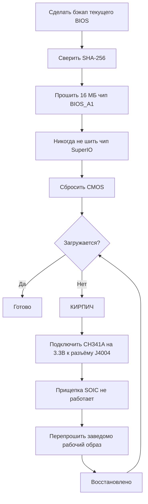

# BIOS и раскирпичивание

> **Коротко** — Неверная настройка BIOS может **намертво окирпичить BC-250**, и на этой плате сброс CMOS *не всегда* помогает ([src](https://t.me/c/2424231195/54971)). Прежде чем что-либо прошивать, пойми главное: нужен **набор для аппаратного восстановления** — **SPI-программатор класса CH341A + провода мама-мама**, потому что единственный надёжный способ раскирпичить — перепрошить чип внешне через **разъём J4004** на плате. Популярный мод комьюнити (BIOS от «death», свежий — на основе стока **5.00**) открывает разгон, тайминги GDDR6 и выделение памяти под iGPU — полезно, но **не все настройки безопасны, часть кирпичит плату мгновенно** ([src](https://t.me/c/2424231195/78922)). Сначала сверяй **SHA-256** каждого образа и читай [`assets/firmware/DISCLAIMER.md`](../../assets/firmware/DISCLAIMER.md). **Не прошивай на расслабоне.**

⚠️ **Это самая опасная глава справочника.** Прошивка необратима без оборудования для восстановления. Если ты не готов припаяться/прицепиться к SPI-чипу, чтобы оживить кирпич, — **остановись здесь и сиди на стоковом BIOS.**

---

## Что такое BIOS на BC-250

BC-250 — собранная AsRock майнинг/серверная плата с урезанным PS5-APU «Oberon». Прошивка UEFI живёт на **16 МБ SPI-флеш-чипе** (Winbond **W25Q128** / Macronix MX25L128 в корпусе SOIC-8). Стоковая прошивка сильно залочена: в Setup почти ничего полезного не открыто. В чате встречаются стоковые версии **3.00** и **5.00**; моды пересобраны из них (номер версии — твой ориентир, всегда отмечай, на какой базе собран мод).

Перепрошивают по двум причинам:

1. **Поставить модифицированный BIOS** с разблокированными скрытыми меню (разгон, андервольт, память, VRAM iGPU).
2. **Раскирпичить** — вернуть заведомо рабочий образ после плохой настройки или неудачной прошивки.

> 💡 **Возможно, прошивка вообще не нужна.** Если твоя *единственная* цель — поменять раздел VRAM/UMA, это делается из работающего Linux на **стоковом** P3.00 / P5.00 через **[fanoush/bc250_memcfg](https://github.com/fanoush/bc250_memcfg)** — без прошивки, без программатора, без риска кирпича ([elektricM: прошивка BIOS](https://elektricm.github.io/amd-bc250-docs/bios/flashing/), [elektricM: VRAM](https://elektricm.github.io/amd-bc250-docs/bios/vram/)). Прошивать мод-биос нужно только ради *разблокированных chipset-меню* и фич сверх размера VRAM (команда `bc250_memcfg` — в [09-overclock-undervolt.md](09-overclock-undervolt.md)).

---

## Мод BIOS («death») — что меняет и зачем

Эталонный мод комьюнити ведёт **death** в чате. Это *не* прошивка с нуля — он заново включает (раскрывает) опции AMD/AMI Setup, которые сток прячет. Следи за версиями: советы со временем менялись.

| Версия мода | База | Релиз | Что открыто / изменено | Статус |
|---|---|---|---|---|
| **1.0** (первый релиз) | сток **3.00** | 2025-06-28 | Частота GDDR6, тайминги GDDR6, размер UMA-памяти iGPU, частота ядер, напряжения | ⚠️ Плохие значения кирпичат плату, **сброс CMOS не помог** ([src](https://t.me/c/2424231195/54971)) |
| Варианты 3.0 | 3.00 | 2025-07 → 10 | Те же разблокировки; одна сборка добавила **кастомное лого Steam при включении** | Косметическая сборка — зеркало `bc250-Steam.rom` ([src](https://t.me/c/2424231195/86420)) |
| **Мод 5.00** (текущий) | сток **5.00** | 2025-10-05 | Вкладки перегруппированы; **открыто больше настроек**; **тайминги ОЗУ/GDDR6 теперь реально применяются** на этой плате | Свежий; «не все настройки полезны, но это лучше, чем ничего» ([src](https://t.me/c/2424231195/78922)) |

Что реально крутится (из заметок к первому релизу, [src](https://t.me/c/2424231195/54971)):

- **Частота GDDR6** — у одного пользователя (`@Haswellb`) завелось на **1800**, но *похожее изменение окирпичило другую плату* — значения индивидуальны для платы, не универсальны.
- **Тайминги GDDR6** — применяются, но **слишком низкие/тугие кирпичат** плату.
- **Размер памяти iGPU (UMA)** — работает и даёт реальный прирост. Если изменение не вступает в силу, выстави **IGC: Forces** и **UMA Mode: UMA_SPECIFIED** ([src](https://t.me/c/2424231195/54971); та же связка подтверждена в доках комьюнити).
- **Частота ядер / напряжения** — открыты, но автором **«не проверено»**.

> ❗ **Два предупреждения автора, актуальны до сих пор:** (1) **Не отключай Integrated Graphics** — это единственный видеовыход. (2) На любом из этих модов **неверная настройка может окирпичить плату, а сброс CMOS может её не вернуть** — именно поэтому нужен программатор. (Как выбрать базу — лесенка «какую версию?» ниже.)

> ### Какую версию? (лесенка выбора)
>
> 1. **Мод P3.00 (ROM chipset-меню) — безопасный дефолт.** Это устоявшийся **«стандарт комьюнити… самый стабильный и обкатанный»**, публично-проверенный с известным SHA-256, и он уже покрывает **разблокировку VRAM + chipset-настройки**. Начинай отсюда, если нет конкретной причины иначе ([elektricM: прошивка BIOS](https://elektricm.github.io/amd-bc250-docs/bios/flashing/)).
> 2. **Мод 5.00 — текущий; бери, если нужен тюнинг памяти.** Это самая свежая база и именно та, где **тайминги ОЗУ/GDDR6 реально применяются** на этой плате ([src](https://t.me/c/2424231195/78922)). Выбирай его вместо P3.00, когда хочешь крутить тайминги памяти.
> 3. **`P5.00_clv` — только для экспертов.** Он «открывает **Всё»** (каждое скрытое меню, включая экспериментальный **ReBAR / Resizable BAR** и debug/chipset-настройки), из-за чего его *«очень легко окирпичить, если поменять не то… Сиди на P3.00, если ты не продвинутый юзер»*. Хуже того, **`P5.00_clv` не выложен ни в одном публичном репозитории**, который смог найти гайд, — он ходит только как вложение в Discord, так что **канонического хеша нет**; если он тебе нужен — возьми копии у **двух** людей, гоняющих его независимо, и убедись, что у обоих **одинаковый SHA-256** перед прошивкой ([elektricM: прошивка BIOS](https://elektricm.github.io/amd-bc250-docs/bios/flashing/)).

Есть и отдельный **chipset-menu мод** (`BC250_3.00_CHIPSETMENU.ROM`) из самого упоминаемого BIOS-репозитория **[TuxThePenguin0/bc250-bios](https://gitlab.com/TuxThePenguin0/bc250-bios/)**, открывающий **chipset-меню / NBIO Common Options** поверх стока 3.00. README репозитория прямо говорит: *«Ничто в этом репозитории не поддерживается и не имеет никакой гарантии — ДЕЛАЙТЕ БЭКАПЫ».*

> 🚫 **Не используй `Smokeless_UMAF`.** Гайд комьюнити по разгону помечает этот инструмент редактирования UEFI как то, что **на BC-250 запускать нельзя — он может необратимо повредить плату** ([elektricM: разгон BIOS](https://elektricm.github.io/amd-bc250-docs/bios/overclocking/)). Сиди на заведомо рабочих ROM выше.

---

## Перед прошивкой — чек-лист безопасности

1. **Сначала сделай бэкап текущего BIOS** (считай его тем же инструментом, которым будешь шить — см. Путь B/восстановление). Бэкап — это бесплатный откат.
2. **Сверь SHA-256** образа с `assets/PROVENANCE.md` / исходным постом. Гайд комьюнити публикует хеш chipset-menu-ROM:
   `48fbe5d366e6a56e2fdffdca848426216ba1f083610dab63db89d2f4e6c940b5` ([доки elektricm](https://elektricm.github.io/amd-bc250-docs/bios/flashing/)).
3. **Подтверди объём чипа**, а не только маркировку. Цель — 16 МБ BIOS-чип; **не** шей маленький чип SuperIO (см. раздел восстановления). Разные ревизии плат могут нести чуть разные парт-номера — важна **ёмкость (16 МБ)**, последние буквы маркировки могут отличаться ([src](https://t.me/c/2424231195/67880)).
4. **Подготовь оборудование для восстановления** *до* первой прошивки, а не после кирпича.
5. После прошивки **сбрось CMOS**, чтобы новые настройки (особенно выделение VRAM) вступили в силу (см. «После каждой прошивки»).



### Сверь контрольную сумму перед прошивкой

Пункт 2 выше велит сверить SHA-256 — вот как это сделать. Посчитай хеш файла, который собираешься шить, и сверь его символ в символ со значением для этого файла в [`assets/PROVENANCE.md`](../../assets/PROVENANCE.md).

```bash
# Linux:
sha256sum BC250_3.00_CHIPSETMENU.ROM
```

```powershell
# Windows (PowerShell):
Get-FileHash BC250_3.00_CHIPSETMENU.ROM -Algorithm SHA256
```

В `PROVENANCE.md` могут быть указаны только **первые 16 hex-символов** как короткий отпечаток. Если так — проверь, что твой посчитанный хеш **начинается с** этих 16 символов: полное совпадение этого префикса уже даёт сильную проверку (полные хеши мейнтейнер может опубликовать по запросу).

**Проверенные полные SHA-256** публично выложенных образов (сверено по нескольким репозиториям комьюнити — любой заведомо рабочий BIOS-файл BC-250 имеет **ровно 16 МБ / 16777216 байт**; другой размер означает битый файл, тулу/патч или вообще не то) ([elektricM: прошивка BIOS](https://elektricm.github.io/amd-bc250-docs/bios/flashing/)):

| Файл | Тип | SHA-256 |
|---|---|---|
| `BC250_3.00_CHIPSETMENU.ROM` (он же `Robin3.00`, `BC250CHIPSETMENU.ROM`) | **Мод P3.00** — разблокировка VRAM + chipset, *рекомендуется* | `48fbe5d366e6a56e2fdffdca848426216ba1f083610dab63db89d2f4e6c940b5` |
| `Robin5.00` | **Сток** P5.00 (не модовый `P5.00_clv`) | `0d6f136cb120cf3b2de26d5c4d7f255604fdbf4b9442af5ba55419b95b89aa82` |
| `BC250_3.00.ROM` | Сток P3.00 | `07595ca3aecf8a4caa28a397b5298f3946a1b769f87b16f67adc369c3f69045c` |
| `BC250_2.00.bin` | Сток P2.00 | `ee6150dfed33bd05ea46063a352549416fdf3f45fa0e5edac2a68ef78d71083c` |
| `P5.00_clv` | Мод P5.00 (разблокировать всё) | **публичного хеша нет** — только Discord, сверь две независимые копии |

> Мод P3.00 встречается под разными именами в разных репозиториях (`BC250_3.00_CHIPSETMENU.ROM`, `BC250CHIPSETMENU.ROM`, `Robin3.00`) — все хешируются в значение выше, так что имя неважно. `Robin5.00` — это **сток** P5.00, *другой файл*, чем модовый `P5.00_clv`. Публичные источники каждого (TuxThePenguin0 GitLab, forgenam, tipitochen, csabakecskemeti, scrakcho, dannybastos, kenavru, MrrZed0) перечислены в [гайде elektricM](https://elektricm.github.io/amd-bc250-docs/bios/flashing/).

> 🔴 **Если контрольная сумма не совпала — НЕ прошивай.** Несовпадение означает битый или неверный файл — прошить такой и есть прямой путь к кирпичу. Перекачай образ и сверь заново.

---

## Путь A — Программная прошивка (с платы, без программатора)

Обычный способ поставить/обновить BIOS, пока плата ещё загружается. Нужны **флешка FAT32** и утилита обновления AMI.

**Метод EFI / AFU** ([src](https://t.me/c/2424231195/54979)):

1. Отформатируй флешку в **FAT32**.
2. Закинь на неё содержимое архива AFU (напр. `AfuEfi64_5.16.zip`) **и сам файл BIOS**.
3. Перезагрузи BC-250 и **загрузись с флешки** в EFI-шелл.
4. Выполни:
   ```
   afuefix64.efi <имя_файла>.<расширение> /P /N
   ```
   - `/P` = прошить основной BIOS.
   - `/N` = прошить ещё и **NVRAM**. Это избавляет от ошибок при переходе *между* версиями (напр. на 3.00 с другой версии) — **но стирает сохранённые настройки.** Можно убрать `/N`, но тогда возможны ошибки. ([src](https://t.me/c/2424231195/54979))
5. Если утилита не видит файл, перебирай `fs0:`, `fs1:`, … и смотри, какая из директорий — флешка ([src](https://t.me/c/2424231195/54979)).

Некоторые сборки комьюнити идут с готовым скриптом `Flash.nsh` и переименованным ROM (переименуй модовый ROM под скрипт) — тогда нужно лишь загрузиться в EFI-шелл и запустить скрипт ([доки elektricm](https://elektricm.github.io/amd-bc250-docs/bios/flashing/)). На Linux есть сборка **`afulnx`** (`afulnx-5.05.04Z.tar.gz`) для прошивки из работающей системы ([src](https://t.me/c/2424231195/54507)).

#### Каноничный рецепт EFI-шелла (метод `Flash.nsh` / `Robin5.00`)

Гайд комьюнити по прошивке стандартизирует самодостаточный набор и фиксированное имя файла — это самый воспроизводимый USB-путь ([elektricM: прошивка BIOS](https://elektricm.github.io/amd-bc250-docs/bios/flashing/)):

1. **Возьми EFI-набор:** `4U12G BIOS Update.zip` (из репозитория [kenavru/BC-250](https://github.com/kenavru/BC-250)) — в нём `AfuEfix64.efi`, `Flash.nsh` и `amdvbflash.efi`. *В нём же лежит стоковый P5.00 под именем `Robin5.00` — убери его в сторону, чтобы случайно не прошить.*
2. **Подготовь флешку FAT32 (≤ 32 ГБ рекомендуется).** Скопируй содержимое папки `BIOS EFI` из набора в **корень**.
3. **Переименуй свой модовый ROM в `Robin5.00`** (убери расширение `.ROM`) — именно это имя ищет `Flash.nsh`. *(Либо отредактируй `Flash.nsh` под своё имя.)* В корне должно лежать: `AfuEfix64.efi`, `Flash.nsh`, `amdvbflash.efi`, `Robin5.00` (твой переименованный мод) и папка `EFI`.
4. **Подключайся напрямую по DisplayPort.** Активные/пассивные **HDMI-переходники могут дать чёрный экран в меню BIOS** — известная засада с дисплеем на этой плате.
5. **Отключи все SSD/диски**, чтобы плата автоматически провалилась в EFI-шелл, вставь флешку, включи питание. Окажешься у жёлтого приглашения `Shell>`.
6. У приглашения набери **`blk0:`** и Enter — **обрати внимание на пробел после двоеточия** (это выбирает USB-том; `blk0:` — это документированный elektricM селектор, отличный от перебора `fs0:`/`fs1:` выше). Затем набери **`Flash.nsh`** и Enter.
7. **ЖДИ. Не трогай клавиатуру, не выключай питание.** Если *кажется*, что зависло на записи, **подожди минимум 15 минут** — выключение посреди записи кирпичит плату. По завершении она перезагрузится (или попросит).
8. **Сразу выключи питание и вынь флешку**, чтобы она не загрузилась обратно в прошивальщик.

> 🔴 **Перед подачей питания на прошивку: сверь проводку 8-pin PCIe** со схемой 12 В/GND твоего БП. **Переполюсовка может необратимо повредить плату** ([elektricM: прошивка BIOS](https://elektricm.github.io/amd-bc250-docs/bios/flashing/)).

#### Обязательные настройки BIOS после прошивки (сделай сразу после сброса CMOS)

После прошивки **и** сброса CMOS (следующий раздел) зайди в Setup (жми **Del**) и выставь это — раздел VRAM не заработает правильно, пока не выставлено ([elektricM: прошивка BIOS](https://elektricm.github.io/amd-bc250-docs/bios/flashing/), [elektricM: VRAM BIOS](https://elektricm.github.io/amd-bc250-docs/bios/vram/)):

| Настройка | Путь | Значение |
|---|---|---|
| Integrated Graphics Controller | Chipset → GFX Configuration | **Forces** |
| UMA Mode | Chipset → GFX Configuration | **UMA_SPECIFIED** |
| UMA Frame Buffer Size | Chipset → GFX Configuration | **512MB** (рекомендуется) или фиксированный размер |
| IOMMU | Advanced → CPU Configuration | **Disabled** |
| Boot Mode | Boot → Boot Mode | **UEFI** |

Сначала проверь, что сброс CMOS реально прошёл — **часы должны показывать неверное время**; если оно всё ещё верное, повтори сброс. Затем F10 для сохранения. Выбор `512MB` — это *динамическое* выделение, а не лимит в 512 МБ (см. [09-overclock-undervolt.md](09-overclock-undervolt.md)).

**Запасной flashrom** (если AFU выдаёт ошибку) ([src](https://t.me/c/2424231195/54979), подсказал и проверил `@mrartemsid`):

```bash
# Считать (бэкап):
sudo flashrom -p internal:boardmismatch=force -r <имя>.bin
# Прошить:
sudo flashrom -p internal:boardmismatch=force -w <имя>.bin
```

> ⚠️ Программная прошивка спасает только **пока плата POST-ится**. Как только плохая настройка её окирпичила — Путь A недоступен, остаётся аппаратный путь ниже.

---

## Путь B — Аппаратная прошивка / раскирпичивание (SPI-программатор CH341A)

Это **путь восстановления** и закреплённый «самый удобный способ прошивки при кирпиче» ([src](https://t.me/c/2424231195/67880)). 16 МБ SPI-чип перезаписывается напрямую, с другого ПК, через USB SPI-программатор. Софт: **NeoProgrammer** (Windows) или **flashrom** (Linux).

> 🔴 **Прищепка SOIC-8 на этой плате НЕ работает.** death прямо говорит: *«Прищепка на нашей плате работает… Никак, короче.»* ([src](https://t.me/c/2424231195/67880)). Замечание: в `assets/firmware/DISCLAIMER.md` обобщённо упомянута «SOIC clip» — на практике нужно **подключаться к плате через разъём J4004.** Это важнейший факт восстановления в этой главе.

### Распиновка разъёма J4004 (подключаемся сюда)

Плата выводит **разъём J4004 с шагом 2.54 мм** специально для перепрошивки SPI/BIOS-чипа. Распиновка (из закреплённого скрина с проводкой, [src](https://t.me/c/2424231195/67880)):

```
J4004
[ GND  SCLK  MOSI  UNK ]
[ VCC  CS    MISO      ]
   ^  (метка 1-го пина)
```

| Пин J4004 | Сигнал | Контакт CH341A |
|---|---|---|
| VCC | питание 3.3 В | VDD / 3.3V |
| GND | земля | GND |
| CS | выбор чипа | CS / SS |
| SCLK | тактирование | CLK / SCK |
| MOSI | данные в чип | MOSI |
| MISO | данные из чипа | MISO |

Соответствующая **цветовая карта W25Q128 SOIC-8 / CH341A** — на том же закреплённом скрине: сопоставь `/CS, DO(MISO), CLK, DI(MOSI), VCC, GND` с контактами CH341A `CS, MISO, CLK, MOSI, VDD, GND`. **Десять раз проверь VCC и GND** перед подачей питания; их переполюсовка убивает чип ([src](https://t.me/c/2424231195/67880)).

> **Нумерация пинов J4004 и два неизвестных пина.** Гайд elektricM нумерует разъём VCC=1, GND=2, CS=3, SCLK=4, MISO=5, MOSI=6, при этом **пины 7 и 8 для прошивки не используются — они притянуты к земле через резисторы 10 кОм.** Пин 1 (VCC) помечен **стрелкой `>` или квадратным пятаком** на плате ([elektricM: прошивка BIOS](https://elektricm.github.io/amd-bc250-docs/bios/flashing/)).

> **Точный чип-цель и опечатка в плотности.** 16 МБ деталь — это Winbond **W25Q128JVSQ** (128 Мбит / 16 МБ) или, на части партий, Macronix **MX25L12835F**. В части доков комьюнити это ошибочно пишут как **«25Q168» — это неверно**; правильный код плотности на 16 МБ — **128** ([elektricM: прошивка BIOS](https://elektricm.github.io/amd-bc250-docs/bios/flashing/)). Если шьёшь через голую **прищепку SOIC-8** вместо J4004, порядок пинов самого чипа — стандартная SPI-раскладка: `1 CS · 2 DO · 3 WP · 4 GND · 5 DI · 6 CLK · 7 HOLD · 8 VCC` ([elektricM: восстановление BIOS](https://elektricm.github.io/amd-bc250-docs/bios/recovery/)) — но помни вывод death, что **прищепка на этой плате почти не работает**, так что предпочитай J4004.

> 🙏 Кредит: распиновка J4004, реверс-инжиниринг и репозиторий модовых образов — во многом работа **Segfault** (ROM chipset-меню P3.00 — это «мод Segfault») ([elektricM: прошивка BIOS](https://elektricm.github.io/amd-bc250-docs/bios/flashing/)).

### Процедура NeoProgrammer (закреп) ([src](https://t.me/c/2424231195/67880))

1. Подключи программатор к **J4004** проводами мама-мама согласно распиновке. **Проверь проводку ~10 раз, особенно VCC и GND.** (БП отключён.)
2. Открой **NeoProgrammer**.
3. Запусти **автоопределение** чипа и заодно посмотри маркировку на самом чипе.
4. **Сверь маркировки.** Если последние буквы не совпадают со списком, но **ёмкость совпадает (16 МБ)** — это нормально.
5. **Затри** чип.
6. **Открой файл BIOS** в софте (можно перетащить ЛКМ).
7. **Прошей** чип.
8. **Отключи провода от J4004.**
9. Включи плату.

### Эквивалент на flashrom (Linux), сверено с доками комьюнити

Гайд комьюнити использует программатор **CH347** и предостерегает от дешёвых CH341A на чёрном текстолите (следующий раздел). Определи правильный чип — цель **16 МБ BIOS-чип** (`BIOS_A1`), **никогда** не 512 КБ SuperIO (`SIO1_R`): его прошивка кирпичит SuperIO ([доки elektricm](https://elektricm.github.io/amd-bc250-docs/bios/flashing/)):

```bash
# Определить / опознать чип:
sudo flashrom -p ch347_spi

# Бэкап стокового BIOS (дважды, затем diff — убедиться, что чтение стабильно):
sudo flashrom -p ch347_spi -r backup_stock.bin
sudo flashrom -p ch347_spi -r backup_verify.bin

# Прошить новый образ, затем сверить, что он считался обратно идентично:
sudo flashrom -p ch347_spi -w BC250_3.00_CHIPSETMENU.ROM
sudo flashrom -p ch347_spi -v BC250_3.00_CHIPSETMENU.ROM
```

(Для CH341A используй `-p ch341a_spi`, для Raspberry Pi Pico — `serprog` вместо `ch347_spi`.) ⚠ Соответствие `ch347_spi` / `serprog` именно для проводки *этой* платы взято из гайда комьюнити — `⚠ verify` под свою модель программатора.

> **Определение скажет, на каком ты чипе.** Если `flashrom -p …` сообщает **`Winbond W25Q128…`** или **`Macronix MX25L128…`** — ты на правильном 16 МБ BIOS-чипе. Если сообщает **`Macronix MX25L4005…` (512 КБ)** — **СТОП: ты прицепился к чипу SuperIO** (`SIO1_R`); его прошивка кирпичит управление вентилятором/датчики. Перейди на другой чип ([elektricM: прошивка BIOS](https://elektricm.github.io/amd-bc250-docs/bios/flashing/)). Шей с **БП, выдернутым из розетки**, и разряженными конденсаторами (несколько раз нажми кнопку питания) — питать плату во время прошивки прищепкой *не* рекомендуется ([elektricM: восстановление BIOS](https://elektricm.github.io/amd-bc250-docs/bios/recovery/)).

### Ловушка 3.3 В у CH341A (прочитай, иначе спалишь чип)

Многие дешёвые **CH341A на чёрном текстолите** держат **линии данных на 5 В, хотя VCC = 3.3 В** — BIOS-чип BC-250 это **3.3 В** деталь, и 5 В на линиях данных могут его повредить. Это известная, измеренная неисправность на части плат (плата Fabian и идентичная ей в чате подтверждены замером напряжения) ([src](https://t.me/c/2424231195/100285)). Решения:

- Бери программатор, реально дающий 3.3 В на линиях данных (напр. **CH347**), **или**
- Сделай **беспаечный фикс CH341A 5В→3.3В для линий данных**: перережь USB-линию 5 В к чипу и подай вместо неё 3.3 В — см. [разбор на sawyershepherd.org](https://sawyershepherd.org/post/solderless-ch341ab-fix-5v-to-33v-data-lines/) и [фикс CH341A на wej.k.vu](https://wej.k.vu/electronics/ch341a-mini-programmer-fix/) ([src](https://t.me/c/2424231195/100285)).

---

## Идея «srep» с авто-сбросом (эксперимент — не готовая фича)

Поскольку плохая настройка кирпичит плату, а **сброс CMOS не помогает**, death пробовал зашить в BIOS процедуру **`srep`**, чтобы **сбрасывать настройки при кирпиче** — идея изначально от `@Jacky_Fish` ([src](https://t.me/c/2424231195/60552)). Замысел: BIOS патчит свои переменные NVRAM/`amdsetup` обратно к дефолтам, по желанию — только при наличии триггер-файлов на флешке (чтобы не стирать настройки каждый раз). На момент чата **это ещё не заработало** — *«плата упорно делает вид, что она полный кирпич, и ничего не сбросится»* ([src](https://t.me/c/2424231195/60883)). Считай любое заявление о «самовосстанавливающемся BIOS» **недоказанным**; реальная страховка — внешний программатор. `⚠ verify` прежде чем полагаться на любую srep-сборку.

---

## После каждой прошивки — сбрось CMOS (не пропускай)

Прошивка BIOS **не** сбрасывает сохранённые настройки, и часть из них (особенно **выделение VRAM/UMA**) не применится, пока не сбросишь CMOS. Пользователь словил ровно это: BIOS показывал новый размер VRAM и «сохранял» его, но ОС (Bazzite) по-прежнему показывала старое разбиение 4 ГБ RAM / 12 ГБ VRAM, пока не сбросили CMOS ([src](https://t.me/c/2424231195/97290)). Как сбросить:

- **Вынь батарейку CR2032 на 60+ секунд** (рекомендуется), **или**
- **Замкни перемычку CMOS на ~20 секунд.** ([доки elektricm](https://elektricm.github.io/amd-bc250-docs/bios/flashing/))

> Учитывай предел: сброс CMOS лечит «настройки не применились» и *мягкие* плохие конфиги — но на поколении мода 1.0/3.00 он, по сообщениям, **не** вытаскивал настоящий кирпич ([src](https://t.me/c/2424231195/54971)). Для этого — Путь B.

---

## Зеркала прошивок

Образы BIOS из чата зеркалированы в `assets/firmware/` для **восстановления/сохранности** (см. [`DISCLAIMER.md`](../../assets/firmware/DISCLAIMER.md) и сверяй SHA-256 каждого файла в `PROVENANCE.md` перед прошивкой):

| Файл | Размер | Что это | Источник |
|---|---|---|---|
| `BC250_3.00.ROM` | 16 МБ | Дамп стока 3.00 | ([src](https://t.me/c/2424231195/5215)) |
| `BC250_3.00_CHIPSETMENU.ROM` | 16 МБ | Chipset-menu мод (TuxThePenguin0) | ([src](https://t.me/c/2424231195/86395)) |
| `dump_5.00.bin` | 16 МБ | Дамп стока 5.00 | ([src](https://t.me/c/2424231195/24661)) |
| `BC250_5.00_clv.zip` | 16 МБ | **Мод 5.00 от death (текущий)** | ([src](https://t.me/c/2424231195/78922)) |
| `bc250_3.00_clv1.zip` | 16 МБ | Первый 3.00-мод death (1.0) | ([src](https://t.me/c/2424231195/54971)) |
| `bc250-Steam.rom` | 16 МБ | 3.0-мод с лого Steam | ([src](https://t.me/c/2424231195/86420)) |
| `bc250 modded bios.ROM` | 16 МБ | Ранний модовый образ | ([src](https://t.me/c/2424231195/30100)) |
| `my_4.0_MODED.bin` | 16 МБ | Промежуточный 4.0-мод | ([src](https://t.me/c/2424231195/45580)) |
| `W25Q128BV@WSON8_…BIN` | 16 МБ | Сырое чтение чипа (W25Q128) | ([src](https://t.me/c/2424231195/5217)) |
| `AfuEfi64_5.16.zip` | — | AMI AFU EFI-прошивальщик | ([src](https://t.me/c/2424231195/54979)) |
| `afulnx-5.05.04Z.tar.gz` | — | AMI AFU Linux-прошивальщик | ([src](https://t.me/c/2424231195/54507)) |

> Не шей PS5-BIOS (`PS5 Disk Edition … BIOS.bin`, 2 МБ) или 512 КБ чипы на 16 МБ BIOS-чип BC-250 — неверная цель, см. предупреждения по восстановлению.

---

## Источники

- Мод death — первый релиз (3.00) — https://t.me/c/2424231195/54971 · текущий (5.00) — https://t.me/c/2424231195/78922 · сборка с лого Steam — https://t.me/c/2424231195/86420
- Программная прошивка (AFU `/P /N`, flashrom) — https://t.me/c/2424231195/54979 · afulnx — https://t.me/c/2424231195/54507
- Аппаратное раскирпичивание (закреп, NeoProgrammer + скрины проводки J4004) — https://t.me/c/2424231195/67880
- Идея авто-сброса srep — https://t.me/c/2424231195/60552 · результат (не заработало) — https://t.me/c/2424231195/60883
- Нужен сброс CMOS после прошивки — https://t.me/c/2424231195/97290
- Ловушка CH341A 5В→3.3В на линиях данных — https://t.me/c/2424231195/100285 · разбор фикса — https://sawyershepherd.org/post/solderless-ch341ab-fix-5v-to-33v-data-lines/
- Самый упоминаемый BIOS-репозиторий — [TuxThePenguin0/bc250-bios](https://gitlab.com/TuxThePenguin0/bc250-bios/) (`BC250_3.00_CHIPSETMENU.ROM`, `CHIPSETMENU.md`)
- Гайд комьюнити по прошивке (проверенная таблица SHA-256, рецепт `Flash.nsh`/`Robin5.00`, селектор `blk0:`, засада DisplayPort/HDMI, правило 15 минут при зависании, распиновка J4004 + пины 7/8, W25Q128JVSQ/опечатка «25Q168», CH347, значения Setup после прошивки, кредит Segfault) — [elektricM: прошивка BIOS](https://elektricm.github.io/amd-bc250-docs/bios/flashing/)
- Гайд восстановления (распиновка SPI 8-pin, MX25L4005 = определение SuperIO, прошивка с выдернутым БП, разборы сценариев) — [elektricM: восстановление BIOS](https://elektricm.github.io/amd-bc250-docs/bios/recovery/)
- Гайд VRAM (`bc250_memcfg` без прошивки, значения UMA Frame Buffer, VRAM через параметры ядра, отчёт Vulkan-против-OpenGL) — [elektricM: VRAM BIOS](https://elektricm.github.io/amd-bc250-docs/bios/vram/)
- Предупреждение про `Smokeless_UMAF` — [elektricM: разгон BIOS](https://elektricm.github.io/amd-bc250-docs/bios/overclocking/)
- Инструмент VRAM без прошивки — [fanoush/bc250_memcfg](https://github.com/fanoush/bc250_memcfg)
- Утилита таймингов памяти — `Mem_Timing_Utility.zip` https://t.me/c/2424231195/55351
- Политика зеркал прошивок — [`assets/firmware/DISCLAIMER.md`](../../assets/firmware/DISCLAIMER.md)

> Разгон/андервольт *через* эти разблокированные настройки — в [09-overclock-undervolt.md](09-overclock-undervolt.md). Зеркала образов BIOS — в `assets/firmware/` с SHA-256 каждого файла в `PROVENANCE.md`.
