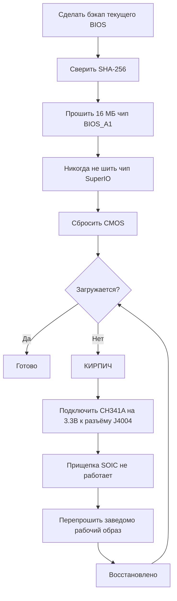

# BIOS и раскирпичивание

> **Коротко** — Неверная настройка BIOS может **намертво окирпичить BC-250**, и на этой плате сброс CMOS *не всегда* помогает ([src](https://t.me/c/2424231195/54971)). Прежде чем что-либо прошивать, пойми главное: нужен **набор для аппаратного восстановления** — **SPI-программатор класса CH341A + провода мама-мама**, потому что единственный надёжный способ раскирпичить — перепрошить чип внешне через **разъём J4004** на плате. Популярный мод комьюнити (BIOS от «death», свежий — на основе стока **5.00**) открывает разгон, тайминги GDDR6 и выделение памяти под iGPU — полезно, но **не все настройки безопасны, часть кирпичит плату мгновенно** ([src](https://t.me/c/2424231195/78922)). Сначала сверяй **SHA-256** каждого образа и читай [`assets/firmware/DISCLAIMER.md`](../../assets/firmware/DISCLAIMER.md). **Не прошивай на расслабоне.**

⚠️ **Это самая опасная глава справочника.** Прошивка необратима без оборудования для восстановления. Если ты не готов припаяться/прицепиться к SPI-чипу, чтобы оживить кирпич, — **остановись здесь и сиди на стоковом BIOS.**

---

## Что такое BIOS на BC-250

BC-250 — собранная AsRock майнинг/серверная плата с урезанным PS5-APU «Oberon». Прошивка UEFI живёт на **16 МБ SPI-флеш-чипе** (Winbond **W25Q128** / Macronix MX25L128 в корпусе SOIC-8). Стоковая прошивка сильно залочена: в Setup почти ничего полезного не открыто. В чате встречаются стоковые версии **3.00** и **5.00**; моды пересобраны из них (номер версии — твой ориентир, всегда отмечай, на какой базе собран мод).

Перепрошивают по двум причинам:

1. **Поставить модифицированный BIOS** с разблокированными скрытыми меню (разгон, андервольт, память, VRAM iGPU).
2. **Раскирпичить** — вернуть заведомо рабочий образ после плохой настройки или неудачной прошивки.

---

## Мод BIOS («death») — что меняет и зачем

Эталонный мод комьюнити ведёт **death** в чате. Это *не* прошивка с нуля — он заново включает (раскрывает) опции AMD/AMI Setup, которые сток прячет. Следи за версиями: советы со временем менялись.

| Версия мода | База | Релиз | Что открыто / изменено | Статус |
|---|---|---|---|---|
| **1.0** (первый релиз) | сток **3.00** | 2025-06-28 | Частота GDDR6, тайминги GDDR6, размер UMA-памяти iGPU, частота ядер, напряжения | ⚠️ Плохие значения кирпичат плату, **сброс CMOS не помог** ([src](https://t.me/c/2424231195/54971)) |
| Варианты 3.0 | 3.00 | 2025-07 → 10 | Те же разблокировки; одна сборка добавила **кастомное лого Steam при включении** | Косметическая сборка — зеркало `bc250-Steam.rom` ([src](https://t.me/c/2424231195/86420)) |
| **Мод 5.00** (текущий) | сток **5.00** | 2025-10-05 | Вкладки перегруппированы; **открыто больше настроек**; **тайминги ОЗУ/GDDR6 теперь реально применяются** на этой плате | Свежий; «не все настройки полезны, но это лучше, чем ничего» ([src](https://t.me/c/2424231195/78922)) |

Что реально крутится (из заметок к первому релизу, [src](https://t.me/c/2424231195/54971)):

- **Частота GDDR6** — у одного пользователя (`@Haswellb`) завелось на **1800**, но *похожее изменение окирпичило другую плату* — значения индивидуальны для платы, не универсальны.
- **Тайминги GDDR6** — применяются, но **слишком низкие/тугие кирпичат** плату.
- **Размер памяти iGPU (UMA)** — работает и даёт реальный прирост. Если изменение не вступает в силу, выстави **IGC: Forces** и **UMA Mode: UMA_SPECIFIED** ([src](https://t.me/c/2424231195/54971); та же связка подтверждена в доках комьюнити).
- **Частота ядер / напряжения** — открыты, но автором **«не проверено»**.

> ❗ **Два предупреждения автора, актуальны до сих пор:** (1) **Не отключай Integrated Graphics** — это единственный видеовыход. (2) На поколении 1.0/3.00 **неверная настройка кирпичит плату, а сброс CMOS её не вернёт** — именно поэтому нужен программатор. Сегодня лучше стартовать с мода 5.00.

Есть и отдельный **chipset-menu мод** (`BC250_3.00_CHIPSETMENU.ROM`) из самого упоминаемого BIOS-репозитория **[TuxThePenguin0/bc250-bios](https://gitlab.com/TuxThePenguin0/bc250-bios/)**, открывающий **chipset-меню / NBIO Common Options** поверх стока 3.00. README репозитория прямо говорит: *«Ничто в этом репозитории не поддерживается и не имеет никакой гарантии — ДЕЛАЙТЕ БЭКАПЫ».*

---

## Перед прошивкой — чек-лист безопасности

1. **Сначала сделай бэкап текущего BIOS** (считай его тем же инструментом, которым будешь шить — см. Путь B/восстановление). Бэкап — это бесплатный откат.
2. **Сверь SHA-256** образа с `assets/PROVENANCE.md` / исходным постом. Гайд комьюнити публикует хеш chipset-menu-ROM:
   `48fbe5d366e6a56e2fdffdca848426216ba1f083610dab63db89d2f4e6c940b5` ([доки elektricm](https://elektricm.github.io/amd-bc250-docs/bios/flashing/)).
3. **Подтверди объём чипа**, а не только маркировку. Цель — 16 МБ BIOS-чип; **не** шей маленький чип SuperIO (см. раздел восстановления). Разные ревизии плат могут нести чуть разные парт-номера — важна **ёмкость (16 МБ)**, последние буквы маркировки могут отличаться ([src](https://t.me/c/2424231195/67880)).
4. **Подготовь оборудование для восстановления** *до* первой прошивки, а не после кирпича.
5. После прошивки **сбрось CMOS**, чтобы новые настройки (особенно выделение VRAM) вступили в силу (см. «После каждой прошивки»).



### Сверь контрольную сумму перед прошивкой

Пункт 2 выше велит сверить SHA-256 — вот как это сделать. Посчитай хеш файла, который собираешься шить, и сверь его символ в символ со значением для этого файла в [`assets/PROVENANCE.md`](../../assets/PROVENANCE.md).

```bash
# Linux:
sha256sum BC250_3.00_CHIPSETMENU.ROM
```

```powershell
# Windows (PowerShell):
Get-FileHash BC250_3.00_CHIPSETMENU.ROM -Algorithm SHA256
```

В `PROVENANCE.md` могут быть указаны только **первые 16 hex-символов** как короткий отпечаток. Если так — проверь, что твой посчитанный хеш **начинается с** этих 16 символов: полное совпадение этого префикса уже даёт сильную проверку (полные хеши мейнтейнер может опубликовать по запросу).

> 🔴 **Если контрольная сумма не совпала — НЕ прошивай.** Несовпадение означает битый или неверный файл — прошить такой и есть прямой путь к кирпичу. Перекачай образ и сверь заново.

---

## Путь A — Программная прошивка (с платы, без программатора)

Обычный способ поставить/обновить BIOS, пока плата ещё загружается. Нужны **флешка FAT32** и утилита обновления AMI.

**Метод EFI / AFU** ([src](https://t.me/c/2424231195/54979)):

1. Отформатируй флешку в **FAT32**.
2. Закинь на неё содержимое архива AFU (напр. `AfuEfi64_5.16.zip`) **и сам файл BIOS**.
3. Перезагрузи BC-250 и **загрузись с флешки** в EFI-шелл.
4. Выполни:
   ```
   afuefix64.efi <имя_файла>.<расширение> /P /N
   ```
   - `/P` = прошить основной BIOS.
   - `/N` = прошить ещё и **NVRAM**. Это избавляет от ошибок при переходе *между* версиями (напр. на 3.00 с другой версии) — **но стирает сохранённые настройки.** Можно убрать `/N`, но тогда возможны ошибки. ([src](https://t.me/c/2424231195/54979))
5. Если утилита не видит файл, перебирай `fs0:`, `fs1:`, … и смотри, какая из директорий — флешка ([src](https://t.me/c/2424231195/54979)).

Некоторые сборки комьюнити идут с готовым скриптом `Flash.nsh` и переименованным ROM (переименуй модовый ROM под скрипт) — тогда нужно лишь загрузиться в EFI-шелл и запустить скрипт ([доки elektricm](https://elektricm.github.io/amd-bc250-docs/bios/flashing/)). На Linux есть сборка **`afulnx`** (`afulnx-5.05.04Z.tar.gz`) для прошивки из работающей системы ([src](https://t.me/c/2424231195/54507)).

**Запасной flashrom** (если AFU выдаёт ошибку) ([src](https://t.me/c/2424231195/54979), подсказал и проверил `@mrartemsid`):

```bash
# Считать (бэкап):
sudo flashrom -p internal:boardmismatch=force -r <имя>.bin
# Прошить:
sudo flashrom -p internal:boardmismatch=force -w <имя>.bin
```

> ⚠️ Программная прошивка спасает только **пока плата POST-ится**. Как только плохая настройка её окирпичила — Путь A недоступен, остаётся аппаратный путь ниже.

---

## Путь B — Аппаратная прошивка / раскирпичивание (SPI-программатор CH341A)

Это **путь восстановления** и закреплённый «самый удобный способ прошивки при кирпиче» ([src](https://t.me/c/2424231195/67880)). 16 МБ SPI-чип перезаписывается напрямую, с другого ПК, через USB SPI-программатор. Софт: **NeoProgrammer** (Windows) или **flashrom** (Linux).

> 🔴 **Прищепка SOIC-8 на этой плате НЕ работает.** death прямо говорит: *«Прищепка на нашей плате работает… Никак, короче.»* ([src](https://t.me/c/2424231195/67880)). Замечание: в `assets/firmware/DISCLAIMER.md` обобщённо упомянута «SOIC clip» — на практике нужно **подключаться к плате через разъём J4004.** Это важнейший факт восстановления в этой главе.

### Распиновка разъёма J4004 (подключаемся сюда)

Плата выводит **разъём J4004 с шагом 2.54 мм** специально для перепрошивки SPI/BIOS-чипа. Распиновка (из закреплённого скрина с проводкой, [src](https://t.me/c/2424231195/67880)):

```
J4004
[ GND  SCLK  MOSI  UNK ]
[ VCC  CS    MISO      ]
   ^  (метка 1-го пина)
```

| Пин J4004 | Сигнал | Контакт CH341A |
|---|---|---|
| VCC | питание 3.3 В | VDD / 3.3V |
| GND | земля | GND |
| CS | выбор чипа | CS / SS |
| SCLK | тактирование | CLK / SCK |
| MOSI | данные в чип | MOSI |
| MISO | данные из чипа | MISO |

Соответствующая **цветовая карта W25Q128 SOIC-8 / CH341A** — на том же закреплённом скрине: сопоставь `/CS, DO(MISO), CLK, DI(MOSI), VCC, GND` с контактами CH341A `CS, MISO, CLK, MOSI, VDD, GND`. **Десять раз проверь VCC и GND** перед подачей питания; их переполюсовка убивает чип ([src](https://t.me/c/2424231195/67880)).

### Процедура NeoProgrammer (закреп) ([src](https://t.me/c/2424231195/67880))

1. Подключи программатор к **J4004** проводами мама-мама согласно распиновке. **Проверь проводку ~10 раз, особенно VCC и GND.** (БП отключён.)
2. Открой **NeoProgrammer**.
3. Запусти **автоопределение** чипа и заодно посмотри маркировку на самом чипе.
4. **Сверь маркировки.** Если последние буквы не совпадают со списком, но **ёмкость совпадает (16 МБ)** — это нормально.
5. **Затри** чип.
6. **Открой файл BIOS** в софте (можно перетащить ЛКМ).
7. **Прошей** чип.
8. **Отключи провода от J4004.**
9. Включи плату.

### Эквивалент на flashrom (Linux), сверено с доками комьюнити

Гайд комьюнити использует программатор **CH347** и предостерегает от дешёвых CH341A на чёрном текстолите (следующий раздел). Определи правильный чип — цель **16 МБ BIOS-чип** (`BIOS_A1`), **никогда** не 512 КБ SuperIO (`SIO1_R`): его прошивка кирпичит SuperIO ([доки elektricm](https://elektricm.github.io/amd-bc250-docs/bios/flashing/)):

```bash
# Определить / опознать чип:
sudo flashrom -p ch347_spi

# Бэкап стокового BIOS (дважды, затем diff — убедиться, что чтение стабильно):
sudo flashrom -p ch347_spi -r backup_stock.bin
sudo flashrom -p ch347_spi -r backup_verify.bin

# Прошить новый образ:
sudo flashrom -p ch347_spi -w BC250_3.00_CHIPSETMENU.ROM
```

(Для CH341A используй `-p ch341a_spi`, для Raspberry Pi Pico — `serprog` вместо `ch347_spi`.) ⚠ Соответствие `ch347_spi` / `serprog` именно для проводки *этой* платы взято из гайда комьюнити — `⚠ verify` под свою модель программатора.

### Ловушка 3.3 В у CH341A (прочитай, иначе спалишь чип)

Многие дешёвые **CH341A на чёрном текстолите** держат **линии данных на 5 В, хотя VCC = 3.3 В** — BIOS-чип BC-250 это **3.3 В** деталь, и 5 В на линиях данных могут его повредить. Это известная, измеренная неисправность на части плат (плата Fabian и идентичная ей в чате подтверждены замером напряжения) ([src](https://t.me/c/2424231195/100285)). Решения:

- Бери программатор, реально дающий 3.3 В на линиях данных (напр. **CH347**), **или**
- Сделай **беспаечный фикс CH341A 5В→3.3В для линий данных**: перережь USB-линию 5 В к чипу и подай вместо неё 3.3 В — см. [разбор на sawyershepherd.org](https://sawyershepherd.org/post/solderless-ch341ab-fix-5v-to-33v-data-lines/) и [фикс CH341A на wej.k.vu](https://wej.k.vu/electronics/ch341a-mini-programmer-fix/) ([src](https://t.me/c/2424231195/100285)).

---

## Идея «srep» с авто-сбросом (эксперимент — не готовая фича)

Поскольку плохая настройка кирпичит плату, а **сброс CMOS не помогает**, death пробовал зашить в BIOS процедуру **`srep`**, чтобы **сбрасывать настройки при кирпиче** — идея изначально от `@Jacky_Fish` ([src](https://t.me/c/2424231195/60552)). Замысел: BIOS патчит свои переменные NVRAM/`amdsetup` обратно к дефолтам, по желанию — только при наличии триггер-файлов на флешке (чтобы не стирать настройки каждый раз). На момент чата **это ещё не заработало** — *«плата упорно делает вид, что она полный кирпич, и ничего не сбросится»* ([src](https://t.me/c/2424231195/60883)). Считай любое заявление о «самовосстанавливающемся BIOS» **недоказанным**; реальная страховка — внешний программатор. `⚠ verify` прежде чем полагаться на любую srep-сборку.

---

## После каждой прошивки — сбрось CMOS (не пропускай)

Прошивка BIOS **не** сбрасывает сохранённые настройки, и часть из них (особенно **выделение VRAM/UMA**) не применится, пока не сбросишь CMOS. Пользователь словил ровно это: BIOS показывал новый размер VRAM и «сохранял» его, но ОС (Bazzite) по-прежнему показывала старое разбиение 4 ГБ RAM / 12 ГБ VRAM, пока не сбросили CMOS ([src](https://t.me/c/2424231195/97290)). Как сбросить:

- **Вынь батарейку CR2032 на 60+ секунд** (рекомендуется), **или**
- **Замкни перемычку CMOS на ~20 секунд.** ([доки elektricm](https://elektricm.github.io/amd-bc250-docs/bios/flashing/))

> Учитывай предел: сброс CMOS лечит «настройки не применились» и *мягкие* плохие конфиги — но на поколении мода 1.0/3.00 он, по сообщениям, **не** вытаскивал настоящий кирпич ([src](https://t.me/c/2424231195/54971)). Для этого — Путь B.

---

## Зеркала прошивок

Образы BIOS из чата зеркалированы в `assets/firmware/` для **восстановления/сохранности** (см. [`DISCLAIMER.md`](../../assets/firmware/DISCLAIMER.md) и сверяй SHA-256 каждого файла в `PROVENANCE.md` перед прошивкой):

| Файл | Размер | Что это | Источник |
|---|---|---|---|
| `BC250_3.00.ROM` | 16 МБ | Дамп стока 3.00 | ([src](https://t.me/c/2424231195/5215)) |
| `BC250_3.00_CHIPSETMENU.ROM` | 16 МБ | Chipset-menu мод (TuxThePenguin0) | ([src](https://t.me/c/2424231195/86395)) |
| `dump_5.00.bin` | 16 МБ | Дамп стока 5.00 | ([src](https://t.me/c/2424231195/24661)) |
| `BC250_5.00_clv.zip` | 16 МБ | **Мод 5.00 от death (текущий)** | ([src](https://t.me/c/2424231195/78922)) |
| `bc250_3.00_clv1.zip` | 16 МБ | Первый 3.00-мод death (1.0) | ([src](https://t.me/c/2424231195/54971)) |
| `bc250-Steam.rom` | 16 МБ | 3.0-мод с лого Steam | ([src](https://t.me/c/2424231195/86420)) |
| `bc250 modded bios.ROM` | 16 МБ | Ранний модовый образ | ([src](https://t.me/c/2424231195/30100)) |
| `my_4.0_MODED.bin` | 16 МБ | Промежуточный 4.0-мод | ([src](https://t.me/c/2424231195/45580)) |
| `W25Q128BV@WSON8_…BIN` | 16 МБ | Сырое чтение чипа (W25Q128) | ([src](https://t.me/c/2424231195/5217)) |
| `AfuEfi64_5.16.zip` | — | AMI AFU EFI-прошивальщик | ([src](https://t.me/c/2424231195/54979)) |
| `afulnx-5.05.04Z.tar.gz` | — | AMI AFU Linux-прошивальщик | ([src](https://t.me/c/2424231195/54507)) |

> Не шей PS5-BIOS (`PS5 Disk Edition … BIOS.bin`, 2 МБ) или 512 КБ чипы на 16 МБ BIOS-чип BC-250 — неверная цель, см. предупреждения по восстановлению.

---

## Источники

- Мод death — первый релиз (3.00) — https://t.me/c/2424231195/54971 · текущий (5.00) — https://t.me/c/2424231195/78922 · сборка с лого Steam — https://t.me/c/2424231195/86420
- Программная прошивка (AFU `/P /N`, flashrom) — https://t.me/c/2424231195/54979 · afulnx — https://t.me/c/2424231195/54507
- Аппаратное раскирпичивание (закреп, NeoProgrammer + скрины проводки J4004) — https://t.me/c/2424231195/67880
- Идея авто-сброса srep — https://t.me/c/2424231195/60552 · результат (не заработало) — https://t.me/c/2424231195/60883
- Нужен сброс CMOS после прошивки — https://t.me/c/2424231195/97290
- Ловушка CH341A 5В→3.3В на линиях данных — https://t.me/c/2424231195/100285 · разбор фикса — https://sawyershepherd.org/post/solderless-ch341ab-fix-5v-to-33v-data-lines/
- Самый упоминаемый BIOS-репозиторий — [TuxThePenguin0/bc250-bios](https://gitlab.com/TuxThePenguin0/bc250-bios/) (`BC250_3.00_CHIPSETMENU.ROM`, `CHIPSETMENU.md`)
- Гайд комьюнити по прошивке/восстановлению (SHA-256, распиновка J4004, CH347, CMOS, предупреждение по цели-чипу) — [elektricm amd-bc250-docs](https://elektricm.github.io/amd-bc250-docs/bios/flashing/)
- Утилита таймингов памяти — `Mem_Timing_Utility.zip` https://t.me/c/2424231195/55351
- Политика зеркал прошивок — [`assets/firmware/DISCLAIMER.md`](../../assets/firmware/DISCLAIMER.md)

> Разгон/андервольт *через* эти разблокированные настройки — в [09-overclock-undervolt.md](09-overclock-undervolt.md). Зеркала образов BIOS — в `assets/firmware/` с SHA-256 каждого файла в `PROVENANCE.md`.
