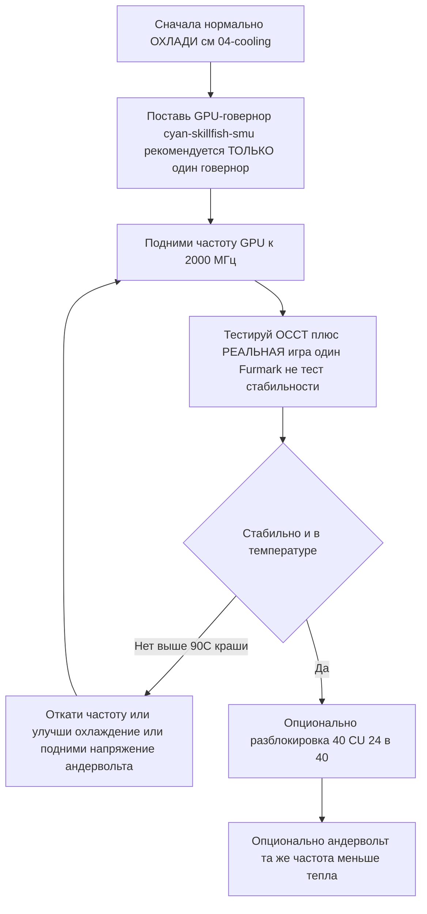

# Разгон и андервольт

> **TL;DR** — Из коробки GPU у BC-250 работает медленно (часто залочен на **1500 МГц**, ~слабо). Лекарство от сообщества — **говернор**, который перезаписывает частоты/напряжение: сегодня рекомендуемый — **[cyan-skillfish-governor-smu](https://github.com/filippor/cyan-skillfish-governor)** (не нужен патч ядра, есть в пакетах для Arch/CachyOS/Bazzite/Fedora); **[oberon-governor](https://gitlab.com/mothenjoyer69/oberon-governor)** — оригинал, по-прежнему работает. Любой из них правят, чтобы поднять GPU до **2000 МГц (~+30 % FPS)**. Новый тулкит **[bc250_smu_oc](https://github.com/bc250-collective/bc250_smu_oc)** разгоняет ещё и **CPU** (рекомендуют **4 ГГц @ 1275 мВ**). Отдельно **[разблокировка 40 CU](https://github.com/duggasco/bc250-40cu-unlock)** включает обратно **24 → 40 вычислительных блока**, которые AMD отключила в прошивке, — это больший прирост GPU, чем одни частоты (один прогон Superposition вырос с **4647 до 6863** очков, ([src](https://t.me/c/2424231195/137035))). **Всё это — тепло. Сначала охлади плату** — см. [04-cooling.md](04-cooling.md) — потому что разгон без нормального охлаждения выше ~90 °C приводит к крашам и сбросу платы.

Это **последний** шаг золотого пути, а не первый. Сначала добейся стабильной и холодной платы ([06-linux.md](06-linux.md), [04-cooling.md](04-cooling.md)), и только потом трогай это. Всё здесь — «на свой страх и риск», сообщество повторяет это постоянно ([src](https://t.me/c/2424231195/106844)).

---

## Четыре рычага (и что стоит каждый)

У BC-250 есть **четыре** независимых вещи для настройки. Они складываются:

| Рычаг | Инструмент | Типичный прирост | Цена в тепле |
|-------|-----------|------------------|--------------|
| **Частота GPU** 1500 → 2000 МГц | говернор (cyan-skillfish-smu / oberon) | **~+30 % FPS**, когда упор в GPU | высокая |
| **Андервольт GPU** на фикс. частоте | тот же говернор | тот же FPS, **намного холоднее** | *отрицательная* (меньше тепла) |
| **Частота CPU** 3.5 → 4.0 ГГц | `bc250_smu_oc` | помогает в играх с упором в CPU | высокая |
| **Разблокировка 40 CU** 24 → 40 CU | `bc250-40cu-unlock` | **до ~+48 %** работы GPU | высокая |

Две честные оговорки из чата перед стартом:

- **Большинство игр на BC-250 упираются в CPU, а не в GPU.** Подъём GPU с 2000 до 2229 МГц дал одному тестеру *1 fps* в Shadow of the Tomb Raider (90 → 91), при этом потребление и температуры подскочили сильно, — так что заголовочные «+30 %» проявляются только в тех немногих играх, где GPU и есть бутылочное горло ([src](https://t.me/c/2424231195/67029)).
- **Тепло растёт хуже, чем производительность.** Тот же тестер: 2000 МГц @ 960 мВ = **75 °C** в стресс-тесте; 2229 МГц @ 1030 мВ = **93 °C** — и он откатился, потому что БП и кулер это не держали ([src](https://t.me/c/2424231195/66972), [src](https://t.me/c/2424231195/67029)).

> ⚠️ **Порог безопасности.** Троттлинг начинается около **85 °C**, а жёсткий краш / сброс платы — около **90 °C** (см. [04-cooling.md](04-cooling.md)). Если под нагрузкой переходишь ~85 °C — ты *за* пределом своего охлаждения: снижай частоту или делай андервольт, а не лезь выше.



---

## Шаг 1 — Частота и андервольт GPU: говернор

Драйвер amdgpu на BC-250 не отдаёт обычный разгон через sysfs. Решение сообщества — **говернор**, маленький демон, который пишет состояния частоты/напряжения напрямую. Для новой установки сегодня рекомендуемый — **cyan-skillfish-governor-smu**; **oberon-governor** — оригинал, по-прежнему работает (ниже оставлен как устоявшаяся альтернатива).

<p align="center"></p>
<sub>📈 Редактируемый исходник: <a href="../../assets/diagrams/gpu-clock-tradeoff.drawio">gpu-clock-tradeoff.drawio</a> (открыть в <a href="https://draw.io">draw.io</a>). Зелёное = прирост, красное = цена.</sub>

### cyan-skillfish-governor-smu (рекомендуется)

[filippor/cyan-skillfish-governor](https://github.com/filippor/cyan-skillfish-governor), ветка SMU — задаёт частоту/напряжение через **firmware-вызовы SMU**, поэтому **не требует патча ядра ни на одном дистрибутиве**, активно поддерживается и есть в пакетах под все основные дистрибутивы. Он ещё и добавляет управление **power-профилем контроллера памяти**, что снижает TDP в простое до **~30–35 Вт** (холоднее и тише в простое) ([src](https://t.me/c/2424231195/125821)).

**Установка (запакован под все основные дистрибутивы)** — COPR `filippor/bazzite` (Fedora/Bazzite) или AUR `cyan-skillfish-governor-smu` (Arch/CachyOS); Debian/Ubuntu — release-tarball + `sudo ./scripts/install.sh`:

```bash
# Fedora / Bazzite (COPR):
sudo dnf copr enable filippor/bazzite
sudo dnf install cyan-skillfish-governor-smu        # на Bazzite — rpm-ostree install …
sudo systemctl enable --now cyan-skillfish-governor-smu.service

# Arch / CachyOS (AUR):
paru -S cyan-skillfish-governor-smu                  # или: yay -S …
sudo systemctl enable --now cyan-skillfish-governor-smu.service
```

Ветку SMU можно собрать и из исходников через `cargo build --release`. **Задай частоту и напряжение** в `/etc/cyan-skillfish-governor-smu/config.toml` (схема ниже) — чтобы уйти со слабого дефолта к народному оптимуму, подними верхнюю safe-point к **2000 МГц** и опусти напряжение до стабильного значения (про андервольт — ниже); после каждой правки перезапускай сервис.

> **Проверь, что применилось.** Смотри частоты/температуры в реальном времени через `amdgpu_top`, MangoHud или LACT под нагрузкой на GPU. Если частоты висят на ~1500 МГц — сервис не запущен или конфиг не распарсился: `sudo systemctl status cyan-skillfish-governor-smu`.

> Гоняй **один** говернор за раз — если раньше стоял oberon, отключи его перед включением cyan-skillfish, иначе они дерутся за одни и те же регистры.

> 🔇 **Настройка под тихую консоль для гостиной.** Выкручивание в потолок (2000 МГц GPU / 4000 МГц CPU) почти ничего не даёт в играх с упором в CPU, но стоит кучи тепла, шума вентилятора и ватт. Отзыв сообщества r/BC250Gaming (Reddit) показал, что сбалансированные **~1600 МГц GPU / ~3500 МГц CPU** дают намного лучшее соотношение производительность-на-шум-на-ватт для повседневных игр — почти бесшумно и холодно, а FPS держится, потому что большинство тайтлов всё равно не упираются в GPU (см. оговорку про упор в CPU выше). Если тихая холодная коробка тебе важнее рекордов в бенчмарках — ставь эти значения как потолки говернора вместо максимума.

### oberon-governor (оригинал — по-прежнему работает)

[mothenjoyer69/oberon-governor](https://gitlab.com/mothenjoyer69/oberon-governor) — демон на C++, первый говернор для BC-250 и самый обкатанный; он по-прежнему работает, но в отличие от SMU-говернора зависит от патча ядра с расширенным диапазоном частот (или дистрибутива, где он вшит), чтобы достать верхние частоты. По README зависит от **CMake, тулчейна C++ и libdrm**, и **тестируется только на ASRock BC-250**. Многие дистрибутивы дают его в готовом виде (Arch AUR, Fedora COPR, образы Bazzite), так что сборка из исходников нужна, только если в твоём дистрибутиве пакета нет.

**Сборка из исходников** (соответствует воспроизведённой в чате последовательности, ([src](https://t.me/c/2424231195/54666)), и стандартному потоку CMake из репозитория):

```bash
# Зависимости (пример для Arch — подстрой под свой дистрибутив)
sudo pacman -S --needed base-devel cmake pkgconf make libdrm glibc linux-api-headers

git clone https://gitlab.com/mothenjoyer69/oberon-governor.git && cd oberon-governor
sudo cmake . && sudo make && sudo make install
sudo systemctl enable --now oberon-governor.service
```

> Если `cmake` ругается, в чате чинили просто доустановкой недостающих зависимостей и повторной сборкой: `sudo pacman -S pkgconf cmake`, затем пересобрать ([src](https://t.me/c/2424231195/54666)).

**Задай частоту и напряжение.** oberon читает YAML-конфиг:

```bash
sudo nano /etc/oberon-config.yaml      # правишь min/max частоту и напряжение
sudo systemctl restart oberon-governor # применить
```

Файл позволяет задать **максимальные и минимальные напряжение и частоту** для состояний GPU (по README репозитория). Подними максимальную частоту к **2000 МГц** и опусти напряжение до стабильного значения. После каждой правки перезапускай сервис. Чтобы потом мигрировать на SMU-говернор: stop+disable+удалить `oberon-governor`, `rm /etc/oberon-config.yaml`, затем поставить и включить сервис SMU.

#### TT против SMU — два варианта cyan-skillfish

> Рекомендуемая сборка SMU выше — один из **двух** вариантов cyan-skillfish. SMU — дефолт; вариант TT — альтернатива для тех, кому конкретно нужен путь через патч ядра / sysfs ([elektricM: governor](https://elektricm.github.io/amd-bc250-docs/system/governor/)):

| Вариант | Сервис | Как задаёт частоты | Патч ядра? | Релиз / заметки |
|---|---|---|---|---|
| **SMU** *(рекомендуется)* | `cyan-skillfish-governor-smu` | **firmware-вызовы SMU** | **Нет — работает на любом дистрибутиве без патча** | 18.01.2026; достаёт 2300+ МГц; CPU ~0.9–1.3 % |
| **TT** (альтернатива) | `cyan-skillfish-governor-tt` | sysfs | **Да** (вшит в Bazzite) | учитывает троттлинг; достаёт 2175+ МГц |

> **Переименование сервиса (13.12.2025):** filippor переименовал `cyan-skillfish-governor` → `cyan-skillfish-governor-tt`, а каталог конфига переехал `/etc/cyan-skillfish-governor/` → `/etc/cyan-skillfish-governor-tt/`. При обновлении перенеси свой старый `config.toml` ([elektricM: governor](https://elektricm.github.io/amd-bc250-docs/system/governor/)). Вариант TT есть в тех же COPR/AUR (`cyan-skillfish-governor-tt`) и вшит в Bazzite.

> 🔴 **700 мВ — жёсткий пол.** Если выставить *минимальное* напряжение GPU ниже **700 мВ, GPU залочится обратно на 1500 МГц** — смысл теряется весь. Держи минимум ≥ 700 мВ в любом говернере ([elektricM: governor](https://elektricm.github.io/amd-bc250-docs/system/governor/), [elektricM: разгон BIOS](https://elektricm.github.io/amd-bc250-docs/bios/overclocking/)).

> **Проверь, что таргетится нужный GPU.** Говернор может управлять `card0` или `card1` в зависимости от системы — `ls /sys/class/drm/ | grep card`. Если настройки не применяются, возможно, нужно указать в конфиге правильную карту. На Arch/CachyOS говернор иногда не активируется, пока GPU не задействуют впервые — запусти игру/бенч один раз после загрузки ([elektricM: governor](https://elektricm.github.io/amd-bc250-docs/system/governor/)).

#### Схема конфига cyan-skillfish-smu (секционный TOML)

Ветка `smu` использует **секционную** схему, а **не** старый массив `safe-points = [...]` — каждая точка кривой это своя таблица `[[safe-points]]`. Ключевые поля ([elektricM: governor](https://elektricm.github.io/amd-bc250-docs/system/governor/)):

```toml
# /etc/cyan-skillfish-governor-smu/config.toml
[timing.intervals]
sample = 500          # мкс; подними (напр. 1000), чтобы срезать нагрузку на CPU, держи adjust = sample*400
adjust = 200_000
[gpu-usage]
fix-metrics = true    # чинит баг MangoHud «655 %» загрузки GPU на BC-250
method  = "busy-flag"
[gpu]
set-method = "smu"    # "smu" или "kernel"
[load-target]
upper = 0.80          # доли, не проценты
lower = 0.65
[temperature]
throttling = 85       # °C
throttling_recovery = 75

[[safe-points]]
frequency = 1000
voltage   = 800
[[safe-points]]
frequency = 2000
voltage   = 1000      # игры
[[safe-points]]
frequency = 2200
voltage   = 1000      # многие платы держат плоские 1000 мВ; поднимай по плате только если крашится
```

> **Порядок настройки при нестабильности: охлаждение → частота → *затем* напряжение.** На стоковом охлаждении реальная причина почти всегда тепло (95 °C+). Сбрось верхние блоки `[[safe-points]]`, чтобы ограничить частоту, прежде чем добавлять напряжение; только если температуры в норме, а оно всё равно крашится на 2150–2200 МГц, подними **только верхнюю точку** на +15–25 мВ. Выше ~1075 мВ на 2200 МГц ты просто добавляешь тепло — лучше снизь частоту ([elektricM: governor](https://elektricm.github.io/amd-bc250-docs/system/governor/)).

> **Чёрный экран при сбросе GPU, специфично для говернора.** Если GPU крашится, *пока говернор активно пишет в sysfs*, сброс не может завершиться — получаешь вечный чёрный экран (система жива по SSH), нужен хардресет. Обход: `systemctl stop` говернора перед склонными к крашу играми; реальный фикс — стабильная кривая ([elektricM: governor](https://elektricm.github.io/amd-bc250-docs/system/governor/)).

#### Патч ядра под диапазон частот GPU (только для TT / ручного sysfs)

Стоковый диапазон GPU у драйвера amdgpu — **1000–2000 МГц**; однострочный патч драйвера (автор **ViRazY**, `linux-6.12-bc250-freq.mypatch`) расширяет его до **350–2230 МГц** (350 МГц глубокий простой экономит энергию; верх открывает разгон 2230+). **Bazzite, PikaOS и ядра из Arch AUR идут уже пропатченными**, а **говернор SMU вообще обходит необходимость в нём** через firmware-вызовы — так что патчишь руками только если хочешь говернор TT или сырой sysfs-разгон с расширенным диапазоном на непропатченном дистрибутиве. Проверка: `cat …/pp_od_clk_voltage` (должно показать 350–2230). **Не** используй патч расширенного напряжения (600–1300 мВ) — лишний и рискованный ([elektricM: разгон BIOS](https://elektricm.github.io/amd-bc250-docs/bios/overclocking/)).

#### PS5GPU-BC250 — GUI-контроллер (без конфигов)

Хочешь GUI? **[ZEROAESQUERDA/PS5GPU-BC250](https://github.com/ZEROAESQUERDA/PS5GPU-BC250)** — Qt-приложение (KDE/GNOME), которое крутит min/max частоту и напряжение GPU, ставит лимит температуры и даёт автоматический 4-ступенчатый буст или ручное управление — в стиле MSI Afterburner, без патчей ядра и правки TOML. **Сначала отключи любой запущенный говернор** (cyan-skillfish-smu/tt или oberon), иначе конфликт ([elektricM: governor](https://elektricm.github.io/amd-bc250-docs/system/governor/)).

---

## Шаг 2 — Разгон CPU и нормальный андервольт: `bc250_smu_oc`

Выпущен **30.12.2025** командой bc250-collective (реверс-инжиниринг SMU), [bc250_smu_oc](https://github.com/bc250-collective/bc250_smu_oc) — это инструмент, который наконец даёт трогать частоту и напряжение **CPU** (ядра Zen 2), а не только GPU. Авторы рекомендуют **4 ГГц @ 1275 мВ** как оптимум стабильности/тепла и кладут это примером в репозиторий ([src](https://t.me/c/2424231195/106844)).

**Установка и использование** (дословно из README репозитория):

```bash
# Предварительно: поставь утилиту нагрузки CPU `stress` из пакетного менеджера
git clone https://github.com/bc250-collective/bc250_smu_oc.git
cd bc250_smu_oc
pip install .        # или: pipx install .

# Подобрать / протестировать цель (CPU 4 ГГц при 1275 мВ), оставить применённой:
bc250-detect --frequency 4000 --vid 1275 --keep

# Когда нашёл стабильный конфиг — установи его и включи на загрузке:
bc250-apply --install overclock.conf
sudo systemctl enable --now bc250-smu-oc
```

> 🔴 **Жёсткий предел по напряжению.** По репозиторию: **никогда** не давай напряжению ядер CPU (**Vid**) превышать **1.325 В** ни при каких обстоятельствах — деградация кремния начинается выше ~1.35 В ([src](https://t.me/c/2424231195/115726)). И: **подъём частоты CPU без андервольта позволяет Vid расти бесконтрольно и может убить железо** — всегда сочетай подъём частоты с целевым напряжением.

Почему потолок именно 4 ГГц: AMD считает безопасным для этого кремния до ~4 ГГц; BIOS от кита 4700S/Xbox вообще стартует в турбо на 4000 МГц / 1.35 В из коробки. Zen 2 *обычно* догоняется до ~4200, но это **отбраковка от майнинга**, так что 4200 — только «если очень повезёт» ([src](https://t.me/c/2424231195/115726)).

> ❓ **Можно ли разблокировать CPU до 8 ядер?** Коротко: **нет — пока нельзя, да и смысла нет.** BC-250 идёт с 6 активными ядрами Zen 2 из 8; сообщения сообщества r/BC250Gaming описывают два оставшихся как **программно залоченные через eFuse, которые читает SMU** (биннинг во многом искусственный — решение эпохи майнинга), а *не* физически отрезанные. Но разблокировка означала бы **обход проверки подписи PSP и модификацию микрокода SMU**, и попытки сообщества (в Discord) **успехом не увенчались**. Даже если бы кто-то смог, выигрыш для игр был бы **мизерным**: BC-250 упирается в **слабую однопоточную производительность, маленький фрагментированный L3-кэш 2×4 МБ и урезанный FPU только с AVX2** — добавление ядер не поднимает ни FPS, ни то, на чём этот чип реально голодает. Не гонись за этим ([сообщения сообщества r/BC250Gaming](https://www.reddit.com/r/BC250Gaming/)).

> Закреплённый пост `bc250_smu_oc` может и **заменить** твой GPU-говернор (у него свой сервис `bc250-smu-oc`). Не гоняй два говернора одновременно.

**Проверенное масштабирование CPU-разгона** (Fedora 43, ядро 6.19.8; автоподбор напряжения; 7-zip MIPS; с кривой вентилятора по температуре) ([elektricM: governor](https://elektricm.github.io/amd-bc250-docs/system/governor/)):

| Частота | Авто-Vid | 7-zip MIPS | Темп (полная нагрузка) | vs сток |
|---|---|---|---|---|
| 3500 (сток) | авто | 26 062 | 60 °C | базис |
| 3600 МГц | 1150 мВ | 26 518 | 65 °C | +1.7 % |
| 3700 МГц | 1199 мВ | 27 212 | 68 °C | +4.4 % |
| 3800 МГц | 1250 мВ | 27 919 | 72 °C | +7.1 % |
| 3900 МГц | 1275 мВ | 28 410 | 75 °C | +9.0 % |
| 4000 МГц | — | троттлит на PWM 80 | 77 °C | ❌ (нужно больше охлаждения/оборотов) |

Флаги инструмента: `bc250-detect -f <МГц> -v <мВ>` для теста, добавь **`-k`**, чтобы сохранить разгон после выхода инструмента, **`-c <путь>`** — записать конфиг. Сделать постоянным: `bc250-apply -a -i /etc/bc250-overclock.conf`, затем `systemctl enable bc250-smu-oc`. Авторы: **mrfrakes и dantistnfs** (реверс-инжиниринг SMU) ([elektricM: governor](https://elektricm.github.io/amd-bc250-docs/system/governor/), [elektricM: разгон BIOS](https://elektricm.github.io/amd-bc250-docs/bios/overclocking/)). Заметь: **4000 МГц троттлило на почти-стоковом вентиляторе PWM 80** — потолок упирается в охлаждение, согласуется с заметкой воздух-против-воды выше.

#### Частотному скейлингу CPU нужен ACPI-фикс (иначе cpufreq вообще нет)

> ❗ **Из коробки BC-250 не отдаёт частотный скейлинг CPU** — интерфейса cpufreq *нет*, так что `cpupower`/`schedutil` ничего не делают, и CPU сидит на фиксированной частоте. **[bc250-collective/bc250-acpi-fix](https://github.com/bc250-collective/bc250-acpi-fix)** кладёт две SSDT-таблицы (грузятся через initrd-оверрайд), которые это чинят ([elektricM: governor](https://elektricm.github.io/amd-bc250-docs/system/governor/)):
> - **SSDT-PST** → включает стандартный Linux cpufreq с **8 P-состояниями, 800 МГц → 3200 МГц** (говерноры: `schedutil`, `powersave`, `performance`, …).
> - **SSDT-CST** → включает **состояния простоя C1/C2/C3**, чтобы ядра реально спали в простое (ниже потребление в простое).
>
> Оба подтверждены на ядре 6.19.8. Установка собирает cpio из `SSDT-CST.aml`+`SSDT-PST.aml` в `/boot`, добавленный в начало строки initrd (Fedora BLS) или через `GRUB_EARLY_INITRD_LINUX_CUSTOM` (GRUB). Затем `echo schedutil | sudo tee /sys/devices/system/cpu/cpu*/cpufreq/scaling_governor`. **Оговорка:** обновление ядра не перенесёт оверрайд в новую загрузочную запись — добавь заново или используй kernel-install хук. В связке с `bc250_smu_oc` CPU тогда скейлится **800 МГц простой → 3900 МГц нагрузка** вместо фиксированной частоты ([elektricM: governor](https://elektricm.github.io/amd-bc250-docs/system/governor/), [elektricM: power](https://elektricm.github.io/amd-bc250-docs/system/power/)).

---

## Шаг 3 — Андервольт (делай ради тепла, каждый чип индивидуален)

Андервольт — самый ценный ход на этой плате: **та же частота, намного меньше тепла**, и он *обязателен*, если поднимаешь частоту CPU. Но **каждый чип разный** — кремниевая лотерея тут реальна. Один владелец гонял три почти последовательные платы, и только одна держала 900 мВ под стрессом; охлаждение одинаковое, температуры одинаковые, стабильность разная ([src](https://t.me/c/2424231195/50568)).

<p align="center"></p>
<sub>📈 Редактируемый исходник: <a href="../../assets/diagrams/undervolt-tradeoff.drawio">undervolt-tradeoff.drawio</a> (открыть в <a href="https://draw.io">draw.io</a>). Зелёное = прирост, красное = цена.</sub>

**Целевая частота → напряжение, реальные числа сообщества (у твоего чипа будет иначе):**

| Частота GPU | Напряжение, при котором владельцы получили *стабильность в играх* | Примечания |
|-------------|------------------------------------------------------------------|------------|
| 1500 МГц | ~710 мВ | «самая стабильная» плата одного тестера ([src](https://t.me/c/2424231195/23545)) |
| 2000 МГц | **~955 мВ** | стабильно в Furmark на 905 мВ, но артефакты в играх до 955 мВ ([src](https://t.me/c/2424231195/68126), [src](https://t.me/c/2424231195/136773)) |
| 2000 МГц | ~960 мВ → **75 °C** стресс | популярный ежедневный сетпоинт ([src](https://t.me/c/2424231195/66972)) |
| 2229 МГц | ~1030–1050 мВ → **93 °C** стресс | «выключил нах, бо боюсь» — убывающая отдача ([src](https://t.me/c/2424231195/66972)) |

> **Один Furmark — не тест стабильности.** Его фиксированная нагрузка прячет нестабильность, которая вылезает только при смене *контекста* — альт-табы, подгрузка текстур, меню. Плата, «стабильная» в Furmark на 905 мВ, выдавала артефакты текстур в реальных играх через 1–2 часа, пока напряжение не подняли до 955 мВ. Проверяй в **реальных играх + проход по альт-табам/меню** и используй разноплановый инструмент вроде **OCCT** (он грузит VRM, а не только шейдеры), а не только Furmark ([src](https://t.me/c/2424231195/68126), [src](https://t.me/c/2424231195/136773), [src](https://t.me/c/2424231195/23545)).

> **Удобная аппаратная подсказка:** у BC-250 есть **светодиод нагрузки** — **красный = GPU в простое, зелёный = GPU нагружен**. Некоторые «простойные» сцены (например, Новиград в Witcher 3) на деле молотят GPU и вскрывают артефакты андервольта, которые Furmark/Cyberpunk пропускают ([src](https://t.me/c/2424231195/12285)).

Слишком агрессивный андервольт **не опасен** — в худшем случае плата отвалится или отключит слот M.2, что лечится за пять секунд, потому что разгон не хранится в BIOS ([src](https://t.me/c/2424231195/105998)).

> 💡 **Артефакты не от андервольта?** Чёрные текстуры / мерцание могут быть и проблемой HiZ в драйвере — попробуй выставить **`RADV_DEBUG=nohiz`** в окружении игры, прежде чем гоняться за напряжением. И учти: на стоковом ядре **окно напряжения `OD_RANGE` — 700–1129 мВ**; консервативный воздушный максимум ~1085 мВ, абсолютный ~1100 мВ — выше это риск деградации без реального выигрыша в стабильности ([elektricM: разгон BIOS](https://elektricm.github.io/amd-bc250-docs/bios/overclocking/)).

---

## Шаг 4 — Разблокировка 40 CU (24 → 40 вычислительных блоков)

Самый большой одиночный прирост GPU и самый новый. Кристалл Cyan Skillfish у BC-250 физически имеет **40 CU**, но стоковая прошивка оставляет активными только **24** (16 «вырезаны»). Параметр ядра **`amdgpu.bc250_cc_write_mode=3`** плюс пропатченный драйвер amdgpu включают все 40. Измеренный результат — прогон Superposition в 4K вырос с **4647 до 6863** очков (24/40 → 40/40 активных CU), при этом инструмент `cu_map.sh` показывает, как заполняется карта вырезанных блоков ([src](https://t.me/c/2424231195/137035)):


Люди гоняют **40 CU @ 1850 МГц** (RE4 Remake в нативных 1440p на high, 60 fps) и даже сообщают об очень низких напряжениях на 40 CU (например, 1400 МГц @ 750 мВ на удачном чипе) ([src](https://t.me/c/2424231195/137260), [src](https://t.me/c/2424231195/137157)).

> ⚠️ **Это требует патча и пересборки модуля ядра amdgpu** — самая трудоёмкая задача в этом гайде и **только для BC-250** (патч защищён PCI device ID платы **`0x13FE`**). Патч не персистентный: без modprobe-конфига перезагрузка вернёт 24 CU.

**Как это реально работает (два регистра, оба обязательны).** Разблокировка пишет **два** аппаратных регистра при инициализации драйвера — по отдельности ни один не масштабирует compute ([elektricM: разблокировка 40 CU](https://elektricm.github.io/amd-bc250-docs/system/40cu-unlock/)):

| Регистр | Роль | Сток → разблокировано |
|---|---|---|
| `CC_GC_SHADER_ARRAY_CONFIG` | говорит драйверу, сколько CU существует | `0xfff80000` → `0xffe00000` |
| `SPI_PG_ENABLE_STATIC_WGP_MASK` | говорит SPI, куда диспатчить волны | `0x07` (WGP 0–2) → `0x1F` (WGP 0–4) |

(Рантайм-инструмент ниже пишет ещё и **третий** регистр, `RLC`.) Это разблокировка **compute**, а не игр: контролируемый A/B от duggasco показывает скачок Vulkan `llama-bench pp512` в **1.61×** (230 → 372 ток/с на 1500 МГц), тогда как `glmark2` прибавляет всего **+4.4 %**, потому что 3D упирается в fill-rate, а не в CU ([elektricM: разблокировка 40 CU](https://elektricm.github.io/amd-bc250-docs/system/40cu-unlock/)). Про специфику AI/LLM см. также [akandr/bc250](https://github.com/akandr/bc250).

> 🎯 **Рекомендуемая рабочая точка — 1500 МГц, а не 2 ГГц.** A/B от duggasco ставит **1500 МГц / ~900 мВ** как оптимум — он берёт большую часть теоретического масштабирования ~1.67× без проблем с теплом (1500 МГц/874 мВ: 372 ток/с, 125 Вт, 83 °C). На 2 ГГц тот же тест выстреливает до 466 ток/с, но потребление/температуры лезут вверх жёстко, и пакет уходит в термtroттлинг через пару минут ([elektricM: разблокировка 40 CU](https://elektricm.github.io/amd-bc250-docs/system/40cu-unlock/)).

> ⚠️ **Не каждая плата разблокируется чисто — сначала проверь карту вырезки.** 16 вырезанных CU не гарантированно здоровы по кремнию. Платы с **непрерывной** картой вырезки (напр. CU 0–5 активны, 6–9 вырезаны, одинаково на всех 4 shader array) обычно проходят; платы с **разбросанной** картой могут иметь реально дефектные CU, которые перечисляются, но падают под нагрузкой. Запусти **`./scripts/cu_map.sh`** из репозитория *до* того, как зафиксируешь modprobe-конфиг. Если разброс — готовься гонять per-WGP health-тест и приземлиться где-то **между 24 и 40 стабильными CU** ([elektricM: разблокировка 40 CU](https://elektricm.github.io/amd-bc250-docs/system/40cu-unlock/)). Ещё: **Secure Boot должен быть выключен** (или подписывай пересобранный модуль сам).

> 🎰 **40 CU — это лотерея, а не гарантия: многие платы упираются в 38.** Сообщения сообщества r/BC250Gaming сходятся в одном: хотя кристалл несёт 40, многие чипы стабильны только на **38 CU**, а последние один-два часто дают **артефакты графики (характерную «линию» поперёк кадра) или жёсткие краши**. Стабильное число у разных чипов разное — **36, 38 или 40**. Хуже того, «стабильно на 40» бывает *обманчивым*: плата может крашнуться на первом же запуске игры, но нормально пойти со второй попытки, — так что один чистый бенч ничего не доказывает. **Рекомендуемый метод — включай CU по одному и тестируй после каждого.** Используй **[WinnieLV/bc250-cu-live-manager](https://github.com/WinnieLV/bc250-cu-live-manager)**, чтобы включать по одному CU и проверять перед добавлением следующего (напр. FurMark 20+ мин плюс пара игровых бенчей на каждый шаг). Плохой CU **мгновенно вешает систему**, так что каждый тест точно показывает, какой CU оставить замаскированным, — куда безопаснее, чем включить все 16 разом и надеяться. Считай «24 → 40» лучшим случаем; рассчитывай на **38** ([сообщения сообщества r/BC250Gaming](https://www.reddit.com/r/BC250Gaming/)).

### Самый простой путь — скрипт сборки из проекта

[duggasco/bc250-40cu-unlock](https://github.com/duggasco/bc250-40cu-unlock) кладёт скрипт, который делает сборку/включение за тебя (нужны `gcc`, `make`, `zstd` и заголовки ядра):

```bash
git clone https://github.com/duggasco/bc250-40cu-unlock.git
cd bc250-40cu-unlock
sudo ./scripts/bc250-enable-40cu.sh build
sudo ./scripts/bc250-enable-40cu.sh enable   # пишет modprobe-конфиг и перезагружается
```

### Ручной путь (патчишь модуль сам)

Для тех, кто хочет рулить сам (например, CachyOS/Arch — самый используемый дистрибутив в чате под это). Воспроизведено из закреплённой инструкции сообщества ([src](https://t.me/c/2424231195/137241)) — сверь патч и уровень `-p` с [репозиторием](https://github.com/duggasco/bc250-40cu-unlock), где используется `patch -p5`:

```bash
# 1. Получить подходящие заголовки ядра (пример CachyOS)
sudo pacman -Suy
sudo pacman -S linux-cachyos-headers
sudo reboot

# 2. Пропатчить исходник amdgpu, пересобрать и установить модуль
cd /usr/lib/modules/$(uname -r)/build/drivers/gpu/drm/amd/amdgpu
# применить bc250-40cu-amdgpu.patch к gfx_v10_0.c  (patch -p5 < .../patch/bc250-40cu-amdgpu.patch)
sudo make -C /usr/lib/modules/$(uname -r)/build M=$(pwd) modules
sudo make -C /usr/lib/modules/$(uname -r)/build M=$(pwd) modules_install
sudo reboot

# 3. Включить фичу параметром ядра, пересобрать initramfs, перезагрузиться
echo 'options amdgpu bc250_cc_write_mode=3' | sudo tee /etc/modprobe.d/bc250-40cu.conf
sudo mkinitcpio -P     # Fedora/atomic: dracut --force  (или rpm-ostree kargs, ниже)
sudo reboot
```

**На Fedora atomic / Bazzite** (rpm-ostree) параметр добавляется как kernel arg ([src](https://t.me/c/2424231195/137916)):

```bash
sudo rpm-ostree kargs --append-if-missing='amdgpu.bc250_cc_write_mode=3'
sudo systemctl reboot
```

### Проверь, что разблокировка сработала

```bash
sudo dmesg | grep active_cu_number     # успех = ...active_cu_number 40
sudo dmesg | grep bc250-40cu           # показывает записи регистров mode=3
```

Если число оканчивается на **40** — все CU живы ([src](https://t.me/c/2424231195/137241)). Должны быть и строки лога вида `bc250-40cu-enable: mode=3 ... CC=0xfff80000->0xffe00000 SPI=0x00000007->0x0000001f` ([src](https://t.me/c/2424231195/137889)).

> **Не хочешь пересобирать ядро?** Сообщество пилит вспомогательные скрипты и готовые сборки модуля. Смотри [WinnieLV/bc250-cu-live-manager](https://github.com/WinnieLV/bc250-cu-live-manager) (переключение CU на лету) и [gennro/bc250-toolkit](https://github.com/gennro/bc250-toolkit) (`bc250-toolkit.sh` / `bc250-unlock.sh`). Они быстро меняются — проверяй актуальный статус в репозиториях.

> **Рантайм-UMR против патча ядра — одно и то же конечное состояние, разный компромисс.** `bc250-cu-live-manager` пишет те же регистры (**CC + SPI + RLC**) из userspace через `umr` *после* загрузки драйвера, с TUI и systemd-юнитом для персистентности — он сам ставит `umr` (pacman/dnf/rpm-ostree). **Выбирай рантайм-UMR**, если не хочешь пересобирать amdgpu при каждом обновлении ядра или хочешь A/B-тестить раскладки WGP на лету (отлично для плат с разбросанной вырезкой — он отказывается отключать активные в драйвере WGP, так что эксперименты по плате безопаснее ручного `umr -w`). **Выбирай патч ядра**, если хочешь `active_cu_number 40` в топологии драйвера с нулевой загрузки или встраиваешь это в образ дистрибутива ([elektricM: разблокировка 40 CU](https://elektricm.github.io/amd-bc250-docs/system/40cu-unlock/)).

#### Выборочное маскирование CU (для плат с разбросанной вырезкой)

Если `cu_map.sh` показывает разброс, duggasco кладёт per-WGP health-тест, который перезагружается в каждую конфигурацию WGP по отдельности и гоняет проверки корректности, затем маскирует плохие ([elektricM: разблокировка 40 CU](https://elektricm.github.io/amd-bc250-docs/system/40cu-unlock/)):

```bash
sudo ./scripts/bc250-cu-health-test.sh start
./scripts/bc250-cu-mask.sh --results /var/lib/bc250-cu-health-test/results.tsv --install
```

Маскирование использует стоковый параметр **`amdgpu.disable_cu`** на **гранулярности WGP** (отключение CU 6 отключает и CU 7 — тот же WGP).

#### Проверка реальностью по теплу — 40 CU на 2 ГГц будут троттлить на стоковом охлаждении

Проверенный 10-минутный устойчивый `llama-bench` (Llama-3.2-1B Q4_K_M, 40 CU @ 2 ГГц, стоковый радиатор + два Arctic P12 Max push-pull) ([elektricM: разблокировка 40 CU](https://elektricm.github.io/amd-bc250-docs/system/40cu-unlock/)):

| Метрика | Среднее | Пик |
|---|---|---|
| Кромка GPU | 89.6 °C | **107 °C** |
| Мощность пакета (PPT) | 136 Вт | **223 Вт** |
| Температура CPU | 96.7 °C | **100 °C (TJmax)** |
| MOSFET VRM | 57 °C | 58.5 °C |
| Вентилятор | ~2950 об/мин | 2977 об/мин (потолок) |

Устойчивая пропускная способность **падает ~10 %** за 10 минут по мере троттлинга пакета; бутылочное горло — **радиатор + температуры CPU, а не VRM**. Сама разблокировка надёжна — 25 минут зацикленного Vulkan-теста корректности дали ноль fp/int-ошибок, ни зависаний, ни сбросов. **Итог: ограничь говернор на 1500 МГц для устойчивой работы на 40 CU**, если у тебя нет серьёзного охлаждения — ограничение в тепловом конверте, а не в кремнии ([elektricM: разблокировка 40 CU](https://elektricm.github.io/amd-bc250-docs/system/40cu-unlock/)).

> ⚡ **Все 40 CU надёжно требуют и больше охлаждения, и больше питания.** Сообщения сообщества r/BC250Gaming единодушны: полные 40 CU на полезной частоте хотят **AIO или крупный воздушный кулер**, а не стоковый радиатор, — один владелец держал 40 CU стабильно только с **AIO, удерживавшей температуры ниже 70 °C**. И тока нужно **больше, чем комфортно отдаёт один 8-pin (J1000)**: запитай разъёмы платы **J2000 / J2001** как второй источник (метод двойного питания «Больше 300 Вт» в [03-power-supply.md](03-power-supply.md)). Если оставил стоковый кулер и один 8-pin — жди, что 40 CU будут троттлить или ронять плату; сначала разберись с охлаждением ([04-cooling.md](04-cooling.md)) и питанием ([сообщения сообщества r/BC250Gaming](https://www.reddit.com/r/BC250Gaming/)).

---

## Память GDDR6: выделение VRAM, разгон и тайминги

> 🔴 **Прочти это раньше всего остального в разделе. Настройка памяти — единственное место на BC-250, которое может насовсем закирпичить плату.** В отличие от частоты/андервольта выше — которые живут в говернере и сбрасываются перезагрузкой — **частота и тайминги GDDR6 пишутся в BIOS/CMOS**, и неверное значение может оставить плату без POST. Сообщество кирпичило платы именно так: участник выставил частоту VRAM **1950 МГц** и убил плату ([src](https://t.me/c/2424231195/55317)); в собственном релиз-ноуте автора мод-биоса записана частота GDDR6, которая **завелась на одной плате (1800 МГц), но окирпичила другую** ([src](https://t.me/c/2424231195/54971)), и «слишком низкие тайминги кирпичат плату, сброс CMOS не помогает» ([src](https://t.me/c/2424231195/54971), [src](https://t.me/c/2424231195/54851)). Восстановление — это глава про BIOS, иногда вернуть плату можно только программатором. **Не трогай частоту/тайминги, пока не прочёл [08-bios.md](08-bios.md) и не принял риск кирпича.**

16 ГБ GDDR6 на BC-250 — это **единая память (UMA)**: один пул, общий для GPU и CPU. С ней можно делать две очень разные вещи на двух очень разных уровнях риска:

| Что | Где | Риск | Кому |
|-----|-----|------|------|
| **Выделение VRAM / UMA** (раздел GPU↔CPU) | обычное меню BIOS | **безопасно** — это просто размер буфера | всем, это рутина |
| **Частота и тайминги GDDR6** | **только** мод-биос | **уровень кирпича** — см. предупреждение выше | только экспертам |

### Выделение VRAM / UMA — безопасно, делай в BIOS

Сколько из 16 ГБ отдать GPU, а сколько оставить CPU — обычная настройка BIOS (мод не нужен; даже урезанный мод-биос даёт «по сути ничего, кроме настройки размера буфера» ([src](https://t.me/c/2424231195/94419))). Опции ведут себя так ([src](https://t.me/c/2424231195/81203)):

| Опция BIOS | Наблюдаемый результат |
|------------|-----------------------|
| **Auto** | выделяет GPU **8 ГБ** |
| **UMA_SPECIFIED** → Auto | то же, что Auto (8 ГБ) |
| **UMA_AUTO** (автоматически) | выделяет всего **256 МБ** — **ненадёжно, избегай** |
| **UMA_SPECIFIED** | фиксированный размер выбираешь сам (512 МБ / 1 / 4 / 6 / 8 ГБ) |

> 🔴 **Не используй автоматический режим (`UMA_AUTO`).** Он отдаёт GPU всего ~256 МБ, и этого мало — при таком размере реально доступно лишь ~2 ГБ, а GPU может свалиться в **llvmpipe (программный рендеринг — без аппаратного ускорения, всё считает CPU)** ([src](https://t.me/c/2424231195/81203)). Вместо этого выставь **фиксированный** буфер.

**Что выбрать — поставь маленький ФИКСИРОВАННЫЙ буфер 512 МБ.** Консенсус сообщества прямой: APU показывают лучшую производительность, когда видеобуфер выставлен в **минимум (512 МБ)**, потому что тогда драйвер **динамически распределяет весь пул 16 ГБ GDDR6** и подсасывает ровно столько, сколько нужно GPU, по требованию ([src](https://t.me/c/2424231195/38599), [src](https://t.me/c/2424231195/17948)). Больший фиксированный кусок *не* делает быстрее автоматически — в игровых бенчмарках одного участника размер VRAM почти не двигал средний FPS, в основном влиял на **минимальные / 1%-low** кадры и на то, запустится ли игра вообще (пара игр зависала на 256 МБ / 512 МБ / 1 ГБ и шла только от 4 ГБ и выше) ([src](https://t.me/c/2424231195/81203)). Реальный выигрыш 512 МБ — в *получаемом распределении*: при 512 МБ здоровый прогон даёт ~**5.8 ГБ в видео / 11.5 ГБ в ОЗУ / ~1.6 ГБ свопа**, тогда как залипший на 8 ГБ раздел морит систему голодом ([src](https://t.me/c/2424231195/138294)).

> **Зависит от задачи.** Часть игр ведёт себя иначе, а некоторые **виснут намертво при неправильной настройке** ([src](https://t.me/c/2424231195/131105), [src](https://t.me/c/2424231195/94993), [src](https://t.me/c/2424231195/139016)). Самый наглядный пример: Cyberpunk 2077, если дать ему фиксированные **4 ГБ**, перестаёт «видеть» память выше 8 ГБ как доступную ОЗУ и **активно свопится**, даже когда запас есть; на **512 МБ** он всё равно откусывает ~4–5 ГБ под GPU, но корректно оставляет 12 ГБ+ под систему и уходит в своп только когда они исчерпаны, — поэтому народный совет одного участника: *«хуярь 512, а дальше господь разберётся»* ([src](https://t.me/c/2424231195/94993), [src](https://t.me/c/2424231195/131105)). Для большинства: **512 МБ фиксировано, избегай авто.** Поднимай до **4 ГБ** только под конкретную игру, про которую известно, что ей так лучше (таких единицы), или под прожорливые по памяти GPU-задачи (см. AI/LLM ниже). Оговорка: фиксированное выделение VRAM больше 512 МБ может ломать **выделение крупных буферов в Vulkan** (например, `llama.cpp`), что лечит кернел-патч сообщества — чтобы динамическое выделение работало и выше 512 МБ ([src](https://t.me/c/2424231195/20001), [src](https://t.me/c/2424231195/20002)).

> 📋 **Конкретное поведение игр из гайда VRAM комьюнити** ([elektricM: VRAM BIOS](https://elektricm.github.io/amd-bc250-docs/bios/vram/)): на 512 МБ динамики **RDR2** и **Company of Heroes 3** могут крашиться/артефачить, когда в деле ZRAM (см. ниже), а **Expedition 33** и **Mafia** могут падать, пока не выделено статически **4–8 ГБ**. Стоковые фикс-пресеты ложатся на UMA Frame Buffer Size: **6144 МБ = 10 ГБ/6 ГБ** (хорошо для AAA), **8192 МБ = 8 ГБ/8 ГБ** (баланс, хорошо для AI/compute), **4096 МБ = 12 ГБ/4 ГБ** (лёгкие игры, максимум системной ОЗУ, ниже всего потребление в простое).

> 🔧 **Поменять VRAM без прошивки — `bc250_memcfg`.** На *стоковом* P3.00/P5.00 раздел задаётся из работающего Linux ([elektricM: VRAM BIOS](https://elektricm.github.io/amd-bc250-docs/bios/vram/)):
> ```bash
> git clone https://github.com/fanoush/bc250_memcfg && cd bc250_memcfg && make
> sudo ./bc250memcfg UMA_SIZE 512   # значения: 512, 4096, 6144, 8192 — затем перезагрузка
> ```
> Проверка после перезагрузки: `cat /sys/class/drm/card0/device/mem_info_vram_total` и `free -h`.

> ⚠ **Отчёт VRAM в Vulkan против OpenGL.** Vulkan видит весь динамический пул (~10–12 ГБ), но **OpenGL видит только выделенный в BIOS объём** (512 МБ) — так что OpenGL-игра может отказаться стартовать на «512 МБ», тогда как Vulkan/Proton-тайтлы работают нормально. Если конкретная OpenGL-игра ругается, переключись на фиксированное выделение под её требование ([elektricM: VRAM BIOS](https://elektricm.github.io/amd-bc250-docs/bios/vram/)).

> ⚙️ **ZRAM конфликтует с 512 МБ динамики — используй zswap.** Сжатый своп ZRAM может запутать динамический аллокатор и вызвать OOM-краши в прожорливых играх (RDR2, CoH3) даже при свободной ОЗУ. Фикс комьюнити — **отключить ZRAM, включить zswap (lz4), добавить своп-файл 16–32 ГБ и выставить `vm.swappiness=180`** ([elektricM: power](https://elektricm.github.io/amd-bc250-docs/system/power/), [elektricM: VRAM BIOS](https://elektricm.github.io/amd-bc250-docs/bios/vram/)):
> ```bash
> # Пример для Fedora
> sudo systemctl disable --now zram-swap
> sudo dd if=/dev/zero of=/swapfile bs=1G count=16 && sudo chmod 600 /swapfile
> sudo mkswap /swapfile && sudo swapon /swapfile
> echo '/swapfile none swap defaults 0 0' | sudo tee -a /etc/fstab
> echo 'zswap.enabled=1 zswap.max_pool_percent=25 zswap.compressor=lz4' >> /etc/default/grub
> sudo grub2-mkconfig -o /boot/grub2/grub.cfg
> echo 'vm.swappiness=180' | sudo tee /etc/sysctl.d/99-swap.conf && sudo sysctl -p /etc/sysctl.d/99-swap.conf
> ```
> (Bazzite/rpm-ostree использует `btrfs filesystem mkswapfile` + `rpm-ostree kargs`; рецепт — на странице power у elektricM.) С zswap swappiness 180 держит данные приложений в памяти и свопит холодные страницы вместо сброса файлового кэша — правильный уклон для машины с малой ОЗУ.

### Частота и тайминги GDDR6 — мод-биос, только для экспертов

<p align="center"></p>
<sub>📈 Редактируемый исходник: <a href="../../assets/diagrams/memory-tradeoff.drawio">memory-tradeoff.drawio</a> (открыть в <a href="https://draw.io">draw.io</a>). Зелёное = прирост, красное = цена.</sub>

Стоковые тайминги GDDR6 консервативны; реальный прирост пропускной способности есть, но **это территория BIOS/мод-тулов, а не говернора** — напрямую завязано на мод-биос из [08-bios.md](08-bios.md). Справочник сообщества — закреплённый разбор **«#BC-250 GDDR6 Memory Explained»** ([src](https://t.me/c/2424231195/126436)); параллельная заметка на английском говорит прямо: *«если ты это запорешь — положишь чип. При этом дефолты так себе, прироста можно вытащить много»* ([src](https://t.me/c/2424231195/55353)).

> ❓ **«А что реально даёт настройка памяти?» — честно, очень мало.** Стоковая частота GDDR6 — **1750 МГц**, а максимум, который плата обычно ещё проходит POST, — **~1875 МГц** ([src](https://t.me/c/2424231195/126436)); те, кто её настраивает, обычно останавливаются около **1800 МГц @ 860 мВ**, держа в играх ниже ~70 °C ([src](https://t.me/c/2424231195/140223), [src](https://t.me/c/2424231195/139654)). **Прирост маленький.** Частота/тайминги памяти в основном добавляют немного пропускной способности, что помогает только в моментах с упором в bandwidth GPU; реальная производительность BC-250 идёт от **частоты ядра GPU + разблокировки 40 CU + охлаждения**, а не от памяти. Настройка памяти — это «последние пара %» для энтузиастов, и она несёт **наибольший риск на всей плате**: плохая частота/тайминг пишется в CMOS и может насовсем закирпичить (1950 МГц кирпичило платы; 1800 МГц завелось на одной плате и окирпичило другую). Поэтому **сначала настрой ядро GPU + охлаждение**, и трогай память только если прочёл [08-bios.md](08-bios.md) и принял риск кирпича. График выше как раз это и показывает — тонкая зелёная линия прироста против крутого красного обрыва риска кирпича.

Что, по разбору, настраивается (значения — результаты **одного тестера**, не универсальные, ⚠ verify под свою плату) ([src](https://t.me/c/2424231195/126436)):

- **`ClockSpeed`** — сток **1750**. **~1875 МГц — похоже, максимум, который ещё проходит POST**; выше плата не стартует. Любое изменение здесь связано с `tCL`.
- **`tCL`** (CAS latency) — **24** на 1750 МГц и ниже; на 1755 МГц и выше нужен **26**.
- **`tRAS`** — должен равняться `tCL + tRCD + 1`; разбор использует значение write-RCD, чтобы его снизить ради небольшого прироста.
- **`tRCDRD` / `tRCDWR`** — лучше оставить сток 27 / 19; их снижение, по тестеру, *ухудшало* производительность.
- **`tRCAb`** — не проходит POST ниже ~70; лучше всего 71–72.
- **`tRFC` / `tREF`** (refresh) — выше = меньше потребление и нагрев; **12000 — сток, ~13000 уже не проходит POST**.
- Ряд полей (`tRPAb`, `tRRDS`, `tRRDL`, `tRTP`, `tFAW`) считаются специфичными для производителя и были **не тронуты** — у тестера не было по ним данных.

> 🔴 **Почему это кирпичит, а остальное — нет.** Эти значения пишутся в **CMOS**, и набор, который останавливает плату *до* того, как она дойдёт до процедуры сброса настроек в BIOS, даёт жёсткий кирпич, который **очистка CMOS / снятие батарейки не лечат** ([src](https://t.me/c/2424231195/54971), [src](https://t.me/c/2424231195/94419)). Один участник передал весь дух раздела (буквально) песней — *«перепутал тайминг, не могу загрузиться»* — и боялся окирпичить ([src](https://t.me/c/2424231195/66381)). Часть владельцев вообще избегает BIOS-персистентных правок памяти, потому что **число циклов перезаписи GDDR6/CMOS конечно**, и предпочитает подход только в рантайме ([src](https://t.me/c/2424231195/126437)). ⚠ verify: надёжного рантайм-инструмента разгона памяти пока нет — относись к правкам частоты/таймингов как к прошивке BIOS и **сначала имей план восстановления** ([08-bios.md](08-bios.md)).

### Зачем память для AI / LLM — и что её надо охлаждать

Главная причина возиться с GDDR6 здесь — **пропускная способность и объём под AI/LLM**: участники гоняют локальные LLM на BC-250, задавая **выделение UMA как буфер под модель** ([src](https://t.me/c/2424231195/57659)) — один сообщает о модели 14B на **~24 ток/сек** и рабочих мультимодальных моделях, после патча ядра, чтобы `llama.cpp` видел больше общей памяти ([src](https://t.me/c/2424231195/57767)). Для таких задач именно **больший кусок VRAM** (выше) важнее, чем рискованные правки таймингов.

> 🧠 **Достать ~14.75 ГБ под инференс через параметры ядра (вместо большого фикс-раздела).** Вместо статического резерва VRAM продвинутые AI-юзеры держат **512 МБ динамики** и поднимают лимиты GTT/TTM, чтобы GPU мог занять почти весь пул ([elektricM: VRAM BIOS](https://elektricm.github.io/amd-bc250-docs/bios/vram/)):
> ```bash
> # GRUB_CMDLINE_LINUX_DEFAULT:
> amdgpu.gttsize=14750 ttm.pages_limit=3959290 ttm.page_pool_size=3959290
> ```
> Затем ограничь выделение под модель чуть ниже лимита (напр. `llama.cpp --mem 14500`), чтобы избежать OOM. Это под compute/инференс, не под игры. Гайд akandr/bc250 ([на него ссылается elektricM](https://elektricm.github.io/amd-bc250-docs/system/40cu-unlock/)) глубже разбирает выбор модели, квантизацию, размер KV-кэша и ROCm-против-Vulkan.

> 🌡️ **Охлаждай память, а не только кристалл.** Чипы GDDR6 стоят на **обратной стороне** платы и требуют отдельного теплоотвода — моды с бэкплейтом/термопрокладками существуют именно для охлаждения памяти. Гнать частоту GDDR6 (да и просто крутить тяжёлые AI-задачи) без охлаждения чипов — напрашиваться на нестабильность; про термопрокладки бэкплейта см. [04-cooling.md](04-cooling.md).

---

## Рекомендуемая последовательность

| Уровень | Что сделать | Чего ждать |
|---------|-------------|------------|
| **Старт** | cyan-skillfish-governor-smu → GPU **2000 МГц**, андервольт до **~955 мВ** игро-стабильно | ~+30 % FPS, где упор в GPU, ~75 °C, ~30–35 Вт в простое |
| **+ CPU** | `bc250_smu_oc` → **4 ГГц @ 1275 мВ** (Vid никогда > 1.325 В) | помогает в играх с упором в CPU |
| **Макс GPU** | разблокировка 40 CU + настройка частоты/напряжения на 40 CU | до ~+48 % работы GPU |

После **любого** изменения: грузи GPU **и** CPU вместе (у них один кристалл и один радиатор), смотри температуры и держи нагрузку ниже ~85 °C. Если не получается — ответ в **большем охлаждении, а не в погоне за частотами**: возвращайся к [04-cooling.md](04-cooling.md). Именно вода открывает верхний предел (например, CPU 4.0 ГГц на воде против 3.85 ГГц на воздухе) ([src](https://t.me/c/2424231195/135417)).

---

## ⏳ Устаревшее / меняющееся — прочти, прежде чем верить старому чату

Эта обвязка менялась быстро в 2025–2026. Смотри на даты:

- **До ~декабря 2025:** единственным говернором был **oberon-governor** (только частота/напряжение GPU). Старые посты, где написано «CPU разогнать нельзя», устарели и предшествуют `bc250_smu_oc` (выпущен **30.12.2025**) ([src](https://t.me/c/2424231195/106844)).
- **Разблокировка 40 CU новая (~май 2026)** и ещё дозревает. Ранние сообщения называют её «инсайдерская инфа / многообещающе, но ненадёжно» ([src](https://t.me/c/2424231195/137022)); к середине мая это уже рабочая закреплённая процедура ([src](https://t.me/c/2424231195/137241)). Методы, патчи и готовые сборки ещё двигаются — предпочитай [репозиторий](https://github.com/duggasco/bc250-40cu-unlock) любому отдельному сообщению из чата. ⚠ Сверь уровень strip патча (`-p5`) и версию ядра с репозиторием перед сборкой.
- **Говерноры менялись в декабре 2025 – январе 2026.** К оригинальному **oberon-governor** (только частота/напряжение GPU) добавился **cyan-skillfish-governor** **~март 2026** ([src](https://t.me/c/2424231195/125821)); **сервис переименован** `cyan-skillfish-governor` → `-tt` **13.12.2025**, а **ветка SMU вышла 18.01.2026**. Для новой установки сегодня рекомендуемый говернор — **cyan-skillfish-governor-smu**: ему **не нужен патч ядра**, и он есть в пакетах под Arch/CachyOS/Bazzite/Fedora; а **oberon-governor** остаётся оригиналом и по-прежнему работает ([elektricM: governor](https://elektricm.github.io/amd-bc250-docs/system/governor/)).
- **Частотный скейлинг CPU завязан на `bc250-acpi-fix`.** Без его таблицы SSDT-PST у BC-250 *нет* интерфейса cpufreq вообще — старые советы, предполагающие, что `schedutil` «просто работает», предшествуют этой находке ([elektricM: governor](https://elektricm.github.io/amd-bc250-docs/system/governor/)).
- Для совсем отчаянных есть и живой разбор **таймингов памяти** (GDDR6 tCL/tRAS и т. д.), но это территория BIOS/мод-тулов, а не говернора — см. [08-bios.md](08-bios.md) и пост про тайминги ([src](https://t.me/c/2424231195/126436)).

---

## 🔎 Копать глубже на Reddit

Чат в Telegram и **BC-250 Discord** — там идёт самая передовая работа, но на Reddit лучшие искабельные, развёрнутые разборы пути разгона / разблокировки CU. Два сабреддита:

- **[r/BC250Gaming](https://www.reddit.com/r/BC250Gaming/)** — основной хаб по BC-250 (разгон, разблокировка CU, охлаждение, выбор дистрибутива).
- **[r/linux_gaming](https://www.reddit.com/r/linux_gaming/)** — более широкий контекст Linux-гейминга и честные треды «стоит ли вообще брать».

**Полезные поисковые запросы:** `BC-250 40CU unlock` · `BC-250 overclock` · `BC-250 undervolt governor` · `BC-250 GDDR6 memory timings` · `BC-250 idle power` · `BC-250 2575mhz limit` · `BC-250 cooling fins` · `BC-250 SteamOS Batocera`.

**Треды, которые стоит прочесть:**
- «GPU CU cores unlock» — исходный тред про открытие разблокировки 40 CU.
- «BC-250 8-Core Unlock possible?» — почему два залоченных ядра CPU остаются залоченными (и почему это не помогло бы).
- «The 40 CU unlock and BC250 original purpose» — контекст про биннинг эпохи майнинга.
- «i think i found the limit of my bc250 (2575mhz)» — реальный потолок частоты GPU.
- «My BC250 Journey: From Bazzite to CachyOS» — полный разбор установки/настройки.
- «What are the main downsides of the BC-250 board?» (на r/linux_gaming) — честные минусы, прежде чем решаться.

> 💬 Большая часть **активной разработки разгона / разблокировки CU / power-состояний** идёт в **BC-250 Discord**, на который ссылаются эти треды, — Reddit лучшее место найти инвайт туда и предысторию каждой техники.

---

## Источники

- oberon-governor (оригинальный GPU-говернор, по-прежнему работает) — https://gitlab.com/mothenjoyer69/oberon-governor · последовательность сборки и фикс cmake — https://t.me/c/2424231195/54666
- bc250_smu_oc (разгон CPU, 4 ГГц @ 1275 мВ) — https://github.com/bc250-collective/bc250_smu_oc · релиз/анонс — https://t.me/c/2424231195/106844
- cyan-skillfish-governor-smu (рекомендуемый GPU-говернор — без патча ядра, потребление в простое) — https://github.com/filippor/cyan-skillfish-governor · TDP в простое — https://t.me/c/2424231195/125821 · рецепт замены — https://t.me/c/2424231195/118249
- Разблокировка 40 CU — https://github.com/duggasco/bc250-40cu-unlock · закреплённый ручной гайд — https://t.me/c/2424231195/137241 · Fedora atomic — https://t.me/c/2424231195/137916 · подтверждение в dmesg — https://t.me/c/2424231195/137889
- Менеджер CU на лету / тулкит — https://github.com/WinnieLV/bc250-cu-live-manager · https://github.com/gennro/bc250-toolkit
- Данные по частотам/напряжению/теплу — https://t.me/c/2424231195/66972 · https://t.me/c/2424231195/67029 · стабильность андервольта — https://t.me/c/2424231195/68126 · https://t.me/c/2424231195/136773 · https://t.me/c/2424231195/23545
- Кремниевая лотерея и безопасные пределы — https://t.me/c/2424231195/50568 · https://t.me/c/2424231195/115726
- Тихий/эффективный оптимум (~1600 МГц GPU / ~3500 МГц CPU для лучшего соотношения производительность-на-шум-на-ватт) — отзыв сообщества r/BC250Gaming (Reddit)
- Результат Superposition 24-против-40-CU — https://t.me/c/2424231195/137035
- **[Сообщения сообщества r/BC250Gaming (Reddit)](https://www.reddit.com/r/BC250Gaming/)** — разблокировка 40 CU это лотерея (многие платы стабильны только на 38, артефакт-«линия» / краши на последних CU, тестировать по одному через `bc250-cu-live-manager`); полные 40 CU требуют AIO/крупного воздушного кулера + доп. питание на J2000/J2001; разблокировка CPU до 8 ядер пока невозможна (залочены eFuse/SMU) и для игр всё равно мизерна
- **Копать глубже на Reddit** — [r/BC250Gaming](https://www.reddit.com/r/BC250Gaming/) (основной хаб) · [r/linux_gaming](https://www.reddit.com/r/linux_gaming/) (минусы / контекст); запросы `BC-250 40CU unlock`, `BC-250 overclock`, `BC-250 undervolt governor`, `BC-250 GDDR6 memory timings`, `BC-250 2575mhz limit`; треды «GPU CU cores unlock», «BC-250 8-Core Unlock possible?», «My BC250 Journey: From Bazzite to CachyOS», «What are the main downsides of the BC-250 board?» — самая активная разработка разгона/CU идёт в **BC-250 Discord**, на который ссылаются эти треды
- Память GDDR6 — выделение VRAM/UMA: поведение опций и откат в llvmpipe — https://t.me/c/2424231195/81203 · ставить 512 МБ фиксировано (драйвер делит весь пул 16 ГБ) — https://t.me/c/2424231195/38599 · https://t.me/c/2424231195/17948 · корректное распределение 5.8/11.5/1.6 при 512 МБ — https://t.me/c/2424231195/138294 · зависит от задачи / своп и зависания Cyberpunk — https://t.me/c/2424231195/131105 · https://t.me/c/2424231195/94993 · https://t.me/c/2424231195/139016 · тайминги «GDDR6 Memory Explained» и сток 1750 / ~1875 максимум POST — https://t.me/c/2424231195/126436 · англоязычная заметка по таймингам — https://t.me/c/2424231195/55353 · оговорка про циклы перезаписи CMOS — https://t.me/c/2424231195/126437 · настроенный сетпоинт 1800 МГц @ 860 мВ — https://t.me/c/2424231195/140223 · https://t.me/c/2424231195/139654
- Риск кирпича GDDR6 — кирпич на 1950 МГц — https://t.me/c/2424231195/55317 · частота завелась на одной плате, окирпичила другую / сброс CMOS не помогает — https://t.me/c/2424231195/54971 · кирпич от таймингов — https://t.me/c/2424231195/54851 · восстановление только программатором — https://t.me/c/2424231195/94419 · «перепутал тайминг» — https://t.me/c/2424231195/66381
- Память для AI/LLM — UMA как буфер модели — https://t.me/c/2424231195/57659 · 14B @ ~24 ток/сек + патч ядра — https://t.me/c/2424231195/57767 · патч Vulkan под большой VRAM / динамическое выделение выше 512 МБ — https://t.me/c/2424231195/20001 · https://t.me/c/2424231195/20002
- Инструменты мониторинга — [LACT](https://github.com/ilya-zlobintsev/LACT) · [MangoHud](https://github.com/flightlessmango/MangoHud) · [amdgpu_top](https://github.com/Umio-Yasuno/amdgpu_top)
- Гайд говернора elektricM (варианты TT против SMU, переименование сервиса, схема TOML, пол 700 мВ, чёрный экран при сбросе GPU, таблица CPU-разгона, ACPI-фикс, PS5GPU-BC250) — [elektricM: governor](https://elektricm.github.io/amd-bc250-docs/system/governor/)
- Разгон BIOS elektricM (патч ядра под частоту GPU / ViRazY, OD_RANGE 700–1129 мВ, RADV_DEBUG=nohiz, предупреждение Smokeless_UMAF, воздух/вода пределы) — [elektricM: разгон BIOS](https://elektricm.github.io/amd-bc250-docs/bios/overclocking/)
- Разблокировка 40 CU elektricM (карта двух/трёх регистров, PCI ID 0x13FE, вырезка непрерывная-против-разбросанной, cu_map.sh, выборочное маскирование CU, рантайм-UMR, проверка реальностью 107 °C) — [elektricM: разблокировка 40 CU](https://elektricm.github.io/amd-bc250-docs/system/40cu-unlock/)
- VRAM elektricM (`bc250_memcfg` без прошивки, пресеты UMA Frame Buffer, параметры ядра ~14.75 ГБ, отчёт Vulkan-против-OpenGL, ZRAM→zswap) — [elektricM: VRAM BIOS](https://elektricm.github.io/amd-bc250-docs/bios/vram/)
- Power elektricM (уровни потребления в простое, рецепт zswap/swappiness 180, БП/12 В рейл, заметка про отсутствие динамического клокинга памяти) — [elektricM: power](https://elektricm.github.io/amd-bc250-docs/system/power/)
- bc250-acpi-fix (C-состояния + P-состояния CPU 800–3200 МГц) — https://github.com/bc250-collective/bc250-acpi-fix · инструмент VRAM без прошивки — [fanoush/bc250_memcfg](https://github.com/fanoush/bc250_memcfg) · GUI-контроллер — [PS5GPU-BC250](https://github.com/ZEROAESQUERDA/PS5GPU-BC250)

> **Сначала охлаждение.** Ни одна из этих частот не безопасна без работы по рёбрам/вентилятору из [04-cooling.md](04-cooling.md). Выше ~90 °C плата сбрасывается.
