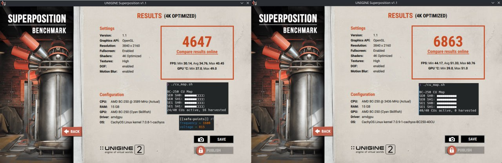

# Разгон и андервольт

> **TL;DR** — Из коробки GPU у BC-250 работает медленно (часто залочен на **1500 МГц**, ~слабо). Лекарство от сообщества — **говернор**, который перезаписывает частоты/напряжение: большинство сборок гоняют **[oberon-governor](https://gitlab.com/mothenjoyer69/oberon-governor)**, его правят, чтобы поднять GPU до **2000 МГц (~+30 % FPS)**. Новый тулкит **[bc250_smu_oc](https://github.com/bc250-collective/bc250_smu_oc)** разгоняет ещё и **CPU** (рекомендуют **4 ГГц @ 1275 мВ**). Отдельно **[разблокировка 40 CU](https://github.com/duggasco/bc250-40cu-unlock)** включает обратно **24 → 40 вычислительных блока**, которые AMD отключила в прошивке, — это больший прирост GPU, чем одни частоты (один прогон Superposition вырос с **4647 до 6863** очков, ([src](https://t.me/c/2424231195/137035))). **Всё это — тепло. Сначала охлади плату** — см. [04-cooling.md](04-cooling.md) — потому что разгон без нормального охлаждения выше ~90 °C приводит к крашам и сбросу платы.

Это **последний** шаг золотого пути, а не первый. Сначала добейся стабильной и холодной платы ([06-linux.md](06-linux.md), [04-cooling.md](04-cooling.md)), и только потом трогай это. Всё здесь — «на свой страх и риск», сообщество повторяет это постоянно ([src](https://t.me/c/2424231195/106844)).

---

## Четыре рычага (и что стоит каждый)

У BC-250 есть **четыре** независимых вещи для настройки. Они складываются:

| Рычаг | Инструмент | Типичный прирост | Цена в тепле |
|-------|-----------|------------------|--------------|
| **Частота GPU** 1500 → 2000 МГц | говернор (oberon / cyan-skillfish) | **~+30 % FPS**, когда упор в GPU | высокая |
| **Андервольт GPU** на фикс. частоте | тот же говернор | тот же FPS, **намного холоднее** | *отрицательная* (меньше тепла) |
| **Частота CPU** 3.5 → 4.0 ГГц | `bc250_smu_oc` | помогает в играх с упором в CPU | высокая |
| **Разблокировка 40 CU** 24 → 40 CU | `bc250-40cu-unlock` | **до ~+48 %** работы GPU | высокая |

Две честные оговорки из чата перед стартом:

- **Большинство игр на BC-250 упираются в CPU, а не в GPU.** Подъём GPU с 2000 до 2229 МГц дал одному тестеру *1 fps* в Shadow of the Tomb Raider (90 → 91), при этом потребление и температуры подскочили сильно, — так что заголовочные «+30 %» проявляются только в тех немногих играх, где GPU и есть бутылочное горло ([src](https://t.me/c/2424231195/67029)).
- **Тепло растёт хуже, чем производительность.** Тот же тестер: 2000 МГц @ 960 мВ = **75 °C** в стресс-тесте; 2229 МГц @ 1030 мВ = **93 °C** — и он откатился, потому что БП и кулер это не держали ([src](https://t.me/c/2424231195/66972), [src](https://t.me/c/2424231195/67029)).

> ⚠️ **Порог безопасности.** Троттлинг начинается около **85 °C**, а жёсткий краш / сброс платы — около **90 °C** (см. [04-cooling.md](04-cooling.md)). Если под нагрузкой переходишь ~85 °C — ты *за* пределом своего охлаждения: снижай частоту или делай андервольт, а не лезь выше.

---

## Шаг 1 — Частота и андервольт GPU: говернор

Драйвер amdgpu на BC-250 не отдаёт обычный разгон через sysfs. Решение сообщества — **говернор**, маленький демон, который пишет состояния частоты/напряжения напрямую. По умолчанию большинство сборок гоняют **oberon-governor**.

### oberon-governor (стандарт)

[mothenjoyer69/oberon-governor](https://gitlab.com/mothenjoyer69/oberon-governor) — демон на C++. По README зависит от **CMake, тулчейна C++ и libdrm**, и **тестируется только на ASRock BC-250**. Многие дистрибутивы дают его в готовом виде (Arch AUR, Fedora COPR, образы Bazzite), так что сборка из исходников нужна, только если в твоём дистрибутиве пакета нет.

**Сборка из исходников** (соответствует воспроизведённой в чате последовательности, ([src](https://t.me/c/2424231195/54666)), и стандартному потоку CMake из репозитория):

```bash
# Зависимости (пример для Arch — подстрой под свой дистрибутив)
sudo pacman -S --needed base-devel cmake pkgconf make libdrm glibc linux-api-headers

git clone https://gitlab.com/mothenjoyer69/oberon-governor.git && cd oberon-governor
sudo cmake . && sudo make && sudo make install
sudo systemctl enable --now oberon-governor.service
```

> Если `cmake` ругается, в чате чинили просто доустановкой недостающих зависимостей и повторной сборкой: `sudo pacman -S pkgconf cmake`, затем пересобрать ([src](https://t.me/c/2424231195/54666)).

**Задай частоту и напряжение.** Говернор читает YAML-конфиг:

```bash
sudo nano /etc/oberon-config.yaml      # правишь min/max частоту и напряжение
sudo systemctl restart oberon-governor # применить
```

Файл позволяет задать **максимальные и минимальные напряжение и частоту** для состояний GPU (по README репозитория). Чтобы уйти со слабого дефолта к народному оптимуму, подними максимальную частоту к **2000 МГц** и опусти напряжение до стабильного значения (про андервольт — ниже). После каждой правки перезапускай сервис.

> **Проверь, что применилось.** Смотри частоты/температуры в реальном времени через `amdgpu_top`, MangoHud или LACT под нагрузкой на GPU. Если частоты висят на ~1500 МГц — сервис не запущен или конфиг не распарсился: `sudo systemctl status oberon-governor`.

### cyan-skillfish-governor (форк через SMU — потребление в простое)

Новый говернор, [bc250-collective/cyan-skillfish-governor](https://github.com/bc250-collective/cyan-skillfish-governor), добавляет управление **power-профилем контроллера памяти**. Прироста производительности **не даёт**, но снижает TDP в простое до **~30–35 Вт** (холоднее и тише в простое) ([src](https://t.me/c/2424231195/125821)). На Arch он есть в пакетах; рецепт замены из чата ([src](https://t.me/c/2424231195/118249)):

```bash
paru -S cyan-skillfish-governor-smu
sudo systemctl stop  oberon-governor.service
sudo systemctl disable  oberon-governor.service
sudo systemctl enable --now cyan-skillfish-governor-smu.service
```

> Гоняй **один** говернор за раз — отключи oberon перед включением cyan-skillfish, иначе они дерутся за одни и те же регистры.

---

## Шаг 2 — Разгон CPU и нормальный андервольт: `bc250_smu_oc`

Выпущен **30.12.2025** командой bc250-collective (реверс-инжиниринг SMU), [bc250_smu_oc](https://github.com/bc250-collective/bc250_smu_oc) — это инструмент, который наконец даёт трогать частоту и напряжение **CPU** (ядра Zen 2), а не только GPU. Авторы рекомендуют **4 ГГц @ 1275 мВ** как оптимум стабильности/тепла и кладут это примером в репозиторий ([src](https://t.me/c/2424231195/106844)).

**Установка и использование** (дословно из README репозитория):

```bash
# Предварительно: поставь утилиту нагрузки CPU `stress` из пакетного менеджера
git clone https://github.com/bc250-collective/bc250_smu_oc.git
cd bc250_smu_oc
pip install .        # или: pipx install .

# Подобрать / протестировать цель (CPU 4 ГГц при 1275 мВ), оставить применённой:
bc250-detect --frequency 4000 --vid 1275 --keep

# Когда нашёл стабильный конфиг — установи его и включи на загрузке:
bc250-apply --install overclock.conf
sudo systemctl enable --now bc250-smu-oc
```

> 🔴 **Жёсткий предел по напряжению.** По репозиторию: **никогда** не давай напряжению ядер CPU (**Vid**) превышать **1.325 В** ни при каких обстоятельствах — деградация кремния начинается выше ~1.35 В ([src](https://t.me/c/2424231195/115726)). И: **подъём частоты CPU без андервольта позволяет Vid расти бесконтрольно и может убить железо** — всегда сочетай подъём частоты с целевым напряжением.

Почему потолок именно 4 ГГц: AMD считает безопасным для этого кремния до ~4 ГГц; BIOS от кита 4700S/Xbox вообще стартует в турбо на 4000 МГц / 1.35 В из коробки. Zen 2 *обычно* догоняется до ~4200, но это **отбраковка от майнинга**, так что 4200 — только «если очень повезёт» ([src](https://t.me/c/2424231195/115726)).

> Закреплённый пост `bc250_smu_oc` может и **заменить** oberon как твой говернор (у него свой сервис `bc250-smu-oc`). Не гоняй два говернора одновременно.

---

## Шаг 3 — Андервольт (делай ради тепла, каждый чип индивидуален)

Андервольт — самый ценный ход на этой плате: **та же частота, намного меньше тепла**, и он *обязателен*, если поднимаешь частоту CPU. Но **каждый чип разный** — кремниевая лотерея тут реальна. Один владелец гонял три почти последовательные платы, и только одна держала 900 мВ под стрессом; охлаждение одинаковое, температуры одинаковые, стабильность разная ([src](https://t.me/c/2424231195/50568)).

**Целевая частота → напряжение, реальные числа сообщества (у твоего чипа будет иначе):**

| Частота GPU | Напряжение, при котором владельцы получили *стабильность в играх* | Примечания |
|-------------|------------------------------------------------------------------|------------|
| 1500 МГц | ~710 мВ | «самая стабильная» плата одного тестера ([src](https://t.me/c/2424231195/23545)) |
| 2000 МГц | **~955 мВ** | стабильно в Furmark на 905 мВ, но артефакты в играх до 955 мВ ([src](https://t.me/c/2424231195/68126), [src](https://t.me/c/2424231195/136773)) |
| 2000 МГц | ~960 мВ → **75 °C** стресс | популярный ежедневный сетпоинт ([src](https://t.me/c/2424231195/66972)) |
| 2229 МГц | ~1030–1050 мВ → **93 °C** стресс | «выключил нах, бо боюсь» — убывающая отдача ([src](https://t.me/c/2424231195/66972)) |

> **Один Furmark — не тест стабильности.** Его фиксированная нагрузка прячет нестабильность, которая вылезает только при смене *контекста* — альт-табы, подгрузка текстур, меню. Плата, «стабильная» в Furmark на 905 мВ, выдавала артефакты текстур в реальных играх через 1–2 часа, пока напряжение не подняли до 955 мВ. Проверяй в **реальных играх + проход по альт-табам/меню** и используй разноплановый инструмент вроде **OCCT** (он грузит VRM, а не только шейдеры), а не только Furmark ([src](https://t.me/c/2424231195/68126), [src](https://t.me/c/2424231195/136773), [src](https://t.me/c/2424231195/23545)).

> **Удобная аппаратная подсказка:** у BC-250 есть **светодиод нагрузки** — **красный = GPU в простое, зелёный = GPU нагружен**. Некоторые «простойные» сцены (например, Новиград в Witcher 3) на деле молотят GPU и вскрывают артефакты андервольта, которые Furmark/Cyberpunk пропускают ([src](https://t.me/c/2424231195/12285)).

Слишком агрессивный андервольт **не опасен** — в худшем случае плата отвалится или отключит слот M.2, что лечится за пять секунд, потому что разгон не хранится в BIOS ([src](https://t.me/c/2424231195/105998)).

---

## Шаг 4 — Разблокировка 40 CU (24 → 40 вычислительных блоков)

Самый большой одиночный прирост GPU и самый новый. Кристалл Cyan Skillfish у BC-250 физически имеет **40 CU**, но стоковая прошивка оставляет активными только **24** (16 «вырезаны»). Параметр ядра **`amdgpu.bc250_cc_write_mode=3`** плюс пропатченный драйвер amdgpu включают все 40. Измеренный результат — прогон Superposition в 4K вырос с **4647 до 6863** очков (24/40 → 40/40 активных CU), при этом инструмент `cu_map.sh` показывает, как заполняется карта вырезанных блоков ([src](https://t.me/c/2424231195/137035)):



Люди гоняют **40 CU @ 1850 МГц** (RE4 Remake в нативных 1440p на high, 60 fps) и даже сообщают об очень низких напряжениях на 40 CU (например, 1400 МГц @ 750 мВ на удачном чипе) ([src](https://t.me/c/2424231195/137260), [src](https://t.me/c/2424231195/137157)).

> ⚠️ **Это требует патча и пересборки модуля ядра amdgpu** — самая трудоёмкая задача в этом гайде и **только для BC-250** (патч защищён PCI ID платы). Патч не персистентный: без modprobe-конфига перезагрузка вернёт 24 CU.

### Самый простой путь — скрипт сборки из проекта

[duggasco/bc250-40cu-unlock](https://github.com/duggasco/bc250-40cu-unlock) кладёт скрипт, который делает сборку/включение за тебя (нужны `gcc`, `make`, `zstd` и заголовки ядра):

```bash
git clone https://github.com/duggasco/bc250-40cu-unlock.git
cd bc250-40cu-unlock
sudo ./scripts/bc250-enable-40cu.sh build
sudo ./scripts/bc250-enable-40cu.sh enable   # пишет modprobe-конфиг и перезагружается
```

### Ручной путь (патчишь модуль сам)

Для тех, кто хочет рулить сам (например, CachyOS/Arch — самый используемый дистрибутив в чате под это). Воспроизведено из закреплённой инструкции сообщества ([src](https://t.me/c/2424231195/137241)) — сверь патч и уровень `-p` с [репозиторием](https://github.com/duggasco/bc250-40cu-unlock), где используется `patch -p5`:

```bash
# 1. Получить подходящие заголовки ядра (пример CachyOS)
sudo pacman -Suy
sudo pacman -S linux-cachyos-headers
sudo reboot

# 2. Пропатчить исходник amdgpu, пересобрать и установить модуль
cd /usr/lib/modules/$(uname -r)/build/drivers/gpu/drm/amd/amdgpu
# применить bc250-40cu-amdgpu.patch к gfx_v10_0.c  (patch -p5 < .../patch/bc250-40cu-amdgpu.patch)
sudo make -C /usr/lib/modules/$(uname -r)/build M=$(pwd) modules
sudo make -C /usr/lib/modules/$(uname -r)/build M=$(pwd) modules_install
sudo reboot

# 3. Включить фичу параметром ядра, пересобрать initramfs, перезагрузиться
echo 'options amdgpu bc250_cc_write_mode=3' | sudo tee /etc/modprobe.d/bc250-40cu.conf
sudo mkinitcpio -P     # Fedora/atomic: dracut --force  (или rpm-ostree kargs, ниже)
sudo reboot
```

**На Fedora atomic / Bazzite** (rpm-ostree) параметр добавляется как kernel arg ([src](https://t.me/c/2424231195/137916)):

```bash
sudo rpm-ostree kargs --append-if-missing='amdgpu.bc250_cc_write_mode=3'
sudo systemctl reboot
```

### Проверь, что разблокировка сработала

```bash
sudo dmesg | grep active_cu_number     # успех = ...active_cu_number 40
sudo dmesg | grep bc250-40cu           # показывает записи регистров mode=3
```

Если число оканчивается на **40** — все CU живы ([src](https://t.me/c/2424231195/137241)). Должны быть и строки лога вида `bc250-40cu-enable: mode=3 ... CC=0xfff80000->0xffe00000 SPI=0x00000007->0x0000001f` ([src](https://t.me/c/2424231195/137889)).

> **Не хочешь пересобирать ядро?** Сообщество пилит вспомогательные скрипты и готовые сборки модуля. Смотри [WinnieLV/bc250-cu-live-manager](https://github.com/WinnieLV/bc250-cu-live-manager) (переключение CU на лету) и [gennro/bc250-toolkit](https://github.com/gennro/bc250-toolkit) (`bc250-toolkit.sh` / `bc250-unlock.sh`). Они быстро меняются — проверяй актуальный статус в репозиториях.

---

## Память GDDR6: выделение VRAM, разгон и тайминги

> 🔴 **Прочти это раньше всего остального в разделе. Настройка памяти — единственное место на BC-250, которое может насовсем закирпичить плату.** В отличие от частоты/андервольта выше — которые живут в говернере и сбрасываются перезагрузкой — **частота и тайминги GDDR6 пишутся в BIOS/CMOS**, и неверное значение может оставить плату без POST. Сообщество кирпичило платы именно так: участник выставил частоту VRAM **1950 МГц** и убил плату ([src](https://t.me/c/2424231195/55317)); в собственном релиз-ноуте автора мод-биоса записана частота GDDR6, которая **завелась на одной плате (1800 МГц), но окирпичила другую** ([src](https://t.me/c/2424231195/54971)), и «слишком низкие тайминги кирпичат плату, сброс CMOS не помогает» ([src](https://t.me/c/2424231195/54971), [src](https://t.me/c/2424231195/54851)). Восстановление — это глава про BIOS, иногда вернуть плату можно только программатором. **Не трогай частоту/тайминги, пока не прочёл [08-bios.md](08-bios.md) и не принял риск кирпича.**

16 ГБ GDDR6 на BC-250 — это **единая память (UMA)**: один пул, общий для GPU и CPU. С ней можно делать две очень разные вещи на двух очень разных уровнях риска:

| Что | Где | Риск | Кому |
|-----|-----|------|------|
| **Выделение VRAM / UMA** (раздел GPU↔CPU) | обычное меню BIOS | **безопасно** — это просто размер буфера | всем, это рутина |
| **Частота и тайминги GDDR6** | **только** мод-биос | **уровень кирпича** — см. предупреждение выше | только экспертам |

### Выделение VRAM / UMA — безопасно, делай в BIOS

Сколько из 16 ГБ отдать GPU, а сколько оставить CPU — обычная настройка BIOS (мод не нужен; даже урезанный мод-биос даёт «по сути ничего, кроме настройки размера буфера» ([src](https://t.me/c/2424231195/94419))). Опции ведут себя так ([src](https://t.me/c/2424231195/81203)):

| Опция BIOS | Наблюдаемый результат |
|------------|-----------------------|
| **Auto** | выделяет GPU **8 ГБ** |
| **UMA_SPECIFIED** → Auto | то же, что Auto (8 ГБ) |
| **UMA_AUTO** (автоматически) | выделяет всего **256 МБ** — **ненадёжно, избегай** |
| **UMA_SPECIFIED** | фиксированный размер выбираешь сам (512 МБ / 1 / 4 / 6 / 8 ГБ) |

> 🔴 **Не используй автоматический режим (`UMA_AUTO`).** Он отдаёт GPU всего ~256 МБ, и этого мало — при таком размере реально доступно лишь ~2 ГБ, а GPU может свалиться в **llvmpipe (программный рендеринг — без аппаратного ускорения, всё считает CPU)** ([src](https://t.me/c/2424231195/81203)). Вместо этого выставь **фиксированный** буфер.

**Что выбрать — поставь маленький ФИКСИРОВАННЫЙ буфер 512 МБ.** Консенсус сообщества прямой: APU показывают лучшую производительность, когда видеобуфер выставлен в **минимум (512 МБ)**, потому что тогда драйвер **динамически распределяет весь пул 16 ГБ GDDR6** и подсасывает ровно столько, сколько нужно GPU, по требованию ([src](https://t.me/c/2424231195/38599), [src](https://t.me/c/2424231195/17948)). Больший фиксированный кусок *не* делает быстрее автоматически — в игровых бенчмарках одного участника размер VRAM почти не двигал средний FPS, в основном влиял на **минимальные / 1%-low** кадры и на то, запустится ли игра вообще (пара игр зависала на 256 МБ / 512 МБ / 1 ГБ и шла только от 4 ГБ и выше) ([src](https://t.me/c/2424231195/81203)). Реальный выигрыш 512 МБ — в *получаемом распределении*: при 512 МБ здоровый прогон даёт ~**5.8 ГБ в видео / 11.5 ГБ в ОЗУ / ~1.6 ГБ свопа**, тогда как залипший на 8 ГБ раздел морит систему голодом ([src](https://t.me/c/2424231195/138294)).

> **Зависит от задачи.** Часть игр ведёт себя иначе, а некоторые **виснут намертво при неправильной настройке** ([src](https://t.me/c/2424231195/131105), [src](https://t.me/c/2424231195/94993), [src](https://t.me/c/2424231195/139016)). Самый наглядный пример: Cyberpunk 2077, если дать ему фиксированные **4 ГБ**, перестаёт «видеть» память выше 8 ГБ как доступную ОЗУ и **активно свопится**, даже когда запас есть; на **512 МБ** он всё равно откусывает ~4–5 ГБ под GPU, но корректно оставляет 12 ГБ+ под систему и уходит в своп только когда они исчерпаны, — поэтому народный совет одного участника: *«хуярь 512, а дальше господь разберётся»* ([src](https://t.me/c/2424231195/94993), [src](https://t.me/c/2424231195/131105)). Для большинства: **512 МБ фиксировано, избегай авто.** Поднимай до **4 ГБ** только под конкретную игру, про которую известно, что ей так лучше (таких единицы), или под прожорливые по памяти GPU-задачи (см. AI/LLM ниже). Оговорка: фиксированное выделение VRAM больше 512 МБ может ломать **выделение крупных буферов в Vulkan** (например, `llama.cpp`), что лечит кернел-патч сообщества — чтобы динамическое выделение работало и выше 512 МБ ([src](https://t.me/c/2424231195/20001), [src](https://t.me/c/2424231195/20002)).

### Частота и тайминги GDDR6 — мод-биос, только для экспертов

Стоковые тайминги GDDR6 консервативны; реальный прирост пропускной способности есть, но **это территория BIOS/мод-тулов, а не говернора** — напрямую завязано на мод-биос из [08-bios.md](08-bios.md). Справочник сообщества — закреплённый разбор **«#BC-250 GDDR6 Memory Explained»** ([src](https://t.me/c/2424231195/126436)); параллельная заметка на английском говорит прямо: *«если ты это запорешь — положишь чип. При этом дефолты так себе, прироста можно вытащить много»* ([src](https://t.me/c/2424231195/55353)).

Что, по разбору, настраивается (значения — результаты **одного тестера**, не универсальные, ⚠ verify под свою плату) ([src](https://t.me/c/2424231195/126436)):

- **`ClockSpeed`** — сток **1750**. **~1875 МГц — похоже, максимум, который ещё проходит POST**; выше плата не стартует. Любое изменение здесь связано с `tCL`.
- **`tCL`** (CAS latency) — **24** на 1750 МГц и ниже; на 1755 МГц и выше нужен **26**.
- **`tRAS`** — должен равняться `tCL + tRCD + 1`; разбор использует значение write-RCD, чтобы его снизить ради небольшого прироста.
- **`tRCDRD` / `tRCDWR`** — лучше оставить сток 27 / 19; их снижение, по тестеру, *ухудшало* производительность.
- **`tRCAb`** — не проходит POST ниже ~70; лучше всего 71–72.
- **`tRFC` / `tREF`** (refresh) — выше = меньше потребление и нагрев; **12000 — сток, ~13000 уже не проходит POST**.
- Ряд полей (`tRPAb`, `tRRDS`, `tRRDL`, `tRTP`, `tFAW`) считаются специфичными для производителя и были **не тронуты** — у тестера не было по ним данных.

> 🔴 **Почему это кирпичит, а остальное — нет.** Эти значения пишутся в **CMOS**, и набор, который останавливает плату *до* того, как она дойдёт до процедуры сброса настроек в BIOS, даёт жёсткий кирпич, который **очистка CMOS / снятие батарейки не лечат** ([src](https://t.me/c/2424231195/54971), [src](https://t.me/c/2424231195/94419)). Один участник передал весь дух раздела (буквально) песней — *«перепутал тайминг, не могу загрузиться»* — и боялся окирпичить ([src](https://t.me/c/2424231195/66381)). Часть владельцев вообще избегает BIOS-персистентных правок памяти, потому что **число циклов перезаписи GDDR6/CMOS конечно**, и предпочитает подход только в рантайме ([src](https://t.me/c/2424231195/126437)). ⚠ verify: надёжного рантайм-инструмента разгона памяти пока нет — относись к правкам частоты/таймингов как к прошивке BIOS и **сначала имей план восстановления** ([08-bios.md](08-bios.md)).

### Зачем память для AI / LLM — и что её надо охлаждать

Главная причина возиться с GDDR6 здесь — **пропускная способность и объём под AI/LLM**: участники гоняют локальные LLM на BC-250, задавая **выделение UMA как буфер под модель** ([src](https://t.me/c/2424231195/57659)) — один сообщает о модели 14B на **~24 ток/сек** и рабочих мультимодальных моделях, после патча ядра, чтобы `llama.cpp` видел больше общей памяти ([src](https://t.me/c/2424231195/57767)). Для таких задач именно **больший кусок VRAM** (выше) важнее, чем рискованные правки таймингов.

> 🌡️ **Охлаждай память, а не только кристалл.** Чипы GDDR6 стоят на **обратной стороне** платы и требуют отдельного теплоотвода — моды с бэкплейтом/термопрокладками существуют именно для охлаждения памяти. Гнать частоту GDDR6 (да и просто крутить тяжёлые AI-задачи) без охлаждения чипов — напрашиваться на нестабильность; про термопрокладки бэкплейта см. [04-cooling.md](04-cooling.md).

---

## Рекомендуемая последовательность

| Уровень | Что сделать | Чего ждать |
|---------|-------------|------------|
| **Старт** | oberon-governor → GPU **2000 МГц**, андервольт до **~955 мВ** игро-стабильно | ~+30 % FPS, где упор в GPU, ~75 °C |
| **+ CPU** | `bc250_smu_oc` → **4 ГГц @ 1275 мВ** (Vid никогда > 1.325 В) | помогает в играх с упором в CPU |
| **+ Простой** | переключиться на cyan-skillfish-governor | ~30–35 Вт в простое, холоднее/тише |
| **Макс GPU** | разблокировка 40 CU + настройка частоты/напряжения на 40 CU | до ~+48 % работы GPU |

После **любого** изменения: грузи GPU **и** CPU вместе (у них один кристалл и один радиатор), смотри температуры и держи нагрузку ниже ~85 °C. Если не получается — ответ в **большем охлаждении, а не в погоне за частотами**: возвращайся к [04-cooling.md](04-cooling.md). Именно вода открывает верхний предел (например, CPU 4.0 ГГц на воде против 3.85 ГГц на воздухе) ([src](https://t.me/c/2424231195/135417)).

---

## ⏳ Устаревшее / меняющееся — прочти, прежде чем верить старому чату

Эта обвязка менялась быстро в 2025–2026. Смотри на даты:

- **До ~декабря 2025:** единственным говернором был **oberon-governor** (только частота/напряжение GPU). Старые посты, где написано «CPU разогнать нельзя», устарели и предшествуют `bc250_smu_oc` (выпущен **30.12.2025**) ([src](https://t.me/c/2424231195/106844)).
- **Разблокировка 40 CU новая (~май 2026)** и ещё дозревает. Ранние сообщения называют её «инсайдерская инфа / многообещающе, но ненадёжно» ([src](https://t.me/c/2424231195/137022)); к середине мая это уже рабочая закреплённая процедура ([src](https://t.me/c/2424231195/137241)). Методы, патчи и готовые сборки ещё двигаются — предпочитай [репозиторий](https://github.com/duggasco/bc250-40cu-unlock) любому отдельному сообщению из чата. ⚠ Сверь уровень strip патча (`-p5`) и версию ядра с репозиторием перед сборкой.
- **cyan-skillfish-governor** (форк под простой) появился **~март 2026** ([src](https://t.me/c/2424231195/125821)); релизы SMU «plus» ещё новее.
- Для совсем отчаянных есть и живой разбор **таймингов памяти** (GDDR6 tCL/tRAS и т. д.), но это территория BIOS/мод-тулов, а не говернора — см. [08-bios.md](08-bios.md) и пост про тайминги ([src](https://t.me/c/2424231195/126436)).

---

## Источники

- oberon-governor (говернор GPU по умолчанию) — https://gitlab.com/mothenjoyer69/oberon-governor · последовательность сборки и фикс cmake — https://t.me/c/2424231195/54666
- bc250_smu_oc (разгон CPU, 4 ГГц @ 1275 мВ) — https://github.com/bc250-collective/bc250_smu_oc · релиз/анонс — https://t.me/c/2424231195/106844
- cyan-skillfish-governor (потребление в простое) — https://github.com/bc250-collective/cyan-skillfish-governor · TDP в простое — https://t.me/c/2424231195/125821 · рецепт замены — https://t.me/c/2424231195/118249
- Разблокировка 40 CU — https://github.com/duggasco/bc250-40cu-unlock · закреплённый ручной гайд — https://t.me/c/2424231195/137241 · Fedora atomic — https://t.me/c/2424231195/137916 · подтверждение в dmesg — https://t.me/c/2424231195/137889
- Менеджер CU на лету / тулкит — https://github.com/WinnieLV/bc250-cu-live-manager · https://github.com/gennro/bc250-toolkit
- Данные по частотам/напряжению/теплу — https://t.me/c/2424231195/66972 · https://t.me/c/2424231195/67029 · стабильность андервольта — https://t.me/c/2424231195/68126 · https://t.me/c/2424231195/136773 · https://t.me/c/2424231195/23545
- Кремниевая лотерея и безопасные пределы — https://t.me/c/2424231195/50568 · https://t.me/c/2424231195/115726
- Результат Superposition 24-против-40-CU — https://t.me/c/2424231195/137035
- Память GDDR6 — выделение VRAM/UMA: поведение опций и откат в llvmpipe — https://t.me/c/2424231195/81203 · ставить 512 МБ фиксировано (драйвер делит весь пул 16 ГБ) — https://t.me/c/2424231195/38599 · https://t.me/c/2424231195/17948 · корректное распределение 5.8/11.5/1.6 при 512 МБ — https://t.me/c/2424231195/138294 · зависит от задачи / своп и зависания Cyberpunk — https://t.me/c/2424231195/131105 · https://t.me/c/2424231195/94993 · https://t.me/c/2424231195/139016 · тайминги «GDDR6 Memory Explained» — https://t.me/c/2424231195/126436 · англоязычная заметка по таймингам — https://t.me/c/2424231195/55353 · оговорка про циклы перезаписи CMOS — https://t.me/c/2424231195/126437
- Риск кирпича GDDR6 — кирпич на 1950 МГц — https://t.me/c/2424231195/55317 · частота завелась на одной плате, окирпичила другую / сброс CMOS не помогает — https://t.me/c/2424231195/54971 · кирпич от таймингов — https://t.me/c/2424231195/54851 · восстановление только программатором — https://t.me/c/2424231195/94419 · «перепутал тайминг» — https://t.me/c/2424231195/66381
- Память для AI/LLM — UMA как буфер модели — https://t.me/c/2424231195/57659 · 14B @ ~24 ток/сек + патч ядра — https://t.me/c/2424231195/57767 · патч Vulkan под большой VRAM / динамическое выделение выше 512 МБ — https://t.me/c/2424231195/20001 · https://t.me/c/2424231195/20002
- Инструменты мониторинга — [LACT](https://github.com/ilya-zlobintsev/LACT) · [MangoHud](https://github.com/flightlessmango/MangoHud) · [amdgpu_top](https://github.com/Umio-Yasuno/amdgpu_top)

> **Сначала охлаждение.** Ни одна из этих частот не безопасна без работы по рёбрам/вентилятору из [04-cooling.md](04-cooling.md). Выше ~90 °C плата сбрасывается.
