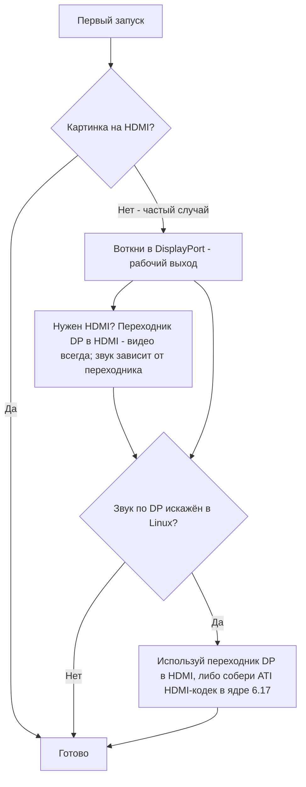

# Видео и вывод

> **Коротко** — BC-250 выводит картинку на монитор по **DisplayPort**. Втыкай именно его. Если на твоей плате есть и порт HDMI — он **часто не показывает ничего**, так что чёрный экран на нём *не значит*, что плата мёртвая, ты просто на не том выходе. Нужен HDMI? Используй **переходник DP→HDMI** — **видео проходит всегда, без тормозов**; часть переходников несёт и **звук** (проверенный нёс, [src](https://t.me/c/2424231195/9148)), но звук зависит от конкретного переходника, так что не рассчитывай на него (см. раздел про звук). Один реальный косяк: **звук по DisplayPort в Linux выводится искажённым/замедленным**; тот же переходник DP→HDMI его обходит, а полноценный фикс на стороне ядра приходит примерно в **ядре 6.17** ([src](https://t.me/c/2424231195/17953), [src](https://t.me/c/2424231195/68051)).

«Нет картинки на первом запуске» — **паника новичка №1**. Прочти блок ниже, прежде чем решать, что что-то сломано.

---

## Нет картинки? Сделай так

1. **Втыкай в DisplayPort, не в HDMI.** Рабочий видеовыход BC-250 — это DisplayPort ([src](https://t.me/c/2424231195/104784)). Порт HDMI (если он есть) обычно как раз пустой — не суди по нему о плате.
2. **Переткни карту и попробуй снова.** Платы регулярно не инициализируются с первого раза — передёрни питание (полностью выкл/вкл) и физически переустанови. Из опыта владельца: *«когда моя приехала, она тоже включилась не с первого раза … сейчас нередко при перезагрузке с кнопки не инициализируется до конца — спасает выкл/вкл»* ([src](https://t.me/c/2424231195/15701)).
3. **Подозревай кабель/переходник раньше платы.** Когда карта одна, плохой кабель или переходник — главный подозреваемый ([src](https://t.me/c/2424231195/15699)). Некоторые переходники работают в прошивке, но гаснут, когда грузится ОС — *«до GRUB норм, в системе чёрный экран»* ([src](https://t.me/c/2424231195/38184)).
4. **Сбрось BIOS / перешей проверенный образ**, если несколько карт из партии не дают изображения — это указывает на прошивку, а не на монитор ([src](https://t.me/c/2424231195/15697), [src](https://t.me/c/2424231195/15705)).

Если все четыре пункта пройдены, а картинки всё нет — иди в [troubleshooting.md](troubleshooting.md).



---

## Выходы — кратко

| Выход | Работает? | Примечания |
|-------|-----------|------------|
| **DisplayPort** | **Да — это и есть выход** | Основной/единственный видеоразъём; несёт звук. В спецификации I/O репозитория указан `1x DisplayPort` ([repo](https://github.com/mothenjoyer69/bc250-documentation)). Это **DisplayPort 1.4**, потолок **4K@120 Гц**, с HDR10 ([elektricM](https://github.com/elektricM/amd-bc250-docs/blob/main/docs/hardware/display.md)). |
| **Порт HDMI** (если распаян) | **Часто пустой** | Новички думают, что плата мёртвая; обычно нет — переключись на DP. ([src](https://t.me/c/2424231195/104784)) |
| **DP → HDMI через переходник** | **Видео: да. Звук: зависит от переходника** | Видео проходит без тормозов ([src](https://t.me/c/2424231195/9148)); звук зависит от чипсета — проверяй (см. раздел про звук). Это же штатный фикс искажений звука по DP (ниже). |
| **Второй видеовыход** | **Из коробки нет** | Электрически есть, но **не распаян**; заставить второй монитор — через костыли, а другие говорят, что у чипа нет реального второго выхода — считай безопасным допущением один выход. ([src](https://t.me/c/2424231195/92978), [src](https://t.me/c/2424231195/104682)) |
| **Второй экран по сети** | **Да** | Стримь вывод BC-250 на другую машину по локалке (Steam/Sunshine). ([src](https://t.me/c/2424231195/23660)) |

---

## Разрешения, частота и кабель

Справочник elektricM уточняет, что реально тянет единственный DP-линк — полезно при выборе монитора или переходника ([elektricM](https://github.com/elektricM/amd-bc250-docs/blob/main/docs/hardware/display.md)):

| Разрешение | Частота | Путь |
|------------|---------|------|
| 1920×1080 (1080p) | 144 Гц+ | Нативный DP или любой переходник |
| 2560×1440 (1440p) | 144 Гц+ | Нативный DP (пассивные переходники часто упираются в 1440p@60 / DP 1.2) |
| 3840×2160 (4K) | 60 Гц | Нативный DP или **активный** переходник DP→HDMI 2.0 |
| 3840×2160 (4K) | 120 Гц | **Только нативный DP** — для 4K@120 по HDMI нужен активный DP 1.4→HDMI 2.1, и он капризен |

- **Кабель:** бери **сертифицированный VESA DisplayPort 1.4**, **1–2 м**; длиннее — проблемы с синхронизацией/выпадениями ([elektricM](https://github.com/elektricM/amd-bc250-docs/blob/main/docs/hardware/display.md)).
- **Застрял на низком разрешении** (напр. 1024×768/1080p, только 60 Гц) — обычно не загружен драйвер GPU; проверь `glxinfo | grep "OpenGL renderer"`; `llvmpipe` = софтверный рендер, ставь Mesa 25.1+ и убирай `nomodeset` ([elektricM](https://github.com/elektricM/amd-bc250-docs/blob/main/docs/troubleshooting/display.md)). См. [06-linux.md](06-linux.md).
- **HDR (HDR10) и VRR** работают, но в Linux экспериментально — лучшая поддержка у **KDE Plasma 6+**, обычно нужна сессия Wayland ([elektricM](https://github.com/elektricM/amd-bc250-docs/blob/main/docs/hardware/display.md)). **Тут важен дистрибутив:** в отзыве сообщества r/BC250Gaming (Reddit) **HDR + VRR заработали как надо только на CachyOS** (Plasma 6 + Wayland), тогда как на **Bazzite HDR давал графические глитчи, а VRR не работал вообще**. Их пример: *Forza Horizon 6* в **1440p High, HDR + VRR включены, 60–80 FPS** через переходник **UGREEN DP→HDMI 2.1**. Если HDR/VRR в приоритете — см. заметку про CachyOS в [06-linux.md](06-linux.md).
  - **Если ты на Bazzite KDE и хочешь VRR/FreeSync по HDMI** — есть ремикс от сообщества, в который вшита работа AMD по ядру HDMI 2.1 / FRL: **[`dyllan500/bazzite-amd-hdmi-kde`](https://github.com/dyllan500/bazzite-amd-hdmi-kde)** — образ Bazzite KDE, пересобранный на ядре с официальными VRR-патчами AMD для HDMI 2.1 (из `amd-staging-drm-next`). ⚠ **сильно хеджируй:** это сторонний образ, автор тестировал VRR только на **Radeon 9070 XT** (не на BC-250), и он задуман как временный — до того, как патчи приедут в стоковое ядро Bazzite. Это *не* подтверждённый фикс для BC-250 — считай его экспериментальным вариантом «попробовать», а не гарантией.

> **Чёрный экран *после входа* (GRUB и экран входа были нормальные)** — проблема сессии рабочего стола, обычно **Wayland**: выбери «GNOME on Xorg»/«Plasma (X11)» по шестерёнке на входе или поставь `WaylandEnable=false` в `/etc/gdm/custom.conf` ([elektricM](https://github.com/elektricM/amd-bc250-docs/blob/main/docs/hardware/display.md)). Чёрный экран *до* входа — это драйвер/`nomodeset` выше, не этот случай.

---

## Звук по DisplayPort искажён — фикс через переходник

В Linux звук, отправленный **напрямую из DisplayPort**, выводится на BC-250 криво — описывают как искажённый, *«растянутый, будто замедлен в два раза»*, с потрескиванием ([src](https://t.me/c/2424231195/9895)). Это **проблема Linux/протокола DP, а не дефект платы** — её ловили и на не-BC-250 железе ([src](https://t.me/c/2424231195/15983)).

Тупой, но надёжный обход, к которому пришёл чат: **прогнать сигнал через переходник DP→HDMI.** После преобразования в HDMI артефактов звука нет ([src](https://t.me/c/2424231195/17953), [src](https://t.me/c/2424231195/51763)). Пользователь проверил напрямую: *«Я проверил вывод звука через переходник DisplayPort→HDMI. Всё в порядке, тормозов нет»* ([src](https://t.me/c/2424231195/9148)).

**Самый чистый путь из всех — прямой *кабель* DP→HDMI: штекер DP на одном конце, штекер HDMI на другом, без переходников-донглов и коробочек на любом из концов.** Несколько пользователей в треде сообщества r/linux_gaming независимо сообщают, что именно так звук работает надёжнее всего: обычный кабель (напр. кабель Amazon Basics DP-to-HDMI, ~$10) «просто работает» там, где переходники-донглы — как повезёт. Редкие короткие пропадания звука всё ещё возможны, но цельный кабель убирает лишний чипсет переходника, из-за которого путь через донгл — лотерея ([r/linux_gaming](https://www.reddit.com/r/linux_gaming/comments/1nvsgji/)). Если всё равно покупаешь — **бери кабель, а не донгл.**

**Если переходника под рукой нет,** выводи звук по **Bluetooth** — большинство колонок/гарнитур его поддерживают, и это полностью обходит путь DP ([src](https://t.me/c/2424231195/89769)). BT-донгл — см. [10-wifi-bt.md](10-wifi-bt.md).

### Заметки по переходникам (комьюнити)
- **Для 4K@60+ нужен *активный* переходник/кабель** (пассивный упирается в ~1440p@60). Рабочий проверенный пример: **кабель UGREEN DP125 (DP→HDMI 4K)** — заявлен 4K@30, но на ТВ согласовался 4K@60 ([src](https://t.me/c/2424231195/52398)). Активный против пассивного задаёт потолок разрешения — но **не** решает, пройдёт ли звук (см. ниже).
- **Не все переходники несут звук.** У одного владельца переходник Belsis отдавал 4K@60 *со* звуком, а несколько более дорогих Ugreen показывали «HDMI цифровое аудио» в списке устройств, но звука не выводили — один к тому же опустил голоса на октаву ([src](https://t.me/c/2424231195/106617)). Если есть видео, но нет звука — переменная именно переходник, пробуй другой.
- **Для HDMI-*звука* сначала бери *пассивный* переходник.** Паттерн из треда сообщества r/linux_gaming: **пассивные** переходники DP→HDMI обычно отдают звук чисто, а **активные** часто **режут звук целиком или сдвигают высоту** (голоса, по сообщениям, опускаются примерно на 20% / на квинту). Загвоздка: активный нужен только ради настоящего **HDR** (и для 4K@60+), так что это честный компромисс — пассивный ради надёжного звука, активный ради HDR. Подтверждённые сообществом рабочие *пассивные* варианты: **Silver Monkey**, **BENFEI (ASIN B017Q8ZVWK)** и **кабель AmazonBasics DP-to-HDMI** (именно цельный кабель, а *не* их переходник-донгл) ([r/linux_gaming](https://www.reddit.com/r/linux_gaming/comments/1nvsgji/)). ⚠ конкретные SKU — по сообщениям сообщества, не проверены здесь в лаборатории, и пассивный переходник всё равно упирается в ~**1440p@60**.
- Дешёвые **DP→HDMI 4K@60**, передающие и видео, и звук, существуют и работают по отзывам ([src](https://t.me/c/2424231195/133977)).
- Некоторые переходники сходят с ума именно на **4K-мониторах** ([src](https://t.me/c/2424231195/1988)).
- **Звук по переходнику DP→HDMI нестабилен и зависит от чипсета конкретного переходника — а не просто от «активный против пассивного».** Видео проходит всегда; **переменная — именно звук.** Наши отзывы — поадаптерно (UGREEN/Belsis по сообщениям несут звук, часть других — молчат), а гайд elektricM сообщает *противоположное* деление (звук несут пассивные, а часть активных молчит — напр. Cable Matters/StarTech) — именно поэтому ярлык «активный/пассивный» это не предсказывает ([elektricM](https://github.com/elektricM/amd-bc250-docs/blob/main/docs/troubleshooting/display.md)). Для **надёжного** звука не ставь на переходник: предпочти **дисплей/AV-ресивер с нативным DisplayPort** либо выводи звук по **USB (USB-DAC/звуковое устройство)**. Если всё же берёшь переходник — **проверь звук до того, как на него полагаться** — и помни, что **пассивный** упирается в ~**1440p@60**.

### Фикс в ядре 6.17 (звук прямо по DP, без переходника)

Если хочешь чистый звук **прямо по DisplayPort** без переходника — причину и фикс в чате нашли. Стоковый конфиг ядра Fedora собирал `snd-hda-codec-hdmi.ko` + `snd-hdmi-lpe-audio.ko`; **ядро 6.17 поменяло путь HDMI-аудио** и сломало звук на этом дефолтном конфиге. Фикс — собрать ещё и **ATI HDMI-кодек**: в конфиге ядра поменять `# CONFIG_SND_HDA_CODEC_HDMI_ATI is not set` на `CONFIG_SND_HDA_CODEC_HDMI_ATI=m`, что упаковывает `snd-hda-codec-atihdmi.ko`; звук тогда работает **без патчей** ([src](https://t.me/c/2424231195/68051), [src](https://t.me/c/2424231195/68061)).

```text
# Правка конфига ядра Fedora для звука DP/HDMI на ядре 6.17+
# из:
# CONFIG_SND_HDA_CODEC_HDMI_ATI is not set
# в:
CONFIG_SND_HDA_CODEC_HDMI_ATI=m
```

С этим третьим кодеком (`snd-hda-codec-atihdmi.ko`) ALSA показывает аудиовыходы платы (напр. `pcm=3` и `pcm=7` как два HDMI-устройства) ([src](https://t.me/c/2424231195/68062), [src](https://t.me/c/2424231195/67569)). ⚠ verify — это требует сборки кастомного ядра; для большинства считай переходник DP→HDMI вариантом «без сборки». Настройка ядра/драйверов — см. [06-linux.md](06-linux.md).

### Объёмный звук (5.1) — через USB-звуковуху, не по HDMI

**Объёмный 5.1 по HDMI на BC-250 *не* работает.** HDMI-прошивка AMD в Linux для этого headless/майнингового кристалла не отдаёт многоканальный LPCM, поэтому выход HDMI откатывается в обычное стерео — что бы ни поддерживал ресивер ([r/linux_gaming](https://www.reddit.com/r/linux_gaming/comments/1nvsgji/)). Для настоящего многоканала выводи звук через **USB-звуковую карту / USB-DAC** — поставь её синком по умолчанию в `pavucontrol`, затем проверь все шесть каналов:

```bash
speaker-test -D pipewire -c 6 -t wav
```

Этот же путь через USB-DAC — надёжный фикс и для стерео, когда переходники капризничают (выше).

---

## Второй выход (изначально неактивный)

На плате есть **второй видеовыход, который из коробки неактивен.** Мнение комьюнити расходится, и стоит знать обе половины:

- Он **электрически есть, но не распаян**, и *«через костыли можно заставить второй монитор работать»* ([src](https://t.me/c/2424231195/92978)).
- Другие сообщают, что у чипа просто **нет рабочего второго выхода** — *«проблема в чипе и то, что второго выхода физически нет»* ([src](https://t.me/c/2424231195/104682)).

На практике: **исходи из одного выхода DisplayPort.** Про **MST-сплиттер DP на два независимых экрана спрашивали, но рабочим на BC-250 он не подтверждён** в нашем чате ([src](https://t.me/c/2424231195/92109)).

**Апдейт от elektricM — MST тянет два экрана с правильным хабом.** По тестам elektricM — до **2 дисплеев через DP MST-хаб** (полоса делится, разрешение на дисплей ограничено), с результатами по хабам ([elektricM](https://github.com/elektricM/amd-bc250-docs/blob/main/docs/hardware/display.md)):

| MST-хаб | Выходы | Версия DP | Независимые дисплеи? | Звук | Примечания |
|---------|--------|-----------|----------------------|------|------------|
| StarTech MST14DP122DP | 2× DP | 1.4 | **Да** | Да | Стабильно работал на разных мониторах/кабелях |
| Monoprice 21972 | 2× DP | 1.2 | **Только зеркало** | Да | Удалось только зеркалить |
| ENBUER | 2× DP | 1.2 | **Только зеркало** | Да | Удалось только зеркалить |
| Generic HDMI MST | 2× HDMI | — | **Нет** | Нет | Ни видео, ни звука |

То есть нативные два монитора **возможны** через MST на хабе DP 1.4 (StarTech подтверждён); дешёвые хабы DP 1.2 могут только зеркалить, а HDMI MST-хабы не завелись. ⚠ verify — подтверждён один модельный хаб; результат зависит от хаба.

**Другой путь к мультидисплею — USB DisplayLink-переходник.** Добавь USB→HDMI/DP DisplayLink-переходник для лишнего **десктопного** экрана (для лучшего результата втыкай *после* загрузки). **Не для игр** — он сжимает на CPU, а CPU и есть узкое место BC-250, так что задержка большая; в **игровом режиме** Steam Deck он тоже не работает ([elektricM](https://github.com/elektricM/amd-bc250-docs/blob/main/docs/hardware/display.md)).

---

## Второй экран по сети (простой «второй дисплей»)

Если тебе реально нужна картинка BC-250 на втором устройстве — проверенный путь не второй кабель, а **стрим по локалке.** Из опыта пользователя: *«Запускал со Steam игру на BC-250 (Fedora) и стримил по сети на рабочий ноут, управлял с ноута. Всё работало»* ([src](https://t.me/c/2424231195/23660)).

- **Sunshine** (хост-энкодер) тут подходит, потому что он не только под NVIDIA — кодированием занимается он, клиент лишь декодирует ([src](https://t.me/c/2424231195/25091)). По гигабитной локалке — почти идеально ([src](https://t.me/c/2424231195/25563)).
- **Moonlight в роли хоста** *не* подходит — он ждёт энкодер NVIDIA и фризит/жалуется на отсутствие аппаратного декодера ([src](https://t.me/c/2424231195/25050)). Используй Sunshine как хост, Moonlight только как клиент.

Это также практичный способ получить ощущение «двух дисплеев» без неактивного второго выхода выше.

---

## Источники

- Переходник DP→HDMI несёт видео+звук, без тормозов — https://t.me/c/2424231195/9148
- Искажение звука по DP — проблема Linux; переходник чинит — https://t.me/c/2424231195/17953 · https://t.me/c/2424231195/9895 · https://t.me/c/2424231195/51763 · https://t.me/c/2424231195/15983
- Фикс звука в ядре 6.17 (`CONFIG_SND_HDA_CODEC_HDMI_ATI=m`) — https://t.me/c/2424231195/68051 · https://t.me/c/2424231195/68061 · https://t.me/c/2424231195/68062 · https://t.me/c/2424231195/67569
- Рабочие переходники — UGREEN DP125 https://t.me/c/2424231195/52398 · Belsis vs другие (звук зависит) https://t.me/c/2424231195/106617 · дешёвый 4K@60 https://t.me/c/2424231195/133977
- DP — рабочий выход; трать на хороший переходник DP→HDMI — https://t.me/c/2424231195/104784
- Нет картинки на первом запуске / переткнуть / перешить — https://t.me/c/2424231195/15697 · https://t.me/c/2424231195/15699 · https://t.me/c/2424231195/15701 · https://t.me/c/2424231195/38184
- Второй выход есть, но не распаян / спор — https://t.me/c/2424231195/92978 · https://t.me/c/2424231195/104682 · про MST https://t.me/c/2424231195/92109
- Второй экран по сети (Sunshine/Steam по локалке) — https://t.me/c/2424231195/23660 · https://t.me/c/2424231195/25091 · https://t.me/c/2424231195/25050 · https://t.me/c/2424231195/25563
- Bluetooth-звук как альтернатива — https://t.me/c/2424231195/89769
- Прямой **кабель** DP→HDMI (без переходников) — самый надёжный звук; 5.1 по HDMI не работает (нет многоканального LPCM), нужна USB-звуковуха / DAC — тред сообщества r/linux_gaming https://www.reddit.com/r/linux_gaming/comments/1nvsgji/
- Референс по I/O железа (`1x DisplayPort`) — [mothenjoyer69/bc250-documentation](https://github.com/mothenjoyer69/bc250-documentation) · [`hardware.md`](https://github.com/mothenjoyer69/bc250-documentation/blob/main/hardware.md)
- DP 1.4 / 4K@120 / HDR10, лимиты разрешения+кабеля, MST-хабы (макс 2), DisplayLink, чёрный экран при входе на Wayland — elektricM [`hardware/display.md`](https://github.com/elektricM/amd-bc250-docs/blob/main/docs/hardware/display.md)
- HDR + VRR работают на CachyOS (Plasma 6 + Wayland) против поломки на Bazzite; Forza Horizon 6 1440p High HDR+VRR через UGREEN DP→HDMI 2.1 — отзыв сообщества r/BC250Gaming (Reddit) (см. [06-linux.md](06-linux.md))
- Пассивный DP→HDMI несёт звук / активный режет или сдвигает высоту; пассивный, но HDR требует активного; подтверждённые пассивные Silver Monkey / BENFEI B017Q8ZVWK / кабель AmazonBasics DP-to-HDMI — [тред сообщества r/linux_gaming](https://www.reddit.com/r/linux_gaming/comments/1nvsgji/)
- Ремикс Bazzite KDE с VRR/FreeSync по HDMI (ядро AMD HDMI 2.1; тестировано на 9070 XT, не на BC-250) — [`dyllan500/bazzite-amd-hdmi-kde`](https://github.com/dyllan500/bazzite-amd-hdmi-kde)
- Звук по переходнику зависит от чипсета (у elektricM звук несут пассивные / часть активных молчит; у комьюнити наоборот — поэтому предпочти нативный DP или USB-DAC), проверка llvmpipe на низком разрешении — elektricM [`troubleshooting/display.md`](https://github.com/elektricM/amd-bc250-docs/blob/main/docs/troubleshooting/display.md)

> Настройка драйверов/ядра — в [06-linux.md](06-linux.md); косяки звука/вывода также проиндексированы в [troubleshooting.md](troubleshooting.md) и [faq.md](faq.md).
