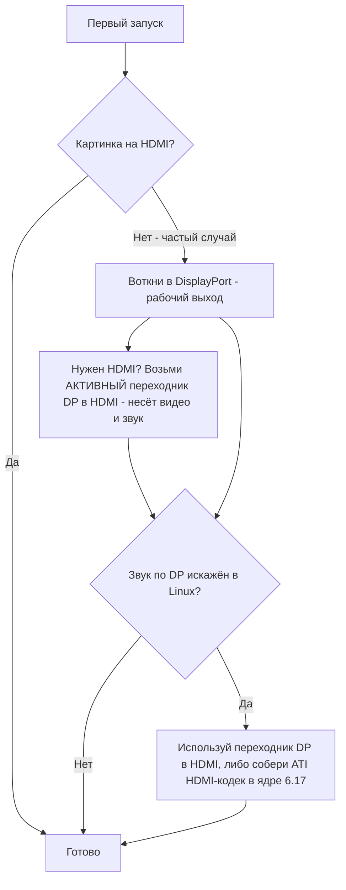

# Видео и вывод

> **Коротко** — BC-250 выводит картинку на монитор по **DisplayPort**. Втыкай именно его. Если на твоей плате есть и порт HDMI — он **часто не показывает ничего**, так что чёрный экран на нём *не значит*, что плата мёртвая, ты просто на не том выходе. Нужен HDMI? Используй **активный переходник DP→HDMI** — комьюнити проверило, и **видео и звук проходят нормально, без тормозов** ([src](https://t.me/c/2424231195/9148)). Один реальный косяк: **звук по DisplayPort в Linux выводится искажённым/замедленным**; тот же переходник DP→HDMI его обходит, а полноценный фикс на стороне ядра приходит примерно в **ядре 6.17** ([src](https://t.me/c/2424231195/17953), [src](https://t.me/c/2424231195/68051)).

«Нет картинки на первом запуске» — **паника новичка №1**. Прочти блок ниже, прежде чем решать, что что-то сломано.

---

## Нет картинки? Сделай так

1. **Втыкай в DisplayPort, не в HDMI.** Рабочий видеовыход BC-250 — это DisplayPort ([src](https://t.me/c/2424231195/104784)). Порт HDMI (если он есть) обычно как раз пустой — не суди по нему о плате.
2. **Переткни карту и попробуй снова.** Платы регулярно не инициализируются с первого раза — передёрни питание (полностью выкл/вкл) и физически переустанови. Из опыта владельца: *«когда моя приехала, она тоже включилась не с первого раза … сейчас нередко при перезагрузке с кнопки не инициализируется до конца — спасает выкл/вкл»* ([src](https://t.me/c/2424231195/15701)).
3. **Подозревай кабель/переходник раньше платы.** Когда карта одна, плохой кабель или переходник — главный подозреваемый ([src](https://t.me/c/2424231195/15699)). Некоторые переходники работают в прошивке, но гаснут, когда грузится ОС — *«до GRUB норм, в системе чёрный экран»* ([src](https://t.me/c/2424231195/38184)).
4. **Сбрось BIOS / перешей проверенный образ**, если несколько карт из партии не дают изображения — это указывает на прошивку, а не на монитор ([src](https://t.me/c/2424231195/15697), [src](https://t.me/c/2424231195/15705)).

Если все четыре пункта пройдены, а картинки всё нет — иди в [troubleshooting.md](troubleshooting.md).



---

## Выходы — кратко

| Выход | Работает? | Примечания |
|-------|-----------|------------|
| **DisplayPort** | **Да — это и есть выход** | Основной/единственный видеоразъём; несёт звук. В спецификации I/O репозитория указан `1x DisplayPort` ([repo](https://github.com/mothenjoyer69/bc250-documentation)). |
| **Порт HDMI** (если распаян) | **Часто пустой** | Новички думают, что плата мёртвая; обычно нет — переключись на DP. ([src](https://t.me/c/2424231195/104784)) |
| **DP → HDMI через активный переходник** | **Да — видео + звук** | Проверено комьюнити, без тормозов ([src](https://t.me/c/2424231195/9148)). Это же штатный фикс искажений звука по DP (ниже). |
| **Второй видеовыход** | **Из коробки нет** | Электрически есть, но **не распаян**; заставить второй монитор — через костыли, а другие говорят, что у чипа нет реального второго выхода — считай безопасным допущением один выход. ([src](https://t.me/c/2424231195/92978), [src](https://t.me/c/2424231195/104682)) |
| **Второй экран по сети** | **Да** | Стримь вывод BC-250 на другую машину по локалке (Steam/Sunshine). ([src](https://t.me/c/2424231195/23660)) |

---

## Звук по DisplayPort искажён — фикс через переходник

В Linux звук, отправленный **напрямую из DisplayPort**, выводится на BC-250 криво — описывают как искажённый, *«растянутый, будто замедлен в два раза»*, с потрескиванием ([src](https://t.me/c/2424231195/9895)). Это **проблема Linux/протокола DP, а не дефект платы** — её ловили и на не-BC-250 железе ([src](https://t.me/c/2424231195/15983)).

Тупой, но надёжный обход, к которому пришёл чат: **прогнать сигнал через переходник DP→HDMI.** После преобразования в HDMI артефактов звука нет ([src](https://t.me/c/2424231195/17953), [src](https://t.me/c/2424231195/51763)). Пользователь проверил напрямую: *«Я проверил вывод звука через переходник DisplayPort→HDMI. Всё в порядке, тормозов нет»* ([src](https://t.me/c/2424231195/9148)).

**Если переходника под рукой нет,** выводи звук по **Bluetooth** — большинство колонок/гарнитур его поддерживают, и это полностью обходит путь DP ([src](https://t.me/c/2424231195/89769)). BT-донгл — см. [10-wifi-bt.md](10-wifi-bt.md).

### Заметки по переходникам (комьюнити)
- **Бери *активный* переходник/кабель DP→HDMI.** Рабочий проверенный пример: **кабель UGREEN DP125 (DP→HDMI 4K)** — заявлен 4K@30, но на ТВ согласовался 4K@60 ([src](https://t.me/c/2424231195/52398)).
- **Не все переходники несут звук.** У одного владельца переходник Belsis отдавал 4K@60 *со* звуком, а несколько более дорогих Ugreen показывали «HDMI цифровое аудио» в списке устройств, но звука не выводили — один к тому же опустил голоса на октаву ([src](https://t.me/c/2424231195/106617)). Если есть видео, но нет звука — переменная именно переходник, пробуй другой.
- Дешёвые **DP→HDMI 4K@60**, передающие и видео, и звук, существуют и работают по отзывам ([src](https://t.me/c/2424231195/133977)).
- Некоторые переходники сходят с ума именно на **4K-мониторах** ([src](https://t.me/c/2424231195/1988)).

### Фикс в ядре 6.17 (звук прямо по DP, без переходника)

Если хочешь чистый звук **прямо по DisplayPort** без переходника — причину и фикс в чате нашли. Стоковый конфиг ядра Fedora собирал `snd-hda-codec-hdmi.ko` + `snd-hdmi-lpe-audio.ko`; **ядро 6.17 поменяло путь HDMI-аудио** и сломало звук на этом дефолтном конфиге. Фикс — собрать ещё и **ATI HDMI-кодек**: в конфиге ядра поменять `# CONFIG_SND_HDA_CODEC_HDMI_ATI is not set` на `CONFIG_SND_HDA_CODEC_HDMI_ATI=m`, что упаковывает `snd-hda-codec-atihdmi.ko`; звук тогда работает **без патчей** ([src](https://t.me/c/2424231195/68051), [src](https://t.me/c/2424231195/68061)).

```text
# Правка конфига ядра Fedora для звука DP/HDMI на ядре 6.17+
# из:
# CONFIG_SND_HDA_CODEC_HDMI_ATI is not set
# в:
CONFIG_SND_HDA_CODEC_HDMI_ATI=m
```

С этим третьим кодеком (`snd-hda-codec-atihdmi.ko`) ALSA показывает аудиовыходы платы (напр. `pcm=3` и `pcm=7` как два HDMI-устройства) ([src](https://t.me/c/2424231195/68062), [src](https://t.me/c/2424231195/67569)). ⚠ verify — это требует сборки кастомного ядра; для большинства считай переходник DP→HDMI вариантом «без сборки». Настройка ядра/драйверов — см. [06-linux.md](06-linux.md).

---

## Второй выход (изначально неактивный)

На плате есть **второй видеовыход, который из коробки неактивен.** Мнение комьюнити расходится, и стоит знать обе половины:

- Он **электрически есть, но не распаян**, и *«через костыли можно заставить второй монитор работать»* ([src](https://t.me/c/2424231195/92978)).
- Другие сообщают, что у чипа просто **нет рабочего второго выхода** — *«проблема в чипе и то, что второго выхода физически нет»* ([src](https://t.me/c/2424231195/104682)).

На практике: **исходи из одного выхода DisplayPort.** Про **MST-сплиттер DP на два независимых экрана спрашивали, но рабочим на BC-250 он не подтверждён** ([src](https://t.me/c/2424231195/92109)). ⚠ verify — на момент написания историй успеха с нативными двумя мониторами в комьюнити нет.

---

## Второй экран по сети (простой «второй дисплей»)

Если тебе реально нужна картинка BC-250 на втором устройстве — проверенный путь не второй кабель, а **стрим по локалке.** Из опыта пользователя: *«Запускал со Steam игру на BC-250 (Fedora) и стримил по сети на рабочий ноут, управлял с ноута. Всё работало»* ([src](https://t.me/c/2424231195/23660)).

- **Sunshine** (хост-энкодер) тут подходит, потому что он не только под NVIDIA — кодированием занимается он, клиент лишь декодирует ([src](https://t.me/c/2424231195/25091)). По гигабитной локалке — почти идеально ([src](https://t.me/c/2424231195/25563)).
- **Moonlight в роли хоста** *не* подходит — он ждёт энкодер NVIDIA и фризит/жалуется на отсутствие аппаратного декодера ([src](https://t.me/c/2424231195/25050)). Используй Sunshine как хост, Moonlight только как клиент.

Это также практичный способ получить ощущение «двух дисплеев» без неактивного второго выхода выше.

---

## Источники

- Переходник DP→HDMI несёт видео+звук, без тормозов — https://t.me/c/2424231195/9148
- Искажение звука по DP — проблема Linux; переходник чинит — https://t.me/c/2424231195/17953 · https://t.me/c/2424231195/9895 · https://t.me/c/2424231195/51763 · https://t.me/c/2424231195/15983
- Фикс звука в ядре 6.17 (`CONFIG_SND_HDA_CODEC_HDMI_ATI=m`) — https://t.me/c/2424231195/68051 · https://t.me/c/2424231195/68061 · https://t.me/c/2424231195/68062 · https://t.me/c/2424231195/67569
- Рабочие переходники — UGREEN DP125 https://t.me/c/2424231195/52398 · Belsis vs другие (звук зависит) https://t.me/c/2424231195/106617 · дешёвый 4K@60 https://t.me/c/2424231195/133977
- DP — рабочий выход; трать на хороший переходник DP→HDMI — https://t.me/c/2424231195/104784
- Нет картинки на первом запуске / переткнуть / перешить — https://t.me/c/2424231195/15697 · https://t.me/c/2424231195/15699 · https://t.me/c/2424231195/15701 · https://t.me/c/2424231195/38184
- Второй выход есть, но не распаян / спор — https://t.me/c/2424231195/92978 · https://t.me/c/2424231195/104682 · про MST https://t.me/c/2424231195/92109
- Второй экран по сети (Sunshine/Steam по локалке) — https://t.me/c/2424231195/23660 · https://t.me/c/2424231195/25091 · https://t.me/c/2424231195/25050 · https://t.me/c/2424231195/25563
- Bluetooth-звук как альтернатива — https://t.me/c/2424231195/89769
- Референс по I/O железа (`1x DisplayPort`) — [mothenjoyer69/bc250-documentation](https://github.com/mothenjoyer69/bc250-documentation) · [`hardware.md`](https://github.com/mothenjoyer69/bc250-documentation/blob/main/hardware.md)

> Настройка драйверов/ядра — в [06-linux.md](06-linux.md); косяки звука/вывода также проиндексированы в [troubleshooting.md](troubleshooting.md) и [faq.md](faq.md).
