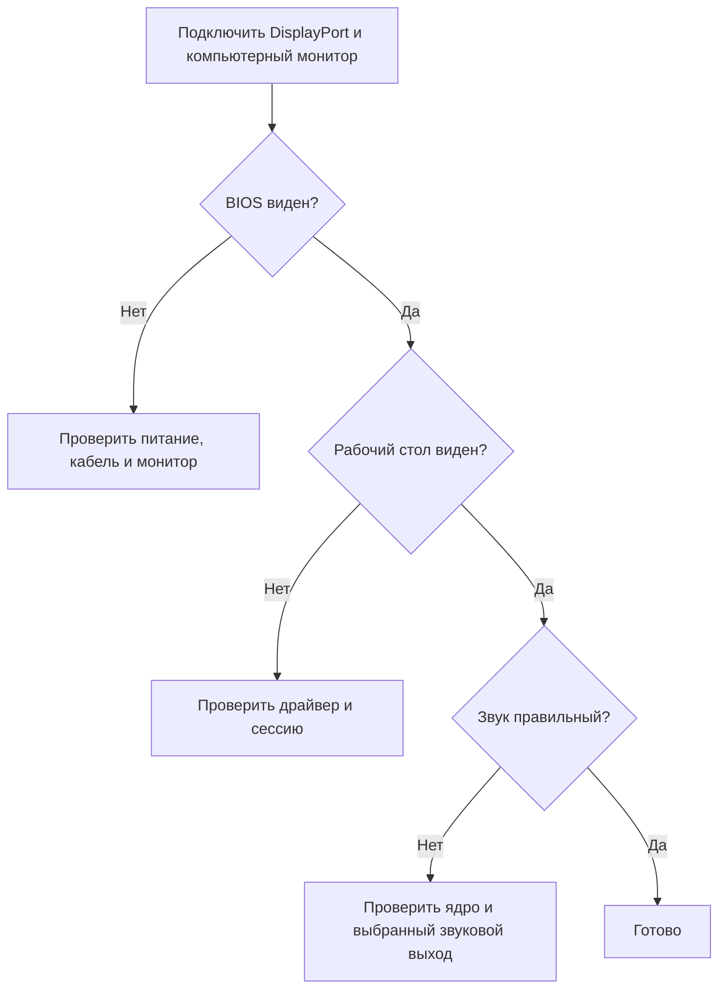

# Видео и вывод

> **Начни с нативного DisplayPort и компьютерного монитора.** Переходник DP→HDMI — отдельное устройство со своими ограничениями режимов. При молчащем, замедленном или отстающем DP-звуке сначала проверь ядро, а не покупай переходник или собирай модуль кодека.

## Нет картинки? Сделай так

1. Используй задокументированный выход **DisplayPort**. В штатной спецификации I/O указан один DP-разъём, не второй нативный HDMI.
2. С отключённым БП проверь питание, кабель монитора и крепление. Попробуй исправный DP-кабель и компьютерный монитор; не переподключай разъёмы под питанием.
3. **На ТВ/проекторе не виден BIOS:** экран может не принимать режим прошивки. Для первой настройки попробуй компьютерный монитор. Реакция светодиодов клавиатуры — подсказка, не полная проверка POST ([требования upstream](https://github.com/elektricM/amd-bc250-docs/blob/954b706f0f2a426385229507c1acba00cc812f66/docs/getting-started/prerequisites.md)).
4. **BIOS виден, рабочий стол — нет:** проверь renderer, журналы firmware и `nomodeset` по [06 — Linux](06-linux.md). Чёрный экран только после входа может быть проблемой сессии; попробуй другое поддерживаемое окружение до смены прошивки.
5. Картинки всё ещё нет? Открой [диагностику](troubleshooting.md). Тёмный экран не повод стирать SSD или прошивать BIOS без диагноза и пути восстановления ([08 — BIOS](08-bios.md)).


```mermaid
flowchart TD
    A[Подключить DisplayPort и компьютерный монитор] --> B{BIOS виден?}
    B -->|Нет| C[Проверить питание, кабель и монитор]
    B -->|Да| D{Рабочий стол виден?}
    D -->|Нет| E[Проверить драйвер и сессию]
    D -->|Да| F{Звук правильный?}
    F -->|Нет| G[Проверить ядро и выбранный звуковой выход]
    F -->|Да| H[Готово]
```

## Выходы — кратко

| Путь | Что ожидать |
|---|---|
| Нативный DisplayPort | Основной физический выход. Для звука нужны подходящее ядро и правильно выбранный sink. |
| DP→HDMI | Согласуй переходник, кабель и экран по разрешению/частоте/HDR. Форма разъёма не гарантирует ни видео, ни звук. |
| DP MST-хаб | Upstream сообщает о двух независимых экранах со StarTech MST14DP122DP; часть дешёвых хабов только зеркалит или не работает. Полоса общая. |
| USB DisplayLink | Отдельный путь сжатого изображения рабочего стола, не второй нативный выход GPU и не обещание игровой производительности. |
| Стрим Steam/Sunshine | Картинка по сети, не дополнительная физическая голова дисплея. Sunshine — хост, Moonlight — клиент. См. [17](17-projects-and-tools.md). |

[Спецификация I/O](https://github.com/mothenjoyer69/bc250-documentation) и [закреплённый гайд по дисплеям](https://github.com/elektricM/amd-bc250-docs/blob/954b706f0f2a426385229507c1acba00cc812f66/docs/hardware/display.md) отделяют выходы платы от возможностей переходника и отчётов отдельных сборок.

## Разрешения, частота и кабель

Подбери DP-кабель и проверь **всю цепочку**, не только наклейку «8K». Нативный DP и DP→HDMI имеют разные ограничения; высокие разрешения/частоты через HDMI обычно требуют активного преобразователя. Предел пассивного переходника зависит от модели, а не равен универсальным 1440p60.

| Цель | Что выбрать и проверить |
|---|---|
| 1080p/1440p | Нативный DP либо переходник с явной поддержкой нужного режима |
| 4K60 через HDMI | Подходящий активный DP→HDMI, HDMI-экран и кабель |
| 4K120 через HDMI | Согласованные DP 1.4→HDMI 2.1, кабель и экран; upstream сообщает о сборке с Club3D на 4K120, не о любом переходнике |
| HDR/VRR | Драйвер GPU, сессия рабочего стола, переходник и экран должны поддерживать нужный путь. Отчёт о другой Radeon не подтверждает BC250. |

Низкое разрешение вместе с `llvmpipe` указывает на программный рендеринг; исправь его по [06](06-linux.md) до настройки кабеля. Отзывы о HDR/VRR на CachyOS или Bazzite — датированные наблюдения, не универсальный вердикт об ОС. Экспериментальный [образ dyllan500](https://github.com/dyllan500/bazzite-amd-hdmi-kde) испытывался на Radeon 9070 XT, не установлен как исправление для BC250.

## Звук по DisplayPort — диагностика, обновление, затем обход

Старая рекомендация обвиняла прошивку платы или все активные переходники. [Upstream отозвал это объяснение в #39](https://github.com/elektricM/amd-bc250-docs/issues/39). В затронутом драйвере Linux две ошибки clock: большая даёт **замедление примерно на 17,7% или тишину**; после только её исправления меньшая может давать **около 7 секунд отставания в час**. Медленное браузерное видео при нормальных загрузках может иметь ту же причину через clock PipeWire.

### 1. Проверь ядро и звуковой выход

```bash
uname -r
wpctl status
```

Выбери нужный sink DP/HDMI и отдели тишину от замедления/изменения высоты звука. [Матрица ядер на закреплённой ревизии](https://github.com/elektricM/amd-bc250-docs/blob/954b706f0f2a426385229507c1acba00cc812f66/docs/troubleshooting/audio.md):

| Ветка ядра | Исправления upstream |
|---|---|
| 7.2+, либо 7.1.10+ внутри 7.1 | Обе ошибки clock |
| 6.12.78+, 6.18.20+, 6.19.10+ внутри этих веток и 7.0 | Большая ошибка исправлена; малое отставание может остаться |
| Более старые затронутые версии | Большая ошибка или тишина могут оставаться |

Вендорские backport могут отличаться. Обновляй систему штатным способом, сохрани рабочий deployment/ядро, перезагрузись и проверь `uname -r`; название образа не является версией ядра. Обновление и откат Bazzite — в [06](06-linux.md).

### 2. Если обновиться нельзя

- **USB-звук** обходит затронутый DP-clock.
- **Совместимый пассивный DP++ переходник** использует другой путь clock; выбирай его, только если подходят ограничения видеорежимов.
- **Активный переходник не является по определению сломанным для звука:** старая ошибка ядра затрагивала и нативный DP, и активные устройства.
- [Weijtmans/bc250-tools](https://github.com/Weijtmans/bc250-tools) содержит исторический DTO-watcher для старых ядер. Он пишет аппаратные регистры и может устанавливать root-сервис: используй его инструкции status/revert и рабочий откат, не копируй запись регистра или wildcard. Этот справочник не устанавливает его за тебя.

Цельный кабель DP→HDMI тоже может содержать преобразователь. Отсутствие отдельного донгла не делает его «без чипа». Старые отзывы об UGREEN/Belsis/Silver Monkey/BENFEI/AmazonBasics описывают конкретные кабели/переходники/ядра, не универсальное правило покупки.

### 3. Отдели историческую проблему модуля кодека

В части отчётов о Fedora 6.17 отсутствовал `CONFIG_SND_HDA_CODEC_HDMI_ATI=m` / `snd-hda-codec-atihdmi.ko`. Это отдельная проблема упаковки, не исправление display-clock. Проверь модули текущего ядра и звуковые устройства до предложения собирать своё ядро. Переходник DP→HDMI не является универсальным исправлением отсутствующих драйверов.

Исторические сообщения: [68051](https://t.me/c/2424231195/68051), [68061](https://t.me/c/2424231195/68061), [68062](https://t.me/c/2424231195/68062), [67569](https://t.me/c/2424231195/67569).

### Объёмный звук

Не выводи поддержку 5.1 из наличия HDMI. Проверь заявленные каналы и всю цепочку ресивера. Старые [отчёты сообщества](https://www.reddit.com/r/linux_gaming/comments/1nvsgji/) описывали стерео-конфигурации, не невозможность для всех будущих драйверов/переходников. Подходящая многоканальная USB-звуковуха — альтернатива; проверь реальное распределение каналов.

## Нет пробуждения после простоя

Если после простоя пропадают экран и сеть, проверь предыдущую загрузку, не объявляй виновным кабель:

```bash
journalctl -b -1 -n 30
cat /sys/power/mem_sleep
```

[Закреплённый отчёт](https://github.com/elektricM/amd-bc250-docs/blob/954b706f0f2a426385229507c1acba00cc812f66/docs/troubleshooting/display.md) описывает ненадёжное пробуждение из `s2idle`. Журнал, заканчивающийся `PM: suspend entry (s2idle)` без resume, поддерживает этот диагноз. Настройки простоя рабочего стола могут не охватывать Steam Game Mode.

На подтверждённо затронутой машине отключи автоматический suspend в настройках рабочего стола; ниже системный обход. Он отключает sleep-targets, **не просто гасит экран**, поэтому сначала запиши существующие masks:

```bash
sudo systemctl mask sleep.target suspend.target hibernate.target hybrid-sleep.target
# Отмени только masks, добавленные этой процедурой:
sudo systemctl unmask sleep.target suspend.target hibernate.target hybrid-sleep.target
```

Не подменяй Sleep на Shutdown как необъяснённую настройку по умолчанию: это меняет поведение и может потерять несохранённую работу.

## HDMI-CEC (необязательно)

Upstream сообщает об управлении ТВ через активный UGREEN с RTD2173. **`/dev/cec0` не доказывает, что переходник соединяет CEC-пин телевизора.** При включённом CEC на ТВ скан должен найти устройство помимо этого компьютера:

```bash
cec-ctl -d /dev/cec0 -S
```

Это отправляет пробы по шине CEC, не просто проверяет наличие файла. `cec-ctl` входит в `v4l-utils`. При отказе доступа проверь права узла/группы; в rpm-ostree группа `video`, доступная только через NSS, требует отдельной обработки, не повторного `usermod` вслепую. См. [закреплённый раздел CEC](https://github.com/elektricM/amd-bc250-docs/blob/954b706f0f2a426385229507c1acba00cc812f66/docs/hardware/display.md) и identity/check helpers в [bc250-tools](https://github.com/Weijtmans/bc250-tools). Имя, заданное вручную, может перезаписываться `cec-onboot`; описанный helper запускает настройку после него. CEC сам по себе не гарантирует Game Mode/ALLM телевизора.

## Второй экран и стриминг

Для локальных независимых экранов начни с описанного MST-хаба и проверь нужный режим на обоих мониторах. Для удалённой картинки используй Steam Remote Play либо Sunshine как **хост**, Moonlight как **клиент** ([17](17-projects-and-tools.md)). CPU-кодирование, compute-кодирование и native VCN — разные пути; не предполагается ни обязательный NVIDIA-хост, ни невозможность любого кодирования на GPU.

## Источники и история

Текущие процедуры опираются на закреплённые страницы выше. Ранние наблюдения сообщества сохраняются как свидетельства тех сборок, не текущие универсальные инструкции:

- Кабели/переходники и звук: [9148](https://t.me/c/2424231195/9148), [17953](https://t.me/c/2424231195/17953), [9895](https://t.me/c/2424231195/9895), [51763](https://t.me/c/2424231195/51763), [15983](https://t.me/c/2424231195/15983), [52398](https://t.me/c/2424231195/52398), [106617](https://t.me/c/2424231195/106617), [133977](https://t.me/c/2424231195/133977), [1988](https://t.me/c/2424231195/1988), [89769](https://t.me/c/2424231195/89769).
- Запуск/вывод: [104784](https://t.me/c/2424231195/104784), [15697](https://t.me/c/2424231195/15697), [15699](https://t.me/c/2424231195/15699), [15701](https://t.me/c/2424231195/15701), [38184](https://t.me/c/2424231195/38184), [15705](https://t.me/c/2424231195/15705).
- Обсуждение второго выхода: [92978](https://t.me/c/2424231195/92978), [104682](https://t.me/c/2424231195/104682), [92109](https://t.me/c/2424231195/92109).
- Стриминг по сети: [23660](https://t.me/c/2424231195/23660), [25091](https://t.me/c/2424231195/25091), [25050](https://t.me/c/2424231195/25050), [25563](https://t.me/c/2424231195/25563).

Установка GPU: [06](06-linux.md). Диагностика: [Решение проблем](troubleshooting.md) и [FAQ](faq.md). Локальных измерений дисплея, CEC и звука на BC250 для этой редакции не проводили.
