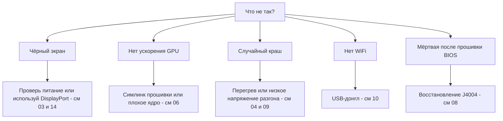

# Решение проблем

> **Коротко** — Сбои BC-250 известны: почти всё — это **питание**, **тепло**, **ядро/прошивка** или **неудачный флеш**. Найди свой симптом ниже, примени фикс, иди по ссылке в полную главу. Если сомневаешься — причина обычно *плохое ядро*, *забыт симлинк прошивки amdgpu* или *не хватает охлаждения*.

Страница = индекс симптом → причина → фикс, выжатый из повторяющихся проблем комьюнити. Не заменяет главы — быстро ведёт в нужную.

---

## Загрузка / экран

| Симптом | Вероятная причина | Фикс |
|---------|--------------|-----|
| Чёрный экран / нет POST | Разводка питания или пинаут неверны | Перепроверь разводку 8-pin и пинаут; настоящий медный провод нужного сечения → [03 — Питание](03-power-supply.md) |
| Чёрный экран / краши после того, как работало | **IOMMU всё ещё включён** (сломан на этой плате) | Отключи IOMMU в BIOS (elektricM); параметр ядра `iommu=off`/`amd_iommu=off` — ⚠ verify → [06 — Linux](06-linux.md) |
| Чёрный экран при загрузке **установщика** / live USB | У установщика нет драйвера GPU BC-250; KMS падает | Добавь `nomodeset` в GRUB (Fedora: Troubleshooting → Basic Graphics Mode); **убери после установки Mesa** ([elektricM](https://github.com/elektricM/amd-bc250-docs/blob/main/docs/troubleshooting/boot.md)) → [06 — Linux](06-linux.md) |
| Чёрный экран **после входа** (GRUB и экран входа были норм) | Сессия рабочего стола, обычно **Wayland** | Выбери X11 («GNOME on Xorg»/«Plasma X11») на входе или `WaylandEnable=false` ([elektricM](https://github.com/elektricM/amd-bc250-docs/blob/main/docs/troubleshooting/display.md)) → [14 — Видео](14-display.md) |
| Грузится, но нет ускорения GPU (всё на CPU) | Нет симлинка прошивки amdgpu или плохое ядро | Примени симлинк `navi10_gpu_info.bin` + kernel-параметры; избегай плохих ядер (ниже) → [06 — Linux](06-linux.md) |
| `glxinfo` показывает **llvmpipe**, игры 5–10 FPS | Mesa слишком старая или amdgpu не загружен | Поставь **Mesa 25.1.3+**, убери `nomodeset`, проверь `Kernel driver in use: amdgpu` ([elektricM](https://github.com/elektricM/amd-bc250-docs/blob/main/docs/troubleshooting/performance.md)) → [06 — Linux](06-linux.md) |
| Работало, сломалось после обновления ядра | Регрессия в этом ядре | Откатись на LTS-ядро; **6.14.7**, **6.15.0–6.15.6** и **6.17.8–6.17.10** ломают amdgpu (CPU-фолбэк / краши GPU); elektricM советует **6.18.x LTS или 6.17.11+** ⚠ verify точные диапазоны → [06 — Linux](06-linux.md) |
| Нет звука по HDMI | Регрессия ядра 6.17+ | Используй LTS-ядро или выводи звук по USB/DisplayPort → [06 — Linux](06-linux.md) |
| Работает только один видеовыход | Ограничение драйвера на этой плате | Известное ограничение для нативных двух; **MST-хаб даёт до 2 экранов** (хаб DP 1.4) ([elektricM](https://github.com/elektricM/amd-bc250-docs/blob/main/docs/hardware/display.md)) → [14 — Видео](14-display.md) |
| Нет картинки, нет POST, **только с установленным NVMe** | На SSD остались разделы **Windows** EFI/recovery | Вынь SSD, сотри все разделы на другом ПК (`wipefs -a`), верни ([elektricM](https://github.com/elektricM/amd-bc250-docs/blob/main/docs/troubleshooting/boot.md)) → [06 — Linux](06-linux.md) |
| Вообще не стартует (нет BIOS) | Часть плат не делают POST **без батарейки CMOS** | Поставь свежую CR2032 и попробуй снова ([elektricM](https://github.com/elektricM/amd-bc250-docs/blob/main/docs/troubleshooting/boot.md)) → [08 — BIOS](08-bios.md) |
| Загрузка **висит ~90 с**, потом идёт | Упавший systemd-сервис / таймаут сети | `systemctl --failed`; отключи зависший юнит ([elektricM](https://github.com/elektricM/amd-bc250-docs/blob/main/docs/troubleshooting/boot.md)) → [06 — Linux](06-linux.md) |
| Kernel panic «**unable to mount root**» / «No init found» | Не то ядро **или** битый initramfs | Загрузи старое/LTS-ядро; если не помогло — chroot и пересобери initramfs (`dracut -f` / `update-initramfs -u -k all` / `mkinitcpio -P`) ([elektricM](https://github.com/elektricM/amd-bc250-docs/blob/main/docs/troubleshooting/boot.md)) → [06 — Linux](06-linux.md) |
| Падает в `grub>` / `grub rescue>` | GRUB не находит свой конфиг/файлы загрузки | Задай `root`/`prefix`, `insmod normal`, загрузись; потом переустанови GRUB ([elektricM](https://github.com/elektricM/amd-bc250-docs/blob/main/docs/troubleshooting/boot.md)) → [06 — Linux](06-linux.md) |
| Не зайти в BIOS (Del/F2 игнорятся) | Переходник медленно инициализируется или клавиатура в USB 3.0 | Жми Del сразу; попробуй порт **USB 2.0** и нативный DP-кабель ([elektricM](https://github.com/elektricM/amd-bc250-docs/blob/main/docs/troubleshooting/display.md)) → [08 — BIOS](08-bios.md) |

## Тепло / стабильность

| Симптом | Вероятная причина | Фикс |
|---------|--------------|-----|
| Троттлит / FPS падает под нагрузкой | Сток не охлаждает на столе | Проредь рёбра + 120 мм вентилятор/шрауд высокого давления; держи <80 °C → [04 — Охлаждение](04-cooling.md) |
| Случайный краш / ребут под нагрузкой | Перегрев (>90 °C) **или** слишком низкое напряжение в разгоне | Сначала охлаждение; потом подними напряжение андервольта — Furmark-стабильно ≠ игро-стабильно → [04](04-cooling.md) · [09](09-overclock-undervolt.md) |
| Стабильно в Furmark, краш в играх | Напряжение выставлено по Furmark, он недогружает | Тестируй OCCT + реальными играми; +~50 мВ → [09 — Разгон](09-overclock-undervolt.md) |
| Два губернатора конфликтуют | Запущены oberon-governor *и* smu_oc/cyan-skillfish вместе | Только один губернатор; остальные отключи → [09 — Разгон](09-overclock-undervolt.md) |
| Падает **вся система** при краше GPU (не только приложение) | APU: CPU+GPU на одном кристалле, сброс GPU невозможен — кладёт систему | Норма для этой архитектуры; предотвращай краши GPU (стабильное напряжение + охлаждение + хорошее ядро), а не жди восстановления ([elektricM](https://github.com/elektricM/amd-bc250-docs/blob/main/docs/troubleshooting/stability.md)) → [09 — Разгон](09-overclock-undervolt.md) |
| Краш GPU → **чёрный экран, не восстанавливается** при работающем губернаторе | Губернатор продолжает писать в sysfs во время сброса → застрявший цикл сброса | Перед склонными к крашам играми `systemctl stop cyan-skillfish-governor-smu`; включи обратно после ([elektricM](https://github.com/elektricM/amd-bc250-docs/blob/main/docs/troubleshooting/stability.md)) → [09 — Разгон](09-overclock-undervolt.md) |
| Фриз / белый экран уже при **60–65 °C** | Часть плат необычно чувствительны к температуре | Улучши охлаждение, переустанови радиатор, перенамажь термопасту (PTM7950); кремний разный ([elektricM](https://github.com/elektricM/amd-bc250-docs/blob/main/docs/troubleshooting/stability.md)) → [04 — Охлаждение](04-cooling.md) |
| GPU **застрял на 1500 МГц**, не андервольтится ниже | Мин. напряжение выставлено **ниже 700 мВ** — это жёсткий пол, он перезапирает GPU | Держи мин. напряжение **≥ 700 мВ** ([elektricM](https://github.com/elektricM/amd-bc250-docs/blob/main/docs/troubleshooting/stability.md)) → [09 — Разгон](09-overclock-undervolt.md) |
| Артефакты / краши, которые не лечит прибавка напряжения | **Просадка напряжения** под нагрузкой (эффективное V ниже заданного) | Подними базовое ~на 25 мВ под просадку или используй BIOS с правкой loadline/droop ([elektricM](https://github.com/elektricM/amd-bc250-docs/blob/main/docs/troubleshooting/stability.md)) → [09 — Разгон](09-overclock-undervolt.md) |
| Грузится, потом краш с **ошибками ACPI** (чёрный/зелёный экран) | Косяк/повреждение BIOS/ACPI | Сбрось CMOS / дефолты BIOS; попробуй `acpi=off noapic`; перешей, если повторяется ([elektricM](https://github.com/elektricM/amd-bc250-docs/blob/main/docs/troubleshooting/stability.md)) → [08 — BIOS](08-bios.md) |
| Сон/suspend = **псевдо-фриз** (чёрный, как зависший) | У платы нет нормальных состояний сна GPU; SMU не поддерживает suspend в Linux | Жми кнопку питания для пробуждения (не удерживай); лучше **отключи suspend** и используй гашение экрана. Idle всё равно ~65–85 Вт ([elektricM](https://github.com/elektricM/amd-bc250-docs/blob/main/docs/troubleshooting/stability.md)) → [09 — Разгон](09-overclock-undervolt.md) |

## Производительность

| Симптом | Вероятная причина | Фикс |
|---------|--------------|-----|
| FPS ниже ожидаемого, GPU не загружен | **CPU-bound** (Zen 2 — предел во многих играх) | Норма; снизь CPU-тяжёлые настройки, прими это — разгон GPU тут не поможет → [11 — Игры](11-gaming.md) |
| Активно только 24 CU, ждал 40 | Сток показывает меньше CU | Примени разблок 40 CU (`amdgpu.bc250_cc_write_mode=3` + скрипт) → [09 — Разгон](09-overclock-undervolt.md) |
| Steam / FSR / vsync сломаны | «Геймерский» форк дистрибутива мешает | Часть тюнинг-форков ломает это; чистая Fedora/Bazzite-bc250 безопаснее → [06 — Linux](06-linux.md) |
| GPU **залочен на 1500 МГц** независимо от нагрузки | Нет юзерспейс-губернатора (по умолчанию залочено BIOS) | Поставь губернатор GPU (cyan-skillfish-governor-smu) для скейлинга частоты ([elektricM](https://github.com/elektricM/amd-bc250-docs/blob/main/docs/troubleshooting/performance.md)) → [09 — Разгон](09-overclock-undervolt.md) |
| Губернатор работает, но GPU **не выше 2000 МГц** | В ядре нет патча диапазона частот (дефолтный потолок 1000–2000) | Патченое ядро (Bazzite/CachyOS уже с патчем) или применить `amdgpu-frequency-range.patch` ([elektricM](https://github.com/elektricM/amd-bc250-docs/blob/main/docs/troubleshooting/performance.md)) → [09 — Разгон](09-overclock-undervolt.md) |
| MangoHud показывает **655 %** загрузки GPU | amdgpu оставляет метрику активности `0xFFFF`; MangoHud читает 65535/100 | Запусти cyan-skillfish-governor-smu (ветка smu) — он патчит `gpu_metrics`; настройка MangoHud не нужна ([elektricM](https://github.com/elektricM/amd-bc250-docs/blob/main/docs/troubleshooting/performance.md)) → [09 — Разгон](09-overclock-undervolt.md) |
| На **headless** «GPU ничего не делает» в нагрузочном тесте | `glmark2 --off-screen` без дисплея тихо откатывается на **llvmpipe** (CPU) | Тестируй `clpeak` / `vkmark` / `llama-bench -ngl 99`; убедись, что SCLK и мощность растут ([elektricM](https://github.com/elektricM/amd-bc250-docs/blob/main/docs/troubleshooting/performance.md)) → [06 — Linux](06-linux.md) |
| 60+ FPS, но **дёргается** / неровные кадры | Кадровый пейсинг (компоситор X11 или пейсинг, привязанный к звуку) | Запусти через **gamescope** (`-W 1920 -H 1080 -f`) или отключи компоситор / попробуй Wayland ([elektricM](https://github.com/elektricM/amd-bc250-docs/blob/main/docs/troubleshooting/performance.md)) → [11 — Игры](11-gaming.md) |
| Игра **крашится OOM / артефакты, потом вылет** (RDR2, CoH3) | Конфликт **512 МБ динамической VRAM + ZRAM** | Переключи BIOS на **фиксированную VRAM** (напр. 10 ГБ RAM / 6 ГБ VRAM) или отключи ZRAM ([elektricM](https://github.com/elektricM/amd-bc250-docs/blob/main/docs/troubleshooting/stability.md)) → [08 — BIOS](08-bios.md) |
| Конкретная игра (напр. **RDR2**) рендерит на CPU/llvmpipe | Игра по умолчанию берёт не тот графический адаптер | Выбери адаптер AMD GPU в игре; RDR2: запуск с `-useMaximumSettings` ([elektricM](https://github.com/elektricM/amd-bc250-docs/blob/main/docs/troubleshooting/performance.md)) → [11 — Игры](11-gaming.md) |

## Сеть

| Симптом | Вероятная причина | Фикс |
|---------|--------------|-----|
| Вообще нет WiFi | Встроенного WiFi нет; донглу нужен драйвер | Проверенный донгл (aic8800d80) + сборка драйвера → [10 — WiFi/BT](10-wifi-bt.md) |
| WiFi отваливается каждые пару минут | Чип Realtek + питание USB под нагрузкой | Известно с некоторыми RTL882x; перейди на aic8800d80 или подтверждённую модель → [10 — WiFi/BT](10-wifi-bt.md) |
| Драйвер пропал после ребута | Собран raw `make`, не пакетом | Используй RPM/DKMS-путь репы, чтобы пережить обновления ядра → [10 — WiFi/BT](10-wifi-bt.md) |

## Windows

| Симптом | Вероятная причина | Фикс |
|---------|--------------|-----|
| GPU = Code 43 / нет ускорения | Нет рабочего Windows-драйвера GPU (на начало 2026) | Ожидаемо. Используй Linux. Windows-дрова — экспериментальный WIP → [07 — Windows](07-windows.md) |

## BIOS / кирпич

> ⚠ **Прочитай [08 — BIOS](08-bios.md) целиком до любой прошивки.** Плохой флеш кирпичит плату, а сброс CMOS **не** восстанавливает мод 1.0/3.00.

| Симптом | Вероятная причина | Фикс |
|---------|--------------|-----|
| Мёртвая/чёрная после прошивки | Плохой образ или неверные настройки | Внешнее восстановление: подключи CH341A к **хедеру J4004** (клипса SOIC-8 на этой плате **не** работает) и перешей рабочий образ → [08 — BIOS](08-bios.md) |
| Программатор не читает чип | 5 В на линиях данных / не тот чип | Используй 3.3 В; шей 16 МБ `BIOS_A1`, никогда не 512 КБ SuperIO → [08 — BIOS](08-bios.md) |
| Настройки не сохраняются | Старая версия мода | Используй мод 5.00, где тайминги RAM/GDDR6 реально применяются → [08 — BIOS](08-bios.md) |
| Не грузится после смены **таймингов/частоты RAM** | Нестабильные настройки памяти **повредили BIOS** (watchdog P3.00; об этом сообщал русский чат BC-250) | Сброс CMOS может не помочь — **аппаратная перешивка** (CH341A / Pi Pico) рабочего образа. Сделай бэкап рабочего BIOS *до* тюнинга RAM; меняй по одному таймингу (больше всего даёт tREF) ([elektricM](https://github.com/elektricM/amd-bc250-docs/blob/main/docs/troubleshooting/stability.md)) → [08 — BIOS](08-bios.md) |
| Настройки BIOS не сохраняются → чёрный экран / мало RAM | CMOS не сброшен после прошивки по USB (может нужно 2–3 сброса) | Сбрось CMOS, перенастрой, перезайди **в BIOS** и проверь, что 512 МБ всё ещё стоит; убедись, что `free -h` показывает ~15.5 ГБ ([elektricM](https://github.com/elektricM/amd-bc250-docs/blob/main/docs/troubleshooting/stability.md)) → [08 — BIOS](08-bios.md) |

---

## Всё ещё застрял?
- Смотри **[FAQ](faq.md)**.
- Ищи в чате комьюнити по теме (Источники каждой главы ведут в реальные обсуждения).
- Прося помощь, укажи **дистрибутив + версию ядра**, **частоты/губернатор** и **охлаждение** — эти три объясняют большинство проблем.

### Источники для строк выше
- Гайды по решению проблем elektricM — [`boot.md`](https://github.com/elektricM/amd-bc250-docs/blob/main/docs/troubleshooting/boot.md) · [`display.md`](https://github.com/elektricM/amd-bc250-docs/blob/main/docs/troubleshooting/display.md) · [`performance.md`](https://github.com/elektricM/amd-bc250-docs/blob/main/docs/troubleshooting/performance.md) · [`stability.md`](https://github.com/elektricM/amd-bc250-docs/blob/main/docs/troubleshooting/stability.md) · [`hardware/display.md`](https://github.com/elektricM/amd-bc250-docs/blob/main/docs/hardware/display.md)
- Поцитатные ссылки на чат комьюнити — в **Источниках** каждой связанной главы.
