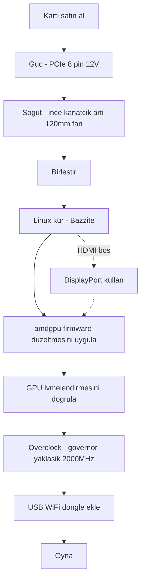

> 🌐 Topluluk çevirisi. İngilizce sürüm asıl kaynaktır ve daha güncel olabilir. Hata mı buldunuz? Bir [issue açın](https://github.com/lildebil0/awesome-bc250/issues). ([İngilizce orijinali](../en/00-start-here.md))

# Buradan Başlayın — Sıfırdan Oyuna

> **Özet** — Bir AMD BC-250 satın aldınız (veya almak üzeresiniz). 16 GB GDDR6'lı, PlayStation 5 türevi bir APU kartı olup ucuz bir Linux oyun/yapay zeka makinesi yapar — **eğer** üç şeyi sırasıyla çözerseniz: **güç**, **soğutma** ve **Linux sürücüleri**. Bu sayfa, kutudaki bir karttan çalışan bir oyuna giden düz çizgidir. Adımları takip edin; her biri tam bir bölüme bağlanır.

Bu kart tak-çalıştır bir PC değil, bir projedir. Bir hafta sonu ayırın. İnsanların bir kartı erkenden öldürmesinin iki yolu **yanlış güç kablolaması** ve **sıcak çalıştırmaktır** — bu yüzden önce bunları hallediyoruz.

---

## Başlamadan önce — parçalar ve aletler

Build'in ortasında her birini keşfetmemek için bunları başlamadan *önce* hazır bulundurun:

- PCIe 8 pinli 12 V çıkışlı bir **güç kaynağı (PSU)** → **[03 — Güç Kaynağı](../en/03-power-supply.md)**
- **120 mm yüksek statik basınçlı fan** + yazdırılmış kanal → **[04 — Soğutma](../en/04-cooling.md)** / **[05 — Kasalar ve 3D Baskı](../en/05-case.md)**
- **Yazdırılmış bir kasa veya montaj** → **[05 — Kasalar ve 3D Baskı](../en/05-case.md)**
- Linux yükleyici için **≥ 16 GB USB bellek**
- Bir **DisplayPort kablosu** (veya DP→HDMI adaptörü — kartın HDMI'si genellikle hiçbir şey göstermez, DisplayPort en güvenlisidir)
- Bir **tornavida**
- Bir **multimetre** — PSU kablolamasını mıknatıs/süreklilik testi yapmak için → **[03 — Güç Kaynağı](../en/03-power-supply.md)**

---

## Yol



### 0. Elinizdekini bilin
Bir BC-250 sunucu/madencilik blade'idir: bir APU (Zen 2 CPU + RDNA2 sınıfı GPU, "Cyan Skillfish/Oberon"), 16 GB GDDR6, **pasif soğutucu blok**, tek bir **12 V PCIe 8 pin** ile beslenir. Yerleşik WiFi yok, çalışan Windows GPU sürücüsü yok, donanımsal video kodlama yok. → **[01 — BC-250 Nedir](../en/01-what-is-bc250.md)**

### 1. Doğru şeyi satın alın
Adil bir fiyatın ne olduğunu, kutuda ne olduğunu (sadece kart mı? soğutucu blok mu? PSU mu?) ve hangi satıcılardan/dolandırıcılıklardan kaçınılacağını bilin. → **[02 — Satın Alma Rehberi](../en/02-buying.md)**

### 2. *İlk açılıştan önce* gücü halledin
Kart, PCIe 8 pin üzerinden 12 V'ta ~235 W ister (overclock yapılırsa daha fazla). Gerçek bir PSU kullanın, 8 pini **yeterli kalınlıkta gerçek bakır kabloyla** doğru şekilde bağlayın ve pinout'u tahmin etmeyin — buradaki bir hata kartın ölümü demektir. → **[03 — Güç Kaynağı](../en/03-power-supply.md)**

### 3. *Zorlamadan önce* soğutmayı düzeltin
Stok soğutucu blok bir rack rüzgar tüneli için yapılmıştır ve **masada throttle yapar**. Kanatçıkları inceltin ve yazdırılmış bir kanal aracılığıyla yüksek statik basınçlı bir 120 mm fanı cıvatalayın (ya da AIO'ya geçin). Hedef: Furmark'ta ~80 °C'nin altında kalmak. → **[04 — Soğutma](../en/04-cooling.md)**

### 4. Bir kasaya koyun (isteğe bağlı ama güzel)
Kartı, fanı ve PSU'yu gerçek hava akışıyla monte eden konsol tarzı bir kasa yazdırın. Topluluk STL'lerinin kataloğu. → **[05 — Kasalar ve 3D Baskı](../en/05-case.md)**

### 5. Birleştirin
Minimal bir build için fiziksel işlem sırası: fanı yazdırılmış kanala monte edin → kanalı (inceltilmiş) soğutucu blok kanatçıklarının üzerine klipsleyin/vidalayın → kartı kasaya/montaja yerleştirin → PSU'nun 8 pinini karta bağlayın (doğru pinout, **[03 — Güç Kaynağı](../en/03-power-supply.md)**) → monitöre bir DisplayPort kablosu bağlayın → çalıştırın ve **POST** yaptığını doğrulayın (POST = açılış öz testi; açılır ve video çıkışı verir — bir görüntü alırsınız / fan döner). Herhangi bir kanatçık zımparalamasını montajdan *önce* yapın (bkz. **[04 — Soğutma](../en/04-cooling.md)**) ve metal tozunu karttan uzak tutun.

> Bu montajın etiketli bir fotoğrafı/diyagramı memnuniyetle karşılanan bir katkı olur — depoda henüz yok.

### 6. Linux + GPU sürücülerini kurun
Bu, her şeyi belirleyen adımdır. Yeni başlayanlar için en kolayı: BC-250 için yapılmış bir **Bazzite tabanlı imaj** (veya **Fedora 43** — elektricM'in diğer "sadece çalışır" seçimi; Fedora 42 artık desteklenmiyor). Ardından **amdgpu firmware düzeltmesini** (`navi10_gpu_info.bin` sembolik bağlantısı) ve çekirdek parametrelerini uygulayın, initramfs/grub'u yeniden oluşturun ve GPU'nun ivmelendirildiğini doğrulayın (`vainfo`, `dmesg`). → **[06 — Linux Sürücüleri ve Kurulum](../en/06-linux.md)**

> **Atlarsanız saatlerce acı çektiren iki ayar** (elektricM): modlanmış BIOS'ta **VRAM = 512 MB dinamik** ayarlayın ve **IOMMU'yu devre dışı bırakın** (bozuk bir IOMMU ekran hatalarına ve çökmelere neden olur), ardından flash'tan sonra **CMOS'u temizleyin**. `nomodeset` önyükleme parametresiyle kurun ve **sürücüler yüklendikten sonra kaldırın**. Mesa **25.1+** taban seviyesidir (25.3.x önerilir). Ve **6.15.0–6.15.6 ile 6.17.8–6.17.10 çekirdeklerinden kaçının** — bunlar GPU sürücüsünü bozar; bunun yerine bir 6.18 LTS / 6.17.11+ / 6.12–6.14 LTS kullanın. ([elektricM hızlı başlangıç](https://elektricm.github.io/amd-bc250-docs/getting-started/quick-start/), [hızlı referans](https://elektricm.github.io/amd-bc250-docs/reference/quick-reference/))

> Windows mu düşünüyorsunuz? 2026 başı itibarıyla **çalışan bir Windows GPU sürücüsü yok** — deneyseldir. Linux kullanın. → **[07 — Windows](../en/07-windows.md)**

### 7. Stokta çalıştığını doğrulayın, sonra overclock yapın
Masaüstü ivmelendirildikten sonra **oberon-governor**'ı kurun ve saat hızlarını yükseltin (1500 MHz stok zayıftır; **2000 MHz ≈ +%30 FPS**). İsteğe bağlı olarak **40 CU'nun** tamamını açın ve undervolt yapın. Yeni saat hızlarında sıcaklıkları tekrar test edin. → **[09 — Overclock ve Undervolt](../en/09-overclock-undervolt.md)**

### 8. İnternete bağlanın
Yerleşik WiFi yok — bilinen ve iyi çalışan bir **USB dongle** (aic8800d80 topluluğun favorisidir) ve sürücüsünü ekleyin. → **[10 — WiFi ve Bluetooth](../en/10-wifi-bt.md)**

### 9. Oyna
Gerçekçi beklentiler belirleyin (sınır genellikle GPU değil, Zen 2 CPU'dur), FSR'yi açın ve topluluğun oyun başına ayarlarını kullanın. → **[11 — Oyun Sonuçları ve Ayarları](../en/11-gaming.md)**

### Bonus — yerel LLM'ler çalıştırın
16 GB VRAM, bu fiyata çok şeydir. llama.cpp'yi **Vulkan** arka ucunda çalıştırın (ROCm bu GPU'da çıkmaz sokaktır). → **[12 — Yapay Zeka / LLM](../en/12-ai-llm.md)**

### Bonus — emülasyon
Switch, PS3, PS4, retro, arcade — gerçekte ne çalışır ve nasıl → **[15 — Emülasyon](../en/15-emulation.md)**

> İlk açılışta görüntü yok mu? Kart **DisplayPort** üzerinden çıkış verir (HDMI genellikle boştur) → **[14 — Ekran ve Çıkış](../en/14-display.md)**. USB portlarınız tükendi mi veya bir sürücü mü ekliyorsunuz? → **[16 — USB, Hub'lar ve Depolama](../en/16-usb-peripherals.md)**

---

## Bir şey bozulursa
Siyah ekran, ivmelendirme yok, rastgele resetler, dongle kopmaları, bir BIOS flash'ından sonra tuğlaya dönmek — bkz. **[Sorun Giderme](troubleshooting.md)** ve **[SSS](faq.md)**.

> Modlanmış bir BIOS flashlemek bir **başlangıç** adımı değildir. Kartı tuğlaya çevirebilir ve kurtarma donanımı gerektirir. Oraya yalnızca bilinçli bir şekilde gidin. → **[08 — BIOS ve Tuğla Kurtarma](../en/08-bios.md)**

---

## 60 saniyelik kontrol listesi

| Adım | Şu durumda tamamlandı |
|------|-----------|
| Güç | PSU 8 pine bağlı, doğru pinout, gerçek bakır kablo, kart POST yapıyor |
| Soğutma | Kanatçıklar inceltildi + 120 mm fan/kanal; Furmark'ta <80 °C |
| İşletim sistemi | Bazzite-bc250 kuruldu, masaüstüne önyükleniyor |
| GPU | `vainfo`/`dmesg` amdgpu aktif gösteriyor, CPU geri dönüşü değil |
| Overclock | oberon-governor çalışıyor, ~2000 MHz, gerçek bir oyunda kararlı |
| Ağ | USB dongle bağlanıyor ve bağlı kalıyor |
| Oyun | Saat hızlarınıza göre beklenen FPS'te çalışıyor |

Her satır işaretlendiğinde işiniz biter. BC-250 kulübüne hoş geldiniz.

---

## Hızlı referans (kopya kağıdı)

En çok başvuracağınız komutlar ve ayarlar, elektricM'in [hızlı referansından](https://elektricm.github.io/amd-bc250-docs/reference/quick-reference/) yoğunlaştırıldı. Tüm detaylar **[06 — Linux](../en/06-linux.md)** ve **[09 — Overclock](../en/09-overclock-undervolt.md)** içinde yer alır.

**BIOS:** VRAM `512MB` dinamik · IOMMU **Disabled** · UEFI önyükleme · her USB flash'ından sonra CMOS temizle.

**GPU'nun ivmelendirildiğini doğrula (llvmpipe/CPU değil):**
```bash
glxinfo | grep "OpenGL version"          # Mesa 25.1+ beklenir
vulkaninfo | grep deviceName             # → AMD Radeon Graphics (RADV GFX1013)
cat /sys/class/drm/card0/device/pp_dpm_sclk   # birden çok frekans, geçerli olan * ile işaretli
```

**Governor** (o olmadan saat hızları 1500 MHz'de takılı kalır). Bizimki varsayılan olarak `oberon-governor` kullanır; elektricM daha yeni SMU fork'unu COPR üzerinden sunar — ikisi de çalışır:
```bash
sudo dnf copr enable filippor/bazzite
sudo dnf install cyan-skillfish-governor-smu          # Bazzite'ta rpm-ostree install …
sudo systemctl enable --now cyan-skillfish-governor-smu.service
systemctl status cyan-skillfish-governor-smu          # → active (running)
```
> Voltaj tabanı **700 mV** — altında GPU 1500 MHz'e kilitlenir. Governor yanlış kartı hedefleyebilir (card0 vs card1) — ölçeklendirme devreye girmezse doğrulayın.

**Sürücüler yüklendikten sonra `nomodeset`'i kaldırın:**
```bash
# GRUB dağıtımları: /etc/default/grub içinden "nomodeset" çıkarın, ardından
sudo grub2-mkconfig -o /boot/grub2/grub.cfg && sudo reboot
# Bazzite / Fedora Atomic:
rpm-ostree kargs --delete-if-present="nomodeset" && systemctl reboot
```

Bazı oyunlardaki grafik bozulmalarını düzelten **Steam başlatma seçeneği**: `RADV_DEBUG=nohiz %command%`.

**RDR2 / Company of Heroes 3'te çökme mi?** VRAM'i `512MB` dinamikten **10GB/6GB sabit** olarak değiştirin (ZRAM çakışması). ([elektricM hızlı referans](https://elektricm.github.io/amd-bc250-docs/reference/quick-reference/))
