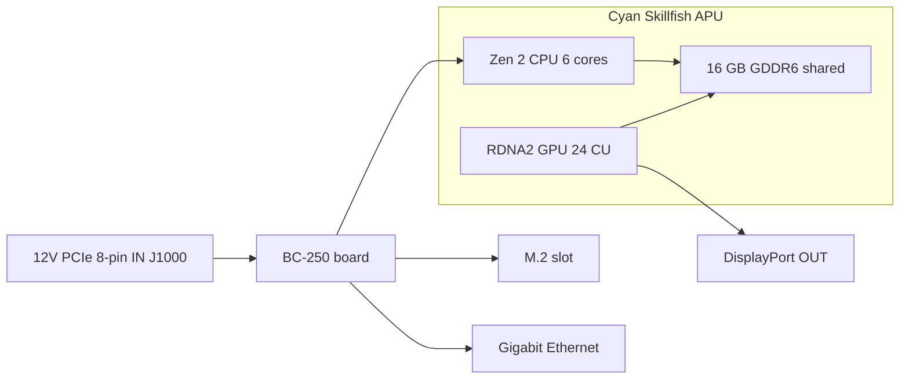
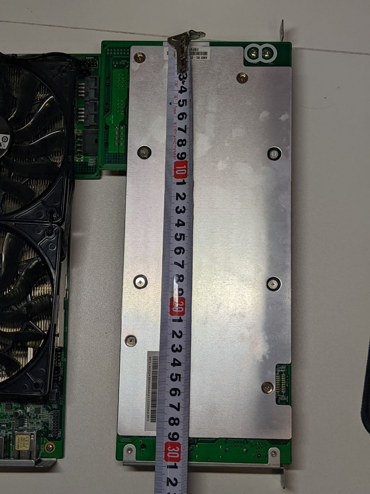

> 🌐 Topluluk çevirisi. İngilizce sürüm asıl kaynaktır ve daha güncel olabilir. Hata mı buldunuz? Bir [issue açın](https://github.com/lildebil0/awesome-bc250/issues). ([İngilizce orijinali](../en/01-what-is-bc250.md))

# BC-250 Nedir

> **Özet** — BC-250, **bir sunucu/madencilik kartı üzerinde PlayStation 5 sınıfı bir APU**'dur. Tek bir çip (AMD kod adı **Cyan Skillfish**, PS5'in **Oberon/Ariel** silikonunun kırpılmış bir sürümü) **6 çekirdekli / 12 iş parçacıklı Zen 2 CPU** ve **24 hesaplama birimli RDNA 2 GPU** taşır ve **16 GB lehimli GDDR6** ile beslenir. **Bir ekran kartı değildir ve normal bir PC değildir** — **tanıdığınız bir x86 BIOS yoktur, PCIe yuvası yoktur, 24 pinli ATX fişi yoktur**: **8 pinli bir PCIe güç konnektörüne doğrudan 12 V** alır ve kendi firmware'ini önyükler. İnsanlar bunu **bedava denecek kadar ucuz bir Linux oyun / yerel yapay zeka makinesi** olduğu için satın alır. İnsanlar buna öfkelenir çünkü **sürücüler, soğutma ve donanımsal video kodlamanın yokluğu** onu tak-çalıştır bir makine değil bir proje yapar. Sıfır uğraş istiyorsanız bu kart yanlış bir alımdır — hemen iade edin. Kurcalamayı seviyorsanız okumaya devam edin.

Bu sayfa "gerçekte ne satın aldım" referansıdır. Güç, soğutma, işletim sistemi kurulumu ve sürücülerin her biri kendi bölümünü alır ([03](03-power-supply.md) / [04](04-cooling.md) / [06](06-linux.md)).

---

## Gerçekte ne olduğu

AMD, BC-250'yi bir **kripto para madenciliği hızlandırıcısı** olarak yaptı ("BC", blockchain'i temsil eder). Ucuz olması için AMD **artakalan PlayStation 5 işlemci silikonunu** yeniden kullandı — Sony'nin konsola koyduğu çip ailesinin aynısı. Bir kart, bir APU artı belleği ve güç devresinden ibarettir; ürünün tamamı budur.

Jargon, bir kez tanımlanmış hâliyle:

- **APU** (Accelerated Processing Unit) — AMD'nin **hem CPU'yu hem GPU'yu** içeren tek bir çipe verdiği ad. Ayrı bir ekran kartı yoktur; GPU aynı paketin içindedir ve aynı belleği paylaşır.
- **Cyan Skillfish** — AMD'nin bu APU için mühendislik **kod adı**. Bunu Linux'ta her yerde göreceksiniz: GPU firmware dosyası tam anlamıyla `cyan_skillfish_gpu_info.bin`'dir ([src](https://t.me/c/2424231195/57962) — sembolik bağlantı düzeltmesi için bkz. [src](https://t.me/c/2424231195/41252)). Araçlar bunu PS5 yonga adları **Oberon** / **Ariel** altında da bildirebilir.
- **GDDR6** — normalde bir ekran kartında bulunan hızlı grafik belleği. BC-250'de bu **aynı anda hem sistem RAM'i hem video RAM'idir** (CPU ve GPU tek bir havuzu paylaşır). DIMM yuvası yoktur; 16 GB lehimlidir ve yükseltilemez.
- **RDNA 2** — GPU mimari nesli (PS5, Xbox Series ve Radeon RX 6000 kartlarıyla aynı aile).

Çip, tam değil **kırpılmış** bir PS5 parçasıdır. Topluluk bu karşılaştırmayı sabitledi ([src](https://t.me/c/2424231195/11282), kaynak [TechPowerUp'ın Oberon kaydı](https://www.techpowerup.com/gpu-specs/amd-oberon.g936)):

| | BC-250 | Tam PS5 (Oberon) |
|---|---|---|
| CPU çekirdek / iş parçacığı | **6 / 12** | 8 / 16 |
| GPU hesaplama birimi (CU) | **24** | 36 |

Bir "hesaplama birimi" bir GPU çekirdek bloğudur; bunlardan 24 tanesi kabaca orta sınıf bir dizüstü GPU bölgesidir, ki bu da sohbetin oyunlarda bildirdiği performans aralığının tam olarak budur.

BC-250, AMD'nin "masaüstü bir kart üzerinde artakalan konsol silikonu" tek örneği değildir. Aynı fikirden inşa edilmiş iki yakın kuzeni vardır: **AMD 4700S Desktop Kit** (bir **PlayStation 5** türevi CPU kiti) — ki sohbet, pazaryerlerinde BC-250 ile çapraz listelendiği konusunda uyarır ([02-buying.md](02-buying.md)) — ve **AMD 4800S Desktop Kit**, **Xbox Series X** türevi sürüm (GDDR6'ya bağlanmış 8 Zen 2 çekirdeği, konsolun RDNA 2 GPU'su devre dışı bırakılmış). İkisi de, BC-250 gibi, kurtarılmış bir konsol CPU'sunu lehimli GDDR6 ile eşleştiren gerçek AMD ürünleridir ([VideoCardz](https://videocardz.com/newz/amd-4800s-desktop-kit-a-pc-repurposed-apu-from-xbox-series-x-has-been-tested)). Alışveriş yaparken BC-250'yi kardeşlerinden ayırt etmek için yararlı bir bağlamdır.

İnsanlar **BC-250'de masaüstü Linux'u, PS5'in kendisinin jailbreak edildiği şekilde** çalıştırdı — tam 4K HDMI video + ses, çalışan tüm USB portları, APU'nun CPU'da ~3,2 GHz'e ve GPU'da ~2,0 GHz'e kadar hızlanması ([src](https://t.me/c/2424231195/122260)).

---

## Neyde iyi olduğu

- **Bu performans katmanında Linux oyununa en ucuz giriş yolu.** Steam/Proton (Linux'ta Windows oyunlarını çalıştıran bir uyumluluk katmanı) aracılığıyla insanlar Star Citizen oynar ([src](https://t.me/c/2424231195/38702)) ve hatta *Doom: The Dark Ages* gibi modern başlıkları bir topluluk Vulkan sarmalayıcısı üzerinden düşük/FSR'de ~60 FPS'te oynar ([src](https://t.me/c/2424231195/127696)). Oyun başına sonuçlar [11-gaming.md](11-gaming.md) içinde yer alır.
- **Yetenekli bir yerel yapay zeka makinesi.** 16 GB GDDR6 ile orta boyutlu dil modellerini barındırabilir. Üyeler, LLM'leri yerel olarak `llama.cpp`/`jan` üzerinden **Vulkan** arka ucunda çalıştırır; önce BIOS'u GPU'ya 12 GB tahsis edecek şekilde ayarlarsınız ([src](https://t.me/c/2424231195/92421)). Bkz. [12-ai-llm.md](12-ai-llm.md).
- **Küçük ve kendi kendine yeten.** Yerleşik GPU tarzı soğutucu bloğa sahip tek, uzun bir karttır — küçük DIY/3D baskı kasalara girer ve tek küçük bir güç kaynağıyla çalışır ([build src](https://t.me/c/2424231195/137825)).

*Neden* hiç çalıştığına dair topluluk fikir birliği: çip Steam Deck / PS5 donanımına o kadar yakın ki, Valve ve açık kaynak Mesa grafik yığını tam olarak aynı sürücüleri geliştirmeye devam ediyor, böylece BC-250 bedavaya bu işin tadını çıkarıyor ([src](https://t.me/c/2424231195/93006)).

---

## Neyin can sıkıcı olduğu (beklentileri ayarlayın)

Bu, yeni gelenlerin küçümsediği yarıdır. Hiçbiri anlaşmayı bozan bir şey değildir ama hepsi gerçek bir iştir.

- **Sürücüler kendin-yap işidir.** AMD bu kart için **resmi sürücü ve genel kamuya açık dokümantasyon yayınlamaz** ([src](https://t.me/c/2424231195/37764)). Her şey — Linux grafik yığını, saat/voltaj "governor"'ı, BIOS — topluluk tarafından inşa edilmiştir. Kurulum scriptlerini takip etmeyi ve ara sıra elle bir şeyler düzeltmeyi bekleyin. [06-linux.md](06-linux.md) ile başlayın.
- **Soğutma, insanların en çok yanlış yaptığı 1 numaralı şeydir.** Stok soğutucu blok bir madencilik rack'inin zorlamalı hava tüneli için tasarlanmıştır, bu yüzden bir masada aşırı ısınır ve kutudan çıktığı gibi throttle yapar. Soğutmayı modlamanız gerekecek. Bunun kendi bölümü var — performansın peşine düşmeden **önce** [04-cooling.md](04-cooling.md) okuyun.
- **Donanımsal video kodlayıcı yok.** GPU'nun video kodlama bloğu (AMD'nin **VCN** dediği şey — videoyu yayın/kayıt için sıkıştıran özel devre) **kullanılamaz**. Ekran kaydı ve oyun yayını bir **yazılım kodlayıcıya** geri döner, ki bu da CPU'ya mal olur. Çalışır (insanlar Sunshine/Moonlight üzerinden yayın yapar) ama normal bir GPU'dan daha yavaş ve daha düşük kalitelidir ([src](https://t.me/c/2424231195/88026)). Benzer şekilde, ilk Mesa sürücüsü, topluluk donanım hızlandırmayı çalıştırana kadar meşhur şekilde **yazılım render'ı** yapıyordu ([src](https://t.me/c/2424231195/11243)).
- **Garip güç ve varsayılan olarak görüntü yok.** Standart bir 24 pinli ATX konnektörü almaz — bkz. sonraki bölüm. Birçok kart ayrıca POST yapabilmesi için bile bir **BIOS resetine** ihtiyaç duyar şekilde gelir ([src](https://t.me/c/2424231195/57930)) ve genellikle görüntüyü **DisplayPort** üzerinden çıkarırsınız (HDMI bir DP→HDMI adaptörü gerektirir, ki bu da sesi sorunsuz taşır — [src](https://t.me/c/2424231195/9148)).
- **Bir kurcalayıcı kartıdır, nokta.** Uzun süreli bir üyenin dediği gibi: ucuz olmasına rağmen BC-250 "belirli beceriler, çaba ve akıl gerektirir" ([src](https://t.me/c/2424231195/73002)). Sadece para değil, zaman da ayırın.
- ⚠ **Bir eGPU onu kurtarmaz — topluluk tarafından bildirildi (r/BC250Gaming).** Tek M.2 yuvası yalnızca **PCIe 2.0 ×2**'dir (aşağıdaki donanım kartına bakın) ve bu bant genişliğinde M.2'ye asılan harici bir GPU'nun **yerleşik RDNA 2 GPU'dan *daha kötü* performans gösterdiği bildirilmiştir** — yavaş bağlantı onu boğar. Daha fazla grafik gücü istiyorsanız, fikir birliği bunun bunun için doğru kart olmadığıdır. *(Topluluk tarafından bildirildi; bir kıyaslama değil, bir uyarı olarak ele alın.)*

> ⚠ **İki renkli LED ne anlama gelir — topluluk tarafından bildirildi (r/BC250Gaming).** NIC'in yanındaki iki renkli LED bir **madencilik dönemi kullanım göstergesidir, bir hata ışığı değil**: topluluk anlatımlarına göre **kırmızı = GPU/RAM *%100* kullanımda *değil*, yeşil = tam kullanım**. Yani boştaki bir masaüstü kartında kırmızı ışık normaldir, bir arıza değil. *(Topluluk tarafından bildirildi; AMD bu kart için dokümantasyon yayınlamaz, bu yüzden kesin renk eşlemesini doğrulanmamış olarak ele alın.)*

> ⚠ **Elle taşıma uyarısı, zor yoldan öğrenildi.** Çalışan karta metalik hiçbir şeyin değmesine izin **vermeyin** ve termal macunu yalnızca dikkatle değiştirin — bir üye, kartını kısa devre yaptırarak BC-250'sini kalıcı olarak öldürdü ([src](https://t.me/c/2424231195/95998)). Kartlar ayrıca soğutucu blok montajından dolayı hafifçe **bükülmüş** gelir; bir üye, kartı kâğıtla soğutucu bloğa düz şekilde besleyerek (shim) bir açılmama sorununu çözdü ([src](https://t.me/c/2424231195/117347)).

---

## Donanım Referans Kartı

Teknik özellikler, topluluğun donanım tersine mühendisliğine karşı çapraz kontrol edilmiştir (AMD veri sayfası yayınlamaz). Daha önce doğrulanmamış olan bellek yolu ve fiziksel boyut rakamları artık [elektricM donanım spesifikasyonundan](https://github.com/elektricm/elektricm) (tersine mühendislik için mothenjoyer69 / Segfault / neggles / yeyus'a atıfta bulunur) alınmıştır. Aşağıdaki pinout ve güç rakamları kanonik topluluk donanım belgesinden gelir.

Kart bir bakışta — solda güç girişi, ortada APU ve paylaşılan belleği, sağda I/O:



### Temel özellikler

| Özellik | Değer | Kaynak |
|------|-------|--------|
| Sınıf | Madencilik/sunucu kartı üzerinde PlayStation 5 türevi APU | [hardware.md](https://github.com/mothenjoyer69/bc250-documentation/blob/main/hardware.md) |
| APU kod adı | **Cyan Skillfish** (PS5 yongası: Oberon / Ariel) | sohbet ([src](https://t.me/c/2424231195/57962)) |
| CPU | **6 çekirdek / 12 iş parçacığı, Zen 2** (6 çekirdek doğrulandı) | [hardware.md](https://github.com/mothenjoyer69/bc250-documentation) · sohbet ([src](https://t.me/c/2424231195/11282)) |
| CPU saat hızı | **~3,49 GHz**'e kadar ("civarı") | [hardware.md](https://github.com/mothenjoyer69/bc250-documentation) · sohbet ([src](https://t.me/c/2424231195/122260)) |
| GPU | **24 hesaplama birimi, RDNA 2** (`gfx1013`; PS5 SoC'unda 36 var); rasterizasyon ≈ **RX 6600 ile RX 6600 XT arası** / GTX 1660 Ti sınıfı; **Vulkan 1.4** | [hardware.md](https://github.com/mothenjoyer69/bc250-documentation) · sohbet ([src](https://t.me/c/2424231195/11282)) · [elektricM](https://github.com/elektricm/elektricm) |
| GPU saat hızı | ~1500 MHz stok, ~2000 MHz overclock (≈2,23 GHz maks) | ([src](https://t.me/c/2424231195/122260)) · [09](09-overclock-undervolt.md) |
| Bellek | **16 GB GDDR6**, CPU ve GPU arasında paylaşılır, lehimli (yükseltilemez) | [hardware.md](https://github.com/mothenjoyer69/bc250-documentation) · [README](../../README.md) |
| GPU VRAM tahsisi | BIOS'ta ayarlanır; BIOS 3.00+ üzerinde **12 GB** seçilebilir | ([src](https://t.me/c/2424231195/92421)) |
| Bellek yolu / bant genişliği | **256 bit** GDDR6 @ **14 Gbps**, **~448 GB/s** | [elektricM donanım spesifikasyonu](https://github.com/elektricm/elektricm) |
| TDP | **220 W** (kart termal tasarım gücü) | [hardware.md](https://github.com/mothenjoyer69/bc250-documentation) |
| Güç çekimi | madencilik sınıfı yük altında tipik ~67–85 W | [hashrate.no](https://www.hashrate.no/gpus/bc250) |
| Donanımsal video kodlama (VCN) | **Yok** — yalnızca yazılım kodlama | ([src](https://t.me/c/2424231195/88026)) |
| Video çıkışı | **DisplayPort 1.4** (**4K@120 / 8K@60**'a kadar); HDMI için DP→HDMI adaptörü kullanın; ses taşır | ([src](https://t.me/c/2424231195/9148)) · [elektricM](https://github.com/elektricm/elektricm) |
| Depolama (M.2) | 1x M.2 2280 — **PCIe 2.0 x2 veya SATA III** | [elektricM](https://github.com/elektricm/elektricm) |
| 2. DisplayPort | mevcut ama **lehimlenmemiş**; yazılımda etkinleştirilebilir | ([src](https://t.me/c/2424231195/88026)) |
| Fiziksel boyut | **340 mm / 310 mm** uzunluk (ölçüm yöntemine göre), **~115 mm** genişlik, soğutucu blokla **~400 g**; özel standart-dışı madencilik form faktörü | [elektricM donanım spesifikasyonu](https://github.com/elektricm/elektricm) |

> ⚠ **GDDR6 overclock = bant genişliği, FPS değil — topluluk tarafından bildirildi (r/BC250Gaming).** Topluluk anlatımlarına göre, GDDR6'yı overclock yapmak bellek bant genişliğini kabaca **~256 GB/s'den ~445 GB/s'ye** yükseltir ama **hiçbir oyun kazancı** sağlamaz — darboğaz bellek bant genişliği değil GPU'nun 24 CU'sudur, bu yüzden fazladan bant genişliği oyunlarda kullanılmadan kalır. (Yukarıdaki deponun doğrulanmış *stok* rakamının zaten 256 bit / 14 Gbps'te **~448 GB/s** olduğunu unutmayın, dolayısıyla topluluğun "~256 GB/s taban çizgisi" spec sayfasıyla eşleşmiyor — kesin GB/s sayılarını doğrulanmamış olarak ele alın; FPS kazanmadığınız çıkarımı kalıcı kısımdır.) Genel olarak GPU/bellek overclock'u için bkz. [09-overclock-undervolt.md](09-overclock-undervolt.md).

> **Kart boyutları hakkında:** [elektricM donanım spesifikasyonu](https://github.com/elektricm/elektricm) **340 mm / 310 mm** uzunluk (iki rakam farklı ölçüm yöntemlerini yansıtır), **~115 mm** genişlik ve soğutucu blokla **~400 g** verir, özel standart-dışı bir madencilik form faktörü üzerinde. Kanonik `hardware.md`'nin kendisi boyutları listelemez; sohbetin en çok tepki alan tek donanım gönderisi tam anlamıyla *"Размеры amd bc-250"* ("AMD BC-250 boyutları", ❤20 — [src](https://t.me/c/2424231195/379)) başlığını taşır ve insanların kasa yapımı için buna önem verdiğini doğrular. Tam kasa uyumu için ölçülmüş bir 3D modelden çalışın — topluluk tarafından kataloglanmış kart STL'leri (örn. `BC250 Board.stl`, [Printables 1103626](https://www.printables.com/model/1103626-amd-bc250-board) ve [Printables 1341336](https://www.printables.com/model/1341336-accurate-3d-model-of-the-amd-bc-250-board)'deki hassas model) boyutsal olarak doğrudur. Bkz. [05-case.md](05-case.md).

<p align="center">
  <br>
  <sub>Fotoğraf: AMD BC-250 topluluğu · <a href="https://t.me/c/2424231195/379">kaynak</a></sub>
</p>

### Güç konnektörü pinout'u (herhangi bir şey takmadan önce bunu okuyun)

BC-250'de **24 pinli ATX başlığı yoktur**. **Yalnızca 12 V** ile, bir **8 pinli PCIe güç konnektörü (J1000)** üzerinden beslenir — bir ekran kartınınkiyle aynı fiziksel fiş, ama kart üç güç kontağının da 12 V'tan beslenmesini bekler. Tam kablolama ve PSU seçimi [03-power-supply.md](03-power-supply.md) içindedir; [hardware.md](https://github.com/mothenjoyer69/bc250-documentation/blob/main/hardware.md)'den kanonik pinout:

**J1000 — ana 8 pinli PCIe güç (bağladığınız budur):**

```
[ GND  GND  GND  GND ]
[ GND  12V  12V  12V ]
```

- Üç 12 V kontağı; belge, Mini-Fit Jr kontaklarını **her biri 9 A'e kadar** olarak derecelendirir, dolayısıyla bu konnektör "**324 W'a kadar** güvenle sağlayabilir" ve bağımsız kullanım için **16 AWG** kablo önerir ([hardware.md](https://github.com/mothenjoyer69/bc250-documentation)).
- **GND = toprak (0 V), 12V = +12 volt.** Polariteyi doğru yapın — bu kartın ters voltaj toleransı yoktur.

**J2000 / J2001 — rack güç konnektörleri (genellikle masada KULLANILMAZ):**

```
        J2000                  J2001
 [ LED1  12V  12V  12V ]   [ 12V  12V  12V  PGD ]
 [ LED2  GND  GND  GND ]   [ GND  GND  GND  GND ]
```

- Bunlar **Molex Micro-Fit BMI** konnektörleridir ([parça 444280801](https://www.molex.com/en-us/products/part-detail/444280801)), PCIe/EPS fişleri *değil* — kartı orijinal madencilik şasisinin içinde beslerlerdi. **J2000 ve J2001 aynı değildir:** yukarıdaki pinout'un gösterdiği gibi, J2000 **LED1/LED2** pinlerini taşırken J2001 **PGD** pinini taşır, dolayısıyla iki konnektör farklıdır ([elektricM / mothenjoyer69 donanım belgeleri](https://github.com/mothenjoyer69/bc250-documentation)).
- **PGD** (J2001 üzerinde) bir güç-iyi/algılama pinidir: kart **rack'in PSU2'sine oturduğunda 5 V** görür. Bağımsız bir build'de genellikle bunun yerine J1000 üzerinden besler ve J2000/J2001'i göz ardı edebilirsiniz — ama belirli PSU adaptörünüz için [03-power-supply.md](03-power-supply.md)'ye karşı doğrulayın.

---

## Bundan sonra nereye gitmeli

1. **[02-buying.md](02-buying.md)** — henüz satın almadıysanız ya da adil bir fiyatın ve gerçek risklerin ne olduğunu bilmek istiyorsanız.
2. **[03-power-supply.md](03-power-supply.md)** — onu gerçekte nasıl beslemeli (8 pine 12 V).
3. **[04-cooling.md](04-cooling.md)** — kart elinize geçtiğinde başka her şeyden **önce** bunu yapın.
4. **[06-linux.md](06-linux.md)** — bir işletim sistemi ve topluluk sürücülerini üzerine alın.

---

## Kaynaklar

- Kanonik donanım belgesi ve pinout — [mothenjoyer69/bc250-documentation `hardware.md`](https://github.com/mothenjoyer69/bc250-documentation/blob/main/hardware.md)
- Bellek yolu/bant genişliği, fiziksel boyutlar, GPU konumlandırması, DP 1.4, M.2 — [elektricM donanım spesifikasyonu](https://github.com/elektricm/elektricm) (tersine mühendislik için mothenjoyer69 / Segfault / neggles / yeyus'a atıfta bulunur)
- Kırpılmış vs tam PS5 silikonu (6/12 + 24 CU vs 8/16 + 36 CU) — https://t.me/c/2424231195/11282 · [TechPowerUp Oberon](https://www.techpowerup.com/gpu-specs/amd-oberon.g936)
- PS5-donanımı-üzerinde-Linux, 4K HDMI, saat hızları — https://t.me/c/2424231195/122260
- Resmi sürücü yok / dokümantasyon yok — https://t.me/c/2424231195/37764
- Yazılım render'ı / donanımsal kodlama yok — https://t.me/c/2424231195/11243 · https://t.me/c/2424231195/88026
- DisplayPort + DP→HDMI ses — https://t.me/c/2424231195/9148
- Cyan Skillfish firmware adı — https://t.me/c/2424231195/57962 · https://t.me/c/2424231195/41252
- BIOS 3.00 üzerinden yerel LLM + 12 GB VRAM — https://t.me/c/2424231195/92421
- "Beceri, çaba ve akıl gerektirir" — https://t.me/c/2424231195/73002
- Elle taşıma/kısa devre uyarısı — https://t.me/c/2424231195/95998 · bükülmüş-kart düzeltmesi — https://t.me/c/2424231195/117347
- "BC-250 boyutları" (en çok tepki alan donanım gönderisi) — https://t.me/c/2424231195/379
- 220 W TDP, 6 çekirdekli/3,49 GHz CPU, 24 CU'lu GPU, 16 GB GDDR6 (depo onayı) — [mothenjoyer69/bc250-documentation README](https://github.com/mothenjoyer69/bc250-documentation)
- Madencilik sınıfı güç çekimi rakamları — https://www.hashrate.no/gpus/bc250
- Neden çalışmaya devam ediyor (paylaşılan Steam Deck/PS5 sürücü çabası) — https://t.me/c/2424231195/93006
- Kardeş kitler — AMD 4700S (PS5 CPU kiti, BC-250 ile çapraz listelenir, [02-buying.md](02-buying.md)) ve AMD 4800S (Xbox Series X CPU + GDDR6, GPU devre dışı) — [VideoCardz: 4800S Desktop Kit](https://videocardz.com/newz/amd-4800s-desktop-kit-a-pc-repurposed-apu-from-xbox-series-x-has-been-tested)
- M.2-üzerinden-eGPU yerleşik GPU'dan yavaş (M.2 PCIe 2.0 ×2'dir), iki renkli NIC LED'i = kullanım sinyali (kırmızı = %100 değil, yeşil = tam), GDDR6 overclock bant genişliğini yükseltir (~256→~445 GB/s) ama oyun kazancı yok — topluluk tarafından bildirildi (r/BC250Gaming)

> AMD bu kart için birincil bir veri sayfası yayınlamaz; yukarıdaki rakamlar en iyi topluluk tersine mühendisliğidir (kanonik `hardware.md` artı elektricM donanım spesifikasyonu). Düzeltmeler PR ile memnuniyetle karşılanır (bkz. [CONTRIBUTING.md](../../CONTRIBUTING.md)).
