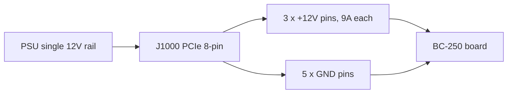

> 🌐 Topluluk çevirisi. İngilizce sürüm asıl kaynaktır ve daha güncel olabilir. Hata mı buldunuz? Bir [issue açın](https://github.com/lildebil0/awesome-bc250/issues). ([İngilizce orijinali](../en/03-power-supply.md))

# Güç Kaynağı

> **Özet** — BC-250'nin **güç düğmesi ve standart bir PC güç fişi yoktur**. Tek bir **PCIe 8 pin (6+2)** konnektörü üzerinden **12 V** yer — bir masaüstü ekran kartının kullandığı fişin aynısı — ve yaklaşık **~235 W**'ta zirve yapar (overclock yaparsanız daha fazla). **Tek bir rayda ~250–300 W** sağlayabilen bir 12 V kaynağına ihtiyacınız var. Topluluğun gittiği üç yol: ucuz bir **sunucu "Flex" PSU** (HP 500 W, eBay'de ~12 $), bir **endüstriyel brick** (Mean Well LOP-300/LOP-500) ya da **normal bir ATX PSU** (sadece PCIe kablosunu takın). Kaçınılacak iki katil: **12 V'u zayıf raylara bölen eski bir PSU** ve aşırı ısınıp yangın çıkaran **sahte bakır-kaplı-çelik kablolar**. Gerçek bakır, **16 AWG veya daha kalın** kullanın.

Kartı beslemek, bir yeni gelenin doğru yapması gereken **ikinci şeydir** ([soğutma](04-cooling.md)'dan sonra) — ve kablolamada köşeleri keserseniz yangın çıkarma olasılığı en yüksek olanıdır.

---

## Kartın gerçekte neye ihtiyacı var

BC-250, bir kripto-madencilik/sunucu kartı üzerinde kırpılmış bir PlayStation 5 yongasıdır. Bir rack'te oturup 12 V ile beslenmek üzere tasarlanmıştır — bu yüzden **normal bir PC'nin hiçbir kolaylığına sahip değildir**:

- **ATX 24 pinli** anakart konnektörü yok.
- **Güç düğmesi yok** — 12 V geldiği anda açılır (PSU'nun kendi anahtarı sizin güç düğmenizdir).
- **PSU'nun tek işi: yeterli akımda 12 V sağlamak.**

**Güç rakamları (doğrulandı):**

| Özellik | Değer | Kaynak |
|------|-------|--------|
| Giriş voltajı | 12 V DC | [hardware.md](https://github.com/mothenjoyer69/bc250-documentation/blob/main/hardware.md) |
| Tipik zirve çekimi | ~220–235 W | topluluk-gözlemli ([src](https://t.me/c/2424231195/31076)) |
| Konnektör | PCIe 8 pin (6+2) | [hardware.md](https://github.com/mothenjoyer69/bc250-documentation/blob/main/hardware.md) · ([src](https://t.me/c/2424231195/14450)) |
| 12 V'ta zirve akımı | tipik ~18–20 A, tasarım payı ~40 A'e | ([src](https://t.me/c/2424231195/31076)) |

> **"PCIe 8 pin (6+2)"**, bir ekran kartı güç fişi anlamına gelir: bir blokta altı pin, artı ayrılabilir 2 pinli bir klips, böylece aynı kablo hem 6 pin hem 8 pin olarak çalışır. **6+2** = 6 sabit + 2 çıkarılabilir. Bu, anakartınızdaki CPU/EPS 8 pin *değildir* — aşağıdaki uyarıya bakın.

Bir PCIe 8 pin, PCIe standardına göre **150 W** için derecelendirilmiştir ve kartın üç 12 V kontağı (Molex Mini-Fit Jr, her biri 9 A) güvenle **~324 W'a kadar** geçirebilir ([hardware.md](https://github.com/mothenjoyer69/bc250-documentation/blob/main/hardware.md)). Yani tek bir 8 pin stokta rahatça yeterlidir; pay, yalnızca agresif bir overclock zorladığınızda önemlidir.

**Ne kadar PSU gücü alınmalı:** **12 V rayında 300 W veya daha fazla** hedefleyin. 300 W'lık bir ünite, ~235 W zirvesine göre sağlıklı bir pay verir ve PSU fanını sakin tutar; insanlar 500 W'lık bir Flex sunucu PSU'sunun bu yükte neredeyse sessiz çalıştığını bildiriyor ([src](https://t.me/c/2424231195/31076)). "Para tasarrufu için" ~250 W'ın altında almayın — onu sınırda çalıştırırsınız ve gürültülü olur ya da kapanır.

> **Pens-ölçer güç eğrisi (birinci elden amperaj).** Bir teardown, 12 V beslemesine bir DC ampermetre kelepçeledi ve kartın gerçek akımını okudu: **oyun ≈17 A / ~190 W** çeker, **tam sentetik stres yükü ise 2000 MHz / 960 mV'ta ≈21 A / ~240–250 W**'a vurur; voltajı daha yükseğe ittikçe **22–23 A ve ötesine** çıkar ([Old Lamer — Part VII](https://youtu.be/pxahl9-YgkY) ~9:01). Bunlar, yukarıdaki topluluk duvar-gücü rakamlarını ölçülmüş ray amperajıyla keskinleştirir — ve 300 W hedefinin neden doğru payı bıraktığını doğrular. *(Rakamlar otomatik altyazılardan okundu — kesin sayıları yaklaşık olarak ele alın.)*

> ⚠️ **Kaçınılacak adıyla anılan PSU'lar:** ucuz **Dell D220P-01** (220 W) ve **Dell D250AD-00** (250 W), bu kart için **yetersiz ve tehlikeli** olarak işaretlenir — 220 W / 250 W'ta kartın zirvesinin altında otururlar ve oyun yükü altında kesilmek ya da hatta bozulmak üzere bildirilmiştir. Bir üniteyi sadece ucuz olduğu ve "yeterli görünüyor" diye almayın. ([elektricM: power](https://elektricm.github.io/amd-bc250-docs/hardware/power/))

---

## Fizik: volt, amper, watt — ve neden ince kablo yanar

Bu bölümdeki her kural üç denklemden çıkar. Bunları öğrenin, o zaman kalınlık tabloları ve "asla SATA kullanma" uyarıları keyfî olmaktan çıkar.

**Güç = volt × amper (`P = U·I`).** Kart, **12 V**'ta **~235 W**'a ihtiyaç duyar, dolayısıyla `235 ÷ 12 ≈ 19,6 A` çeker. Bir pens ölçerin **~17 A oyun / ~21 A stres** okumasının sebebi tam olarak budur ([yukarıda](#kartın-gerçekte-neye-ihtiyacı-var)): watt değeri silikon tarafından sabitlenmiştir, dolayısıyla *amperler*, 12 V'un zorladığı her ne ise odur. Saat hızlarını/voltajı yukarı itin, amperler de wattlarla birlikte tırmanır.

**Neden 12 V — ve neden 24 V onu öldürür.** 12 V, kartın için yapıldığı veri merkezi-rack standardıdır; yerleşik VRM'leri bunu APU çekirdeğinin çalıştığı ~1 V'a düşürür. Kart **12 V için sabit kablolanmıştır ve aşırı-voltaj koruması yoktur**, dolayısıyla ona 24 V beslemek (örn. bir [LOP-300-**24**](#seçenek-b--mean-well-endüstriyel-brick)) her 12 V parçasına iki katını koyar ve onu anında yok eder. Amperajın aksine, voltaj pazarlık konusu değildir.

**Ampasite — bir kablonun neden amper sınırı vardır.** Bir kablo bir dirençtir ve dirençten geçen akım ısı yaratır: `P_loss = I²·R`. Daha kalın bakır = daha fazla kesit = **daha düşük R** = aynı amperde daha az ısı. Yukarıdaki AWG tablosunun tüm anlamı budur — **daha düşük AWG numarası = daha kalın kablo = daha fazla amperde güvenli**. ~20 A'de, **16 AWG bakır** serin kalır; daha incesi ise `I²·R` yalıtımı eritir. **Kareyi** unutmayın: akımı iki katına çıkarmak ısıyı *dörde* katlar, ki bu da ağır bir overclock'un neden "biraz daha kablo" değil, ikinci bir besleme gerektirdiğinin sebebidir.

**Voltaj düşüşü — diğer yarı.** Kabloda kaybolan ısı, kartın asla görmediği voltajdır: `V_drop = I·R`. Uzun, ince bir kablo hem **aşırı ısınır** hem de kartı **aç bırakır**, dolayısıyla gözle görülür biçimde hiçbir şey erimese bile yük altında brown-out yapabilir. Kısa, kalın bakır ikisini de aynı anda düzeltir.

**Neden sahte "bakır" ölümcüldür.** Bakır kaplı çelik, gerçek bakırın **~6 katı dirence** sahiptir — aynı amper, aynı `I²·R`, dolayısıyla aynı kabloda **6 katı ısı**. Aşağıdaki mıknatıs testi bir kalite tercihi değildir; akımda zaten karesi alınmış bir terim üzerindeki **6 katlık bir çarpanı** yakalar.

**Neden asla SATA veya Molex.** Sorun, kablo değil, *konnektördür*. Bir SATA güç kontağı, küçük kontak kendini pişirmeden önce **~54 W** için derecelendirilir → `54 ÷ 12 ≈ 4,5 A`; kart ise ~20 A ister, bu sınırın **4 katı**. Bir PCIe 8 pin ise üç kalın 12 V kontağı taşır (**her biri 9 A = 27 A / 324 W**) — *bu yüzden* doğru fiş odur ve SATA/Molex asla olamaz (bkz. [pinout](#8-pinli-pinout-j1000)).

---

## ⚠️ Kartları yok eden iki hata

Herhangi bir şey satın almadan önce bu bölümü okuyun.

### 1. PCIe 8 pini CPU/EPS 8 pinle karıştırmayın

ATX PSU'nuzun **iki farklı 8 pinli fişi** vardır: biri ekran kartları için (**PCIe**) ve biri CPU için (**EPS/CPU**, bazen "CPU" ya da "4+4" etiketli). **Neredeyse aynı görünürler ama pin şekilleri ve polariteleri terstir.** Bir CPU fişini BC-250'ye zorlamak, **toprağın olması gereken yere +12 V** koyar — tüm kartı yakabilirsiniz.

> *"Bir milyar kez tartışıldı — bizde bir PCIe güç girişi var. Uç pinin şekli farklıysa, elinizde bir CPU fişi var… tam anlamıyla ters polariteye sahip, eksinin olması gereken yerde artı. Her şeyi cehenneme yakabilirsiniz."* ([src](https://t.me/c/2424231195/14450))

Kartın **algılama-pini kontrolü yoktur**, dolayısıyla yanlış şeyi takmanızı engelleyen hiçbir şey yok. Güvenli alışkanlık: **konnektör klips şekline bakın ve emin değilseniz, açmadan önce + ve −'yi bir multimetreyle kontrol edin.**

### 2. Sahte "bakır" kablo kullanmayın — bir yangın tehlikesidir

Bu, sohbette en çok tekrarlanan tek güvenlik uyarısıdır. Ucuz hazır adaptör kabloları ve ucuz "PCIe" kabloları genellikle **bakır kaplı çeliktir (CCS)** ya da **bakır kaplı alüminyumdur (CCA)** — bir çelik/alüminyum çekirdek üzerinde ince bir bakır deri. Çeliğin **bakırın ~6 katı direnci** vardır, dolayısıyla kablo yük altında aşırı ısınır ve eriyebilir ya da tutuşabilir.

> *"Adaptörün kablosu yük altında kötü şekilde aşırı ısındı. Meğer bakır değil, ince bir bakır kaplamalı demirmiş (çelik)… yüksek direnç, çok ısınır, yangına neden olabilir. Güvenilir ve güvenli çalışma için en az 2,5 mm²'lik tam bakır kablolar kullanmak ZORUNDASINIZ."* ([src](https://t.me/c/2424231195/108733))

> *"Bir mıknatısla kontrol ettim 🤣 — çelik teller. Bu çelik 'tellerin' direnci bakırdan 6 kat daha yüksek. Hangi 450 W'tan bahsediyorlar ki?"* ([src](https://t.me/c/2424231195/133546))

**Güvenmeden önce test edin:** bir mıknatıs çeliğe yapışır, bakıra yapışmaz. Bir konnektör veya kablo manyetikse, kabloyu çöpe atın.

Bu yalnızca markasız kablo değildir. **Apevia Flex/ITX PSU'larda çelik kablolar görüldü** — bunları mıknatısla test edin, çünkü çelik yük altında çok ısınır ve bir yangın tehlikesidir. **Apevia ITX-PFC400W** Mini-ITX, bir **14 pinli konnektör** kullanır (aşağıdaki [LITE adaptörüyle](#otomatik-ps_on--topluluk-adaptörü) çalışır ama tavsiye edilmez). (r/BC250Gaming)

> 🔴 **BC-250'yi asla bir SATA veya Molex adaptörü üzerinden beslemeyin.** Kart **220–280 W** çeker ve bu konnektörler bunu fiziksel olarak güvenle sağlayamaz:
> - Bir **SATA→PCIe/8 pin adaptörü bir yangın tehlikesidir** — bir SATA güç konnektörü yalnızca **~54 W** için derecelendirilmiştir ([elektricM: power](https://elektricm.github.io/amd-bc250-docs/hardware/power/)).
> - Bir **çıplak Molex beslemesi en fazla ~156 W**'a (iki Molex konnektörü) çıkar — yine de yeterli değil ([elektricM: power](https://elektricm.github.io/amd-bc250-docs/hardware/power/)).
>
> Kartı yalnızca **gerçek bir PCIe 8 pin / EPS-sınıfı 12 V kaynağından** besleyin. Bu, yukarıdaki bakır-vs-çelik uyarısından ayrıdır: burada *tam bakır* bir SATA veya Molex adaptörü bile güvensizdir, çünkü konnektörün kendisi 220–280 W'lık bir yük için yetersiz derecelendirilmiştir.

---

## Kablo kalınlığı ve konnektör rehberi

Kart dokümantasyonu ve sohbet aynı güvenli taban çizgisinde hemfikir:

| Kullanım durumu | Kablo | Kaynak |
|----------|------|--------|
| Tek 8 pin, stok / hafif OC | **16 AWG** bakır (~1,3 mm²) | [hardware.md](https://github.com/mothenjoyer69/bc250-documentation/blob/main/hardware.md) |
| Elle yapılan kablo, pay isteyen | **2,5 mm²** (~13 AWG) tam bakır | ([src](https://t.me/c/2424231195/108733)) |
| Ağır overclock | daha kalın / **çift besleme** (bkz. J2000/J2001) | [hardware.md](https://github.com/mothenjoyer69/bc250-documentation/blob/main/hardware.md) |

Sayılar çelişmiyor — **16 AWG belgelenmiş minimumdur**; 2,5 mm² rakamı, bir CCS-kablo korkusundan sonra fazladan pay seçen bir yapımcıdır. **Pazarlık konusu olmayan kısım "gerçek bakır", kesin kalınlık değil.** Daha düşük AWG numarası = daha kalın kablo = daha güvenli.

Tam akımı taşıyan konnektör kontakları için, zirve için derecelendirilenleri hedefleyin: yapımcılar, ağır bir build'de **~40 A** için iyi kontaklar/kablo hedefler ve gevşek bir bas-tak bağlantısına güvenmek yerine onları cıvatalar ya da düzgünce sıkıştırır ([src](https://t.me/c/2424231195/31076)).

---

## 8 pinli pinout (J1000)

Kartın ana güç konnektörüne bakıldığında — **üst sıra tamamen toprak, alt sıra bir toprak hariç 12 V**. [hardware.md](https://github.com/mothenjoyer69/bc250-documentation/blob/main/hardware.md)'den:

```
J1000 (PCIe 8-pin), contacts facing you:

  [ GND  GND  GND  GND ]   ← top row: all ground (−)
  [ GND  12V  12V  12V ]   ← bottom row: one ground + three 12 V (+)
```

Sohbet aynı polariteyi düz bir dille belirtir — pinleri **1'den 3'e = +12 V, pin 4'ten 8'e = toprak** sayın:

> *"Bir ila üç arası pinler + olmalı, geri kalanı dörtten sekize eksi… Kartın algılama kontrolü yok. Bir test cihazı alın ve + ile −'nin nerede olduğuna bakın."* ([src](https://t.me/c/2424231195/14450))

Tek 12 V rayının sekiz kontağa nasıl bölündüğü — üçü +12 V taşır, beşi toprak:



Bu, standart bir PCIe 8 pine tam olarak uyar, *bu yüzden* normal bir ATX PSU'nun PCIe kablosu doğrudan çalışır. **Kendi kablonuzu yaparsanız, ilk açılıştan önce her pini bir multimetreyle doğrulayın** — polarite hataları burada affetmez.

Kartın ayrıca iki küçük alternatif güç konnektörü var, **J2000** ve **J2001** — yalnızca ağır bir overclock için yararlı ve aşağıda tam olarak ele alınmıştır.

---

## 300 W'ın ötesi — J2000 / J2001 ikinci güç konnektörü

> ⚠️ **Önce bunu okuyun.** Bu bölümdeki her şey **elle yapılan ekstra 12 V kablolamadır**. Kartın bu pinlerde (J1000 ile aynı) **polarite veya algılama kontrolü yoktur** — +12 V ile toprağı değiştirin, kart açıldığı anda yanar. İkinci bir besleme yalnızca **her iki besleme de aynı PSU'yu / aynı potansiyeldeki aynı 12 V rayını paylaşırsa** pay ekler; iki farklı kaynağı birbirine bağlamak, akımı birinin içinden geriye itebilir. Kendi konnektörlerinizi sıkıştırıp ölçmekte rahat değilseniz, burada durun ve tek bir [J1000 8 pin](#8-pinli-pinout-j1000) üzerinde kalın.

[J1000](#8-pinli-pinout-j1000)'e tek bir PCIe 8 pin, stokta ve hafif OC'de rahattır — üç 12 V kontağı **~324 W** için iyidir (9 A × 3 × 12 V ya da endüstriyel sınıf kontaklarla ~468 W'a kadar) ([hardware.md](https://github.com/mothenjoyer69/bc250-documentation/blob/main/hardware.md)). Bu bölümün var olma nedeni: **agresif bir overclock'taki 40 CU'lu bir kart 300 W'tan fazla çekebilir** ([src](https://t.me/c/2424231195/143787)), ki bu da tam olarak bir 8 pinin rahatlık bölgesinin sınırındadır. Kart, bir **ikinci PSU**'nun iki ekstra konnektörü — **J2000** ve **J2001** — beslediği bir rack için tasarlanmıştır, dolayısıyla masaüstü overclock payı almanın temiz yolu, bir fişi aşırı yüklemek yerine **J1000'i J2000/J2001 ile takviye etmektir** (ya da doğrudan karta lehimlemek) ([hardware.md](https://github.com/mothenjoyer69/bc250-documentation/blob/main/hardware.md)). Bu aynı zamanda sohbette en çok istenen diyagramdır ([src](https://t.me/c/2424231195/135741)).

### Pinout (kart dokümantasyonundan)

J2000 ve J2001 **aynı değildir**. **Molex Micro-Fit BMI** ile uyumludurlar ([parça 444280801](https://www.molex.com/en-us/products/part-detail/444280801)). Pin 1, beyaz silkscreen üçgenidir (aşağıdaki `v`):

```
        J2000                    J2001
   v                        v
[ LED1  12V  12V  12V ]   [ 12V  12V  12V  PGD ]
[ LED2  GND  GND  GND ]   [ GND  GND  GND  GND ]
```

| Pin | Anlamı |
|-----|---------|
| `12V` | +12 V güç girişi (konnektör başına üç) |
| `GND` | Toprak |
| `PGD` | **PGOOD** — bir rack arka panelinde ikinci bir PSU mevcut olduğunda 5 V okur; bir sinyal pini, bir güç çıkışı **değil** |
| `LED1` / `LED2` | Yeşil / kırmızı arka panel LED'lerini yansıtan aktif-düşük LED çıkışları |

**Yedeklilik için, dokümantasyon hem J2000 hem J2001 kullanmayı söyler** ([hardware.md](https://github.com/mothenjoyer69/bc250-documentation/blob/main/hardware.md#j2000-and-j2001)). İkisi arasında **sütun düzeninin farklı olduğunu** unutmayın — J2000'de LED pinleri ilk sütunda oturur ve üç 12 V pininin hepsi üst sıradadır; J2001'de PGD pini sağ üstte oturur ve alt sıra tamamen topraktır. **Bağlamadan önce her pini ölçün** — bir Micro-Fit muhafazasının ikisinde de aynı şekilde oturduğunu varsaymayın. ⚠ kesin pin-1 yönelimini kendi kartınıza karşı bir multimetreyle doğrulayın; LED/PGD pinleri **asla** 12 V almamalıdır.

### Topluluğun kullandığı pratik yöntem

Rack arka paneline ihtiyacınız yok. Tekrarlanan sohbet tarifi basitçe şudur: **J1000'e bir PCIe 8 pin çalıştırın, sonra bir Molex Micro-Fit 3.0 fişi sıkıştırın ve aynı 12 V'u bitişikteki J2000'e besleyin** ([src](https://t.me/c/2424231195/142662), [src](https://t.me/c/2424231195/138371)). Bir yapımcı, kesin kabloyu tek bir kaynaktan *"bir PCIe konnektörü ve iki Micro-Fit 3p konnektörü"* olarak tarif eder ([src](https://t.me/c/2424231195/143938)) — yani tek bir PCIe kablosundan gelen 12 V/GND'yi hem 8 pine hem de Micro-Fit beslemesine ayırın.

**Alınacak konnektör** (kendin-monte et, Molex Micro-Fit 3.0):

| Parça | Molex numarası | Not |
|------|--------------|------|
| Muhafaza | **43025-0800** (8 devreli) | fiş gövdesi ([src](https://t.me/c/2424231195/142659), [src](https://t.me/c/2424231195/14797)) |
| Sıkıştırma terminalleri | **43030** serisi | kablo başına bir ([src](https://t.me/c/2424231195/142659)) |

Yalnızca **12 V ve GND** konumlarını doldurun (yukarıdaki pinout tablosuyla eşleştirin); `PGD` / `LED1` / `LED2`'yi boş bırakın. [Ana 8 pin — bkz. kablo-kalınlığı rehberi](#kablo-kalınlığı-ve-konnektör-rehberi) ile aynı **gerçek-bakır, ≥16 AWG** kabloyu ve sıkıştırma disiplinini kullanın; aşırı ısınan elle sıkıştırılmış bir 12 V beslemesi, tam olarak bu bölümde daha önce tarif edilen yangın riskidir.

> 🛠 **Micro-Fit montaj sorunları (bir Molex nasıl-yapılır'ından).** Bu fişleri sıkıştırmak için pratik notlar ([Molex Micro-Fit videosu](https://youtu.be/aaDUkPn9ASE)):
> - **Kablo kalınlığı:** **18 AWG önerilir, 20 AWG kabul edilebilir** — yük, üç 12 V pini boyunca üçe bölünür, dolayısıyla her kablo üçte birini taşır.
> - Karta düz oturması için fişten **plastik mandalı tıraşlayın**.
> - **İki konnektör DEĞİŞTİRİLEBİLİR DEĞİLDİR** — kablolandıktan sonra, J2000'in ve J2001'in fişlerini asla değiştirmemek için **onları işaretleyin**.
> - **Sıkıştırıcı yok mu? Lehim geçerli bir alternatiftir** — kabloyu sıkıştırmak yerine terminale lehimleyin.
> - Doğru yapılırsa, **her iki konnektör boyunca dokuz 12 V hattı güvenle >400 W taşır.**


### 40 CU'lu bir kartı beslemek — üçlü çıkış kablo modu

Bir **40-CU açma**'dan sonra kart, FurMark'ta duvarda **~280 W** çekebilir (CPU-X'te ölçüldü) ve **tek bir 8 pin PCIe**, FurMark'ta **~220 W**'ta zirve yapar — dolayısıyla yoğun açılmış bir kart birden fazla besleme ister. **[Metalfish 500W](#topluluğun-kullandığı-popüler-psu-modelleri)**'in **3 paylaşımlı PCIe/CPU çıkışı** vardır; bir 40-CU build için **üçünü de** karta kablolayın (bir *"üçlü çıkış kablo modu"*):

- **18 AWG** kullanın — kablolar FurMark altında serin kalır; yükü 3 beslemeye bölmeden önce tehlikeli derecede ısınıyorlardı.
- **Kart tarafı** = Micro-Fit 3.0 soketleri; **PSU tarafı** = 4,2 mm Mini-Fit PCIe soketleri. **Önce her kabloyu bir multimetreyle haritalayın.**
- Konudan kaba kalınlık matematiği: 18 AWG ≈ **5 A @ 12 V ≈ kablo başına 60 W** × bir konnektörde 3 ≈ 180 W, × 2 konnektör ≈ 360 W — **ama paralel iletkenler akımı eşit paylaşmaz, bu yüzden onları sınıra kadar çalıştırmayın.**

(Atıf: **Korayosulu**, r/BC250Gaming, bir Oldlamer YouTube videosundan esinlenildi.)

> **Atıf:** yukarıdaki J2000/J2001 pinout'u, tersine mühendisliği **[mothenjoyer69'un bc250-documentation](https://github.com/mothenjoyer69/bc250-documentation)** üzerine inşa edilen **elektricM donanım dokümantasyonundan** (Segfault, neggles, yeyus'a da atıf). Uygulamalı sıkıştırma yöntemi ve parça numaraları, satır içinde alıntılanan topluluk sohbetinden gelir.

---

## Topluluğun kullandığı PSU seçenekleri

Üç pratik yol var. Hepsi 12 V sağlar; fiyat, boyut, gürültü ve ne kadar kablolama işi yaptığınız bakımından farklılık gösterir.

> 💡 **Tek bir PSU'dan birkaç kart mı besliyorsunuz?** Bu bölümdeki her şey tek bir kart için yazılmıştır. Bir büyük sunucu PSU'su tarafından beslenen çok-kartlı bir rig için, topluluğun **[Needleroozer/bc250-power-board](https://github.com/Needleroozer/bc250-power-board)**'unu kullanın — bir PSU'yu her BC-250'ye temiz 12 V beslemelerine bölen bir güç dağıtım PCB'si ([elektricM: power](https://elektricm.github.io/amd-bc250-docs/hardware/power/)).

| Seçenek | Ne olduğu | Fiyat | Artılar | Eksiler |
|--------|-----------|-------|------|------|
| **Sunucu "Flex Slot" PSU** | HP/Dell/vb. 1U veri merkezi brick'i (örn. HP 500 W Platinum) | kullanılmış ~12–25 $ | Ucuz, neredeyse yıkılmaz, büyük tek 12 V rayı, çok kompakt | Başlatmak için bir jumper/direnç gerektirir; küçük 15.000 RPM fan, değiştirilmezse jet kadar gürültülüdür; 8 pini kendiniz kablolarsınız |
| **Endüstriyel brick (Mean Well)** | Kapalı AC→DC kaynak, tek 12 V (LOP-300 = 300 W/25 A, LRS-350, LOP-500) | yeni ~25–45 $ | Yeni, temiz tek ray, sessiz, veri sayfası-spec'li | 8 pini kendiniz kablolarsınız; çıplak terminaller bir muhafaza gerektirir |
| **Normal ATX / Flex-ATX / SFX PC PSU** | Herhangi düzgün modern bir PC güç kaynağı | değişir | **Sıfır modlama** — PCIe 8 pin kablosu doğrudan takılır; yeni gelenler için en güvenlisi | Mini build için hantal; aşırı watt; aşağıdaki tek-ray kuralına dikkat edin |

### Seçenek A — Sunucu Flex PSU (en popüler ucuz rota)

Topluluk favorisi, kullanılmış bir **HP Flex Slot 500 W** sunucu kaynağıdır — *"eBay'de gülünç bir 12 $'a alındı… bunlar neredeyse sonsuza kadar çalışır, veri merkezlerinin onları ne sıklıkta değiştirdiğinden çok daha fazla pay, artı Platinum verimlilik"* ([src](https://t.me/c/2424231195/31076)). Bunların PCIe fişi yoktur, dolayısıyla bir tane uyarlarsınız:

1. **PSU'yu başlatın:** iki kısa başlatma pinini (pin 1–2) bir jumper ya da kilitlemeli anahtarla köprüleyin.
2. **12 V rayını etkinleştirin:** **pin 3 ile GND arasına ~500 Ω'luk bir direnç** koyun (geniş sol pin).
3. **12 V'u alın:** ya 12 V pinlerine doğrudan bir PCIe 8 pin lehimleyin ya da muhafazaya bir konnektör takın — *"ama kablolar ve konnektör zirve 40 A'i kaldırmalı"* ([src](https://t.me/c/2424231195/31076)).

İnsanların kullandığı diğer kanıtlanmış sunucu/konsol brick'leri: **PlayStation 3 FAT PSU** (32 A / 12 V — *"fazlasıyla yeterli ve çok kararlı, BC-250 için tavsiye ederim"* ([src](https://t.me/c/2424231195/62332)), [src](https://t.me/c/2424231195/102734)), Dell D550E, Juniper JPSU-350 ve çeşitli ASIC-madenci kaynakları.

> **Tüm kartı bir Xbox kumandasından açın — [ESP32-BC250-LOP_PSU-PowerON-Xbox](https://github.com/dexikdex/ESP32-BC250-LOP_PSU-PowerON-Xbox)** ([src](https://t.me/c/2424231195/142498)). Bu topluluk kartı (bir **ESP32_Relay X2**, model **303E32DC210**, çift röle) **pasif BLE taraması** yapar: eşleştirilmiş Xbox gamepad'iniz açıldığında, ESP32 onun Bluetooth reklamını görür ve kartın **PWR_SW** pinlerine bağlı **GPIO17** üzerindeki bir röleyi tetikleyerek gücü açar. İkinci bir röle (**GPIO16**) aynı anda 12 V'u çevre birimlerine (örn. bir fan kontrolcüsü) anahtarlar. Diğer pinler: **GPIO23** = fiziksel kasa-düğmesi girişi, **GPIO19** = düğme-LED çıkışı, **GPIO4** = PC-durumu monitörü. Gamepad, normal olarak PC'ye eşleştirilmiş kalır — tarama, işletim sistemi eşleştirmesini çalmaz. Lisans GPL-3.0, yazar dexikdex.

> **Fan hakkında dikkat:** bu brick'lerdeki stok 40 mm fan ~15.000 RPM'e dönebilir ve *"kalkan bir jet gibi ses çıkarabilir."* Pratikte, BC-250'nin mütevazı yükünde sakin kalır ve birkaç kullanıcı *"küçük kartımızla hiç gürültülü değil"* olduğunu doğrular ([src](https://t.me/c/2424231195/33455)). Sizi rahatsız ederse, yeterli hava akışına sahip daha sessiz bir 40 mm fanla değiştirin.

> 💡 **En iyi bütçe seçimi = kullanılmış bir sunucu PSU'su.** **10–30 $**'a ikinci el bir ~500 W sunucu kaynağı, büyük tek bir 12 V rayına en ucuz yoldur ve watt başına fiyatta yenmesi zordur ([Old Lamer — Part VII](https://youtu.be/pxahl9-YgkY) ~10:12). **Bir 12 V LED-şeritli / CCTV güç brick'i de kartı çalıştırır** ama dikkatli olun: bunlar genellikle **bir PC PSU'sunun sahip olduğu koruma devrelerinden yoksundur** (aşırı-akım, aşırı-sıcaklık, kısa-devre kesimi), dolayısıyla bir arızanın onu tetikleyecek hiçbir şeyi yoktur. Gerçek bir PC/sunucu PSU'su tercih edin; bir LED-şerit kaynağını yalnızca son çare olarak kullanın ve derecelendirmesinin içinde iyice tutun. *(Altyazı-kaynaklı — sayılar yaklaşık.)*

### Seçenek B — Mean Well endüstriyel brick

Yeni bir **Mean Well LOP-300-12** (300 W, 12 V, 25 A) ya da **LRS-350**, derli toplu, güvenilir seçimdir: veri sayfasından doğrudan tek bir 12 V rayı, ray-bölme oyunları yok ve sessiz. Maksimum overclock payı istiyorsanız daha büyük **LOP-500** var. Yine de PCIe 8 pini onun vidalı terminallerine kendiniz kablolarsınız ve terminaller açıkta olduğundan onu bir kutuya kapatmalısınız. Sohbette dolaşan ürün sayfaları: [ChipDip'te LOP-300-12](https://www.chipdip.ru/product/lop-300-12-blok-pitaniya-12v-25a-300vt-mean-well-9001511866) · [LRS-350-12](https://www.chipdip.ru/product/lrs-350-12-blok-pitaniya-12v-29a-348vt-mean-well-9000334417).

> 🔴 **`-12`'yi alın, `-24`'ü DEĞİL — son ek, çıkış voltajıdır.** Mean Well, LOP-300'ü birden çok voltajda satar ve **[LOP-300-24](https://www.meanwell.com/webapp/product/search.aspx?prod=LOP-300) 24 V çıkış verir** — bu kartın alabileceğinin **iki katı**. BC-250 **yalnızca 12 V**'tur (bkz. [kartın neye ihtiyacı var](#kartın-gerçekte-neye-ihtiyacı-var)); ona 24 V beslemek onu **anında yok eder**. **LOP-300-_12_** (12 V / 25 A) varyantını kullanmak **ZORUNDASINIZ**. Aynı kural bu ailedeki her modele uygulanır — kablolamadan önce **sondaki numaranın `-12` olduğunu her zaman doğrulayın** (LOP-300-12, LRS-350-12, LOP-500-12 …). Bu kartın aşırı-voltaj koruması yoktur.

**LOP-300 için DIY 8 pin BOM (RU build).** Bir yapımcı, kart-tarafı bir konnektör sıkıştırmak için kesin JST parçalarını, hepsi ChipDip'ten belgeledi ([4pda — sftk](https://4pda.to/forum/index.php?showtopic=1104980)):

| Parça | JST numarası | Rol |
|------|-----------|------|
| 6 pinli muhafaza | **VHR-6N** | +12 V / GND fiş gövdesi |
| Sıkıştırma terminali | **SVH-21T-P1.1** | kablo başına bir |
| 3 pinli muhafaza | **VHR-3N** (a.k.a. **PHU2-03**) | ikincil besleme |

6 pin üzerinde pinout: konumlar **1-2-3 = +12 V (sarı kablolar)**, konumlar **4-5-6 = GND (siyah kablolar)**. Onu **16 AWG** bakırla kablolayın (**18 AWG minimum** yine de geçer; **22 AWG bir seçenek değildir** — akım için fazla ince). Yukarıdaki [kablo-kalınlığı rehberi](#kablo-kalınlığı-ve-konnektör-rehberi) ile aynı gerçek-bakır kuralı.

### Seçenek C — Normal bir PC PSU (en kolay, bir yeni gelen için en güvenli)

Zaten düzgün bir **ATX, Flex-ATX, SFX ya da TFX** güç kaynağına sahipseniz, işiniz bitti: **PCIe 8 pin kablosunu karta takın.** Jumper yok, lehimleme yok, direnç yok. Bu, kartı dün kutudan çıkarmış biri için en düşük riskli seçenektir. Anakart olmadan açmak için, 24 pin üzerinde **yeşil PS_ON kablosunu herhangi bir siyah toprağa** atlayın (standart "ataç" numarası). Küçük kasalar için kompakt **Flex-ATX 400 W** üniteleri popülerdir.

---

## PSU'yu açma ve kapatma (kart güç düğmesi yoktur)

Kartın **yerel ATX güç kontrolü yoktur** — 12 V geldiği anda önyükler (yukarıdaki [kolaylık-yok listesi](#kartın-gerçekte-neye-ihtiyacı-var)), dolayısıyla açma/kapama anahtarınız **PSU tarafında** yaşamak zorundadır. r/linux_gaming topluluk konusu pratik, doğrulanmış yöntemleri belgeler:

- **PS_ON'a gerçek bir güç düğmesi ekleyin.** PSU'nun **PS_ON → GND**'sini sabit bir ataç yerine bir **rocker / kilitlemeli anahtar** üzerinden köprüleyin — onu çevirmek her şeyi açar ve kapatır. Bir 24 pinli konnektörde PS_ON genellikle **yeşil kablo / pin 16**'dır ve herhangi bir siyah kablo topraktır. Bunu, ray geldiğinde kartın gerçekten önyüklemesi için sonraki maddeyle eşleştirin.
- **Kartın `AUTO_PWRON` jumper'ını güç-geldiğinde-otomatik-açıl konumuna ayarlayın.** O jumper otomatik-açıl konumundayken, BC-250, PSU 12 V sağlar sağlamaz önyükler — dolayısıyla PSU'nun PS_ON anahtarı, sistem için gerçek bir tek güç düğmesi olur.
- **Modüler bir PSU'da köprülemeden önce PS_ON'u bulun — pin konumu modele göre değişir.** Standart 24 pin kablolamada yeşil kablodur ama modüler üniteler farklılık gösterir: bir **TFSkywind 350 W**, **her sıranın iki orta pinini (4 + 11)** kullanır, oysa bir **Apevia 400/500 W**, **aynı sırada iki pin (8 + 13)** kullanır. Yeşil/pin-16 varsaymak yerine kendinizinkini kontrol edin (multimetre / PSU'nun kendi pinout'u).
- **Ucuz bir PSU'yu temiz bir kablo demetine indirin.** Kart için yalnızca **1 yeşil (PS_ON) + 3 sarı (12 V) + 6 siyah (GND)**'ye ihtiyacınız var; demetin geri kalanı, derli toplu bir build için kesilebilir.
- **Uyku sırasında PSU fanını durdurun (topluluk geçici çözümleri).** PSU, kart uyurken çalışmaya devam ettiğinden, bazı sahipler **PSU fanını BC-250'nin fan başlığına papatya-zincirler** böylece kartla birlikte yavaşlar. Bunun için daha temiz, düzgünce tasarlanmış düzeltmeler, aşağıdaki **[topluluk adaptörü](#otomatik-ps_on--topluluk-adaptörü)** ve **[gerçek-ATX donanım modudur](#gerçek-atx-donanım-modu-iamdarkyoshi)** — her ikisi de, PSU'yu boşta bırakmak yerine, kart kapalı olduğunda tamamen kapanmasını sağlar.
- **Küçük bir MCU ile kendinizinkini yapın.** [Topluluk adaptörünü](#otomatik-ps_on--topluluk-adaptörü) satın almak yerine otomatik-PS_ON mantığını kendiniz inşa etmek isterseniz, küçük herhangi bir mikrodenetleyici PS_ON'u tutabilir ve kartın `system_on`/fan-başlığı sinyalini izleyebilir. İnsanların başvurduğu iki ucuz, gerçek seçenek: bir **ESP32** (yukarıdaki [Xbox-kumandalı güç-açma kartı](#seçenek-a--sunucu-flex-psu-en-popüler-ucuz-rota) tarafından kullanılır) ya da minimum malzeme listesi için **[WCH CH32V003](https://www.wch-ic.com/products/CH32V003.html)** — bir PS_ON hattını geçitlemeye çok uygun, **3,3 V/5 V I/O**'lu, 0,15 $'ın altında bir RISC-V MCU. Bu bir DIY rotasıdır (firmware'i siz yazar ve güvenle kablolarsınız); hazır [mosfet.party adaptörü](#otomatik-ps_on--topluluk-adaptörü) ve aşağıdaki [iamdarkyoshi donanım modu](#gerçek-atx-donanım-modu-iamdarkyoshi) kodsuz alternatiflerdir.

### Otomatik PS_ON — topluluk adaptörü

Yukarıdaki yöntemler, PS_ON'u ya kalıcı olarak köprülenmiş (PSU asla tamamen kapanmaz) ya da elle çevirdiğiniz bir anahtarda bırakır. **u/pilim_** (r/BC250Gaming), PS_ON'u **otomatik olarak** tutan bir **"BC250 ATX PSU Control Adapter"** satar, böylece yeşil PS_ON kablosunu kısa devre yapmadan ya da bir kilitlemeli düğme kablolamadan normal bir PC PSU'su **kullanabilirsiniz**. Mağaza: https://mosfet.party/products/adapter-1

Nasıl otomatik tetiklendiği:

1. Bir düğmeye basarsınız → adaptör **PS_ON**'u aktive eder.
2. BC-250 (**BIOS'ta otomatik-açıl** ayarlı) önyükler ve bir **`system_on`** sinyali yükseltir.
3. Adaptör, o sinyal mevcut olduğu sürece **PS_ON'u tutar**.
4. İşletim sistemi kapanışında sinyal düşer → adaptör, çevre birimleri temiz şekilde kapansın diye PS_ON'u **~3 saniye daha** tutar → sonra **PSU tamamen kapanır**.

`system_on` sinyali **kartın fan başlığından** okunur, dolayısıyla onu kurmak için **lehimleme gerekmez** (ve ikinci bir fan için bir port serbest bırakır). **5VSB boştayken neredeyse hiç akım çekmediğinden**, PSU tamamen kapanır — bu, yukarıda çözülmemiş bir hack olarak listelenen yaygın *"kart kapalıyken PSU fanı dönmeye devam ediyor"* sorununu düzeltir.

**Üç sürüm:**

| Sürüm | Ne olduğu | Kaba fiyat |
|---------|-----------|-------------|
| **FSP500 tak-çalıştır** | Lehimsiz; FSP500-30AS 10 pinli kabloyu kullanır | ~35–45 $ |
| **Evrensel "LITE"** | Lehim pedli çıplak PCB | ~25 $ |
| **24 pinli tak-çalıştır** | Standart 24 pinli PSU'lar için | — |

**Uyumluluk:**

- **FSP500 tak-çalıştır**, **FSP500-30AS** (ve bazı diğer 10 pinli PSU'lar) ile çalışır ama standart bir 24 pin (örn. Corsair CV750) ile **çalışmaz** — bunlar için **LITE** ya da **24 pinli** sürümü kullanın.
- **LITE / 24 pinli** sürümler **Metalfish 500W** ile çalışır.
- Bir **Mean Well LOP**'u sürmez — LOP'un etkinleştirme pini yoktur, dolayısıyla harici bir röle gerektirir.

**Düğme / LED I/O:** herhangi **normalde-açık** bir düğme kabul eder (birbirine değdirilen iki çıplak kablo bile); yerleşik bir düğmenin yanı sıra bir **6×6 mm** düğme ve bir mekanik-klavye anahtarı için yuvalar vardır. İsteğe bağlı bir **`BTN_OUT`**, düğmeden kapatmak için BC-250'nin dahili güç düğmesine (1 kablo) lehimlenebilir.

**Açık kaynak:** üretici, kablolama diyagramlarını ve 3D modelleri **GitHub / GitLab**'inde yayınladı, [mosfet.party](https://mosfet.party/products/adapter-1)'den bağlantılı. Hazır bir kasa yuvası da var — **NexGen3D "Redux" kasası (v4.1)**, LITE PCB için bir montaja sahiptir: https://www.printables.com/model/1614131

### Gerçek-ATX donanım modu (iamdarkyoshi)

> ⚠️ **İleri düzey, kendi-sorumluluğunuzda donanım modu.** Bu, kartın güç devresini yeniden kablolar — bir kayma kartı yakar. Yukarıdaki [adaptör](#otomatik-ps_on--topluluk-adaptörü), aynı kolaylığı lehimleme olmadan sağlar.

**iamdarkyoshi** (r/BC250Gaming), BC-250 güç devresini tersine mühendislikle çözdü ve onu **gerçek ATX davranışı** için modifiye etti: BC-250'yi açın → PSU uyanır; kapatın → PSU kapanır; bekleme özellikleri (örn. USB-port gücü) hâlâ çalışır.

Kullanılan ATX-standart kablolama:

| Kablo rengi | Sinyal |
|-------------|--------|
| **Yeşil** | PS_ON (Power On) |
| **Mor** | +5VSB |
| **Gri** | PG (Power Good) |

Bir **Corsair SFX450** / SFX450-sınıfı ünitelerde çalıştığı doğrulandı. Mod, bir **bobini kaldırır**; **`PLD5`**'in mod için kaldırılanın hemen üzerindeki bobin olduğunu ve **sol tarafının 5 V taşıdığını** unutmayın — bekleme 5 V'unu almak için kullanışlı.

Yazı: YouTube https://youtube.com/watch?v=jIhgyB8x3fQ · BC-250 Discord https://discord.gg/8eZfFWhczz

---

## Topluluğun kullandığı popüler PSU modelleri

Bunlar, sohbetteki insanların gerçekte build yaptığı tam ünitelerdir — **topluluk tarafından paylaşılan seçimler, onay değil.** Form faktörü ne olursa olsun, kartın **bir PCIe 8 pine (6+2) kablolanmış tek bir 12 V rayına** ihtiyacı olduğunu unutmayın — yukarıdaki [pinout (J1000)](#8-pinli-pinout-j1000) ve [kablo-kalınlığı rehberine](#kablo-kalınlığı-ve-konnektör-rehberi) bakın. Kapalı olmayan her şeyde (Mean Well, sunucu brick'leri, kurtarılmış konsol PSU'ları) 8 pini kendiniz kablolarsınız.

> **Coğrafi seçim (r/BC250Gaming):** **ABD dışında**, **Metalfish 500W Flex ATX** topluluk seçimidir; **ABD içinde**, **FSP500-30AS**. **Metalfish 600W** varyantı **güvenilir değil** olarak bildirilir — topluluk anlatımlarına göre BC-250 ile **çalışmaya bile başlamaz**, çünkü **~5 V minimum-yük gereksinimi karşılanmaz** (kart 5 V'ta neredeyse hiçbir şey çekmez, dolayısıyla PSU asla yeterli yük görmez). NexGen3D'nin aşırı OC altında bile test ettiği ve [bc250 dokümantasyonunda](https://github.com/mothenjoyer69/bc250-documentation) önerilen bir model olan 500W'a sadık kalın. Tek dezavantajı fan gürültüsü — bir Noctua ile değiştirin.

| Model | Form faktörü | Kaba watt | Not |
|-------|-------------|---------------|------|
| **Mean Well LOP-300(-12)** | Endüstriyel açık/kapalı brick | 300 W / 12 V'ta 25 A | En popüler kompakt seçim; en küçük kasalara sığar. Birkaç derli toplu build'de kullanıldı ([src](https://t.me/c/2424231195/80841), [src](https://t.me/c/2424231195/78870), [src](https://t.me/c/2424231195/134585)) ve yeni olarak satıldı ([src](https://t.me/c/2424231195/74703)). 🔴 **`-12`'yi (12 V) alın; `-24` 24 V çıkış verir ve kartı öldürür** — bkz. [Seçenek B](#seçenek-b--mean-well-endüstriyel-brick). |
| **Mean Well LRS-350-12** | Endüstriyel açık çerçeve | 350 W / 12 V'ta 29 A | Aynı aileden açık çerçeve 350 W 12 V seçeneği ([src](https://t.me/c/2424231195/41013)). |
| **Mean Well LOP-500 / LOP-600** | Endüstriyel brick | 500–600 W | Maksimum overclock payı için daha büyük kardeşler; bir kullanıcı LOP-500-12 sipariş etti ([src](https://t.me/c/2424231195/111161)). ⚠ kesin spec'leri veri sayfasında doğrulayın. |
| ★ **Mean Well GST280A12-C6P** | Kapalı masaüstü adaptörü | 12 V'ta 280 W (~252 W kullanılabilir) | **Lehimsiz seçim.** **Fabrika PCIe 6 pin çıkışıyla** gelir — bir **8-pin-180° adaptörü** üzerinden bağlayın ve işiniz bitti, yeniden pin yok. Ozon'da alındı ([4pda — sairius](https://4pda.to/forum/index.php?showtopic=1104980)). |
| **Flex ATX** (örn. Seasonic flex, SSP-250SUB) | Flex-ATX sunucu brick'i | ~250–400 W | Yaygın kompakt sunucu formu. Bir Seasonic flex, modlanmış bir all-in-one'u çalıştırdı ([src](https://t.me/c/2424231195/30914)); başka bir build genel bir flex-ATX kullandı ([src](https://t.me/c/2424231195/84001)). |
| **TFX** (örn. Vinga 400W / TFX-400) | TFX | ~400 W | Birkaç build'de kullanıldı — örn. 3750/2000 OC çalıştıran bir Vinga 400 W (TFX-400) ([src](https://t.me/c/2424231195/118771)). |
| **SFX** | SFX | değişir (~250–600 W) | Kompakt PC formu, doğrudan girer — örn. bir MasterBox NR200P build'inde bir SFX ünitesi ([src](https://t.me/c/2424231195/81149)). |
| **PS3 FAT ("phat") PSU** | Kurtarılmış konsol brick'i | 12 V'ta ~32 A (~380 W sınıfı) | Ucuz kurtarma seçeneği, *"fazlasıyla yeterli ve çok kararlı"* ([src](https://t.me/c/2424231195/62332)); uzun süreli kullanımda doğrulandı ([src](https://t.me/c/2424231195/78829), [src](https://t.me/c/2424231195/78821)). Kablolama alımı: 12 V / 12 V-RTN pedlerine lehimleyin, başlatmak için STBY+5V'u köprüleyin ([src](https://t.me/c/2424231195/102734)). **İlk-revizyon üniteler en fazla wattı çıkarır** (erken FAT'lar ~400 W'lık bir PSU ile geldi ([src](https://t.me/c/2424231195/9254))) — ⚠ hangi revizyona sahip olduğunuzu doğrulayın, sonrakiler derate eder. |
| **Huntkey 360W** (ASIC PSU) | ASIC-madenci brick'i | 360 W, her kablo 180 W | Kurtarılmış bir ASIC kaynağı, *"her kablo 180 W"* ([src](https://t.me/c/2424231195/37009)). |
| **Pico-PSU** tarzı | Pico (12 V DC-DC) | düşük — APU'yu değil, rayları besler | Ultra-kompakt / daha düşük boşta çekim için bahsedildi ([src](https://t.me/c/2424231195/66387), [src](https://t.me/c/2424231195/123545)). ⚠ doğrulayın — sohbette bir Pico-PSU, gerçek işi yapan harici bir 12 V brick'le eşleştirilmiş bir anakart için 12 V→5/3.3 V dönüştürücüsüdür ([src](https://t.me/c/2424231195/66064)); 8 pin için bağımsız bir 12 V kaynağı **değildir**. |
| **Metalfish 500W** Flex ATX | Flex ATX | 500 W | **ABD-dışı topluluk seçimi** (yukarıdaki coğrafi nota bakın). NexGen3D onu aşırı OC altında bile test etti; tek dezavantajı fan gürültüsü (bir Noctua ile değiştirin). **3 paylaşımlı PCIe/CPU çıkışı** vardır — aşağıdaki [40-CU üçlü çıkış beslemesine](#40-cu-bir-kartı-beslemek--üçlü-çıkış-kablo-modu) bakın. (r/BC250Gaming) |
| **FSP500-30AS** | Flex ATX (10 pin) | 500 W | **ABD topluluk seçimi** (yukarıdaki coğrafi nota bakın). Aslen NUC sistemleri için yapıldı, dolayısıyla bir 24 pinli ATX gibi **onu açmaya zorlamak için ana hattı kısa devre yapın**. eBay'de ~10–30 $. [FSP500 tak-çalıştır adaptörü](#otomatik-ps_on--topluluk-adaptörü) ile çalışır. Aşağıda yeniden-pin ipucu. |

> **FSP500-30AS sıkıştırmasız yeniden-pin numarası (r/BC250Gaming).** RTX 30-serisi Founders Edition, bir **çift dişi-PCIe → 12 pinli Micro-Fit pigtail** ile geldi; satış sonrası bir tane satın alın (Amazon'da ~12–18 $), artı boş Micro-Fit muhafazaları ve **~6 $'lık bir Micro-Fit pin-çıkarma aleti**, sonra **fabrikada sıkıştırılmış pinleri çıkarıp** BC-250 pinout'una uyan yeni muhafazalara **yeniden yerleştirin** — **kesme, sıkıştırma ya da lehimleme yok**.

> ★ **Kablolamayı tamamen atlayan tek PSU — Mean Well GST280A12-C6P.** Buradaki diğer her seçim (LOP / LRS / Metalfish / FSP) bir **8 pini** kendiniz **lehimlemenizi ya da yeniden-pinlemenizi** gerektirir. **GST280A12-C6P** istisnadır: fabrikadan **6 pinli bir PCIe fişi zaten takılı** olarak çıkar, dolayısıyla onu sadece bir **8-pin-180° adaptörü** üzerinden beslersiniz — **lehimleme yok, yeniden-pin yok**. Kartın 8 pininin iki iç pinini boş bırakın (6 pin yalnızca dış konumları doldurur, [J1000 pinout'una](#8-pinli-pinout-j1000) uyar). 280 W derecelendirilmiş ≈ 12 V'ta **252 W kullanılabilir** — stok ve hafif OC için yeterli. Ozon'da bulundu ([4pda — sairius](https://4pda.to/forum/index.php?showtopic=1104980)).

---

## ⚠️ Herkesi yakalayan tek PSU özelliği: tek vs çok-raylı 12 V

Eski markalı bir PSU yüksek bir toplam watta sahip olabilir ve yine de **başarısız olabilir**, çünkü **12 V'u her biri kartın ihtiyaç duyduğunun altında sınırlanan birkaç zayıf raya böler**:

> *"Eski markalı bir FSP ve benzerini almaya hevesli herkes için önemli not. Burada önemli olan 12 V akım sağlamadır. Eski PSU'larda 12 V iki ray boyunca bölünür ve her biri tek başına yeterli güç sağlayamaz. Ya büyük bir payla satın alın ya da 12 V'un tam wattı sağlayan tek bir ray olduğu modern bir DC-DC PSU edinin."* ([src](https://t.me/c/2424231195/7561))

**Kural:** bir **tek-raylı 12 V** PSU tercih edin (modern herhangi bir DC-DC tasarımı, sunucu Flex ya da Mean Well uygundur). Eski bir çok-raylı ünite kullanmak zorundaysanız, **bir rayın** tek başına ~250 W'ı karşıladığından emin olun ya da büyük bir payla satın alın.

---

## Gerçek bir build neye benzer

- **Bir kasada tak-çalıştır:** sıradan bir **ATX PCIe 8 pin kablosuyla** (kılıf *PCI-E 16AWG* işaretli) beslenen, küçük bir alüminyum kasaya monte edilmiş bir kart — tam olarak modsuz rota ([src](https://t.me/c/2424231195/41666)).
- **Konnektör alanı:** beyaz **fan başlığını** ve kablolayacağınız siyah **güç konnektörlerini** (J2000/J2001 bölgesi) gösteren kartın yakın çekimi ([src](https://t.me/c/2424231195/39395)).
- **Çalışan bir masa birimi:** I/O braketinin üzerinde duran, LED'leri yanan, harici bir 12 V brick'inden çalışan kart ([src](https://t.me/c/2424231195/27556)).
- **Yalnızca uzmanlar için:** kalın bakır ve ağır lehimle **kartın 12 V pedlerine doğrudan lehimlenmiş bir Molex Micro-Fit konnektörü** — "stok fişi atla" overclock modu. Etkili ama affetmez; yalnızca ГОСТ-sınıfı lehimleme biliyorsanız deneyin ([src](https://t.me/c/2424231195/135782) ve [Jack Fisher'ın teardown notları](https://t.me/c/2424231195/92185)).
- **Kaldıramayan bir PSU:** bir sahip, bir **Corsair VS450** çalıştırdı ve ünite yük altında **kapanmadan** önce **kablolarının 40–60 °C'ye** ısındığını gördü; bir **Aerocool W550**'e geçmek, daha fazla sorun olmadan düzeltti ([4pda — IlopGG](https://4pda.to/forum/index.php?showtopic=1104980)). Aşağıdaki [tek-vs-çok-raylı / pay kuralının](#herkesi-yakalayan-tek-psu-özelliği-tek-vs-çok-raylı-12-v) ders kitabı örneği — çok az 12 V payı, sıcak kablolar ve kapanmalar olarak ortaya çıkar.

<p align="center">
  <br>
  <sub>Fotoğraf: Maxim · <a href="https://t.me/c/2424231195/39231">kaynak</a></sub>
</p>

---

## Önerilen başlangıç kurulumu

| Katman | Bunu yap | Neden |
|------|---------|-----|
| **En kolay / en güvenli** | Modern herhangi bir **tek-raylı ATX/SFX PSU**, PCIe 8 pinini tak, PS_ON'u ataçla | Sıfır modlama, doğru polarite garanti |
| **En ucuz / kompakt** | Kullanılmış **HP Flex 500 W**, pin 1–2'yi jumper, pin 3→GND'de 500 Ω, gerçek-bakır 16 AWG 8 pin | ~12 $, küçük, büyük 12 V rayı |
| **En temiz yeni build** | Bir muhafazada **Mean Well LOP-300-12**, sıkıştırılmış 16 AWG 8 pin | Yeni, sessiz, tek ray, veri sayfası-spec'li |

Ne seçerseniz seçin: **tek 12 V rayı, ≥300 W, gerçek-bakır kablo ≥16 AWG, PCIe (CPU değil) polaritesi, kablolarınızı mıknatısla test edin.**

---

## Kaynaklar

- Donanım referansı (konnektör, pinout, AWG, J2000/J2001) — [mothenjoyer69/bc250-documentation `hardware.md`](https://github.com/mothenjoyer69/bc250-documentation/blob/main/hardware.md) · [J2000/J2001 bölümü](https://github.com/mothenjoyer69/bc250-documentation/blob/main/hardware.md#j2000-and-j2001)
- PCIe-vs-CPU polaritesi ve pinout uyarısı — https://t.me/c/2424231195/14450
- Tek-raylı vs çok-raylı 12 V — https://t.me/c/2424231195/7561
- Sahte bakır-kaplı-çelik kablo yangın tehlikesi — https://t.me/c/2424231195/108733 · https://t.me/c/2424231195/133546 · Apevia çelik-kablo / ITX-PFC400W 14 pin uyarısı — r/BC250Gaming
- Güvensiz SATA/Molex adaptörleri (SATA ~54 W, iki Molex birlikte ~156 W), adıyla-tehlikeli Dell D220P-01 / D250AD-00, çok-kartlı güç-dağıtım PCB'si ([Needleroozer/bc250-power-board](https://github.com/Needleroozer/bc250-power-board)) — [elektricM: power](https://elektricm.github.io/amd-bc250-docs/hardware/power/)
- Otomatik PS_ON adaptörü (u/pilim_, "BC250 ATX PSU Control Adapter") — mağaza https://mosfet.party/products/adapter-1 · NexGen3D "Redux" v4.1 LITE montajı https://www.printables.com/model/1614131 · r/BC250Gaming
- Gerçek-ATX donanım modu (iamdarkyoshi) — YouTube https://youtube.com/watch?v=jIhgyB8x3fQ · BC-250 Discord https://discord.gg/8eZfFWhczz · r/BC250Gaming
- Metalfish 500W (ABD-dışı seçim) / FSP500-30AS (ABD seçimi), 600W güvenilir değil, 40-CU üçlü çıkış kablo modu (Korayosulu, bir Oldlamer YouTube videosundan sonra), FSP500-30AS sıkıştırmasız yeniden-pin numarası — r/BC250Gaming
- HP Flex 500 W tam rehber (başlatma prosedürü, fan, 40 A kablolama) — https://t.me/c/2424231195/31076 · fan gürültüsü devamı — https://t.me/c/2424231195/33455
- 12 V kaynağı olarak PS3 FAT PSU — https://t.me/c/2424231195/62332 · alım/başlatma yöntemi https://t.me/c/2424231195/102734 · uzun süreli kullanım https://t.me/c/2424231195/78829 · https://t.me/c/2424231195/78821 · ilk-revizyon ~400 W PSU https://t.me/c/2424231195/9254
- Popüler topluluk PSU modelleri — Mean Well LOP-300 build'leri https://t.me/c/2424231195/80841 · https://t.me/c/2424231195/78870 · https://t.me/c/2424231195/134585 · https://t.me/c/2424231195/74703 · LRS-350-12 https://t.me/c/2424231195/41013 · LOP-500-12 https://t.me/c/2424231195/111161 · Seasonic/flex-ATX https://t.me/c/2424231195/30914 · https://t.me/c/2424231195/84001 · TFX Vinga 400W https://t.me/c/2424231195/118771 · NR200P'de SFX https://t.me/c/2424231195/81149 · Huntkey 360W ASIC https://t.me/c/2424231195/37009 · Pico-PSU https://t.me/c/2424231195/66387 · https://t.me/c/2424231195/66064 · https://t.me/c/2424231195/123545
- Kendi 8 pininizi kesme/lehimleme — https://t.me/c/2424231195/41646 · doğrudan-lehim konnektör teardown'u — https://t.me/c/2424231195/92185
- J2000/J2001 üzerinden 300 W'ın ötesi (ikinci konnektör) — pratik PCIe-içine-J1000 + Micro-Fit-içine-J2000 yöntemi https://t.me/c/2424231195/142662 · https://t.me/c/2424231195/138371 · tek-PCIe-iki-Micro-Fit kablo https://t.me/c/2424231195/143938 · Micro-Fit 3.0 parçaları (43025-0800 muhafaza + 43030 terminaller) https://t.me/c/2424231195/142659 · https://t.me/c/2424231195/14797 · 40-CU OC >300 W çeker https://t.me/c/2424231195/143787 · ikinci-konnektör diyagramı talebi https://t.me/c/2424231195/135741
- Build fotoğrafları — kasada 8 pin https://t.me/c/2424231195/41666 · konnektör alanı https://t.me/c/2424231195/39395 · çalışan birim https://t.me/c/2424231195/27556 · lehimli Micro-Fit https://t.me/c/2424231195/135782
- Flex/LOP PSU için ESP32 otomatik güç-açma — [dexikdex/ESP32-BC250-LOP_PSU-PowerON-Xbox](https://github.com/dexikdex/ESP32-BC250-LOP_PSU-PowerON-Xbox) ([src](https://t.me/c/2424231195/142498))
- PSU güç açma/kapama kontrolü (PS_ON → GND rocker anahtarı + AUTO_PWRON jumper; modüler PS_ON pin konumları — TFSkywind 4+11, Apevia 8+13; 1 yeşil + 3 sarı + 6 siyah kablo demeti; PSU-fan-to-board-header geçici çözümü) — r/linux_gaming topluluk konusu https://www.reddit.com/r/linux_gaming/comments/1nvsgji/
- Mean Well ürün sayfaları — [LOP-300-12](https://www.chipdip.ru/product/lop-300-12-blok-pitaniya-12v-25a-300vt-mean-well-9001511866) · [LRS-350-12](https://www.chipdip.ru/product/lrs-350-12-blok-pitaniya-12v-29a-348vt-mean-well-9000334417)
- 🔴 LOP-300-**24** 24 V çıkış verir (12 V-yalnızca kartı öldürür) — LOP-300-**12** kullanın — [Mean Well LOP-300 serisi](https://www.meanwell.com/webapp/product/search.aspx?prod=LOP-300) · [LOP-300-24 (24 V/12.5 A) veri sayfası ilanı, DigiKey](https://www.digikey.com/en/products/detail/mean-well-usa-inc/LOP-300-24/22040910)
- CH32V003 (WCH RISC-V MCU, 3.3/5 V I/O, ~0,10 $), ESP32 / mosfet.party adaptörü / iamdarkyoshi moduna bir DIY PS_ON-kontrolcü alternatifi olarak — [WCH CH32V003](https://www.wch-ic.com/products/CH32V003.html)
- Metalfish 600 W çalışmaya başlamaz (5 V minimum-yük karşılanmıyor) — topluluk tarafından bildirildi (r/BC250Gaming)
- Pens-ölçer güç eğrisi (oyun ≈17 A/190 W, stres ≈21 A/240–250 W @2000 MHz/960 mV), 12 V LED-şerit-PSU uyarısı, en iyi bütçe seçimi olarak kullanılmış sunucu PSU'su — [Old Lamer — Part VII](https://youtu.be/pxahl9-YgkY) (otomatik-altyazı / ASR — kesin rakamlar yaklaşık)
- Mean Well GST280A12-C6P (fabrika 6 pin, lehimleme yok, 8-pin-180° adaptörü üzerinden, Ozon), RU LOP-300 DIY BOM (JST VHR-6N / SVH-21T-P1.1 / VHR-3N a.k.a. PHU2-03 ChipDip'ten; 1-2-3=+12 V sarı, 4-5-6=GND siyah; 16 AWG, 18 AWG min, 22 AWG bir seçenek değil), Corsair VS450 aşırı ısındı/kapandı → Aerocool W550 — [4pda konusu](https://4pda.to/forum/index.php?showtopic=1104980) (sairius, sftk, IlopGG)
- Molex Micro-Fit montajı (18 AWG önerilir / 20 AWG olur, mandalı tıraşla, iki değiştirilemez konnektörü işaretle, sıkıştırmasız bir alternatif olarak lehim, 9× 12 V hattı >400 W) — [Molex Micro-Fit videosu](https://youtu.be/aaDUkPn9ASE)

> PSU'nun hava akışını kartın soğutucu bloğuna soğutmak [04-cooling.md](04-cooling.md) içinde ele alınmıştır. PSU'yu entegre eden kasa build'leri [05-case.md](05-case.md) içindedir.
