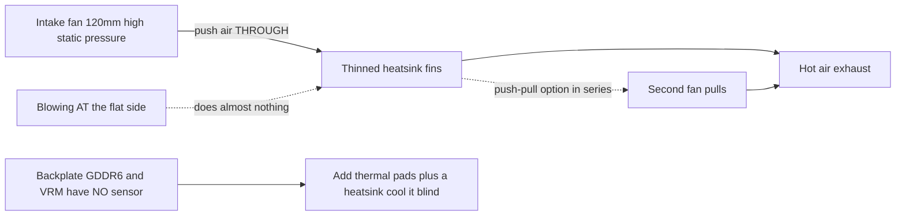

> 🌐 Topluluk çevirisi. İngilizce sürüm asıl kaynaktır ve daha güncel olabilir. Hata mı buldunuz? Bir [issue açın](https://github.com/lildebil0/awesome-bc250/issues). ([İngilizce orijinali](../en/04-cooling.md))

# Soğutma

> **Özet** — BC-250'nin stok soğutucu bloğu bir masa için değil, bir sunucu rack'inin zorlamalı hava tüneli için yapıldı. Kutudan çıktığı gibi throttle yapar. Topluluk düzeltmesi: **yoğun stok kanatçıkları inceltin** (eğeleyin/zımparalayın) ve içlerinden *boyunca* hava üfleyen bir **yüksek statik basınçlı 120 mm fan** cıvatalayın (**Arctic P12 Max/Pro** referanstır; Noctua NF-P12 redux sessiz premium alternatiftir). Bu tek başına, modlanmış bir kartı **Furmark'ta ~73 °C, oyunlarda 63–65 °C**'ye getirir. Sıvı AIO ve tam özel kasalar sonraki katmanlardır.

Soğutma, bir yeni gelenin **en çok yanlış yaptığı 1 numaralı şeydir**, bu yüzden overclock'ların peşine düşmeden önce bunu yapın.

---

## Stok soğutucu neden yeterli değil

BC-250 bir madencilik/sunucu kartıdır. Soğutucu bloğu **pasiftir** ve gürültülü fanların havayı içinden önden-arkaya zorladığı bir şaside oturmak üzere tasarlanmıştır. Hava akışı olmayan bir masada ısıyı emer ve GPU throttle yapar. Düz tarafa *doğru* bir fan üflemek neredeyse hiçbir şey yapmaz — havanın **kanatçık kanalları boyunca** seyahat etmesi gerekir, artı arka plaka üzerinden (arkadaki GDDR6'nın **sıcaklık sensörü yoktur**, dolayısıyla onu kör soğutursunuz).

Topluluk-gözlemli sınırlar: throttling ~**85 °C** civarında başlar, sert çökme/reset ~**90 °C** civarında olur. Yük sıcaklıklarını payla birlikte ~80 °C'nin altında tutun.

> **Üç soğutucu blok varyantı vardır** (8-sıra ve 9-sıra kanatçık). Hızlı kimlik: **PCIe 8 pin konnektörünün yanındaki bir QR kodu** 9-sıra varyantını işaretler. **Daha az, daha kalın kanatçıklı** varyant stokta biraz daha iyi soğutabilir. ([elektricM Cooling](https://elektricm.github.io/amd-bc250-docs/hardware/cooling/))

**Bileşen başına sıcaklık hedefleri** (elektricM'in test edilmiş rakamları, yukarıdaki throttle/çökme sınırlarından daha ince taneli):

| Bileşen | Boşta | Hafif yük | Oyun | Maks |
|-----------|------|-----------|--------|-----|
| GPU/APU kenarı | 40–50 °C | 50–60 °C | 65–80 °C | 90 °C |
| CPU (Tctl) | 45–55 °C | 55–65 °C | 70–85 °C | 95 °C |
| Bellek (alt taraf) | 40–55 °C | 50–65 °C | 55–70 °C | 80 °C |
| NVMe/SSD | 40–55 °C | 50–65 °C | 60–75 °C | 80 °C (kritik 81,8 °C) |

**Oyunlarda 70–80 °C GPU** hedefleyin. NVMe tavanı burada önemlidir çünkü **GDDR6 ve M.2 SSD, kartın sıcak arka tarafını paylaşır** — SSD en kötü termal noktada oturur ve pişebilir, bu yüzden onu izleyin (`80 °C` maks, sürücü spesine göre `81,8 °C` kritik). ([elektricM: sensors](https://elektricm.github.io/amd-bc250-docs/system/sensors/))

> **CPU Tctl merdiveni.** elektricM, **90 °C Tctl**'yi önerilen geri-çekilme noktası olarak işaretler; tablodaki **95 °C**, ağır oyunda hâlâ göreceğiniz üst kenardır; **TJmax = 100 °C**, mutlak silikon sınırıdır (aşağıdaki paket-güç tablosu, sürekli bir stres çalışmasında CPU'yu tam olarak orada sabitler). Yani: **90 °C = "şimdi geri çekil", 95 °C = "kırmızıya girdin", 100 °C = "duvardasın".** ([elektricM: sensors](https://elektricm.github.io/amd-bc250-docs/system/sensors/))

> **Termal duruma göre paket gücü** (elektricM her durumu bir kart güç çekimiyle eşleştirir): Boşta **50–70 W**, Hafif **100–150 W**, Ağır **150–200 W**, Stres **200–235 W**. PSU'yu boyutlandırmak ve kartın gerçekte ne kadar zorlandığını duvardan okumak için yararlı. ([elektricM: sensors](https://elektricm.github.io/amd-bc250-docs/system/sensors/))

> **Oyun sırasında piksel artefaktları = VRAM aşırı ısınması.** Arka taraftaki GDDR6'nın sensörü olmadığından, o görsel hata sizin uyarı işaretinizdir — arka plaka hava akışı/pedleri ekleyin (aşağıda). ([elektricM Cooling](https://elektricm.github.io/amd-bc250-docs/hardware/cooling/))

> **Silikon piyangosu — çip başına termal pay bütçeleyin.** Fiziksel olarak aynı iki kart, aynı şasi ve OC yapılandırması, **5–10 °C** ayrı çalışabilir ve daha sıcak olan, yeniden-macunlama/yeniden-pedlemeden sonra bile daha sıcak kaldı. Başka birinin sıcaklıklarının sizinkiyle eşleşeceğini varsaymayın. ([r/BC250Gaming](https://www.reddit.com/r/BC250Gaming/))



---

## Sürekli hesaplama farklı bir rejimdir (yalnızca oyun patlamaları değil)

Yukarıdaki hedefler, yükün patlamalar hâlinde geldiği **oyunu** varsayar. **Sürekli** hesaplama — döngülenen bir `llama-bench`, uzun Stable-Diffusion çalışmaları, GPU'yu onlarca dakika sabitleyen herhangi bir şey, **özellikle [40 CU açma](09-overclock-undervolt.md) ile** — çok daha sert bir yüktür ve bir oyun-sınıfı soğutucunun tuttuğunu aşabilir.

elektricM, stok bir soğutucu blok + **push-pull'da çift Arctic P12 Max**, **40 CU / 2 GHz**'te 10 dakikalık sürekli `llama-bench` ölçtü:

| Metrik | Ortalama | Zirve |
|--------|---------|------|
| GPU kenarı | 89,6 °C | 107 °C |
| Paket gücü | 136 W | 223 W |
| CPU | 96,7 °C | 100 °C (TJmax) |
| VRM MOSFET'leri | 57 °C | 58,5 °C |
| Fan hızı | ~2950 RPM | 2977 RPM (tavan) |

Paket throttle yaptıkça çıkış, çalışma boyunca **~%10** düştü. Çıkarım: **stok soğutucu blok + çift P12 Max, sürekli 40 CU @ 2 GHz için yeterli pay değildir** — ve **VRM'lerin sınırlarının yanına bile yaklaşmadığını** unutmayın (57 °C), dolayısıyla darboğaz fanlar ya da güç katı değil, *soğutucunun ısıyı atması*. İki düzeltme: **GPU governor'ı 1500 MHz'de sınırlayın** (40 CU yine de ~1,5× hesaplama ölçeklendirir, sıcaklıklar ~83 °C tutar — çift P12 Max'te süresiz sürdürülebilir) ya da **soğutucuyu yükseltin** (daha fazla kanatçık alanı). **24 CU stok oyun** için çift P12 Max rahattır; duvar yalnızca sürekli tam-CU hesaplama altında belirir. ([elektricM Cooling](https://elektricm.github.io/amd-bc250-docs/hardware/cooling/))

---

## Yol A — Hava modu (en popüler, en ucuz)

Bu, sohbetin çoğunun çalıştırdığı şeydir.

### 1. Stok kanatçıkları inceltin/temizleyin
Stok kanatçıklar fazla yoğun ve çoğu zaman düzensizdir. İnsanlar, havanın geçebilmesi için kanalları açar:

- **Orbital (eksantrik) zımpara** — en hızlısı, dakikalar içinde biter, en iyi sonuç. ([src](https://t.me/c/2424231195/31571))
- **Elle zımpara kâğıdı** — 60 kum sonra 240 kum, iki gün boyunca ~3–4 sa + 2 sa. Çalışır ama yavaş. ([src](https://t.me/c/2424231195/50330))
- **Makas / kesici** — kaba "чекрыжить" yöntemi, son çare; sonuçlar en kötüdür. ([src](https://t.me/c/2424231195/41252))
- **Makas + cetvel kılavuzu (temiz varyant)** — el işi/berber makasını kanatçık boşluğuna **bıçağa açılı dayanmış bir cetvel kılavuz olarak** kaydırın; bir çakı "konserve açacağı" da aynı şekilde işe yarar. Uyarı: bazı kart varyantlarında **bıçağı başlatacak boşluk yoktur** — bir tornavida/cımbızla birini açın ya da **küçük bir Dremel kesme diskiyle** bir giriş yuvası kesin. Kanatçık yuvalarından daha geniş bıçaklar soğutucuya zarar verebilir. ([r/BC250Gaming](https://www.reddit.com/r/BC250Gaming/))
- Bükülmüş kanatçıkları **düz bir cımbız + pense** ile düzeltin. ([src](https://t.me/c/2424231195/30670))
- **Kanatçıkları elle çekip çıkarın** — elektricM, yumuşak alüminyum kanatçıkların (soğutucu karttan ayrıyken) **elle temiz şekilde yırtılıp koparılabileceğini** belirtir, kesme aletlerinin yarattığı metal talaşı önler. Daha yavaş ama döküntüsüz. ([elektricM Cooling](https://elektricm.github.io/amd-bc250-docs/hardware/cooling/))
- **"Scooper by Justin"** — **özellikle BC-250 soğutucu blok kanatçıklarını bastırmak/açmak için yapılmış 3D-yazdırılabilir bir alet** ([Printables 1282906](https://www.printables.com/model/1282906-bc-250-scooper)). Çıplak bir tornavidadan daha güvenli: kanatçıklar arasındaki soğutucu **tabanını** çok sert iterek oymanızı engeller. ([r/linux_gaming topluluk konusu](https://www.reddit.com/r/linux_gaming/comments/1nvsgji/)) Beklentileri ayarlayın: bir sahip, yazdırılmış **"tarak/scooper" aletinin 2. kullanımda kırıldığını** ve elleri kastığını bildirdi. ([r/BC250Gaming](https://www.reddit.com/r/BC250Gaming/))
- **Hobi pensesi — "soyma" yöntemi** — kanatçıkların **üstünü** küçük hobi penseleriyle kavrayın ve **metalin kendi belleğini bir kırılma noktası olarak kullanarak** soyun, böylece tabanı yırtmak yerine bükülme noktasında temizce kopsunlar. Kesmeye döküntü-hafif bir alternatif. ([r/linux_gaming topluluk konusu](https://www.reddit.com/r/linux_gaming/comments/1nvsgji/))

Kaba sıcaklık getirisi (elektricM): **bükülmüş kanatçıkları düzeltmek ~5–10 °C**, **merkez kanatçıkları kaldırmak ~10–15 °C** (geri döndürülemez — iyi bir fan kanalı kesmeden benzer kazançlar verir), eski macun kuruduysa **taze macun ~5–10 °C**. ([elektricM Cooling](https://elektricm.github.io/amd-bc250-docs/hardware/cooling/))

> ⚠ **Önce soğutucuyu karttan çıkarın** (ya da kartı ve yongayı tamamen maskeleyin/koruyun) zımparalamadan/eğelemeden önce ve **yeniden montajdan önce her metal tozu zerresini temizleyin**. Karta oturan iletken metal talaşı onu kısa devre yapabilir ve **kartı öldürebilir** — bu zaten sohbette oldu.

<p align="center">
  <br>
  <sub>Fotoğraf: AMD BC-250 topluluğu · <a href="https://t.me/c/2424231195/31571">kaynak</a></sub>
</p>

### 2. Gerçek bir fan cıvatalayın
Kanatçıklar boyunca hava iten bir **120 mm yüksek statik basınçlı fan** monte edin. Referans seçim **Arctic P12 Max (ya da P12 Pro)**'dur — en yüksek statik basınç (~6,9 mm H₂O), bu yoğun soğutucu için topluluk + elektricM seçimi. **Noctua NF-P12 redux**, sessiz premium alternatiftir ve **Furmark'ta maks 73 °C, oyunlarda 63–65 °C** referans sonucunu paylaştı ([src](https://t.me/c/2424231195/42843)).

**Spec'leriyle somut fan seçimleri** (elektricM — *hava akışına* değil, *statik basınca* göre seçin):

| Fan | Boyut | Maks RPM | Statik basınç | Hava akışı | Gürültü | Oyun sıcaklıkları |
|-----|------|---------|----------------|---------|-------|--------------|
| **Arctic P12 Max** | 120 mm | 3300 | **6,9 mm H₂O** | 73,3 CFM | 52,5 dB(A) | 65–75 °C |
| **Arctic P12 Pro** | 120 mm | 2100 | **6,9 mm H₂O** | 68,9 CFM | 37,8 dB(A) | 65–75 °C |
| Arctic P14 PWM | 140 mm | 1700 | 2,40 mm H₂O | 72,8 CFM | 38 dB(A) | 70–80 °C |
| Noctua NF-A12x25 | 120 mm | 2000 | 2,34 mm H₂O | 60,1 CFM | 22,6 dB(A) | 70–85 °C |

elektricM'in **en çok önerdiği seçim Arctic P12 Max / P12 Pro**'dur — ~6,9 mm H₂O statik basıncı, Noctua'nın 2,34 mm'sini cüceleştirir ve çok daha ucuzdur; P12 Pro, daha sessiz, daha yaygın stoklanan sürümdür. Premium Noctua daha da sessizdir ama Arctic'le sıcaklıklarda yalnızca daha yüksek RPM'de eşleşir. ([elektricM Cooling](https://elektricm.github.io/amd-bc250-docs/hardware/cooling/))

**Topluluk build'lerinden diğer adıyla anılan fanlar** (insanların taktığı belirli modeller, Arctic/Noctua-P12 referansının ötesinde):

- **Noctua NF-A12x25 G2** (PWM), **120 mm yonga soğutucusu** olarak — A12x25'in daha yeni G2 revizyonu, ana fan olarak kullanıldı ([TiredDadTech](https://youtu.be/zi7sldeRd2w)). (Yukarıdaki fan tablosu yalnızca *orijinal* NF-A12x25'i listeler.)
- **Noctua NF-A6x15 PWM** (≈3500 rpm), **60 mm PSU-fanı değişimi** olarak — bağıran bir sunucu-brick fanının sessiz yerine geçeni ([TiredDadTech](https://youtu.be/zi7sldeRd2w)).
- **Thermalright 120 mm 1550 rpm ARGB**, bir bütçe yonga fanı olarak ve arka plaka için **6,0 W/mK termal pedler** — ikisi de bir **TMG HD build BOM**'undan ([build genel bakış](https://youtu.be/OEO0r01zcfU)).

> **Referans vs sessiz alternatif.** Buradaki referans fan **Arctic P12 Max/Pro**'dur — en yüksek statik basınç (~6,9 mm H₂O), en ucuz, bu yoğun soğutucu için topluluk + elektricM seçimi. **Noctua NF-P12 redux**, sessiz premium alternatiftir (sohbetin 73 °C Furmark sonucu), Arctic'le sıcaklıklarda yalnızca daha yüksek RPM'de eşleşir. En iyi fiyat/performans için Arctic, sessizlik en çok önemliyse Noctua seçin.

Fanın havayı etrafından sızdırmak yerine soğutucuya karşı sızdırmazlık sağlaması için bir **yazdırılmış fan kanalı/adaptörü** kullanın. Topluluk STL'leri:
- `Fan_Shroud_Single_120mm.stl`, `Fan_Shroud_Dual_120mm.stl`, `Fan_Shroud_Single_140mm.stl`, `Twin_120mm_Fan_Shroud.stl`
- `BC250_FanAdapter_120mm.step`, `bc250 cooler mount.stl`, `cooler adapter v3.0.stl`

> **Neden hava akışı derecesi değil, statik basınç?** Yoğun kanatçıklar yüksek dirençli bir yüktür. Yüksek hava akışlı bir "kasa fanı" onlara karşı durur; yüksek statik basınçlı bir fan (≥3 mm H₂O; Noctua P12, Arctic P12) havayı gerçekten içlerinden *iter*. Çok yoğun kanatçıklar için iki fanı **push-pull (seri)** olarak kullanmak statik basıncı iki katına çıkarır — burada doğru hamle budur, iki fanı yan yana değil.

**Montaj:** yazdırılmış bir kanal en iyisidir ama fanı soğutucuya **zip-bağ** ile bağlamak işe yarar ve fan ile kanatçıklar arasına bantlanmış bir **karton/köpük-pano kanalı** geçerli, bedava bir yedektir (çirkin, dayanıklı değil ama hava yolunu sızdırmaz yapar). ([elektricM Cooling](https://elektricm.github.io/amd-bc250-docs/hardware/cooling/))

> ⚠ **Fanları doğrudan kanatçıklara delmeyin/vidalamayın.** Alüminyum yumuşaktır ve kanatçıklar incedir — onlara vidalamak kanatçık yığınına zarar verir ve soğutmayı kötüleştirir. Zip-bağ ya da yazdırılmış bir kanal kullanın. ([elektricM Cooling](https://elektricm.github.io/amd-bc250-docs/hardware/cooling/))

> ### 🛠 Hava akışı mühendisliği — gerçekte iğneyi neyin oynattığı
>
> Hangi fan değil, havanın *nasıl* hareket ettiğine dair topluluk bulguları:
>
> - **Statik basınç, ham CFM'i yener** yoğun kanatçık yığını boyunca — bu yüzden yüksek statik basınçlı **Arctic P12 Max (6,9 mm H₂O)**, bu soğutucuda daha sessiz yüksek-hava-akışlı/düşük-basınçlı fanları geride bırakır.
> - **Bir merkezi fan, iki yan yana fanı yenebilir** tamamen-kesilmiş bir kanatçık düzleminde: tek bir merkezi fan **4 merkezi ısı borusunu** doğrudan yükler, oysa iki fan merkez üzerinde ölü bir plastik "dikiş" bırakır. Kanatçıkları ilk kez tam-düzlem kesen yapımcı, bir merkezi fanda iki fana göre birkaç °C **daha düşük** ölçtü ([src](https://t.me/c/2424231195/46175)). Bir teardown, hava akışı tarafından aynı sonuca varır: **yan yana cıvatalanmış iki fan birden iyi değildir** çünkü iki giriş buluştuğu **sıcak yonga merkezi üzerinde bir ölü bölge oluşur** — **aralarında bir boşluk bırakın ya da onun yerine push-pull yapın** ([Old Lamer — Part VII](https://youtu.be/pxahl9-YgkY) ~19:55). *(Altyazı-kaynaklı — kesin değil, niteliksel olarak ele alın.)*
> - **120 mm fan-hızı tabanı ≈1800 RPM** bu yoğun yığından gerçekten hava geçirmek için; **Arctic P12 Pro** (8–10 $, **600–3000 rpm** aralığı), sessiz boşta kalan ve hâlâ paya sahip kolay bir seçimdir ([Old Lamer — Part VII](https://youtu.be/pxahl9-YgkY)). *(ASR rakamları — yaklaşık.)*
> - **Bir egzoz fanı ekleyin = −3 ila −5 °C.** Yalnızca-giriş **73 °C** → egzozla **67–68 °C** ([src](https://t.me/c/2424231195/68183), [src](https://t.me/c/2424231195/31553)). Yani optimal basit kurulum, yan yana iki giriş değil, **1 merkezi giriş + 1 arka egzozdur**.
> - **Arka plaka kör ve sıcaktır.** VRM MOSFET'leri soğutulmadan **~100 °C**'ye ulaşır ([src](https://t.me/c/2424231195/110955)) — **mutlaka** pedler + soğutucular + özel hava akışı almalıdır; arka soğutucularla yük altında *"soğuk"* çalışır ([src](https://t.me/c/2424231195/93056)).
> - **Bedava fizik.** Sıcak hava yükselir, dolayısıyla bir **eğim/baca** yönelimi bile yardımcı olur — zar zor havalandırılan bir arka plaka, yalnızca konveksiyondan **47 °C** ölçtü ([src](https://t.me/c/2424231195/76962)). Ve **siyah-anodize bir radyatör**, parlatılmışın **~1,8 katı** ışınım yayar, bu da pasif/yarı-pasif kompakt build'lerde kanatçık alanını **~%45** küçültmenizi sağlar ([src](https://t.me/c/2424231195/86878)).
> - **Girişi > egzozdan çalıştırın** (hafif **pozitif basınç**) böylece sensörsüz VRM/VRAM taze havaya banılı kalır.

### Alternatif: stok kanatçıkları koruyun (kesmesiz push-pull kasa)
Kanatçıkları kesmek zorunlu değildir. **penzoiders**, soğutucuyu **kesmeyen** bir kasa tasarladı ([MakerWorld, FreeCAD kaynağı](https://makerworld.com/models/2505974)): **stok, modifiye edilmemiş kanatçıklar** boyunca hava zorlamak için **push-pull yüksek statik basınçlı fanlar** kullanır, artı arka plakayı da soğutan bir **iki-bölmeli basınç farkı** (5 mm soğutucular + termal pedler; yeniden kullanılan NVMe soğutucuları işe yarar). Soğuk kalan bir ayar: **CPU 3800 MHz / 1050 mV, GPU 2100 MHz / 950 mV** → paralel Furmark + `stress-ng` **85 °C'nin altında** kalır; oyun **kabaca %50 fan görev döngüsünde ~75 °C** (CoolerControl eğrisi), "zar zor duyulur". ([r/BC250Gaming](https://www.reddit.com/r/BC250Gaming/))

## Yol B — AIO sıvı soğutucu

Bir adaptör braketi üzerinden yongaya monte edilmiş 120 mm bir AIO. Sessiz ve soğuk ama daha fazla parça ve maliyet. Popüler build'ler ucuz AIO'lar kullanır (örn. aigo). ([örnek src](https://t.me/c/2424231195/19336))

<p align="center">
  <br>
  <sub>Fotoğraf: AMD BC-250 topluluğu · <a href="https://t.me/c/2424231195/19336">kaynak</a></sub>
</p>

**Adıyla anılan, indirilebilir AIO braketi — NexGen3D** ([Printables 1554003](https://www.printables.com/model/1554003), ABS-GF veya PETG ile yazdırın). Bir **Thermalright 240 mm AIO** ile doğrulandı: GPU **~50 °C @ 2000 MHz**, CPU **maks 60 °C**. ([r/BC250Gaming](https://www.reddit.com/r/BC250Gaming/))

### Sıvı-soğutmalı overclock profilleri
Bir AIO ile çok daha sert zorlayabilirsiniz. **NexGen3D** duvar-ölçümlü (yakma kombosu olarak Furmark Vulkan + `stress-ng --matrix 0 -t 60m`):

| Profil | CPU | GPU | Maks yakma sıcaklığı | Duvar gücü | Not |
|---------|-----|-----|---------------|------------|------|
| 1 | 4000 MHz | 2400 MHz | ~65 °C | >350 W | "ölü sessiz" |
| 2 | 4100 MHz | 2450 MHz | ~75 °C | <400 W | daha sıcak, daha gürültülü |

Normal 1080p oyun, bu yakma sıcaklıklarının **10–15 °C altında** ve Profil 1'de **250 W'ın altında** çalışır. **Kopyalanmaya değer hava akışı şeması:** 120 mm fanlar **radyatör boyunca dışarı egzoz eder**, ki bu da **VRM'ler / PSU / VRAM arka plakası** boyunca taze harici havayı içeri çeker; ayrı bir **80 mm fan (Arctic P8 Max)** GPU VRM'lerini soğutur — bu, yukarıdaki "sensörsüz VRM/VRAM hâlâ hava akışı gerektirir" uyarısını yanıtlar. ([r/BC250Gaming](https://www.reddit.com/r/BC250Gaming/))

## Özel su döngüsü (ileri düzey)

Kapalı bir AIO'nun ötesinde, birkaç kişi **tam özel bir döngü** çalıştırır. Bu gerçek ama **DIY/uzman** bir sahnedir: yapımcılar, tek bir blokta hem **yonga *hem* VRM**'yi kaplayan **özel bir su bloğunu CNC ile frezeler ya da lehimler** ([src](https://t.me/c/2424231195/131065), [src](https://t.me/c/2424231195/131844), [src](https://t.me/c/2424231195/118582)). Bağlantılar kritik değildir — *"neredeyse her şeyi kaynaklayabilir, tornalayabilir ya da yapıştırabilirsiniz"* ([src](https://t.me/c/2424231195/132007)).

**Ne kazandırdığı:** kaba bir özel döngü, **fanlar yalnızca %30'dayken yük altında ~50 °C'ye ulaşır, harici pompa neredeyse sessiz** ([src](https://t.me/c/2424231195/133040)). (Bir yapımcı sonra varsayılan cyan-skillfish governor yapılandırmasında yük altında VRM bobinlerinden coil-whine fark etti — *ayrı* bir sorun, termal değil.) Ayrıca bir **Corsair Commander'a ihtiyacınız yoktur**: BC-250'nin kendi [fan kontrolü](#fan-hızını-kontrol-etme-yazılım), pompayı artı **~5 fanı** sürebilir ([src](https://t.me/c/2424231195/140123)).

> ⚠ **Bu neden "ileri düzey": BC-250 bir soğutucu sıvı selinden sağ çıkmaz.** Topluluktan gerçek arızalar: bir hortum **90°'de kıvrıldı, patladı ve GPU ile PSU'yu sular altında bıraktı** ([src](https://t.me/c/2424231195/81158)); **sıkışmış bir Corsair AIO pompası CPU'yu pişirdi** ([src](https://t.me/c/2424231195/133147), [src](https://t.me/c/2424231195/126053)). Ayrıca **~%50 pompa hızının üzerinde pompa kavitasyonuna/gürültüsüne** dikkat edin ([src](https://t.me/c/2424231195/7034)). **İlk ıslak açılıştan önce tüm döngüyü kartın DIŞINDA 24 saat sızıntı-testi yapın.**

**Karar:** herhangi bir seçeneğin en düşük sıcaklıkları ve en sessizi ve sürekli 40-CU'yu mümkün kılar — ama en yüksek risk ve çaba. **İlk build değil.**

## Yol C — Blower ("улитка") — önerilmez

Kurtarılmış GPU blower fanları erken bir deneydi. Sonuca göre gürültülü; insanlar Yol A'ya geçti. ([src](https://t.me/c/2424231195/100086))

## Yol D — Kule soğutucu dönüşümü (ileri düzey)

Bazı kullanıcılar, hazır donanım kullanarak mükemmel, sessiz soğutma için yongaya bir **AM4 kule soğutucusu** (örn. **Thermalright Peerless Assassin** ya da diğer AM4/AM5 kuleleri) cıvatalar. Püf noktası: onu **bir braket üzerinden monte etmelisiniz** ve uzun bir kule **M.2 yuvasını ya da diğer bileşenleri engelleyebilir**. Bir başlangıç modu değil. Artık sıfırdan bir tane imal etmek zorunda değilsiniz — iki yayınlanmış 3D-yazdırılmış braket var:

- **AM4/AM5 masaüstü-soğutucu adaptörü** ([MakerWorld 2596083](https://makerworld.com/en/models/2596083), FreeCAD kaynağı dahil). Standart bir masaüstü AM4/AM5 soğutucusunu BC-250'ye monte eder. Sabitleme: **M5 cıvata + somun, ara parça yok** (OP, M4'ün ideal olacağını ama M5'in sıkı bir uyum olduğunu belirtir). **ABS, PETG ya da ASA** ile yazdırın. **CPU 3,95 GHz / 1,150 V, GPU 2200 MHz / 1000 mV, sıcaklıklar 80 °C'yi aşmaz** olarak doğrulandı. Kullanılan soğutucular: düşük-profilli bir **AXP90-sınıfı** (bir yorumcu **AXP120** kullandı) ve bir **AMD Wraith Spire** bile stok soğutucuyu geride bıraktı. ([r/BC250Gaming](https://www.reddit.com/r/BC250Gaming/))
- **Thermalright AXP90-X53 montajı** ([Printables 1694793](https://www.printables.com/model/1694793)). Diş eklemeleri, yazdırılmış braketin **alt tarafına lehimlenir**, böylece **orijinal yaylı stok-soğutucu vidalarını yeniden kullanırsınız**; düğme-başlı cıvatalar alttan gelir ve gömülür ve braketin, kart bileşenlerini temizlemek için **destek altında 0,5 mm boşluğu** vardır. Fusion 360'ta tasarlandı, **PETG ile yazdırın** (PLA bu sıcaklıklarda yumuşar). Sonuç: **tam yük altında 2150 MHz'de, 1080p'de 65–67 °C**, çok sessiz (bakır soğutucu, bir 120 mm Arctic P12 Pro ile eşleştirilmiş). Ölçülen yığın yüksekliği **PCB'den 15 mm fanın tepesine 54 mm** — kasa uyumu için yararlı. Bir **3-kalınlık varyant seti** ve bir **AXP120-X67** sürümü de var. ([r/BC250Gaming](https://www.reddit.com/r/BC250Gaming/))

---

## Fan hızını kontrol etme (yazılım)

Bir fan cıvatalandıktan sonra, PWM'sini kartın **Nuvoton NCT6686D** Super I/O çipi üzerinden kontrol edersiniz — ama **hangi sürücüyü yüklediğiniz önemlidir** ([elektricM donanım spesifikasyonu](https://elektricm.github.io/amd-bc250-docs/)):

- **Yalnızca-okuma sensörleri** (fan RPM, sıcaklıklar): `force=true` ile yüklenen çekirdek-içi **`nct6683`** modülü. Okumaları bildirir ama **PWM yazamaz**, dolayısıyla fan, BIOS/firmware'in ayarladığı her ne ise onda kalır.
- **Okuma + yazma PWM** (gerçekten fan hızını ayarla): **[Fred78290/nct6687d](https://github.com/Fred78290/nct6687d)**'den çekirdek-dışı **`nct6687`** modülünü, yine `force=true` ile kullanın. Yalnızca izleme değil, fan eğrileri / manuel hız kontrolü isterseniz inşa edeceğiniz budur.

```bash
# monitoring only (in-kernel):
echo 'options nct6683 force=true' | sudo tee /etc/modprobe.d/nct6683.conf
# PWM control (DKMS from Fred78290/nct6687d):
echo 'options nct6687 force=true' | sudo tee /etc/modprobe.d/nct6687.conf
```

> İkisini birden yüklemeyin — yalnızca-okuma sensörleri için `nct6683` ya da okuma+yazma için `nct6687` seçin. Sensör kablolaması (`CPU_FAN1` / `J4003`) ve BIOS↔Linux fan numaralandırması, [06-linux.md](06-linux.md)'nin doğrulama adımındadır.

**Hangi başlık ana fandır?** elektricM, soğutma fanının genellikle **Pump Fan** başlığında = sysfs'te **`fan2` / `pwm2`** olduğunu bildirir; `CPU Fan` (`fan1`) ve `System Fan` başlıkları (`fan3`+) tipik olarak kullanılmaz. PWM yazmadan önce manuel modu etkinleştirin (`echo 1 > .../pwm2_enable`, sonra `.../pwm2`'ye bir 0–255 değeri). hwmon numaralandırması yeniden başlatmalar arasında kayabilir — `cat /sys/class/hwmon/hwmon*/name` ile doğrulayın. ([elektricM Cooling](https://elektricm.github.io/amd-bc250-docs/hardware/cooling/))

**Bir GUI ile fan eğrileri — CoolerControl.** `nct6687` yüklendikten sonra, **CoolerControl** grafik fan eğrileri verir: **nct6686** cihazını seçin, kaynak olarak **k10temp Tctl** kullanarak **pwm2** üzerinde bir eğri oluşturun. Kurulum: `ujust install-coolercontrol` (Bazzite), `codifryed/CoolerControl` copr (Fedora) ya da AUR'dan `coolercontrol` (Arch); web arayüzü `https://localhost:11987`. ([elektricM Cooling](https://elektricm.github.io/amd-bc250-docs/hardware/cooling/))

**BIOS fan modları** (işletim sistemi tarafı kontrol çalıştırmıyorsanız): **Default**, fanları **%40 minimumda** tutar (çok düşük — önerilmez), **Full Speed** onları %100'de sabitler (gürültülü ama güvenli), **Customize** eşik başına hızları ayarlar. ([elektricM Cooling](https://elektricm.github.io/amd-bc250-docs/hardware/cooling/))

> ⚠ **BIOS Customize modunu ve CoolerControl'ü aynı anda çalıştırmayın** — PWM kontrolü için çekişirler. Birini seçin. ([elektricM Cooling](https://elektricm.github.io/amd-bc250-docs/hardware/cooling/))

---

## Termal arayüz (macun, pedler, faz-değişimi, sıvı metal)

Hangi fanı/soğutucuyu çalıştırırsanız çalıştırın, yonga ile soğutucu arasındaki — ve kartın arkası ile herhangi bir arka plaka radyatörü arasındaki — **termal arayüz malzemesini (TIM)** doğru yapmaya değer. BC-250 yongasının **yüksek ısı yoğunluğu** vardır, dolayısıyla iyi bir TIM, bedava birkaç derecedir.

> **Sadece stok macunu değiştirmek bile yardımcı olur.** Bir sahip, bir yıl sonra fabrika macununu değiştirdi ve yük sıcaklıkları, başka her şey aynıyken **~4–5 °C** düştü. ([src](https://t.me/c/2424231195/88565))

### İşe yarayan macunlar
- **Arctic MX-6** — sıradan üst düzey bir macun. Bir kasalı build'de **Furmark'ta 87–88 °C** tuttu; aynı sahip, PTM7950'nin bunun üzerinden bir ~4 °C daha alacağını belirtti. ([src](https://t.me/c/2424231195/30211))
- **Stok macun + stok pedler**, belgelenmiş taban çizgisidir: 10 dakikalık yükten sonra ~**76 °C**, ~**55 °C** boşta (kanatçık/fan modlamadan önce). ([src](https://t.me/c/2424231195/22992))
- elektricM'in burada iyi olarak listelediği diğer macunlar: **Arctic MX-4** (değer), **Thermal Grizzly Kryonaut** (premium), **Noctua NT-H1** (güvenilir), **Thermalright TFX** (bütçe). Kullanılmış-kart macunu **çoğu zaman kurumuştur** — sadece yeniden-macunlamak **~5–10 °C**'ye değer. Yongaya bezelye boyutunda bir nokta uygulayın, eşit monte edin, vidaları bir **X deseninde** sıkın. ([elektricM Cooling](https://elektricm.github.io/amd-bc250-docs/hardware/cooling/))

### PTM7950 — topluluk favorisi (önerilen)
**PTM7950**, bir **faz-değişimli peddir** (Honeywell grafit/faz-değişimi filmi). Oda sıcaklığında ince katı bir tabakadır; yük altında (~45–55 °C) yumuşar ve mikron-ince bir katmana akar, sonra yerinde kalır. Sıcak, termal-döngülemeli bir yonga altında tam olarak istediğiniz şey olan **pompalanıp dışarı çıkmaz** ya da gres gibi kurumaz — dolayısıyla onu bir kez uygular ve unutursunuz. Sohbetin açık özeti: *"PTM7950 ve fazla kafa yormayın"* ([src](https://t.me/c/2424231195/101582)); faz-değişimi genel öneridir ([src](https://t.me/c/2424231195/61511)).

**Nasıl uygulanır:**
1. Yongayı ve soğutucu tabanını temizleyin (izopropil alkol), kurumaya bırakın.
2. PTM7950'den yonga boyutunda bir kare kesin — **~26×30 mm**'lik bir parça BC-250 yongasını kaplar ([src](https://t.me/c/2424231195/125748)).
3. Bir koruyucu filmi soyun, pedi yongaya koyun, ikinci filmi soyun.
4. Soğutucuyu monte edin ve eşit şekilde torklayın. **Yaymak yok** — işi ilk ısı döngüsü yapar. En iyi sıcaklıkları birkaç yük/boşta döngüsünden ("burn-in") sonra bekleyin.

PTM7950 üzerine (Honeywell, 26×30) artı bir arka plaka radyatörü olan bir referans kasalı build, CPU 3850 MHz / GPU 2100 MHz'te bir saat boyunca **~84 °C, oyunlarda 66–71 °C**'de zirve yapar. ([src](https://t.me/c/2424231195/125748))

> **Adıyla anılan eşleşme: soğutucu altında Upsiren macunu + yongada PTM7950.** Bir build videosu, boşluk-doldurma noktaları için **Upsiren UTP-6 / UTP-8 termal macununu** (**UTP-8** sınıfı ≈**14,8 W/mK** olarak derecelendirilir) yongaya yatırılmış bir **40×80×0,25 mm kesilmiş PTM7950 tabakası** ile eşleştirir ([PTM7950 + Upsiren videosu](https://youtu.be/FJapqZSdt6I)). Macun, bir soğutucuya/plakaya düzensiz boşlukları doldurmak içindir; faz-değişimi filmi yonganın kendisine gider.
>
> - **Ucuz AliExpress PTM7950 işe yarar.** ~**13 $**'lık bir AliExpress tabakasının performans gösterdiği doğrulandı — markalı Honeywell kesimine ihtiyacınız yok ([PTM7950 + Upsiren videosu](https://youtu.be/FJapqZSdt6I)).
> - **PTM7950 oturma süresi gerektirir.** En iyi sıcaklıklarına yalnızca **birkaç ısıtma/soğutma döngüsünden** sonra ulaşır — onu ilk çalışmada yargılamayın ([dizüstü TIM demosu](https://youtu.be/U4Zm8msXJHM)).
>
> *(Her iki kaynak da otomatik-altyazılı — kesin W/mK ve boyutları yaklaşık olarak ele alın.)*

### Arka plaka ve GDDR6 pedleri (arkayı kör soğutun)
Kartın arkasındaki **GDDR6 ve VRM'nin sıcaklık sensörü yoktur** — onları kör soğutursunuz. Arka taraftaki ısının gidecek bir yeri olması için **termal pedlerle** birleştirilmiş bir **arka plaka soğutucusu/radyatörü** ekleyin. ([src](https://t.me/c/2424231195/125748)) Bir RU yapımcısı, basitçe **Yandex.Market'ten bir soğutucu** kaptı, onu arka plakaya yapıştırdı ve **alt plakayı iyi soğuttu** — makul boyutta herhangi bir alüminyum soğutucu burada işi yapar ([4pda — mananoid1](https://4pda.to/forum/index.php?showtopic=1104980)).

Bildirilen ped kalınlıkları (topluluk tarafından paylaşıldı, "bunu kaydettim" tepkisi):
- **VRM: 1 mm**
- **GDDR6: 2 mm** ([src](https://t.me/c/2424231195/121181))

> ⚠ **doğrulayın** — bu kalınlıklar *sizin* belirli arka plakanıza/radyatörünüze olan boşluğa bağlıdır. Bir yığın ped almadan önce bir boşluk ölçümüyle (ya da bir macun/kil testiyle) doğrulayın.

elektricM, belleğin kendisini soğutmak için **biraz farklı bir ped şeması** verir: **kartın *önünde* 1,5 mm pedler, *arkasında* 2,0 mm**, sonra alt tarafa bir alüminyum plaka/soğutucu. Kartın yakınında **yalnızca iletken-olmayan** pedler kullanın (asla bileşenleri kısa devre yapabilecek iletken macun/pedler değil). Listelediği ped markaları: **Thermalright Odyssey** (yüksek performans), **Arctic Thermal Pad** (değer), **Gelid GP-Ultimate** (premium). ([elektricM Cooling](https://elektricm.github.io/amd-bc250-docs/hardware/cooling/))

> ⚠ **doğrulayın (ped kalınlıkları kaynaklar arasında farklılık gösterir)** — sohbet-kaynaklı sayılarımız **VRM 1 mm / GDDR6 2 mm (arka)**; elektricM bellek çipleri için **1,5 mm ön / 2,0 mm arka** belirtir. Farklı build'ler, farklı boşluklar — ikisini de kör güvenmek yerine **kendi açıklığınızı ölçün**.

> **30–60 dakikalık oyundan sonra çökme/kararsızlık** (genellikle piksel artefaktlarıyla) klasik **bellek-aşırı-ısınma** imzasıdır. Düzeltmeler: pedler + bir alt taraf plakası ekleyin, bir arka plaka fanı ekleyin, kasa hava akışını iyileştirin ya da geçici olarak **VRAM bölünmesini azaltın** (örn. 4 GB → 512 MB) bellek ısısını kesmek için. ([elektricM Cooling](https://elektricm.github.io/amd-bc250-docs/hardware/cooling/))

### Sıvı metal — burada genellikle ÖNERİLMEZ
Sıvı metal (LM), PS5'in (aynı-aile APU) onu kullanması nedeniyle gündeme gelir ([src](https://t.me/c/2424231195/18105)) ve ham performansta macun/PTM'yi geride bırakır ([src](https://t.me/c/2424231195/124112)). İnsanlar BC-250'de onu sordu ve denedi ([src](https://t.me/c/2424231195/18098), [src](https://t.me/c/2424231195/77180)).

**Ama bu kartta yanlış bir karardır:**
- LM **elektriksel olarak iletkendir**. BC-250 yongası, **yoğun GDDR6 ve VRM**'nin tam yanında oturur; yongadan kaçan bir damla kartı kısa devre yapar (metal-talaş uyarısı gibi aynı "belleğin yakınındaki iletken şey onu öldürür" riski).
- **Pompalanıp çıkar / kabaca yılda bir yeniden yapılması gerekir** ve çıplak alüminyuma saldırır — PTM7950 savunucusu bile tam olarak bu zahmet nedeniyle kendi donanımında LM'yi bıraktı, PTM7950 / KryoSheet'e geçti. ([src](https://t.me/c/2424231195/69688))
- "Herkes sıvı metalle çalışma işini bile üstlenmez." ([src](https://t.me/c/2424231195/106787))

**Sonuç:** **PTM7950 daha güvenli yüksek-performans seçimidir** — faydanın ~%99'u, kısa-devre/bakım riskinin hiçbiri. LM'yi yalnızca tam olarak ne yaptığını zaten bilenlere ayırın.

---

## Soğutmanızı nasıl test edersiniz (topluluk yöntemi, sabitlenmiş)

Sabitlenmiş prosedürden ([src](https://t.me/c/2424231195/108407)):

1. **GPU stresi:** Furmark (Vulkan / "Furmark VK").
2. **Aynı anda CPU:** bir CPU bench (cpu-x) ya da `stress`/`pipx`-tabanlı bir yük ekleyin — APU tek bir soğutucuyu paylaşır, dolayısıyla ikisini birlikte test edin.
   - Bu araçlar (Furmark, OCCT, cpu-x, `stress`), taze bir Linux makinesinde **önceden kurulu değildir** — önce paket yöneticiniz ya da Flatpak üzerinden kurun.
3. **Stokta değil, overclock'unuz altında test edin** — 1500 MHz zayıftır; **2000 MHz ~+%30 FPS'tir** ve gerçekte çalıştıracağınız budur, dolayısıyla onun için soğutun.
4. Sıcaklıkları izleyin; ~85 °C'yi geçerseniz throttle yapıyorsunuz — fan/kanal/kanatçık işi ekleyin.

> ℹ️ **İki farklı "+%30" iddiasını karıştırmayın.** Buradaki **GPU-saati +%30** (1500 → 2000 MHz, FPS'i kabaca üçte bir artırarak) overclock'tan bir *performans* kazancıdır. Ayrı bir dizüstü-TIM gösteriminde bir **yeniden-macun** için alıntılanan **~+%30 termal iyileştirme** ile **aynı değildir** ([dizüstü TIM demosu](https://youtu.be/U4Zm8msXJHM)) — o, farklı donanımda bir *sıcaklık* sonucudur. Aynı sayı, ilgisiz şeyler.

Konuda sabitlenmiş, en basit yöntemin kısa bir video anlatımı da var. ([src](https://t.me/c/2424231195/100024))

---

## Önerilen başlangıç kurulumu

| Katman | Bunu yap | Bekle |
|------|---------|--------|
| Minimum | Kanatçıkları zımparala (orbital zımpara) + 1× Arctic P12 Max/Pro (ya da Noctua NF-P12) + yazdırılmış kanal | ~73 °C Furmark |
| Daha iyi | Kanal boyunca push-pull (2× P12) | aynı sıcaklıkta daha düşük, daha sessiz |
| Maks | Adaptör üzerinde 120 mm AIO | en soğuk, daha fazla build çabası |

---

## Kaynaklar

- Sabitlenmiş test yöntemi — https://t.me/c/2424231195/108407 · video — https://t.me/c/2424231195/100024
- Kanatçık aletleri — https://t.me/c/2424231195/31571 · https://t.me/c/2424231195/30670 · https://t.me/c/2424231195/50330 · "Scooper by Justin" kanatçık aleti ([Printables 1282906](https://www.printables.com/model/1282906-bc-250-scooper)) + hobi-pensesi soyma yöntemi — [r/linux_gaming konusu](https://www.reddit.com/r/linux_gaming/comments/1nvsgji/)
- Noctua P12 sonucu — https://t.me/c/2424231195/42843
- AIO örneği — https://t.me/c/2424231195/19336
- Termal arayüz — yeniden-macun −4–5 °C https://t.me/c/2424231195/88565 · MX-6 https://t.me/c/2424231195/30211 · stok taban çizgisi https://t.me/c/2424231195/22992 · PTM7950 https://t.me/c/2424231195/101582 · https://t.me/c/2424231195/61511 · PTM7950 build + arka plaka https://t.me/c/2424231195/125748 · ped kalınlığı https://t.me/c/2424231195/121181 · sıvı metal https://t.me/c/2424231195/18098 · https://t.me/c/2424231195/69688
- elektricM soğutma rehberi (soğutucu varyantları, bileşen başına sıcaklık tablosu, sürekli-yük verisi, fan spec'leri, CoolerControl/BIOS fan modları, kule soğutucu, ped şeması) — https://elektricm.github.io/amd-bc250-docs/hardware/cooling/
- [elektricM: sensors](https://elektricm.github.io/amd-bc250-docs/system/sensors/) (termal eşikler: CPU Tctl 90 °C maks / TJmax 100 °C, NVMe/SSD 80 °C maks / 81,8 °C kritik, termal duruma göre paket gücü)
- r/BC250Gaming (topluluk raporları: silikon-piyangosu varyansı, makas+cetvel kanatçık yöntemi, tarak-aleti kırılması, kesmesiz push-pull kasa, AIO braketi + 240 mm sonucu, sıvı OC profilleri, AM4/AM5 + AXP90-X53 braketleri) — https://www.reddit.com/r/BC250Gaming/ · AM4/AM5 soğutucu adaptörü [MakerWorld 2596083](https://makerworld.com/en/models/2596083) · AXP90-X53 montajı [Printables 1694793](https://www.printables.com/model/1694793) · NexGen3D AIO braketi [Printables 1554003](https://www.printables.com/model/1554003) · kesmesiz push-pull kasa [MakerWorld 2505974](https://makerworld.com/models/2505974)
- Donanım referansı — [mothenjoyer69/bc250-documentation `hardware.md`](https://github.com/mothenjoyer69/bc250-documentation/blob/main/hardware.md)
- Soğutmalı kasalar/adaptörler — [onemorecap/bc-250-sleeve-adapter](https://github.com/onemorecap/bc-250-sleeve-adapter)
- Yonga üzerinde yan yana iki fan ölü bölgesi / boşluk bırak ya da push-pull, 120 mm ≈1800 RPM tabanı, Arctic P12 Pro (8–10 $, 600–3000 rpm) — [Old Lamer — Part VII](https://youtu.be/pxahl9-YgkY) (otomatik-altyazı / ASR — rakamlar yaklaşık)
- Upsiren UTP-6 / UTP-8 macunu (UTP-8 ≈14,8 W/mK) + yongada 40×80×0,25 mm kesilmiş PTM7950, ucuz AliExpress PTM7950 (~13 $) doğrulandı — [PTM7950 + Upsiren videosu](https://youtu.be/FJapqZSdt6I) · PTM7950 birkaç ısıtma/soğutma oturma döngüsü gerektirir + ayrı yeniden-macun "+%30" (dizüstü, GPU-saati +%30 değil) — [dizüstü TIM demosu](https://youtu.be/U4Zm8msXJHM)
- Adıyla anılan fanlar: Noctua NF-A12x25 G2 (120 mm yonga soğutucusu) + NF-A6x15 PWM 3500 rpm (60 mm PSU-fan değişimi) — [TiredDadTech](https://youtu.be/zi7sldeRd2w) · Thermalright 120 mm 1550 rpm ARGB + 6,0 W/mK pedler (TMG HD build BOM) — [build genel bakış](https://youtu.be/OEO0r01zcfU)
- RU arka plaka radyatörü (Yandex.Market soğutucusu alt plakayı soğuttu) — [4pda — mananoid1](https://4pda.to/forum/index.php?showtopic=1104980)

> Fan-kanalı ve adaptör STL'leri [05-case.md](05-case.md) içinde kataloglanmıştır ve `assets/stl/` altında yansıtılmıştır.
