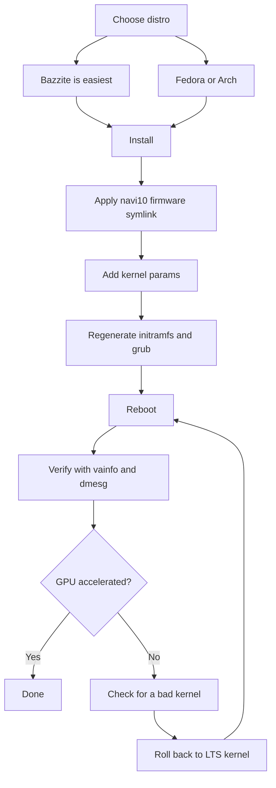

> 🌐 Topluluk çevirisi. İngilizce sürüm asıl kaynaktır ve daha güncel olabilir. Hata mı buldunuz? Bir [issue açın](https://github.com/lildebil0/awesome-bc250/issues). ([İngilizce orijinali](../en/06-linux.md))

# Linux Sürücüleri ve Kurulum

> **Özet** — Çoğu insan BC-250'yi Linux'ta çalıştırır ve *GPU düzeltildikten sonra* iyi çalışır. Kutudan çıktığı gibi `amdgpu` çipi tanımaz ve CPU-render'lı, tek-haneli FPS alırsınız. İki şey onu gerçek yapar: **modern bir çekirdek + taze Mesa (25.1+)** ve **`amdgpu` düzeltmesi** — sürücünün yüklenebilmesi için bir firmware sembolik bağlantısı (`navi10_gpu_info.bin` → `cyan_skillfish_gpu_info.bin`) artı çekirdek parametreleri (`amdgpu.sg_display=0`, `mitigations=off` ve yeni çekirdeklerde `amdgpu.bc250_cc_write_mode=3`). Bir yeni gelen için en kolay yol: **[Bazzite](https://bazzite.gg/)** flashleyin ve özel **`bazzite-bc250`** imajına rebase edin — düzeltmeler içine işlenmiştir. Makineyi öğrenmek isterseniz: bir kerelik bir kurulum scriptiyle **Fedora** ya da **CachyOS/EndeavourOS (Arch)**.

Bu, "bir kutuda bir kart"ı çalışan bir masaüstüne dönüştüren bölümdür. Önce [soğutma](04-cooling.md) ve [güç](03-power-supply.md)'ü yapın — sonra bunu.

> **Hiç Linux kullanmadınız mı? 60 saniyelik bir hayatta kalma kiti.**
> - **Bir terminal açın:** menünüzde *Terminal* / *Konsole* (KDE) / *Console* adlı bir uygulama arayın ya da `Ctrl-Alt-T`'ye basın.
> - Bir komutun önündeki **`sudo`**, onu yönetici olarak çalıştırır. Şifrenizi soracaktır — ve **siz yazarken, ekranda hiçbir şey görünmez** (nokta yok, yıldız yok). Bu normaldir; yazın ve Enter'a basın.
> - **`nano /etc/...`**, terminalde düz bir metin düzenleyici açar. Kaydedip çıkmak için: **Ctrl-O**, sonra **Enter**, sonra **Ctrl-X**.
> - Bir terminale **kopyala-yapıştır** genellikle **Ctrl-Shift-V**'dir (Ctrl-V değil).
> - Birçok adım yalnızca bir **yeniden başlatma**'dan (`systemctl reboot`) sonra etkili olur. Bir adım "yeniden başlatın" dediğinde, çalışıp çalışmadığını yargılamadan önce gerçekten yeniden başlatın.

---

## Anlamanız gereken tek şey

BC-250'nin GPU'su **Cyan Skillfish / Oberon**'dur (PlayStation 5 türevi bir RDNA2 parçası). Mainline `amdgpu`'nun tarihsel olarak **onun için adlandırılmış bir firmware blob'u yoktu**, dolayısıyla stok bir kurulumda çekirdek GPU'yu başlatamaz ve masaüstü yazılım (LLVMpipe) render'a geri döner — her şey yavaştır ve `vulkaninfo` gerçek bir cihaz göstermez. Bir kullanıcı, dağıtımının basitçe GPU firmware'ini yükleyemeyen bir çekirdeği önyüklediğini fark etmeden önce günlerce "bozuk sürücüler" ile uğraştı ([src](https://t.me/c/2424231195/98466)).

Yani her çalışan kurulum, bir biçimde aynı üç şeyi yapar:

1. **Yeterince yeni bir çekirdek + Mesa çalıştırın.** Upstream Mesa, BC-250 desteğini **25.1**'de kazandı (o zamandan beri yama gerekmez; **25.3.x** mevcut önerilen kararlıdır) — ([Mesa MR !33116](https://gitlab.freedesktop.org/mesa/mesa/-/merge_requests/33116), [src](https://t.me/c/2424231195/20891)). Sıcaklık sensörleri **çekirdek 6.15**'te geldi ([src](https://t.me/c/2424231195/23542)); çekirdek **6.18.18 LTS** mevcut tatlı noktadır.
2. **`amdgpu`'ya istediği firmware'i verin** — mevcut kurulumlarda güncel bir **`linux-firmware`** zaten `cyan_skillfish_gpu_info.bin` ile gelir; daha eski sistemler hâlâ **navi10 sembolik bağlantısına** (ya da yamalı bir mesa/çekirdek paketine) ihtiyaç duyar. Bkz. Yol C.
3. **Doğru çekirdek parametrelerini geçin** ve initramfs + önyükleyiciyi yeniden oluşturun. (Ve saat hızları 1500 MHz'de sabitlenmesin diye **GPU governor**'ı kurun.)

Aşağıdaki her şey, sadece her dağıtımın bu üç şeyi *nasıl* yaptığıdır.



---

## Hangi dağıtım? (topluluk anketi favorileri)

Sohbet tekrar tekrar dörde döner. Tek bir "doğru" cevap yoktur — bu, *sıfır çaba* ile *makinenizi anlama* arasında bir takastır. elektricM belgeleri daha geniş bir alanı test eder; işte hepsi bir bakışta ([elektricM: distributions](https://elektricm.github.io/amd-bc250-docs/linux/distributions/)):

| Dağıtım | Taban | Çaba | GPU düzeltmesi | En iyi olduğu |
|--------|------|--------|---------|----------|
| **Bazzite** (`bazzite-bc250` imajı) | Fedora atomic | **En düşük** — düzeltmeler içine işlenmiş | İmajda önceden uygulanmış | Yeni gelenler, "sadece oyun oyna" |
| **Fedora 43** (Workstation / KDE) | Fedora | Düşük | Mainline repolarında Mesa 25.x + governor COPR | Linux öğren, upstream'e yakın kal |
| **CachyOS** | Arch | Orta | Repolarda Mesa 25.1+ + governor (AUR) | Maks akıcılık (BORE zamanlayıcı), HDR+VRR |
| **EndeavourOS / Arch** | Arch | Orta | Repolarda Mesa 25.1+ + governor | Kurulum acısı olmadan Arch |
| **Debian (Testing/Sid) / PikaOS** | Debian | Orta–Yüksek | `experimental`'dan Mesa (Debian) / OOTB (PikaOS) | Kararlılık, **en düşük boşta güç (~50–60 W)** |
| **Manjaro** | Arch | Orta | Repolarda Mesa 25.1+; BIOS flash'ından sonra OOTB önyükler | Kolay Arch; GNOME en kararlı |
| **Alpine** | Alpine (OpenRC) | Yüksek | manuel mesa + firmware + governor | Minimal/headless, ~150 MB RAM / ~35 W |
| **Fedora CoreOS** | Fedora atomic | Yüksek | konteyner host'u; kurulum sonrası özelleştirmeler | Headless konteyner/LLM sunucuları |
| **SteamOS** (Valve) | Arch (değişmez) | Orta | **main-branch** imajından Mesa (kararlı değil) + governor | Gerçek bir Steam Machine hissi; kanepe/Gaming Mode |
| **Batocera** | Linux (emülasyon dağıtımı) | Düşük–Orta | paketli Mesa + kurulum | Konsol tarzı bir **emülasyon** kutusu ([15-emulation.md](15-emulation.md)) |

Sohbetten ve [elektricM](https://elektricm.github.io/amd-bc250-docs/linux/distributions/)'den notlar:
- **Bazzite en kolayıdır** ve firmware düzeltmesi, çekirdek parametreleri, GPU governor ve 40-CU/frekans yaması zaten uygulanmış **özel bir BC-250 imajı** vardır. Onu artifacthub'da bulun: [`bazzite-bc250`](https://artifacthub.io/packages/container/bazzite-bc250/bazzite_bc250). Birkaç kullanıcı, elle-yamalamayı bırakmak için tam olarak ona geçti ([src](https://t.me/c/2424231195/121246)).
- **Fedora 43 itibarıyla Mesa 25.x mainline repolarındadır** — yalnızca Mesa için `mixaill/amd-bc-250` COPR artık gerekli değildir. Fedora 42 **ömrünün sonundadır**; 43'e yükseltin. Kurulum sırasında siyah ekran alırsanız, *Troubleshooting → Install in Basic Graphics Mode* kullanın ([elektricM: Fedora](https://elektricm.github.io/amd-bc250-docs/linux/fedora/)).
- **"Oyuncu" dağıtımlarını körü körüne kapmayın.** Ayrıntılı bir görüş, sade bir **Fedora (Workstation/KDE)** ya da **LTS çekirdek + taze Mesa'lı vanilla Arch**'ın acısız orta yol olduğunu ve ağır ayarlanmış fork'ların bazen Steam/FSR/vsync'i yardım etmek yerine *bozabileceğini* savunur ([src](https://t.me/c/2424231195/102834)). Bunu "2025 sonu itibarıyla" tavsiye olarak ele alın — Bazzite imajı o zamandan beri olgunlaştı.
- **Maksimum akıcılığın peşindeyseniz Bazzite yerine CachyOS.** Ayrıntılı bir r/BC250Gaming (Reddit) topluluk raporu, Bazzite'tan **CachyOS**'a geçti ve oyunları kaynaktan bağımsız olarak gözle görülür şekilde daha akıcı buldu, daha az takılma/mikro-donma (örn. *Mortal Kombat 1*), daha az rastgele çökme ve Steam-modu yeniden başlatması ve **varsayılan Btrfs** düzeninde çok duyarlı bir his. Ayrıca Bazzite'ın yapamadığı yerde (HDR hatalıydı, VRR hiç çalışmadı) **HDR + VRR'yi düzgün çalıştırdı** — bkz. [14-display.md](14-display.md). Bunu evrensel bir hüküm değil, iyi belgelenmiş bir deneyim olarak ele alın ama Bazzite size takılma ya da kararsızlık bırakıyorsa güçlü bir seçenektir. Kurulum, **[`redbeard1083/bc250-toolkit`](https://github.com/redbeard1083/bc250-toolkit)** scriptiyle otomatikleştirilir (CachyOS'ta BC-250). ⚠ Ayrı bir topluluk veri noktası bir termal/FPS açısı ekler: *aynı* overclock'ta, CachyOS'un Bazzite'tan **~10 °C daha serin** çalıştığı ve CPU-sınırlı başlıklarda daha yüksek FPS verdiği bildirilir (örn. *Elden Ring* CachyOS'ta ~60–75 vs Bazzite'ta ~45–60) ([+14], r/BC250Gaming — topluluk tarafından bildirildi, değişir; bağımsız olarak doğrulanmadı).
- **Çekirdek sürümü dağıtımdan daha önemlidir.** Bilinen-kötü çekirdeklerden kaçının (aşağıdaki uyarı kutusuna bakın). Şüphedeyseniz, bir **LTS çekirdek** (6.18.18 LTS önerilir) güvenli seçimdir — birden çok kullanıcı çok-yeni bir çekirdekte duvara çarptı ve LTS'e geçerek kurtarıldı ([src](https://t.me/c/2424231195/56529), [src](https://t.me/c/2424231195/59839)).
- **Masaüstü ortamı:** **GNOME, BC-250'de en iyi geçmişe sahiptir.** KDE Plasma'da Qt RDRAND/RDSEED çökmeleri vardı — son Qt'de (2025 ortası) düzeltildi ama GNOME hâlâ güvenli varsayılandır; Cinnamon (X11) kararlı hafif bir seçenektir ([elektricM: distributions](https://elektricm.github.io/amd-bc250-docs/linux/distributions/)).
- **İki dağıtım daha topluluk tarafından önyüklediği onaylandı** ([r/linux_gaming topluluk konusu](https://www.reddit.com/r/linux_gaming/comments/1nvsgji/)): **SteamOS** BC-250'de çalışır — ama **main-branch** SteamOS imajını kullanın, kararlı kanalı **değil** (kararlı, BC-250 desteği olmayan daha eski bir Mesa ile gelir). Ve **Batocera**, özel emülasyon dağıtımı, da önyükler ve çalışır — kartı konsol tarzı bir emülasyon kutusuna dönüştürmenin kullanışlı bir yolu (bkz. [15-emulation.md](15-emulation.md)). İkisi de yukarıdaki her şeyle aynı üç kuralı izler (son Mesa + `amdgpu` firmware düzeltmesi + çekirdek parametreleri/governor).

> Bir veteran, BC-250'yi Linux'ta üç ay günlük olarak kullandıktan sonra deneyimi özetledi: oyunlar tek tıkla başlar, RTX çalışır, VR çalışır, "kesinlikle kusursuz" — ve bu yüzden ana masaüstünü Linux'a geçirdi ([src](https://t.me/c/2424231195/61870)).

---

## Yol A — Bazzite (yeni gelenler için önerilir)

Bazzite, değişmez bir Fedora-tabanlı oyun işletim sistemidir (SteamOS-benzeri). Topluluk, firmware ya da çekirdek parametrelerine kendiniz dokunmayasınız diye **BC-250'ye özel bir imaj** sürdürür.

### A1. Önce normal Bazzite'i kurun
1. **[bazzite.gg](https://bazzite.gg/#image-picker)**'den indirin (masaüstü ya da "Deck"/Gaming-Mode varyantını seçin).
2. USB'ye flashleyin (Ventoy, Rufus ya da balenaEtcher) ve normal şekilde kurun. **Root olmayan bir kullanıcı oluşturun** — Steam, root olarak başlamayı reddeder ([src](https://t.me/c/2424231195/121246)).

> **Doğru Bazzite imajını seçmek (adım adım).** [bazzite.gg](https://bazzite.gg/)'de seçiciyi **Desktop PC → AMD (modern) → KDE → Gaming-Mode imajı** olarak yürüyün — sade canlı ISO'yu değil, **Gaming-Mode** build'ini alın: canlı ISO sorunsuz kurulur ama **aslında oyun çalıştıramaz**. Onu **Balena Etcher** ile **≥16 GB** bir USB belleğe flashleyin. Kurulum **hedefi** bir M.2 NVMe, bir M.2-SATA adaptörü üzerinde bir SATA SSD ya da hatta **harici bir USB** sürücü olabilir. Kasım 2025 ortası bir imaj, kutudan çıktığı gibi **Mesa 25.2.4** ile geldi ([Old Lamer — Part IV](https://youtu.be/YuBmGF536II)).

> **Flash bellek çok mu küçük?** Bazzite ISO'su >9 GB'dir. Küçük bir belleğe sade **Fedora** (≈3 GB ISO, örn. Kinoite/KDE) kurabilir, sonra terminalden Bazzite'a *rebase* edebilirsiniz ([src](https://t.me/c/2424231195/121246)):
> ```bash
> # KDE desktop:
> rpm-ostree rebase ostree-image-signed:docker://ghcr.io/ublue-os/bazzite:stable
> # or with Gaming Mode (SteamOS-like):
> rpm-ostree rebase ostree-image-signed:docker://ghcr.io/ublue-os/bazzite-deck:stable
> ```
> Yeniden başlatın ve Bazzite'tasınız.

### A2. GPU governor'ı kurun (en basit mevcut yol)
2026 başı itibarıyla **stok Bazzite çekirdeği zaten GPU frekans-aralığı yamasını içerir** — dolayısıyla genellikle **bir özel imaja hiç ihtiyacınız yoktur**. Sadece governor'ı normal Bazzite üzerine kurun ([elektricM: Bazzite](https://elektricm.github.io/amd-bc250-docs/linux/bazzite/)):
```bash
sudo dnf copr enable filippor/bazzite
rpm-ostree install cyan-skillfish-governor-smu   # SMU variant — no kernel patch needed
systemctl reboot
sudo systemctl enable --now cyan-skillfish-governor-smu.service
# Pin the known-good deployment so an update can't silently break you:
rpm-ostree pin 0
```
**`cyan-skillfish-governor-smu`**, saat hızlarını SMU firmware çağrıları üzerinden sürer ve daha eski `oberon-governor`'ı geçersiz kılar (bkz. *[Güç governor'ı](#b3-güç-governorı-cyan-skillfish-governor)*). Bir `cyan-skillfish-governor-tt` varyantı da vardır ama çekirdek frekans yamasını gerektirir (zaten Bazzite'ta). ⚠ Governor yanlış kartı (card0 vs card1) hedefleyebilir — ölçeklendirme devreye girmezse doğrulayın.

### A2-alt. (İsteğe bağlı) BC-250 imajına rebase edin
Yalnızca ekstra önceden-işlenmiş optimizasyonları istiyorsanız: sürdürülen bir BC-250 imajına geçin — **`vietsman` "Bazzite on Steroids"** build'leri (firmware düzeltmesi, çekirdek parametreleri, governor, genişletilmiş 350–2230 MHz frekans yaması içine işlenmiş). Kurduğunuz masaüstünü seçin — **GNOME önerilen varsayılandır** — ve çalıştırın:
```bash
# GNOME (recommended):
rpm-ostree rebase ostree-image-signed:docker://ghcr.io/vietsman/bazzite-gnome-patched:latest
# KDE:
rpm-ostree rebase ostree-image-signed:docker://ghcr.io/vietsman/bazzite-kde-patched:latest
# Deck / Gaming-Mode (SteamOS-like):
rpm-ostree rebase ostree-image-signed:docker://ghcr.io/vietsman/bazzite-deck-patched:latest
systemctl reboot
```
⚠ çalıştırmadan önce mevcut imajı/etiketi doğrulayın — imaj yolları değişir. Güncel komutlar [BC-250 docs Bazzite sayfasında](https://elektricm.github.io/amd-bc250-docs/linux/bazzite/) yer alır (artifacthub'da da [`bazzite-bc250`](https://artifacthub.io/packages/container/bazzite-bc250/bazzite_bc250) olarak listelenir).

> ⚠ **Yamalı bir imaja rebase etmek USB WiFi'nizi öldürebilir (elektricM Issue #10).** Özel çekirdek, USB WiFi/Bluetooth dongle'ınızın sürücüsünü içermeyebilir (BC-250'nin yerleşik kablosuzu yoktur). Ethernet'i hazır tutun, rebase'ten sonra `lsmod | grep <your_driver>` ile kontrol edin, eksikse `rpm-ostree install <driver-package>` ya da `rpm-ostree rollback && systemctl reboot`.

> **40-CU açma fan kontrolünü ya da Xbox gamepad'inizi bozarsa, özel bir çekirdek imajıyla değiştirin.** Bazzite'ın yerleşik 40-CU açması ("Old-Lamer" yöntemi), bazı kurulumlarda **fan kontrolünü ve Xbox kumanda desteğini** bozar şeklinde topluluk tarafından bildirilir ([+ r/BC250Gaming — topluluk tarafından bildirildi, değişir]). **[`hafriedlander/kernel-bazzite`](https://github.com/hafriedlander/kernel-bazzite)** imajı, bunu düzelten özel bir çekirdektir — *"BC250 kartları için 40CU açma yamasına sahip (eski) Bazzite çekirdeği"* olarak doğrulanmış, doğrudan Fedora'nın kernel-ark'ından her zamanki handheld/performans yama setiyle inşa edilmiştir (AUR'da `linux-bazzite-bin` olarak da paketlenmiştir). ⚠ Sizin özel fan/gamepad regresyonunuzu çözüp çözmediği bir garanti değil, bir topluluk veri noktasıdır — `rpm-ostree rollback` yapabilmeniz için bilinen-iyi bir dağıtımı sabitli tutun.

Yeniden başlatmadan sonra, ileriye dönük olarak Bazzite yardımcısıyla güncelleyin:
```bash
ujust update          # update everything (or: rpm-ostree upgrade && flatpak update)
rpm-ostree rollback   # if an update breaks something, roll back and reboot
```

> **Bilmeye değer iki Bazzite sorunu** ([elektricM: Bazzite](https://elektricm.github.io/amd-bc250-docs/linux/bazzite/)): hafif 2D oyunlarda bile sürekli **mikro-takılma** genellikle bir döngüde başarısız olan Handheld Daemon'dır — onu `sudo systemctl mask --now hhd` ile devre dışı bırakın. Ve bir BIOS flash'ından sonra **seviye yüklerken donmalar** genellikle **CMOS'un temizlenmediği** anlamına gelir — CMOS'u temizleyin, VRAM ayarını yeniden uygulayın.

> ⚠ **Bazzite'ın değişmezliği düşük-seviye ağ araçlarını engeller.** Salt-okunur `/usr`, sistem servisleri ya da çekirdek parçaları kuran trafik-şekillendirme / anti-throttling araçlarının (örn. `zapret` tarzı araçlar) temiz şekilde kurulmadığı anlamına gelir. Birine bağımlıysanız — bazı ISP'lerin Steam'i throttle etmesi için yaygın — değişebilir bir dağıtım (Fedora/Arch) daha kolay bir host'tur (RU'ya özel ayrıntılar Rusça baskıda).

### A3. Tamam — doğrulayın
Aşağıdaki **[GPU ivmelendirmesini doğrulama](#gpu-ivmelendirmesini-doğrulama)**'ya atlayın. BC-250 imajında (ya da A2'den sonra) firmware sembolik bağlantısı, çekirdek parametreleri ve governor zaten yerindedir.

---

## Yol B — Fedora (Workstation / KDE)

Fedora, en çok belgelenmiş atomik-olmayan yoldur ve upstream'e yakın kalır. **Fedora 43'te grafik yığını ekstra repoya ihtiyaç duymaz — Mesa 25.x zaten mainline repolarındadır** ([elektricM: Fedora](https://elektricm.github.io/amd-bc250-docs/linux/fedora/)). Daha eski `mixaill/amd-bc-250` COPR'si (aşağıda) yalnızca 43-öncesi sürümlerde gereklidir.

### B1. Fedora'yı kurun
**Fedora 43 Workstation ya da KDE** indirin ([fedoraproject.org](https://fedoraproject.org/workstation/download)) ve normal şekilde kurun — **Fedora 42 ömrünün sonundadır**, 43'e yükseltin. Yükleyici siyah ekran gösterirse, *Troubleshooting → Install Fedora in basic graphics mode* seçin (bu, `nomodeset` ayarlar; sürücüler girdikten sonra kaldırın). Sohbetten bildirilen-iyi taban çizgisi: çekirdek 6.14, GNOME 48, Mesa 25.0.2+ — "uçuyor" ([src](https://t.me/c/2424231195/29150)). Cinnamon'lı Fedora 41, Cyberpunk, Witcher 3 vb. çalıştırırken "taş gibi kararlı" denildi ([src](https://t.me/c/2424231195/12756)). 43'te çekirdek **6.18.18 LTS** ya da **6.17.11+** tercih edin ve bozuk aralıklardan kaçının (aşağıdaki uyarı kutusu).

### B2. Kurulum scripti (işi sizin için yapar)
Kanonik Fedora kurulumu, `mothenjoyer69/bc250-documentation`'ın **`fedora-setup.sh`**'i tarafından otomatikleştirilir. COPR'yi etkinleştirir, yamalı mesa kurar, `amdgpu`'yu yapılandırır, governor'ı inşa eder ve önyükleyiciyi düzeltir. Çalıştırdığı kesin adımlar (scripte karşı çapraz kontrol edildi):

```bash
# 1. Patched mesa from COPR
sudo dnf copr enable mixaill/amd-bc-250 -y
sudo dnf upgrade --refresh -y

# 2. amdgpu module option + sensor module
echo 'options amdgpu sg_display=0'    | sudo tee /etc/modprobe.d/options-amdgpu.conf
echo 'nct6683'                        | sudo tee /etc/modules-load.d/99-sensors.conf
echo 'options nct6683 force=true'     | sudo tee /etc/modprobe.d/options-sensors.conf

# 3. Regenerate initramfs (Fedora uses dracut)
sudo dracut --regenerate-all --force

# 4. Bootloader: drop nomodeset, add kernel params
sudo sed -i 's/nomodeset//g' /etc/default/grub
sudo grub2-mkconfig -o /etc/grub2.cfg
sudo grubby --update-kernel=ALL --args="amdgpu.sg_display=0"
sudo grubby --update-kernel=ALL --args="mitigations=off"

# 5. OpenCL (optional, for compute/AI)
sudo dnf install mesa-libOpenCL --allowerasing
```
*(Kaynak: [mothenjoyer69/bc250-documentation](https://github.com/mothenjoyer69/bc250-documentation) içindeki `fedora-setup.sh`, kelimesi kelimesine doğrulandı.)*

Adımları yazmak yerine sadece scripti çalıştırmak için, o deponun README'sinin **"Simple setup script"** bölümüne bakın ([`fedora-setup.sh`](https://raw.githubusercontent.com/mothenjoyer69/bc250-documentation/refs/heads/main/fedora-setup.sh)'i işaret eder). ⚠ Bir kurulum scriptini bir kabuğa borulamadan önce okuyun.

### B3. Güç governor'ı (cyan-skillfish-governor)
Kart, kutudan çıktığı gibi düz bir 1500 MHz / 1000 mV çalıştırır; bir **governor**, saat hızlarını ölçeklendirir (boşta ↔ ~2000 MHz) ve undervolt yapmanıza izin verir. Mevcut önerilen olan **`cyan-skillfish-governor-smu`**'dur, `filippor/bazzite` COPR'sinden ([elektricM: Fedora](https://elektricm.github.io/amd-bc250-docs/linux/fedora/), Mar 2026 doğrulandı):
```bash
sudo dnf copr enable filippor/bazzite
sudo dnf install cyan-skillfish-governor-smu
sudo systemctl enable --now cyan-skillfish-governor-smu
systemctl status cyan-skillfish-governor-smu        # check it's running
```
Yapılandırma `/etc/cyan-skillfish-governor-smu/config.toml`'de yaşar. Tam ayar **[09-overclock-undervolt.md](09-overclock-undervolt.md)** içinde ele alınmıştır.

> **SMU vs daha eski oberon-governor.** `cyan-skillfish-governor-smu`, saat hızlarını SMU firmware çağrıları üzerinden sürer ve **hiçbir dağıtımda çekirdek frekans yaması gerektirmez** — elektricM belgelerinde daha eski `oberon-governor`'ı her yerde etkili bir şekilde değiştirmiştir ([elektricM: kernel](https://elektricm.github.io/amd-bc250-docs/linux/kernel/)). Aynı COPR ayrıca bir `cyan-skillfish-governor-tt` varyantı sunar, ki *o* çekirdek yamasına ihtiyaç duyar. Zaten `oberon-governor` çalıştırıyorsanız, SMU olanı kurmadan önce onu durdurun/devre dışı bırakın/kaldırın (`sudo systemctl disable --now oberon-governor`, `/etc/oberon-config.yaml`'yi kaldırın).

### B4. Yeniden başlatın ve doğrulayın
Yeniden başlatın, sonra **[GPU ivmelendirmesini doğrulama](#gpu-ivmelendirmesini-doğrulama)**'ya atlayın.

---

## Yol C — Arch ailesi (CachyOS / EndeavourOS)

Arch-tabanlı kurulumlar tarihsel olarak **elle yapılan firmware sembolik bağlantısı** artı taze bir Mesa gerektiriyordu. Bu en "manuel" yoldur ama aynı üç fikir geçerlidir.

> **Dikkat — sembolik bağlantı sizin için zaten geçersiz olabilir.** [Arch](https://elektricm.github.io/amd-bc250-docs/linux/arch/), [CachyOS](https://elektricm.github.io/amd-bc250-docs/linux/cachyos/) ve diğerleri için elektricM dağıtım-başına rehberleri artık navi10 sembolik bağlantısını **hiç oluşturmaz** — güncel bir `linux-firmware` (Arch) / `linux-firmware-amdgpu` (Alpine) paketine sahip mevcut bir çekirdekte `cyan_skillfish_gpu_info.bin` blob'u artık gelir ve Mesa 25.1+ gerisini yapar. Önce sembolik bağlantı **olmadan** deneyin; yalnızca `dmesg` `amdgpu: Failed to get gpu_info firmware` gösterirse (yani firmware paketiniz onu içeremeyecek kadar eskiyse) C1'e geri dönün.

### C1. amdgpu firmware düzeltmesi (kritik sembolik bağlantı) — yalnızca firmware eksikse
`amdgpu`, `cyan_skillfish_gpu_info.bin` arar; **navi10** blob'u onun yerine çalışır. Bu, sohbette en çok tekrarlanan komuttu (5×) ([src](https://t.me/c/2424231195/45453)) ve dağıtımınızın `linux-firmware`'i blob'dan önce gelirse hâlâ düzeltmedir:

```bash
sudo ln -s /lib/firmware/amdgpu/navi10_gpu_info.bin.zst \
           /lib/firmware/amdgpu/cyan_skillfish_gpu_info.bin.zst
```

> ⚠ **sisteminizdeki yolu doğrulayın.** **Sıkıştırılmamış** firmware ile gelen dağıtımlarda, her iki addan da `.zst`'yi düşürün:
> ```bash
> sudo ln -s /lib/firmware/amdgpu/navi10_gpu_info.bin \
>            /lib/firmware/amdgpu/cyan_skillfish_gpu_info.bin
> ```
> **Hangisi sizinki?** `ls /lib/firmware/amdgpu/ | grep -i navi10` çalıştırın ve kaynak dosyanın adına bakın: `.zst` ile bitiyorsa ilkini (`.zst`) komutunu kullanın, aksi takdirde ikincisini kullanın — bağlantı adı, gerçekte var olan dosyayla eşleşmelidir. Bağlantıyı oluşturduktan sonra firmware'in önyüklemede alınması için initramfs'i (sonraki adım) yeniden oluşturmanız **gerekir**.

### C2. Taze Mesa
EndeavourOS/CachyOS'ta topluluk rotası **chaotic-aur** + `mesa-tkg-git`'tir. Sabitlenmiş bir EndeavourOS mini-rehberinden ([src](https://t.me/c/2424231195/50399)) ve bir SteamOS rehberinden ([src](https://t.me/c/2424231195/52411)) yoğunlaştırılmış:

```bash
# Add the chaotic-aur key + mirrorlist (see https://aur.chaotic.cx/docs for the current keys)
sudo pacman-key --recv-key 3056513887B78AEB --keyserver keyserver.ubuntu.com
sudo pacman-key --lsign-key 3056513887B78AEB
sudo pacman -U 'https://cdn-mirror.chaotic.cx/chaotic-aur/chaotic-keyring.pkg.tar.zst'
sudo pacman -U 'https://cdn-mirror.chaotic.cx/chaotic-aur/chaotic-mirrorlist.pkg.tar.zst'

# Append to /etc/pacman.conf:
#   [chaotic-aur]
#   Include = /etc/pacman.d/chaotic-mirrorlist
sudo nano /etc/pacman.conf

sudo pacman -Syu
sudo pacman -Sy mesa-tkg-git lib32-mesa-tkg-git   # (or: yay -S mesa-tkg-git lib32-mesa-tkg-git)
sudo pacman -S vulkan-tools                        # for vulkaninfo
```
Önceden inşa edilmiş AUR paketleri de var: [`amdonly-gaming-mesa-git`](https://aur.archlinux.org/packages/amdonly-gaming-mesa-git) ve [`mesa-amd-bc250`](https://aur.archlinux.org/packages/mesa-amd-bc250). ⚠ chaotic-aur imzalama anahtarı dönebilir — güncel anahtarları her zaman [aur.chaotic.cx/docs](https://aur.chaotic.cx/docs)'tan kopyalayın.

> **Mevcut Arch/CachyOS'ta en basit yol:** Mesa **25.1+ artık resmi `extra` repolarındadır** — `sudo pacman -S mesa vulkan-radeon lib32-vulkan-radeon` yeterlidir, chaotic-aur ya da `mesa-tkg-git` gerekmez. `-tkg`/AUR build'leri yalnızca daha eski dağıtımlarda önemlidir ([elektricM: Arch](https://elektricm.github.io/amd-bc250-docs/linux/arch/), [src](https://t.me/c/2424231195/20891)). Mesa **26** (git), Debian sid / Ubuntu 26.04 daily'de zaten çalıştığı doğrulandı.
>
> Manuel adımları tamamen atlamak için, elektricM Arch rehberi **`eabarriosTGC/BC250--ARCH`** kurulum scriptini (`Arch-setup.sh` ya da Manjaro için `bc520-manjaro.sh`) işaret eder, ki governor'ı kurar, sensörleri ayarlar, `RADV_DEBUG=nohiz` ile `/etc/environment.d/99-radv-bc250.conf` yazar ve initramfs'i yeniden oluşturur ([elektricM: Arch](https://elektricm.github.io/amd-bc250-docs/linux/arch/)). Özellikle **CachyOS**'ta, r/BC250Gaming (Reddit) topluluk raporu, CachyOS'ta BC-250'ye uyarlanmış bir kurulum scripti olan **[`redbeard1083/bc250-toolkit`](https://github.com/redbeard1083/bc250-toolkit)**'i kullanır. ⚠ Herhangi bir kurulum scriptini çalıştırmadan önce okuyun.

### C3. Çekirdek parametreleri + yeniden oluşturma
BC-250 çekirdek parametrelerini ekleyin, sonra initramfs ve grub'u yeniden inşa edin. `/etc/default/grub`'u düzenleyin ve bunları `GRUB_CMDLINE_LINUX_DEFAULT` içine koyun (kanonik set [elektricm BC-250 docs](https://elektricm.github.io/amd-bc250-docs/linux/kernel/)'e göre):

```
amdgpu.sg_display=0 mitigations=off amdgpu.bc250_cc_write_mode=3 ttm.pages_limit=3959290 ttm.page_pool_size=3959290
```

Sonra yeniden oluşturun (Arch **mkinitcpio**, sonra grub kullanır):
```bash
sudo mkinitcpio -P
sudo grub-mkconfig -o /boot/grub/grub.cfg
```
`update-grub` kullanan dağıtımlarda (Debian/Ubuntu/SteamOS), o sarmalayıcı `grub-mkconfig` satırının yerini alır ([src](https://t.me/c/2424231195/52411)).

### C4. Governor + yeniden başlatma
AUR'dan **`cyan-skillfish-governor-smu`**'yu kurun (`oberon-governor`'ın modern yerine geçeni — çekirdek yaması gerekmez), servisi etkinleştirin, yeniden başlatın ve doğrulayın ([elektricM: CachyOS](https://elektricm.github.io/amd-bc250-docs/linux/cachyos/)):
```bash
yay -S cyan-skillfish-governor-smu
sudo systemctl enable --now cyan-skillfish-governor-smu.service
cat /sys/class/drm/card0/device/pp_dpm_sclk   # the * should move between clocks under load
```
Çekirdek-yaması rotasını tercih edenler için bir `cyan-skillfish-governor-tt` varyantı vardır. Daha eski `oberon-governor` ([gitlab.com/mothenjoyer69/oberon-governor](https://gitlab.com/mothenjoyer69/oberon-governor), `cmake . && make && sudo make install`) hâlâ çalışır ama aşamalı olarak kaldırılıyor.

> ⚠ **Bilinen Arch/Manjaro/CachyOS sorunu:** governor genellikle **önyüklemede ölçeklendirmeye başlamaz** — GPU, herhangi bir oyunu/kıyaslamayı bir kez başlatana kadar 1500 MHz'de oturur, sonra düzgün davranır. Fedora/Bazzite etkilenmez. Geçici çözüm: önyüklemeden sonra `sudo systemctl restart cyan-skillfish-governor-smu` ([elektricM: Arch](https://elektricm.github.io/amd-bc250-docs/linux/arch/)).

---

## Niş-dağıtım farkları (Alpine / CoreOS / Debian / CachyOS)

Yukarıdaki dört yol çoğu insanı kapsar. Aşağıdaki dağıtımlar *aynı üç şeye* ihtiyaç duyar ama dağıtıma-özel paket adları ve mekanizmalarla — bunlar tam kurulum rehberleri değil, BC-250 farklarıdır.

### CachyOS — doğru microarch seviyesini seçin
CachyOS, kurulumda bir x86-64 **mikromimari seviyesi** seçmenizi ister. **`x86-64-v3`'ü seçin** — **Zen 2** için en iyi uyumluluk seçimidir ([elektricM: CachyOS](https://elektricm.github.io/amd-bc250-docs/linux/cachyos/)). ⚠ **`x86-64-v4`'ü seçmeyin**: o seviye AVX-512 gerektirir, ki BC-250'nin Zen 2 çekirdeklerinde yoktur, dolayısıyla bir v4 kurulumu çalışmaz. LTS çekirdeği kullanın — `sudo pacman -S linux-cachyos-lts linux-cachyos-lts-headers`. Yeniden kurmak yerine **mevcut bir Arch** makinesini CachyOS repolarına taşımak için:
```bash
wget https://mirror.cachyos.org/cachyos-repo.tar.xz
tar xvf cachyos-repo.tar.xz
cd cachyos-repo
sudo ./cachyos-repo.sh   # choose x86-64-v3 when prompted
```
Geri kalan her şey (firmware, Mesa 25.1+, governor, çekirdek parametreleri) yukarıdaki **Yol C**'yi izler.

### Debian — Mesa'yı `experimental`'a sabitle
Stable/Testing Mesa çok eskidir; Mesa'yı sistemin geri kalanını oraya sürüklemeden **yalnızca** `experimental`'dan istersiniz ([elektricM: Debian](https://elektricm.github.io/amd-bc250-docs/linux/debian/)). Repoyu ekleyin:
```
deb http://deb.debian.org/debian experimental main contrib non-free non-free-firmware
```
Sonra yalnızca Mesa paketleri experimental'ı izlesin diye **APT-sabitleyin** — `/etc/apt/preferences.d/experimental`:
```
Package: mesa-vulkan-drivers libgl1-mesa-dri
Pin: release a=experimental
Pin-Priority: 500
```
Mesa'yı ve daha yeni bir çekirdeği kurun:
```bash
sudo apt install -t experimental mesa-vulkan-drivers libgl1-mesa-dri
sudo apt install linux-xanmod-lts-x64v3       # Xanmod LTS, v3 build
```
Governor'ın **Debian'da COPR/AUR'si yoktur** — onu upstream sürüm tarball'ından kurun:
```bash
tar -xf cyan-skillfish-governor-smu-*-x86_64-linux.tar.gz
cd cyan-skillfish-governor-smu-*/
sudo ./scripts/install.sh
sudo systemctl enable --now cyan-skillfish-governor-smu.service
```

### Alpine — tek systemd'siz governor tarifi
Alpine, systemd değil **OpenRC** kullanır, dolayısıyla governor elle bağlamayı gerektirir ([elektricM: Alpine](https://elektricm.github.io/amd-bc250-docs/linux/alpine/)). Firmware paketi **`linux-firmware-amdgpu`**'dur (`cyan_skillfish_gpu_info.bin` ile gelir) — bu belgede başka yerde kullanılan genel `linux-firmware` adı **Alpine'de geçerli değildir**. Yığını kurun (varsayılan olarak `sudo` yok — **`doas`** kullanın ya da `apk add sudo`):
```sh
doas apk add linux-lts linux-firmware-amdgpu \
  mesa-vulkan-ati vulkan-loader vulkan-tools mesa-dri-gallium
```
Çekirdek parametreleri **`/etc/update-extlinux.conf`**'a gider (Alpine extlinux kullanır, grub/dracut **değil**); düzenledikten sonra yeniden inşa edin:
```sh
doas mkinitfs
doas update-extlinux
```
Governor, **`smu`** dalından `cargo build --release` ile inşa edilir ve D-Bus üzerinden konuştuğundan **hem** bir D-Bus politika dosyasına **hem** bir OpenRC servisine ihtiyaç duyar:
- **D-Bus politikası** `/etc/dbus-1/system.d/com.cyan.skillfishgovernor.conf` (bus adı `com.cyan.SkillFishGovernor`'a sahip olmasını sağlar);
- **OpenRC servisi** `/etc/init.d/cyan-skillfish-governor-smu`, ki `need dbus` bildirir.

D-Bus'ı etkinleştirin ve yeniden başlatın:
```sh
doas rc-update add dbus default
doas rc-service dbus start
```

### Fedora CoreOS — değişmez-host 40-CU açma ve ACPI düzeltmesi
Değişmez CoreOS host'unda `amdgpu.bc250_cc_write_mode=3`'ü kolay yolla geçemezsiniz, dolayısıyla 40-CU açma, GPU register'larını önyükleme başına bir kez yazan **`umr` üzerinden bir önyükleme servisi** olarak yapılır ([elektricM: CoreOS](https://elektricm.github.io/amd-bc250-docs/linux/fedora-coreos/)):
```bash
rpm-ostree install umr
# then a oneshot /etc/systemd/system/gpu-unlock.service that runs the umr
# register writes (mmRLC_PG_ALWAYS_ON_WGP_MASK / mmCC_GC_SHADER_ARRAY_CONFIG /
# mmSPI_PG_ENABLE_STATIC_WGP_MASK on *.gfx1013) after a short boot delay,
# then: systemctl enable gpu-unlock.service
```
**ACPI cpufreq düzeltmesi** (`bc250-acpi-fix` SSDT tabloları) rpm-ostree yoluyla uygulanır — `.aml` dosyalarını `/etc/dracut.conf.d/acpi/`'ye bırakın, `/etc/dracut.conf.d/99-acpi-override.conf` ekleyin:
```
acpi_override="yes"
acpi_table_dir="/etc/dracut.conf.d/acpi"
```
sonra onları `rpm-ostree initramfs --enable` ile initramfs'e pişirin ve yeniden başlatın. (Atomik-olmayan dracut rotası için aşağıdaki *Bilinen-kötü çekirdekler ve sorunlar*'a bakın.)

---

## Her çekirdek parametresi ne yapar

[elektricm BC-250 docs](https://elektricm.github.io/amd-bc250-docs/linux/kernel/) ve AMD-BC-250 / mothenjoyer69 kurulum scriptlerine karşı çapraz kontrol edildi:

| Parametre | Ne yaptığı |
|-----------|--------------|
| `amdgpu.sg_display=0` | Scatter-gather ekranını devre dışı bırakır. Siyah ekrandan kaçınmak için **6.10'dan eski çekirdeklerde** gereklidir; tutması zararsızdır. Sohbette en çok alıntılanan tek önyükleme düzeltmesi ([src](https://t.me/c/2424231195/52411)). |
| `mitigations=off` | CPU zafiyet azaltmalarını kapatır. elektricM, **Cyberpunk 2077'de +18 FPS** (1080p yüksekte 60 → 78), genel olarak ~%5–10 CPU kazancı ölçer — güvenlik pahasına. İsteğe bağlı; yalnızca-oyun sistemleri. |
| `amdgpu.bc250_cc_write_mode=3` | Yeni çekirdekler için opt-in **40-CU açma**: tüm 40 hesaplama birimini yeniden etkinleştirmek için iki HW register'ı yazar (varsayılan kapalı). PCI ID `0x13FE` ile korunur, kalıcı HW değişikliği yok. Güç sert atlar (örn. llama-bench'te 56 W → 181 W) — yalnızca-hesaplama için değer. Bkz. [09-overclock-undervolt.md](09-overclock-undervolt.md). |
| `amdgpu.gttsize=14750` **+** `ttm.pages_limit=3959290` `ttm.page_pool_size=3959290` | GPU'nun daha fazla sistem RAM'i (≈14,5–14,75 GB) eşlemesine izin verir. elektricM, alternatifler olarak değil, **üçünü birlikte** kullanır — `gttsize`, GTT boyutunu ayarlar ve iki `ttm` değeri sayfa sınırlarını yükseltir. 512 MB-dinamik bir BIOS VRAM bölünmesiyle eşleşir ([elektricM: kernel](https://elektricm.github.io/amd-bc250-docs/linux/kernel/)). |

> ⚠ **Bellek parametrelerinin çalışması için `amd_iommu=on` GEÇMEYİN** — bunlar IOMMU *olmadan* çalışır, ki kapalı kalmalıdır (sonraki bölüm). Yukarıdaki değerler çekirdek cmdline yerine `/etc/modprobe.d/` içine de gidebilir: `options ttm pages_limit=3959290 page_pool_size=3959290` / `options amdgpu gttsize=14750`, sonra initramfs'i yeniden inşa edin.

> **VRAM/buffer boyutu hakkında bir not:** APU, 16 GB havuzu dinamik olarak paylaşabilmesi için **en küçük** GPU framebuffer ayrımıyla (örn. 512 MB) en iyi performansı gösterir — ama bunu değiştirmek bir **modifiye BIOS** gerektirir, [08-bios.md](08-bios.md) içinde ele alınmıştır ([src](https://t.me/c/2424231195/38599)).

> 📋 **Bir veteranın kanonik günlük-sürücü yapılandırması (hızlı referans):** **CPU 4 GHz / GPU 2 GHz 40 CU / VRAM BIOS 512 MB / `mitigations=off` / zswap + 32 GB swap.** Bu, tüm ayarlanmış kurulum tek bir satırda — GPU saati + 40-CU açma + minik 512 MB BIOS bölünmesi + mitigations kapalı + aşağıdaki zswap swap düzeltmesi ([Old Lamer](https://youtu.be/bXlKcFPeSoU)). Her parça, [09-overclock-undervolt.md](09-overclock-undervolt.md) içinde ve buradaki kutularda ayrıntılıdır.

> 💥 **Oyunlar RAM eksikliğinden mi çöküyor (RDR2, Company of Heroes 3)? zswap + büyük bir Btrfs swapfile kullanın.** CPU ve GPU arasında paylaşılan yalnızca 16 GB ile, bellek-aç başlıklar tükenir ve çöker — ve systemd'nin **ZRAM** swap'ı, 512 MB dinamik bölünmede onu daha kötü yapar (RAM hâlâ boştayken tahsisçiyi OOM olmaya iter). Tutan düzeltme: **systemd ZRAM'i devre dışı bırakın, zswap'ı etkinleştirin ve 32 GB Btrfs swapfile ekleyin** (Btrfs'te `btrfs filesystem mkswapfile` kullanın). Gerçek bellek eklemez ama RAM-eksikliği çökmelerini durdurur ([Old Lamer — Part XIV](https://youtu.be/A6juAoY70aU)). Tam adım-adım (zswap `lz4`, swapfile, `vm.swappiness=180`, Bazzite/`rpm-ostree` varyantı) [09-overclock-undervolt.md](09-overclock-undervolt.md) içindedir.

---

## ⚠ BIOS'ta IOMMU'yu devre dışı bırakın (bunu bir kez yapın)

**IOMMU, BC-250'de bozuktur ve devre dışı bırakılmalıdır.** Etkin bırakılırsa, **ekran arızaları, siyah ekranlar ve rastgele çökmelere** neden olur ve bir VM'ye GPU passthrough'u da hiçbir şekilde mümkün değildir. Bu, bir dağıtım seçimi değil, bir BIOS ayarıdır — yukarıdaki hangi yolu izlemiş olursanız olun ilk önyüklemede yapın. BIOS setup'ta **IOMMU** seçeneğini bulun (genellikle *Advanced → AMD CBS / NBIO* ya da *North Bridge* altında) ve **Disabled** olarak ayarlayın, sonra kaydedip yeniden başlatın ([elektricM donanım docs](https://elektricm.github.io/amd-bc250-docs/), mothenjoyer69 / Segfault / neggles / yeyus tarafından tersine mühendislik).

> ⚠ doğrulayın — elektricM kaynağı yalnızca **BIOS** devre dışı bırakmayı belgeler. Bazı çekirdekler `iommu=off` / `amd_iommu=off`'u çekirdek parametresi olarak da kabul eder ama bu BC-250'de **doğrulanmamıştır**; onu doğrulanmamış olarak ele alın ve BIOS ayarını tercih edin.

---

## GPU ivmelendirmesini doğrulama

İlk yeniden başlatmadan sonra, GPU'nun gerçekten kullanıldığını (yazılım render'ı değil) onaylayın.

**1. Cihaz Vulkan'a görünür mü?** Sadece LLVMpipe değil, BC-250 / AMD cihazını görmelisiniz:
```bash
vulkaninfo | grep deviceName
```
Doğru bir kurulum **iki cihaz** gösterir (iGPU bu kartta iki kez görünür) ([src](https://t.me/c/2424231195/50399)).

**2. Vulkan sürücüsü RADV** (AMDVLK ya da llvmpipe değil):
```bash
vulkaninfo | grep driverName     # expect: driverName = radv
```
Cihaz adı **`AMD Radeon Graphics (RADV GFX1013)`** okumalıdır.

> ⚠ **`vainfo`'nun çalışmasını beklemeyin — donanımsal video kod çözme/kodlama BC-250'de ölüdür.** VCN bloğunun firmware'i **Sony tarafından engellenir**, dolayısıyla `vainfo` başarısız olur (`vaInitialize failed ... -1`) ve GPU H.264/H.265 ivmelendirmesi yoktur. Bu, kurulumunuzdaki bir hata değildir — **yazılım kod çözme** (mpv/VLC otomatik olarak geri döner) ve OBS için **x264** kullanın. Muhtemelen asla değişmeyecek ([elektricM: RADV](https://elektricm.github.io/amd-bc250-docs/drivers/radv/)).

**3. OpenGL render dizesi** (`llvmpipe` değil, AMD/`gfx1013` adlandırmalı olmalı):
```bash
glxinfo | grep -i "OpenGL renderer"
# e.g. AMD Radeon Graphics (radv gfx1013 ...) — llvmpipe here means the GPU is NOT working
```

**4. Hesaplama birimleri aktif** — `amdgpu`'nun GPU'yu başlattığını ve kaç CU'nun canlı olduğunu onaylayın:
```bash
sudo dmesg | grep -i active_cu_number
```
Bu, firmware'in yüklendiğinin ve (`bc250_cc_write_mode=3` ayarladıysanız) tüm 40 CU'nun geldiğinin en hızlı kontrolüdür. ⚠ doğrulayın — kesin `dmesg` alan adı çekirdeğe göre değişebilir; boşsa, ayrıca `dmesg | grep -i amdgpu` deneyin ve `cyan_skillfish_gpu_info` *yüklenemedi* hataları yerine başarılı firmware yüklemeleri arayın.

> **`dmesg`/CU-kontrolü normal bir kullanıcı olarak hiçbir şey göstermiyor mu?** Birçok dağıtım çekirdek-log erişimini kısıtlar, dolayısıyla CU okuması ve **`cu_map.sh`** gibi yardımcı scriptler boş yazdırır. Kontrollerin doğru görüntülenmesi için oturum süresince kısıtlamayı kaldırın ([4pda — das504](https://4pda.to/forum/index.php?showtopic=1104980)):
> ```bash
> sudo sysctl kernel.dmesg_restrict=0
> ```

**5. Sıcaklıkları/saat hızlarını sağlık kontrolü yapın** ([src](https://t.me/c/2424231195/23542); elektricM modülün çekirdek **6.11+**'a ihtiyaç duyduğunu belirtir):
```bash
sudo modprobe nct6683 force=true   # force=true is ALWAYS required — the chip isn't auto-detected
sensors                            # reports as nct6686-isa-0a20
```
Sağlıklı bir boşta ~1500 MHz SCLK / ~47 °C okur; Furmark altında ~1900 MHz / ~78 °C ([src](https://t.me/c/2424231195/89232)). Yalnızca izleme değil, PWM **fan kontrolü** için çekirdek-dışı `nct6687` sürücüsüne ihtiyacınız var — aşağıdaki **[Sensörler ve fan kontrolü](#sensörler-ve-fan-kontrolü)**'ne bakın.

`vulkaninfo` yalnızca `llvmpipe` gösteriyorsa ve `dmesg` amdgpu firmware yükleme hataları gösteriyorsa, neredeyse kesinlikle **kötü bir çekirdek önyüklediniz** ya da **firmware sembolik bağlantısı/initramfs** adımı tutmadı — aşağıya bakın.

---

## RADV ortam değişkenleri (hataları ve oyunları düzeltme)

BC-250'nin Vulkan sürücüsü **RADV**'dir (çalışan *tek* sürücüdür — AMDVLK ve AMDGPU-PRO, GFX1013'ü desteklemez). Birkaç ortam değişkeni, insanların en çok karşılaştığı artefaktları düzeltir. Tam liste [elektricM: environment](https://elektricm.github.io/amd-bc250-docs/drivers/environment/) ve [elektricM: RADV](https://elektricm.github.io/amd-bc250-docs/drivers/radv/) üzerinde.

> ⚠ **`RADV_DEBUG` bir ortam değişkenidir, bir çekirdek parametresi DEĞİL.** Onu asla `/etc/default/grub`'a koymayın. Steam'de oyun başına, kabuğunuzda ya da `/etc/environment`'ta sistem genelinde ayarlayın.

| Değişken | Ne düzelttiği | Nerede |
|----------|---------------|-------|
| `RADV_DEBUG=nohiz` | Görsel artefaktlar / siyah kareler — hierarchical-Z'yi devre dışı bırakır. Mesa 25.1+'ta **önerilen varsayılan**. | Steam: `RADV_DEBUG=nohiz %command%` |
| `RADV_DEBUG=nocompute` | Bozuk yalnızca-hesaplama kuyruğu. **Mesa 25.1+'ta kullanımdan kaldırıldı** — artık otomatik olarak devre dışı; yalnızca Mesa ≤ 25.0'da gerekli. | `/etc/environment` |
| `RADV_DEBUG=aco AMD_DEBUG=aco` | `nohiz` tek başına yardımcı olmadığında özel/yamalı çekirdeklerde kalıcı **siyah kareler** — ACO shader arka ucunu zorlar. | oyun başına |
| `AMD_VULKAN_ICD=RADV` | AMDVLK bir şekilde onun yerine yüklenirse RADV'yi zorlar. | `/etc/environment` |
| `MESA_LOADER_DRIVER_OVERRIDE=zink` | **OpenGL'i Vulkan üzerinden** (Zink) yönlendirir — bazı GL başlıklarına yardımcı olabilir. | oyun başına |
| `VK_ICD_FILENAMES=…/radeon_icd.x86_64.json` | Vulkan sürücüsünü bulamayan Steam Big Picture / uygulamalar. | oyun/oturum başına |

İyi bir varsayılan Steam başlatma satırı: `RADV_DEBUG=nohiz mangohud %command%`. Oyunlarda **bellek hataları** için `/etc/drirc`'ye `radv_enable_unified_heap_on_apu` ekleyin:
```xml
<driconf><device><application name="Default">
  <option name="radv_enable_unified_heap_on_apu" value="true" />
</application></device></driconf>
```

> **Hesaplama / LLM notu:** GFX1013'te ROCm zar zor işlevseldir (rocBLAS hiçbir `gfx1013` kerneli ile gelmez) — bunun yerine **Vulkan** arka ucunu kullanın. `llama.cpp` Vulkan, 4-bit 8B bir modeli ~60 tok/s çalıştırır; OOM'dan kaçınmak için `GGML_VK_FORCE_MAX_ALLOCATION_SIZE=2000000000` ayarlayın. Vulkan, 12 GB bölünmenin yalnızca ~10 GB'ını görür. Podman altında konteynerlerin GPU'sunu açığa çıkarmak için: `--device /dev/dri --device /dev/kfd` ([elektricM: RADV](https://elektricm.github.io/amd-bc250-docs/drivers/radv/), [elektricM: CoreOS](https://elektricm.github.io/amd-bc250-docs/linux/fedora-coreos/)).

> ⚠ **Bir Mesa yükseltmesinden sonra, bayat bir shader önbelleği yeni çökmelere/artefaktlara neden olabilir.** `MESA_SHADER_CACHE_DISABLE=1` ile başlatarak bisect edin — sorun kaybolursa, önbelleği temizleyin ve yeniden oluşturmasına izin verin ([elektricM: RADV](https://elektricm.github.io/amd-bc250-docs/drivers/radv/)):
> ```bash
> rm -rf ~/.cache/mesa_shader_cache
> rm -rf ~/.local/share/Steam/steamapps/shadercache   # Steam keeps its own
> ```

> **Kesin "GPU gerçekten yüklü mü?" kontrolü**, debugfs `amdgpu_pm_info`'dur — canlı SCLK/MCLK ve güç çekimi yazdırır, dolayısıyla yük altında hareket eden bir saat, GPU'nun (LLVMpipe değil) işi yaptığını kanıtlar; yukarıdaki governor kontrollerinden `pp_dpm_sclk`'yi tamamlar:
> ```bash
> sudo cat /sys/kernel/debug/dri/0/amdgpu_pm_info
> ```
> ⚠ doğrulayın — yol, standart amdgpu **debugfs** düğümüdür (DRI dizini `0` ya da `1` olabilir; ikisini de deneyin). elektricM RADV sayfası bunun için `pp_dpm_sclk` + `nvtop`'u belgeler; `amdgpu_pm_info`'yu çekirdek-seviyesi tamamlayıcı olarak ele alın.

---

## Sensörler ve fan kontrolü

BC-250'nin Super-I/O çipi bir **Nuvoton NCT6686D**'dir. İki sürücü vardır — ihtiyacınıza göre seçin ([elektricM: sensors](https://elektricm.github.io/amd-bc250-docs/system/sensors/)):

- **`nct6683`** (çekirdek-içi) — **yalnızca-okuma** izleme (sıcaklıklar, voltajlar, fan RPM). Fan kontrolü yok.
- **`nct6687`** (çekirdek-dışı, [Fred78290/nct6687d](https://github.com/Fred78290/nct6687d)) — **okuma + yazma, PWM fan kontrolü dahil.** CoolerControl/manuel eğriler için gerekli.

İkisi de **`force=true`**'ya ihtiyaç duyar (çip otomatik algılanmaz) ve ikisi de `nct6686-isa-0a20` olarak bildirilir. **İkisini birden yüklemeyin** — çakışırlar.

> **Önce `lm-sensors`'ı kurun — paket adı bölünmüştür.** **Fedora/Bazzite** (`sudo dnf install lm_sensors`) ve **Arch** (`sudo pacman -S lm_sensors`) üzerinde **`lm_sensors`** (alt çizgi) ama **Debian/Ubuntu** (`sudo apt install lm-sensors`) üzerinde **`lm-sensors`** (tire). Sonra `sudo sensors-detect` çalıştırın (tüm sorulara **YES** yanıtlayın) ([elektricM: sensors](https://elektricm.github.io/amd-bc250-docs/system/sensors/)).

> **İki sürücü ayrıca alanları farklı etiketler** ([elektricM: sensors](https://elektricm.github.io/amd-bc250-docs/system/sensors/)). `nct6683` (yalnızca-okuma) **genel** etiketler gösterir — `VIN0`–`VIN16`, `fan1`–`fan5` ve `AMD TSI Addr 98h` / `Thermistor 14/15` gibi sıcaklıklar. `nct6687` (yazılabilir PWM) **dostane** etiketler gösterir — `+12V`, `+5V`, `+3.3V`, `CPU Soc`, `CPU Vcore`, `VRM MOS`, `CPU Fan`, `Pump Fan`, `System Fan #1`–`#6`. Nuvoton çipinin yanında, CPU sıcaklığının kendisi **`k10temp`**'ten gelir (adaptör `k10temp-pci-00c3`, alan `Tctl`) — bu, `nct6686`'dan ayrı, Zen 2 yonga sensörüdür.

**Yalnızca-okuma (nct6683):**
```bash
echo 'options nct6683 force=true' | sudo tee /etc/modprobe.d/sensors.conf
echo 'nct6683'                    | sudo tee /etc/modules-load.d/99-sensors.conf
# then regenerate initramfs: dracut --force (Fedora) / mkinitcpio -P (Arch) / update-initramfs -u (Debian), reboot
```

**PWM fan kontrolü (nct6687 — kaynaktan inşa et, nct6683'ü blacklist'le):**
```bash
git clone https://github.com/Fred78290/nct6687d.git && cd nct6687d && make && sudo make install
echo 'blacklist nct6683'          | sudo tee    /etc/modprobe.d/sensors.conf
echo 'options nct6687 force=true' | sudo tee -a /etc/modprobe.d/sensors.conf
echo 'nct6687'                    | sudo tee    /etc/modules-load.d/99-sensors.conf
# regenerate initramfs + reboot (as above)
```

> ⚠ **PWM değerleri `nct6687` ile yeniden başlatmalar arasında kalıcı olmaz** — onları önyüklemede ayarlamak için **CoolerControl** (Bazzite'ta `ujust install-coolercontrol`; Fedora'da Terra COPR'den `dnf install coolercontrol`; Arch'ta `yay -S coolercontrol`) ya da bir systemd/udev kuralı kullanın.

Kartın iki fan başlığı vardır (**J1** birincil, **J4003** ikincil); ana fan genellikle **Pump Fan** / `fan2` olarak görünür. Yararlı doğrudan okumalar — ham sysfs dosyaları milli-/mikro- birimlerde gelir, dolayısıyla insan değerleri almak için `awk` üzerinden borulayın ([elektricM: sensors](https://elektricm.github.io/amd-bc250-docs/system/sensors/)):
```bash
# GPU temp: temp1_input is milli-°C → °C
cat /sys/class/drm/card0/device/hwmon/hwmon*/temp1_input    | awk '{print $1/1000 "°C"}'
# GPU power: power1_average is µW → W
cat /sys/class/drm/card0/device/hwmon/hwmon*/power1_average | awk '{print $1/1000000 "W"}'
```
Terminal monitörleri: `nvtop`, `radeontop`, oyun-içi `MangoHud`. BIOS'un ayrıca **Default / Full Speed / Customize** fan modları vardır — soğutmayı doğrularken **Full Speed** kullanın ([elektricM: sensors](https://elektricm.github.io/amd-bc250-docs/system/sensors/)).

### Oyun-içi katman — hazır bir MangoHud yapılandırması
`MangoHud`, GPU/CPU sıcaklıklarını, gücü, VRAM/RAM'i ve kare zamanlamasını oyunun tam üzerinde gösterir (Steam başlatma satırı `mangohud %command%` ya da `mangohud <app>`). Bir BC-250-uygun okuma için bunu `~/.config/MangoHud/MangoHud.conf`'a bırakın ([elektricM: sensors](https://elektricm.github.io/amd-bc250-docs/system/sensors/)):
```ini
gpu_temp
cpu_temp
gpu_power
cpu_power
vram
ram
fps_limit=60
frame_timing=1
position=top-left
font_size=24
```
`gpu_power`/`cpu_power`, yukarıdakiyle aynı hwmon sensörlerini okur; `fps_limit=60` kare hızını sınırlar (BC-250, yarışmak yerine sabit bir hedefle beslendiğinde en mutludur) ve `frame_timing=1`, takılmayı açığa çıkaran frametime grafiğini çizer.

> **Yapılandırmayı elle düzenlemek istemiyor musunuz?** **`goverlay`**'i kurun (`dnf install goverlay` Fedora'da, Arch/Bazzite için de paketlenmiş) — `MangoHud.conf`'u sizin için yazan bir GUI ön-yüzü. Oyunların dışında sade her zaman-açık bir **masaüstü** monitörü için, **GKrellM** hafif bir sıcaklık/saat widget'ıdır ([4pda](https://4pda.to/forum/index.php?showtopic=1104980)).

---

## ⚠ Bilinen-kötü çekirdekler ve sorunlar

Sürücü hikâyesi sohbetin 17 ayı boyunca çok değişti. elektricM çekirdek matrisi yetkili sürüm-sürüm listedir ([elektricM: kernel](https://elektricm.github.io/amd-bc250-docs/linux/kernel/)) — damıtılmış (Mart 2026 itibarıyla):

| Çekirdek | Durum | Not |
|--------|--------|------|
| 6.12 / 6.14 LTS | ✅ İyi | Güvenilir kararlı yedek |
| **6.15.0 – 6.15.6** | ❌ **Bozuk** | GPU init başarısız, çekirdek panikleri |
| 6.15.7 – 6.17.7 | ✅ İyi | Tam destek |
| **6.17.8 – 6.17.10** | ❌ **Bozuk** | GPU sürücüsü bozuk — **6.17.11'de düzeltildi** |
| 6.17.11+ | ✅ İyi | Düzeltme uygulandı (Fedora, Ara 2025+) |
| **6.18.18 LTS** | ✅ **En iyi / önerilen** | Mevcut LTS, 6.17'den ~%5–10 daha hızlı |
| 6.19.x | ✅ İyi | Mevcut kararlı (6.19.8 doğrulandı) |
| 7.0-rc | 🔬 Mainline | BC-250'de test edilmedi, günlük kullanım için değil |

- **Bir değil, iki bozuk pencere.** Daha erken sohbet `6.14.7`'yi işaretledi ([Fedora uyarı konusu](https://www.reddit.com/r/Fedora/comments/1kqyhyf/warning_for_amdgpu_users_dont_update_to_6147_or/)); kaçınılacak kalıcı aralıklar **6.15.0–6.15.6** ve **6.17.8–6.17.10**'dur. Bir kullanıcının Fedora'sı sessizce kötü bir 6.17 önyükledi, amdgpu firmware yükleyemedi (`amdgpu: Failed to get gpu_info firmware` / `Fatal error during GPU init`), her şey CPU'ya düştü. Düzeltme: çalışan bir çekirdek önyükleyin, sonra kötü olanı **kaldırın ve sürüm-kilitleyin** ([src](https://t.me/c/2424231195/98466)) — `dnf versionlock add kernel` (Fedora), `/etc/pacman.conf`'ta `IgnorePkg = linux` (Arch), `apt-mark hold` (Debian).
  - **Arch — somut downgrade tarifi.** Bilinen-iyi bir çekirdeğe geri dönmek ve sonra onu tutmak için ([4pda — InfernalWolf666](https://4pda.to/forum/index.php?showtopic=1104980)):
    ```bash
    yay -S downgrade
    sudo downgrade linux          # in the list, pick e.g. 6.17.7 arch 1-2
    sudo grub-mkconfig -o /boot/grub/grub.cfg
    # then skip it on future upgrades:
    sudo pacman -Syu --ignore linux,linux-headers,linux-zen
    ```
- **Sıkışınca, LTS kullanın.** Birkaç yeni gelen, bleeding-edge bir çekirdekte dev kütüphaneleri / sürücüleri inşa ederken duvara çarptı ve bir **LTS çekirdeğe** geçerek engeli açtı ([src](https://t.me/c/2424231195/56529)).
- **Arch'ta, her güncellemeden önce snapshot alın.** Bir çekirdek/Mesa yükseltmesi GPU'yu bozabileceğinden, kökü **Btrfs**'e koyun ve `pacman -Syu`'dan önce bir **snapper** ya da **timeshift** snapshot'ı alın — sonra kötü bir güncelleme, bir yeniden kurulum yerine tek-komutlu bir geri alma olur ([4pda](https://4pda.to/forum/index.php?showtopic=1104980)). (Bazzite gibi atomik dağıtımlar bunu `rpm-ostree rollback` ile bedava alır.)
- **Yamasız çekirdekler GPU saatlerini 1000–2000 MHz'de sınırlar.** Genişletilmiş **350–2230 MHz** aralığı ya çekirdek frekans yamasına (Bazzite/PikaOS'ta önceden uygulanmış) **ya da** yamalama olmadan onu açan SMU governor'ına ihtiyaç duyar ([elektricM: kernel](https://elektricm.github.io/amd-bc250-docs/linux/kernel/)).
- **Çekirdek 6.17+'ta HDMI sesi** bir geçici çözüm gerektirdi (`CONFIG_SND_HDA_CODEC_HDMI_ATI=m` / `snd-hda-codec-atihdmi.ko` ile yeniden inşa) — DisplayPort daha güvenli çıkıştır ([src](https://t.me/c/2424231195/68051)). BC-250'de DisplayPort sesi ayrıca **pes-perdeden/yavaşlatılmış** çıkabilir — pasif bir DP→HDMI ya da USB ses adaptörü düzeltmedir ([elektricM: Arch](https://elektricm.github.io/amd-bc250-docs/linux/arch/)).
- **CPU frekans ölçeklendirmesi ACPI düzeltmesini gerektirir.** Kutudan çıktığı gibi BC-250'nin **çalışan `cpufreq`'i yoktur** — CPU sıkışmıştır. [`bc250-acpi-fix`](https://github.com/bc250-collective/bc250-acpi-fix) SSDT-PST/CST tablolarını kurmak (`.aml` dosyalarını dracut/initramfs üzerinden bırakın) 8 P-durumunu (800–3200 MHz) etkinleştirir; sonra `schedutil` önerilen governor'dır ([elektricM: Fedora](https://elektricm.github.io/amd-bc250-docs/linux/fedora/), [elektricM: CoreOS](https://elektricm.github.io/amd-bc250-docs/linux/fedora-coreos/)).
- **`amdgpu.sg_display=0`, eski çekirdekler (< 6.10) içindir.** Zararsız olduğu için hâlâ çoğu rehberde yer alır ama mevcut bir çekirdekte hiçbir şey yapmaz.
- **Mesa kilometre taşları:** 25.0.1, bir Avowed donmasını düzeltti ([src](https://t.me/c/2424231195/22019)); 25.1, varsayılan olarak ACO + Rusticl ile upstream BC-250 desteğini getirdi ([src](https://t.me/c/2424231195/48588)); **25.3.x mevcut önerilen kararlıdır** (örn. Fedora 43'te 25.3.6) ve **Mesa 26** Debian sid / Ubuntu 26.04'te çıktı. 25.1'den eski Mesa'daysanız, başka herhangi bir şeyi debug etmeden önce güncelleyin.

- **Donanımsal video kod çözmenin (VA-API) çalışmadığı bildirildi.** `ffmpeg -hwaccel vaapi`, `libva error: …/radeonsi_drv_video.so init failed` hatasıyla başarısız oluyor, bu nedenle tarayıcılar ve oynatıcılar CPU kod çözmeye geri dönüyor. Kurulumunuzu `ffmpeg -v verbose -hwaccel vaapi -hwaccel_output_format vaapi -i clip.h264.mp4 -vf hwdownload,format=nv12 -f null -` ile test edin. ([bc250-documentation #21](https://github.com/mothenjoyer69/bc250-documentation/issues/21))
- **KDE/GNOME: uygulamalar ikinci kez başlatılamıyor.** Fedora 41 KDE ve Arch + KDE üzerinde, bir uygulamayı görev çubuğundan veya menüden birden fazla kez başlatmak `kf.kio.gui: Failed to launch process as service` hatasıyla başarısız oluyor — bu durum GNOME üzerinde ve hatta kurulum yapmadan bir Live ISO çalıştırırken bile görülüyor. ([bc250-documentation #13](https://github.com/mothenjoyer69/bc250-documentation/issues/13)) Bir üye Fedora 42 beta üzerinde GNOME'a geçiş yapmanın bu sorunun önüne geçtiğini fark etti ([src](https://t.me/c/2424231195/29693)).

---

## Topluluk-inşa BC-250 kutusu

Tipik bitmiş bir sonuç — küçük bir durum LCD'si (GPU/CPU saatleri, sıcaklıklar, RAM) ve "From E-Waste to Steam Machine" rozetiyle özel bir kasada bir BC-250, Linux'ta Steam çalıştırıyor ([src](https://t.me/c/2424231195/58037)):

> o build'de boşta okuma: `GPU: 1000 MHz 41 °C` · `CPU: 2036 MHz 41 °C` · `RAM: 2.8 GB` — sessiz, serin ve oyun oynuyor.

---

## Kaynaklar

- **Ana docs:** [mothenjoyer69/bc250-documentation](https://github.com/mothenjoyer69/bc250-documentation) · [`fedora-setup.sh`](https://raw.githubusercontent.com/mothenjoyer69/bc250-documentation/refs/heads/main/fedora-setup.sh)
- **elektricM BC-250 docs:** [distributions](https://elektricm.github.io/amd-bc250-docs/linux/distributions/) · [Arch](https://elektricm.github.io/amd-bc250-docs/linux/arch/) · [Fedora](https://elektricm.github.io/amd-bc250-docs/linux/fedora/) · [Bazzite](https://elektricm.github.io/amd-bc250-docs/linux/bazzite/) · [CachyOS](https://elektricm.github.io/amd-bc250-docs/linux/cachyos/) · [Debian/PikaOS](https://elektricm.github.io/amd-bc250-docs/linux/debian/) · [Alpine](https://elektricm.github.io/amd-bc250-docs/linux/alpine/) · [Fedora CoreOS](https://elektricm.github.io/amd-bc250-docs/linux/fedora-coreos/) · [kernel](https://elektricm.github.io/amd-bc250-docs/linux/kernel/) · [Mesa](https://elektricm.github.io/amd-bc250-docs/linux/mesa/) · [RADV](https://elektricm.github.io/amd-bc250-docs/drivers/radv/) · [environment](https://elektricm.github.io/amd-bc250-docs/drivers/environment/) · [sensors](https://elektricm.github.io/amd-bc250-docs/system/sensors/)
- **AMD-BC-250 org:** [installation_fedora.md](https://github.com/AMD-BC-250/documentation/blob/main/installation_fedora.md) · [installation_opensuse_tumbleweed.md](https://github.com/AMD-BC-250/documentation/blob/main/installation_opensuse_tumbleweed.md) · [issues.md](https://github.com/AMD-BC-250/documentation/blob/main/issues.md)
- **Bazzite:** [bazzite.gg](https://bazzite.gg/) · [`bazzite-bc250` imajı](https://artifacthub.io/packages/container/bazzite-bc250/bazzite_bc250) · [vietsman/bazzite-patched](https://github.com/vietsman/bazzite-patched) · [buoyantbeaver bazzite-setup.sh](https://github.com/buoyantbeaver/bc250-documentation/blob/main/bazzite-setup.sh) · [hafriedlander/kernel-bazzite](https://github.com/hafriedlander/kernel-bazzite) (eski Bazzite çekirdeği + 40-CU açma yaması; fan/gamepad düzeltmesi topluluk tarafından bildirildi)
- **Arch:** [eabarriosTGC/BC250--ARCH](https://github.com/eabarriosTGC/BC250--ARCH) · [pnbarbeito/bc250-arch](https://github.com/pnbarbeito/bc250-arch) · [aur.chaotic.cx/docs](https://aur.chaotic.cx/docs) · AUR [`amdonly-gaming-mesa-git`](https://aur.archlinux.org/packages/amdonly-gaming-mesa-git)
- **CachyOS:** [redbeard1083/bc250-toolkit](https://github.com/redbeard1083/bc250-toolkit) (CachyOS kurulum scripti) · Bazzite'a göre CachyOS akıcılığı + HDR/VRR ve ~10 °C-daha-serin / daha-yüksek-CPU-sınırlı-FPS veri noktası — r/BC250Gaming (Reddit) topluluk raporları (topluluk tarafından bildirildi, değişir)
- **Fedora COPR (yamalı mesa, yalnızca 43-öncesi):** [mixaill/amd-bc-250](https://copr.fedorainfracloud.org/coprs/mixaill/amd-bc-250/package/mesa/)
- **Governor:** [filippor/cyan-skillfish-governor](https://github.com/filippor/cyan-skillfish-governor) (SMU dalı, COPR `filippor/bazzite`) · [mothenjoyer69/oberon-governor](https://gitlab.com/mothenjoyer69/oberon-governor) (eski)
- **Sensörler / fan PWM:** [Fred78290/nct6687d](https://github.com/Fred78290/nct6687d) · **CPU cpufreq:** [bc250-collective/bc250-acpi-fix](https://github.com/bc250-collective/bc250-acpi-fix) · **40-CU açma:** [duggasco/bc250-40cu-unlock](https://github.com/duggasco/bc250-40cu-unlock)
- **Mesa upstream:** [MR !33116](https://gitlab.freedesktop.org/mesa/mesa/-/merge_requests/33116) · [MR !33962](https://gitlab.freedesktop.org/mesa/mesa/-/merge_requests/33962)
- **Topluluk raporları:** SteamOS (main-branch imajı) + Batocera BC-250'de önyüklediği onaylandı — [r/linux_gaming konusu](https://www.reddit.com/r/linux_gaming/comments/1nvsgji/)
- **Old Lamer (YouTube) BC-250 serisi:** [Part IV — Bazzite kurulumu](https://youtu.be/YuBmGF536II) · [Part XIV — zswap + 32 GB Btrfs swap](https://youtu.be/A6juAoY70aU) · [Part XV — `install_gpu_usage_fix.sh` (%655 MangoHud)](https://youtu.be/lSipaWjU6D4) · [günlük-sürücü yapılandırması](https://youtu.be/bXlKcFPeSoU)
- **4pda BC-250 konusu** ([forum konusu 1104980](https://4pda.to/forum/index.php?showtopic=1104980)): Arch çekirdek downgrade (InfernalWolf666) · CU kontrolleri için `kernel.dmesg_restrict=0` (das504) · goverlay/GKrellM/snapper-timeshift ipuçları
- **Sohbet öne çıkanları:** firmware sembolik bağlantısı — https://t.me/c/2424231195/45453 · EndeavourOS rehberi — https://t.me/c/2424231195/50399 · SteamOS rehberi — https://t.me/c/2424231195/52411 · Fedora→Bazzite rebase — https://t.me/c/2424231195/121246 · kötü-çekirdek kurtarması — https://t.me/c/2424231195/98466 · Mesa 25.1 upstream — https://t.me/c/2424231195/20891

> Overclock/undervolt ve 40-CU açma [09-overclock-undervolt.md](09-overclock-undervolt.md) içindedir. WiFi/BT dongle sürücüleri [10-wifi-bt.md](10-wifi-bt.md) içindedir.
