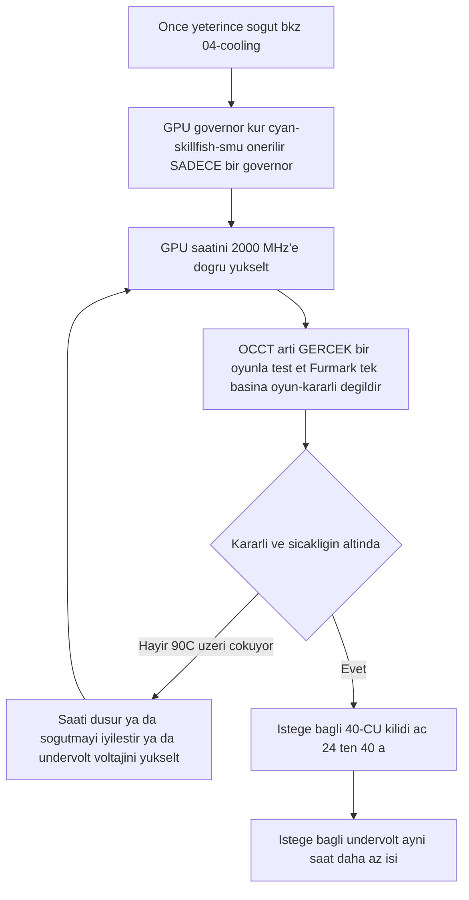

> 🌐 Topluluk çevirisi. İngilizce sürüm asıl kaynaktır ve daha güncel olabilir. Hata mı buldunuz? Bir [issue açın](https://github.com/lildebil0/awesome-bc250/issues). ([İngilizce orijinali](../en/09-overclock-undervolt.md))

# Overclock ve Undervolt

> **Özet** — Kutudan çıktığı gibi BC-250'nin GPU'su yavaş çalışır (genellikle **1500 MHz**'e sabitlenmiş, ~zayıf). Topluluk düzeltmesi, saat hızlarını/voltajı geçersiz kılan bir **governor**'dır: bugün önerilen, **[cyan-skillfish-governor-smu](https://github.com/filippor/cyan-skillfish-governor)**'dur (çekirdek yaması gerektirmez, Arch/CachyOS/Bazzite/Fedora'da paketlenmiştir); **[oberon-governor](https://gitlab.com/mothenjoyer69/oberon-governor)** orijinaldir ve hâlâ çalışır. Hangisini seçerseniz seçin, GPU'yu **2000 MHz (~+%30 FPS)**'e itmek için düzenlersiniz. Daha yeni **[bc250_smu_oc](https://github.com/bc250-collective/bc250_smu_oc)** araç takımı **CPU**'yu da overclock eder (önerilen **4 GHz @ 1275 mV**). Ayrıca, **[40-CU kilidi açma](https://github.com/duggasco/bc250-40cu-unlock)**, AMD'nin firmware'de devre dışı bıraktığı **24 → 40 compute unit**'i yeniden etkinleştirir — bu, tek başına saat hızlarından daha büyük bir GPU kazanımıdır (bir Superposition çalışması **4647 → 6863** puana çıktı, ([src](https://t.me/c/2424231195/137035))). **Bunların hepsi ısıdır. Önce kartı soğutun** — bkz. [04-cooling.md](04-cooling.md) — çünkü yeterli soğutma olmadan OC, ~90 °C'nin üzerinde çöker ve kartı resetler.

Bu, altın yolun **ilk** adımı değil, **son** adımıdır. Bunlardan herhangi birine dokunmadan önce kararlı, soğuk bir kart çalıştırın ([06-linux.md](06-linux.md), [04-cooling.md](04-cooling.md)). Buradaki her şey "kendi riskinizle yapın"dır — topluluk bunu defalarca söyler ([src](https://t.me/c/2424231195/106844)).

---

## Dört kaldıraç (ve her birinin değeri)

BC-250'nin ayarlayabileceğiniz **dört** bağımsız şeyi vardır. Bunlar üst üste yığılır:

| Kaldıraç | Araç | Tipik kazanç | Isı maliyeti |
|-------|------|--------------|-----------|
| **GPU saati** 1500 → 2000 MHz | governor (cyan-skillfish-smu / oberon) | GPU-sınırlı olduğunda **~+%30 FPS** | yüksek |
| **GPU undervolt** sabit saatte | aynı governor | aynı FPS, **çok daha soğuk** | *negatif* (daha az ısı) |
| **CPU saati** 3.5 → 4.0 GHz | `bc250_smu_oc` | CPU-sınırlı oyunlara yardımcı olur | yüksek |
| **40-CU kilidi açma** 24 → 40 CU | `bc250-40cu-unlock` | **~+%48'e kadar** GPU işi | yüksek |

Başlamadan önce sohbetten iki dürüst uyarı:

- **Çoğu BC-250 oyunu GPU-sınırlı değil, CPU-sınırlıdır.** GPU'yu 2000 → 2229 MHz'e itmek, bir test edene Shadow of the Tomb Raider'da *1 fps* kazandırdı (90 → 91) ve bu sırada güç ve sıcaklıklar sert biçimde fırladı — dolayısıyla manşetteki "+%30", yalnızca GPU'nun darboğaz olduğu birkaç başlıkta ortaya çıkar ([src](https://t.me/c/2424231195/67029)).
- **Isı, performanstan daha kötü ölçeklenir.** Aynı test eden kişi: 2000 MHz @ 960 mV = bir stres testinde **75 °C**; 2229 MHz @ 1030 mV = **93 °C** — ve PSU'su ile soğutucusu bunu tutamadığı için geri çekildi ([src](https://t.me/c/2424231195/66972), [src](https://t.me/c/2424231195/67029)).

> ⚠️ **Güvenlik tabanı.** Throttling **85 °C** civarında başlar ve kart **90 °C** civarında sert çöker / resetlenir (bkz. [04-cooling.md](04-cooling.md)). Yük altında ~85 °C'yi geçerseniz, soğutma bütçenizin *üzerindesiniz* — saati düşürün veya undervolt yapın, daha yükseğe itmeyin.



---

## Adım 1 — GPU saati ve undervolt: governor

BC-250'nin amdgpu sürücüsü normal sysfs overclock'unu açığa çıkarmaz. Topluluk çözümü bir **governor**'dır — saat/voltaj durumlarını doğrudan yazan küçük bir daemon. Bugün yeni bir kurulum için önerilen **cyan-skillfish-governor-smu**'dur; **oberon-governor** orijinaldir ve hâlâ çalışır (yerleşik alternatif olarak aşağıda tutuldu).

<p align="center"></p>
<sub>📈 Düzenlenebilir kaynak: <a href="../../assets/diagrams/gpu-clock-tradeoff.drawio">gpu-clock-tradeoff.drawio</a> (<a href="https://draw.io">draw.io</a>'da açın). Yeşil = kazanç, kırmızı = maliyet.</sub>

### cyan-skillfish-governor-smu (önerilen)

[filippor/cyan-skillfish-governor](https://github.com/filippor/cyan-skillfish-governor), SMU dalı — saat/voltajı **SMU firmware çağrıları** üzerinden sürer, dolayısıyla **hiçbir dağıtımda çekirdek frekans yaması gerektirmez**, aktif olarak bakımı yapılır ve her büyük dağıtımda paketlenmiştir. Ayrıca, boştaki TDP'yi **~30–35 W**'a düşüren (boştayken daha soğuk ve daha sessiz) bir **bellek-denetleyici güç-profili** kontrolü ekler ([src](https://t.me/c/2424231195/125821)).

**Kurulum (her büyük dağıtımda paketlenmiş)** — COPR `filippor/bazzite` (Fedora/Bazzite) veya AUR `cyan-skillfish-governor-smu` (Arch/CachyOS); Debian/Ubuntu, release tarball'ını + `sudo ./scripts/install.sh` kullanır:

```bash
# Fedora / Bazzite (COPR):
sudo dnf copr enable filippor/bazzite
sudo dnf install cyan-skillfish-governor-smu        # rpm-ostree install … on Bazzite
sudo systemctl enable --now cyan-skillfish-governor-smu.service

# Arch / CachyOS (AUR):
paru -S cyan-skillfish-governor-smu                  # or: yay -S …
sudo systemctl enable --now cyan-skillfish-governor-smu.service
```

SMU dalı, `cargo build --release` ile kaynaktan da derlenebilir. `/etc/cyan-skillfish-governor-smu/config.toml` içinde **saatinizi ve voltajınızı ayarlayın** (şema aşağıda) — zayıf varsayılandan topluluğun ideal noktasına geçmek için, en üstteki güvenli-noktayı **2000 MHz**'e doğru yükseltin ve kararlı olana kadar voltajı düşürün (aşağıdaki undervolt'a bakın); her düzenlemeden sonra servisi yeniden başlatın.

> **Etkili olduğunu kontrol edin.** GPU'yu yüklerken `amdgpu_top`, MangoHud veya LACT ile canlı saatleri/sıcaklıkları izleyin. Saatler ~1500 MHz'de kalıyorsa, servis çalışmıyor ya da yapılandırmanız ayrıştırılmamıştır — `sudo systemctl status cyan-skillfish-governor-smu`.

> Aynı anda **tek bir** governor çalıştırın — daha önce oberon çalıştırdıysanız, cyan-skillfish'i etkinleştirmeden önce onu devre dışı bırakın, yoksa aynı register'lar üzerinde çatışırlar.

> 🔇 **Sessiz bir oturma odası konsolu için ayarlama.** Sonuna kadar açmak (2000 MHz GPU / 4000 MHz CPU), CPU-sınırlı oyunlarda az şey kazandırır ama çok fazla ısı, fan gürültüsü ve watt'a mal olur. Bir r/BC250Gaming (Reddit) topluluk raporu, dengeli bir **~1600 MHz GPU / ~3500 MHz CPU**'nun günlük oyun için gürültü-başına-watt-başına çok daha iyi bir performans verdiğini buldu — neredeyse sessiz ve soğuk, ve çoğu başlık zaten GPU-sınırlı olmadığından FPS dayanıklı kalıyor (yukarıdaki CPU-sınırlı uyarısına bakın). Sessiz, soğuk bir kutuyu zirve-tutan benchmark'lardan daha çok önemsiyorsanız, maksimum yerine bunları governor tavanlarınız olarak ayarlayın.

### oberon-governor (orijinal — hâlâ çalışır)

[mothenjoyer69/oberon-governor](https://gitlab.com/mothenjoyer69/oberon-governor) — bir C++ daemon'u, ilk BC-250 governor'ı ve en çok test edilmiş olanı; hâlâ çalışır, ama SMU governor'ından farklı olarak en üst saatlere ulaşmak için genişletilmiş-frekans çekirdek yamasına (veya onu içeren bir dağıtıma) dayanır. README'sine göre **CMake, bir C++ araç zinciri ve libdrm**'e bağımlıdır ve **yalnızca ASRock BC-250 üzerinde test edilmiştir**. Birçok dağıtım onu önceden derlenmiş olarak sunar (Arch AUR, bir Fedora COPR, Bazzite imajları), dolayısıyla kaynaktan derlemeye yalnızca dağıtımınızın paketi yoksa ihtiyaç vardır.

**Kaynaktan derleme** (sohbetin yeniden üretilen sırasına, ([src](https://t.me/c/2424231195/54666)) ve deponun standart CMake akışına uyar):

```bash
# Dependencies (Arch example — adjust per distro)
sudo pacman -S --needed base-devel cmake pkgconf make libdrm glibc linux-api-headers

git clone https://gitlab.com/mothenjoyer69/oberon-governor.git && cd oberon-governor
sudo cmake . && sudo make && sudo make install
sudo systemctl enable --now oberon-governor.service
```

> `cmake` hata verirse, sohbetin düzeltmesi yalnızca eksik derleme bağımlılıklarını kurup yeniden çalıştırmaktı: `sudo pacman -S pkgconf cmake` ardından yeniden derleyin ([src](https://t.me/c/2424231195/54666)).

**Saatinizi ve voltajınızı ayarlayın.** oberon bir YAML yapılandırması okur:

```bash
sudo nano /etc/oberon-config.yaml      # adjust min/max frequency and voltage
sudo systemctl restart oberon-governor # apply
```

Dosya, GPU durumları için **maksimum ve minimum voltaj ve frekansı** ayarlamanıza olanak tanır (depo README'sine göre). Maksimum frekansı **2000 MHz**'e doğru yükseltin ve kararlı olana kadar voltajı düşürün. Her düzenlemeden sonra servisi yeniden başlatın. Daha sonra SMU governor'ına geçmek için: `oberon-governor`'ı durdurun+devre dışı bırakın+kaldırın, `rm /etc/oberon-config.yaml`, ardından SMU servisini kurun ve etkinleştirin.

#### TT vs SMU — iki cyan-skillfish varyantı

> Yukarıdaki önerilen SMU derlemesi, **iki** cyan-skillfish varyantından biridir. SMU varsayılandır; TT varyantı, özellikle çekirdek-yaması/sysfs rotasını isteyen herkes için alternatiftir ([elektricM: governor](https://elektricm.github.io/amd-bc250-docs/system/governor/)):

> **`perf_profile` — bellek denetleyicisi / Infinity Fabric katmanı (GPU eğrisinden bağımsız).** SMU, bir performans profili indeksi `0–3` sunar: **3** en yüksek bellek denetleyicisi / Infinity-Fabric performansıyken, **1** en düşük boşta kalma noktası için önerilen düşük güç profilidir. governor, CPU yükü `cpu-load-target.upper` değerini her aştığında bunu otomatik olarak `3` değerine zorlar. ([bc250-collective/cyan-skillfish-governor](https://github.com/bc250-collective/cyan-skillfish-governor))

| Varyant | Servis | Saatleri nasıl ayarlar | Çekirdek yaması? | Yayın / notlar |
|---|---|---|---|---|
| **SMU** *(önerilen)* | `cyan-skillfish-governor-smu` | SMU **firmware çağrıları** | **Hayır — yamasız her dağıtımda çalışır** | 2026-01-18; 2300+ MHz'e ulaşır; CPU ~%0.9–1.3 |
| **TT** (alternatif) | `cyan-skillfish-governor-tt` | sysfs | **Evet** (Bazzite'ta önceden dahil) | thermal-throttling farkında; 2175+ MHz'e ulaşır |

> **Servis yeniden adlandırma (2025-12-13):** filippor, `cyan-skillfish-governor` → `cyan-skillfish-governor-tt` olarak yeniden adlandırdı ve yapılandırma dizini `/etc/cyan-skillfish-governor/` → `/etc/cyan-skillfish-governor-tt/` olarak taşındı. Yükseltiyorsanız, eski `config.toml`'unuzu kopyalayın ([elektricM: governor](https://elektricm.github.io/amd-bc250-docs/system/governor/)). TT varyantı aynı COPR/AUR'da paketlenmiştir (`cyan-skillfish-governor-tt`) ve Bazzite'ta önceden dahildir.

> 🔴 **700 mV sert bir tabandır.** Governor'ın *minimum* GPU voltajını **700 mV'nin altına ayarlamak GPU'yu tekrar 1500 MHz'e kilitler** — tüm amacı boşa çıkarır. Herhangi bir governor'da min voltajı ≥ 700 mV tutun ([elektricM: governor](https://elektricm.github.io/amd-bc250-docs/system/governor/), [elektricM: BIOS overclocking](https://elektricm.github.io/amd-bc250-docs/bios/overclocking/)).

> 🔴 **~1100–1129 mV tavandır — 700 mV tabanının karşılığı.** Governor'ın *maksimum* GPU voltajını stok `OD_RANGE` üst sınırı olan **1129 mV**'nin ötesine itmeyin; bunun ötesi, **kararlılık kazancı olmadan silikon-bozulma riskidir**. Muhafazakâr hava-soğutmalı tavan **1100 mV (üzeri yüksek risk)** civarında oturur ve yalnızca sıvı soğutma **1125 mV**'lik en üst kademeyi haklı çıkarır (aşağıdaki tablo). Bir eğrinin kararlı olması için ~1129 mV'den fazlası gerekiyorsa, gerçek çözüm *soğutma veya daha düşük bir saat*tir, daha fazla volt değil ([elektricM: BIOS overclocking](https://elektricm.github.io/amd-bc250-docs/bios/overclocking/)).

> **Doğru GPU'nun hedeflendiğini doğrulayın.** Governor, sisteminize bağlı olarak `card0` veya `card1`'i kontrol edebilir — `ls /sys/class/drm/ | grep card`. Ayarlar uygulanmıyorsa, yapılandırmayı doğru karta yönlendirmeniz gerekebilir. Arch/CachyOS'ta governor bazen GPU ilk kez kullanılana kadar etkinleşmez — önyüklemeden sonra bir kez bir oyun/benchmark çalıştırın ([elektricM: governor](https://elektricm.github.io/amd-bc250-docs/system/governor/)).

#### cyan-skillfish-smu yapılandırma şeması (bölüm-tabanlı TOML)

`smu` dalı, eski `safe-points = [...]` dizisini **değil**, **bölüm-tabanlı** bir şema kullanır — her eğri noktası kendi `[[safe-points]]` tablosudur. Ana alanlar ([elektricM: governor](https://elektricm.github.io/amd-bc250-docs/system/governor/)):

```toml
# /etc/cyan-skillfish-governor-smu/config.toml
[timing.intervals]
sample = 500          # µs; raise (e.g. 1000) to cut CPU overhead, keep adjust = sample*400
adjust = 200_000
[gpu-usage]
fix-metrics = true    # fixes the MangoHud "655 %" GPU-usage bug on BC-250
method  = "busy-flag"
[gpu]
set-method = "smu"    # "smu" or "kernel"
[load-target]
upper = 0.80          # fractions, not percents
lower = 0.65
[temperature]
throttling = 85       # °C
throttling_recovery = 75

[[safe-points]]
frequency = 1000
voltage   = 800
[[safe-points]]
frequency = 2000
voltage   = 1000      # gaming
[[safe-points]]
frequency = 2200
voltage   = 1000      # many boards hold a flat 1000 mV here; bump per-board only if it crashes
```

> **Kararsızken ayarlama sırası: soğutma → frekans → *ardından* voltaj.** Stok soğutmada gerçek sebep neredeyse her zaman ısıdır (95 °C+). Voltaj eklemeden önce frekansı sınırlamak için en üstteki `[[safe-points]]` bloklarını düşürün; yalnızca sıcaklıklar iyiyse ve 2150–2200 MHz'de hâlâ çöküyorsa, **yalnızca en üst noktayı** +15–25 mV artırın. 2200 MHz'de ~1075 mV'yi geçtiğinizde yalnızca ısı ekliyorsunuzdur — bunun yerine frekansı düşürün ([elektricM: governor](https://elektricm.github.io/amd-bc250-docs/system/governor/)).

> **GPU-reset siyah ekran, governor'a özgü.** GPU, *governor aktif olarak sysfs'e yazarken* çökerse, reset tamamlanamaz ve kalıcı bir siyah ekran alırsınız (sistem SSH üzerinden hâlâ canlı) ve sert bir yeniden başlatma gerekir. Geçici çözüm: bilinen çökme-eğilimli oyunlardan önce governor'ı `systemctl stop` yapın; gerçek çözüm kararlı bir eğridir ([elektricM: governor](https://elektricm.github.io/amd-bc250-docs/system/governor/)).

##### SMU governor 2230 MHz'i nasıl aşar — ve neden devre dışı gönderilir

SMU dalı, amdgpu `OD_RANGE` yerine doğrudan SMU firmware'iyle konuştuğu için, **Oberon'un 2230 MHz sert sınırını aşabilir** — bir rehber, tek bir kartta onu **≈2700 MHz**'e sürdü ([Old Lamer — Bölüm XII](https://youtu.be/Chzxaryjncs)). filippor'un onu dikkatli göndermesinin tam sebebi bu paydır:

> 🔴 **SMU governor'ın varsayılan yapılandırması önyüklemede siyah ekran verebilir — bu yüzden otomatik başlatılMAYACAK şekilde gönderilir.** filippor, kötü bir varsayılan eğri sizi önyüklemede kilitleyemesin diye servisi kurulumdan sonra kasıtlı olarak devre dışı bırakır; önce eğriyi **ayarlama ve test etme** şansı bulursunuz, ardından kartınızda kararlı olduğunda onu `systemctl enable` yaparsınız. Bir eğriyi doğrulamadan *önce* etkinleştirirseniz ve sonraki önyüklemede siyah ekran gelirse, bu sizin sorumluluğunuzdadır ([Old Lamer — Bölüm XII](https://youtu.be/Chzxaryjncs)). *(⚠ rakamlar otomatik altyazılı — tam MHz'i yaklaşık olarak değerlendirin.)*

Oberon'un aşırı ısınmada sert frekans düşüşünün aksine, SMU governor **bir sıcaklık hedefine doğru kademeli olarak ramp yapar**. Rehber ayrıca yukarıdaki şemanın ötesinde ek `config.toml` alanlarını da gösterir ([Old Lamer — Bölüm XII](https://youtu.be/Chzxaryjncs)):

```toml
# extra tuning knobs shown in the Part XII walkthrough
[ramp-rates]
normal = 1
burst  = 50
[gpu-usage]
burst-samples = 60
down-events   = 5
[frequency-thresholds]
adjust = 10
[temperature]
throttling_recovery = 80
```

> ⚠️ **Yazar-deneysel 16-noktalı hava eğrisi — ÖNERİLMEZ, bu kılavuzun hava tavanını aşar.** Bölüm XII yazarı bu eğriyi havada çalıştırdı, ama en üst noktaları (1120–1150 mV'de 2333–2400 MHz) **Adım 3'te belgelenen muhafazakâr hava-soğutmalı sınırların üzerinde** oturur (havada ≈2230 MHz / 1060 mV; 1125 mV bir *yalnızca-sıvı* kademedir). Referans olarak gösterilmiştir, bir hedef olarak değil — havada, Adım 3'ün soğutma-sınıfı tablosunun söylediği yerde durun:
>
> ```toml
> # ⚠ author-experimental, air-cooled — DO NOT copy blindly (exceeds the air ceiling)
> # frequency (MHz) @ voltage (mV)
> 1000@800,  1175@850,  1500@900,  1700@920,
> 2000@960,  2100@1000, 2150@1035, 2200@1050,
> 2250@1070, 2300@1090, 2333@1120, 2400@1150
> ```
>
> O eğrinin tepesinde, **2.4 GHz ~30 A ≈ 360 W çekti** — tek bir konnektör değil, **çift Molex / ikinci bir kart beslemesi** gerektirecek kadar ([03-power-supply.md](03-power-supply.md)). Superposition **2.2 GHz'de ≈4200 → 2.4 GHz'de ≈4500** ölçeklendi ([Old Lamer — Bölüm XII](https://youtu.be/Chzxaryjncs)). *(⚠ tüm değerler otomatik altyazılı — yaklaşık.)*

#### GPU frekans-aralığı çekirdek yaması (yalnızca TT / manuel sysfs için)

amdgpu sürücüsünün stok GPU aralığı **1000–2000 MHz**'dir; tek satırlık bir sürücü yaması (**ViRazY** tarafından, `linux-6.12-bc250-freq.mypatch`, ~**639 bayt**, **6.12 / 6.15 / 6.16.x** çekirdeklerinde test edilmiş) onu **350–2230 MHz**'e genişletir (350 MHz derin-boşta güç tasarrufu sağlar; üst uç 2230+ overclock'larını mümkün kılar). **Bazzite, PikaOS ve Arch AUR çekirdekleri onu önceden yamalanmış olarak gönderir** ve **SMU governor, firmware çağrıları üzerinden ona olan ihtiyacı tamamen atlar** — dolayısıyla yalnızca TT governor'ını veya yamasız bir dağıtımda genişletilmiş aralıkla ham sysfs OC'sini isterseniz manuel olarak yamalarsınız. `cat …/pp_od_clk_voltage` ile doğrulayın (350–2230 göstermelidir). Genişletilmiş-voltaj (600–1300 mV) yamasını **kullanmayın** — gereksiz ve riskli ([elektricM: BIOS overclocking](https://elektricm.github.io/amd-bc250-docs/bios/overclocking/)).

> 🔧 **Ham sysfs undervolt (tek seferlik prob).** Governor olmadan hızlı bir nokta-başına kararlılık probu için, bir voltaj-eğrisi noktasını doğrudan sysfs'e yazın (format `vc <level> <MHz> <mV>`) ve commit edin ([elektricM: BIOS overclocking](https://elektricm.github.io/amd-bc250-docs/bios/overclocking/)):
> ```bash
> echo "vc 0 2100 1025" | sudo tee /sys/class/drm/card0/device/pp_od_clk_voltage   # set point: 2100 MHz @ 1025 mV
> echo "c" | sudo tee /sys/class/drm/card0/device/pp_od_clk_voltage                # commit
> ```
> Bu yalnızca hızlı prob içindir — bir yeniden başlatmada hayatta kalmaz. Governor'ın `config.toml`'u önerilen **kalıcı** yoldur; kararlı bir nokta-başına voltaj bulmak için ham sysfs kullanın, ardından onu governor eğrisine pişirin.

#### PS5GPU-BC250 — bir GUI denetleyicisi (yapılandırma dosyası yok)

GUI mi tercih edersiniz? **[ZEROAESQUERDA/PS5GPU-BC250](https://github.com/ZEROAESQUERDA/PS5GPU-BC250)**, min/maks GPU frekansını ve voltajını ayarlayan, bir sıcaklık limiti belirleyen ve otomatik 4-aşamalı boost veya manuel kontrol sunan bir Qt uygulamasıdır (KDE/GNOME) — MSI-Afterburner tarzı, çekirdek yaması veya TOML düzenlemesi yok. Çatışırlar diye önce **çalışan herhangi bir governor'ı devre dışı bırakın** (cyan-skillfish-smu/tt veya oberon) ([elektricM: governor](https://elektricm.github.io/amd-bc250-docs/system/governor/)).

---

## Adım 2 — CPU overclock ve doğru undervolt: `bc250_smu_oc`

bc250-collective tarafından **2025-12-30**'da yayınlanan (SMU'yu tersine mühendislik yaparak), [bc250_smu_oc](https://github.com/bc250-collective/bc250_smu_oc), sonunda yalnızca GPU'yu değil **CPU** saatine ve voltajına (Zen 2 çekirdekleri) dokunmanızı sağlayan araçtır. Yazarlar, kararlılık/ısı optimumu olarak **4 GHz @ 1275 mV**'yi önerir ve bunu depoda örnek olarak gönderir ([src](https://t.me/c/2424231195/106844)).

**Kurulum ve kullanım** (depo README'sinden aynen):

```bash
# Prerequisite: install the `stress` CPU load tool from your package manager
git clone https://github.com/bc250-collective/bc250_smu_oc.git
cd bc250_smu_oc
pip install .        # or: pipx install .

# Detect / test a target (CPU 4 GHz at 1275 mV), keep it applied:
bc250-detect --frequency 4000 --vid 1275 --keep

# Once you've found a stable config, install it and enable at boot:
bc250-apply --install overclock.conf
sudo systemctl enable --now bc250-smu-oc
```

> 🔴 **Sert voltaj limiti.** Depoya göre: CPU çekirdek voltajının (**Vid**) hiçbir koşulda **1.325 V**'yi aşmasına izin vermeyin — silikon bozulması ~1.35 V'nin üzerinde başlar ([src](https://t.me/c/2424231195/115726)). Ve: **CPU frekansını undervolt yapmadan yükseltmek, Vid'in sınırsız ölçeklenmesine izin verir ve donanımı yok edebilir** — bir saat artışını her zaman bir voltaj hedefiyle eşleştirin.

4 GHz'in neden tavan olduğu: AMD bu silikon için ~4 GHz'e kadarını güvenli kabul eder; 4700S masaüstü-kit BIOS'u kutudan çıktığı gibi 4000 MHz / 1.35 V'de turbo önyükler bile. Zen 2 *tipik olarak* ~4200'e ulaşır, ama bu çipler **madencilik-fire silikonu**dur, dolayısıyla 4200 yalnızca "çok şanslıysanız" ([src](https://t.me/c/2424231195/115726)).

> ❓ **CPU'yu 8 çekirdeğe açabilir miyim?** Kısa cevap: **hayır — şu an değil ve zaten yardımı olmazdı.** BC-250, 8 Zen 2 çekirdeğinden 6'sı aktif olarak gönderilir; r/BC250Gaming topluluk raporları diğer ikisini fiziksel olarak kesilmiş değil, **SMU tarafından okunan eFuse'larla yazılımsal olarak kilitli** olarak tanımlar (binning büyük ölçüde yapaydır — bir madencilik-dönemi kararı). Ama onları açmak, **PSP imza kontrolünü atlamak ve SMU mikrokodunu değiştirmek** anlamına gelirdi ve topluluk girişimleri (Discord'da) **başarılı olmadı**. Birisi başarsa bile, oyun için kazanç **marjinal** olurdu: BC-250, **zayıf tek-iş-parçacığı performansı, küçük parçalı bir 2×4 MB L3 önbelleği ve yalnızca-AVX2 / sakatlanmış bir FPU** tarafından darboğazlanır — çekirdek eklemek ne FPS'yi ne de bu çipin gerçekte aç olduğu şeyleri yükseltir. Peşine düşmeyin ([r/BC250Gaming topluluk raporları](https://www.reddit.com/r/BC250Gaming/)).

> Sabitlenmiş `bc250_smu_oc` gönderisi, GPU governor'ınızı da **değiştirebilir** (kendi `bc250-smu-oc` servisi vardır). Aynı anda iki governor çalıştırmayın.

**Doğrulanmış CPU-OC ölçeklemesi** (Fedora 43, çekirdek 6.19.8; otomatik-ayarlı voltaj; 7-zip MIPS; sıcaklık-tabanlı bir fan eğrisiyle) ([elektricM: governor](https://elektricm.github.io/amd-bc250-docs/system/governor/)):

| Frekans | Otomatik Vid | 7-zip MIPS | Sıcaklık (tam yük) | stok'a karşı |
|---|---|---|---|---|
| 3500 (stok) | otomatik | 26,062 | 60 °C | taban |
| 3600 MHz | 1150 mV | 26,518 | 65 °C | +%1.7 |
| 3700 MHz | 1199 mV | 27,212 | 68 °C | +%4.4 |
| 3800 MHz | 1250 mV | 27,919 | 72 °C | +%7.1 |
| 3900 MHz | 1275 mV | 28,410 | 75 °C | +%9.0 |
| 4000 MHz | — | PWM 80'de throttle yapar | 77 °C | ❌ (daha fazla soğutma/fan gerekir) |

Aracın bayrakları: test etmek için `bc250-detect -f <MHz> -v <mV>`, araç çıktıktan sonra OC'yi korumak için **`-k`** ekleyin, bir yapılandırma yazmak için **`-c <path>`**. `bc250-apply -a -i /etc/bc250-overclock.conf` ardından `systemctl enable bc250-smu-oc` ile kalıcı yapın. Yazarlar: **mrfrakes & dantistnfs** (SMU tersine mühendisliği) ([elektricM: governor](https://elektricm.github.io/amd-bc250-docs/system/governor/), [elektricM: BIOS overclocking](https://elektricm.github.io/amd-bc250-docs/bios/overclocking/)). **4000 MHz'in stok-benzeri PWM 80 fanda throttle yaptığını** unutmayın — tavan soğutma-sınırlıdır, yukarıdaki hava-vs-su notuyla tutarlı.

#### `bc250-detect` gerçekte nasıl arar (ve uyguladığı voltaj tavanı)

Aynı aracın bir video rehberi otomatik-arama mekaniğini gösterir: **3.5 GHz'den 100 MHz / 25 mV adımlarla yükselir**, her adımda **~300 s'lik bir stres testi** çalıştırır ve yalnızca geçerse ilerler — örn. 3.85 GHz @ 1150 mV'yi test edip korumak için `bc250-detect -f 3850 -v 1150 -k`. Bazzite'ta kurulum `sudo rpm-ostree install stress pipx` ardından `pipx install .`'dir ([Old Lamer — Bölüm VIII](https://youtu.be/ciDpPhoioKM)).

> ⚠️ **İki voltaj tavanı — ikisine de dikkat edin, anlaşmazlar.** Bölüm VIII videosu, yukarıda kullanılan deponun belgelenmiş **1.325 V** limitinden **daha muhafazakâr** olan sert bir **1300 mV** CPU-Vid tavanı belirtir. Güvenlik mesajıyla çelişmezler (~1.35 V'nin epey altında kalın), ama *kesin* sayı kaynağa göre farklıdır — şüphedeyseniz, çalışma sınırınız olarak daha düşüğünü (1300 mV) alın ve asla 1.325 V'yi aşmayın ([Old Lamer — Bölüm VIII](https://youtu.be/ciDpPhoioKM)). *(⚠ 1300 mV rakamı otomatik altyazılıdır.)*

O çalışmada, **4 GHz @ 1225 mV kısa hızlı-testi geçti ama oyun içinde çöktü**, dolayısıyla yazar kararlı bir **3.85 GHz @ 1150 mV**'ye geri döndü — elektricM tablosunun gösterdiği aynı "4 GHz hızlı-geçer, sürekli başarısız olur" deseni ([Old Lamer — Bölüm VIII](https://youtu.be/ciDpPhoioKM)). *(⚠ ASR — yaklaşık değerler.)*

**Uçtan-uca CPU+GPU ölçeklemesi (Horizon Zero Dawn, 1080p Ultra, native, 1× Arctic P12 Pro ~2200 rpm).** Tek bir video her kaldıracı üst üste yığar ve oyun-içi sonucu ölçer, ki bu da bu kartın neden **CPU-sınırlı** olduğunun en net gösterimidir: GPU, CPU onu besleyebilmeden çok önce ~88–90 fps render etmekten mutludur ([Old Lamer — Bölüm X](https://youtu.be/1hgSQxf6RXE)). *(⚠ tüm fps/°C otomatik altyazılı — ≈ olarak değerlendirin.)*

| Adım (kümülatif) | GPU saati @ mV | CPU saati @ mV | Oyun-içi fps | GPU-yetenekli fps | CPU / GPU sıcaklık |
|---|---|---|---|---|---|
| Stok undervolt | 1500 @ 850 | 3.5 G @ 1020 | **≈62** | — | 53 / 51 °C |
| + GPU OC | 2000 @ 960 | 3.5 G @ 1020 | **≈69** | 81 | 64 / 63 °C |
| + CPU OC | 2000 @ 960 | 3.85 G @ 1155 | **≈72** | — | 65 / 64 °C |
| + GPU OC | 2200 @ 1030 | 3.85 G @ 1155 | **≈74** | 88 | ~70 °C |
| + CPU OC | 2200 @ 1030 | 4.0 G @ 1270 | **≈76–77** | 88 | 72 / 68 °C |
| + mitigations kapalı | 2200 @ 1030 | 4.0 G @ 1270 | **≈80** | 90 | — |

**Net: ≈62 → ≈80 fps (~+%29) ve sert CPU-sınırlı** — GPU dahili olarak 88–90 fps render ederken CPU oynanabilir hızı ~80 civarında sınırlar. Aynı çalışmadan notlar ([Old Lamer — Bölüm X](https://youtu.be/1hgSQxf6RXE)):

- **4 GHz burada ~1270 mV'ye ihtiyaç duyar**, yoksa kart yeşil-ekran verir — saati yeterli Vid ile eşleştirmek zorunludur (yukarıdaki "frekansı asla undervolt yapmadan yükseltme" kuralını yankılar).
- **`bc250_smu_oc`'un yerleşik bir ~90 °C otomatik-throttle'ı vardır**, dolayısıyla araç kendisi, kartın sert-çökme sıcaklığından önce geri çekilir.
- **mitigations=off yalnızca ≈+3 fps kazandırdı** (CPU-açığı çekirdek mitigasyonları); küçük, isteğe bağlı son bir sıkıştırma.
- **Özel bellek zamanlamaları burada kazanç vermedi ve tuğla riski taşıyor** — bunları atlayın (aşağıdaki GDDR6 bölümüne bakın).
- **3.85 GHz @ 1155 mV, CPU ideal noktası olarak adlandırılır** — elektricM 7-zip tablosuyla eşleşir, burada 4 GHz stok-benzeri soğutmada throttle yapar.
- Son OC'de kart **1440p Ultra native @ 60** ve **4K + FSR neredeyse 60**'ta çalıştı ([Old Lamer — Bölüm X](https://youtu.be/1hgSQxf6RXE)).

> 📊 **Stok-taban FurMark sağlık rakamları (farklı çalışma).** Ayrı bir rehber, FurMark'ı **stok FHD ≈4085 puan / 67 fps**'de kaydetti; GPU'yu **1500 → 2000 MHz yükseltmek ~+%30 kazandırdı (≈5340 puan / 87 fps)**, **2229 MHz neredeyse hiçbir şey eklemedi ve >90 °C çalıştı** (throttle). O videodan bir genel kural: **"FurMark + CPU stres'te <80 °C ⇒ oyunlarda <70 °C"** ve **FurMark Vulkan çipi GL yolundan daha çok ısıtır** ([Old Lamer — Bölüm IV](https://youtu.be/YuBmGF536II)). *(⚠ ASR — yaklaşık.)*

#### CPU frekans ölçeklemesi ACPI düzeltmesine ihtiyaç duyar (yoksa hiç cpufreq yoktur)

> ❗ **Kutudan çıktığı gibi BC-250 hiçbir CPU frekans ölçeklemesi açığa çıkarmaz** — *hiç* cpufreq arayüzü yoktur, dolayısıyla `cpupower`/`schedutil` hiçbir şey yapmaz ve CPU sabit bir saatte oturur. **[bc250-collective/bc250-acpi-fix](https://github.com/bc250-collective/bc250-acpi-fix)**, bunu düzelten iki SSDT tablosu gönderir (bir initrd geçersiz kılma yoluyla yüklenir) ([elektricM: governor](https://elektricm.github.io/amd-bc250-docs/system/governor/)):
> - **SSDT-PST** → **8 P-state, 800 MHz → 3200 MHz** ile standart Linux cpufreq'i etkinleştirir (governor'lar: `schedutil`, `powersave`, `performance`, …).
> - **SSDT-CST** → çekirdeklerin boştayken gerçekten uyuması için **C1/C2/C3 boşta durumlarını** etkinleştirir (daha düşük boşta güç).
>
> İkisi de çekirdek 6.19.8'de çalıştığı doğrulandı. Kurulum, `SSDT-CST.aml`+`SSDT-PST.aml`'den `/boot`'a bir cpio derler, initrd satırının önüne eklenir (Fedora BLS) veya `GRUB_EARLY_INITRD_LINUX_CUSTOM` (GRUB) yoluyla. Ardından `echo schedutil | sudo tee /sys/devices/system/cpu/cpu*/cpufreq/scaling_governor`. **Uyarı:** bir çekirdek güncellemesi geçersiz kılmayı yeni önyükleme girişine taşımaz — onu yeniden ekleyin veya bir kernel-install kancası kullanın. `bc250_smu_oc` ile birleştiğinde, CPU sabitlenmiş çalışmak yerine **800 MHz boşta → 3900 MHz yük** ölçeklenir ([elektricM: governor](https://elektricm.github.io/amd-bc250-docs/system/governor/), [elektricM: power](https://elektricm.github.io/amd-bc250-docs/system/power/)).

#### Boşta güç — neden yüksek ve ayarlama sizi ne kadar götürür

BC-250 varsayılan olarak sıcak ve aç boşta kalır; ayarlama onu net kademelerde düşürür ([elektricM: power](https://elektricm.github.io/amd-bc250-docs/system/power/)):

- **Boşta merdiveni: ~105 W (governor yok) → ~85 W (governor) → ~55 W (optimize: Debian + governor + undervolt).** Governor tek başına ~20 W tasarruf sağlar; **~55 W en iyi durum boşta tabanıdır** ve ona yalnızca dağıtım + governor + undervolt'u üst üste yığarak ulaşırsınız.
- **Boştanın neden yüksek olduğu — optimize-edilmemiş döküm (~93 W):** **CPU+GPU ~31 W**, **RAM + bellek denetleyicisi ~35 W**, **kartın geri kalanı ~27 W**. Bellek alt sistemi tek en büyük boşta çekimidir ve kart rakamının çoğu sabit silikondur — yani ayarlama, CPU/GPU'yu ve (governor'ın bellek-denetleyici profili yoluyla) RAM çekiminin bir kısmını tıraşlayabilir, ama büyük bir kısım dokunulamaz.

Üç adlandırılmış ayarlama profili, gerçekçi zarfları (boşta güç / sürekli sıcaklık) çerçeveler ([elektricM: power](https://elektricm.github.io/amd-bc250-docs/system/power/)):

| Profil | Güç | Sıcaklık |
|---|---|---|
| Verimlilik | 55–65 W | 60–70 °C |
| Oyun | 70–85 W | 65–75 °C |
| Performans | 85–95 W | 75–85 °C |

---

## Adım 3 — Undervolt (bunu ısı için yapın, her çip farklıdır)

Undervolt, bu karttaki en yüksek-değerli harekettir: **aynı saat, çok daha az ısı** ve CPU saatini yükseltirseniz *gereklidir*. Ama **her çip farklıdır** — silikon piyangosu burada gerçektir. Bir sahip neredeyse-ardışık üç kart çalıştırdı ve yalnızca biri stres altında 900 mV tuttu; aynı soğutma, aynı sıcaklıklar, farklı kararlılık ([src](https://t.me/c/2424231195/50568)).

<p align="center"></p>
<sub>📈 Düzenlenebilir kaynak: <a href="../../assets/diagrams/undervolt-tradeoff.drawio">undervolt-tradeoff.drawio</a> (<a href="https://draw.io">draw.io</a>'da açın). Yeşil = kazanç, kırmızı = maliyet.</sub>

**Hedef saat → voltaj, gerçek topluluk rakamları (sizin çipiniz değişecektir):**

| GPU saati | Sahiplerin *oyun-kararlı* bulduğu voltaj | Notlar |
|-----------|------------------------------------------|-------|
| 1500 MHz | ~710 mV | bir test edenin "en kararlı" kartı ([src](https://t.me/c/2424231195/23545)) |
| 2000 MHz | **~955 mV** | 905 mV'de Furmark-kararlı ama 955 mV'ye kadar oyunlarda artefakt ([src](https://t.me/c/2424231195/68126), [src](https://t.me/c/2424231195/136773)) |
| 2000 MHz | ~960 mV → stres'te **75 °C** | popüler günlük-sürücü ayar noktası ([src](https://t.me/c/2424231195/66972)) |
| 2229 MHz | ~1030–1050 mV → stres'te **93 °C** | "kapattım, korkuyorum" — azalan getiriler ([src](https://t.me/c/2424231195/66972)) |

**Her soğutma sınıfının gerçekte ne tutabileceği** — yukarıdaki tablo, stok-benzeri soğutmada "2229 MHz @ ~1030–1050 mV → korkutucu"da durur. Daha yükseğe gitmek için eşleşen soğutmaya ihtiyacınız var; bunlar elektricM'in soğutma-sınıfı başına tavanlarıdır ([elektricM: BIOS overclocking](https://elektricm.github.io/amd-bc250-docs/bios/overclocking/)):

| Soğutma | GPU saati | Voltaj |
|---|---|---|
| Muhafazakâr hava (maks) | 2230 MHz | 1060 mV |
| Yüksek statik-basınçlı hava (Arctic P12 Max) | 2300 MHz | 1075 mV |
| Sıvı (NexGen3D'ye göre) | 2400 MHz | 1125 mV |

> 🧪 **Topluluk undervolt ayar noktaları (4pda).** Rus forumundan iki gerçek eğri daha, yararlı başlangıç noktaları (hâlâ çip-bağımlı): bir **24-CU (Oberon)** kartta, iki-noktalı bir eğri `1000 MHz @ 0.8 V + 1700 MHz @ 0.85 V` ([4pda — dreamerok](https://4pda.to/forum/index.php?showtopic=1104980)); bir **40-CU** kartta, `1500 MHz @ 900 mV`. Yüksek-kaçaklı bir çip için, düşük başlayın — `500 MHz / 900 mV` — ve voltajı aşağı kovalamak yerine **oradan frekans ekleyin** ([4pda — Lakan](https://4pda.to/forum/index.php?showtopic=1104980)).

> ⚡ **Watt-başına-perf çerçevesi.** Topluluk testi, **undervolt yapılmış + underclock yapılmış bir 40-CU'nun aynı FurMark puanında bir 24-CU'dan ~100 W daha az çektiğini** not eder — yani eşit çıktı için daha geniş-ama-daha-yavaş parça, daha verimli çalışma noktasıdır, ki bu da 24 CU'yu sertçe itmek yerine kilidini açıp ardından *under*-clock yapmanın tüm argümanıdır.

> **Furmark tek başına bir kararlılık testi değildir.** Sabit yükü, yalnızca *bağlam* değiştiğinde ortaya çıkan kararsızlığı gizler — alt-tab, texture yükleme, menüler. Furmark'ta 905 mV'de "kararlı" bir kart, voltaj 955 mV'ye gidene kadar gerçek oyunlarda 1–2 saat sonra texture artefaktları attı. **Gerçek oyunlar + bir alt-tab/menü taraması**nda doğrulayın ve yalnızca Furmark değil, **OCCT** gibi çeşitli bir stres aracı kullanın (yalnızca shader'ları değil, VRM'yi de yükler) ([src](https://t.me/c/2424231195/68126), [src](https://t.me/c/2424231195/136773), [src](https://t.me/c/2424231195/23545)).

> **Kullanışlı bir donanım göstergesi:** BC-250'nin bir **yük LED'i** vardır — **kırmızı = GPU boşta, yeşil = GPU yüklü**. Bazı "boşta" sahneler (örn. Witcher 3'te Novigrad) aslında GPU'yu zorlar ve Furmark/Cyberpunk'ın kaçırdığı undervolt artefaktlarını yüzeye çıkarır ([src](https://t.me/c/2424231195/12285)).

Çok-agresif bir undervolt **tehlikeli değildir** — en kötü durumda kart düşer veya M.2 yuvasını devre dışı bırakır, ki OC BIOS'ta saklanmadığından beş saniyede temizlenir ([src](https://t.me/c/2424231195/105998)).

> 💡 **Undervolt ile ilgili olmayan artefaktlar mı?** Siyah texture'lar / titreme aynı zamanda bir sürücü HiZ sorunu olabilir — voltajı kovalamadan önce oyunun ortamında **`RADV_DEBUG=nohiz`** ayarlamayı deneyin. Ve stok-çekirdek **`OD_RANGE` voltaj penceresinin 700–1129 mV** olduğunu unutmayın; muhafazakâr hava-soğutmalı maks ~1085 mV, mutlak maks ~1100 mV — bunun ötesi gerçek kararlılık kazancı olmadan bozulma riskidir ([elektricM: BIOS overclocking](https://elektricm.github.io/amd-bc250-docs/bios/overclocking/)).

---

## Adım 4 — 40-CU kilidi açma (24 → 40 compute unit)

En büyük tek GPU kazanımı ve en yenisi. BC-250'nin Cyan Skillfish die'ı fiziksel olarak **40 CU**'ya sahiptir, ama stok firmware yalnızca **24'ünü aktif** bırakır (16'sı "hasat edilmiş"). **`amdgpu.bc250_cc_write_mode=3`** çekirdek parametresi artı yamalanmış bir amdgpu sürücüsü tüm 40'ını yeniden etkinleştirir. Ölçülen sonuç — bir 4K Superposition çalışması **4647 → 6863** puana sıçradı (24/40 → 40/40 CU aktif), `cu_map.sh` aracı hasat haritasının dolduğunu göstererek ([src](https://t.me/c/2424231195/137035)):


İnsanlar **40 CU @ 1850 MHz** (RE4 Remake native 1440p high, 60 fps) çalıştırıyor ve hatta 40 CU'da çok düşük voltajlar bildiriyor (örn. şanslı bir çipte 1400 MHz @ 750 mV) ([src](https://t.me/c/2424231195/137260), [src](https://t.me/c/2424231195/137157)).

> ⚠️ **Bu, amdgpu çekirdek modülünü yamalamayı ve yeniden derlemeyi gerektirir** — bu kılavuzdaki en karmaşık görevdir ve **yalnızca-BC-250**'dir (yama, kartın PCI cihaz kimliği **`0x13FE`** ile korunur). Yama kalıcı değildir: modprobe yapılandırması olmadan, bir yeniden başlatma 24 CU'ya geri döner.

**Gerçekte nasıl çalışır (iki register, ikisi de gerekli).** Kilidi açma, sürücü init sırasında **iki** donanım register'ı yazar — hiçbiri tek başına compute'u ölçeklemez ([elektricM: 40-CU kilidi açma](https://elektricm.github.io/amd-bc250-docs/system/40cu-unlock/)):

| Register | Rol | Stok → kilidi açılmış |
|---|---|---|
| `CC_GC_SHADER_ARRAY_CONFIG` | sürücüye kaç CU olduğunu söyler | `0xfff80000` → `0xffe00000` |
| `SPI_PG_ENABLE_STATIC_WGP_MASK` | SPI'ye dalgaları nereye dağıtacağını söyler | `0x07` (WGP 0–2) → `0x1F` (WGP 0–4) |

(Aşağıdaki çalışma-zamanı aracı bir **üçüncü**, `RLC`, register'ı da yazar.) Bu bir **compute** kilidi açmadır, bir oyun kilidi açma değil: duggasco'nun kontrollü A/B'si Vulkan `llama-bench pp512`'nin **1.61×** sıçradığını gösterir (1500 MHz'de 230 → 372 tok/s), `glmark2` ise yalnızca **+%4.4** kazanır çünkü 3D, CU-sınırlı değil fill-rate-sınırlıdır ([elektricM: 40-CU kilidi açma](https://elektricm.github.io/amd-bc250-docs/system/40cu-unlock/)). AI/LLM ayrıntıları için ayrıca bkz. [akandr/bc250](https://github.com/akandr/bc250).

> 🎯 **Önerilen çalışma noktası 2 GHz değil, 1500 MHz'dir.** duggasco'nun A/B'si **1500 MHz / ~900 mV**'yi ideal nokta olarak koyar — termal sorun olmadan ~1.67× teorik ölçeklemenin çoğunu yakalar (1500 MHz/874 mV: 372 tok/s, 125 W, 83 °C). 2 GHz'de aynı test 466 tok/s'ye fırlar ama güç/sıcaklıklar sertçe tırmanır ve paket birkaç dakika sonra thermal-throttle yapar ([elektricM: 40-CU kilidi açma](https://elektricm.github.io/amd-bc250-docs/system/40cu-unlock/)).

> ⚠️ **Her kart temiz kilidi açmaz — önce hasat deseninizi kontrol edin.** 16 fuse-kapalı CU'nun silikon-sağlıklı olması garanti değildir. **Bitişik** bir hasat desenine sahip kartlar (örn. CU 0–5 aktif, 6–9 fuse-kapalı, dört shader array'in hepsinde aynı) geçme eğilimindedir; **dağınık** bir desene sahip kartlar, numaralandırılan ama yük altında başarısız olan gerçekten kusurlu CU'lara sahip olabilir. Bir modprobe yapılandırmasını commit etmeden *önce* depodan **`./scripts/cu_map.sh`** çalıştırın. Dağınıksa, WGP-başına sağlık testini çalıştırmayı ve **24 ile 40 kararlı CU arasında** bir yere düşmeyi bekleyin ([elektricM: 40-CU kilidi açma](https://elektricm.github.io/amd-bc250-docs/system/40cu-unlock/)). Ayrıca: **Secure Boot kapalı olmalıdır** (veya yeniden derlenmiş modülü kendiniz imzalayın).

> 🎰 **40 CU bir piyangodur, bir garanti değil — birçok kart 38'de tepe yapar.** r/BC250Gaming topluluk raporları bunda birleşir: die'da 40 olmasına rağmen, birçok çip yalnızca **38 CU**'da kararlıdır ve son bir veya iki tanesi yaygın olarak **grafik artefaktlarına (karenin üzerinde belirgin bir "çizgi") veya sert çökmelere** neden olur. Bildirilen kararlı sayılar çipe göre değişir — **36, 38 veya 40**. Daha kötüsü, "40'ta kararlı" *aldatıcı* olabilir: bir kart ilk oyun başlatmada çökebilir ama sonraki bir denemede sorunsuz çalışabilir, dolayısıyla tek bir temiz benchmark hiçbir şeyi kanıtlamaz. **Önerilen yöntem — CU'ların kilidini birer birer açın ve her birinden sonra test edin.** Tek seferde bir CU'yu etkinleştirmek ve bir sonrakini eklemeden önce doğrulamak için **[WinnieLV/bc250-cu-live-manager](https://github.com/WinnieLV/bc250-cu-live-manager)** kullanın (örn. adım başına FurMark 20+ dk artı birkaç oyun benchmark'ı). Kötü bir CU **sistemi anında kilitler**, dolayısıyla her test, hangi CU'yu maskeli bırakacağınızı tam olarak söyler — 16'sının hepsini bir kerede açıp umut etmekten çok daha güvenli. "24 → 40"ı en iyi durum olarak değerlendirin; **38** için plan yapın ([r/BC250Gaming topluluk raporları](https://www.reddit.com/r/BC250Gaming/)).

Aşağıdaki grafik, bu kaldıracın neden değerli ama zorlu olduğunu özetler: **compute, CU'larla güçlü biçimde ölçeklenir** (yukarıdaki Superposition / llama-bench sıçramaları), **oyun FPS'si ise zar zor hareket eder çünkü çoğu başlık CPU-sınırlıdır** ve yükseldikçe güç çekimi ve kararsızlık tırmanır — 38 CU tipik kararlı sayıdır, 40 bir piyangodur.

<p align="center"></p>
<sub>📈 Düzenlenebilir kaynak: <a href="../../assets/diagrams/cu40-tradeoff.drawio">cu40-tradeoff.drawio</a> (<a href="https://draw.io">draw.io</a>'da açın). Yeşil = compute, kehribar = oyun FPS, kırmızı = güç/kararsızlık.</sub>

#### Ekstra CU'ların değeri ne kadar (FurMark)

40-CU video serisi, compute sıçramasını FurMark'ta ölçer — neredeyse-saf bir GPU yükü, dolayısıyla kilidi açmanın satın aldığının *üst sınırını* gösterir (oyunlar, CPU-sınırlı olduklarından çok daha az kazanır). Bir kartta ([Old Lamer — Bölüm I](https://youtu.be/Zvo4UsNocDQ)): *(⚠ tüm rakamlar otomatik altyazılı — ≈.)*

| Yapılandırma | FurMark fps | 24-CU stok'a karşı |
|---|---|---|
| 24 CU @ 2000 MHz | ≈91 | taban |
| 40 CU @ 1500 MHz (taban) | ≈110 | **~+%25** |
| 40 CU @ 2000 MHz | — | **≈+%60** |

Bir **OC'li 24-CU, stok bir 40-CU ile yaklaşık aynı güç/sıcaklığı çeker**, bir **OC'li 40-CU ise stok'a göre ~+40 W çeker**. Black Myth: Wukong, **eşit frekansta 24 → 40 CU'ya geçerek ~+%30 kazandı**. İterek, **kart 2.4 GHz'de 40 CU ile çöktü** — sınır, ne saatin ne CU'nun tek başına değil, birleşik saat+CU zarfıdır ([Old Lamer — Bölüm I](https://youtu.be/Zvo4UsNocDQ)).

> 🟢 **`bc250-cu-live-manager` ile canlı FurMark ölçeklemesi (çekirdek yeniden derlemesi yok).** Vulkan FurMark'ta sabit **1500 MHz**'de CU'ları canlı değiştirmek, puanı temiz biçimde yukarı taşıdı: **24 CU ≈70 → 32 CU ≈100 → 40 CU ≈127–128 fps** ([Old Lamer — 40CU Bölüm III](https://youtu.be/lAxY2RZcvg0)). TUI kısayolları **E** = WGP tablosunu düzenle, **F** = full-dispatch, **W** = tabloyu yaz, **I** = systemd servisini kur, **Q** = çık; imajdaki varsayılan sudo parolası `bazzite`'tir. **Özel çekirdek gerektirmez** ve **Bazzite güncellemelerinden sağ çıkar**, çünkü register'ları amdgpu'yu yamalamak yerine `umr` aracılığıyla çalışma zamanında yazar — tabloyu bir kez yazın, servisi bir kez kurun, yeniden başlatın. *(⚠ fps otomatik altyazılı — ≈.)*

### En kolay yol — proje derleme scripti

[duggasco/bc250-40cu-unlock](https://github.com/duggasco/bc250-40cu-unlock), derleme/etkinleştirmeyi sizin için yapan bir script gönderir (`gcc`, `make`, `zstd` ve çekirdek başlıkları gerektirir):

```bash
git clone https://github.com/duggasco/bc250-40cu-unlock.git
cd bc250-40cu-unlock
sudo ./scripts/bc250-enable-40cu.sh build
sudo ./scripts/bc250-enable-40cu.sh enable    # writes the modprobe config and reboots
# Roll back if anything misbehaves:
sudo ./scripts/bc250-enable-40cu.sh disable   # turn the unlock off
sudo ./scripts/bc250-enable-40cu.sh restore   # restore the original amdgpu module
```

Script, yamalamadan önce stok modülü `…/amdgpu/amdgpu.ko.*.bc250-backup-*` olarak yedekler, dolayısıyla `restore`'un her zaman geri dönülecek bir orijinali vardır. **Dağıtım-başına derleme bağımlılıkları** ([elektricM: 40-CU kilidi açma](https://elektricm.github.io/amd-bc250-docs/system/40cu-unlock/)):

| Dağıtım | Paketler |
|---|---|
| Debian / Ubuntu | `linux-headers-$(uname -r) build-essential zstd` |
| Fedora | `kernel-devel gcc make zstd curl` |
| Arch / CachyOS | `linux-headers` |

### Manuel yol (modülü kendiniz yamalayın)

Onu kendiniz sürmeyi tercih ettiğinizde (örn. bunun için sohbetin en çok kullanılan dağıtımı CachyOS/Arch). Sabitlenmiş topluluk talimatından yeniden üretilmiştir ([src](https://t.me/c/2424231195/137241)) — yamayı ve `-p` strip seviyesini, `patch -p5` kullanan [depo](https://github.com/duggasco/bc250-40cu-unlock) ile karşılaştırın:

```bash
# 1. Get matching kernel headers (CachyOS example)
sudo pacman -Suy
sudo pacman -S linux-cachyos-headers
sudo reboot

# 2. Patch the amdgpu source, rebuild & install the module
cd /usr/lib/modules/$(uname -r)/build/drivers/gpu/drm/amd/amdgpu
# apply bc250-40cu-amdgpu.patch to gfx_v10_0.c  (patch -p5 < .../patch/bc250-40cu-amdgpu.patch)
sudo make -C /usr/lib/modules/$(uname -r)/build M=$(pwd) modules
sudo make -C /usr/lib/modules/$(uname -r)/build M=$(pwd) modules_install
sudo reboot

# 3. Turn the feature on via kernel param, rebuild initramfs, reboot
echo 'options amdgpu bc250_cc_write_mode=3' | sudo tee /etc/modprobe.d/bc250-40cu.conf
sudo mkinitcpio -P     # Fedora/atomic: dracut --force  (or rpm-ostree kargs, below)
sudo reboot
```

**Fedora atomic / Bazzite'ta** (rpm-ostree), parametre bunun yerine bir çekirdek argümanı olarak girer ([src](https://t.me/c/2424231195/137916)):

```bash
sudo rpm-ostree kargs --append-if-missing='amdgpu.bc250_cc_write_mode=3'
sudo systemctl reboot
```

> 📦 **Bazzite'ta önceden derlenmiş 40-CU-kilidi-açma çekirdeği ve güvenli sıralama.** Bazzite için paketlenmiş bir kilit açma çekirdeği `6.17.7-ba29.fc43.bc250cu.x86_64` vardır. Rehberin sırası şudur: `rpm-ostree update` → **mevcut dağıtımı pinleyin** (geri dönebilmek için) → kilidi açmadan *önce* **GPU governor'ı devre dışı bırakın + durdurun** (CU değişimi sırasında saatleri yazan bir governor GPU'yu kilitleyebilir) → kilit açma çekirdeğini takın → yeniden başlatın → CU haritasını yeniden kontrol edin. Önce governor-durdurmayı yapın; insanların kaçırdığı kısım o sıralamadır ([Old Lamer — 40CU Bölüm I](https://youtu.be/Zvo4UsNocDQ)). *(⚠ çekirdek dizesi videoya göre — depoya karşı doğrulayın.)*

> 🥾 **CachyOS'ta kilit açma GRUB değil, Limine kullanır.** CachyOS kurulumunuz **Limine** önyükleyicisi üzerinden önyükleniyorsa, `amdgpu.bc250_cc_write_mode=3` çekirdek argümanı bir GRUB yapılandırmasına değil, **`/etc/default/limine`**'a girer — adım adım bir anlatım [psenyukov.ru kılavuzunda](https://psenyukov.ru/topics/5564) vardır ([RU CU-unlock videosundan](https://youtu.be/M7PsojWr4KA) bağlanmış). Aynı parametre, farklı önyükleyici dosyası.

### Kilidin açıldığını doğrulayın

```bash
sudo dmesg | grep active_cu_number     # success = ...active_cu_number 40
sudo dmesg | grep bc250-40cu           # shows the mode=3 register writes

# Non-root check (no sudo needed) — ask the Vulkan driver directly:
RADV_DEBUG=info vulkaninfo --summary 2>&1 | grep num_cu   # expect: num_cu = 40 and num_cu_per_sh = 10
```

Sayı **40** ile bitiyorsa, tüm CU'lar canlıdır ([src](https://t.me/c/2424231195/137241)). Ayrıca `bc250-40cu-enable: mode=3 ... CC=0xfff80000->0xffe00000 SPI=0x00000007->0x0000001f` gibi log satırları görmelisiniz ([src](https://t.me/c/2424231195/137889)). `vulkaninfo` `num_cu = 24` (veya `active_cu_number` 24) gösteriyorsa, yamalanmış modül yüklenmemiştir ([elektricM: 40-CU kilidi açma](https://elektricm.github.io/amd-bc250-docs/system/40cu-unlock/)).

> **Bir çekirdek yeniden derlemek istemiyor musunuz?** Topluluk yardımcı scriptler ve önceden derlenmiş modül paketleri inşa ediyor. Bkz. [WinnieLV/bc250-cu-live-manager](https://github.com/WinnieLV/bc250-cu-live-manager) (CU'ları canlı değiştir) ve [gennro/bc250-toolkit](https://github.com/gennro/bc250-toolkit) (`bc250-toolkit.sh` / `bc250-unlock.sh`). Bunlar hızlı hareket eder — mevcut durum için depolara bakın.

> **Çalışma-zamanı UMR vs çekirdek yaması — aynı son durum, farklı denge.** `bc250-cu-live-manager`, sürücü önyüklendikten *sonra* aynı register'ları (**CC + SPI + RLC**) kullanıcı uzayından `umr` aracılığıyla yazar, kalıcılık için bir TUI ve bir systemd birimi ile — `umr`'yi kendisi kurar (pacman/dnf/rpm-ostree). amdgpu'yu her çekirdek güncellemesinde yeniden derlemek istemiyorsanız veya WGP düzenlerini canlı A/B yapmak istiyorsanız **çalışma-zamanı UMR'yi seçin** (dağınık-hasat kartları için harika — sürücü-aktif WGP'leri devre dışı bırakmayı reddeder, dolayısıyla kart-başına deneyler elle `umr -w` çalıştırmaktan daha güvenlidir). Sürücü topolojisinde önyükleme 0'dan itibaren `active_cu_number 40` istiyorsanız veya bunu bir dağıtım imajına pişiriyorsanız **çekirdek yamasını seçin** ([elektricM: 40-CU kilidi açma](https://elektricm.github.io/amd-bc250-docs/system/40cu-unlock/)).

#### Seçici CU maskeleme (dağınık-hasat kartları için)

`cu_map.sh` dağınık bir desen gösteriyorsa, duggasco her WGP yapılandırmasına izole olarak yeniden önyükleyen ve doğruluk kontrolleri çalıştıran, ardından kötü olanları maskeleyen bir WGP-başına sağlık testi gönderir ([elektricM: 40-CU kilidi açma](https://elektricm.github.io/amd-bc250-docs/system/40cu-unlock/)):

```bash
sudo ./scripts/bc250-cu-health-test.sh start
./scripts/bc250-cu-mask.sh --results /var/lib/bc250-cu-health-test/results.tsv --install
```

Maskeleme, stok **`amdgpu.disable_cu`** parametresini **WGP granülaritesinde** kullanır (CU 6'yı devre dışı bırakmak CU 7'yi de devre dışı bırakır — aynı WGP).

> 🧩 **Pair-id ile manuel maskeleme (elle-yapılan rota).** Ayrı bir rehber bunu elle yapar: önce **imajı rebase edin** (`brh → bazzite-deck → stable → tag 20260406`), ardından CU'ları bir **pair-id gösterimi** `row.col` ile maskeleyin, burada row `00 / 01 / 10 / 11` (dört shader array) içinden biridir ve col `0–4` (WGP) — örn. `011`, `013`. O kimlikleri **`rpm-ostree kargs amdgpu.disable_cu`**'ya eklersiniz. CU'lar **çiftler halinde** devre dışı kaldığından, iki çifti maskelemek sizi **36 CU**'ya, tek bir kimliği maskelemek **38 CU**'ya getirir; yazar, hangi kimlikleri düşüreceğini seçmek için **~210-kombinasyonluk bir arama çizelgesi** tutar. (AMD'nin die'ı **ASRock ile sözleşmeyle kararlaştırılan bir 24-CU spesine** göre inşa ettiği bildiriliyor, ki hasatın hiç var olmasının sebebi budur.) ([Old Lamer — 40CU Bölüm II](https://youtu.be/iUVLXmoMyqM)) *(⚠ tag/kimlikler videoya göre — uygulamadan önce doğrulayın.)*

#### Termal gerçeklik kontrolü — 40 CU'da 2 GHz, stok soğutmada throttle yapar

Doğrulanmış 10 dakikalık sürekli `llama-bench` (Llama-3.2-1B Q4_K_M, 40 CU @ 2 GHz, stok soğutucu blok + iki Arctic P12 Max push-pull) ([elektricM: 40-CU kilidi açma](https://elektricm.github.io/amd-bc250-docs/system/40cu-unlock/)):

| Metrik | Ortalama | Tepe |
|---|---|---|
| GPU kenarı | 89.6 °C | **107 °C** |
| Paket gücü (PPT) | 136 W | **223 W** |
| CPU sıcaklığı | 96.7 °C | **100 °C (TJmax)** |
| VRM MOSFET | 57 °C | 58.5 °C |
| Fan | ~2950 RPM | 2977 RPM (tavan) |

Sürekli verim, paket throttle yaptıkça 10 dk boyunca **~%10 düşer**; darboğaz **soğutucu blok + CPU termalleridir, VRM değil**. Kilit açmanın *kendisi* sağlamdır — 25 dk döngülü Vulkan doğruluk testi sıfır fp/int hata, hang yok, reset yok verdi. **Sonuç: sürekli 40-CU işi için governor'ı 1500 MHz'de sınırlayın**, ciddi soğutmanız yoksa — kısıt termal zarftır, silikon değil ([elektricM: 40-CU kilidi açma](https://elektricm.github.io/amd-bc250-docs/system/40cu-unlock/)).

> ⚡ **Tüm 40'ı güvenilir biçimde çalıştırmak daha fazla soğutma *ve* daha fazla güç gerektirir.** r/BC250Gaming topluluk raporları tutarlıdır: yararlı bir saatte tam 40 CU, stok soğutucu bloğu değil, bir **AIO veya büyük bir hava soğutucusu** ister — bir sahip 40 CU'yu yalnızca **sıcaklıkları 70 °C'nin altında tutan bir AIO** ile kararlı tuttu. Ayrıca **tek 8-pin (J1000)'in rahatça verdiğinden daha fazla akım** ister: kartın **J2000 / J2001** konnektörlerini ikinci bir besleme olarak besleyin ([03-power-supply.md](03-power-supply.md) içindeki "300 W Ötesi" çift-besleme yöntemi). Onu stok soğutucu ve tek bir 8-pin üzerinde bıraktıysanız, 40 CU'nun throttle yapmasını veya kartı tetiklemesini bekleyin — önce soğutmayı ([04-cooling.md](04-cooling.md)) ve gücü halledin ([r/BC250Gaming topluluk raporları](https://www.reddit.com/r/BC250Gaming/)).

---

## GDDR6 bellek: VRAM tahsisi, overclock ve zamanlamalar

> 🔴 **Bu bölümdeki her şeyden önce bunu okuyun. Bellek ayarı, BC-250'de kartı kalıcı olarak tuğlaya çevirebilen tek yerdir.** Yukarıdaki saat/undervolt'un aksine — ki bir governor'da yaşar ve yeniden başlatmada temizlenir — GDDR6 **saati ve zamanlamaları BIOS/CMOS'a yazılır** ve kötü bir değer kartı POST edemez bırakabilir. Topluluk kartları tam olarak bu şekilde tuğlaya çevirdi: bir üye VRAM saatini **1950 MHz**'e ayarladı ve kartı öldürdü ([src](https://t.me/c/2424231195/55317)); modlanmış-BIOS yazarının kendi yayın notu, **bir kartta önyükleyen (1800 MHz) ama başka birini tuğlaya çeviren** bir GDDR6 frekansı kaydeder ([src](https://t.me/c/2424231195/54971)) ve "çok-düşük zamanlamalar kartı tuğlaya çevirir, bir CMOS reseti yardımcı olmaz" ([src](https://t.me/c/2424231195/54971), [src](https://t.me/c/2424231195/54851)). Kurtarma, BIOS bölümüdür — bazen bir programlayıcı tek geri dönüş yoludur. **[08-bios.md](08-bios.md)'i okumadıkça ve tuğla riskini kabul etmedikçe saate/zamanlamalara dokunmayın.**

BC-250'deki 16 GB GDDR6, **birleşik bellektir (UMA)** — GPU ve CPU arasında paylaşılan tek bir havuz. Onunla yapabileceğiniz, iki çok farklı risk seviyesinde, iki çok farklı şey vardır:

| Ne | Nerede | Risk | Kim yapmalı |
|------|-------|------|------------|
| **VRAM / UMA tahsisi** (GPU↔CPU bölmesi) | normal bir BIOS menüsü | **güvenli** — yalnızca bir tampon boyutu | herkes, bu rutindir |
| **GDDR6 saati ve zamanlamaları** | yalnızca **modlanmış** BIOS | **tuğla-seviyesi** — yukarıdaki uyarıya bakın | yalnızca uzmanlar |

### VRAM / UMA tahsisi — güvenli, bunu BIOS'ta yapın

16 GB'ın ne kadarının GPU'ya verildiği vs CPU'ya bırakıldığı sıradan bir BIOS ayarıdır (mod gerekmez; soyulmuş modlanmış BIOS bile "tampon-boyutu ayarından başka bir şey" açığa çıkarmaz ([src](https://t.me/c/2424231195/94419))). İlgili seçenekler şöyle davranır ([src](https://t.me/c/2424231195/81203)):

| BIOS seçeneği | Gözlemlenen sonuç |
|-------------|-----------------|
| **Auto** | GPU'ya **8 GB** tahsis eder |
| **UMA_SPECIFIED** → Auto | Auto ile aynı (8 GB) |
| **UMA_AUTO** (otomatik) | yalnızca **256 MB** tahsis eder — **güvenilmez, kaçının** |
| **UMA_SPECIFIED** | sabit bir boyut seçersiniz (512 MB / 1 / 4 / 6 / 8 GB) |

> 🔴 **Otomatik (`UMA_AUTO`) kullanmayın.** GPU'ya yalnızca ~256 MB verir, ki bu yeterli değildir — o boyutta yalnızca ~2 GB kullanılabilir olur ve GPU **llvmpipe'a (yazılım render'ı — GPU hızlandırması yok, her şey CPU'da çalışır)** geri dönebilir ([src](https://t.me/c/2424231195/81203)). Bunun yerine **sabit** bir tampon ayarlayın.

**Ne seçilmeli — küçük SABİT 512 MB'lik bir tampon ayarlayın.** Topluluk fikir birliği nettir: APU'lar videobuffer **minimumda (512 MB)** iken en iyi performansı gösterir, çünkü sürücü o zaman **tüm 16 GB GDDR6** havuzunu dinamik olarak paylaşır ve GPU'nun ihtiyaç duyduğunu tam olarak istek üzerine çeker ([src](https://t.me/c/2424231195/38599), [src](https://t.me/c/2424231195/17948)). Daha büyük bir sabit bölme *otomatik olarak* daha hızlı değildir — bir üyenin oyun benchmark'larında VRAM boyutu ortalama FPS'yi zar zor hareket ettirdi; çoğunlukla **minimum / %1-low** kareleri ve bir başlığın hiç başlayıp başlamayacağını etkiledi (birkaçı 256 MB / 512 MB / 1 GB'da hang yaptı ve yalnızca 4 GB'dan itibaren çalıştı) ([src](https://t.me/c/2424231195/81203)). 512 MB'ın gerçek kazancı, *ürettiği bölme*dir: 512 MB'da sağlıklı bir çalışma ~**5.8 GB video / 11.5 GB RAM / ~1.6 GB swap**'e iner, OS'u aç bırakan sıkışmış-8-GB-bölmesine karşı ([src](https://t.me/c/2424231195/138294)).

> **İş yüküne bağlıdır.** Bazı oyunlar farklı davranır ve birkaçı **yanlış yapılandırılırsa düpedüz hang yapar** ([src](https://t.me/c/2424231195/131105), [src](https://t.me/c/2424231195/94993), [src](https://t.me/c/2424231195/139016)). En net örnek: Cyberpunk 2077, ona sabit **4 GB** verirseniz, 8 GB üzerindeki belleği kullanılabilir RAM olarak ele almayı bırakır ve fazlasıyla pay olsa bile **agresif swap yapar**; **512 MB**'da GPU için hâlâ ~4–5 GB kapar ama OS'a doğru biçimde 12 GB+ bırakır ve yalnızca o tükendiğinde swap yapar — dolayısıyla bir üyenin değişmez tavsiyesi *"512 ver ve kendi kendine halletmesine izin ver"*dir ([src](https://t.me/c/2424231195/94993), [src](https://t.me/c/2424231195/131105)). Çoğu kişi için: **512 MB sabit, auto'dan kaçının.** Onu **4 GB**'a yalnızca tercih ettiği belgelenmiş belirli bir başlık için (birkaçı eder) veya bellek-aç GPU iş yükleri için yükseltin (aşağıdaki AI/LLM'ye bakın). Bir uyarı: 512 MB'dan büyük sabit bir VRAM tahsisi, **Vulkan büyük-tampon tahsislerini** (örn. `llama.cpp`) yanlış davrandırabilir, ki bunu bir topluluk çekirdek yaması ele alır, böylece dinamik tahsis 512 MB'ın üzerinde hâlâ çalışır ([src](https://t.me/c/2424231195/20001), [src](https://t.me/c/2424231195/20002)).

> 📋 **Topluluk VRAM kılavuzundan somut başlık davranışı** ([elektricM: BIOS VRAM](https://elektricm.github.io/amd-bc250-docs/bios/vram/)): 512 MB dinamik ile, **RDR2** ve **Company of Heroes 3** ZRAM devredeyken çökebilir/artefakt verebilir (aşağıya bakın) ve **Expedition 33** ile **Mafia**, **4–8 GB statik olarak tahsis edilmedikçe** çökebilir. Stok sabit ön ayarlar UMA Frame Buffer Size'a eşlenir: **6144 MB = 10 GB/6 GB** (AAA için iyi), **8192 MB = 8 GB/8 GB** (dengeli, AI/compute için iyi), **4096 MB = 12 GB/4 GB** (hafif oyun, maks sistem RAM'i, en düşük boşta güç).

> 🔧 **Flash olmadan VRAM'i değiştirin — `bc250_memcfg`.** *Stok* P3.00/P5.00 BIOS'ta bölmeyi çalışan bir Linux'tan ayarlayabilirsiniz ([elektricM: BIOS VRAM](https://elektricm.github.io/amd-bc250-docs/bios/vram/)):
> ```bash
> git clone https://github.com/fanoush/bc250_memcfg && cd bc250_memcfg && make
> sudo ./bc250memcfg UMA_SIZE 512   # values: 512, 4096, 6144, 8192 — then reboot
> ```
> Yeniden başlatmadan sonra doğrulayın: `cat /sys/class/drm/card0/device/mem_info_vram_total` ve `free -h`.

> ⚠ **Vulkan vs OpenGL VRAM raporlama.** Vulkan tüm dinamik havuzu görür (~10–12 GB), ama **OpenGL yalnızca BIOS-tahsisli miktarı görür** (512 MB) — dolayısıyla bir OpenGL oyunu "512 MB"da başlamayı reddedebilirken Vulkan/Proton başlıkları sorunsuzdur. Belirli bir OpenGL oyunu şikâyet ederse, gereksinimine uyan sabit bir tahsise geçin ([elektricM: BIOS VRAM](https://elektricm.github.io/amd-bc250-docs/bios/vram/)).

> ⚙️ **ZRAM, 512 MB dinamik ile çatışır — bunun yerine zswap kullanın.** ZRAM sıkıştırılmış swap, dinamik tahsisçiyi karıştırabilir ve RAM boş olsa bile bellek-aç oyunlarda (RDR2, CoH3) OOM çökmelerini tetikleyebilir. Topluluk düzeltmesi **ZRAM'i devre dışı bırakmak, zswap'ı (lz4) etkinleştirmek, 16–32 GB'lik bir swap dosyası eklemek ve `vm.swappiness=180` ayarlamaktır** ([elektricM: power](https://elektricm.github.io/amd-bc250-docs/system/power/), [elektricM: BIOS VRAM](https://elektricm.github.io/amd-bc250-docs/bios/vram/)):
> ```bash
> # Fedora example
> sudo systemctl disable --now zram-swap
> sudo dd if=/dev/zero of=/swapfile bs=1G count=16 && sudo chmod 600 /swapfile
> sudo mkswap /swapfile && sudo swapon /swapfile
> echo '/swapfile none swap defaults 0 0' | sudo tee -a /etc/fstab
> echo 'zswap.enabled=1 zswap.max_pool_percent=25 zswap.compressor=lz4' >> /etc/default/grub
> sudo grub2-mkconfig -o /boot/grub2/grub.cfg
> echo 'vm.swappiness=180' | sudo tee /etc/sysctl.d/99-swap.conf && sudo sysctl -p /etc/sysctl.d/99-swap.conf
> ```
> (Bazzite/rpm-ostree, `btrfs filesystem mkswapfile` + `rpm-ostree kargs` kullanır; tarif elektricM power sayfasında.) zswap ile, swappiness 180 uygulama verisini yerleşik tutar ve dosya önbelleğini düşürmek yerine soğuk sayfaları swap yapar — düşük-RAM'li bir kutu için doğru eğilim.

### GDDR6 saati ve zamanlamaları — modlanmış BIOS, yalnızca-uzman

<p align="center"></p>
<sub>📈 Düzenlenebilir kaynak: <a href="../../assets/diagrams/memory-tradeoff.drawio">memory-tradeoff.drawio</a> (<a href="https://draw.io">draw.io</a>'da açın). Yeşil = kazanç, kırmızı = maliyet.</sub>

Varsayılan GDDR6 zamanlamaları muhafazakârdır; kazanılacak gerçek bant genişliği vardır, ama **bu, governor değil, BIOS/mod-aracı bölgesidir** — doğrudan [08-bios.md](08-bios.md)'deki modlanmış BIOS'a bağlanır. Topluluk referansı, sabitlenmiş **"#BC-250 GDDR6 Memory Explained"** yazısıdır ([src](https://t.me/c/2424231195/126436)); paralel bir İngilizce not bunu açıkça koyar: *"bunu batırırsanız, çipi çökerteceksiniz. Yine de, varsayılanlar berbat, kazanılacak çok performans var"* ([src](https://t.me/c/2424231195/55353)).

> ❓ **"Bellek ayarı gerçekte bana ne kazandırır?" — dürüstçe, çok az.** Stok GDDR6 saati **1750 MHz**'dir ve bir kartın genellikle POST edeceği en fazla **~1875 MHz**'dir ([src](https://t.me/c/2424231195/126436)); onu ayarlayan üyeler yaygın olarak **1800 MHz @ 860 mV** civarında, oyunlarda ~70 °C'nin altında tutulmuş olarak yerleşir ([src](https://t.me/c/2424231195/140223), [src](https://t.me/c/2424231195/139654)). **Kazanç küçüktür.** Bellek saati/zamanlamaları çoğunlukla biraz bant genişliği ekler, ki bu yalnızca GPU-bant-genişliği-sınırlı anlara yardımcı olur; BC-250'nin gerçek performansı bellekten değil, **GPU çekirdek saati + 40-CU kilidi açma + soğutmadan** gelir. Bellek ayarı, meraklılar için "son birkaç %"dir — ve **tüm karttaki en yüksek riski** taşır: kötü bir saat/zamanlama CMOS'a yazılır ve kalıcı olarak tuğlaya çevirebilir (1950 MHz kartları tuğlaya çevirdi; 1800 MHz bir kartı önyükledi ve başka birini tuğlaya çevirdi). Dolayısıyla **önce GPU çekirdeği + soğutmayı ayarlayın** ve belleğe yalnızca [08-bios.md](08-bios.md)'i okuduysanız ve tuğla riskini kabul ediyorsanız dokunun. Yukarıdaki grafik tam olarak bunu görselleştirir — dik bir kırmızı tuğla-riski uçurumuna karşı küçük bir yeşil kazanç çizgisi.

Yazının ayarlanabilir dediği şey (değerler **bir test edenin** sonuçlarıdır, evrensel değil — ⚠ kendi kartınıza karşı doğrulayın) ([src](https://t.me/c/2424231195/126436)):

- **`ClockSpeed`** — stok **1750**. **~1875 MHz, hâlâ POST edecek maksimum gibi görünür**; bunun üzerinde kart önyüklemez. Buradaki herhangi bir değişiklik `tCL` ile etkileşir.
- **`tCL`** (CAS gecikmesi) — 1750 MHz ve altında **24**; 1755 MHz ve üzerinde **26** gereklidir.
- **`tRAS`** — `tCL + tRCD + 1`'e eşit olmalıdır; yazı, onu küçük bir kazanç için aşağı getirmek üzere write-RCD değerini kullanır.
- **`tRCDRD` / `tRCDWR`** — en iyisi stok 27 / 19'da bırakılır; test eden, onları düşürmenin performansa *zarar verdiğini* buldu.
- **`tRCAb`** — ~70'in altında POST etmez; en iyisi 71–72'de.
- **`tRFC` / `tREF`** (yenileme) — daha yüksek, gücü ve ısıyı azaltır; **12000 stoktur, ~13000 POST etmez**.
- Birkaç alan (`tRPAb`, `tRRDS`, `tRRDL`, `tRTP`, `tFAW`) üreticiye-özgü olduğuna inanılır ve **dokunulmadan bırakıldı** — test edenin onlar hakkında verisi yoktu.

> 🔴 **Bu neden tuğlaya çevirir ve diğerleri çevirmez.** Bu değerler **CMOS**'a yazılır ve kartı BIOS'un ayar-reset rutinine ulaşmadan *önce* durduran bir set, **bir CMOS temizleme / pil çıkarmanın düzeltemeyeceği** sert bir tuğla üretir ([src](https://t.me/c/2424231195/54971), [src](https://t.me/c/2424231195/94419)). Bir üye tüm-bölüm havasını (gerçek) bir şarkıda yakaladı — *"перепутал тайминг, не могу загрузиться"* / "bir zamanlamayı karıştırdım, önyükleyemiyorum" — ve tuğlaya çevirmekten korktu ([src](https://t.me/c/2424231195/66381)). Bazı sahipler **GDDR6/CMOS yazma döngüleri sonlu** olduğu için BIOS-kalıcı bellek değişikliklerinden tamamen kaçınır ve yalnızca-çalışma-zamanı bir yaklaşımı tercih eder ([src](https://t.me/c/2424231195/126437)). ⚠ doğrulayın: sağlam bir çalışma-zamanı bellek-OC aracı henüz yerleşmemiştir — saat/zamanlama düzenlemelerini BIOS-flash işlemleri olarak değerlendirin ve **önce bir kurtarma planınız olsun** ([08-bios.md](08-bios.md)).

### Belleğin AI / LLM için neden önemli olduğu — ve soğutulması gerektiği

Burada GDDR6'yı önemsemenin manşet sebebi, AI/LLM işi için **bant genişliği ve kapasitedir**: üyeler BC-250'de yerel LLM'ler çalıştırır, **UMA tahsisini model tamponu** olarak boyutlandırarak ([src](https://t.me/c/2424231195/57659)) — biri, `llama.cpp`'nin paylaşılan belleğin daha fazlasını görebilmesi için çekirdeği yamaladıktan sonra **~24 tok/s**'de bir 14B model ve çalışan multimodal modeller bildiriyor ([src](https://t.me/c/2424231195/57767)). Bu iş yükleri için, **daha büyük bir VRAM bölmesi** (yukarıda), riskli zamanlama düzenlemelerinden çok daha fazla önemli olan kaldıraçtır.

> 🧠 **Büyük bir sabit bölme yerine çekirdek parametreleri yoluyla çıkarım için ~14.75 GB'a ulaşın.** VRAM'i statik olarak rezerve etmek yerine, ileri AI kullanıcıları **512 MB dinamik** tutar ve GTT/TTM limitlerini yükseltir, böylece GPU neredeyse tüm havuzu ödünç alabilir ([elektricM: BIOS VRAM](https://elektricm.github.io/amd-bc250-docs/bios/vram/)):
> ```bash
> # GRUB_CMDLINE_LINUX_DEFAULT:
> amdgpu.gttsize=14750 ttm.pages_limit=3959290 ttm.page_pool_size=3959290
> ```
> Ardından OOM'dan kaçınmak için model tahsisini limitin hemen altında sınırlayın (örn. `llama.cpp --mem 14500`). Bu, oyun değil, compute/çıkarım içindir. akandr/bc250 kılavuzu ([elektricM tarafından referans verilmiş](https://elektricm.github.io/amd-bc250-docs/system/40cu-unlock/)) model seçimi, kuantizasyon, KV-cache boyutlandırma ve ROCm-vs-Vulkan konusunda daha derine iner.

> 🌡️ **Yalnızca die'ı değil, belleği soğutun.** GDDR6 çipleri kartın **arkasında** oturur ve kendi termal yollarına ihtiyaç duyar — topluluk arka plaka/soğutucu-ped modları özellikle belleği soğutmak için vardır. Çipleri soğutmadan GDDR6 saatini itmek (veya yalnızca ağır AI iş yükleri çalıştırmak) kararsızlık istemektir — arka plaka pedleri için bkz. [04-cooling.md](04-cooling.md).

---

## Önerilen ilerleme

| Kademe | Bunu yapın | Bekleyin |
|------|---------|--------|
| **Başlangıç** | cyan-skillfish-governor-smu → GPU **2000 MHz**, oyun-kararlı **~955 mV**'ye undervolt | GPU-sınırlı yerlerde ~+%30 FPS, ~75 °C, ~30–35 W boşta |
| **+ CPU** | `bc250_smu_oc` → **4 GHz @ 1275 mV** (Vid asla > 1.325 V) | CPU-sınırlı başlıklara yardımcı olur |
| **Maks GPU** | 40-CU kilidi açma + 40 CU'da saat/volt ayarla | ~+%48'e kadar GPU işi |

**Herhangi bir** değişiklikten sonra: GPU **ve** CPU'yu birlikte yükleyin (tek bir die'ı ve tek bir soğutucu bloğu paylaşırlar), sıcaklıkları izleyin ve yükü ~85 °C'nin altında tutun. Yapamıyorsanız, cevap **daha fazla soğutmadır, daha az saat-kovalamaca değil** — [04-cooling.md](04-cooling.md)'e geri dönün. Üst ucu açan şey su soğutmasıdır (örn. suda 4.0 GHz CPU vs havada 3.85 GHz) ([src](https://t.me/c/2424231195/135417)).

---

## ⏳ Tarihli / gelişen — eski sohbete güvenmeden önce okuyun

Bu araç takımı 2025–2026 boyunca hızla değişti. Tarihlere dikkat edin:

- **~Aralık 2025'ten önce:** tek governor **oberon-governor**'dı (yalnızca GPU saati/voltajı). "CPU'yu overclock edemezsiniz" diyen eski gönderiler, `bc250_smu_oc`'tan (yayın **2025-12-30**) öncedir ([src](https://t.me/c/2424231195/106844)).
- **40-CU kilidi açma yenidir (~Mayıs 2026)** ve hâlâ olgunlaşıyor. Erken mesajlar onu "içeriden bilgi / umut verici ama güvenilmez" olarak adlandırır ([src](https://t.me/c/2424231195/137022)); Mayıs ortasına kadar çalışan, sabitlenmiş bir prosedürdü ([src](https://t.me/c/2424231195/137241)). Yöntemler, yamalar ve önceden derlenmiş paketler hâlâ kaymakta — herhangi bir tek sohbet mesajı yerine [depoyu](https://github.com/duggasco/bc250-40cu-unlock) tercih edin. ⚠ derlemeden önce yama strip seviyesini (`-p5`) ve çekirdek sürümünü depoya karşı doğrulayın.
- **Governor'lar Aralık 2025 – Ocak 2026 boyunca gelişti.** Orijinal **oberon-governor**'a (yalnızca GPU saati/voltajı) **~Mart 2026**'da **cyan-skillfish-governor** katıldı ([src](https://t.me/c/2424231195/125821)); **servis 2025-12-13'te** `cyan-skillfish-governor` → `-tt` olarak **yeniden adlandırıldı** ve **SMU dalı 2026-01-18'de gönderildi**. Bugün yeni bir kurulum için **cyan-skillfish-governor-smu** önerilen governor'dır — **çekirdek yaması gerektirmez** ve Arch/CachyOS/Bazzite/Fedora'da paketlenmiştir — **oberon-governor** ise orijinaldir ve hâlâ çalışır ([elektricM: governor](https://elektricm.github.io/amd-bc250-docs/system/governor/)).
- **CPU frekans ölçeklemesi `bc250-acpi-fix`'e bağlıdır.** SSDT-PST tablosu olmadan BC-250'nin hiç cpufreq arayüzü yoktur — `schedutil`'in "öylece çalıştığını" varsayan eski tavsiyeler bu bulgudan öncedir ([elektricM: governor](https://elektricm.github.io/amd-bc250-docs/system/governor/)).
- Gerçekten cesurlar için bir canlı **bellek-zamanlama** yazısı da vardır (GDDR6 tCL/tRAS vb.), ama bu governor değil, BIOS/mod-aracı bölgesidir — bkz. [08-bios.md](08-bios.md) ve zamanlama gönderisi ([src](https://t.me/c/2424231195/126436)).

---

## 🔎 Reddit'te daha derine inin

Telegram sohbeti ve **BC-250 Discord**'u en uç çalışmanın olduğu yerlerdir, ama Reddit, overclock / CU-kilidi-açma yolculuğunun en iyi aranabilir, uzun-form yazılarına sahiptir. İki subreddit:

- **[r/BC250Gaming](https://www.reddit.com/r/BC250Gaming/)** — ana BC-250 merkezi (OC, CU kilidi açma, soğutma, dağıtım seçimleri).
- **[r/linux_gaming](https://www.reddit.com/r/linux_gaming/)** — daha geniş Linux-oyun bağlamı ve dürüst "almalı mıyım" konuları.

**Yararlı arama terimleri:** `BC-250 40CU unlock` · `BC-250 overclock` · `BC-250 undervolt governor` · `BC-250 GDDR6 memory timings` · `BC-250 idle power` · `BC-250 2575mhz limit` · `BC-250 cooling fins` · `BC-250 SteamOS Batocera`.

**Okumaya değer dikkat çekici konular:**
- "GPU CU cores unlock" — orijinal 40-CU keşif konusu.
- "BC-250 8-Core Unlock possible?" — kilitli iki CPU çekirdeğinin neden kilitli kaldığı (ve neden yardımı olmayacağı).
- "The 40 CU unlock and BC250 original purpose" — madencilik-dönemi binning üzerine bağlam.
- "i think i found the limit of my bc250 (2575mhz)" — gerçek-dünya GPU saati tavanı.
- "My BC250 Journey: From Bazzite to CachyOS" — tam bir kurulum/ayar anlatımı.
- "What are the main downsides of the BC-250 board?" (r/linux_gaming'de) — taahhüt etmeden önce dürüst eksiler.

> 💬 En **aktif OC / CU-kilidi-açma / güç-durumu geliştirmesinin** çoğu, bu konuların bağlandığı **BC-250 Discord**'da gerçekleşir — Reddit, o daveti ve her tekniğin arkasındaki hikâyeyi bulmak için en iyi yerdir.

---

## Kaynaklar

- cyan-skillfish-governor-smu (önerilen GPU governor — çekirdek yaması yok, boşta güç) — https://github.com/filippor/cyan-skillfish-governor · boşta TDP — https://t.me/c/2424231195/125821 · swap tarifi — https://t.me/c/2424231195/118249
- oberon-governor (orijinal GPU governor, hâlâ çalışır) — https://gitlab.com/mothenjoyer69/oberon-governor · derleme sırası & cmake düzeltmesi — https://t.me/c/2424231195/54666
- bc250_smu_oc (CPU OC, 4 GHz @ 1275 mV) — https://github.com/bc250-collective/bc250_smu_oc · yayın/duyuru — https://t.me/c/2424231195/106844
- 40-CU kilidi açma — https://github.com/duggasco/bc250-40cu-unlock · sabitlenmiş manuel kılavuz — https://t.me/c/2424231195/137241 · Fedora atomic — https://t.me/c/2424231195/137916 · dmesg doğrulaması — https://t.me/c/2424231195/137889
- Canlı CU yöneticisi / toolkit — https://github.com/WinnieLV/bc250-cu-live-manager · https://github.com/gennro/bc250-toolkit
- Saat/voltaj/ısı verisi — https://t.me/c/2424231195/66972 · https://t.me/c/2424231195/67029 · undervolt kararlılığı — https://t.me/c/2424231195/68126 · https://t.me/c/2424231195/136773 · https://t.me/c/2424231195/23545
- Silikon piyangosu & güvenli limitler — https://t.me/c/2424231195/50568 · https://t.me/c/2424231195/115726
- Sessiz/verimli ideal-nokta (~1600 MHz GPU / ~3500 MHz CPU, en iyi gürültü-başına-watt-başına perf için) — r/BC250Gaming (Reddit) topluluk raporu
- Superposition 24-vs-40-CU sonucu — https://t.me/c/2424231195/137035
- **Old Lamer YouTube serisi (⚠ otomatik altyazılı / ASR — kesin rakamlar yaklaşık)** — CPU+GPU uçtan-uca ölçekleme, Horizon Zero Dawn, 3.85 GHz @1155 ideal nokta, 4 GHz ~1270 mV gerektirir, mitigations≈+3 fps, 1440p@60 / 4K+FSR — [Bölüm X](https://youtu.be/1hgSQxf6RXE) · `bc250-detect` 100 MHz/25 mV adımlar, 300 s stres testi, 1300 mV tavan (vs depo 1.325 V), 4 GHz@1225 çöktü → 3.85 GHz@1150 — [Bölüm VIII](https://youtu.be/ciDpPhoioKM) · FurMark stok 4085 pts/67 fps, 1500→2000 = +%30, 2229 minimal >90 °C, Vulkan GL'den daha sıcak — [Bölüm IV](https://youtu.be/YuBmGF536II) · SMU governor Oberon 2230 sınırını aşar (≈2700), otomatik-başlatmaz gönderilir, ramp alanları, deneysel 16-nokta hava eğrisi (ÖNERİLMEZ), 2.4 GHz ≈30 A/360 W, Superposition 2.2 GHz≈4200 / 2.4≈4500 — [Bölüm XII](https://youtu.be/Chzxaryjncs) · FurMark 24/40-CU ölçekleme (91→110→+%60), Wukong +%30, 2.4 GHz+40CU'da çökme, önceden derlenmiş kilit açma çekirdeği `6.17.7-ba29.fc43.bc250cu`, kilit açmadan önce governor'ı devre dışı bırak — [40CU Bölüm I](https://youtu.be/Zvo4UsNocDQ) · pair-id ile seçici maskeleme, rebase tag 20260406, çiftler→36/38, ~210-kombo çizelge, 24-CU ASRock spesi — [40CU Bölüm II](https://youtu.be/iUVLXmoMyqM) · bc250-cu-live-manager ile canlı FurMark @1500 MHz (70→100→127–128), TUI kısayolları E/F/W/I/Q, varsayılan parola `bazzite`, özel çekirdek yok — [40CU Bölüm III](https://youtu.be/lAxY2RZcvg0) · CachyOS kilit açma için Limine önyükleyici yolu — [RU CU-unlock videosu](https://youtu.be/M7PsojWr4KA) + [psenyukov.ru kılavuzu](https://psenyukov.ru/topics/5564)
- Topluluk undervolt ayar noktaları (4pda) — 24-CU Oberon `1000@0.8V + 1700@0.85V` / 40-CU `1500@900mV` / yüksek-kaçaklı çipler için başlangıç `500 MHz/900 mV` — [4pda — dreamerok / Lakan](https://4pda.to/forum/index.php?showtopic=1104980); watt-başına-perf: undervolt yapılmış 40-CU, eşit FurMark puanında 24-CU'dan ~100 W daha az (topluluk çerçevesi)
- **[r/BC250Gaming (Reddit) topluluk raporları](https://www.reddit.com/r/BC250Gaming/)** — 40-CU kilidi açma bir piyangodur (birçok kart yalnızca 38'de kararlı, son CU'larda "çizgi" artefaktı / çökmeler, `bc250-cu-live-manager` ile artımlı test); tam 40 CU, J2000/J2001'de AIO/büyük hava soğutucusu + ekstra güç gerektirir; 8-çekirdek CPU kilidi açma şu an mümkün değil (eFuse/SMU-kilitli) ve oyun için zaten marjinal
- **Reddit'te daha derine inin** — [r/BC250Gaming](https://www.reddit.com/r/BC250Gaming/) (ana merkez) · [r/linux_gaming](https://www.reddit.com/r/linux_gaming/) (eksiler / bağlam); arama `BC-250 40CU unlock`, `BC-250 overclock`, `BC-250 undervolt governor`, `BC-250 GDDR6 memory timings`, `BC-250 2575mhz limit`; konular "GPU CU cores unlock", "BC-250 8-Core Unlock possible?", "My BC250 Journey: From Bazzite to CachyOS", "What are the main downsides of the BC-250 board?" — en aktif OC/CU geliştirmesinin çoğu bunlardan bağlanan **BC-250 Discord**'da gerçekleşir
- GDDR6 bellek — VRAM/UMA tahsisi: davranış & llvmpipe geri dönüşü — https://t.me/c/2424231195/81203 · 512 MB sabit ayarla (sürücü tüm 16 GB'ı paylaşır) — https://t.me/c/2424231195/38599 · https://t.me/c/2424231195/17948 · 512 MB'da doğru 5.8/11.5/1.6 bölme — https://t.me/c/2424231195/138294 · iş-yüküne-bağlı / Cyberpunk swap & hang'ler — https://t.me/c/2424231195/131105 · https://t.me/c/2424231195/94993 · https://t.me/c/2424231195/139016 · "GDDR6 Memory Explained" zamanlamalar & stok 1750 / ~1875 POST maks — https://t.me/c/2424231195/126436 · İngilizce zamanlama notu — https://t.me/c/2424231195/55353 · CMOS yazma-döngüsü uyarısı — https://t.me/c/2424231195/126437 · ayarlanmış 1800 MHz @ 860 mV ayar noktası — https://t.me/c/2424231195/140223 · https://t.me/c/2424231195/139654
- GDDR6 tuğla riski — 1950 MHz tuğla — https://t.me/c/2424231195/55317 · frekans bir kartta önyükledi, başkasını tuğlaya çevirdi / CMOS reseti yardımcı olmaz — https://t.me/c/2424231195/54971 · zamanlamalar tuğlaya çevirir — https://t.me/c/2424231195/54851 · yalnızca-programlayıcı kurtarma — https://t.me/c/2424231195/94419 · "перепутал тайминг" — https://t.me/c/2424231195/66381
- AI/LLM için bellek — model tamponu olarak UMA — https://t.me/c/2424231195/57659 · 14B @ ~24 tok/s + çekirdek yaması — https://t.me/c/2424231195/57767 · büyük-VRAM Vulkan / 512-üstü-dinamik-tahsis yaması — https://t.me/c/2424231195/20001 · https://t.me/c/2424231195/20002
- İzleme araçları — [LACT](https://github.com/ilya-zlobintsev/LACT) · [MangoHud](https://github.com/flightlessmango/MangoHud) · [amdgpu_top](https://github.com/Umio-Yasuno/amdgpu_top)
- elektricM governor kılavuzu (TT vs SMU varyantları, servis yeniden adlandırma, TOML şeması, 700 mV taban, GPU-reset siyah ekran, CPU-OC tablosu, ACPI düzeltmesi, PS5GPU-BC250) — [elektricM: governor](https://elektricm.github.io/amd-bc250-docs/system/governor/)
- elektricM BIOS overclocking (GPU freq çekirdek yaması / ViRazY, OD_RANGE 700–1129 mV, RADV_DEBUG=nohiz, Smokeless_UMAF uyarısı, hava/sıvı limitleri) — [elektricM: BIOS overclocking](https://elektricm.github.io/amd-bc250-docs/bios/overclocking/)
- elektricM 40-CU kilidi açma (çift/üçlü register haritası, PCI ID 0x13FE, bitişik-vs-dağınık hasat, cu_map.sh, seçici CU maskeleme, çalışma-zamanı UMR, termal gerçeklik 107 °C) — [elektricM: 40-CU kilidi açma](https://elektricm.github.io/amd-bc250-docs/system/40cu-unlock/)
- elektricM VRAM (`bc250_memcfg` flash-yok, UMA Frame Buffer ön ayarları, çekirdek-parametresi ~14.75 GB, Vulkan-vs-OpenGL raporlama, ZRAM→zswap) — [elektricM: BIOS VRAM](https://elektricm.github.io/amd-bc250-docs/bios/vram/)
- elektricM power (boşta-güç kademeleri, zswap/swappiness 180 tarifi, PSU/12 V rayı, dinamik-bellek-saati-yok notu) — [elektricM: power](https://elektricm.github.io/amd-bc250-docs/system/power/)
- bc250-acpi-fix (CPU C-state'leri + P-state'leri 800–3200 MHz) — https://github.com/bc250-collective/bc250-acpi-fix · flash-yok VRAM aracı — [fanoush/bc250_memcfg](https://github.com/fanoush/bc250_memcfg) · GUI denetleyicisi — [PS5GPU-BC250](https://github.com/ZEROAESQUERDA/PS5GPU-BC250)

> **Önce soğutun.** Bu saatlerin hiçbiri, [04-cooling.md](04-cooling.md)'deki kanatçık/fan çalışması olmadan güvenli değildir. ~90 °C'nin üzerinde kart resetlenir.
