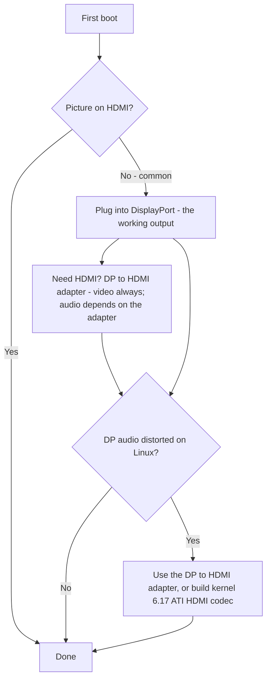

> 🌐 Topluluk çevirisi. İngilizce sürüm asıl kaynaktır ve daha güncel olabilir. Hata mı buldunuz? Bir [issue açın](https://github.com/lildebil0/awesome-bc250/issues). ([İngilizce orijinali](../en/14-display.md))

# Ekran ve Çıkış

> **Özet** — BC-250 monitörünüzü **DisplayPort** üzerinden sürer. Takılacak konektör budur. Kartınızda ayrıca bir HDMI portu varsa, o **çoğu zaman hiçbir şey göstermez** — yani oradaki siyah ekran *bozuk bir kart değil*, sadece yanlış çıkıştasınız. HDMI mi lazım? Bir **DP→HDMI adaptörü** kullanın — **video her zaman geçer, gecikme yok**; bazı adaptörler **ses** de taşır (test edilen bir tanesi taşıdı, [src](https://t.me/c/2424231195/9148)) ama ses belirli adaptöre bağlıdır, bu yüzden buna güvenmeyin (ses bölümüne bakın). Gerçek bir tuhaflık var: **DisplayPort sesi Linux'ta bozuk/yavaşlamış çıkıyor**; aynı DP→HDMI adaptörü bunu atlatır ve düzgün bir çekirdek tarafı düzeltme yaklaşık **kernel 6.17** civarında geliyor ([src](https://t.me/c/2424231195/17953), [src](https://t.me/c/2424231195/68051)).

"İlk önyüklemede görüntü yok" en **1 numaralı yeni gelen paniği**dir. Bir şeyin bozuk olduğuna karar vermeden önce aşağıdaki kutuyu okuyun.

---

## Görüntü yok mu? Şunu yapın

1. **HDMI'ya değil, DisplayPort'a takın.** BC-250'nin çalışan video çıkışı DisplayPort'tur ([src](https://t.me/c/2424231195/104784)). HDMI portu (varsa) genellikle boş olandır — kartı ona göre yargılamayın.
2. **Kartı yeniden oturtun ve tekrar deneyin.** Kartlar rutin olarak ilk denemede başlatılamaz — güç döngüsü yapın (tamamen kapat/aç) ve fiziksel olarak yeniden oturtun. Bir sahip: *"benimki geldiğinde de ilk denemede açılmadı … bazen bir düğme yeniden başlatmasında tam olarak başlatılmıyor — kapat/aç bunu düzeltiyor"* ([src](https://t.me/c/2424231195/15701)).
3. **Karttan önce kablodan/adaptörden şüphelenin.** Tek bir kartla, bozuk bir kablo veya adaptör baş şüphelidir ([src](https://t.me/c/2424231195/15699)). Bazı adaptörler firmware'de çalışır ama işletim sistemi yüklenince siyaha döner — *"görüntü GRUB'dan önce iyiydi, sistemde siyah ekran"* ([src](https://t.me/c/2424231195/38184)).
4. Bir partideki birkaç kart görüntü vermiyorsa **BIOS'u sıfırlayın / bilinen-iyi bir imajı yeniden flashleyin** — bu, monitörünüze değil, firmware'e işaret eder ([src](https://t.me/c/2424231195/15697), [src](https://t.me/c/2424231195/15705)).

Dördünü de elediğiniz halde hâlâ hiçbir şey yoksa, [troubleshooting.md](troubleshooting.md) sayfasına gidin.



---

## Çıkışlara bir bakış

| Çıkış | Çalışıyor mu? | Notlar |
|--------|--------|-------|
| **DisplayPort** | **Evet — çıkış budur** | Birincil/tek ekran konektörü; ses taşır. Repo I/O spesifikasyonu `1x DisplayPort` listeler ([repo](https://github.com/mothenjoyer69/bc250-documentation)). **DisplayPort 1.4**, tavan **4K@120 Hz**, HDR10 ile ([elektricM](https://github.com/elektricM/amd-bc250-docs/blob/main/docs/hardware/display.md)). |
| **HDMI portu** (takılıysa) | **Çoğu zaman boş** | Yeni gelenler kartın bozuk olduğunu sanır; genellikle değildir — DP'ye geçin. ([src](https://t.me/c/2424231195/104784)) |
| **Adaptör üzerinden DP → HDMI** | **Video: evet. Ses: adaptöre bağlı** | Video gecikmesiz geçer ([src](https://t.me/c/2424231195/9148)); ses yonga setine bağlıdır — test edin (ses bölümüne bakın). Ayrıca DP ses bozulması için standart düzeltmedir (aşağıda). |
| **İkinci video çıkışı** | **Kutudan çıkar çıkmaz değil** | Elektriksel olarak mevcut ama **doldurulmamış**; 2. bir monitörü zorlamak hack'ler gerektirir ve başkaları çipin gerçek bir 2. başının olmadığını söyler — tek çıkışı güvenli varsayım olarak kabul edin. ([src](https://t.me/c/2424231195/92978), [src](https://t.me/c/2424231195/104682)) |
| **Ağ üzerinden ikinci ekran** | **Evet** | BC-250'nin çıkışını LAN üzerinden başka bir makineye akıtın (Steam/Sunshine). ([src](https://t.me/c/2424231195/23660)) |

---

## Çözünürlükler, yenileme ve kablo

elektricM'in referansı tek DP bağlantısının gerçekte ne yaptığını netleştirir — bir monitör veya adaptör seçerken faydalı ([elektricM](https://github.com/elektricM/amd-bc250-docs/blob/main/docs/hardware/display.md)):

| Çözünürlük | Yenileme | Yol |
|------------|---------|------|
| 1920×1080 (1080p) | 144 Hz+ | Yerel DP veya herhangi bir adaptör |
| 2560×1440 (1440p) | 144 Hz+ | Yerel DP (pasif adaptörler genellikle 1440p@60 / DP 1.2'de tıkanır) |
| 3840×2160 (4K) | 60 Hz | Yerel DP veya **aktif** DP→HDMI 2.0 adaptör |
| 3840×2160 (4K) | 120 Hz | **Yalnızca yerel DP** — HDMI üzerinden 4K@120 için aktif bir DP 1.4→HDMI 2.1 adaptör gerekir ve sallantılıdır |

- **Kablo:** **VESA sertifikalı bir DisplayPort 1.4** kablosu, **1–2 m** kullanın; daha uzun kablolar senkron/kopma sorunlarına neden olur ([elektricM](https://github.com/elektricM/amd-bc250-docs/blob/main/docs/hardware/display.md)).
- **Düşük çözünürlükte takılıp kalma** (ör. yalnızca 1024×768/1080p, 60 Hz) genellikle GPU sürücüsünün yüklenmediği anlamına gelir — `glxinfo | grep "OpenGL renderer"` ile kontrol edin; `llvmpipe` = yazılım render'ı, Mesa 25.1+ kurun ve `nomodeset`'i kaldırın ([elektricM](https://github.com/elektricM/amd-bc250-docs/blob/main/docs/troubleshooting/display.md)). [06-linux.md](06-linux.md) sayfasına bakın.
- **HDR (HDR10) ve VRR** çalışır ama Linux'ta deneyseldir — **KDE Plasma 6+** en iyi desteğe sahiptir ve genellikle bir Wayland oturumu gerektirir ([elektricM](https://github.com/elektricM/amd-bc250-docs/blob/main/docs/hardware/display.md)). **Dağıtım burada önemlidir:** bir r/BC250Gaming (Reddit) topluluk bildirimi **HDR + VRR'yi yalnızca CachyOS'ta düzgün çalıştırdı** (Plasma 6 + Wayland), oysa **Bazzite'te HDR grafik bozulmalarına neden oldu ve VRR hiç çalışmadı**. Örnekleri: **UGREEN DP→HDMI 2.1** adaptörü üzerinden **1440p Yüksek, HDR + VRR açık, 60–80 FPS** ile *Forza Horizon 6*. HDR/VRR bir öncelikse, [06-linux.md](06-linux.md) sayfasındaki CachyOS notuna bakın.
  - **Bazzite KDE kullanıyorsanız ve HDMI üzerinden VRR/FreeSync istiyorsanız**, AMD'nin HDMI 2.1 / FRL çekirdek çalışmasını yerine koyan bir topluluk remiksi var: **[`dyllan500/bazzite-amd-hdmi-kde`](https://github.com/dyllan500/bazzite-amd-hdmi-kde)** — AMD'nin resmi HDMI-2.1 VRR yamalarını (`amd-staging-drm-next`'ten) taşıyan bir çekirdek üzerine yeniden inşa edilmiş bir Bazzite KDE imajı. ⚠ **ağır çekince koyun:** bu üçüncü taraf bir imajdır, yazar VRR'yi yalnızca bir **Radeon 9070 XT** üzerinde test etti (BC-250'de değil) ve yamalar stok bir Bazzite çekirdeğine indiğinde geçersiz hâle gelmesi amaçlanıyor. Bu, doğrulanmış bir BC-250 düzeltmesi *değildir* — bir garanti değil, denenecek deneysel bir yol olarak görün.

> **Oturum açtıktan *sonra* siyah ekran (GRUB ve oturum açma ekranı iyiydi)** bir masaüstü oturumu sorunudur, genellikle **Wayland** — oturum açma dişlisinde "GNOME on Xorg"/"Plasma (X11)" seçin ya da `/etc/gdm/custom.conf` içinde `WaylandEnable=false` ayarlayın ([elektricM](https://github.com/elektricM/amd-bc250-docs/blob/main/docs/hardware/display.md)). Oturum açmadan *önce* siyah ekran ise bu değil, yukarıdaki sürücü/`nomodeset` sorunudur.

---

## DisplayPort sesi bozuk — adaptör düzeltmesi

Linux'ta, **doğrudan DisplayPort'tan** gönderilen ses BC-250'de yanlış çıkar — bozuk, *"gerilmiş, sanki yarı hıza yavaşlatılmış gibi"* ve çıtırtılı olarak tarif edilir ([src](https://t.me/c/2424231195/9895)). Bu bir **Linux/DP-protokol sorunudur, bir kart kusuru değil** — BC-250 olmayan donanımda da görülmüştür ([src](https://t.me/c/2424231195/15983)).

Sohbetin üzerinde uzlaştığı açık sözlü, güvenilir geçici çözüm: **sinyali bir DP→HDMI adaptörden geçirin.** HDMI'ya dönüştürülünce ses bozuklukları kaybolur ([src](https://t.me/c/2424231195/17953), [src](https://t.me/c/2424231195/51763)). Bir kullanıcı bunu doğrudan doğruladı: *"Bir DisplayPort→HDMI adaptörü üzerinden ses çıkışını test ettim. Her şey yolunda, gecikme yok"* ([src](https://t.me/c/2424231195/9148)).

**Hepsinin en temiz yolu düz bir DP→HDMI *kablosu*dur — bir ucunda DP fişi, diğer ucunda HDMI fişi, iki ucunda da adaptör dongle'ı veya kutu yok.** r/linux_gaming topluluk başlığındaki birden çok kullanıcı bağımsız olarak bunun en güvenilir sesi verdiğini bildiriyor: düz bir kablo (ör. bir Amazon Basics DP-to-HDMI kablosu, ~10$) dongle tarzı adaptörlerin isabetli-veya-ıskalama olduğu yerde "öylece çalışır". Arada sırada kısa ses kesilmeleri yine de olabilir ama tek parça bir kablo, dongle yolunu kumar yapan ekstra adaptör yonga setini ortadan kaldırır ([r/linux_gaming](https://www.reddit.com/r/linux_gaming/comments/1nvsgji/)). Zaten satın alıyorsanız, **dongle yerine kabloyu tercih edin.**

**Elinizde adaptör yoksa,** sesi bunun yerine **Bluetooth** üzerinden yönlendirin — çoğu hoparlör/kulaklık bunu destekler ve DP yolunu tamamen atlatır ([src](https://t.me/c/2424231195/89769)). BT dongle'ı için [10-wifi-bt.md](10-wifi-bt.md) sayfasına bakın.

### Adaptör notları (topluluk)
- **4K@60+ için *aktif* bir adaptör/kablo gerekir** (pasif ~1440p@60'ta tıkanır). Çalışan, test edilmiş bir örnek: **UGREEN DP125 (DP→HDMI 4K kablosu)** — 4K@30 olarak derecelendirilmiş ama bir TV'de 4K@60 müzakere etti ([src](https://t.me/c/2424231195/52398)). Aktif ve pasif, çözünürlük tavanını belirler — sesin geçip geçmediğine karar **vermez** (aşağıya bakın).
- **Tüm adaptörler ses taşımaz.** Bir sahibin Belsis adaptörü 4K@60'ı ses *ile* geçirdi, oysa birkaç daha pahalı Ugreen ünitesi cihaz listesinde "HDMI digital audio" gösterdi ama hiç ses çıkarmadı — ve biri sesleri bir oktav aşağı kaydırdı ([src](https://t.me/c/2424231195/106617)). Video alıp ses almazsanız, değişken adaptördür — bir başkasını deneyin.
- **HDMI *sesi* için önce bir *pasif* adaptöre uzanın.** r/linux_gaming başlığındaki bir topluluk örüntüsü: **pasif** DP→HDMI adaptörleri sesi temiz geçirme eğilimindedir, oysa **aktif** adaptörler genellikle **sesi tamamen düşürür veya perde kaydırır** (seslerin ~%20 / kabaca bir beşli aşağı kaydığı bildirildi). Olay şu: aktif bir adaptöre yalnızca gerçek **HDR** için (ve 4K@60+ için) *ihtiyacınız var*, bu yüzden gerçek bir ödünleşmedir — güvenilir ses için pasif, HDR için aktif. Topluluk-doğrulanmış-çalışan *pasif* seçenekler: **Silver Monkey**, **BENFEI (ASIN B017Q8ZVWK)** ve **AmazonBasics DP-to-HDMI _kablosu_** (tek parça kablo — dongle tarzı adaptörleri *değil*) ([r/linux_gaming](https://www.reddit.com/r/linux_gaming/comments/1nvsgji/)). ⚠ belirli SKU'lar topluluk tarafından bildirildi, burada laboratuvarda doğrulanmadı — ve bir pasif adaptör yine ~**1440p@60**'ta tıkanır.
- Hem videoyu hem sesi geçiren ucuz **4K@60 DP→HDMI** adaptörleri mevcuttur ve çalışır olarak bildirilir ([src](https://t.me/c/2424231195/133977)).
- Bazı adaptörler özellikle **4K monitörlerde** hatalı davranır ([src](https://t.me/c/2424231195/1988)).
- **Bir DP→HDMI adaptörü üzerinden ses tutarsızdır ve adaptörün yonga setine bağlıdır — basitçe aktif ve pasif olmasına değil.** Video her zaman geçer; **değişken olan sestir.** Topluluk bildirimlerimiz adaptör-adaptör bazındadır (UGREEN/Belsis üniteleri ses taşıdığı bildirildi, bazı diğer üniteler sessiz) ve elektricM'in kılavuzu *tersi* ayrımı bildirir (pasif ses taşıyor, bazı aktif üniteler sessiz — ör. Cable Matters/StarTech) — ki bu tam olarak aktif/pasif etiketinin bunu öngörmemesinin nedenidir ([elektricM](https://github.com/elektricM/amd-bc250-docs/blob/main/docs/troubleshooting/display.md)). **Güvenilir** ses için, bir adaptöre bel bağlamayın: bir **DisplayPort-yerel ekran/AV alıcısı** tercih edin ya da sesi **USB (bir USB DAC/ses cihazı)** üzerinden çıkarın. Bir adaptör kullanırsanız, **ona güvenmeden önce sesi test edin** — ve bir **pasif** adaptörün ~**1440p@60**'ta tıkandığını unutmayın.

### kernel-6.17 düzeltmesi (DP-doğrudan ses, adaptörsüz)

Adaptörsüz, **doğrudan DisplayPort üzerinden** temiz ses istiyorsanız, neden ve düzeltme sohbette bulundu. Fedora'nın stok çekirdek yapılandırması `snd-hda-codec-hdmi.ko` + `snd-hdmi-lpe-audio.ko` derliyordu; **kernel 6.17 HDMI ses yolunu değiştirdi** ve o varsayılan yapılandırmada sesi bozdu. Düzeltme, **ATI HDMI codec'ini** de derlemektir — çekirdek yapılandırmasını `# CONFIG_SND_HDA_CODEC_HDMI_ATI is not set`'ten `CONFIG_SND_HDA_CODEC_HDMI_ATI=m`'e çevirin, ki bu `snd-hda-codec-atihdmi.ko` paketler; ses ardından **yamalar olmadan** çalışır ([src](https://t.me/c/2424231195/68051), [src](https://t.me/c/2424231195/68061)).

```text
# Fedora kernel config change for DP/HDMI audio on kernel 6.17+
# from:
# CONFIG_SND_HDA_CODEC_HDMI_ATI is not set
# to:
CONFIG_SND_HDA_CODEC_HDMI_ATI=m
```

O üçüncü codec (`snd-hda-codec-atihdmi.ko`) mevcutken, ALSA kartın ses çıkışlarını açığa çıkarır (ör. iki HDMI cihazı olarak `pcm=3` ve `pcm=7`) ([src](https://t.me/c/2424231195/68062), [src](https://t.me/c/2424231195/67569)). ⚠ doğrulayın — bu, özel bir çekirdek derlemeyi gerektirir; çoğu kullanıcı için DP→HDMI adaptörünü derleme-gerektirmeyen yol olarak görün. Çekirdek/sürücü kurulumu için [06-linux.md](06-linux.md) sayfasına bakın.

### Surround ses (5.1) — HDMI değil, bir USB ses kartı kullanın

**HDMI üzerinden 5.1 surround BC-250'de çalışmaz.** Bu başsız/madenci kalıbı için AMD'nin Linux'taki HDMI firmware'i çok kanallı LPCM'yi açığa çıkarmaz, bu yüzden alıcı ne desteklerse desteklesin HDMI çıkışı düz stereoya geri döner ([r/linux_gaming](https://www.reddit.com/r/linux_gaming/comments/1nvsgji/)). Gerçek çok kanal için, sesi bunun yerine bir **USB ses kartı / USB DAC** üzerinden yönlendirin — `pavucontrol` içinde varsayılan çıkış (sink) olarak ayarlayın, ardından altı kanalın tümünü şununla doğrulayın:

```bash
speaker-test -D pipewire -c 6 -t wav
```

Aynı USB-DAC yolu, adaptörler hatalı davrandığında stereo ses için de güvenilir düzeltmedir (yukarıda).

---

## İkinci çıkış (başlangıçta etkin değil)

Kartta **kutudan çıkar çıkmaz etkin olmayan ikinci bir video çıkışı** var. Topluluk yorumu ikiye bölünmüş ve her iki yarısını da bilmek değer:

- **Elektriksel olarak mevcut ama doldurulmamış/lehimlenmemiş** ve *"hack'lerle 2. bir monitörü çalıştırabilirsiniz"* ([src](https://t.me/c/2424231195/92978)).
- Başkaları çipin basitçe **kullanılabilir bir ikinci başının olmadığını** bildirir — *"sorun çipte, ikinci çıkış fiziksel olarak orada değil"* ([src](https://t.me/c/2424231195/104682)).

Pratikte: **tek bir DisplayPort çıkışı varsayın.** İki bağımsız ekran için bir DP **MST splitter sorulmuş ama sohbetimizde çalıştığı doğrulanmamıştır** ([src](https://t.me/c/2424231195/92109)).

**elektricM'den güncelleme — doğru hub'la MST iki ekranı sürebilir.** elektricM'in testi bir **DP MST hub üzerinden en fazla 2 ekran** bildiriyor (bant genişliği paylaşılır, ekran başına çözünürlük sınırlı), hub-hub sonuçlarıyla ([elektricM](https://github.com/elektricM/amd-bc250-docs/blob/main/docs/hardware/display.md)):

| MST hub | Çıkış | DP sürümü | Bağımsız ekranlar? | Ses | Notlar |
|---------|-----|--------|-----------------------|-------|-------|
| StarTech MST14DP122DP | 2× DP | 1.4 | **Evet** | Evet | Monitörler/kablolar arasında tutarlı çalıştı |
| Monoprice 21972 | 2× DP | 1.2 | **Yalnızca yansıtma** | Evet | Yalnızca yansıtabildi |
| ENBUER | 2× DP | 1.2 | **Yalnızca yansıtma** | Evet | Yalnızca yansıtabildi |
| Genel HDMI MST | 2× HDMI | — | **Hayır** | Hayır | Video veya ses yok |

Yani yerel çift monitör DP 1.4 hub ile MST üzerinden mümkün **dür** (StarTech doğrulandı); daha ucuz DP 1.2 hub'lar yalnızca yansıtabilir ve HDMI MST hub'lar başarısız oldu. ⚠ doğrulayın — tek doğrulanmış hub modeli; sonuçlar hub'a göre değişir.

**Diğer çoklu ekran yolu — USB DisplayLink adaptör.** Ekstra bir **masaüstü** ekranı için bir USB→HDMI/DP DisplayLink adaptörü ekleyin (en iyi sonuç için önyüklemeden *sonra* takın). **Oyun için değil** — CPU'da sıkıştırır, ki bu BC-250'nin darboğazıdır, bu yüzden gecikme yüksektir; ayrıca Steam Deck **oyun modunda** çalışmaz ([elektricM](https://github.com/elektricM/amd-bc250-docs/blob/main/docs/hardware/display.md)).

---

## Ağ üzerinden ikinci ekran (kolay "2. ekran")

BC-250 görüntüsünü gerçekten ikinci bir cihazda istiyorsanız, kanıtlanmış yol ikinci bir kablo değil — **LAN üzerinden akış**tır. Bir kullanıcı: *"BC-250'de (Fedora) bir Steam oyunu başlattım ve ağ üzerinden iş dizüstüme akıttım, dizüstünden kontrol ettim. Her şey çalıştı"* ([src](https://t.me/c/2424231195/23660)).

- **Sunshine** (host enkoder) burada çalışır çünkü yalnızca-NVIDIA değildir — kodlamayı o yapar, istemci yalnızca çözer ([src](https://t.me/c/2424231195/25091)). Gigabit LAN üzerinden neredeyse kusursuz bildirilir ([src](https://t.me/c/2424231195/25563)).
- **Host olarak Moonlight** uymaz — bir NVIDIA enkoder bekler ve eksik bir donanım çözücüden dolayı takılır/şikâyet eder ([src](https://t.me/c/2424231195/25050)). Host olarak Sunshine, istemci olarak yalnızca Moonlight kullanın.

Bu, ayrıca yukarıdaki doldurulmamış ikinci çıkış olmadan bir "çift ekran" hissi elde etmenin pratik yoludur.

---

## Kaynaklar

- DP→HDMI adaptörü video+ses geçirir, gecikme yok — https://t.me/c/2424231195/9148
- DP ses bozulması bir Linux sorunudur; adaptör düzeltir — https://t.me/c/2424231195/17953 · https://t.me/c/2424231195/9895 · https://t.me/c/2424231195/51763 · https://t.me/c/2424231195/15983
- Kernel 6.17 ses düzeltmesi (`CONFIG_SND_HDA_CODEC_HDMI_ATI=m`) — https://t.me/c/2424231195/68051 · https://t.me/c/2424231195/68061 · https://t.me/c/2424231195/68062 · https://t.me/c/2424231195/67569
- Çalışan adaptörler — UGREEN DP125 https://t.me/c/2424231195/52398 · Belsis vs diğerleri (ses değişir) https://t.me/c/2424231195/106617 · ucuz 4K@60 https://t.me/c/2424231195/133977
- DP çalışan çıkıştır; parayı iyi bir DP→HDMI adaptörüne harcayın — https://t.me/c/2424231195/104784
- İlk önyükleme görüntü-yok / yeniden oturtma / yeniden flash — https://t.me/c/2424231195/15697 · https://t.me/c/2424231195/15699 · https://t.me/c/2424231195/15701 · https://t.me/c/2424231195/38184
- İkinci çıkış mevcut ama doldurulmamış / tartışmalı — https://t.me/c/2424231195/92978 · https://t.me/c/2424231195/104682 · MST soruldu https://t.me/c/2424231195/92109
- Ağ ikinci ekranı (LAN üzerinden Sunshine/Steam) — https://t.me/c/2424231195/23660 · https://t.me/c/2424231195/25091 · https://t.me/c/2424231195/25050 · https://t.me/c/2424231195/25563
- Alternatif olarak Bluetooth ses — https://t.me/c/2424231195/89769
- Düz DP→HDMI **kablosu** (adaptörsüz) en güvenilir sestir; HDMI üzerinden 5.1 çalışmaz (çok kanallı LPCM yok), bir USB ses kartı / DAC kullanın — r/linux_gaming topluluk başlığı https://www.reddit.com/r/linux_gaming/comments/1nvsgji/
- Donanım I/O referansı (`1x DisplayPort`) — [mothenjoyer69/bc250-documentation](https://github.com/mothenjoyer69/bc250-documentation) · [`hardware.md`](https://github.com/mothenjoyer69/bc250-documentation/blob/main/hardware.md)
- DP 1.4 / 4K@120 / HDR10, çözünürlük+kablo sınırları, MST hub'lar (en fazla 2), DisplayLink, Wayland-oturum-açma siyah ekran — elektricM [`hardware/display.md`](https://github.com/elektricM/amd-bc250-docs/blob/main/docs/hardware/display.md)
- HDR + VRR CachyOS'ta çalışıyor (Plasma 6 + Wayland), Bazzite'te bozuk; UGREEN DP→HDMI 2.1 üzerinden Forza Horizon 6 1440p Yüksek HDR+VRR — r/BC250Gaming (Reddit) topluluk bildirimi ([06-linux.md](06-linux.md) sayfasına bakın)
- Pasif DP→HDMI ses taşır / aktif düşürür veya perde kaydırır; pasif ama HDR için gerekli; doğrulanmış pasifler Silver Monkey / BENFEI B017Q8ZVWK / AmazonBasics DP-to-HDMI kablosu — [r/linux_gaming topluluk başlığı](https://www.reddit.com/r/linux_gaming/comments/1nvsgji/)
- HDMI üzerinden Bazzite KDE VRR/FreeSync remiksi (AMD HDMI 2.1 çekirdeği; 9070 XT'de test edildi, BC-250'de değil) — [`dyllan500/bazzite-amd-hdmi-kde`](https://github.com/dyllan500/bazzite-amd-hdmi-kde)
- Adaptör sesi yonga setine bağlıdır (elektricM pasifin taşıdığını / bazı aktiflerin sessiz olduğunu gördü; topluluk tersini gördü — bu yüzden DP-yerel veya bir USB DAC tercih edin), düşük-çözünürlük llvmpipe kontrolü — elektricM [`troubleshooting/display.md`](https://github.com/elektricM/amd-bc250-docs/blob/main/docs/troubleshooting/display.md)

> Sürücü/çekirdek kurulumu [06-linux.md](06-linux.md) sayfasındadır; ses/çıkış tuzakları ayrıca [troubleshooting.md](troubleshooting.md) ve [faq.md](faq.md) sayfalarında dizinlenmiştir.
