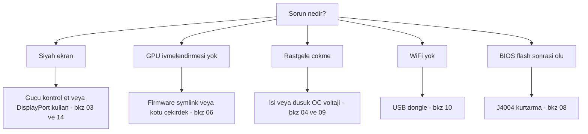

> 🌐 Topluluk çevirisi. İngilizce sürüm asıl kaynaktır ve daha güncel olabilir. Hata mı buldunuz? Bir [issue açın](https://github.com/lildebil0/awesome-bc250/issues). ([İngilizce orijinali](../en/troubleshooting.md))

# Sorun Giderme

> **Özet** — BC-250'nin arıza modları iyi bilinir: çoğu **güç**, **ısı**, **çekirdek/firmware** veya **ters giden bir flash**'tır. Belirtinizi aşağıda bulun, düzeltmeyi uygulayın ve tam bölüme giden bağlantıyı takip edin. Şüphedeyseniz, neden genellikle *kötü bir çekirdek*, *amdgpu firmware sembolik bağlantısının eksikliği* ya da *yetersiz soğutmadır*.

Bu sayfa, topluluğun tekrarlayan sorunlarından damıtılmış bir belirti → neden → düzeltme indeksidir. Bölümlerin yerini tutmaz — sizi hızla doğru olana yönlendirir.

---

## Önyükleme / ekran

| Belirti | Olası neden | Düzeltme |
|---------|--------------|-----|
| Siyah ekran / POST yok | Güç kablolaması veya pinout yanlış | 8 pin kablolamasını ve pinout'u tekrar kontrol edin; yeterli kalınlıkta gerçek bakır kablo kullanın → [03 — Güç](../en/03-power-supply.md) |
| Çalışırken siyah ekran / çökmeler | **IOMMU hâlâ etkin** (bu kartta bozuk) | BIOS'ta IOMMU'yu devre dışı bırakın (elektricM); `iommu=off`/`amd_iommu=off` çekirdek parametresi ⚠ doğrulayın → [06 — Linux](../en/06-linux.md) |
| **Yükleyiciyi** / canlı USB'yi önyüklerken siyah ekran | Yükleyicide BC-250 GPU sürücüsü yok; KMS başarısız olur | GRUB'da `nomodeset` ekleyin (Fedora: Troubleshooting → Basic Graphics Mode); **Mesa kurulduktan sonra kaldırın** ([elektricM](https://github.com/elektricM/amd-bc250-docs/blob/main/docs/troubleshooting/boot.md)) → [06 — Linux](../en/06-linux.md) |
| **Giriş yaptıktan sonra** siyah ekran (GRUB + giriş ekranı sorunsuzdu) | Masaüstü oturumu, genellikle **Wayland** | Girişte X11 seçin ("GNOME on Xorg"/"Plasma X11") veya `WaylandEnable=false` ([elektricM](https://github.com/elektricM/amd-bc250-docs/blob/main/docs/troubleshooting/display.md)) → [14 — Ekran](../en/14-display.md) |
| Önyükler ama GPU ivmelendirmesi yok (her şey CPU'da) | Eksik amdgpu firmware sembolik bağlantısı veya kötü bir çekirdek | `navi10_gpu_info.bin` sembolik bağlantısını + çekirdek parametrelerini uygulayın; bilinen kötü çekirdeklerden kaçının (aşağıda) → [06 — Linux](../en/06-linux.md) |
| `glxinfo` **llvmpipe** gösteriyor, oyunlar 5–10 FPS | Mesa çok eski veya amdgpu yüklü değil | **Mesa 25.1.3+** kurun, `nomodeset`'i kaldırın, `Kernel driver in use: amdgpu`'yu doğrulayın ([elektricM](https://github.com/elektricM/amd-bc250-docs/blob/main/docs/troubleshooting/performance.md)) → [06 — Linux](../en/06-linux.md) |
| Çalışıyordu, sonra bir çekirdek güncellemesinden sonra bozuldu | O çekirdekteki regresyon | Bir LTS çekirdeğe geri dönün; **6.14.7**, **6.15.0–6.15.6** ve **6.17.8–6.17.10** amdgpu'yu bozar şekilde bildirildi (CPU geri dönüşü / GPU çökmeleri); elektricM **6.18.x LTS veya 6.17.11+** önerir ⚠ kesin aralıkları doğrulayın → [06 — Linux](../en/06-linux.md) |
| HDMI ses yok | Çekirdek 6.17+ regresyonu | Bir LTS çekirdek kullanın veya sesi USB/DisplayPort üzerinden yönlendirin → [06 — Linux](../en/06-linux.md) |
| Yalnızca bir ekran çıkışı çalışıyor | Bu kartta sürücü sınırlaması | Yerel çift ekran için bilinen sınırlama; **MST hub'ı 2 ekrana kadar verir** (DP 1.4 hub) ([elektricM](https://github.com/elektricM/amd-bc250-docs/blob/main/docs/hardware/display.md)) → [14 — Ekran](../en/14-display.md) |
| Ekran yok, POST yok, **yalnızca NVMe takılıyken** | SSD'de hâlâ **Windows** EFI/kurtarma bölümleri var | SSD'yi çıkarın, başka bir PC'de tüm bölümleri silin (`wipefs -a`), yeniden kurun ([elektricM](https://github.com/elektricM/amd-bc250-docs/blob/main/docs/troubleshooting/boot.md)) → [06 — Linux](../en/06-linux.md) |
| Hiç POST yapmıyor (BIOS yok) | Bazı kartlar **CMOS pili olmadan** POST yapmaz | Yeni bir CR2032 takın ve tekrar deneyin ([elektricM](https://github.com/elektricM/amd-bc250-docs/blob/main/docs/troubleshooting/boot.md)) → [08 — BIOS](../en/08-bios.md) |
| Önyükleme **~90 sn takılıyor** sonra devam ediyor | Başarısız systemd servisi / ağ zaman aşımı | `systemctl --failed`; takılı birimi devre dışı bırakın ([elektricM](https://github.com/elektricM/amd-bc250-docs/blob/main/docs/troubleshooting/boot.md)) → [06 — Linux](../en/06-linux.md) |
| Çekirdek paniği "**unable to mount root**" / "No init found" | Yanlış çekirdek **veya** bozuk initramfs | Daha eski/LTS bir çekirdek önyükleyin; hâlâ başarısızsa chroot yapıp initramfs'i yeniden oluşturun (`dracut -f` / `update-initramfs -u -k all` / `mkinitcpio -P`) ([elektricM](https://github.com/elektricM/amd-bc250-docs/blob/main/docs/troubleshooting/boot.md)) → [06 — Linux](../en/06-linux.md) |
| `grub>` / `grub rescue>`'a düşüyor | GRUB yapılandırma/önyükleme dosyalarını bulamıyor | `root`/`prefix` ayarlayın, `insmod normal`, önyükleyin; ardından GRUB'u yeniden kurun ([elektricM](https://github.com/elektricM/amd-bc250-docs/blob/main/docs/troubleshooting/boot.md)) → [06 — Linux](../en/06-linux.md) |
| BIOS'a giremiyor (Del/F2 yok sayılıyor) | Adaptör başlatması yavaş veya klavye USB 3.0'da | Del'e hemen basın; bir **USB 2.0** portu ve yerel bir DP kablosu deneyin ([elektricM](https://github.com/elektricM/amd-bc250-docs/blob/main/docs/troubleshooting/display.md)) → [08 — BIOS](../en/08-bios.md) |

## Isı / kararlılık

| Belirti | Olası neden | Düzeltme |
|---------|--------------|-----|
| Yük altında throttle yapıyor / FPS düşüyor | Stok soğutucu blok masada soğutamıyor | Kanatçıkları inceltin + yüksek statik basınçlı 120 mm fan/kanal; <80 °C tutun → [04 — Soğutma](../en/04-cooling.md) |
| Yük altında rastgele çökme / yeniden başlatma | Aşırı ısınma (>90 °C) **veya** overclock voltajı çok düşük | Önce soğutmayı iyileştirin; sonra undervolt voltajını yükseltin — Furmark-kararlı ≠ oyun-kararlı (oyunlar daha yüksek gerektirir) → [04](../en/04-cooling.md) · [09](../en/09-overclock-undervolt.md) |
| Furmark'ta kararlı, oyunlarda çöküyor | Voltaj, yetersiz zorlayan Furmark'tan ayarlandı | OCCT + gerçek oyunlarla test edin; voltajı ~50 mV artırın → [09 — Overclock](../en/09-overclock-undervolt.md) |
| İki governor çatışıyor | oberon-governor *ve* smu_oc/cyan-skillfish birlikte çalışıyor | Yalnızca bir governor çalıştırın; diğerlerini devre dışı bırakın → [09 — Overclock](../en/09-overclock-undervolt.md) |
| GPU çöktüğünde **tüm sistem** ölüyor (sadece uygulama değil) | APU: CPU+GPU silikonu paylaşır, bu yüzden bir GPU reseti kurtarılamaz — sistemi de yıkar | Bu mimaride beklenir; kurtarma beklemek yerine GPU çökmelerini önleyin (kararlı voltaj + iyi soğutma + iyi çekirdek) ([elektricM](https://github.com/elektricM/amd-bc250-docs/blob/main/docs/troubleshooting/stability.md)) → [09 — Overclock](../en/09-overclock-undervolt.md) |
| GPU çöküyor → **siyah ekran, bir governor çalışırken hiç kurtulmuyor** | Governor reset sırasında sysfs'e yazmaya devam ediyor → takılı reset döngüsü | Çökmeye eğilimli oyunlardan önce `systemctl stop cyan-skillfish-governor-smu`; sonra tekrar etkinleştirin ([elektricM](https://github.com/elektricM/amd-bc250-docs/blob/main/docs/troubleshooting/stability.md)) → [09 — Overclock](../en/09-overclock-undervolt.md) |
| **Yalnızca 60–65 °C'de** donmalar / beyaz ekran | Bazı kartlar olağandışı şekilde sıcaklığa duyarlıdır | Soğutmayı iyileştirin, soğutucu bloğu yeniden oturtun, yeniden macun sürün (PTM7950); silikon değişir ([elektricM](https://github.com/elektricM/amd-bc250-docs/blob/main/docs/troubleshooting/stability.md)) → [04 — Soğutma](../en/04-cooling.md) |
| GPU **1500 MHz'de takılı**, daha düşüğe undervolt yapmıyor | min voltaj **700 mV'un altına** ayarlandı — GPU'yu yeniden kilitleyen sert bir tabandır | min voltajı **≥ 700 mV** tutun ([elektricM](https://github.com/elektricM/amd-bc250-docs/blob/main/docs/troubleshooting/stability.md)) → [09 — Overclock](../en/09-overclock-undervolt.md) |
| Daha fazla voltajın düzeltmediği artefaktlar / çökmeler | Yük altında **voltaj düşüşü** (efektif V, ayarlanan V'nin altına iner) | Düşüşü karşılamak için tabanı ~25 mV daha yüksek ayarlayın veya loadline/droop ayarı olan bir BIOS kullanın ([elektricM](https://github.com/elektricM/amd-bc250-docs/blob/main/docs/troubleshooting/stability.md)) → [09 — Overclock](../en/09-overclock-undervolt.md) |
| Önyükler sonra **ACPI hatalarıyla** çöker (siyah/yeşil ekran) | BIOS/ACPI tuhaflığı veya bozulması | CMOS'u temizleyin / BIOS varsayılanlarına dönün; `acpi=off noapic` deneyin; devam ederse yeniden flashleyin ([elektricM](https://github.com/elektricM/amd-bc250-docs/blob/main/docs/troubleshooting/stability.md)) → [08 — BIOS](../en/08-bios.md) |
| Uyku/askıya alma = **sözde donma** (siyah, takılmış gibi görünür) | Kartın düzgün GPU uyku durumları yok; SMU Linux askıya almayı desteklemiyor | Uyandırmak için güç düğmesine basın (basılı tutmayın); daha iyisi, **askıya almayı devre dışı bırakın** ve ekran karartmayı kullanın. Boşta yine de ~65–85 W kalır ([elektricM](https://github.com/elektricM/amd-bc250-docs/blob/main/docs/troubleshooting/stability.md)) → [09 — Overclock](../en/09-overclock-undervolt.md) |

## Performans

| Belirti | Olası neden | Düzeltme |
|---------|--------------|-----|
| FPS beklenenden düşük, GPU tam dolu değil | **CPU sınırlı** (Zen 2 birçok oyunda sınırdır) | Normal; CPU ağırlıklı ayarları düşürün, kabul edin — GPU'yu overclock yapmak burada yardımcı olmaz → [11 — Oyun](../en/11-gaming.md) |
| Yalnızca 24 CU aktif, 40 bekleniyordu | Stok daha az CU sunar | 40-CU açmayı uygulayın (`amdgpu.bc250_cc_write_mode=3` + script) → [09 — Overclock](../en/09-overclock-undervolt.md) |
| Steam / FSR / vsync bozuk | "Gamer" dağıtım fork'u müdahale ediyor | Bazı ayarlanmış fork'lar bunları bozar; sade Fedora/Bazzite-bc250 daha güvenlidir → [06 — Linux](../en/06-linux.md) |
| Yükten bağımsız GPU **1500 MHz'e kilitli** | Kullanıcı alanı governor yok (varsayılan BIOS-kilitli) | Frekansı ölçeklemek için bir GPU governor kurun (cyan-skillfish-governor-smu) ([elektricM](https://github.com/elektricM/amd-bc250-docs/blob/main/docs/troubleshooting/performance.md)) → [09 — Overclock](../en/09-overclock-undervolt.md) |
| Governor çalışıyor ama GPU **2000 MHz'i aşmıyor** | Çekirdekte frekans aralığı yaması yok (varsayılan üst sınır 1000–2000) | Yamalı bir çekirdek kullanın (Bazzite/CachyOS önceden yamalı) veya `amdgpu-frequency-range.patch` uygulayın ([elektricM](https://github.com/elektricM/amd-bc250-docs/blob/main/docs/troubleshooting/performance.md)) → [09 — Overclock](../en/09-overclock-undervolt.md) |
| MangoHud **%655** GPU kullanımı gösteriyor | amdgpu, aktivite metriğini `0xFFFF`'te bırakır; MangoHud 65535/100 okur | cyan-skillfish-governor-smu çalıştırın (smu dalı) — `gpu_metrics`'i yamalar; MangoHud değişikliği gerekmez. Ya da bağımsız **`install_gpu_usage_fix.sh`**'i uygulayın ([Old Lamer — Part XV](https://youtu.be/lSipaWjU6D4)) ([elektricM](https://github.com/elektricM/amd-bc250-docs/blob/main/docs/troubleshooting/performance.md)) → [09 — Overclock](../en/09-overclock-undervolt.md) |
| Bir yük testinde **Headless** "GPU hiçbir şey yapmıyor" | `glmark2 --off-screen` ekran olmadan sessizce **llvmpipe**'a (CPU) geri döner | `clpeak` / `vkmark` / `llama-bench -ngl 99` ile test edin; SCLK ve gücün yükseldiğini doğrulayın ([elektricM](https://github.com/elektricM/amd-bc250-docs/blob/main/docs/troubleshooting/performance.md)) → [06 — Linux](../en/06-linux.md) |
| 60+ FPS ama **takılıyor** / düzensiz kare süreleri | Kare hızlandırma (X11 compositor veya sese bağlı pacing) | **gamescope** üzerinden çalıştırın (`-W 1920 -H 1080 -f`) veya compositor'ı devre dışı bırakın / Wayland deneyin ([elektricM](https://github.com/elektricM/amd-bc250-docs/blob/main/docs/troubleshooting/performance.md)) → [11 — Oyun](../en/11-gaming.md) |
| Oyun **OOM çöküyor / artefaktlar sonra ölüyor** (RDR2, CoH3) | **512 MB dinamik VRAM + ZRAM** çakışması veya basitçe **RAM yetersizliği** | BIOS'u **sabit VRAM**'e geçirin (örn. 10 GB RAM / 6 GB VRAM); **ya da** systemd ZRAM'i devre dışı bırakıp **zswap + 32 GB Btrfs swapfile** kullanın ([Old Lamer — Part XIV](https://youtu.be/A6juAoY70aU), tarif [06](../en/06-linux.md)/[09](../en/09-overclock-undervolt.md)) ([elektricM](https://github.com/elektricM/amd-bc250-docs/blob/main/docs/troubleshooting/stability.md)) → [08 — BIOS](../en/08-bios.md) |
| Belirli bir oyun (örn. **RDR2**) CPU/llvmpipe'da render ediyor | Oyun varsayılan olarak yanlış grafik adaptörünü seçiyor | Oyun içinde adaptörü AMD GPU'ya ayarlayın; RDR2: `-useMaximumSettings` ile başlatın ([elektricM](https://github.com/elektricM/amd-bc250-docs/blob/main/docs/troubleshooting/performance.md)) → [11 — Oyun](../en/11-gaming.md) |

## Ağ

| Belirti | Olası neden | Düzeltme |
|---------|--------------|-----|
| Hiç WiFi yok | Yerleşik WiFi yok; dongle bir sürücü gerektirir | Bilinen iyi bir dongle (aic8800d80) kullanın + sürücüsünü derleyin → [10 — WiFi/BT](../en/10-wifi-bt.md) |
| WiFi her birkaç dakikada bir kopuyor | Realtek yongası + yük altında USB gücü | Bazı RTL882x dongle'larıyla bilinir; aic8800d80'a veya doğrulanmış bir modele geçin → [10 — WiFi/BT](../en/10-wifi-bt.md) |
| Yeniden başlatmadan sonra sürücü kayboluyor | Paketlenmemiş, ham `make` ile derlendi | Çekirdek güncellemelerinde kalması için deponun RPM/DKMS yolunu kullanın → [10 — WiFi/BT](../en/10-wifi-bt.md) |
| İnternet sağlayıcısı **Steam'i kısıyor** (çok yavaş) | Steam CDN trafiğinde DPI/kısıtlama | Kısıtlama önleyici araçlar (`zapret` tarzı) yardımcı olur — ama **Bazzite'ın salt okunur dosya sistemi bunları engeller**; değiştirilebilir bir dağıtım kullanın (Fedora/Arch). RU operatör ayrıntıları (Yota, zapret+warp) [Rusça sürümde](../ru/06-linux.md) → [06 — Linux](../en/06-linux.md) |

## Windows

| Belirti | Olası neden | Düzeltme |
|---------|--------------|-----|
| GPU = Code 43 / ivmelendirme yok | Çalışan Windows GPU sürücüsü yok (2026 başı itibarıyla) | Beklenir. Linux kullanın. Windows sürücüleri deneysel devam eden çalışmadır → [07 — Windows](../en/07-windows.md) |

## BIOS / tuğla

> ⚠ **Herhangi bir flash'tan önce [08 — BIOS](../en/08-bios.md)'u tam olarak okuyun.** Kötü bir flash kartı tuğlaya çevirir ve bir CMOS temizliği 1.0/3.00 modunu **kurtarmaz**.

| Belirti | Olası neden | Düzeltme |
|---------|--------------|-----|
| BIOS flash'ından sonra ölü/siyah | Kötü imaj veya yanlış ayarlar | Harici kurtarma: bir CH341A'yı **J4004 başlığına** bağlayın (SOIC-8 klipsi bu kartta işe **yaramaz**) ve bilinen iyi bir imajı yeniden flashleyin → [08 — BIOS](../en/08-bios.md) |
| Programlayıcı yongayı okuyamıyor | 5 V veri hatları / yanlış yonga hedeflendi | 3,3 V kullanın; 16 MB `BIOS_A1`'i flashleyin, asla 512 KB SuperIO'yu değil → [08 — BIOS](../en/08-bios.md) |
| Ayarlar kalıcı olmuyor | Eski mod sürümü | RAM/GDDR6 zamanlamalarının gerçekten uygulandığı 5.00 modunu kullanın → [08 — BIOS](../en/08-bios.md) |
| **RAM zamanlamalarını/frekansını** değiştirdikten sonra önyüklenmiyor | Kararsız bellek ayarları **BIOS'u bozdu** (P3.00 watchdog; Rusça BC-250 sohbeti bunu bildirdi) | CMOS temizliği yeterli olmayabilir — bilinen iyi bir imajı **donanımsal yeniden flashleyin** (CH341A / Pi Pico). RAM'i ayarlamadan *önce* çalışan BIOS'u yedekleyin; her seferinde bir zamanlama ayarlayın (en çok tREF kazanç verir) ([elektricM](https://github.com/elektricM/amd-bc250-docs/blob/main/docs/troubleshooting/stability.md)) → [08 — BIOS](../en/08-bios.md) |
| BIOS ayarları kalıcı olmuyor → siyah ekran / düşük RAM | USB flash'ından sonra CMOS temizlenmedi (2–3 temizlik gerekebilir) | CMOS'u temizleyin, yeniden yapılandırın, 512 MB'ın hâlâ ayarlı olduğunu doğrulamak için **BIOS'a** yeniden başlatın; `free -h`'nin ~15,5 GB gösterdiğini doğrulayın ([elektricM](https://github.com/elektricM/amd-bc250-docs/blob/main/docs/troubleshooting/stability.md)) → [08 — BIOS](../en/08-bios.md) |

---

## Hâlâ takıldınız mı?
- **[SSS](faq.md)**'yi kontrol edin.
- Topluluk sohbetini konuya göre arayın (her bölümün **Kaynaklar**'ı gerçek tartışmalara bağlanır).
- Yardım isterken **dağıtım + çekirdek sürümünüzü**, **saat hızları/governor**'ınızı ve **soğutma**nızı belirtin — bu üçü çoğu sorunu açıklar.

### Yukarıdaki satırlar için kaynaklar
- elektricM sorun giderme rehberleri — [`boot.md`](https://github.com/elektricM/amd-bc250-docs/blob/main/docs/troubleshooting/boot.md) · [`display.md`](https://github.com/elektricM/amd-bc250-docs/blob/main/docs/troubleshooting/display.md) · [`performance.md`](https://github.com/elektricM/amd-bc250-docs/blob/main/docs/troubleshooting/performance.md) · [`stability.md`](https://github.com/elektricM/amd-bc250-docs/blob/main/docs/troubleshooting/stability.md) · [`hardware/display.md`](https://github.com/elektricM/amd-bc250-docs/blob/main/docs/hardware/display.md)
- Old Lamer (YouTube): [Part XIV — zswap + 32 GB Btrfs swap](https://youtu.be/A6juAoY70aU) · [Part XV — `install_gpu_usage_fix.sh`](https://youtu.be/lSipaWjU6D4)
- [4pda BC-250 başlığı](https://4pda.to/forum/index.php?showtopic=1104980) — RU internet sağlayıcısı Steam kısıtlaması (Yota, zapret+warp).
- Bölüm başına topluluk sohbeti atıfları her bağlantılı bölümün **Kaynaklar**'ında yer alır.
