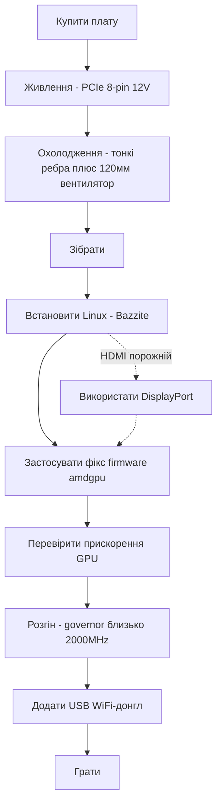

> 🌐 Переклад спільноти. Англійська версія є джерелом істини й може бути новішою. Знайшли помилку? Відкрийте issue: [English](../en/00-start-here.md) · [issues](https://github.com/lildebil0/awesome-bc250/issues)

# Почніть звідси — від нуля до гри

> **Коротко** — Ви купили (або збираєтесь купити) AMD BC-250. Це APU-плата на базі PlayStation 5 із 16 ГБ GDDR6, з якої виходить дешевий бокс для ігор/ШІ під Linux — **якщо** ви по черзі вирішите три речі: **живлення**, **охолодження** та **драйвери Linux**. Ця сторінка — пряма лінія від плати в коробці до запущеної гри. Виконуйте кроки; кожен веде до повного розділу.

Ця плата — це проєкт, а не готовий ПК за принципом plug-and-play. Закладіть на неї вихідні. Двома способами люди найчастіше «вбивають» плату на старті — це **неправильне підключення живлення** та **робота в перегріві**, тому з них і починаємо.

---

## Перш ніж почати — деталі та інструменти

Тримайте все це під рукою *до* початку, щоб не виявити нестачу кожної дрібниці посеред збірки:

- **БЖ** із виходом PCIe 8-pin 12 В → **[03 — Блок живлення](../en/03-power-supply.md)**
- **120-мм вентилятор високого статичного тиску** + друкований кожух → **[04 — Охолодження](../en/04-cooling.md)** / **[05 — Корпуси та 3D-друк](../en/05-case.md)**
- **Друкований корпус або кріплення** → **[05 — Корпуси та 3D-друк](../en/05-case.md)**
- **USB-флешка ≥ 16 ГБ** для інсталятора Linux
- **Кабель DisplayPort** (або адаптер DP→HDMI — HDMI плати часто нічого не показує, DisplayPort найнадійніший)
- **Викрутка**
- **Мультиметр** — щоб перевірити проводку БЖ магнітом і на «прозвон» → **[03 — Блок живлення](../en/03-power-supply.md)**

---

## Шлях



### 0. Зрозумійте, що у вас є
BC-250 — це серверний/майнінговий blade: один APU (CPU на Zen 2 + GPU класу RDNA2, «Cyan Skillfish/Oberon»), 16 ГБ GDDR6, **пасивний радіатор**, живлення від одного **12 В PCIe 8-pin**. Немає вбудованого WiFi, немає робочого драйвера GPU для Windows, немає апаратного кодування відео. → **[01 — Що таке BC-250](../en/01-what-is-bc250.md)**

### 1. Купуйте правильну річ
Знайте, яка ціна справедлива, що в комплекті (тільки плата? радіатор? БЖ?) і яких продавців/шахраїв уникати. → **[02 — Гайд із купівлі](../en/02-buying.md)**

### 2. Розберіться з живленням *перед першим запуском*
Плата хоче ~235 Вт (більше при розгоні) по 12 В через PCIe 8-pin. Використовуйте справжній БЖ (серверний Flex / брикет Mean Well / ATX), правильно змонтуйте 8-pin **справжнім мідним проводом достатнього перерізу** і не вгадуйте розпіновку — помилка тут означає мертву плату. → **[03 — Блок живлення](../en/03-power-supply.md)**

### 3. Налагодьте охолодження *перед навантаженням*
Штатний радіатор розрахований на стоєчний «вітровий тунель» і **тротлить на столі**. Стоншіть ребра та прикрутіть 120-мм вентилятор високого статичного тиску через друкований кожух (або поставте СВО). Ціль: не вище ~80 °C у Furmark. → **[04 — Охолодження](../en/04-cooling.md)**

### 4. Помістіть її в корпус (необов'язково, але приємно)
Надрукуйте корпус у стилі консолі, який тримає плату, вентилятор та БЖ із реальним обдувом. Каталог STL від спільноти. → **[05 — Корпуси та 3D-друк](../en/05-case.md)**

### 5. Зберіть це
Фізичний порядок дій для мінімальної збірки: прикріпіть вентилятор до друкованого кожуха → насадіть/прикрутіть кожух поверх (стоншених) ребер радіатора → встановіть плату в корпус/кріплення → підключіть 8-pin БЖ до плати (правильна розпіновка, **[03 — Блок живлення](../en/03-power-supply.md)**) → підключіть кабель DisplayPort до монітора → увімкніть і переконайтеся, що проходить **POST** (POST = самотестування при ввімкненні; плата вмикається й видає відео — ви отримуєте зображення / вентилятор крутиться). Усе шліфування ребер робіть *до* монтажу (див. **[04 — Охолодження](../en/04-cooling.md)**) і не допускайте потрапляння металевого пилу на плату.

> Підписане фото/схема цієї збірки буде бажаним внеском — у репозиторії його поки немає.

### 6. Встановіть Linux + драйвери GPU
Це вирішальний крок, де все або вдається, або ні. Найпростіше для новачків: **образ на базі Bazzite**, зібраний під BC-250 (або **Fedora 43** — інший варіант «просто працює» від elektricM; Fedora 42 знята з підтримки). Потім застосуйте **фікс firmware amdgpu** (символьне посилання `navi10_gpu_info.bin`) та параметри ядра, перегенеруйте initramfs/grub і переконайтеся, що GPU прискорений (`vainfo`, `dmesg`). → **[06 — Драйвери та налаштування Linux](../en/06-linux.md)**

> **Два налаштування, які коштують годин болю, якщо їх пропустити** (elektricM): у модифікованому BIOS виставте **VRAM = 512 MB dynamic** та **вимкніть IOMMU** (зламаний IOMMU спричиняє збої дисплея й вильоти), потім **скиньте CMOS** після прошивки. Встановлюйте з параметром завантаження `nomodeset` і **приберіть його, щойно драйвери стануть на місце**. Mesa **25.1+** — це мінімум (рекомендовано 25.3.x). І **уникайте ядер 6.15.0–6.15.6 та 6.17.8–6.17.10** — вони ламають драйвер GPU; натомість використовуйте 6.18 LTS / 6.17.11+ / 6.12–6.14 LTS. ([швидкий старт elektricM](https://elektricm.github.io/amd-bc250-docs/getting-started/quick-start/), [швидкий довідник](https://elektricm.github.io/amd-bc250-docs/reference/quick-reference/))

> Думаєте про Windows? Станом на початок 2026 робочого драйвера GPU для Windows **немає** — він експериментальний. Використовуйте Linux. → **[07 — Windows](../en/07-windows.md)**

### 7. Переконайтеся, що працює на штатних, потім розганяйте
Коли робочий стіл прискорений, встановіть **oberon-governor** і піднімайте частоти (1500 MHz зі штату слабкі; **2000 MHz ≈ +30 % FPS**). За бажанням розблокуйте всі **40 CU** та зробіть андервольтинг. Перетестуйте температури на нових частотах. → **[09 — Розгін та андервольтинг](../en/09-overclock-undervolt.md)**

### 8. Вийдіть в інтернет
Вбудованого WiFi немає — додайте **перевірений USB-донгл** (фаворит спільноти — aic8800d80) та його драйвер. → **[10 — WiFi та Bluetooth](../en/10-wifi-bt.md)**

### 9. Грайте
Налаштуйте реалістичні очікування (обмежувачем часто є CPU на Zen 2, а не GPU), увімкніть FSR і використовуйте налаштування спільноти для кожної гри. → **[11 — Результати в іграх та налаштування](../en/11-gaming.md)**

### Бонус — запуск локальних LLM
16 ГБ VRAM — це багато за свою ціну. Запускайте llama.cpp на бекенді **Vulkan** (ROCm на цьому GPU — глухий кут). → **[12 — ШІ / LLM](../en/12-ai-llm.md)**

### Бонус — емуляція
Switch, PS3, PS4, ретро, аркади — що реально запускається і як → **[15 — Емуляція](../en/15-emulation.md)**

> Немає зображення при першому запуску? Плата виводить через **DisplayPort** (HDMI часто порожній) → **[14 — Дисплей та вивід](../en/14-display.md)**. Бракує USB-портів або додаєте накопичувач? → **[16 — USB, хаби та накопичувачі](../en/16-usb-peripherals.md)**

---

## Якщо щось зламалося
Чорний екран, немає прискорення, випадкові перезавантаження, відвал донгла, «цеглина» після прошивки BIOS — див. **[Усунення проблем](troubleshooting.md)** та **[FAQ](faq.md)**.

> Прошивка модифікованого BIOS — це **не** початковий крок. Вона може перетворити плату на «цеглину» й вимагає апаратури для відновлення. Беріться за неї лише свідомо. → **[08 — BIOS та відновлення з «цеглини»](../en/08-bios.md)**

---

## Чек-лист на 60 секунд

| Крок | Готово, коли |
|------|-----------|
| Живлення | БЖ підключено до 8-pin, правильна розпіновка, справжній мідний провід, плата проходить POST |
| Охолодження | Ребра стоншено + 120-мм вентилятор/кожух; <80 °C у Furmark |
| ОС | Bazzite-bc250 встановлено, завантажується до робочого столу |
| GPU | `vainfo`/`dmesg` показують активний amdgpu, а не відкат на CPU |
| Розгін | oberon-governor працює, ~2000 MHz, стабільно в реальній грі |
| Мережа | USB-донгл під'єднується й тримає зв'язок |
| Гра | Видає очікуваний FPS для ваших частот |

Коли кожен рядок відмічено — ви закінчили. Ласкаво просимо до клубу BC-250.

---

## Швидкий довідник (шпаргалка)

Команди й налаштування, до яких ви звертатиметеся найчастіше, стиснуто з [швидкого довідника](https://elektricm.github.io/amd-bc250-docs/reference/quick-reference/) elektricM. Повна деталізація живе в **[06 — Linux](../en/06-linux.md)** та **[09 — Розгін](../en/09-overclock-undervolt.md)**.

**BIOS:** VRAM `512MB` dynamic · IOMMU **Disabled** · завантаження UEFI · скидання CMOS після кожної прошивки з USB.

**Перевірте, що GPU прискорений (а не llvmpipe/CPU):**
```bash
glxinfo | grep "OpenGL version"          # Mesa 25.1+ expected
vulkaninfo | grep deviceName             # → AMD Radeon Graphics (RADV GFX1013)
cat /sys/class/drm/card0/device/pp_dpm_sclk   # multiple freqs, current marked *
```

**Governor** (без нього частоти застрягають на 1500 MHz). Наш за замовчуванням — `oberon-governor`; elektricM постачає новіший форк SMU через COPR — підходить будь-який:
```bash
sudo dnf copr enable filippor/bazzite
sudo dnf install cyan-skillfish-governor-smu          # rpm-ostree install … on Bazzite
sudo systemctl enable --now cyan-skillfish-governor-smu.service
systemctl status cyan-skillfish-governor-smu          # → active (running)
```
> Мінімальна напруга **700 mV** — нижче цього GPU замикається на 1500 MHz. Governor може цілитися не в ту карту (card0 vs card1) — перевірте, якщо масштабування частот не вмикається.

**Приберіть `nomodeset` після встановлення драйверів:**
```bash
# GRUB distros: drop "nomodeset" from /etc/default/grub, then
sudo grub2-mkconfig -o /boot/grub2/grub.cfg && sudo reboot
# Bazzite / Fedora Atomic:
rpm-ostree kargs --delete-if-present="nomodeset" && systemctl reboot
```

**Параметр запуску Steam**, що виправляє графічні глюки в деяких іграх: `RADV_DEBUG=nohiz %command%`.

**Виліт у RDR2 / Company of Heroes 3?** Перемкніть VRAM із `512MB` dynamic на **10GB/6GB fixed** (конфлікт із ZRAM). ([швидкий довідник elektricM](https://elektricm.github.io/amd-bc250-docs/reference/quick-reference/))
