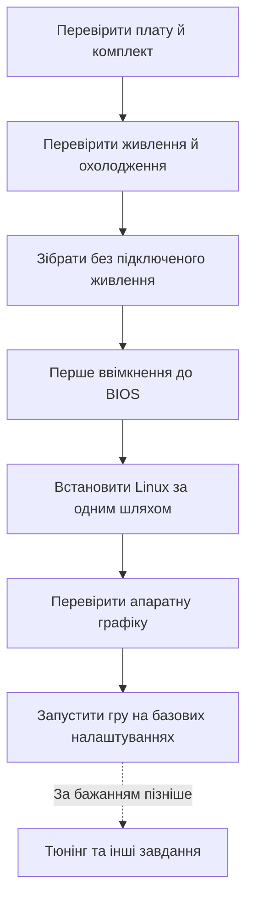

# Почніть звідси — від нуля до гри

> **Мета — перша робоча гра, а не обовʼязковий розгін.** Пройди збірку, перше ввімкнення, встановлення та перевірку нижче. Прошивка BIOS, розблокування ядер/CU й власні криві напруги — окремі завдання, не умови першого запуску.

[English](../en/00-start-here.md) · [Русский](../ru/00-start-here.md) · [Українська](00-start-here.md) · [Усі глави 00–17](../../README.uk.md#швидкий-старт)

## Перш ніж почати — деталі та інструменти

Перевір комплект плати, перш ніж щось докуповувати:

- **Відповідний БЖ на 12 В і перевірений кабель PCIe 8-pin.** Штекер EPS/CPU не взаємозамінний; ні потужність БЖ, ні арифметика струмів контактів не підтверджують допустиме навантаження кабелю. Див. [03 — Живлення](03-power-supply.md).
- **Активне охолодження:** вентилятор із кріпленням/кожухом, що спрямовує повітря через радіатор і навколо зворотного боку плати. Вентилятор 120 мм із високим статичним тиском — поширений варіант. Див. [04 — Охолодження](04-cooling.md).
- **SSD і відповідне підключення/адаптер**, а не лише інсталяційна флешка. Див. [16 — Накопичувачі та периферія](16-usb-peripherals.md).
- **Монітор і кабель DisplayPort**, клавіатура та миша. Перехідник DP→HDMI перевіряй окремо. Див. [14 — Дисплей](14-display.md).
- **USB-флешка для інсталятора**, що вміщує вибраний образ; 16 ГБ — корисний орієнтир, але звір розмір завантаження.
- **Викрутка й надійне кріплення без замикань.** Друкований корпус необовʼязковий. Див. [05 — Корпуси](05-case.md).
- **Мультиметр:** прозвонка з відключеним живленням, вимірювання напруги — у режимі напруги. Не прозвонюй коло під живленням; мультиметр не є магнітом і не підтверджує матеріал дроту.
- **Мережа** для завантажень та встановлення: дротовий Ethernet або підтримуваний WiFi-донгл із драйвером. Підготуй її до встановлення, якщо інсталятору потрібен інтернет. Див. [10 — Мережа](10-wifi-bt.md).

## Шлях


```mermaid
flowchart TD
    A[Перевірити плату й комплект] --> B[Перевірити живлення й охолодження]
    B --> C[Зібрати без підключеного живлення]
    C --> D[Перше ввімкнення до BIOS]
    D --> E[Встановити Linux за одним шляхом]
    E --> F[Перевірити апаратну графіку]
    F --> G[Запустити гру на базових налаштуваннях]
    G -. За бажанням пізніше .-> H[Тюнінг та інші завдання]
```

### 0. Зрозумій, що в тебе є

Визнач плату, розʼєми, радіатор і зміни попереднього власника. У BC-250 CPU Zen 2, графіка класу RDNA2 та спільний пул 16 ГБ GDDR6; це не 16 ГБ окремої RAM плюс ще 16 ГБ VRAM. Запиши версію BIOS до зміни налаштувань. Див. [01 — Що таке BC-250](01-what-is-bc250.md).

### 1. Докупи лише відсутнє

Порівняй комплект зі списком вище. Перевір опис продавця, стан і включені деталі; якщо плата вже твоя — купувати іншу не потрібно. Див. [02 — Купівля](02-buying.md).

### 2. Розберися з живленням до першого запуску

Використовуй перевірений кабель і розпіновку з [03 — Живлення](03-power-supply.md), а не штекер, який просто підійшов. Для штатної гри глава дає орієнтир 300 Вт і більше по 12 В; тривалі обчислення з розблокуванням потребують окремого розрахунку. Не починай із паралельних БЖ, саморобних розгалужувачів чи перехідників живлення SATA. Підключай усе з відʼєднаним від плати та мережі БЖ.

### 3. Організуй охолодження до навантаження

Пасивному стоєчному радіатору на столі потрібен примусовий обдув. Закріпи вентилятор, спрямуй повітря через ребра та залиш обдув зворотного боку плати. Не роби шліфування/різання радіатора обовʼязковим першим кроком: вибери робочу схему в [04 — Охолодження](04-cooling.md). Якщо все ж доробляєш радіатор — зніми його з плати й прибери провідне сміття до збірки.

### 4. Закріпи плату

Установи плату й охолодження в корпус або відповідне відкрите кріплення без замикань, вільних металевих деталей і перекритого потоку повітря. Перевір місце для кабелів. Моделі корпусів і кріплень — у [05 — Корпуси](05-case.md).

### 5. Збери й отримай екран BIOS

На вимкненій платі, з відʼєднаним від плати та мережі БЖ:

1. Закріпи охолодження/вентилятор та плату.
2. Підключи SSD відповідним способом із [16](16-usb-peripherals.md).
3. Підключи перевірений кабель живлення з [03](03-power-supply.md).
4. Підключи монітор через DisplayPort та клавіатуру.
5. Подай живлення й увійди в BIOS/Setup; перевір, що екран налаштувань зʼявляється та інсталяційний накопичувач доступний.

**Вентилятор, що обертається, сам по собі не доводить POST чи робочу графіку.** Немає зображення або запуску? Зупинись тут і відкрий [діагностику](troubleshooting.md); не стирай SSD і не прошивай BIOS навмання. Підключення монітора й перехідників — у [14](14-display.md).

### 6. Установи Linux за одним вибраним шляхом

Відкрий [06 — Linux](06-linux.md), вибери **один** шлях і виконай його до перезавантаження та перевірки:

- **Bazzite:** спершу встанови звичайний Bazzite. Потім вибери штатний Bazzite зі SMU-governor або звичайний стабільний [образ BC250 від 62fixolab](https://github.com/62fixolab/Latest-Bazzite-AMD-BC-250-Patched-Images), що відповідає твоєму робочому столу. `-40cu`, testing та unstable — не шлях першої збірки.
- **Fedora або CachyOS/Arch:** дотримуйся розділу свого дистрибутива, а не команд встановлення пакетів/rebase для Bazzite.

**Не роби симлінк firmware, не перебудовуй initramfs і не змінюй ядро лише тому, що так написано в старому чек-листі.** Свіжа firmware чи підготовлений образ можуть уже містити потрібне налаштування; ручний фікс стосується лише шляху, де він справді потрібен. Не прошивай мод-BIOS і не призначай один розмір UMA всім ОС заради цього загального маршруту. Якщо вибраному шляху потрібні налаштування BIOS — дотримуйся [08 — BIOS](08-bios.md), зберігши початкові значення.

Якщо для інсталятора використовував basic graphics mode / `nomodeset`, прибери його за інструкцією [06](06-linux.md), коли графіку налаштовано, та перезавантажся. Регресії ядер і версії драйверів описані там, а не закріплені назавжди на стартовій сторінці. Створи звичайний обліковий запис; не запускай Steam від root.

### 7. Перевір базову роботу до тюнінгу

Відкрий термінал установленого робочого столу. Ці команди лише показують відомості про графіку:

```bash
glxinfo -B
vulkaninfo --summary
```

- **OpenGL renderer** має вказувати апаратну AMD-графіку, не `llvmpipe`.
- Vulkan має показувати **апаратний пристрій AMD/BC250**, наприклад `AMD Radeon Graphics (RADV GFX1013)`. Програмний пристрій теж може бути в списку; це не скасовує апаратний. Для гри вибирай AMD.
- «Команду не знайдено» означає відсутність діагностичної утиліти, а не поломку GPU; встановлення для твоєї ОС описане в [06](06-linux.md). Одна версія Mesa не підтверджує апаратний рендеринг.
- `vainfo` перевіряє відеокодеки, а не прискорення ігор через OpenGL/Vulkan. Помилки кодеків і compute-кодування — окремі теми, див. [17](17-projects-and-tools.md).

Перевір температури засобами моніторингу свого образу ([04](04-cooling.md), [06](06-linux.md)). Починай із задокументованих базових налаштувань образу, без власних частот/напруг і розблокувань CPU/CU. Якщо governor уже встановлений — перевір його конфігурацію, не запускай другий. Вибір, встановлення та перевірка governor — у [09](09-overclock-undervolt.md); досягнення 2000 МГц не є умовою першої гри.

### 8. Підключи мережу

Якщо можеш — почни з дротового підключення. Для WiFi/Bluetooth перевіряй справжній чипсет донгла та драйвер своєї ОС, а не лише назву на коробці. Переконайся, що завантаження не обриваються. Якщо мережа потрібна інсталятору, зроби це до кроку 6. Див. [10 — WiFi та Bluetooth](10-wifi-bt.md).

### 9. Запусти гру

Використовуй Steam зі звичайного облікового запису, встанови гру й почни з налаштувань із [11 — Ігри](11-gaming.md). Перевір апаратну графіку, контрольовані температури та відсутність артефактів/скидань. Якщо запуск не вдався — розбери базове налаштування до додавання FSR, власної Mesa, андервольту чи розблокованих блоків.

Після успішного запуску **перезавантажся й повтори його**, щоб результат не залежав від тимчасового налаштування однієї сесії. Потім додавай потрібні програми з [17 — Control Center, апскейлери та стримінг](17-projects-and-tools.md), по одній зміні.

## Якщо щось зламалося

Відкрий [діагностику](troubleshooting.md) та [FAQ](faq.md) для конкретного етапу. Запиши образ/deployment ОС, ядро, вивід renderer та останні зміни. У Bazzite збережи робочий deployment командою `sudo ostree admin pin booted`; за невдалого оновлення/rebase вибери збережений deployment або скористайся відкатом із [06](06-linux.md). Стирання накопичувача — не стандартний крок діагностики.

Прошивка та відновлення BIOS — у [08](08-bios.md), а не в обовʼязковому чек-листі першого ввімкнення.

## Чек-лист на 60 секунд

| Етап | Готово коли |
|---|---|
| Комплект | БЖ/кабель, охолодження, SSD, монітор, пристрої введення та інсталятор готові |
| Живлення та збірка | Розпіновку перевірено, плату закріплено, екран BIOS доступний |
| Охолодження | Активний обдув працює; температури не ростуть безконтрольно й не спричиняють скидань у грі |
| ОС | Вибраний шлях Linux виконано; робочий стіл завантажується після перезавантаження |
| GPU | OpenGL/Vulkan показують апаратну графіку, не лише програмний рендеринг |
| Мережа | Завантаження завершуються без втрати підключення |
| Гра | Працює без артефактів/скидань на базових налаштуваннях, зокрема після перезавантаження |
| Відновлення | Важливі дані скопійовано; робочі налаштування/deployment та шлях відкату записано |

Жоден рядок не вимагає прошивки BIOS, заданого розгону, восьми ядер CPU або 40 CU.

## Після першої гри

- **Необовʼязковий тюнінг:** [09 — Governor, частоти та напруга](09-overclock-undervolt.md).
- **Локальні моделі й обчислення:** [12 — AI / LLM](12-ai-llm.md).
- **Емуляція:** [15 — Емуляція](15-emulation.md).
- **Інші ОС:** [07 — Windows](07-windows.md) · [13 — macOS / MetalCyan](13-macos.md).
- **Програми:** [17 — Control Center, FSR4, HelixSR та стримінг](17-projects-and-tools.md).
- **Інші проєкти:** [Тематичний каталог](../../catalog/uk/README.md).

[Швидкий старт upstream](https://elektricm.github.io/amd-bc250-docs/getting-started/quick-start/) і [quick reference](https://elektricm.github.io/amd-bc250-docs/reference/quick-reference/) дають контекст; конкретні потрібні дії визначає шлях твоєї ОС в главі 06. Цей маршрут не є заявою, що ми випробовували твою плату.
