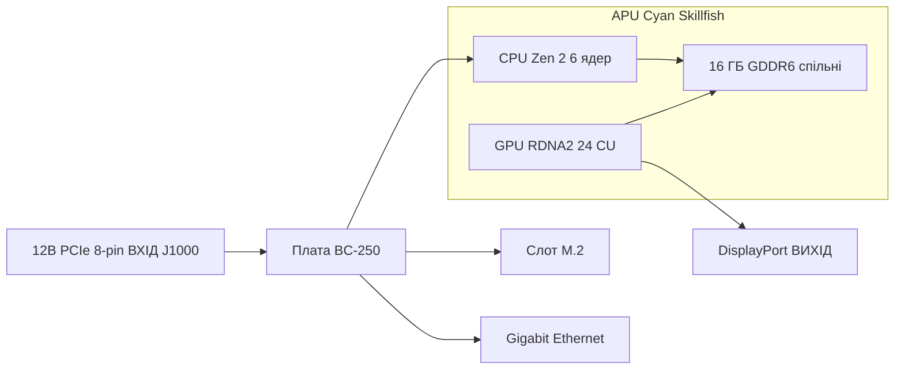

> 🌐 Переклад спільноти. Англійська версія є джерелом істини й може бути новішою. Знайшли помилку? Відкрийте issue: [English](../en/01-what-is-bc250.md) · [issues](https://github.com/lildebil0/awesome-bc250/issues)

# Що таке BC-250

> **Коротко** — BC-250 — це **APU класу PlayStation 5 на серверній/майнінговій платі**. Один чип (кодова назва AMD **Cyan Skillfish**, урізана версія кремнію PS5 **Oberon/Ariel**) несе **6-ядерний / 12-потоковий CPU на Zen 2** та **GPU на RDNA 2 з 24 обчислювальними блоками**, який живиться від **16 ГБ розпаяної GDDR6**. Це **не відеокарта й не звичайний ПК** — у неї **немає звичного вам x86 BIOS, немає слота PCIe, немає 24-pin ATX роз'єму**: вона приймає **12 В напряму у 8-pin PCIe роз'єм живлення** та завантажує власну прошивку. Люди купують її, бо це **дешевезний бокс для ігор під Linux / локального ШІ**. Люди лютують через неї, бо **драйвери, охолодження та відсутність апаратного кодування відео** роблять із неї проєкт, а не машину «увімкнув і працює». Якщо вам потрібно нуль мороки — ця плата є хибною покупкою, поверніть її просто зараз. Якщо ви любите копирсатися — читайте далі.

Ця сторінка — довідник «що я взагалі купив». Живлення, охолодження, встановлення ОС і драйвери кожне отримує власний розділ ([03](../en/03-power-supply.md) / [04](../en/04-cooling.md) / [06](../en/06-linux.md)).

---

## Що це насправді

AMD створила BC-250 як **прискорювач для майнінгу криптовалют** («BC» розшифровується як blockchain). Щоб зробити її дешевою, AMD повторно використала **залишковий кремній процесора PlayStation 5** — той самий сімейство чипів, що Sony ставить у консоль. Плата — це один APU плюс його пам'ять і ланцюги живлення; це весь продукт.

Жаргон, визначений один раз:

- **APU** (Accelerated Processing Unit) — назва AMD для єдиного чипа, що містить **і CPU, і GPU**. Окремої відеокарти немає; GPU всередині того ж корпусу, ділить ту саму пам'ять.
- **Cyan Skillfish** — інженерна **кодова назва** AMD для цього APU. Ви бачитимете її всюди в Linux: файл прошивки GPU буквально називається `cyan_skillfish_gpu_info.bin` ([src](https://t.me/c/2424231195/57962) — див. фікс із символьним посиланням на [src](https://t.me/c/2424231195/41252)). Інструменти можуть також показувати її під назвами кристалів PS5 **Oberon** / **Ariel**.
- **GDDR6** — швидка графічна пам'ять, яку зазвичай знаходять на відеокарті. На BC-250 це **системна RAM і відео-RAM одночасно** (CPU та GPU ділять один пул). Слотів DIMM немає; 16 ГБ розпаяно й не оновлюється.
- **RDNA 2** — покоління архітектури GPU (те саме сімейство, що PS5, Xbox Series та карти Radeon RX 6000).

Чип — це **урізана** деталь PS5, а не повна. Спільнота закріпила це порівняння ([src](https://t.me/c/2424231195/11282), із посиланням на [запис Oberon у TechPowerUp](https://www.techpowerup.com/gpu-specs/amd-oberon.g936)):

| | BC-250 | Повна PS5 (Oberon) |
|---|---|---|
| Ядра / потоки CPU | **6 / 12** | 8 / 16 |
| Обчислювальні блоки GPU (CU) | **24** | 36 |

«Обчислювальний блок» — це один блок ядра GPU; 24 таких — це приблизно територія GPU ноутбука середнього класу, що рівно і є тим діапазоном продуктивності, який чат фіксує в іграх.

BC-250 — не єдиний у AMD «залишковий консольний кремній на десктопній платі». Вона має двох близьких родичів, побудованих з тієї самої ідеї: **AMD 4700S Desktop Kit** (CPU-набір, похідний від **PlayStation 5**) — про який чат попереджає, що його на маркетплейсах перехресно зіставляють з BC-250 ([02-buying.md](../en/02-buying.md)) — та **AMD 4800S Desktop Kit**, версію, похідну від **Xbox Series X** (8 ядер Zen 2, з'єднаних із GDDR6, з вимкнутим GPU консолі на RDNA 2). Обидва — реальні продукти AMD, які, як і BC-250, поєднують вторинний консольний CPU з розпаяною GDDR6 ([VideoCardz](https://videocardz.com/newz/amd-4800s-desktop-kit-a-pc-repurposed-apu-from-xbox-series-x-has-been-tested)). Вони — корисний контекст, щоб відрізнити BC-250 від її родичів під час покупки.

Люди запускали **десктопний Linux на BC-250 тим самим способом, яким зламали саму PS5** — повноцінне 4K HDMI відео + звук, усі USB-порти працюють, APU розганяється до ~3.2 ГГц на CPU та ~2.0 ГГц на GPU ([src](https://t.me/c/2424231195/122260)).

---

## У чому вона хороша

- **Найдешевший вхід в ігри під Linux на цьому рівні продуктивності.** Через Steam/Proton (шар сумісності, що запускає Windows-ігри на Linux) люди грають у Star Citizen ([src](https://t.me/c/2424231195/38702)) і навіть сучасні тайтли на кшталт *Doom: The Dark Ages* через спільнотну Vulkan-обгортку на ~60 FPS на низьких/FSR ([src](https://t.me/c/2424231195/127696)). Результати по кожній грі живуть у [11-gaming.md](../en/11-gaming.md).
- **Спроможний бокс для локального ШІ.** З 16 ГБ GDDR6 вона може тримати мовні моделі середнього розміру. Учасники запускають LLM локально через `llama.cpp`/`jan` на бекенді **Vulkan**; ви спершу виставляєте в BIOS виділення 12 ГБ під GPU ([src](https://t.me/c/2424231195/92421)). Див. [12-ai-llm.md](../en/12-ai-llm.md).
- **Крихітна й самодостатня.** Це єдина довга плата з вбудованим радіатором у стилі GPU — вона вкладається в малі DIY/надруковані на 3D-принтері корпуси й працює від одного невеликого блока живлення ([build src](https://t.me/c/2424231195/137825)).

Консенсус спільноти щодо того, *чому* вона взагалі працює: бо чип настільки близький до апаратури Steam Deck / PS5, що Valve та відкритий графічний стек Mesa далі покращують ті самі драйвери, тож BC-250 їде на цьому безкоштовно ([src](https://t.me/c/2424231195/93006)).

---

## Що болісно (налаштуйте очікування)

Це та половина, яку новачки недооцінюють. Жодне з цього не є дилбрейкером, але все це — реальна робота.

- **Драйвери — це робота «зроби сам».** AMD не постачає для цієї плати **жодного офіційного драйвера й жодної публічної документації** ([src](https://t.me/c/2424231195/37764)). Усе — графічний стек Linux, «governor» частот/напруг, BIOS — побудоване спільнотою. Очікуйте, що доведеться слідувати скриптам налаштування й час від часу лагодити речі вручну. Почніть із [06-linux.md](../en/06-linux.md).
- **Охолодження — це річ №1, яку люди роблять неправильно.** Штатний радіатор було розраховано на тунель примусового обдуву майнінгової стійки, тож на столі він перегрівається й тротлить «з коробки». Вам доведеться модифікувати охолодження. Це має власний розділ — прочитайте [04-cooling.md](../en/04-cooling.md) **перед** тим, як гнатися за продуктивністю.
- **Немає апаратного кодувальника відео.** Блок відеокодування GPU (те, що AMD називає **VCN** — спеціалізований ланцюг, що стискає відео для стрімінгу/запису) **недоступний**. Запис екрана й стрімінг гри відкочуються до **програмного кодувальника**, що коштує CPU. Воно працює (люди стрімлять через Sunshine/Moonlight), але повільніше й нижчої якості, ніж у звичайного GPU ([src](https://t.me/c/2424231195/88026)). Так само ранній драйвер Mesa був горезвісно **програмним рендерингом**, аж доки спільнота не змусила працювати апаратне прискорення ([src](https://t.me/c/2424231195/11243)).
- **Дивне живлення й немає зображення за замовчуванням.** Вона не приймає стандартний 24-pin ATX роз'єм — див. наступний розділ. Багато плат також прибувають із потребою **скидання BIOS** перш ніж вони взагалі пройдуть POST ([src](https://t.me/c/2424231195/57930)), і зазвичай ви виводите зображення через **DisplayPort** (HDMI потребує адаптера DP→HDMI, який також нормально несе звук — [src](https://t.me/c/2424231195/9148)).
- **Це плата для копирсання, крапка.** Як висловився один давній учасник: попри дешевизну, BC-250 «вимагає певних навичок, зусиль і мізків» ([src](https://t.me/c/2424231195/73002)). Закладайте час, а не лише гроші.
- ⚠ **eGPU її не врятує — за повідомленнями спільноти (r/BC250Gaming).** Єдиний слот M.2 — це лише **PCIe 2.0 ×2** (див. апаратну картку нижче), і на цій пропускній здатності зовнішній GPU, підвішений на M.2, **за повідомленнями працює *гірше*, ніж вбудований GPU на RDNA 2** — повільний лінк його душить. Якщо вам потрібно більше графічної потужності, консенсус такий: ця плата не для цього. *(За повідомленнями спільноти; сприймайте як застереження, а не як бенчмарк.)*

> ⚠ **Що означає двоколірний LED — за повідомленнями спільноти (r/BC250Gaming).** Двоколірний LED поруч із NIC — це **індикатор завантаженості майнінгової епохи, а не лампочка помилки**: за словами спільноти **червоний = GPU/RAM *не* на 100 % завантаженості, зелений = повна завантаженість**. Тож червоне світло на простоюючій десктопній платі — це норма, а не несправність. *(За повідомленнями спільноти; AMD не постачає документації для цієї плати, тож сприймайте точне відображення кольорів як непідтверджене.)*

> ⚠ **Застереження щодо поводження, засвоєне важким шляхом.** **Не** дозволяйте нічому металевому торкатися плати під живленням і будь-коли міняйте термопасту лише з обережністю — один учасник назавжди вбив свою BC-250, замкнувши її ([src](https://t.me/c/2424231195/95998)). Плати також прибувають трохи **зігнутими** через кріплення радіатора; один учасник полагодив незавантаження, підклавши папір, щоб вирівняти плату впритул до радіатора ([src](https://t.me/c/2424231195/117347)).

---

## Апаратна довідкова картка

Характеристики звірені з апаратним реверс-інжинірингом спільноти (AMD не публікує даташита). Цифри шини пам'яті та фізичних розмірів, раніше непідтверджені, тепер беруться з [апаратної специфікації elektricM](https://github.com/elektricm/elektricm) (яка зараховує реверс-інжиніринг mothenjoyer69 / Segfault / neggles / yeyus). Розпіновка й цифри живлення нижче походять із канонічного апаратного документа спільноти.

Плата з першого погляду — вхід живлення зліва, APU та його спільна пам'ять посередині, I/O праворуч:



### Основні характеристики

| Характеристика | Значення | Джерело |
|------|-------|--------|
| Клас | APU, похідний від PlayStation 5, на майнінговій/серверній платі | [hardware.md](https://github.com/mothenjoyer69/bc250-documentation/blob/main/hardware.md) |
| Кодова назва APU | **Cyan Skillfish** (кристал PS5: Oberon / Ariel) | чат ([src](https://t.me/c/2424231195/57962)) |
| CPU | **6 ядер / 12 потоків, Zen 2** (6 ядер підтверджено) | [hardware.md](https://github.com/mothenjoyer69/bc250-documentation) · чат ([src](https://t.me/c/2424231195/11282)) |
| Частота CPU | до **~3.49 ГГц** («приблизно») | [hardware.md](https://github.com/mothenjoyer69/bc250-documentation) · чат ([src](https://t.me/c/2424231195/122260)) |
| GPU | **24 обчислювальних блоки, RDNA 2** (`gfx1013`; SoC PS5 має 36); растеризація ≈ **між RX 6600 та RX 6600 XT** / клас GTX 1660 Ti; **Vulkan 1.4** | [hardware.md](https://github.com/mothenjoyer69/bc250-documentation) · чат ([src](https://t.me/c/2424231195/11282)) · [elektricM](https://github.com/elektricm/elektricm) |
| Частота GPU | ~1500 МГц штатно, ~2000 МГц у розгоні (≈2.23 ГГц макс) | ([src](https://t.me/c/2424231195/122260)) · [09](../en/09-overclock-undervolt.md) |
| Пам'ять | **16 ГБ GDDR6**, спільна для CPU та GPU, розпаяна (не оновлюється) | [hardware.md](https://github.com/mothenjoyer69/bc250-documentation) · [README](../../README.md) |
| Виділення VRAM для GPU | задається в BIOS; **12 ГБ** вибирається на BIOS 3.00+ | ([src](https://t.me/c/2424231195/92421)) |
| Шина / пропускна здатність пам'яті | **256-бітна** GDDR6 @ **14 Gbps**, **~448 GB/s** | [апаратна специфікація elektricM](https://github.com/elektricm/elektricm) |
| TDP | **220 Вт** (теплопакет плати) | [hardware.md](https://github.com/mothenjoyer69/bc250-documentation) |
| Споживання | ~67–85 Вт типово під навантаженням майнінгового класу | [hashrate.no](https://www.hashrate.no/gpus/bc250) |
| Апаратне кодування відео (VCN) | **Немає** — лише програмне кодування | ([src](https://t.me/c/2424231195/88026)) |
| Відеовихід | **DisplayPort 1.4** (до **4K@120 / 8K@60**); для HDMI використовуйте адаптер DP→HDMI; несе звук | ([src](https://t.me/c/2424231195/9148)) · [elektricM](https://github.com/elektricm/elektricm) |
| Накопичувач (M.2) | 1x M.2 2280 — **PCIe 2.0 x2 або SATA III** | [elektricM](https://github.com/elektricm/elektricm) |
| 2-й DisplayPort | присутній, але **не розпаяний**; можна активувати програмно | ([src](https://t.me/c/2424231195/88026)) |
| Фізичний розмір | **340 мм / 310 мм** завдовжки (залежно від методу вимірювання), **~115 мм** завширшки, **~400 г** з радіатором; кастомний нестандартний майнінговий форм-фактор | [апаратна специфікація elektricM](https://github.com/elektricm/elektricm) |

> ⚠ **Розгін GDDR6 = пропускна здатність, а не FPS — за повідомленнями спільноти (r/BC250Gaming).** За словами спільноти, розгін GDDR6 піднімає пропускну здатність пам'яті приблизно з **~256 GB/s до ~445 GB/s**, проте не дає **жодного приросту в іграх** — вузьке місце — це 24 CU GPU, а не пропускна здатність пам'яті, тож зайва пропускна здатність в іграх лишається невикористаною. (Зверніть увагу: підтверджена в репозиторії *штатна* цифра вище вже становить **~448 GB/s** на 256 біт / 14 Gbps, тож «базова ~256 GB/s» спільноти не збігається зі специфікацією — сприймайте точні цифри GB/s як непідтверджені; стійка частина — те, що ви не отримуєте FPS.) Про розгін GPU/пам'яті загалом див. [09-overclock-undervolt.md](../en/09-overclock-undervolt.md).

> **Про розміри плати:** [апаратна специфікація elektricM](https://github.com/elektricm/elektricm) дає довжину **340 мм / 310 мм** (дві цифри відображають різні методи вимірювання), ширину **~115 мм** та **~400 г** з радіатором, на кастомному нестандартному майнінговому форм-факторі. Сам канонічний `hardware.md` розмірів не наводить; найбільш «залайканий» апаратний пост чату буквально має заголовок *«Размеры amd bc-250»* («розміри AMD BC-250», ❤20 — [src](https://t.me/c/2424231195/379)), що підтверджує: людям це важливо для будівництва корпусів. Для точної підгонки корпусу працюйте за виміряною 3D-моделлю — каталогізовані спільнотою STL плати (наприклад, `BC250 Board.stl`, [Printables 1103626](https://www.printables.com/model/1103626-amd-bc250-board) та точна модель на [Printables 1341336](https://www.printables.com/model/1341336-accurate-3d-model-of-the-amd-bc-250-board)) є розмірно коректними. Див. [05-case.md](../en/05-case.md).

<p align="center">
  <br>
  <sub>Фото: спільнота AMD BC-250 · <a href="https://t.me/c/2424231195/379">джерело</a></sub>
</p>

### Розпіновка роз'єму живлення (прочитайте це перед тим, як будь-що підключати)

BC-250 **не має 24-pin ATX роз'єму**. Вона живиться **лише 12 В**, що подаються через **8-pin PCIe роз'єм живлення (J1000)** — той самий фізичний штекер, що й у відеокарти, але плата очікує всі три силові контакти, запитані від 12 В. Повна проводка й вибір БЖ — у [03-power-supply.md](../en/03-power-supply.md); канонічна розпіновка з [hardware.md](https://github.com/mothenjoyer69/bc250-documentation/blob/main/hardware.md):

**J1000 — основне 8-pin PCIe живлення (це те, що ви підключаєте):**

```
[ GND  GND  GND  GND ]
[ GND  12V  12V  12V ]
```

- Три контакти 12 В; документ оцінює контакти Mini-Fit Jr **до 9 А кожен**, тож цей роз'єм «може безпечно віддавати до **324 Вт**», і рекомендує провід **16 AWG** для автономного використання ([hardware.md](https://github.com/mothenjoyer69/bc250-documentation)).
- **GND = земля (0 В), 12V = +12 вольт.** Дотримуйтесь правильної полярності — ця плата не прощає зворотної напруги.

**J2000 / J2001 — стоєчні роз'єми живлення (зазвичай НЕ використовуються на столі):**

```
        J2000                  J2001
 [ LED1  12V  12V  12V ]   [ 12V  12V  12V  PGD ]
 [ LED2  GND  GND  GND ]   [ GND  GND  GND  GND ]
```

- Це роз'єми **Molex Micro-Fit BMI** ([деталь 444280801](https://www.molex.com/en-us/products/part-detail/444280801)), а *не* штекери PCIe/EPS — вони живили плату всередині її оригінального майнінгового шасі. **J2000 та J2001 не ідентичні:** як показує розпіновка вище, J2000 несе піни **LED1/LED2**, тоді як J2001 несе пін **PGD**, тож ці два роз'єми відрізняються ([апаратні документи elektricM / mothenjoyer69](https://github.com/mothenjoyer69/bc250-documentation)).
- **PGD** (на J2001) — це пін power-good/sense: він бачить **5 В, коли плата встановлена у PSU2 стійки**. На автономній збірці ви зазвичай живите через J1000 і можете ігнорувати J2000/J2001 — але звіртеся з [03-power-supply.md](../en/03-power-supply.md) для вашого конкретного перехідника БЖ.

---

## Куди йти далі

1. **[02-buying.md](../en/02-buying.md)** — якщо ви ще не купили або хочете знати, яка ціна справедлива та які реальні ризики.
2. **[03-power-supply.md](../en/03-power-supply.md)** — як її насправді живити (12 В у 8-pin).
3. **[04-cooling.md](../en/04-cooling.md)** — зробіть це **раніше** за все інше, щойно плата у вас на руках.
4. **[06-linux.md](../en/06-linux.md)** — поставте ОС і спільнотні драйвери на неї.

---

## Джерела

- Канонічний апаратний документ і розпіновка — [mothenjoyer69/bc250-documentation `hardware.md`](https://github.com/mothenjoyer69/bc250-documentation/blob/main/hardware.md)
- Шина/пропускна здатність пам'яті, фізичні розміри, позиціонування GPU, DP 1.4, M.2 — [апаратна специфікація elektricM](https://github.com/elektricm/elektricm) (зараховує реверс-інжиніринг mothenjoyer69 / Segfault / neggles / yeyus)
- Урізаний vs повний кремній PS5 (6/12 + 24 CU vs 8/16 + 36 CU) — https://t.me/c/2424231195/11282 · [TechPowerUp Oberon](https://www.techpowerup.com/gpu-specs/amd-oberon.g936)
- Linux на апаратурі PS5, 4K HDMI, частоти — https://t.me/c/2424231195/122260
- Немає офіційного драйвера / немає документації — https://t.me/c/2424231195/37764
- Програмний рендеринг / немає апаратного кодування — https://t.me/c/2424231195/11243 · https://t.me/c/2424231195/88026
- DisplayPort + звук DP→HDMI — https://t.me/c/2424231195/9148
- Назва прошивки Cyan Skillfish — https://t.me/c/2424231195/57962 · https://t.me/c/2424231195/41252
- Локальна LLM + 12 ГБ VRAM через BIOS 3.00 — https://t.me/c/2424231195/92421
- «Вимагає навичок, зусиль і мізків» — https://t.me/c/2424231195/73002
- Застереження щодо поводження/короткого замикання — https://t.me/c/2424231195/95998 · фікс зігнутої плати — https://t.me/c/2424231195/117347
- «Розміри BC-250» (найбільш «залайканий» апаратний пост) — https://t.me/c/2424231195/379
- 220 Вт TDP, 6-ядерний/3.49 ГГц CPU, 24-CU GPU, 16 ГБ GDDR6 (підтвердження репозиторію) — [mothenjoyer69/bc250-documentation README](https://github.com/mothenjoyer69/bc250-documentation)
- Цифри споживання майнінгового класу — https://www.hashrate.no/gpus/bc250
- Чому вона продовжує працювати (спільні зусилля над драйверами Steam Deck/PS5) — https://t.me/c/2424231195/93006
- Родинні набори — AMD 4700S (CPU-набір PS5, перехресно зіставляється з BC-250, [02-buying.md](../en/02-buying.md)) та AMD 4800S (CPU Xbox Series X + GDDR6, GPU вимкнено) — [VideoCardz: 4800S Desktop Kit](https://videocardz.com/newz/amd-4800s-desktop-kit-a-pc-repurposed-apu-from-xbox-series-x-has-been-tested)
- eGPU через M.2 повільніший за вбудований GPU (M.2 — це PCIe 2.0 ×2), двоколірний LED NIC = сигнал завантаженості (червоний = не 100 % завант., зелений = повна завант.), розгін GDDR6 піднімає пропускну здатність (~256→~445 GB/s) без приросту в іграх — за повідомленнями спільноти (r/BC250Gaming)

> AMD не публікує первинного даташита для цієї плати; цифри вище — найкращий реверс-інжиніринг спільноти (канонічний `hardware.md` плюс апаратна специфікація elektricM). Виправлення вітаються через PR (див. [CONTRIBUTING.md](../../CONTRIBUTING.md)).
