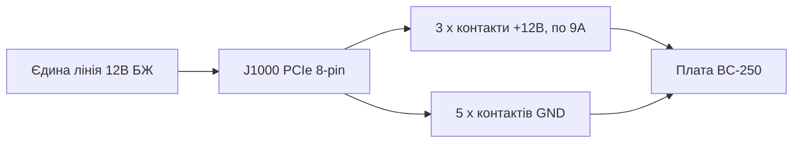
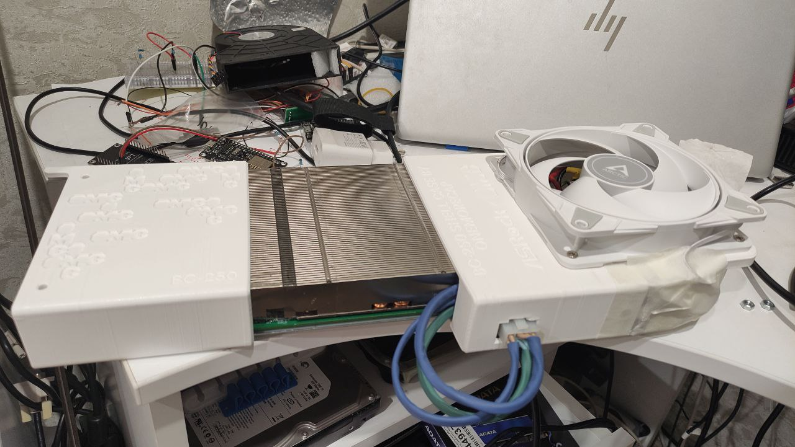

> 🌐 Переклад спільноти. Англійська версія є джерелом істини й може бути новішою. Знайшли помилку? Відкрийте issue: [English](../en/03-power-supply.md) · [issues](https://github.com/lildebil0/awesome-bc250/issues)

# Блок живлення

> **Коротко** — BC-250 **не має кнопки живлення й стандартного штекера живлення ПК**. Вона споживає **12 В** через єдиний конектор **PCIe 8-pin (6+2)** — той самий штекер, який використовує настільна відеокарта, — і пікове споживання сягає **~235 Вт** (більше за розгону). Вам потрібне джерело 12 В, здатне віддати **~250–300 Вт на одній лінії**. Спільнота йде трьома шляхами: дешевий серверний **БЖ «Flex»** (HP 500 Вт, ~$12 на eBay), **промисловий блок** (Mean Well LOP-300/LOP-500) або **звичайний ATX-БЖ** (просто увімкніть його кабель PCIe). Дві смертельні помилки, яких слід уникати: **старий БЖ, що розбиває 12 В на слабкі лінії**, та **підроблені проводи зі сталі з мідним покриттям**, що перегріваються й загоряються. Використовуйте справжню мідь, **16 AWG або товще**.

Живлення плати — це **друге, що новачок мусить зробити правильно** (після [охолодження](../en/04-cooling.md)), і саме воно найімовірніше призведе до пожежі, якщо зекономити на проводці.

---

## Що насправді потрібно платі

BC-250 — це урізаний кристал PlayStation 5 на майнінговій/серверній платі. Вона була призначена для роботи в стійці й живлення від 12 В — тому в неї **немає жодних зручностей звичайного ПК**:

- **Немає 24-pin ATX**-конектора материнської плати.
- **Немає кнопки живлення** — вона вмикається тієї ж миті, коли надходить 12 В (вмикач самого БЖ і є вашою кнопкою живлення).
- **Одне завдання для БЖ: подати 12 В із достатнім струмом.**

**Показники потужності (підтверджені):**

| Параметр | Значення | Джерело |
|------|-------|--------|
| Вхідна напруга | 12 В DC | [hardware.md](https://github.com/mothenjoyer69/bc250-documentation/blob/main/hardware.md) |
| Типове пікове споживання | ~220–235 Вт | спостереження спільноти ([src](https://t.me/c/2424231195/31076)) |
| Конектор | PCIe 8-pin (6+2) | [hardware.md](https://github.com/mothenjoyer69/bc250-documentation/blob/main/hardware.md) · ([src](https://t.me/c/2424231195/14450)) |
| Піковий струм на 12 В | ~18–20 A типово, конструктивний запас до ~40 A | ([src](https://t.me/c/2424231195/31076)) |

> **«PCIe 8-pin (6+2)»** означає штекер живлення відеокарти: шість контактів у блоці плюс від'ємний кліпсу на 2 контакти, тож той самий кабель працює і як 6-pin, і як 8-pin. **6+2** = 6 фіксованих + 2 знімних. Це *не* той CPU/EPS 8-pin із вашої материнської плати — див. попередження нижче.

PCIe 8-pin розрахований на **150 Вт** за стандартом PCIe, а три 12-вольтові контакти плати (Molex Mini-Fit Jr, по 9 A кожен) можуть безпечно пропустити **до ~324 Вт** ([hardware.md](https://github.com/mothenjoyer69/bc250-documentation/blob/main/hardware.md)). Тож одного 8-pin із запасом вистачає на стоковій частоті; запас має значення лише тоді, коли ви робите агресивний розгін.

**Скільки потужності БЖ купувати:** орієнтуйтеся на **300 Вт або більше на лінії 12 В**. Блок на 300 Вт дає здоровий запас над піком ~235 Вт і тримає вентилятор БЖ спокійним; люди повідомляють, що серверний Flex-БЖ на 500 Вт працює майже безшумно під цим навантаженням ([src](https://t.me/c/2424231195/31076)). Не купуйте менше ~250 Вт «заради економії» — ви ганятимете його на межі, і він буде гучним або вимикатиметься.

> **Крива потужності за токовими кліщами (першоджерельна сила струму).** Під час розбирання на лінію живлення 12 В навісили DC-амперметр і зчитали реальний струм плати: **ігри тягнуть ≈17 A / ~190 Вт**, тоді як **повне синтетичне стрес-навантаження сягає ≈21 A / ~240–250 Вт** на **2000 МГц / 960 мВ**; підняття напруги вище доводить це до **22–23 A і вище** ([Old Lamer — Part VII](https://youtu.be/pxahl9-YgkY) ~9:01). Це уточнює наведені вище показники споживання від розетки виміряною силою струму на лінії — і підтверджує, чому орієнтир у 300 Вт лишає правильний запас. *(Цифри зчитані з автоматичних субтитрів — сприймайте точні значення як приблизні.)*

> ⚠️ **Названі БЖ, яких слід уникати:** дешеві **Dell D220P-01** (220 Вт) і **Dell D250AD-00** (250 Вт) позначені як **недостатні й небезпечні** для цієї плати — при 220 Вт / 250 Вт вони лежать нижче піку плати й, за повідомленнями, відрубаються або навіть виходять з ладу під ігровим навантаженням. Не купуйте блок лише тому, що він дешевий і «начебто достатній». ([elektricM: power](https://elektricm.github.io/amd-bc250-docs/hardware/power/))

---

## Фізика: вольти, ампери, вати — і чому тонкий провід горить

Кожне правило цього розділу випливає з трьох рівнянь. Засвойте їх — і таблиці перерізів та попередження «ніколи не використовуйте SATA» перестануть бути довільними.

**Потужність = вольти × ампери (`P = U·I`).** Платі потрібно **~235 Вт** при **12 В**, тож вона тягне `235 ÷ 12 ≈ 19.6 A`. Саме тому токові кліщі показують **~17 A в іграх / ~21 A під стресом** ([вище](#що-насправді-потрібно-платі)): потужність задана кремнієм, тож *ампери* — це те, що змушує текти 12 В. Підніміть частоту/напругу — і ампери ростуть разом із ватами.

**Чому 12 В — і чому 24 В її вбивають.** 12 В — це стандарт дата-центрової стійки, під який плату й створено; її бортові VRM знижують її до ~1 В, на яких працює ядро APU. Плата **жорстко розрахована на 12 В без захисту від перенапруги**, тож подача 24 В (наприклад, із [LOP-300-**24**](#варіант-b--промисловий-блок-mean-well)) подвоює напругу на кожній 12-вольтовій деталі й миттєво її знищує. На відміну від сили струму, напруга не обговорюється.

**Допустимий струм — чому в проводу є межа за амперами.** Провід — це резистор, а струм через опір створює тепло: `P_loss = I²·R`. Товстіша мідь = більший переріз = **менший R** = менше тепла за того самого струму. У цьому весь сенс наведеної вище таблиці AWG — **менший номер AWG = товстіший провід = безпечний за більшого струму**. При ~20 A **мідь 16 AWG** лишається холодною; тонше — і `I²·R` плавить ізоляцію. Зверніть увагу на **квадрат**: подвоєння струму *учетверює* тепло, тому важкий розгін потребує другої лінії живлення, а не просто «трохи більше проводу».

**Падіння напруги — інша половина.** Тепло, втрачене в проводі, — це напруга, яку плата так і не побачить: `V_drop = I·R`. Довгий тонкий кабель і **перегрівається**, і **недодає живлення** платі, тож під навантаженням може просісти, навіть якщо нічого видимо не плавиться. Коротка товста мідь усуває обидві проблеми одразу.

**Чому підроблена «мідь» смертельна.** Сталь із мідним покриттям має **~6× опір** справжньої міді — той самий струм, той самий `I²·R`, тож **6× тепла** в тому самому проводі. Перевірка магнітом нижче — це не питання якісних уподобань; вона ловить **6-кратний множник на члені, який у струмі вже й так у квадраті**.

**Чому ніколи SATA чи Molex.** Річ у *конекторі*, а не в проводі. Контакт живлення SATA розрахований на **~54 Вт** → `54 ÷ 12 ≈ 4.5 A`, перш ніж малий контакт сам себе спалить; платі ж потрібно ~20 A, **у 4× вище** цієї межі. PCIe 8-pin натомість несе три товсті 12-вольтові контакти (**по 9 A = 27 A / 324 Вт**) — *саме тому* це правильний штекер, а SATA/Molex ніколи не зможе ним бути (див. [розпіновку](#розпіновка-8-pin-j1000)).

---

## ⚠️ Дві помилки, що знищують плати

Прочитайте цей розділ, перш ніж щось купувати.

### 1. Не плутайте PCIe 8-pin із CPU/EPS 8-pin

У вашому ATX-БЖ є **два різні штекери на 8 контактів**: один для відеокарт (**PCIe**) і один для процесора (**EPS/CPU**, іноді з підписом «CPU» чи «4+4»). **Вони виглядають майже однаково, але форми контактів і полярність у них протилежні.** Засовування штекера CPU в BC-250 подає **+12 В туди, де має бути земля** — ви можете спалити всю плату.

> *«Це обговорювалося мільярд разів — у нас вхід живлення PCIe. Якщо форма крайнього контакта інша — у вас штекер CPU… у нього буквально протилежна полярність, плюс там, де має бути мінус. Можна спалити все до біса.»* ([src](https://t.me/c/2424231195/14450))

Плата **не перевіряє sense-контакти**, тож ніщо не завадить вам встромити не те. Безпечна звичка: **дивіться на форму кліпси конектора, а якщо не впевнені — перевірте + і − мультиметром, перш ніж вмикати живлення.**

### 2. Не використовуйте підроблений «мідний» провід — це пожежна небезпека

Це найчастіше повторюване попередження безпеки в чаті. Дешеві готові кабелі-перехідники й бюджетні «PCIe»-кабелі часто бувають зі **сталі з мідним покриттям (CCS)** чи **алюмінію з мідним покриттям (CCA)** — тонка мідна оболонка поверх сталевого/алюмінієвого осердя. Сталь має **~6× опір міді**, тож провід перегрівається під навантаженням і може розплавитися чи зайнятися.

> *«Провід від перехідника сильно перегрівся під навантаженням. Виявилося, що це не мідь, а залізо (сталь) з тонким мідним покриттям… високий опір, сильно гріється, може спричинити пожежу. Для надійної й безпечної роботи ви ОБОВ'ЯЗКОВО мусите використовувати суцільномідні проводи мінімум 2.5 мм².»* ([src](https://t.me/c/2424231195/108733))

> *«Перевірив його магнітом 🤣 — сталеві нитки. Опір цих сталевих „ниток" у 6× вищий за мідь. Про які 450 Вт вони взагалі говорять?»* ([src](https://t.me/c/2424231195/133546))

**Перевіряйте, перш ніж довіряти:** магніт прилипає до сталі, але не до міді. Якщо конектор чи провід магнітиться — викиньте кабель.

Це стосується не лише безіменних кабелів. **БЖ Apevia Flex/ITX помічали зі сталевими проводами** — перевіряйте їх магнітом, бо сталь дуже сильно гріється під навантаженням і є пожежною небезпекою. **Apevia ITX-PFC400W** Mini-ITX використовує **14-pin конектор** (він працює з [адаптером LITE](#автоматичний-ps_on--адаптер-спільноти) нижче, але його не радять). (r/BC250Gaming)

> 🔴 **Ніколи не живіть BC-250 через перехідник SATA чи Molex.** Плата тягне **220–280 Вт**, а ці конектори фізично не здатні віддати це безпечно:
> - **Перехідник SATA→PCIe/8-pin — пожежна небезпека**: конектор живлення SATA розрахований лише на **~54 Вт** ([elektricM: power](https://elektricm.github.io/amd-bc250-docs/hardware/power/)).
> - **Гола лінія Molex обмежена ~156 Вт** сумарно (два конектори Molex) — все одно недостатньо ([elektricM: power](https://elektricm.github.io/amd-bc250-docs/hardware/power/)).
>
> Живіть плату лише від **справжнього джерела 12 В класу PCIe 8-pin / EPS**. Це окреме від попередження «мідь проти сталі» вище: навіть *суцільномідний* перехідник SATA чи Molex тут небезпечний, бо сам конектор недорозрахований на навантаження 220–280 Вт.

---

## Рекомендації щодо перерізу проводу й конектора

Документація плати й чат сходяться на тій самій безпечній базі:

| Сценарій | Провід | Джерело |
|----------|------|--------|
| Один 8-pin, сток / легкий розгін | **16 AWG** мідь (~1.3 мм²) | [hardware.md](https://github.com/mothenjoyer69/bc250-documentation/blob/main/hardware.md) |
| Саморобний кабель, потрібен запас | **2.5 мм²** (~13 AWG) суцільна мідь | ([src](https://t.me/c/2424231195/108733)) |
| Важкий розгін | товстіше / **подвійна лінія** (див. J2000/J2001) | [hardware.md](https://github.com/mothenjoyer69/bc250-documentation/blob/main/hardware.md) |

Цифри не суперечать одна одній — **16 AWG — це задокументований мінімум**; значення 2.5 мм² — це вибір одного збирача з додатковим запасом після переляку з CCS-проводом. **Те, що не обговорюється, — це «справжня мідь», а не точний переріз.** Менший номер AWG = товстіший провід = безпечніше.

Для контактів конектора, що несуть повний струм, орієнтуйтеся на розраховані під пік: збирачі цілять у контакти/провід, придатні на **~40 A** для важкої збірки, і прикручують чи якісно обтискають їх, а не покладаються на хисткий push-fit ([src](https://t.me/c/2424231195/31076)).

---

## Розпіновка 8-pin (J1000)

Якщо дивитися на головний конектор живлення плати — **верхній ряд — це вся земля, нижній ряд — це 12 В, окрім однієї землі**. З [hardware.md](https://github.com/mothenjoyer69/bc250-documentation/blob/main/hardware.md):

```
J1000 (PCIe 8-pin), contacts facing you:

  [ GND  GND  GND  GND ]   ← top row: all ground (−)
  [ GND  12V  12V  12V ]   ← bottom row: one ground + three 12 V (+)
```

Чат викладає ту саму полярність простими словами — рахуйте контакти **1–3 = +12 В, контакти 4–8 = земля**:

> *«Контакти з першого по третій мають бути +, решта з четвертого по восьмий — мінус… На платі немає sense-перевірки. Візьміть тестер і подивіться, де + і −.»* ([src](https://t.me/c/2424231195/14450))

Як єдина лінія 12 В розподіляється по восьми контактах — три несуть +12 В, п'ять є землею:



Це точно відповідає стандартному PCIe 8-pin, *тому* кабель PCIe звичайного ATX-БЖ просто працює. **Якщо ви робите власний кабель, перевірте кожен контакт мультиметром перед першим увімкненням** — помилки полярності тут непрощенні.

Плата також має два менші альтернативні конектори живлення — **J2000** і **J2001** — корисні лише для важкого розгону й повністю описані нижче.

---

## Понад 300 Вт — другий конектор живлення J2000 / J2001

> ⚠️ **Прочитайте це спершу.** Усе в цьому розділі — це **додаткова проводка 12 В вручну**. Плата **не має перевірки полярності чи sense** на цих контактах (так само, як J1000) — поміняйте місцями +12 В і землю, і ви спалите плату тієї ж миті, коли вона увімкнеться. Друга лінія додає запас лише тоді, коли **обидві лінії живляться від того самого БЖ / тієї самої лінії 12 В з однаковим потенціалом**; з'єднання двох різних джерел може погнати струм назад через одне з них. Якщо вам незатишно самостійно обтискати й прозвонювати власні конектори — зупиніться тут і лишіться на одному [8-pin J1000](#розпіновка-8-pin-j1000).

Один PCIe 8-pin у [J1000](#розпіновка-8-pin-j1000) комфортний на стоці й легкому розгоні — його три 12-вольтові контакти придатні на **~324 Вт** (9 A × 3 × 12 В, або до ~468 Вт із промисловими контактами) ([hardware.md](https://github.com/mothenjoyer69/bc250-documentation/blob/main/hardware.md)). Причина, чому існує цей розділ: **плата з 40 CU на агресивному розгоні може тягнути понад 300 Вт** ([src](https://t.me/c/2424231195/143787)), що якраз на межі зони комфорту одного 8-pin. Плата була спроєктована для стійки, де **другий БЖ** живить два додаткові конектори — **J2000** і **J2001** — тож чистий спосіб отримати запас для настільного розгону — **доповнити J1000 за допомогою J2000/J2001** (або припаятися прямо до плати), а не перевантажувати один штекер ([hardware.md](https://github.com/mothenjoyer69/bc250-documentation/blob/main/hardware.md)). Це також найзапитуваніша діаграма в чаті ([src](https://t.me/c/2424231195/135741)).

### Розпіновка (з документації плати)

J2000 і J2001 **не ідентичні**. Вони сумісні з **Molex Micro-Fit BMI** ([part 444280801](https://www.molex.com/en-us/products/part-detail/444280801)). Контакт 1 — це білий трикутник шовкографії (`v` нижче):

```
        J2000                    J2001
   v                        v
[ LED1  12V  12V  12V ]   [ 12V  12V  12V  PGD ]
[ LED2  GND  GND  GND ]   [ GND  GND  GND  GND ]
```

| Контакт | Значення |
|-----|---------|
| `12V` | Вхід живлення +12 В (три на конектор) |
| `GND` | Земля |
| `PGD` | **PGOOD** — показує 5 В, коли другий БЖ присутній у бекплейні стійки; сигнальний контакт, а **не** вихід живлення |
| `LED1` / `LED2` | Активно-низькі виходи LED, що дублюють зелений / червоний LED бекплейна |

**Для резервування документація радить використовувати і J2000, і J2001** ([hardware.md](https://github.com/mothenjoyer69/bc250-documentation/blob/main/hardware.md#j2000-and-j2001)). Зверніть увагу, що **розкладка стовпців відрізняється** між ними двома — на J2000 контакти LED стоять у першому стовпці, і всі три контакти 12 В у верхньому ряду; на J2001 контакт PGD стоїть угорі праворуч, а нижній ряд — уся земля. **Прозвоніть кожен контакт перед підключенням** — не припускайте, що корпус Micro-Fit сідає однаково на обох. ⚠ перевірте точну орієнтацію контакта 1 на вашій власній платі мультиметром; контакти LED/PGD **ніколи** не повинні отримувати 12 В.

### Практичний метод, який використовує спільнота

Бекплейн стійки вам не потрібен. Повторюваний рецепт із чату простий: **заведіть один PCIe 8-pin у J1000, потім обтисніть штекер Molex Micro-Fit 3.0 і подайте ті самі 12 В у сусідній J2000** ([src](https://t.me/c/2424231195/142662), [src](https://t.me/c/2424231195/138371)). Один збирач описує точний кабель як *«один конектор PCIe і два конектори Micro-Fit 3p»* від одного джерела ([src](https://t.me/c/2424231195/143938)) — тобто розгалужте 12 В/GND з одного кабелю PCIe на обидві лінії: 8-pin і Micro-Fit.

**Конектор для купівлі** (самостійне складання, Molex Micro-Fit 3.0):

| Деталь | Номер Molex | Примітка |
|------|--------------|------|
| Корпус | **43025-0800** (8-circuit) | тіло штекера ([src](https://t.me/c/2424231195/142659), [src](https://t.me/c/2424231195/14797)) |
| Обтискні термінали | серія **43030** | по одному на провід ([src](https://t.me/c/2424231195/142659)) |

Заповнюйте лише позиції **12 В і GND** (за таблицею розпіновки вище); лишіть `PGD` / `LED1` / `LED2` порожніми. Використовуйте той самий **справжньо-мідний, ≥16 AWG** провід і дисципліну обтиску, що й для [головного 8-pin — див. рекомендації щодо перерізу](#рекомендації-щодо-перерізу-проводу-й-конектора); обтиснута вручну лінія 12 В, що перегрівається, — це саме той пожежний ризик, описаний раніше в цьому розділі.

> 🛠 **Підводні камені складання Micro-Fit (з інструкції Molex).** Практичні нотатки щодо обтиску цих штекерів ([Molex Micro-Fit video](https://youtu.be/aaDUkPn9ASE)):
> - **Переріз проводу:** **рекомендовано 18 AWG, прийнятно 20 AWG** — навантаження ділиться на три по трьох контактах 12 В, тож кожен провід несе третину.
> - **Зріжте пластикову защіпку** зі штекера, щоб він сів урівень із платою.
> - **Два конектори НЕ взаємозамінні** — після монтажу **позначте їх**, щоб ніколи не переплутати штекери J2000 і J2001.
> - **Немає обтискача? Пайка — допустима альтернатива** — впаяйте провід у термінал замість обтиску.
> - Зроблене правильно, **дев'ять ліній 12 В на обох конекторах безпечно несуть >400 Вт.**


### Живлення плати з 40 CU — мод кабелю з потрійним виходом

Після **розблокування 40 CU** плата може тягнути **~280 Вт від розетки** у FurMark (виміряно в CPU-X), а **один 8-pin PCIe пікує на ~220 Вт** у FurMark — тож сильно розблокована плата потребує більш ніж однієї лінії. **[Metalfish 500W](#популярні-моделі-бж-які-використовує-спільнота)** має **3 спільні виходи PCIe/CPU**; для збірки з 40 CU заведіть **усі три** на плату (*«мод кабелю з потрійним виходом»*):

- Використовуйте **18 AWG** — кабелі лишаються холодними під FurMark; до розподілу навантаження на 3 лінії вони небезпечно нагрівалися.
- **Бік плати** = гнізда Micro-Fit 3.0; **бік БЖ** = гнізда Mini-Fit PCIe 4.2 мм. **Спершу зіставте кожен провід мультиметром.**
- Груба прикидка перерізу з гілки обговорення: 18 AWG ≈ **5 A @ 12 В ≈ 60 Вт на провід** × 3 в одному конекторі ≈ 180 Вт, × 2 конектори ≈ 360 Вт — **але паралельні провідники не ділять струм порівну, тож не ганяйте їх на межі.**

(Авторство: **Korayosulu**, r/BC250Gaming, натхненно відео Oldlamer на YouTube.)

> **Атрибуція:** наведена вище розпіновка J2000/J2001 — з **документації заліза elektricM**, чий реверс-інжиніринг ґрунтується на **[bc250-documentation від mothenjoyer69](https://github.com/mothenjoyer69/bc250-documentation)** (подяка також Segfault, neggles, yeyus). Практичний метод обтиску й номери деталей походять із чату спільноти, цитуються по тексту.

---

## Варіанти БЖ, які використовує спільнота

Є три практичні шляхи. Усі віддають 12 В; різняться ціною, розміром, шумом і обсягом роботи з проводкою.

> 💡 **Живите кілька плат від одного БЖ?** Усе в цьому розділі написано під одну плату. Для мультиплатної збірки, живленої одним великим серверним БЖ, використовуйте спільнотний **[Needleroozer/bc250-power-board](https://github.com/Needleroozer/bc250-power-board)** — плату розподілу живлення, що ділить один БЖ на чисті лінії 12 В до кожної BC-250 ([elektricM: power](https://elektricm.github.io/amd-bc250-docs/hardware/power/)).

| Варіант | Що це | Ціна | Плюси | Мінуси |
|--------|-----------|-------|------|------|
| **Серверний БЖ «Flex Slot»** | 1U дата-центровий блок HP/Dell/тощо (наприклад, HP 500 Вт Platinum) | ~$12–25 вживаний | Дешевий, майже незнищенний, велика єдина лінія 12 В, дуже компактний | Потребує перемички/резистора для запуску; крихітний вентилятор 15 000 об/хв гудить, як літак, поки його не замінять; 8-pin розпаюєте самі |
| **Промисловий блок (Mean Well)** | Закритий AC→DC блок, єдині 12 В (LOP-300 = 300 Вт/25 A, LRS-350, LOP-500) | ~$25–45 новий | Новий, чиста єдина лінія, тихий, із datasheet-специфікацією | 8-pin розпаюєте самі; голі клеми потребують корпуса |
| **Звичайний ATX / Flex-ATX / SFX БЖ ПК** | Будь-який пристойний сучасний БЖ ПК | по-різному | **Нуль модінгу** — його кабель PCIe 8-pin вмикається напряму; найбезпечніше для новачків | Громіздкий для мінізбірки; надлишкова потужність; зважайте на правило єдиної лінії нижче |

### Варіант A — Серверний Flex-БЖ (найпопулярніший дешевий шлях)

Улюбленець спільноти — вживаний серверний блок **HP Flex Slot 500 Вт** — *«куплений за сміховинні $12 на eBay… ці працюють майже вічно, набагато більший запас, ніж частота, з якою дата-центри їх міняють, плюс ефективність Platinum»* ([src](https://t.me/c/2424231195/31076)). У них немає штекера PCIe, тож ви його адаптуєте:

1. **Запустіть БЖ:** замкніть два коротких пускових контакти (контакти 1–2) перемичкою чи фіксованим вмикачем.
2. **Увімкніть лінію 12 В:** поставте **резистор ~500 Ом між контактом 3 і GND** (широкий лівий контакт).
3. **Зніміть 12 В:** або впаяйте PCIe 8-pin прямо в контакти 12 В, або встановіть конектор у корпус — *«але проводи й конектор мають витримувати пікові 40 A»* ([src](https://t.me/c/2424231195/31076)).

Інші перевірені серверні/консольні блоки, які використовують люди: **БЖ PlayStation 3 FAT** (32 A / 12 В — *«більш ніж достатньо й дуже стабільний, рекомендую його для BC-250»* ([src](https://t.me/c/2424231195/62332)), [src](https://t.me/c/2424231195/102734)), Dell D550E, Juniper JPSU-350 та різні блоки ASIC-майнерів.

> **Увімкнення всієї плати з геймпада Xbox — [ESP32-BC250-LOP_PSU-PowerON-Xbox](https://github.com/dexikdex/ESP32-BC250-LOP_PSU-PowerON-Xbox)** ([src](https://t.me/c/2424231195/142498)). Ця спільнотна плата (**ESP32_Relay X2**, модель **303E32DC210**, подвійне реле) робить **пасивне BLE-сканування**: коли ваш спарений геймпад Xbox вмикається, ESP32 бачить його Bluetooth-оголошення й спрацьовує реле на **GPIO17**, підключеному до контактів **PWR_SW** плати, щоб увімкнути живлення. Друге реле (**GPIO16**) одночасно перемикає 12 В на периферію (наприклад, контролер вентилятора). Інші контакти: **GPIO23** = вхід фізичної кнопки корпуса, **GPIO19** = вихід LED кнопки, **GPIO4** = монітор стану ПК. Геймпад лишається спареним з ПК як зазвичай — сканування не краде його OS-парування. Ліцензія GPL-3.0, автор dexikdex.

> **Зверніть увагу на вентилятор:** стоковий 40-мм вентилятор у цих блоках може розкручуватися до ~15 000 об/хв і *«звучати, як літак на зльоті»*. На практиці, під скромним навантаженням BC-250 він лишається спокійним, і кілька користувачів підтверджують, що він *«взагалі не шумить з нашою маленькою платою»* ([src](https://t.me/c/2424231195/33455)). Якщо вас турбує — поставте тихіший 40-мм вентилятор з достатнім потоком повітря.

> 💡 **Найкращий бюджетний вибір = вживаний серверний БЖ.** Вживаний серверний блок ~500 Вт за **$10–30** — найдешевший шлях до великої єдиної лінії 12 В, і його важко перевершити за ціною на ват ([Old Lamer — Part VII](https://youtu.be/pxahl9-YgkY) ~10:12). **12-вольтовий блок для LED-стрічки / CCTV також запустить плату**, але будьте обережні: у них часто **немає захисних схем, які є в БЖ ПК** (захист від перевантаження за струмом, перегріву, короткого замикання), тож при несправності нічого не спрацює. Віддавайте перевагу справжньому БЖ ПК/сервера; блок для LED-стрічки використовуйте лише як крайній засіб і тримайте його добре в межах номіналу. *(Джерело — субтитри, цифри приблизні.)*

### Варіант B — Промисловий блок Mean Well

Новий **Mean Well LOP-300-12** (300 Вт, 12 В, 25 A) чи **LRS-350** — це охайний, надійний вибір: єдина лінія 12 В прямо з datasheet, без ігор у розбиття ліній, і тихо. Більший **LOP-500** існує, якщо хочете максимальний запас для розгону. PCIe 8-pin до його гвинтових клем ви все одно розпаюєте самі, а оскільки клеми відкриті — варто закрити блок у корпус. Сторінки товарів, що ходили в чаті: [LOP-300-12 на ChipDip](https://www.chipdip.ru/product/lop-300-12-blok-pitaniya-12v-25a-300vt-mean-well-9001511866) · [LRS-350-12](https://www.chipdip.ru/product/lrs-350-12-blok-pitaniya-12v-29a-348vt-mean-well-9000334417).

> 🔴 **Купуйте `-12`, а НЕ `-24` — суфікс — це вихідна напруга.** Mean Well продає LOP-300 у кількох напругах, і **[LOP-300-24](https://www.meanwell.com/webapp/product/search.aspx?prod=LOP-300) видає 24 В** — **удвічі** більше, ніж здатна прийняти ця плата. BC-250 — **лише 12 В** (див. [що потрібно платі](#що-насправді-потрібно-платі)); подача 24 В **миттєво її знищить**. Ви **мусите** використати варіант **LOP-300-_12_** (12 В / 25 A). Те саме правило стосується кожної моделі цієї родини — **завжди переконуйтеся, що кінцеве число — це `-12`** (LOP-300-12, LRS-350-12, LOP-500-12 …), перш ніж підключати. У цієї плати немає захисту від перенапруги.

**DIY BOM 8-pin для LOP-300 (RU-збірка).** Один збирач задокументував точні деталі JST для обтиску конектора з боку плати, усі з ChipDip ([4pda — sftk](https://4pda.to/forum/index.php?showtopic=1104980)):

| Деталь | Номер JST | Роль |
|------|-----------|------|
| 6-контактний корпус | **VHR-6N** | тіло штекера +12 В / GND |
| Обтискний термінал | **SVH-21T-P1.1** | по одному на провід |
| 3-контактний корпус | **VHR-3N** (він же **PHU2-03**) | додаткова лінія |

Розпіновка на 6-pin: позиції **1-2-3 = +12 В (жовті проводи)**, позиції **4-5-6 = GND (чорні проводи)**. Розпаяйте його **16 AWG** міддю (**мінімум 18 AWG** ще проходить; **22 AWG не варіант** — надто тонкий для цього струму). Те саме правило справжньої міді, що й у [рекомендаціях щодо перерізу](#рекомендації-щодо-перерізу-проводу-й-конектора) вище.

### Варіант C — Звичайний БЖ ПК (найпростіший, найбезпечніший для новачка)

Якщо у вас уже є пристойний БЖ **ATX, Flex-ATX, SFX чи TFX** — ви готові: **встроміть його кабель PCIe 8-pin у плату.** Жодних перемичок, жодної пайки, жодного резистора. Це найменш ризикований варіант для того, хто розпакував плату вчора. Щоб увімкнути її без материнської плати, замкніть **зелений провід PS_ON на будь-яку чорну землю** на 24-pin (стандартний трюк зі «скріпкою»). Компактні блоки **Flex-ATX 400 Вт** популярні для малих корпусів.

---

## Увімкнення й вимкнення БЖ (на платі немає кнопки живлення)

Плата **не має рідного керування живленням ATX** — вона завантажується тієї ж миті, коли з'являється 12 В (див. [список «без зручностей»](#що-насправді-потрібно-платі) вище), тож ваш вмикач має жити на **боці БЖ**. Гілка обговорення спільноти r/linux_gaming документує практичні, підтверджені методи:

- **Додайте справжній вимикач живлення до PS_ON.** Замкніть **PS_ON → GND** БЖ через **клавішний / фіксований вимикач** замість постійної скріпки — перемикання вмикає й вимикає все. На 24-pin конекторі PS_ON — це зазвичай **зелений провід / контакт 16**, а будь-який чорний провід — земля. Поєднайте це з наступним пунктом, щоб плата справді завантажувалася, коли лінія підіймається.
- **Поставте перемичку плати `AUTO_PWRON` на авто-увімкнення-при-живленні.** З цією перемичкою в положенні авто-увімкнення BC-250 завантажується, щойно БЖ подає 12 В — тож вимикач PS_ON БЖ стає справжньою єдиною кнопкою живлення системи.
- **Знайдіть PS_ON, перш ніж замикати його на модульному БЖ — розташування контакта різниться за моделлю.** На стандартній 24-pin проводці це зелений провід, але модульні блоки відрізняються: **TFSkywind 350 Вт** використовує **два центральні контакти кожного ряду (4 + 11)**, тоді як **Apevia 400/500 Вт** використовує **два контакти в одному ряду (8 + 13)**. Перевіряйте свій (мультиметр / власна розпіновка БЖ), а не припускайте зелений/контакт 16.
- **Обріжте дешевий БЖ до чистого джгута.** Для плати вам потрібні лише **1 зелений (PS_ON) + 3 жовтих (12 В) + 6 чорних (GND)**; решту пучка можна відрізати заради охайної збірки.
- **Зупиніть вентилятор БЖ під час сну (обхідні рішення спільноти).** Оскільки БЖ продовжує працювати, поки плата спить, деякі власники **підключають вентилятор БЖ ланцюжком до роз'єму вентилятора BC-250**, щоб він стишувався разом із платою. Чистіші, належно спроєктовані рішення для цього — **[адаптер спільноти](#автоматичний-ps_on--адаптер-спільноти)** і **[апаратний мод справжнього ATX](#апаратний-мод-справжнього-atx-iamdarkyoshi)** нижче — обидва повністю вимикають БЖ, коли плата вимкнена, замість лишати його на холостому ходу.
- **Зробіть своє на крихітному МК.** Якщо ви радше побудуєте логіку авто-PS_ON самі, ніж купите [адаптер спільноти](#автоматичний-ps_on--адаптер-спільноти), будь-який малий мікроконтролер може утримувати PS_ON і стежити за сигналом `system_on`/роз'єму вентилятора плати. Два дешевих, реальних варіанти, до яких звертаються люди: **ESP32** (використаний [платою увімкнення з геймпада Xbox](#варіант-a--серверний-flex-бж-найпопулярніший-дешевий-шлях) вище) або, для мінімального переліку деталей, **[WCH CH32V003](https://www.wch-ic.com/products/CH32V003.html)** — RISC-V МК за менш ніж $0.15 із **3.3 В/5 В I/O**, що добре підходить для керування лінією PS_ON. Це DIY-шлях (ви пишете прошивку й безпечно її розводите); готовий [адаптер mosfet.party](#автоматичний-ps_on--адаптер-спільноти) і [апаратний мод iamdarkyoshi](#апаратний-мод-справжнього-atx-iamdarkyoshi) нижче — це безкодові альтернативи.

### Автоматичний PS_ON — адаптер спільноти

Наведені вище методи лишають PS_ON або постійно замкнутим (БЖ ніколи не вимикається повністю), або на вимикачі, який ви перемикаєте вручну. **u/pilim_** (r/BC250Gaming) продає **«BC250 ATX PSU Control Adapter»**, що утримує PS_ON **автоматично**, тож ви можете використати звичайний БЖ ПК **без** замикання зеленого проводу PS_ON чи розводки фіксованої кнопки. Магазин: https://mosfet.party/products/adapter-1

Як він автоматично спрацьовує:

1. Ви натискаєте кнопку → адаптер виставляє **PS_ON**.
2. BC-250 (виставлена на **авто-увімкнення в BIOS**) завантажується й піднімає сигнал **`system_on`**.
3. Адаптер **утримує PS_ON**, поки цей сигнал присутній.
4. При вимкненні ОС сигнал спадає → адаптер тримає PS_ON ще **~3 секунди**, щоб периферія коректно вимкнулася → потім **БЖ повністю вимикається**.

Сигнал `system_on` зчитується з **роз'єму вентилятора плати**, тож для встановлення **не потрібна пайка** (і він лишає порт вільним для другого вентилятора). Оскільки **5VSB на холостому ходу майже не споживає струму**, БЖ вимикається повністю — це усуває поширену проблему *«вентилятор БЖ продовжує крутитися, поки плата вимкнена»*, наведену вище як нерозв'язаний хак.

**Три версії:**

| Версія | Що це | Орієнтовна ціна |
|---------|-----------|-------------|
| **FSP500 plug-and-play** | Без пайки; використовує 10-pin кабель FSP500-30AS | ~$35–45 |
| **Універсальна «LITE»** | Гола плата з контактними майданчиками під пайку | ~$25 |
| **24-pin plug-and-play** | Для стандартних 24-pin БЖ | — |

**Сумісність:**

- **FSP500 plug-and-play** працює з **FSP500-30AS** (і деякими іншими 10-pin БЖ), але **не** зі стандартним 24-pin (наприклад, Corsair CV750) — для них використовуйте версію **LITE** чи **24-pin**.
- Версії **LITE / 24-pin** працюють з **Metalfish 500W**.
- Він **не** запустить **Mean Well LOP** — у LOP немає контакта enable, тож йому знадобилося б зовнішнє реле.

**I/O кнопки / LED:** приймає будь-яку **нормально-розімкнену** кнопку (навіть два голих проводи, дотикнуті один до одного); має бортову кнопку плюс посадкові місця під кнопку **6×6 мм** і перемикач механічної клавіатури. Опціональний **`BTN_OUT`** можна впаяти до внутрішньої кнопки живлення BC-250 (1 провід), щоб вимикатися з кнопки.

**Відкритий код:** автор опублікував схеми розводки й 3D-моделі на своєму **GitHub / GitLab**, посилання з [mosfet.party](https://mosfet.party/products/adapter-1). Існує й готовий слот у корпусі — **корпус NexGen3D «Redux» (v4.1)** має кріплення під плату LITE: https://www.printables.com/model/1614131

### Апаратний мод справжнього ATX (iamdarkyoshi)

> ⚠️ **Просунутий апаратний мод на власний ризик.** Він переробляє схему живлення плати — помилка спалить плату. [Адаптер вище](#автоматичний-ps_on--адаптер-спільноти) дає таку саму зручність без пайки.

**iamdarkyoshi** (r/BC250Gaming) реверс-інжинірив схему живлення BC-250 і модифікував її під **справжню поведінку ATX**: увімкніть BC-250 → БЖ прокидається; вимкніть → БЖ вимикається; функції standby (наприклад, живлення USB-портів) ще працюють.

Використана стандартна проводка ATX:

| Колір проводу | Сигнал |
|-------------|--------|
| **Зелений** | PS_ON (Power On) |
| **Фіолетовий** | +5VSB |
| **Сірий** | PG (Power Good) |

Підтверджено працює на **Corsair SFX450** / блоках класу SFX450. Мод **прибирає дросель**; зверніть увагу, що **`PLD5`** — це дросель якраз над тим, що прибирають для мода, і **його лівий бік несе 5 В** — зручно для зняття standby 5 В.

Опис: YouTube https://youtube.com/watch?v=jIhgyB8x3fQ · BC-250 Discord https://discord.gg/8eZfFWhczz

---

## Популярні моделі БЖ, які використовує спільнота

Це саме ті блоки, на яких люди в чаті реально збирали, — **спільнотні вибори, а не рекомендації виробника.** Хоч би який форм-фактор, пам'ятайте: платі потрібна **єдина лінія 12 В, розведена на один PCIe 8-pin (6+2)** — див. [розпіновку (J1000)](#розпіновка-8-pin-j1000) і [рекомендації щодо перерізу](#рекомендації-щодо-перерізу-проводу-й-конектора) вище. Усе, що не в корпусі (Mean Well, серверні блоки, врятовані консольні БЖ), — 8-pin розпаюєте самі.

> **Гео-вибір (r/BC250Gaming):** **поза США** вибір спільноти — **Metalfish 500W Flex ATX**; **у США** — **FSP500-30AS**. Варіант **Metalfish 600W** повідомляють як **ненадійний** — за свідченнями спільноти він **навіть не стартує** з BC-250, бо його **вимога мінімального навантаження ~5 В не виконується** (плата майже нічого не споживає по 5 В, тож БЖ ніколи не бачить достатнього навантаження, щоб піднятися). Тримайтеся 500W, який NexGen3D тестував навіть під екстремальним розгоном і який є рекомендованою моделлю в [документації bc250](https://github.com/mothenjoyer69/bc250-documentation). Його єдиний недолік — шум вентилятора, поставте Noctua.

| Модель | Форм-фактор | Орієнтовна потужність | Примітка |
|-------|-------------|---------------|------|
| **Mean Well LOP-300(-12)** | Промисловий відкритий/закритий блок | 300 Вт / 25 A на 12 В | Найпопулярніший компактний вибір; влізає в найменші корпуси. Використано в кількох охайних збірках ([src](https://t.me/c/2424231195/80841), [src](https://t.me/c/2424231195/78870), [src](https://t.me/c/2424231195/134585)) і перепродано як новий ([src](https://t.me/c/2424231195/74703)). 🔴 **Беріть `-12` (12 В); `-24` видає 24 В і вб'є плату** — див. [Варіант B](#варіант-b--промисловий-блок-mean-well). |
| **Mean Well LRS-350-12** | Промисловий відкритий каркас | 350 Вт / 29 A на 12 В | Варіант відкритого каркаса 350 Вт 12 В з тієї ж родини ([src](https://t.me/c/2424231195/41013)). |
| **Mean Well LOP-500 / LOP-600** | Промисловий блок | 500–600 Вт | Старші брати для максимального запасу під розгін; один користувач замовив LOP-500-12 ([src](https://t.me/c/2424231195/111161)). ⚠ перевірте точні характеристики в datasheet. |
| ★ **Mean Well GST280A12-C6P** | Закритий настільний адаптер | 280 Вт (~252 Вт корисних) на 12 В | **Вибір без пайки.** Постачається з **заводським виходом PCIe 6-pin** — підключіть його через **адаптер 8-pin-180°**, і готово, без перерозпіновки. Куплено на Ozon ([4pda — sairius](https://4pda.to/forum/index.php?showtopic=1104980)). |
| **Flex ATX** (наприклад, Seasonic flex, SSP-250SUB) | Серверний блок Flex-ATX | ~250–400 Вт | Поширений компактний серверний форм-фактор. Seasonic flex живив модований all-in-one ([src](https://t.me/c/2424231195/30914)); інша збірка використала загальний flex-ATX ([src](https://t.me/c/2424231195/84001)). |
| **TFX** (наприклад, Vinga 400W / TFX-400) | TFX | ~400 Вт | Використано в кількох збірках — наприклад, Vinga 400 Вт (TFX-400) з розгоном 3750/2000 ([src](https://t.me/c/2424231195/118771)). |
| **SFX** | SFX | по-різному (~250–600 Вт) | Компактний форм-фактор ПК, влізає напряму — наприклад, блок SFX у збірці MasterBox NR200P ([src](https://t.me/c/2424231195/81149)). |
| **БЖ PS3 FAT («phat»)** | Врятований консольний блок | ~32 A на 12 В (клас ~380 Вт) | Дешевий варіант із вторсировини, *«більш ніж достатньо й дуже стабільний»* ([src](https://t.me/c/2424231195/62332)); підтверджено в тривалому використанні ([src](https://t.me/c/2424231195/78829), [src](https://t.me/c/2424231195/78821)). Зняття проводки: припаятися до майданчиків 12 В / 12 В-RTN, замкнути STBY+5V для запуску ([src](https://t.me/c/2424231195/102734)). **Блоки першої ревізії видають найбільшу потужність** (ранні FAT постачали з БЖ ~400 Вт ([src](https://t.me/c/2424231195/9254))) — ⚠ перевірте, яка у вас ревізія, пізніші мають занижений номінал. |
| **Huntkey 360W** (ASIC БЖ) | Блок ASIC-майнера | 360 Вт, кожен кабель 180 Вт | Врятований ASIC-блок, *«кожен кабель 180 Вт»* ([src](https://t.me/c/2424231195/37009)). |
| Стиль **Pico-PSU** | Pico (12 В DC-DC) | низька — живить лінії, не APU | Згадано для ультракомпактних / меншого холостого споживання ([src](https://t.me/c/2424231195/66387), [src](https://t.me/c/2424231195/123545)). ⚠ перевірте — у чаті Pico-PSU — це перетворювач 12 В→5/3.3 В для материнської плати, у парі із зовнішнім 12-вольтовим блоком, що робить реальну роботу ([src](https://t.me/c/2424231195/66064)); це **не** автономне джерело 12 В для 8-pin. |
| **Metalfish 500W** Flex ATX | Flex ATX | 500 Вт | **Вибір спільноти поза США** (див. гео-нотатку вище). NexGen3D тестував його навіть під екстремальним розгоном; єдиний недолік — шум вентилятора (поставте Noctua). Має **3 спільні виходи PCIe/CPU** — див. [потрійну лінію для 40 CU](#живлення-плати-з-40-cu--мод-кабелю-з-потрійним-виходом) нижче. (r/BC250Gaming) |
| **FSP500-30AS** | Flex ATX (10-pin) | 500 Вт | **Вибір спільноти у США** (див. гео-нотатку вище). Спершу зроблений для систем NUC, тож **замкніть головний провід, щоб примусово увімкнути**, як 24-pin ATX. ~$10–30 на eBay. Працює з [адаптером FSP500 plug-and-play](#автоматичний-ps_on--адаптер-спільноти). Підказка з перерозпіновки нижче. |

> **Трюк перерозпіновки FSP500-30AS без обтиску (r/BC250Gaming).** RTX 30-серії Founders Edition постачалася з **подвійним перехідником «жіночий-PCIe → 12-pin Micro-Fit»**; купіть один на вторинці (~$12–18 на Amazon), плюс порожні корпуси Micro-Fit і **інструмент-екстрактор контактів Micro-Fit за ~$6**, потім **витягніть заводсько-обтиснуті контакти й переставте їх** у нові корпуси під розпіновку BC-250 — **без різання, обтиску чи пайки**.

> ★ **Єдиний БЖ, що повністю обходить проводку — Mean Well GST280A12-C6P.** Кожен інший вибір тут (LOP / LRS / Metalfish / FSP) змушує вас **самостійно паяти чи перерозпіновувати 8-pin**. **GST280A12-C6P** — виняток: він виходить із заводу з **уже приєднаним штекером PCIe 6-pin**, тож ви просто заводите його через **адаптер 8-pin-180°** — **без пайки, без перерозпіновки**. Лишіть два внутрішні контакти 8-pin плати вільними (6-pin заповнює лише зовнішні позиції, відповідно до [розпіновки J1000](#розпіновка-8-pin-j1000)). Номінал 280 Вт ≈ **252 Вт корисних** на 12 В — вистачає на сток і легкий розгін. Знайдено на Ozon ([4pda — sairius](https://4pda.to/forum/index.php?showtopic=1104980)).

---

## ⚠️ Одна характеристика БЖ, яка ловить усіх: одно- проти багатолінійних 12 В

Старий брендований БЖ може мати високу сумарну потужність і **все одно не впоратися**, бо він **розбиває 12 В на кілька слабких ліній**, кожна з яких упирається в межу нижче за потреби плати:

> *«Важлива примітка для всіх, кого тягне купити старий брендований FSP і подібне. Тут важлива віддача струму по 12 В. У старих БЖ 12 В розбито на дві лінії, і кожна окремо не може дати достатньо потужності. Або купуйте з великим запасом, або беріть сучасний DC-DC БЖ, де 12 В — це єдина лінія, що віддає повну потужність.»* ([src](https://t.me/c/2424231195/7561))

**Правило:** віддавайте перевагу БЖ з **єдиною лінією 12 В** (підходить будь-який сучасний DC-DC дизайн, серверний Flex чи Mean Well). Якщо мусите використати старий багатолінійний блок — переконайтеся, що **одна лінія** окремо покриває ~250 Вт, або купуйте з великим запасом.

---

## Як виглядає реальна збірка

- **Plug-and-play у корпусі:** плата, встановлена в малий алюмінієвий корпус, живлена звичайним кабелем **ATX PCIe 8-pin** (оплетка з маркуванням *PCI-E 16AWG*) — саме той безмодовий шлях ([src](https://t.me/c/2424231195/41666)).
- **Зона конекторів:** крупний план плати з білим **роз'ємом вентилятора** й чорними **конекторами живлення** (зона J2000/J2001), які ви розводитимете ([src](https://t.me/c/2424231195/39395)).
- **Робочий настільний блок:** плата стоїть на своєму I/O-кронштейні, LED горять, працює від зовнішнього 12-вольтового блока ([src](https://t.me/c/2424231195/27556)).
- **Лише для експертів:** **конектор Molex Micro-Fit, припаяний прямо до майданчиків 12 В плати** товстою міддю й важкою пайкою — мод розгону «обійти стоковий штекер». Ефективно, але непрощенно; беріться лише якщо володієте пайкою ГОСТ-рівня ([src](https://t.me/c/2424231195/135782), а також [нотатки розбирання Jack Fisher](https://t.me/c/2424231195/92185)).
- **БЖ, що не витримав:** один власник ганяв **Corsair VS450** і побачив, як його **проводи нагрілися до 40–60 °C**, перш ніж блок **вимкнувся під навантаженням**; перехід на **Aerocool W550** усе виправив без подальших проблем ([4pda — IlopGG](https://4pda.to/forum/index.php?showtopic=1104980)). Хрестоматійний випадок [правила одно-проти-багатолінійності / запасу](#одна-характеристика-бж-яка-ловить-усіх-одно--проти-багатолінійних-12-в) нижче — замалий запас по 12 В проявляється гарячими проводами й вимкненнями.

<p align="center">
  <br>
  <sub>Фото: Maxim · <a href="https://t.me/c/2424231195/39231">source</a></sub>
</p>

---

## Рекомендована стартова конфігурація

| Рівень | Зробіть так | Чому |
|------|---------|-----|
| **Найпростіше / найбезпечніше** | Будь-який сучасний **однолінійний ATX/SFX БЖ**, увімкніть його PCIe 8-pin, скріпка на PS_ON | Нуль модінгу, правильна полярність гарантована |
| **Найдешевше / компактно** | Вживаний **HP Flex 500 Вт**, перемичка на контакти 1–2, 500 Ом на контакт 3→GND, справжньо-мідний 16 AWG 8-pin | ~$12, крихітний, велика лінія 12 В |
| **Найчистіша нова збірка** | **Mean Well LOP-300-12** у корпусі, обтиснутий 16 AWG 8-pin | Новий, тихий, єдина лінія, із datasheet-специфікацією |

Хоч би що ви вибрали: **єдина лінія 12 В, ≥300 Вт, справжньо-мідний провід ≥16 AWG, полярність PCIe (не CPU), перевірте кабелі магнітом.**

---

## Джерела

- Довідник заліза (конектор, розпіновка, AWG, J2000/J2001) — [mothenjoyer69/bc250-documentation `hardware.md`](https://github.com/mothenjoyer69/bc250-documentation/blob/main/hardware.md) · [розділ J2000/J2001](https://github.com/mothenjoyer69/bc250-documentation/blob/main/hardware.md#j2000-and-j2001)
- Полярність PCIe проти CPU й попередження про розпіновку — https://t.me/c/2424231195/14450
- Одно- проти багатолінійних 12 В — https://t.me/c/2424231195/7561
- Підроблений провід зі сталі з мідним покриттям — пожежна небезпека — https://t.me/c/2424231195/108733 · https://t.me/c/2424231195/133546 · попередження про сталеві проводи Apevia / ITX-PFC400W 14-pin — r/BC250Gaming
- Небезпечні перехідники SATA/Molex (SATA ~54 Вт, два Molex ~156 Вт сумарно), названі небезпечними Dell D220P-01 / D250AD-00, плата розподілу живлення для кількох плат ([Needleroozer/bc250-power-board](https://github.com/Needleroozer/bc250-power-board)) — [elektricM: power](https://elektricm.github.io/amd-bc250-docs/hardware/power/)
- Автоматичний адаптер PS_ON (u/pilim_, «BC250 ATX PSU Control Adapter») — магазин https://mosfet.party/products/adapter-1 · кріплення LITE NexGen3D «Redux» v4.1 https://www.printables.com/model/1614131 · r/BC250Gaming
- Апаратний мод справжнього ATX (iamdarkyoshi) — YouTube https://youtube.com/watch?v=jIhgyB8x3fQ · BC-250 Discord https://discord.gg/8eZfFWhczz · r/BC250Gaming
- Metalfish 500W (вибір поза США) / FSP500-30AS (вибір у США), 600W ненадійний, мод кабелю з потрійним виходом для 40 CU (Korayosulu, за відео Oldlamer на YouTube), трюк перерозпіновки FSP500-30AS без обтиску — r/BC250Gaming
- Повний гайд по HP Flex 500 Вт (процедура запуску, вентилятор, проводка на 40 A) — https://t.me/c/2424231195/31076 · продовження про шум вентилятора — https://t.me/c/2424231195/33455
- БЖ PS3 FAT як джерело 12 В — https://t.me/c/2424231195/62332 · метод зняття/запуску https://t.me/c/2424231195/102734 · тривале використання https://t.me/c/2424231195/78829 · https://t.me/c/2424231195/78821 · БЖ першої ревізії ~400 Вт https://t.me/c/2424231195/9254
- Популярні спільнотні моделі БЖ — збірки Mean Well LOP-300 https://t.me/c/2424231195/80841 · https://t.me/c/2424231195/78870 · https://t.me/c/2424231195/134585 · https://t.me/c/2424231195/74703 · LRS-350-12 https://t.me/c/2424231195/41013 · LOP-500-12 https://t.me/c/2424231195/111161 · Seasonic/flex-ATX https://t.me/c/2424231195/30914 · https://t.me/c/2424231195/84001 · TFX Vinga 400W https://t.me/c/2424231195/118771 · SFX у NR200P https://t.me/c/2424231195/81149 · Huntkey 360W ASIC https://t.me/c/2424231195/37009 · Pico-PSU https://t.me/c/2424231195/66387 · https://t.me/c/2424231195/66064 · https://t.me/c/2424231195/123545
- Різання/пайка власного 8-pin — https://t.me/c/2424231195/41646 · розбирання конектора з прямою пайкою — https://t.me/c/2424231195/92185
- Понад 300 Вт через J2000/J2001 (другий конектор) — практичний метод PCIe-у-J1000 + Micro-Fit-у-J2000 https://t.me/c/2424231195/142662 · https://t.me/c/2424231195/138371 · кабель один-PCIe-два-Micro-Fit https://t.me/c/2424231195/143938 · деталі Micro-Fit 3.0 (корпус 43025-0800 + термінали 43030) https://t.me/c/2424231195/142659 · https://t.me/c/2424231195/14797 · розгін 40 CU тягне >300 Вт https://t.me/c/2424231195/143787 · запит на діаграму другого конектора https://t.me/c/2424231195/135741
- Фото збірок — 8-pin у корпусі https://t.me/c/2424231195/41666 · зона конекторів https://t.me/c/2424231195/39395 · робочий блок https://t.me/c/2424231195/27556 · припаяний Micro-Fit https://t.me/c/2424231195/135782
- ESP32 авто-увімкнення для Flex/LOP БЖ — [dexikdex/ESP32-BC250-LOP_PSU-PowerON-Xbox](https://github.com/dexikdex/ESP32-BC250-LOP_PSU-PowerON-Xbox) ([src](https://t.me/c/2424231195/142498))
- Керування увімкненням/вимкненням БЖ (вимикач PS_ON → GND + перемичка AUTO_PWRON; розташування контактів PS_ON на модульних — TFSkywind 4+11, Apevia 8+13; джгут 1 зелений + 3 жовтих + 6 чорних; обхідне рішення вентилятор-БЖ-до-роз'єму-плати) — гілка спільноти r/linux_gaming https://www.reddit.com/r/linux_gaming/comments/1nvsgji/
- Сторінки товарів Mean Well — [LOP-300-12](https://www.chipdip.ru/product/lop-300-12-blok-pitaniya-12v-25a-300vt-mean-well-9001511866) · [LRS-350-12](https://www.chipdip.ru/product/lrs-350-12-blok-pitaniya-12v-29a-348vt-mean-well-9000334417)
- 🔴 LOP-300-**24** видає 24 В (вбиває плату лише на 12 В) — використовуйте LOP-300-**12** — [серія Mean Well LOP-300](https://www.meanwell.com/webapp/product/search.aspx?prod=LOP-300) · [лістинг datasheet LOP-300-24 (24 В/12.5 A), DigiKey](https://www.digikey.com/en/products/detail/mean-well-usa-inc/LOP-300-24/22040910)
- CH32V003 (WCH RISC-V МК, 3.3/5 В I/O, ~$0.10) як DIY-альтернатива контролера PS_ON до ESP32 / адаптера mosfet.party / мода iamdarkyoshi — [WCH CH32V003](https://www.wch-ic.com/products/CH32V003.html)
- Metalfish 600 Вт не стартує (не виконується мінімальне навантаження 5 В) — за повідомленнями спільноти (r/BC250Gaming)
- Крива потужності за токовими кліщами (ігри ≈17 A/190 Вт, стрес ≈21 A/240–250 Вт @2000 МГц/960 мВ), застереження щодо 12-вольтового БЖ для LED-стрічки, вживаний серверний БЖ як найкращий бюджетний вибір — [Old Lamer — Part VII](https://youtu.be/pxahl9-YgkY) (авто-субтитри / ASR — точні цифри приблизні)
- Mean Well GST280A12-C6P (заводський 6-pin, без пайки, через адаптер 8-pin-180°, Ozon), RU DIY BOM для LOP-300 (JST VHR-6N / SVH-21T-P1.1 / VHR-3N він же PHU2-03 з ChipDip; 1-2-3=+12 В жовті, 4-5-6=GND чорні; 16 AWG, мінімум 18 AWG, 22 AWG не варіант), Corsair VS450 перегрівся/вимкнувся → Aerocool W550 — [гілка 4pda](https://4pda.to/forum/index.php?showtopic=1104980) (sairius, sftk, IlopGG)
- Складання Molex Micro-Fit (18 AWG рек / 20 AWG ок, зріжте защіпку, позначте два невзаємозамінні конектори, пайка як безобтискна альтернатива, 9× ліній 12 В >400 Вт) — [Molex Micro-Fit video](https://youtu.be/aaDUkPn9ASE)

> Охолодження потоку повітря з БЖ у радіатор плати описано в [04-cooling.md](../en/04-cooling.md). Збірки корпусів, що інтегрують БЖ, — у [05-case.md](../en/05-case.md).
