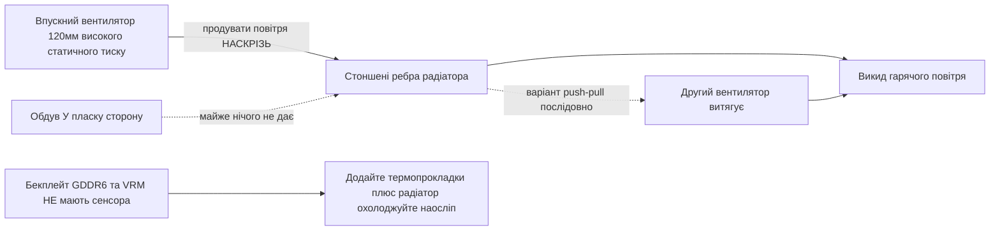

> 🌐 Переклад спільноти. Англійська версія є джерелом істини й може бути новішою. Знайшли помилку? Відкрийте issue: [English](../en/04-cooling.md) · [issues](https://github.com/lildebil0/awesome-bc250/issues)

# Охолодження

> **Коротко** — Штатний радіатор BC-250 створювали для тунелю примусового обдуву серверної стійки, а не для столу. «З коробки» він тротлить. Спільнотне рішення: **стоншити щільні штатні ребра** (напилок/шкурка) і прикрутити **120-мм вентилятор високого статичного тиску** (**Arctic P12 Max/Pro** — еталон; Noctua NF-P12 redux — тиха преміальна альтернатива), який дме *крізь* них. Лише це доводить модифіковану плату до **~73 °C у Furmark, 63–65 °C в іграх**. Рідинна СВО (AIO) та повноцінні кастомні корпуси — наступні рівні.

Охолодження — це **річ №1, яку новачок робить неправильно**, тож зробіть це, перш ніж гнатися за розгоном.

---

## Чому штатного кулера недостатньо

BC-250 — це майнінгова/серверна плата. Її радіатор **пасивний** і розрахований на роботу в шасі, де гучні вентилятори продувають повітря крізь нього спереду назад. На столі без обдуву він накопичує тепло, і GPU тротлить. Дути вентилятором *у* пласку сторону майже марно — повітря має проходити **крізь канали ребер**, а також над задньою пластиною (GDDR6 на звороті **не має датчика температури**, тож охолоджуєте її наосліп).

Спостережені спільнотою межі: тротлінг починається близько **85 °C**, жорсткий виліт/скид — близько **90 °C**. Тримайте температури під навантаженням нижче ~80 °C із запасом.

> **Існує три варіанти радіатора** (ребра у 8 та 9 рядів). Швидка ідентифікація: **QR-код біля конектора PCIe 8-pin** позначає 9-рядний варіант. Варіант із **меншою кількістю товщих ребер** може охолоджувати трохи краще «з коробки». ([elektricM Cooling](https://elektricm.github.io/amd-bc250-docs/hardware/cooling/))

**Цільові температури по компонентах** (виміряні elektricM значення, детальніші за межі тротлінгу/вильоту вище):

| Компонент | Простій | Легке навантаження | Ігри | Макс |
|-----------|------|-----------|--------|-----|
| Край GPU/APU | 40–50 °C | 50–60 °C | 65–80 °C | 90 °C |
| CPU (Tctl) | 45–55 °C | 55–65 °C | 70–85 °C | 95 °C |
| Пам'ять (зворот) | 40–55 °C | 50–65 °C | 55–70 °C | 80 °C |
| NVMe/SSD | 40–55 °C | 50–65 °C | 60–75 °C | 80 °C (критично 81.8 °C) |

Цільтеся на **70–80 °C GPU в іграх**. Стеля NVMe тут важлива, бо **GDDR6 та M.2 SSD ділять гарячу задню сторону плати** — SSD сидить у найгіршому тепловому місці й може зваритися, тож пильнуйте за ним (`80 °C` макс, `81.8 °C` критично за специфікацією накопичувача). ([elektricM: sensors](https://elektricm.github.io/amd-bc250-docs/system/sensors/))

> **Драбина CPU Tctl.** elektricM позначає **90 °C Tctl** як рекомендовану точку відступу; **95 °C** у таблиці — це верхня межа, яку ви ще побачите під важкими іграми; **TJmax = 100 °C** — абсолютна межа кремнію (таблиця потужності пакета нижче фіксує CPU саме на ній під час тривалого стрес-прогону). Отже: **90 °C = «відступай зараз», 95 °C = «в червоній зоні», 100 °C = «біля стіни».** ([elektricM: sensors](https://elektricm.github.io/amd-bc250-docs/system/sensors/))

> **Потужність пакета за тепловим станом** (elektricM пов'язує кожен стан зі споживанням плати): Простій **50–70 W**, Легке **100–150 W**, Важке **150–200 W**, Стрес **200–235 W**. Корисно для підбору БЖ та розуміння, наскільки сильно плата насправді працює, читаючи з розетки. ([elektricM: sensors](https://elektricm.github.io/amd-bc250-docs/system/sensors/))

> **Піксельні артефакти під час гри = перегрів VRAM.** Оскільки задня GDDR6 не має датчика, цей візуальний глюк — ваш сигнал тривоги; додайте обдув задньої пластини / прокладки (нижче). ([elektricM Cooling](https://elektricm.github.io/amd-bc250-docs/hardware/cooling/))

> **Кремнієва лотерея — закладайте тепловий запас на кожен чип.** Дві фізично ідентичні плати, ідентичні шасі та конфіг розгону можуть працювати з різницею в **5–10 °C**, і гарячіша лишалася гарячішою навіть після заміни пасти/прокладок. Не припускайте, що чужі температури збігатимуться з вашими. ([r/BC250Gaming](https://www.reddit.com/r/BC250Gaming/))



---

## Тривалі обчислення — інший режим (не лише ігрові сплески)

Цілі вище передбачають **ігри**, де навантаження надходить сплесками. **Тривалі** обчислення — зациклений `llama-bench`, довгі прогони Stable-Diffusion, будь-що, що навантажує GPU на десятки хвилин, **особливо з [розблокуванням 40 CU](../en/09-overclock-undervolt.md)** — це набагато жорсткіше навантаження, яке може перевищити те, що тримає кулер ігрового класу.

elektricM виміряв штатний радіатор + **два Arctic P12 Max у push–pull**, 10-хвилинний тривалий `llama-bench` на **40 CU / 2 GHz**:

| Метрика | Середнє | Пік |
|--------|---------|------|
| Край GPU | 89.6 °C | 107 °C |
| Потужність пакета | 136 W | 223 W |
| CPU | 96.7 °C | 100 °C (TJmax) |
| MOSFET VRM | 57 °C | 58.5 °C |
| Оберти вентилятора | ~2950 RPM | 2977 RPM (стеля) |

Пропускна здатність просіла на **~10 %** за прогін, оскільки пакет тротлив. Висновок: **штатний радіатор + два P12 Max не дають достатнього запасу для тривалих 40 CU @ 2 GHz** — і зверніть увагу, що **VRM далеко не на межі** (57 °C), тож вузьке місце — це *тепловіддача радіатора*, а не вентилятори чи силова частина. Два рішення: **обмежити регулятор GPU на 1500 MHz** (40 CU все одно масштабує обчислення в ~1.5×, температури тримаються ~83 °C — нескінченно стабільно на двох P12 Max), або **оновити радіатор** (більше площі ребер). Для **штатних ігор на 24 CU** двох P12 Max комфортно вистачає; стіна з'являється лише під тривалими повно-CU обчисленнями. ([elektricM Cooling](https://elektricm.github.io/amd-bc250-docs/hardware/cooling/))

---

## Шлях A — Повітряний мод (найпопулярніший, найдешевший)

Саме це використовує більшість чату.

### 1. Стоншіть/прочистіть штатні ребра
Штатні ребра занадто щільні й часто нерівні. Люди розкривають канали, щоб повітря могло проходити:

- **Орбітальна (ексцентрикова) шліфмашина** — найшвидше, за лічені хвилини, найкращий результат. ([src](https://t.me/c/2424231195/31571))
- **Наждачка вручну** — спершу зерно 60, потім 240, ~3–4 год + 2 год за два дні. Працює, але повільно. ([src](https://t.me/c/2424231195/50330))
- **Ножиці / кусачки** — груба метода «чекрыжить», крайній варіант; результат найгірший. ([src](https://t.me/c/2424231195/41252))
- **Ножиці + лінійка як направляюча (чистий варіант)** — заводьте канцелярські/перукарські ножиці в проміжок між ребер, **притуливши лінійку під кутом до леза як направляючу**; складаний ніж за принципом «відкривачки» працює так само добре. Застереження: деякі варіанти плати **не мають проміжку, щоб завести лезо** — розкрийте один викруткою/пінцетом або проріжте вхідний паз **маленьким відрізним диском Dremel**. Леза, ширші за прорізи ребер, можуть пошкодити радіатор. ([r/BC250Gaming](https://www.reddit.com/r/BC250Gaming/))
- Вирівнюйте погнуті ребра **пласким пінцетом + плоскогубцями**. ([src](https://t.me/c/2424231195/30670))
- **Відривайте ребра руками** — elektricM зазначає, що м'які алюмінієві ребра можна **чисто відірвати/розламати руками** (радіатор зняти з плати), уникаючи металевої стружки, яку створює різальний інструмент. Повільніше, але без сміття. ([elektricM Cooling](https://elektricm.github.io/amd-bc250-docs/hardware/cooling/))
- **«Scooper by Justin»** — **друкований інструмент, зроблений спеціально для віджимання/розкривання ребер радіатора BC-250** ([Printables 1282906](https://www.printables.com/model/1282906-bc-250-scooper)). Безпечніший за голу викрутку: не дає натиснути занадто сильно й подряпати **основу** радіатора між ребрами. ([r/linux_gaming community thread](https://www.reddit.com/r/linux_gaming/comments/1nvsgji/)) Реальні очікування: один власник повідомив, що друкований інструмент «гребінець/scooper» **зламався на 2-му використанні** й натирав руки. ([r/BC250Gaming](https://www.reddit.com/r/BC250Gaming/))
- **Хобі-плоскогубці — метода «відлущування»** — захопіть **верх** ребер маленькими хобі-плоскогубцями й відлущуйте їх, **використовуючи власну пам'ять металу як точку зламу**, щоб вони чисто відламувалися на згині, а не виривали основу. Альтернатива різанню з мінімумом сміття. ([r/linux_gaming community thread](https://www.reddit.com/r/linux_gaming/comments/1nvsgji/))

Приблизний температурний виграш (elektricM): **вирівнювання погнутих ребер ~5–10 °C**, **видалення центральних ребер ~10–15 °C** (незворотно — хороший кожух дає схожий виграш без різання), **свіжа паста ~5–10 °C**, якщо стара висохла. ([elektricM Cooling](https://elektricm.github.io/amd-bc250-docs/hardware/cooling/))

> ⚠ **Спершу зніміть радіатор із плати** (або повністю заклейте/захистіть плату й кристал), перш ніж шліфувати/пиляти, і **зчистіть кожну крихту металевого пилу перед збиранням**. Струмопровідна металева стружка, що осіла на платі, може закоротити її та **вбити плату** — у чаті таке вже траплялося.

<p align="center">
  <br>
  <sub>Фото: спільнота AMD BC-250 · <a href="https://t.me/c/2424231195/31571">джерело</a></sub>
</p>

### 2. Прикрутіть справжній вентилятор
Встановіть **120-мм вентилятор високого статичного тиску**, що проштовхує повітря крізь ребра. Еталонний вибір — **Arctic P12 Max (або P12 Pro)** — найвищий статичний тиск (~6.9 mm H₂O), вибір спільноти + elektricM для цього щільного радіатора. **Noctua NF-P12 redux** — тиха преміальна альтернатива, що показала еталонний результат **макс 73 °C у Furmark, 63–65 °C в іграх** ([src](https://t.me/c/2424231195/42843)).

**Конкретні вентилятори зі специфікаціями** (elektricM — обирайте за *статичним тиском*, а не за потоком):

| Вентилятор | Розмір | Макс RPM | Статичний тиск | Потік | Шум | Темп. в іграх |
|-----|------|---------|----------------|---------|-------|--------------|
| **Arctic P12 Max** | 120 mm | 3300 | **6.9 mm H₂O** | 73.3 CFM | 52.5 dB(A) | 65–75 °C |
| **Arctic P12 Pro** | 120 mm | 2100 | **6.9 mm H₂O** | 68.9 CFM | 37.8 dB(A) | 65–75 °C |
| Arctic P14 PWM | 140 mm | 1700 | 2.40 mm H₂O | 72.8 CFM | 38 dB(A) | 70–80 °C |
| Noctua NF-A12x25 | 120 mm | 2000 | 2.34 mm H₂O | 60.1 CFM | 22.6 dB(A) | 70–85 °C |

Найбільш рекомендований вибір elektricM — **Arctic P12 Max / P12 Pro**: його ~6.9 mm H₂O статичного тиску значно перевершує 2.34 mm у Noctua й набагато дешевший; P12 Pro — тихіша й ширше доступна версія. Преміальна Noctua тихіша, але зрівнюється з Arctic за температурами лише на вищих обертах. ([elektricM Cooling](https://elektricm.github.io/amd-bc250-docs/hardware/cooling/))

**Інші названі вентилятори зі збірок спільноти** (конкретні моделі, що люди ставили, окрім еталонних Arctic/Noctua-P12):

- **Noctua NF-A12x25 G2** (PWM) як **120-мм кулер кристала** — новіша ревізія G2 моделі A12x25, використана як основний вентилятор ([TiredDadTech](https://youtu.be/zi7sldeRd2w)). (Таблиця вентиляторів вище містить лише *оригінальний* NF-A12x25.)
- **Noctua NF-A6x15 PWM** (≈3500 об/хв) як **заміна 60-мм вентилятора БЖ** — тиха заміна верескливому вентилятору серверного блока ([TiredDadTech](https://youtu.be/zi7sldeRd2w)).
- **Thermalright 120 mm 1550 об/хв ARGB** як бюджетний вентилятор кристала, та **термопрокладки 6.0 W/mK** для задньої пластини — обидва зі **специфікації збірки TMG HD** ([build overview](https://youtu.be/OEO0r01zcfU)).

> **Еталон vs тиха альтернатива.** **Arctic P12 Max/Pro** — еталонний вентилятор тут: найвищий статичний тиск (~6.9 mm H₂O), найдешевший, вибір спільноти + elektricM для цього щільного радіатора. **Noctua NF-P12 redux** — тиха преміальна альтернатива (результат 73 °C у Furmark із чату), що зрівнюється з Arctic за температурами лише на вищих обертах. Обирайте Arctic за найкраще співвідношення ціна/продуктивність, Noctua — якщо тиша найважливіша.

Використовуйте **друкований кожух/адаптер**, щоб вентилятор герметично прилягав до радіатора, а не пропускав повітря повз нього. STL від спільноти:
- `Fan_Shroud_Single_120mm.stl`, `Fan_Shroud_Dual_120mm.stl`, `Fan_Shroud_Single_140mm.stl`, `Twin_120mm_Fan_Shroud.stl`
- `BC250_FanAdapter_120mm.step`, `bc250 cooler mount.stl`, `cooler adapter v3.0.stl`

> **Чому статичний тиск, а не показник потоку?** Щільні ребра — це навантаження з високим опором. Корпусний вентилятор високого потоку глохне об них; вентилятор високого статичного тиску (≥3 mm H₂O; Noctua P12, Arctic P12) реально проштовхує повітря *крізь* них. Для дуже щільних ребер два вентилятори в **push–pull (послідовно)** подвоюють статичний тиск — це правильний хід тут, а не два вентилятори поруч.

**Монтаж:** друкований кожух найкращий, але **кріплення стяжками** вентилятора до радіатора працює, а **повітропровід із картону/пінокартону**, приклеєний скотчем між вентилятором і ребрами, — допустимий безкоштовний запасний варіант (потворно, недовговічно, але герметизує повітряний шлях). ([elektricM Cooling](https://elektricm.github.io/amd-bc250-docs/hardware/cooling/))

> ⚠ **Не свердліть/не вкручуйте вентилятори прямо в ребра.** Алюміній м'який, а ребра тонкі — вкручування в них пошкоджує пакет ребер і шкодить охолодженню. Використовуйте стяжки або друкований кожух. ([elektricM Cooling](https://elektricm.github.io/amd-bc250-docs/hardware/cooling/))

> ### 🛠 Інженерія повітряного потоку — що насправді змінює ситуацію
>
> Висновки спільноти про те, *як* рухається повітря, а не лише який вентилятор:
>
> - **Статичний тиск перемагає голий CFM** крізь щільний пакет ребер — тому вентилятор високого статичного тиску **Arctic P12 Max (6.9 mm H₂O)** перевершує тихіші вентилятори високого потоку/низького тиску на цьому радіаторі.
> - **Один центрований вентилятор може перемогти два поруч** на повністю прорізаній площині ребер: один центральний вентилятор навантажує **4 центральні теплові трубки** напряму, тоді як два вентилятори лишають мертвий «шов» пластика над центром. Будівельник, що першим прорізав ребра на всю площину, виміряв на пару °C **нижче** на одному центральному вентиляторі, ніж на двох ([src](https://t.me/c/2424231195/46175)). Розбір доходить того ж висновку з боку потоку: **два вентилятори поруч не кращі за один**, бо **мертва зона утворюється просто над гарячим центром кристала**, де сходяться два потоки — **лишіть проміжок між ними або зробіть push-pull** ([Old Lamer — Part VII](https://youtu.be/pxahl9-YgkY) ~19:55). *(З підпису — сприймайте як якісне, не точне.)*
> - **Поріг обертів 120-мм вентилятора ≈1800 RPM**, щоб реально рухати повітря крізь цей щільний пакет; **Arctic P12 Pro** ($8–10, діапазон **600–3000 об/хв**) — простий вибір, що тихо працює на простої й усе ще має запас ([Old Lamer — Part VII](https://youtu.be/pxahl9-YgkY)). *(Цифри ASR — приблизні.)*
> - **Додати витяжний вентилятор = −3…−5 °C.** Лише вдув **73 °C** → з витяжкою **67–68 °C** ([src](https://t.me/c/2424231195/68183), [src](https://t.me/c/2424231195/31553)). Тож оптимальна проста схема — **1 центральний вдув + 1 задня витяжка**, а не два вдуви поруч.
> - **Задня пластина сліпа й гаряча.** MOSFET VRM сягають **~100 °C без охолодження** ([src](https://t.me/c/2424231195/110955)) — їй **обов'язково** потрібні прокладки + радіатори + виділений обдув; із задніми радіаторами вона працює *«холодною під навантаженням»* ([src](https://t.me/c/2424231195/93056)).
> - **Безкоштовна фізика.** Тепле повітря піднімається, тож навіть орієнтація з **нахилом/димарем** допомагає — ледь вентильована задня пластина показала **47 °C лише від конвекції** ([src](https://t.me/c/2424231195/76962)). А **чорний анодований радіатор випромінює ~в 1.8×** більше за полірований, що дозволяє зменшити площу ребер **~на 45 %** у пасивних/напівпасивних компактних збірках ([src](https://t.me/c/2424231195/86878)).
> - **Тримайте вдув > витяжку** (легкий **позитивний тиск**), щоб VRM/VRAM без датчиків залишалися в потоці свіжого повітря.

### Альтернатива: лишити штатні ребра (push-pull без різання)
Різати ребра не обов'язково. **penzoiders** спроєктував корпус ([MakerWorld, джерело FreeCAD](https://makerworld.com/models/2505974)), який **не** ріже радіатор: він використовує **push-pull вентилятори високого статичного тиску**, щоб проштовхувати повітря крізь **штатні, немодифіковані ребра**, плюс **двокамерний перепад тиску**, що також охолоджує задню пластину (радіатори 5 мм + термопрокладки; підходять перевикористані радіатори NVMe). Налаштування, що лишається прохолодним: **CPU 3800 MHz / 1050 mV, GPU 2100 MHz / 950 mV** → паралельні Furmark + `stress-ng` лишаються **нижче 85 °C**; ігри **~75 °C приблизно при 50 % обертів вентилятора** (крива CoolerControl), «ледь чутно». ([r/BC250Gaming](https://www.reddit.com/r/BC250Gaming/))

## Шлях B — Рідинна СВО (AIO)

120-мм AIO, встановлена на кристал через адаптер-кронштейн. Тихо й холодно, але більше деталей і вартість. Популярні збірки використовують дешеві AIO (наприклад, aigo). ([example src](https://t.me/c/2424231195/19336))

<p align="center">
  <br>
  <sub>Фото: спільнота AMD BC-250 · <a href="https://t.me/c/2424231195/19336">джерело</a></sub>
</p>

**Названий, доступний для завантаження кронштейн AIO — NexGen3D** ([Printables 1554003](https://www.printables.com/model/1554003), друкувати в ABS-GF або PETG). Перевірено з **240-мм AIO Thermalright**: GPU **~50 °C @ 2000 MHz**, CPU **макс 60 °C**. ([r/BC250Gaming](https://www.reddit.com/r/BC250Gaming/))

### Профілі розгону з рідинним охолодженням
З AIO можна тиснути значно сильніше. **NexGen3D** виміряв із розетки (Furmark Vulkan + `stress-ng --matrix 0 -t 60m` як комбо для прогріву):

| Профіль | CPU | GPU | Макс. температура прогріву | Потужність із розетки | Примітка |
|---------|-----|-----|---------------|------------|------|
| 1 | 4000 MHz | 2400 MHz | ~65 °C | >350 W | «мертва тиша» |
| 2 | 4100 MHz | 2450 MHz | ~75 °C | <400 W | гарячіше, гучніше |

Звичайні ігри в 1080p йдуть на **10–15 °C нижче** за ці температури прогріву та **під 250 W** на Профілі 1. **Схема обдуву, яку варто скопіювати:** 120-мм вентилятори **дмуть назовні крізь радіатор**, що затягує свіже зовнішнє повітря через **VRM / БЖ / задню пластину VRAM**; окремий **80-мм вентилятор (Arctic P8 Max)** охолоджує VRM GPU — це відповідає на попередження «VRM/VRAM без датчиків усе одно потребують обдуву» вище. ([r/BC250Gaming](https://www.reddit.com/r/BC250Gaming/))

## Кастомний водяний контур (просунуто)

Окрім закритої AIO, дехто запускає **повноцінний кастомний контур**. Це реальна, але **DIY/експертна** сцена: будівельники **фрезерують на ЧПК або паяють кастомний водоблок**, що покриває **кристал *і* VRM** одним блоком ([src](https://t.me/c/2424231195/131065), [src](https://t.me/c/2424231195/131844), [src](https://t.me/c/2424231195/118582)). Фітинги некритичні — *«можна знайти, виточити чи приклеїти майже будь-які»* ([src](https://t.me/c/2424231195/132007)).

**Що це дає:** грубий кастомний контур сягає **~50 °C під навантаженням при вентиляторах лише на 30 %, зовнішня помпа майже безшумна** ([src](https://t.me/c/2424231195/133040)). (Один будівельник тоді помітив свист котушок від дроселів VRM під навантаженням на стандартному конфізі регулятора cyan-skillfish — *окрема* проблема, не теплова.) Також вам **не потрібен Corsair Commander**: власне [керування вентиляторами](#керування-швидкістю-вентилятора-програмно) BC-250 може керувати помпою плюс **~5 вентиляторами** ([src](https://t.me/c/2424231195/140123)).

> ⚠ **Чому це «просунуто»: BC-250 не переживає затоплення охолоджувачем.** Реальні поломки зі спільноти: шланг **перегнувся під 90°, лопнув і затопив GPU та БЖ** ([src](https://t.me/c/2424231195/81158)); **заклинена помпа Corsair AIO зварила CPU** ([src](https://t.me/c/2424231195/133147), [src](https://t.me/c/2424231195/126053)). Також пильнуйте **кавітацію/шум помпи понад ~50 % швидкості** ([src](https://t.me/c/2424231195/7034)). **Тестуйте весь контур на герметичність ПОЗА платою 24 год перед першим вологим увімкненням.**

**Вердикт:** найнижчі температури й найтихіший з усіх варіантів, і він уможливлює тривалі 40 CU — але найвищий ризик і зусилля. **Не для першої збірки.**

## Шлях C — Турбіна («улитка») — не рекомендовано

Знайдені турбінні вентилятори GPU були раннім експериментом. Гучно як на результат; люди перейшли на Шлях A. ([src](https://t.me/c/2424231195/100086))

## Шлях D — Перехід на баштовий кулер (просунуто)

Деякі користувачі прикручують на кристал **баштовий кулер AM4** (наприклад, **Thermalright Peerless Assassin** чи інші башти AM4/AM5) для відмінного, тихого охолодження з готового заліза. Заковика: треба **монтувати через кронштейн**, а висока башта може **перекрити слот M.2 чи інші компоненти**. Не для початківців. Виготовляти з нуля більше не потрібно — існують два опубліковані друковані кронштейни:

- **Адаптер десктопного кулера AM4/AM5** ([MakerWorld 2596083](https://makerworld.com/en/models/2596083), джерело FreeCAD включене). Монтує стандартний десктопний кулер AM4/AM5 на BC-250. Кріплення: **болти M5 + гайки, без стійок** (автор зазначає, що M4 був би ідеальним, але M5 щільно став). Друкувати в **ABS, PETG або ASA**. Перевірено при **CPU 3.95 GHz / 1.150 V, GPU 2200 MHz / 1000 mV, температури не перевищують 80 °C**. Використані кулери: низькопрофільний **класу AXP90** (коментатор використав **AXP120**), і навіть **AMD Wraith Spire** обійшов штатний радіатор. ([r/BC250Gaming](https://www.reddit.com/r/BC250Gaming/))
- **Кріплення Thermalright AXP90-X53** ([Printables 1694793](https://www.printables.com/model/1694793)). Різьбові втулки **впаяні в споді** друкованого кронштейна, тож ви **перевикористовуєте оригінальні підпружинені гвинти штатного радіатора**; болти з напівкруглою головкою заходять знизу й зенкуються, а кронштейн має **проміжок 0.5 мм під розпіркою** для обходу компонентів плати. Спроєктовано у Fusion 360, **друкувати в PETG** (PLA розм'якшується за цих температур). Результат: **65–67 °C під повним навантаженням @ 2150 MHz, 1080p**, дуже тихо (мідний кулер у парі зі 120-мм Arctic P12 Pro). Виміряна висота стека **54 мм від PCB до верху 15-мм вентилятора** — корисно для підгонки корпусу. Існують також **набір варіантів з 3 товщин** і версія **AXP120-X67**. ([r/BC250Gaming](https://www.reddit.com/r/BC250Gaming/))

---

## Керування швидкістю вентилятора (програмно)

Щойно вентилятор прикручено, ви керуєте його PWM через мікросхему Super I/O **Nuvoton NCT6686D** плати — але **важливо, який драйвер ви завантажуєте** ([elektricM hardware spec](https://elektricm.github.io/amd-bc250-docs/)):

- **Лише читання датчиків** (оберти вентилятора, температури): вбудований у ядро модуль **`nct6683`**, завантажений із `force=true`. Він повідомляє показники, але **не може писати PWM**, тож вентилятор лишається на тому, що задає BIOS/прошивка.
- **Читання + запис PWM** (реальне задання швидкості): використовуйте сторонній модуль **`nct6687`** з **[Fred78290/nct6687d](https://github.com/Fred78290/nct6687d)**, також із `force=true`. Саме його збирайте, якщо хочете криві вентилятора / ручне керування швидкістю, а не лише моніторинг.

```bash
# monitoring only (in-kernel):
echo 'options nct6683 force=true' | sudo tee /etc/modprobe.d/nct6683.conf
# PWM control (DKMS from Fred78290/nct6687d):
echo 'options nct6687 force=true' | sudo tee /etc/modprobe.d/nct6687.conf
```

> Не завантажуйте обидва — оберіть `nct6683` для читання датчиків або `nct6687` для читання+запису. Розпіновка датчиків (`CPU_FAN1` / `J4003`) та нумерація вентиляторів BIOS↔Linux — у кроці верифікації [06-linux.md](../en/06-linux.md).

**Який роз'єм — основний вентилятор?** elektricM повідомляє, що вентилятор охолодження зазвичай на роз'ємі **Pump Fan** = **`fan2` / `pwm2`** у sysfs; `CPU Fan` (`fan1`) та роз'єми `System Fan` (`fan3`+) типово не використовуються. Увімкніть ручний режим перед записом PWM (`echo 1 > .../pwm2_enable`, потім значення 0–255 у `.../pwm2`). Нумерація hwmon може зміщуватися між перезавантаженнями — звіряйте через `cat /sys/class/hwmon/hwmon*/name`. ([elektricM Cooling](https://elektricm.github.io/amd-bc250-docs/hardware/cooling/))

**Криві вентилятора з GUI — CoolerControl.** Щойно `nct6687` завантажено, **CoolerControl** дає графічні криві вентилятора: оберіть пристрій **nct6686**, побудуйте криву на **pwm2**, використовуючи **k10temp Tctl** як джерело. Встановлення: `ujust install-coolercontrol` (Bazzite), copr `codifryed/CoolerControl` (Fedora) або `coolercontrol` з AUR (Arch); веб-інтерфейс на `https://localhost:11987`. ([elektricM Cooling](https://elektricm.github.io/amd-bc250-docs/hardware/cooling/))

**Режими вентилятора в BIOS** (якщо ви не керуєте з боку ОС): **Default** тримає вентилятори на **мінімумі 40 %** (надто низько — не рекомендовано), **Full Speed** фіксує їх на 100 % (гучно, але безпечно), **Customize** задає швидкості за порогами. ([elektricM Cooling](https://elektricm.github.io/amd-bc250-docs/hardware/cooling/))

> ⚠ **Не запускайте режим BIOS Customize та CoolerControl одночасно** — вони борються за керування PWM. Оберіть щось одне. ([elektricM Cooling](https://elektricm.github.io/amd-bc250-docs/hardware/cooling/))

---

## Термоінтерфейс (паста, прокладки, фазовий перехід, рідкий метал)

Який би вентилятор/радіатор ви не використовували, **матеріал термоінтерфейсу (TIM)** між кристалом і радіатором — і між зворотом плати та будь-яким заднім радіатором — варто зробити правильно. Кристал BC-250 має **високу щільність тепла**, тож хороший TIM — це безкоштовні кілька градусів.

> **Навіть проста заміна штатної пасти допомагає.** Один власник замінив заводську пасту через рік, і температури під навантаженням впали на **~4–5 °C**, за незмінного іншого. ([src](https://t.me/c/2424231195/88565))

### Пасти, що працюють
- **Arctic MX-6** — звичайна високоякісна паста. В одній корпусній збірці тримала **87–88 °C у Furmark**; той самий власник зазначив, що PTM7950 зняла б ще ~4 °C із цього. ([src](https://t.me/c/2424231195/30211))
- **Штатна паста + штатні прокладки** — задокументована база: ~**76 °C** після 10 хв навантаження, ~**55 °C** на простої (до моду ребер/вентилятора). ([src](https://t.me/c/2424231195/22992))
- Інші пасти, які elektricM наводить як прийнятні тут: **Arctic MX-4** (вигідно), **Thermal Grizzly Kryonaut** (преміум), **Noctua NT-H1** (надійно), **Thermalright TFX** (бюджет). Паста на вживаній платі **часто висохла** — лише заміна пасти варта **~5–10 °C**. Нанесіть краплю розміром із горошину на кристал, рівно встановіть, затягуйте гвинти **хрест-навхрест**. ([elektricM Cooling](https://elektricm.github.io/amd-bc250-docs/hardware/cooling/))

### PTM7950 — улюбленець спільноти (рекомендовано)
**PTM7950** — це **прокладка з фазовим переходом** (графіт/плівка з фазовим переходом Honeywell). За кімнатної температури це тонкий твердий лист; під навантаженням (~45–55 °C) вона розм'якшується й розтікається в шар товщиною в мікрони, а потім лишається на місці. Вона **не витискається** й не висихає, як паста, що саме й потрібно під гарячим кристалом із тепловими циклами — тож наносите її раз і забуваєте. Прямий підсумок чату: *«PTM7950 і не парся»* ([src](https://t.me/c/2424231195/101582)); фазовий перехід — загальна рекомендація ([src](https://t.me/c/2424231195/61511)).

**Як наносити:**
1. Очистіть кристал і основу радіатора (ізопропіловий спирт), дайте висохнути.
2. Виріжте квадрат PTM7950 під розмір кристала — шматок **~26×30 мм** покриває кристал BC-250 ([src](https://t.me/c/2424231195/125748)).
3. Зніміть одну захисну плівку, покладіть прокладку на кристал, зніміть другу плівку.
4. Встановіть радіатор і рівномірно затягніть. **Без розмазування** — перший тепловий цикл зробить роботу. Найкращих температур очікуйте після кількох циклів навантаження/простою («обкатка»).

Еталонна корпусна збірка на PTM7950 (Honeywell, 26×30) плюс задній радіатор сягає піку **~84 °C за годину, 66–71 °C в іграх** при CPU 3850 MHz / GPU 2100 MHz. ([src](https://t.me/c/2424231195/125748))

> **Названа пара: пластична маса Upsiren під радіатором + PTM7950 на кристалі.** Збірне відео поєднує **термопластичну масу Upsiren UTP-6 / UTP-8** (марка **UTP-8** має рейтинг ≈**14.8 W/mK**) для місць заповнення проміжків із **листом PTM7950, вирізаним 40×80×0.25 мм**, покладеним на кристал ([PTM7950 + Upsiren video](https://youtu.be/FJapqZSdt6I)). Маса — для заповнення нерівних проміжків до радіатора/пластини; плівка з фазовим переходом іде на сам кристал.
>
> - **Дешева PTM7950 з AliExpress працює.** Перевірено, що лист із AliExpress за ~**$13** показує результат — фірмовий розкрій Honeywell не потрібен ([PTM7950 + Upsiren video](https://youtu.be/FJapqZSdt6I)).
> - **PTM7950 потребує обкатки.** Найкращих температур вона сягає лише після **кількох циклів нагрів/охолодження** — не судіть її за першим прогоном ([laptop TIM demo](https://youtu.be/U4Zm8msXJHM)).
>
> *(Обидва джерела з автопідписами — сприймайте точні W/mK і розміри як приблизні.)*

### Прокладки задньої пластини та GDDR6 (охолодіть зворот наосліп)
**GDDR6 та VRM на звороті плати не мають датчика температури** — ви охолоджуєте їх наосліп. Додайте **радіатор на задню пластину** в парі з **термопрокладками**, щоб задньому теплу було куди дітися. ([src](https://t.me/c/2424231195/125748)) Один RU-будівельник просто взяв **радіатор з Яндекс.Маркета**, приліпив на задню пластину, і він **добре охолодив нижню пластину** — будь-який алюмінієвий радіатор розумного розміру тут підходить ([4pda — mananoid1](https://4pda.to/forum/index.php?showtopic=1104980)).

Повідомлені товщини прокладок (поширені спільнотою, реакція «зберіг це»):
- **VRM: 1 мм**
- **GDDR6: 2 мм** ([src](https://t.me/c/2424231195/121181))

> ⚠ **звірте** — ці товщини залежать від проміжку до *вашої* конкретної задньої пластини/радіатора. Підтвердіть виміром проміжку (або тестом масою/пластиліном) перед покупкою купи прокладок.

elektricM дає **трохи іншу схему прокладок** для охолодження самої пам'яті: **прокладки 1.5 мм спереду плати, 2.0 мм ззаду**, потім алюмінієва пластина/радіатор знизу. Використовуйте **лише непровідні** прокладки біля плати (ніколи провідну пасту/прокладки, що можуть закоротити компоненти). Бренди прокладок, які він наводить: **Thermalright Odyssey** (висока продуктивність), **Arctic Thermal Pad** (вигідно), **Gelid GP-Ultimate** (преміум). ([elektricM Cooling](https://elektricm.github.io/amd-bc250-docs/hardware/cooling/))

> ⚠ **звірте (товщини прокладок різняться між джерелами)** — наші числа з чату: **VRM 1 мм / GDDR6 2 мм (ззаду)**; elektricM вказує **1.5 мм спереду / 2.0 мм ззаду** для чипів пам'яті. Різні збірки, різні проміжки — **виміряйте власний зазор**, а не довіряйте жодній цифрі наосліп.

> **Вильоти/нестабільність після 30–60 хв гри** (часто з піксельними артефактами) — це класична ознака **перегріву пам'яті**. Рішення: додайте прокладки + нижню пластину, додайте вентилятор задньої пластини, покращте обдув корпусу або тимчасово **зменшіть виділення VRAM** (наприклад, 4 ГБ → 512 МБ), щоб скоротити тепло пам'яті. ([elektricM Cooling](https://elektricm.github.io/amd-bc250-docs/hardware/cooling/))

### Рідкий метал — загалом НЕ рекомендовано тут
Рідкий метал (LM) виникає, бо PS5 (APU тієї ж родини) використовує його ([src](https://t.me/c/2424231195/18105)), і за голою продуктивністю він обходить пасту/PTM ([src](https://t.me/c/2424231195/124112)). Люди питали про нього й пробували на BC-250 ([src](https://t.me/c/2424231195/18098), [src](https://t.me/c/2424231195/77180)).

**Але це неправильний вибір на цій платі:**
- LM **електропровідний**. Кристал BC-250 сидить просто біля **щільних GDDR6 та VRM**; крапля, що втече з кристала, закоротить плату (той самий ризик «провідне біля пам'яті вбиває її», що й попередження про металеву стружку вище).
- Він **витискається / потребує переробки приблизно щороку** й роз'їдає голий алюміній — навіть прихильник PTM7950 відмовився від LM на власному залізі саме через цю мороку, перейшовши на PTM7950 / KryoSheet. ([src](https://t.me/c/2424231195/69688))
- «Не кожен узагалі візьметься працювати з рідким металом.» ([src](https://t.me/c/2424231195/106787))

**Підсумок:** **PTM7950 — безпечніший високопродуктивний вибір** — ~99 % вигоди, жодного ризику короткого замикання/обслуговування. Лишіть LM для тих, хто вже точно знає, що робить.

---

## Як перевірити своє охолодження (метода спільноти, закріплено)

Із закріпленої процедури ([src](https://t.me/c/2424231195/108407)):

1. **Стрес GPU:** Furmark (Vulkan / «Furmark VK»).
2. **CPU одночасно:** додайте бенч CPU (cpu-x) або навантаження на основі `stress`/`pipx` — APU ділить один радіатор, тож тестуйте обидва разом.
   - Ці інструменти (Furmark, OCCT, cpu-x, `stress`) **не передвстановлені** на свіжій Linux-машині — спершу встановіть їх через менеджер пакетів чи Flatpak.
3. **Тестуйте на своєму розгоні**, а не на штатному — 1500 MHz слабкі; **2000 MHz — це ~+30 % FPS** і те, що ви реально запускатимете, тож охолоджуйте під це.
4. Стежте за температурами; якщо перетинаєте ~85 °C — ви тротлите, додайте роботи з вентилятором/кожухом/ребрами.

> ℹ️ **Не плутайте два різні твердження про «+30 %».** **+30 % частоти GPU** тут (1500 → 2000 MHz підвищує FPS приблизно на третину) — це *приріст продуктивності* від розгону. Це **не** те саме, що **~+30 % теплового покращення**, наведене для **заміни пасти** в окремій демонстрації з ноутбучним TIM ([laptop TIM demo](https://youtu.be/U4Zm8msXJHM)) — там це *температурний* результат на іншому залізі. Те саме число, непов'язані речі.

Також є коротке відео-проходження найпростішої методи, закріплене в темі. ([src](https://t.me/c/2424231195/100024))

---

## Рекомендована стартова збірка

| Рівень | Зробіть це | Очікуйте |
|------|---------|--------|
| Мінімум | Стоншити ребра (орбітальна шліфмашина) + 1× Arctic P12 Max/Pro (або Noctua NF-P12) + друкований кожух | ~73 °C Furmark |
| Краще | Push–pull (2× P12) через кожух | нижче, тихіше за тих самих температур |
| Макс | 120-мм AIO на адаптері | найхолодніше, більше зусиль на збірку |

---

## Джерела

- Закріплена метода тестування — https://t.me/c/2424231195/108407 · відео — https://t.me/c/2424231195/100024
- Інструмент для ребер — https://t.me/c/2424231195/31571 · https://t.me/c/2424231195/30670 · https://t.me/c/2424231195/50330 · інструмент для ребер «Scooper by Justin» ([Printables 1282906](https://www.printables.com/model/1282906-bc-250-scooper)) + метода відлущування хобі-плоскогубцями — [r/linux_gaming thread](https://www.reddit.com/r/linux_gaming/comments/1nvsgji/)
- Результат Noctua P12 — https://t.me/c/2424231195/42843
- Приклад AIO — https://t.me/c/2424231195/19336
- Термоінтерфейс — заміна пасти −4–5 °C https://t.me/c/2424231195/88565 · MX-6 https://t.me/c/2424231195/30211 · штатна база https://t.me/c/2424231195/22992 · PTM7950 https://t.me/c/2424231195/101582 · https://t.me/c/2424231195/61511 · збірка PTM7950 + задня пластина https://t.me/c/2424231195/125748 · товщина прокладок https://t.me/c/2424231195/121181 · рідкий метал https://t.me/c/2424231195/18098 · https://t.me/c/2424231195/69688
- Гайд із охолодження elektricM (варіанти радіатора, таблиця температур по компонентах, дані тривалого навантаження, специфікації вентиляторів, режими вентиляторів CoolerControl/BIOS, баштовий кулер, схема прокладок) — https://elektricm.github.io/amd-bc250-docs/hardware/cooling/
- [elektricM: sensors](https://elektricm.github.io/amd-bc250-docs/system/sensors/) (теплові пороги: CPU Tctl 90 °C макс / TJmax 100 °C, NVMe/SSD 80 °C макс / 81.8 °C критично, потужність пакета за тепловим станом)
- r/BC250Gaming (звіти спільноти: розкид кремнієвої лотереї, метода ребер ножиці+лінійка, поломка інструмента-гребінця, корпус push-pull без різання, кронштейн AIO + результат 240 мм, профілі рідинного розгону, кронштейни AM4/AM5 + AXP90-X53) — https://www.reddit.com/r/BC250Gaming/ · адаптер кулера AM4/AM5 [MakerWorld 2596083](https://makerworld.com/en/models/2596083) · кріплення AXP90-X53 [Printables 1694793](https://www.printables.com/model/1694793) · кронштейн AIO NexGen3D [Printables 1554003](https://www.printables.com/model/1554003) · корпус push-pull без різання [MakerWorld 2505974](https://makerworld.com/models/2505974)
- Апаратний довідник — [mothenjoyer69/bc250-documentation `hardware.md`](https://github.com/mothenjoyer69/bc250-documentation/blob/main/hardware.md)
- Корпуси/адаптери з охолодженням — [onemorecap/bc-250-sleeve-adapter](https://github.com/onemorecap/bc-250-sleeve-adapter)
- Мертва зона від двох вентиляторів поруч над кристалом / лишіть проміжок або push-pull, поріг 120 мм ≈1800 RPM, Arctic P12 Pro ($8–10, 600–3000 об/хв) — [Old Lamer — Part VII](https://youtu.be/pxahl9-YgkY) (автопідпис / ASR — цифри приблизні)
- Маса Upsiren UTP-6 / UTP-8 (UTP-8 ≈14.8 W/mK) + PTM7950, вирізана 40×80×0.25 мм на кристал, дешева PTM7950 з AliExpress (~$13) перевірена — [PTM7950 + Upsiren video](https://youtu.be/FJapqZSdt6I) · PTM7950 потребує кількох циклів обкатки нагрів/охолодження + окреме «+30 %» від заміни пасти (ноутбук, не +30 % частоти GPU) — [laptop TIM demo](https://youtu.be/U4Zm8msXJHM)
- Названі вентилятори: Noctua NF-A12x25 G2 (120-мм кулер кристала) + NF-A6x15 PWM 3500 об/хв (заміна 60-мм вентилятора БЖ) — [TiredDadTech](https://youtu.be/zi7sldeRd2w) · Thermalright 120 mm 1550 об/хв ARGB + прокладки 6.0 W/mK (специфікація збірки TMG HD) — [build overview](https://youtu.be/OEO0r01zcfU)
- RU задній радіатор (радіатор з Яндекс.Маркета охолодив нижню пластину) — [4pda — mananoid1](https://4pda.to/forum/index.php?showtopic=1104980)

> STL кожухів вентиляторів та адаптерів каталогізовані в [05-case.md](../en/05-case.md) і дзеркаляться під `assets/stl/`.
