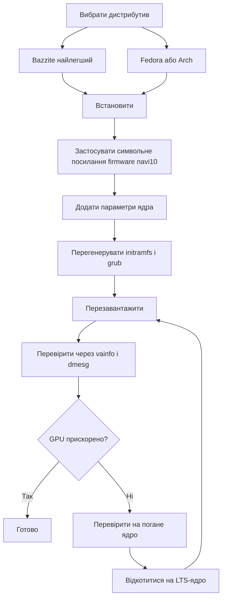

> 🌐 Переклад спільноти. Англійська версія є джерелом істини й може бути новішою. Знайшли помилку? Відкрийте issue: [English](../en/06-linux.md) · [issues](https://github.com/lildebil0/awesome-bc250/issues)

# Драйвери та налаштування Linux

> **Коротко** — Більшість людей запускає BC-250 на Linux, і вона працює добре *щойно GPU полагоджено*. «З коробки» `amdgpu` не розпізнає чип, і ви отримуєте однознакові FPS із рендером на CPU. Дві речі роблять її робочою: **сучасне ядро + свіжа Mesa (25.1+)** та **фікс `amdgpu`** — символьне посилання firmware, щоб драйвер зміг завантажитися (`navi10_gpu_info.bin` → `cyan_skillfish_gpu_info.bin`), плюс параметри ядра (`amdgpu.sg_display=0`, `mitigations=off`, а на нових ядрах `amdgpu.bc250_cc_write_mode=3`). Найлегший шлях для новачка: прошити **[Bazzite](https://bazzite.gg/)** і перейти (rebase) на спеціальний образ **`bazzite-bc250`** — фікси вже вбудовані. Хочете вивчити машину: **Fedora** або **CachyOS/EndeavourOS (Arch)** з одноразовим скриптом налаштування.

Це той розділ, що перетворює «плату в коробці» на робочий десктоп. Спершу зробіть [охолодження](../en/04-cooling.md) і [живлення](../en/03-power-supply.md) — а потім це.

> **Ніколи не користувалися Linux? Набір для виживання за 60 секунд.**
> - **Відкрити термінал:** шукайте застосунок під назвою *Terminal* / *Konsole* (KDE) / *Console* у меню, або натисніть `Ctrl-Alt-T`.
> - **`sudo`** перед командою запускає її від адміністратора. Вона запитає ваш пароль — і **поки ви друкуєте, на екрані нічого не показується** (ні крапок, ні зірочок). Це нормально; наберіть його й натисніть Enter.
> - **`nano /etc/...`** відкриває простий текстовий редактор у терміналі. Щоб зберегти й вийти: **Ctrl-O**, потім **Enter**, потім **Ctrl-X**.
> - **Копіювати-вставити** в термінал зазвичай **Ctrl-Shift-V** (не Ctrl-V).
> - Багато кроків набувають чинності лише після **перезавантаження** (`systemctl reboot`). Коли крок каже «перезавантажте», справді перезавантажтеся, перш ніж судити, чи спрацювало.

---

## Єдине, що ви мусите зрозуміти

GPU плати BC-250 — це **Cyan Skillfish / Oberon** (похідна від PlayStation 5 частина RDNA2). Mainline `amdgpu` історично **не мав firmware-блобу з її назвою**, тож на стандартному встановленні ядро не може ініціалізувати GPU, і десктоп відкочується на програмний (LLVMpipe) рендеринг — усе повільне, а `vulkaninfo` не показує реального пристрою. Один користувач витратив дні на «зламані драйвери», перш ніж зрозумів, що його дистрибутив просто завантажив ядро, яке не могло завантажити firmware GPU ([src](https://t.me/c/2424231195/98466)).

Тож кожне робоче налаштування робить ті самі три речі, у тій чи іншій формі:

1. **Запустіть достатньо нове ядро + Mesa.** Upstream Mesa отримав підтримку BC-250 у **25.1** (жодних патчів відтоді не потрібно; **25.3.x** — поточна рекомендована стабільна) — ([Mesa MR !33116](https://gitlab.freedesktop.org/mesa/mesa/-/merge_requests/33116), [src](https://t.me/c/2424231195/20891)). Датчики температури з'явилися в **ядрі 6.15** ([src](https://t.me/c/2424231195/23542)); ядро **6.18.18 LTS** — поточна золота середина.
2. **Дайте `amdgpu` потрібну firmware** — на сучасних налаштуваннях актуальний **`linux-firmware`** уже постачає `cyan_skillfish_gpu_info.bin`; старішим системам досі потрібне **символьне посилання navi10** (або патчений пакет mesa/ядра). Див. Шлях C.
3. **Передайте правильні параметри ядра** й перегенеруйте initramfs + завантажувач. (А також встановіть **GPU governor**, щоб частоти не були закріплені на 1500 MHz.)

Усе нижче — лише *як* кожен дистрибутив робить ці три речі.



---

## Який дистрибутив? (улюбленці опитувань спільноти)

Чат раз у раз повертається до чотирьох. Немає єдиної «правильної» відповіді — це компроміс між *нульовими зусиллями* та *розумінням вашої машини*. Документація elektricM тестує ширше поле; ось усі вони з першого погляду ([elektricM: distributions](https://elektricm.github.io/amd-bc250-docs/linux/distributions/)):

| Дистрибутив | Основа | Зусилля | Фікс GPU | Найкраще для |
|--------|------|--------|---------|----------|
| **Bazzite** (образ `bazzite-bc250`) | Fedora atomic | **Найнижчі** — фікси вбудовані | Застосовані заздалегідь в образі | Новачки, «просто грати в ігри» |
| **Fedora 43** (Workstation / KDE) | Fedora | Низькі | Mesa 25.x у mainline-репозиторіях + governor COPR | Вивчити Linux, триматися ближче до upstream |
| **CachyOS** | Arch | Середні | Mesa 25.1+ у репозиторіях + governor (AUR) | Максимальна плавність (планувальник BORE), HDR+VRR |
| **EndeavourOS / Arch** | Arch | Середні | Mesa 25.1+ у репозиторіях + governor | Arch без болю встановлення |
| **Debian (Testing/Sid) / PikaOS** | Debian | Середні–Високі | Mesa з `experimental` (Debian) / OOTB (PikaOS) | Стабільність, **найнижче споживання в спокої (~50–60 Вт)** |
| **Manjaro** | Arch | Середні | Mesa 25.1+ у репозиторіях; завантажується OOTB після прошивки BIOS | Простий Arch; GNOME найстабільніший |
| **Alpine** | Alpine (OpenRC) | Високі | вручну mesa + firmware + governor | Мінімалістична/headless, ~150 МБ RAM / ~35 Вт |
| **Fedora CoreOS** | Fedora atomic | Високі | контейнерний хост; кастомізації після встановлення | Headless контейнерні/LLM-сервери |
| **SteamOS** (Valve) | Arch (immutable) | Середні | Mesa з образу **main-branch** (не стабільного) + governor | Відчуття справжньої Steam Machine; диван/Gaming Mode |
| **Batocera** | Linux (дистрибутив для емуляції) | Низькі–Середні | вбудована Mesa + налаштування | Консольний **емуляційний** бокс ([15-emulation.md](../en/15-emulation.md)) |

Нотатки з чату та [elektricM](https://elektricm.github.io/amd-bc250-docs/linux/distributions/):
- **Bazzite найлегший** і має **спеціальний образ для BC-250** з фіксом firmware, параметрами ядра, GPU governor і вже застосованим патчем 40-CU/частоти. Знайдіть його на artifacthub: [`bazzite-bc250`](https://artifacthub.io/packages/container/bazzite-bc250/bazzite_bc250). Кілька користувачів перейшли на нього саме для того, щоб перестати патчити вручну ([src](https://t.me/c/2424231195/121246)).
- **Станом на Fedora 43, Mesa 25.x є в mainline-репозиторіях** — COPR `mixaill/amd-bc-250` більше не потрібен лише заради Mesa. Fedora 42 **знята з підтримки (end-of-life)**; оновіться до 43. Під час встановлення, якщо отримаєте чорний екран, скористайтеся *Troubleshooting → Install in Basic Graphics Mode* ([elektricM: Fedora](https://elektricm.github.io/amd-bc250-docs/linux/fedora/)).
- **Не хапайте наосліп «геймерські» дистрибутиви.** Один докладний розбір доводить, що звичайна **Fedora (Workstation/KDE)** або **vanilla Arch з LTS-ядром + свіжою Mesa** — безболісна золота середина, і що важкі тюнінговані форки інколи можуть *ламати* Steam/FSR/vsync, а не допомагати ([src](https://t.me/c/2424231195/102834)). Сприймайте це як пораду «станом на кінець 2025» — образ Bazzite відтоді дозрів.
- **CachyOS замість Bazzite, якщо ви женетеся за максимальною плавністю.** Докладний звіт спільноти r/BC250Gaming (Reddit) перейшов з Bazzite на **CachyOS** і виявив, що ігри помітно плавніші незалежно від джерела, з меншою кількістю підвисань/мікрофризів (напр. *Mortal Kombat 1*), меншою кількістю випадкових вильотів і перезапусків Steam-mode, і дуже чуйним відчуттям на **типовому розкладі Btrfs**. Він також змусив **HDR + VRR працювати належно** там, де Bazzite не міг (HDR глючив, VRR ніколи не працював) — див. [14-display.md](../en/14-display.md). Сприймайте це як один добре задокументований досвід, а не універсальний вердикт, але це сильний варіант, якщо Bazzite залишає вас із підвисаннями чи нестабільністю. Налаштування автоматизує скрипт **[`redbeard1083/bc250-toolkit`](https://github.com/redbeard1083/bc250-toolkit)** (BC-250 на CachyOS). ⚠ Окремий датапоінт спільноти додає термальний/FPS-аспект: за *ідентичного* розгону CachyOS, за повідомленнями, працює **на ~10 °C прохолодніше за Bazzite** і дає вищі FPS у CPU-залежних тайтлах (напр. *Elden Ring* ~60–75 на CachyOS проти ~45–60 на Bazzite) ([+14], r/BC250Gaming — за повідомленнями спільноти, варіюється; незалежно не підтверджено).
- **Версія ядра важливіша за дистрибутив.** Уникайте відомо поганих ядер (див. блок з попередженням нижче). За сумніву **LTS-ядро** (рекомендовано 6.18.18 LTS) — безпечний вибір; кілька користувачів натрапили на стіну на надто новому ядрі й були врятовані переходом на LTS ([src](https://t.me/c/2424231195/56529), [src](https://t.me/c/2424231195/59839)).
- **Робоче середовище (desktop environment):** **GNOME має найкращий послужний список** на BC-250. У KDE Plasma були вильоти Qt RDRAND/RDSEED — виправлено в нещодавньому Qt (середина 2025), але GNOME досі безпечний типовий вибір; Cinnamon (X11) — стабільний легкий варіант ([elektricM: distributions](https://elektricm.github.io/amd-bc250-docs/linux/distributions/)).
- **Ще два дистрибутиви підтверджено спільнотою як такі, що завантажуються** ([тред спільноти r/linux_gaming](https://www.reddit.com/r/linux_gaming/comments/1nvsgji/)): **SteamOS** працює на BC-250 — але використовуйте образ SteamOS з **main-branch**, **не** стабільний канал (стабільний постачає старішу Mesa без підтримки BC-250). А **Batocera**, спеціальний дистрибутив для емуляції, також завантажується й працює — зручний спосіб перетворити плату на консольний емуляційний бокс (див. [15-emulation.md](../en/15-emulation.md)). Обидва дотримуються тих самих трьох правил, що й усе вище (свіжа Mesa + фікс firmware `amdgpu` + параметри ядра/governor).

> Один ветеран підсумував досвід після трьох місяців щоденного користування BC-250 на Linux: ігри запускаються одним кліком, RTX працює, VR працює, «абсолютно безшовно» — і він переключив свій основний десктоп на Linux через це ([src](https://t.me/c/2424231195/61870)).

---

## Шлях A — Bazzite (рекомендовано для новачків)

Bazzite — це незмінна (immutable) ігрова ОС на базі Fedora (схожа на SteamOS). Спільнота підтримує **образ, специфічний для BC-250**, тож ви самостійно не торкаєтеся firmware чи параметрів ядра.

### A1. Спершу встановіть звичайну Bazzite
1. Завантажте з **[bazzite.gg](https://bazzite.gg/#image-picker)** (виберіть варіант desktop або «Deck»/Gaming-Mode).
2. Прошийте на USB (Ventoy, Rufus або balenaEtcher) і встановіть як зазвичай. **Створіть не-root користувача** — Steam відмовляється запускатися від root ([src](https://t.me/c/2424231195/121246)).

> **Вибір правильного образу Bazzite (крок за кроком).** На [bazzite.gg](https://bazzite.gg/) пройдіть пікер **Desktop PC → AMD (modern) → KDE → Gaming-Mode image** — беріть збірку **Gaming-Mode**, а не звичайний live ISO: live ISO встановлюється нормально, але **насправді не може запускати ігри**. Прошийте його через **Balena Etcher** на USB-флешку **≥16 ГБ**. **Цільовим** диском для встановлення може бути M.2 NVMe, SATA SSD на адаптері M.2-to-SATA, або навіть **зовнішній USB**-диск. Образ із середини листопада 2025 постачав **Mesa 25.2.4** з коробки ([Old Lamer — Part IV](https://youtu.be/YuBmGF536II)).

> **Флешка замала?** ISO Bazzite >9 ГБ. Ви можете встановити звичайну **Fedora** (ISO ≈3 ГБ, напр. Kinoite/KDE) на малу флешку, а потім *перейти (rebase)* на Bazzite з терміналу ([src](https://t.me/c/2424231195/121246)):
> ```bash
> # KDE desktop:
> rpm-ostree rebase ostree-image-signed:docker://ghcr.io/ublue-os/bazzite:stable
> # or with Gaming Mode (SteamOS-like):
> rpm-ostree rebase ostree-image-signed:docker://ghcr.io/ublue-os/bazzite-deck:stable
> ```
> Перезавантажтеся — і ви в Bazzite.

### A2. Встановіть GPU governor (найпростіший поточний шлях)
Станом на початок 2026 **стандартне ядро Bazzite вже містить патч діапазону частот GPU** — тож зазвичай **кастомний образ взагалі не потрібен**. Просто встановіть governor поверх звичайної Bazzite ([elektricM: Bazzite](https://elektricm.github.io/amd-bc250-docs/linux/bazzite/)):
```bash
sudo dnf copr enable filippor/bazzite
rpm-ostree install cyan-skillfish-governor-smu   # SMU variant — no kernel patch needed
systemctl reboot
sudo systemctl enable --now cyan-skillfish-governor-smu.service
# Pin the known-good deployment so an update can't silently break you:
rpm-ostree pin 0
```
**`cyan-skillfish-governor-smu`** керує частотами через виклики firmware SMU й заміщує старіший `oberon-governor` (див. *[Power governor](#b3-power-governor-cyan-skillfish-governor)*). Існує також варіант `cyan-skillfish-governor-tt`, але він потребує патча частоти ядра (уже в Bazzite). ⚠ Governor може націлюватися на не ту карту (card0 проти card1) — перевірте, якщо масштабування не вмикається.

### A2-alt. (Опційно) Перейдіть (rebase) на образ BC-250
Лише якщо ви хочете додаткові заздалегідь вбудовані оптимізації: переключіться на підтримуваний образ BC-250 — збірки **`vietsman` «Bazzite on Steroids»** (фікс firmware, параметри ядра, governor, розширений патч частоти 350–2230 MHz уже вбудовані). Виберіть desktop, який ви встановили — **GNOME — рекомендований типовий вибір** — і запустіть:
```bash
# GNOME (recommended):
rpm-ostree rebase ostree-image-signed:docker://ghcr.io/vietsman/bazzite-gnome-patched:latest
# KDE:
rpm-ostree rebase ostree-image-signed:docker://ghcr.io/vietsman/bazzite-kde-patched:latest
# Deck / Gaming-Mode (SteamOS-like):
rpm-ostree rebase ostree-image-signed:docker://ghcr.io/vietsman/bazzite-deck-patched:latest
systemctl reboot
```
⚠ перевірте поточний образ/тег перед запуском — шляхи образів змінюються. Актуальні команди живуть на [сторінці Bazzite у документації BC-250](https://elektricm.github.io/amd-bc250-docs/linux/bazzite/) (також у списку на artifacthub як [`bazzite-bc250`](https://artifacthub.io/packages/container/bazzite-bc250/bazzite_bc250)).

> ⚠ **Перехід (rebase) на патчений образ може вбити ваш USB WiFi (elektricM Issue #10).** Кастомне ядро може не містити драйвера вашого USB WiFi/Bluetooth-донгла (BC-250 не має вбудованого бездротового зв'язку). Тримайте напоготові Ethernet, перевірте `lsmod | grep <your_driver>` після rebase, `rpm-ostree install <driver-package>`, якщо відсутній, або `rpm-ostree rollback && systemctl reboot`.

> **Якщо розблокування 40-CU ламає керування вентилятором чи ваш геймпад Xbox, замініть на кастомний образ ядра.** Вбудоване розблокування 40-CU у Bazzite (метод «Old-Lamer») за повідомленнями спільноти ламає **керування вентилятором і підтримку контролера Xbox** на деяких налаштуваннях ([+ r/BC250Gaming — за повідомленнями спільноти, варіюється]). Образ **[`hafriedlander/kernel-bazzite`](https://github.com/hafriedlander/kernel-bazzite)** — це кастомне ядро, що це виправляє — перевірено, що це *«(legacy) ядро Bazzite з патчем розблокування 40CU для плат BC250»*, зібране прямо з kernel-ark від Fedora зі звичайним набором патчів handheld/performance (також запаковане в AUR як `linux-bazzite-bin`). ⚠ Чи вирішить воно вашу конкретну регресію вентилятора/геймпада — це датапоінт спільноти, а не гарантія — тримайте відомо робочий deployment закріпленим, щоб можна було `rpm-ostree rollback`.

Після перезавантаження оновлюйтеся надалі через хелпер Bazzite:
```bash
ujust update          # update everything (or: rpm-ostree upgrade && flatpak update)
rpm-ostree rollback   # if an update breaks something, roll back and reboot
```

> **Два підводні камені Bazzite, які варто знати** ([elektricM: Bazzite](https://elektricm.github.io/amd-bc250-docs/linux/bazzite/)): постійний **мікрофриз** навіть у легких 2D-іграх — це зазвичай Handheld Daemon, що падає в циклі — вимкніть його через `sudo systemctl mask --now hhd`. А **зависання під час завантаження рівнів** після прошивки BIOS зазвичай означають, що **CMOS не було очищено** — очистіть CMOS, повторно застосуйте налаштування VRAM.

> ⚠ **Незмінність (immutability) Bazzite блокує низькорівневі мережеві інструменти.** Read-only `/usr` означає, що інструменти формування трафіку / обходу тротлінгу, які встановлюють системні служби чи частини ядра (напр. інструменти типу `zapret`), не встановлюються чисто. Якщо ви залежите від такого — поширене для деяких провайдерів, що тротлять Steam — мутабельний дистрибутив (Fedora/Arch) — простіший хост (RU-специфічні деталі в російському виданні).

### A3. Готово — перевірте
Перейдіть до **[Перевірка прискорення GPU](#перевірка-прискорення-gpu)** нижче. На образі BC-250 (або після A2) символьне посилання firmware, параметри ядра й governor уже на місці.

---

## Шлях B — Fedora (Workstation / KDE)

Fedora — найкраще задокументований неатомарний шлях, що тримається близько до upstream. **На Fedora 43 графічний стек не потребує додаткового репозиторію — Mesa 25.x уже в mainline-репозиторіях** ([elektricM: Fedora](https://elektricm.github.io/amd-bc250-docs/linux/fedora/)). Старіший COPR `mixaill/amd-bc-250` (нижче) потрібен лише на випусках до 43.

### B1. Встановіть Fedora
Завантажте **Fedora 43 Workstation або KDE** ([fedoraproject.org](https://fedoraproject.org/workstation/download)) і встановіть як зазвичай — **Fedora 42 знята з підтримки (end-of-life)**, оновіться до 43. Якщо інсталятор показує чорний екран, виберіть *Troubleshooting → Install Fedora in basic graphics mode* (це задає `nomodeset`; приберіть його після встановлення драйверів). Повідомлений-добрий базис із чату: ядро 6.14, GNOME 48, Mesa 25.0.2+ — «літає» ([src](https://t.me/c/2424231195/29150)). Fedora 41 з Cinnamon назвали «стабільною як чорт» на Cyberpunk, Witcher 3 тощо ([src](https://t.me/c/2424231195/12756)). На 43 надавайте перевагу ядру **6.18.18 LTS** або **6.17.11+** і уникайте зламаних діапазонів (блок з попередженням нижче).

### B2. Скрипт налаштування (робить роботу за вас)
Канонічне налаштування Fedora автоматизоване скриптом **`fedora-setup.sh`** з `mothenjoyer69/bc250-documentation`. Він вмикає COPR, встановлює патчену mesa, налаштовує `amdgpu`, збирає governor і виправляє завантажувач. Точні кроки, які він виконує (звірені зі скриптом):

```bash
# 1. Patched mesa from COPR
sudo dnf copr enable mixaill/amd-bc-250 -y
sudo dnf upgrade --refresh -y

# 2. amdgpu module option + sensor module
echo 'options amdgpu sg_display=0'    | sudo tee /etc/modprobe.d/options-amdgpu.conf
echo 'nct6683'                        | sudo tee /etc/modules-load.d/99-sensors.conf
echo 'options nct6683 force=true'     | sudo tee /etc/modprobe.d/options-sensors.conf

# 3. Regenerate initramfs (Fedora uses dracut)
sudo dracut --regenerate-all --force

# 4. Bootloader: drop nomodeset, add kernel params
sudo sed -i 's/nomodeset//g' /etc/default/grub
sudo grub2-mkconfig -o /etc/grub2.cfg
sudo grubby --update-kernel=ALL --args="amdgpu.sg_display=0"
sudo grubby --update-kernel=ALL --args="mitigations=off"

# 5. OpenCL (optional, for compute/AI)
sudo dnf install mesa-libOpenCL --allowerasing
```
*(Джерело: `fedora-setup.sh` у [mothenjoyer69/bc250-documentation](https://github.com/mothenjoyer69/bc250-documentation), підтверджено дослівно.)*

Щоб просто запустити скрипт замість набору кроків, див. розділ **«Simple setup script»** у README того репозиторію (він вказує на [`fedora-setup.sh`](https://raw.githubusercontent.com/mothenjoyer69/bc250-documentation/refs/heads/main/fedora-setup.sh)). ⚠ Прочитайте скрипт налаштування, перш ніж передавати його в shell.

### B3. Power governor (cyan-skillfish-governor)
Плата працює на пласких 1500 MHz / 1000 mV з коробки; **governor** масштабує частоти (спокій ↔ ~2000 MHz) і дозволяє знижувати напругу (undervolt). Поточний рекомендований — **`cyan-skillfish-governor-smu`**, з COPR `filippor/bazzite` ([elektricM: Fedora](https://elektricm.github.io/amd-bc250-docs/linux/fedora/), підтверджено в березні 2026):
```bash
sudo dnf copr enable filippor/bazzite
sudo dnf install cyan-skillfish-governor-smu
sudo systemctl enable --now cyan-skillfish-governor-smu
systemctl status cyan-skillfish-governor-smu        # check it's running
```
Конфіг живе в `/etc/cyan-skillfish-governor-smu/config.toml`. Повне налаштування розглянуто в **[09-overclock-undervolt.md](../en/09-overclock-undervolt.md)**.

> **SMU проти старішого oberon-governor.** `cyan-skillfish-governor-smu` керує частотами через виклики firmware SMU й **не потребує патча частоти ядра на жодному дистрибутиві** — у документації elektricM він фактично замінив старіший `oberon-governor` усюди ([elektricM: kernel](https://elektricm.github.io/amd-bc250-docs/linux/kernel/)). Той самий COPR також постачає варіант `cyan-skillfish-governor-tt`, який *таки* потребує патча ядра. Якщо ви вже запускаєте `oberon-governor`, зупиніть/вимкніть/видаліть його (`sudo systemctl disable --now oberon-governor`, видаліть `/etc/oberon-config.yaml`) перед встановленням SMU-варіанта.

### B4. Перезавантажте й перевірте
Перезавантажтеся, потім перейдіть до **[Перевірка прискорення GPU](#перевірка-прискорення-gpu)**.

---

## Шлях C — Сімейство Arch (CachyOS / EndeavourOS)

Встановлення на базі Arch історично потребували **символьного посилання firmware вручну** плюс свіжої Mesa. Це найбільш «ручний» шлях, але застосовуються ті самі три ідеї.

> **Увага — символьне посилання для вас може вже бути застарілим.** Per-distro гайди elektricM для [Arch](https://elektricm.github.io/amd-bc250-docs/linux/arch/), [CachyOS](https://elektricm.github.io/amd-bc250-docs/linux/cachyos/) та інших **більше взагалі не створюють символьне посилання navi10** — на сучасному ядрі з актуальним пакетом `linux-firmware` (Arch) / `linux-firmware-amdgpu` (Alpine) блоб `cyan_skillfish_gpu_info.bin` тепер постачається, а Mesa 25.1+ робить решту. Спершу спробуйте **без** символьного посилання; відкочуйтеся до C1 лише якщо `dmesg` показує `amdgpu: Failed to get gpu_info firmware` (тобто ваш пакет firmware надто старий, щоб його включати).

### C1. Фікс firmware amdgpu (критичне символьне посилання) — лише якщо firmware відсутня
`amdgpu` шукає `cyan_skillfish_gpu_info.bin`; блоб **navi10** працює замість нього. Це була найповторюваніша команда в чаті (5×) ([src](https://t.me/c/2424231195/45453)) і досі є фіксом, якщо `linux-firmware` вашого дистрибутива старіший за блоб:

```bash
sudo ln -s /lib/firmware/amdgpu/navi10_gpu_info.bin.zst \
           /lib/firmware/amdgpu/cyan_skillfish_gpu_info.bin.zst
```

> ⚠ **перевірте шлях у вашій системі.** На дистрибутивах, що постачають **нестиснену** firmware, приберіть `.zst` в обох назвах:
> ```bash
> sudo ln -s /lib/firmware/amdgpu/navi10_gpu_info.bin \
>            /lib/firmware/amdgpu/cyan_skillfish_gpu_info.bin
> ```
> **Який у вас?** Запустіть `ls /lib/firmware/amdgpu/ | grep -i navi10` і подивіться на назву вихідного файлу: якщо вона закінчується на `.zst`, використовуйте першу (`.zst`) команду, інакше — другу — назва посилання має збігатися з файлом, що насправді існує. Після створення посилання ви **мусите** перегенерувати initramfs (наступний крок), щоб firmware підхопилася при завантаженні.

### C2. Свіжа Mesa
На EndeavourOS/CachyOS шлях спільноти — **chaotic-aur** + `mesa-tkg-git`. Стисло з закріпленого міні-гайду EndeavourOS ([src](https://t.me/c/2424231195/50399)) і гайду SteamOS ([src](https://t.me/c/2424231195/52411)):

```bash
# Add the chaotic-aur key + mirrorlist (see https://aur.chaotic.cx/docs for the current keys)
sudo pacman-key --recv-key 3056513887B78AEB --keyserver keyserver.ubuntu.com
sudo pacman-key --lsign-key 3056513887B78AEB
sudo pacman -U 'https://cdn-mirror.chaotic.cx/chaotic-aur/chaotic-keyring.pkg.tar.zst'
sudo pacman -U 'https://cdn-mirror.chaotic.cx/chaotic-aur/chaotic-mirrorlist.pkg.tar.zst'

# Append to /etc/pacman.conf:
#   [chaotic-aur]
#   Include = /etc/pacman.d/chaotic-mirrorlist
sudo nano /etc/pacman.conf

sudo pacman -Syu
sudo pacman -Sy mesa-tkg-git lib32-mesa-tkg-git   # (or: yay -S mesa-tkg-git lib32-mesa-tkg-git)
sudo pacman -S vulkan-tools                        # for vulkaninfo
```
Є також готові AUR-пакети: [`amdonly-gaming-mesa-git`](https://aur.archlinux.org/packages/amdonly-gaming-mesa-git) і [`mesa-amd-bc250`](https://aur.archlinux.org/packages/mesa-amd-bc250). ⚠ Підписувальний ключ chaotic-aur може змінюватися — завжди копіюйте поточні ключі з [aur.chaotic.cx/docs](https://aur.chaotic.cx/docs).

> **Найпростіший шлях на сучасному Arch/CachyOS:** Mesa **25.1+ тепер в офіційних репозиторіях `extra`** — `sudo pacman -S mesa vulkan-radeon lib32-vulkan-radeon` достатньо, без chaotic-aur чи `mesa-tkg-git`. Збірки `-tkg`/AUR мають значення лише на старіших дистрибутивах ([elektricM: Arch](https://elektricm.github.io/amd-bc250-docs/linux/arch/), [src](https://t.me/c/2424231195/20891)). Mesa **26** (git) уже підтверджено робочою на Debian sid / Ubuntu 26.04 daily.
>
> Щоб повністю пропустити ручні кроки, гайд elektricM для Arch вказує на скрипт налаштування **`eabarriosTGC/BC250--ARCH`** (`Arch-setup.sh`, або `bc520-manjaro.sh` для Manjaro), який встановлює governor, налаштовує датчики, записує `/etc/environment.d/99-radv-bc250.conf` з `RADV_DEBUG=nohiz` і перегенеровує initramfs ([elektricM: Arch](https://elektricm.github.io/amd-bc250-docs/linux/arch/)). Специфічно на **CachyOS** звіт спільноти r/BC250Gaming (Reddit) використовує **[`redbeard1083/bc250-toolkit`](https://github.com/redbeard1083/bc250-toolkit)**, скрипт налаштування, заточений під BC-250 на CachyOS. ⚠ Прочитайте будь-який скрипт налаштування, перш ніж його запускати.

### C3. Параметри ядра + перегенерація
Додайте параметри ядра BC-250, потім перезберіть initramfs і grub. Відредагуйте `/etc/default/grub` і помістіть їх у `GRUB_CMDLINE_LINUX_DEFAULT` (канонічний набір за [документацією BC-250 від elektricm](https://elektricm.github.io/amd-bc250-docs/linux/kernel/)):

```
amdgpu.sg_display=0 mitigations=off amdgpu.bc250_cc_write_mode=3 ttm.pages_limit=3959290 ttm.page_pool_size=3959290
```

Потім перегенеруйте (Arch використовує **mkinitcpio**, потім grub):
```bash
sudo mkinitcpio -P
sudo grub-mkconfig -o /boot/grub/grub.cfg
```
На дистрибутивах, що використовують `update-grub` (Debian/Ubuntu/SteamOS), ця обгортка замінює рядок `grub-mkconfig` ([src](https://t.me/c/2424231195/52411)).

### C4. Governor + перезавантаження
Встановіть **`cyan-skillfish-governor-smu`** з AUR (сучасна заміна `oberon-governor` — патч ядра не потрібен), увімкніть службу, перезавантажтеся й перевірте ([elektricM: CachyOS](https://elektricm.github.io/amd-bc250-docs/linux/cachyos/)):
```bash
yay -S cyan-skillfish-governor-smu
sudo systemctl enable --now cyan-skillfish-governor-smu.service
cat /sys/class/drm/card0/device/pp_dpm_sclk   # the * should move between clocks under load
```
Варіант `cyan-skillfish-governor-tt` існує для тих, хто надає перевагу шляху з патчем ядра. Старіший `oberon-governor` ([gitlab.com/mothenjoyer69/oberon-governor](https://gitlab.com/mothenjoyer69/oberon-governor), `cmake . && make && sudo make install`) досі працює, але поступово виводиться з ужитку.

> ⚠ **Відома особливість Arch/Manjaro/CachyOS:** governor часто **не починає масштабувати при завантаженні** — GPU сидить на 1500 MHz, доки ви одного разу не запустите якусь гру/бенчмарк, після чого він поводиться правильно. Fedora/Bazzite не зачеплені. Обхід: `sudo systemctl restart cyan-skillfish-governor-smu` після завантаження ([elektricM: Arch](https://elektricm.github.io/amd-bc250-docs/linux/arch/)).

---

## Дельти нішевих дистрибутивів (Alpine / CoreOS / Debian / CachyOS)

Чотири шляхи вище покривають більшість людей. Дистрибутиви нижче потребують *тих самих трьох речей*, але з назвами пакетів і механізмами, специфічними для дистрибутива — це дельти BC-250, а не повні гайди встановлення.

### CachyOS — виберіть правильний рівень мікроархітектури
CachyOS просить вас вибрати **рівень мікроархітектури** x86-64 при встановленні. **Виберіть `x86-64-v3`** — це вибір найкращої сумісності для **Zen 2** ([elektricM: CachyOS](https://elektricm.github.io/amd-bc250-docs/linux/cachyos/)). ⚠ **Не** вибирайте `x86-64-v4`: цей рівень вимагає AVX-512, якого ядрам Zen 2 у BC-250 бракує, тож встановлення v4 не запуститься. Використовуйте LTS-ядро — `sudo pacman -S linux-cachyos-lts linux-cachyos-lts-headers`. Щоб мігрувати **наявний Arch** на репозиторії CachyOS замість перевстановлення:
```bash
wget https://mirror.cachyos.org/cachyos-repo.tar.xz
tar xvf cachyos-repo.tar.xz
cd cachyos-repo
sudo ./cachyos-repo.sh   # choose x86-64-v3 when prompted
```
Усе інше (firmware, Mesa 25.1+, governor, параметри ядра) слідує **Шляху C** вище.

### Debian — закріпіть Mesa на `experimental`
Mesa зі Stable/Testing надто стара; вам потрібна Mesa **лише** з `experimental` без перетягування решти системи туди ([elektricM: Debian](https://elektricm.github.io/amd-bc250-docs/linux/debian/)). Додайте репозиторій:
```
deb http://deb.debian.org/debian experimental main contrib non-free non-free-firmware
```
Потім **закріпіть через APT (APT-pin)**, щоб лише пакети Mesa відстежували experimental — `/etc/apt/preferences.d/experimental`:
```
Package: mesa-vulkan-drivers libgl1-mesa-dri
Pin: release a=experimental
Pin-Priority: 500
```
Встановіть Mesa й новіше ядро:
```bash
sudo apt install -t experimental mesa-vulkan-drivers libgl1-mesa-dri
sudo apt install linux-xanmod-lts-x64v3       # Xanmod LTS, v3 build
```
Governor **не має COPR/AUR на Debian** — встановіть його з upstream-тарболу релізу:
```bash
tar -xf cyan-skillfish-governor-smu-*-x86_64-linux.tar.gz
cd cyan-skillfish-governor-smu-*/
sudo ./scripts/install.sh
sudo systemctl enable --now cyan-skillfish-governor-smu.service
```

### Alpine — єдиний рецепт governor без systemd
Alpine використовує **OpenRC**, не systemd, тож governor потребує ручного підключення ([elektricM: Alpine](https://elektricm.github.io/amd-bc250-docs/linux/alpine/)). Пакет firmware — **`linux-firmware-amdgpu`** (він постачає `cyan_skillfish_gpu_info.bin`) — загальна назва `linux-firmware`, що використовується деінде в цьому документі, **не застосовується на Alpine**. Встановіть стек (без `sudo` за замовчуванням — використовуйте **`doas`**, або `apk add sudo`):
```sh
doas apk add linux-lts linux-firmware-amdgpu \
  mesa-vulkan-ati vulkan-loader vulkan-tools mesa-dri-gallium
```
Параметри ядра йдуть у **`/etc/update-extlinux.conf`** (Alpine використовує extlinux, **не** grub/dracut); після редагування перезберіть:
```sh
doas mkinitfs
doas update-extlinux
```
Governor збирається з гілки **`smu`** через `cargo build --release`, і оскільки він спілкується через D-Bus, йому потрібні **обидва** — і файл політики D-Bus, і служба OpenRC:
- **Політика D-Bus** `/etc/dbus-1/system.d/com.cyan.skillfishgovernor.conf` (дозволяє йому володіти ім'ям шини `com.cyan.SkillFishGovernor`);
- **Служба OpenRC** `/etc/init.d/cyan-skillfish-governor-smu`, яка декларує `need dbus`.

Увімкніть D-Bus і перезавантажтеся:
```sh
doas rc-update add dbus default
doas rc-service dbus start
```

### Fedora CoreOS — розблокування 40-CU на незмінному хості та фікс ACPI
На незмінному хості CoreOS ви не можете просто передати `amdgpu.bc250_cc_write_mode=3` легким способом, тож розблокування 40-CU робиться як **завантажувальна служба через `umr`**, що записує регістри GPU один раз за завантаження ([elektricM: CoreOS](https://elektricm.github.io/amd-bc250-docs/linux/fedora-coreos/)):
```bash
rpm-ostree install umr
# then a oneshot /etc/systemd/system/gpu-unlock.service that runs the umr
# register writes (mmRLC_PG_ALWAYS_ON_WGP_MASK / mmCC_GC_SHADER_ARRAY_CONFIG /
# mmSPI_PG_ENABLE_STATIC_WGP_MASK on *.gfx1013) after a short boot delay,
# then: systemctl enable gpu-unlock.service
```
**Фікс ACPI cpufreq** (таблиці SSDT `bc250-acpi-fix`) застосовується способом rpm-ostree — киньте файли `.aml` у `/etc/dracut.conf.d/acpi/`, додайте `/etc/dracut.conf.d/99-acpi-override.conf`:
```
acpi_override="yes"
acpi_table_dir="/etc/dracut.conf.d/acpi"
```
потім запечіть їх в initramfs через `rpm-ostree initramfs --enable` і перезавантажтеся. (Див. *Відомо погані ядра та підводні камені* нижче для неатомарного шляху dracut.)

---

## Що робить кожен параметр ядра

Звірено з [документацією BC-250 від elektricm](https://elektricm.github.io/amd-bc250-docs/linux/kernel/) і скриптами налаштування AMD-BC-250 / mothenjoyer69:

| Параметр | Що він робить |
|-----------|--------------|
| `amdgpu.sg_display=0` | Вимикає scatter-gather display. Потрібно на **ядрах < 6.10**, щоб уникнути чорного екрана; нешкідливо залишити. Найчастіше цитований фікс завантаження в чаті ([src](https://t.me/c/2424231195/52411)). |
| `mitigations=off` | Вимикає пом'якшення (mitigations) вразливостей CPU. elektricM вимірює **+18 FPS у Cyberpunk 2077** (60 → 78 на 1080p high), ~5–10% приросту CPU загалом — ціною безпеки. Опційно; лише ігрові системи. |
| `amdgpu.bc250_cc_write_mode=3` | Опційне **розблокування 40-CU** для нових ядер: записує два HW-регістри, щоб знову ввімкнути всі 40 обчислювальних блоків (за замовчуванням вимкнено). Захищено PCI ID `0x13FE`, без постійних HW-змін. Споживання стрибає сильно (напр. 56 Вт → 181 Вт у llama-bench) — варте лише для compute. Див. [09-overclock-undervolt.md](../en/09-overclock-undervolt.md). |
| `amdgpu.gttsize=14750` **+** `ttm.pages_limit=3959290` `ttm.page_pool_size=3959290` | Дозволяє GPU мапити більше системної RAM (≈14.5–14.75 ГБ). elektricM використовує **усі три разом**, не як альтернативи — `gttsize` задає розмір GTT, а два значення `ttm` піднімають ліміти сторінок. Поєднується з динамічним розподілом VRAM у BIOS 512 МБ ([elektricM: kernel](https://elektricm.github.io/amd-bc250-docs/linux/kernel/)). |

> ⚠ **НЕ передавайте `amd_iommu=on`**, щоб параметри пам'яті працювали — вони працюють *без* IOMMU, який має лишатися вимкненим (наступний розділ). Значення вище можуть також іти в `/etc/modprobe.d/` замість cmdline ядра: `options ttm pages_limit=3959290 page_pool_size=3959290` / `options amdgpu gttsize=14750`, потім перезберіть initramfs.

> **Зауваження про розмір VRAM/буфера:** APU працює найкраще з **найменшим** виділенням фреймбуфера GPU (напр. 512 МБ), щоб він міг динамічно ділити пул 16 ГБ — але зміна цього потребує **модифікованого BIOS**, розглянутого в [08-bios.md](../en/08-bios.md) ([src](https://t.me/c/2424231195/38599)).

> 📋 **Канонічна конфігурація щоденного драйвера одного ветерана (швидкий довідник):** **CPU 4 GHz / GPU 2 GHz 40 CU / VRAM BIOS 512 МБ / `mitigations=off` / zswap + 32 ГБ swap.** Це все тюнінговане налаштування в одному рядку — частота GPU + розблокування 40-CU + крихітний розподіл BIOS 512 МБ + вимкнені mitigations + фікс swap zswap нижче ([Old Lamer](https://youtu.be/bXlKcFPeSoU)). Кожна частина детально розписана в [09-overclock-undervolt.md](../en/09-overclock-undervolt.md) і блоках довкола.

> 💥 **Ігри вилітають через брак RAM (RDR2, Company of Heroes 3)? Використовуйте zswap + великий swap-файл на Btrfs.** Маючи лише 16 ГБ, поділені між CPU і GPU, ненажерливі до пам'яті тайтли вичерпують її й вилітають — а swap **ZRAM** від systemd погіршує це на динамічному розподілі 512 МБ (він плутає алокатор, доводячи до OOM, поки RAM ще вільна). Фікс, що тримається: **вимкніть systemd ZRAM, увімкніть zswap і додайте swap-файл 32 ГБ на Btrfs** (на Btrfs використовуйте `btrfs filesystem mkswapfile`). Він не додає реальної пам'яті, але зупиняє вильоти через брак RAM ([Old Lamer — Part XIV](https://youtu.be/A6juAoY70aU)). Повний покроковий гайд (zswap `lz4`, swap-файл, `vm.swappiness=180`, варіант Bazzite/`rpm-ostree`) — у [09-overclock-undervolt.md](../en/09-overclock-undervolt.md).

---

## ⚠ Вимкніть IOMMU у BIOS (зробіть це один раз)

**IOMMU зламаний на BC-250 і має бути вимкнений.** Залишений увімкненим, він спричиняє **збої дисплея, чорні екрани й випадкові вильоти**, а проброс (passthrough) GPU до VM усе одно неможливий. Це налаштування BIOS, а не вибір дистрибутива — зробіть це при першому завантаженні незалежно від того, який шлях вище ви обрали. Знайдіть опцію **IOMMU** в налаштуваннях BIOS (зазвичай під *Advanced → AMD CBS / NBIO* чи *North Bridge*) і встановіть її на **Disabled**, потім збережіть і перезавантажтеся ([апаратна документація elektricM](https://elektricm.github.io/amd-bc250-docs/), реверс-інжиніринг від mothenjoyer69 / Segfault / neggles / yeyus).

> ⚠ перевірте — джерело elektricM документує вимкнення лише через **BIOS**. Деякі ядра також приймають `iommu=off` / `amd_iommu=off` як параметр ядра, але це **не** підтверджено на BC-250; сприймайте це як неперевірене й надавайте перевагу налаштуванню BIOS.

---

## Перевірка прискорення GPU

Після першого перезавантаження підтвердьте, що GPU справді використовується (а не програмний рендеринг).

**1. Чи пристрій видимий для Vulkan?** Ви маєте побачити пристрій BC-250 / AMD, а не лише LLVMpipe:
```bash
vulkaninfo | grep deviceName
```
Правильне налаштування показує **два пристрої** (iGPU виринає двічі на цій платі) ([src](https://t.me/c/2424231195/50399)).

**2. Драйвер Vulkan — RADV** (не AMDVLK чи llvmpipe):
```bash
vulkaninfo | grep driverName     # expect: driverName = radv
```
Назва пристрою має читатися як **`AMD Radeon Graphics (RADV GFX1013)`**.

> ⚠ **Не очікуйте, що `vainfo` працюватиме — апаратне декодування/кодування відео мертве на BC-250.** Firmware блоку VCN **заблокована Sony**, тож `vainfo` падає (`vaInitialize failed ... -1`), і немає GPU-прискорення H.264/H.265. Це не баг у вашому налаштуванні — використовуйте **програмне декодування** (mpv/VLC автоматично відкочуються) і **x264** для OBS. Навряд чи колись зміниться ([elektricM: RADV](https://elektricm.github.io/amd-bc250-docs/drivers/radv/)).

**3. Рядок рендерера OpenGL** (має називати AMD/`gfx1013`, а не `llvmpipe`):
```bash
glxinfo | grep -i "OpenGL renderer"
# e.g. AMD Radeon Graphics (radv gfx1013 ...) — llvmpipe here means the GPU is NOT working
```

**4. Активні обчислювальні блоки** — підтвердьте, що `amdgpu` ініціалізував GPU і скільки CU живі:
```bash
sudo dmesg | grep -i active_cu_number
```
Це найшвидша перевірка того, що firmware завантажилася і (якщо ви задали `bc250_cc_write_mode=3`) що всі 40 CU піднялися. ⚠ перевірте — точна назва поля `dmesg` може варіюватися залежно від ядра; якщо порожньо, спробуйте також `dmesg | grep -i amdgpu` і шукайте успішні завантаження firmware, а не помилки `cyan_skillfish_gpu_info` *failed to load*.

> **`dmesg`/перевірка CU нічого не показує як звичайний користувач?** Багато дистрибутивів обмежують доступ до журналу ядра, тож читання CU й скрипти-хелпери типу **`cu_map.sh`** друкують порожнечу. Зніміть обмеження на сесію, щоб перевірки відображалися правильно ([4pda — das504](https://4pda.to/forum/index.php?showtopic=1104980)):
> ```bash
> sudo sysctl kernel.dmesg_restrict=0
> ```

**5. Перевірка температур/частот на адекватність** ([src](https://t.me/c/2424231195/23542); elektricM зауважує, що модулю потрібне ядро **6.11+**):
```bash
sudo modprobe nct6683 force=true   # force=true is ALWAYS required — the chip isn't auto-detected
sensors                            # reports as nct6686-isa-0a20
```
Здоровий спокій читає ~1500 MHz SCLK / ~47 °C; під Furmark ~1900 MHz / ~78 °C ([src](https://t.me/c/2424231195/89232)). Для PWM-**керування вентилятором** (а не лише моніторингу) натомість потрібен out-of-tree драйвер `nct6687` — див. **[Датчики та керування вентилятором](#датчики-та-керування-вентилятором)** нижче.

Якщо `vulkaninfo` показує лише `llvmpipe`, а `dmesg` показує помилки завантаження firmware amdgpu, ви майже напевно **завантажили погане ядро**, або крок із **символьним посиланням firmware/initramfs** не спрацював — див. нижче.

---

## Змінні середовища RADV (виправлення глюків і ігор)

Драйвер Vulkan для BC-250 — це **RADV** (це *єдиний* робочий драйвер — AMDVLK і AMDGPU-PRO не підтримують GFX1013). Кілька змінних середовища виправляють артефакти, з якими люди стикаються найчастіше. Повний список на [elektricM: environment](https://elektricm.github.io/amd-bc250-docs/drivers/environment/) і [elektricM: RADV](https://elektricm.github.io/amd-bc250-docs/drivers/radv/).

> ⚠ **`RADV_DEBUG` — це змінна середовища, НЕ параметр ядра.** Ніколи не вставляйте її в `/etc/default/grub`. Задавайте її для кожної гри в Steam, у вашому shell, або системно в `/etc/environment`.

| Змінна | Що вона виправляє | Де |
|----------|---------------|-------|
| `RADV_DEBUG=nohiz` | Візуальні артефакти / чорні квадрати — вимикає hierarchical-Z. **Рекомендований типовий вибір** на Mesa 25.1+. | Steam: `RADV_DEBUG=nohiz %command%` |
| `RADV_DEBUG=nocompute` | Зламана черга лише для compute. **Застаріло на Mesa 25.1+** — тепер вимикається автоматично; потрібно лише на Mesa ≤ 25.0. | `/etc/environment` |
| `RADV_DEBUG=aco AMD_DEBUG=aco` | Постійні **чорні квадрати на кастомних/патчених ядрах**, коли самого `nohiz` не вистачає — примушує шейдерний бекенд ACO. | для кожної гри |
| `AMD_VULKAN_ICD=RADV` | Примушує RADV, якщо AMDVLK раптом завантажується замість нього. | `/etc/environment` |
| `MESA_LOADER_DRIVER_OVERRIDE=zink` | Маршрутизує **OpenGL поверх Vulkan** (Zink) — може допомогти деяким GL-тайтлам. | для кожної гри |
| `VK_ICD_FILENAMES=…/radeon_icd.x86_64.json` | Steam Big Picture / застосунки, що не можуть знайти драйвер Vulkan. | для кожної гри/сесії |

Хороший типовий рядок запуску Steam: `RADV_DEBUG=nohiz mangohud %command%`. Для **помилок пам'яті** в іграх додайте `radv_enable_unified_heap_on_apu` у `/etc/drirc`:
```xml
<driconf><device><application name="Default">
  <option name="radv_enable_unified_heap_on_apu" value="true" />
</application></device></driconf>
```

> **Зауваження про compute / LLM:** ROCm на GFX1013 ледь функціональний (rocBLAS не постачає ядер `gfx1013`) — натомість використовуйте бекенд **Vulkan**. `llama.cpp` Vulkan запускає 4-бітну 8B-модель на ~60 tok/s; задайте `GGML_VK_FORCE_MAX_ALLOCATION_SIZE=2000000000`, щоб уникнути OOM. Vulkan бачить лише ~10 ГБ із розподілу 12 ГБ. Щоб виставити GPU контейнерів під Podman: `--device /dev/dri --device /dev/kfd` ([elektricM: RADV](https://elektricm.github.io/amd-bc250-docs/drivers/radv/), [elektricM: CoreOS](https://elektricm.github.io/amd-bc250-docs/linux/fedora-coreos/)).

> ⚠ **Після оновлення Mesa застарілий кеш шейдерів може спричиняти нові вильоти/артефакти.** Локалізуйте це, запустивши з `MESA_SHADER_CACHE_DISABLE=1` — якщо проблема зникає, очистіть кеш і дайте йому перебудуватися ([elektricM: RADV](https://elektricm.github.io/amd-bc250-docs/drivers/radv/)):
> ```bash
> rm -rf ~/.cache/mesa_shader_cache
> rm -rf ~/.local/share/Steam/steamapps/shadercache   # Steam keeps its own
> ```

> **Остаточна перевірка «чи GPU справді завантажено?»** — це debugfs `amdgpu_pm_info`: він друкує живі SCLK/MCLK і споживання, тож рухома частота під навантаженням доводить, що роботу виконує GPU (а не LLVMpipe); вона доповнює `pp_dpm_sclk` із перевірок governor вище:
> ```bash
> sudo cat /sys/kernel/debug/dri/0/amdgpu_pm_info
> ```
> ⚠ перевірте — шлях є стандартним вузлом **debugfs** amdgpu (індекс DRI може бути `0` або `1`; спробуйте обидва). Сама сторінка RADV elektricM документує `pp_dpm_sclk` + `nvtop` для цього; сприймайте `amdgpu_pm_info` як доповнення на рівні ядра.

---

## Датчики та керування вентилятором

Чип Super-I/O у BC-250 — це **Nuvoton NCT6686D**. Існують два драйвери — вибирайте за тим, що вам потрібно ([elektricM: sensors](https://elektricm.github.io/amd-bc250-docs/system/sensors/)):

- **`nct6683`** (у ядрі) — **тільки для читання** моніторинг (температури, напруги, оберти вентилятора). Без керування вентилятором.
- **`nct6687`** (out-of-tree, [Fred78290/nct6687d](https://github.com/Fred78290/nct6687d)) — **читання + запис, включно з PWM-керуванням вентилятором.** Потрібно для CoolerControl/ручних кривих.

Обидва потребують **`force=true`** (чип не визначається автоматично) і обидва звітують як `nct6686-isa-0a20`. **Не завантажуйте обидва** — вони конфліктують.

> **Спершу встановіть `lm-sensors` — назва пакета розділена.** Це **`lm_sensors`** (підкреслення) на **Fedora/Bazzite** (`sudo dnf install lm_sensors`) і **Arch** (`sudo pacman -S lm_sensors`), але **`lm-sensors`** (дефіс) на **Debian/Ubuntu** (`sudo apt install lm-sensors`). Потім запустіть `sudo sensors-detect` (відповідайте **YES** на всі запити) ([elektricM: sensors](https://elektricm.github.io/amd-bc250-docs/system/sensors/)).

> **Два драйвери також маркують поля по-різному** ([elektricM: sensors](https://elektricm.github.io/amd-bc250-docs/system/sensors/)). `nct6683` (тільки читання) показує **загальні** мітки — `VIN0`–`VIN16`, `fan1`–`fan5` і температури типу `AMD TSI Addr 98h` / `Thermistor 14/15`. `nct6687` (записуваний PWM) показує **дружні** мітки — `+12V`, `+5V`, `+3.3V`, `CPU Soc`, `CPU Vcore`, `VRM MOS`, `CPU Fan`, `Pump Fan`, `System Fan #1`–`#6`. Поряд із чипом Nuvoton сама температура CPU надходить від **`k10temp`** (адаптер `k10temp-pci-00c3`, поле `Tctl`) — це датчик кристала Zen 2, окремий від `nct6686`.

**Тільки для читання (nct6683):**
```bash
echo 'options nct6683 force=true' | sudo tee /etc/modprobe.d/sensors.conf
echo 'nct6683'                    | sudo tee /etc/modules-load.d/99-sensors.conf
# then regenerate initramfs: dracut --force (Fedora) / mkinitcpio -P (Arch) / update-initramfs -u (Debian), reboot
```

**PWM-керування вентилятором (nct6687 — збірка з джерел, blacklist nct6683):**
```bash
git clone https://github.com/Fred78290/nct6687d.git && cd nct6687d && make && sudo make install
echo 'blacklist nct6683'          | sudo tee    /etc/modprobe.d/sensors.conf
echo 'options nct6687 force=true' | sudo tee -a /etc/modprobe.d/sensors.conf
echo 'nct6687'                    | sudo tee    /etc/modules-load.d/99-sensors.conf
# regenerate initramfs + reboot (as above)
```

> ⚠ **Значення PWM не зберігаються між перезавантаженнями** з `nct6687` — використовуйте **CoolerControl** (`ujust install-coolercontrol` на Bazzite; `dnf install coolercontrol` з COPR Terra на Fedora; `yay -S coolercontrol` на Arch) або правило systemd/udev, щоб задати їх при завантаженні.

Плата має два роз'єми для вентиляторів (**J1** основний, **J4003** додатковий); основний вентилятор зазвичай виринає як **Pump Fan** / `fan2`. Корисні прямі читання — сирі файли sysfs приходять у мілі-/мікро-одиницях, тож пропускайте через `awk`, щоб отримати людські значення ([elektricM: sensors](https://elektricm.github.io/amd-bc250-docs/system/sensors/)):
```bash
# GPU temp: temp1_input is milli-°C → °C
cat /sys/class/drm/card0/device/hwmon/hwmon*/temp1_input    | awk '{print $1/1000 "°C"}'
# GPU power: power1_average is µW → W
cat /sys/class/drm/card0/device/hwmon/hwmon*/power1_average | awk '{print $1/1000000 "W"}'
```
Термінальні монітори: `nvtop`, `radeontop`, `MangoHud` у грі. BIOS також має режими вентилятора **Default / Full Speed / Customize** — використовуйте **Full Speed** під час валідації охолодження ([elektricM: sensors](https://elektricm.github.io/amd-bc250-docs/system/sensors/)).

### Оверлей у грі — готовий конфіг MangoHud
`MangoHud` показує температури GPU/CPU, споживання, VRAM/RAM і таймінг кадрів прямо поверх гри (рядок запуску Steam `mangohud %command%`, або `mangohud <app>`). Киньте це в `~/.config/MangoHud/MangoHud.conf` для відповідного BC-250 показу ([elektricM: sensors](https://elektricm.github.io/amd-bc250-docs/system/sensors/)):
```ini
gpu_temp
cpu_temp
gpu_power
cpu_power
vram
ram
fps_limit=60
frame_timing=1
position=top-left
font_size=24
```
`gpu_power`/`cpu_power` читають ті самі hwmon-датчики, що й вище; `fps_limit=60` обмежує частоту кадрів (BC-250 найщасливіша, коли її годують фіксованою ціллю, а не женуть наввипередки), а `frame_timing=1` малює графік часу кадру, що викриває підвисання.

> **Не хочете редагувати конфіг вручну?** Встановіть **`goverlay`** (`dnf install goverlay` на Fedora, також запаковано для Arch/Bazzite) — GUI-фронтенд, що записує `MangoHud.conf` за вас. Для звичайного завжди-увімкненого **десктопного** монітора поза іграми **GKrellM** — легкий віджет температури/частоти ([4pda](https://4pda.to/forum/index.php?showtopic=1104980)).

---

## ⚠ Відомо погані ядра та підводні камені

Історія з драйверами сильно змінилася за 17 місяців чату. Матриця ядер elektricM — авторитетний список версія-за-версією ([elektricM: kernel](https://elektricm.github.io/amd-bc250-docs/linux/kernel/)) — дистильовано (станом на березень 2026):

| Ядро | Статус | Нотатка |
|--------|--------|------|
| 6.12 / 6.14 LTS | ✅ Добре | Надійний стабільний відкат |
| **6.15.0 – 6.15.6** | ❌ **Зламано** | Ініціалізація GPU падає, паніки ядра |
| 6.15.7 – 6.17.7 | ✅ Добре | Повна підтримка |
| **6.17.8 – 6.17.10** | ❌ **Зламано** | Драйвер GPU зламано — **виправлено в 6.17.11** |
| 6.17.11+ | ✅ Добре | Фікс застосовано (Fedora, грудень 2025+) |
| **6.18.18 LTS** | ✅ **Найкраще / рекомендовано** | Поточний LTS, на ~5–10% швидше за 6.17 |
| 6.19.x | ✅ Добре | Поточний стабільний (6.19.8 підтверджено) |
| 7.0-rc | 🔬 Mainline | Не тестовано на BC-250, не для щоденного користування |

- **Два зламані вікна, не одне.** Раніший чат відзначав `6.14.7` ([тред попередження Fedora](https://www.reddit.com/r/Fedora/comments/1kqyhyf/warning_for_amdgpu_users_dont_update_to_6147_or/)); сталі діапазони, яких варто уникати, — **6.15.0–6.15.6** і **6.17.8–6.17.10**. У одного користувача Fedora тихо завантажила погане 6.17, amdgpu не зміг завантажити firmware (`amdgpu: Failed to get gpu_info firmware` / `Fatal error during GPU init`), усе впало на CPU. Фікс: завантажте робоче ядро, потім **видаліть і зафіксуйте версію** поганого ([src](https://t.me/c/2424231195/98466)) — `dnf versionlock add kernel` (Fedora), `IgnorePkg = linux` у `/etc/pacman.conf` (Arch), `apt-mark hold` (Debian).
  - **Arch — конкретний рецепт зниження версії.** Щоб відкотитися на відомо-добре ядро й потім зафіксувати його ([4pda — InfernalWolf666](https://4pda.to/forum/index.php?showtopic=1104980)):
    ```bash
    yay -S downgrade
    sudo downgrade linux          # in the list, pick e.g. 6.17.7 arch 1-2
    sudo grub-mkconfig -o /boot/grub/grub.cfg
    # then skip it on future upgrades:
    sudo pacman -Syu --ignore linux,linux-headers,linux-zen
    ```
- **Коли застрягли, використовуйте LTS.** Кілька новачків натрапили на стіну, збираючи dev-бібліотеки / драйвери на найсвіжішому ядрі, і були розблоковані переходом на **LTS-ядро** ([src](https://t.me/c/2424231195/56529)).
- **На Arch робіть знімок перед кожним оновленням.** Оскільки стрибок ядра/Mesa може зламати GPU, поставте корінь на **Btrfs** і робіть знімок **snapper** чи **timeshift** перед `pacman -Syu` — тоді погане оновлення це відкат однією командою замість перевстановлення ([4pda](https://4pda.to/forum/index.php?showtopic=1104980)). (Атомарні дистрибутиви типу Bazzite отримують це безкоштовно через `rpm-ostree rollback`.)
- **Непатчені ядра обмежують частоти GPU на 1000–2000 MHz.** Розширений діапазон **350–2230 MHz** потребує або патча частоти ядра (заздалегідь застосованого в Bazzite/PikaOS), **або** SMU-governor, який розблоковує його без патчингу ([elektricM: kernel](https://elektricm.github.io/amd-bc250-docs/linux/kernel/)).
- **HDMI-аудіо на ядрі 6.17+** потребувало обхідного шляху (перезбірка з `CONFIG_SND_HDA_CODEC_HDMI_ATI=m` / `snd-hda-codec-atihdmi.ko`) — DisplayPort безпечніший вихід ([src](https://t.me/c/2424231195/68051)). Аудіо DisplayPort на BC-250 також може виходити **зниженим за тоном/уповільненим** — пасивний адаптер DP→HDMI чи USB-аудіо є фіксом ([elektricM: Arch](https://elektricm.github.io/amd-bc250-docs/linux/arch/)).
- **Масштабування частоти CPU потребує фіксу ACPI.** З коробки BC-250 не має робочого `cpufreq` — CPU застряг. Встановлення таблиць SSDT-PST/CST [`bc250-acpi-fix`](https://github.com/bc250-collective/bc250-acpi-fix) (киньте файли `.aml` через dracut/initramfs) вмикає 8 P-станів (800–3200 MHz); тоді `schedutil` — рекомендований governor ([elektricM: Fedora](https://elektricm.github.io/amd-bc250-docs/linux/fedora/), [elektricM: CoreOS](https://elektricm.github.io/amd-bc250-docs/linux/fedora-coreos/)).
- **`amdgpu.sg_display=0` — для старих ядер (< 6.10).** Воно досі в більшості гайдів, бо нешкідливе, але на сучасному ядрі нічого не робить.
- **Віхи Mesa:** 25.0.1 виправила зависання в Avowed ([src](https://t.me/c/2424231195/22019)); 25.1 принесла upstream-підтримку BC-250 з ACO + Rusticl за замовчуванням ([src](https://t.me/c/2424231195/48588)); **25.3.x — поточна рекомендована стабільна** (напр. 25.3.6 на Fedora 43), а **Mesa 26** вийшла на Debian sid / Ubuntu 26.04. Якщо ви на Mesa старішій за 25.1, оновіться, перш ніж дебажити будь-що інше.

- **Повідомляється, що апаратне декодування відео (VA-API) не працює.** `ffmpeg -hwaccel vaapi` завершується помилкою `libva error: …/radeonsi_drv_video.so init failed`, тому браузери та плеєри переходять на декодування процесором. Протестуйте ваше налаштування за допомогою `ffmpeg -v verbose -hwaccel vaapi -hwaccel_output_format vaapi -i clip.h264.mp4 -vf hwdownload,format=nv12 -f null -`. ([bc250-documentation #21](https://github.com/mothenjoyer69/bc250-documentation/issues/21))
- **KDE/GNOME: програми не запускаються вдруге.** У Fedora 41 KDE та Arch + KDE запуск програми більше одного разу з панелі завдань або меню завершується помилкою `kf.kio.gui: Failed to launch process as service` — це також спостерігається в GNOME, і навіть з Live ISO без встановлення системи. ([bc250-documentation #13](https://github.com/mothenjoyer69/bc250-documentation/issues/13)) Один з учасників виявив, що перехід на GNOME у Fedora 42 beta дозволяє обійти цю проблему ([src](https://t.me/c/2424231195/29693)).

---

## Зібраний спільнотою бокс BC-250

Типовий готовий результат — BC-250 у кастомному корпусі з маленьким статусним LCD (частоти GPU/CPU, температури, RAM) і значком «From E-Waste to Steam Machine», що запускає Steam на Linux ([src](https://t.me/c/2424231195/58037)):

> читання в спокої на тій збірці: `GPU: 1000 MHz 41 °C` · `CPU: 2036 MHz 41 °C` · `RAM: 2.8 GB` — тихо, прохолодно й з іграми.

---

## Джерела

- **Основна документація:** [mothenjoyer69/bc250-documentation](https://github.com/mothenjoyer69/bc250-documentation) · [`fedora-setup.sh`](https://raw.githubusercontent.com/mothenjoyer69/bc250-documentation/refs/heads/main/fedora-setup.sh)
- **Документація BC-250 від elektricM:** [distributions](https://elektricm.github.io/amd-bc250-docs/linux/distributions/) · [Arch](https://elektricm.github.io/amd-bc250-docs/linux/arch/) · [Fedora](https://elektricm.github.io/amd-bc250-docs/linux/fedora/) · [Bazzite](https://elektricm.github.io/amd-bc250-docs/linux/bazzite/) · [CachyOS](https://elektricm.github.io/amd-bc250-docs/linux/cachyos/) · [Debian/PikaOS](https://elektricm.github.io/amd-bc250-docs/linux/debian/) · [Alpine](https://elektricm.github.io/amd-bc250-docs/linux/alpine/) · [Fedora CoreOS](https://elektricm.github.io/amd-bc250-docs/linux/fedora-coreos/) · [kernel](https://elektricm.github.io/amd-bc250-docs/linux/kernel/) · [Mesa](https://elektricm.github.io/amd-bc250-docs/linux/mesa/) · [RADV](https://elektricm.github.io/amd-bc250-docs/drivers/radv/) · [environment](https://elektricm.github.io/amd-bc250-docs/drivers/environment/) · [sensors](https://elektricm.github.io/amd-bc250-docs/system/sensors/)
- **Організація AMD-BC-250:** [installation_fedora.md](https://github.com/AMD-BC-250/documentation/blob/main/installation_fedora.md) · [installation_opensuse_tumbleweed.md](https://github.com/AMD-BC-250/documentation/blob/main/installation_opensuse_tumbleweed.md) · [issues.md](https://github.com/AMD-BC-250/documentation/blob/main/issues.md)
- **Bazzite:** [bazzite.gg](https://bazzite.gg/) · [образ `bazzite-bc250`](https://artifacthub.io/packages/container/bazzite-bc250/bazzite_bc250) · [vietsman/bazzite-patched](https://github.com/vietsman/bazzite-patched) · [buoyantbeaver bazzite-setup.sh](https://github.com/buoyantbeaver/bc250-documentation/blob/main/bazzite-setup.sh) · [hafriedlander/kernel-bazzite](https://github.com/hafriedlander/kernel-bazzite) (legacy-ядро Bazzite + патч розблокування 40-CU; фікс вентилятора/геймпада за повідомленнями спільноти)
- **Arch:** [eabarriosTGC/BC250--ARCH](https://github.com/eabarriosTGC/BC250--ARCH) · [pnbarbeito/bc250-arch](https://github.com/pnbarbeito/bc250-arch) · [aur.chaotic.cx/docs](https://aur.chaotic.cx/docs) · AUR [`amdonly-gaming-mesa-git`](https://aur.archlinux.org/packages/amdonly-gaming-mesa-git)
- **CachyOS:** [redbeard1083/bc250-toolkit](https://github.com/redbeard1083/bc250-toolkit) (скрипт налаштування CachyOS) · плавність CachyOS + HDR/VRR над Bazzite, і датапоінт ~10 °C-прохолодніше / вищі CPU-залежні FPS — звіти спільноти r/BC250Gaming (Reddit) (за повідомленнями спільноти, варіюється)
- **Fedora COPR (патчена mesa, лише до 43):** [mixaill/amd-bc-250](https://copr.fedorainfracloud.org/coprs/mixaill/amd-bc-250/package/mesa/)
- **Governor:** [filippor/cyan-skillfish-governor](https://github.com/filippor/cyan-skillfish-governor) (гілка SMU, COPR `filippor/bazzite`) · [mothenjoyer69/oberon-governor](https://gitlab.com/mothenjoyer69/oberon-governor) (legacy)
- **Датчики / PWM вентилятора:** [Fred78290/nct6687d](https://github.com/Fred78290/nct6687d) · **CPU cpufreq:** [bc250-collective/bc250-acpi-fix](https://github.com/bc250-collective/bc250-acpi-fix) · **розблокування 40-CU:** [duggasco/bc250-40cu-unlock](https://github.com/duggasco/bc250-40cu-unlock)
- **Mesa upstream:** [MR !33116](https://gitlab.freedesktop.org/mesa/mesa/-/merge_requests/33116) · [MR !33962](https://gitlab.freedesktop.org/mesa/mesa/-/merge_requests/33962)
- **Звіти спільноти:** SteamOS (образ main-branch) + Batocera підтверджено як такі, що завантажуються на BC-250 — [тред r/linux_gaming](https://www.reddit.com/r/linux_gaming/comments/1nvsgji/)
- **Серія BC-250 від Old Lamer (YouTube):** [Part IV — встановлення Bazzite](https://youtu.be/YuBmGF536II) · [Part XIV — zswap + 32 ГБ swap на Btrfs](https://youtu.be/A6juAoY70aU) · [Part XV — `install_gpu_usage_fix.sh` (655 % MangoHud)](https://youtu.be/lSipaWjU6D4) · [конфіг щоденного драйвера](https://youtu.be/bXlKcFPeSoU)
- **Тред BC-250 на 4pda** ([тема форуму 1104980](https://4pda.to/forum/index.php?showtopic=1104980)): зниження версії ядра Arch (InfernalWolf666) · `kernel.dmesg_restrict=0` для перевірок CU (das504) · поради goverlay/GKrellM/snapper-timeshift
- **Виокремлене з чату:** символьне посилання firmware — https://t.me/c/2424231195/45453 · гайд EndeavourOS — https://t.me/c/2424231195/50399 · гайд SteamOS — https://t.me/c/2424231195/52411 · перехід Fedora→Bazzite — https://t.me/c/2424231195/121246 · порятунок поганого ядра — https://t.me/c/2424231195/98466 · upstream Mesa 25.1 — https://t.me/c/2424231195/20891

> Розгін/зниження напруги й розблокування 40-CU — у [09-overclock-undervolt.md](../en/09-overclock-undervolt.md). Драйвери WiFi/BT-донгла — у [10-wifi-bt.md](../en/10-wifi-bt.md).
