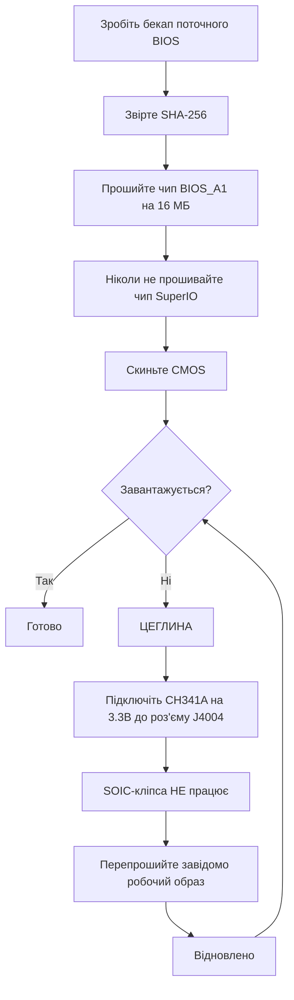

> 🌐 Переклад спільноти. Англійська версія є джерелом істини й може бути новішою. Знайшли помилку? Відкрийте issue: [English](../en/08-bios.md) · [issues](https://github.com/lildebil0/awesome-bc250/issues)

# BIOS і відновлення «цеглини»

> **Коротко** — Неправильне налаштування BIOS може **намертво перетворити BC-250 на «цеглину»**, і на цій платі скидання CMOS *не завжди* її оживляє ([src](https://t.me/c/2424231195/54971)). Перш ніж щось прошивати, зрозумійте: вам потрібен **апаратний комплект відновлення** (**SPI-програматор класу CH341A + дроти DuPont «мама-мама»**) напоготові, бо єдиний надійний спосіб «розцеглити» — це перепрошити чип зовні через **роз'єм J4004** плати. Популярний спільнотний мод (BIOS від «death», найновіший на базі штатного **5.00**) розблоковує розгін, тайминги GDDR6 та виділення пам'яті iGPU — корисно, але **не всі налаштування безпечні, а деякі перетворюють плату на «цеглину» миттєво** ([src](https://t.me/c/2424231195/78922)). Спершу звіряйте **SHA-256** кожного образу та прочитайте [`assets/firmware/DISCLAIMER.md`](../../assets/firmware/DISCLAIMER.md). **Не прошивайте абияк.**

⚠️ **Це найнебезпечніший розділ у довіднику.** Прошивка є деструктивною й незворотною без апаратури відновлення. Якщо ви не готові паяти/чіплятися кліпсою до SPI-чипа, щоб оживити «цеглину», — **зупиніться тут і працюйте на штатному BIOS.**

---

## Що таке BIOS на BC-250

BC-250 — це майнінгова/серверна плата виробництва AsRock, що несе урізаний APU PS5 «Oberon». Її UEFI-прошивка живе на **16 МБ SPI флеш-чипі** (Winbond **W25Q128** / Macronix MX25L128 у 8-pin корпусі SOIC). Штатна прошивка сильно заблокована: майже нічого корисного не виведено в Setup. Відомі штатні версії, помічені в чаті, — **3.00** та **5.00**; модифіковані BIOS перезібрані з них (номер версії — ваш орієнтир — завжди занотовуйте, на якій базі побудовано мод).

> Стокова **4.00** також існує. Єдина функціональна різниця між стоковими **v4.0** та **v5.0** полягає в тому, що v5.0 вмикає **мережеве завантаження** за замовчуванням. ([джерело](https://discord.com/channels/1315924807128449065/1316030225338863636/1326825429595848816))

Дві причини, чому люди перепрошивають:

1. **Щоб встановити модифікований BIOS**, який розблоковує приховані меню (розгін, андервольт, пам'ять, VRAM iGPU).
2. **Щоб відновити «цеглину»** — повернути відомо-робочий образ після поганого налаштування чи невдалої прошивки.

> 💡 **Можливо, вам узагалі не треба прошивати.** Якщо ваша *єдина* мета — змінити розподіл VRAM/UMA, ви можете зробити це із запущеного Linux на **штатному** BIOS P3.00 / P5.00 за допомогою **[fanoush/bc250_memcfg](https://github.com/fanoush/bc250_memcfg)** — без прошивки, без програматора, без ризику «цеглини» ([elektricM: прошивка BIOS](https://elektricm.github.io/amd-bc250-docs/bios/flashing/), [elektricM: VRAM](https://elektricm.github.io/amd-bc250-docs/bios/vram/)). Прошивка модифікованого BIOS потрібна лише для *розблокованих меню чипсета* та функцій понад налаштування VRAM (див. команду `bc250_memcfg` у [09-overclock-undervolt.md](../en/09-overclock-undervolt.md)).

---

## Модифікований BIOS (мод «death») — що він змінює і навіщо

Еталонний спільнотний мод підтримує **death** у чаті. Це *не* прошивка з нуля — він повторно вмикає (розхововує) опції AMD/AMI Setup, які штатний BIOS постачає прихованими. Відстежуйте версії, бо порада змінювалася з часом:

| Версія моду | База | Випущено | Що відкрив / змінив | Статус |
|---|---|---|---|---|
| **1.0** (перший випуск) | штатний **3.00** | 2025-06-28 | Частоту GDDR6, тайминги GDDR6, розмір пам'яті UMA iGPU, частоту ядра, напруги | ⚠️ Погані значення перетворюють плату на «цеглину», **скидання CMOS не допомогло** ([src](https://t.me/c/2424231195/54971)) |
| Варіанти 3.0 | 3.00 | 2025-07 → 10 | Ті самі розблокування; один білд додав **кастомний завантажувальний логотип Steam** | Косметичний білд із логотипом продубльований як `bc250-Steam.rom` ([src](https://t.me/c/2424231195/86420)) |
| **5.00 мод** (поточний) | штатний **5.00** | 2025-10-05 | Вкладки перегруповано; **відкрито більше налаштувань**; **налаштування таймінгів RAM/GDDR6 тепер реально застосовуються** на цій платі | Найновіший; «не всі налаштування корисні, але краще, ніж нічого» ([src](https://t.me/c/2424231195/78922)) |

Що ви насправді можете налаштувати з ним (із нотаток першого випуску, [src](https://t.me/c/2424231195/54971)):

- **Частота GDDR6** — за повідомленнями працювала на **1800** в одного користувача (`@Haswellb`), але *той самий вид зміни перетворив іншу плату на «цеглину»* — значення специфічні для плати, а не універсальні.
- **Тайминги GDDR6** — вони застосовуються, але **надто низькі/тісні тайминги перетворюють плату на «цеглину»**.
- **Розмір пам'яті iGPU (UMA)** — працює й дає реальний приріст. Якщо ваша зміна не набирає чинності, виставте **IGC: Forces** та **UMA Mode: UMA_SPECIFIED** ([src](https://t.me/c/2424231195/54971); ту саму комбінацію підтверджують документи спільноти).
- **Частота ядра / напруги** — виведені, але **«не протестовані»** автором.

> ❗ **Два застереження автора, досі актуальні:** (1) **Не вимикайте Integrated Graphics** — це єдиний відеовихід. (2) На будь-якому з цих модів **неправильне налаштування може перетворити плату на «цеглину», а скидання CMOS може її не відновити** — саме тому вам потрібен програматор. (Див. «яку версію?» драбину нижче для вибору бази.)

> ### Яку версію? (драбина рішень)
>
> 1. **Модифікований P3.00 (ROM із меню чипсета) — безпечний дефолт.** Це усталений **«стандарт спільноти… найстабільніший і протестований»**, перевірено-публічний з відомим SHA-256, і він уже покриває **розблокування VRAM + налаштування чипсета**. Починайте звідси, якщо у вас немає конкретної причини інакше ([elektricM: прошивка BIOS](https://elektricm.github.io/amd-bc250-docs/bios/flashing/)).
> 2. **Модифікований 5.00 — поточний; беріть його, якщо хочете тюнінг пам'яті.** Це найновіша база і та, де **налаштування таймінгів RAM/GDDR6 реально застосовуються** на цій платі ([src](https://t.me/c/2424231195/78922)). Обирайте його над P3.00 саме тоді, коли хочете налаштовувати тайминги пам'яті.
> 3. **`P5.00_clv` — лише для експертів.** Він «розблоковує **Усе**» (кожне приховане меню, включно з експериментальним **ReBAR / Resizable BAR** та налаштуваннями debug/чипсета), що робить *«дуже легко перетворити плату на „цеглину“, якщо змінити щось не те… Тримайтеся P3.00, якщо ви не просунутий користувач.»* Гірше: **`P5.00_clv` немає в жодному публічному репозиторії**, який вдалося знайти гайду — він ходить лише як вкладення в Discord, тож **канонічного хешу не існує**; якщо вам конче треба ним скористатися, візьміть копії у **двох** людей, що запускають його незалежно, і переконайтеся, що в обох однаковий **SHA-256**, перш ніж прошивати ([elektricM: прошивка BIOS](https://elektricm.github.io/amd-bc250-docs/bios/flashing/)).

> **Особливості модифікованої версії 5.00, про які варто знати.** У Setup відображається **дефолтна частота процесора 3600** — це лише косметичне значення в інтерфейсі, а не фактична частота ([src](https://discord.com/channels/1315924807128449065/1452152658168381593/1452406964780007515)). Вона також містить опцію **`x1x1x1x1` біфуркації PCIe** у налаштуваннях чипсета ([src](https://discord.com/channels/1315924807128449065/1452152658168381593/1474231812598534351)). Бубудьте надзвичайно обережні з таймінгами пам'яті на цій базі: **екстремальні значення таймінгів можуть перетворити плату на «цеглину» до зовнішнього перепрошивання, і на P5.00 це створює ще більше проблем** ([src](https://discord.com/channels/1315924807128449065/1371527281947971604/1468745940994101372)). І, як і при будь-якій прошивці, перехід на модифіковану версію 5.00 може призвести до того, що **екран нічого не показуватиме, доки ви не очистите CMOS** ([src](https://discord.com/channels/1315924807128449065/1315933088668454942/1508568321346502892)).

Існує також окремий **мод меню чипсета** (`BC250_3.00_CHIPSETMENU.ROM`) із найбільш згадуваного BIOS-репозиторію, **[TuxThePenguin0/bc250-bios](https://gitlab.com/TuxThePenguin0/bc250-bios/)**, який виводить **меню чипсета / NBIO Common Options** поверх штатного 3.00. Власний README того репозиторію прямо каже: *«Ніщо в цьому репозиторії не підтримується й не має жодних гарантій — РОБІТЬ РЕЗЕРВНІ КОПІЇ.»*

> 🚫 **Уникайте `Smokeless_UMAF`.** Спільнотний гайд із розгону позначає цей інструмент редагування UEFI як річ, яку **не варто запускати на BC-250 — він може спричинити незворотне пошкодження плати** ([elektricM: розгін BIOS](https://elektricm.github.io/amd-bc250-docs/bios/overclocking/)). Тримайтеся відомо-робочих ROM вище.

---

## Перед прошивкою — чеклист безпеки

1. **Спершу зробіть резервну копію поточного BIOS** (зчитайте його тим самим інструментом, яким прошиватимете — див. Шлях B/відновлення). Резервна копія — це ваше безкоштовне «скасувати».
2. **Звіртеся з SHA-256** образу проти `assets/PROVENANCE.md` / поста-джерела. Спільнотний гайд із прошивки публікує хеш для ROM меню чипсета як
   `48fbe5d366e6a56e2fdffdca848426216ba1f083610dab63db89d2f4e6c940b5` ([документи elektricm](https://elektricm.github.io/amd-bc250-docs/bios/flashing/)).
3. **Підтвердьте розмір чипа**, а не лише маркування. Ціль — 16 МБ BIOS-чип; **не** прошивайте маленький чип SuperIO (див. розділ відновлення). Різні ревізії плати можуть нести трохи різні номери деталей чипа — важлива саме **ємність (16 МБ)**, останні літери маркування можуть відрізнятися ([src](https://t.me/c/2424231195/67880)).
4. **Майте апаратуру відновлення напоготові** *перед* першою прошивкою, а не після того, як зробите «цеглину».
5. Після прошивки **скиньте CMOS**, щоб нові налаштування (особливо виділення VRAM) набули чинності (див. «Після кожної прошивки»).



### Звіртеся з контрольною сумою перед прошивкою

Крок 2 вище каже звірити SHA-256 — ось як. Обчисліть хеш файлу, який збираєтесь прошити, і порівняйте його, символ за символом, зі значенням, наведеним для цього файлу в [`assets/PROVENANCE.md`](../../assets/PROVENANCE.md).

```bash
# Linux:
sha256sum BC250_3.00_CHIPSETMENU.ROM
```

```powershell
# Windows (PowerShell):
Get-FileHash BC250_3.00_CHIPSETMENU.ROM -Algorithm SHA256
```

`PROVENANCE.md` може наводити лише **перші 16 шістнадцяткових символів** як короткий відбиток. Якщо так, перевірте, що ваш обчислений хеш **починається з** цих 16 символів — повний збіг цього префікса вже є сильною перевіркою (повні хеші супровідник може опублікувати на запит).

**Перевірені повні SHA-256 хеші** для публічно розміщених образів (звірені по кількох спільнотних репозиторіях — кожен відомо-робочий файл BIOS BC-250 — це **рівно 16 МБ / 16777216 байт**; інший розмір означає, що він пошкоджений, це інструмент/патч або щось стороннє) ([elektricM: прошивка BIOS](https://elektricm.github.io/amd-bc250-docs/bios/flashing/)):

| Файл | Тип | SHA-256 |
|---|---|---|
| `BC250_3.00_CHIPSETMENU.ROM` (він же `Robin3.00`, `BC250CHIPSETMENU.ROM`) | **Модифікований P3.00** — VRAM + розблокування чипсета, *рекомендований* | `48fbe5d366e6a56e2fdffdca848426216ba1f083610dab63db89d2f4e6c940b5` |
| `Robin5.00` | **Штатний** P5.00 (не модифікований `P5.00_clv`) | `0d6f136cb120cf3b2de26d5c4d7f255604fdbf4b9442af5ba55419b95b89aa82` |
| `BC250_3.00.ROM` | Штатний P3.00 | `07595ca3aecf8a4caa28a397b5298f3946a1b769f87b16f67adc369c3f69045c` |
| `BC250_2.00.bin` | Штатний P2.00 | `ee6150dfed33bd05ea46063a352549416fdf3f45fa0e5edac2a68ef78d71083c` |
| `P5.00_clv` | Модифікований P5.00 (розблокування всього) | **публічного хешу не існує** — лише Discord, звіряйте дві незалежні копії на збіг |

> Модифікований P3.00 з'являється під кількома іменами файлів у різних репозиторіях (`BC250_3.00_CHIPSETMENU.ROM`, `BC250CHIPSETMENU.ROM`, `Robin3.00`) — усі вони хешуються у значення вище, тож ім'я не має значення. `Robin5.00` — це **штатний** P5.00, *інший файл*, ніж модифікований `P5.00_clv`. Публічні джерела для кожного (TuxThePenguin0 GitLab, forgenam, tipitochen, csabakecskemeti, scrakcho, dannybastos, kenavru, MrrZed0) перелічені в [гайді з прошивки elektricM](https://elektricm.github.io/amd-bc250-docs/bios/flashing/).

> 🔴 **Якщо контрольна сума не збігається, НЕ прошивайте.** Розбіжність означає пошкоджений або неправильний файл — прошивка його — це рівно те, як ви перетворюєте плату на «цеглину». Перезавантажте образ і звіртеся знову.

---

## Шлях A — Програмна прошивка (із плати, без програматора)

Це звичайний спосіб встановити/оновити BIOS, поки плата ще завантажується. Використовуйте **FAT32 USB-флешку** та утиліту оновлення прошивки AMI.

**Метод EFI / AFU** ([src](https://t.me/c/2424231195/54979)):

1. Відформатуйте USB-флешку у **FAT32**.
2. Скопіюйте вміст архіву AFU (наприклад, `AfuEfi64_5.16.zip`) **та файл BIOS** на неї.
3. Перезавантажте BC-250 і **завантажтеся з USB-флешки** в EFI shell.
4. Виконайте:
   ```
   afuefix64.efi <filename>.<ext> /P /N
   ```
   - `/P` = прошити основний BIOS.
   - `/N` = також прошити **NVRAM**. Це уникає помилок при переході *між* версіями (наприклад, на 3.00 з іншої версії) — **але стирає ваші збережені налаштування.** Ви можете опустити `/N`, але тоді очікуйте можливі помилки. ([src](https://t.me/c/2424231195/54979))
5. Якщо інструмент не бачить файл, спробуйте `fs0:`, `fs1:`, … щоб знайти, який із них є флешкою ([src](https://t.me/c/2424231195/54979)).

Деякі спільнотні білди постачають готовий скрипт `Flash.nsh` та перейменований ROM (наприклад, перейменуйте модифікований ROM під скрипт), тож ви лише завантажуєтесь в EFI shell і запускаєте скрипт ([документи elektricm](https://elektricm.github.io/amd-bc250-docs/bios/flashing/)). На Linux є також білд **`afulnx`** (`afulnx-5.05.04Z.tar.gz`) для прошивки із запущеної системи ([src](https://t.me/c/2424231195/54507)).

#### Канонічний рецепт EFI-shell (метод `Flash.nsh` / `Robin5.00`)

Спільнотний гайд із прошивки стандартизується на самодостатньому комплекті та фіксованому імені файлу — це найбільш відтворюваний USB-шлях ([elektricM: прошивка BIOS](https://elektricm.github.io/amd-bc250-docs/bios/flashing/)):

1. **Візьміть EFI-комплект:** `4U12G BIOS Update.zip` (з репозиторію [kenavru/BC-250](https://github.com/kenavru/BC-250)) — він містить `AfuEfix64.efi`, `Flash.nsh` та `amdvbflash.efi`. *Він також укладає штатний BIOS P5.00 з ім'ям `Robin5.00` — приберіть його, щоб не прошити випадково.*
2. **Підготуйте FAT32-флешку (рекомендовано ≤ 32 ГБ).** Скопіюйте вміст папки `BIOS EFI` комплекту в **корінь**.
3. **Перейменуйте ваш модифікований ROM на `Robin5.00`** (приберіть розширення `.ROM`) — це точне ім'я, яке шукає `Flash.nsh`. *(Або відредагуйте `Flash.nsh` під ваше ім'я файлу.)* У корені тоді має лежати: `AfuEfix64.efi`, `Flash.nsh`, `amdvbflash.efi`, `Robin5.00` (ваш перейменований мод) та папка `EFI`.
4. **Використовуйте прямий DisplayPort-монітор.** Активні/пасивні **адаптери HDMI можуть давати чорний екран меню BIOS** — відома проблема з дисплеєм на цій платі.
5. **Від'єднайте всі SSD/накопичувачі**, щоб плата автоматично провалилася в EFI shell, вставте флешку, увімкніть живлення. Ви опиняєтесь біля жовтого запрошення `Shell>`.
6. У запрошенні наберіть **`blk0:`**, потім Enter — **зверніть увагу на пробіл після двокрапки** (це вибирає USB-том; `blk0:` — селектор, задокументований elektricM, відмінний від проб `fs0:`/`fs1:` вище). Потім наберіть **`Flash.nsh`** і Enter.
7. **ЧЕКАЙТЕ. Не торкайтеся клавіатури, не вимикайте живлення.** Якщо *здається*, що воно зависло під час запису, **чекайте щонайменше 15 хвилин** — вимкнення посеред запису перетворює плату на «цеглину». Воно перезавантажиться (або попросить вас) по завершенні.
8. **Негайно вимкніть живлення й вийміть флешку**, щоб воно не зациклилося назад у прошивальник.

> 🔴 **Перед увімкненням для прошивки: перевірте проводку 8-pin PCIe живлення** проти діаграми 12 В/GND вашого БЖ. **Зворотна полярність може незворотно пошкодити плату** ([elektricM: прошивка BIOS](https://elektricm.github.io/amd-bc250-docs/bios/flashing/)).

#### Обов'язкові налаштування BIOS після прошивки (зробіть це одразу після скидання CMOS)

Після прошивки **та** скидання CMOS (наступний розділ) увійдіть у Setup (спам **Del**) і виставте ці — розподіл VRAM не поводитиметься правильно, доки вони не вірні ([elektricM: прошивка BIOS](https://elektricm.github.io/amd-bc250-docs/bios/flashing/), [elektricM: VRAM BIOS](https://elektricm.github.io/amd-bc250-docs/bios/vram/)):

| Налаштування | Шлях | Значення |
|---|---|---|
| Integrated Graphics Controller | Chipset → GFX Configuration | **Forces** |
| UMA Mode | Chipset → GFX Configuration | **UMA_SPECIFIED** |
| UMA Frame Buffer Size | Chipset → GFX Configuration | **512MB** (рекомендовано) або фіксований розмір |
| IOMMU | Advanced → CPU Configuration | **Disabled** |
| Boot Mode | Boot → Boot Mode | **UEFI** |

Спершу переконайтеся, що скидання CMOS реально спрацювало — **годинник має показувати неправильно**; якщо він досі правильний, повторіть скидання. Потім F10, щоб зберегти. Вибір `512MB` — це *динамічне* виділення, а не обмеження 512 МБ (див. [09-overclock-undervolt.md](../en/09-overclock-undervolt.md)).

> ★ **Чому 512 МБ UMA *додає* FPS (механізм).** Виставлення буфера UMA на **512 МБ** не морить GPU голодом — воно дозволяє системі **динамічно балансувати RAM проти VRAM**, замість того щоб замикати великий фіксований шмат, і саме це перебалансування поставили в заслугу реальному стрибку FPS: Cyberpunk 2077 пішов **60 → 66 fps (при розгоні 2 ГГц) → 76 fps** під FSR 3.0 *balanced*, 1080p, пресет Steam-Deck ([Old Lamer — Part I](https://youtu.be/ohpEY2XQ_lo) ~11:21; ⚠ приблизно — цифри транскрибовано з відео, сприймайте як результат однієї збірки). Тож «512 МБ — найкраще» — це не просто безпечне визначення розміру; малий динамічний буфер є *частиною* історії продуктивності, а не компромісом.

**Запасний варіант flashrom** (якщо AFU видає помилку) ([src](https://t.me/c/2424231195/54979), запропоновано й протестовано `@mrartemsid`):

```bash
# Read (back up):
sudo flashrom -p internal:boardmismatch=force -r <name>.bin
# Write:
sudo flashrom -p internal:boardmismatch=force -w <name>.bin
```

> ⚠️ Програмна прошивка допомагає лише **поки плата ще проходить POST**. Тієї миті, коли погане налаштування перетворить її на «цеглину», Шлях A зникає, і ви на апаратному шляху нижче.

---

## Шлях B — Апаратна прошивка / «розцеглення» (SPI-програматор CH341A)

Це шлях **відновлення** та закріплений «найзручніший спосіб прошити цеглину» ([src](https://t.me/c/2424231195/67880)). Ви перезаписуєте 16 МБ SPI-чип напряму, з іншого ПК, за допомогою USB SPI-програматора. Використовуване ПЗ: **NeoProgrammer** (Windows) або **flashrom** (Linux).

> 🔴 **Кліпса SOIC-8 НЕ працює на цій платі.** death прямо про це: *«кліпса на нашій платі працює… фактично ніяк.»* ([src](https://t.me/c/2424231195/67880)). Зауважте: `assets/firmware/DISCLAIMER.md` згадує «SOIC clip» узагальнено — на практиці ви маєте **під'єднуватися дротами до бортового роз'єму J4004.** Це найважливіший факт відновлення в цьому розділі.

### Розпіновка роз'єму J4004 (під'єднуйтеся тут)

Плата виставляє **роз'єм J4004 із кроком 2.54 мм** саме для перепрошивки SPI/BIOS-чипа. Розпіновка (із закріпленого скриншота проводки, [src](https://t.me/c/2424231195/67880)):

```
J4004
[ GND  SCLK  MOSI  UNK ]
[ VCC  CS    MISO      ]
   ^  (pin-1 marker)
```

| Пін J4004 | Сигнал | Контакт CH341A |
|---|---|---|
| VCC | живлення 3.3 В | VDD / 3.3V |
| GND | земля | GND |
| CS | вибір чипа | CS / SS |
| SCLK | тактовий | CLK / SCK |
| MOSI | дані в (до чипа) | MOSI |
| MISO | дані з (від чипа) | MISO |

Відповідна **колірна мапа W25Q128 SOIC-8 / CH341A** є на тому самому закріпленому скриншоті — зіставте `/CS, DO(MISO), CLK, DI(MOSI), VCC, GND` із контактами CH341A `CS, MISO, CLK, MOSI, VDD, GND`. **Тричі перевірте VCC та GND** перед увімкненням; їх переплутування вбиває чип ([src](https://t.me/c/2424231195/67880)).

> **Нумерація пінів J4004 та два невідомих піни.** Гайд elektricM нумерує роз'єм VCC=1, GND=2, CS=3, SCLK=4, MISO=5, MOSI=6, з **пінами 7 та 8, не задіяними для прошивки — вони заземлені через резистори 10 кОм.** Пін 1 (VCC) позначений **стрілкою `>` або квадратним контактом** на PCB ([elektricM: прошивка BIOS](https://elektricm.github.io/amd-bc250-docs/bios/flashing/)).

> **Точний цільовий чип і друкарська помилка в щільності.** 16 МБ деталь — це Winbond **W25Q128JVSQ** (128 Мбіт / 16 МБ) або, на деяких партіях, Macronix **MX25L12835F**. Деякі спільнотні документи помилково пишуть це як **«25Q168» — це неправильно**; коректний код щільності 16 МБ — **128** ([elektricM: прошивка BIOS](https://elektricm.github.io/amd-bc250-docs/bios/flashing/)). Якщо ви прошиваєте через голу **кліпсу SOIC-8** замість J4004, власний порядок пінів чипа — це стандартний SPI-розклад: `1 CS · 2 DO · 3 WP · 4 GND · 5 DI · 6 CLK · 7 HOLD · 8 VCC` ([elektricM: відновлення BIOS](https://elektricm.github.io/amd-bc250-docs/bios/recovery/)) — але пам'ятайте висновок death, що **кліпса ледь працює на цій платі**, тож надавайте перевагу J4004.

> 🙏 Подяка: розпіновка J4004, реверс-інжиніринг та репозиторій образів модифікованої прошивки — це значною мірою робота **Segfault** (ROM меню чипсета P3.00 — це «мод Segfault») ([elektricM: прошивка BIOS](https://elektricm.github.io/amd-bc250-docs/bios/flashing/)).

### Процедура NeoProgrammer (закріплена) ([src](https://t.me/c/2424231195/67880))

1. Під'єднайте програматор до **J4004** дротами «мама-мама» за розпіновкою. **Перевірте проводку ~10×, особливо VCC та GND.** (БЖ від'єднано.)
2. Відкрийте **NeoProgrammer**.
3. Запустіть **авто-визначення** чипа, а також зчитайте маркування на самому чипі.
4. **Порівняйте маркування.** Якщо останні літери відрізняються від списку, але **ємність збігається (16 МБ)**, це нормально.
5. **Зітріть** чип.
6. **Відкрийте файл BIOS** у ПЗ (drag-and-drop працює).
7. **Запишіть** чип.
8. **Від'єднайте дроти від J4004.**
9. Увімкніть плату.

### Еквівалент flashrom (Linux), звірений із документами спільноти

Спільнотний гайд із прошивки використовує програматор **CH347** і застерігає проти дешевих CH341A на чорному PCB (наступний розділ). Визначте правильний чип — цільтеся в **16 МБ BIOS-чип** (`BIOS_A1`), **ніколи** в 512 КБ SuperIO (`SIO1_R`), прошивка якого перетворює SuperIO на «цеглину» ([документи elektricm](https://elektricm.github.io/amd-bc250-docs/bios/flashing/)):

```bash
# Detect / identify the chip:
sudo flashrom -p ch347_spi

# Back up the stock BIOS (twice, then diff to be sure the read is stable):
sudo flashrom -p ch347_spi -r backup_stock.bin
sudo flashrom -p ch347_spi -r backup_verify.bin

# Write the new image, then verify it read back identical:
sudo flashrom -p ch347_spi -w BC250_3.00_CHIPSETMENU.ROM
sudo flashrom -p ch347_spi -v BC250_3.00_CHIPSETMENU.ROM
```

(Використовуйте `-p ch341a_spi` для CH341A, або `serprog` для Raspberry Pi Pico, замість `ch347_spi`.) ⚠ Зіставлення `ch347_spi` / `serprog` для точної проводки *цієї* плати — із гайду спільноти — `⚠ verify` проти вашої власної моделі програматора.

> **Визначення каже вам, на якому чипі ви.** Якщо `flashrom -p …` повідомляє **`Winbond W25Q128…`** або **`Macronix MX25L128…`**, ви на правильному 16 МБ BIOS-чипі. Якщо він повідомляє **`Macronix MX25L4005…` (512 КБ)**, **СТОП — ви під'єднані до чипа SuperIO** (`SIO1_R`); прошивка його перетворює керування вентиляторами/сенсори на «цеглину». Перейдіть на інший чип ([elektricM: прошивка BIOS](https://elektricm.github.io/amd-bc250-docs/bios/flashing/)). Прошивайте з **БЖ, від'єднаним від розетки**, та розрядженими конденсаторами (кілька разів натисніть кнопку живлення) — живити плату під час прошивки кліпсою *не* рекомендується ([elektricM: відновлення BIOS](https://elektricm.github.io/amd-bc250-docs/bios/recovery/)).

### Пастка 3.3 В у CH341A (прочитайте це, інакше спалите чип)

Багато дешевих **CH341A на чорному PCB** ведуть свої **лінії даних на 5 В, хоча VCC = 3.3 В** — BIOS-чип BC-250 є **3.3 В** деталлю, тож 5 В на лініях даних можуть його пошкодити. Це відома, виміряна несправність на деяких платах (плата Fabian та ідентична їй у чаті підтверджені вимірюванням напруги) ([src](https://t.me/c/2424231195/100285)). Фікси:

- Надавайте перевагу програматору, що справді 3.3 В на лініях даних (наприклад, **CH347**), **або**
- Застосуйте **безпаяльний фікс CH341A 5В→3.3В для ліній даних**: переріжте лінію живлення USB 5 В до чипа й подайте на неї 3.3 В натомість — див. [розбір на sawyershepherd.org](https://sawyershepherd.org/post/solderless-ch341ab-fix-5v-to-33v-data-lines/) та [фікс CH341A на wej.k.vu](https://wej.k.vu/electronics/ch341a-mini-programmer-fix/) ([src](https://t.me/c/2424231195/100285)).

---

### Низькорівневі роз'єми, debug та бортовий кремній

Окрім роз'єму прошивки J4004 вище, плата несе кілька інших роз'ємів та відомий набір бортових чипів. Вони реверс-інжинірені в апаратних документах elektricM і корисні для скидання CMOS, debug-зондування, проводки вентиляторів та підтвердження, який чип є яким, перед прошивкою. Значення пінів транскрибовано дослівно з ([elektricM: розпіновки](https://elektricm.github.io/amd-bc250-docs/hardware/pinouts/)).

**CLRCMOS1 — джампер скидання CMOS (3-pin).** Це той джампер, на який скрізь у цьому розділі посилаються як «замкнути джампер CMOS» — ось його мапа:

| Положення | Поведінка |
|---|---|
| Піни 1–2 | CR2032 живить CMOS (за замовчуванням) |
| Піни 2–3 | Скинути CMOS |

> 💡 Коли [чеклист після прошивки](#перед-прошивкою--чеклист-безпеки) та [«Після кожної прошивки»](#після-кожної-прошивки--скиньте-cmos-не-пропускайте-це) кажуть вам «замкнути джампер CMOS на ~20 секунд», **CLRCMOS1** — це той джампер: перемістіть його з пінів 1–2 на піни 2–3, зачекайте, потім поверніть назад. (Виймання CR2032 на 60+ с — альтернатива.)

**TPMS1 — LPC debug-роз'єм (18-pin, крок 2.0 мм):**

| Пін | Сигнал | Пін | Сигнал |
|---|---|---|---|
| 1 | PCICLK | 2 | GND |
| 3 | FRAME | 4 | SMB_CLK_MAIN |
| 5 | PCIRST# | 6 | SMB_DATA_MAIN |
| 7 | LAD3 | 8 | LAD2 |
| 9 | 3V | 10 | LAD1 |
| 11 | LAD0 | 12 | GND |
| 13 | (порожній) | 14 | S_PWRDWN# |
| 15 | 3VSB | 16 | SERIRQ# |
| 17 | GND | 18 | GND |

> 💡 **Пін 9 (3V) живий лише коли плата ввімкнена** — тож він працює як сигнал «система ввімкнена». Це робить його альтернативною точкою sense для збірок авто-увімкнення / справжнього ATX-перехідника (перехресне посилання на [джампер `AUTO_PWRON` у 03-power-supply.md](../en/03-power-supply.md)).

**J2 — JTAG/HDT debug-роз'єм (20-pin, крок 1.27 мм, не розпаяний, на споді плати):**

| Пін | Сигнал | Пін | Сигнал |
|---|---|---|---|
| 1 | VDDIO | 2 | TCK |
| 3 | GND | 4 | TMS |
| 5 | GND | 6 | TDI |
| 7 | GND | 8 | TDO |
| 9 | TRST_L | 10 | PWROK_BUF |
| 11 | DBRDY3 | 12 | RESET_L |
| 13 | DBRDY2 | 14 | DBRDY0 |
| 15 | DBRDY1 | 16 | DBREQ_L |
| 17 | GND | 18 | TEST19 |
| 19 | VDDIO | 20 | TEST18 |

> TEST18, TEST19 та DBRDY0 лишені незадіяними. Це **єдиний** апаратний інтерфейс скидання/debug на платі.

**I2C_HEADER1 (3-pin):** `SCL · SDA · GND`. SCL — це пін **ближчий до роз'ємів живлення**. Ця шина несе **PMBUS до PMIC Intersil** — точка доступу до телеметрії живлення.

**CPU_FAN1 (4-pin):** `PWM · Tach · 12V · GND`.

**J4003 — роз'єм багатьох вентиляторів (16-pin, 2×8, 2.54 мм):**

| Row 1 | 1 GND | 2 F1T | 3 F2T | 4 F3T | 5 F4T | 6 F5T | 7 DET | 8 (порожній) |
|---|---|---|---|---|---|---|---|---|
| **Row 2** | 1 GND | 2 F1P | 3 F2P | 4 F3P | 5 F4P | 6 F5P | 7 GND | 8 GND |

Тут `T` = tach і `P` = PWM, для кожного вентилятора 1–5.

> 💡 **DET (рядок 1, пін 7) заземлений, коли плата сидить на платі вентиляторів / розподілу живлення** — тобто він визначає носій. (Нумерація вентиляторів BIOS↔Linux покрита в [06-linux.md → Сенсори та керування вентиляторами](../en/06-linux.md#sensors--fan-control); тут вона не дублюється.)

**Бортовий кремній (BOM).** Репозиторій уже називає `SIO1_R` та `BIOS_A1` у розділах прошивки, але ніколи не давав номерів деталей чи розмірів; ця таблиця дозволяє прошивачу підтвердити, який чип є яким (16 МіБ Winbond — це BIOS, 512 КіБ Macronix — це SuperIO — не чіпайте його):

| Позначення | Деталь | Роль |
|---|---|---|
| PUA1 | Intersil ISL69247 | Основний PMIC |
| PUIO1 | Intersil ISL95712 | PMIC живлення ядра |
| PUA11… | Intersil ISL99360 | Смарт-силові каскади (фази) |
| M2U2 | NXP CBTL04083B | 2:1 PCIe x4 мультиплексор |
| U30 | Realtek RTL8111H | Ethernet NIC (PCIe x1) |
| SU1 | AMD 218-0844029 | A68H «Bolton-D2H» FCH чипсет |
| UIO1 | Nuvoton NCT6686D | SuperIO (чип сенсорів hwmon) |
| BIOS_A1 | Winbond 25Q128JVSQ | 16 МіБ SPI флеш = **BIOS** (прошивайте ЦЕ) |
| SIO1_R | Macronix MX25L4006E | 512 КіБ SPI флеш = програма SuperIO (**НЕ прошивайте — перетворює SuperIO на «цеглину»**) |

> Названий тут чип сенсорів SuperIO (Nuvoton **NCT6686D**) — це той, до якого прив'язується драйвер Linux `nct6687`/`nct6683` — див. [06-linux.md](../en/06-linux.md) для налаштування сенсорів/вентиляторів.

**Інструменти для роботи з прошивками (розширені).** Для аналізу образу часто використовуються дві утиліти:

- **`psptool`** досліджує та витягує бінарні блоки (blobs) прошивки AMD з дампу BIOS. `psptool -E bios.bin` виводить список записів; `psptool -X -d 0 -e 1 -o firmware.bin bios.bin` витягує прошивку SMU для аналізу. ([bc250-collective/amd_smu_reverse_engineering](https://github.com/bc250-collective/amd_smu_reverse_engineering))
- **`Zentool`** патчить мікрокод процесора — наприклад, для заміни інструкції `RDRAND`. ([AMD-BC-250/documentation #1](https://github.com/AMD-BC-250/documentation/issues/1))

---

## Secure Boot і CSM (передумови завантаження)

Додайте ці два до списку передумов налаштування BIOS — обов'язкові, інакше **кастомні/пропатчені ядра не завантажаться** (патч 40-CU, патч частоти тощо):

| Налаштування | Значення |
|---|---|
| Secure Boot | **Disabled** |
| CSM (Compatibility Support Module) | **Disabled** |

Джерело: [elektricM: усунення проблем завантаження](https://elektricm.github.io/amd-bc250-docs/troubleshooting/boot/).

---

## Ідея авто-скидання «srep» (експериментальна — не готова функція)

Оскільки погане налаштування може перетворити плату на «цеглину», а **скидання CMOS цього не лагодить**, death експериментував із вбудовуванням процедури **`srep`** у BIOS, щоб **авто-скидати налаштування на «цеглині»** — ідея спочатку від `@Jacky_Fish` ([src](https://t.me/c/2424231195/60552)). Концепція: змусити BIOS пропатчити свої змінні NVRAM/`amdsetup` назад до дефолтів, опційно лише коли на USB-флешці присутні тригерні файли (щоб воно не стирало ваші налаштування при кожному завантаженні). Станом на чат **це поки не працювало** — *«плата вперто прикидається повною „цеглиною“, і ніщо не скидається»* ([src](https://t.me/c/2424231195/60883)). Сприймайте будь-яке твердження про «самозцілюваний BIOS» як **недоведене**; ваша реальна страхувальна сітка лишається зовнішнім програматором. `⚠ verify` перш ніж покладатися на будь-який білд srep.

---

## Після кожної прошивки — скиньте CMOS (не пропускайте це)

Прошивка BIOS **не** скидає збережені налаштування, і кілька налаштувань (зокрема **виділення VRAM/UMA**) не застосуються насправді, доки ви не скинете CMOS. Один користувач натрапив рівно на це: BIOS показував новий розмір VRAM і «зберіг» його, але ОС (Bazzite) досі повідомляла старий розподіл 4 ГБ RAM / 12 ГБ VRAM, доки CMOS не було скинуто ([src](https://t.me/c/2424231195/97290)). Як скинути:

- **Вийміть монетну батарейку CR2032 на 60+ секунд** (рекомендовано), **або**
- **Замкніть джампер CMOS на ~20 секунд.** ([документи elektricm](https://elektricm.github.io/amd-bc250-docs/bios/flashing/))

> Зауважте обмеження: скидання CMOS лагодить «налаштування не застосувалися» та *м'які* погані конфіги — але на поколінні модів 1.0/3.00 повідомлялося, що воно **не** відновлює справжню «цеглину» ([src](https://t.me/c/2424231195/54971)). Для цього див. Шлях B.

---

## Дзеркало прошивок

Образи BIOS, обговорювані в чаті, продубльовані під `assets/firmware/` для **відновлення/збереження** (див. [`DISCLAIMER.md`](../../assets/firmware/DISCLAIMER.md) та звіряйте SHA-256 кожного файлу в `PROVENANCE.md` перед прошивкою):

| Файл | Розмір | Що це | Джерело |
|---|---|---|---|
| `BC250_3.00.ROM` | 16 МБ | Дамп штатного 3.00 | ([src](https://t.me/c/2424231195/5215)) |
| `BC250_3.00_CHIPSETMENU.ROM` | 16 МБ | Мод меню чипсета (TuxThePenguin0) | ([src](https://t.me/c/2424231195/86395)) |
| `dump_5.00.bin` | 16 МБ | Дамп штатного 5.00 | ([src](https://t.me/c/2424231195/24661)) |
| `BC250_5.00_clv.zip` | 16 МБ | **5.00 мод death (поточний)** | ([src](https://t.me/c/2424231195/78922)) |
| `bc250_3.00_clv1.zip` | 16 МБ | Перший 3.00 мод death (1.0) | ([src](https://t.me/c/2424231195/54971)) |
| `bc250-Steam.rom` | 16 МБ | 3.0 мод із завантажувальним логотипом Steam | ([src](https://t.me/c/2424231195/86420)) |
| `bc250 modded bios.ROM` | 16 МБ | Ранній модифікований образ | ([src](https://t.me/c/2424231195/30100)) |
| `my_4.0_MODED.bin` | 16 МБ | Проміжний 4.0 мод | ([src](https://t.me/c/2424231195/45580)) |
| `W25Q128BV@WSON8_…BIN` | 16 МБ | Сире зчитування чипа (W25Q128) | ([src](https://t.me/c/2424231195/5217)) |
| `AfuEfi64_5.16.zip` | — | AMI AFU EFI прошивальник | ([src](https://t.me/c/2424231195/54979)) |
| `afulnx-5.05.04Z.tar.gz` | — | AMI AFU Linux прошивальник | ([src](https://t.me/c/2424231195/54507)) |

> Не прошивайте BIOS PS5 (`PS5 Disk Edition … BIOS.bin`, 2 МБ) чи 512 КБ чипи на 16 МБ BIOS-чип BC-250 — неправильна ціль, див. застереження щодо відновлення.

---

## Джерела

- Мод death — перший випуск (3.00) — https://t.me/c/2424231195/54971 · поточний (5.00) — https://t.me/c/2424231195/78922 · білд із логотипом Steam — https://t.me/c/2424231195/86420
- Програмна прошивка (AFU `/P /N`, flashrom) — https://t.me/c/2424231195/54979 · afulnx — https://t.me/c/2424231195/54507
- Апаратне «розцеглення» (закріплене, скриншоти NeoProgrammer + проводки J4004) — https://t.me/c/2424231195/67880
- Ідея авто-скидання srep — https://t.me/c/2424231195/60552 · результат (не спрацювало) — https://t.me/c/2424231195/60883
- Потрібне скидання CMOS після прошивки — https://t.me/c/2424231195/97290
- Пастка CH341A 5В→3.3В для ліній даних — https://t.me/c/2424231195/100285 · розбір фіксу — https://sawyershepherd.org/post/solderless-ch341ab-fix-5v-to-33v-data-lines/
- Найбільш згадуваний BIOS-репозиторій — [TuxThePenguin0/bc250-bios](https://gitlab.com/TuxThePenguin0/bc250-bios/) (`BC250_3.00_CHIPSETMENU.ROM`, `CHIPSETMENU.md`)
- Спільнотний гайд із прошивки/відновлення (перевірена таблиця SHA-256, рецепт `Flash.nsh`/`Robin5.00`, селектор `blk0:`, проблема DisplayPort/HDMI, правило 15-хв зависання, розпіновка J4004 + піни 7/8, друкарська помилка W25Q128JVSQ/«25Q168», CH347, значення Setup після прошивки, подяка Segfault) — [elektricM: прошивка BIOS](https://elektricm.github.io/amd-bc250-docs/bios/flashing/)
- Гайд із відновлення (розпіновка SPI 8-pin, виявлення MX25L4005 = SuperIO, прошивка з від'єднаним БЖ, розбори сценаріїв) — [elektricM: відновлення BIOS](https://elektricm.github.io/amd-bc250-docs/bios/recovery/)
- Розпіновки плати та бортовий кремній (CLRCMOS1, TPMS1 LPC, J2 JTAG/HDT, I2C_HEADER1, CPU_FAN1, J4003 багато-вентиляторний, BOM Intersil/NXP/Realtek/Nuvoton/Winbond/Macronix) — [elektricM: розпіновки](https://elektricm.github.io/amd-bc250-docs/hardware/pinouts/)
- Гайд із VRAM (`bc250_memcfg` визначення розміру без прошивки, значення UMA Frame Buffer, VRAM через параметр ядра, звітування Vulkan-vs-OpenGL) — [elektricM: VRAM BIOS](https://elektricm.github.io/amd-bc250-docs/bios/vram/)
- ★ 512 МБ UMA → динамічний баланс RAM/VRAM → механізм приросту FPS (Cyberpunk 60 → 66 @ розгін 2 ГГц → 76 fps, FSR 3.0 balanced, 1080p, пресет Steam-Deck) — [Old Lamer — Part I](https://youtu.be/ohpEY2XQ_lo) ~11:21 (⚠ приблизно, транскрибовано з відео)
- Застереження про небезпеку `Smokeless_UMAF` — [elektricM: розгін BIOS](https://elektricm.github.io/amd-bc250-docs/bios/overclocking/)
- Інструмент VRAM без прошивки — [fanoush/bc250_memcfg](https://github.com/fanoush/bc250_memcfg)
- Утиліта таймінгів пам'яті — `Mem_Timing_Utility.zip` https://t.me/c/2424231195/55351
- Політика дзеркала прошивок — [`assets/firmware/DISCLAIMER.md`](../../assets/firmware/DISCLAIMER.md)

> Розгін/андервольт *із використанням* цих розблокованих налаштувань покрито в [09-overclock-undervolt.md](../en/09-overclock-undervolt.md). Продубльовані образи BIOS живуть під `assets/firmware/` з SHA-256 на кожен файл у `PROVENANCE.md`.
