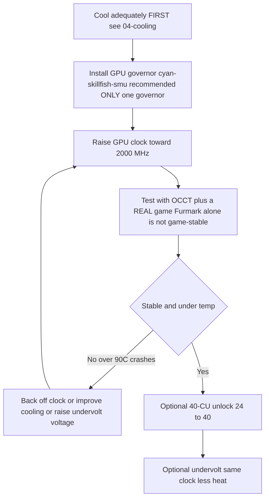

> 🌐 Переклад спільноти. Англійська версія є джерелом істини й може бути новішою. Знайшли помилку? Відкрийте issue: [English](../en/09-overclock-undervolt.md) · [issues](https://github.com/lildebil0/awesome-bc250/issues)

# Розгін і андервольт

> **Коротко** — З коробки GPU на BC-250 працює повільно (часто прибитий до **1500 MHz**, ~слабко). Фікс спільноти — це **governor**, який перевизначає частоти/напругу: рекомендований сьогодні — **[cyan-skillfish-governor-smu](https://github.com/filippor/cyan-skillfish-governor)** (не потребує патча ядра, спакований під Arch/CachyOS/Bazzite/Fedora); **[oberon-governor](https://gitlab.com/mothenjoyer69/oberon-governor)** — оригінальний і досі працює. Будь-який з них ви редагуєте, щоб витиснути GPU до **2000 MHz (~+30 % FPS)**. Новіший набір інструментів **[bc250_smu_oc](https://github.com/bc250-collective/bc250_smu_oc)** також розганяє **CPU** (рекомендовано **4 GHz @ 1275 mV**). Окремо, **[розблокування 40 CU](https://github.com/duggasco/bc250-40cu-unlock)** повторно вмикає **24 → 40 обчислювальних блоків (compute units)**, які AMD вимкнула в прошивці — це більший виграш для GPU, ніж самі частоти (один прогін Superposition зріс **4647 → 6863** балів, ([src](https://t.me/c/2424231195/137035))). **Усе це — тепло. Спершу охолодіть плату** — див. [04-cooling.md](04-cooling.md) — бо розгін без належного охолодження призводить до падіння і скидання плати вище ~90 °C.

Це **останній** крок золотого шляху, а не перший. Спершу запустіть стабільну, прохолодну плату ([06-linux.md](06-linux.md), [04-cooling.md](04-cooling.md)), перш ніж торкатися будь-чого тут. Усе тут — це «робите на власний ризик», спільнота повторює це раз за разом ([src](https://t.me/c/2424231195/106844)).

---

## Чотири важелі (і скільки коштує кожен)

BC-250 має **чотири** незалежні речі, які можна тюнити. Вони складаються:

| Важіль | Інструмент | Типовий приріст | Тепловий коштом |
|-------|------|--------------|-----------|
| **Частота GPU** 1500 → 2000 MHz | governor (cyan-skillfish-smu / oberon) | **~+30 % FPS**, коли впирається в GPU | високий |
| **Андервольт GPU** на фіксованій частоті | той самий governor | той самий FPS, **набагато прохолодніше** | *негативний* (менше тепла) |
| **Частота CPU** 3.5 → 4.0 GHz | `bc250_smu_oc` | допомагає в іграх, що впираються в CPU | високий |
| **Розблокування 40 CU** 24 → 40 CU | `bc250-40cu-unlock` | **до ~+48 %** роботи GPU | високий |

Два чесні застереження з чату, перш ніж почати:

- **Більшість ігор на BC-250 впираються в CPU, а не в GPU.** Підняття GPU з 2000 → 2229 MHz дало одному тестувальнику *1 fps* у Shadow of the Tomb Raider (90 → 91), тоді як споживання і температури підскочили різко — тож гучний заголовок «+30 %» спрацьовує лише в жменьці тайтлів, де GPU є вузьким місцем ([src](https://t.me/c/2424231195/67029)).
- **Тепло масштабується гірше за продуктивність.** Той самий тестувальник: 2000 MHz @ 960 mV = **75 °C** у стрес-тесті; 2229 MHz @ 1030 mV = **93 °C** — і він відступив, бо його БЖ і кулер не могли це втримати ([src](https://t.me/c/2424231195/66972), [src](https://t.me/c/2424231195/67029)).

> ⚠️ **Безпечна межа.** Тротлінг починається близько **85 °C**, а плата жорстко падає / скидається близько **90 °C** (див. [04-cooling.md](04-cooling.md)). Якщо ви перетинаєте ~85 °C під навантаженням, ви *перевищили* свій бюджет охолодження — знизьте частоту або зробіть андервольт, не штовхайте вище.



---

## Крок 1 — Частота й андервольт GPU: governor

Драйвер amdgpu на BC-250 не виставляє звичайний розгін через sysfs. Рішення спільноти — це **governor**, маленький демон, що пише стани частоти/напруги напряму. Для нової інсталяції сьогодні рекомендований — **cyan-skillfish-governor-smu**; **oberon-governor** — оригінальний і досі працює (залишено нижче як усталена альтернатива).

<p align="center"></p>
<sub>📈 Редагований джерельний файл: <a href="../../assets/diagrams/gpu-clock-tradeoff.drawio">gpu-clock-tradeoff.drawio</a> (відкрити в <a href="https://draw.io">draw.io</a>). Зелений = приріст, червоний = коштом.</sub>

### cyan-skillfish-governor-smu (рекомендований)

[filippor/cyan-skillfish-governor](https://github.com/filippor/cyan-skillfish-governor), гілка SMU — керує частотою/напругою через **виклики прошивки SMU**, тож йому **не потрібен патч частоти ядра на жодному дистрибутиві**, він активно підтримується і спакований під кожен великий дистрибутив. Він також додає керування **профілем живлення контролера пам'яті**, що знижує idle TDP до **~30–35 W** (прохолодніше і тихіше в простої) ([src](https://t.me/c/2424231195/125821)).

**Встановлення (спаковане під кожен великий дистрибутив)** — COPR `filippor/bazzite` (Fedora/Bazzite) або AUR `cyan-skillfish-governor-smu` (Arch/CachyOS); Debian/Ubuntu використовують реліз-tarball + `sudo ./scripts/install.sh`:

```bash
# Fedora / Bazzite (COPR):
sudo dnf copr enable filippor/bazzite
sudo dnf install cyan-skillfish-governor-smu        # rpm-ostree install … on Bazzite
sudo systemctl enable --now cyan-skillfish-governor-smu.service

# Arch / CachyOS (AUR):
paru -S cyan-skillfish-governor-smu                  # or: yay -S …
sudo systemctl enable --now cyan-skillfish-governor-smu.service
```

Гілку SMU також можна зібрати з джерел за допомогою `cargo build --release`. **Виставте частоту й напругу** в `/etc/cyan-skillfish-governor-smu/config.toml` (схема нижче) — щоб піти від слабкого дефолту до солодкої точки спільноти, підніміть верхню безпечну точку до **2000 MHz** і знижуйте напругу, доки воно не стане стабільним (див. андервольтинг нижче); перезапускайте сервіс після кожної правки.

> **Перевірте, що спрацювало.** Спостерігайте за живими частотами/температурами через `amdgpu_top`, MangoHud або LACT, навантажуючи GPU. Якщо частоти лишаються на ~1500 MHz, сервіс не запущений або ваш конфіг не розпарсився — `sudo systemctl status cyan-skillfish-governor-smu`.

> Запускайте **один** governor одночасно — якщо ви раніше запускали oberon, вимкніть його, перш ніж вмикати cyan-skillfish, інакше вони боротимуться за ті самі регістри.

> 🔇 **Тюнінг для тихої консолі у вітальні.** Вижимання максимуму (2000 MHz GPU / 4000 MHz CPU) дає мало в іграх, що впираються в CPU, але коштує багато тепла, шуму вентиляторів і ват. Звіт спільноти r/BC250Gaming (Reddit) виявив, що збалансовані **~1600 MHz GPU / ~3500 MHz CPU** дають набагато кращий показник продуктивності-на-шум-на-ват для щоденного геймінгу — майже безшумно й прохолодно, з FPS, що тримається, бо більшість тайтлів усе одно не впираються в GPU (див. застереження про CPU-bound вище). Якщо вам важливіша тиха, прохолодна коробка, ніж рекордні бенчмарки, виставте їх як стелі governor замість максимуму.

### oberon-governor (оригінальний — досі працює)

[mothenjoyer69/oberon-governor](https://gitlab.com/mothenjoyer69/oberon-governor) — демон на C++, перший governor для BC-250 і найбільш протестований; він досі працює, але, на відміну від SMU governor, покладається на патч ядра з розширеною частотою (або дистрибутив, що його постачає), щоб досягти верхніх частот. Згідно з його README він залежить від **CMake, набору інструментів C++ і libdrm** і **протестований лише на ASRock BC-250**. Багато дистрибутивів постачають його зібраним (Arch AUR, Fedora COPR, образи Bazzite), тож збірка з джерел потрібна лише якщо у вашому дистрибутиві немає пакета.

**Збірка з джерел** (відповідає відтвореній послідовності з чату, ([src](https://t.me/c/2424231195/54666)) і стандартному CMake-потоку репозиторію):

```bash
# Dependencies (Arch example — adjust per distro)
sudo pacman -S --needed base-devel cmake pkgconf make libdrm glibc linux-api-headers

git clone https://gitlab.com/mothenjoyer69/oberon-governor.git && cd oberon-governor
sudo cmake . && sudo make && sudo make install
sudo systemctl enable --now oberon-governor.service
```

> Якщо `cmake` видає помилку, фіксом з чату було просто встановити відсутні залежності збірки й перезапустити: `sudo pacman -S pkgconf cmake`, потім перезібрати ([src](https://t.me/c/2424231195/54666)).

**Виставте частоту й напругу.** oberon читає YAML-конфіг:

```bash
sudo nano /etc/oberon-config.yaml      # adjust min/max frequency and voltage
sudo systemctl restart oberon-governor # apply
```

Файл дозволяє виставити **максимальну й мінімальну напругу та частоту** для станів GPU (згідно з README репозиторію). Підніміть максимальну частоту до **2000 MHz** і знижуйте напругу, доки воно не стане стабільним. Перезапускайте сервіс після кожної правки. Щоб пізніше мігрувати на SMU governor: stop+disable+remove `oberon-governor`, `rm /etc/oberon-config.yaml`, потім встановіть і увімкніть сервіс SMU.

#### TT проти SMU — два варіанти cyan-skillfish

> Рекомендована збірка SMU вище — це один з **двох** варіантів cyan-skillfish. SMU є дефолтним; варіант TT — це альтернатива для тих, хто конкретно хоче маршрут патч-ядра/sysfs ([elektricM: governor](https://elektricm.github.io/amd-bc250-docs/system/governor/)):

> **`perf_profile` — рівень контролера пам'яті / Infinity Fabric (окремо від кривої GPU).** SMU надає індекс профілю продуктивності `0–3`: **3** — це найвища продуктивність контролера пам'яті / Infinity-Fabric, тоді як **1** — це рекомендований енергоефективний профіль для найнижчої точки простою. Гувернор примусово встановлює його на **3** автоматично, коли навантаження на CPU перевищує `cpu-load-target.upper`. ([bc250-collective/cyan-skillfish-governor](https://github.com/bc250-collective/cyan-skillfish-governor))

| Варіант | Сервіс | Як виставляє частоти | Патч ядра? | Випущено / нотатки |
|---|---|---|---|---|
| **SMU** *(рекомендований)* | `cyan-skillfish-governor-smu` | **виклики прошивки** SMU | **Ні — працює на будь-якому дистрибутиві без патча** | 2026-01-18; досягає 2300+ MHz; CPU ~0.9–1.3 % |
| **TT** (альтернатива) | `cyan-skillfish-governor-tt` | sysfs | **Так** (попередньо вшито в Bazzite) | враховує тротлінг по температурі; досягає 2175+ MHz |

> **Перейменування сервісу (2025-12-13):** filippor перейменував `cyan-skillfish-governor` → `cyan-skillfish-governor-tt`, а каталог конфігу переїхав `/etc/cyan-skillfish-governor/` → `/etc/cyan-skillfish-governor-tt/`. Якщо оновлюєтесь, скопіюйте свій старий `config.toml` ([elektricM: governor](https://elektricm.github.io/amd-bc250-docs/system/governor/)). Варіант TT спакований у тому самому COPR/AUR (`cyan-skillfish-governor-tt`) і попередньо вшитий у Bazzite.

> 🔴 **700 mV — це жорстка нижня межа.** Виставлення *мінімальної* напруги GPU в governor нижче **700 mV блокує GPU назад на 1500 MHz** — це зводить нанівець увесь сенс. Тримайте мінімальну напругу ≥ 700 mV у будь-якому governor ([elektricM: governor](https://elektricm.github.io/amd-bc250-docs/system/governor/), [elektricM: BIOS overclocking](https://elektricm.github.io/amd-bc250-docs/bios/overclocking/)).

> 🔴 **~1100–1129 mV — це стеля, протилежність межі 700 mV.** Не штовхайте *максимальну* напругу GPU в governor вище стокової верхівки `OD_RANGE` у **1129 mV**; за нею — **ризик деградації кремнію без жодного приросту стабільності**. Консервативна стеля для повітряного охолодження лежить близько **1100 mV (вище — високий ризик)**, і лише рідинне охолодження виправдовує верхній рівень **1125 mV** (таблиця нижче). Якщо кривій потрібно більше ніж ~1129 mV, щоб бути стабільною, справжній фікс — це *охолодження або нижча частота*, а не більше вольт ([elektricM: BIOS overclocking](https://elektricm.github.io/amd-bc250-docs/bios/overclocking/)).

> **Перевірте, що націлено на правильний GPU.** Governor може керувати `card0` або `card1` залежно від вашої системи — `ls /sys/class/drm/ | grep card`. Якщо налаштування не застосовуються, можливо, доведеться спрямувати конфіг на правильну карту. На Arch/CachyOS governor іноді не активується, доки GPU не використано вперше — запустіть гру/бенчмарк один раз після завантаження ([elektricM: governor](https://elektricm.github.io/amd-bc250-docs/system/governor/)).

#### Схема конфігу cyan-skillfish-smu (секційний TOML)

Гілка `smu` використовує **секційну** схему, **а не** старіший масив `safe-points = [...]` — кожна точка кривої є власною таблицею `[[safe-points]]`. Ключові поля ([elektricM: governor](https://elektricm.github.io/amd-bc250-docs/system/governor/)):

```toml
# /etc/cyan-skillfish-governor-smu/config.toml
[timing.intervals]
sample = 500          # µs; raise (e.g. 1000) to cut CPU overhead, keep adjust = sample*400
adjust = 200_000
[gpu-usage]
fix-metrics = true    # fixes the MangoHud "655 %" GPU-usage bug on BC-250
method  = "busy-flag"
[gpu]
set-method = "smu"    # "smu" or "kernel"
[load-target]
upper = 0.80          # fractions, not percents
lower = 0.65
[temperature]
throttling = 85       # °C
throttling_recovery = 75

[[safe-points]]
frequency = 1000
voltage   = 800
[[safe-points]]
frequency = 2000
voltage   = 1000      # gaming
[[safe-points]]
frequency = 2200
voltage   = 1000      # many boards hold a flat 1000 mV here; bump per-board only if it crashes
```

> **Порядок тюнінгу при нестабільності: охолодження → частота → *потім* напруга.** На стоковому охолодженні справжня причина майже завжди — це тепло (95 °C+). Знижуйте верхні блоки `[[safe-points]]`, щоб обмежити частоту, перш ніж додавати напругу; лише якщо температури в нормі, а воно все одно падає на 2150–2200 MHz, підніміть **лише верхню точку** на +15–25 mV. Після ~1075 mV на 2200 MHz ви просто додаєте тепло — натомість знижуйте частоту ([elektricM: governor](https://elektricm.github.io/amd-bc250-docs/system/governor/)).

> **Чорний екран від GPU-reset, специфічний для governor.** Якщо GPU падає *поки governor активно пише в sysfs*, скидання не може завершитися, і ви отримуєте постійний чорний екран (система все ще жива через SSH), що потребує жорсткого перезавантаження. Обхід: `systemctl stop` governor перед відомими грами, схильними до падінь; справжній фікс — стабільна крива ([elektricM: governor](https://elektricm.github.io/amd-bc250-docs/system/governor/)).

##### Як SMU governor проштовхує понад 2230 MHz — і чому він постачається вимкненим

Оскільки гілка SMU спілкується з прошивкою SMU напряму, а не через amdgpu `OD_RANGE`, вона може **перевищити жорстку межу Oberon у 2230 MHz** — один воркфлоу довів її до **≈2700 MHz** на одній платі ([Old Lamer — Part XII](https://youtu.be/Chzxaryjncs)). Саме цей запас і є причиною, чому filippor постачає його обережно:

> 🔴 **Дефолтний конфіг SMU governor може дати чорний екран при завантаженні — тому він постачається БЕЗ автозапуску.** filippor навмисно лишає сервіс вимкненим після встановлення, щоб погана дефолтна крива не заблокувала вас при завантаженні; ви отримуєте шанс **спершу затюнити й протестувати криву, а потім `systemctl enable`** її, коли вона стабільна на вашій платі. Увімкнете її *до* того, як ви валідували криву, і чорний екран при наступному завантаженні — на вашій совісті ([Old Lamer — Part XII](https://youtu.be/Chzxaryjncs)). *(⚠ значення авто-субтитровані — сприймайте точні MHz як приблизні.)*

На відміну від жорсткого скидання частоти Oberon при перегріві, SMU governor **поступово піднімається до температурної цілі**. Воркфлоу також розкриває додаткові поля `config.toml` поза схемою вище ([Old Lamer — Part XII](https://youtu.be/Chzxaryjncs)):

```toml
# extra tuning knobs shown in the Part XII walkthrough
[ramp-rates]
normal = 1
burst  = 50
[gpu-usage]
burst-samples = 60
down-events   = 5
[frequency-thresholds]
adjust = 10
[temperature]
throttling_recovery = 80
```

> ⚠️ **Авторська-експериментальна 16-точкова повітряна крива — НЕ рекомендована, перевищує повітряну стелю цього гайду.** Автор Part XII запускав цю криву на повітрі, але її верхні точки (2333–2400 MHz при 1120–1150 mV) лежать **вище консервативних повітряних лімітів, задокументованих у Кроці 3** (≈2230 MHz / 1060 mV на повітрі; 1125 mV — це рівень *лише для рідини*). Вона показана для довідки, а не як ціль — на повітрі зупиняйтеся там, де каже таблиця класів охолодження з Кроку 3:
>
> ```toml
> # ⚠ author-experimental, air-cooled — DO NOT copy blindly (exceeds the air ceiling)
> # frequency (MHz) @ voltage (mV)
> 1000@800,  1175@850,  1500@900,  1700@920,
> 2000@960,  2100@1000, 2150@1035, 2200@1050,
> 2250@1070, 2300@1090, 2333@1120, 2400@1150
> ```
>
> На вершині цієї кривої **2.4 GHz тягнули ~30 A ≈ 360 W** — достатньо, щоб це потребувало **подвійного Molex / другого живлення плати** ([03-power-supply.md](03-power-supply.md)), а не одного конектора. Superposition масштабувався **≈4200 на 2.2 GHz → ≈4500 на 2.4 GHz** ([Old Lamer — Part XII](https://youtu.be/Chzxaryjncs)). *(⚠ усі значення авто-субтитровані — приблизні.)*

#### Патч ядра для діапазону частот GPU (лише для TT / ручного sysfs)

Стоковий діапазон GPU драйвера amdgpu — **1000–2000 MHz**; однорядковий патч драйвера (від **ViRazY**, `linux-6.12-bc250-freq.mypatch`, ~**639 байт**, протестований на ядрах **6.12 / 6.15 / 6.16.x**) розширює його до **350–2230 MHz** (350 MHz глибокого простою економить живлення; верхня межа вмикає розгін 2230+). **Bazzite, PikaOS і ядра Arch AUR постачаються вже пропатченими**, а **SMU governor повністю обходить потребу в ньому** через виклики прошивки — тож ви патчите вручну лише якщо хочете governor TT або сирий розгін через sysfs з розширеним діапазоном на непропатченому дистрибутиві. Перевірте через `cat …/pp_od_clk_voltage` (має показувати 350–2230). **Не** використовуйте патч розширеної напруги (600–1300 mV) — непотрібний і ризикований ([elektricM: BIOS overclocking](https://elektricm.github.io/amd-bc250-docs/bios/overclocking/)).

> 🔧 **Сирий андервольт через sysfs (разове промацування).** Для швидкого промацування стабільності окремої точки без governor запишіть точку кривої напруги прямо в sysfs (формат `vc <level> <MHz> <mV>`) і закомітьте її ([elektricM: BIOS overclocking](https://elektricm.github.io/amd-bc250-docs/bios/overclocking/)):
> ```bash
> echo "vc 0 2100 1025" | sudo tee /sys/class/drm/card0/device/pp_od_clk_voltage   # set point: 2100 MHz @ 1025 mV
> echo "c" | sudo tee /sys/class/drm/card0/device/pp_od_clk_voltage                # commit
> ```
> Це лише для швидкого промацування — воно не переживає перезавантаження. `config.toml` governor — це рекомендований **постійний** шлях; використовуйте сирий sysfs, щоб знайти стабільну напругу для точки, потім вшийте її в криву governor.

#### PS5GPU-BC250 — GUI-контролер (без конфіг-файлів)

Надаєте перевагу GUI? **[ZEROAESQUERDA/PS5GPU-BC250](https://github.com/ZEROAESQUERDA/PS5GPU-BC250)** — це Qt-застосунок (KDE/GNOME), що регулює min/max частоту й напругу GPU, виставляє температурний ліміт і пропонує автоматичний 4-ступеневий буст або ручне керування — у стилі MSI Afterburner, без патчів ядра чи редагування TOML. **Спершу вимкніть будь-який запущений governor** (cyan-skillfish-smu/tt або oberon), інакше вони конфліктують ([elektricM: governor](https://elektricm.github.io/amd-bc250-docs/system/governor/)).

---

## Крок 2 — Розгін CPU і належний андервольт: `bc250_smu_oc`

Випущений **2025-12-30** командою bc250-collective (реверс-інжиніринг SMU), [bc250_smu_oc](https://github.com/bc250-collective/bc250_smu_oc) — це інструмент, що нарешті дозволяє торкнутися частоти й напруги **CPU** (ядра Zen 2), а не лише GPU. Автори рекомендують **4 GHz @ 1275 mV** як оптимум стабільності/тепла й постачають це як приклад у репозиторії ([src](https://t.me/c/2424231195/106844)).

**Встановлення й використання** (дослівно з README репозиторію):

```bash
# Prerequisite: install the `stress` CPU load tool from your package manager
git clone https://github.com/bc250-collective/bc250_smu_oc.git
cd bc250_smu_oc
pip install .        # or: pipx install .

# Detect / test a target (CPU 4 GHz at 1275 mV), keep it applied:
bc250-detect --frequency 4000 --vid 1275 --keep

# Once you've found a stable config, install it and enable at boot:
bc250-apply --install overclock.conf
sudo systemctl enable --now bc250-smu-oc
```

> 🔴 **Жорсткий ліміт напруги.** Згідно з репозиторієм: ніколи не дозволяйте напрузі ядра CPU (**Vid**) перевищувати **1.325 V** за жодних обставин — деградація кремнію починається вище ~1.35 V ([src](https://t.me/c/2424231195/115726)). І: **підняття частоти CPU без андервольту дозволяє Vid масштабуватися безконтрольно й може знищити залізо** — завжди поєднуйте підняття частоти з цільовою напругою.

Чому 4 GHz — це стеля: AMD вважає до ~4 GHz безпечним для цього кремнію; BIOS десктопного кіта 4700S навіть завантажує турбо на 4000 MHz / 1.35 V з коробки. Zen 2 *зазвичай* досягає ~4200, але ці чипи — **майнінговий брак кремнію**, тож 4200 лише «якщо вам дуже пощастить» ([src](https://t.me/c/2424231195/115726)).

> ❓ **Чи можу я розблокувати CPU до 8 ядер?** Коротка відповідь: **ні — наразі ні, і це все одно не допомогло б.** BC-250 постачається з 6 із 8 активних ядер Zen 2; звіти спільноти r/BC250Gaming описують інші два як **програмно заблоковані через eFuse, що зчитуються SMU** (біннінг здебільшого штучний — рішення майнінгової ери), *а не* фізично відрізані. Але їхнє розблокування означало б **обхід перевірки підпису PSP і модифікацію мікрокоду SMU**, і спроби спільноти (у Discord) **не вдалися**. Навіть якби комусь це вдалося, виграш для геймінгу був би **маргінальним**: BC-250 обмежений **слабкою однопотоковою продуктивністю, малим фрагментованим кешем L3 2×4 MB і лише AVX2 / урізаним FPU** — додавання ядер не піднімає ні FPS, ні ті речі, яких цьому чипу насправді бракує. Не женіться за цим ([звіти спільноти r/BC250Gaming](https://www.reddit.com/r/BC250Gaming/)).

> Закріплений пост `bc250_smu_oc` також може **замінити** ваш GPU governor (він має власний сервіс `bc250-smu-oc`). Не запускайте два governor одночасно.

**Перевірене масштабування розгону CPU** (Fedora 43, ядро 6.19.8; авто-тюнінг напруги; 7-zip MIPS; з кривою вентилятора на основі температури) ([elektricM: governor](https://elektricm.github.io/amd-bc250-docs/system/governor/)):

| Частота | Авто Vid | 7-zip MIPS | Темп. (повне навантаження) | проти стоку |
|---|---|---|---|---|
| 3500 (сток) | авто | 26,062 | 60 °C | базова лінія |
| 3600 MHz | 1150 mV | 26,518 | 65 °C | +1.7 % |
| 3700 MHz | 1199 mV | 27,212 | 68 °C | +4.4 % |
| 3800 MHz | 1250 mV | 27,919 | 72 °C | +7.1 % |
| 3900 MHz | 1275 mV | 28,410 | 75 °C | +9.0 % |
| 4000 MHz | — | тротлить на PWM 80 | 77 °C | ❌ (потребує більше охолодження/вентилятора) |

Прапорці інструмента: `bc250-detect -f <MHz> -v <mV>` для тесту, додайте **`-k`**, щоб зберегти розгін після виходу інструмента, **`-c <path>`**, щоб записати конфіг. Зробіть постійним через `bc250-apply -a -i /etc/bc250-overclock.conf`, потім `systemctl enable bc250-smu-oc`. Автори: **mrfrakes & dantistnfs** (реверс-інжиніринг SMU) ([elektricM: governor](https://elektricm.github.io/amd-bc250-docs/system/governor/), [elektricM: BIOS overclocking](https://elektricm.github.io/amd-bc250-docs/bios/overclocking/)). Зауважте, що **4000 MHz тротлило на стоковому PWM 80 вентилятора** — стеля обмежена охолодженням, що узгоджується з нотаткою про повітря-проти-води вище.

#### Як `bc250-detect` насправді шукає (і ліміт напруги, який він застосовує)

Відео-воркфлоу того самого інструмента показує механіку авто-пошуку: він **піднімається від 3.5 GHz кроками по 100 MHz / 25 mV**, запускаючи **~300 с стрес-тест** на кожному кроці й просувається далі лише якщо той пройдено — наприклад, `bc250-detect -f 3850 -v 1150 -k`, щоб протестувати 3.85 GHz @ 1150 mV і зберегти. На Bazzite встановлення — `sudo rpm-ostree install stress pipx`, потім `pipx install .` ([Old Lamer — Part VIII](https://youtu.be/ciDpPhoioKM)).

> ⚠️ **Дві стелі напруги — врахуйте обидві, вони не збігаються.** Відео Part VIII вказує **жорстку стелю 1300 mV** для CPU-Vid, що **консервативніше** за задокументований у репозиторії ліміт **1.325 V**, використаний вище. Вони не суперечать повідомленню про безпеку (тримайтеся значно нижче ~1.35 V), але *точне* число відрізняється за джерелом — у разі сумніву беріть нижче (1300 mV) як свою робочу межу і ніколи не перевищуйте 1.325 V ([Old Lamer — Part VIII](https://youtu.be/ciDpPhoioKM)). *(⚠ значення 1300 mV авто-субтитроване.)*

У тому прогоні **4 GHz @ 1225 mV пройшли короткий швидкий тест, але впали в грі**, тож автор відкотився до стабільних **3.85 GHz @ 1150 mV** — той самий патерн «4 GHz швидко проходить, провалюється на тривалому», який показує таблиця elektricM ([Old Lamer — Part VIII](https://youtu.be/ciDpPhoioKM)). *(⚠ ASR — приблизні значення.)*

**Наскрізне масштабування CPU+GPU (Horizon Zero Dawn, 1080p Ultra, нативно, 1× Arctic P12 Pro ~2200 rpm).** Одне відео складає кожен важіль і вимірює внутрішньоігровий результат, що є найяснішою демонстрацією того, чому ця плата **впирається в CPU**: GPU радо рендерить ~88–90 fps задовго до того, як CPU встигає його нагодувати ([Old Lamer — Part X](https://youtu.be/1hgSQxf6RXE)). *(⚠ усі fps/°C авто-субтитровані — сприймайте як ≈.)*

| Крок (накопичувально) | Частота GPU @ mV | Частота CPU @ mV | fps у грі | fps, на які здатен GPU | Темп. CPU / GPU |
|---|---|---|---|---|---|
| Стоковий андервольт | 1500 @ 850 | 3.5 G @ 1020 | **≈62** | — | 53 / 51 °C |
| + розгін GPU | 2000 @ 960 | 3.5 G @ 1020 | **≈69** | 81 | 64 / 63 °C |
| + розгін CPU | 2000 @ 960 | 3.85 G @ 1155 | **≈72** | — | 65 / 64 °C |
| + розгін GPU | 2200 @ 1030 | 3.85 G @ 1155 | **≈74** | 88 | ~70 °C |
| + розгін CPU | 2200 @ 1030 | 4.0 G @ 1270 | **≈76–77** | 88 | 72 / 68 °C |
| + мітигації вимкнено | 2200 @ 1030 | 4.0 G @ 1270 | **≈80** | 90 | — |

**Підсумок: ≈62 → ≈80 fps (~+29 %), і це жорстко впирається в CPU** — GPU рендерить 88–90 fps внутрішньо, тоді як CPU обмежує граний темп близько 80. Нотатки з того самого прогону ([Old Lamer — Part X](https://youtu.be/1hgSQxf6RXE)):

- **4 GHz потребують ~1270 mV** тут, інакше плата дає зелений екран — поєднання частоти з достатнім Vid обов'язкове (відлунює правило «ніколи не піднімай частоту без андервольту» вище).
- **`bc250_smu_oc` має вбудований авто-тротлінг ~90 °C**, тож інструмент сам відступає перед температурою жорсткого падіння плати.
- **mitigations=off дали лише ≈+3 fps** (мітигації ядра проти CPU-вразливостей); невеликий, опціональний останній віджим.
- **Кастомні тайминги пам'яті не дали приросту тут і несуть ризик брику** — пропустіть їх (див. секцію GDDR6 нижче).
- **3.85 GHz @ 1155 mV названо солодкою точкою CPU** — збігається з таблицею 7-zip від elektricM, де 4 GHz тротлить на майже-стоковому охолодженні.
- На фінальному розгоні плата тягнула **1440p Ultra нативно @ 60** і **4K + FSR близько 60** ([Old Lamer — Part X](https://youtu.be/1hgSQxf6RXE)).

> 📊 **Стокові-базові орієнтири FurMark (інший прогін).** Окремий воркфлоу зафіксував FurMark на **стоковому FHD ≈4085 балів / 67 fps**; підняття GPU **1500 → 2000 MHz дало ~+30 % (≈5340 балів / 87 fps)**, тоді як **2229 MHz додали майже нічого і працювали >90 °C** (тротл). Правило великого пальця з того відео: **«<80 °C у FurMark + стрес CPU ⇒ <70 °C в іграх»**, і **FurMark Vulkan нагріває чип сильніше, ніж шлях GL** ([Old Lamer — Part IV](https://youtu.be/YuBmGF536II)). *(⚠ ASR — приблизно.)*

#### Масштабування частоти CPU потребує фікса ACPI (інакше cpufreq немає взагалі)

> ❗ **З коробки BC-250 не виставляє жодного масштабування частоти CPU** — *немає* інтерфейсу cpufreq, тож `cpupower`/`schedutil` нічого не роблять, і CPU сидить на фіксованій частоті. **[bc250-collective/bc250-acpi-fix](https://github.com/bc250-collective/bc250-acpi-fix)** постачає дві таблиці SSDT (завантажені через override initrd), що це виправляють ([elektricM: governor](https://elektricm.github.io/amd-bc250-docs/system/governor/)):
> - **SSDT-PST** → вмикає стандартний Linux cpufreq з **8 P-станами, 800 MHz → 3200 MHz** (governor: `schedutil`, `powersave`, `performance`, …).
> - **SSDT-CST** → вмикає **стани простою C1/C2/C3**, щоб ядра справді спали в простої (нижче живлення в простої).
>
> Обидва підтверджено робочими на ядрі 6.19.8. Встановлення збирає cpio з `SSDT-CST.aml`+`SSDT-PST.aml` у `/boot`, що додається на початок рядка initrd (Fedora BLS) або через `GRUB_EARLY_INITRD_LINUX_CUSTOM` (GRUB). Потім `echo schedutil | sudo tee /sys/devices/system/cpu/cpu*/cpufreq/scaling_governor`. **Застереження:** оновлення ядра не перенесе override у новий завантажувальний запис — додайте його знову або використовуйте хук kernel-install. У поєднанні з `bc250_smu_oc` CPU тоді масштабується **800 MHz у простої → 3900 MHz під навантаженням** замість прибитого ([elektricM: governor](https://elektricm.github.io/amd-bc250-docs/system/governor/), [elektricM: power](https://elektricm.github.io/amd-bc250-docs/system/power/)).

#### Живлення в простої — чому воно високе і наскільки далеко доводить тюнінг

BC-250 у простої гарячий і ненажерливий за замовчуванням; тюнінг знижує це чіткими рівнями ([elektricM: power](https://elektricm.github.io/amd-bc250-docs/system/power/)):

- **Драбина простою: ~105 W (без governor) → ~85 W (governor) → ~55 W (оптимізовано: Debian + governor + андервольт).** Сам governor економить ~20 W; **~55 W — це найкраща межа простою**, і ви досягаєте її лише складаючи дистрибутив + governor + андервольт.
- **Чому простій високий — неоптимізована розбивка (~93 W):** **CPU+GPU ~31 W**, **RAM + контролер пам'яті ~35 W**, **решта плати ~27 W**. Підсистема пам'яті — єдиний найбільший споживач у простої, а більшість показника плати — це фіксований кремній — тобто тюнінг може зрізати CPU/GPU і (через профіль контролера пам'яті в governor) частину споживання RAM, але велика частка недосяжна.

Три названі профілі тюнінгу окреслюють реалістичні діапазони (живлення в простої / стала температура) ([elektricM: power](https://elektricm.github.io/amd-bc250-docs/system/power/)):

| Профіль | Живлення | Температура |
|---|---|---|
| Ефективність | 55–65 W | 60–70 °C |
| Геймінг | 70–85 W | 65–75 °C |
| Продуктивність | 85–95 W | 75–85 °C |

---

## Крок 3 — Андервольтинг (робіть це заради тепла, кожен чип різний)

Андервольтинг — це найцінніший хід на цій платі: **та сама частота, набагато менше тепла**, і він *обов'язковий*, якщо ви піднімаєте частоту CPU. Але **кожен чип різний** — кремнієва лотерея тут реальна. Один власник прогнав три майже послідовні плати, і лише одна тримала 900 mV під стресом; ідентичне охолодження, ідентичні температури, різна стабільність ([src](https://t.me/c/2424231195/50568)).

<p align="center"></p>
<sub>📈 Редагований джерельний файл: <a href="../../assets/diagrams/undervolt-tradeoff.drawio">undervolt-tradeoff.drawio</a> (відкрити в <a href="https://draw.io">draw.io</a>). Зелений = приріст, червоний = коштом.</sub>

**Цільова частота → напруга, реальні числа спільноти (ваш чип відрізнятиметься):**

| Частота GPU | Напруга, яку власники знайшли *стабільною в іграх* | Нотатки |
|-----------|------------------------------------------|-------|
| 1500 MHz | ~710 mV | «найстабільніша» плата одного тестувальника ([src](https://t.me/c/2424231195/23545)) |
| 2000 MHz | **~955 mV** | стабільно у Furmark на 905 mV, але артефакти в іграх до 955 mV ([src](https://t.me/c/2424231195/68126), [src](https://t.me/c/2424231195/136773)) |
| 2000 MHz | ~960 mV → **75 °C** стрес | популярна точка щоденного використання ([src](https://t.me/c/2424231195/66972)) |
| 2229 MHz | ~1030–1050 mV → **93 °C** стрес | «вимкнув, мені страшно» — спадна віддача ([src](https://t.me/c/2424231195/66972)) |

**Що кожен клас охолодження насправді може втримати** — таблиця вище зупиняється на «2229 MHz @ ~1030–1050 mV → страшно» на майже-стоковому охолодженні. Щоб піти вище, потрібне відповідне охолодження; це стелі elektricM по класах охолодження ([elektricM: BIOS overclocking](https://elektricm.github.io/amd-bc250-docs/bios/overclocking/)):

| Охолодження | Частота GPU | Напруга |
|---|---|---|
| Консервативне повітря (макс) | 2230 MHz | 1060 mV |
| Повітря з високим статичним тиском (Arctic P12 Max) | 2300 MHz | 1075 mV |
| Рідина (за NexGen3D) | 2400 MHz | 1125 mV |

> 🧪 **Точки андервольту від спільноти (4pda).** Ще дві реальні криві з російського форуму, корисні стартові точки (все ще залежні від чипа): на платі **24-CU (Oberon)** двоточкова крива `1000 MHz @ 0.8 V + 1700 MHz @ 0.85 V` ([4pda — dreamerok](https://4pda.to/forum/index.php?showtopic=1104980)); на платі **40-CU** — `1500 MHz @ 900 mV`. Для чипа з високим витоком починайте низько — `500 MHz / 900 mV` — і **додавайте частоту звідти**, а не женіться за зниженням напруги ([4pda — Lakan](https://4pda.to/forum/index.php?showtopic=1104980)).

> ⚡ **Рамка перф-на-ват.** Тестування спільноти зазначає, що **андервольтнутий + андерклокнутий 40-CU тягне на ~100 W менше за 24-CU при тому самому балі FurMark** — тобто для однакового виходу ширша-але-повільніша частина є ефективнішою робочою точкою, що і є всім аргументом за розблокування й подальший *андер*-клок замість штовхання 24 CU.

> **Самого Furmark недостатньо як тест стабільності.** Його фіксоване навантаження приховує нестабільність, що проявляється лише коли *контекст* змінюється — alt-tab, завантаження текстур, меню. Плата, «стабільна» у Furmark на 905 mV, видавала текстурні артефакти в реальних іграх через 1–2 години, доки напруга не пішла на 955 mV. Валідуйте в **реальних іграх + проході alt-tab/меню** і використовуйте різноманітний стрес-інструмент, як **OCCT** (він навантажує VRM, а не лише шейдери), а не лише Furmark ([src](https://t.me/c/2424231195/68126), [src](https://t.me/c/2424231195/136773), [src](https://t.me/c/2424231195/23545)).

> **Зручна апаратна підказка:** BC-250 має **LED навантаження** — **червоний = GPU у простої, зелений = GPU під навантаженням**. Деякі «прості» сцени (наприклад, Новіград у Witcher 3) насправді гамселять GPU і виявляють артефакти андервольту, які Furmark/Cyberpunk пропускають ([src](https://t.me/c/2424231195/12285)).

Надто агресивний андервольт **не небезпечний** — у найгіршому разі плата відвалюється або вимикає слот M.2, що очищається за п'ять секунд, бо розгін не зберігається в BIOS ([src](https://t.me/c/2424231195/105998)).

> 💡 **Артефакти, не пов'язані з андервольтом?** Чорні текстури / мерехтіння можуть також бути проблемою HiZ драйвера — спробуйте виставити **`RADV_DEBUG=nohiz`** у середовищі гри, перш ніж гнатися за напругою. І зауважте, що вікно напруги стокового ядра **`OD_RANGE` — це 700–1129 mV**; консервативний максимум для повітря — ~1085 mV, абсолютний максимум — ~1100 mV — за межами цього ризик деградації без реального приросту стабільності ([elektricM: BIOS overclocking](https://elektricm.github.io/amd-bc250-docs/bios/overclocking/)).

---

## Крок 4 — Розблокування 40 CU (24 → 40 обчислювальних блоків)

Найбільший одиничний виграш для GPU і найновіший. Кристал Cyan Skillfish на BC-250 фізично має **40 CU**, але стокова прошивка лишає активними лише **24** (16 «зібрано в урожай»). Параметр ядра **`amdgpu.bc250_cc_write_mode=3`** плюс пропатчений драйвер amdgpu повторно вмикають усі 40. Виміряний результат — прогін 4K Superposition підскочив **4647 → 6863** балів (24/40 → 40/40 активних CU), при цьому інструмент `cu_map.sh` показує, як карта урожаю заповнюється ([src](https://t.me/c/2424231195/137035)):


Люди запускають **40 CU @ 1850 MHz** (RE4 Remake нативно 1440p high, 60 fps) і навіть повідомляють про дуже низькі напруги на 40 CU (наприклад, 1400 MHz @ 750 mV на щасливому чипі) ([src](https://t.me/c/2424231195/137260), [src](https://t.me/c/2424231195/137157)).

> ⚠️ **Це потребує патчингу й перезбірки модуля ядра amdgpu** — це найскладніше завдання в цьому гайді і **лише для BC-250** (патч захищений PCI device ID плати **`0x13FE`**). Патч не є постійним: без конфігу modprobe перезавантаження повертає до 24 CU.

**Як це насправді працює (два регістри, обидва обов'язкові).** Розблокування пише **два** апаратні регістри під час ініціалізації драйвера — жоден поодинці не масштабує обчислення ([elektricM: 40-CU unlock](https://elektricm.github.io/amd-bc250-docs/system/40cu-unlock/)):

| Регістр | Роль | Сток → розблоковано |
|---|---|---|
| `CC_GC_SHADER_ARRAY_CONFIG` | каже драйверу, скільки CU існує | `0xfff80000` → `0xffe00000` |
| `SPI_PG_ENABLE_STATIC_WGP_MASK` | каже SPI, куди диспетчити хвилі | `0x07` (WGP 0–2) → `0x1F` (WGP 0–4) |

(Інструмент часу виконання нижче пише й **третій**, `RLC`, регістр.) Це **обчислювальне** розблокування, а не геймінгове: контрольоване A/B від duggasco показує, що Vulkan `llama-bench pp512` стрибає у **1.61×** (230 → 372 tok/s на 1500 MHz), тоді як `glmark2` виграє лише **+4.4 %**, бо 3D обмежене швидкістю заповнення, а не CU ([elektricM: 40-CU unlock](https://elektricm.github.io/amd-bc250-docs/system/40cu-unlock/)). Щодо специфіки AI/LLM див. також [akandr/bc250](https://github.com/akandr/bc250).

> 🎯 **Рекомендована робоча точка — 1500 MHz, а не 2 GHz.** A/B від duggasco ставить **1500 MHz / ~900 mV** як солодку точку — воно захоплює більшість ~1.67× теоретичного масштабування без теплових проблем (1500 MHz/874 mV: 372 tok/s, 125 W, 83 °C). На 2 GHz той самий тест вибухає до 466 tok/s, але живлення/температури різко лізуть угору, і пакет тротлить по температурі через кілька хвилин ([elektricM: 40-CU unlock](https://elektricm.github.io/amd-bc250-docs/system/40cu-unlock/)).

> ⚠️ **Не кожна плата розблоковується чисто — спершу перевірте свій патерн урожаю.** 16 запобіжниками вимкнених CU не гарантовано кремнієво-здорові. Плати з **суцільним** патерном урожаю (наприклад, CU 0–5 активні, 6–9 запобіжниками вимкнені, так само на всіх 4 шейдерних масивах) зазвичай проходять; плати з **розкиданим** патерном можуть мати справді дефектні CU, які перелічуються, але провалюються під навантаженням. Запустіть **`./scripts/cu_map.sh`** з репозиторію *перед* комітом конфігу modprobe. Якщо розкидано, очікуйте запуск тесту здоров'я по-WGP і приземлення десь **між 24 і 40 стабільними CU** ([elektricM: 40-CU unlock](https://elektricm.github.io/amd-bc250-docs/system/40cu-unlock/)). Також: **Secure Boot має бути вимкнений** (або підпишіть перезібраний модуль самі).

> 🎰 **40 CU — це лотерея, а не гарантія — багато плат зупиняються на 38.** Звіти спільноти r/BC250Gaming сходяться на цьому: хоча кристал має 40, багато чипів стабільні лише на **38 CU**, а останній один-два зазвичай спричиняють **графічні артефакти (характерна «лінія» поперек кадру) або жорсткі падіння**. Повідомлені стабільні кількості варіюються за чипом — **36, 38 або 40**. Гірше, «стабільні на 40» може бути *оманливим*: плата може впасти при першому запуску гри, але працювати нормально на пізнішій спробі, тож один чистий бенчмарк нічого не доводить. **Рекомендований метод — розблоковувати CU по одному й тестувати після кожного.** Використовуйте **[WinnieLV/bc250-cu-live-manager](https://github.com/WinnieLV/bc250-cu-live-manager)**, щоб вмикати один CU за раз і валідувати, перш ніж додавати наступний (наприклад, FurMark 20+ хв плюс пара ігрових бенчмарків на крок). Поганий CU **миттєво блокує систему**, тож кожен тест каже вам точно, який CU лишити замаскованим — набагато безпечніше, ніж вмикати всі 16 одразу й сподіватися. Сприймайте «24 → 40» як найкращий випадок; плануйте на **38** ([звіти спільноти r/BC250Gaming](https://www.reddit.com/r/BC250Gaming/)).

Графік нижче підсумовує, чому цей важіль вартий, але хитрий: **обчислення сильно масштабуються з CU** (стрибки Superposition / llama-bench вище), тоді як **ігровий FPS майже не рухається, бо більшість тайтлів впираються в CPU**, а споживання і нестабільність лізуть тим вище, чим далі ви йдете — 38 CU є типовою стабільною кількістю, 40 — лотерея.

<p align="center"></p>
<sub>📈 Редагований джерельний файл: <a href="../../assets/diagrams/cu40-tradeoff.drawio">cu40-tradeoff.drawio</a> (відкрити в <a href="https://draw.io">draw.io</a>). Зелений = обчислення, бурштиновий = ігровий FPS, червоний = споживання/нестабільність.</sub>

#### Скільки коштують додаткові CU (FurMark)

Серія відео про 40 CU кількісно вимірює стрибок обчислень у FurMark — майже чисте навантаження GPU, тож воно показує *верхню межу* того, що дає розблокування (ігри виграють набагато менше, впираючись у CPU). На одній платі ([Old Lamer — Part I](https://youtu.be/Zvo4UsNocDQ)): *(⚠ усі значення авто-субтитровані — ≈.)*

| Конфігурація | FurMark fps | проти стоку 24-CU |
|---|---|---|
| 24 CU @ 2000 MHz | ≈91 | базова лінія |
| 40 CU @ 1500 MHz (база) | ≈110 | **~+25 %** |
| 40 CU @ 2000 MHz | — | **≈+60 %** |

**Розігнаний 24-CU тягне приблизно те саме споживання/температуру, що й стоковий 40-CU**, тоді як **розігнаний 40-CU тягне ~+40 W** понад сток. Black Myth: Wukong виграв **~+30 % при однаковій частоті, переходячи 24 → 40 CU**. Штовхаючи це, **плата впала на 2.4 GHz з 40 CU** — обмеженням є комбінований діапазон частота+CU, а не кожне окремо ([Old Lamer — Part I](https://youtu.be/Zvo4UsNocDQ)).

> 🟢 **Живе масштабування FurMark через `bc250-cu-live-manager` (без перезбірки ядра).** Перемикання CU наживо на фіксованих **1500 MHz** у Vulkan FurMark чисто піднімало бал: **24 CU ≈70 → 32 CU ≈100 → 40 CU ≈127–128 fps** ([Old Lamer — 40CU Part III](https://youtu.be/lAxY2RZcvg0)). Гарячі клавіші TUI: **E** = редагувати таблицю WGP, **F** = повний диспетч, **W** = записати таблицю, **I** = встановити сервіс systemd, **Q** = вийти; дефолтний sudo-пароль на образі — `bazzite`. Воно потребує **жодного кастомного ядра** і **переживає оновлення Bazzite**, бо пише регістри під час виконання через `umr`, а не патчить amdgpu — запишіть таблицю один раз, встановіть сервіс один раз, перезавантажтеся. *(⚠ fps авто-субтитровані — ≈.)*

### Найпростіший шлях — скрипт збірки проєкту

[duggasco/bc250-40cu-unlock](https://github.com/duggasco/bc250-40cu-unlock) постачає скрипт, що робить збірку/увімкнення за вас (потребує `gcc`, `make`, `zstd` і заголовки ядра):

```bash
git clone https://github.com/duggasco/bc250-40cu-unlock.git
cd bc250-40cu-unlock
sudo ./scripts/bc250-enable-40cu.sh build
sudo ./scripts/bc250-enable-40cu.sh enable    # writes the modprobe config and reboots
# Roll back if anything misbehaves:
sudo ./scripts/bc250-enable-40cu.sh disable   # turn the unlock off
sudo ./scripts/bc250-enable-40cu.sh restore   # restore the original amdgpu module
```

Скрипт резервує стоковий модуль перед патчингом, як `…/amdgpu/amdgpu.ko.*.bc250-backup-*`, тож `restore` завжди має оригінал, до якого можна відкотитися. **Залежності збірки по дистрибутивах** ([elektricM: 40-CU unlock](https://elektricm.github.io/amd-bc250-docs/system/40cu-unlock/)):

| Дистрибутив | Пакети |
|---|---|
| Debian / Ubuntu | `linux-headers-$(uname -r) build-essential zstd` |
| Fedora | `kernel-devel gcc make zstd curl` |
| Arch / CachyOS | `linux-headers` |

### Ручний шлях (пропатчіть модуль самі)

Для випадку, коли ви радше керуєте цим самі (наприклад, CachyOS/Arch, найвживаніший дистрибутив чату для цього). Відтворено із закріпленої інструкції спільноти ([src](https://t.me/c/2424231195/137241)) — звірте патч і рівень зрізу `-p` з [репозиторієм](https://github.com/duggasco/bc250-40cu-unlock), який використовує `patch -p5`:

```bash
# 1. Get matching kernel headers (CachyOS example)
sudo pacman -Suy
sudo pacman -S linux-cachyos-headers
sudo reboot

# 2. Patch the amdgpu source, rebuild & install the module
cd /usr/lib/modules/$(uname -r)/build/drivers/gpu/drm/amd/amdgpu
# apply bc250-40cu-amdgpu.patch to gfx_v10_0.c  (patch -p5 < .../patch/bc250-40cu-amdgpu.patch)
sudo make -C /usr/lib/modules/$(uname -r)/build M=$(pwd) modules
sudo make -C /usr/lib/modules/$(uname -r)/build M=$(pwd) modules_install
sudo reboot

# 3. Turn the feature on via kernel param, rebuild initramfs, reboot
echo 'options amdgpu bc250_cc_write_mode=3' | sudo tee /etc/modprobe.d/bc250-40cu.conf
sudo mkinitcpio -P     # Fedora/atomic: dracut --force  (or rpm-ostree kargs, below)
sudo reboot
```

**На Fedora atomic / Bazzite** (rpm-ostree) параметр заходить як аргумент ядра натомість ([src](https://t.me/c/2424231195/137916)):

```bash
sudo rpm-ostree kargs --append-if-missing='amdgpu.bc250_cc_write_mode=3'
sudo systemctl reboot
```

> 📦 **Готове ядро з розблокуванням 40 CU на Bazzite і безпечний порядок дій.** Існує спаковане ядро розблокування `6.17.7-ba29.fc43.bc250cu.x86_64` для Bazzite. Послідовність воркфлоу: `rpm-ostree update` → **закріпити поточний deployment** (щоб можна було відкотитися) → **вимкнути + зупинити GPU governor *перед* розблокуванням** (governor, що пише частоти під час зміни CU, може заклинити GPU) → підставити ядро розблокування → перезавантажитися → перевірити карту CU. Робіть зупинку governor першою; саме цей порядок люди пропускають ([Old Lamer — 40CU Part I](https://youtu.be/Zvo4UsNocDQ)). *(⚠ рядок ядра за відео — звірте з репозиторієм.)*

> 🥾 **На CachyOS розблокування використовує Limine, а не GRUB.** Якщо ваша інсталяція CachyOS завантажується через завантажувач **Limine**, аргумент ядра `amdgpu.bc250_cc_write_mode=3` заходить у **`/etc/default/limine`**, а не в конфіг GRUB — покроковий гайд є в [гайді psenyukov.ru](https://psenyukov.ru/topics/5564) (з посиланням із [RU відео про CU-unlock](https://youtu.be/M7PsojWr4KA)). Той самий параметр, інший файл завантажувача.

### Перевірте, що розблокування спрацювало

```bash
sudo dmesg | grep active_cu_number     # success = ...active_cu_number 40
sudo dmesg | grep bc250-40cu           # shows the mode=3 register writes

# Non-root check (no sudo needed) — ask the Vulkan driver directly:
RADV_DEBUG=info vulkaninfo --summary 2>&1 | grep num_cu   # expect: num_cu = 40 and num_cu_per_sh = 10
```

Якщо кількість закінчується на **40**, усі CU живі ([src](https://t.me/c/2424231195/137241)). Ви також маєте побачити рядки логу на кшталт `bc250-40cu-enable: mode=3 ... CC=0xfff80000->0xffe00000 SPI=0x00000007->0x0000001f` ([src](https://t.me/c/2424231195/137889)). Якщо `vulkaninfo` показує `num_cu = 24` (або `active_cu_number` дорівнює 24), пропатчений модуль не завантажився ([elektricM: 40-CU unlock](https://elektricm.github.io/amd-bc250-docs/system/40cu-unlock/)).

> **Не хочете перекомпільовувати ядро?** Спільнота будує допоміжні скрипти й готові набори модулів. Див. [WinnieLV/bc250-cu-live-manager](https://github.com/WinnieLV/bc250-cu-live-manager) (перемикання CU наживо) і [gennro/bc250-toolkit](https://github.com/gennro/bc250-toolkit) (`bc250-toolkit.sh` / `bc250-unlock.sh`). Вони швидко рухаються — перевіряйте репозиторії на поточний статус.

> **Runtime UMR проти патча ядра — той самий кінцевий стан, інший компроміс.** `bc250-cu-live-manager` пише ті самі регістри (**CC + SPI + RLC**) з простору користувача через `umr` *після* завантаження драйвера, з TUI і systemd-юнітом для постійності — він сам встановлює `umr` (pacman/dnf/rpm-ostree). **Обирайте runtime UMR**, якщо не хочете перезбирати amdgpu кожне оновлення ядра або хочете A/B-тестувати розкладки WGP наживо (чудово для плат з розкиданим урожаєм — він відмовляється вимикати активні в драйвері WGP, тож по-платні експерименти безпечніші за ручний запуск `umr -w`). **Обирайте патч ядра**, якщо хочете `active_cu_number 40` у топології драйвера від нульового завантаження або вшиваєте це в образ дистрибутива ([elektricM: 40-CU unlock](https://elektricm.github.io/amd-bc250-docs/system/40cu-unlock/)).

#### Вибіркове маскування CU (для плат з розкиданим урожаєм)

Якщо `cu_map.sh` показує розкиданий патерн, duggasco постачає тест здоров'я по-WGP, що перезавантажується в кожну конфігурацію WGP ізольовано й запускає перевірки коректності, потім маскує погані ([elektricM: 40-CU unlock](https://elektricm.github.io/amd-bc250-docs/system/40cu-unlock/)):

```bash
sudo ./scripts/bc250-cu-health-test.sh start
./scripts/bc250-cu-mask.sh --results /var/lib/bc250-cu-health-test/results.tsv --install
```

Маскування використовує стоковий параметр **`amdgpu.disable_cu`** з **гранулярністю WGP** (вимкнення CU 6 також вимикає CU 7 — той самий WGP).

> 🧩 **Ручне маскування за pair-id (саморобний маршрут).** Окремий воркфлоу робить це вручну: спершу **rebase образу** (`brh → bazzite-deck → stable → тег 20260406`), потім маскує CU за нотацією **pair-id** `row.col`, де row — це одне з `00 / 01 / 10 / 11` (чотири шейдерні масиви), а col — `0–4` (WGP) — наприклад, `011`, `013`. Ви **додаєте ці id до `rpm-ostree kargs amdgpu.disable_cu`**. Оскільки CU вимикаються **парами**, маскування двох пар приземляє вас на **36 CU**, а маскування одного id — на **38 CU**; автор тримає **довідкову таблицю ~210 комбінацій**, щоб обрати, які id скинути. (AMD нібито побудувала кристал під **специфікацію 24 CU, контрактно узгоджену з ASRock**, тому урожай узагалі й існує.) ([Old Lamer — 40CU Part II](https://youtu.be/iUVLXmoMyqM)) *(⚠ тег/id за відео — звірте перед застосуванням.)*

#### Теплова реальність — 40 CU на 2 GHz тротлитимуть на стоковому охолодженні

Перевірений 10-хвилинний сталий `llama-bench` (Llama-3.2-1B Q4_K_M, 40 CU @ 2 GHz, стоковий радіатор + два Arctic P12 Max push-pull) ([elektricM: 40-CU unlock](https://elektricm.github.io/amd-bc250-docs/system/40cu-unlock/)):

| Метрика | Середнє | Пік |
|---|---|---|
| Край GPU | 89.6 °C | **107 °C** |
| Споживання пакета (PPT) | 136 W | **223 W** |
| Темп. CPU | 96.7 °C | **100 °C (TJmax)** |
| VRM MOSFET | 57 °C | 58.5 °C |
| Вентилятор | ~2950 RPM | 2977 RPM (стеля) |

Стала пропускна здатність **падає ~10 %** за 10 хв, поки пакет тротлить; вузьке місце — **радіатор + теплові показники CPU, а не VRM**. Саме розблокування *цілісне* — 25 хв зацикленого тестування коректності Vulkan дали нуль fp/int помилок, жодних зависань, жодних скидань. **Підсумок: обмежте governor на 1500 MHz для сталої роботи на 40 CU**, якщо у вас немає серйозного охолодження — обмеженням є тепловий діапазон, а не кремній ([elektricM: 40-CU unlock](https://elektricm.github.io/amd-bc250-docs/system/40cu-unlock/)).

> ⚡ **Надійна робота всіх 40 потребує більше охолодження *і* більше живлення.** Звіти спільноти r/BC250Gaming послідовні: повні 40 CU на корисній частоті хочуть **AIO або великий повітряний кулер**, а не стоковий радіатор — один власник тримав 40 CU стабільно лише з **AIO, що тримав температури під 70 °C**. Воно також хоче **більше струму, ніж комфортно дає один 8-pin (J1000)**: живіть конектори плати **J2000 / J2001** як друге джерело (метод подвійного живлення «Beyond 300 W» у [03-power-supply.md](03-power-supply.md)). Якщо ви лишили це на стоковому кулері й одному 8-pin, очікуйте, що 40 CU тротлитимуть або вирубають плату — спершу розберіться з охолодженням ([04-cooling.md](04-cooling.md)) і живленням ([звіти спільноти r/BC250Gaming](https://www.reddit.com/r/BC250Gaming/)).

---

## Пам'ять GDDR6: розподіл VRAM, розгін і тайминги

> 🔴 **Прочитайте це перед усім іншим у цій секції. Тюнінг пам'яті — це єдине місце на BC-250, що може назавжди забрикувати плату.** На відміну від частоти/андервольту вище — які живуть у governor і очищаються при перезавантаженні — частота й тайминги GDDR6 **записуються в BIOS/CMOS**, і погане значення може лишити плату нездатною пройти POST. Спільнота брикувала плати саме так: учасник виставив частоту VRAM на **1950 MHz** і вбив плату ([src](https://t.me/c/2424231195/55317)); власна реліз-нотатка автора моддженого BIOS фіксує частоту GDDR6, що **завантажилася на одній платі (1800 MHz), але забрикувала іншу** ([src](https://t.me/c/2424231195/54971)), і «надто низькі тайминги брикують плату, скидання CMOS не допомагає» ([src](https://t.me/c/2424231195/54971), [src](https://t.me/c/2424231195/54851)). Відновлення — це розділ BIOS, іноді програматор — єдиний шлях назад. **Не торкайтеся частоти/таймингів, доки не прочитали [08-bios.md](08-bios.md) і не приймаєте ризик брику.**

16 GB GDDR6 на BC-250 — це **уніфікована пам'ять (UMA)** — один пул, спільний для GPU і CPU. Є дві дуже різні речі, які ви можете з нею зробити, на двох дуже різних рівнях ризику:

| Що | Де | Ризик | Кому варто |
|------|-------|------|------------|
| **Розподіл VRAM / UMA** (поділ GPU↔CPU) | звичайне меню BIOS | **безпечно** — просто розмір буфера | усім, це рутина |
| **Частота й тайминги GDDR6** | лише **модджений** BIOS | **рівня брику** — див. попередження вище | лише експертам |

### Розподіл VRAM / UMA — безпечно, робіть це в BIOS

Скільки з 16 GB віддано GPU проти лишено CPU — це звичайне налаштування BIOS (мод не потрібен; навіть урізаний модджений BIOS виставляє «нічого, крім налаштування розміру буфера» ([src](https://t.me/c/2424231195/94419))). Відповідні опції поводяться так ([src](https://t.me/c/2424231195/81203)):

| Опція BIOS | Спостережуваний результат |
|-------------|-----------------|
| **Auto** | виділяє **8 GB** для GPU |
| **UMA_SPECIFIED** → Auto | те саме, що Auto (8 GB) |
| **UMA_AUTO** (автоматично) | виділяє лише **256 MB** — **ненадійно, уникайте** |
| **UMA_SPECIFIED** | ви обираєте фіксований розмір (512 MB / 1 / 4 / 6 / 8 GB) |

> 🔴 **Не використовуйте автоматичний (`UMA_AUTO`).** Він віддає GPU лише ~256 MB, чого недостатньо — при такому розмірі лише ~2 GB виявляється придатними до використання, і GPU може відкотитися до **llvmpipe (програмний рендеринг — без GPU-прискорення, усе виконується на CPU)** ([src](https://t.me/c/2424231195/81203)). Натомість виставте **фіксований** буфер.

**Що обрати — виставте малий ФІКСОВАНИЙ буфер 512 MB.** Консенсус спільноти прямий: APU працюють найкраще з відеобуфером на **мінімумі (512 MB)**, бо драйвер тоді **динамічно ділить увесь пул 16 GB GDDR6** і витягує рівно стільки, скільки GPU потребує на вимогу ([src](https://t.me/c/2424231195/38599), [src](https://t.me/c/2424231195/17948)). Більший фіксований поділ *не* є автоматично швидшим — у ігрових бенчмарках одного учасника розмір VRAM майже не рухав середній FPS; він здебільшого впливав на **мінімальні / 1%-low** кадри і на те, чи тайтл узагалі запуститься (пара зависала на 256 MB / 512 MB / 1 GB і запускалася лише від 4 GB і вище) ([src](https://t.me/c/2424231195/81203)). Справжній виграш 512 MB — це *поділ, який воно дає*: на 512 MB здоровий прогін приземляється ~**5.8 GB на відео / 11.5 GB на RAM / ~1.6 GB swap**, проти застряглого поділу на 8 GB, що морить ОС голодом ([src](https://t.me/c/2424231195/138294)).

> **Це залежить від робочого навантаження.** Деякі ігри поводяться інакше, а кілька **зависають повністю при неправильній конфігурації** ([src](https://t.me/c/2424231195/131105), [src](https://t.me/c/2424231195/94993), [src](https://t.me/c/2424231195/139016)). Найясніший приклад: Cyberpunk 2077, якщо дати йому фіксовані **4 GB**, перестає трактувати пам'ять понад 8 GB як доступну RAM і **агресивно свопить** навіть із запасом; на **512 MB** він усе одно хапає ~4–5 GB для GPU, але правильно лишає 12 GB+ для ОС і свопить лише коли той вичерпано — тож стала порада одного учасника: *«512 і хай само розбереться»* ([src](https://t.me/c/2424231195/94993), [src](https://t.me/c/2424231195/131105)). Для більшості людей: **512 MB фіксовано, уникайте auto.** Піднімайте до **4 GB** лише для конкретного тайтлу, для якого задокументовано, що він це віддає перевагу (жменька таких є), або для GPU-навантажень, ненажерливих до пам'яті (див. AI/LLM нижче). Одне застереження: фіксований розподіл VRAM більший за 512 MB може змусити **великі алокації буферів Vulkan** збоїти (наприклад, `llama.cpp`), що адресує кернел-патч спільноти, щоб динамічний розподіл усе ще працював понад 512 MB ([src](https://t.me/c/2424231195/20001), [src](https://t.me/c/2424231195/20002)).

> 📋 **Конкретна поведінка тайтлів із гайду спільноти по VRAM** ([elektricM: BIOS VRAM](https://elektricm.github.io/amd-bc250-docs/bios/vram/)): з 512 MB динамічно **RDR2** і **Company of Heroes 3** можуть падати/артефачити, коли в гру вступає ZRAM (див. нижче), а **Expedition 33** і **Mafia** можуть падати, якщо статично не виділено **4–8 GB**. Стокові фіксовані пресети мапляться на UMA Frame Buffer Size: **6144 MB = 10 GB/6 GB** (добре для AAA), **8192 MB = 8 GB/8 GB** (збалансовано, добре для AI/обчислень), **4096 MB = 12 GB/4 GB** (легкий геймінг, макс системна RAM, найнижче живлення в простої).

> 🔧 **Змініть VRAM без прошивки — `bc250_memcfg`.** На *стоковому* BIOS P3.00/P5.00 ви можете виставити поділ із запущеного Linux ([elektricM: BIOS VRAM](https://elektricm.github.io/amd-bc250-docs/bios/vram/)):
> ```bash
> git clone https://github.com/fanoush/bc250_memcfg && cd bc250_memcfg && make
> sudo ./bc250memcfg UMA_SIZE 512   # values: 512, 4096, 6144, 8192 — then reboot
> ```
> Перевірте після перезавантаження: `cat /sys/class/drm/card0/device/mem_info_vram_total` і `free -h`.

> ⚠ **Звітування про VRAM у Vulkan проти OpenGL.** Vulkan бачить повний динамічний пул (~10–12 GB), але **OpenGL бачить лише виділену в BIOS кількість** (512 MB) — тож OpenGL-гра може відмовитися запускатися на «512 MB», тоді як тайтли Vulkan/Proton у порядку. Якщо конкретна OpenGL-гра скаржиться, перемкніться на фіксований розподіл, що відповідає її вимозі ([elektricM: BIOS VRAM](https://elektricm.github.io/amd-bc250-docs/bios/vram/)).

> ⚙️ **ZRAM конфліктує з 512 MB динамічно — використовуйте zswap натомість.** Стиснений swap ZRAM може заплутати динамічний алокатор і спричинити OOM-падіння в ненажерливих до пам'яті іграх (RDR2, CoH3) навіть із вільною RAM. Фікс спільноти — **вимкнути ZRAM, увімкнути zswap (lz4), додати swap-файл 16–32 GB і виставити `vm.swappiness=180`** ([elektricM: power](https://elektricm.github.io/amd-bc250-docs/system/power/), [elektricM: BIOS VRAM](https://elektricm.github.io/amd-bc250-docs/bios/vram/)):
> ```bash
> # Fedora example
> sudo systemctl disable --now zram-swap
> sudo dd if=/dev/zero of=/swapfile bs=1G count=16 && sudo chmod 600 /swapfile
> sudo mkswap /swapfile && sudo swapon /swapfile
> echo '/swapfile none swap defaults 0 0' | sudo tee -a /etc/fstab
> echo 'zswap.enabled=1 zswap.max_pool_percent=25 zswap.compressor=lz4' >> /etc/default/grub
> sudo grub2-mkconfig -o /boot/grub2/grub.cfg
> echo 'vm.swappiness=180' | sudo tee /etc/sysctl.d/99-swap.conf && sudo sysctl -p /etc/sysctl.d/99-swap.conf
> ```
> (Bazzite/rpm-ostree використовує `btrfs filesystem mkswapfile` + `rpm-ostree kargs`; рецепт на сторінці power від elektricM.) Зі zswap swappiness 180 тримає дані застосунків резидентними і свопить холодні сторінки замість скидання файлового кешу — правильний нахил для коробки з малою RAM.

### Частота й тайминги GDDR6 — модджений BIOS, лише для експертів

<p align="center"></p>
<sub>📈 Редагований джерельний файл: <a href="../../assets/diagrams/memory-tradeoff.drawio">memory-tradeoff.drawio</a> (відкрити в <a href="https://draw.io">draw.io</a>). Зелений = приріст, червоний = коштом.</sub>

Дефолтні тайминги GDDR6 консервативні; є реальна пропускна здатність, яку можна виграти, але **це територія BIOS/мод-інструмента, а не governor** — вона напряму прив'язана до моддженого BIOS у [08-bios.md](08-bios.md). Довідка спільноти — це закріплений розбір **«#BC-250 GDDR6 Memory Explained»** ([src](https://t.me/c/2424231195/126436)); паралельна англійська нотатка ставить це прямо: *«якщо ви це зіпсуєте, ви обвалите чип. Тим не менш, дефолти кепські, є багато продуктивності, яку можна взяти»* ([src](https://t.me/c/2424231195/55353)).

> ❓ **«Що тюнінг пам'яті насправді мені дає?» — чесно, дуже мало.** Стокова частота GDDR6 — **1750 MHz**, і найбільше, на чому плата зазвичай пройде POST, — це **~1875 MHz** ([src](https://t.me/c/2424231195/126436)); учасники, що тюнять це, зазвичай зупиняються близько **1800 MHz @ 860 mV**, тримаючи під ~70 °C в іграх ([src](https://t.me/c/2424231195/140223), [src](https://t.me/c/2424231195/139654)). **Приріст малий.** Частота/тайминги пам'яті здебільшого додають трохи пропускної здатності, що допомагає лише в моменти, обмежені пропускною здатністю GPU; справжня продуктивність BC-250 походить від **частоти ядра GPU + розблокування 40 CU + охолодження**, а не пам'яті. Тюнінг пам'яті — це «останні кілька %» для ентузіастів — і він несе **найвищий ризик на всій платі**: погана частота/тайминг записується в CMOS і може назавжди забрикувати (1950 MHz брикувало плати; 1800 MHz завантажило одну плату й забрикувало іншу). Тож **спершу тюньте ядро GPU + охолодження** і торкайтеся пам'яті лише якщо прочитали [08-bios.md](08-bios.md) і приймаєте ризик брику. Графік вище візуалізує саме це — крихітну зелену лінію приросту проти крутого червоного урвища ризику брику.

Що розбір каже придатним до тюнінгу (значення — це результати **одного тестувальника**, не універсальні — ⚠ звіртеся зі своєю платою) ([src](https://t.me/c/2424231195/126436)):

- **`ClockSpeed`** — сток **1750**. **~1875 MHz, схоже, є максимумом, що все ще пройде POST**; вище цього плата не завантажиться. Будь-яка зміна тут взаємодіє з `tCL`.
- **`tCL`** (CAS latency) — **24** на 1750 MHz і нижче; **26** потрібен на 1755 MHz і вище.
- **`tRAS`** — має дорівнювати `tCL + tRCD + 1`; розбір використовує значення write-RCD, щоб знизити його для невеликого приросту.
- **`tRCDRD` / `tRCDWR`** — найкраще лишити на стокових 27 / 19; тестувальник виявив, що їхнє зниження *шкодить* продуктивності.
- **`tRCAb`** — не пройде POST нижче ~70; найкраще на 71–72.
- **`tRFC` / `tREF`** (refresh) — вище знижує живлення і тепло; **12000 — сток, ~13000 не пройде POST**.
- Кілька полів (`tRPAb`, `tRRDS`, `tRRDL`, `tRTP`, `tFAW`) вважаються специфічними для виробника і були **залишені незмінними** — тестувальник не мав даних по них.

> 🔴 **Чому це брикує, а інші — ні.** Ці значення записуються в **CMOS**, і набір, що зупиняє плату *перед* тим, як вона досягне процедури скидання налаштувань BIOS, дає жорсткий брик, який **очищення CMOS / виймання батарейки не може виправити** ([src](https://t.me/c/2424231195/54971), [src](https://t.me/c/2424231195/94419)). Один учасник вловив настрій усієї секції в (буквальній) пісні — *«перепутал тайминг, не могу загрузиться»* / «переплутав тайминг, не можу завантажитися» — і боявся забрикувати ([src](https://t.me/c/2424231195/66381)). Деякі власники взагалі уникають BIOS-постійних змін пам'яті, бо **цикли запису GDDR6/CMOS скінченні**, і надають перевагу підходу лише часу виконання ([src](https://t.me/c/2424231195/126437)). ⚠ звірте: надійний інструмент розгону пам'яті часу виконання ще не усталений — трактуйте правки частоти/таймингу як операції прошивки BIOS і **спершу майте план відновлення** ([08-bios.md](08-bios.md)).

### Чому пам'ять важлива для AI / LLM — і що її треба охолоджувати

Головна причина перейматися GDDR6 тут — **пропускна здатність і ємність для роботи AI/LLM**: учасники запускають локальні LLM на BC-250, розмірюючи **розподіл UMA як буфер моделі** ([src](https://t.me/c/2424231195/57659)) — один повідомляє про модель 14B на **~24 tok/s** і робочі мультимодальні моделі, після патчингу ядра, щоб `llama.cpp` бачив більше спільної пам'яті ([src](https://t.me/c/2424231195/57767)). Для цих навантажень **більший поділ VRAM** (вище) — це важіль, що значно важливіший за ризиковані правки таймингів.

> 🧠 **Досягніть ~14.75 GB для інференсу через параметри ядра (замість великого фіксованого поділу).** Замість статичного резервування VRAM просунуті AI-користувачі тримають **512 MB динамічно** і піднімають ліміти GTT/TTM, щоб GPU міг позичити майже весь пул ([elektricM: BIOS VRAM](https://elektricm.github.io/amd-bc250-docs/bios/vram/)):
> ```bash
> # GRUB_CMDLINE_LINUX_DEFAULT:
> amdgpu.gttsize=14750 ttm.pages_limit=3959290 ttm.page_pool_size=3959290
> ```
> Потім обмежте розподіл моделі трохи нижче ліміту (наприклад, `llama.cpp --mem 14500`), щоб уникнути OOM. Це для обчислень/інференсу, а не геймінгу. Гайд akandr/bc250 ([на який посилається elektricM](https://elektricm.github.io/amd-bc250-docs/system/40cu-unlock/)) глибше копає у вибір моделі, квантизацію, розмірювання KV-кешу і ROCm-проти-Vulkan.

> 🌡️ **Охолоджуйте пам'ять, а не лише кристал.** Чипи GDDR6 сидять на **звороті** плати й потребують власного теплового шляху — моди бекплейту/радіаторних термопрокладок спільноти існують саме для охолодження пам'яті. Штовхати частоту GDDR6 (чи просто запускати важкі AI-навантаження) без охолодження чипів — це напрошуватися на нестабільність — див. [04-cooling.md](04-cooling.md) щодо термопрокладок бекплейту.

---

## Рекомендована прогресія

| Рівень | Зробіть це | Очікуйте |
|------|---------|--------|
| **Старт** | cyan-skillfish-governor-smu → GPU **2000 MHz**, андервольт до **~955 mV** стабільно в іграх | ~+30 % FPS, де впирається в GPU, ~75 °C, ~30–35 W у простої |
| **+ CPU** | `bc250_smu_oc` → **4 GHz @ 1275 mV** (Vid ніколи > 1.325 V) | допомагає тайтлам, що впираються в CPU |
| **Макс GPU** | розблокування 40 CU + тюнінг частоти/напруги на 40 CU | до ~+48 % роботи GPU |

Після **будь-якої** зміни: навантажте GPU **і** CPU разом (вони ділять один кристал і один радіатор), спостерігайте за температурами і тримайте навантаження під ~85 °C. Якщо не можете, відповідь — **більше охолодження, а не більше гонитви за частотами** — поверніться до [04-cooling.md](04-cooling.md). Саме водяне охолодження розблоковує верхню межу (наприклад, 4.0 GHz CPU на воді проти 3.85 GHz на повітрі) ([src](https://t.me/c/2424231195/135417)).

---

## ⏳ Датоване / еволюціонує — прочитайте, перш ніж довіряти старому чату

Цей інструментарій швидко змінювався протягом 2025–2026. Слідкуйте за датами:

- **До ~грудня 2025:** єдиним governor був **oberon-governor** (лише частота/напруга GPU). Старіші пости, що кажуть «ви не можете розігнати CPU», передували `bc250_smu_oc` (випущений **2025-12-30**) ([src](https://t.me/c/2424231195/106844)).
- **Розблокування 40 CU нове (~травень 2026)** і ще дозріває. Ранні повідомлення називають це «інсайдерською інфою / перспективним, але ненадійним» ([src](https://t.me/c/2424231195/137022)); до середини травня це була робоча закріплена процедура ([src](https://t.me/c/2424231195/137241)). Методи, патчі й готові набори ще зміщуються — надавайте перевагу [репозиторію](https://github.com/duggasco/bc250-40cu-unlock) над будь-яким окремим повідомленням чату. ⚠ звірте рівень зрізу патча (`-p5`) і версію ядра з репозиторієм перед збіркою.
- **Governor еволюціонували протягом грудня 2025 – січня 2026.** До оригінального **oberon-governor** (лише частота/напруга GPU) приєднався **cyan-skillfish-governor** **~березень 2026** ([src](https://t.me/c/2424231195/125821)); **сервіс перейменовано** `cyan-skillfish-governor` → `-tt` **2025-12-13**, а **гілка SMU вийшла 2026-01-18**. Для нової інсталяції сьогодні **cyan-skillfish-governor-smu** — рекомендований governor — йому **не потрібен патч ядра**, і він спакований під Arch/CachyOS/Bazzite/Fedora — тоді як **oberon-governor** лишається оригінальним і досі працює ([elektricM: governor](https://elektricm.github.io/amd-bc250-docs/system/governor/)).
- **Масштабування частоти CPU залежить від `bc250-acpi-fix`.** Без його таблиці SSDT-PST BC-250 не має *жодного* інтерфейсу cpufreq — старіша порада, що припускає, ніби `schedutil` «просто працює», передувала цьому відкриттю ([elektricM: governor](https://elektricm.github.io/amd-bc250-docs/system/governor/)).
- Також існує живий розбір **таймингів пам'яті** для справді сміливих (GDDR6 tCL/tRAS тощо), але це територія BIOS/мод-інструмента, а не governor — див. [08-bios.md](08-bios.md) і пост про тайминги ([src](https://t.me/c/2424231195/126436)).

---

## 🔎 Копайте глибше на Reddit

Чат Telegram і **BC-250 Discord** — це місця, де відбувається найпередовіша робота, але Reddit має найкращі шукані, лонгрід-розбори шляху розгону / CU-розблокування. Два сабредити:

- **[r/BC250Gaming](https://www.reddit.com/r/BC250Gaming/)** — головний хаб BC-250 (розгін, CU-розблокування, охолодження, вибір дистрибутивів).
- **[r/linux_gaming](https://www.reddit.com/r/linux_gaming/)** — ширший контекст Linux-геймінгу і чесні треди «чи варто мені взагалі купувати».

**Корисні пошукові запити:** `BC-250 40CU unlock` · `BC-250 overclock` · `BC-250 undervolt governor` · `BC-250 GDDR6 memory timings` · `BC-250 idle power` · `BC-250 2575mhz limit` · `BC-250 cooling fins` · `BC-250 SteamOS Batocera`.

**Помітні треди, варті прочитання:**
- "GPU CU cores unlock" — оригінальний тред відкриття 40-CU.
- "BC-250 8-Core Unlock possible?" — чому два заблоковані ядра CPU лишаються заблокованими (і чому це не допомогло б).
- "The 40 CU unlock and BC250 original purpose" — контекст біннінгу майнінгової ери.
- "i think i found the limit of my bc250 (2575mhz)" — реальна стеля частоти GPU.
- "My BC250 Journey: From Bazzite to CachyOS" — повний воркфлоу налаштування/тюнінгу.
- "What are the main downsides of the BC-250 board?" (на r/linux_gaming) — чесні мінуси, перш ніж ви наважитеся.

> 💬 Більшість **активної розробки розгону / CU-розблокування / станів живлення** відбувається на **BC-250 Discord**, на який ці треди посилаються — Reddit є найкращим місцем, щоб знайти це запрошення і передісторію кожної техніки.

---

## Джерела

- cyan-skillfish-governor-smu (рекомендований GPU governor — без патча ядра, живлення в простої) — https://github.com/filippor/cyan-skillfish-governor · idle TDP — https://t.me/c/2424231195/125821 · рецепт swap — https://t.me/c/2424231195/118249
- oberon-governor (оригінальний GPU governor, досі працює) — https://gitlab.com/mothenjoyer69/oberon-governor · послідовність збірки та фікс cmake — https://t.me/c/2424231195/54666
- bc250_smu_oc (розгін CPU, 4 GHz @ 1275 mV) — https://github.com/bc250-collective/bc250_smu_oc · реліз/анонс — https://t.me/c/2424231195/106844
- розблокування 40 CU — https://github.com/duggasco/bc250-40cu-unlock · закріплений ручний гайд — https://t.me/c/2424231195/137241 · Fedora atomic — https://t.me/c/2424231195/137916 · підтвердження dmesg — https://t.me/c/2424231195/137889
- Живий CU-менеджер / toolkit — https://github.com/WinnieLV/bc250-cu-live-manager · https://github.com/gennro/bc250-toolkit
- Дані частоти/напруги/тепла — https://t.me/c/2424231195/66972 · https://t.me/c/2424231195/67029 · стабільність андервольту — https://t.me/c/2424231195/68126 · https://t.me/c/2424231195/136773 · https://t.me/c/2424231195/23545
- Кремнієва лотерея та безпечні ліміти — https://t.me/c/2424231195/50568 · https://t.me/c/2424231195/115726
- Тиха/ефективна солодка точка (~1600 MHz GPU / ~3500 MHz CPU для найкращого перф-на-шум-на-ват) — звіт спільноти r/BC250Gaming (Reddit)
- Результат Superposition 24-проти-40-CU — https://t.me/c/2424231195/137035
- **Серія YouTube Old Lamer (⚠ авто-субтитровано / ASR — точні значення приблизні)** — наскрізне масштабування CPU+GPU, Horizon Zero Dawn, солодка точка 3.85 GHz @1155, 4 GHz потребують ~1270 mV, мітигації≈+3 fps, 1440p@60 / 4K+FSR — [Part X](https://youtu.be/1hgSQxf6RXE) · кроки `bc250-detect` 100 MHz/25 mV, стрес-тест 300 с, стеля 1300 mV (проти репо 1.325 V), 4 GHz@1225 впали → 3.85 GHz@1150 — [Part VIII](https://youtu.be/ciDpPhoioKM) · FurMark сток 4085 балів/67 fps, 1500→2000 = +30 %, 2229 мінімально >90 °C, Vulkan гарячіший за GL — [Part IV](https://youtu.be/YuBmGF536II) · SMU governor перевищує межу Oberon 2230 (≈2700), постачається без автозапуску, поля ramp, експериментальна 16-точкова повітряна крива (НЕ рекомендована), 2.4 GHz ≈30 A/360 W, Superposition 2.2 GHz≈4200 / 2.4≈4500 — [Part XII](https://youtu.be/Chzxaryjncs) · масштабування FurMark 24/40-CU (91→110→+60 %), Wukong +30 %, падіння на 2.4 GHz+40CU, готове ядро розблокування `6.17.7-ba29.fc43.bc250cu`, вимкнути governor перед розблокуванням — [40CU Part I](https://youtu.be/Zvo4UsNocDQ) · вибіркове маскування за pair-id, rebase тег 20260406, пари→36/38, ~210-комбо таблиця, специфікація 24-CU ASRock — [40CU Part II](https://youtu.be/iUVLXmoMyqM) · живий FurMark через bc250-cu-live-manager @1500 MHz (70→100→127–128), гарячі клавіші TUI E/F/W/I/Q, дефолтний пароль `bazzite`, без кастомного ядра — [40CU Part III](https://youtu.be/lAxY2RZcvg0) · шлях завантажувача Limine для розблокування CachyOS — [RU відео про CU-unlock](https://youtu.be/M7PsojWr4KA) + [гайд psenyukov.ru](https://psenyukov.ru/topics/5564)
- Точки андервольту від спільноти (4pda) — 24-CU Oberon `1000@0.8V + 1700@0.85V` / 40-CU `1500@900mV` / старт `500 MHz/900 mV` для чипів з високим витоком — [4pda — dreamerok / Lakan](https://4pda.to/forum/index.php?showtopic=1104980); перф-на-ват: андервольтнутий 40-CU на ~100 W менше за 24-CU при однаковому балі FurMark (рамка спільноти)
- **[звіти спільноти r/BC250Gaming (Reddit)](https://www.reddit.com/r/BC250Gaming/)** — розблокування 40 CU — це лотерея (багато плат стабільні лише на 38, артефакт «лінія» / падіння на останніх CU, тестуйте інкрементально через `bc250-cu-live-manager`); повні 40 CU потребують AIO/великого повітряного кулера + додаткове живлення на J2000/J2001; розблокування 8-ядерного CPU наразі неможливе (заблоковано eFuse/SMU) і все одно маргінальне для геймінгу
- **Копайте глибше на Reddit** — [r/BC250Gaming](https://www.reddit.com/r/BC250Gaming/) (головний хаб) · [r/linux_gaming](https://www.reddit.com/r/linux_gaming/) (мінуси / контекст); пошук `BC-250 40CU unlock`, `BC-250 overclock`, `BC-250 undervolt governor`, `BC-250 GDDR6 memory timings`, `BC-250 2575mhz limit`; треди "GPU CU cores unlock", "BC-250 8-Core Unlock possible?", "My BC250 Journey: From Bazzite to CachyOS", "What are the main downsides of the BC-250 board?" — найактивніша розробка OC/CU відбувається на **BC-250 Discord**, на який посилаються з цих
- Пам'ять GDDR6 — розподіл VRAM/UMA: поведінка та відкат llvmpipe — https://t.me/c/2424231195/81203 · виставити 512 MB фіксовано (драйвер ділить повні 16 GB) — https://t.me/c/2424231195/38599 · https://t.me/c/2424231195/17948 · правильний поділ 5.8/11.5/1.6 на 512 MB — https://t.me/c/2424231195/138294 · залежить від навантаження / swap та зависання Cyberpunk — https://t.me/c/2424231195/131105 · https://t.me/c/2424231195/94993 · https://t.me/c/2424231195/139016 · "GDDR6 Memory Explained" тайминги та сток 1750 / макс POST ~1875 — https://t.me/c/2424231195/126436 · англійська нотатка про тайминги — https://t.me/c/2424231195/55353 · застереження про цикли запису CMOS — https://t.me/c/2424231195/126437 · затюнена точка 1800 MHz @ 860 mV — https://t.me/c/2424231195/140223 · https://t.me/c/2424231195/139654
- Ризик брику GDDR6 — брик 1950 MHz — https://t.me/c/2424231195/55317 · частота завантажилася на одній платі, забрикувала іншу / скидання CMOS не допомагає — https://t.me/c/2424231195/54971 · брик таймингів — https://t.me/c/2424231195/54851 · відновлення лише програматором — https://t.me/c/2424231195/94419 · "перепутал тайминг" — https://t.me/c/2424231195/66381
- Пам'ять для AI/LLM — UMA як буфер моделі — https://t.me/c/2424231195/57659 · 14B @ ~24 tok/s + кернел-патч — https://t.me/c/2424231195/57767 · великий VRAM Vulkan / патч динамічної алокації понад 512 — https://t.me/c/2424231195/20001 · https://t.me/c/2424231195/20002
- Інструменти моніторингу — [LACT](https://github.com/ilya-zlobintsev/LACT) · [MangoHud](https://github.com/flightlessmango/MangoHud) · [amdgpu_top](https://github.com/Umio-Yasuno/amdgpu_top)
- гайд elektricM по governor (варіанти TT проти SMU, перейменування сервісу, схема TOML, межа 700 mV, чорний екран GPU-reset, таблиця розгону CPU, фікс ACPI, PS5GPU-BC250) — [elektricM: governor](https://elektricm.github.io/amd-bc250-docs/system/governor/)
- розгін BIOS elektricM (патч ядра для частоти GPU / ViRazY, OD_RANGE 700–1129 mV, RADV_DEBUG=nohiz, попередження Smokeless_UMAF, ліміти повітря/рідини) — [elektricM: BIOS overclocking](https://elektricm.github.io/amd-bc250-docs/bios/overclocking/)
- розблокування 40 CU elektricM (карта подвійного/потрійного регістра, PCI ID 0x13FE, урожай суцільний-проти-розкиданого, cu_map.sh, вибіркове маскування CU, runtime UMR, теплова реальність 107 °C) — [elektricM: 40-CU unlock](https://elektricm.github.io/amd-bc250-docs/system/40cu-unlock/)
- VRAM elektricM (`bc250_memcfg` без прошивки, пресети UMA Frame Buffer, кернел-параметр ~14.75 GB, звітування Vulkan-проти-OpenGL, ZRAM→zswap) — [elektricM: BIOS VRAM](https://elektricm.github.io/amd-bc250-docs/bios/vram/)
- живлення elektricM (рівні живлення в простої, рецепт zswap/swappiness 180, БЖ/шина 12 V, нотатка про відсутність динамічної частоти пам'яті) — [elektricM: power](https://elektricm.github.io/amd-bc250-docs/system/power/)
- bc250-acpi-fix (C-стани CPU + P-стани 800–3200 MHz) — https://github.com/bc250-collective/bc250-acpi-fix · інструмент VRAM без прошивки — [fanoush/bc250_memcfg](https://github.com/fanoush/bc250_memcfg) · GUI-контролер — [PS5GPU-BC250](https://github.com/ZEROAESQUERDA/PS5GPU-BC250)

> **Спершу охолодіть.** Жодна з цих частот не безпечна без роботи з ребрами/вентилятором у [04-cooling.md](04-cooling.md). Вище ~90 °C плата скидається.
