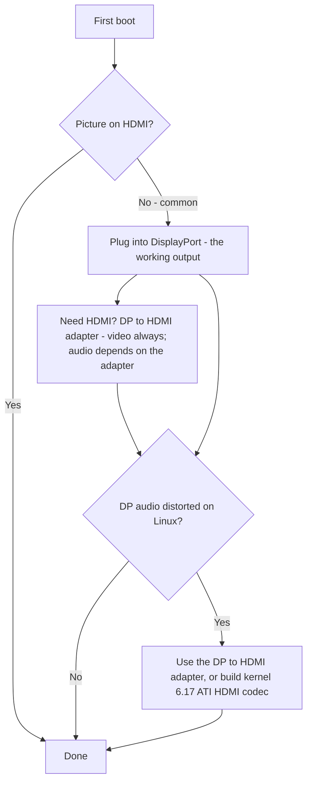

> 🌐 Переклад спільноти. Англійська версія є джерелом істини й може бути новішою. Знайшли помилку? Відкрийте issue: [English](../en/14-display.md) · [issues](https://github.com/lildebil0/awesome-bc250/issues)

# Дисплей і вивід

> **Коротко** — BC-250 виводить зображення на монітор через **DisplayPort**. Саме цей роз'єм треба підключати. Якщо на вашій платі також є порт HDMI, він **часто нічого не показує** — тож чорний екран на ньому *не* означає, що плата мертва, ви просто на не тому виході. Потрібен HDMI? Використовуйте **перехідник DP→HDMI** — **відео проходить завжди, без затримки**; деякі перехідники передають і **звук** (один протестований передавав, [src](https://t.me/c/2424231195/9148)), але звук залежить від конкретного перехідника, тож не розраховуйте на це (див. розділ про звук). Один реальний нюанс: **звук із DisplayPort виходить спотвореним/уповільненим на Linux**; той самий перехідник DP→HDMI обходить це, а належне виправлення на рівні ядра з'являється приблизно у **ядрі 6.17** ([src](https://t.me/c/2424231195/17953), [src](https://t.me/c/2424231195/68051)).

"Немає зображення при першому завантаженні" — це **паніка новачка №1**. Прочитайте блок нижче, перш ніж вирішувати, що щось зламалося.

---

## Немає зображення? Зробіть це

1. **Підключайте до DisplayPort, а не HDMI.** Робочий відеовихід BC-250 — це DisplayPort ([src](https://t.me/c/2424231195/104784)). Порт HDMI (де він є) — це той, що зазвичай порожній; не судіть про плату за ним.
2. **Перевстановіть карту й спробуйте знову.** Плати регулярно не ініціалізуються з першої спроби — зробіть повне вимикання/вмикання (off/on) і фізично перевстановіть карту. Один власник: *"коли моя прийшла, вона теж не увімкнулася з першого разу … інколи вона не ініціалізується повністю при перезавантаженні кнопкою — вимикання/вмикання це виправляє"* ([src](https://t.me/c/2424231195/15701)).
3. **Підозрюйте кабель/перехідник раніше, ніж плату.** З однією картою поганий кабель чи перехідник — головний підозрюваний ([src](https://t.me/c/2424231195/15699)). Деякі перехідники працюють у прошивці, але гаснуть, щойно завантажується ОС — *"зображення було нормальним до GRUB, чорний екран у системі"* ([src](https://t.me/c/2424231195/38184)).
4. **Скиньте BIOS / перепрошийте відомо-робочий образ**, якщо кілька карт з однієї партії не дають зображення — це вказує на прошивку, а не на ваш монітор ([src](https://t.me/c/2424231195/15697), [src](https://t.me/c/2424231195/15705)).

Якщо ви викреслили всі чотири пункти, а зображення все одно немає, переходьте до [troubleshooting.md](troubleshooting.md).



---

## Виходи коротко

| Вихід | Працює? | Примітки |
|--------|--------|-------|
| **DisplayPort** | **Так — це той самий вихід** | Основний/єдиний роз'єм дисплея; передає звук. Специфікація I/O в репозиторії перелічує `1x DisplayPort` ([repo](https://github.com/mothenjoyer69/bc250-documentation)). Це **DisplayPort 1.4**, стеля **4K@120 Hz**, з HDR10 ([elektricM](https://github.com/elektricM/amd-bc250-docs/blob/main/docs/hardware/display.md)). |
| **Порт HDMI** (якщо встановлений) | **Часто порожній** | Новачки думають, що плата мертва; зазвичай це не так — перемкніться на DP. ([src](https://t.me/c/2424231195/104784)) |
| **DP → HDMI через перехідник** | **Відео: так. Звук: залежить від перехідника** | Відео проходить без затримки ([src](https://t.me/c/2424231195/9148)); звук залежить від чипсета — протестуйте його (див. розділ про звук). Також це стандартне виправлення спотворення звуку DP (нижче). |
| **Другий відеовихід** | **Не з коробки** | Електрично присутній, але **не розпаяний**; примусове підключення 2-го монітора потребує хаків, а інші кажуть, що в чипа немає справжньої 2-ї голови — вважайте однооб'єктним виходом як безпечне припущення. ([src](https://t.me/c/2424231195/92978), [src](https://t.me/c/2424231195/104682)) |
| **Другий екран через мережу** | **Так** | Транслюйте вивід BC-250 на іншу машину по LAN (Steam/Sunshine). ([src](https://t.me/c/2424231195/23660)) |

---

## Роздільні здатності, частота оновлення й кабель

Довідник elektricM фіксує, що насправді може один лінк DP — корисно під час вибору монітора чи перехідника ([elektricM](https://github.com/elektricM/amd-bc250-docs/blob/main/docs/hardware/display.md)):

| Роздільна здатність | Частота оновлення | Шлях |
|------------|---------|------|
| 1920×1080 (1080p) | 144 Hz+ | Нативний DP або будь-який перехідник |
| 2560×1440 (1440p) | 144 Hz+ | Нативний DP (пасивні перехідники часто обмежені 1440p@60 / DP 1.2) |
| 3840×2160 (4K) | 60 Hz | Нативний DP або **активний** перехідник DP→HDMI 2.0 |
| 3840×2160 (4K) | 120 Hz | **Тільки нативний DP** — для 4K@120 через HDMI потрібен активний перехідник DP 1.4→HDMI 2.1, і він ненадійний |

- **Кабель:** використовуйте **сертифікований VESA кабель DisplayPort 1.4**, **1–2 м**; довші кабелі спричиняють проблеми синхронізації/випадання сигналу ([elektricM](https://github.com/elektricM/amd-bc250-docs/blob/main/docs/hardware/display.md)).
- **Застрягло на низькій роздільній здатності** (напр. лише 1024×768/1080p, 60 Hz) зазвичай означає, що драйвер GPU не завантажений — перевірте `glxinfo | grep "OpenGL renderer"`; `llvmpipe` = програмний рендеринг, встановіть Mesa 25.1+ і приберіть `nomodeset` ([elektricM](https://github.com/elektricM/amd-bc250-docs/blob/main/docs/troubleshooting/display.md)). Див. [06-linux.md](06-linux.md).
- **HDR (HDR10) і VRR** працюють, але є експериментальними на Linux — **KDE Plasma 6+** має найкращу підтримку і зазвичай потребує сесії Wayland ([elektricM](https://github.com/elektricM/amd-bc250-docs/blob/main/docs/hardware/display.md)). **Дистрибутив тут має значення:** спільнотний звіт з r/BC250Gaming (Reddit) показав, що **HDR + VRR запрацювали як належить лише на CachyOS** (Plasma 6 + Wayland), тоді як на **Bazzite HDR спричиняв графічні глюки, а VRR не працював узагалі**. Їхній приклад: *Forza Horizon 6* на **1440p High, з увімкненими HDR + VRR, 60–80 FPS** через перехідник **UGREEN DP→HDMI 2.1**. Якщо HDR/VRR у пріоритеті, див. примітку про CachyOS у [06-linux.md](06-linux.md).
  - **Якщо ви на Bazzite KDE і хочете VRR/FreeSync через HDMI**, є спільнотний ремікс, що підставляє роботу AMD над HDMI 2.1 / FRL на рівні ядра: **[`dyllan500/bazzite-amd-hdmi-kde`](https://github.com/dyllan500/bazzite-amd-hdmi-kde)** — образ Bazzite KDE, перезібраний на ядрі з офіційними патчами AMD для HDMI-2.1 VRR (з `amd-staging-drm-next`). ⚠ **сильно застерігаємо:** це сторонній образ, автор тестував VRR лише на **Radeon 9070 XT** (не на BC-250), і він має застаріти, щойно патчі потраплять у стокове ядро Bazzite. Це *не* підтверджене виправлення для BC-250 — сприймайте його як експериментальний варіант для спроби, а не як гарантію.

> **Чорний екран *після входу* (GRUB і екран входу були нормальними)** — це проблема сесії робочого столу, зазвичай **Wayland** — оберіть "GNOME on Xorg"/"Plasma (X11)" у шестерінці на екрані входу або встановіть `WaylandEnable=false` у `/etc/gdm/custom.conf` ([elektricM](https://github.com/elektricM/amd-bc250-docs/blob/main/docs/hardware/display.md)). Чорний екран *до* входу — це проблема драйвера/`nomodeset` вище, а не ця.

---

## Звук із DisplayPort спотворений — виправлення через перехідник

На Linux звук, надісланий **напряму з DisplayPort**, виходить на BC-250 неправильно — описують як спотворений, *"розтягнутий, ніби уповільнений удвічі",* з тріском ([src](https://t.me/c/2424231195/9895)). Це **проблема Linux/протоколу DP, а не дефект плати** — її спостерігали і на обладнанні, відмінному від BC-250 ([src](https://t.me/c/2424231195/15983)).

Прямий, надійний обхідний шлях, на якому зупинився чат: **пропустіть сигнал через перехідник DP→HDMI.** Після конвертації в HDMI артефакти звуку зникають ([src](https://t.me/c/2424231195/17953), [src](https://t.me/c/2424231195/51763)). Користувач перевірив це безпосередньо: *"Я протестував вивід звуку через перехідник DisplayPort→HDMI. Усе нормально, без затримки"* ([src](https://t.me/c/2424231195/9148)).

**Найчистіший шлях з усіх — це прямий *кабель* DP→HDMI — штекер DP з одного кінця, штекер HDMI з іншого, без перехідника-донгла чи коробки на жодному з кінців.** Кілька користувачів у спільнотній гілці r/linux_gaming незалежно повідомляють, що це дає найнадійніший звук: звичайний кабель (напр. кабель Amazon Basics DP-to-HDMI, ~$10) "просто працює" там, де перехідники-донгли спрацьовують через раз. Зрідка все ще можливі короткі заглушення звуку, але суцільний кабель прибирає зайвий чипсет перехідника, через який маршрут із донглом стає азартною грою ([r/linux_gaming](https://www.reddit.com/r/linux_gaming/comments/1nvsgji/)). Якщо ви все одно купуєте, **віддавайте перевагу кабелю, а не донглу.**

**Якщо під рукою немає перехідника,** виводьте звук через **Bluetooth** — більшість колонок/гарнітур його підтримують, і це повністю обходить шлях DP ([src](https://t.me/c/2424231195/89769)). Про BT-донгл див. [10-wifi-bt.md](10-wifi-bt.md).

### Примітки щодо перехідників (від спільноти)
- **Для 4K@60+ потрібен *активний* перехідник/кабель** (пасивний обмежений ~1440p@60). Робочий, протестований приклад: **UGREEN DP125 (кабель DP→HDMI 4K)** — заявлений 4K@30, але узгодив 4K@60 на телевізорі ([src](https://t.me/c/2424231195/52398)). Активний vs пасивний визначає стелю роздільної здатності — він **не** вирішує, чи проходить звук (див. нижче).
- **Не всі перехідники передають звук.** Перехідник Belsis одного власника передавав 4K@60 *зі* звуком, тоді як кілька дорожчих пристроїв Ugreen показували "HDMI digital audio" у списку пристроїв, але не виводили звуку — а один зсунув голоси на октаву вниз ([src](https://t.me/c/2424231195/106617)). Якщо ви маєте відео, але немає звуку, перехідник — це змінна; спробуйте інший.
- **Для HDMI-*звуку* спершу беріться за *пасивний* перехідник.** Спільнотна закономірність у гілці r/linux_gaming: **пасивні** перехідники DP→HDMI зазвичай передають звук чисто, тоді як **активні** перехідники часто **повністю втрачають звук або зсувають його за висотою** (голоси, за повідомленнями, сповзають вниз на ~20% / приблизно на квінту). Заковика: активний перехідник *потрібен* лише для справжнього **HDR** (і для 4K@60+), тож це справжній компроміс — пасивний для надійного звуку, активний для HDR. Підтверджені спільнотою робочі *пасивні* варіанти: **Silver Monkey**, **BENFEI (ASIN B017Q8ZVWK)** та **кабель AmazonBasics DP-to-HDMI** (саме суцільний кабель — *не* їхній перехідник-донгл) ([r/linux_gaming](https://www.reddit.com/r/linux_gaming/comments/1nvsgji/)). ⚠ конкретні SKU повідомлені спільнотою, не перевірені в лабораторії — і пасивний перехідник все одно обмежений ~**1440p@60**.
- Дешеві перехідники **4K@60 DP→HDMI**, що передають і відео, і звук, існують і, за повідомленнями, працюють ([src](https://t.me/c/2424231195/133977)).
- Деякі перехідники збоять саме на **4K-моніторах** ([src](https://t.me/c/2424231195/1988)).
- **Звук через перехідник DP→HDMI непослідовний і залежить від чипсета перехідника — а не просто від того, активний він чи пасивний.** Відео проходить завжди; **звук — це змінна.** Наші спільнотні звіти йдуть перехідник за перехідником (пристрої UGREEN/Belsis, за повідомленнями, передавали звук, деякі інші — мовчали), а посібник elektricM повідомляє *протилежний* розподіл (пасивні передають звук, деякі активні мовчать — напр. Cable Matters/StarTech) — і саме тому позначка активний/пасивний цього не передбачає ([elektricM](https://github.com/elektricM/amd-bc250-docs/blob/main/docs/troubleshooting/display.md)). Для **надійного** звуку не ставте на перехідник: віддавайте перевагу **дисплею/AV-ресиверу з нативним DisplayPort** або виводьте звук через **USB (USB DAC/звуковий пристрій)**. Якщо ви все ж використовуєте перехідник, **протестуйте звук, перш ніж на нього покладатися** — і пам'ятайте, що **пасивний** перехідник обмежений ~**1440p@60**.

### Виправлення в ядрі 6.17 (звук напряму з DP, без перехідника)

Якщо ви хочете чистий звук **напряму через DisplayPort** без перехідника, причину й виправлення відстежили в чаті. Стокова конфігурація ядра Fedora збирала `snd-hda-codec-hdmi.ko` + `snd-hdmi-lpe-audio.ko`; **ядро 6.17 змінило шлях звуку HDMI** і зламало звук на тій типовій конфігурації. Виправлення — також зібрати **кодек ATI HDMI**: змініть конфігурацію ядра з `# CONFIG_SND_HDA_CODEC_HDMI_ATI is not set` на `CONFIG_SND_HDA_CODEC_HDMI_ATI=m`, що пакує `snd-hda-codec-atihdmi.ko`; після цього звук працює **без патчів** ([src](https://t.me/c/2424231195/68051), [src](https://t.me/c/2424231195/68061)).

```text
# Fedora kernel config change for DP/HDMI audio on kernel 6.17+
# from:
# CONFIG_SND_HDA_CODEC_HDMI_ATI is not set
# to:
CONFIG_SND_HDA_CODEC_HDMI_ATI=m
```

З наявністю цього третього кодека (`snd-hda-codec-atihdmi.ko`) ALSA відкриває звукові виходи плати (напр. `pcm=3` і `pcm=7` як два пристрої HDMI) ([src](https://t.me/c/2424231195/68062), [src](https://t.me/c/2424231195/67569)). ⚠ перевірте — це потребує збирання кастомного ядра; для більшості користувачів сприймайте перехідник DP→HDMI як шлях без збирання. Про налаштування ядра/драйверів див. [06-linux.md](06-linux.md).

### Об'ємний звук (5.1) — використовуйте USB-звукову карту, а не HDMI

**Об'ємний звук 5.1 через HDMI на BC-250 *не* працює.** Прошивка HDMI від AMD на Linux для цього headless/майнінгового кристала не надає багатоканальний LPCM, тож вихід HDMI відкочується до звичайного стерео незалежно від того, що підтримує ресивер ([r/linux_gaming](https://www.reddit.com/r/linux_gaming/comments/1nvsgji/)). Для справжнього багатоканального звуку виводьте його через **USB-звукову карту / USB DAC** — встановіть її як типовий приймач (sink) у `pavucontrol`, потім підтвердьте всі шість каналів через:

```bash
speaker-test -D pipewire -c 6 -t wav
```

Той самий маршрут через USB-DAC є й надійним виправленням для стереозвуку, коли перехідники збоять (вище).

---

## Другий вихід (спочатку неактивний)

На платі є **другий відеовихід, який не активний з коробки.** Думка спільноти розділена, і варто знати обидві половини:

- Він **електрично присутній, але не розпаяний/не запаяний**, і *"за допомогою хаків можна змусити 2-й монітор працювати"* ([src](https://t.me/c/2424231195/92978)).
- Інші повідомляють, що в чипа просто **немає придатної другої голови** — *"проблема в чипі, другого виходу фізично немає"* ([src](https://t.me/c/2424231195/104682)).

Практично: **припускайте один вихід DisplayPort.** Про DP **MST-сплітер для двох незалежних екранів запитували, але робота не підтверджена** в нашому чаті ([src](https://t.me/c/2424231195/92109)).

**Оновлення від elektricM — MST може керувати двома екранами з правильним хабом.** Тестування elektricM повідомляє до **2 дисплеїв через DP MST-хаб** (пропускна здатність ділиться, роздільна здатність на дисплей обмежена), з результатами для кожного хаба окремо ([elektricM](https://github.com/elektricM/amd-bc250-docs/blob/main/docs/hardware/display.md)):

| MST-хаб | Вихід | Версія DP | Незалежні дисплеї? | Звук | Примітки |
|---------|-----|--------|-----------------------|-------|-------|
| StarTech MST14DP122DP | 2× DP | 1.4 | **Так** | Так | Працював стабільно на різних моніторах/кабелях |
| Monoprice 21972 | 2× DP | 1.2 | **Лише дзеркалення** | Так | Міг лише дзеркалити |
| ENBUER | 2× DP | 1.2 | **Лише дзеркалення** | Так | Міг лише дзеркалити |
| Generic HDMI MST | 2× HDMI | — | **Ні** | Ні | Ні відео, ні звуку |

Тож нативний режим двох моніторів **можливий** через MST із хабом DP 1.4 (StarTech підтверджено); дешевші хаби DP 1.2 можуть лише дзеркалити, а HDMI MST-хаби не спрацювали. ⚠ перевірте — підтверджена лише одна модель хаба; результати залежать від хаба.

**Інший шлях для кількох дисплеїв — USB-перехідник DisplayLink.** Додайте USB→HDMI/DP перехідник DisplayLink для додаткового **робочого** екрана (підключайте *після* завантаження для найкращих результатів). **Не для ігор** — він стискає на CPU, який є вузьким місцем BC-250, тож затримка висока; до того ж він не працює в **режимі гри (game mode)** Steam Deck ([elektricM](https://github.com/elektricM/amd-bc250-docs/blob/main/docs/hardware/display.md)).

---

## Другий екран через мережу (простий "2-й дисплей")

Якщо ви насправді хочете бачити зображення BC-250 на другому пристрої, перевірений шлях — це не другий кабель, а **трансляція по LAN.** Один користувач: *"Я запустив гру Steam на BC-250 (Fedora) і транслював її по мережі на робочий ноутбук, керував нею з ноутбука. Усе працювало"* ([src](https://t.me/c/2424231195/23660)).

- **Sunshine** (кодувальник на хості) тут працює, бо він не лише для NVIDIA — він робить кодування, а клієнт лише декодує ([src](https://t.me/c/2424231195/25091)). По гігабітній LAN це, за повідомленнями, майже бездоганно ([src](https://t.me/c/2424231195/25563)).
- **Moonlight як хост** *не* підходить — він очікує кодувальник NVIDIA і смикається/скаржиться на відсутній апаратний декодер ([src](https://t.me/c/2424231195/25050)). Використовуйте Sunshine як хост, Moonlight лише як клієнт.

Це також практичний спосіб отримати відчуття "подвійного дисплея" без нерозпаяного другого виходу вище.

---

## Джерела

- Перехідник DP→HDMI передає відео+звук, без затримки — https://t.me/c/2424231195/9148
- Спотворення звуку DP — це проблема Linux; перехідник її виправляє — https://t.me/c/2424231195/17953 · https://t.me/c/2424231195/9895 · https://t.me/c/2424231195/51763 · https://t.me/c/2424231195/15983
- Виправлення звуку в ядрі 6.17 (`CONFIG_SND_HDA_CODEC_HDMI_ATI=m`) — https://t.me/c/2424231195/68051 · https://t.me/c/2424231195/68061 · https://t.me/c/2424231195/68062 · https://t.me/c/2424231195/67569
- Робочі перехідники — UGREEN DP125 https://t.me/c/2424231195/52398 · Belsis проти інших (звук варіюється) https://t.me/c/2424231195/106617 · дешевий 4K@60 https://t.me/c/2424231195/133977
- DP — робочий вихід; витратьтеся на хороший перехідник DP→HDMI — https://t.me/c/2424231195/104784
- Немає зображення при першому завантаженні / перевстановлення / перепрошивка — https://t.me/c/2424231195/15697 · https://t.me/c/2424231195/15699 · https://t.me/c/2424231195/15701 · https://t.me/c/2424231195/38184
- Другий вихід присутній, але не розпаяний / спірне питання — https://t.me/c/2424231195/92978 · https://t.me/c/2424231195/104682 · про MST запитували https://t.me/c/2424231195/92109
- Мережевий другий екран (Sunshine/Steam по LAN) — https://t.me/c/2424231195/23660 · https://t.me/c/2424231195/25091 · https://t.me/c/2424231195/25050 · https://t.me/c/2424231195/25563
- Звук через Bluetooth як альтернатива — https://t.me/c/2424231195/89769
- Прямий **кабель** DP→HDMI (без перехідників) — найнадійніший звук; 5.1 через HDMI не працює (немає багатоканального LPCM), використовуйте USB-звукову карту / DAC — спільнотна гілка r/linux_gaming https://www.reddit.com/r/linux_gaming/comments/1nvsgji/
- Довідник апаратного I/O (`1x DisplayPort`) — [mothenjoyer69/bc250-documentation](https://github.com/mothenjoyer69/bc250-documentation) · [`hardware.md`](https://github.com/mothenjoyer69/bc250-documentation/blob/main/hardware.md)
- DP 1.4 / 4K@120 / HDR10, обмеження роздільної здатності+кабелю, MST-хаби (макс. 2), DisplayLink, чорний екран при вході в Wayland — elektricM [`hardware/display.md`](https://github.com/elektricM/amd-bc250-docs/blob/main/docs/hardware/display.md)
- HDR + VRR працюють на CachyOS (Plasma 6 + Wayland) проти зламаних на Bazzite; Forza Horizon 6 1440p High HDR+VRR через UGREEN DP→HDMI 2.1 — спільнотний звіт r/BC250Gaming (Reddit) (див. [06-linux.md](06-linux.md))
- Пасивний DP→HDMI передає звук / активний втрачає або зсуває його за висотою; пасивний, але потрібен для HDR; підтверджені пасивні Silver Monkey / BENFEI B017Q8ZVWK / кабель AmazonBasics DP-to-HDMI — [спільнотна гілка r/linux_gaming](https://www.reddit.com/r/linux_gaming/comments/1nvsgji/)
- Ремікс Bazzite KDE для VRR/FreeSync через HDMI (ядро AMD HDMI 2.1; тестовано на 9070 XT, не на BC-250) — [`dyllan500/bazzite-amd-hdmi-kde`](https://github.com/dyllan500/bazzite-amd-hdmi-kde)
- Звук через перехідник залежить від чипсета (elektricM бачив, що пасивний передає / деякі активні мовчать; спільнота бачила навпаки — тож віддавайте перевагу нативному DP або USB DAC), перевірка низької роздільної здатності через llvmpipe — elektricM [`troubleshooting/display.md`](https://github.com/elektricM/amd-bc250-docs/blob/main/docs/troubleshooting/display.md)

> Налаштування драйвера/ядра — у [06-linux.md](06-linux.md); підводні камені звуку/виводу також проіндексовані в [troubleshooting.md](troubleshooting.md) та [faq.md](faq.md).
