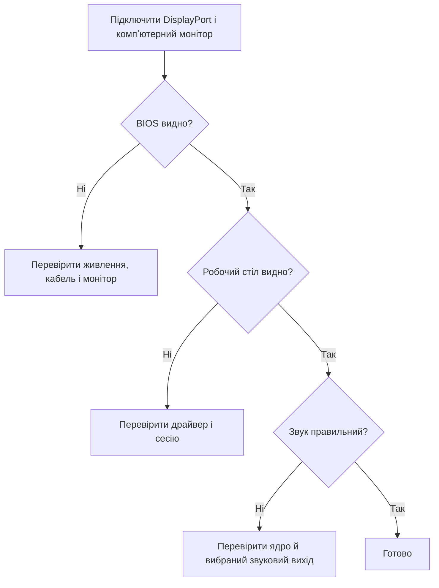

# Дисплей і вивід

> **Почни з нативного DisplayPort і компʼютерного монітора.** Перехідник DP→HDMI — окремий пристрій зі своїми обмеженнями режимів. Якщо DP-звук мовчить, сповільнений чи відстає, спершу перевір ядро, а не купуй перехідник або збирай модуль кодека.

## Немає зображення? Зроби так

1. Використовуй задокументований вихід **DisplayPort**. У штатній специфікації I/O вказано один DP-розʼєм, не другий нативний HDMI.
2. З відʼєднаним БЖ перевір живлення, кабель монітора та кріплення. Спробуй справний DP-кабель і компʼютерний монітор; не перепідключай розʼєми під живленням.
3. **На ТВ/проєкторі не видно BIOS:** екран може не приймати режим прошивки. Для першого налаштування спробуй компʼютерний монітор. Реакція світлодіодів клавіатури — підказка, не повна перевірка POST ([вимоги upstream](https://github.com/elektricM/amd-bc250-docs/blob/954b706f0f2a426385229507c1acba00cc812f66/docs/getting-started/prerequisites.md)).
4. **BIOS видно, робочий стіл — ні:** перевір renderer, журнали firmware та `nomodeset` за [06 — Linux](06-linux.md). Чорний екран лише після входу може бути проблемою сесії; спробуй інше підтримуване оточення до зміни прошивки.
5. Зображення досі немає? Відкрий [діагностику](troubleshooting.md). Темний екран не є приводом стирати SSD чи прошивати BIOS без діагнозу та шляху відновлення ([08 — BIOS](08-bios.md)).


```mermaid
flowchart TD
    A[Підключити DisplayPort і компʼютерний монітор] --> B{BIOS видно?}
    B -->|Ні| C[Перевірити живлення, кабель і монітор]
    B -->|Так| D{Робочий стіл видно?}
    D -->|Ні| E[Перевірити драйвер і сесію]
    D -->|Так| F{Звук правильний?}
    F -->|Ні| G[Перевірити ядро й вибраний звуковий вихід]
    F -->|Так| H[Готово]
```

## Виходи коротко

| Шлях | Чого очікувати |
|---|---|
| Нативний DisplayPort | Основний фізичний вихід. Для звуку потрібні відповідне ядро й правильно вибраний sink. |
| DP→HDMI | Узгодь перехідник, кабель та екран за роздільною здатністю/частотою/HDR. Форма розʼєму не гарантує ні відео, ні звук. |
| DP MST-хаб | Upstream повідомляє про два незалежні екрани зі StarTech MST14DP122DP; частина дешевих хабів лише дзеркалить або не працює. Смуга спільна. |
| USB DisplayLink | Окремий шлях стисненого зображення робочого столу, не другий нативний вихід GPU й не обіцянка ігрової продуктивності. |
| Стрим Steam/Sunshine | Зображення мережею, не додаткова фізична голова дисплея. Sunshine — хост, Moonlight — клієнт. Див. [17](17-projects-and-tools.md). |

[Специфікація I/O](https://github.com/mothenjoyer69/bc250-documentation) і [закріплений гайд дисплеїв](https://github.com/elektricM/amd-bc250-docs/blob/954b706f0f2a426385229507c1acba00cc812f66/docs/hardware/display.md) відокремлюють виходи плати від можливостей перехідника й звітів окремих збірок.

## Роздільна здатність, частота й кабель

Вибери DP-кабель і перевір **увесь ланцюг**, не лише наліпку «8K». Нативний DP та DP→HDMI мають різні обмеження; високі роздільні здатності/частоти через HDMI зазвичай потребують активного перетворювача. Межа пасивного перехідника залежить від моделі, а не дорівнює універсальним 1440p60.

| Мета | Що вибрати й перевірити |
|---|---|
| 1080p/1440p | Нативний DP або перехідник із явною підтримкою потрібного режиму |
| 4K60 через HDMI | Відповідний активний DP→HDMI, HDMI-екран і кабель |
| 4K120 через HDMI | Узгоджені DP 1.4→HDMI 2.1, кабель та екран; upstream повідомляє про збірку з Club3D на 4K120, не про кожен перехідник |
| HDR/VRR | Драйвер GPU, сесія робочого столу, перехідник та екран мають підтримувати потрібний шлях. Звіт про іншу Radeon не підтверджує BC250. |

Низька роздільна здатність разом із `llvmpipe` вказує на програмний рендеринг; виправ його за [06](06-linux.md) до налаштування кабелю. Відгуки про HDR/VRR на CachyOS або Bazzite — датовані спостереження, не універсальний вердикт про ОС. Експериментальний [образ dyllan500](https://github.com/dyllan500/bazzite-amd-hdmi-kde) випробовували на Radeon 9070 XT, не встановлено як виправлення для BC250.

## Звук DisplayPort — діагностика, оновлення, потім обхід

Стара рекомендація звинувачувала прошивку плати або всі активні перехідники. [Upstream відкликав це пояснення в #39](https://github.com/elektricM/amd-bc250-docs/issues/39). У зачепленому драйвері Linux дві помилки clock: велика дає **сповільнення приблизно на 17,7% або тишу**; після лише її виправлення менша може давати **близько 7 секунд відставання за годину**. Повільне браузерне відео за нормальних завантажень може мати ту саму причину через clock PipeWire.

### 1. Перевір ядро й звуковий вихід

```bash
uname -r
wpctl status
```

Вибери потрібний sink DP/HDMI та відокрем тишу від сповільнення/зміни висоти звуку. [Матриця ядер на закріпленій ревізії](https://github.com/elektricM/amd-bc250-docs/blob/954b706f0f2a426385229507c1acba00cc812f66/docs/troubleshooting/audio.md):

| Гілка ядра | Виправлення upstream |
|---|---|
| 7.2+, або 7.1.10+ усередині 7.1 | Обидві помилки clock |
| 6.12.78+, 6.18.20+, 6.19.10+ усередині цих гілок і 7.0 | Велику помилку виправлено; мале відставання може залишитися |
| Старіші зачеплені версії | Велика помилка чи тиша можуть залишатися |

Backport постачальника можуть відрізнятися. Оновлюй систему штатно, збережи робочий deployment/ядро, перезавантажся й перевір `uname -r`; назва образу не є версією ядра. Оновлення та відкат Bazzite — у [06](06-linux.md).

### 2. Якщо оновитися неможливо

- **USB-звук** обходить зачеплений DP-clock.
- **Сумісний пасивний DP++ перехідник** використовує інший шлях clock; вибирай його, лише якщо підходять обмеження відеорежимів.
- **Активний перехідник не є за визначенням зламаним для звуку:** стара помилка ядра зачіпала і нативний DP, і активні пристрої.
- [Weijtmans/bc250-tools](https://github.com/Weijtmans/bc250-tools) містить історичний DTO-watcher для старих ядер. Він пише апаратні регістри й може встановлювати root-сервіс: використовуй його інструкції status/revert та робочий відкат, не копіюй запис регістра чи wildcard. Цей довідник не встановлює його за тебе.

Суцільний кабель DP→HDMI теж може містити перетворювач. Відсутність окремого донгла не робить його «без чипа». Старі відгуки про UGREEN/Belsis/Silver Monkey/BENFEI/AmazonBasics описують конкретні кабелі/перехідники/ядра, не універсальне правило купівлі.

### 3. Відокрем історичну проблему модуля кодека

У частині звітів про Fedora 6.17 бракувало `CONFIG_SND_HDA_CODEC_HDMI_ATI=m` / `snd-hda-codec-atihdmi.ko`. Це окрема проблема пакування, не виправлення display-clock. Перевір модулі поточного ядра й звукові пристрої до пропозиції збирати власне ядро. Перехідник DP→HDMI не є універсальним виправленням відсутніх драйверів.

Історичні повідомлення: [68051](https://t.me/c/2424231195/68051), [68061](https://t.me/c/2424231195/68061), [68062](https://t.me/c/2424231195/68062), [67569](https://t.me/c/2424231195/67569).

### Обʼємний звук

Не виводь підтримку 5.1 із наявності HDMI. Перевір заявлені канали та весь ланцюг ресивера. Старі [звіти спільноти](https://www.reddit.com/r/linux_gaming/comments/1nvsgji/) описували стерео-конфігурації, не неможливість для всіх майбутніх драйверів/перехідників. Відповідний багатоканальний USB-пристрій — альтернатива; перевір справжній розподіл каналів.

## Немає пробудження після простою

Якщо після простою зникають екран і мережа, перевір попереднє завантаження, не оголошуй винним кабель:

```bash
journalctl -b -1 -n 30
cat /sys/power/mem_sleep
```

[Закріплений звіт](https://github.com/elektricM/amd-bc250-docs/blob/954b706f0f2a426385229507c1acba00cc812f66/docs/troubleshooting/display.md) описує ненадійне пробудження з `s2idle`. Журнал, що закінчується `PM: suspend entry (s2idle)` без resume, підтримує цей діагноз. Налаштування простою робочого столу можуть не охоплювати Steam Game Mode.

На підтверджено зачепленій машині вимкни автоматичний suspend у налаштуваннях робочого столу; нижче системний обхід. Він вимикає sleep-targets, **не лише гасить екран**, тому спершу запиши наявні masks:

```bash
sudo systemctl mask sleep.target suspend.target hibernate.target hybrid-sleep.target
# Скасуй лише masks, додані цією процедурою:
sudo systemctl unmask sleep.target suspend.target hibernate.target hybrid-sleep.target
```

Не підміняй Sleep на Shutdown як непояснене налаштування за замовчуванням: це змінює поведінку й може втратити незбережену роботу.

## HDMI-CEC (необовʼязково)

Upstream повідомляє про керування ТВ через активний UGREEN із RTD2173. **`/dev/cec0` не доводить, що перехідник зʼєднує CEC-пін телевізора.** За ввімкненого CEC на ТВ скан має знайти пристрій, крім цього компʼютера:

```bash
cec-ctl -d /dev/cec0 -S
```

Це надсилає проби шиною CEC, не лише перевіряє наявність файла. `cec-ctl` входить до `v4l-utils`. За відмови доступу перевір права вузла/групи; в rpm-ostree група `video`, доступна лише через NSS, потребує окремої обробки, не повторного `usermod` навмання. Див. [закріплений розділ CEC](https://github.com/elektricM/amd-bc250-docs/blob/954b706f0f2a426385229507c1acba00cc812f66/docs/hardware/display.md) та identity/check helpers у [bc250-tools](https://github.com/Weijtmans/bc250-tools). Імʼя, задане вручну, може перезаписувати `cec-onboot`; описаний helper запускає налаштування після нього. CEC сам по собі не гарантує Game Mode/ALLM телевізора.

## Другий екран і стримінг

Для локальних незалежних екранів почни з описаного MST-хаба та перевір потрібний режим на обох моніторах. Для віддаленого зображення використовуй Steam Remote Play або Sunshine як **хост**, Moonlight як **клієнт** ([17](17-projects-and-tools.md)). CPU-кодування, compute-кодування та native VCN — різні шляхи; не передбачається ні обовʼязковий NVIDIA-хост, ні неможливість будь-якого кодування на GPU.

## Джерела й історія

Поточні процедури спираються на закріплені сторінки вище. Ранні спостереження спільноти збережено як свідчення тих збірок, не поточні універсальні інструкції:

- Кабелі/перехідники та звук: [9148](https://t.me/c/2424231195/9148), [17953](https://t.me/c/2424231195/17953), [9895](https://t.me/c/2424231195/9895), [51763](https://t.me/c/2424231195/51763), [15983](https://t.me/c/2424231195/15983), [52398](https://t.me/c/2424231195/52398), [106617](https://t.me/c/2424231195/106617), [133977](https://t.me/c/2424231195/133977), [1988](https://t.me/c/2424231195/1988), [89769](https://t.me/c/2424231195/89769).
- Запуск/вивід: [104784](https://t.me/c/2424231195/104784), [15697](https://t.me/c/2424231195/15697), [15699](https://t.me/c/2424231195/15699), [15701](https://t.me/c/2424231195/15701), [38184](https://t.me/c/2424231195/38184), [15705](https://t.me/c/2424231195/15705).
- Обговорення другого виходу: [92978](https://t.me/c/2424231195/92978), [104682](https://t.me/c/2424231195/104682), [92109](https://t.me/c/2424231195/92109).
- Стримінг мережею: [23660](https://t.me/c/2424231195/23660), [25091](https://t.me/c/2424231195/25091), [25050](https://t.me/c/2424231195/25050), [25563](https://t.me/c/2424231195/25563).

Встановлення GPU: [06](06-linux.md). Діагностика: [Усунення проблем](troubleshooting.md) та [FAQ](faq.md). Локальних вимірювань дисплея, CEC і звуку на BC250 для цієї редакції не проводили.
